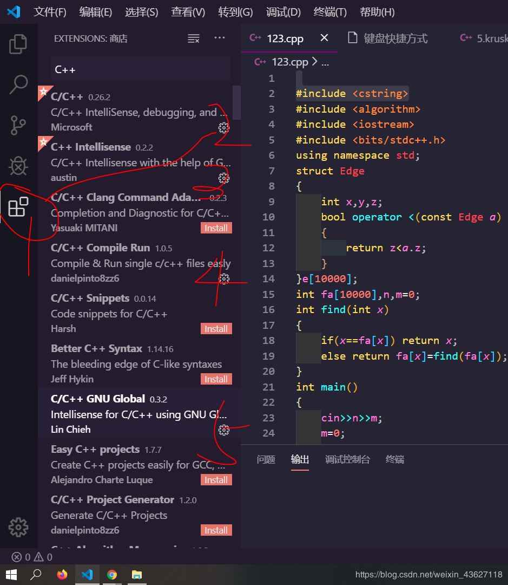

# Windows10配置VSCode C++环境

# (超详细，面向小白以及大佬们)

我看了网上的大佬们配的我是在是看不懂啊？我是一个小白啊？这太难了，这阻挡不了我，想使用这很骚的IDE，于是在不断的摸索下，终于配置成功，小白们也不用慌，这次非常简单。一定可以的。



**1.下载 VS Code**

下载网址：https://code.visualstudio.com/

**2.运行安装程序**

一定不要忘记把Path那一条点上。

**3.装MinGW**

当时我下了半天找不到，这次我放个地址，github放不下这么大的文件，传文件夹的话还得ssh啥的，还不会，将就一下https://www.jb51.net/softs/438773.html

下载完了直接放到C盘根目录下，没多大，只有600M，这样的话，就不用改我配置的路径什么的了！

这样就完事了，然后是配置环境变量。

**4.环境变量**

**会配的直接跳过即可**

找到这两个path，用户和系统变量。

点击新建，然后输入 C:\MinGW\bin

这样环境变量就配置完了

检查 win+R cmd 输入 gcc -v

这样就配完了

**5.倒数第二步**

**下载地址，解压出来** https://github.com/DuYuren/MinGW/tree/vscode

建个文件夹随便什么名字

把我的 .vscode 放里面

**6.最后一步**

然后在刚才那个文件夹里写个C++文件，就可以编译了，F5呦。

**如果纯粹是来找json文件的**
 大佬们改改位置就能用

**c_cpp_properties.json**

```
{
    "configurations": [
      {
        "name": "Win32",
        "includePath": [
          "${workspaceFolder}/**",
          "C:/MinGW/include/*"
        ],
        "defines": [
          "_DEBUG",
          "UNICODE",
          "_UNICODE"
        ],
        "compilerPath": "C:/MinGW/bin/gcc.exe",
        "cStandard": "c11",
        "cppStandard": "c++17",
        "intelliSenseMode": "gcc-x64"
      }
    ],
    "version": 4
  }
```

**launch.json**

[?](https://www.jb51.net/article/176247.htm#)

```
{
    "version": "0.2.0",
    "configurations": [
      {
        "name": "(gdb) Launch",
        "type": "cppdbg",
        "request": "launch",
        "targetArchitecture": "x86",
        "program": "${fileDirname}\\${fileBasenameNoExtension}.exe",
        "miDebuggerPath": "C:\\mingw64\\bin\\gdb.exe",
        "args": [],
        "stopAtEntry": false,
        "cwd": "${fileDirname}",
        "externalConsole": true,
        "preLaunchTask": "g++"
      }
    ]
  }
```

**settings.json**

[?](https://www.jb51.net/article/176247.htm#)

```
{
    "files.associations": {
      "vector": "cpp",
      "random": "cpp",
      "iostream": "cpp",
      "array": "cpp",
      "atomic": "cpp",
      "*.tcc": "cpp",
      "bitset": "cpp",
      "cctype": "cpp",
      "cfenv": "cpp",
      "charconv": "cpp",
      "chrono": "cpp",
      "cinttypes": "cpp",
      "clocale": "cpp",
      "cmath": "cpp",
      "codecvt": "cpp",
      "complex": "cpp",
      "condition_variable": "cpp",
      "csetjmp": "cpp",
      "csignal": "cpp",
      "cstdarg": "cpp",
      "cstddef": "cpp",
      "cstdint": "cpp",
      "cstdio": "cpp",
      "cstdlib": "cpp",
      "cstring": "cpp",
      "ctime": "cpp",
      "cuchar": "cpp",
      "cwchar": "cpp",
      "cwctype": "cpp",
      "deque": "cpp",
      "forward_list": "cpp",
      "list": "cpp",
      "unordered_map": "cpp",
      "unordered_set": "cpp",
      "exception": "cpp",
      "algorithm": "cpp",
      "functional": "cpp",
      "iterator": "cpp",
      "map": "cpp",
      "memory": "cpp",
      "memory_resource": "cpp",
      "numeric": "cpp",
      "optional": "cpp",
      "ratio": "cpp",
      "regex": "cpp",
      "set": "cpp",
      "string": "cpp",
      "string_view": "cpp",
      "system_error": "cpp",
      "tuple": "cpp",
      "type_traits": "cpp",
      "utility": "cpp",
      "fstream": "cpp",
      "future": "cpp",
      "initializer_list": "cpp",
      "iomanip": "cpp",
      "iosfwd": "cpp",
      "istream": "cpp",
      "limits": "cpp",
      "mutex": "cpp",
      "new": "cpp",
      "ostream": "cpp",
      "scoped_allocator": "cpp",
      "shared_mutex": "cpp",
      "sstream": "cpp",
      "stdexcept": "cpp",
      "streambuf": "cpp",
      "thread": "cpp",
      "typeindex": "cpp",
      "typeinfo": "cpp",
      "valarray": "cpp"
    },
    "editor.fontFamily": "Consolas, 'Fira code', monospace",
    "C_Cpp.errorSquiggles": "Disabled"
  }
```

**tasks.json**

[?](https://www.jb51.net/article/176247.htm#)

```
{
    "version": "2.0.0",
    "command": "g++",
    "type": "shell",
    "presentation": {
     "echo": true,
     "reveal": "always",
     "focus": false,
     "panel": "shared",
     "showReuseMessage": true,
     "clear": false
    },
    "args": ["-g", "${file}", "-o", "${fileDirname}\\${fileBasenameNoExtension}.exe"],
    "problemMatcher": {
     "owner": "cpp",
     "fileLocation": ["relative", "${workspaceRoot}"],
     "pattern": {
      "regexp": "^(.*):(\\d+):(\\d+):\\s+(warning|error):\\s+(.*)$",
      "file": 1,
      "line": 2,
      "column": 3,
      "severity": 4,
      "message": 5
     }
    }
   }
```

以上就是本文的全部内容，希望对大家的学习有所帮助，也希望大家多多支持脚本之家。