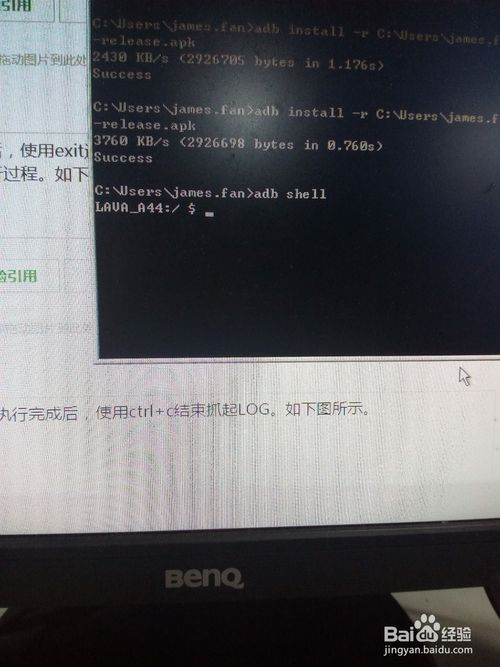
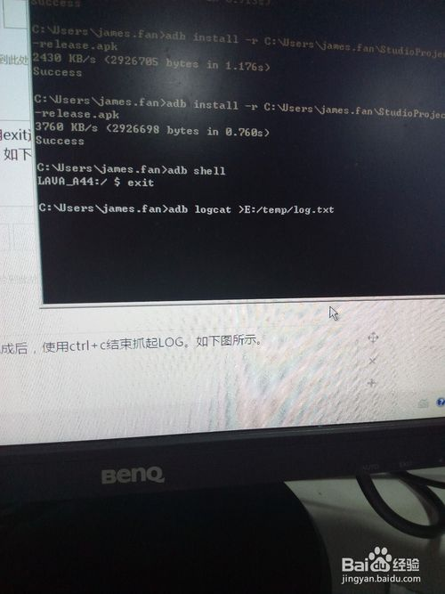
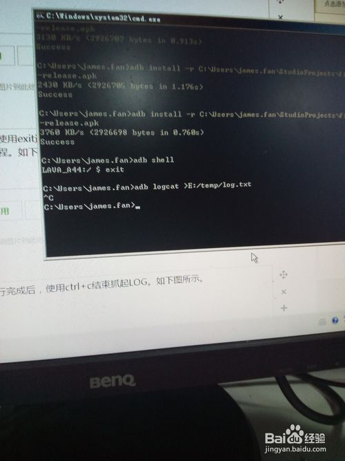
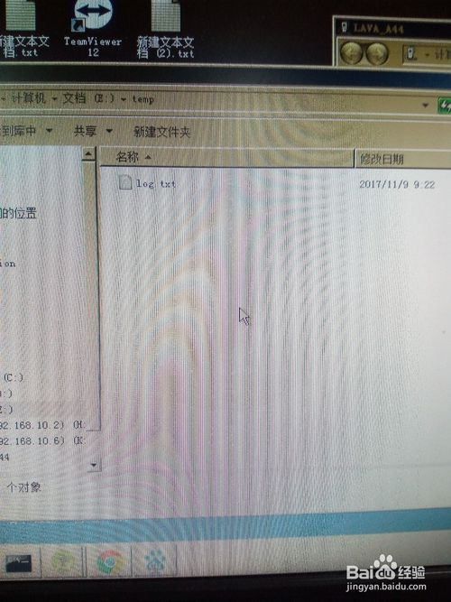
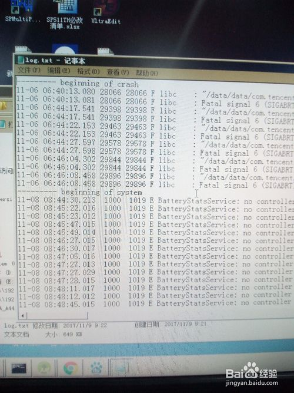

# 使用adb命令如何抓起手机LOG

首先使用USB线连接手机，连接的时候，如果没有打开USB调试，将提示需要打开USB调试。如下图所示。

USB调试打开后，可以使用adb shell命令查看手机和电脑是否连接成功，如下图所示。

连接成功后，使用exit退出shell,然后使用adb logcat >E:/temp/log.txt.命令抓起手机执行过程。如下图所示

手机操作执行完成后，使用ctrl+c结束抓LOG。如下图所示。

此时LOG已经抓取成功，并且保存在电脑E盘的temp文件夹下，如下图所示。

打开log.txt可以查找导致问题的原因。

[步骤阅读](http://jingyan.baidu.com/album/fd8044fa2df9f25030137a73.html?picindex=6)