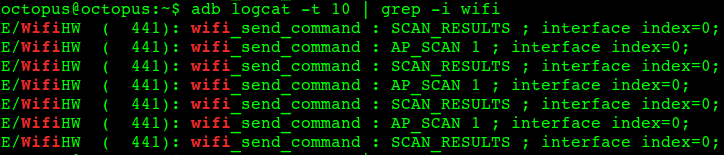
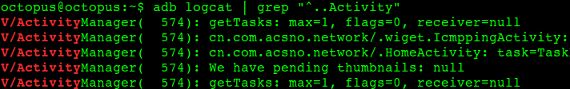

# adb logcat 命令行用法

**本文为转载。**

**作者** :**万境绝尘  转载请著名出处**

eclipse 自带的 LogCat 工具太垃圾了, 开始用 adb logcat 在终端查看日志;

## 1. 解析 adb logcat 的帮助信息

在命令行中输入 **adb logcat --help** 命令, 就可以显示该命令的帮助信息;

[plain]

view plain

copy

1. octopus@octopus:~$ adb logcat --help  
2. Usage: logcat [options] [filterspecs]  
3. options include:  
4.   -s              Set default filter to silent.  
5. ​                  Like specifying filterspec '*:s'  
6.   -f <filename>   Log to file. Default to stdout  
7.   -r [<kbytes>]   Rotate log every kbytes. (16 if unspecified). Requires -f  
8.   -n <count>      Sets max number of rotated logs to <count>, default 4  
9.   -v <format>     Sets the log print format, where <format> is one of:  
10.   
11. ​                  brief process tag thread raw time threadtime long  
12.   
13.   -c              clear (flush) the entire log and exit  
14.   -d              dump the log and then exit (don't block)  
15.   -t <count>      print only the most recent <count> lines (implies -d)  
16.   -g              get the size of the log's ring buffer and exit  
17.   -b <buffer>     Request alternate ring buffer, 'main', 'system', 'radio'  
18. ​                  or 'events'. Multiple -b parameters are allowed and the  
19. ​                  results are interleaved. The default is -b main -b system.  
20.   -B              output the log in binary  
21. filterspecs are a series of   
22.   <tag>[:priority]  
23.   
24. where <tag> is a log component tag (or * for all) and priority is:  
25.   V    Verbose  
26.   D    Debug  
27.   I    Info  
28.   W    Warn  
29.   E    Error  
30.   F    Fatal  
31.   S    Silent (supress all output)  
32.   
33. '*' means '*:d' and <tag> by itself means <tag>:v  
34.   
35. If not specified on the commandline, filterspec is set from ANDROID_LOG_TAGS.  
36. If no filterspec is found, filter defaults to '*:I'  
37.   
38. If not specified with -v, format is set from ANDROID_PRINTF_LOG  
39. or defaults to "brief"  

**adb logcat 命令格式** : adb logcat [选项] [过滤项], 其中 选项 和 过滤项 在 中括号 [] 中, 说明这是可选的;

### (1) 选项解析

**选项解析** : 

-- **"-s"选项** : 设置输出日志的标签, 只显示该标签的日志;

--**"-f"选项** : 将日志输出到文件, 默认输出到标准输出流中, -f 参数执行不成功;

--**"-r"选项** : 按照每千字节输出日志, 需要 -f 参数, 不过这个命令没有执行成功;

--**"-n"选项** : 设置日志输出的最大数目, 需要 -r 参数, 这个执行 感觉 跟 adb logcat 效果一样;

--**"-v"选项** : 设置日志的输出格式, 注意只能设置一项;

--**"-c"选项** : 清空所有的日志缓存信息;

--**"-d"选项** : 将缓存的日志输出到屏幕上, 并且不会阻塞;

--**"-t"选项** : 输出最近的几行日志, 输出完退出, 不阻塞;

--**"-g"选项** : 查看日志缓冲区信息;

--**"-b"选项** : 加载一个日志缓冲区, 默认是 main, 下面详解;

--**"-B"选项** : 以二进制形式输出日志;

.

**输出指定标签内容** : 

-- "-s"选项 : 设置默认的过滤器, 如 我们想要输出 "System.out" 标签的信息, 就可以使用adb logcat -s System.out 命令;

[plain]

view plain

copy

1. octopus@octopus:~$ adb logcat -s System.out  
2. --------- beginning of /dev/log/system  
3. --------- beginning of /dev/log/main  
4. I/System.out(22930): GSM -91  
5. I/System.out(22930): SignalStrength issssssssss : -91  
6. I/System.out(22930): GSM -91  
7. I/System.out(22930): SignalStrength issssssssss : -91  
8. I/System.out(22930): Supervisor Thread  
9. I/System.out(22930): Got run mode  

**输出日志信息到文件** : 

-- **"-f"选项** : 该选向后面跟着输入日志的文件, 使用**adb logcat -f /sdcard/log.txt** 命令, 注意这个log文件是输出到手机上，需要指定合适的路径。

[plain]

view plain

copy

1. octopus@octopus:~$ adb logcat -f /sdcard/log.txt   

这个参数对对不能一直用电脑连着手机收集日志的场景非常有用，其实android shell下也有一个相同参数的logcat命令。使用如下命令可以执行后断开PC和手机持续收集LOG。

[plain]

view plain

copy

1. shell@pc$ adb shell  
2. shell@android$ logcat -f /sdcard/log.txt &   #这里的&符号表示后台执行，别少了。  
3. shell@android$ exit  

注：

（1）以上shell@pc$ 指在pc的shell终端执行后边的命令， shell@android$ 表示在手机shell中执行后边的命令l

（2）一定注意合适的时候需要停止掉以上命令，否则再次使用相同命令的时候，就会有两个logcat写同一个文件了

​          停止方法:  adb shell kill -9 <logcat_pid>         

​           其中logcat_pid 通过 如下命令获取

​           adb shell ps | grep logcat          # linux 平台

​           adb shell ps | findstr "logcat"    #Windows平台

-- **">"输出** : ">" 后面跟着要输出的日志文件, 可以将 logcat 日志输出到文件中, 使用**adb logcat > log** 命令, 使用**more log** 命令查看日志信息;

[plain]

view plain

copy

1. octopus@octopus:~$ adb logcat > log  
2. ^C  
3. octopus@octopus:~$ more log  
4. --------- beginning of /dev/log/system  
5. V/ActivityManager(  500): We have pending thumbnails: null  
6. V/ActivityManager(  500): getTasks: max=1, flags=0, receiver=null  
7. V/ActivityManager(  500): com.android.settings/.Settings: task=TaskRecord{42392278 #448 A com.android.settings U 0}  
8. V/ActivityManager(  500): We have pending thumbnails: null  

-- **" -d -f <log>" 组合命令**：可以将日志保存到手机上的指定位置，对不能一直用电脑连着手机收集日志的场景非常有用。

[plain]

view plain

copy

1. adb logcat -d -v /sdcard/mylog.txt  

**指定 logcat 的日志输出格式** : 

-- **"-v"选项** : 使用**adb logcat -v time** 命令, 可以啥看日志的输出时间;

​              使用**adb logcat -v threadtime** 命令, 可以啥看日志的输出时间和线程信息;

-- **"brief"格式** : 这是默认的日志格式**" 优先级 / 标签 (进程ID) : 日志信息 "**, 使用**adb logcat -v prief**命令;

[plain]

view plain

copy

1. octopus@octopus:~$ adb logcat -v brief  
2. --------- beginning of /dev/log/system  
3. D/PowerManagerService(  500): handleSandman: canDream=true, mWakefulness=Awake  
4. D/PowerManagerService(  500): releaseWakeLockInternal: lock=1101267696, flags=0x0  

\-- 

"process"格式

 : 

" 优先级 (进程ID) : 日志信息 "

, 使用

adb logcat -v process

 命令;

[plain]

view plain

copy

1. octopus@octopus:~$ adb logcat -v process  
2. --------- beginning of /dev/log/system  
3. D(  500) MobileDataStateReceiver received: ACTION_ANY_DATA_CONNECTION_STATE_CHANGED_MOBILE [wap]  (MobileDataStateTracker)  
4. V(  500) Broadcast: Intent { act=android.intent.action.ANY_DATA_STATE_MOBILE flg=0x10 (has extras) } ordered=true userid=0  (ActivityManager)  
5. D(  500) wap: Intent from SIM 0, current SIM 0, current DataState DISCONNECTED  (MobileDataStateTracker)  
6. D(  500) wap: wap setting isAvailable to false  (MobileDataStateTracker)  
7. D(  500) wap: Received state=DISCONNECTED, old=DISCONNECTED, reason=dataDetached  (MobileDataStateTracker)  
8. D(  500) BDC-Calling finishReceiver: IIntentReceiver=41c46ba0  (ActivityThread)  

\-- 

"tag"格式

 : 

" 优先级 / 标签 : 日志信息"

, 使用

adb logcat -v tag

 命令;

[plain]

view plain

copy

1. octopus@octopus:~$ adb logcat -v tag  
2. --------- beginning of /dev/log/system  
3. I/PowerManagerService: setBrightness mButtonLight 0.  
4. D/PowerManagerService: updateScreenStateLocked: mDisplayReady=true, newScreenState=2, mWakefulness=1, mWakeLockSummary=0x1, mUserActivitySummary=0x1, mBootCompleted=true  
5. D/PowerManagerService: handleSandman: canDream=true, mWakefulness=Awake  

\-- 

"thread"格式

 : 

" 优先级 ( 进程ID : 线程ID) 标签 : 日志内容 "

, 使用

adb logcat -v tag

 命令;

[plain]

view plain

copy

1. octopus@octopus:~$ adb logcat -v thread  
2. --------- beginning of /dev/log/system  
3. V(  500: 2141) getTasks: max=1, flags=0, receiver=null  
4. V(  500: 2141) com.lewa.launcher/.Launcher: task=TaskRecord{41dccc20 #425 A com.lewa.launcher U 0}  
5. V(  500: 2141) We have pending thumbnails: null  
6. V(  500: 2140) getTasks: max=1, flags=0, receiver=null  

\-- 

"raw"格式

 : 只输出日志信息, 不附加任何其他 信息, 如 优先级 标签等, 使用

adb logcat -v raw

 命令;

[plain]

view plain

copy

1. octopus@octopus:~$ adb logcat -v raw  
2. --------- beginning of /dev/log/system  
3. notifications are enabled for com.kindroid.security  
4. Assigned score=0 to Notification(pri=0 contentView=com.kindroid.security/0x7f030052 vibrate=null sound=null defaults=0x0 flags=0x2 kind=[null])  
5. Native set alarm :Alarm{41e1ca00 type 3 com.kindroid.security}  
6. reset poweroff alarm none  

\-- 

"time"格式 

: 

"日期 时间 优先级 / 标签 (进程ID) : 进程名称 : 日志信息 "

, 使用

adb logcat -v time

 命令;

[plain]

view plain

copy

1. octopus@octopus:~$ adb logcat -v time  
2. --------- beginning of /dev/log/system  
3. 04-25 17:18:13.019 V/ActivityManager(  500): Broadcast sticky: Intent { act=android.intent.action.SIG_STR flg=0x10 (has extras) } ordered=false userid=-1  
4. 04-25 17:18:13.157 V/NotificationService(  500): enqueueNotificationInternal: pkg=com.kindroid.security id=1020 notification=Notification(pri=0 contentView=com.kindroid.security/0x7f030052 vibrate=null sound=null defaults=0x0 flags=0x2 kind=[null])  
5. 04-25 17:18:13.158 V/NotificationService(  500): notifications are enabled for com.kindroid.security  
6. 04-25 17:18:13.158 V/NotificationService(  500): Assigned score=0 to Notification(pri=0 contentView=com.kindroid.security/0x7f030052 vibrate=null sound=null defaults=0x0 flags=0x2 kind=[null])  
7. 04-25 17:18:13.555 V/ActivityManager(  500): getTasks: max=1, flags=0, receiver=null  

\-- 

"long"格式

:

" [ 日期 时间 进程ID : 线程ID 优先级 / 标签] 日志信息 "

, 输出以上提到的所有的头信息, 使用

**adb logcat -v long**

 命令;

[plain]

view plain

copy

1. octopus@octopus:~$ adb logcat -v long  
2. --------- beginning of /dev/log/system  
3. [ 04-25 17:21:18.118   500:0x2fe V/ActivityManager ]  
4. We have pending thumbnails: null  
5.   
6. [ 04-25 17:21:18.696   593:0x251 W/ActivityThread ]  
7. Content provider com.android.providers.telephony.TelephonyProvider already published as telephony  
8.   
9. [ 04-25 17:21:19.119   500:0x396 V/ActivityManager ]  
10. getTasks: max=1, flags=0, receiver=null  

清空日志缓存信息

 : 使用 

adb logcat -c

 命令, 可以将之前的日志信息清空, 重新开始输出日志信息;

将缓存日志输出

 : 使用 

adb logcat -d

 命令, 输出命令, 之后推出命令, 不会进行阻塞;

**输出最近的日志** : 使用**adb logcat -t 5** 命令, 可以输出最近的5行日志, 并且不会阻塞;

[plain]

view plain

copy

1. octopus@octopus:~$ adb logcat -t 5  
2. --------- beginning of /dev/log/system  
3. --------- beginning of /dev/log/main  
4. W/ADB_SERVICES(10028): adb: unable to open /proc/10028/oom_adj  
5. D/dalvikvm(23292): threadid=11: created from interp  
6. D/dalvikvm(23292): start new thread  
7. D/dalvikvm(23292): threadid=11: notify debugger  
8. D/dalvikvm(23292): threadid=11 (Thread-24538): calling run()  
9. octopus@octopus:~$   

查看日志缓冲区信息

 : 使用 

adb logcat -g

 命令;

[plain]

view plain

copy

1. octopus@octopus:~$ adb logcat -g  
2. /dev/log/main: ring buffer is 256Kb (255Kb consumed), max entry is 5120b, max payload is 4076b  
3. /dev/log/system: ring buffer is 256Kb (255Kb consumed), max entry is 5120b, max payload is 4076b  
4. octopus@octopus:~$   

加载日志缓冲区

 : 使用 

adb logcat -b 缓冲区类型

 命令;

-- **Android中的日志缓冲区** : system缓冲区 - 与系统相关的日志信息, radio缓冲区 - 广播电话相关的日志信息, events缓冲区 - 事件相关的日志信息, main缓冲区 - 默认的缓冲区;

[plain]

view plain

copy

1. octopus@octopus:~$ adb logcat -b radio -t 5  
2. D/PHONE   (23599): [GeminiDataSubUtil] UAPP_C6-4  
3. D/GSM     (23599): [GDCT][simId1]apnType = default  
4. D/GSM     (23599): [GDCT][simId1]isDataAllowed: not allowed due to - gprs= 1 - SIM not loaded - desiredPowerState= false  
5. D/GSM     (23599): [GDCT][simId1]isDataPossible(default): possible=false isDataAllowed=false apnTypePossible=true apnContextisEnabled=true apnContextState()=IDLE  
6. I/MUXD    (23591): [gsm0710muxd] 3426:main(): Frames received/dropped: 18242/0  
7. octopus@octopus:~$   
8. octopus@octopus:~$ adb logcat -b main -t 5  
9. D/NotificationService(  500): notification.sound=null  
10. D/NotificationService(  500): mDmLock=false  
11. I/ATCIJ   (16576): Couldn't find 'atci-serv-fw' socket; retrying after timeout  
12. W/ADB_SERVICES(  246): create_local_service_socket() name=shell:export ANDROID_LOG_TAGS="" ; exec logcat -b main -t 5  
13. W/ADB_SERVICES(16815): adb: unable to open /proc/16815/oom_adj  
14. octopus@octopus:~$   
15. octopus@octopus:~$ adb logcat -b system -t 5  
16. D/PowerManagerService(  500): updateScreenStateLocked: mDisplayReady=true, newScreenState=0, mWakefulness=0, mWakeLockSummary=0x1, mUserActivitySummary=0x0, mBootCompleted=true  
17. D/PowerManagerService(  500): handleSandman: canDream=false, mWakefulness=Asleep  
18. V/NotificationService(  500): enqueueNotificationInternal: pkg=com.kindroid.security id=1020 notification=Notification(pri=0 contentView=com.kindroid.security/0x7f030052 vibrate=null sound=null defaults=0x0 flags=0x2 kind=[null])  
19. V/NotificationService(  500): notifications are enabled for com.kindroid.security  
20. V/NotificationService(  500): Assigned score=0 to Notification(pri=0 contentView=com.kindroid.security/0x7f030052 vibrate=null sound=null defaults=0x0 flags=0x2 kind=[null])  
21. octopus@octopus:~$   
22. octopus@octopus:~$ adb logcat -b event -t 5  
23. Unable to open log device '/dev/log/event': No such file or directory  
24. octopus@octopus:~$ adb logcat -b events -t 5  
25. I/notification_cancel(  500): [com.kindroid.security,1026,NULL,0,0,64]  
26. I/notification_enqueue(  500): [com.kindroid.security,1020,NULL,0,Notification(pri=0 contentView=com.kindroid.security/0x7f030052 vibrate=null sound=null defaults=0x0 flags=0x2 kind=[null])]  
27. I/notification_cancel(  500): [com.kindroid.security,1026,NULL,0,0,64]  
28. I/notification_enqueue(  500): [com.kindroid.security,1020,NULL,0,Notification(pri=0 contentView=com.kindroid.security/0x7f030052 vibrate=null sound=null defaults=0x0 flags=0x2 kind=[null])]  
29. I/notification_cancel(  500): [com.kindroid.security,1026,NULL,0,0,64]  
30. octopus@octopus:~$   

以二进制形式输出日志

 : 使用 

adb logcat -B

 命令;

[plain]

view plain

copy

1. octopus@octopus:~$ adb logcat -B  -t 5  
2. O��_�3ZS�4gps_mt3326nmea_reader_parse: line = 1218GPS get accuracy failed, fix mode:1  
3. ^��_�3ZS�=gps_mt3326nmea_reader_addc: line = 1331the structure include nmea_cb address is 0x658cc8e8  
4. H��_�3ZSEGEgps_mt3326nmea_reader_addc: line = 1332nmea_cb address is 0x5d2fe279  
5. i���3ZS�)>ADB_SERVICEScreate_local_service_socket() name=shell:export ANDROID_LOG_TAGS="" ; exec logcat -B -t 5  
6. 7*E*E�3ZSo�YADB_SERVICESadb: unable to open /proc/17706/oom_adj  

### (2) 过滤项解析

**过滤项格式** : <tag>[:priority] , 标签:日志等级, 默认的日志过滤项是 " *:I " ;

-- **V** : Verbose (明细);

-- **D** : Debug (调试);

-- **I** : Info (信息);

-- **W** : Warn (警告);

-- **E** : Error (错误);

-- **F**: Fatal (严重错误);

-- **S** : Silent(Super all output) (最高的优先级, 可能不会记载东西);

**过滤指定等级日志** : 使用 **adb logcat 10 \*:E** 命令, 显示 Error 以上级别的日志;

[plain]

view plain

copy

1. octopus@octopus:~$ adb logcat *:E  
2.   
3. Note: log switch off, only log_main and log_events will have logs!  
4. --------- beginning of /dev/log/main  
5. E/WifiHW  (  441): wifi_send_command : SCAN_RESULTS ; interface index=0;  
6. E/WifiHW  (  441): wifi_send_command : AP_SCAN 1 ; interface index=0;  
7. E/WifiHW  (  441): wifi_send_command : SCAN_RESULTS ; interface index=0;  
8. E/dalvikvm(  756): GC_CONCURRENT freed 1809K, 27% free 19489K/26695K, paused 16ms+5ms, total 109ms  
9. E/WifiHW  (  441): wifi_send_command : SCAN ; interface index=0;  
10. E/WifiHW  (  441): wifi_send_command : AP_SCAN 1 ; interface index=0;  
11. E/WifiHW  (  441): wifi_send_command : SCAN_RESULTS ; interface index=0;  
12. E/dalvikvm(  756): GC_CONCURRENT freed 1820K, 27% free 19490K/26695K, paused 16ms+3ms, total 102ms  
13. E/WifiHW  (  441): wifi_send_command : AP_SCAN 1 ; interface index=0;  
14. E/WifiHW  (  441): wifi_send_command : SCAN_RESULTS ; interface index=0;  

**过滤指定标签等级日志** : 使用 **adb logcat WifiHW:D \*:S** 命令进行过滤;

-- **命令含义** : 输出10条日志, 日志是 标签为 WifiHW, 并且优先级 Debug(调试) 等级以上的级别的日志;

--**注意 \*:S** : 如果没有 *S 就会输出错误;

[plain]

view plain

copy

1. octopus@octopus:~$ adb logcat WifiHW:D *:S  
2.   
3. Note: log switch off, only log_main and log_events will have logs!  
4. --------- beginning of /dev/log/main  
5. E/WifiHW  (  441): wifi_send_command : SCAN_RESULTS ; interface index=0;  
6. E/WifiHW  (  441): wifi_send_command : AP_SCAN 1 ; interface index=0;  
7. E/WifiHW  (  441): wifi_send_command : SCAN_RESULTS ; interface index=0;  
8. E/WifiHW  (  441): wifi_send_command : AP_SCAN 1 ; interface index=0;  
9. E/WifiHW  (  441): wifi_send_command : SCAN_RESULTS ; interface index=0;  
10. E/WifiHW  (  441): wifi_send_command : AP_SCAN 1 ; interface index=0;  
11. E/WifiHW  (  441): wifi_send_command : SCAN_RESULTS ; interface index=0;  

**可以同时设置多个过滤器** : 使用**adb logcat WifiHW:D dalvikvm:I \*:S** 命令, 输出 WifiHW 标签 的 Debug 以上级别 和 dalvikvm 标签的 Info 以上级别的日志;

[plain]

view plain

copy

1. octopus@octopus:~$ adb logcat WifiHW:D dalvikvm:I *:S   
2.   
3. Note: log switch off, only log_main and log_events will have logs!  
4. --------- beginning of /dev/log/main  
5. E/WifiHW  (  441): wifi_send_command : AP_SCAN 1 ; interface index=0;  
6. E/WifiHW  (  441): wifi_send_command : SCAN_RESULTS ; interface index=0;  
7. E/dalvikvm(  756): GC_CONCURRENT freed 1820K, 27% free 19490K/26695K, paused 17ms+2ms, total 110ms  
8. E/WifiHW  (  441): wifi_send_command : AP_SCAN 1 ; interface index=0;  
9. E/WifiHW  (  441): wifi_send_command : SCAN_RESULTS ; interface index=0;  
10. E/WifiHW  (  441): wifi_send_command : AP_SCAN 1 ; interface index=0;  
11. E/WifiHW  (  441): wifi_send_command : SCAN_RESULTS ; interface index=0;  
12. E/dalvikvm(  756): GC_CONCURRENT freed 1810K, 27% free 19489K/26695K, paused 17ms+5ms, total 108ms  
13. E/WifiHW  (  441): wifi_send_command : AP_SCAN 1 ; interface index=0;  
14. E/WifiHW  (  441): wifi_send_command : SCAN_RESULTS ; interface index=0;  

## 2. 使用管道过滤日志

### (1) 过滤固定字符串

**过滤固定字符串** : 只要命令行出现的日志都可以过滤, 不管是不是标签;

-- **命令** : **adb logcat | grep Wifi** ;

[plain]

view plain

copy

1. octopus@octopus:~$ adb logcat | grep Wifi  
2. E/WifiHW  (  441): wifi_send_command : AP_SCAN 1 ; interface index=0;  
3. E/WifiHW  (  441): wifi_send_command : SCAN_RESULTS ; interface index=0;  
4. E/WifiHW  (  441): wifi_send_command : SCAN ; interface index=0;  
5. E/WifiHW  (  441): wifi_send_command : AP_SCAN 1 ; interface index=0;  
6. E/WifiHW  (  441): wifi_send_command : SCAN_RESULTS ; interface index=0;  
7. E/WifiHW  (  441): wifi_send_command : AP_SCAN 1 ; interface index=0;  
8. E/WifiHW  (  441): wifi_send_command : SCAN_RESULTS ; interface index=0;  

**过滤字符串忽略大小写** : **adb logcat | grep -i wifi** ;

### (2) 使用正则表达式匹配

**分析日志** : 该日志开头两个字符是 "V/", 后面开始就是标签, 写一个正则表达式 "^..ActivityManager", 就可以匹配日志中的 "V/ActivityManager" 字符串;

[plain]

view plain

copy

1. V/ActivityManager(  574): getTasks: max=1, flags=0, receiver=null  

**正则表达式过滤日志**: 使用上面的正则表达式组成命令 **adb logcat | grep "^..Activity"** ;

