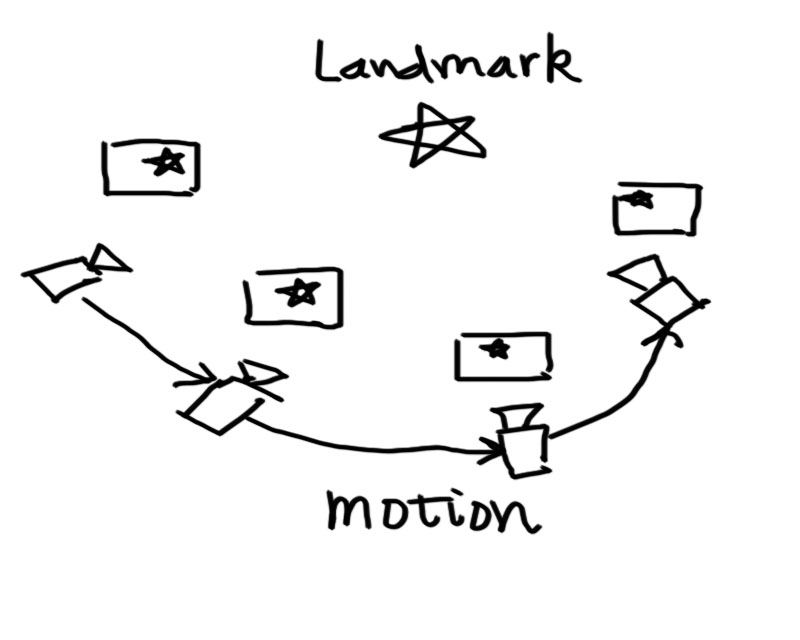
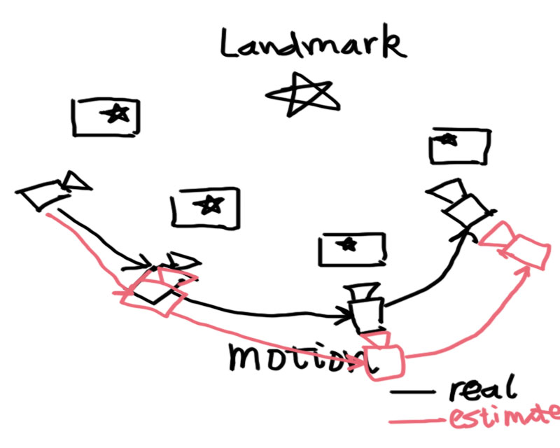
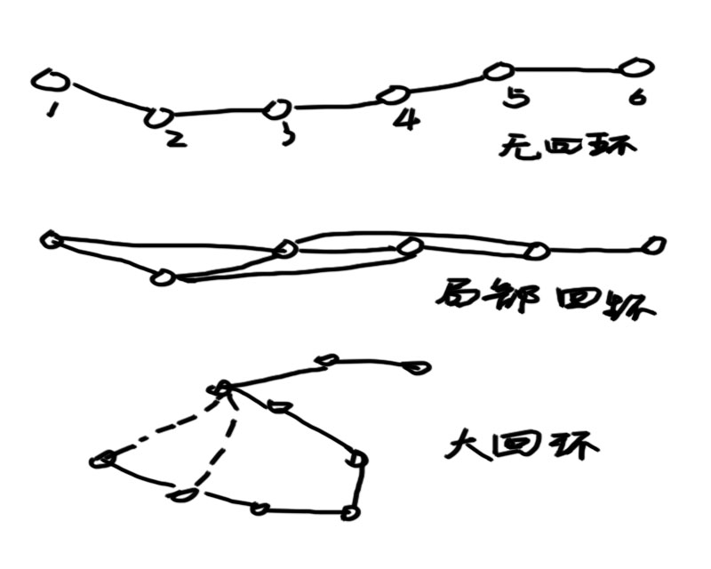
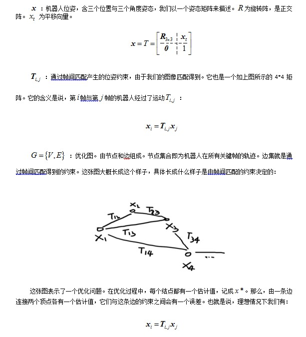
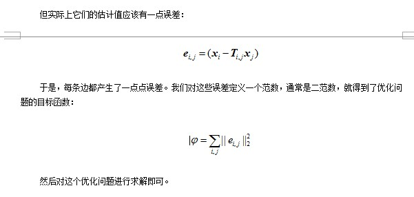
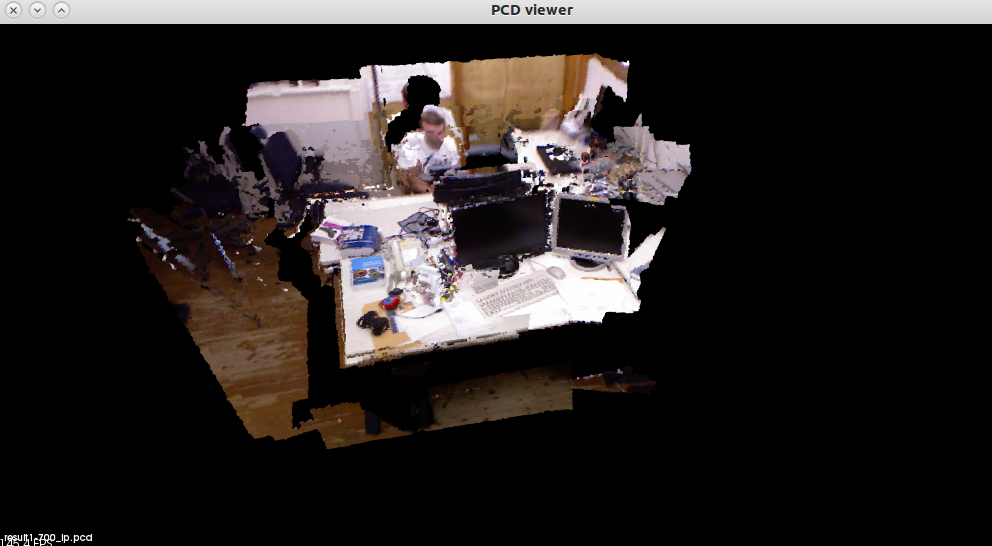
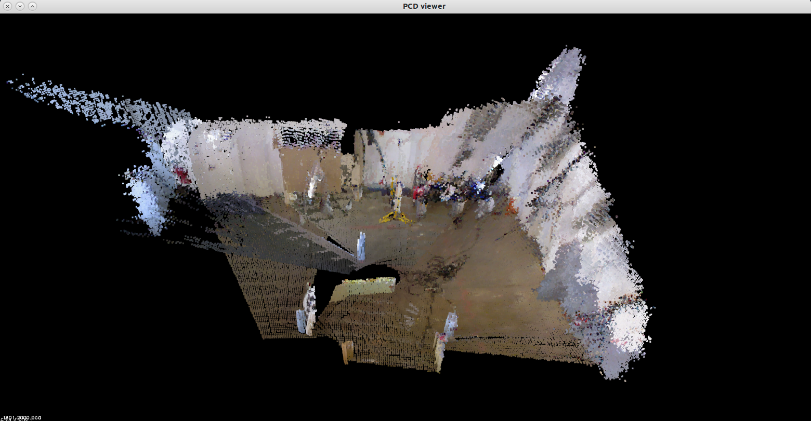

# 视觉SLAM漫谈（二）:图优化理论与g2o的使用

## 1    前言以及回顾

 

　　各位朋友，自从上一篇《视觉SLAM漫谈》写成以来已经有一段时间了。我收到几位热心读者的邮件。有的希望我介绍一下当前视觉SLAM程序的实用程度，更多的人希望了解一下前文提到的g2o优化库。因此我另写一篇小文章来专门介绍这个新玩意。

 

　　在开始本篇文章正文以前，我们先来回顾一下图优化SLAM问题的提法。至于SLAM更基础的内容，例如SLAM是什么东西等等，请参见上一篇文章。我们直接进入较深层次的讨论。首先，关于我们要做的事情，你可以这样想：

 

　　l   已知的东西：传感器数据（图像，点云，惯性测量设备等）。我们的传感器主要是一个Kinect，因此数据就是一个视频序列，说的再详细点就是一个RGB位图序列与一个深度图序列。至于惯性测量设备，可以有也可以没有。

 

　　l   待求的东西：机器人的运动轨迹，地图的描述。运动轨迹，画出来应该就像是一条路径。而地图的描述，通常是点云的描述。但是点云描述是否可用于导航、规划等后续问题，还有待研究。

 

　　这两个点之间还是有挺长的路要走的。如果我们使用图优化，往往会在整个视频序列中，定义若干个关键帧：

 

　　这个图着实画的有点丑，请大家不要吐槽……不管怎么说，它表达出我想表达的意思。在这张图中，我们有一个路标点（五角星），并在各个关键帧中都看到了这个点。于是，我们就能用PnP或ICP求解相邻关键点的运动方向。这些在上篇文章都介绍过了，包括特征选择，匹配及计算等等。那么，这个过程中有什么问题呢？

## 2    为什么要用全局优化

　　你一定已经注意到，理想的计算总和实际有差距的。好比说理想的科研就是“看论文——产生想法——做实验——发文章”，那么现实的科研就是“看论文——产生想法——做实验——发现该想法在二十年前就有人做过了”，这样一个过程。实际当中，仅通过帧间运动（ego-motion）来计算机器人轨迹是远远不够的。如下图所示：

　　

　　

　　如果你只用帧间匹配，那么每一帧的误差将对后面所有的运动轨迹都要产生影响。例如第二帧往右偏了0.1，那么后面第三、四、五帧都要往右偏0.1，还要加上它们自己的估算误差。所以结果就是：当程序跑上十几秒之后早就不知道飞到哪儿去了。这是经典的SLAM现象，在EKF实现中，也会发现，当机器人不断运动时，不确定性会不断增长。当然不是我们所希望的结果。

　　那么怎么办才好呢？想象你到了一个陌生的城市，安全地走出了火车站，并在附近游荡了一会儿。当你走的越远，看到许多未知的建筑。你就越搞不清楚自己在什么地方。如果是你，你会怎么办？

　　通常的做法是认准一个标志性建筑物，在它周围转上几圈，弄清楚附近的环境。然后再一点点儿扩大我们走过的范围。在这个过程中，我们会时常回到之前已经见过的场景，因此对它周围的景象就会很熟悉。

　　机器人的情形也差不多，除了大多数时候是人在遥控它行走。因而我们希望，机器人不要仅和它上一个帧进行比较，而是和更多先前的帧比较，找出其中的相似之处。这就是所谓的回环检测（Loop closure detection）。用下面的示意图来说明：

　　

　　没有回环时，由于误差对后续帧产生影响，机器人路径估计很不稳定。加上一些局部回环，几个相邻帧就多了一些约束，因而误差就减少了。你可以把它看成一个由弹簧连起来的链条（质点-弹簧模型）。当机器人经过若干时间，回到最初地方时，检测出了大回环时，整个环内的结构都会变得稳定很多。我们就可以籍此知道一个房间是方的还是圆的，面前这堵墙对应着以前哪一堵墙，等等。

　　相信讲到这里，大家对回环检测都有了一个感性的认识。那么，这件事情具体是怎么建模，怎么计算，怎么编程呢？下面我们就一步步来介绍。

## 3    图优化的数学模型

　　SLAM问题的优化模型可以有几种不同的建模方式。我们挑选其中较简单的一种进行介绍，即FrameSLAM，在2008年提出。它的特点是只用位姿约束而不用特征约束，减少了很多计算量，表达起来也比较直观。下面我们给出一种6自由度的3D SLAM建模方法。

　　符号：

　　

　　注意到这里的建模与前文有所不同，是一个简化版的模型。因为我们假设帧间匹配时得到了相邻帧的变换矩阵，而不是把所有特征也放到优化问题里面来。所以这个模型看上去相对简单。但是它很实用，因为不用引入特征，所以结点和边的数量大大减少，要知道在图像里提特征动辄成百上千的。

## 4    g2o是什么

　　g2o，就是对上述问题的一个求解器。它原理上是一个通用的求解器，并不限定于某些SLAM问题。你可以用它来求SLAM，也可以用ICP,  PnP以及其他你能想到的可以用图来表达的优化问题。它的代码很规范，就是有一个缺点：文档太少。唯一的说明文档还有点太装叉（个人感觉）了，有点摆弄作者数学水平的意思，反正那篇文档很难懂就是了。话说程序文档不应该是告诉我怎么用才对么……

　　言归正传。如果你想用g2o，请去它的github上面下载：<https://github.com/RainerKuemmerle/g2o>

　　它的API在：<http://www.rock-robotics.org/stable/api/slam/g2o/classg2o_1_1HyperGraph.html>

### 4.1     安装

　　g2o是一个用cmake管理的C++工程，我是用Linux编译的，所以不要问我怎么在win下面用g2o，因为我也不会……不管怎么说，你下载了它的zip包或者用git拷下来之后，里面有一个README文件。告诉你它的依赖项。在ubuntu下，直接键入命令：

　　sudo apt-get install cmake libeigen3-dev libsuitesparse-dev libqt4-dev qt4-qmake libqglviewer-qt4-dev

　　我个人感觉还要  libcsparse-dev和freeglut3这两个库，反正多装了也无所谓。注意libqglviewer-qt4-dev只在ubuntu  12.04库里有，14.04  里换成另一个库了。g2o的可视化工具g2o_viewer是依赖这个库的，所以，如果你在14.04下面编，要么是去把12.04那个deb（以及它的依赖项）找出来装好，要么用ccmake，把build  apps一项给去掉，这样就不编译这个工具了。否则编译过不去。

　　解开zip后，新建一个build文件夹，然后就是：

　　cmake ..

　　make

　　sudo make install

　　这样g2o就装到了你的/usr/local/lib和/usr/local/include下面。你可以到这两个地方去看它的库文件与头文件。

### 4.2     学习g2o的使用

　　因为g2o的文档真的很装叉（不能忍），所以建议你直接看它的源代码，耐心看，应该比文档好懂些。它的example文档夹下有一些示例代码，其中有一个tutorial_slam2d文件夹下有2d slam仿真的一个程序。值得仔细阅读。

　　使用g2o来实现图优化还是比较容易的。它帮你把节点和边的类型都定义好了，基本上只需使用它内置的类型而不需自己重新定义。要构造一个图，要做以下几件事：

　　l   定义一个SparseOptimizer. 编写方式参见tutorial_slam2d的声明方式。你还要写明它使用的算法。通常是Gauss-Newton或LM算法。个人觉得后者更好一些。

　　l   定义你要用到的边、节点的类型。例如我们实现一个3D  SLAM。那么就要看它的g2o/types/slam3d下面的头文件。节点头文件都以vertex_开头，而边则以edge_开头。在我们上面的模型中，可以选择vertex_se3作为节点，edge_se3作为边。这两个类型的节点和边的数据都可以直接来自于Eigen::Isometry，即上面讲到过的变换矩阵T。

　　l   编写一个帧间匹配程序，通过两张图像算出变换矩阵。这个用opencv, pcl都可以做。

　　l    把你得到的关键帧作为节点，变换矩阵作为边，加入到optimizer中。同时设定节点的估计值（如果没有惯性测量就设成零）与边的约束（变换矩阵）。此外，每条边还需设定一个信息矩阵（协方差矩阵之逆）作为不确定性的度量。例如你觉得帧间匹配精度在0.1m，那么把信息矩阵设成100的对角阵即可。

　　l   在程序运行过程中不断作帧间检测，维护你的图。

　　l   程序结束时调用optimizer.optimize( steps )进行优化。优化完毕后读取每个节点的估计值，此时就是优化后的机器人轨迹。

　　代码这种东西展开来说会变得像字典一样枯燥，所以具体的东西需要大家自己去看，自己去体会。这里有我自己写的一个程序，可以供大家参考。不过这个程序需要带着数据集才能跑，学习g2o的同学只需参考里面代码的写法即可：<https://github.com/gaoxiang12/slam3d_gx>

## 5    效果

　　最近我跑了几个公开数据集（<http://vision.in.tum.de/data/datasets/rgbd-dataset>）上的例子（fr1_desk, fr2_slam)(，感觉效果还不错。有些数据集还是挺难的。最后一张图是g2o_viewer，可以看到那些关键路径点与边的样子。

 

　　以上，如有什么问题，欢迎与我交流：gaoxiang12@mails.tsinghua.edu.cn