# Bloom

Blurring Light

- Render to a temporary texture.
- Blur via downsampling and upsampling.
- Perform progressive sampling.
- Apply a box filter.
- Add bloom to an image.

This tutorial covers how to add support for a bloom effect to a  camera. It assumes you're familiar with the material covered in the [Rendering](https://catlikecoding.com/unity/tutorials/rendering/part-1/) series. 				 				

This tutorial is made with Unity 2017.3.0p3. 				

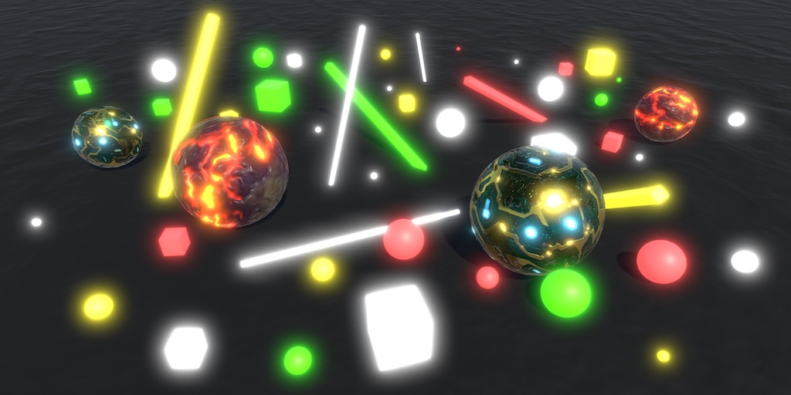 					
A little bloom makes bright things glow. 				

## Setting the Scene

The amount of light that a display can produce is limited. It  can go from black to full brightness, which in shaders correspond to RGB  values 0 and 1. This is known as the low dynamic range – LDR – for  light. How bright a fully white pixel is varies per display and can be  adjusted by the used, but it's never going to be blinding.

Real life isn't limited to LDR light. There isn't a maximum  brightness. The more photons arrive at the same time, the brighter  something appears, until it becomes painful to look at or even blinding.  Directly looking at the sun will damage your eyes.

To represent very bright colors, we can go beyond LDR into the  high dynamic range – HDR. This simply means that we don't enforce a  maximum of 1. Shaders have no trouble working with HDR colors, as long  as the input and output formats can store values greater than 1.  However, displays cannot go beyond their maximum brightness, so the  final color is still clamped to LDR.

To make HDR colors visible, they have to be mapped to LDR, which  is known as tonemapping. This boils down to nonlinearly darkening the  image, so it becomes possible to distinguish between originally HDR  colors. This is somewhat analogous to how our eyes adapt to deal with  bright scenes, although tonemapping is constant. There's also the  auto-exposure technique, which adjust the image brightness dynamically.  Both can be used together. But our eyes aren't always able to do adapt  sufficiently. Some scenes are simply too bright, which makes it harder  for us to see. How could we show this effect, while limited to LDR  displays?

Bloom is an effect which messes up an image by making a pixels'  color bleed into adjacent pixels. It's like blurring an image, but based  on brightness. This way, we could communicate overbright colors via  blurring. It's somewhat similar to how light can diffuse inside our  eyes, which can become noticeable in case of high brightness, but it's  mostly a nonrealistic effect.

Many people dislike bloom because it messes up otherwise crisp  images and makes things appear to glow unrealistically. This isn't an  inherent fault of bloom, it's simply how it happens to be used a lot. If  you're aiming for realism, use bloom in moderation, when it makes  sense. Bloom can also be used artistically for nonrealistic effects.  Examples are dream sequences, to indicate wooziness, or for creative  scene transitions.

### Bloom Scene

We're going to create our own bloom effect via a camera  post-effect component, similar to how we created the deferred fog effect  in [Rendering 14, Fog](https://catlikecoding.com/unity/tutorials/rendering/part-14/). While you can start with a new project or continue from that tutorial, I used the previous advanced rendering tutorial, [Surface Displacement](https://catlikecoding.com/unity/tutorials/advanced-rendering/bloom/), as the basis for this project.

Surface Displacement unitypackage

Create a new scene with default lighting. Put a bunch of bright  objects inside it, on a dark background. I used a black plane with a  bunch of solid white, yellow, green, and red cubes and spheres of  varying sizes. Make sure that the camera is HDR enabled. Also set the  project to use linear color space, so we can best see the effect.


 							Bright objects on a black surface. 						

Normally, you'd apply tonemapping to a scene with linear and  HDR rendering. You could do auto-exposure first, then apply bloom, and  then perform the final tonemapping. But in this tutorial we'll focus on  bloom exclusively and won't apply any other effects. This means that all  colors that end up beyond LDR will be clamped in the final image.

### Bloom Effect

Create a new `**BloomEffect**` component. Just like `**DeferredFogEffect**`, have it execute in edit mode and give it an `OnRenderImage` method. Initially it does nothing extra, so just blit from the source to the destination render texture.

```
using UnityEngine;
using System;

[ExecuteInEditMode]
public class BloomEffect : MonoBehaviour {

	void OnRenderImage (RenderTexture source, RenderTexture destination) {
		Graphics.Blit(source, destination);
	}
}
```

Let's also apply this effect to the scene view, so it's easier  to see the effect from a varying point of view. This is done by adding  the `ImageEffectAllowedInSceneView` attribute to the class.

```
[ExecuteInEditMode, ImageEffectAllowedInSceneView]
public class BloomEffect : MonoBehaviour {
	…
}
```

Add this component as the only effect to the camera object. This completes our test scene.


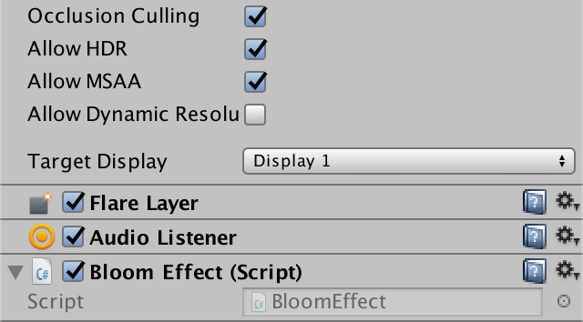 							Camera with bloom effect component. 						

unitypackage

## Blurring

The bloom effect is created by taking the original image,  blurring it somehow, then combining the result with the original image.  So to create bloom, we must first be able to blur an image.

### Rendering to Another Texture

Applying an effect is done via rendering from one render  texture to another. If we could perform all the work in a single pass,  then we could simple blit from the source to the destination, using an  appropriate shader. But blurring is a lot of work, so let's introduce an  intermediate step. We first blit from the source to a temporary  texture, then from that texture to the final destination.

Getting hold of a temporary render texture is best done via invoking `RenderTexture.GetTemporary`.  This method takes care of managing temporary textures for us, creating,  caching, and destroying them as Unity sees fit. At minimum, we have to  specify the texture's dimensions. We'll start with the same size as the  source texture.

```
	void OnRenderImage (RenderTexture source, RenderTexture destination) {
		RenderTexture r = RenderTexture.GetTemporary(
			source.width, source.height
		);
		
		Graphics.Blit(source, destination);
	}
```

As we're going to blur the image, we're not going to do  anything with the depth buffer. To indicate that, use 0 as the third  parameter.

```
		RenderTexture r = RenderTexture.GetTemporary(
			source.width, source.height, 0
		);
```

Because we're using HDR, we have to use an appropriate texture  format. As the camera should have HDR enabled, the source texture's  format will be correct, so we can use that. It's most likely ARGBHalf,  but maybe another format is used.

```
		RenderTexture r = RenderTexture.GetTemporary(
			source.width, source.height, 0, source.format
		);
```

Instead of blitting from source to destination directly, now  first blit from the source to the temporary texture, then from that to  the destination.

```
//		Graphics.Blit(source, destination);
		Graphics.Blit(source, r);
		Graphics.Blit(r, destination);
```

After that, we no longer need the temporary texture. To make it available for reuse, release it by invoking `RenderTexture.ReleaseTemporary`.

```
		Graphics.Blit(source, r);
		Graphics.Blit(r, destination);
		RenderTexture.ReleaseTemporary(r);
```

Although the result still looks the same, we're now moving it through a temporary texture.

### Downsampling

Blurring an image is done by averaging pixels. For each pixel,  we have to decide on a bunch of nearby pixels to combine. Which pixels  are included defines the filter kernel used for the effect. A little  blurring can be done by averaging only a few pixels, which means a small  kernel. A lot of blurring would require a large kernel, combining many  pixels.

The more pixels there are in the kernel, the more times we have  to sample the input texture. As this is per pixel, a large kernel can  require a huge amount of sampling work. So let's keep it as simple as  possible.

The simplest and quickest way to average pixels is to take  advantage of the bilinear filtering built into the GPU. If we halve the  resolution of the temporary texture, then we end up with one pixel for  each group of four source pixels. The lower-resolution pixel will be  sampled exactly in between the original four, so we end up with their  average. We don't even have to use a custom shader for that.

 
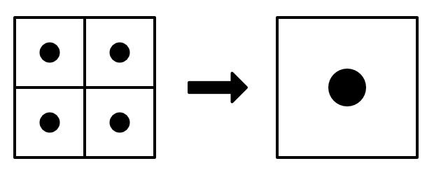 							Bilinear downsampling. 						

```
		int width = source.width / 2;
		int height = source.height / 2;
		RenderTextureFormat format = source.format;

		RenderTexture r =
			RenderTexture.GetTemporary(width, height, 0, format);
```

Using a half-size intermediate texture means that we're  downsampling the source texture to half resolution. After that step, we  go from the temporary to the destination texture, thus upsampling again  to the original resolution.

 							
 							Bilinear upsampling, showing interpolation for one pixel. 						

This is a two-step blurring process where each pixel gets mixed  up with the 4×4 pixel block surrounding it, in four possible  configurations.

 							
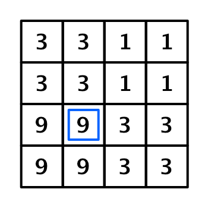 							Relaltive weights for indicated pixel, total 64. 						

The result is an image that's blockier and a little blurrier that the original.

 							
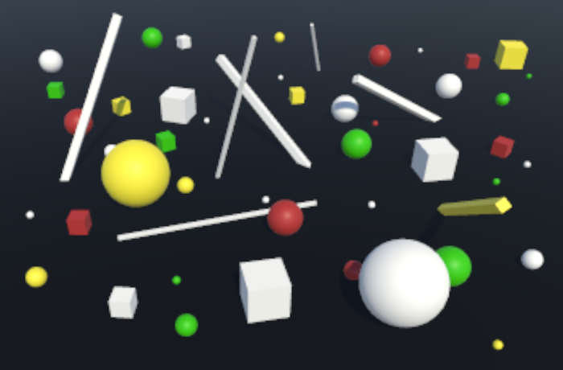 							Using a half-size intermediate texture. 						

We could increase the effect by decreasing the size of the intermediate step further.

 							 							 							 							 							Dividing dimensions by 4, 8, 16, and 32. 						

### Progressive Downsampling

Unfortunately, directly downsampling to a low resolution leads  to poor result. We mostly end up discarding pixels, keeping only the  averages of isolated groups of four pixels.

 							
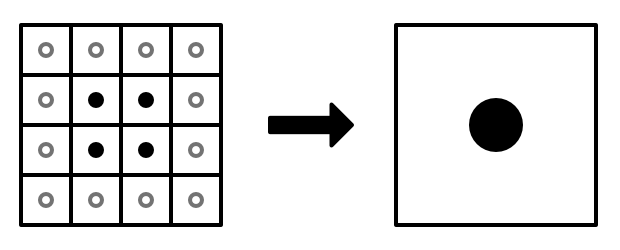 							Direcly going to quarter size eliminates 12 out of 16 pixels. 						

A better approach is to downsample multiple times, halving the  resolution each step until the desired level is reached. That way all  pixels end up contributing to the end result.

 							
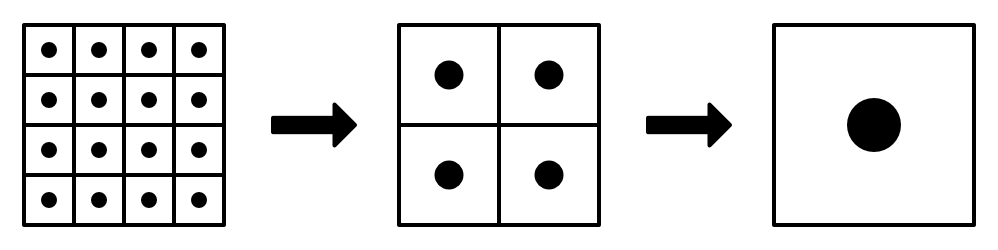 							

Downsampling to half resolution twice keeps information of all pixels. 						

To control how many times we do this, add a public `iterations` field. Make it a slider with a range of 1–16. That would allow us to downsample a 655362 texture all the way down to a single pixel, which should be enough.

```
	[Range(1, 16)]
	public int iterations = 1;
```

 							
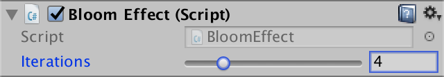 							Iterations slider. 						

To make this work, first refactor-rename `r` to `currentDestination`. After the first blit, add an explicit `currentSource` variable and assign `currentDestination` to it, then use that for the final blit and release it.

```
		RenderTexture currentDestination =
			RenderTexture.GetTemporary(width, height, 0, format);
			
		Graphics.Blit(source, currentDestination);
		RenderTexture currentSource = currentDestination;
		Graphics.Blit(currentSource, destination);
		RenderTexture.ReleaseTemporary(currentSource);
```

Now we can put a loop in between the declaration of the current  source and the final blit. As it comes after the first downsample, its  iterator should start at 1. Each step, begin by halving the texture size  again. Then grab a new temporary texture and blit the current source to  it. Then release the current source and make the current destination  the new source.

```
		RenderTexture currentSource = currentDestination;

		for (int i = 1; i < iterations; i++) {
			width /= 2;
			height /= 2;
			currentDestination =
				RenderTexture.GetTemporary(width, height, 0, format);
			Graphics.Blit(currentSource, currentDestination);
			RenderTexture.ReleaseTemporary(currentSource);
			currentSource = currentDestination;
		}

		Graphics.Blit(currentSource, destination);
```

This works unless we end up with too many iterations, reducing  the size to zero. To prevent that, break out of the loop before that  happens. The height of a typical display is usually smaller than its  width, so you can base this on the height only. Because a single-pixel  line doesn't really add much, I already abort when the texture height  drops below 2.

```
			width /= 2;
			height /= 2;
			if (height < 2) {
				break;
			}
```

 							What about mobiles in portrait mode and other exceptions? 							 						

 							 							 							 							 							Progressive downsampling 2 to 5 iterations. 						

### Progressive Upsampling

While progressive downsampling is an improvement, the result  still gets too blocky too fast. Let's see whether it helps if we  progressively upsample as well.

Iterating in both directions means that we end up rendering to  every size twice, except for the smallest. Instead of releasing and then  claiming the same textures twice per render, let's keep track of them  in an array. We can simply use an array field fixed at size 16 for that,  which should be more than enough.

```
	RenderTexture[] textures = new RenderTexture[16];
```

Each time we grab a temporary texture, also add it to the array.

```
		RenderTexture currentDestination = textures[0] =
			RenderTexture.GetTemporary(width, height, 0, format);
		…

		for (int i = 1; i < iterations; i++) {
			…
			currentDestination = textures[i] =
				RenderTexture.GetTemporary(width, height, 0, format);
			…
		}
```

Then add a second loop after the initial one. This one starts  one step from the lowest level. We can hoist the iterator out of the  first loop, subtract 2 from it, and use that as the starting point of  the other loop. The second loop goes backwards, decreasing the iterator  all the way to 0. This is where we should release the old source  texture, instead of in the first loop. Also, let's clean up the array  here as well.

```
		int i = 1;
		for (; i < iterations; i++) {
			…
			Graphics.Blit(currentSource, currentDestination);
//			RenderTexture.ReleaseTemporary(currentSource);
			currentSource = currentDestination;

		}

		for (i -= 2; i >= 0; i--) {
			currentDestination = textures[i];
			textures[i] = null;
			Graphics.Blit(currentSource, currentDestination);
			RenderTexture.ReleaseTemporary(currentSource);
			currentSource = currentDestination;
		}
```

 							 							 							5 iterations, with and without progressive upsampling. 						

The results are a lot better, but still not good enough.

### Custom Shading

To improve our blurring, we have to switch to a more advanced  filter kernel than simple bilinear filtering. This requires us to use a  custom shader, so create a new *Bloom* shader. Just like the *DeferredFog* shader, begin with a simple shader that has a *_MainTex* property, has no culling, and doesn't use the depth buffer. Give it a single pass with a vertex and fragment program.

```
Shader "Custom/Bloom" {
	Properties {
		_MainTex ("Texture", 2D) = "white" {}
	}

	SubShader {
		Cull Off
		ZTest Always
		ZWrite Off

		Pass {
			CGPROGRAM
				#pragma vertex VertexProgram
				#pragma fragment FragmentProgram
			ENDCG
		}
	}
}
```

The vertex program is even simpler than the one for the fog  effect. It only has to transform the vertex position to clip space and  pass through the texture coordinates of the full-screen quad. Because  we'll end up with multiple passes, everything except the fragment  program can be shared and defined in a `CGINCLUDE` block.

```
	Properties {
		_MainTex ("Texture", 2D) = "white" {}
	}

	CGINCLUDE
		#include "UnityCG.cginc"

		sampler2D _MainTex;

		struct VertexData {
			float4 vertex : POSITION;
			float2 uv : TEXCOORD0;
		};

		struct Interpolators {
			float4 pos : SV_POSITION;
			float2 uv : TEXCOORD0;
		};

		Interpolators VertexProgram (VertexData v) {
			Interpolators i;
			i.pos = UnityObjectToClipPos(v.vertex);
			i.uv = v.uv;
			return i;
		}
	ENDCG

	SubShader {
		…
	}
```

We'll define the `FragmentProgram`  function in the pass itself. Initially, simply sample the source texture  and use that as the result, making it red to verify that we're using  our custom shader. Typically HDR colors are stored in half-precision  format, so let's be explicit and use `**half**` instead of `**float**`, even though this makes no difference for non-mobile platforms.

```
		Pass {
			CGPROGRAM
				#pragma vertex VertexProgram
				#pragma fragment FragmentProgram

				half4 FragmentProgram (Interpolators i) : SV_Target {
					return tex2D(_MainTex, i.uv) * half4(1, 0, 0, 0);
				}
			ENDCG
		}
```

Add a public field to our effect to hold a reference to this shader, and hook it up in the inspector.

```
	public Shader bloomShader;
```

 							
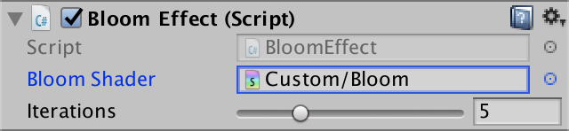 							Bloom effect with shader. 						

Add a field to hold the material that will use this shader,  which doesn't need to be serialized. Before rendering, check whether we  have this material and if not create it. We don't need to see it in the  hierarchy and neither do we need to save it, so set its `hideFlags` accordingly.

```
	[NonSerialized]
	Material bloom;
	
	void OnRenderImage (RenderTexture source, RenderTexture destination) {
		if (bloom == null) {
			bloom = new Material(bloomShader);
			bloom.hideFlags = HideFlags.HideAndDontSave;
		}
		
		…
	}
```

Each time we blit, it should be done with this material instead of the default.

```
	void OnRenderImage (RenderTexture source, RenderTexture destination) {
		…
		Graphics.Blit(source, currentDestination, bloom);
		…
			Graphics.Blit(currentSource, currentDestination, bloom);
		…
			Graphics.Blit(currentSource, currentDestination, bloom);
		…
		Graphics.Blit(currentSource, destination, bloom);
		…
	}
```

 							
 							Using our custom shader. 						

### Box Sampling

We're going to adjust our shader so it uses a different  sampling method that bilinear filtering. Because sampling depends on the  pixel size, add the magic `**float4** _MainTex_TexelSize` variable to the `CGINCLUDE` block. Keep in mind that this corresponds to the texel size of the source texture, not the destination.

```
		sampler2D _MainTex;
		float4 _MainTex_TexelSize;
```

As we're always sampling the main texture and only care about the RGB channels, let's create a convenient minimal `Sample` function.

```
		half3 Sample (float2 uv) {
			return tex2D(_MainTex, uv).rgb;
		}
```

Instead of relying on a bilinear filter only, we'll use a  simple box filter kernel instead. It takes four samples instead of one,  diagonally positioned so we get the averages of four adjacent 2×2 pixels  blocks. Sum these samples and divide by four, so we end up with the  average of a 4×4 pixel block, doubling our kernel size.

 							
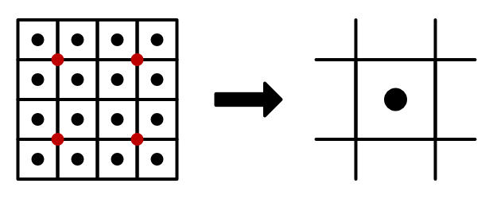 							Downsampling with a 4×4 box, showing the sample points. 						

```
		half3 SampleBox (float2 uv) {
			float4 o = _MainTex_TexelSize.xyxy * float2(-1, 1).xxyy;
			half3 s =
				Sample(uv + o.xy) + Sample(uv + o.zy) +
				Sample(uv + o.xw) + Sample(uv + o.zw);
			return s * 0.25f;
		}
```

Use this sampling function in our fragment program.

```
				half4 FragmentProgram (Interpolators i) : SV_Target {
//					return tex2D(_MainTex, i.uv) * half4(1, 0, 0, 0);
					return half4(SampleBox(i.uv), 1);
				}
```

 							
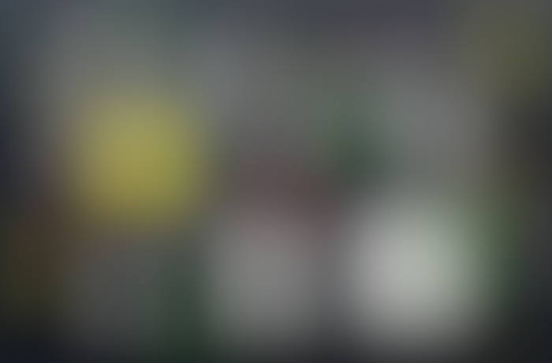 							5 iterations, with 4×4 box sampling. 						

### Different Passes

The result is much smoother and has much higher quality, but it  is also much blurrier. This is mostly due to upsampling with the new  4×4 box filter. As we're using the source's texel size to position the  sample points, we end up covering a large area, with an unfocused  regular weight distribution.

 							  							Upsampling with a 4×4 box. 						

We can tune our box filter by adjust the UV delta that we use  to select the sample points. To make this possible, turn the delta into a  parameter, instead of always using 1.

```
		half3 SampleBox (float2 uv, float delta) {
			float4 o = _MainTex_TexelSize.xyxy * float2(-delta, delta).xxyy;
			half3 s =
				Sample(uv + o.xy) + Sample(uv + o.zy) +
				Sample(uv + o.xw) + Sample(uv + o.zw);
			return s * 0.25f;
		}
```

Duplicate our shader pass so we end up with two. The first one –  pass 0 – will be for downsampling, so it should use the original delta  of 1. The second pass will be for upsampling, for which we'll use a  delta of 0.5.

```
		Pass { // 0
			CGPROGRAM
				#pragma vertex VertexProgram
				#pragma fragment FragmentProgram

				half4 FragmentProgram (Interpolators i) : SV_Target {
					return half4(SampleBox(i.uv, 1), 1);
				}
			ENDCG
		}

		Pass { // 1
			CGPROGRAM
				#pragma vertex VertexProgram
				#pragma fragment FragmentProgram

				half4 FragmentProgram (Interpolators i) : SV_Target {
					return half4(SampleBox(i.uv, 0.5), 1);
				}
			ENDCG
		}
```

With an UV delta of 0.5 we end up covering a 3×3 box with  overlapping samples. So some pixels contribute to the result more than  once, increasing their weight. The middle pixel is involved in all  samples, the diagonal pixels are used only once, while the other pixels  occur twice. The result is a more focused upsampling kernel.

 							  							Focused upsampling. 						

Next, we have to indicate which pass should be used when blitting. To make this easy, add constants to `**BloomEffect**` so we can use names rather than indices.

```
	const int BoxDownPass = 0;
	const int BoxUpPass = 1;
```

The first two blits are down passes and the other two are up passes.

```
	void OnRenderImage (RenderTexture source, RenderTexture destination) {
		…
		Graphics.Blit(source, currentDestination, bloom, BoxDownPass);
		…
			Graphics.Blit(currentSource, currentDestination, bloom, BoxDownPass);
		…
			Graphics.Blit(currentSource, currentDestination, bloom, BoxUpPass);
		…
		Graphics.Blit(currentSource, destination, bloom, BoxUpPass);
		…
	}
```

<iframe src="https://gfycat.com/ifr/IlliterateEdibleBream"></iframe>

Blurring with different passes.

At this point we have a fairly simple yet decent blurring  process. There are many different kernels that we could use instead of  these simple filter kernels, each having its own advantages – like  better temporal stability – and costs. However, for this tutorial we'll  stick with these.

unitypackage

## Creating Bloom

Blurring the original image is the first step of creating a  bloom effect. The second step is to combine the blurred image with the  original, brightening it. However, we won't just use the final blurred  result, as that would produce a rather uniform smudging. Instead, lower  amounts of blurring should contribute more to the result that higher  amounts of blurring. We can do this by accumulating the intermediate  results, adding to the old data as we upsample.

 						
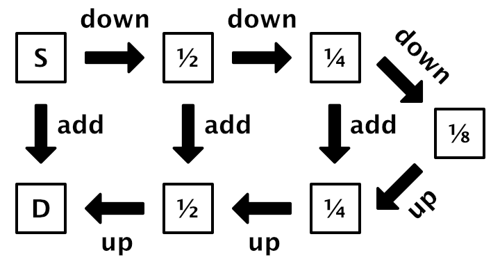 						Additive blurring. 					

### Additive Blending

Adding to what we already have at some intermediate level can  be done by using additive blending, instead of replacing the texture's  contents. All we have to do is set the blend mode of the upsampling pass  to `**One** **One**`.

```
		Pass { // 1
			Blend One One

			CGPROGRAM
				#pragma vertex VertexProgram
				#pragma fragment FragmentProgram

				half4 FragmentProgram (Interpolators i) : SV_Target {
					return half4(SampleBox(i.uv, 0.5), 1);
				}
			ENDCG
		}
```

This simple approach works fine for all intermediate passes,  but will go wrong when we render to the final destination, because we  haven't rendered to it yet. We likely end up accumulating light each  frame, blowing out the image, or something else, depending on how the  textures are reused by Unity. To solve this we have to create a separate  pass for the last upsample, where we combine the original source  texture with the last intermediate texture. So we need a shader variable  for the source.

```
		sampler2D _MainTex, _SourceTex;
```

Add a third pass that is a duplicate of the second pass, except  that it uses the default blend mode and adds the box sample to a sample  of the source texture.

```
		Pass { // 2
			CGPROGRAM
				#pragma vertex VertexProgram
				#pragma fragment FragmentProgram

				half4 FragmentProgram (Interpolators i) : SV_Target {
					half4 c = tex2D(_SourceTex, i.uv);
					c.rgb += SampleBox(i.uv, 0.5);
					return c;
				}
			ENDCG
		}
```

Define a constant for this pass, which applies the bloom to the original image.

```
	const int BoxDownPass = 0;
	const int BoxUpPass = 1;
	const int ApplyBloomPass = 2;
```

The last blit has to use this pass, with the correct source texture.

```
//		Graphics.Blit(currentSource, destination, bloom, BoxUpPass);
		bloom.SetTexture("_SourceTex", source);
		Graphics.Blit(currentSource, destination, bloom, ApplyBloomPass);
		RenderTexture.ReleaseTemporary(currentSource);
```

<iframe src="https://gfycat.com/ifr/RealisticAdmiredAgouti"></iframe>

Bloom.

### Bloom Threshold

Right now we're still blurring the entire image. It's just most  obvious for bright pixels. But one of the uses of bloom is to apply it  only to very bright pixels. To make this possible, we have to introduce a  brightness threshold. Add a public field for this, with a slider range  from 0 to some very bright value, like 10. Let's use a default threshold  of 1, excluding LDR pixels.

```
	[Range(0, 10)]
	public float threshold = 1;
```

 							
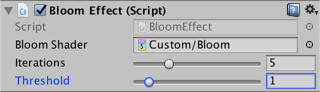 							Threshold slider. 						

The threshold determines which pixels contribute to the bloom  effect. If they're not bright enough, they shouldn't be included during  the downsampling and upsampling process. Simply converting them to black  will do this, which has to be done by the shader. So set the material's  *_Threshold* variable before we blit.

```
		if (bloom == null) {
			…
		}

		bloom.SetFloat("_Threshold", threshold);
```

Add this variable to the `CGINCLUDE` block of the shader as well, again using the `**half**` type.

```
		half _Threshold;
```

We'll use the threshold to filter out pixels that we do not  wish to include. As we do this at the start of the blurring process,  it's known as a prefilter step. Create a function for this, which takes a  color and outputs the filtered one.

```
		half3 Prefilter (half3 c) {
			return c;
		}
```

We'll use the color's maximum component to determine its brightness, so b=Cr∨Cg∨Cb

, where the 

∨

 symbol is an operator that I use to denote the max function.

We can determine the contribution factor of the color by  subtracting the threshold from its brightness, then dividing that by its  brightness, c=b−tb

, where 

t

 is the threshold. The result is always 1 when 

t=0

, which leaves the color unchanged. As 

t

 increases, the brightness curve will bend downward so it drops to zero where 

b=t

. Because of the curve's shape, it's known as a knee. As we don't want negative factors, we have to make sure that 

b−t

 doesn't drop below zero, leading to 

c=0∨(b−t)b

.

 							
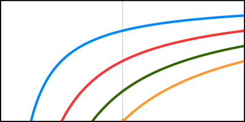 							Knee curves with thresholds 0.25, 0.5, 0.75, and 1. 						

To avoid divisions by zero in the shader, make sure that the  divisor has a small value at minimum, like 0.00001. Then use the result  to modulate the color.

```
		half3 Prefilter (half3 c) {
			half brightness = max(c.r, max(c.g, c.b));
			half contribution = max(0, brightness - _Threshold);
			contribution /= max(brightness, 0.00001);
			return c * contribution;
		}
```

The filter is applied in the first pass only. So duplicate the  first pass, putting it at the top as pass 0. Apply the filter to the  result of the box sample.

```
		Pass { // 0
			CGPROGRAM
				#pragma vertex VertexProgram
				#pragma fragment FragmentProgram

				half4 FragmentProgram (Interpolators i) : SV_Target {
					return half4(Prefilter(SampleBox(i.uv, 1)), 1);
				}
			ENDCG
		}
```

Add a constant for this new pass, and increase the indices of all later passes by one.

```
	const int BoxDownPrefilterPass = 0;
	const int BoxDownPass = 1;
	const int BoxUpPass = 2;
	const int ApplyBloomPass = 3;
```

Use the new pass for the first blit.

```
		RenderTexture currentDestination = textures[0] =
			RenderTexture.GetTemporary(width, height, 0, format);
		Graphics.Blit(source, currentDestination, bloom, BoxDownPrefilterPass);
		RenderTexture currentSource = currentDestination;
```

At this point, with the threshold set to 1, you'll likely see  no or almost no bloom, assuming the light and materials used have no HDR  values. To make bloom appear, you could increase the light contribution  of some of the materials. For example, I made the yellow material  emissive, which together with the reflected light pushes the yellow  pixels into HDR.

 							
 							Emissive yellow. 						

### Isolating Bloom

To better see what parts of the image contribute to bloom, it  would be handy if we could see the blur effect in isolation. So let's  add a debug option to our effect, controlled via a public boolean field.

```
	public bool debug;
```

 							
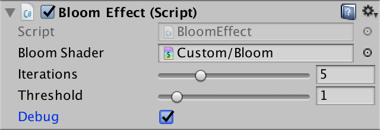 							Debug toggle. 						

We'll create a separate pass for debug purposes, so add a constant for it at the bottom.

```
	const int BoxDownPrefilterPass = 0;
	const int BoxDownPass = 1;
	const int BoxUpPass = 2;
	const int ApplyBloomPass = 3;
	const int DebugBloomPass = 4;
```

When in debug mode, blit the last intermediate result directly  to the final destination – using the debug pass – instead of adding it  to the source.

```
		if (debug) {
			Graphics.Blit(currentSource, destination, bloom, DebugBloomPass);
		}
		else {
			bloom.SetTexture("_SourceTex", currentSource);
			Graphics.Blit(source, destination, bloom, ApplyBloomPass);
		}
		RenderTexture.ReleaseTemporary(currentSource);
```

The new debug pass simply performs the last upsample and combines that with nothing.

```
		Pass { // 4
			CGPROGRAM
				#pragma vertex VertexProgram
				#pragma fragment FragmentProgram

				half4 FragmentProgram (Interpolators i) : SV_Target {
					return half4(SampleBox(i.uv, 0.5), 1);
				}
			ENDCG
		}
```

 							
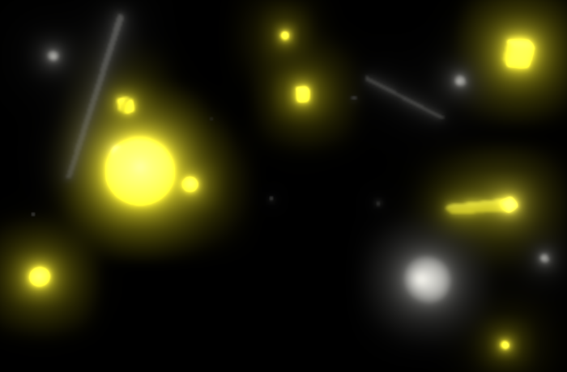 							Bloom effect only. 						

While in debug mode, we can clearly see that the yellow pixels  end up generating bloom. Besides that, also some of the white pixels are  included, but only when they end up reflecting a significant amount of  the directional light.

 							Why do some white surfaces end up in HDR? 							 						

### Soft Threshold

The knee curve that we use to modulate colors cuts through zero  at an angle, leading to an abrupt cutoff point. This is why it's also  known as a hard knee. This means that we can end up with sharp  transitions between areas that generate bloom and those that do not.  This can be seen in the large white sphere in the screenshot above.  There's a clearly-defined portion of that sphere which gets included.  This is somewhat obfuscated by the blurring, but it's still a harsh  transition.

It's possible to make this transition smoother, blending from  zero to full contribution. We'll control this with a slider. At 0, we  get the harsh transition that we currently have. At 1, we get a soft  threshold that smoothly fades the bloom in all the way from brightness 0  until it matches the hard knee. We'll use 0.5 as the default.

```
	[Range(0, 1)]
	public float softThreshold = 0.5f;
```

 							
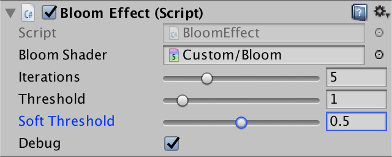 							Soft threshold slider. 						

This fading is also done by the shader, so pass the soft-threshold factor on to the material.

```
		bloom.SetFloat("_Threshold", threshold);
		bloom.SetFloat("_SoftThreshold", softThreshold);
```

And add a variable for it to the shader.

```
		half _Threshold, _SoftThreshold;
```

By softening our hard knee curve we turn it into a soft knee. We do this by taking the maximum of b−t

 and a separate softening curve, instead of 0. So we get 

c=s∨(b−t)b

.

The soft curve is defined as s=(b−t+k)24k

, where 

k=tts

 and 

ts

 is the soft threshold.

 							
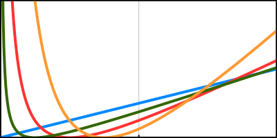 							Soft curves divided by b

 with threshold 1, and soft 0, 0.25, 0.5, and 0.75. 						

We have to cut off this curve where it touches 0 and where it meets the hard knee, which is done by using s=(0∨(b−t+k)∧2k)24k

, where 

∧

 represents the minimum function. Adjust the prefilter function to perform this calculation, again preventing divisions by zero.

```
		half3 Prefilter (half3 c) {
			half brightness = max(c.r, max(c.g, c.b));
			half knee = _Threshold * _SoftThreshold;
			half soft = brightness - _Threshold + knee;
			soft = clamp(soft, 0, 2 * knee);
			soft = soft * soft / (4 * knee + 0.00001);
			half contribution = max(soft, brightness - _Threshold);
			contribution /= max(brightness, 0.00001);
			return c * contribution;
		}
```

<iframe src="https://gfycat.com/ifr/SplendidBreakableFlyinglemur"></iframe>

Soft threshold.

Note that some parts of the soft knee function can be isolated  so they only depend on the configuration values, which are constant per  pass. We can precompute these parts and pass them to the shader in a  vector, reducing the amount of work it has to do. We can combine these  with the threshold in a single filter vector.

```
//		bloom.SetFloat("_Threshold", threshold);
//		bloom.SetFloat("_SoftThreshold", softThreshold);
		float knee = threshold * softThreshold;
		Vector4 filter;
		filter.x = threshold;
		filter.y = filter.x - knee;
		filter.z = 2f * knee;
		filter.w = 0.25f / (knee + 0.00001f);
		bloom.SetVector("_Filter", filter);
```

Adjust the shader accordingly.

```
//		half _Threshold, _SoftTheshold;
		half4 _Filter;
		
		…
		
		half3 Prefilter (half3 c) {
			half brightness = max(c.r, max(c.g, c.b));
//			half knee = _Threshold * _SoftThreshold;
			half soft = brightness - _Filter.y;
			soft = clamp(soft, 0, _Filter.z);
			soft = soft * soft * _Filter.w;
			half contribution = max(soft, brightness - _Filter.x);
			contribution /= max(brightness, 0.00001);
			return c * contribution;
		}
```

### Bloom Intensity

To wrap up, let's make it possible to modulate the intensity of  the bloom effect. This makes it possible to fade it in, and also to  create ridiculously-strong effects. Add a slider for this, with a range  like 0–10. The default should be 1.

```
	[Range(0, 10)]
	public float intensity = 1;
```

 							
 							Intensity slider. 						

Pass this intensity value on to the shader, as a material  property. As it is common to set a bloom's intensity with a factor in  gamma space, convert it from gamma to linear space.

```
		bloom.SetVector("_Filter", filter);
		bloom.SetFloat("_Intensity", Mathf.GammaToLinearSpace(intensity));
```

Add the appropriate variable to the shader.

```
		half _Intensity;
```

Factor the intensity into the final box sample in the last two passes.

```
		Pass { // 3
			CGPROGRAM
				#pragma vertex VertexProgram
				#pragma fragment FragmentProgram

				half4 FragmentProgram (Interpolators i) : SV_Target {
					half4 c = tex2D(_SourceTex, i.uv);
					c.rgb += _Intensity * SampleBox(i.uv, 0.5);
					return c;
				}
			ENDCG
		}

		Pass { // 4
			CGPROGRAM
				#pragma vertex VertexProgram
				#pragma fragment FragmentProgram

				half4 FragmentProgram (Interpolators i) : SV_Target {
					return half4(_Intensity * SampleBox(i.uv, 0.5), 1);
				}
			ENDCG
		}
```

<iframe src="https://gfycat.com/ifr/ConfusedOptimisticHatchetfish"></iframe>

Bloom intensity.

You now have a basic bloom effect. It is quite similar to the  bloom effect of Unity's post processing stack, version 2. It's possible  to extend it further, by adding a tint, making the sampling delta  configurable, using different filters, and so on. Or you could move on  to [Depth of Field](https://catlikecoding.com/unity/tutorials/advanced-rendering/depth-of-field/).

unitypackage

PDF
