# Depth of Field

Bending Light

- Determine the circle of confusion.
- Create bokeh.
- Focus and unfocus an image.
- Split and merge foreground and background.

This tutorial takes a look at how to create a depth-of-field post-processing effect. It follows the [Bloom](https://catlikecoding.com/unity/tutorials/advanced-rendering/bloom/) tutorial. 				 				

This tutorial is made with Unity 2017.3.0p3.


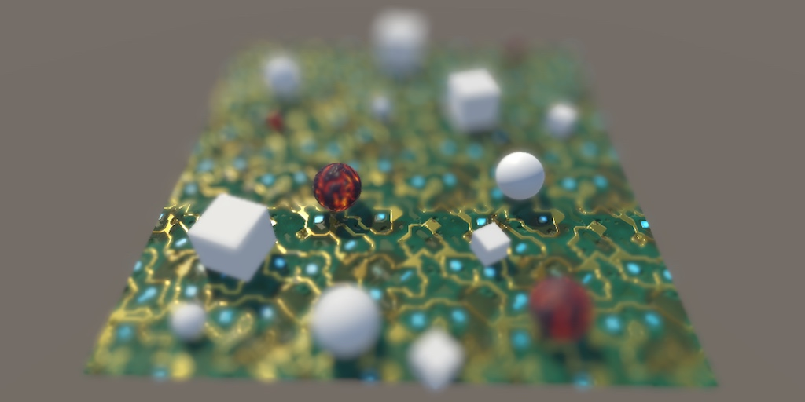 					
To focus on something, unfocus everything else. 				

## Setting the Scene

We perceive light because we sense photons hitting our retinas.  Likewise, cameras can record light because photons hit their film or  image sensor. In all cases, light gets focused to produce sharp images,  but not everything can be in focus at the same time. Only things at a  certain distance are in focus, while everything nearer or farther  appears out of focus. This visual effect is known as depth-of-field. The  specifics of how the out-of-focus projection looks is known as bokeh,  which is Japanese for blur.

Usually, we don't notice depth-of-field with our own eyes,  because we're paying attention to what we're focusing on, not what lies  outside our focus. It can be much more obvious in photos and videos,  because we can look at parts of the image that weren't in the camera's  focus. Although it is a physical limitation, bokeh can be used to great  effect to guide the viewers attention. Thus, it is an artistic tool.

GPUs don't need to focus light, they act like perfect cameras  with infinite focus. This is great if you want to create sharp images,  but unfortunate if you'd like to use depth-of-field for artistic  purposes. But there are multiple ways to fake it. In this tutorial,  we'll create a depth-of-field effect similar to the one found in Unity's  post effect stack v2, although simplified as much as possible.

### Setting the Scene

To test our own depth-of-field effect, create a scene with some  objects at various distances. I used a 10×10 plane with our circuitry  material tiled five times as the ground. It gives us a surface with  large, sharp, high-frequency color changes. It's really a terrible  material to work with, which makes it good for testing purposes. I put a  bunch of objects on it and also floated four objects close to the  camera. You can download the package of this section to grab this scene,  or make your own.


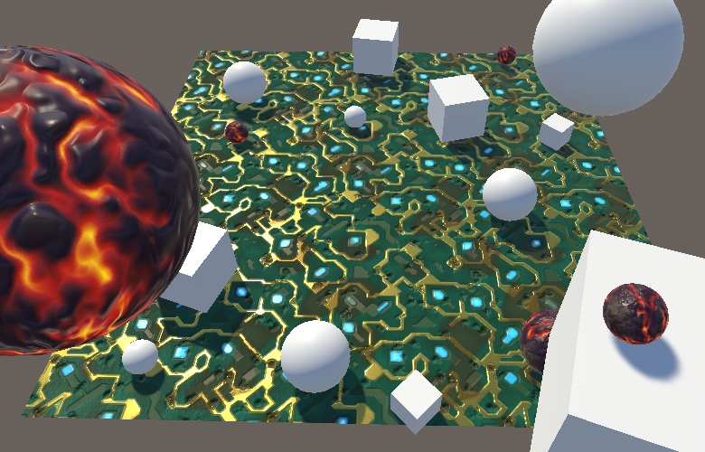
Test scene. 						

We'll use the same setup for a new *DepthOfField* shader as we used for the *Bloom*  shader. You can copy it and reduce it to a single pass that just  performs a blit for now. However, this time we'll put the shader in the  hidden menu category, which is excluded from the shader dropdown list.  This is the only notable new thing worth marking.

```
Shader "Hidden/DepthOfField" {
	Properties {
		_MainTex ("Texture", 2D) = "white" {}
	}

	CGINCLUDE
		#include "UnityCG.cginc"

		sampler2D _MainTex;
		float4 _MainTex_TexelSize;

		struct VertexData {
			float4 vertex : POSITION;
			float2 uv : TEXCOORD0;
		};

		struct Interpolators {
			float4 pos : SV_POSITION;
			float2 uv : TEXCOORD0;
		};

		Interpolators VertexProgram (VertexData v) {
			Interpolators i;
			i.pos = UnityObjectToClipPos(v.vertex);
			i.uv = v.uv;
			return i;
		}

	ENDCG

	SubShader {
		Cull Off
		ZTest Always
		ZWrite Off

		Pass {
			CGPROGRAM
				#pragma vertex VertexProgram
				#pragma fragment FragmentProgram

				half4 FragmentProgram (Interpolators i) : SV_Target {
					return tex2D(_MainTex, i.uv);
				}
			ENDCG
		}
	}
}
```

Create a minimal `**DepthOfFieldEffect**` component, again using the same approach as for the bloom effect, but with the shader property hidden.

```
using UnityEngine;
using System;

[ExecuteInEditMode, ImageEffectAllowedInSceneView]
public class DepthOfFieldEffect : MonoBehaviour {

	[HideInInspector]
	public Shader dofShader;

	[NonSerialized]
	Material dofMaterial;

	void OnRenderImage (RenderTexture source, RenderTexture destination) {
		if (dofMaterial == null) {
			dofMaterial = new Material(dofShader);
			dofMaterial.hideFlags = HideFlags.HideAndDontSave;
		}

		Graphics.Blit(source, destination, dofMaterial);
	}
}
```

Instead of requiring the correct shader to be assigned  manually, we define it as the componen't default value. To do so, select  the script in the editor and hook up the shader field at the top of the  inspector. As the info text mentions, this ensures that when you add  this component to something in the editor it'll copy this reference,  which is convenient.

 							
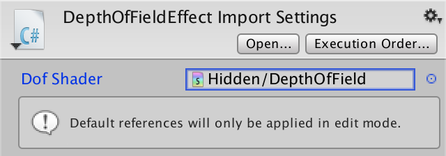 							Default shader reference. 						

Attach our new effect as the only one to the camera. Once  again, we assume that we're rendering in linear HDR space, so configure  the project and camera accordingly. Also, because we need to read from  the depth buffer, this effect doesn't work correctly when using MSAA. So  disallow the camera from using it. Also note that because we'll rely on  the depth buffer, the effect doesn't take transparent geometry into  account.

 							
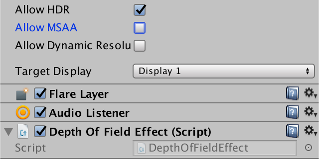 							HDR camera without MSAA and with depth-of-field. 						

 							So we cannot use it together with transparent objects? 							 						

unitypackage

## Circle of Confusion

The simplest form of camera is a perfect pinhole camera. Like  all cameras, it has an image plane on which the light is projected and  recorded. In front of the image plane is a tiny hole – known as the  aperture – just large enough to allow a single light ray to pass through  it. Things in front of the camera emit or reflect light in many  directions, producing a lot of light rays. For every point, only a  single ray is able to pass through the hole and gets recorded.

 						
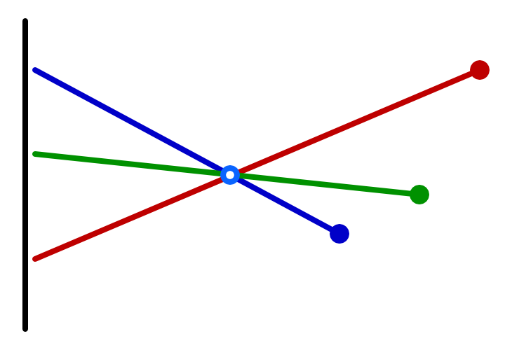 						Recording three points. 					

 						Is the projected image flipped? 						 					

Because only a single ray of light is captured per point, the  image is always sharp. Unfortunately a single light ray isn't very  bright, so the resulting image is hardly visible. You'd have to wait a  while for enough light to accumulate to get a clear image, which means  that this camera requires a long exposure time. This isn't a problem  when the scene is static, but everything that moves even a little will  produce a lot of motion blur. So it isn't a practical camera and cannot  be used to record sharp videos.

To be able to reduce the exposure time, light has to accumulate  more quickly. The only way to do this is by recording multiply light  rays at the same time. This can be done by increasing the radius of the  aperture. Assuming the hole is round, this means that each point will be  projected on the image plane with a cone of light instead of a line. So  we receive more light, but it no longer ends up at a single point.  Instead, it gets projected as a disc. How large an area is covered  depends on the distance between the point, hole, and image plane. The  result is a brighter but unfocused image.

 						
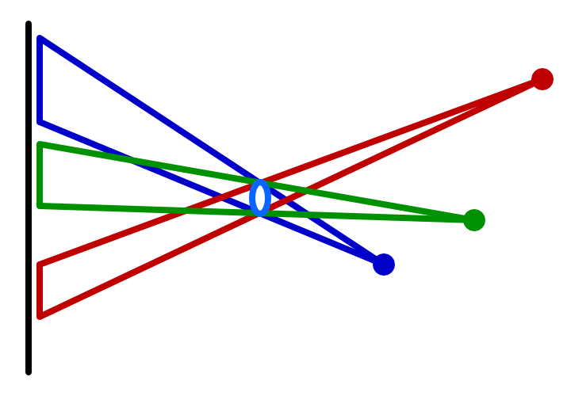 						Using a larger aperture. 					

To focus the light again, we have to somehow take an incoming  cone of light and bring it back to a single point. This is done by  putting a lens in the camera's hole. The lens bends light in such a way  that dispersing light gets focused again. This can produce a bright and  sharp projection, but only for points at a fixed distance from the  camera. The light from points further away won't be focused enough,  while the light from points too close to the camera are focused too  much. In both cases we again end up projecting points as discs, their  size depending on how much out of focus they are. This unfocused  projection is known as the circle of confusion, CoC for short.

 						
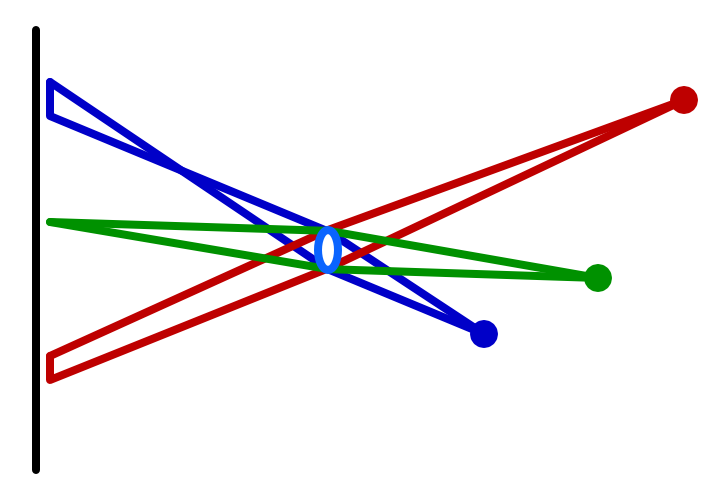 						Only one point is in focus. 					

### Visualizing the CoC

The radius of the circle of confusion is a measure of how  out-of-focus the projection of a point is. Let's begin by visualizing  this value. Add a constant to `**DepthOfFieldEffect**` to indicate our first pass, the circle-of-confusion pass. Explicitly use this pass when blitting.

```
	const int circleOfConfusionPass = 0;

	…

	void OnRenderImage (RenderTexture source, RenderTexture destination) {
		…

		Graphics.Blit(source, destination, dofMaterial, circleOfConfusionPass);
	}
```

Because the CoC depends on the distance from the camera, we  need to read from the depth buffer. In fact, the depth buffer is exactly  what we need, because a camera's focus region is a plane parallel to  the camera, assuming the lens and image plane are aligned and perfect.  So sample from the depth texture, convert to linear depth and render  that.

```
	CGINCLUDE
		#include "UnityCG.cginc"

		sampler2D _MainTex, _CameraDepthTexture;
		…

	ENDCG

	SubShader {
		…

		Pass { // 0 circleOfConfusionPass
			CGPROGRAM
				#pragma vertex VertexProgram
				#pragma fragment FragmentProgram

				half4 FragmentProgram (Interpolators i) : SV_Target {
//					return tex2D(_MainTex, i.uv);
					half depth = SAMPLE_DEPTH_TEXTURE(_CameraDepthTexture, i.uv);
					depth = LinearEyeDepth(depth);
					return depth;
				}
			ENDCG
		}
	}
```

### Choosing a Simple CoC

We're not interested in the raw depth value, but the CoC value.  To determine this, we have to decided on a focus distance. This is the  distance between the camera and the focus plane, where everything is  perfectly sharp. Add a public field for it to our effect component and  use a range like 0.1–100 and a default of 10.

```
	[Range(0.1f, 100f)]
	public float focusDistance = 10f;
```

The size of the CoC increases with the distance of a point to  the focus plane. The exact relationship depends on the camera and its   configuration, which can get rather complex. It's possible to simulate  real cameras, but we'll use a simple focus range so it's easier to  understand and control. Our CoC will go from zero to its maximum inside  this range, relative to the focus distance. Give it a field with a range  like 0.1–10 and a default of 3.

```
	[Range(0.1f, 10f)]
	public float focusRange = 3f;
```

 							
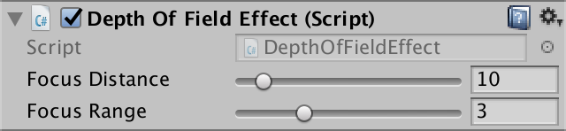 							Sliders for focus distance and range. 						

These configuration options are needed by our shader, so set them before we blit.

```
		dofMaterial.SetFloat("_FocusDistance", focusDistance);
		dofMaterial.SetFloat("_FocusRange", focusRange);

		Graphics.Blit(source, destination, dofMaterial, circleOfConfusionPass);
```

Add the required variables to the shader. As we use them to work with the depth buffer, we'll use `**float**` as their type when calculating the CoC. As we're using half-based HDR buffers, we'll stick to `**half**` for other values, though this doesn't matter on desktop hardware.

```
		sampler2D _MainTex, _CameraDepthTexture;
		float4 _MainTex_TexelSize;

		float _FocusDistance, _FocusRange;
```

Using the depth d

, focus distance 

f

, and focus range 

r

, we can find the CoC via 

d−fr

.

```
				half4 FragmentProgram (Interpolators i) : SV_Target {
					float depth = SAMPLE_DEPTH_TEXTURE(_CameraDepthTexture, i.uv);
					depth = LinearEyeDepth(depth);
//					return depth;

					float coc = (depth - _FocusDistance) / _FocusRange;
					return coc;
				}
```

 							
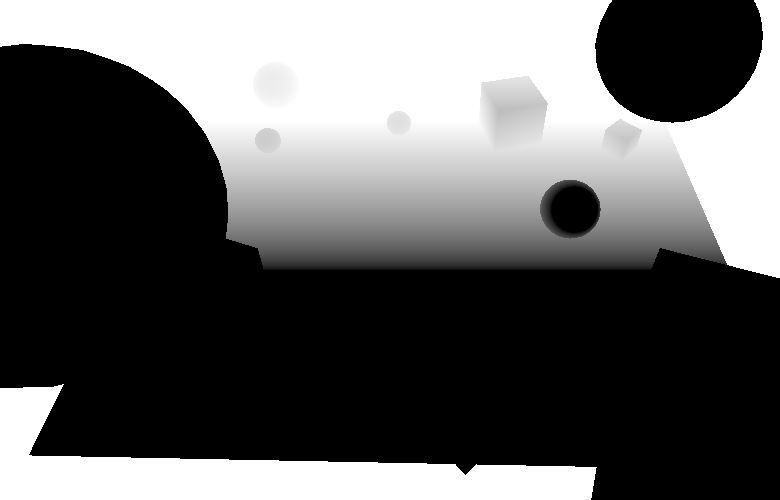 							Raw CoC. 						

This results in positive CoC values for points beyond the focus  distance, and negative CoC values for points in front of it. The values  −1 and 1 represent the maximum CoC, so we should make sure the CoC  values don't exceed that, by clamping.

```
					float coc = (depth - _FocusDistance) / _FocusRange;
					coc = clamp(coc, -1, 1);
					return coc;
```

We keep the negative CoC values so we can distinguish between  foreground and background points. To see the negative CoC values, you  could color them, let's say with red.

```
					coc = clamp(coc, -1, 1);
					if (coc < 0) {
						return coc * -half4(1, 0, 0, 1);
					}
					return coc;
```

 							
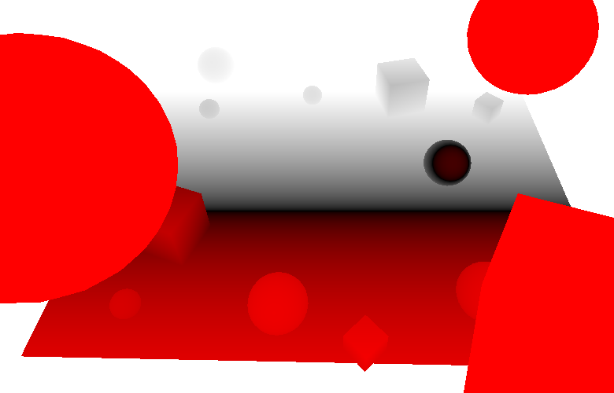 							Negative CoC is red. 						

### Buffering the CoC

We'll need the CoC to scale the point's projection, but we'll  do that in another pass. So we'll store the CoC values in a temporary  buffer. Because we only need to store a single value, we can suffice  with a single-channel texture, using `RenderTextureFormat.RHalf`.  Also, this buffer contains CoC data, not color values. So it should  always be treated as linear data. Let's make this explicit, even though  we assume that we're rendering in linear space.

Blit to the CoC buffer and then add a new blit to copy that buffer to the destination. Finally, release the buffer.

```
		RenderTexture coc = RenderTexture.GetTemporary(
			source.width, source.height, 0,
			RenderTextureFormat.RHalf, RenderTextureReadWrite.Linear
		);

		Graphics.Blit(source, coc, dofMaterial, circleOfConfusionPass);
		Graphics.Blit(coc, destination);

		RenderTexture.ReleaseTemporary(coc);
```

Because we're using a texture that only has an R channel, the  entire CoC visualization is now red. We need to store the actual CoC  values, so remove the coloration of the negative ones. Also, we can  change the return type of the fragment function to a single value.

```
//				half4
				half FragmentProgram (Interpolators i) : SV_Target {
					float depth = SAMPLE_DEPTH_TEXTURE(_CameraDepthTexture, i.uv);
					depth = LinearEyeDepth(depth);

					float coc = (depth - _FocusDistance) / _FocusRange;
					coc = clamp(coc, -1, 1);
//					if (coc < 0) {
//						return coc * -half4(1, 0, 0, 1);
//					}
					return coc;
				}
```

unitypackage

## Bokeh

While the CoC determines the strength of the bokeh effect per  point, it's the aperture that determines how it looks. Basically, an  image is composed of many projections of the aperture's shape on the  image plane. So one way to create bokeh is to render a sprite for each  texel using its color, with size and opacity based on its CoC. This  approach is actually used in some cases, but it can be very expensive  due to the massive amount of overdraw.

Another approach is to work in the opposite direction. Instead  of projecting a single fragment onto many, each fragment accumulates  colors from all texels that might influence it. This technique doesn't  require the generation of extra geometry, but requires taking many  texture samples. We'll use this approach.

### Accumulating the Bokeh

Create a new pass for the generation of the bokeh effect. Start  by simply passing through the colors of the main texture. We don't care  about its alpha channel.

```
		Pass { // 0 CircleOfConfusionPass
			…
		}

		Pass { // 1 bokehPass
			CGPROGRAM
				#pragma vertex VertexProgram
				#pragma fragment FragmentProgram

				half4 FragmentProgram (Interpolators i) : SV_Target {
					half3 color = tex2D(_MainTex, i.uv).rgb;
					return half4(color, 1);
				}
			ENDCG
		}
```

Use this pass for the second and final blit, with the source  texture as input. We'll ignore the CoC data for now, assuming that the  entire image fully out of focus.

```
	const int circleOfConfusionPass = 0;
	const int bokehPass = 1;

	…

	void OnRenderImage (RenderTexture source, RenderTexture destination) {
		…

		Graphics.Blit(source, coc, dofMaterial, circleOfConfusionPass);
		Graphics.Blit(source, destination, dofMaterial, bokehPass);
//		Graphics.Blit(coc, destination);

		RenderTexture.ReleaseTemporary(coc);
	}
```

To create the bokeh effect, we have to average the colors  around the fragment that we're working on. We'll start by taking the  average of a block of 9×9 texels centered on the current fragment. This  requires 81 samples in total.

```
				half4 FragmentProgram (Interpolators i) : SV_Target {
//					half3 color = tex2D(_MainTex, i.uv).rgb;
					half3 color = 0;
					for (int u = -4; u <= 4; u++) {
						for (int v = -4; v <= 4; v++) {
							float2 o = float2(u, v) * _MainTex_TexelSize.xy;
							color += tex2D(_MainTex, i.uv + o).rgb;
						}
					}
					color *= 1.0 / 81;
					return half4(color, 1);
```

 							
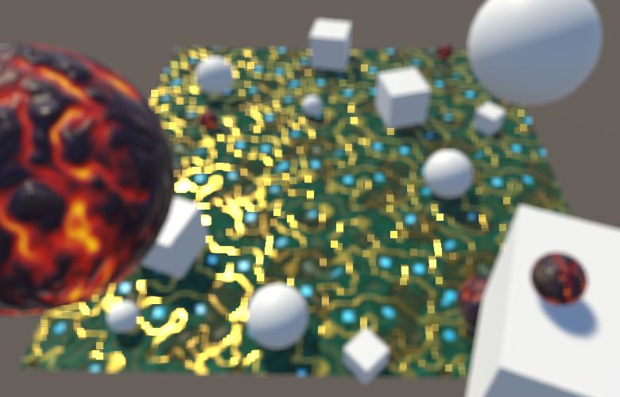 							Square bokeh. 						

The result is a blockier image. Effectively, we're using a  square aperture. The image also became brighter, because the influence  of very bright fragments gets spread out over a larger area. This is  more like bloom than depth-of-field, but an exaggerated effect makes it  easier to see what's going on. So we'll keep it too bright for now and  tone it down later.

Because our simple bokeh approach is based on the texel size,  its visual size depends on the target resolution. Lowering the  resolution increases the texel size, which increases the aperture and  the bokeh effect. For the rest of this tutorial, I'll use  half-resolution screenshots to make individual texels easier to see. As a  result, the dimensions of the bokeh shape is doubled.

 							
 							The same scene at half resolution. 						

Gathering samples in a 9×9 texel block already requires 81  samples, which is a lot. If we'd want to double the bokeh dimensions,  we'd need to increase that to a 17×17. That would require 289 samples  per fragment, which is far too much. But we could double the sampling  area without increasing the amount of samples, by simply doubling the  sample offset.

```
							float2 o = float2(u, v) * _MainTex_TexelSize.xy * 2;
```

 							
 							Sparse sampling. 						

We've now doubled the radius of the aperture, but we're taking  too few samples to cover it entirely. The resulting undersampling breaks  up the aperture projection, turning it into a dotted region. It's like  we're using a camera with a grid of 9×9 holes instead of a single  opening. While this doesn't look nice, it allows us to clearly see the  individual samples.

### Round Bokeh

The ideal aperture is round, not square, and produces a bokeh  consisting of many overlapping discs. We can turn our bokeh shape into a  disc with a radius of four steps by simply discarding those samples  that have too large an offset. How many samples are included determines  the weight of the accumulated color, which we can use to normalize it.

```
					half3 color = 0;
					float weight = 0;
					for (int u = -4; u <= 4; u++) {
						for (int v = -4; v <= 4; v++) {
//							float2 o = float2(u, v) * _MainTex_TexelSize.xy * 2;
							float2 o = float2(u, v);
							if (length(o) <= 4) {
								o *= _MainTex_TexelSize.xy * 2;
								color += tex2D(_MainTex, i.uv + o).rgb;
								weight += 1;
							}
						}
					}
					color *= 1.0 / weight;
					return half4(color, 1);
```

 							
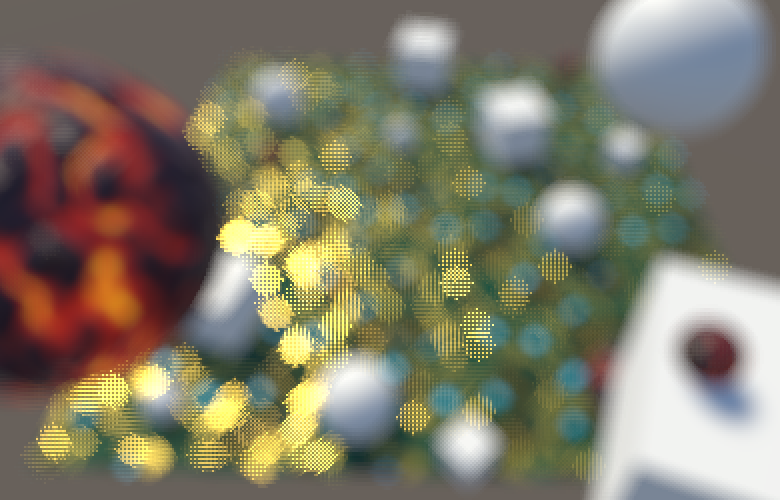 							Round bokeh. 						

Instead of checking whether each sample is valid, we can define  an array with all offsets that matter and loop through it. This also  means that we aren't constrained to a regular grid. As we're sampling a  disc, it makes more sense to use a pattern of spirals or concentric  circles. Instead of coming up with a pattern ourselves, let's use one of  the sampling kernels of Unity's post effect stack v2, defined in *DiskKernels.hlsl*.  These kernels contain offsets within the unit circle. The smallest  kernel consists of 16 samples: a center point with a ring of 5 samples  around it and another ring of 10 samples around that.

```
				// From https://github.com/Unity-Technologies/PostProcessing/
				// blob/v2/PostProcessing/Shaders/Builtins/DiskKernels.hlsl
				static const int kernelSampleCount = 16;
				static const float2 kernel[kernelSampleCount] = {
					float2(0, 0),
					float2(0.54545456, 0),
					float2(0.16855472, 0.5187581),
					float2(-0.44128203, 0.3206101),
					float2(-0.44128197, -0.3206102),
					float2(0.1685548, -0.5187581),
					float2(1, 0),
					float2(0.809017, 0.58778524),
					float2(0.30901697, 0.95105654),
					float2(-0.30901703, 0.9510565),
					float2(-0.80901706, 0.5877852),
					float2(-1, 0),
					float2(-0.80901694, -0.58778536),
					float2(-0.30901664, -0.9510566),
					float2(0.30901712, -0.9510565),
					float2(0.80901694, -0.5877853),
				};

				half4 FragmentProgram (Interpolators i) : SV_Target {
					…
				}
```

Loop through these offsets and use them to accumulate samples. To keep the same disk radius, multiply the offsets by 8.

```
				half4 FragmentProgram (Interpolators i) : SV_Target {
					half3 color = 0;
//					float weight = 0;
//					for (int u = -4; u <= 4; u++) {
//						for (int v = -4; v <= 4; v++) {
//							…
//						}
//					}
					for (int k = 0; k < kernelSampleCount; k++) {
						float2 o = kernel[k];
						o *= _MainTex_TexelSize.xy * 8;
						color += tex2D(_MainTex, i.uv + o).rgb;
					}
					color *= 1.0 / kernelSampleCount;
					return half4(color, 1);
				}
```

 							
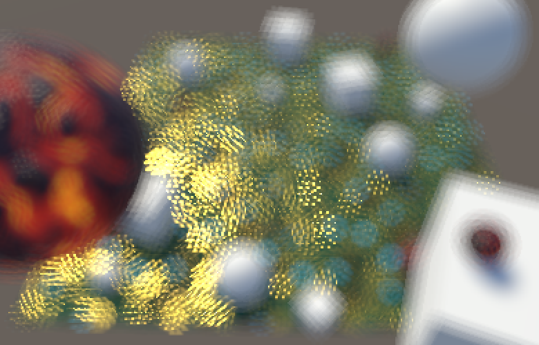 							Using the small kernel. 						

The more samples a kernel has, the higher its quality. *DiskKernels.hlsl*  contains a few and you could copy all and compare them. For this  tutorial, I'll use the medium kernel, which also has two rings but a  total of 22 samples.

```
				#define BOKEH_KERNEL_MEDIUM

				// From https://github.com/Unity-Technologies/PostProcessing/
				// blob/v2/PostProcessing/Shaders/Builtins/DiskKernels.hlsl
				#if defined(BOKEH_KERNEL_SMALL)
					static const int kernelSampleCount = 16;
					static const float2 kernel[kernelSampleCount] = {
						…
					};
				#elif defined (BOKEH_KERNEL_MEDIUM)
					static const int kernelSampleCount = 22;
					static const float2 kernel[kernelSampleCount] = {
						float2(0, 0),
						float2(0.53333336, 0),
						float2(0.3325279, 0.4169768),
						float2(-0.11867785, 0.5199616),
						float2(-0.48051673, 0.2314047),
						float2(-0.48051673, -0.23140468),
						float2(-0.11867763, -0.51996166),
						float2(0.33252785, -0.4169769),
						float2(1, 0),
						float2(0.90096885, 0.43388376),
						float2(0.6234898, 0.7818315),
						float2(0.22252098, 0.9749279),
						float2(-0.22252095, 0.9749279),
						float2(-0.62349, 0.7818314),
						float2(-0.90096885, 0.43388382),
						float2(-1, 0),
						float2(-0.90096885, -0.43388376),
						float2(-0.6234896, -0.7818316),
						float2(-0.22252055, -0.974928),
						float2(0.2225215, -0.9749278),
						float2(0.6234897, -0.7818316),
						float2(0.90096885, -0.43388376),
					};
				#endif
```

 							
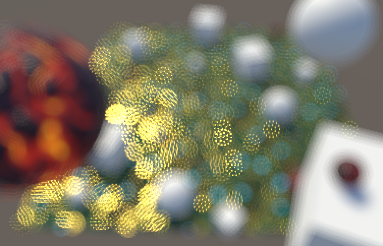 							Using the medium kernel. 						

This gives us a higher-quality kernel, while it's still easy to  distinguish between the two sample rings, so we can see how our effect  works.

### Blurring Bokeh

Although a specialized sampling kernel is better than using a  regular grid, it still requires a lot of samples to get a decent bokeh.  To cover more ground with the same amount of samples, we can create the  effect at half resolution, just like the bloom effect. This will blur  the bokeh somewhat, but that is an acceptable price to pay.

To work at half resolution, we have to first blit to a  half-size texture, create the bokeh at that resolution, then bit back to  full resolution. This requires two additional temporary textures.

```
		int width = source.width / 2;
		int height = source.height / 2;
		RenderTextureFormat format = source.format;
		RenderTexture dof0 = RenderTexture.GetTemporary(width, height, 0, format);
		RenderTexture dof1 = RenderTexture.GetTemporary(width, height, 0, format);

		Graphics.Blit(source, coc, dofMaterial, circleOfConfusionPass);
		Graphics.Blit(source, dof0);
		Graphics.Blit(dof0, dof1, dofMaterial, bokehPass);
		Graphics.Blit(dof1, destination);
//		Graphics.Blit(source, destination, dofMaterial, bokehPass);

		RenderTexture.ReleaseTemporary(coc);
		RenderTexture.ReleaseTemporary(dof0);
		RenderTexture.ReleaseTemporary(dof1);
```

To keep the same bokeh size, we also have to halve the sampling offset.

```
						o *= _MainTex_TexelSize.xy * 4;
```

 							
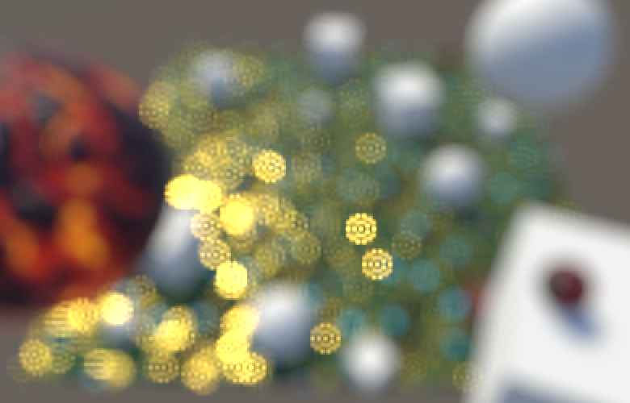 							Using half resolution for bokeh. 						

We're now getting more solid bokeh, but the samples are still  not fully connected yet. We either have to reduce the bokeh size or blur  more. Instead of downsampling further, we'll add an extra blur pass  after creating the bokeh, so it's a postfilter pass.

```
	const int circleOfConfusionPass = 0;
	const int bokehPass = 1;
	const int postFilterPass = 2;
```

We perform the postfilter pass at half resolution, for which we can reuse the first temporary half-size texture.

```
		Graphics.Blit(source, coc, dofMaterial, circleOfConfusionPass);
		Graphics.Blit(source, dof0);
		Graphics.Blit(dof0, dof1, dofMaterial, bokehPass);
		Graphics.Blit(dof1, dof0, dofMaterial, postFilterPass);
		Graphics.Blit(dof0, destination);
```

The postfilter pass will perform a small Gaussian blur while  staying at the same resolution, by using a box filter with a half-texel  offset. This leads to overlapping samples, creating a 3×3 kernel known  as a tent filter.

 							 							 							3×3 tent filter. 						

```
		Pass { // 2 postFilterPass
			CGPROGRAM
				#pragma vertex VertexProgram
				#pragma fragment FragmentProgram

				half4 FragmentProgram (Interpolators i) : SV_Target {
					float4 o = _MainTex_TexelSize.xyxy * float2(-0.5, 0.5).xxyy;
					half4 s =
						tex2D(_MainTex, i.uv + o.xy) +
						tex2D(_MainTex, i.uv + o.zy) +
						tex2D(_MainTex, i.uv + o.xw) +
						tex2D(_MainTex, i.uv + o.zw);
					return s * 0.25;
				}
			ENDCG
		}
```

 							
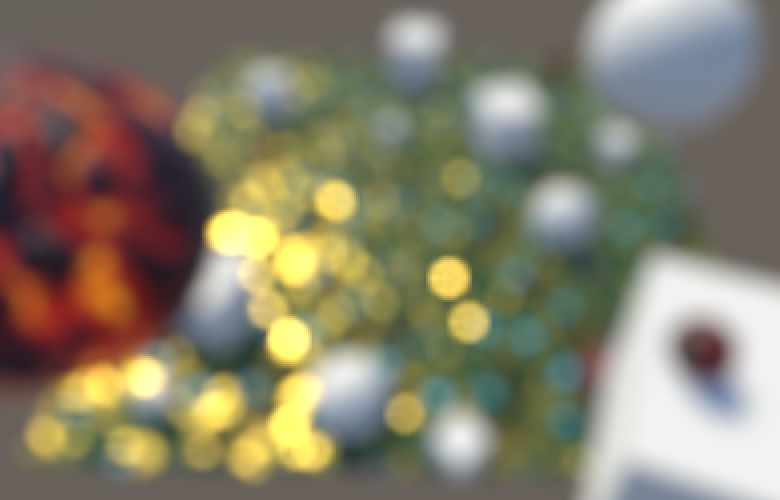 							With a tent filter. 						

### Bokeh Size

Thanks to the postfilter pass, our bokeh looks acceptable at a  radius of 4 half-resolution texels. The bokeh isn't perfectly smooth,  which can be interpreted as the effect of an imperfect or dirty lens.  But this is only really visible for very bright projections on top of  darker backgrounds, and we're currently greatly exaggerating this  effect. But you might prefer a higher-quality bokeh at reduced size, or  prefer an even larger but worse one. So let's make the bokeh radius  configurable via a field, with range 1–10 and a default of 4, expressed  in half-resolution texels. We shouln't use a radius smaller than 1,  because then we mostly end up with simply the blur effect from the  downsampling instead of a bokeh effect.

```
	[Range(1f, 10f)]
	public float bokehRadius = 4f;
```

 							
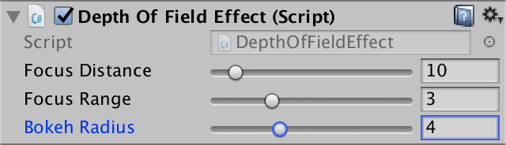 							Slider for bokeh radius. 						

Pass the radius to the shader.

```
		dofMaterial.SetFloat("_BokehRadius", bokehRadius);
		dofMaterial.SetFloat("_FocusDistance", focusDistance);
		dofMaterial.SetFloat("_FocusRange", focusRange);
```

Add a shader variable for it, again using a `**float**` as it's used for texture sampling.

```
		float _BokehRadius, _FocusDistance, _FocusRange;
```

Finally, use the configurable radius instead of the fixed value 4.

```
						float2 o = kernel[k];
						o *= _MainTex_TexelSize.xy * _BokehRadius;
```

<iframe src="https://gfycat.com/ifr/ShallowImmaculateGelding"></iframe>

Configurable bokeh radius.

unitypackage

## Focusing

By now we can determine the size of the circle of confusion and  we can create the bokeh effect at maximum size. The next step is to  combine these to render a variable bokeh, simulating camera focus.

### Downsampling CoC

Because we're creating bokeh at half resolution, we also need  the CoC data at half resolution. A default blit or texture sample simply  averages adjacent texels, which doesn't make sense for depth values or  things derived from it, like the CoC. So we'll have to downsample  ourselves, with a custom prefilter pass.

```
	const int circleOfConfusionPass = 0;
	const int preFilterPass = 1;
	const int bokehPass = 2;
	const int postFilterPass = 3;
```

Besides the source texture, the prefilter pass also needs to  read from the CoC texture. So pass it to the shader before downsampling.

```
		dofMaterial.SetTexture("_CoCTex", coc);

		Graphics.Blit(source, coc, dofMaterial, circleOfConfusionPass);
		Graphics.Blit(source, dof0, dofMaterial, preFilterPass);
		Graphics.Blit(dof0, dof1, dofMaterial, bokehPass);
		Graphics.Blit(dof1, dof0, dofMaterial, postFilterPass);
		Graphics.Blit(dof0, destination);
```

Add the corresponding texture variable to the shader.

```
		sampler2D _MainTex, _CameraDepthTexture, _CoCTex;
```

Next, create a new pass to perform the downsampling. The color  data can be retrieved with a single texture sample. But the CoC value  needs special care. Begin by sampling from the four high-resolution  texels corresponding to the low-resolution texel, and average them.  Store the result in the alpha channel.

```
		Pass { // 1 preFilterPass
			CGPROGRAM
				#pragma vertex VertexProgram
				#pragma fragment FragmentProgram

				half4 FragmentProgram (Interpolators i) : SV_Target {
					float4 o = _MainTex_TexelSize.xyxy * float2(-0.5, 0.5).xxyy;
					half coc0 = tex2D(_CoCTex, i.uv + o.xy).r;
					half coc1 = tex2D(_CoCTex, i.uv + o.zy).r;
					half coc2 = tex2D(_CoCTex, i.uv + o.xw).r;
					half coc3 = tex2D(_CoCTex, i.uv + o.zw).r;
					
					half coc = (coc0 + coc1 + coc2 + coc3) * 0.25;

					return half4(tex2D(_MainTex, i.uv).rgb, coc);
				}
			ENDCG
		}

		Pass { // 2 bokehPass
			…
		}

		Pass { // 3 postFilterPass
			…
		}
```

 							Why not use texture gathering? 							 						

This would be a regular downsample, but we don't want that.  Instead, we'll just take the most extreme CoC value of the four texels,  either positive or negative.

```
//					half coc = (coc0 + coc1 + coc2 + coc3) * 0.25;
					half cocMin = min(min(min(coc0, coc1), coc2), coc3);
					half cocMax = max(max(max(coc0, coc1), coc2), coc3);
					half coc = cocMax >= -cocMin ? cocMax : cocMin;
```

### Using the Correct CoC

To use the correct CoC radius, we have to scale the CoC value by the bokeh radius when we calculate it in the first pass.

```
					float coc = (depth - _FocusDistance) / _FocusRange;
					coc = clamp(coc, -1, 1) * _BokehRadius;
```

To determine whether a kernel sample contributes to the bokeh  of a fragment, we have to check whether the CoC of that sample overlaps  this fragment. We need to know the kernel radius used for this sample,  which is simply the length of its offset, so compute it. We measure this  in texels, so we have to do this before compensating for the texel  size.

```
					for (int k = 0; k < kernelSampleCount; k++) {
						float2 o = kernel[k] * _BokehRadius;
//						o *= _MainTex_TexelSize.xy * _BokehRadius;
						half radius = length(o);
						o *= _MainTex_TexelSize.xy;
						color += tex2D(_MainTex, i.uv + o).rgb;
					}
```

 							Do we have to calculate the radius per sample? 							 						

If the sample's CoC is at least as large as the kernel radius  used for its offset, then that point's projection ends up overlapping  the fragment. If not, then that point doesn't influence this fragment  and should be skipped. This means that we must once again keep track of  the accumulated color's weight to normalize it.

```
					half3 color = 0;
					half weight = 0;
					for (int k = 0; k < kernelSampleCount; k++) {
						float2 o = kernel[k] * _BokehRadius;
						half radius = length(o);
						o *= _MainTex_TexelSize.xy;
//						color += tex2D(_MainTex, i.uv + o).rgb;
						half4 s = tex2D(_MainTex, i.uv + o);

						if (abs(s.a) >= radius) {
							color += s.rgb;
							weight += 1;
						}
					}
					color *= 1.0 / weight;
```

 							
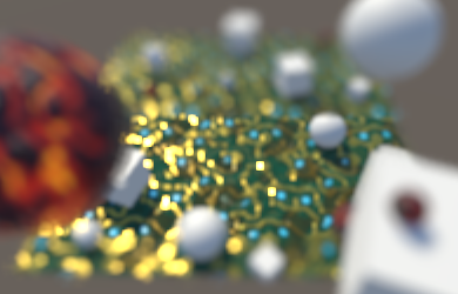 							Bokeh based on CoC. 						

### Smoothing the Sampling

Our image now contains bokeh discs of varying sizes, but the  transition between sizes is abrupt. To see why this happens, increase  the bokeh size so you can see the individual samples and play with the  focus range or distance.

<iframe src="https://gfycat.com/ifr/FewGlitteringAmoeba"></iframe>

Samples are excluded based on their CoC.

Samples in the same ring of the kernel tend to have roughly the  same CoC values, which means that they tend to get discarded or  included at the same time. The result is that we mostly end up with  three cases: no rings, one ring, and two rings. It also turns out that  two kernel samples never get included, which means that their unscaled  kernel radius is actually slightly larger than 1.

We can mitigate both problems by relaxing our criteria for  including a sample. Instead of completely discarding samples, we'll  assign them a weight in the 0–1 range. This weight depends on the CoC  and offset radius, for which we can use a separate function.

```
				half Weigh (half coc, half radius) {
					return coc >= radius;
				}

				half4 FragmentProgram (Interpolators i) : SV_Target {
					half3 color = 0;
					half weight = 0;
					for (int k = 0; k < kernelSampleCount; k++) {
						…

//						if (abs(s.a) >= radius) {
//							color += s;
//							weight += 1;
//						}
						half sw = Weigh(abs(s.a), radius);
						color += s.rgb * sw;
						weight += sw;
					}
					color *= 1.0 / weight;
					return half4(color, 1);
				}
```

As a weighing function we can use the CoC minus the radius,  clamped to 0–1. By adding a small value and then dividing by it, we  introduce an offset and turn it into a steep ramp. The result is a  smoother transition and all kernel samples can get included.

```
				half Weigh (half coc, half radius) {
//					return coc >= radius;
					return saturate((coc - radius + 2) / 2);
				}
```

<iframe src="https://gfycat.com/ifr/WindingWarmHornbill"></iframe>

Smoothed sampling threshold.

### Staying in Focus

A downside of working at half resolution is that the entire  image is downsampled, which enforces a minimum amount of blurring. But  fragments that are in focus shouldn't be affected by the depth-of-field  effect at all. To keep those fragments sharp, we have to combine the  half-resolution effect with the full-resolution source image and blend  between them based on the CoC.

Replace the final blit of our effect with one that goes from  source to destination, using a new combine pass. This pass also needs  access to the final depth-of-field texture, so pass that to the shader  as well.

```
	const int circleOfConfusionPass = 0;
	const int preFilterPass = 1;
	const int bokehPass = 2;
	const int postFilterPass = 3;
	const int combinePass = 4;

	…

	void OnRenderImage (RenderTexture source, RenderTexture destination) {
		…

		dofMaterial.SetTexture("_CoCTex", coc);
		dofMaterial.SetTexture("_DoFTex", dof0);

		Graphics.Blit(source, coc, dofMaterial, circleOfConfusionPass);
		Graphics.Blit(source, dof0, dofMaterial, preFilterPass);
		Graphics.Blit(dof0, dof1, dofMaterial, bokehPass);
		Graphics.Blit(dof1, dof0, dofMaterial, postFilterPass);
		Graphics.Blit(source, destination, dofMaterial, combinePass);
//		Graphics.Blit(dof0, destination);

		…
	}
```

Add a variable for the DoF texture.

```
		sampler2D _MainTex, _CameraDepthTexture, _CoCTex, _DoFTex;
```

And create the new pass, initially performing a simple pass-through of the source.

```
		Pass { // 4 combinePass
			CGPROGRAM
				#pragma vertex VertexProgram
				#pragma fragment FragmentProgram

				half4 FragmentProgram (Interpolators i) : SV_Target {
					half4 source = tex2D(_MainTex, i.uv);

					half3 color = source.rgb;
					return half4(color, source.a);
				}
			ENDCG
		}
```

The source color is fully in-focus. The DoF texture contains a  mix of both in-focus and unfocused fragments, but even its focused  fragments are blurred. So we have to use the source for all focused  fragments. But we cannot suddenly switch from one texture to the other,  we have to blend the transition. Let's say that fragments with an  absolute CoC below 0.1 are fully in focus and should use the source  texture. And let's say that fragments with an absolute CoC above 1  should fully use the DoF texture. We blend in between, using the `smoothstep` function.

```
					half4 source = tex2D(_MainTex, i.uv);
					half coc = tex2D(_CoCTex, i.uv).r;
					half4 dof = tex2D(_DoFTex, i.uv);

					half dofStrength = smoothstep(0.1, 1, abs(coc));
					half3 color = lerp(source.rgb, dof.rgb, dofStrength);
					return half4(color, source.a );
```

 							
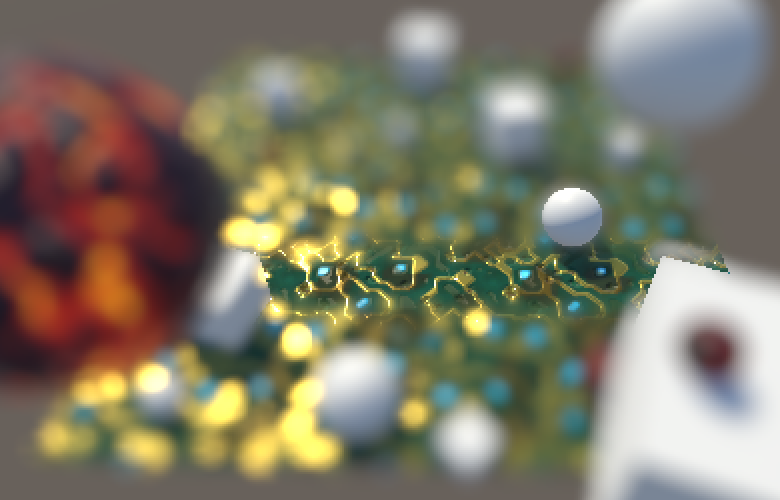 							Sharp in-focus region. 						

The transition region is arbitrary. In our case, using 1 as the  upper bound means that the DoF effect is at full strength when the CoC  has a radius of a single texel. You can increase the blend range to go  past this point, more aggressively blending between sharp and bokeh  data. A reduced blend range will reveal more of the DoF texture that's  only affected by the downsample blurring.

### Splitting Foreground and Background

Unfortunately, blending with the source image produces  incorrect results when there is an unfocused foreground in front of a  focused background. This happens because the foreground should be  partially projected on top of the background, which our DoF effect does,  but we eliminate this by choosing to use the source image, based on the  background's CoC. To deal with this, we somehow have to split the  foreground and background.

Let's begin by only including kernel samples that are in the  background, so when their CoC is positive. We can do this using the  maximum of 0 and the CoC instead of the absolute CoC when weighing the  sample. Because this makes it possible to end up with zero samples, make  sure to keep the division valid, for example by adding 1 when the  weight is 0.

```
				half4 FragmentProgram (Interpolators i) : SV_Target {
					half3 bgColor = 0;
					half bgWeight = 0;
					for (int k = 0; k < kernelSampleCount; k++) {
						float2 o = kernel[k] * _BokehRadius;
						half radius = length(o);
						o *= _MainTex_TexelSize.xy;
						half4 s = tex2D(_MainTex, i.uv + o);

						half bgw = Weigh(max(0, s.a), radius);
						bgColor += s.rgb * bgw;
						bgWeight += bgw;
					}
					bgColor *= 1 / (bgWeight + (bgWeight == 0));
					
					half3 color = bgColor;
					return half4(color, 1);
				}
```

 							
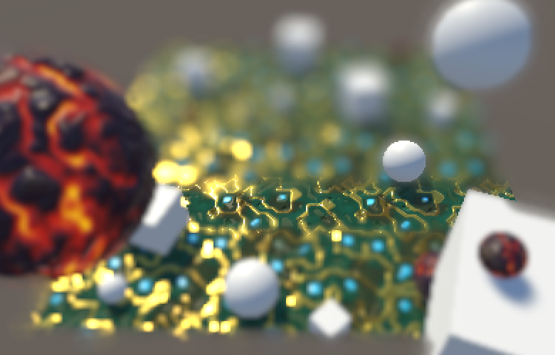 							Background only, still blending with source. 						

This eliminates the contribution of the foreground, but now we  can see that part of the background gets projected onto the foreground.  This shouldn't happen, because the foreground is in the way. We can cut  out those cases by using the minimum of the sample's CoC and the CoC of  the fragment we're working on.

```
					half coc = tex2D(_MainTex, i.uv).a;
					
					half3 bgColor = 0;
					half bgWeight = 0;
					for (int k = 0; k < kernelSampleCount; k++) {
						…

						half bgw = Weigh(max(0, min(s.a, coc)), radius);
						bgColor += s.rgb * bgw;
						bgWeight += bgw;
					}
```

 							
 							Cutting out the foreground. 						

Next, keep track of the foreground color as well. The foreground's weight is based on the negative CoC, so it becomes positive.

```
					half3 bgColor = 0, fgColor = 0;
					half bgWeight = 0, fgWeight = 0;
					for (int k = 0; k < kernelSampleCount; k++) {
						float2 o = kernel[k] * _BokehRadius;
						half radius = length(o);
						o *= _MainTex_TexelSize.xy;
						half4 s = tex2D(_MainTex, i.uv + o);

						half bgw = Weigh(max(0, s.a), radius);
						bgColor += s.rgb * bgw;
						bgWeight += bgw;

						half fgw = Weigh(-s.a, radius);
						fgColor += s.rgb * fgw;
						fgWeight += fgw;
					}
					bgColor *= 1 / (bgWeight + (bgWeight == 0));
					fgColor *= 1 / (fgWeight + (fgWeight == 0));
					half3 color = fgColor;
```

 							
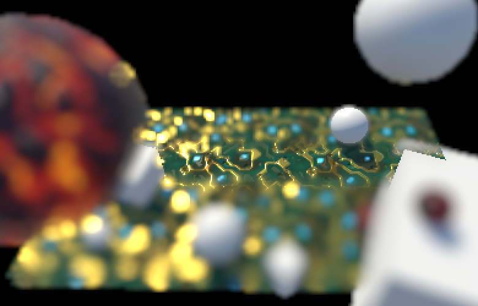 							Foreground only. 						

### Recombing Foreground and Background

We're not going to put the foreground and background in  separate buffers. Instead, we'll keep the data in a single buffer.  Because the foreground sits in front of the background, we'll use it  when we have at least a single foreground sample. We can do this  smoothly by interpolating between background and foreground based on the  foreground weight, up to 1.

```
					fgColor *= 1 / (fgWeight + (fgWeight == 0));
					half bgfg = min(1, fgWeight);
					half3 color = lerp(bgColor, fgColor, bgfg);
```

 							
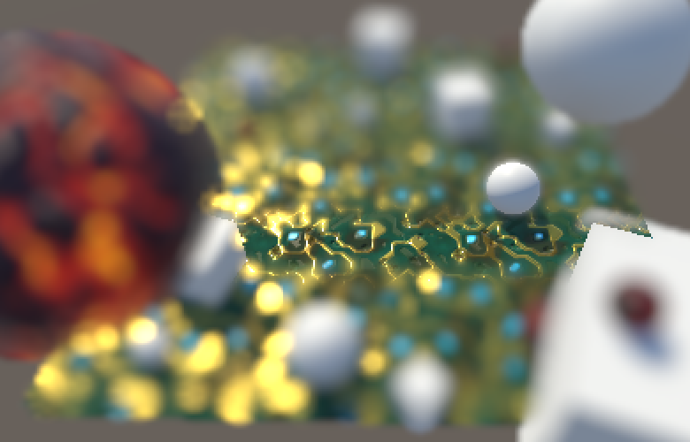 							Recombined. 						

To fix the blending with the source image, we have to modify  how we blend with the foreground. The combine pass needs to know how the  foreground and background were mixed, using the `bgfg` interpolator, so put it in the alpha channel of the DoF texture.

```
					half bgfg = min(1, fgWeight);
					half3 color = lerp(bgColor, fgColor, bgfg);
					return half4(color, bgfg);
```

In the combine pass, we now first have to interpolate based on  the positive CoC, to factor in the background. Then we have to  interpolate the result again with the DoF, using the foreground weight.  This results in a nonlinear interpolation between the source and DoF,  making the DoF slightly stronger.

```
//					half dofStrength = smoothstep(0.1, 1, abs(coc));
					half dofStrength = smoothstep(0.1, 1, coc);
					half3 color = lerp(
						source.rgb, dof.rgb,
						dofStrength + dof.a - dofStrength * dof.a
					);
```

 							How does that interpolation work? 							 						

 							
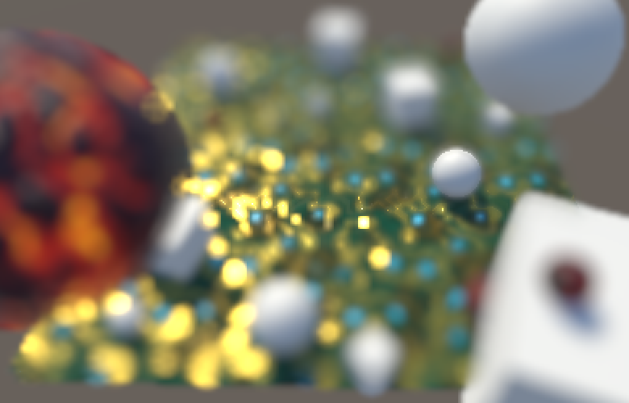 							Preserved foreground, but lost focus. 						

The foreground now dominates the image, wiping out the focused  region again. That happens because it's at full strength if even a  single kernel sample belongs to the foreground. To make it proportional,  divide `bgfg` by the total amount of samples.

```
					half bgfg = min(1, fgWeight / kernelSampleCount);
```

 							
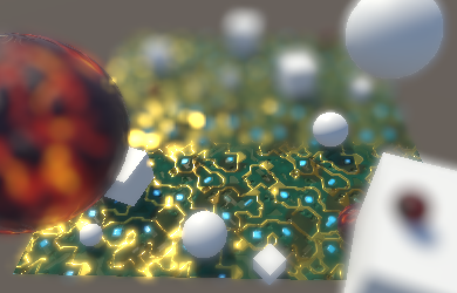 							Proportional foreground. 						

That made the foreground too weak, and it also caused artifacts  to appear around its edges. We have to boost it again, using some  factor. As we're dealing with a disc, let's use π. That makes the  foreground stronger than before the split, but not too bad. You could  try another factor if you find the effect too strong or weak.

```
					half bgfg =
						min(1, fgWeight * 3.14159265359 / kernelSampleCount);
```

 							
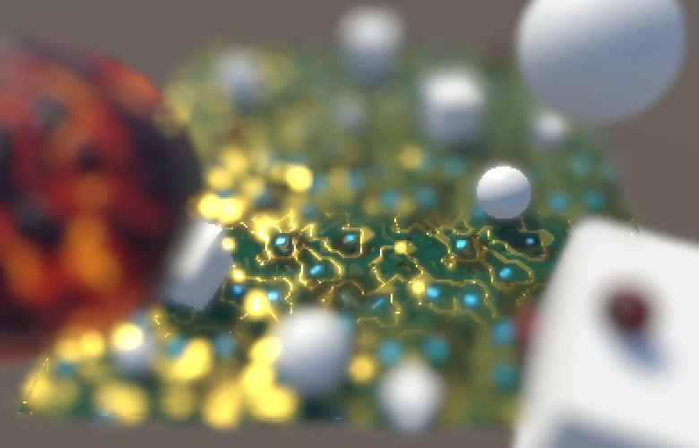 							Boosted foreground. 						

Unfortunately can we still get some artifacts around the edges  of the foreground. It's very obvious along the bottom left corner of the  plane in the above screenshot. This is caused by a sudden transition to  the far-away background that's also out of focus. Here a large portion  of the kernel samples end up in the background, weakening the foreground  influence. To deal with that, we can switch back to once again using  the absolute CoC in the combine pass.

```
					half dofStrength = smoothstep(0.1, 1, abs(coc));
```

 							
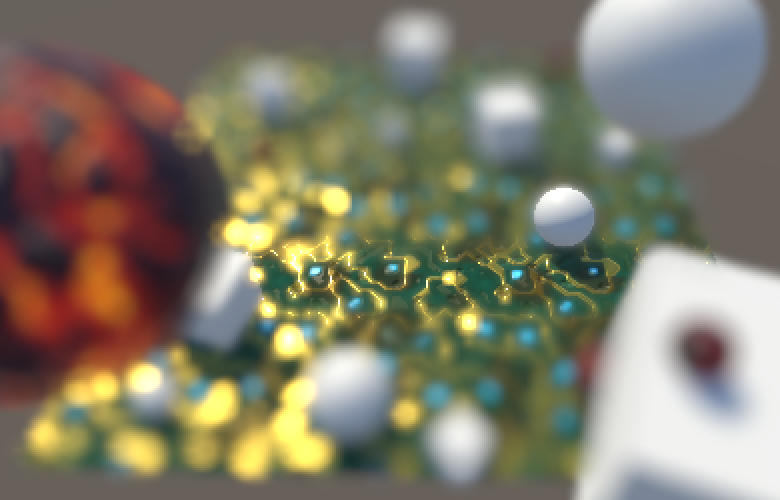 							Foreground edge without artifacts. 						

### Toning Down the Bokeh

We wrap up by toning down the strength of the bokeh. It  shouldn't change the overall brightness of the image much. We can  achieve this by using a weighed average when downsampling in the  prefilter pass, instead of just averaging the colors of the four texels.  We'll weight each color c

 using 

11+(cr∨cg∨cb)

.

```
				half Weigh (half3 c) {
					return 1 / (1 + max(max(c.r, c.g), c.b));
				}

				half4 FragmentProgram (Interpolators i) : SV_Target {
					float4 o = _MainTex_TexelSize.xyxy * float2(-0.5, 0.5).xxyy;

					half3 s0 = tex2D(_MainTex, i.uv + o.xy).rgb;
					half3 s1 = tex2D(_MainTex, i.uv + o.zy).rgb;
					half3 s2 = tex2D(_MainTex, i.uv + o.xw).rgb;
					half3 s3 = tex2D(_MainTex, i.uv + o.zw).rgb;

					half w0 = Weigh(s0);
					half w1 = Weigh(s1);
					half w2 = Weigh(s2);
					half w3 = Weigh(s3);

					half3 color = s0 * w0 + s1 * w1 + s2 * w2 + s3 * w3;
					color /= max(w0 + w1 + w2 + s3, 0.00001);

					half coc0 = tex2D(_CoCTex, i.uv + o.xy).r;
					…
					half coc = cocMax >= -cocMin ? cocMax : cocMin;

//					return half4(tex2D(_MainTex, i.uv).rgb, coc);
					return half4(color, coc);
				}
```

 							
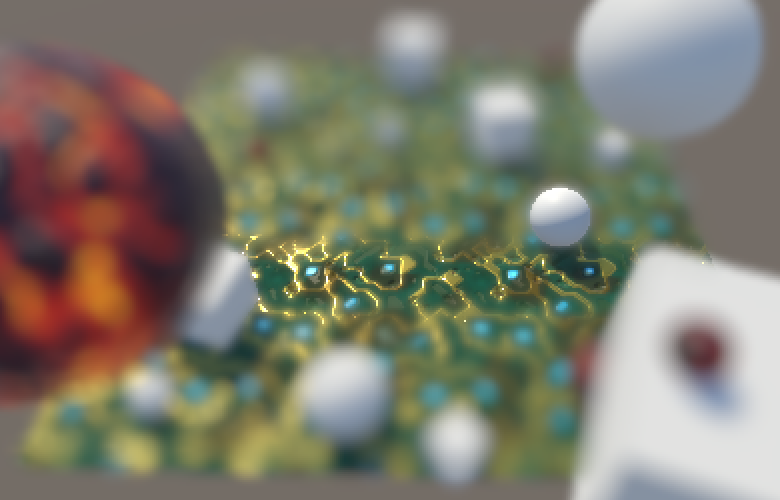 							Weighed bokeh effect. 						

You now have a simple depth-of-field effect that's a rough  equivalent of the one found in Unity's post effect stack v2. Turning it  into a production-quality effect would require a lot of tuning, or you  could use the knowledge of how it works to tweak Unity's version.

unitypackage

PDF
