# Flat and Wireframe Shading

Derivatives and Geometry

- Use screen-space derivatives to find triangle normals.
- Do the same via a geometry shader.
- Use generated barycentric coordinates to create a wireframe.
- Make the wires fixed-width and configurable.

This tutorial covers how to add support for flat shading and  showing the wireframe of a mesh. It uses advanced rendering techniques  and assumes you're familiar with the material covered in the [Rendering](https://catlikecoding.com/unity/tutorials/rendering/part-1/) series.

This tutorial is made with Unity 2017.1.0.

 					
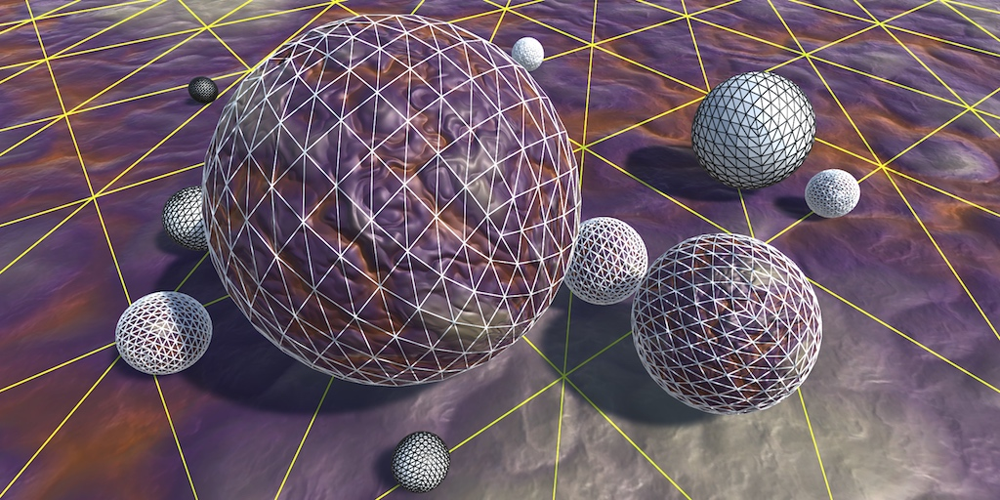 					Exposing the triangles. 				

## Flat Shading

Meshes consist of triangles, which are flat by definition. We  use surface normal vectors to add the illusion of curvature. This makes  it possible to create meshes that represent seemingly smooth surfaces.  However, sometimes you actually want to display flat triangles, either  for style or to better see the mesh's topology.

To make the triangles appear as flat as they really are, we have  to use the surface normals of the actual triangles. It will give meshes  a faceted appearance, known as flat shading. This can be done by making  the normal vectors of a triangle's three vertices equal to the  triangle's normal vector. This makes it impossible to share vertices  between triangles, because then they would share normals as well. So we  end up with more mesh data. It would be convenient if we could keep  sharing vertices. Also, it would be nice if we could use a flat-shading  material with any mesh, overriding its original normals, if any.

Besides flat shading, it can also be useful or stylish to show a  mesh's wireframe. This makes the topology of the mesh even more  obvious. Ideally, we can do both flat shading and wireframe rendering  with a custom material, in a single pass, for any mesh. To create such a  material, we need a new shader. We'll use the final shader from [part 20 of the Rendering series](https://catlikecoding.com/unity/tutorials/rendering/part-20/) as our base. Duplicate *My First Lighting Shader* and change its name to *Flat Wireframe*.

Rendering 20 unitypackage

```
Shader "Custom/Flat Wireframe" { … }
```

 						Can't we already see the wireframe in the editor? 						 					

### Derivative Instructions

Because triangles are flat, their surface normal is the same at  every point on their surface. Hence, each fragment rendered for a  triangle should use the same normal vector. But we current do not know  what this vector is. In the vertex program, we only have access to the  vertex data stored in the mesh, processed in isolation. The normal  vector stored here is of no use to us, unless it's designed to represent  the triangle's normal. And in the fragment program, we only have access  to the interpolated vertex normals.

To determine the surface normal, we need to know the  orientation of the triangle in world space. This can be determined via  the positions of the triangle's vertices. Assuming that the triangle is  not degenerate, its normal vector is equal to the normalized cross  product of two of the triangle's edges. If it is degenerate, then it  won't be rendered anyway. So gives a triangle's vertices a

, 

b

, and 

c

 in counter-clockwise order, its normal vector is 

n=(c−a)×(b−a)

. Normalizing that gives us the final unit normal vector, 

ˆn=n|n|

.

 							
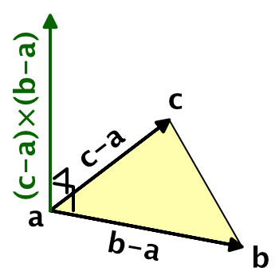 							Deriving a triangle's normal. 						

We don't actually need to use the triangle's vertices. Any  three points that lie in the triangle's plane will do, as long as those  points form a triangle too. Specifically, we only need two vectors that  lie in the triangle's plane, as long as they're not parallel and are  larger than zero.

One possibility is to use points corresponding to the world  positions of rendered fragments. For example, the world position of the  fragment we're currently rendering, the position of the fragment to the  right of it, and the position of the fragment above it, in screen space.

 							
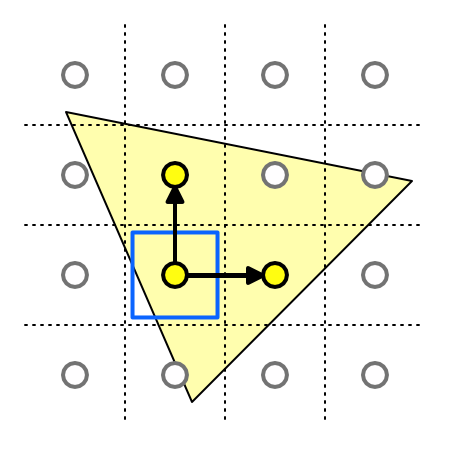 							Using world positions of fragments. 						

If we could access the world positions of adjacent fragments,  then this could work. There is no way to directly access the data of  adjacent fragments, but we can access the screen-space derivatives of  this data. This is done via special instructions, which tell us the rate  of change between fragments, for any piece of data, in either the  screen-space X or Y dimension.

For example, our current fragment's world position is p0

. The position of the next fragment in the screen-space X dimension is 

px

. The rate of change of the world position in the X dimension between these two fragments is thus 

∂p∂x=px−p0

.  This is the partial derivative of the world position, in the  screen-space X dimension. We can retrieve this data in the fragment  program via the `ddx` function, by supplying it with the world position. Let's do this at the start of the `InitializeFragmentNormal` function in *My Lighting.cginc*.

```
void InitializeFragmentNormal(inout Interpolators i) {
	float3 dpdx = ddx(i.worldPos);
	
	…
}
```

We can do the same for the screen-space Y dimension, finding ∂p∂y=py−p0

 by invoking the `ddy` function with the world position.

```
	float3 dpdx = ddx(i.worldPos);
	float3 dpdy = ddy(i.worldPos);
```

Because these values represent the differences between the  fragment world positions, they define two edges of a triangle. We don't  actually know the exact shape of that triangle, but it's guaranteed to  lie in the original triangle's plane, and that's all that matters. So  the final normal vector is the normalized cross product of those  vectors. Override the original normal with this vector.

```
	float3 dpdx = ddx(i.worldPos);
	float3 dpdy = ddy(i.worldPos);
	i.normal = normalize(cross(dpdy, dpdx));
```

 							How do `ddx` and `ddy` work? 							 						

Create a new material that uses our *Flat Wireframe*  shader. Any mesh that uses this material should be rendered using flat  shading. They will appear faceted, though this might be hard to see when  you're also using normal maps. I use a standard capsule mesh in the  screenshots for this tutorial, with a gray material.

 							 							 							Smooth and flat shading. 						

From a distance, it might look like the capsule's made out of quads, but those quads are made of two triangles each.

 							
 							Quads made of triangles. 						

While this works, we've actually changed the behavior of all shaders that rely on the *My Lighting* include file. So remove the code that we just added.

```
//	float3 dpdx = ddx(i.worldPos);
//	float3 dpdy = ddy(i.worldPos);
//	i.normal = normalize(cross(dpdy, dpdx));
```

### Geometry Shaders

There is another way that we can determine the triangle's  normal. Instead of using derivative instructions, we could use the  actual triangle vertices to compute the normal vector. This requires use  to do work per triangle, not per individual vertex or fragment. That's  where geometry shaders come in.

The geometry shader stage sits in between the vertex and the  fragment stage. It is fed the output of the vertex program, grouped per  primitive. A geometry program can modify this data, before it gets  interpolated and used to render fragments.

 							
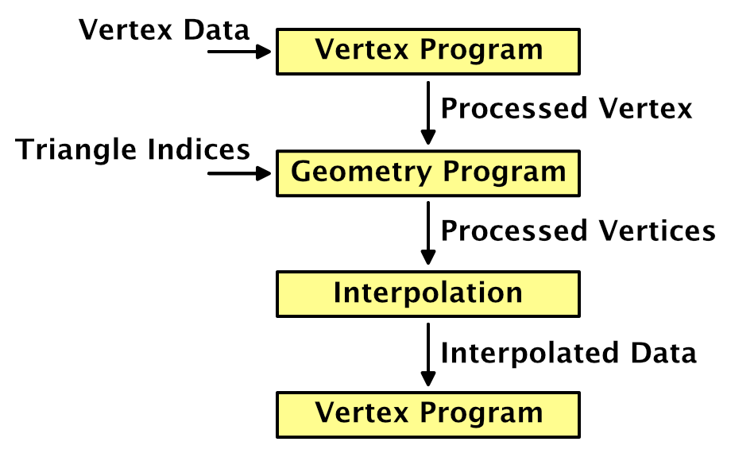 							Processing vertices per triangle. 						

The added value of the geometry shader is that the vertices are  fed to it per primitive, so three for each triangle in our case.  Whether mesh triangles share vertices doesn't matter, because the  geometry program outputs new vertex data. This allows us to derive the  triangle's normal vector and use it as the normal for all three  vertices.

Let's put the code for our geometry shader in its own include file, *MyFlatWireframe.cginc*. Have this file include *My Lighting.cginc* and define a `MyGeometryProgram` function. Start with an empty void function.

```
#if !defined(FLAT_WIREFRAME_INCLUDED)
#define FLAT_WIREFRAME_INCLUDED

#include "My Lighting.cginc"

void MyGeometryProgram () {}

#endif
```

Geometry shaders are only supported when targeting shader model  4.0 or higher. Unity will automatically increase the target to this  level if it was defined lower, but let's be explicit about it. To  actually use a geometry shader, we have to add the `#pragma geometry` directive, just like for the vertex and fragment functions. Finally, *MyFlatWireframe* has to be included instead of *My Lighting*. Apply these changes to the base, additive, and deferred passes of our *Flat Wireframe* shader.

```
			#pragma target 4.0

			…

			#pragma vertex MyVertexProgram
			#pragma fragment MyFragmentProgram
			#pragma geometry MyGeometryProgram

			…
			
//			#include "My Lighting.cginc"
			#include "MyFlatWireframe.cginc"
```

This will result in shader compiler errors, because we haven't  defined our geometry function correctly yet. We have to declare how many  vertices it will output. This number can vary, so we must provide a  maximum. Because we're working with triangles, we'll always output three  vertices per invocation. This is specified by adding the `maxvertexcount` attribute to our function, with 3 as an argument.

```
[maxvertexcount(3)]
void GeometryProgram () {}
```

The next step is to define the input. As we're working with the  output of the vertex program before interpolation, the data type is `**InterpolatorsVertex**`.  So the type name isn't technically correct in this case, but we didn't  took the geometry shader into consideration when we named it.

```
[maxvertexcount(3)]
void MyGeometryProgram (InterpolatorsVertex i) {}
```

We also have to declare which type of primitive we're working on, which is `triangle`  in our case. This has to be specified before the input type. Also, as  triangles have three vertices each, we're working on an array of three  structures. We have to define this explicitly.

```
[maxvertexcount(3)]
void MyGeometryProgram (triangle InterpolatorsVertex i[3]) {}
```

Because the amount of vertices that a geometry shader can  output varies, we don't have a singular return type. Instead, the  geometry shader writes to a stream of primitives. In our case, it's a `TriangleStream`, which has to be specified as an `**inout**` parameter.

```
[maxvertexcount(3)]
void MyGeometryProgram (
	triangle InterpolatorsVertex i[3],
	inout TriangleStream stream
) {}
```

`TriangleStream` works like a generic type in C#. It needs to know the type of the vertex data that we're going to give it, which is still `**InterpolatorsVertex**`.

```
[maxvertexcount(3)]
void MyGeometryProgram (
	triangle InterpolatorsVertex i[3],
	inout TriangleStream<InterpolatorsVertex> stream
) {}
```

Now that the function signature is correct, we have to put the  vertex data into the stream. This is done by invoking the stream's `Append` function once per vertex, in the order that we received them.

```
[maxvertexcount(3)]
void MyGeometryProgram (
	triangle InterpolatorsVertex i[3],
	inout TriangleStream<InterpolatorsVertex> stream
) {
	stream.Append(i[0]);
	stream.Append(i[1]);
	stream.Append(i[2]);
}
```

At this point our shader works again. We've added a custom  geometry stage, which simply passes through the output from the vertex  program, unmodified.

 							Why does the geometry program look so different? 							 						

### Modifying Vertex Normals Per Triangle

To find the triangle's normal vector, begin by extracting the world positions of its three vertices.

```
	float3 p0 = i[0].worldPos.xyz;
	float3 p1 = i[1].worldPos.xyz;
	float3 p2 = i[2].worldPos.xyz;
	
	stream.Append(i[0]);
	stream.Append(i[1]);
	stream.Append(i[2]);
```

Now we can perform the normalized cross product, once per triangle.

```
	float3 p0 = i[0].worldPos.xyz;
	float3 p1 = i[1].worldPos.xyz;
	float3 p2 = i[2].worldPos.xyz;

	float3 triangleNormal = normalize(cross(p1 - p0, p2 - p0));
```

Replace the vertex normals with this triangle normal.

```
	float3 triangleNormal = normalize(cross(p1 - p0, p2 - p0));
	i[0].normal = triangleNormal;
	i[1].normal = triangleNormal;
	i[2].normal = triangleNormal;
```

 							
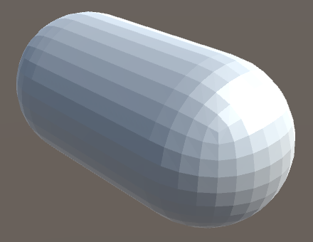 							Flat shading, again. 						

We end up with the same results as before, but now using a  geometry shader stage instead of relying on screen-space derivative  instructions.

 							Which approach is best? 							 						

unitypackage

## Rendering the Wireframe

After taking care of the flat shading, we move on to rendering  the mesh's wireframe. We're not going to create new geometry, nor will  we use an extra pass to draw lines. We'll create the wireframe visuals  by adding a line effect on the inside of triangles, along their edges.  This can create a convincing wireframe, although the lines defining a  shape's silhouette will appear half as thick as the lines on the inside.  This usually isn't very noticeable, so we'll accept this inconsistency.

 						
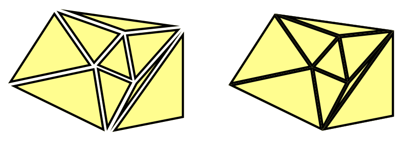 						Wire effect with thinner silhouette lines. 					

### Barycentric Coordinates

To add line effects to the triangle edges, we need to know a  fragment's distance to the nearest edge. This means that topological  information about the triangle needs to be available in the fragment  program. This can be done by adding the barycentric coordinates of the  triangle to the interpolated data.

 							What are barycentric coordinates? 							 						

One way to add barycentric coordinates to triangles is to use  the mesh's vertex colors to store them. The first vertex of each  triangle becomes red, the second becomes green, and the third becomes  blue. However, this would require meshes with vertex colors assigned  this way, and makes it impossible to share vertices. We want a solution  that works with any mesh. Fortunately, we can use our geometry program  to add the required coordinates.

Because the barycentric coordinates are not provided by the  mesh, the vertex program doesn't know about them. So they're not part of  the `**InterpolatorsVertex**` structure. To have the geometry program output them, we have to define a new structure. Begin by defining `**InterpolatorsGeometry**` above `MyGeometryProgram`. It should contain the same data as `**InterpolatorsVertex**`, so use that as its contents.

```
struct InterpolatorsGeometry {
	InterpolatorsVertex data;
};
```

Adjust the stream data type of `MyGeometryProgram`  so it uses the new structure. Define variables of this type inside the  function, assign the input data to them, and append them to the stream,  instead of directly passing the input through.

```
void MyGeometryProgram (
	triangle InterpolatorsVertex i[3],
	inout TriangleStream<InterpolatorsGeometry> stream
) {
	…

	InterpolatorsGeometry g0, g1, g2;
	g0.data = i[0];
	g1.data = i[1];
	g2.data = i[2];

	stream.Append(g0);
	stream.Append(g1);
	stream.Append(g2);
}
```

Now we can add additional data to `**InterpolatorsGeometry**`. Give it a `**float3** barycentricCoordinators` vector, using the tenth interpolator semantic.

```
struct InterpolatorsGeometry {
	InterpolatorsVertex data;
	float3 barycentricCoordinates : TEXCOORD9;
};
```

Give each vertex a barycentric coordinate. It doesn't matter which vertex gets what coordinate, as long as they are valid.

```
	g0.barycentricCoordinates = float3(1, 0, 0);
	g1.barycentricCoordinates = float3(0, 1, 0);
	g2.barycentricCoordinates = float3(0, 0, 1);

	stream.Append(g0);
	stream.Append(g1);
	stream.Append(g2);
```

Note that the barycentric coordinates always add up to 1. So we  could suffice with only passing on two, deriving the third coordinate  by subtracting the other two from 1. That means we have to interpolate  one less number, so let's make that change.

```
struct InterpolatorsGeometry {
	InterpolatorsVertex data;
	float2 barycentricCoordinates : TEXCOORD9;
};
	
	[maxvertexcount(3)]
void MyGeometryProgram (
	triangle InterpolatorsVertex i[3],
	inout TriangleStream<InterpolatorsGeometry> stream
) {
	…

	g0.barycentricCoordinates = float2(1, 0);
	g1.barycentricCoordinates = float2(0, 1);
	g2.barycentricCoordinates = float2(0, 0);

	…
}
```

 							Are our barycentric coordinates now interpolated, with barycentric coordinates? 							 						

### Defining Extra Interpolators

At this point we're passing the barycentric coordinates to the  fragment program, but it doesn't know about them yet. We have to add  them to the definition of `**Interpolators**` in *My Lighting*. But we can't simply assume that this data is available. That's only the case for our *Flat Wireframe* shader. So let's make it possible for anyone using *My Lighting* to define their own interpolator data made available via a geometry shader, by defining it via a `CUSTOM_GEOMETRY_INTERPOLATORS` macro. To support this, insert the macro into `**Interpolators**` if it has been defined at that point.

```
struct Interpolators {
	…

	#if defined (CUSTOM_GEOMETRY_INTERPOLATORS)
		CUSTOM_GEOMETRY_INTERPOLATORS
	#endif
};
```

Now we can define this macro in *MyFlatWireframe*. We have to do this before including *My Lighting*. We can also use it in `**InterpolatorsGeometry**`, so we only have to write the code once.

```
#define CUSTOM_GEOMETRY_INTERPOLATORS \
	float2 barycentricCoordinates : TEXCOORD9;

#include "My Lighting.cginc"

struct InterpolatorsGeometry {
	InterpolatorsVertex data;
//	float2 barycentricCoordinates : TEXCOORD9;
	CUSTOM_GEOMETRY_INTERPOLATORS
};
```

 							Why am I getting a conversion compile error? 							 						

### Splitting My Lighting

How are we going to use the barycentric coordinates to visualize the wireframe? However we do it, *My Lighting*  should not be involved. Instead, we can make it possible to rewire its  functionality via another file, by inserting our own function in its  code.

To overwrite functionality of *My Lighting*,  we have to define the new code before including the file. But to do so  we need access to the interpolators, which are defined in *My Lighting*, so we have to include it first. To solve this problem, we have to split *My Lighting* in two files. Copy the code at the start of *My Lighting*, taking the include statements, interpolator structures, and all *Get* functions. Put this code in a new *My Lighting Input.cginc* file. Give the file its own include guard define, `MY_LIGHTING_INPUT_INCLUDED`.

```
#if !defined(MY_LIGHTING_INPUT_INCLUDED)
#define MY_LIGHTING_INPUT_INCLUDED

#include "UnityPBSLighting.cginc"
#include "AutoLight.cginc"

#if defined(FOG_LINEAR) || defined(FOG_EXP) || defined(FOG_EXP2)
	#if !defined(FOG_DISTANCE)
		#define FOG_DEPTH 1
	#endif
	#define FOG_ON 1
#endif

…

float3 GetEmission (Interpolators i) {
	#if defined(FORWARD_BASE_PASS) || defined(DEFERRED_PASS)
		#if defined(_EMISSION_MAP)
			return tex2D(_EmissionMap, i.uv.xy) * _Emission;
		#else
			return _Emission;
		#endif
	#else
		return 0;
	#endif
}

#endif
```

Delete the same code from *My Lighting*. To keep existing shaders working, include *My Lighting Input* instead.

```
#if !defined(MY_LIGHTING_INCLUDED)
#define MY_LIGHTING_INCLUDED

//#include "UnityPBSLighting.cginc"
// …
//
//float3 GetEmission (Interpolators i) {
//	…
//}

#include "My Lighting Input.cginc"

void ComputeVertexLightColor (inout InterpolatorsVertex i) {
	#if defined(VERTEXLIGHT_ON)
		i.vertexLightColor = Shade4PointLights(
			unity_4LightPosX0, unity_4LightPosY0, unity_4LightPosZ0,
			unity_LightColor[0].rgb, unity_LightColor[1].rgb,
			unity_LightColor[2].rgb, unity_LightColor[3].rgb,
			unity_4LightAtten0, i.worldPos.xyz, i.normal
		);
	#endif
}
```

Now it is possible to include *My Lighting Input* before including *My Lighting*. Its include guard will make sure that duplicate inclusion will be prevented. Do so in *MyFlatWireframe*.

```
#include "My Lighting Input.cginc"

#include "My Lighting.cginc"
```

### Rewiring Albedo

Let's add the wireframe effect by adjusting the material's albedo. This requires us to replace the default albedo function of *My Lighting*. Like for custom geometry interpolators, we'll do this via a macro, `ALBEDO_FUNCTION`. In *My Lighting*, after we're sure that the input has been included, check whether this macro has been defined. If not, define it as the `GetAlbedo` function, making that the default.

```
#include "My Lighting Input.cginc"

#if !defined(ALBEDO_FUNCTION)
	#define ALBEDO_FUNCTION GetAlbedo
#endif
```

In the `MyFragmentProgram` function, replace the invocation of `GetAlbedo` with the macro.

```
	float3 albedo = DiffuseAndSpecularFromMetallic(
		ALBEDO_FUNCTION(i), GetMetallic(i), specularTint, oneMinusReflectivity
	);
```

Now we can create our own albedo function in *MyFlatWireframe*, after including *My Lighting Input*. It needs to have the same form as the original `GetAlbedo` function. Begin by simply passing through the result of the original function. After that, define the `ALBEDO_FUNCTION` macro with our own function's name, then include `My Lighting`.

```
#include "My Lighting Input.cginc"

float3 GetAlbedoWithWireframe (Interpolators i) {
	float3 albedo = GetAlbedo(i);
	return albedo;
}

#define ALBEDO_FUNCTION GetAlbedoWithWireframe

#include "My Lighting.cginc"
```

To verify that we have indeed control over the fragment's albedo, use the barycentric coordinates directly as the albedo.

```
float3 GetAlbedoWithWireframe (Interpolators i) {
	float3 albedo = GetAlbedo(i);
	float3 barys;
	barys.xy = i.barycentricCoordinates;
	barys.z = 1 - barys.x - barys.y;
	albedo = barys;
	return albedo;
}
```

 							
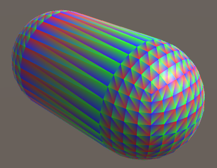 							Barycentric coordinates as albedo. 						

### Creating Wires

To create the wireframe effect, we need to know how close the  fragment is to the nearest triangle edge. We can find this by taking the  minimum of the barycentric coordinates. This gives us the minimum  distance to the edge, in the barycentric domain. Let's use that directly  as the albedo.

```
	float3 albedo = GetAlbedo(i);
	float3 barys;
	barys.xy = i.barycentricCoordinates;
	barys.z = 1 - barys.x - barys.y;
//	albedo = barys;
	float minBary = min(barys.x, min(barys.y, barys.z));
	return albedo * minBary;
```

 							
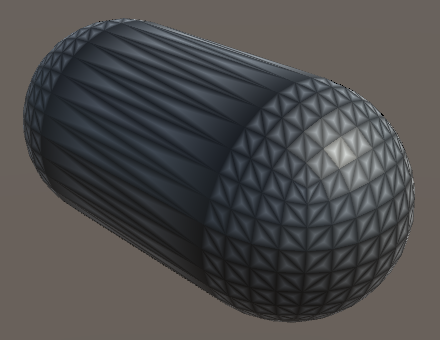 							Minimum barycentric coordinate. 						

This looks somewhat like a black wireframe on top of a white  mesh, but it is too fuzzy. That's because the distance to the nearest  edge goes from zero at the edges to ⅓ at the center of the triangle. To  make it look more like thin lines we have to fade to white quicker, for  example by transitioning from black to white between 0 and 0.1. To make  the transition smooth, let's use the `smoothstep` function for this.

 							What's the `smoothstep` function? 							 						

```
	float minBary = min(barys.x, min(barys.y, barys.z));
	minBary = smoothstep(0, 0.1, minBary);
	return albedo * minBary;
```

 							
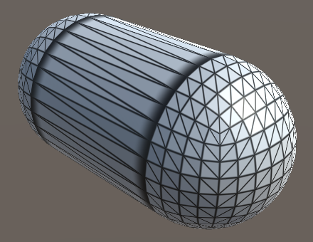 							Adjusted transition. 						

### Fixed Wire Width

The wireframe effect is starting to look good, but only for  triangles with edges that have roughly the same length. Also, the lines  are affected by view distance, because they're part of the triangles.  Ideally, the wires have a fixed visual thickness.

To keep the wire thickness constant in screen space, we have to adjust the range that we use for the `smoothstep`  function. The range depends on how quickly the measured distance to the  edge changes, visually. We can use screen-space derivative instructions  to figure this out.

The rate of change can be different for both screen-space  dimensions. Which should we use? We can use both, simply adding them.  Also, because the changes could be positive or negative, we should use  their absolute values. By using the result directly as the range, we end  up with lines that cover roughly two fragments.

```
	float minBary = min(barys.x, min(barys.y, barys.z));
	float delta = abs(ddx(minBary)) + abs(ddy(minBary));
	minBary = smoothstep(0, delta, minBary);
```

This formula is also available as the convenient `fwidth` function, so let's use that.

```
	float delta = fwidth(minBary);
```

 							
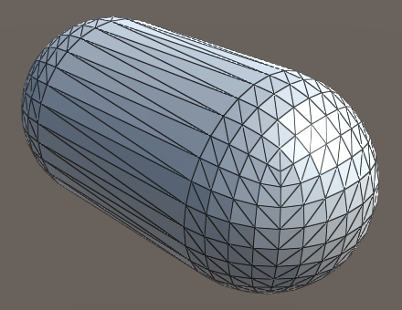 							Fixed-width wires. 						

The resulting wires might appear a bit too thin. We can fix  that by shifting the transition a little away from the edge, for example  by the same value we use for the blend range.

```
	minBary = smoothstep(delta, 2 * delta, minBary);
```

 							
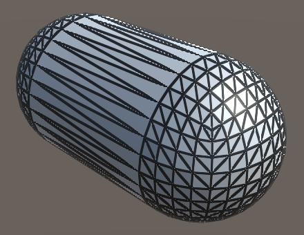 							Thicker width, but with artifacts. 						

This produces clearer lines, but also reveals aliasing  artifacts in the lines near triangle corners. The artifacts appear  because the nearest edge suddenly changes in those regions, which leads  to discontinuous derivatives. To fix this, we have to use the  derivatives of the individual barycentric coordinates, blend them  separately, and grab the minimum after that.

```
	barys.z = 1 - barys.x - barys.y;
	float3 deltas = fwidth(barys);
	barys = smoothstep(deltas, 2 * deltas, barys);
	float minBary = min(barys.x, min(barys.y, barys.z));
//	float delta = fwidth(minBary);
//	minBary = smoothstep(delta, 2 * delta, minBary);
	return albedo * minBary;
```

 							
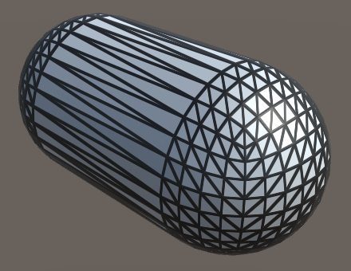 							Wireframe without artifacts. 						

### Configurable Wires

We have a functional wireframe effect, but you might want to  use a different line thickness, blend region, or color. Maybe you'd like  to use different settings per material. So let's make it configurable.  To do so, add three properties to the *Flat Wireframe*  shader. First is the wireframe color, with black as default. Second is  the wireframe smoothing, which controls the transition range. A range  from zero to ten should be sufficient, with a default of one,  representing multiples of the `fwidth` measurement. Third is the wireframe thickness, with the same settings as smoothing.

```
		_WireframeColor ("Wireframe Color", Color) = (0, 0, 0)
		_WireframeSmoothing ("Wireframe Smoothing", Range(0, 10)) = 1
		_WireframeThickness ("Wireframe Thickness", Range(0, 10)) = 1
```

Add the corresponding variables to *MyFlatWireframe* and use them in `GetAlbedoWithWireframe`.  Determine the final albedo by interpolating between the wireframe color  and the original albedo, based on the smoothed minimum value.

```
float3 _WireframeColor;
float _WireframeSmoothing;
float _WireframeThickness;

float3 GetAlbedoWithWireframe (Interpolators i) {
	float3 albedo = GetAlbedo(i);
	float3 barys;
	barys.xy = i.barycentricCoordinates;
	barys.z = 1 - barys.x - barys.y;
	float3 deltas = fwidth(barys);
	float3 smoothing = deltas * _WireframeSmoothing;
	float3 thickness = deltas * _WireframeThickness;
	barys = smoothstep(thickness, thickness + smoothing, barys);
	float minBary = min(barys.x, min(barys.y, barys.z));
//	return albedo * minBary;
	return lerp(_WireframeColor, albedo, minBary);
}
```

While the shader is now configurable, the properties don't appear in our custom shader GUI yet. We could create a new GUI for *Flat Wireframe*, but let's use a shortcut and add the properties directly to `**MyLightingShaderGUI**`. Give it a new `DoWireframe` method to create a small section for the wireframe.

```
	void DoWireframe () {
		GUILayout.Label("Wireframe", EditorStyles.boldLabel);
		EditorGUI.indentLevel += 2;
		editor.ShaderProperty(
			FindProperty("_WireframeColor"),
			MakeLabel("Color")
		);
		editor.ShaderProperty(
			FindProperty("_WireframeSmoothing"),
			MakeLabel("Smoothing", "In screen space.")
		);
		editor.ShaderProperty(
			FindProperty("_WireframeThickness"),
			MakeLabel("Thickness", "In screen space.")
		);
		EditorGUI.indentLevel -= 2;
	}
```

To have `**MyLightingShaderGUI**` support both shaders with and without a wireframe, only invoke `DoWireframe` in its `OnGUI` method if the shader has the *_WireframeColor* property. We simply assume that if that property is available, it has all three.

```
	public override void OnGUI (
		MaterialEditor editor, MaterialProperty[] properties
	) {
		this.target = editor.target as Material;
		this.editor = editor;
		this.properties = properties;
		DoRenderingMode();
		if (target.HasProperty("_WireframeColor")) {
			DoWireframe();
		}
		DoMain();
		DoSecondary();
		DoAdvanced();
	}
```


<iframe src="https://gfycat.com/ifr/GreatUncomfortableIndianspinyloach"></iframe>

Configurable wireframe.

You're now able to render meshes with flat shading and a  configurable wireframe. It will come in handy for the next advanced  rendering tutorial, [Tessellation](https://catlikecoding.com/unity/tutorials/advanced-rendering/tessellation/).

unitypackage

PDF
