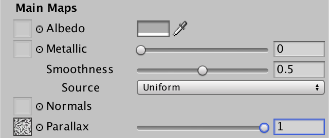
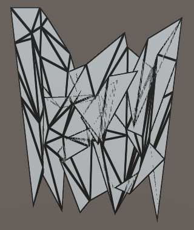
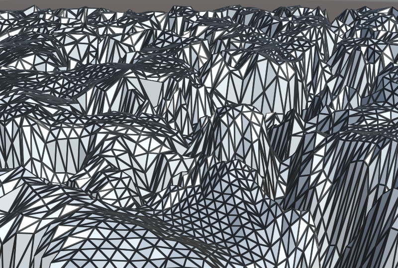
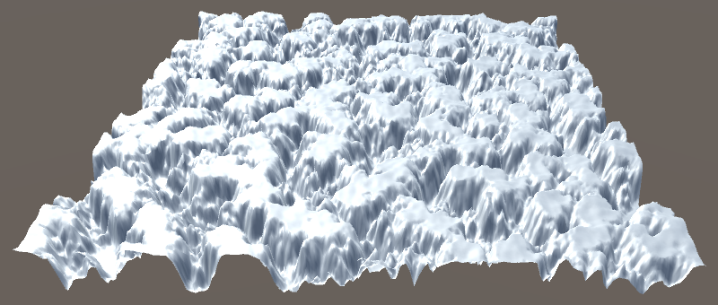
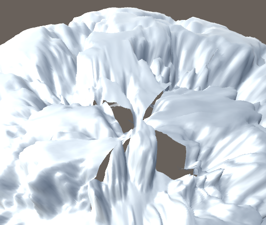
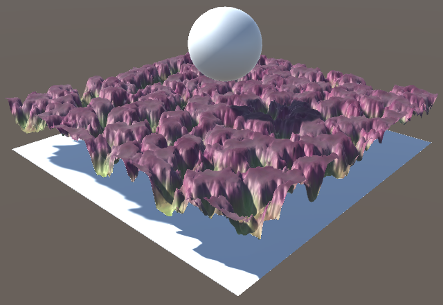
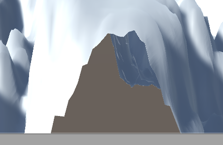
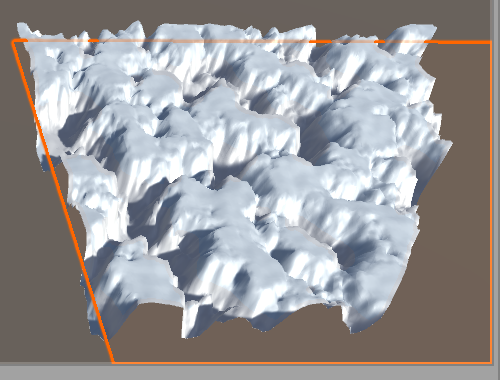

# Surface Displacement

Moving Vertices

- Adjust vertex positions on the GPU.
- Tessellate shadow geometry.
- Skip tessellating unseen triangles.

This tutorial follow [Tessellation](https://catlikecoding.com/unity/tutorials/advanced-rendering/tessellation/) and combines it with vertex displacement to add more detail to geometry, on top of normal mapping.

This tutorial is made with Unity 2017.1.0.

 					
 					Create surface details with tessellated triangles. 				

## Repositioning Vertices

Meshes are usually made up of triangles, which are always flat.  The illusion of curvature is added via vertex normals. Normal maps can  be used to add the illusion of more surface irregularities, smaller than  individual mesh triangles. Beyond that, parallax mapping makes it  possible to fake surface displacement. But all these approaches are  illusions. The most robust way to make a surface more complex is by  simply using more smaller triangles. Smaller triangles means that we  have more vertices, enough to describe all surface details that we want.  Unfortunately, that would result in much larger meshes, requiring more  storage space, CPU and GPU memory, and memory bandwidth. Tessellation is  a way around this problem, because it allows us to generated more  triangles on the GPU when needed. This means the GPU has to do more  work, but we can limit that to when it's really needed.

Cutting up existing triangles and interpolating the vertex data  isn't enough to add more details. That just gives us more triangles that  describe the same flat surface. We have to introduce new data,  adjusting the triangle's vertices somehow.

A straightforward way to add more detail is to adjust the  vertices of a mesh via a displacement map. The map is used to move  vertices up or down, like a height field can be used to turn a flat  terrain mesh into an actual landscape. This tutorial will cover how to  do that.

### Hijacking Parallax Mapping

To displace vertices, we need a displacement map. Although our *Tessellation Shader* doesn't have a property for such a map, it does have a parallax map that we used in the [Parallax](https://catlikecoding.com/unity/tutorials/rendering/part-20/)  tutorial. The parallax map is really a displacement map, it's just that  we used it to fake displacement. We can use the same map for actual  displacement too.

Let's say that a shader can decide to use true vertex displacement instead of parallax mapping, simply by defining *VERTEX_DISPLACEMENT_INSTEAD_OF_PARALLAX*.  If that macro is defined and we have a parallax map, then we must make  sure that the parallax code doesn't get included, replacing it with  proper vertex displacement code. To do this, undefine *_PARALLAX_MAP* and define a convenient *VERTEX_DISPLACEMENT* macro in *My Lighting Input*, when we have a parallax map and should use vertex displacement.

```
#include "UnityPBSLighting.cginc"
#include "AutoLight.cginc"

#if defined(_PARALLAX_MAP) && defined(VERTEX_DISPLACEMENT_INSTEAD_OF_PARALLAX)
	#undef _PARALLAX_MAP
	#define VERTEX_DISPLACEMENT 1
#endif
```

Let's also create macro aliases for the `_ParallaxMap` and `_ParallaxStrength` variables, so we can use `_DisplacementMap` and `_DisplacementStrength`  instead. This makes it easier to get rid of the parallax code and  switch to proper displacement properties, in case you like to do that  later.

```
#if defined(_PARALLAX_MAP) && defined(VERTEX_DISPLACEMENT_INSTEAD_OF_PARALLAX)
	#undef _PARALLAX_MAP
	#define VERTEX_DISPLACEMENT 1
	#define _DisplacementMap _ParallaxMap
	#define _DisplacementStrength _ParallaxStrength
#endif
```

As we won't used both parallax mapping and tessellation at the  same time, we can get rid of all definitions related to parallax in the `CGINCLUDE` block of *Tessellation Shader*. Instead, we only have to define *VERTEX_DISPLACEMENT_INSTEAD_OF_PARALLAX*.

```
	CGINCLUDE

	#define BINORMAL_PER_FRAGMENT
	#define FOG_DISTANCE

//	#define PARALLAX_BIAS 0
//	#define PARALLAX_OFFSET_LIMITING
//	#define PARALLAX_RAYMARCHING_STEPS 10
//	#define PARALLAX_RAYMARCHING_INTERPOLATE
//	#define PARALLAX_RAYMARCHING_SEARCH_STEPS 3
//	#define PARALLAX_FUNCTION ParallaxRaymarching
//	#define PARALLAX_SUPPORT_SCALED_DYNAMIC_BATCHING

	#define VERTEX_DISPLACEMENT_INSTEAD_OF_PARALLAX

	ENDCG
```

We'll perform vertex displacement in object space. To allow for  a decent amount of displacement, increase the maximum strength from 0.1  to 1.

```
		_ParallaxStrength ("Parallax Strength", Range(0, 1)) = 0
```

 							
 							Parallax map with strength set to 1. 						

### Changing the Vertex Position

Displacing vertices has to be done in the vertex program of *My Lighting*,  before we use the vertex position for anything else. This means that if  we want to support scaling and offsetting the displacement map like all  other maps, we have to transform the texture coordinates before this  point. So let's move the `**TRANSFORM_TEX**` lines before the first time the vertex position is used.

```
InterpolatorsVertex MyVertexProgram (VertexData v) {
	InterpolatorsVertex i;
	UNITY_INITIALIZE_OUTPUT(InterpolatorsVertex, i);
	UNITY_SETUP_INSTANCE_ID(v);
	UNITY_TRANSFER_INSTANCE_ID(v, i);

	i.uv.xy = TRANSFORM_TEX(v.uv, _MainTex);
	i.uv.zw = TRANSFORM_TEX(v.uv, _DetailTex);

	i.pos = UnityObjectToClipPos(v.vertex);
	i.worldPos.xyz = mul(unity_ObjectToWorld, v.vertex);
	#if FOG_DEPTH
		i.worldPos.w = i.pos.z;
	#endif
	i.normal = UnityObjectToWorldNormal(v.normal);

	#if defined(BINORMAL_PER_FRAGMENT)
		i.tangent = float4(UnityObjectToWorldDir(v.tangent.xyz), v.tangent.w);
	#else
		i.tangent = UnityObjectToWorldDir(v.tangent.xyz);
		i.binormal = CreateBinormal(i.normal, i.tangent, v.tangent.w);
	#endif

//	i.uv.xy = TRANSFORM_TEX(v.uv, _MainTex);
//	i.uv.zw = TRANSFORM_TEX(v.uv, _DetailTex);

	…
}
```

Once we have the final texture coordinates, we can sample the  displacement map. This works the same as sampling the map for parallax  mapping, so we'll use its green texture channel. However, because we're  not doing this in the fragment program, there are no screen-space  derivatives available, so the GPU cannot determine which mipmap level to  use. We cannot use `tex2D`, instead we have to use `tex2Dlod`  to specify an explicit mipmap level. This is done by supplying two  additional texture coordinates, the third being an unused 3D coordinate  and the fourth specifying the mip level. We'll just use 0 for both,  effectively using no mipmaps.

```
	i.uv.xy = TRANSFORM_TEX(v.uv, _MainTex);
	i.uv.zw = TRANSFORM_TEX(v.uv, _DetailTex);

	#if VERTEX_DISPLACEMENT
		float displacement = tex2Dlod(_DisplacementMap, float4(i.uv.xy, 0, 0)).g;
	#endif
```

Like we do for parallax mapping, let's interpret the map so a  value of 0.5 means no change, making it possible to move vertices both  up and down. After that, factor in the displacement strength so we can  control how much the vertices get moved in object space.

```
	#if VERTEX_DISPLACEMENT
		float displacement = tex2Dlod(_DisplacementMap, float4(i.uv.xy, 0, 0)).g;
		displacement = (displacement - 0.5) * _DisplacementStrength;
	#endif
```

If we were working with a default height field, then we'd just  have to add the displacement to the vertex Y position at this point.

```
		float displacement = tex2Dlod(_DisplacementMap, float4(i.uv.xy, 0, 0)).g;
		displacement = (displacement - 0.5) * _DisplacementStrength;
		v.vertex.y += displacement;
```

 							
 							Quad vertices displaced along Y. 						

When applying this approach to a quad, the result will look  like a mess of triangles that is still flat. That's because the quad is  aligned with the XY plane in object space. If we want to perturb its  otherwise flat surface, we have to adjust its Z coordinates instead. In  general, a positive displacement should move vertices upward, from the  point of view of the mesh. But not all meshes are planes. In the case of  a sphere, it makes sense for displacement to move vertices outward. So  in general it makes the most sense to displace along the vertex normal.

```
//		v.vertex.y += displacement;
		v.vertex.xyz += v.normal * displacement;
```

Because we're using tessellation, the normal vectors of new  vertices have been created via interpolation. So they're only guaranteed  to be of unit length when all the vertex normals have the same  orientation. To guarantee that we get unit-length normal vectors in  general, we should normalize them before using them for displacement.

```
		v.normal = normalize(v.normal);
		v.vertex.xyz += v.normal * displacement;
```

<iframe src="https://gfycat.com/ifr/WealthyAdolescentFallowdeer"></iframe>

Displacement along normal vector.

### Using Enough Triangles

How much triangles are needed to support the desired detail  level? It depends. Our displacement map at full strength produces quite a  large change, so we need quite some triangles to make it look good. But  we don't want to use more triangles than we need, so we should use the *Edge* tessellation mode instead of the *Uniform* mode.

<iframe src="https://gfycat.com/ifr/DeafeningWellgroomedHoatzin"></iframe>

Variable tessellation of a quad.

When in *Edge* mode, tessellation is controlled by both the *Edge Length*  property and the view distance. So how many triangles get used can vary  a lot. A quad by itself contains only two triangles. We'd need a  significant amount of tessellation to get something better than a  low-poly jagged plane. We can help tessellation a lot by using a base  mesh that has more triangles. For example, Unity's default plane mesh  consists of 10×10 quads. Using that instead of a quad prevents complete  degeneration and can also produce much higher vertex resolution than a  quad, if needed.

<iframe src="https://gfycat.com/ifr/MagnificentAccomplishedAustraliankelpie"></iframe>

Variable tessellation of a plane.

Using a plane instead of a quad allows for a more fine-tuned  tessellation, which makes it easier to achieve a visually uniform  triangle density from all view angles.

 							
 							Shallow view angle, uniform triangle density. 						

However, this still does not guarantee that all triangles end  up with the same visual size. The tessellated triangles are only about  the same size before their vertices are displaced. If a triangle's  vertices end up displaced by different amount, it will become stretched  along the normal vectors. Usually, vertex displacement isn't as extreme  as the example that we use in this tutorial. If you're using it for a  terrain mesh, the regular mesh should have sufficient resolution to  represent the large features of the terrain. If you use a flat mesh as  the basis for your terrain, consider displacing the original vertices  before determining the tessellation factors, so coarse elevation gets  taken into account when tessellating.

### Normal Shading

Up to this point we've been using the flat wireframe shading  effect, to make it visually obvious how triangles get tessellated. But  most of the time the goal is to enhance a mesh without tessellation  being obvious. So let's revert to the default shading method. We do this  by removing the geometry shader directive from the forward base,  additive, and deferred passes of *Tessellation Shader*. We also have to replace the usage of the *MyFlatWireframe* include file with *My Lighting* in the same passes.

```
//			#pragma geometry MyGeometryProgram
			
			…
			
//			#include "MyFlatWireframe.cginc"
			#include "My Lighting.cginc"
			#include "MyTessellation.cginc"
```

With the flat wireframe effect removed, we no longer need the wireframe properties either.

```
//		_WireframeColor ("Wireframe Color", Color) = (0, 0, 0)
//		_WireframeSmoothing ("Wireframe Smoothing", Range(0, 10)) = 1
//		_WireframeThickness ("Wireframe Thickness", Range(0, 10)) = 1
```

We are now back to normal shading, which ends up looking flat.  That's because we displace vertex positions, but don't adjust the vertex  normals to match. The exact end results depends on whether you're using  the forward or deferred rendering path.

 							 							 							Forward and deferred rendering. 						

The visual difference between the rendering paths is due to  shadows. We're not doing anything special for shadows yet, so we get the  default shadow of a plane. In the case of forward rendering, both the  depth pass used for screen-space shadows and the shadow casting is done  with this plane. So our plane ends up not shadowing itself. In the case  of deferred rendering, the tessellated geometry is used to fill the  G-buffers, including the depth buffer. So the tessellated geometry that  gets displaced downward ends up shadowed by the flat plane's shadow.  We'll deal with shadows in the next section, so for now I'll use the  forward rendering path.

To get proper shading for our displaced surface, we have to use  the correct normal vectors. Fortunately, we have a matching normal map  for our parallax map, so we can just use that.

 							
 							With normal map. 						

This approach works for any mesh, but it is important that  there are no texture seams. Any seams would result in discontinuities.  If we only used normal maps, this would lead to artifacts in shading  that suggest hard edges where there should be none. In the case of  displacement, it leads to gaps in the mesh, which is far worse. To see a  good example of this, apply our tessellation material to a default  sphere and inspect its poles.

 							
 							Displacing sphere vertices creates gaps. 						

 							How could we make it work for spheres? 							 						

At this point we have a displacement effect that's done via  tessellation, replacing the parallax effect from an earlier tutorial.  The big advantage of tessellation over parallax mapping is that it plays  well with everything else, because it's just triangles. All techniques  that work with regular triangles apply, and it intersects correctly with  other geometry.

 							
 							Tessellated geometry intersects correctly. 						

unitypackage

## Shadows

Currently, shadows behave as if our plane were still flat. Only  when using deferred rendering does the displaced geometry get used to  receive shadows, but the cast shadow is still flat. We're now going to  make sure that the shadows match the displaced surface.

 						 						 						Incorrect shadows, forward and deferred. 					

### Shadow Caster Pass with Tessellation

The first thing we have to do to makes shadows work, is to  enabled tessellation for the shadow caster pass as well. This means that  the shader target level of this pass has to be increased to 4.6.

```
			#pragma target 4.6
```

As our displacement approach uses the parallax map, we have to  add the appropriate shader feature for it, and also a feature for the *Edge* tessellation mode.

```
			#pragma shader_feature _SMOOTHNESS_ALBEDO
			#pragma shader_feature _PARALLAX_MAP
			#pragma shader_feature _TESSELLATION_EDGE
```

Then we have to replace our shadow's vertex program with the  tessellation vertex program and add the required hull and domain  programs.

```
//			#pragma vertex MyShadowVertexProgram
			#pragma vertex MyTessellationVertexProgram
			#pragma fragment MyShadowFragmentProgram
			#pragma hull MyHullProgram
			#pragma domain MyDomainProgram
```

Those programs are defined in *MyTessellation*, so include it after *My Shadows*.

```
			#include "My Shadows.cginc"
			#include "MyTessellation.cginc"
```

### Making Tessellated Shadows Work

At this point our shadow caster pass doesn't compile without errors. That's because *My Shadows* doesn't follow the exact same approach as *My Lighting* does. The first problem is that *MyTessellation* expects the vertex position field of `**VertexData**` to be named `vertex`, while it's known as `position` in *My Shadows*. Let's fix this by renaming it to `vertex` in `My Shadows`.

```
struct VertexData {
	UNITY_VERTEX_INPUT_INSTANCE_ID
//	float4 position : POSITION;
	float4 vertex : POSITION;
	float3 normal : NORMAL;
	float2 uv : TEXCOORD0;
};
```

The vertex position is used in two places in `MyShadowVertexProgram`, so change those references as well.

```
InterpolatorsVertex MyShadowVertexProgram (VertexData v) {
	…
	#if defined(SHADOWS_CUBE)
		i.position = UnityObjectToClipPos(v.vertex);
		i.lightVec =
			mul(unity_ObjectToWorld, v.vertex).xyz - _LightPositionRange.xyz;
	#else
		i.position = UnityClipSpaceShadowCasterPos(v.vertex.xyz, v.normal);
		i.position = UnityApplyLinearShadowBias(i.position);
	#endif

	…
}
```

The next problem is that shadows use less vertex data than the  other three passes. Specifically, they don't require tangent, uv1, and  uv2 data. We could add this data anyway, but that would needlessly make  shadows slower. Instead, let's adjust `MyTessellation` so it can support less vertex data. We can do this by only including tangent, uv1, and uv2 in the `**TessellationControlPoint**` struct if appropriate macros are defined.

```
struct TessellationControlPoint {
	float4 vertex : INTERNALTESSPOS;
	float3 normal : NORMAL;
	#if TESSELLATION_TANGENT
		float4 tangent : TANGENT;
	#endif
	float2 uv : TEXCOORD0;
	#if TESSELLATION_UV1
		float2 uv1 : TEXCOORD1;
	#endif
	#if TESSELLATION_UV2
		float2 uv2 : TEXCOORD2;
	#endif
};
```

Using the same trick, we can control whether `MyTessellationVertexProgram` copies the relevant fields from the vertex data to the control point.

```
TessellationControlPoint MyTessellationVertexProgram (VertexData v) {
	TessellationControlPoint p;
	p.vertex = v.vertex;
	p.normal = v.normal;
	#if TESSELLATION_TANGENT
		p.tangent = v.tangent;
	#endif
	p.uv = v.uv;
	#if TESSELLATION_UV1
		p.uv1 = v.uv1;
	#endif
	#if TESSELLATION_UV2
		p.uv2 = v.uv2;
	#endif
	return p;
}
```

And also whether `MyDomainProgram` interpolates the data.

```
[UNITY_domain("tri")]
InterpolatorsVertex MyDomainProgram (
	…
) {
	…

	MY_DOMAIN_PROGRAM_INTERPOLATE(vertex)
	MY_DOMAIN_PROGRAM_INTERPOLATE(normal)
	#if TESSELLATION_TANGENT
		MY_DOMAIN_PROGRAM_INTERPOLATE(tangent)
	#endif
	MY_DOMAIN_PROGRAM_INTERPOLATE(uv)
	#if TESSELLATION_UV1
		MY_DOMAIN_PROGRAM_INTERPOLATE(uv1)
	#endif
	#if TESSELLATION_UV2
		MY_DOMAIN_PROGRAM_INTERPOLATE(uv2)
	#endif

	return MyVertexProgram(data);
}
```

This approach allows us to fine-tune what mesh data gets  included while tessellating. We don't need tangent, uv1, and uv2 for  shadows, but the other three passes might need them all. So let's define  the relevant macros at the top of *My Lighting Input*.

```
#define TESSELLATION_TANGENT 1
#define TESSELLATION_UV1 1
#define TESSELLATION_UV2 1

#if defined(_PARALLAX_MAP) && defined(VERTEX_DISPLACEMENT_INSTEAD_OF_PARALLAX)
	…
#endif
```

 							Do we always need all this data in the other passes? 							 						

The last problem is that *My Lighting* relies on the existence of `MyVertexProgram`, but we've named the vertex program for our shadow caster pass `MyShadowVertexProgram`. The quick solution is to define a macro alias in *My Shadows*. This way `MyVertexProgram` also works for shadows, without breaking existing shaders.

```
#define MyVertexProgram MyShadowVertexProgram

InterpolatorsVertex MyShadowVertexProgram (VertexData v) {
	…
}
```

### Displacing Shadow Geometry

The shadows now get tessellated. The next step is to displace their vertices, for which we can use the same approach applied in *My Lighting*. First, copy the appropriate macro definitions to the top of *My Shadows*. The only difference is that we must also define *SHADOWS_NEED_UV*, if it wasn't already.

```
#if SHADOWS_SEMITRANSPARENT || defined(_RENDERING_CUTOUT)
	#if !defined(_SMOOTHNESS_ALBEDO)
		#define SHADOWS_NEED_UV 1
	#endif
#endif

#if defined(_PARALLAX_MAP) && defined(VERTEX_DISPLACEMENT_INSTEAD_OF_PARALLAX)
	#undef _PARALLAX_MAP
	#define VERTEX_DISPLACEMENT 1
	#define _DisplacementMap _ParallaxMap
	#define _DisplacementStrength _ParallaxStrength
	#if !defined(SHADOWS_NEED_UV)
		#define SHADOWS_NEED_UV 1
	#endif
#endif
```

Shadows didn't use the parallax map, so we have to add the required variables now.

```
sampler2D _ParallaxMap;
float _ParallaxStrength;
```

In the shadow vertex program, move the transformation of the texture coordinates above the usage of the vertex position.

```
InterpolatorsVertex MyShadowVertexProgram (VertexData v) {
	InterpolatorsVertex i;
	UNITY_SETUP_INSTANCE_ID(v);
	UNITY_TRANSFER_INSTANCE_ID(v, i);

	#if SHADOWS_NEED_UV
		i.uv = TRANSFORM_TEX(v.uv, _MainTex);
	#endif

	#if defined(SHADOWS_CUBE)
		i.position = UnityObjectToClipPos(v.vertex);
		i.lightVec =
			mul(unity_ObjectToWorld, v.vertex).xyz - _LightPositionRange.xyz;
	#else
		i.position = UnityClipSpaceShadowCasterPos(v.vertex.xyz, v.normal);
		i.position = UnityApplyLinearShadowBias(i.position);
	#endif

//	#if SHADOWS_NEED_UV
//		i.uv = TRANSFORM_TEX(v.uv, _MainTex);
//	#endif
	return i;
}
```

Then displace the vertex position.

```
	#if SHADOWS_NEED_UV
		i.uv = TRANSFORM_TEX(v.uv, _MainTex);
	#endif

	#if VERTEX_DISPLACEMENT
		float displacement = tex2Dlod(_DisplacementMap, float4(i.uv.xy, 0, 0)).g;
		displacement = (displacement - 0.5) * _DisplacementStrength;
		v.normal = normalize(v.normal);
		v.vertex.xyz += v.normal * displacement;
	#endif
```

 							
 							Displaced shadows. 						

We now get correctly displaced shadows. Both receiving and casting shadows is now correct, for both rendering paths.

With shadows working, another advantage that tessellation has  over parallax mapping is that we automatically get self-shadowing. It  doesn't require any extra work.

 							 							
 							With and without self-shadowing. 						

Of course you have to keep the limitations of shadow mapping in mind. Also, when using *Edge*  tessellation mode, the view distance for the shadow map is different  than for the regular camera. This means that the tessellated shadow  geometry doesn't exactly match the regular tessellated geometry, which  can produce shadows artifacts. The finer the tessellation, the less of  an issue this is.

<iframe src="https://gfycat.com/ifr/IncrediblePowerlessHorsechestnutleafminer"></iframe>

Varying tessellation with shadows.

unitypackage

## Culling Triangles

Although tessellation is nice, it doesn't come cheap, especially  when a high level of tessellation is desired. An important thing to  realize is that every triangle of a mesh gets tessellated, regardless  whether it ends up visible or not. However, it is possible to do  something about that.

Not everything in a scene gets rendered. Only objects that lie  inside the camera's view frustum can be seen. Those objects are send to  the GPU by Unity, everything else gets culled. But if even a small  portion of an object's bounding box lies inside the frustum, its entire  mesh will be processed by the GPU, and thus tessellated. Fortunately,  there is a way to skip triangles while tessellating, effectively culling  them before the tessellation stage.

### Skipping Some Triangles

The amount of tessellation is controlled by the edge and inside  tessellation factors. A factor of 1 corresponds with no triangles being  added. A higher factor results in more triangles. But it is also  possible to use the factor 0. When one of the tessellation factors is  zero, the original triangle is discarded and doesn't get rendered at  all.

If we can figure out whether a triangle lies outside the view  frustum, we can set its tessellation factors to 0, effectively  performing frustum culling per triangle, on the GPU. Let's add a  function to `MyTessellation` to figure this out. Place it above `MyPatchConstantFunction`,  as that function will invoke it. We'll start with a very simple test.  If all three vertices of a triangle have negative X coordinates, we'll  consider it culled. We can use a boolean to communicate this.

```
bool TriangleIsCulled (float3 p0, float3 p1, float3 p2) {
	return p0.x < 0 && p1.x < 0 && p2.x < 0;
}
```

Use this function in `MyPatchConstantFunction` to check whether we can skip the triangle. If so, set all edge factors to zero. Otherwise, determine the factors are usual.

```
TessellationFactors MyPatchConstantFunction (
	InputPatch<TessellationControlPoint, 3> patch
) {
	float3 p0 = mul(unity_ObjectToWorld, patch[0].vertex).xyz;
	float3 p1 = mul(unity_ObjectToWorld, patch[1].vertex).xyz;
	float3 p2 = mul(unity_ObjectToWorld, patch[2].vertex).xyz;
	TessellationFactors f;
	if (TriangleIsCulled(p0, p1, p2)) {
		f.edge[0] = f.edge[1] = f.edge[2] = f.inside = 0;
	}
	else {
	    f.edge[0] = TessellationEdgeFactor(p1, p2);
	    f.edge[1] = TessellationEdgeFactor(p2, p0);
	    f.edge[2] = TessellationEdgeFactor(p0, p1);
		f.inside =
			(TessellationEdgeFactor(p1, p2) +
			TessellationEdgeFactor(p2, p0) +
			TessellationEdgeFactor(p0, p1)) * (1 / 3.0);
	}
	return f;
}
```

<iframe src="https://gfycat.com/ifr/ZestyBlondFishingcat"></iframe>

Culling triangles with only negative X coordinates.

### Frustum Culling

To perform actual frustum culling, we have to verify whether a  triangle lies inside the camera's view frustum or outside of it. A  frustum is a pyramid with its top cut off by a plane parallel to its  base. The base and the sides of the pyramid can also be defined by  planes. These planes form a system where the space inside the frustum is  considered to lie above all six clip planes. So we have to check for  each plane whether a point lies above or below it. Let's create a  boolean function to check a single plane, returning true by default.  Invoke that function inside `TriangleIsCulled`, replacing our test code.

```
bool TriangleIsBelowClipPlane (float3 p0, float3 p1, float3 p2) {
	return true;
}

bool TriangleIsCulled (float3 p0, float3 p1, float3 p2) {
//	return p0.x < 0 && p1.x < 0 && p2.x < 0;
	return TriangleIsBelowClipPlane(p0, p1, p2);
}
```

Because the camera could have any position and orientation, we  cannot make any assumptions about its clip planes ahead of time. So we  have to be able to work with planes of arbitrary orientation and  position. In general, a plane can be defined by its normal vector that  defines its local upward direction, plus an offset relative to the world  origin. This data can be stored in a four-component vector, where the W  component contains the offset. The plane vector corresponding to our  previous test case of discarding triangles with negative X coordinates  would thus be (1, 0, 0, 0). If we instead discarded triangles up to X  coordinates of 2, the vector would be (1, 0, 0, 2) instead.

To figure out whether a point lies above or below the plane, we  can project the vector to that point onto the plane's normal vector,  via a dot product. If the result is negative, then their angle is larger  than 90° and thus the point lies below the plane. The plane's offset  must also be taken into account, by adding it into the calculation, for  example by making it a dot product between (px, py, pz, 1) and the plane  vector, where px, py, and pz and the point's coordinates. Adjust `TriangleIsBelowClipPlane` accordingly.

```
bool TriangleIsBelowClipPlane (float3 p0, float3 p1, float3 p2) {
	float4 plane = float4(1, 0, 0, 0);
	return
		dot(float4(p0, 1), plane) < 0 &&
		dot(float4(p1, 1), plane) < 0 &&
		dot(float4(p2, 1), plane) < 0;
}
```

The actual clip planes of the camera are made available via the `unity_CameraWorldClipPlanes` array, defined in *UnityShaderVariables*.  It contains six plane definitions, for the left, right, bottom, top,  near, and far planes. So to use the camera's left plane, we'd have to  use `unity_CameraWorldClipPlanes[0]`.

```
//	float4 plane = float4(1, 0, 0, 0);
	float4 plane = unity_CameraWorldClipPlanes[0];
```

To make `TriangleIsBelowClipPlane` work for any of  the camera's clip planes, add the plane index as an additional parameter  and use that to select the appropriate camera plane.

```
bool TriangleIsBelowClipPlane (
	float3 p0, float3 p1, float3 p2, int planeIndex
) {
	float4 plane = unity_CameraWorldClipPlanes[planeIndex];
	return
		dot(float4(p0, 1), plane) < 0 &&
		dot(float4(p1, 1), plane) < 0 &&
		dot(float4(p2, 1), plane) < 0;
}
```

Now we can check all of the clip planes inside `TriangleIsCulled`.  If the triangle ends up below any of them, then it cannot be visible  and should be clipped. We have to check this for the left, right,  bottom, and top planes. The near plane isn't really needed, because the  view pyramid typically comes to a point only a short distance behind the  camera. So it's not worth the extra effort to check the near plane. The  far plane also isn't necessary, because at that distance tessellation  would typically not happen anyway.

```
bool TriangleIsCulled (float3 p0, float3 p1, float3 p2) {
	return
		TriangleIsBelowClipPlane(p0, p1, p2, 0) ||
		TriangleIsBelowClipPlane(p0, p1, p2, 1) ||
		TriangleIsBelowClipPlane(p0, p1, p2, 2) ||
		TriangleIsBelowClipPlane(p0, p1, p2, 3);
}
```

### Biased Culling

Because we're only clipping those triangles that we cannot see,  we shouldn't be able to tell the difference between clipping and not  clipping, aside from a possible difference in frame rate. However, this  is only true if we don't displace any vertices. When vertices do get  displaced, it is possible that displaced vertices end up inside the  frustum, even though the original triangles lies outside of it. In the  case of our displaced plane, you can verify this by looking at the plane  at a shallow angle so some of its mesh triangles end up just below the  bottom of the view. You'll quickly encounter holes as triangles suddenly  vanish while they shouldn't.

 							
 							Hole created by incorrect culling. 						

The solution to this problem is to take the maximum  displacement into consideration when determining whether a triangle lies  below a clip plane or not. This can be done by adding a bias to `TriangleIsBelowClipPlane`. Instead of checking whether the dot product is less than zero, check whether it's below this bias.

```
bool TriangleIsBelowClipPlane (
	float3 p0, float3 p1, float3 p2, int planeIndex, float bias
) {
	float4 plane = unity_CameraWorldClipPlanes[planeIndex];
	return
		dot(float4(p0, 1), plane) < bias &&
		dot(float4(p1, 1), plane) < bias &&
		dot(float4(p2, 1), plane) < bias;
}
```

We should use the same bias for all plane checks, so add it as a parameter to `TriangleIsCulled` as well.

```
bool TriangleIsCulled (float3 p0, float3 p1, float3 p2, float bias) {
	return
		TriangleIsBelowClipPlane(p0, p1, p2, 0, bias) ||
		TriangleIsBelowClipPlane(p0, p1, p2, 1, bias) ||
		TriangleIsBelowClipPlane(p0, p1, p2, 2, bias) ||
		TriangleIsBelowClipPlane(p0, p1, p2, 3, bias);
}
```

Let's use a bias of 1 in `MyPatchConstantFunction` and see what happens.

```
	float bias = 1;
	if (TriangleIsCulled(p0, p1, p2, bias)) {
		f.edge[0] = f.edge[1] = f.edge[2] = f.inside = 0;
	}
```

 							
 							Using a positive bias. 						

A positive bias effectively pushes the clip planes upward,  decreasing the size of the frustum. As a result, triangles get clipped  too quickly, when they get near the edge of the view. A negative bias  has the opposite effect, so triangles that lie outside of but still  nearby the frustum don't get clipped. So we have to use a negative bias  when using vertex displacement. As our maximum displacement in any  dimension is equal to half the displacement strength, that's the  negative bias that we need.

```
	float bias = 0;
	#if VERTEX_DISPLACEMENT
		bias = -0.5 * _DisplacementStrength;
	#endif

	if (TriangleIsCulled(p0, p1, p2, bias)) {
		f.edge[0] = f.edge[1] = f.edge[2] = f.inside = 0;
	}
```

We're now clipping as many triangles as possible, while  guaranteeing that no holes will ever appear. Of course determining  whether we should clip a triangle requires work too, so it won't improve  performance for meshes that are fully in view, it actually makes it   bit worse. But when you're rendering large meshes with a high amount of  tessellation, and they often are only partially visible, then you can  end up significantly improving your frame rate.

This concludes the introduction of tessellation. Now you know  how to tessellate triangles and how to add geometric details via  displacement mapping. This isn't the only thing you can do with  tessellation. For example, there's also PN triangles, phong  tessellation, procedural displacement, and more. Have fun experimenting  with those methods!

unitypackage

PDF
