# Tessellation

Subdividing Triangles

- Create hull and domain shaders.
- Subdivide triangles.
- Control how things get tessellated.

This tutorial covers how to add support for tessellation to a custom shader. It uses the [Flat and Wireframe Shading](https://catlikecoding.com/unity/tutorials/advanced-rendering/flat-and-wireframe-shading/) tutorial as a basis.

This tutorial is made with Unity 2017.1.0.

 					
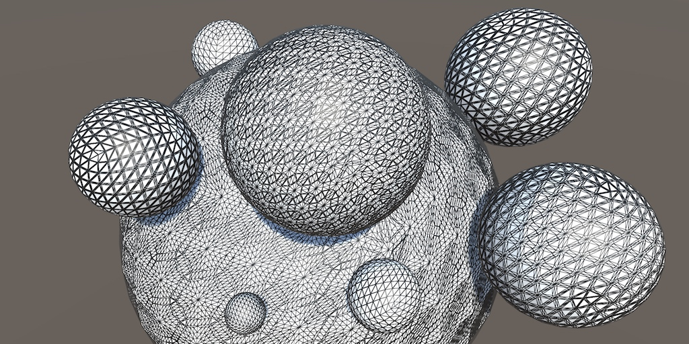 					If you don't have enough triangles, make some more. 				

## Hulls and Domains

Tessellation is the art of cutting things into smaller parts. In  our case, we're going to subdivide triangles so we end up with smaller  triangles that cover the same space. This makes it possible to add more  details to geometry, though in this tutorial we'll focus on the  tessellation process itself.

The GPU is capable of splitting up triangles fed to it for  rendering. It does this for various reasons, for example when part of a  triangle ends up clipped. We cannot control that, but there's also a  tessellation stage that we are allowed to configure. This stage sits in  between the vertex and the fragment shader stages. But it's not as  simple as adding just one other program to our shader. We're going to  need a hull program and domain program.

 						
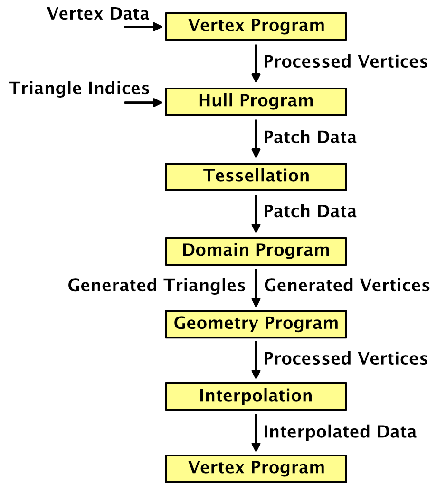 						Shading with tessellation. 					

### Creating a Tessellation Shader

The first step is to create a shader that has tessellation enabled. Let's put the code that we'll need in its own file, *MyTessellation.cginc*, with its own include guard.

```
#if !defined(TESSELLATION_INCLUDED)
#define TESSELLATION_INCLUDED

#endif
```

To clearly see that triangles get subdivided, we'll make use of the *Flat Wireframe Shader*. Duplicate that shader, rename it to *Tessellation Shader* and adjust its menu name.

```
Shader "Custom/Tessellation" { … }
```

The minimum shader target level when using tessellation is 4.6.  If we don't set this manually, Unity will issue a warning and  automatically use that level. We're going to add tessellation stages to  the forward base and additive passes, plus the deferred pass. Also  include *MyTessellation* in those passes, after *MyFlatWireframe*.

```
			#pragma target 4.6
						
			…

			#include "MyFlatWireframe.cginc"
			#include "MyTessellation.cginc"
```

 							What about the shadow pass? 							 						

Create a material that relies on this shader and add a quad to  the scene that uses it. I made the material gray so it isn't too bright,  like the *Flat Wireframe* material.

 							
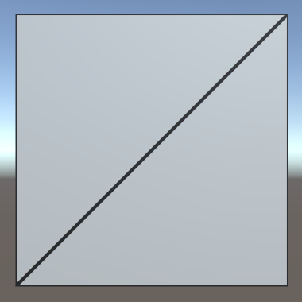 							A quad. 						

We'll use this quad to test our tessellation shader. Note that  is consists of two isosceles right triangles. The short edges have  length 1, while the long diagonal edges have length √2.

### Hull Shaders

Like geometry shaders, the tessellation stage is flexible and  can work triangles, quads, or isolines. We have to tell it what surface  it has to work with and feed it the necessary data. This is the job of  the hull program. Add a program for this to `MyTessellation`, beginning with a void function that does nothing.

```
void MyHullProgram () {}
```

The hull program operates on a surface patch, which is passed to it as an argument. We have to add an `InputPatch` parameter to make this possible.

```
void MyHullProgram (InputPatch patch) {}
```

A patch is a collection of mesh vertices. Like we did for the  stream parameter of the geometry function, we have to specify the data  format of the vertices. We'll use the `**VertexData**` struct for now.

```
void MyHullProgram (InputPatch<VertexData> patch) {}
```

 							Shouldn't it be `InputPatch<**InterpolatorsVertex**>`? 							 						

As we're working with triangles, each patch will contain three  vertices. This amount has to be specified as a second template parameter  for `InputPatch`.

```
void MyHullProgram (InputPatch<VertexData, 3> patch) {}
```

The job of the hull program is to pass the required vertex data  to the tessellation stage. Although it is fed an entire patch, the  function should output only a single vertex at a time. It will get  invoked once per vertex in the patch, with an additional argument that  specifies which control point (vertex) it should work with. The  parameter is an unsigned integer with the `**SV_OutputControlPointID**` semantic.

```
void MyHullProgram (
	InputPatch<VertexData, 3> patch,
	uint id : SV_OutputControlPointID
) {}
```

Simply index the patch as if it were an array and return the desired element.

```
VertexData MyHullProgram (
	InputPatch<VertexData, 3> patch,
	uint id : SV_OutputControlPointID
) {
	return patch[id];
}
```

This looks like a functional program, so let's add a compiler  directive to use it as a hull shader. Do this for all three shader  passes that are involved.

```
			#pragma vertex MyVertexProgram
			#pragma fragment MyFragmentProgram
			#pragma hull MyHullProgram
			#pragma geometry MyGeometryProgram
```

This will produce a few compiler errors, complaining that we  haven't configured our hull shader correctly. Like the geometry  function, it needs attributes to configure it. First, we have to  explicitly tell it that it's working with triangles. That's done via the  `UNITY_domain` attribute, with *tri* as an argument.

```
[UNITY_domain("tri")]
VertexData MyHullProgram …
```

That's not enough. We also have to explicitly specify that  we're outputting three control points per patch, one for each of the  triangle's corners.

```
[UNITY_domain("tri")]
[UNITY_outputcontrolpoints(3)]
VertexData MyHullProgram …
```

When the GPU will create new triangles, it needs to know  whether we want them defined clockwise or counterclockwise. Like all  other triangles in Unity, they should be clockwise. This is controlled  via the `UNITY_outputtopology` attribute. Its argument should be *triangle_cw*.

```
[UNITY_domain("tri")]
[UNITY_outputcontrolpoints(3)]
[UNITY_outputtopology("triangle_cw")]
VertexData MyHullProgram …
```

The GPU also needs to be told how it should cut up the patch, via the `UNITY_partitioning` attribute. There are a few different partitioning methods, which we'll investigate later. For now, just use the *integer* mode.

```
[UNITY_domain("tri")]
[UNITY_outputcontrolpoints(3)]
[UNITY_outputtopology("triangle_cw")]
[UNITY_partitioning("integer")]
VertexData MyHullProgram …
```

Besides the partitioning method, the GPU also has to know into  how many parts the patch should be cut. This isn't a constant value, it  can vary per patch. We have to provide a function to evaluate this,  known as a patch constant function. Let's just assume we have such a  function, named *MyPatchConstantFunction*.

```
[UNITY_domain("tri")]
[UNITY_outputcontrolpoints(3)]
[UNITY_outputtopology("triangle_cw")]
[UNITY_partitioning("integer")]
[UNITY_patchconstantfunc("MyPatchConstantFunction")]
VertexData MyHullProgram …
```

### Patch Constant Functions

How a patch is to be subdivided is a property of the patch.  This means that the patch constant function is only invoked once per  patch, not once per control point. That's why it's referred to as a  constant function, being constant across the entire patch. Effectively,  this function is a sub-stage operating in parallel with `MyHullProgram`.

 							
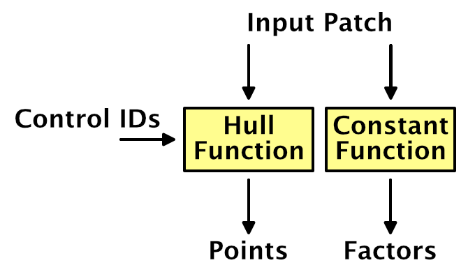 							Inside a hull shader. 						

To determine how to subdivide a triangle, the GPU uses four  tessellation factors. Each edge of the triangle patch gets a factor.  There's also a factor for the inside of the triangle. The three edge  vectors have to be passed along as a float array with the `**SV_TessFactor**` semantic. The inside factor uses the `**SV_InsideTessFactor**` semantic. Let's create a struct for that.

```
struct TessellationFactors {
    float edge[3] : SV_TessFactor;
    float inside : SV_InsideTessFactor;
};
```

The patch constant function takes a patch as an input parameter  and outputs the tessellation factors. Let's now create this missing  function. Simply have it set all factors to 1. This will instruct the  tessellation stage to not subdivide the patch.

```
TessellationFactors MyPatchConstantFunction (InputPatch<VertexData, 3> patch) {
	TessellationFactors f;
    f.edge[0] = 1;
    f.edge[1] = 1;
    f.edge[2] = 1;
	f.inside = 1;
	return f;
}
```

### Domain Shaders

At this point, the shader compiler will complain that a shader  cannot have a tessellation control shader without a tessellation  evaluation shader. The hull shader is only part of what we need to get  tessellation working. Once the tessellation stage has determined how the  patch should be subdivided, it's up to the geometry shader to evaluate  the result and generate the vertices of the final triangles. So let's  create a function for our domain shader, again starting with a stub.

```
void MyDomainProgram () {}
```

Both the hull and domain shader act on the same domain, which is a triangle. We signal this again via the `UNITY_domain` attribute.

```
[UNITY_domain("tri")]
void MyDomainProgram () {}
```

The domain program is fed the tessellation factors that were used, as well as the original patch, which is of type `OutputPatch` in this case.

```
[UNITY_domain("tri")]
void MyDomainProgram (
	TessellationFactors factors,
	OutputPatch<VertexData, 3> patch
) {}
```

While the tessellation stage determines how the patch should be  subdivided, it doesn't generated any new vertices. Instead, it comes up  with barycentric coordinates for those vertices. It's up to the domain  shader to use those coordinates to derive the final vertices. To make  this possible, the domain function is invoked once per vertex and is  provided the barycentric coordinates for it. They have the `**SV_DomainLocation**` semantic.

```
[UNITY_domain("tri")]
void MyDomainProgram (
	TessellationFactors factors,
	OutputPatch<VertexData, 3> patch,
	float3 barycentricCoordinates : SV_DomainLocation
) {}
```

Inside the function, we have to generate the final vertex data.

```
[UNITY_domain("tri")]
void MyDomainProgram (
	TessellationFactors factors,
	OutputPatch<VertexData, 3> patch,
	float3 barycentricCoordinates : SV_DomainLocation
) {
	VertexData data;
}
```

To find the position of this vertex, we have to interpolate  across the original triangle domain, using the barycentric coordinates.  The X, Y, and Z coordinates determine the weights of the first, second,  and third control points.

```
	VertexData data;
	data.vertex =
		patch[0].vertex * barycentricCoordinates.x +
		patch[1].vertex * barycentricCoordinates.y +
		patch[2].vertex * barycentricCoordinates.z;
```

We have to interpolate all vertex data in the same way. Let's  define a convenient macro for that, which can be used for all vector  sizes.

```
//	data.vertex =
//		patch[0].vertex * barycentricCoordinates.x +
//		patch[1].vertex * barycentricCoordinates.y +
//		patch[2].vertex * barycentricCoordinates.z;
	
	#define MY_DOMAIN_PROGRAM_INTERPOLATE(fieldName) data.fieldName = \
		patch[0].fieldName * barycentricCoordinates.x + \
		patch[1].fieldName * barycentricCoordinates.y + \
		patch[2].fieldName * barycentricCoordinates.z;

	MY_DOMAIN_PROGRAM_INTERPOLATE(vertex)
```

Besides the position, also interpolate the normal, tangent, and all UV coordinates.

```
	MY_DOMAIN_PROGRAM_INTERPOLATE(vertex)
	MY_DOMAIN_PROGRAM_INTERPOLATE(normal)
	MY_DOMAIN_PROGRAM_INTERPOLATE(tangent)
	MY_DOMAIN_PROGRAM_INTERPOLATE(uv)
	MY_DOMAIN_PROGRAM_INTERPOLATE(uv1)
	MY_DOMAIN_PROGRAM_INTERPOLATE(uv2)
```

The only thing that we do not interpolate are instance IDs. As  Unity does not support GPU instancing and tessellation at the same time,  there's no point in copying this ID. To prevent compiler errors, remove  the multi-compile directives from the three shader passes. This wil  also remove the instancing option from the shader's GUI.

```
//			#pragma multi_compile_instancing
//			#pragma instancing_options lodfade force_same_maxcount_for_gl
```

 							Is it possible to use instancing and tessellation together? 							 						

We now have a new vertex, which will be send to either the  geometry program or the interpolator after this stage. But these  programs expect `**InterpolatorsVertex**` data, not `**VertexData**`.  To solve this, we have the domain shader take over the responsibilities  of the original vertex program. This is done by invoking `MyVertexProgram` inside it—like any other function—and return its result.

```
[UNITY_domain("tri")]
InterpolatorsVertex MyDomainProgram (
	TessellationFactors factors,
	OutputPatch<VertexData, 3> patch,
	float3 barycentricCoordinates : SV_DomainLocation
) {
	…
	
	return MyVertexProgram(data);
}
```

Now we can add the domain shader to our three shader passes, but we'll still get errors.

```
			#pragma hull MyHullProgram
			#pragma domain MyDomainProgram
```

### Control Points

`MyVertexProgram` only has to be invoked once, it's  just that we changed where this happens. But we still have to specify a  vertex program to be invoked during the vertex shader stage, which sits  before the hull shader. We don't have to do anything at that point, so  we can make do with a function that simply passes through the vertex  data unmodified.

```
VertexData MyTessellationVertexProgram (VertexData v) {
	return v;
}
```

Have our three shader passes use this function for its vertex program from now on.

```
			#pragma vertex MyTessellationVertexProgram
```

This will produce yet another compiler error, complaining about  a reuse of the position semantic. To make this work, we have to use an  alternative output struct for our vertex program, which uses the `**INTERNALTESSPOS**` semantic for the vertex position. The rest of the struct is the same as `**VertexData**`,  except that it never has an instance ID. As this vertex data is used as  control points for the tessellation process, let's name it `**TessellationControlPoint**`.

```
struct TessellationControlPoint {
	float4 vertex : INTERNALTESSPOS;
	float3 normal : NORMAL;
	float4 tangent : TANGENT;
	float2 uv : TEXCOORD0;
	float2 uv1 : TEXCOORD1;
	float2 uv2 : TEXCOORD2;
};
```

Change `MyTessellationVertexProgram` so it puts the vertex data into a control point struct and returns that.

```
TessellationControlPoint MyTessellationVertexProgram (VertexData v) {
	TessellationControlPoint p;
	p.vertex = v.vertex;
	p.normal = v.normal;
	p.tangent = v.tangent;
	p.uv = v.uv;
	p.uv1 = v.uv1;
	p.uv2 = v.uv2;
	return p;
}
```

Next, `MyHullProgram` must also change so it works with `**TessellationControlPoint**` instead of `**VertexData**`. Only its parameter type needs to change.

```
TessellationControlPoint MyHullProgram (
	InputPatch<TessellationControlPoint, 3> patch,
	uint id : SV_OutputControlPointID
) {
	return patch[id];
}
```

The same goes for the patch constant function.

```
TessellationFactors MyPatchConstantFunction (
	InputPatch<TessellationControlPoint, 3> patch
) {
	…
}
```

And the domain program's parameter type has to change as well.

```
InterpolatorsVertex MyDomainProgram (
	TessellationFactors factors,
	OutputPatch<TessellationControlPoint, 3> patch,
	float3 barycentricCoordinates : SV_DomainLocation
) {
	…
}
```

At this point we finally have a correct tessellation shader. It  should compile and render the quad as before. It isn't subdivided yet,  because the tessellation factors are always 1.

unitypackage

## Subdividing Triangles

The point of the whole tessellation setup is that we can  subdivide patches. This allows us to replace a single triangle with a  collection of smaller triangles. We're going to do that now.

### Tessellation Factors

How a triangle patch gets subdivided is controlled by its tessellation factors. We determine these factors in `MyPatchConstantFunction`.  Currently, we have them all set to 1, which produces no visual change.  The hull, tessellation, and domain shader stages are working, but  they're passing though the original vertex data and generate nothing  new. To change this, set all factors to 2.

```
TessellationFactors MyPatchConstantFunction (
	InputPatch<TessellationControlPoint, 3> patch
) {
	TessellationFactors f;
    f.edge[0] = 2;
    f.edge[1] = 2;
    f.edge[2] = 2;
	f.inside = 2;
	return f;
}
```

 							
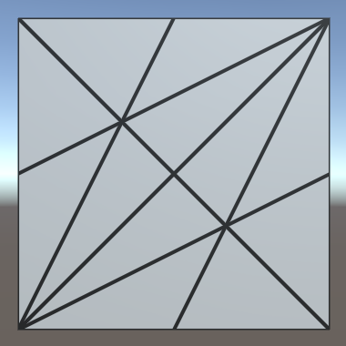 							Tessellation factors 2. 						

The triangles now do get subdivided. All their edges have been  split into two sub-edges each, leading to three new vertices per  triangle. Also, yet another vertex has been added at the center of each  triangle. This made it possible generate two triangles per original  edge, so the original triangles have been replaced by six smaller  triangles each. As the quad is made of two triangles, we're now getting  twelve triangles in total.

If you set all factors to 3 instead, each edge will be split  into three sub-edges. In this case, there won't be a center vertex.  Instead, three vertices are added inside the original triangle, forming a  smaller inner triangle. The outer edges will be connected to this inner  triangle with triangle strips.

 							
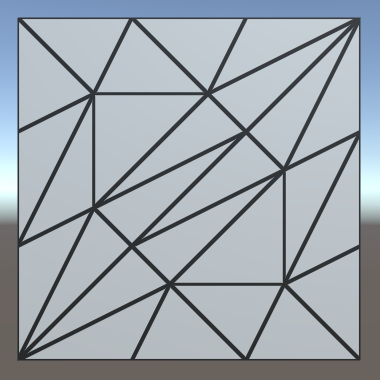 							Tessellation factors 3. 						

When the tessellation factors are even, there will be a single  center vertex. When they are odd, there will be a center triangle  instead. If we use larger tessellation factors, we end up with multiple  nested triangles. Each step towards the center, the amount by which the  triangle gets subdivided decreases by two, until we end up with either  one or zero sub-edges.

 							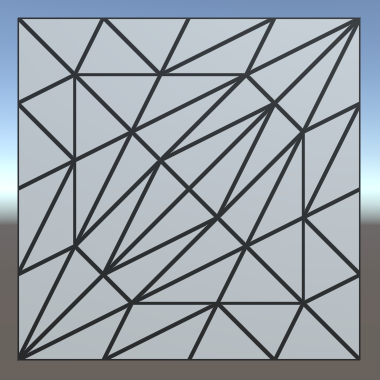 							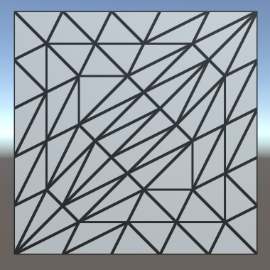
 							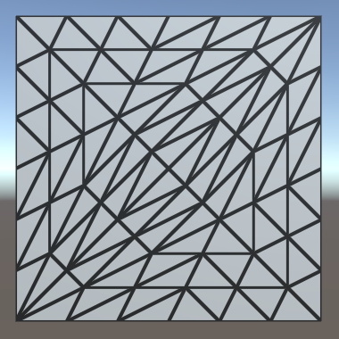 							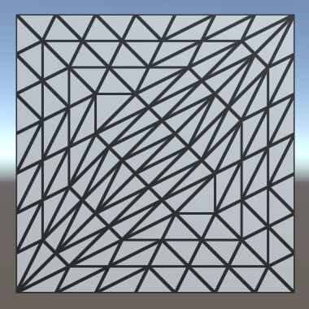 							Tessellation factors 4–7. 						

### Different Edge and Inside Factors

How the triangles get subdivided is controlled by the inside  tessellation factor. The edge factors can be used to override the amount  by which their respective edges are subdivided. This only affects the  original patch edges, not the generated inner triangles. To clearly see  this, set the inside factor to 7 while keeping the edge factors 1.

```
    f.edge[0] = 1;
    f.edge[1] = 1;
    f.edge[2] = 1;
	f.inside = 7;
```

 							
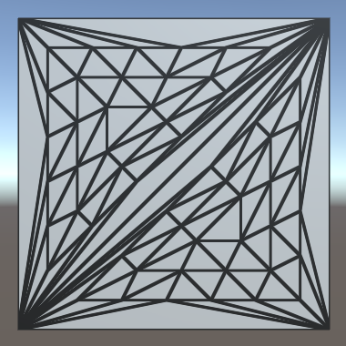 							Factor 7 inside, but 1 outside. 						

Effectively, the triangle is tessellated using the factor 7,  after which the outer ring of triangles is discarded. Each edge is then  subdivided using its own factor, after which a triangle strip is  generated to stitch the edge and inner triangle together.

It is also possible for the edge factors to be greater than the  inside factor. For example, set the edge factors to 7 while leaving the  inside factor at 1.

```
    f.edge[0] = 7;
    f.edge[1] = 7;
    f.edge[2] = 7;
	f.inside = 1;
```

 							
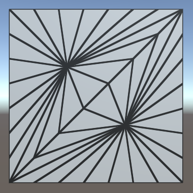 							Factor 1 inside, but 7 outside. 						

In this case, the inside factor is forced to act as if it were 2, because otherwise no new triangles could be generated.

 							What about using different factors for each edge? 							 						

### Variable Factors

Hard-coded tessellation factors aren't very useful. So let's make it configurable, starting with a single uniform factor.

```
float _TessellationUniform;

…

TessellationFactors MyPatchConstantFunction (
	InputPatch<TessellationControlPoint, 3> patch
) {
	TessellationFactors f;
    f.edge[0] = _TessellationUniform;
    f.edge[1] = _TessellationUniform;
    f.edge[2] = _TessellationUniform;
	f.inside = _TessellationUniform;
	return f;
}
```

Add a property for this to our shader. Set its range to 1–64.  No matter how high a factor we'd like to use, the hardware has a limit  of 64 subdivisions per patch.

```
		_TessellationUniform ("Tessellation Uniform", Range(1, 64)) = 1
```

To be able to edit this factor, add a `DoTessellation` method to `**MyLightingShaderGUI**` to display it in its own section.

```
	void DoTessellation () {
		GUILayout.Label("Tessellation", EditorStyles.boldLabel);
		EditorGUI.indentLevel += 2;
		editor.ShaderProperty(
			FindProperty("_TessellationUniform"),
			MakeLabel("Uniform")
		);
		EditorGUI.indentLevel -= 2;
	}
```

Invoke this method inside `OnGUI`, between the rendering mode and the wireframe section. Only do this if the required property exists.

```
	public override void OnGUI (
		MaterialEditor editor, MaterialProperty[] properties
	) {
		…
		DoRenderingMode();
		if (target.HasProperty("_TessellationUniform")) {
			DoTessellation();
		}
		if (target.HasProperty("_WireframeColor")) {
			DoWireframe();
		}
		…
	}
```


<iframe src="https://gfycat.com/ifr/FemalePleasingAquaticleech"></iframe>

Configurable uniform tessellation.

### Fractional Factors

Even though we use a float to set the tessellation factors, we  always end up with a whole number of equivalent subdivisions per edge.  That's because we're using the *integer*  partitioning mode. While it is a good mode to see how tessellation  works, it prevents us from smoothly transitioning between subdivision  levels. Fortunately, there are also fractional partitioning modes. Let's  change the mode to *fractional_odd*.

```
[UNITY_domain("tri")]
[UNITY_outputcontrolpoints(3)]
[UNITY_outputtopology("triangle_cw")]
[UNITY_partitioning("fractional_odd")]
[UNITY_patchconstantfunc("MyPatchConstantFunction")]
TessellationControlPoint MyHullProgram …
```

<iframe src="https://gfycat.com/ifr/BlushingDimwittedBobwhite"></iframe>

Fractional odd partitioning.

When using a whole odd factor, the *fractional_odd* partitioning mode produces the same results as the *integer*  mode. But when transitioning between odd factors, extra edge  subdivisions will be split off and grow, or shrink and merge. This means  edges are no longer always split in segments of equal length. The  advantage of this approach is that transitions between subdivision  levels are now smooth.

It is also possible to use the `fractional_even` mode. It works the same way, except that it is based on even factors.

<iframe src="https://gfycat.com/ifr/HilariousAromaticAmethystinepython"></iframe>

Fractional even partitioning.

The *fractional_odd* mode is often used because it can deal with a factor of 1, while the *fractional_even* mode is forced to use a minimum level of 2.

unitypackage

## Tessellation Heuristics

What are the best tessellation factors? That is the main  question that you have to ask yourself when working with tessellation.  There isn't a single objective answer to this question. In general, the  best you can do is come up with some metric that acts as a heuristic  that produces good results. In this tutorial, we'll support two simple  approaches.

### Edge Factors

Although tessellation factors have to be provided per edge, you  don't have to base the factors on the edges directly. For example, you  could determine factors per vertex, then average them per edge. Maybe  the factors are stored in a texture. In any case, it's handy to have a  separate function to determine the factor, given the two control points  of an edge. Create such a function, simply returning the uniform value  for now.

```
float TessellationEdgeFactor (
	TessellationControlPoint cp0, TessellationControlPoint cp1
) {
	return _TessellationUniform;
}
```

Use this function for the edge factors inside `MyPatchConstantFunction`.

```
TessellationFactors MyPatchConstantFunction (
	InputPatch<TessellationControlPoint, 3> patch
) {
	TessellationFactors f;
    f.edge[0] = TessellationEdgeFactor(patch[1], patch[2]);
    f.edge[1] = TessellationEdgeFactor(patch[2], patch[0]);
    f.edge[2] = TessellationEdgeFactor(patch[0], patch[1]);
	f.inside = _TessellationUniform;
	return f;
}
```

For the inside factor, we'll simply use the average of the edge factors.

```
	f.inside = (f.edge[0] + f.edge[1] + f.edge[2]) * (1 / 3.0);
```

### Edge Length

As the edge tessellation factors control how much we subdivide  the edges of the original triangle, it makes sense to base this factor  on the length of those edges. For example, we could specify a desired  triangle edge length. If we end up with triangle edges longer than that,  we should subdivide them by the desired length. Add a variable for  that.

```
float _TessellationUniform;
float _TessellationEdgeLength;
```

Add a property as well. Let's use a range from 0.1 to 1, with a default of 0.5. This is in world space units.

```
		_TessellationUniform ("Tessellation Uniform", Range(1, 64)) = 1
		_TessellationEdgeLength ("Tessellation Edge Length", Range(0.1, 1)) = 0.5
```

We need a shader feature to make it possible to switch between  uniform and edge-based tessellation. Add the required directive to all  our three passes, using the *_TESSELLATION_EDGE* keyword.

```
			#pragma shader_feature _TESSELLATION_EDGE
```

Next, add an enum type to `**MyLightingShaderGUI**` to represent the tessellation modes.

```
	enum TessellationMode {
		Uniform, Edge
	}
```

Then adjust `DoTessellation` so it can switch between both modes, using an enum popup. It works similar to how `DoSmoothness` controls the smoothness modes. In this case, uniform is the default mode, requiring no keyword.

```
	void DoTessellation () {
		GUILayout.Label("Tessellation", EditorStyles.boldLabel);
		EditorGUI.indentLevel += 2;

		TessellationMode mode = TessellationMode.Uniform;
		if (IsKeywordEnabled("_TESSELLATION_EDGE")) {
			mode = TessellationMode.Edge;
		}
		EditorGUI.BeginChangeCheck();
		mode = (TessellationMode)EditorGUILayout.EnumPopup(
			MakeLabel("Mode"), mode
		);
		if (EditorGUI.EndChangeCheck()) {
			RecordAction("Tessellation Mode");
			SetKeyword("_TESSELLATION_EDGE", mode == TessellationMode.Edge);
		}

		if (mode == TessellationMode.Uniform) {
			editor.ShaderProperty(
				FindProperty("_TessellationUniform"),
				MakeLabel("Uniform")
			);
		}
		else {
			editor.ShaderProperty(
				FindProperty("_TessellationEdgeLength"),
				MakeLabel("Edge Length")
			);
		}
		EditorGUI.indentLevel -= 2;
	}
```

 							
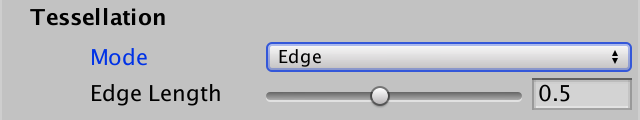 							Using edge mode. 						

Now we have to adjust `TessellationEdgeFactor`. When *_TESSELLATION_UNIFORM*  is defined, determine the world positions of both points, then compute  the distance between them. This is the edge length in world space. The  edge factor is equal to this length divided by the desired length.

```
float TessellationEdgeFactor (
	TessellationControlPoint cp0, TessellationControlPoint cp1
) {
	#if defined(_TESSELLATION_EDGE)
		float3 p0 = mul(unity_ObjectToWorld, float4(cp0.vertex.xyz, 1)).xyz;
		float3 p1 = mul(unity_ObjectToWorld, float4(cp1.vertex.xyz, 1)).xyz;
		float edgeLength = distance(p0, p1);
		return edgeLength / _TessellationEdgeLength;
	#else
		return _TessellationUniform;
	#endif
}
```

 							
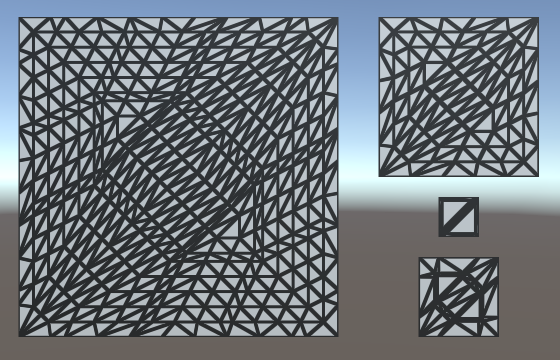 							Different quad scales, same desired edge length. 						

Because we're now using the edge length to determine an edge's  tessellation factor, we can end up with different factors per edge. You  can see this happen for the quad, as the diagonal edges are longer than  the other edges. It also becomes obvious when using a nonuniform scale  for the quad, stretching it in one dimension.

 							
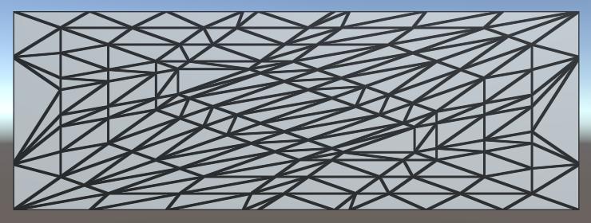 							Stretched quad. 						

To make this work, it is essential that patches that share an  edge both end up using the same tessellation factor for that edge.  Otherwise, the generated vertices won't match along that edge, which can  produce visible gaps in the mesh. In our case, we're using the same  logic for all edges. The only difference can be the order of the control  point arguments. Because of floating-point limitations, this could  technically produce different factors, but the difference will be so  minuscule that it would be unnoticeable.

### Edge Length in Screen Space

While we can now control the triangle edge length in world  space, this does not correspond to how they appear in screen space. The  point of tessellation is to add more triangles when they are needed. So  we don't want to subdivide triangles that already appear small. So let's  use the screen-space edge length instead.

First, change the range of our edge length property. Instead of  world units, we're going to use pixels, so a range like 5–100 makes  more sense.

```
		_TessellationEdgeLength ("Tessellation Edge Length", Range(5, 100)) = 50
```

Replace the world-space calculations with their screen-space  equivalents. To do this, the points have to be converted to clip space  instead of world space. Then their distance is determined in 2D, using  their X and Y coordinates, divided by their W coordinates to project  them onto the screen.

```
//		float3 p0 = mul(unity_ObjectToWorld, float4(cp0.vertex.xyz, 1)).xyz;
//		float3 p1 = mul(unity_ObjectToWorld, float4(cp1.vertex.xyz, 1)).xyz;
//		float edgeLength = distance(p0, p1);

		float4 p0 = UnityObjectToClipPos(cp0.vertex);
		float4 p1 = UnityObjectToClipPos(cp1.vertex);
		float edgeLength = distance(p0.xy / p0.w, p1.xy / p1.w);
		return edgeLength / _TessellationEdgeLength;
```

Now we have a result in clip space, which is a uniform cube  with size 2 that fits the display. To convert to pixels, we have to  scale by the display size in pixels. Actually, because the display is  rarely square, to get the most exact result, we should scale the X and Y  coordinates separately, before determining the distance. But let's  suffice with simply scaling by the screen height, to see how it looks.

```
	return edgeLength * _ScreenParams.y / _TessellationEdgeLength;
```

 							
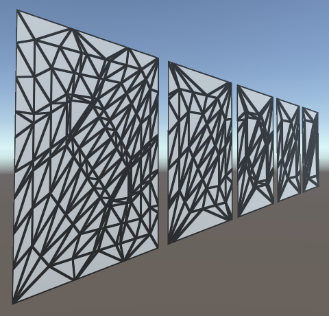 							Same world size, different screen size. 						

Our triangle edges now get subdivided based on how large they  are rendered. Position, rotation, and scale all influence this, relative  to the camera. As a result, the amount of tessellation changes when  things are in motion.

 							Shouldn't we use half the screen height? 							 						

### Using the View Distance

A downside of purely relying on the visual length of edges is  that edges that are long in world space can end up very small in screen  space. This could lead to these edges not being subdivided at all, while  other edges are subdivided a lot. This is undesirable when tessellation  is used to add details up close or to generate complex silhouettes.

A different approach is to go back to using the world-space  edge length, but adjust the factor based on the view distance. The  further away something is, the smaller it should appear visually, thus  the less tessellation it needs. So divide the edge length by the  distance between the edge and the camera. We can use the midpoint of the  edge to determine this distance.

```
//		float4 p0 = UnityObjectToClipPos(cp0.vertex);
//		float4 p1 = UnityObjectToClipPos(cp1.vertex);
//		float edgeLength = distance(p0.xy / p0.w, p1.xy / p1.w);
//		return edgeLength * _ScreenParams.y / _TessellationEdgeLength;

		float3 p0 = mul(unity_ObjectToWorld, float4(cp0.vertex.xyz, 1)).xyz;
		float3 p1 = mul(unity_ObjectToWorld, float4(cp1.vertex.xyz, 1)).xyz;
		float edgeLength = distance(p0, p1);

		float3 edgeCenter = (p0 + p1) * 0.5;
		float viewDistance = distance(edgeCenter, _WorldSpaceCameraPos);

		return edgeLength / (_TessellationEdgeLength * viewDistance);
```

We can still keep tessellation dependent on the display size,  by simply factoring the screen height into it and keeping our 5–100  slider range. Note that these values no longer directly correspond to  display pixels. This is very obvious when you change the field of view  of the camera, which doesn't affect tessellation at all. So this simple  approach won't work well for games that use a variable field of view,  for example to zoom in and out.

```
		return edgeLength * _ScreenParams.y /
			(_TessellationEdgeLength * viewDistance);
```

 							
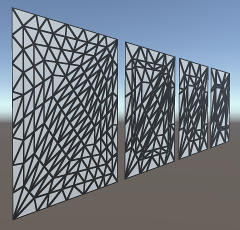 							Based on edge length and view distance. 						

### Using the Correct Inside Factor

Although tessellation might appear to work fine at this point,  there is something weird going on with the inside tessellation factor.  At least, this is the case when using OpenGL Core. It isn't that  noticeable when using a uniform quad, but it becomes obvious when using a  deformed cube.

 							
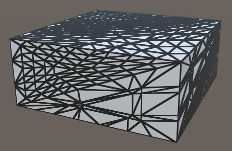 							Cube with incorrect inner factors. 						

In the case of a cube, the two triangles that make up a face  each get a very different inside tessellation factor. The only  difference between a quad and a cube face is the order in which the  triangle vertices are defined. Unity's default cube doesn't use a  symmetrical triangle layout, while the quad does. This suggests that the  order of the edges apparently influences the inside tessellation  factor. However, we simply take the average of the edge factors, so  their order shouldn't matter. Something else must be going wrong.

Let's do something seemingly nonsensical and explicitly invoke the `TessellationEdgeFactors`  function again, when calculating the inside factor. Logically, this  shouldn't make a difference because we just end up performing the exact  same calculations twice. The shader compiler will surely optimize that.

```
//    f.inside = (f.edge[0] + f.edge[1] + f.edge[2]) * (1 / 3.0);
	f.inside =
		(TessellationEdgeFactor(patch[1], patch[2]) +
		TessellationEdgeFactor(patch[2], patch[0]) +
		TessellationEdgeFactor(patch[0], patch[1])) * (1 / 3.0);
```

 							
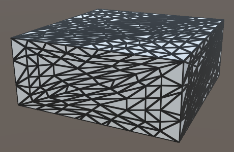 							Cube with correct inner factors. 						

Apparently, it does make a difference, because both face  triangles now end up using nearly the same inside factor. What's going  on here?

The patch constant function is invoked in parallel with the  rest of the hull shader. But it can actually get more complicated than  that. The shader compiler is able to parallelize the calculations of the  edge factors as well. The code inside `MyPatchConstantFunction`  is ripped apart and partially duplicated, replaced with a forked  process that calculates the three edge factors in parallel. Once all  three processes are done, their results are combined and used to  calculate the inside factor.

Whether the compiler decides to fork processes or not shouldn't  affect the results of our shader, only its performance. Unfortunately,  there is a bug in the generated code for OpenGL Core. Instead of using  the three edge factors when calculating the inside factor, only the  third edge factor gets used. The data is there, it's just accessing  index 2 three times, instead of index 0, 1, and 2. So we always end up  with an inside factor equal to the third edge factor.

In the case of the patch constant function, the shader compiler  prioritizes parallelization. It splits the processes as soon as  possible, after which it can no longer optimize away the duplicate  invocations of `TessellationEdgeFactor`. We end up with three  processes that each compute the world positions of two points, the  distances, and the final factors. Then there is also the process that  calculates the inner factor, which now also has to compute the world  positions of three points, plus all the distances and factors involved.  As we're doing all that work for the inner factor now, it doesn't make  sense to also do part of the same work separately for the edge factors.

It turns out that if we calculate the world positions of the points first, followed by separate invocations of `TessellationEdgeFactor`  for the edge and the inner factors, the shader compiler decides not to  fork separate processes for each edge factor. We end up with a single  process that computes it all. In this case, the shader compiler does  optimize away the duplicate invocations of `TessellationEdgeFactor`.

```
float TessellationEdgeFactor (float3 p0, float3 p1) {
	#if defined(_TESSELLATION_EDGE)
//		float3 p0 = mul(unity_ObjectToWorld, cp0.vertex).xyz;
//		float3 p1 = mul(unity_ObjectToWorld, cp1.vertex).xyz;
		…
	#else
		return _TessellationUniform;
	#endif
}

TessellationFactors MyPatchConstantFunction (
	InputPatch<TessellationControlPoint, 3> patch
) {
	float3 p0 = mul(unity_ObjectToWorld, patch[0].vertex).xyz;
	float3 p1 = mul(unity_ObjectToWorld, patch[1].vertex).xyz;
	float3 p2 = mul(unity_ObjectToWorld, patch[2].vertex).xyz;
	TessellationFactors f;
    f.edge[0] = TessellationEdgeFactor(p1, p2);
    f.edge[1] = TessellationEdgeFactor(p2, p0);
    f.edge[2] = TessellationEdgeFactor(p0, p1);
	f.inside =
		(TessellationEdgeFactor(p1, p2) +
		TessellationEdgeFactor(p2, p0) +
		TessellationEdgeFactor(p0, p1)) * (1 / 3.0);
	return f;
}
```

At this point we can subdivide triangles, but we're not doing anything with that ability yet. The [Surface Displacement](https://catlikecoding.com/unity/tutorials/advanced-rendering/surface-displacement/) demonstrates how tessellation can be used to deform surfaces.

unitypackage

PDF
