# Triplanar Mapping

Texturing Arbitrary Surfaces

- Remove dependency on UV and tangents.
- Support a generic surface approach.
- Use planar projections.
- Blend between three mappings.

This tutorial is about supporting triplanar texture mapping. It uses the [FXAA](https://catlikecoding.com/unity/tutorials/advanced-rendering/fxaa/) tutorial project as its foundation. 				 				

This tutorial is made with Unity 2017.4.1f1.

 					
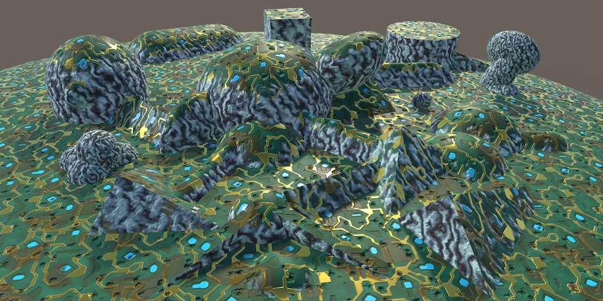 					Neither vertex UV coordinates nor tangent vectors required. 				

## Texturing Without UV Coordinates

The usual way to perform texture mapping is by using the UV  coordinates stored per-vertex in a mesh. But this is not the only way to  do it. Sometimes, there are no UV coordinates available. For example,  when working with procedural geometry of arbitrary shapes. When creating  a terrain or cave systems at run-time, it usually isn't feasible to  generate UV coordinates for an appropriate texture unwrap. In those  cases, we have to use an alternative way to map textures onto our  surfaces. One such way is triplanar mapping.

Up to this point, we've always assumed that UV coordinates are available. Our *My Lighting Input* and *My Lighting*  shader include files depend on them. While we could create alternatives  that do not depend on vertex UV, it would be more convenient if our  current files could be made to work both with and without UV. This  requires a few changes.

We keep the current approach as the default, but will switch to working without UV when *NO_DEFAULT_UV* is defined.

### Doing Without Default UV

When the mesh data doesn't contain UV, then we don't have any  UV to pass from the vertex to the fragment program. So make the  existence of the UV interpolator in *My Lighting Input* dependent on *NO_DEFAULT_UV*.

```
struct InterpolatorsVertex {
	…

	#if !defined(NO_DEFAULT_UV)
		float4 uv : TEXCOORD0;
	#endif

	…
};

struct Interpolators {
	…

	#if !defined(NO_DEFAULT_UV)
		float4 uv : TEXCOORD0;
	#endif

	…
};
```

There are multiple functions that assume the interpolators  always contain UV, so we have to make sure that they keep working and  compiling. We'll do that by introducing a new `GetDefaultUV` function below the interpolator declarations. When no UV are available, it will simply return zeros, otherwise the regular UV.

We'll also make it possible to provide an alternative approach by defining *UV_FUNCTION*, in case that might be useful. This works like *ALBEDO_FUNCTION*, except that an override has to be defined before the inclusion of *My Lighting Input*.

```
float4 GetDefaultUV (Interpolators i) {
	#if defined(NO_DEFAULT_UV)
		return float4(0, 0, 0, 0);
	#else
		return i.uv;
	#endif
}

#if !defined(UV_FUNCTION)
	#define UV_FUNCTION GetDefaultUV
#endif
```

Now we can change all usage of `i.uv` with `UV_FUNCTION(i)`. I've only shown the change for `GetDetailMask`, but it applies to all getter functions.

```
float GetDetailMask (Interpolators i) {
	#if defined (_DETAIL_MASK)
		return tex2D(_DetailMask, UV_FUNCTION(i).xy).a;
	#else
		return 1;
	#endif
}
```

Moving on to *My Lighting*, we must make  sure that all UV-related work in the vertex program is skipped when no  UV are available. This applies to the texture coordinate transformation,  and also the default vertex displacement approach.

```
InterpolatorsVertex MyVertexProgram (VertexData v) {
	…

	#if !defined(NO_DEFAULT_UV)
		i.uv.xy = TRANSFORM_TEX(v.uv, _MainTex);
		i.uv.zw = TRANSFORM_TEX(v.uv, _DetailTex);

		#if VERTEX_DISPLACEMENT
			float displacement = tex2Dlod(_DisplacementMap, float4(i.uv.xy, 0, 0)).g;
			displacement = (displacement - 0.5) * _DisplacementStrength;
			v.normal = normalize(v.normal);
			v.vertex.xyz += v.normal * displacement;
		#endif
	#endif

	…
}
```

The parallax effect also relies on default UV, so skip it when UV are not available.

```
void ApplyParallax (inout Interpolators i) {
	#if defined(_PARALLAX_MAP) && !defined(NO_DEFAULT_UV)
		…
	#endif
}
```

### Collecting Surface Properties

Without UV, there must be another way to determine the surface  properties used for lighting. To make this as generic as possible, our  include files shouldn't care how these properties are obtained. All we  need is a universal way to provide surface properties. We can use an  approach akin to Unity's surface shaders, relying on a function to set  all surface properties.

Create a new *MySurface.cginc* include file. In it, define a `**SurfaceData**`  struct that contains all surface properties needed for lighting. That's  albedo, emission, normal, alpha, metallic, occlusion, and smoothness.

```
#if !defined(MY_SURFACE_INCLUDED)
#define MY_SURFACE_INCLUDED

struct SurfaceData {
	float3 albedo, emission, normal;
	float alpha, metallic, occlusion, smoothness;
};

#endif
```

We put it in a separate file, so other code can use it before  including any other files. But our files will rely on it as well, so  include it in *My Lighting Input*.

```
#include "UnityPBSLighting.cginc"
#include "AutoLight.cginc"
#include "MySurface.cginc"
```

In *My Lighting*, setup a new `**SurfaceData** surface` variable with the default functions, at the beginning of `MyFragmentProgram`, after `ApplyParallax` and before alpha is used. Then change the alpha code to rely on `surface.alpha` instead of invoking `GetAlpha`. Also move `InitializeFragmentNormal` so the normal vector is handled before the surface is configured.

```
FragmentOutput MyFragmentProgram (Interpolators i) {
	UNITY_SETUP_INSTANCE_ID(i);
	#if defined(LOD_FADE_CROSSFADE)
		UnityApplyDitherCrossFade(i.vpos);
	#endif

	ApplyParallax(i);
	
	InitializeFragmentNormal(i);

	SurfaceData surface;
	surface.normal = i.normal;
	surface.albedo = ALBEDO_FUNCTION(i);
	surface.alpha = GetAlpha(i);
	surface.emission = GetEmission(i);
	surface.metallic = GetMetallic(i);
	surface.occlusion = GetOcclusion(i);
	surface.smoothness = GetSmoothness(i);
	
	float alpha = surface.alpha;
	#if defined(_RENDERING_CUTOUT)
		clip(alpha - _Cutoff);
	#endif
	
//	InitializeFragmentNormal(i);

	…
}
```

Now rely on `surface` instead of invoking the getter functions again when determining the fragment's color.

```
	float3 albedo = DiffuseAndSpecularFromMetallic(
		surface.albedo, surface.metallic, specularTint, oneMinusReflectivity
	);
	
	…
	
	float4 color = UNITY_BRDF_PBS(
		albedo, specularTint,
		oneMinusReflectivity, surface.smoothness,
		i.normal, viewDir,
		CreateLight(i), CreateIndirectLight(i, viewDir)
	);
	color.rgb += surface.emission;
```

And when filling the G-buffers for deferred rendering.

```
	#if defined(DEFERRED_PASS)
		#if !defined(UNITY_HDR_ON)
			color.rgb = exp2(-color.rgb);
		#endif
		output.gBuffer0.rgb = albedo;
		output.gBuffer0.a = surface.occlusion;
		output.gBuffer1.rgb = specularTint;
		output.gBuffer1.a = surface.smoothness;
		output.gBuffer2 = float4(i.normal * 0.5 + 0.5, 1);
		output.gBuffer3 = color;

		…
	#endif
```

The `CreateIndirectLight` function also used the getter functions, so add a `**SurfaceData**` parameter to it and use that instead.

```
UnityIndirect CreateIndirectLight (
	Interpolators i, float3 viewDir, SurfaceData surface
) {
	…

	#if defined(FORWARD_BASE_PASS) || defined(DEFERRED_PASS)
		…

		float3 reflectionDir = reflect(-viewDir, i.normal);
		Unity_GlossyEnvironmentData envData;
		envData.roughness = 1 - surface.smoothness;
		…

		float occlusion = surface.occlusion;
		…
	#endif

	return indirectLight;
}
```

Then add `surface` as an argument to its invocation in `MyFragmentProgram`.

```
		CreateLight(i), CreateIndirectLight(i, viewDir, surface)
```

### Customized Surfaces

To make it possible to change how the surface data is obtained,  we'll again allow the definition of a custom function. This function  needs input to work with. By default, that would be the UV coordinates,  both the main and detail UV packed in a single `**float4**`. Alternative inputs could be a position and a normal vector. Add a `**SurfaceParameters**` struct to our `Surface` file that contains all these inputs.

```
struct SurfaceData {
	float3 albedo, emission, normal;
	float alpha, metallic, occlusion, smoothness;
};

struct SurfaceParameters {
	float3 normal, position;
	float4 uv;
};
```

Back in `My Lighting`, adjust `MyFragmentProgram` so it uses a different way to setup the surface data when a *SURFACE_FUNCTION* is defined. When this is the case, fill `surface`  with the normal vector and set all other values to their default. Then  create the surface parameters and invoke the custom surface function.  Its arguments are the surface—as an `**inout**` parameter—and the parameters struct.

```
	SurfaceData surface;
	#if defined(SURFACE_FUNCTION)
		surface.normal = i.normal;
		surface.albedo = 1;
		surface.alpha = 1;
		surface.emission = 0;
		surface.metallic = 0;
		surface.occlusion = 1;
		surface.smoothness = 0.5;

		SurfaceParameters sp;
		sp.normal = i.normal;
		sp.position = i.worldPos.xyz;
		sp.uv = UV_FUNCTION(i);

		SURFACE_FUNCTION(surface, sp);
	#else
		surface.normal = i.normal;
		surface.albedo = ALBEDO_FUNCTION(i);
		surface.alpha = GetAlpha(i);
		surface.emission = GetEmission(i);
		surface.metallic = GetMetallic(i);
		surface.occlusion = GetOcclusion(i);
		surface.smoothness = GetSmoothness(i);
	#endif
```

As it might be possible that *SURFACE_FUNCTION* changes the surface normal, assign it back to `i.normal` afterwards. That way we don't need to change all the code that uses `i.normal`.

```
	SurfaceData surface;
	#if defined(SURFACE_FUNCTION)
		…
	#else
		…
	#endif
	i.normal = surface.normal;
```

### No Tangent Space

Note that unlike Unity's surface shader approach, we're working  with a normal vector in world space, not tangent space. If we want to  use tangent-space normal mapping in *SURFACE_FUNCTION*,  then we have to explicitly do this ourselves. We could also support  more configuration options about how the normal should be treated both  before and after invoking *SURFACE_FUNCTION*, but we won't do that in this tutorial.

What we will do is make it possible to turn off the default  tangent-space normal mapping approach. This saves work when tangents  aren't used. We'll do this by only turning on tangent space when the  default normal mapping or parallax mapping is active. Indicate this in *My Lighting Input* with a convenient *REQUIRES_TANGENT_SPACE* macro.

```
#if defined(_NORMAL_MAP) || defined(_DETAIL_NORMAL_MAP) || defined(_PARALLAX_MAP)
	#define REQUIRES_TANGENT_SPACE 1
	#define TESSELLATION_TANGENT 1
#endif
#define TESSELLATION_UV1 1
#define TESSELLATION_UV2 1
```

Now we only have to include the tangent and binormal vector interpolators when needed.

```
struct InterpolatorsVertex {
	…

	#if REQUIRES_TANGENT_SPACE
		#if defined(BINORMAL_PER_FRAGMENT)
			float4 tangent : TEXCOORD2;
		#else
			float3 tangent : TEXCOORD2;
			float3 binormal : TEXCOORD3;
		#endif
	#endif

	…
};

struct Interpolators {
	…

	#if REQUIRES_TANGENT_SPACE
		#if defined(BINORMAL_PER_FRAGMENT)
			float4 tangent : TEXCOORD2;
		#else
			float3 tangent : TEXCOORD2;
			float3 binormal : TEXCOORD3;
		#endif
	#endif

	…
};
```

In *My Lighting*, we could skip setting up these vectors in `MyVertexProgram`.

```
InterpolatorsVertex MyVertexProgram (VertexData v) {
	…

	#if REQUIRES_TANGENT_SPACE
		#if defined(BINORMAL_PER_FRAGMENT)
			i.tangent = float4(UnityObjectToWorldDir(v.tangent.xyz), v.tangent.w);
		#else
			i.tangent = UnityObjectToWorldDir(v.tangent.xyz);
			i.binormal = CreateBinormal(i.normal, i.tangent, v.tangent.w);
		#endif
	#endif

	…
}
```

And without tangent space, `InitializeFragmentNormal` is reduced so simply normalizing the interpolated normal.

```
void InitializeFragmentNormal(inout Interpolators i) {
	#if REQUIRES_TANGENT_SPACE
		float3 tangentSpaceNormal = GetTangentSpaceNormal(i);
		#if defined(BINORMAL_PER_FRAGMENT)
			float3 binormal =
				CreateBinormal(i.normal, i.tangent.xyz, i.tangent.w);
		#else
			float3 binormal = i.binormal;
		#endif
		
		i.normal = normalize(
			tangentSpaceNormal.x * i.tangent +
			tangentSpaceNormal.y * binormal +
			tangentSpaceNormal.z * i.normal
		);
	#else
		i.normal = normalize(i.normal);
	#endif
}
```

### Triplanar Shader

All our shaders still work, but it's now possible to use our  include files without tangent space and with alternative surface data.  Let's create a new shader to take advantage of this. First, create a new  *MyTriplanarMapping.cginc* include file. Have it define *NO_DEFAULT_UV*, then include *Surface.cginc*. Actually, as we'll use the *_MainTex* property that's already defined in *My Lighting Input*, include that file instead. Then create a `MyTriplanarSurfaceFunction` with an `**inout** **SurfaceData**` parameter and a regular `**SurfaceParameters**` parameter. For now, just have it use the normal to set the albedo. Define this function as `SURFACE_FUNCTION`.

```
#if !defined(MY_TRIPLANAR_MAPPING_INCLUDED)
#define MY_TRIPLANAR_MAPPING_INCLUDED

#define NO_DEFAULT_UV

#include "My Lighting Input.cginc"

void MyTriPlanarSurfaceFunction (
	inout SurfaceData surface, SurfaceParameters parameters
) {
	surface.albedo = parameters.normal * 0.5 + 0.5;
}

#define SURFACE_FUNCTION MyTriPlanarSurfaceFunction

#endif
```

Create a new shader that uses this include file, instead of *My Lighting Input*.  We'll make a minimal shader without transparency, supporting just the  usual rendering pipelines, plus fog and instancing. Here is the shader  with the forward base and additive passes.

```
Shader "Custom/Triplanar Mapping" {

	Properties {
		_MainTex ("Albedo", 2D) = "white" {}
	}

	SubShader {

		Pass {
			Tags {
				"LightMode" = "ForwardBase"
			}

			CGPROGRAM

			#pragma target 3.0

			#pragma multi_compile_fwdbase
			#pragma multi_compile_fog
			#pragma multi_compile_instancing

			#pragma vertex MyVertexProgram
			#pragma fragment MyFragmentProgram

			#define FORWARD_BASE_PASS

			#include "MyTriplanarMapping.cginc"
			#include "My Lighting.cginc"

			ENDCG
		}

		Pass {
			Tags {
				"LightMode" = "ForwardAdd"
			}

			Blend One One
			ZWrite Off

			CGPROGRAM

			#pragma target 3.0

			#pragma multi_compile_fwdadd_fullshadows
			#pragma multi_compile_fog

			#pragma vertex MyVertexProgram
			#pragma fragment MyFragmentProgram

			#include "MyTriplanarMapping.cginc"
			#include "My Lighting.cginc"

			ENDCG
		}
	}
}
```

And here are the deferred and shadow passes. Note that the  shadow pass doesn't need special treatment, because it doesn't care  about surface properties of opaque geometry. We don't add support for  lightmapping yet, so no meta pass at this point.

```
Shader "Custom/Triplanar Mapping" {

	Properties {
		_MainTex ("Albedo", 2D) = "white" {}
	}

	SubShader {

		…

		Pass {
			Tags {
				"LightMode" = "Deferred"
			}

			CGPROGRAM

			#pragma target 3.0
			#pragma exclude_renderers nomrt

			#pragma multi_compile_prepassfinal
			#pragma multi_compile_instancing

			#pragma vertex MyVertexProgram
			#pragma fragment MyFragmentProgram

			#define DEFERRED_PASS

			#include "MyTriplanarMapping.cginc"
			#include "My Lighting.cginc"

			ENDCG
		}

		Pass {
			Tags {
				"LightMode" = "ShadowCaster"
			}

			CGPROGRAM

			#pragma target 3.0

			#pragma multi_compile_shadowcaster
			#pragma multi_compile_instancing

			#pragma vertex MyShadowVertexProgram
			#pragma fragment MyShadowFragmentProgram

			#include "My Shadows.cginc"

			ENDCG
		}
	}
}
```

Create a material with our new shader and try it out. I've use  the old test texture as the material's main texture, though it doesn't  get used at this point.

 							 							 							Triplanar Mapping material, using normal as albedo. 						

unitypackage

## Texturing With Three Planes

How can we perform texture mapping when vertex UV coordinates  are unavailable? We have to use a substitute. The only viable approach  is to use the world position—or maybe the object-space position—as an  alternative source of UV coordinates for texture mapping.

### Texture Mapping Based on Position

The world position of a fragment is a 3D vector, but regular  texture mapping is done in 2D. So we have to choose two dimensions to  use as UV coordinates, which means that we map the texture onto a plane  in 3D space. The most obvious choice is the use the XY coordinates.

```
	surface.albedo = tex2D(_MainTex, parameters.position.xy);
```

 							
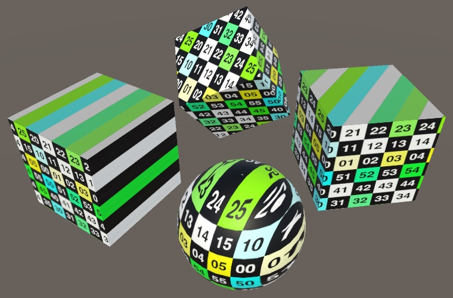 							Using position XY for UV coordinates. 						

 							What about using 3D textures? 							 						

The result is that we see the texture projected along the Z  axis. But this is not the only possible orientation. We could also  project along the Y axis, by using the XZ coordinates instead. This  corresponds to the planar texture mapping often used to texture  terrains.

```
	surface.albedo = tex2D(_MainTex, parameters.position.xz);
```

 							
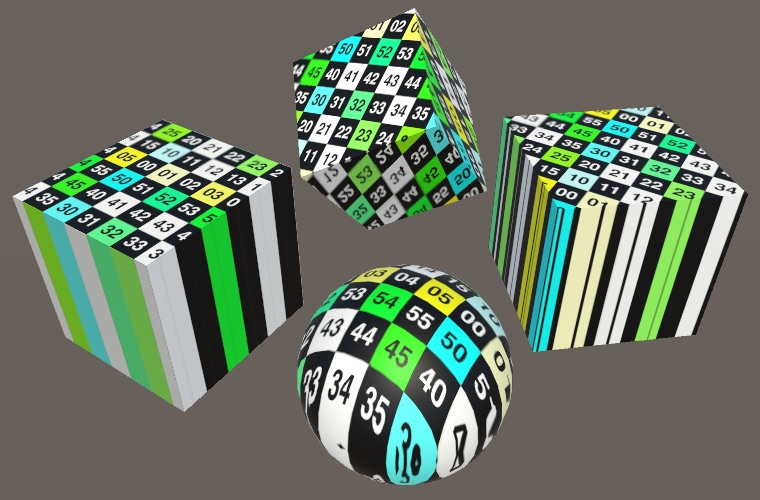 							Using position XZ for UV coordinates. 						

And the third option is to project along X, by using the YZ coordinates.

```
	surface.albedo = tex2D(_MainTex, parameters.position.yz);
```

 							
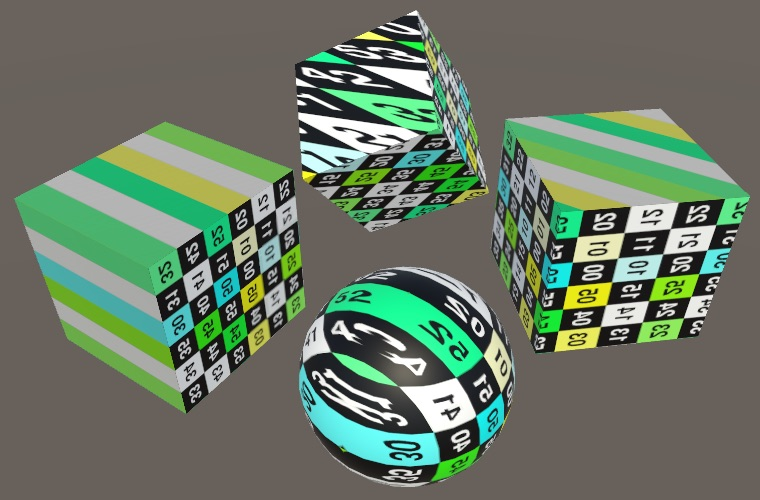 							Using position YZ for UV coordinates. 						

But when we use YZ we end up with the texture rotated 90°. To keep the orientation as expected, we have to use ZY instead.

```
	surface.albedo = tex2D(_MainTex, parameters.position.zy);
```

 							
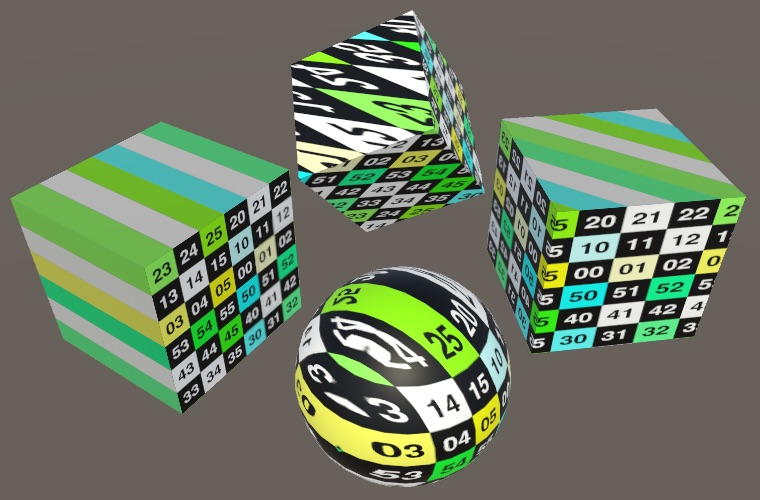 							Using position ZY for UV coordinates. 						

### Combining All Three Mappings

A single-planar mapping works well when a surface is mostly  aligned with the projection axis, but looks horrible when it isn't. When  the results are bad along one axis, they might be better along another  axis. So it's useful to support all three mappings, which requires us to  provide three different UV coordinate pairs.

Let's keep the logic to determine these UV coordinates separate. Create a `**TriplanarUV**` struct with coordinate pairs for all three axes. Then make a `GetTriplanarUV` function that sets up the UV based on the surface parameters.

```
struct TriplanarUV {
	float2 x, y, z;
};

TriplanarUV GetTriplanarUV (SurfaceParameters parameters) {
	TriplanarUV triUV;
	float3 p = parameters.position;
	triUV.x = p.zy;
	triUV.y = p.xz;
	triUV.z = p.xy;
	return triUV;
}
```

Use this function in `MyTriPlanarSurfaceFunction` and just sample using all three projections. The final albedo then becomes their average.

```
void MyTriPlanarSurfaceFunction (
	inout SurfaceData surface, SurfaceParameters parameters
) {
	TriplanarUV triUV = GetTriplanarUV(parameters);
	
	float3 albedoX = tex2D(_MainTex, triUV.x).rgb;
	float3 albedoY = tex2D(_MainTex, triUV.y).rgb;
	float3 albedoZ = tex2D(_MainTex, triUV.z).rgb;
	
	surface.albedo = (albedoX + albedoY + albedoZ) / 3;
	…
}
```

 							
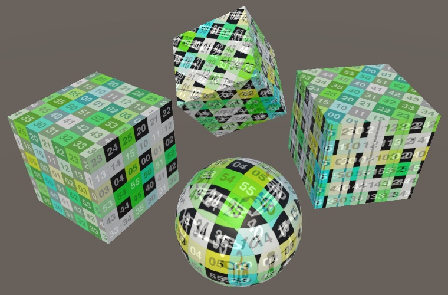 							Averaging three mappings. 						

### Blending Based on Normal

We now always get the best projection, but also the other two.  We cannot only use the best one, because they we'd get seams where  what's best suddenly changes. But what we can do is smoothly blend  between them.

The preferred mapping is the one that best aligns with the  surface orientation, which is indicated by the surface normal. So we  could use the normal to define the weights of all three projections. We  have to use the absolute of the normal vector, because a surface can  face a negative direction. Also, the total of the weights has to sum to  1, so we have to normalize them via division by their total. Create a  new function to compute these weights.

```
float3 GetTriplanarWeights (SurfaceParameters parameters) {
	float3 triW = abs(parameters.normal);
	return triW / (triW.x + triW.y + triW.z);
}
```

Now we can modulate the contribution of each mapping by its weight.

```
void MyTriPlanarSurfaceFunction (
	inout SurfaceData surface, SurfaceParameters parameters
) {
	…

	float3 triW = GetTriplanarWeights(parameters);
	
	surface.albedo = albedoX * triW.x + albedoY * triW.y + albedoZ * triW.z;
	…
}
```

 							
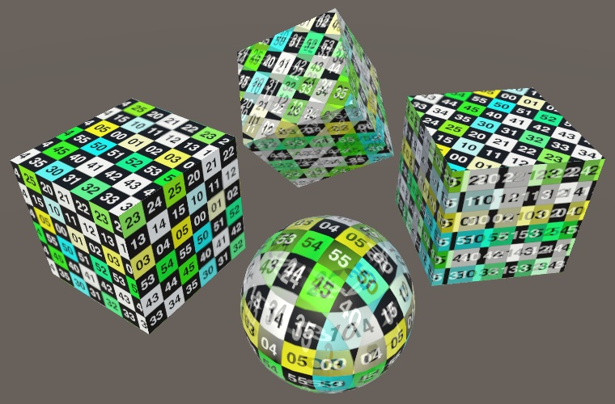 							Blending three mappings. 						

### Mirrored Mapping

The best possible projection is now strongest. On axis-aligned  surfaces, we end up seeing only a single mapping. An axis-aligned cube  looks good on all sides, except that half of them end up with a mirrored  mapping.

 							
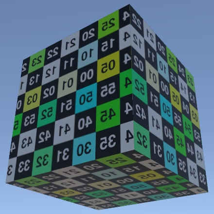 							Texture is mirrored on the other side. 						

It isn't always a problem when a texture gets mirrored, but  it's obvious when using our test texture with numbers on it. So let's  make sure that textures are never mirrored. We do this by negating the U  coordinate when appropriate. In case of the X mapping, that's when `normal.**x**` is negative. Likewise for the Y projection, when `normal.**y**` is negative. It's the opposite for Z.

```
TriplanarUV GetTriplanarUV (SurfaceParameters parameters) {
	TriplanarUV triUV;
	float3 p = parameters.position;
	triUV.x = p.zy;
	triUV.y = p.xz;
	triUV.z = p.xy;
	if (parameters.normal.x < 0) {
		triUV.x.x = -triUV.x.x;
	}
	if (parameters.normal.y < 0) {
		triUV.y.x = -triUV.y.x;
	}
	if (parameters.normal.z >= 0) {
		triUV.z.x = -triUV.z.x;
	}
	return triUV;
}
```

 							
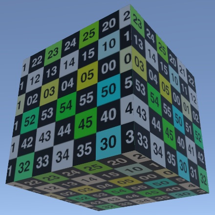 							No longer mirrored. 						

Note that this produces a seam in each mapping where its  dimension is zero, but that's fine because their weight is zero there as  well.

### Offsetting Maps

Because we're projecting the same texture on a surface three  times, we can end up with sudden repetitions. This can be quite obvious  on a sphere. You can move it around until you end up with a texture  alignment like in the below screenshot. From left to right, you can see  the sequences 44, 45, 40, 44, 45, 40, even though the compete sequence  is 40–45. And below that you can see 34, 35, 30, 34, 35, 30. And  vertically you can see 44 and 45 repeated.

 							
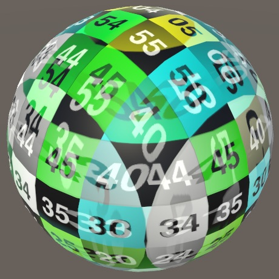 							Aligned maps. 						

We can eliminate such repetitions by offsetting the  projections. If we shift the X mapping by ½ vertically, then we  eliminate them between X and Z. Likewise for Y and Z if we shift X by ½  horizontally. The X and Y mappings aren't aligned, so we don't have to  worry about those.

```
TriplanarUV GetTriplanarUV (SurfaceParameters parameters) {
	…
	triUV.x.y += 0.5;
	triUV.z.x += 0.5;
	return triUV;
}
```

 							
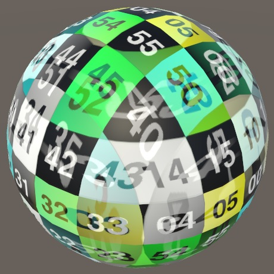 							Offset maps. 						

We used ½ as an offset because that's the maximum. In case of  our test texture, it breaks the number sequences but keeps the blocks  aligned. Had we used a texture with three instead of six obvious bands,  offsetting by ⅓ would've looked better. Usually, triplanar mapping is  done with terrain textures, for which you don't have to worry about  exact alignment.

unitypackage

## Other Surface Properties

Besides albedo, there are more surface properties that could be  stored in maps. For example, for our circuitry materials we also have  metallic, occlusion, smoothness, and normal maps. Let's support those as  well.

 						
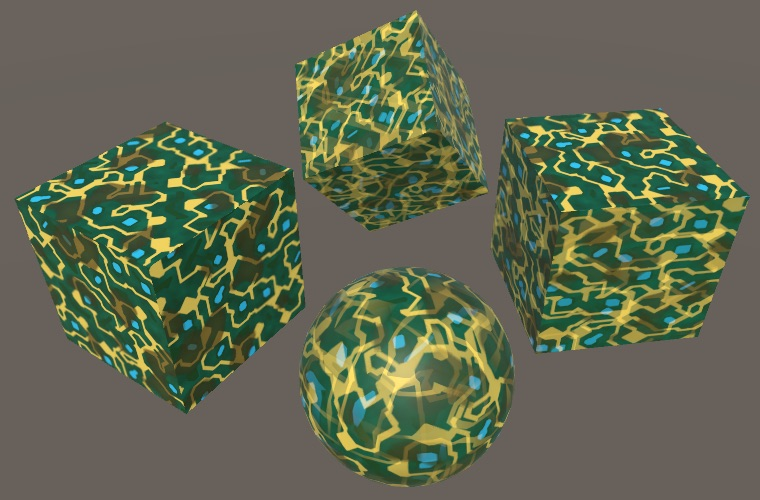 						Using circuitry albedo map only. 					

### MOS Maps

When using triplanar mapping, we sample maps using three  different projections. This triples the amount of texture sampling in  the shader. To keep this manageable, we should aim to minimize the  amount of samples per projection. We can do this by storing multiple  surface properties in a single map. We already have such a map for our  circuitry material, storing metallic in the R channel, occlusion in G,  and smoothness in A. So that's a Metallic-Occlusion-Smoothness map, or  MOS map for short. We'll rely on such a MOS map in our triplanar shader,  so add it as a property.

```
	Properties {
		_MainTex ("Albedo", 2D) = "white" {}
		[NoTilingOffset] _MOSMap ("MOS", 2D) = "white" {}
	}
```

 							
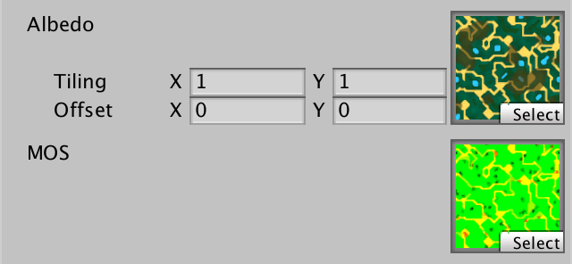 							Material with circuitry MOS map. 						

Add a variable for this map—as it is not defined in *My Lighting Input*—then sample it three times, just like the albedo map.

```
sampler2D _MOSMap;

…

void MyTriPlanarSurfaceFunction (
	inout SurfaceData surface, SurfaceParameters parameters
) {
	TriplanarUV triUV = GetTriplanarUV(parameters);
	
	float3 albedoX = tex2D(_MainTex, triUV.x).rgb;
	float3 albedoY = tex2D(_MainTex, triUV.y).rgb;
	float3 albedoZ = tex2D(_MainTex, triUV.z).rgb;

	float4 mosX = tex2D(_MOSMap, triUV.x);
	float4 mosY = tex2D(_MOSMap, triUV.y);
	float4 mosZ = tex2D(_MOSMap, triUV.z);
	
	…
}
```

Blend the MOS data using the triplanar weights, then use the result to setup the surface.

```
	surface.albedo = albedoX * triW.x + albedoY * triW.y + albedoZ * triW.z;

	float4 mos = mosX * triW.x + mosY * triW.y + mosZ * triW.z;
	surface.metallic = mos.x;
	surface.occlusion = mos.y;
	surface.smoothness = mos.a;
```

 							
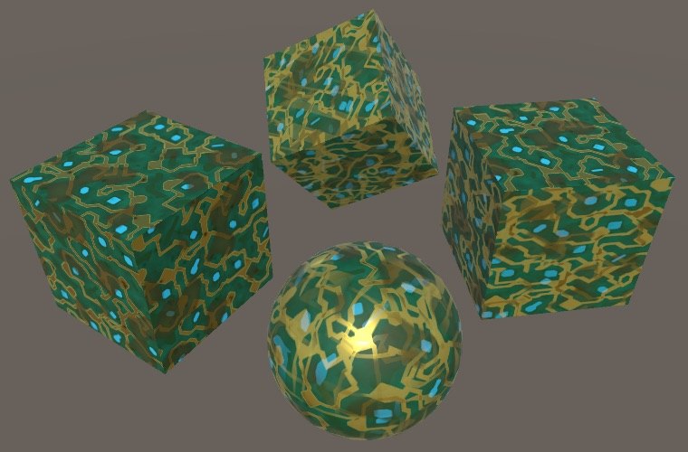 							Using circuitry MOS map. 						

### Normal Maps

Add support for a normal map as well. We cannot pack that in another map, so it needs its own property.

```
	Properties {
		_MainTex ("Albedo", 2D) = "white" {}
		[NoTilingOffset] _MOSMap ("MOS", 2D) = "white" {}
		[NoTilingOffset] _NormalMap ("Normals", 2D) = "white" {}
	}
```

 							
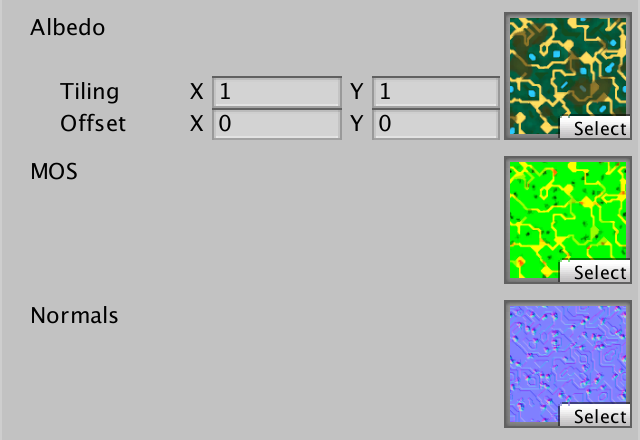 							Material with circuitry normal map. 						

Sample the map three times, and unpack the normal for each axis.

```
void MyTriPlanarSurfaceFunction (
	inout SurfaceData surface, SurfaceParameters parameters
) {
	…

	float4 mosX = tex2D(_MOSMap, triUV.x);
	float4 mosY = tex2D(_MOSMap, triUV.y);
	float4 mosZ = tex2D(_MOSMap, triUV.z);

	float3 tangentNormalX = UnpackNormal(tex2D(_NormalMap, triUV.x));
	float3 tangentNormalY = UnpackNormal(tex2D(_NormalMap, triUV.y));
	float3 tangentNormalZ = UnpackNormal(tex2D(_NormalMap, triUV.z));
	
	…
}
```

We can blend the normal the same way as the other data, we just  have to normalize it too. However, that would only work for world-space  normals, while what we sampled are tangent-space normals. Let's begin  by assuming we can directly use them as world-space normals and see what  happens. To make it more obvious, again use the normal for albedo as  well.

```
	float3 tangentNormalX = UnpackNormal(tex2D(_NormalMap, triUV.x));
	float3 tangentNormalY = UnpackNormal(tex2D(_NormalMap, triUV.y));
	float3 tangentNormalZ = UnpackNormal(tex2D(_NormalMap, triUV.z));

	float3 worldNormalX = tangentNormalX;
	float3 worldNormalY = tangentNormalY;
	float3 worldNormalZ = tangentNormalZ;
	
	float3 triW = GetTriplanarWeights(parameters);
	
	…

	surface.normal = normalize(
		worldNormalX * triW.x + worldNormalY * triW.y + worldNormalZ * triW.z
	);
	surface.albedo = surface.normal * 0.5 + 0.5;
```

 							
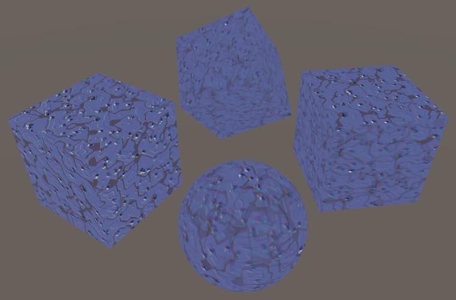 							Projected normals in tangent space. 						

The final normal vectors are incorrect. The tangent space  normals are stored with their local up direction—away from the  surface—in the Z channel, so the result is mostly blue. This matches the  XYZ orientation of the Z projection, but not the other two.

In the case of the Y projection, the up direction corresponds  to Y, not Z. So we have to swap Y and Z to convert from tangent space to  world space. Likewise, we have to swap X and Z for the X projection.

```
	float3 tangentNormalX = UnpackNormal(tex2D(_NormalMap, triUV.x));
	float3 tangentNormalY = UnpackNormal(tex2D(_NormalMap, triUV.y));
	float3 tangentNormalZ = UnpackNormal(tex2D(_NormalMap, triUV.z));

	float3 worldNormalX = tangentNormalX.zyx;
	float3 worldNormalY = tangentNormalY.xzy;
	float3 worldNormalZ = tangentNormalZ;
```

 							
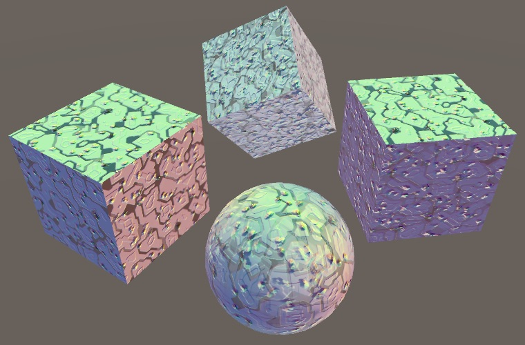 							Projected normals in world space. 						

Because we negated the X coordinates to prevent mirroring, we  also have to do this for the tangent-space normal vectors. Otherwise  those would still be mirrored.

```
	float3 tangentNormalX = UnpackNormal(tex2D(_NormalMap, triUV.x));
	float3 tangentNormalY = UnpackNormal(tex2D(_NormalMap, triUV.y));
	float3 tangentNormalZ = UnpackNormal(tex2D(_NormalMap, triUV.z));

	if (parameters.normal.x < 0) {
		tangentNormalX.x = -tangentNormalX.x;
	}
	if (parameters.normal.y < 0) {
		tangentNormalY.x = -tangentNormalY.x;
	}
	if (parameters.normal.z >= 0) {
		tangentNormalZ.x = -tangentNormalZ.x;
	}

	float3 worldNormalX = tangentNormalX.zyx;
	float3 worldNormalY = tangentNormalY.xzy;
	float3 worldNormalZ = tangentNormalZ;
```

In those cases we also have to flip the normal's up direction, as they're pointing inwards.

```
	if (parameters.normal.x < 0) {
		tangentNormalX.x = -tangentNormalX.x;
		tangentNormalX.z = -tangentNormalX.z;
	}
	if (parameters.normal.y < 0) {
		tangentNormalY.x = -tangentNormalY.x;
		tangentNormalY.z = -tangentNormalY.z;
	}
	if (parameters.normal.z >= 0) {
		tangentNormalZ.x = -tangentNormalZ.x;
	}
	else {
		tangentNormalZ.z = -tangentNormalZ.z;
	}
```

 							
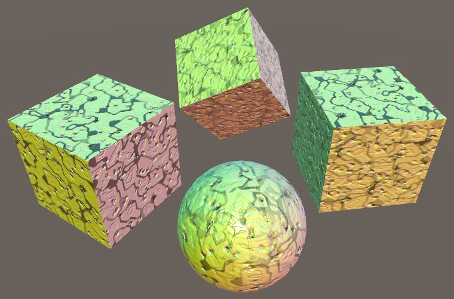 							Unmirrored and flipped normals. 						

### Blending With Surface Normal

Although the normal vectors are now correctly aligned with  their projection, they have nothing to do with the actual surface  normal. For example, a sphere ends up with normals like a cube. This  isn't directly obvious because we're smoothly blending between these  normals based on the actual surface normal, but it will become worse  when we'll adjust the blending.

Usually, we'd rely on a tangent-to-world transformation matrix  to make the normals fit the geometry's surface. But we do not have such  matrices for our three projections. What we can do instead is blend  between each projected normal and the surface normal, using whiteout  blending. We could use the `BlendNormals` function for this,  but it also normalizes the result. That's a bit much, considering we  blend the three results and then normalize that again. So let's make our  own variant that doesn't normalize per projection.

```
float3 BlendTriplanarNormal (float3 mappedNormal, float3 surfaceNormal) {
	float3 n;
	n.xy = mappedNormal.xy + surfaceNormal.xy;
	n.z = mappedNormal.z * surfaceNormal.z;
	return n;
}
```

 							How does whiteout blending work? 							 						

Whiteout blending assumes Z is pointing up. So convert the  surface normal to the projected space, perform the blend in this tangent  space, then convert the result to world space.

```
	float3 worldNormalX =
		BlendTriplanarNormal(tangentNormalX, parameters.normal.zyx).zyx;
	float3 worldNormalY =
		BlendTriplanarNormal(tangentNormalY, parameters.normal.xzy).xzy;
	float3 worldNormalZ =
		BlendTriplanarNormal(tangentNormalZ, parameters.normal);
```

 							
 							Incorrect normal blending. 						

This goes wrong for surfaces facing a negative direction,  because then we end up multiplying two negative Z values, flipping the  sign of the final Z. We can solve this by using the absolute of one of  the Z values. But this is equivalent to not negating the sampled Z  components to begin with, so we can just remove that code.

```
	if (parameters.normal.x < 0) {
		tangentNormalX.x = -tangentNormalX.x;
//		tangentNormalX.z = -tangentNormalX.z;
	}
	if (parameters.normal.y < 0) {
		tangentNormalY.x = -tangentNormalY.x;
//		tangentNormalY.z = -tangentNormalY.z;
	}
	if (parameters.normal.z >= 0) {
		tangentNormalZ.x = -tangentNormalZ.x;
	}
//	else {
//		tangentNormalZ.z = -tangentNormalZ.z;
//	}
```

 							
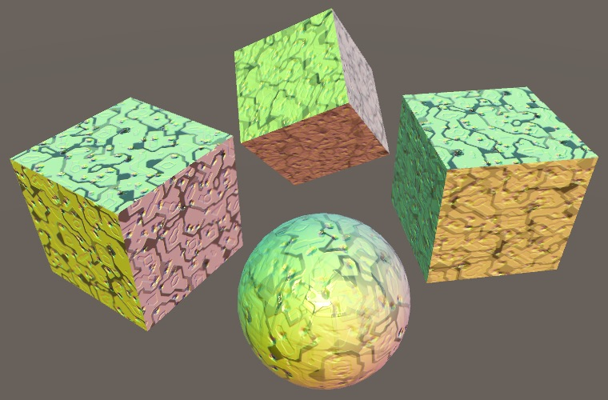 							Correct normal blending. 						

The resulting normal vectors are now biased towards the  original surface normal. Although this isn't perfect, it's usually  sufficient. You could go a step further and completely drop the sampled Z  components, only using the original Z component. That's known as UDN  blending, which is cheaper when using DXT5nm compression because the Z  component doesn't need to be reconstructed, but deceases the strength of  the normals for non-aligned surfaces.

With the normal maps functional, restore the original albedo so we can see the complete circuitry material.

```
//	surface.albedo = surface.normal * 0.5 + 0.5;
```

 							
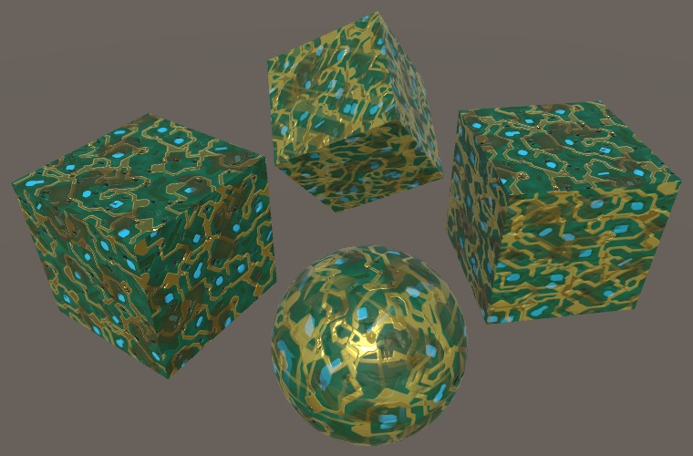 							Using all circuitry maps. 						

### Scaling Maps

Finally, let's make it possible to scale the maps. Usually,  this is done via the tiling and offset values of a single texture, but  this doesn't make much sense for triplanar mapping. An offset isn't very  useful and neither is a nonuniform scale. So let's use a single scale  property instead.

```
	Properties {
		[NoScaleOffset] _MainTex ("Albedo", 2D) = "white" {}
		[NoScaleOffset] _MOSMap ("MOS", 2D) = "white" {}
		[NoScaleOffset] _NormalMap ("Normals", 2D) = "white" {}
		
		_MapScale ("Map Scale", Float) = 1
	}
```

 							
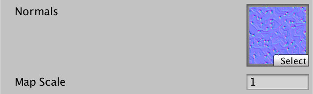 							Material with map scale. 						

Add the required variable for the map scale and use it to scale the position when determining the UV coordinates.

```
float _MapScale;

struct TriplanarUV {
	float2 x, y, z;
};

TriplanarUV GetTriplanarUV (SurfaceParameters parameters) {
	TriplanarUV triUV;
	float3 p = parameters.position * _MapScale;
	…
}
```

 							
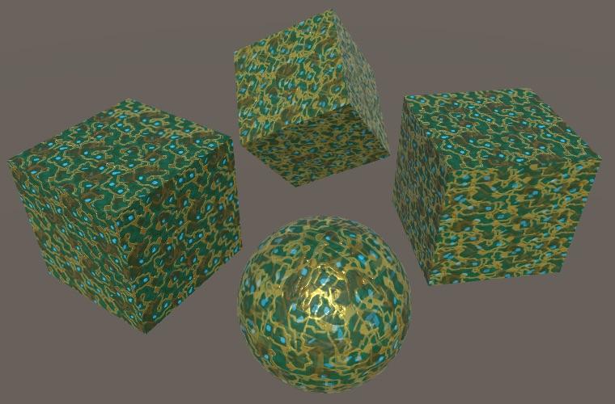 							Using double map scale. 						

unitypackage

## Adjusting Blend Weights

The final surface data is found by blending between the three  mappings, using the original surface normal. So far we've use the normal  directly, only taking its absolute value and normalizing the result so  the weights sum to 1. That's the most straightforward approach, but it's  also possible to tweak the weights in various ways.

### Blend Offset

The first way to change how the weights are calculated is by  introducing an offset. If we subtract the same amount from all weights,  then smaller weights are affected more than larger weights, which  changes their relative importance. They could even become negative. Add a  blend offset property to make this possible.

We must ensure that not all weights become negative, so the  maximum offset should be less than the maximum possible smallest weight,  which is when all three components of the normal vector are equal.  That's √⅓ which is about 0.577, but let's just use 0.5 as the maximum,  with 0.25 as the default.

```
		_MapScale ("Map Scale", Float) = 1

		_BlendOffset ("Blend Offset", Range(0, 0.5)) = 0.25
```

 							
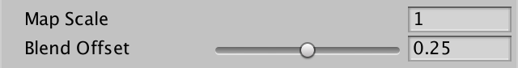 							Material with blend offset. 						

Subtract the offset from the weights before normalizing them, and see what that looks like.

```
float _BlendOffset;

…

float3 GetTriplanarWeights (SurfaceParameters parameters) {
	float3 triW = abs(parameters.normal);
	triW = triW - _BlendOffset;
	return triW / (triW.x + triW.y + triW.z);
}
```

 							
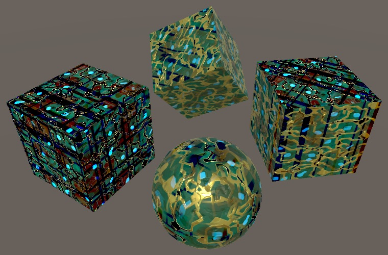 							Incorrect offset usage. 						

It looks fine when blend weights remain positive, but negative  weights end up subtracting from the final data. To prevent this, clamp  the weights before normalizing.

```
	triW = saturate(triW - _BlendOffset);
```

The result is that the higher the offset, the smaller the blend  region becomes. To more clearly see how the blending changes, use the  weights for albedo.

```
void MyTriPlanarSurfaceFunction (
	inout SurfaceData surface, SurfaceParameters parameters
) {
	…
	surface.albedo = triW;
}
```

<iframe src="https://gfycat.com/ifr/ExcellentElaborateGalapagosalbatross"></iframe>

Adjusting offset.

### Blend Exponent

Another way to decrease the blend region is via exponentiation,  by raising the weights to some power higher than 1 before normalizing.  This works like an offset, but is nonlinear. Add a shader property for  it, using an arbitrary maximum of 8 and a default of 2.

```
		_BlendOffset ("Blend Offset", Range(0, 0.5)) = 0.25
		_BlendExponent ("Blend Exponent", Range(1, 8)) = 2
```

 							
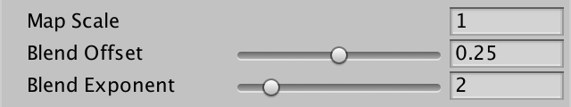 							Material with blend exponent. 						

Use the `pow` function to apply the exponent, after offsetting.

```
float _BlendOffset, _BlendExponent;

…

float3 GetTriplanarWeights (SurfaceParameters parameters) {
	float3 triW = abs(parameters.normal);
	triW = saturate(triW - _BlendOffset);
	triW = pow(triW, _BlendExponent);
	return triW / (triW.x + triW.y + triW.z);
}
```

<iframe src="https://gfycat.com/ifr/ClearcutWetHectorsdolphin"></iframe>

Adjusting exponent.

You might end up using either of both approaches together to  tune the blend weights. If you settle on a final exponent of 2, 4, or 8,  you could hard-code this with a few multiplications instead of relying  on `pow`.

### Blending Based on Height

Besides relying on the original surface normal, we could also  have the surface data influence the blend. If the surface data included  height, then that could be factored into the weights. Our MOS maps still  have an unused channel, so it's possible to turn them into MOHS maps,  containing metallic, occlusion, height, and smoothness data. [Here](https://catlikecoding.com/unity/tutorials/advanced-rendering/triplanar-mapping/adjusting-blend-weights/circuitry-mohs.png) is such a map for our circuitry material. It's the same as the MOS map, but with height data in the blue channel.

 							
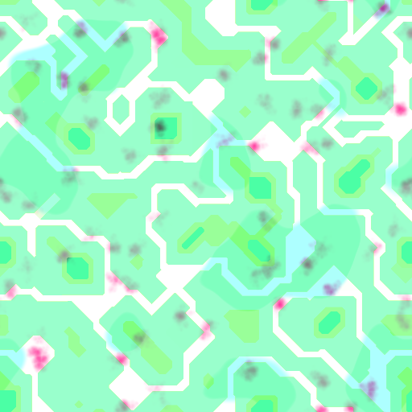 							Circuitry MOHS map. 						

Rename our MOS property to MOHS and assign the new texture. Make sure that its *sRGB* import checkbox is disabled.

```
		[NoScaleOffset] _MainTex ("Albedo", 2D) = "white" {}
		[NoScaleOffset] _MOHSMap ("MOHS", 2D) = "white" {}
		[NoScaleOffset] _NormalMap ("Normals", 2D) = "white" {}
```

 							
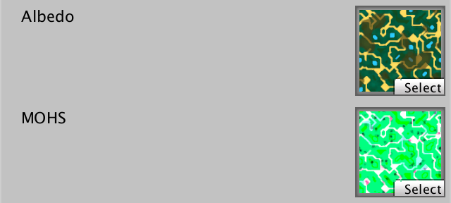 							Material now with MOHS map. 						

Also rename the variables.

```
sampler2D _MOHSMap;

…

void MyTriPlanarSurfaceFunction (
	inout SurfaceData surface, SurfaceParameters parameters
) {
	…

	float4 mohsX = tex2D(_MOHSMap, triUV.x);
	float4 mohsY = tex2D(_MOHSMap, triUV.y);
	float4 mohsZ = tex2D(_MOHSMap, triUV.z);

	…

	float4 mohs = mohsX * triW.x + mohsY * triW.y + mohsZ * triW.z;
	surface.metallic = mohs.x;
	surface.occlusion = mohs.y;
	surface.smoothness = mohs.a;

	…
}
```

Add parameters for the three height values to `GetTriplanarWeights`. Let's begin by using the heights directly, replacing the normal vector, before exponentiation.

```
float3 GetTriplanarWeights (
	SurfaceParameters parameters, float heightX, float heightY, float heightZ
) {
	float3 triW = abs(parameters.normal);
	triW = saturate(triW - _BlendOffset);
	triW = float3(heightX, heightY, heightZ);
	triW = pow(triW, _BlendExponent);
	return triW / (triW.x + triW.y + triW.z);
}
```

Then add the heights as arguments when invoking the function.

```
	float3 triW = GetTriplanarWeights(parameters, mohsX.z, mohsY.z, mohsZ.z);
```

 							
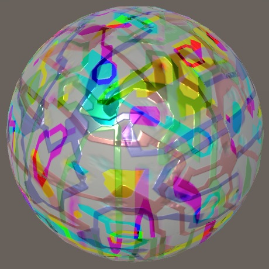 							Blending based on height only. 						

Using only the heights doesn't give us a useful result, but  makes it clear that the golden circuitry strips are highest and thus  dominate the blend. Now multiply the heights with their respective  weights.

```
	triW *= float3(heightX, heightY, heightZ);
```

 							
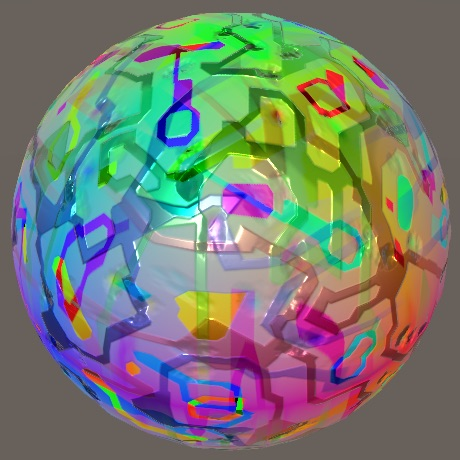 							Multiplying with height. 						

This looks much better, but the influence of the heights is still very strong. It's useful to modulate this, so add a *Blend Height Strength*  property to our shader. At full strength it could completely eliminate  some weights, which shouldn't happen. So limit the strength's range to  0–0.99, with a default of 0.5.

```
		_BlendOffset ("Blend Offset", Range(0, 0.5)) = 0.25
		_BlendExponent ("Blend Exponent", Range(1, 8)) = 2
		_BlendHeightStrength ("Blend Height Strength", Range(0, 0.99)) = 0.5
```

 							
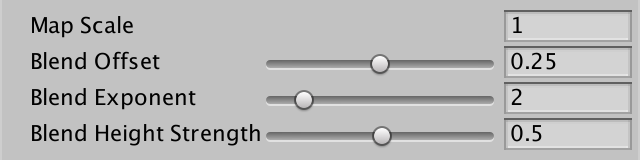 							Material with blend height strength. 						

Apply the strength by interpolating between 1 and the heights,  using the strength as the interpolator. Then multiply the weights with  that.

```
float _BlendOffset, _BlendExponent, _BlendHeightStrength;

…

float3 GetTriplanarWeights (
	SurfaceParameters parameters, float heightX, float heightY, float heightZ
) {
	float3 triW = abs(parameters.normal);
	triW = saturate(triW - _BlendOffset);
	triW *= lerp(1, float3(heightX, heightY, heightZ), _BlendHeightStrength);
	triW = pow(triW, _BlendExponent);
	return triW / (triW.x + triW.y + triW.z);
}
```

Using heights works best in combination with an offset to limit  the range of their influence. Besides that, a higher exponent makes the  effect more pronounced.

<iframe src="https://gfycat.com/ifr/PartialAccomplishedBanteng"></iframe>

Adjusting height strength.

Finally, restore the albedo to see the effect of the blend settings on the complete material.

```
//	surface.albedo = triW;
```

 							 							 							All blend settings at minimum vs. at maximum. 						

unitypackage

## Custom Shader GUI

We didn't use the shader GUI class that we created for our other  shaders, because it wouldn't work with our triplanar shader. It relies  on properties that our triplanar shader doesn't have. While we could  make `**MyLightingShaderGUI**` also support this shader, it's better to keep it simple and create a new class.

### Base Class

Instead of copying the base functionality of `**MyLightingShaderGUI**` that we could reuse, we'll create a common base class that both our GUIs can extend. Let's name it `**MyBaseShaderGUI**`. Put all general-purpose code from `**MyLightingShaderGUI**` into it and omit the rest. Make everything that should be directly available to its subclasses `**protected**`. That allows access by the class itself and its subclasses, but from nowhere else.

```
using UnityEngine;
//using UnityEngine.Rendering;
using UnityEditor;

public class MyBaseShaderGUI : ShaderGUI {

	static GUIContent staticLabel = new GUIContent();

	protected Material target;
	protected MaterialEditor editor;
	
	MaterialProperty[] properties;

	public override void OnGUI (
		MaterialEditor editor, MaterialProperty[] properties
	) {
		this.target = editor.target as Material;
		this.editor = editor;
		this.properties = properties;
//		DoRenderingMode();
//		…
//		DoAdvanced();
	}

	protected MaterialProperty FindProperty (string name) {
		return FindProperty(name, properties);
	}

	protected static GUIContent MakeLabel (string text, string tooltip = null) {
		…
	}

	protected static GUIContent MakeLabel (
		MaterialProperty property, string tooltip = null
	) {
		…
	}

	protected void SetKeyword (string keyword, bool state) {
		…
	}

	protected bool IsKeywordEnabled (string keyword) {
		return target.IsKeywordEnabled(keyword);
	}

	protected void RecordAction (string label) {
		editor.RegisterPropertyChangeUndo(label);
	}
}
```

Have `**MyLightingShaderGUI**` extend `**MyBaseShaderGUI**` instead of `ShaderGUI` directly. Then remove all code from it that is now part of its base class. Instead of setting up the variables itself in `OnGUI`, delegate that to the `OnGUI` method of its base class, by invoking `**base**.OnGUI`.

```
public class MyLightingShaderGUI : MyBaseShaderGUI {

	…

	public override void OnGUI (
		MaterialEditor editor, MaterialProperty[] properties
	) {
//		this.target = editor.target as Material;
//		this.editor = editor;
//		this.properties = properties;
		base.OnGUI(editor, properties);
		DoRenderingMode();
		…
		DoAdvanced();
	}
	
	…
}
```

### Triplanar Shader GUI

Add a new `**MyTriplanarShaderGUI**` class to create the GUI for our triplanar shader. Have it extend `**MyBaseShaderGUI**`. Give it an `OnGUI` method in which it invokes `**base**.OnGUI` and then shows the map scale property. Use separate methods for the maps, blending, and other settings.

```
using UnityEngine;
using UnityEditor;

public class MyTriplanarShaderGUI : MyBaseShaderGUI {

	public override void OnGUI (
		MaterialEditor editor, MaterialProperty[] properties
	) {
		base.OnGUI(editor, properties);
		editor.ShaderProperty(FindProperty("_MapScale"), MakeLabel("Map Scale"));
		DoMaps();
		DoBlending();
		DoOtherSettings();
	}

	void DoMaps () {}

	void DoBlending () {}

	void DoOtherSettings () {}
}
```

Declare this class to be the custom editor for our triplanar shader.

```
Shader "Custom/Triplanar Mapping" {

	…

	CustomEditor "MyTriplanarShaderGUI"
}
```

 							
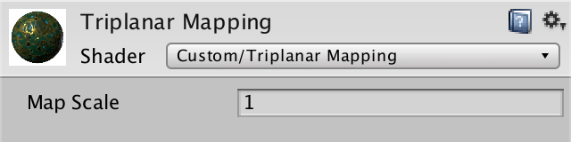 							Only map scale. 						

### Maps

Create a label for the map section and then show the three  texture properties, each on a single line. Give the MOHS map a tooltip  to explain what each channel should contain.

```
	void DoMaps () {
		GUILayout.Label("Maps", EditorStyles.boldLabel);
		
		editor.TexturePropertySingleLine(
			MakeLabel("Albedo"), FindProperty("_MainTex")
		);
		editor.TexturePropertySingleLine(
			MakeLabel(
				"MOHS",
				"Metallic (R) Occlusion (G) Height (B) Smoothness (A)"
			),
			FindProperty("_MOHSMap")
		);
		editor.TexturePropertySingleLine(
			MakeLabel("Normals"), FindProperty("_NormalMap")
		);
	}
```

 							
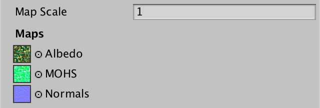 							Maps GUI. 						

### Blending

The blending section is simple, just a label and the three properties.

```
	void DoBlending () {
		GUILayout.Label("Blending", EditorStyles.boldLabel);

		editor.ShaderProperty(FindProperty("_BlendOffset"), MakeLabel("Offset"));
		editor.ShaderProperty(
			FindProperty("_BlendExponent"), MakeLabel("Exponent")
		);
		editor.ShaderProperty(
			FindProperty("_BlendHeightStrength"), MakeLabel("Height Strength")
		);
	}
```

 							
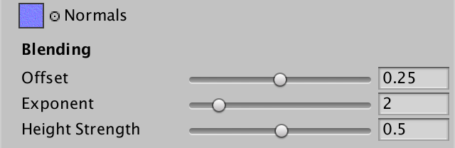 							Blending GUI. 						

### Other Settings

For other settings, allow the customization of the render queue, by invoking `MaterialEditor.RenderQueueField`. Also make it possible to toggle GPU instancing.

```
	void DoOtherSettings () {
		GUILayout.Label("Other Settings", EditorStyles.boldLabel);

		editor.RenderQueueField();
		editor.EnableInstancingField();	}
```

 							
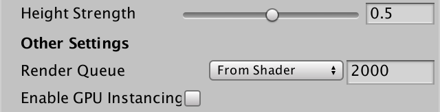 							Other settings GUI. 						

unitypackage

## Separate Top Maps

Often, you don't want a completely uniform appearance. The  obvious case is terrain, where horizontal surfaces—those pointing up,  not down—could be grass while all other surfaces could be rock. You  might even want to combine triplanar mapping with texture splatting, but  that's expensive because it would require a lot more texture sampling.  Alternative approaches are to rely on decals, other detail objects, or  vertex colors to add variety.

### More Maps

To support a separate top map, we need to add three alternative map properties.

```
		[NoScaleOffset] _MainTex ("Albedo", 2D) = "white" {}
		[NoScaleOffset] _MOHSMap ("MOHS", 2D) = "white" {}
		[NoScaleOffset] _NormalMap ("Normals", 2D) = "white" {}

		[NoScaleOffset] _TopMainTex ("Top Albedo", 2D) = "white" {}
		[NoScaleOffset] _TopMOHSMap ("Top MOHS", 2D) = "white" {}
		[NoScaleOffset] _TopNormalMap ("Top Normals", 2D) = "white" {}
```

Separate top maps aren't always needed, so let's make that a shader feature, using the *_SEPARATE_TOP_MAP* keyword. Add support for it to all passes, except the shadow pass.

```
			#pragma target 3.0

			#pragma shader_feature _SEPARATE_TOP_MAPS
```

Add these extra maps to our shader GUI. Use the top albedo map to determine whether the keyword should be set.

```
	void DoMaps () {
		GUILayout.Label("Top Maps", EditorStyles.boldLabel);

		MaterialProperty topAlbedo = FindProperty("_TopMainTex");
		Texture topTexture = topAlbedo.textureValue;
		EditorGUI.BeginChangeCheck();
		editor.TexturePropertySingleLine(MakeLabel("Albedo"), topAlbedo);
		if (EditorGUI.EndChangeCheck() && topTexture != topAlbedo.textureValue) {
			SetKeyword("_SEPARATE_TOP_MAPS", topAlbedo.textureValue);
		}
		editor.TexturePropertySingleLine(
			MakeLabel(
				"MOHS",
				"Metallic (R) Occlusion (G) Height (B) Smoothness (A)"
			),
			FindProperty("_TopMOHSMap")
		);
		editor.TexturePropertySingleLine(
			MakeLabel("Normals"), FindProperty("_TopNormalMap")
		);

		GUILayout.Label("Maps", EditorStyles.boldLabel);

		…
	}
```

### Using Marble

To see separate top maps in action, we need another set of textures. We can use the marble albedo and normal maps. [Here](https://catlikecoding.com/unity/tutorials/advanced-rendering/triplanar-mapping/separate-top-maps/marble-mohs.png) is a matching MOHS map.

 							
 							Marble MOHS map. 						

Use circuitry for the top—as it's green, so somewhat like grass—and marble for the rest.

 							
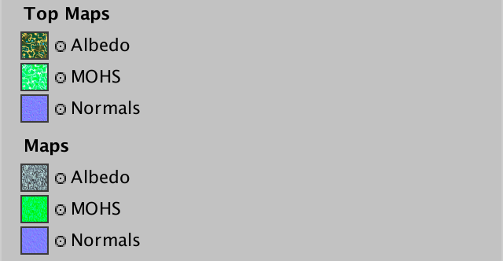 							Circuitry for top, marble for rest. 						

As the shader doesn't know about the top maps yet, we currently see only marble.

 							
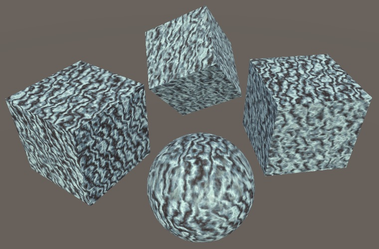 							Only marble is shown. 						

### Enabling Top Maps

Add the required sampler variables to *MyTriplanarMapping*. Check whether the keyword is defined in `MyTriPlanarSurfaceFunction`,  after all textures have been sampled. If so, add code to overwrite the  data for the Y projection with samples from the top maps. But only do  this for surfaces that point upward, so when the surface normal has a  positive Y component.

```
sampler2D _TopMainTex, _TopMOHSMap, _TopNormalMap;
…

void MyTriPlanarSurfaceFunction (
	inout SurfaceData surface, SurfaceParameters parameters
) {
	…
	float3 tangentNormalZ = UnpackNormal(tex2D(_NormalMap, triUV.z));

	#if defined(_SEPARATE_TOP_MAPS)
		if (parameters.normal.y > 0) {
			albedoY = tex2D(_TopMainTex, triUV.y).rgb;
			mohsY = tex2D(_TopMOHSMap, triUV.y);
			tangentNormalY = UnpackNormal(tex2D(_TopNormalMap, triUV.y));
		}
	#endif
}
```

 							What if all surfaces point up? 							 						

This results in a shader that samples either the regular or the  top maps for its Y projection. In our case, we get a circuitry layer on  top of marble. Typically it would be grass, sand, or snow.

 							
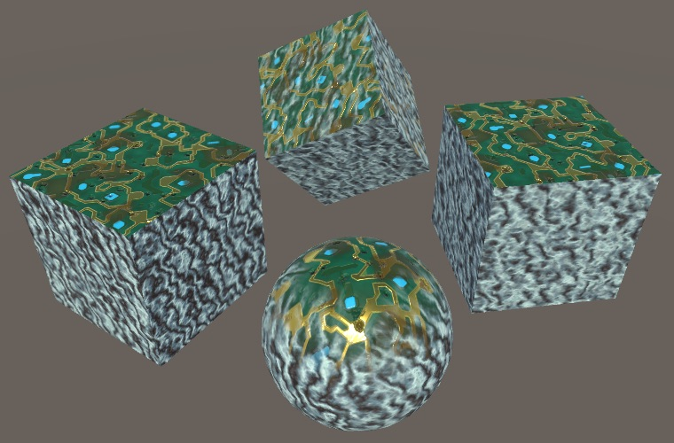 							Circuitry on top. 						

The default blend settings produce a rather smooth blend  between the projections, which doesn't look good where circuitry and  marble meet. An exponent of 8 results in a much more sudden transition,  which suits the materials better. It's also possible to support  different blend settings for the top maps, but the height blending  already allows a lot of control via the MOHS maps.

 							
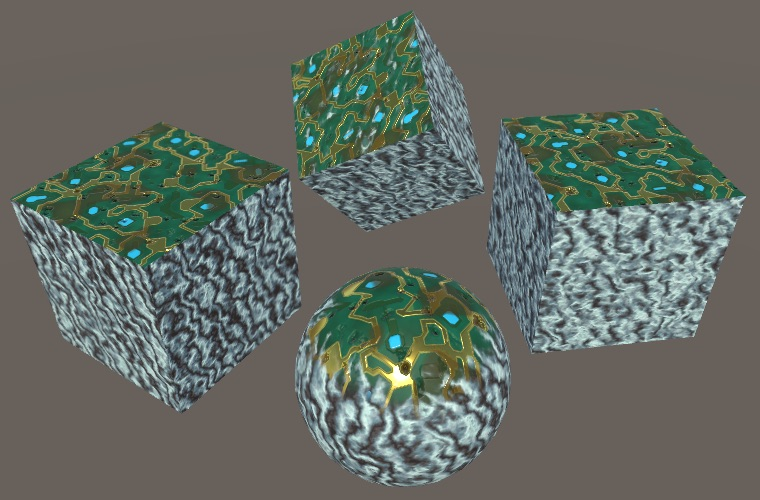 							Exponent set to 8. 						

### Unpacking Later

Although the shader compiler uses an if-else approach to  smartly sample either the top or regular maps, it isn't smart about  unpacking the normal. It cannot assume that both uses of `UnpackNormal` can be combined. To help the compiler, we can postpone unpacking the raw normal until after the choice of maps.

```
	float3 tangentNormalX = UnpackNormal(tex2D(_NormalMap, triUV.x));
//	float3 tangentNormalY = UnpackNormal(tex2D(_NormalMap, triUV.y));
	float4 rawNormalY = tex2D(_NormalMap, triUV.y);
	float3 tangentNormalZ = UnpackNormal(tex2D(_NormalMap, triUV.z));

	#if defined(_SEPARATE_TOP_MAPS)
		if (parameters.normal.y > 0) {
			albedoY = tex2D(_TopMainTex, triUV.y).rgb;
			mohsY = tex2D(_TopMOHSMap, triUV.y);
//			tangentNormalY = UnpackNormal(tex2D(_TopNormalMap, triUV.y));
			rawNormalY = tex2D(_TopNormalMap, triUV.y);
		}
	#endif
	float3 tangentNormalY = UnpackNormal(rawNormalY);
```

unitypackage

## Lightmapping

Our triplanar shader isn't finished, because it doesn't support  lightmapping yet. It can receive baked light, but doesn't contribute to  it. It's easiest to see this by making all objects static and switching  the directional light to baked mode. Wait until baking is finished, then  check the baked albedo, by switching the scene view mode from *Shaded* to *Baked Global Illumination / Albedo*. All objects that use triplanar mapping turn out to be black.

 						
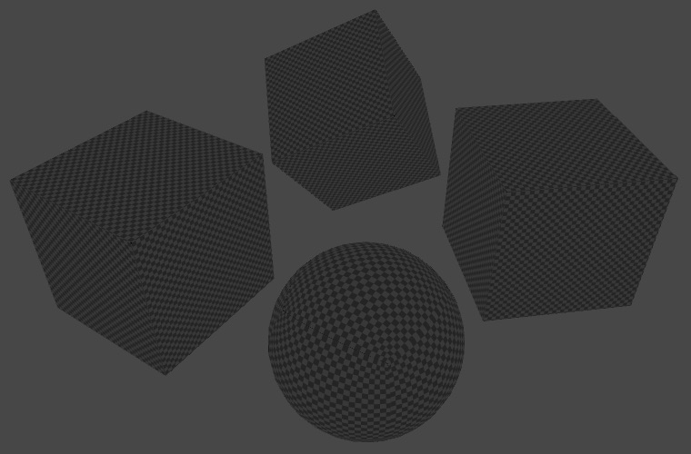 						Lightmapping uses black albedo. 					

To support lightmapping, we have to add a meta pass to our shader, which has to rely on *My Lightmapping* instead of *My Lighting*.

```
		Pass {
			Tags {
				"LightMode" = "Meta"
			}

			Cull Off

			CGPROGRAM

			#pragma vertex MyLightmappingVertexProgram
			#pragma fragment MyLightmappingFragmentProgram

			#pragma shader_feature _SEPARATE_TOP_MAPS

			#include "MyTriplanarMapping.cginc"
			#include "My Lightmapping.cginc"

			ENDCG
		}
```

### Using Surface Data

To make *My Lightmapping* work with our triplanar approach, it also has to support the new surface approach. To make this easy, have it include *My Lighting Input* and delete all variables, the interpolators, and getter functions that are now duplicates.

```
//#include "UnityPBSLighting.cginc"
#include "My Lighting Input.cginc"
#include "UnityMetaPass.cginc"

//float4 _Color;
//…
//
//float3 GetEmission (Interpolators i) {
//	…
//}

Interpolators MyLightmappingVertexProgram (VertexData v) {
	…
}

float4 MyLightmappingFragmentProgram (Interpolators i) : SV_TARGET {
	…
}
```

Like *My Lighting*, it has to define the default albedo function. And it should use same surface approach in `MyLightmappingFragmentProgram`, except that it only cares about albedo, emission, metallic, and smoothness.

```
#if !defined(ALBEDO_FUNCTION)
	#define ALBEDO_FUNCTION GetAlbedo
#endif

float4 MyLightmappingFragmentProgram (Interpolators i) : SV_TARGET {
	SurfaceData surface;
	surface.normal = normalize(i.normal);
	surface.albedo = 1;
	surface.alpha = 1;
	surface.emission = 0;
	surface.metallic = 0;
	surface.occlusion = 1;
	surface.smoothness = 0.5;
	#if defined(SURFACE_FUNCTION)
		SurfaceParameters sp;
		sp.normal = i.normal;
		sp.position = i.worldPos.xyz;
		sp.uv = UV_FUNCTION(i);

		SURFACE_FUNCTION(surface, sp);
	#else
		surface.albedo = ALBEDO_FUNCTION(i);
		surface.emission = GetEmission(i);
		surface.metallic = GetMetallic(i);
		surface.smoothness = GetSmoothness(i);
	#endif
	
	…
}
```

Replace the old usage of the getter functions with the new surface data.

```
float4 MyLightmappingFragmentProgram (Interpolators i) : SV_TARGET {
	…
	
	UnityMetaInput surfaceData;
	surfaceData.Emission = surface.emission;
	float oneMinusReflectivity;
	surfaceData.Albedo = DiffuseAndSpecularFromMetallic(
		surface.albedo, surface.metallic,
		surfaceData.SpecularColor, oneMinusReflectivity
	);

	float roughness = SmoothnessToRoughness(surface.smoothness) * 0.5;
	surfaceData.Albedo += surfaceData.SpecularColor * roughness;

	return UnityMetaFragment(surfaceData);
}
```

### Including Relevant Input

The interpolators now also include the normal and world position vectors, so they should be set in `MyLightMappingVertexProgram`.

```
Interpolators MyLightmappingVertexProgram (VertexData v) {
	Interpolators i;
	i.pos = UnityMetaVertexPosition(
		v.vertex, v.uv1, v.uv2, unity_LightmapST, unity_DynamicLightmapST
	);
	
	i.normal = UnityObjectToWorldNormal(v.normal);
	i.worldPos.xyz = mul(unity_ObjectToWorld, v.vertex);
	
	i.uv.xy = TRANSFORM_TEX(v.uv, _MainTex);
	i.uv.zw = TRANSFORM_TEX(v.uv, _DetailTex);
	return i;
}
```

These vectors aren't usually needed, so we could skip computing  them when not needed, just using dummy constants instead. We could  define two macros, *META_PASS_NEEDS_NORMALS* and *META_PASS_NEEDS_POSITION*, to indicate whether they're needed.

```
	#if defined(META_PASS_NEEDS_NORMALS)
		i.normal = UnityObjectToWorldNormal(v.normal);
	#else
		i.normal = float3(0, 1, 0);
	#endif
	#if defined(META_PASS_NEEDS_POSITION)
		i.worldPos.xyz = mul(unity_ObjectToWorld, v.vertex);
	#else
		i.worldPos.xyz = 0;
	#endif
```

Also, only include the UV coordinates when required.

```
	#if !defined(NO_DEFAULT_UV)
		i.uv.xy = TRANSFORM_TEX(v.uv, _MainTex);
		i.uv.zw = TRANSFORM_TEX(v.uv, _DetailTex);
	#endif
```

### Triplanar Lightmapping

All that's left to do is to declare that our triplanar shader  needs both normals and position data in its meta pass. Once that's done  and the lighting has baked again, the albedo will correctly show up in  the scene view.

```
			#pragma shader_feature _SEPARATE_TOP_MAPS

			#define META_PASS_NEEDS_NORMALS
			#define META_PASS_NEEDS_POSITION

			#include "MyTriplanarMapping.cginc"
			#include "My Lightmapping.cginc"
```

 							
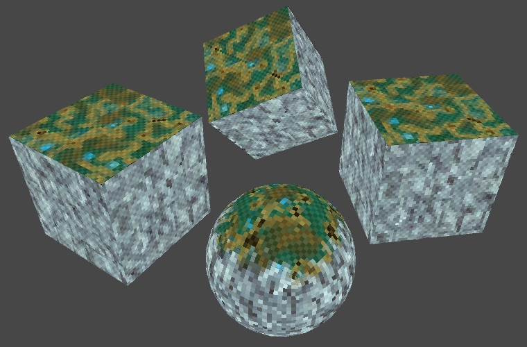 							Correctly lightmapped albedo. 						

Now our triplanar shader is fully functional. You can use it as  a basis for your own work, extending, tweaking, and tuning it as  desired.

 							The lightmapped data doesn't seem to depend on world space? 							 						

unitypackage

PDF
