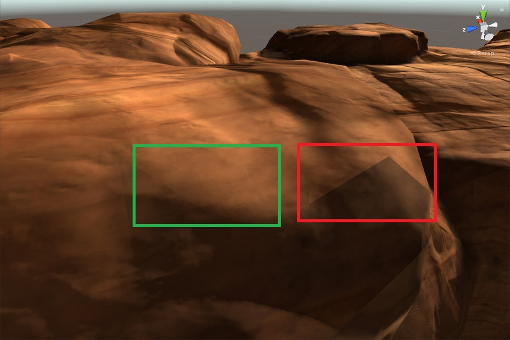
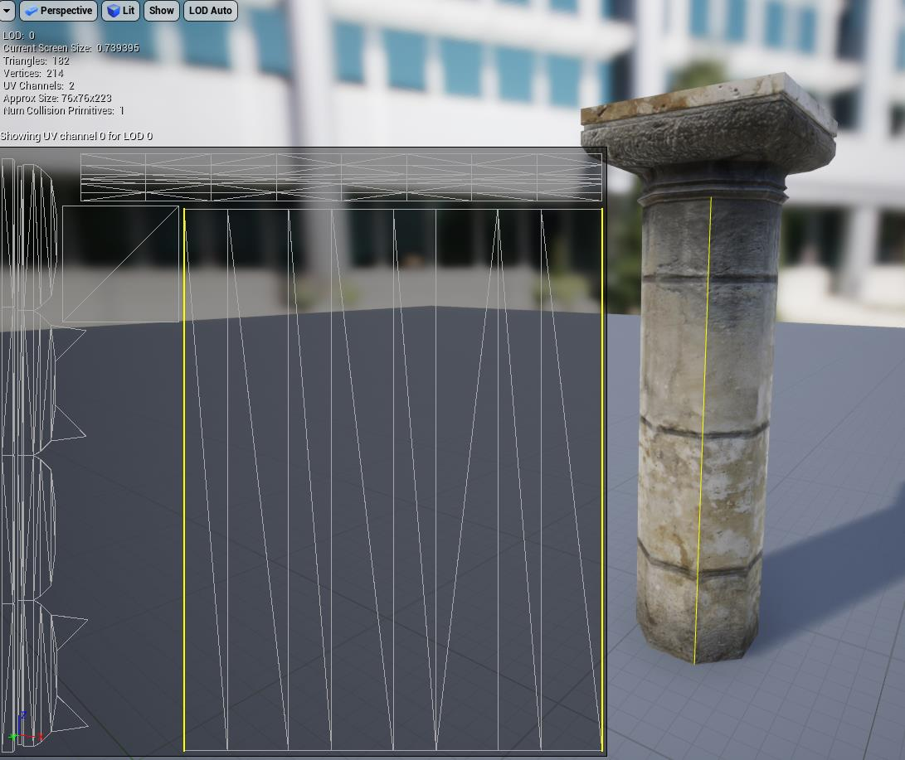
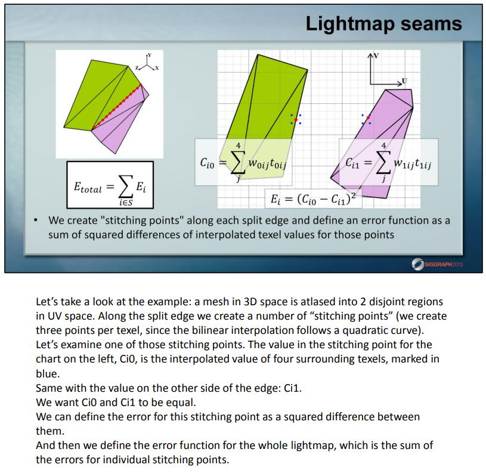
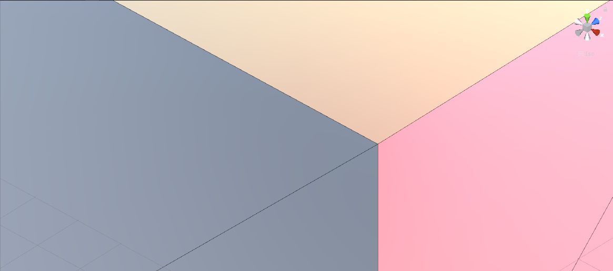
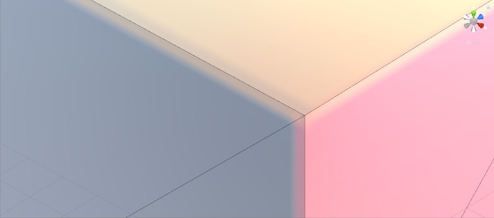
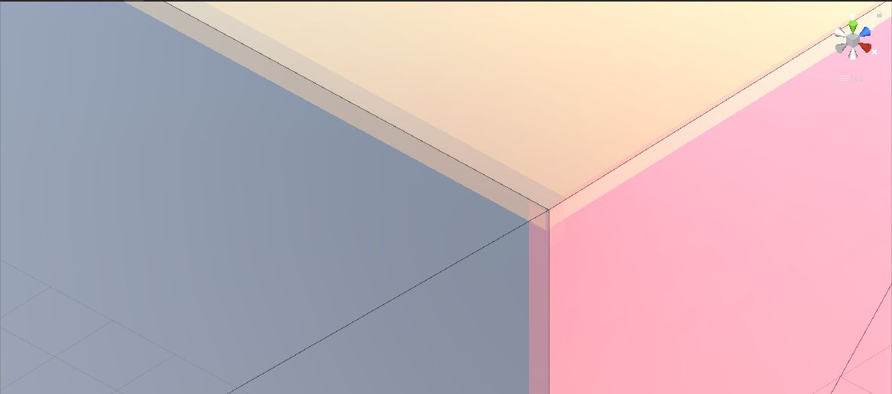

# 光照贴图接缝——从产生到解决

之前翻Unity的更新日志时候发现Progressive Lightmapper里自带上了Lightmap seam stitching。正好之前研究过这个问题，出于手痒也在Unity里实现了一发，在这里也整理下这个问题的原因、现象及解决办法。

图为Unity文档示例，红框为有Seam的错误效果，绿框为修复效果。

# 问题成因

模型展开2UV需要将三维模型平铺到平面，那么就可能出现这种情况(下图黄边)：两个相邻的面共用一条边，但是展开2UV之后是两条不同的边。

焙的时候这两个相邻面上的像素各自计算光照，由于精度问题可能导致结果不一致，导致光照贴图上的瑕疵。

# 解决思路

这个问题我最早是在[Lighting Technology of The Last Of Us](http://miciwan.com/SIGGRAPH2013/Lighting Technology of The Last Of Us.pdf)看到，从Unity文档描述应该也是类似做法。

下面具体解释下实现思路，其实核心就是两步。

## 找到Lightmap Seam

对于单个Mesh，我们可以直接获得对应的顶点坐标和2UV坐标。这里需要将三角形的Index数据全部展开，因为本身Mesh导入时候光滑组设置不同可能导致有时候同一个顶点能复用、有时候是裂开的顶点。

然后暴力搜索任意两条边，需要满足两个条件：

- 

- 两条边的起点、终点的位置重合
- 

- 两个三角形的面法线差别不要过大

第二个条件相当于是一个自定义的阈值，因为如果本身面法线差别很大就说明光照本来就可能有较大差别。

## “粘合”Lightmap Seam

这一步其实就是stitching了。其实公式在前面PPT里已经列出：我们需要构造Ci使得两侧颜色误差尽量小，同时本身颜色变化尽量小。这个其实就转化为一个过拟合的最小二乘法，直接套用现成Solver即可。

ps. 这里有个小技巧就是不同通道颜色完全可以分别计算，每次相当于计算一个灰度图结果。

# 练手项目

我参考[ands/seamoptimizer](https://github.com/ands/seamoptimizer)移植了一个Unity版本实现[qiankanglai/seamoptimizer](https://github.com/qiankanglai/seamoptimizer)

下图是测试结果：首先故意烘焙一个三方向硬边的结果

使用Lightmap Seam Stitching之后可以看到相邻边出现了一个过度

对比起见，将Lightmap改成Point Filter看的更加清楚

具体使用其实就是菜单栏里的SO下面几个，可以调节的参数在代码里的cosNormalThreshold和lambda而已，回头有空再整理下文档了。