# Hex Map 2

Blending Cell Colors

- Connect neighbors.
- Interpolate colors across triangles.
- Create blend regions.
- Simplify geometry.

This tutorial is the second part of a series about [hexagon maps](https://catlikecoding.com/unity/tutorials/hex-map/).  The previous installment laid the foundation of our grid and gave us  the ability to edit cells. Each cell has its own solid color. The color  change between cells is abrupt. This time we'll introduce transition  zones, blending between colors of adjacent cells.

 					
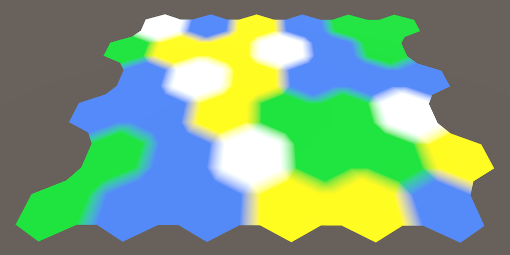 					Smudged cell transitions. 				

## Cell Neighbors

Before we can blend between cells colors, we need to know which  cells are adjacent to each other. Each cells has six neighbors, which we  can identify with a compass direction. The directions are northeast,  east, southeast, southwest, west, and northwest. Let's create an  enumeration for that and put it in its own script file.

```
public enum HexDirection {
	NE, E, SE, SW, W, NW
}
```

 						What's an `**enum**`? 						 					

 						
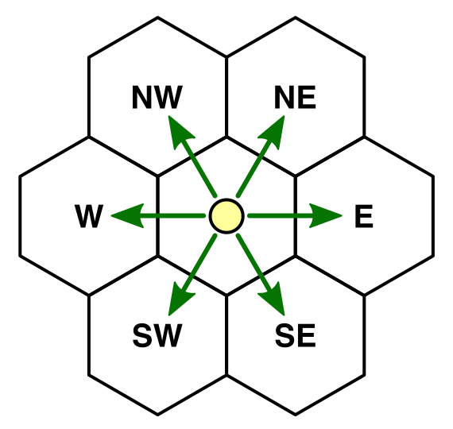 						Six neighbors, six directions. 					

To store these neighbors, add an array to `**HexCell**`.  While we could make it public, instead we'll make it private and  provide access methods using a direction. Also ensure that it serializes  so the connections survive recompiles.

```
	[SerializeField]
	HexCell[] neighbors;
```

 						Do we need to store the neighbor connections? 						 					

The neighbor array now shows up in the inspector. As each cell has six neighbors, set the array size to 6 for our *Hex Cell* prefab.

 						
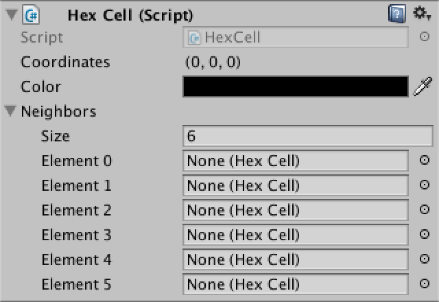 						Our prefab comes with room for six neighbors. 					

Now add a public method to retrieve a cell's neighbor in one  direction. As a direction is always between 0 and 5, we don't need to  check whether the index lies within the bounds of the array.

```
	public HexCell GetNeighbor (HexDirection direction) {
		return neighbors[(int)direction];
	}
```

Add a method to set a neighbor too.

```
	public void SetNeighbor (HexDirection direction, HexCell cell) {
		neighbors[(int)direction] = cell;
	}
```

Neighbor relationships are bidirectional. So when setting a  neighbor in one direction, it makes sense to immediately set the  neighbor in the opposite direction as well.

```
	public void SetNeighbor (HexDirection direction, HexCell cell) {
		neighbors[(int)direction] = cell;
		cell.neighbors[(int)direction.Opposite()] = this;
	}
```

 						
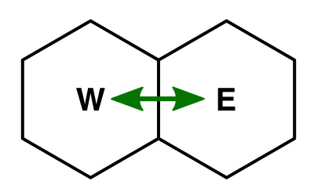 						Neighbors in opposite directions. 					

Of course this assumes that we could ask a direction for its opposite. We can support this, by creating an extension method for `**HexDirection**`.  To get the opposite direction, add 3 to the original direction. This  only works for the first three directions though, for the others we have  to subtract 3 instead.

```
public enum HexDirection {
	NE, E, SE, SW, W, NW
}

public static class HexDirectionExtensions {

	public static HexDirection Opposite (this HexDirection direction) {
		return (int)direction < 3 ? (direction + 3) : (direction - 3);
	}
}
```

 						What's an extension method? 						 					

### Connecting Neighbors

We can initialize the neighbor relationship in `**HexGrid**.CreateCell`.  As we go through the cells row by row, left to right, we know which  cells have already been created. Those are the cells that we can connect  to.

The simplest is the E–W connection. The first cell of each row  doesn't have a west neighbor. But all other cells in the row do. And  these neighbors have been created before the cell we're currently  working with. So we can connect them.

 							
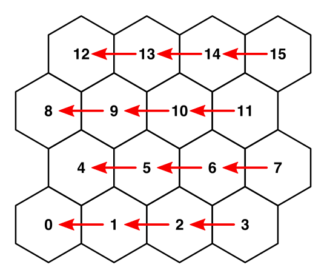 							Connecting from E to W as cells are created. 						

```
	void CreateCell (int x, int z, int i) {
		…
		cell.color = defaultColor;

		if (x > 0) {
			cell.SetNeighbor(HexDirection.W, cells[i - 1]);
		}

		Text label = Instantiate<Text>(cellLabelPrefab);
		…
	}
```

 							
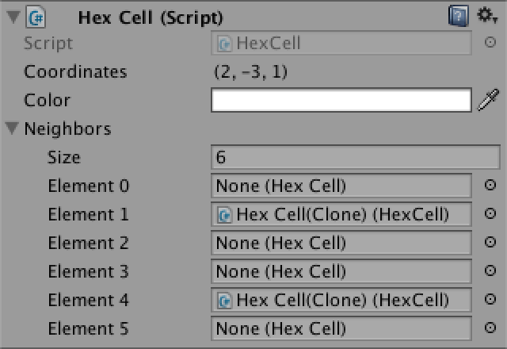 							East and west neighbors are connected. 						

We have two more bidirectional connections to make. As these  are between different grid rows, we can only connect with the previous  row. This means that we have to skip the first row entirely.

```
		if (x > 0) {
			cell.SetNeighbor(HexDirection.W, cells[i - 1]);
		}
		if (z > 0) {
		}
```

As the rows zigzag, they have to be treated differently. Let's  first deal with the even rows. As all cells in such rows have a SE  neighbor, we can connect to those.

 							
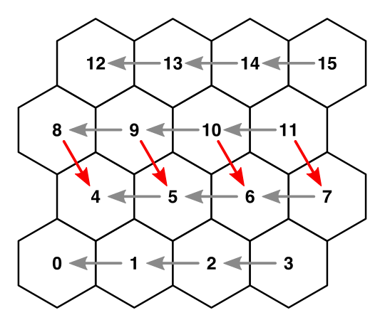 							Connecting from NW to SE on even rows. 						

```
		if (z > 0) {
			if ((z & 1) == 0) {
				cell.SetNeighbor(HexDirection.SE, cells[i - width]);
			}
		}
```

 							What does `z & 1` do? 							 						

We can connect to the SW neighbors as well. Except for the first cell in each row, as it doesn't have one.

 							
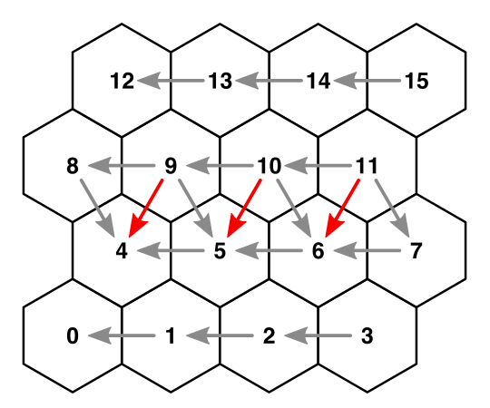 							Connecting from NE to SW on even rows. 						

```
		if (z > 0) {
			if ((z & 1) == 0) {
				cell.SetNeighbor(HexDirection.SE, cells[i - width]);
				if (x > 0) {
					cell.SetNeighbor(HexDirection.SW, cells[i - width - 1]);
				}
			}
		}
```

The odds rows follow the same logic, but mirrored. Once that's done, all neighbors in our grid are connected.

```
		if (z > 0) {
			if ((z & 1) == 0) {
				cell.SetNeighbor(HexDirection.SE, cells[i - width]);
				if (x > 0) {
					cell.SetNeighbor(HexDirection.SW, cells[i - width - 1]);
				}
			}
			else {
				cell.SetNeighbor(HexDirection.SW, cells[i - width]);
				if (x < width - 1) {
					cell.SetNeighbor(HexDirection.SE, cells[i - width + 1]);
				}
			}
		}
```

 							
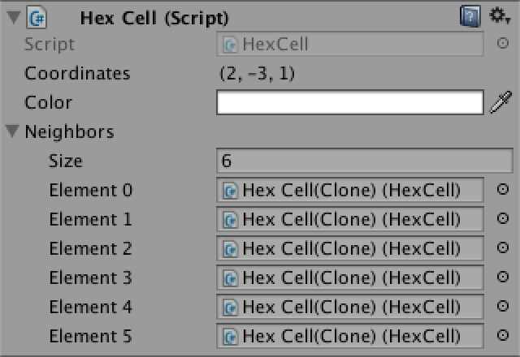 							All neighbors are connected. 						

Of course not every cell is connected to exactly six neighbors.  The cells that form the border of our grid end up with at least two and  at most five neighbors. This is something that we have to be aware of.

 							
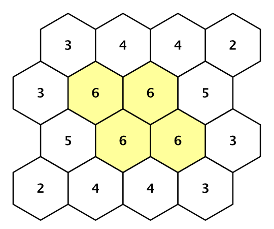 							Neighbors per cell. 						

unitypackage

## Blending Colors

Color blending will make the triangulation of each cell more  complex. So let's isolate the code of triangulating a single part. As we  have directions now, let's use those to identify the parts, instead of a  numeric index.

```
	void Triangulate (HexCell cell) {
		for (HexDirection d = HexDirection.NE; d <= HexDirection.NW; d++) {
			Triangulate(d, cell);
		}
	}

	void Triangulate (HexDirection direction, HexCell cell) {
		Vector3 center = cell.transform.localPosition;
		AddTriangle(
			center,
			center + HexMetrics.corners[(int)direction],
			center + HexMetrics.corners[(int)direction + 1]
		);
		AddTriangleColor(cell.color);
	}
```

Now that we're using directions, it would be nice if we could  fetch corners with directions, instead of having to convert to indices.

```
		AddTriangle(
			center,
			center + HexMetrics.GetFirstCorner(direction),
			center + HexMetrics.GetSecondCorner(direction)
		);
```

This requires the addition of two static methods to `**HexMetrics**`. As a bonus, this allows us to make the corners array private.

```
	static Vector3[] corners = {
		new Vector3(0f, 0f, outerRadius),
		new Vector3(innerRadius, 0f, 0.5f * outerRadius),
		new Vector3(innerRadius, 0f, -0.5f * outerRadius),
		new Vector3(0f, 0f, -outerRadius),
		new Vector3(-innerRadius, 0f, -0.5f * outerRadius),
		new Vector3(-innerRadius, 0f, 0.5f * outerRadius),
		new Vector3(0f, 0f, outerRadius)
	};

	public static Vector3 GetFirstCorner (HexDirection direction) {
		return corners[(int)direction];
	}

	public static Vector3 GetSecondCorner (HexDirection direction) {
		return corners[(int)direction + 1];
	}
```

### Multiple Colors Per Triangle

Right now the `**HexMesh**.AddTriangleColor`  method has a single color argument. This can only produce a triangle  with a solid color. Let's add an alternative that supports a separate  color for each vertex.

```
	void AddTriangleColor (Color c1, Color c2, Color c3) {
		colors.Add(c1);
		colors.Add(c2);
		colors.Add(c3);
	}
```

Now we can start blending colors! Begin by simply using the neighbor's color for the other two vertices.

```
	void Triangulate (HexDirection direction, HexCell cell) {
		Vector3 center = cell.transform.localPosition;
		AddTriangle(
			center,
			center + HexMetrics.GetFirstCorner(direction),
			center + HexMetrics.GetSecondCorner(direction)
		);
		HexCell neighbor = cell.GetNeighbor(direction);
		AddTriangleColor(cell.color, neighbor.color, neighbor.color);
	}
```

Unfortunately, this will produce a `NullReferenceException`  because our border cells don't have six neighbors. What should we do  when we lack a neighbor? Let's be pragmatic and use the cell itself as a  substitute.

```
		HexCell neighbor = cell.GetNeighbor(direction) ?? cell;
```

 							What does `??` do? 							 						

 							
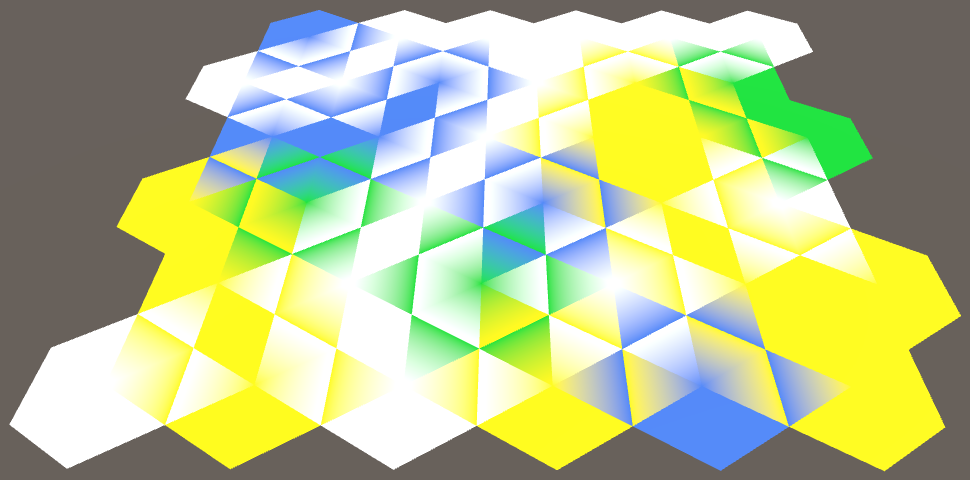 							Color blending, but incorrect. 						

 							Where did the coordinate labels go? 							 						

### Color Averaging

Color blending works, but our current results are obviously  incorrect. The color at the edges of our hexagons should be the average  of the two adjacent cells.

```
		HexCell neighbor = cell.GetNeighbor(direction) ?? cell;
		Color edgeColor = (cell.color + neighbor.color) * 0.5f;
		AddTriangleColor(cell.color, edgeColor, edgeColor);
```

 							
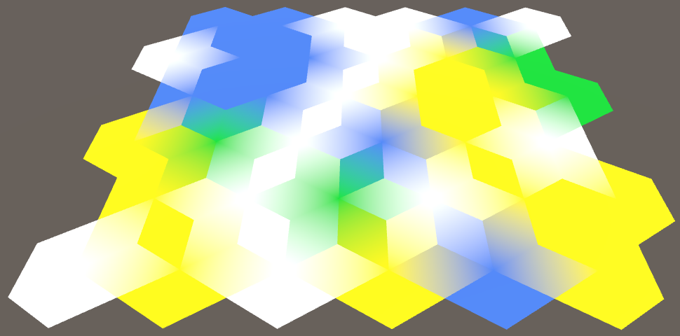 							Blending across edges. 						

While we are now blending across edges, we still get sharp  color boundaries. This happens because each vertex of a hexagon is  shared by three hexagons in total.

 							
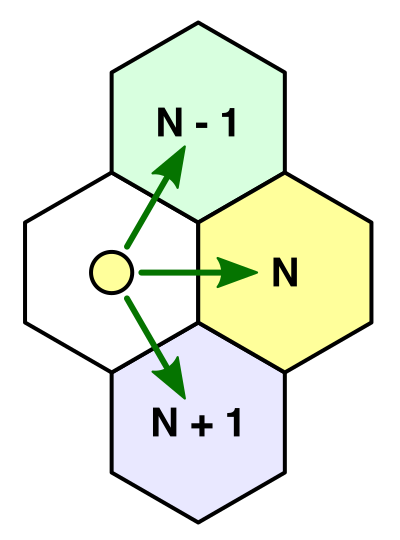 							Three neighbors, four colors. 						

This means that we also have to consider the neighbors of the  previous and next directions. So we end up with four colors, in two sets  of three.

Let's add two addition methods to `**HexDirectionExtensions**` to easily jump to the previous and next directions.

```
	public static HexDirection Previous (this HexDirection direction) {
		return direction == HexDirection.NE ? HexDirection.NW : (direction - 1);
	}

	public static HexDirection Next (this HexDirection direction) {
		return direction == HexDirection.NW ? HexDirection.NE : (direction + 1);
	}
```

Now we can retrieve all three neighbors and perform two three-way blends.

```
		HexCell prevNeighbor = cell.GetNeighbor(direction.Previous()) ?? cell;
		HexCell neighbor = cell.GetNeighbor(direction) ?? cell;
		HexCell nextNeighbor = cell.GetNeighbor(direction.Next()) ?? cell;
		
		AddTriangleColor(
			cell.color,
			(cell.color + prevNeighbor.color + neighbor.color) / 3f,
			(cell.color + neighbor.color + nextNeighbor.color) / 3f
		);
```

 							
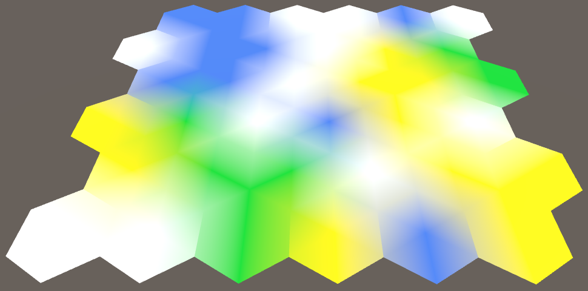 							Blending across corners. 						

This produces correct color transitions, except along the  border of the grid. The border cells don't agree on the colors of the  missing neighbors, so you still see sharp boundaries there. Overall  though, our current approach doesn't produce a pleasing result. We need a  better strategy.

unitypackage

## Blend Regions

Blending across the entire surface of a hexagon leads to a  blurry mess. You can no longer clearly see the individual cells. We can  improve this a lot by only blending near the edges of hexagons. That  leaves an inner hexagonal region with a solid color.

 						
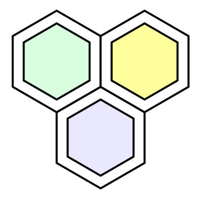 						Solid cores with blend regions. 					

How large should this solid region be, versus the blend region?  Different distributions lead to different visuals. We can define this  region as a fraction of the outer radius. Let's make it 75%. This leads  to two new metrics, which add up to 100%.

```
	public const float solidFactor = 0.75f;
	
	public const float blendFactor = 1f - solidFactor;
```

With the new solid factor, we can create methods to retrieve the corners of solid inner hexagons.

```
	public static Vector3 GetFirstSolidCorner (HexDirection direction) {
		return corners[(int)direction] * solidFactor;
	}

	public static Vector3 GetSecondSolidCorner (HexDirection direction) {
		return corners[(int)direction + 1] * solidFactor;
	}
```

Now change `**HexMesh**.Triangulate` so it uses these solid corners instead of the original ones. Leave the colors as they are for now.

```
		AddTriangle(
			center,
			center + HexMetrics.GetFirstSolidCorner(direction),
			center + HexMetrics.GetSecondSolidCorner(direction)
		);
```

 						
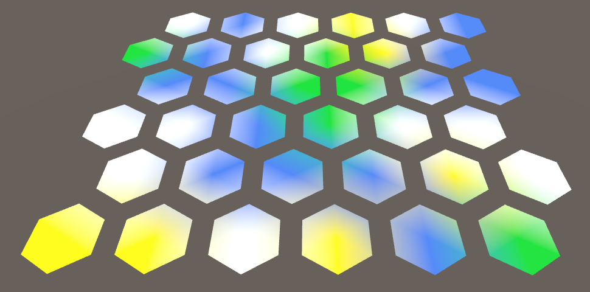 						Solid hexagons, no edges. 					

### Triangulating Blend Regions

We need to fill the empty space that we have created by  shrinking our triangles. This space has the shape of a trapezoid in each  direction. We can use a quad to cover it. So create methods to add a  quad and its colors.

 							
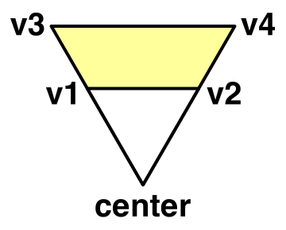 							Trapezoid edge. 						

```
	void AddQuad (Vector3 v1, Vector3 v2, Vector3 v3, Vector3 v4) {
		int vertexIndex = vertices.Count;
		vertices.Add(v1);
		vertices.Add(v2);
		vertices.Add(v3);
		vertices.Add(v4);
		triangles.Add(vertexIndex);
		triangles.Add(vertexIndex + 2);
		triangles.Add(vertexIndex + 1);
		triangles.Add(vertexIndex + 1);
		triangles.Add(vertexIndex + 2);
		triangles.Add(vertexIndex + 3);
	}

	void AddQuadColor (Color c1, Color c2, Color c3, Color c4) {
		colors.Add(c1);
		colors.Add(c2);
		colors.Add(c3);
		colors.Add(c4);
	}
```

Rework `**HexMesh**.Triangulate` so the triangle gets a single color and the quad blends between the solid color and the two corner colors.

```
	void Triangulate (HexDirection direction, HexCell cell) {
		Vector3 center = cell.transform.localPosition;
		Vector3 v1 = center + HexMetrics.GetFirstSolidCorner(direction);
		Vector3 v2 = center + HexMetrics.GetSecondSolidCorner(direction);

		AddTriangle(center, v1, v2);
		AddTriangleColor(cell.color);

		Vector3 v3 = center + HexMetrics.GetFirstCorner(direction);
		Vector3 v4 = center + HexMetrics.GetSecondCorner(direction);

		AddQuad(v1, v2, v3, v4);

		HexCell prevNeighbor = cell.GetNeighbor(direction.Previous()) ?? cell;
		HexCell neighbor = cell.GetNeighbor(direction) ?? cell;
		HexCell nextNeighbor = cell.GetNeighbor(direction.Next()) ?? cell;

		AddQuadColor(
			cell.color,
			cell.color,
			(cell.color + prevNeighbor.color + neighbor.color) / 3f,
			(cell.color + neighbor.color + nextNeighbor.color) / 3f
		);
	}
```

 							
 							Blending with trapezoid edges. 						

### Edge Bridges

This is starting to look better, but we're still not there yet.  The color blend between two neighbors gets polluted by the cells  adjacent to the edge. To prevent this, we have to cut the corners from  our trapezoid and turn it into a rectangle. It then forms a bridge  between a cell and its neighbor, leaving gaps at the sides.

 							
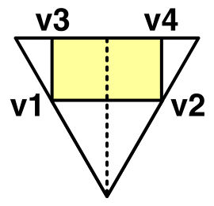 							Edge Bridge. 						

We can find the new positions of `v3` and `v4` by starting from `v1` and `v2`,  then moving along the bridge, straight to the edge of the cell. So what  is this bridge offset? You can find it by taking the midpoint between  the two relevant corners, then applying the blend factor to that. This  is a job for `**HexMetrics**`.

```
	public static Vector3 GetBridge (HexDirection direction) {
		return (corners[(int)direction] + corners[(int)direction + 1]) *
			0.5f * blendFactor;
	}
```

Back to `**HexMesh**`, it now makes sense to add a variant of `AddQuadColor` that only needs two colors.

```
	void AddQuadColor (Color c1, Color c2) {
		colors.Add(c1);
		colors.Add(c1);
		colors.Add(c2);
		colors.Add(c2);
	}
```

Adjust `Triangulate` so it creates correctly blending bridges between neighbors.

```
		Vector3 bridge = HexMetrics.GetBridge(direction);
		Vector3 v3 = v1 + bridge;
		Vector3 v4 = v2 + bridge;

		AddQuad(v1, v2, v3, v4);

		HexCell prevNeighbor = cell.GetNeighbor(direction.Previous()) ?? cell;
		HexCell neighbor = cell.GetNeighbor(direction) ?? cell;
		HexCell nextNeighbor = cell.GetNeighbor(direction.Next()) ?? cell;

		AddQuadColor(cell.color, (cell.color + neighbor.color) * 0.5f);
```

 							
 							Correctly colored bridges, with corner gaps. 						

### Filling the Gaps

We are now left with a triangular gap wherever three cells  meet. We got those holes by cutting off the triangular sides of our  trapezoids. So let's add those triangles back.

First consider the triangle that connects with the previous  neighbor. Its first vertex has the cell's color. Its second vertex's  color is a three-color blend. And the final vertex has the same color as  halfway across the bridge.

```
		Color bridgeColor = (cell.color + neighbor.color) * 0.5f;
		AddQuadColor(cell.color, bridgeColor);

		AddTriangle(v1, center + HexMetrics.GetFirstCorner(direction), v3);
		AddTriangleColor(
			cell.color,
			(cell.color + prevNeighbor.color + neighbor.color) / 3f,
			bridgeColor
		);
```

 							
 							Almost there. 						

Finally, the other triangle work the same way, except that its second vertex touches the bridge, instead of its third vertex.

```
		AddTriangle(v2, v4, center + HexMetrics.GetSecondCorner(direction));
		AddTriangleColor(
			cell.color,
			bridgeColor,
			(cell.color + neighbor.color + nextNeighbor.color) / 3f
		);
```

 							
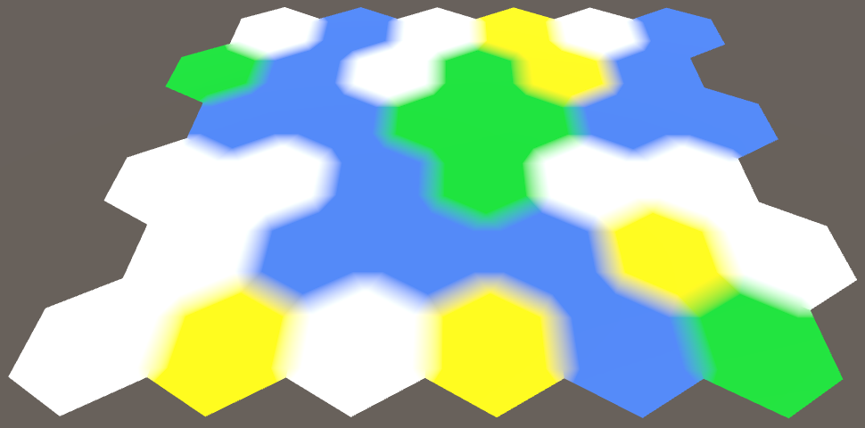 							Completely filled. 						

Now we have nice blend regions that we can give any size that  we want. Fuzzy or crisp cell edges, it is up to you. But you'll notice  that the blending near the grid border is still not correct. Again, we  will let that rest for now, and instead focus our attention on another  matter.

 							But the color transitions are still ugly? 							 						

unitypackage

## Fusing Edges

Take a look at the topology of our grid. What distinct shapes  are there? If we ignore the border, then we can identify three distinct  shape types. There are single-color hexagons, dual-color rectangles, and  triple-color triangles. You find all three shapes wherever three cells  meet.

 						
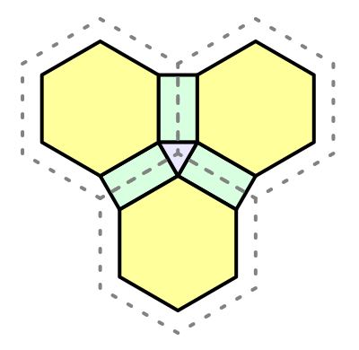 						Three visual structures. 					

So every two hexagons are connected by a single rectangular  bridge. And every three hexagons are connected by a single triangle.  However, we triangulate in a more complex way. We currently use two  quads to connect a pair of hexagons, instead of just one. And we're  using a total of six triangles to connect three hexagons. That seems  excessive. Also, if we were to directly connect with a single shape, we  wouldn't need to do any color averaging. So we could get away with less  complexity, less work, and less triangles.

 						
 						More complex than needed. 					

 						Why didn't we do that in the first place? 						 					

### Direct Bridges

Our edge bridges right now consist of two quads. To make them  go all the way across to the next hexagon, we have to double the bridge  length. This means that we no longer have to average the two corners in `**HexMetrics**.GetBridge`. Instead we just add them and then multiply with the blend factor.

```
	public static Vector3 GetBridge (HexDirection direction) {
		return (corners[(int)direction] + corners[(int)direction + 1]) *
			blendFactor;
	}
```

 							
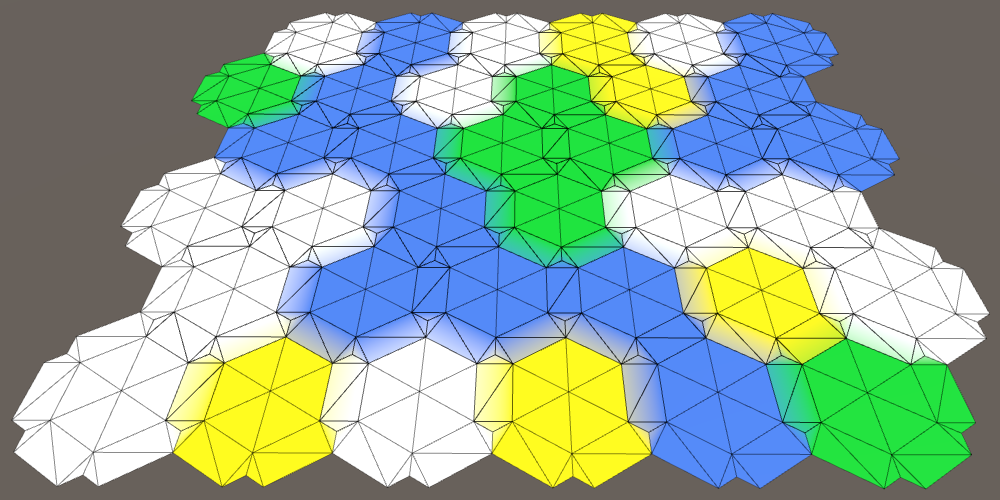 							Bridges go all the way across, and overlap. 						

The bridges now form direct connections between hexagons. But  we're still generating two per connection, one in each direction, which  overlap. So only one of the two cells has to create a bridge between  them.

Let's first simplify our triangulation code. Remove everything  that deals with the edge triangles and color blending. Then move the  code that adds the bridge quad to a new method. Pass the first two  vertices to this method, so we don't have to derive them again.

```
	void Triangulate (HexDirection direction, HexCell cell) {
		Vector3 center = cell.transform.localPosition;
		Vector3 v1 = center + HexMetrics.GetFirstSolidCorner(direction);
		Vector3 v2 = center + HexMetrics.GetSecondSolidCorner(direction);

		AddTriangle(center, v1, v2);
		AddTriangleColor(cell.color);

		TriangulateConnection(direction, cell, v1, v2);
	}

	void TriangulateConnection (
		HexDirection direction, HexCell cell, Vector3 v1, Vector3 v2
	) {
		HexCell neighbor = cell.GetNeighbor(direction) ?? cell;
		
		Vector3 bridge = HexMetrics.GetBridge(direction);
		Vector3 v3 = v1 + bridge;
		Vector3 v4 = v2 + bridge;

		AddQuad(v1, v2, v3, v4);
		AddQuadColor(cell.color, neighbor.color);
	}
```

Now we can easily limit the triangulation of connections. Start by only adding a bridge when we're dealing with a NE connection.

```
		if (direction == HexDirection.NE) {
			TriangulateConnection(direction, cell, v1, v2);
		}
```

 							
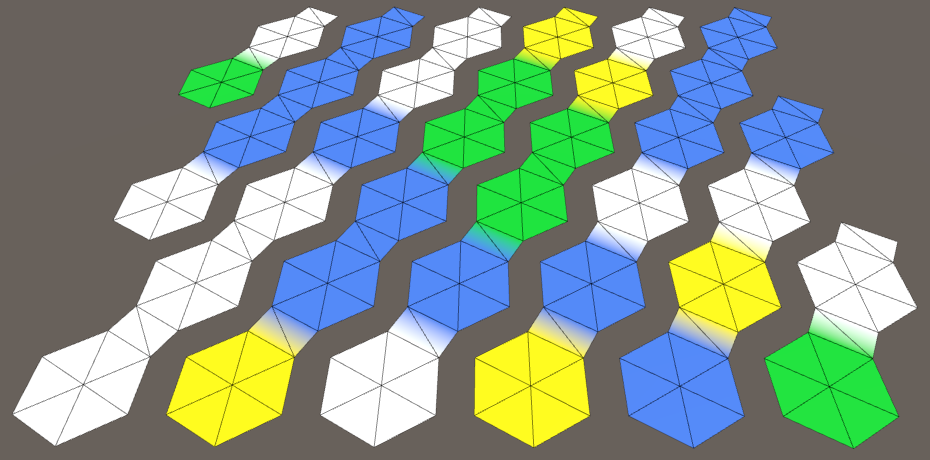 							Only bridges in NE direction. 						

It looks like we can cover all connections by only triangulating them in the first three directions. So NE, E, and SE.

```
		if (direction <= HexDirection.SE) {
			TriangulateConnection(direction, cell, v1, v2);
		}
```

 							
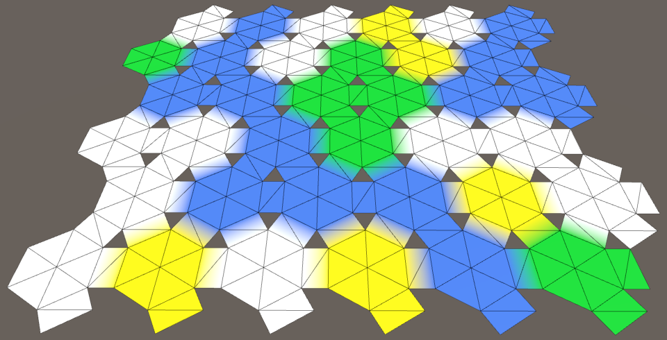 							All internal bridges, some border bridges. 						

All connections between two adjacent cells are now covered. But  we also got some bridges that lead out of the grid, to nowhere. Let's  get rid of those, by bailing out of `TriangulateConnection` when we end up with no neighbor. So we no longer replace missing neighbors with the cell itself.

```
	void TriangulateConnection (
		HexDirection direction, HexCell cell, Vector3 v1, Vector3 v2
	) {
		HexCell neighbor = cell.GetNeighbor(direction);
		if (neighbor == null) {
			return;
		}
		
		…
	}
```

 							
 							Only internal bridges. 						

### Triangular Connections

We have to plug the triangular holes again. Let's do this for  the triangle that connects to the next neighbor. Once again, we should  only do this if that neighbor actually exists.

```
	void TriangulateConnection (
		HexDirection direction, HexCell cell, Vector3 v1, Vector3 v2
	) {
		…

		HexCell nextNeighbor = cell.GetNeighbor(direction.Next());
		if (nextNeighbor != null) {
			AddTriangle(v2, v4, v2);
			AddTriangleColor(cell.color, neighbor.color, nextNeighbor.color);
		}
	}
```

What is the position of the third vertex? I put in `v2`  as a placeholder, but that is obviously not correct. As each edge of  these triangles connects with a bridge, we can find it by traveling  along the bridge of the next neighbor.

```
			AddTriangle(v2, v4, v2 + HexMetrics.GetBridge(direction.Next()));
```

 							
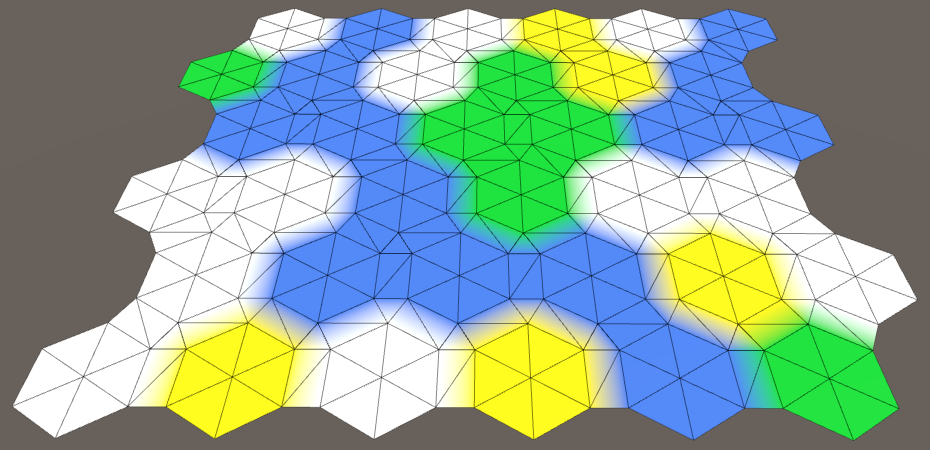 							Once again, a complete triangulation. 						

Are we done? Not yet, as we're now producing overlapping  triangles. Because three cells share one triangular connection, we only  need to add them for two connections. So just NE and E will do.

```
		if (direction <= HexDirection.E && nextNeighbor != null) {
			AddTriangle(v2, v4, v2 + HexMetrics.GetBridge(direction.Next()));
			AddTriangleColor(cell.color, neighbor.color, nextNeighbor.color);
		}
```

The next tutorial is [Elevation and Terraces](https://catlikecoding.com/unity/tutorials/hex-map/part-3).

unitypackage

PDF
