# Hex Map 1

Creating a Hexagonal Grid

- Turn squares into hexagons.
- Triangulate a hexagonal grid.
- Work with cube coordinates.
- Interact with grid cells.
- Make an in-game editor.

This tutorial is the first part of a series about hexagon maps.  Many games use hex grids, especially strategy games, including Age of  Wonders 3, Civilization 5, and Endless Legend. We will start with the  basics, incrementally adding features until we end up with a complex  hex-based terrain.

This tutorial assumes you have completed the *Mesh Basics* series, which starts with [Procedural Grid](https://catlikecoding.com/unity/tutorials/procedural-grid/).  It has been created with Unity 5.3.1. The entire series progresses  through multiple versions of Unity. The final part is made with Unity  2017.3.0p3.

 					
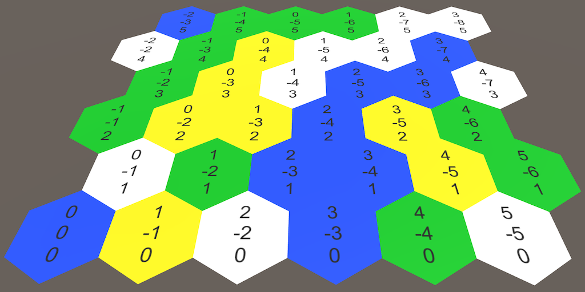 					A basic hex map. 				

## About Hexagons

Why use hexagons? If you need a grid, it makes sense to just use  squares. Squares are indeed simple to draw and position, but they have a  downside. Take a look at a single square in the grid. Then look at its  neighbors.

 						
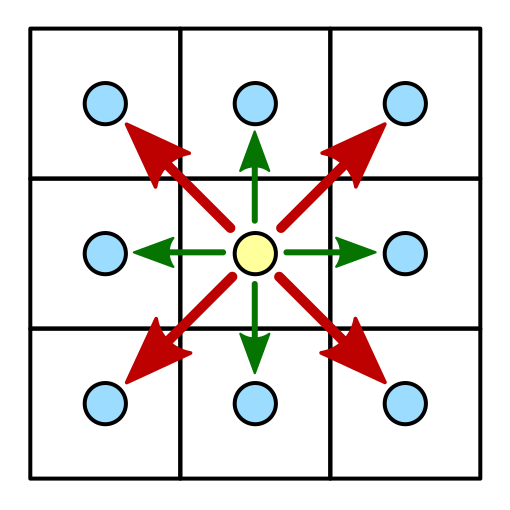 						A square and its neighbors. 					

There are eight neighbors in total. Four can be reached by  crossing an edge of the square. They are the horizontal and vertical  neighbors. The other four can be reached by crossing a corner of the  square. These are the diagonal neighbors.

What is the distance between the centers of adjacent square  cells in the grid? If the edge length is 1, then the answer is 1 for the  horizontal and vertical neighbors. But for diagonal neighbors the  answer is √2.

The differences between the two kinds of neighbor lead to  complications. If you use discrete movement, how do you treat diagonal  movement? Do you allow it at all? How can you create a more organic  look? Different games use different approaches, with different  advantages and disadvantages. One approach is to not use a square grid  at all, but to use hexagons instead.

 						
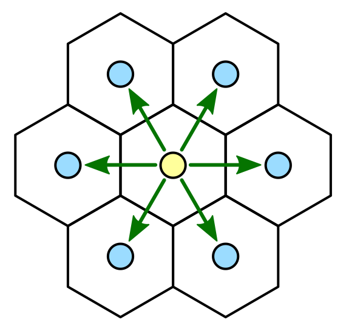 						A hexagon and its neighbors. 					

Compared to a square, a hexagon has only six neighbors instead  of eight. All of these neighbors are edge neighbors. There are no corner  neighbors. So there is only one kind of neighbor, which simplifies a  lot of things. Of course a hexagon grid is less straightforward to  construct than a square grid, but we can deal with that.

Before we get started, we have to settle on a size for our  hexagons. Let's pick an edge length of 10 units. Because a hexagon  consists of a circle of six equilateral triangles, the distance from the  center to any corner is also 10. This defines the outer radius of our  hexagon cell.

 						
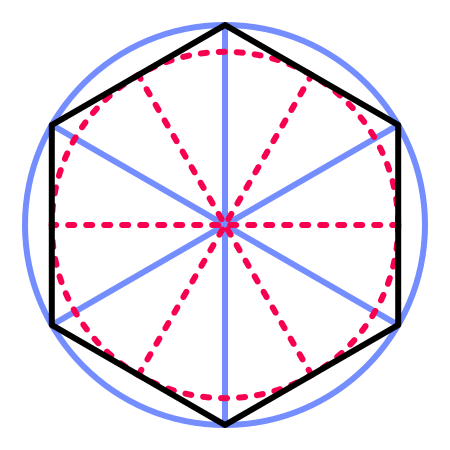 						A hexagon's outer and inner radius. 					

There is also an inner radius, which is the distance from the  center to each of the edges. This metric is important, because the  distance to the center of each neighbor is equal to twice this value.  The inner radius is equal to √32

 times the outer radius, so 

5√3

 in our case. Let's put these metrics in a static class for easy access.

```
using UnityEngine;

public static class HexMetrics {

	public const float outerRadius = 10f;

	public const float innerRadius = outerRadius * 0.866025404f;
}
```

 						How do you derive the inner radius? 						 					

While we're at it, let's also define the positions of the six  corners relative to the cell's center. Note that there are two ways to  orientate a hexagon. Either pointy side up or flat side up. We'll put a  corner at the top. Start with this corner and add the rest in clockwise  order. Place them in the XZ plane, so the hexagons will be aligned with  the ground.

 						
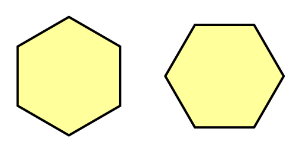 						Possible orientations. 					

```
	public static Vector3[] corners = {
		new Vector3(0f, 0f, outerRadius),
		new Vector3(innerRadius, 0f, 0.5f * outerRadius),
		new Vector3(innerRadius, 0f, -0.5f * outerRadius),
		new Vector3(0f, 0f, -outerRadius),
		new Vector3(-innerRadius, 0f, -0.5f * outerRadius),
		new Vector3(-innerRadius, 0f, 0.5f * outerRadius)
	};
```

unitypackage

## Grid Construction

To create a hexagon grid, we need grid cells. Create a `**HexCell**` component for this purpose. Leave it empty for now, because we're not using any cell data yet.

```
using UnityEngine;

public class HexCell : MonoBehaviour {
}
```

To start really simple, create a default plane object, add the cell component to it, and turn it into a prefab.

 						
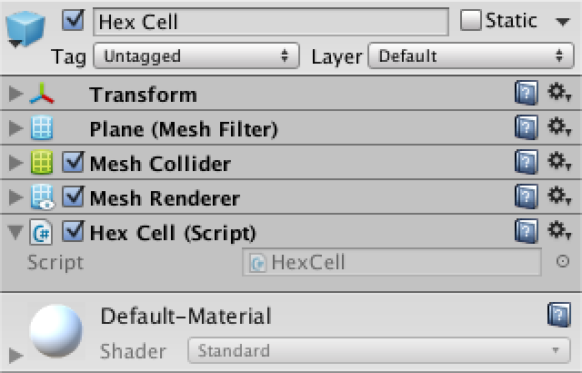 						Using a plane as a hex cell prefab. 					

Next comes the grid. Create a simple component with public  width, height, and cell prefab variables. Then add a game object with  this component to the scene.

```
using UnityEngine;

public class HexGrid : MonoBehaviour {

	public int width = 6;
	public int height = 6;

	public HexCell cellPrefab;

}
```

 						
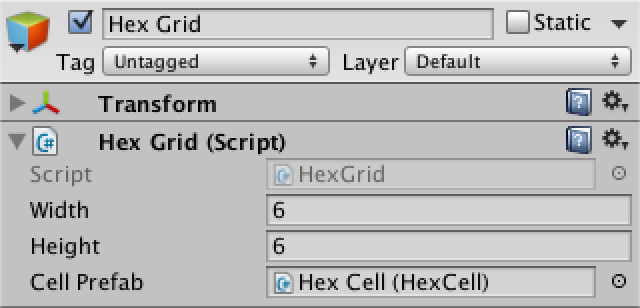 						Hex grid object. 					

Let's begin with creating a regular square grid, as we already  know how to do that. Store the cells in an array so we can access them  later.

As the default planes are 10 by 10 units, offset each cell by that amount.

```
	HexCell[] cells;

	void Awake () {
		cells = new HexCell[height * width];

		for (int z = 0, i = 0; z < height; z++) {
			for (int x = 0; x < width; x++) {
				CreateCell(x, z, i++);
			}
		}
	}
	
	void CreateCell (int x, int z, int i) {
		Vector3 position;
		position.x = x * 10f;
		position.y = 0f;
		position.z = z * 10f;

		HexCell cell = cells[i] = Instantiate<HexCell>(cellPrefab);
		cell.transform.SetParent(transform, false);
		cell.transform.localPosition = position;
	}
```

 						
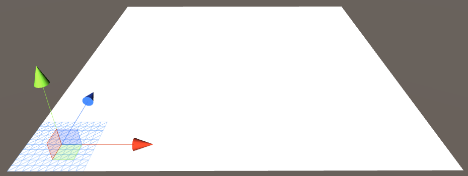 						Square grid of planes. 					

This gives us a nice grid of seamless square cells. But which  cell is where? Of course that is easy for us to check, but it will get  trickier with hexagons. It would be convenient if we could see all cell  coordinates at once.

### Showing Coordinates

Add a canvas to the scene via *GameObject / UI / Canvas*  and make it a child of our grid object. As this is a purely informative  canvas, remove its raycaster component. You can also delete the event  system object that was automatically added to the scene, as we don't  need it yet.

Set the *Render Mode* to *World Space* and rotate by  90 degrees around the X axis so the canvas overlays our grid. Set its  pivot to zero and its position too. Give it a slight vertical offset so  its contents will appear on top. Its width and height don't matter, as  we'll position its contents ourselves. You can set them to zero to get  rid of the big rectangle in the scene view.

As a finishing touch, increase *Dynamic Pixels Per Unit* to 10. This will ensure that text objects will use a decent font texture resolution.

 							
 							 							Canvas for the hex grid coordinates. 						

To show the coordinates, create a text object via *GameObject / UI / Text*  and turn it into a prefab. Make sure that its anchors and pivot are  centered and set its size to 5 by 15. The text's alignment should be  both horizontally and vertically centered as well. Set the font size to  4. Finally, we don't need the default text and we won't use *Rich Text* either. It doesn't matter whether *Raycast Target* is enabled or not, because our canvas won't do that anyway.

 							 							 							Cell label prefab. 						

Now our grid needs to know about the canvas and the prefab. Add `**using** UnityEngine.UI;` at the top of its script to conveniently access the `UnityEngine.UI.Text` type. The label prefab needs a public variable, while the canvas can be found by invoking `GetComponentInChildren`.

```
	public Text cellLabelPrefab;

	Canvas gridCanvas;

	void Awake () {
		gridCanvas = GetComponentInChildren<Canvas>();
		
		…
	}
```

 							
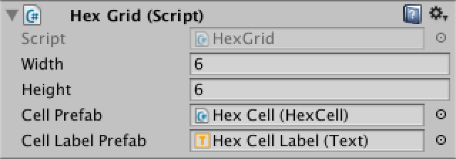 							Connecting the label prefab. 						

After hooking up the label prefab, we can instantiate them and  show the cell coordinates. Place a newline character between X and Z so  they end up on separate lines.

```
	void CreateCell (int x, int z, int i) {
		…

		Text label = Instantiate<Text>(cellLabelPrefab);
		label.rectTransform.SetParent(gridCanvas.transform, false);
		label.rectTransform.anchoredPosition =
			new Vector2(position.x, position.z);
		label.text = x.ToString() + "\n" + z.ToString();
	}
```

 							
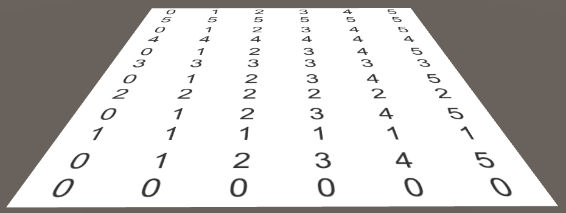 							Visible coordinates. 						

### Hexagon Positions

Now that we can visually identify each cell, let's start moving  them around. We know that the distance between adjacent hexagon cells  in the X direction is equal to twice the inner radius. So let's use  that. Also, the distance to the next row of cells should be 1.5 times  the outer radius.

 							
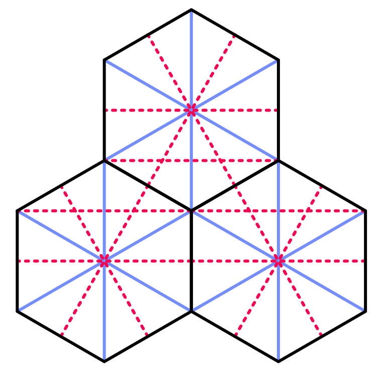 							The geometry of hexagon neighbors. 						

```
		position.x = x * (HexMetrics.innerRadius * 2f);
		position.y = 0f;
		position.z = z * (HexMetrics.outerRadius * 1.5f);
```

 							
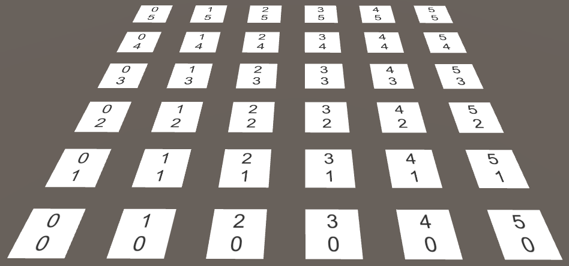 							Using hexagon distances, without offset. 						

Of course consecutive hexagon rows are not directly above each  other. Each row is offset along the X axis by the inner radius. We can  do this by adding half of Z to X before multiplying by double the inner  radius.

```
		position.x = (x + z * 0.5f) * (HexMetrics.innerRadius * 2f);
```

 							
 							Proper hexagon positions produce a rhombus grid. 						

While this places our cells in proper hexagon positions, our  grid now fills a rhombus instead of a rectangle. As it is more  convenient to work with rectangular grids, let's force the cells back in  line. We do this by undoing part of the offset. Every second row, all  cells should move back one additional step. Subtracting the integer  division of Z by 2 before multiplying will do the trick.

```
		position.x = (x + z * 0.5f - z / 2) * (HexMetrics.innerRadius * 2f);
```

 							
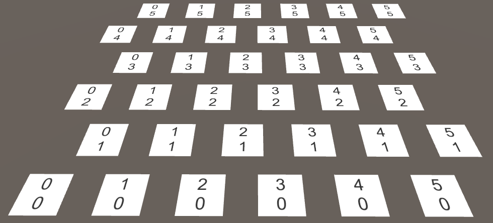 							Hexagonal spacing in a rectangular area. 						

unitypackage

## Rendering Hexagons

With the cells correctly positioned, we can move on to  displaying actual hexagons. We have to rid ourselves of the planes  first, so remove all components except the `**HexCell**` one from the cell prefab.

 						
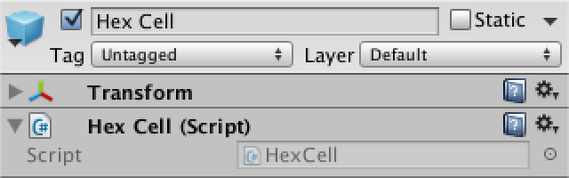 						No more planes. 					

Just like in the [Mesh Basics](https://catlikecoding.com/unity/tutorials/procedural-grid)  tutorials, we'll use a single mesh to render the entire grid. However,  this time we're not going to predetermine how many vertices and  triangles we need. We'll use lists instead.

Create a new `**HexMesh**` component  to take care of our mesh. It requires a mesh filter and renderer, has a  mesh, and has lists for its vertices and triangles.

```
using UnityEngine;
using System.Collections.Generic;

[RequireComponent(typeof(MeshFilter), typeof(MeshRenderer))]
public class HexMesh : MonoBehaviour {

	Mesh hexMesh;
	List<Vector3> vertices;
	List<int> triangles;

	void Awake () {
		GetComponent<MeshFilter>().mesh = hexMesh = new Mesh();
		hexMesh.name = "Hex Mesh";
		vertices = new List<Vector3>();
		triangles = new List<int>();
	}
}
```

Create a new child object with this component for our grid. It  will automatically get a mesh renderer, but won't have a material  assigned to it. So add the default material to it.

 						 						 						Hex mesh object. 					

Now `**HexGrid**` can retrieve its hex mesh, the same way it finds its canvas.

```
	HexMesh hexMesh;

	void Awake () {
		gridCanvas = GetComponentInChildren<Canvas>();
		hexMesh = GetComponentInChildren<HexMesh>();
		
		…
	}
```

After the grid has awoken, it has to tell the mesh to  triangulate its cells. We must be certain this happens after the hex  mesh component has awoken as well. As `Start` gets invoked later, let's do it there.

```
	void Start () {
		hexMesh.Triangulate(cells);
	}
```

This `**HexMesh**.Triangulate` method  could be invoked at any time, even when cells have already been  triangulated earlier. So we should begin by clearing the old data. Then  loop through all the cells, triangulating them individually. After that  is done, assign the generated vertices and triangles to the mesh, and  end by recalculating the mesh normals.

```
	public void Triangulate (HexCell[] cells) {
		hexMesh.Clear();
		vertices.Clear();
		triangles.Clear();
		for (int i = 0; i < cells.Length; i++) {
			Triangulate(cells[i]);
		}
		hexMesh.vertices = vertices.ToArray();
		hexMesh.triangles = triangles.ToArray();
		hexMesh.RecalculateNormals();
	}
	
	void Triangulate (HexCell cell) {
	}
```

As hexagons are made with triangles, let's create a convenient  method to add a triangle, given three vertex positions. It simply adds  the vertices in order. It also adds the indices of those vertices to  form a triangle. The index of the first vertex is equal to the length of  the vertex list before adding the new vertices to it. So remember it  before adding the vertices.

```
	void AddTriangle (Vector3 v1, Vector3 v2, Vector3 v3) {
		int vertexIndex = vertices.Count;
		vertices.Add(v1);
		vertices.Add(v2);
		vertices.Add(v3);
		triangles.Add(vertexIndex);
		triangles.Add(vertexIndex + 1);
		triangles.Add(vertexIndex + 2);
	}
```

Now we can triangulate our cells. Let's start with just the  first triangle. Its first vertex is the center of the hexagon. The other  two vertices are the first and second corners, relative to its center.

```
	void Triangulate (HexCell cell) {
		Vector3 center = cell.transform.localPosition;
		AddTriangle(
			center,
			center + HexMetrics.corners[0],
			center + HexMetrics.corners[1]
		);
	}
```

 						
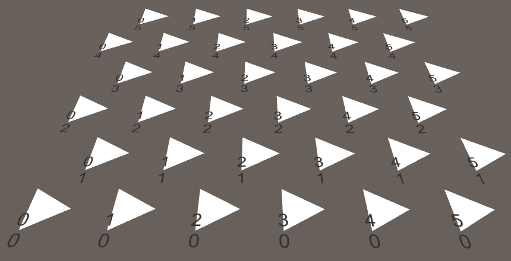 						The first triangle of each cell. 					

This works, so loop through all six triangles.

```
		Vector3 center = cell.transform.localPosition;
		for (int i = 0; i < 6; i++) {
			AddTriangle(
				center,
				center + HexMetrics.corners[i],
				center + HexMetrics.corners[i + 1]
			);
		}
```

 						Can't we share vertices? 						 					

Unfortunately, this produces an `IndexOutOfRangeException`.  This happens because the last triangle tries to fetch a seventh corner,  which doesn't exist. Of course it should wrap back and use the first  corner for its final vertex. Alternatively, we could duplicate the first  corner in `**HexMetrics**.corners`, so we don't have to worry about going out of bounds.

```
	public static Vector3[] corners = {
		new Vector3(0f, 0f, outerRadius),
		new Vector3(innerRadius, 0f, 0.5f * outerRadius),
		new Vector3(innerRadius, 0f, -0.5f * outerRadius),
		new Vector3(0f, 0f, -outerRadius),
		new Vector3(-innerRadius, 0f, -0.5f * outerRadius),
		new Vector3(-innerRadius, 0f, 0.5f * outerRadius),
		new Vector3(0f, 0f, outerRadius)
	};
```

 						
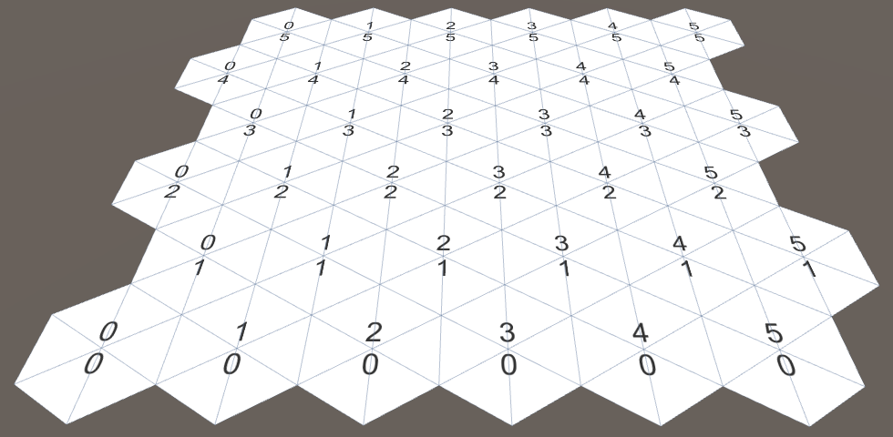 						Complete hexagons. 					

unitypackage

## Hexagonal Coordinates

Let's look at our cell coordinates again, in the context of a  hexagon grid. The Z coordinate appears fine, but the X coordinate  zigzags. This is a side effect of offsetting our rows to cover a  rectangular area.

 						
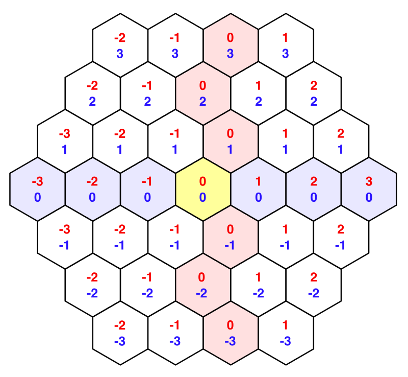 						Offset coordinates, highlighting the zero lines. 					

These offset coordinates aren't easy to work with when dealing with hexagons. Let's add a `**HexCoordinates**`  struct which we can use to convert to a different coordinate system.  Make it serializable so Unity can store it, which allows them to survive  recompiles while in play mode. Also, make these coordinates immutable  by using public readonly properties.

```
using UnityEngine;

[System.Serializable]
public struct HexCoordinates {

	public int X { get; private set; }

	public int Z { get; private set; }

	public HexCoordinates (int x, int z) {
		X = x;
		Z = z;
	}
}
```

Add a static method to create a set of coordinates using regular  offset coordinates. For now, just copy these coordinates verbatim.

```
	public static HexCoordinates FromOffsetCoordinates (int x, int z) {
		return new HexCoordinates(x, z);
	}
}
```

Add convenient string conversion methods as well. The default `ToString`  method return the struct's type name, which isn't useful. Override it  to return the coordinates on a single line. Also add a method to put the  coordinates on separate lines, because we are already using such a  layout.

```
	public override string ToString () {
		return "(" + X.ToString() + ", " + Z.ToString() + ")";
	}

	public string ToStringOnSeparateLines () {
		return X.ToString() + "\n" + Z.ToString();
	}
```

Now we can give a set of coordinates to our `**HexCell**` component.

```
public class HexCell : MonoBehaviour {

	public HexCoordinates coordinates;
}
```

Adjust `**HexGrid**.CreateCell` so it takes advantage of the new coordinates.

```
		HexCell cell = cells[i] = Instantiate<HexCell>(cellPrefab);
		cell.transform.SetParent(transform, false);
		cell.transform.localPosition = position;
		cell.coordinates = HexCoordinates.FromOffsetCoordinates(x, z);
		
		Text label = Instantiate<Text>(cellLabelPrefab);
		label.rectTransform.SetParent(gridCanvas.transform, false);
		label.rectTransform.anchoredPosition =
			new Vector2(position.x, position.z);
		label.text = cell.coordinates.ToStringOnSeparateLines();
```

Now let's fix out those X coordinates so they are aligned along a  straight axis. We can do this by undoing the horizontal shift. The  result is typically know as axial coordinates.

```
	public static HexCoordinates FromOffsetCoordinates (int x, int z) {
		return new HexCoordinates(x - z / 2, z);
	}
```

 						 						 						Axial coordinates. 					

This two-dimensional coordinate system lets us consistently  describe movement and offsets in four directions. However, the two  remaining directions still require special treatment. This indicates  that there is a third dimension. Indeed, if we were to horizontally flip  the X dimension, we get the missing Y dimension.

 						
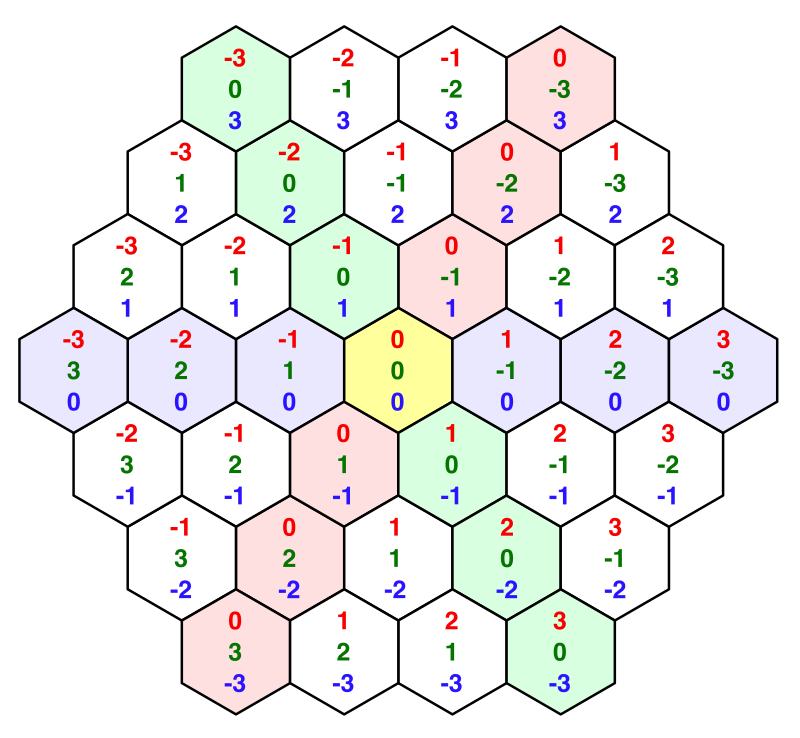 						An Y dimension appears. 					

As these X and Y dimensions mirror each other, adding their  coordinates together will always produces the same result, if you keep Z  constant. In fact, if you add all three coordinates together you will  always get zero. If you increment one coordinate, you have to decrement  another. Indeed, this produces six possible directions of movement.  These coordinates are typically know as cube coordinates, as they are  three-dimensional and the topology resembles a cube.

Because all coordinates add up to zero, you can always derive  each coordinate from the other two. As we already store the X and Z  coordinates, we don't need to store the Y coordinate. We can include a  property that computes it on demand and use that in the string methods.

```
	public int Y {
		get {
			return -X - Z;
		}
	}

	public override string ToString () {
		return "(" +
			X.ToString() + ", " + Y.ToString() + ", " + Z.ToString() + ")";
	}

	public string ToStringOnSeparateLines () {
		return X.ToString() + "\n" + Y.ToString() + "\n" + Z.ToString();
	}
```

 						
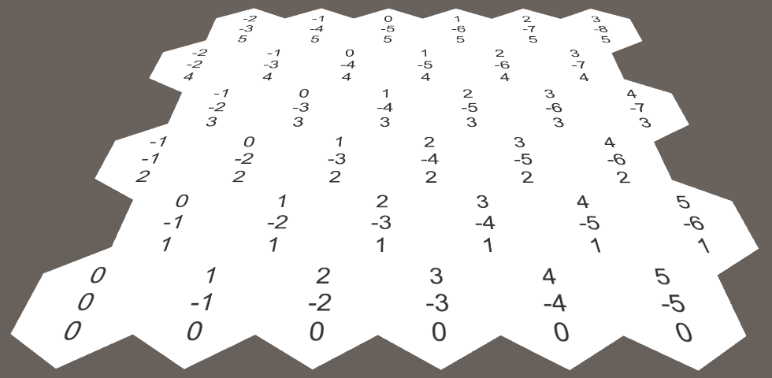 						Cube coordinates. 					

### Coordinates in the Inspector

Select one of the grid cells while in play mode. As it turns  out, the inspector doesn't show its coordinates. Only the prefix label  of `**HexCell**.coordinates` is shown.

 						
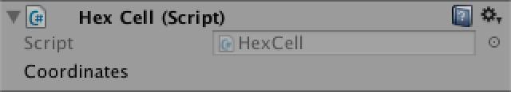 						Inspector does not show coordinates. 					

While this is not a big deal, it would be neat if the  coordinates do show up. Unity currently doesn't display the coordinates  because they aren't marked as serialized fields. To do so, we have to  explicitly define serializable fields for X and Z.

```
	[SerializeField]
	private int x, z;

	public int X {
		get {
			return x;
		}
	}

	public int Z {
		get {
			return z;
		}
	}

	public HexCoordinates (int x, int z) {
		this.x = x;
		this.z = z;
	}
```

 						
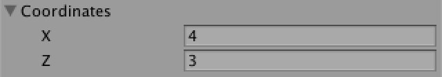 						Ugly and editable. 					

The X and Z coordinates are now shown, but they are editable,  which we don't want, as the coordinates should be fixed. It also doesn't  look nice that they are displayed below each other.

We can do a better job by defining a custom property drawer for the `**HexCoordinates**` type. Create a `**HexCoordinatesDrawer**` script and put it inside an *Editor* folder, as it is an editor-only script.

The class should extend `UnityEditor.PropertyDrawer` and needs the `UnityEditor.CustomPropertyDrawer` attribute to associate it with the correct type.

```
using UnityEngine;
using UnityEditor;

[CustomPropertyDrawer(typeof(HexCoordinates))]
public class HexCoordinatesDrawer : PropertyDrawer {
}
```

Property drawers render their contents via an `OnGUI`  method. This method is provided the screen rectangle to draw inside,  the serialized data of the property, and the label of the field it  belongs to.

```
	public override void OnGUI (
		Rect position, SerializedProperty property, GUIContent label
	) {
	}
```

Extract the x and z values from the property and use those to  create a new set of coordinates. Then draw a GUI label at the specified  position, using our `**HexCoordinates**.ToString` method.

```
	public override void OnGUI (
		Rect position, SerializedProperty property, GUIContent label
	) {
		HexCoordinates coordinates = new HexCoordinates(
			property.FindPropertyRelative("x").intValue,
			property.FindPropertyRelative("z").intValue
		);
		
		GUI.Label(position, coordinates.ToString());
	}
```

 						
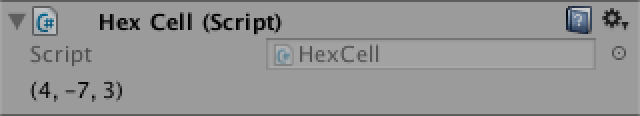 						Coordinates without prefix label. 					

This shows our coordinates, but we're now missing the field name. These names are usually drawn with the `EditorGUI.PrefixLabel` method. As a bonus, it returns an adjusted rectangle which matches the space to the right of this label.

```
		position = EditorGUI.PrefixLabel(position, label);
		GUI.Label(position, coordinates.ToString());
```

 						
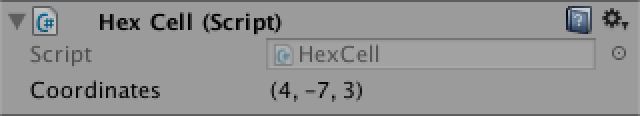 						Coordinates with label. 					

unitypackage

## Touching Cells

A hex grid isn't very interesting if we cannot interact with it.  The most basic interaction would be touching a cell, so let's add  support for that. For now just put this code directly in `**HexGrid**`. We'll move it somewhere else once we got it all working.

To touch a cell, we can shoot rays into the scene from the mouse position. We can use the same approach that we took in the [Mesh Deformation](https://catlikecoding.com/unity/tutorials/mesh-deformation) tutorial.

```
	void Update () {
		if (Input.GetMouseButton(0)) {
			HandleInput();
		}
	}

	void HandleInput () {
		Ray inputRay = Camera.main.ScreenPointToRay(Input.mousePosition);
		RaycastHit hit;
		if (Physics.Raycast(inputRay, out hit)) {
			TouchCell(hit.point);
		}
	}
	
	void TouchCell (Vector3 position) {
		position = transform.InverseTransformPoint(position);
		Debug.Log("touched at " + position);
	}
```

This doesn't do anything yet. We need to add a collider to the grid so that the ray has something to hit. So give `**HexMesh**` a mesh collider.

```
	MeshCollider meshCollider;

	void Awake () {
		GetComponent<MeshFilter>().mesh = hexMesh = new Mesh();
		meshCollider = gameObject.AddComponent<MeshCollider>();
		…
	}
```

Assign our mesh to the collider after we finished triangulating.

```
	public void Triangulate (HexCell[] cells) {
		…
		meshCollider.sharedMesh = hexMesh;
	}
```

 						Couldn't we just use a box collider? 						 					

We can now touch the grid! But which cell are we touching? To  know that, we have to convert the touch position to hex coordinates.  This is a job for `**HexCoordinates**`, so let's declare that is has a static `FromPosition` method.

```
	public void TouchCell (Vector3 position) {
		position = transform.InverseTransformPoint(position);
		HexCoordinates coordinates = HexCoordinates.FromPosition(position);
		Debug.Log("touched at " + coordinates.ToString());
	}
```

How would this method figure out which coordinate belongs to a  position? We can start by dividing x by the horizontal width of a  hexagon. And because the Y coordinate is a mirror of the X coordinate,  the negative of x gives us y.

```
	public static HexCoordinates FromPosition (Vector3 position) {
		float x = position.x / (HexMetrics.innerRadius * 2f);
		float y = -x;
	}
```

But of course that would only give us correct coordinates if Z  were zero. Once again we have to shift as we move along Z. Every two  rows we should shift an entire unit to the left.

```
		float offset = position.z / (HexMetrics.outerRadius * 3f);
		x -= offset;
		y -= offset;
```

Our x and y values now end up as whole numbers at the center of  each cell. So by rounding them to integers we should get the  coordinates. We derive Z as well and then construct the final  coordinates.

```
		int iX = Mathf.RoundToInt(x);
		int iY = Mathf.RoundToInt(y);
		int iZ = Mathf.RoundToInt(-x -y);

		return new HexCoordinates(iX, iZ);
```

The results look promising, but are the coordinates correct?  Some careful exploring will reveal that we sometimes end up with  coordinates that do not add up to zero! Let's log a warning when this  happens, to make sure that it really occurs.

```
		if (iX + iY + iZ != 0) {
			Debug.LogWarning("rounding error!");
		}
		
		return new HexCoordinates(iX, iZ);
```

Indeed, we get warnings. How do we resolve this issue? It  appears to happen only near the edges between hexagons. So rounding the  coordinates leads to trouble. Which coordinate got rounded in the wrong  direction? Well, the further away from a cell's center you get, the more  rounding occurs. So it makes sense to assume that the coordinate that  got rounded the most is incorrect.

The solution then becomes to discard the coordinate with the  largest rounding delta, and reconstruct it from the other two. But as we  only need X and Z, we don't need to bother with reconstructing Y.

```
		if (iX + iY + iZ != 0) {
			float dX = Mathf.Abs(x - iX);
			float dY = Mathf.Abs(y - iY);
			float dZ = Mathf.Abs(-x -y - iZ);

			if (dX > dY && dX > dZ) {
				iX = -iY - iZ;
			}
			else if (dZ > dY) {
				iZ = -iX - iY;
			}
		}
```

### Coloring Hexes

Now that we can touch the correct cell, it is time for some  real interaction. Let's change the color of each cell that we hit. Give `**HexGrid**` a configurable default and touched cell color.

```
	public Color defaultColor = Color.white;
	public Color touchedColor = Color.magenta;
```

 							
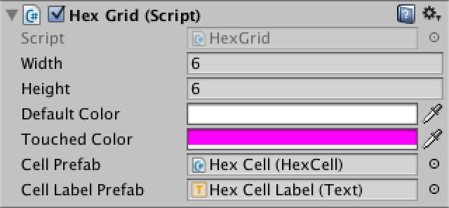 							Cell color choices. 						

Add a public color field to `**HexCell**`.

```
public class HexCell : MonoBehaviour {

	public HexCoordinates coordinates;

	public Color color;
}
```

Assign the default color to it in `**HexGrid**.CreateCell`.

```
	void CreateCell (int x, int z, int i) {
		…
		cell.coordinates = HexCoordinates.FromOffsetCoordinates(x, z);
		cell.color = defaultColor;
		…
	}
```

We also have to add color information to `**HexMesh**`.

```
	List<Color> colors;

	void Awake () {
		…
		vertices = new List<Vector3>();
		colors = new List<Color>();
		…
	}

	public void Triangulate (HexCell[] cells) {
		hexMesh.Clear();
		vertices.Clear();
		colors.Clear();
		…
		hexMesh.vertices = vertices.ToArray();
		hexMesh.colors = colors.ToArray();
		…
	}
```

When triangulating, we must now add color data for each triangle as well. Add a separate method for that purpose.

```
	void Triangulate (HexCell cell) {
		Vector3 center = cell.transform.localPosition;
		for (int i = 0; i < 6; i++) {
			AddTriangle(
				center,
				center + HexMetrics.corners[i],
				center + HexMetrics.corners[i + 1]
			);
			AddTriangleColor(cell.color);
		}
	}

	void AddTriangleColor (Color color) {
		colors.Add(color);
		colors.Add(color);
		colors.Add(color);
	}
```

Back to `**HexGrid**.TouchCell`.  First convert the cell coordinates to the appropriate array index. For a  square grid this would just be X plus Z times the width, but in our  case we have to add the half-Z offset as well. Then grab the cell,  change its color, and triangulate the mesh again.

 							Do we really have to triangulate the entire mesh again? 							 						

```
	public void TouchCell (Vector3 position) {
		position = transform.InverseTransformPoint(position);
		HexCoordinates coordinates = HexCoordinates.FromPosition(position);
		int index = coordinates.X + coordinates.Z * width + coordinates.Z / 2;
		HexCell cell = cells[index];
		cell.color = touchedColor;
		hexMesh.Triangulate(cells);
	}
```

Although we can now color cells, we don't see any visual change  yet. This is because the default shader doesn't use vertex colors. We  have to make our own. Create a new default shader via *Assets / Create / Shader / Default Surface Shader*.  It needs only two changes. First, add color data to its input struct.  Second, multiply the albedo by this color. We only care about the RGB  channels, as our material is opaque.

```
Shader "Custom/VertexColors" {
	Properties {
		_Color ("Color", Color) = (1,1,1,1)
		_MainTex ("Albedo (RGB)", 2D) = "white" {}
		_Glossiness ("Smoothness", Range(0,1)) = 0.5
		_Metallic ("Metallic", Range(0,1)) = 0.0
	}
	SubShader {
		Tags { "RenderType"="Opaque" }
		LOD 200
		
		CGPROGRAM
		#pragma surface surf Standard fullforwardshadows
		#pragma target 3.0

		sampler2D _MainTex;

		struct Input {
			float2 uv_MainTex;
			float4 color : COLOR;
		};

		half _Glossiness;
		half _Metallic;
		fixed4 _Color;

		void surf (Input IN, inout SurfaceOutputStandard o) {
			fixed4 c = tex2D(_MainTex, IN.uv_MainTex) * _Color;
			o.Albedo = c.rgb * IN.color;
			o.Metallic = _Metallic;
			o.Smoothness = _Glossiness;
			o.Alpha = c.a;
		}
		ENDCG
	}
	FallBack "Diffuse"
}
```

Create a new material that uses this shader, then make sure  that the grid mesh uses that material. This will make the cell colors  appear.

 							
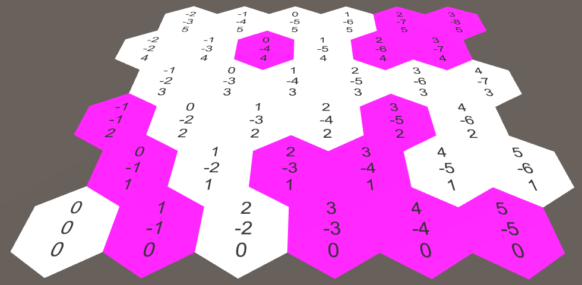 							Colored cells. 						

 							I get weird shadow artifacts! 							 						

unitypackage

## Map Editor

Now that we know how to edit colors, let's upgrade to a simple in-game editor. This functionality is out of the scope of `**HexGrid**`, so change `TouchCell` into a public method with an additional color parameter. Also remove the `touchedColor` field.

```
	public void ColorCell (Vector3 position, Color color) {
		position = transform.InverseTransformPoint(position);
		HexCoordinates coordinates = HexCoordinates.FromPosition(position);
		int index = coordinates.X + coordinates.Z * width + coordinates.Z / 2;
		HexCell cell = cells[index];
		cell.color = color;
		hexMesh.Triangulate(cells);
	}
```

Create a `**HexMapEditor**` component and move the `Update` and `HandleInput`  methods there. Give it a public field to reference a hex grid, an array  of colors, and a private field to keep track of the active color.  Finally, add a public method to select a color and make sure to  initially select the first color.

```
using UnityEngine;

public class HexMapEditor : MonoBehaviour {

	public Color[] colors;

	public HexGrid hexGrid;

	private Color activeColor;

	void Awake () {
		SelectColor(0);
	}

	void Update () {
		if (Input.GetMouseButton(0)) {
			HandleInput();
		}
	}

	void HandleInput () {
		Ray inputRay = Camera.main.ScreenPointToRay(Input.mousePosition);
		RaycastHit hit;
		if (Physics.Raycast(inputRay, out hit)) {
			hexGrid.ColorCell(hit.point, activeColor);
		}
	}

	public void SelectColor (int index) {
		activeColor = colors[index];
	}
}
```

Add another canvas, this time keeping its default settings. Add a `**HexMapEditor**`  component to it, give it a few colors, and connect the hex grid. This  time we do need an event system object, and it has once again been  created automatically.

 						
 						Hex map editor with four colors. 					

Add a panel to the canvas to house the color selectors, via *GameObject / UI / Panel*. Give it a toggle group via *Components / UI/ Toggle Group*. Make it a small panel and put it in a corner of the screen.

 						
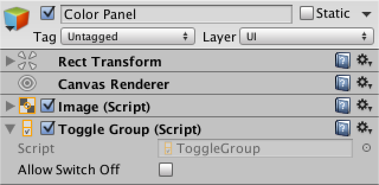 						Color panel with toggle group. 					

Now fill the panel with one toggle per color, via *GameObject / UI / Toggle*. We're not bothering with a fancy UI at this time, just a manual setup that looks good enough.

 						 						 						One toggle per color. 					

Make sure that only the first toggle is on. Also make them all  part of the toggle group, so only one of them will be selected at the  same time. Finally, hook them up to the `SelectColor` method of our editor. You do this via the plus button of the *On Value Changed* event UI. Select the hex map editor object, then select the correct method from the dropdown list.

 						
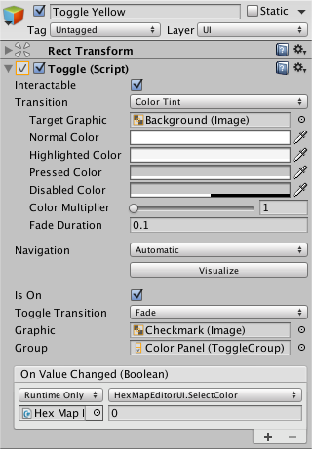 						The first toggle. 					

This event provides a boolean argument which indicated whether  the toggle was switched on or off, each time it changes. But we don't  care about that. Instead, we have to manually provide an integer  argument, which corresponds to the color index that we want to use. So  leave that at 0 for the first toggle, set it to 1 for the second, and so  on.

 						When does the toggle event method get invoked? 						 					

 						
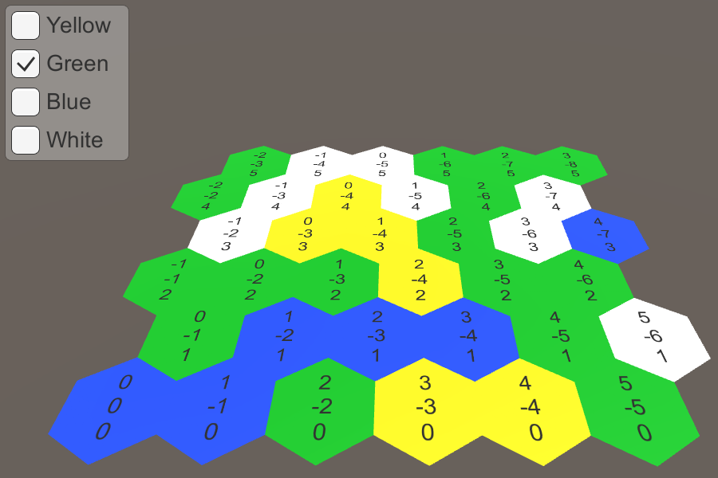 						Painting with multiple colors. 					

While the UI is functional, there is one annoying detail. To see  it, move the panel so it covers the hex grid. When selecting a new  color, you will also paint the cells that are underneath the UI. So  we're interacting with both the UI and the hex grid at the same time.  This is not desirable.

This can be fixed by asking the event system whether it has  detected that the cursor is above some object. As it only knows about UI  objects, this indicates that we're interacting with the UI. So we  should only handle input ourselves when this is not the case.

```
using UnityEngine;
using UnityEngine.EventSystems;
	
	…
	
	void Update () {
		if (
			Input.GetMouseButton(0) &&
			!EventSystem.current.IsPointerOverGameObject()
		) {
			HandleInput();
		}
	}
```

The next tutorial is [Blending Cell Colors](https://catlikecoding.com/unity/tutorials/hex-map/part-2).

unitypackage

PDF
