# Hex Map 3

Elevation

- Add elevation to cells.
- Triangulate slopes.
- Insert terraces.
- Merge terraces and cliffs.

This tutorial is the third part of a series about [hexagon maps](https://catlikecoding.com/unity/tutorials/hex-map/). This time, we'll add support for different elevation levels, and create special transitions between them.

 					
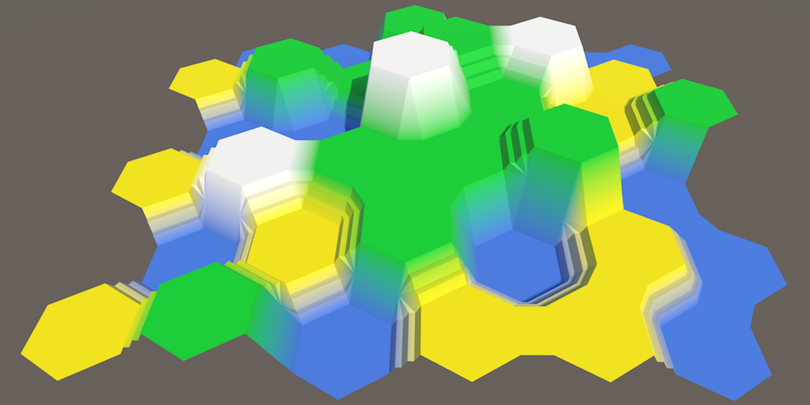 					Elevation and terraces. 				

## Cell Elevation

We have divided our map into discrete cells, to cover a flat  area. Now we'll give each cell its own elevation level as well. We'll  use discrete elevation levels, so store it in an integer field in `**HexCell**`.

```
	public int elevation;
```

How high should each successive elevation step be? We could use any value, so let's define it as another `**HexMetrics**`  constant. I'll use five units per step, which produces very obvious  transitions. For an actual game I'd probably use a smaller step size.

```
	public const float elevationStep = 5f;
```

### Editing Cells

Up to this point we could only edit the color of a cell, but now we can also change its elevation. So the `**HexGrid**.ColorCell`  method is no longer sufficient. Also, we might later add even more  editable options per cell. This requires a new editing approach.

Rename `ColorCell` to `GetCell` and have  it return the cell at a given position instead of settings its color. As  it now no longer changes anything, we should also no longer immediately  triangulate the cells.

```
	public HexCell GetCell (Vector3 position) {
		position = transform.InverseTransformPoint(position);
		HexCoordinates coordinates = HexCoordinates.FromPosition(position);
		int index = coordinates.X + coordinates.Z * width + coordinates.Z / 2;
		return cells[index];
	}
```

Now it is up to the editor to adjust the cell. After that's done, the grid needs to be triangulated again. Add a public `**HexGrid**.Refresh` method to take care of that.

```
	public void Refresh () {
		hexMesh.Triangulate(cells);
	}
```

Change `**HexMapEditor**` so it works with the new methods. Give it a new `EditCell` method that takes care of all the editing of a cell, followed by refreshing the grid.

```
	void HandleInput () {
		Ray inputRay = Camera.main.ScreenPointToRay(Input.mousePosition);
		RaycastHit hit;
		if (Physics.Raycast(inputRay, out hit)) {
			EditCell(hexGrid.GetCell(hit.point));
		}
	}

	void EditCell (HexCell cell) {
		cell.color = activeColor;
		hexGrid.Refresh();
	}
```

We can adjust elevations by simply assigning a chosen elevation level to the cell we're editing.

```
	int activeElevation;

	void EditCell (HexCell cell) {
		cell.color = activeColor;
		cell.elevation = activeElevation;
		hexGrid.Refresh();
	}
```

Just like with colors, we need a method to set the active  elevation level, which we'll link to the UI. We'll use a slider to  select from an elevation range. As sliders work with floats, our method  requires a float parameter. We'll just convert it to an integer.

```
	public void SetElevation (float elevation) {
		activeElevation = (int)elevation;
	}
```

Add a slider to the canvas via *GameObject / Create / Slider*  and place it underneath the color panel. Make it a vertical slider  which goes from bottom to top, so it visually matches elevation levels.  Limit it to whole numbers and give it a reasonable range, like from 0 to  6. Then hook its *On Value Changed* event to the `SetElevation` method of our *Hex Map Editor* object. Make sure to select the method from the dynamic list, so it will be invoked with the slider's value.

 							 							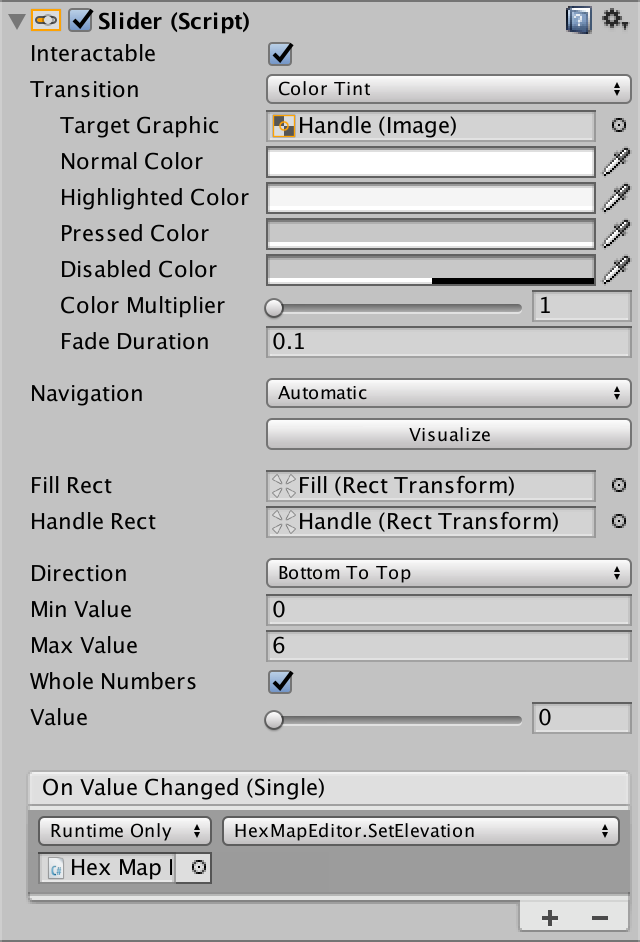 							Elevation slider. 						

### Visualizing Elevation

When editing a cell, we're now setting both its color and its  elevation level. While you can check the inspector to see that  elevations indeed change, the triangulation process still ignores it.

All we need to do is adjust a cell's vertical local position  whenever its elevation changes. To make this convenient, let's make `**HexCell**.elevation` private and add a public `**HexCell**.Elevation` property.

```
	public int Elevation {
		get {
			return elevation;
		}
		set {
			elevation = value;
		}
	}
	
	int elevation;
```

Now we can adjust the cell's vertical position whenever its elevation is edited.

```
		set {
			elevation = value;
			Vector3 position = transform.localPosition;
			position.y = value * HexMetrics.elevationStep;
			transform.localPosition = position;
		}
```

Of course this requires a small adjustment in `**HexMapEditor**.EditCell`.

```
	void EditCell (HexCell cell) {
		cell.color = activeColor;
		cell.Elevation = activeElevation;
		hexGrid.Refresh();
	}
```

 							
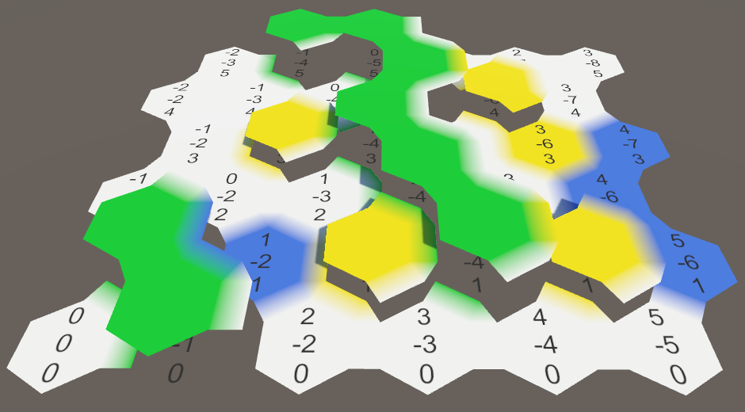 							Cells at different heights. 						

 							Does the mesh collider adjust to match the new elevation? 							 						

The cell elevations are now visible, but there are two  problems. First, the cell labels disappear below elevated cells. Second,  the connections between cells ignore elevation. Let's fix that.

### Repositioning Cell Labels

Currently, the UI labels of the cells are created and  positioned once, and then forgotten. To update their vertical positions,  we have to keep track of them. Let's give each `**HexCell**` a reference to the `RectTransform` of its UI label, so it can be updated later.

```
	public RectTransform uiRect;
```

Assign them at the end of `**HexGrid**.CreateCell`.

```
	void CreateCell (int x, int z, int i) {
		…
		cell.uiRect = label.rectTransform;
	}
```

Now we can expand the `**HexCell**.Elevation`  property to also adjust the position of its cell's UI. Because the hex  grid canvas is rotated, the labels have to be moved in the negative Z  direction, instead of the positive Y direction.

```
		set {
			elevation = value;
			Vector3 position = transform.localPosition;
			position.y = value * HexMetrics.elevationStep;
			transform.localPosition = position;

			Vector3 uiPosition = uiRect.localPosition;
			uiPosition.z = elevation * -HexMetrics.elevationStep;
			uiRect.localPosition = uiPosition;
		}
```

 							
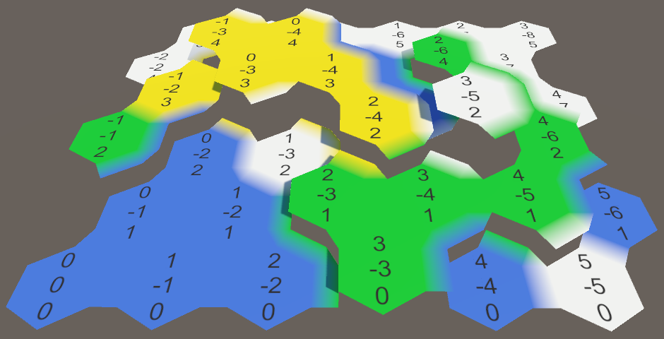 							Elevated labels. 						

### Creating Slopes

Next, we have to convert the flat cell connections into slopes. This is done in `**HexMesh**.TriangulateConnection`. In the case of edge connections, we have to override the height of the other end of the bridge.

```
		Vector3 bridge = HexMetrics.GetBridge(direction);
		Vector3 v3 = v1 + bridge;
		Vector3 v4 = v2 + bridge;
		v3.y = v4.y = neighbor.Elevation * HexMetrics.elevationStep;
```

In the case of corner connections, we have to do the same for the bridge to the next neighbor.

```
		if (direction <= HexDirection.E && nextNeighbor != null) {
			Vector3 v5 = v2 + HexMetrics.GetBridge(direction.Next());
			v5.y = nextNeighbor.Elevation * HexMetrics.elevationStep;
			AddTriangle(v2, v4, v5);
			AddTriangleColor(cell.color, neighbor.color, nextNeighbor.color);
		}
```

 							
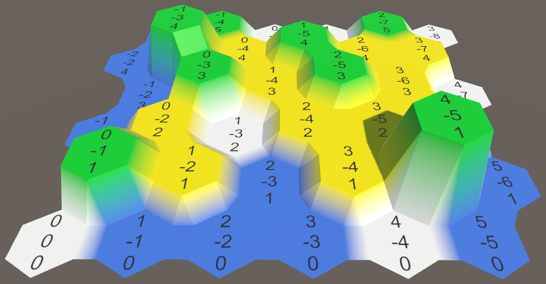 							Elevated connections. 						

We now support cells at different elevations, with correctly  sloping connections between them. But let's not stop here. We're going  make those slopes more interesting.

unitypackage

## Terraced Edge Connections

Straight slopes are not that interesting to look at. We could  split them into multiple steps, by adding terraces. Endless Legend is  one game that does this.

For example, we can insert two terraces per slope. As a result,  one big slope becomes three small slopes, with two flat regions in  between. In order to triangulate this, we'd have to split each  connection into five steps.

 						
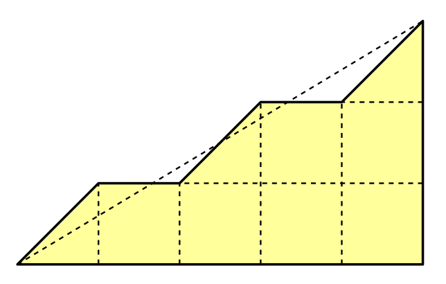 						Two terraces on a slope. 					

We can define the amount of terraces per slope in `**HexMetrics**`, and derive the amount of steps from that.

```
	public const int terracesPerSlope = 2;

	public const int terraceSteps = terracesPerSlope * 2 + 1;
```

Ideally, we could simply interpolate each step along a slope.  This isn't entirely trivial, as the Y coordinate must only change on odd  steps, not even steps. Otherwise we wouldn't get flat terraces. Let's  add a special interpolation method to `**HexMetrics**` to take care of that.

```
	public static Vector3 TerraceLerp (Vector3 a, Vector3 b, int step) {
		return a;
	}
```

The horizontal interpolation is straightforward, if we know what the interpolation step size is.

```
	public const float horizontalTerraceStepSize = 1f / terraceSteps;
	
	public static Vector3 TerraceLerp (Vector3 a, Vector3 b, int step) {
		float h = step * HexMetrics.horizontalTerraceStepSize;
		a.x += (b.x - a.x) * h;
		a.z += (b.z - a.z) * h;
		return a;
	}
```

 						How does interpolation between two values work? 						 					

To only adjust Y on odd steps, we can use step+12

. If we use an integer division, it will convert the sequence 1, 2, 3, 4 into 1, 1, 2, 2.

```
	public const float verticalTerraceStepSize = 1f / (terracesPerSlope + 1);
	
	public static Vector3 TerraceLerp (Vector3 a, Vector3 b, int step) {
		float h = step * HexMetrics.horizontalTerraceStepSize;
		a.x += (b.x - a.x) * h;
		a.z += (b.z - a.z) * h;
		float v = ((step + 1) / 2) * HexMetrics.verticalTerraceStepSize;
		a.y += (b.y - a.y) * v;
		return a;
	}
```

Let's add a terrace interpolation method for colors as well. Just interpolate as if the connection is flat.

```
	public static Color TerraceLerp (Color a, Color b, int step) {
		float h = step * HexMetrics.horizontalTerraceStepSize;
		return Color.Lerp(a, b, h);
	}
```

### Triangulation

As triangulating an edge connection will become more complex, extract the relevant code from `**HexMesh**.TriangulateConnection` and put it in a separate method. I'll keep the original code in comments as well, for later reference.

```
	void TriangulateConnection (
		HexDirection direction, HexCell cell, Vector3 v1, Vector3 v2
	) {
		…
		Vector3 bridge = HexMetrics.GetBridge(direction);
		Vector3 v3 = v1 + bridge;
		Vector3 v4 = v2 + bridge;
		v3.y = v4.y = neighbor.Elevation * HexMetrics.elevationStep;

		TriangulateEdgeTerraces(v1, v2, cell, v3, v4, neighbor);
//		AddQuad(v1, v2, v3, v4);
//		AddQuadColor(cell.color, neighbor.color);
		…
	}

	void TriangulateEdgeTerraces (
		Vector3 beginLeft, Vector3 beginRight, HexCell beginCell,
		Vector3 endLeft, Vector3 endRight, HexCell endCell
	) {
		AddQuad(beginLeft, beginRight, endLeft, endRight);
		AddQuadColor(beginCell.color, endCell.color);
	}
```

Let's begin with just the first step of the process. Use our  special interpolation methods to create the first quad. This should  produce a short slope that's steeper that the original slope.

```
	void TriangulateEdgeTerraces (
		Vector3 beginLeft, Vector3 beginRight, HexCell beginCell,
		Vector3 endLeft, Vector3 endRight, HexCell endCell
	) {
		Vector3 v3 = HexMetrics.TerraceLerp(beginLeft, endLeft, 1);
		Vector3 v4 = HexMetrics.TerraceLerp(beginRight, endRight, 1);
		Color c2 = HexMetrics.TerraceLerp(beginCell.color, endCell.color, 1);

		AddQuad(beginLeft, beginRight, v3, v4);
		AddQuadColor(beginCell.color, c2);
	}
```

 							
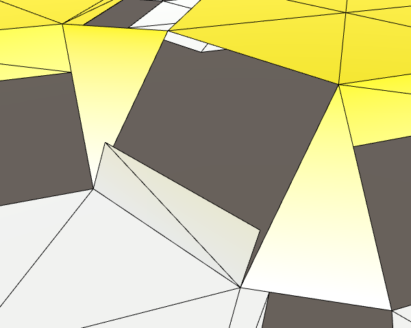 							The first terrace step. 						

Now immediately jump to the last step, skipping everything in  between. This will complete our edge connection, although not yet in the  correct shape.

```
		AddQuad(beginLeft, beginRight, v3, v4);
		AddQuadColor(beginCell.color, c2);

		AddQuad(v3, v4, endLeft, endRight);
		AddQuadColor(c2, endCell.color);
```

 							
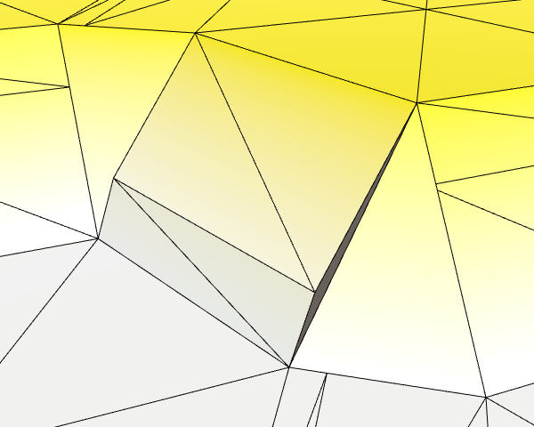 							The last terrace step. 						

The intermediate steps can be added with a loop. Each step, the  previous last two vertices become the new first two. The same goes for  the color. Then the new vectors and colors are computed, and another  quad is added.

```
		AddQuad(beginLeft, beginRight, v3, v4);
		AddQuadColor(beginCell.color, c2);

		for (int i = 2; i < HexMetrics.terraceSteps; i++) {
			Vector3 v1 = v3;
			Vector3 v2 = v4;
			Color c1 = c2;
			v3 = HexMetrics.TerraceLerp(beginLeft, endLeft, i);
			v4 = HexMetrics.TerraceLerp(beginRight, endRight, i);
			c2 = HexMetrics.TerraceLerp(beginCell.color, endCell.color, i);
			AddQuad(v1, v2, v3, v4);
			AddQuadColor(c1, c2);
		}

		AddQuad(v3, v4, endLeft, endRight);
		AddQuadColor(c2, endCell.color);
```

 							
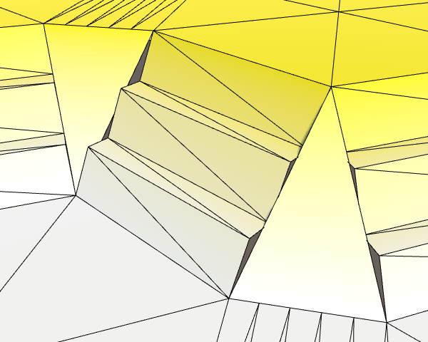 							All steps in between. 						

Now all edge connections have two terraces, or however many you choose to set `**HexMetrics**.terracesPerSlope` to. Of course we haven't terraced the corner connections yet. We'll leave that for later.

 							
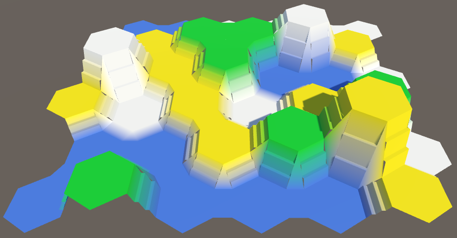 							All edge connections are terraced. 						

unitypackage

## Connection Types

Converting all edge connections into terraces might not be such a  good idea. It looks fine when the elevation difference is just one  level. But larger differences produce narrow terraces with big jumps  between them, which doesn't look that great. Also, flat connections  don't need to be terraced at all.

Let's formalize this and define three edge types. Flat, slope, and cliff. Create a new enumeration for this.

```
public enum HexEdgeType {
	Flat, Slope, Cliff
}
```

How do we determine what kind of connection we're dealing with? We can add a method to `**HexMetrics**` to derive that, based on two elevation levels.

```
	public static HexEdgeType GetEdgeType (int elevation1, int elevation2) {
	}
```

If the elevations are the same, we have a flat edge.

```
	public static HexEdgeType GetEdgeType (int elevation1, int elevation2) {
		if (elevation1 == elevation2) {
			return HexEdgeType.Flat;
		}
	}
```

If the level difference is exactly one step, then we have a  slope. It doesn't matter whether the slope goes up or down. And in all  other cases we have a cliff.

```
	public static HexEdgeType GetEdgeType (int elevation1, int elevation2) {
		if (elevation1 == elevation2) {
			return HexEdgeType.Flat;
		}
		int delta = elevation2 - elevation1;
		if (delta == 1 || delta == -1) {
			return HexEdgeType.Slope;
		}
		return HexEdgeType.Cliff;
	}
```

Let's also add a convenient `**HexCell**.GetEdgeType` method to get a cell's edge type in a certain direction.

```
	public HexEdgeType GetEdgeType (HexDirection direction) {
		return HexMetrics.GetEdgeType(
			elevation, neighbors[(int)direction].elevation
		);
	}
```

 						Shouldn't we check whether a neighbor actually exist in that direction? 						 					

### Limiting Terraces to Slopes

Now that we can determine the type of connection that we're  dealing with, we can decide whether to insert terraces or not. Adjust `**HexMesh**.TriangulateConnection` so it only creates terraces for slopes.

```
		if (cell.GetEdgeType(direction) == HexEdgeType.Slope) {
			TriangulateEdgeTerraces(v1, v2, cell, v3, v4, neighbor);
		}
//		AddQuad(v1, v2, v3, v4);
//		AddQuadColor(cell.color, neighbor.color);
```

At this point we can reactivate the code that we previously commented out, to take care of the flats and cliffs.

```
		if (cell.GetEdgeType(direction) == HexEdgeType.Slope) {
			TriangulateEdgeTerraces(v1, v2, cell, v3, v4, neighbor);
		}
		else {
			AddQuad(v1, v2, v3, v4);
			AddQuadColor(cell.color, neighbor.color);
		}
```

 							
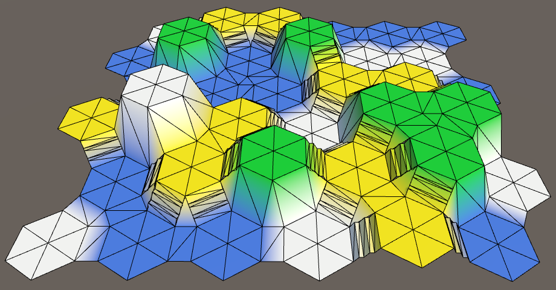 							Only slopes are terraced. 						

unitypackage

## Terraced Corner Connections

Corner connections are more complex than edge connections,  because they involve three cells instead of just two. Each corner is  connected to three edges, which could be flats, slopes, or cliffs. So  there are many possible configurations. Just as for edge connections, we  better add a new triangulation method to `**HexMesh**`.

Our new method needs the corner triangle's vertices and the  connected cells. To keep things manageable, let's order the connections  so we know which cell has the lowest elevation. Then we can work from  the bottom to the left and right.

 						
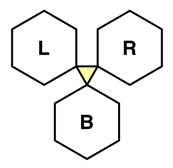 						Corner connection. 					

```
	void TriangulateCorner (
		Vector3 bottom, HexCell bottomCell,
		Vector3 left, HexCell leftCell,
		Vector3 right, HexCell rightCell
	) {
		AddTriangle(bottom, left, right);
		AddTriangleColor(bottomCell.color, leftCell.color, rightCell.color);
	}
```

Now `TriangulateConnection` has to figure out what  the lowest cell is. First, check whether the cell being triangulated is  lower than its neighbors, or tied for lowest. If this is the case, we  can use it as the bottom cell.

```
	void TriangulateConnection (
		HexDirection direction, HexCell cell, Vector3 v1, Vector3 v2
	) {
		…
		
		HexCell nextNeighbor = cell.GetNeighbor(direction.Next());
		if (direction <= HexDirection.E && nextNeighbor != null) {
			Vector3 v5 = v2 + HexMetrics.GetBridge(direction.Next());
			v5.y = nextNeighbor.Elevation * HexMetrics.elevationStep;
			
			if (cell.Elevation <= neighbor.Elevation) {
				if (cell.Elevation <= nextNeighbor.Elevation) {
					TriangulateCorner(v2, cell, v4, neighbor, v5, nextNeighbor);
				}
			}
		}
	}
```

If the innermost check fails, it means that the next neighbor is  the lowest cell. We have to rotate the triangle counterclockwise to  keep it correctly oriented.

```
			if (cell.Elevation <= neighbor.Elevation) {
				if (cell.Elevation <= nextNeighbor.Elevation) {
					TriangulateCorner(v2, cell, v4, neighbor, v5, nextNeighbor);
				}
				else {
					TriangulateCorner(v5, nextNeighbor, v2, cell, v4, neighbor);
				}
			}
```

If the first check already failed, it becomes a contest between  the two neighboring cells. If the edge neighbor is the lowest, then we  have to rotate clockwise, otherwise counterclockwise.

```
			if (cell.Elevation <= neighbor.Elevation) {
				if (cell.Elevation <= nextNeighbor.Elevation) {
					TriangulateCorner(v2, cell, v4, neighbor, v5, nextNeighbor);
				}
				else {
					TriangulateCorner(v5, nextNeighbor, v2, cell, v4, neighbor);
				}
			}
			else if (neighbor.Elevation <= nextNeighbor.Elevation) {
				TriangulateCorner(v4, neighbor, v5, nextNeighbor, v2, cell);
			}
			else {
				TriangulateCorner(v5, nextNeighbor, v2, cell, v4, neighbor);
			}
```

 						
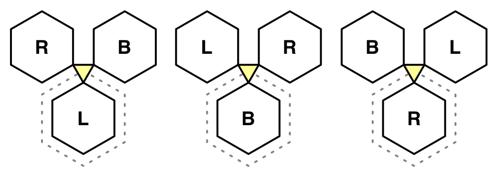 						Counterclockwise, no, and clockwise rotation. 					

### Slope Triangulation

To know how to triangulate a corner, we have to know what edge  types we're dealing with. To facilitate this, let's add another  convenience method to `**HexCell**` for determining the slope between any two cells.

```
	public HexEdgeType GetEdgeType (HexCell otherCell) {
		return HexMetrics.GetEdgeType(
			elevation, otherCell.elevation
		);
	}
```

Use this new method in `**HexMesh**.TriangulateCorner` to determine the types of the left and right edges.

```
	void TriangulateCorner (
		Vector3 bottom, HexCell bottomCell,
		Vector3 left, HexCell leftCell,
		Vector3 right, HexCell rightCell
	) {
		HexEdgeType leftEdgeType = bottomCell.GetEdgeType(leftCell);
		HexEdgeType rightEdgeType = bottomCell.GetEdgeType(rightCell);

		AddTriangle(bottom, left, right);
		AddTriangleColor(bottomCell.color, leftCell.color, rightCell.color);
	}
```

If both edges are slopes, then we have terraces on both the  left and the right side. Also, because the bottom cell is the lowest, we  know that those slopes go up. Furthermore, this means that the left and  right cell have the same elevation, so the top edge connection is flat.  We can identify this case as slope-slope-flat, or SSF for short.

 							
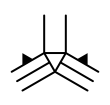 							Two slopes and a flat, SSF 						

Check whether we are in this situation, and if so invoke a new method, `TriangulateCornerTerraces`. After that, return from the method. Put this check before the old triangulation code, so it will replace the default triangle.

```
	void TriangulateCorner (
		Vector3 bottom, HexCell bottomCell,
		Vector3 left, HexCell leftCell,
		Vector3 right, HexCell rightCell
	) {
		HexEdgeType leftEdgeType = bottomCell.GetEdgeType(leftCell);
		HexEdgeType rightEdgeType = bottomCell.GetEdgeType(rightCell);

		if (leftEdgeType == HexEdgeType.Slope) {
			if (rightEdgeType == HexEdgeType.Slope) {
				TriangulateCornerTerraces(
					bottom, bottomCell, left, leftCell, right, rightCell
				);
				return;
			}
		}

		AddTriangle(bottom, left, right);
		AddTriangleColor(bottomCell.color, leftCell.color, rightCell.color);
	}
	
	void TriangulateCornerTerraces (
		Vector3 begin, HexCell beginCell,
		Vector3 left, HexCell leftCell,
		Vector3 right, HexCell rightCell
	) {
		
	}
```

As long as we're not doing anything inside `TriangulateCornerTerraces`,  some dual-slope corner connections will become holes. Whether one  becomes a hole or not depends on which cell ends up as the bottom cell.

 							
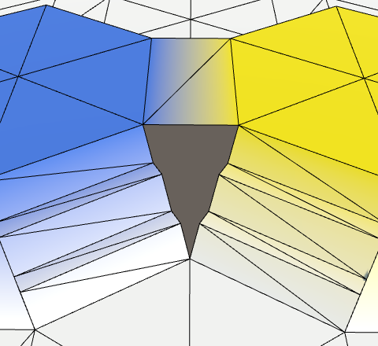 							A hole appears. 						

To fill the hole, we have to connect the left and right  terraces across the gap. The approach is the same as for edge  connections, but inside a triple-color triangle instead of a dual-color  quad. Let's again start with just the first step, which is now a  triangle.

```
	void TriangulateCornerTerraces (
		Vector3 begin, HexCell beginCell,
		Vector3 left, HexCell leftCell,
		Vector3 right, HexCell rightCell
	) {
		Vector3 v3 = HexMetrics.TerraceLerp(begin, left, 1);
		Vector3 v4 = HexMetrics.TerraceLerp(begin, right, 1);
		Color c3 = HexMetrics.TerraceLerp(beginCell.color, leftCell.color, 1);
		Color c4 = HexMetrics.TerraceLerp(beginCell.color, rightCell.color, 1);

		AddTriangle(begin, v3, v4);
		AddTriangleColor(beginCell.color, c3, c4);
	}
```

 							
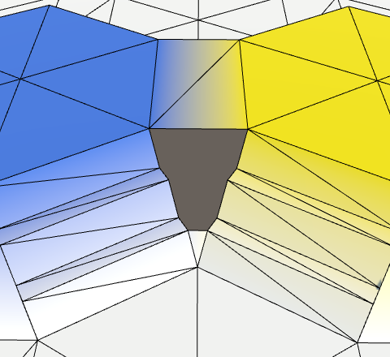 							First triangular step. 						

Again, jump directly to the last step. It's a quad, which forms  a trapezoid. The only difference with edge connections is that we're  dealing with four different colors here, instead of just two.

```
		AddTriangle(begin, v3, v4);
		AddTriangleColor(beginCell.color, c3, c4);

		AddQuad(v3, v4, left, right);
		AddQuadColor(c3, c4, leftCell.color, rightCell.color);
```

 							
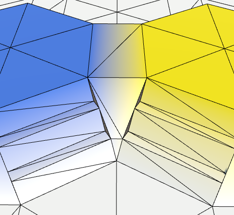 							Last quad step. 						

All the steps in between are all quads as well.

```
		AddTriangle(begin, v3, v4);
		AddTriangleColor(beginCell.color, c3, c4);

		for (int i = 2; i < HexMetrics.terraceSteps; i++) {
			Vector3 v1 = v3;
			Vector3 v2 = v4;
			Color c1 = c3;
			Color c2 = c4;
			v3 = HexMetrics.TerraceLerp(begin, left, i);
			v4 = HexMetrics.TerraceLerp(begin, right, i);
			c3 = HexMetrics.TerraceLerp(beginCell.color, leftCell.color, i);
			c4 = HexMetrics.TerraceLerp(beginCell.color, rightCell.color, i);
			AddQuad(v1, v2, v3, v4);
			AddQuadColor(c1, c2, c3, c4);
		}

		AddQuad(v3, v4, left, right);
		AddQuadColor(c3, c4, leftCell.color, rightCell.color);
```

 							
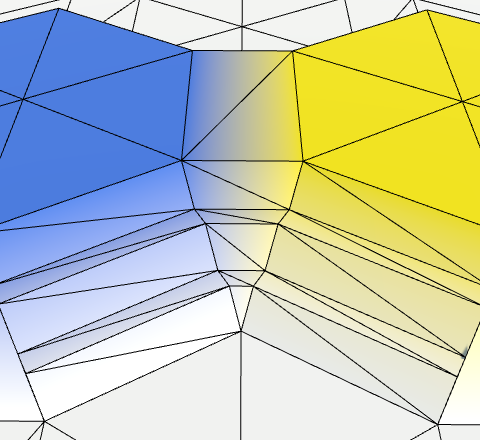 							All steps. 						

### Dual-slope Variants

The dual-slope case has two variants with different  orientations, depending on which cell ended up as the bottom one. We can  find them by checking for the left-right combinations slope-flat, and  flat-slope.

 							
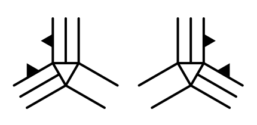 							SFS and FSS. 						

If the right edge is flat, then we have to begin terracing from  the left instead of the bottom. If the left edge is flat, then we have  to begin from the right.

```
		if (leftEdgeType == HexEdgeType.Slope) {
			if (rightEdgeType == HexEdgeType.Slope) {
				TriangulateCornerTerraces(
					bottom, bottomCell, left, leftCell, right, rightCell
				);
				return;
			}
			if (rightEdgeType == HexEdgeType.Flat) {
				TriangulateCornerTerraces(
					left, leftCell, right, rightCell, bottom, bottomCell
				);
				return;
			}
		}
		if (rightEdgeType == HexEdgeType.Slope) {
			if (leftEdgeType == HexEdgeType.Flat) {
				TriangulateCornerTerraces(
					right, rightCell, bottom, bottomCell, left, leftCell
				);
				return;
			}
		}
```

This will make our terraces flow around cells without interruptions, until they encounter a cliff or the end of the map.

 							
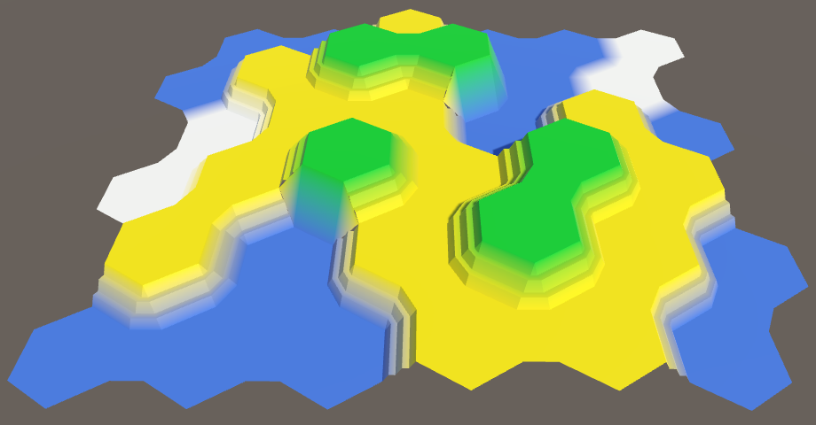 							Continuous terraces. 						

unitypackage

## Merging Slopes and Cliffs

So what about when a slope meets a cliff? If we know that the  left edge is a slope and the right edge is a cliff, what will the top  edge be? It cannot be flat, but it could be either a slope or a cliff.

 						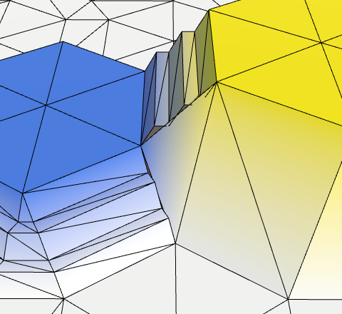 						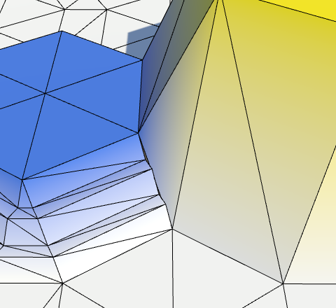 						 						SCS and SCC. 					

Let's add a new method to take care of both slope-cliff cases at once.

```
	void TriangulateCornerTerracesCliff (
		Vector3 begin, HexCell beginCell,
		Vector3 left, HexCell leftCell,
		Vector3 right, HexCell rightCell
	) {
		
	}
```

It has to be invoked as the final option in `TriangulateCorner` when the left edge is a slope.

```
		if (leftEdgeType == HexEdgeType.Slope) {
			if (rightEdgeType == HexEdgeType.Slope) {
				TriangulateCornerTerraces(
					bottom, bottomCell, left, leftCell, right, rightCell
				);
				return;
			}
			if (rightEdgeType == HexEdgeType.Flat) {
				TriangulateCornerTerraces(
					left, leftCell, right, rightCell, bottom, bottomCell
				);
				return;
			}
			TriangulateCornerTerracesCliff(
				bottom, bottomCell, left, leftCell, right, rightCell
			);
			return;
		}
		if (rightEdgeType == HexEdgeType.Slope) {
			if (leftEdgeType == HexEdgeType.Flat) {
				TriangulateCornerTerraces(
					right, rightCell, bottom, bottomCell, left, leftCell
				);
				return;
			}
		}
```

So how do we triangulate this? This problem can be split in two parts, the bottom and the top.

### The Bottom Part

The bottom part has terraces on the left, and a cliff on the  right. We have to merge them somehow. A simple way to do that is by  collapsing the terraces so they meet in the right corner. This would  taper the terraces upward.

 							
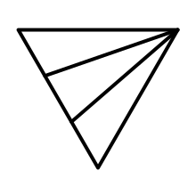 							Collapsing terraces. 						

But we don't actually want to let them meet in the right  corner, because that will interfere with the terraces that might exist  at the top. Also, we could be dealing with a very high cliff, which  would result in very steep and thin triangles. Instead, we collapse them  to a boundary point that lies along the cliff.

 							
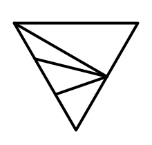 							Collapsing at boundary. 						

Let's place this boundary point one elevation level above the  bottom cell. We can find it by interpolating based on the elevation  difference.

```
	void TriangulateCornerTerracesCliff (
		Vector3 begin, HexCell beginCell,
		Vector3 left, HexCell leftCell,
		Vector3 right, HexCell rightCell
	) {
		float b = 1f / (rightCell.Elevation - beginCell.Elevation);
		Vector3 boundary = Vector3.Lerp(begin, right, b);
		Color boundaryColor = Color.Lerp(beginCell.color, rightCell.color, b);
	}
```

To see if we got it right, cover the entire bottom part with a single triangle.

```
		float b = 1f / (rightCell.Elevation - beginCell.Elevation);
		Vector3 boundary = Vector3.Lerp(begin, right, b);
		Color boundaryColor = Color.Lerp(beginCell.color, rightCell.color, b);

		AddTriangle(begin, left, boundary);
		AddTriangleColor(beginCell.color, leftCell.color, boundaryColor);
```

 							
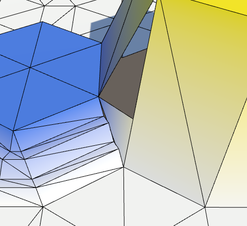 							Lower triangle. 						

With the boundary in the right place, we can move on to  triangulating the terraces. Once again, let's begin with just the first  step.

```
		float b = 1f / (rightCell.Elevation - beginCell.Elevation);
		Vector3 boundary = Vector3.Lerp(begin, right, b);
		Color boundaryColor = Color.Lerp(beginCell.color, rightCell.color, b);

		Vector3 v2 = HexMetrics.TerraceLerp(begin, left, 1);
		Color c2 = HexMetrics.TerraceLerp(beginCell.color, leftCell.color, 1);

		AddTriangle(begin, v2, boundary);
		AddTriangleColor(beginCell.color, c2, boundaryColor);
```

 							
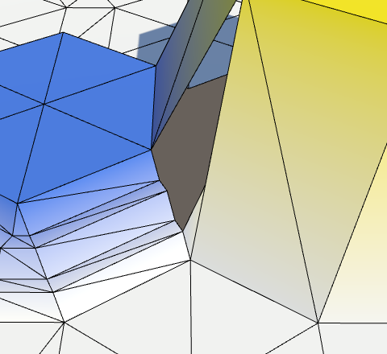 							First collapsing step. 						

This time, the last step is also a triangle.

```
		AddTriangle(begin, v2, boundary);
		AddTriangleColor(beginCell.color, c2, boundaryColor);

		AddTriangle(v2, left, boundary);
		AddTriangleColor(c2, leftCell.color, boundaryColor);
```

 							
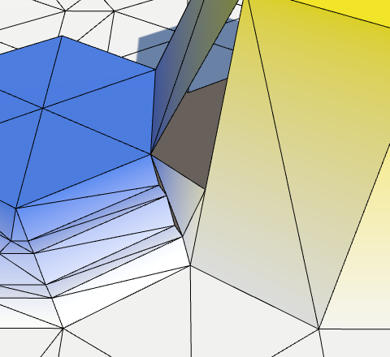 							Last collapsing step. 						

And all the steps in between are triangles as well.

```
		AddTriangle(begin, v2, boundary);
		AddTriangleColor(beginCell.color, c2, boundaryColor);

		for (int i = 2; i < HexMetrics.terraceSteps; i++) {
			Vector3 v1 = v2;
			Color c1 = c2;
			v2 = HexMetrics.TerraceLerp(begin, left, i);
			c2 = HexMetrics.TerraceLerp(beginCell.color, leftCell.color, i);
			AddTriangle(v1, v2, boundary);
			AddTriangleColor(c1, c2, boundaryColor);
		}

		AddTriangle(v2, left, boundary);
		AddTriangleColor(c2, leftCell.color, boundaryColor);
```

 							
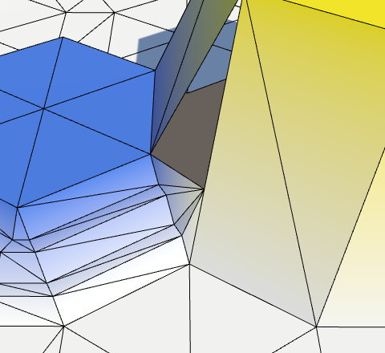 							Collapsed terraces. 						

 							Can't we keep the terraces level? 							 						

### Completing the Corner

With the bottom part completed, we can look at the top part. If  the top edge is a slope, we again need to connect terraces and a cliff.  So let's move that code to its own method.

```
	void TriangulateCornerTerracesCliff (
		Vector3 begin, HexCell beginCell,
		Vector3 left, HexCell leftCell,
		Vector3 right, HexCell rightCell
	) {
		float b = 1f / (rightCell.Elevation - beginCell.Elevation);
		Vector3 boundary = Vector3.Lerp(begin, right, b);
		Color boundaryColor = Color.Lerp(beginCell.color, rightCell.color, b);

		TriangulateBoundaryTriangle(
			begin, beginCell, left, leftCell, boundary, boundaryColor
		);
	}

	void TriangulateBoundaryTriangle (
		Vector3 begin, HexCell beginCell,
		Vector3 left, HexCell leftCell,
		Vector3 boundary, Color boundaryColor
	) {
		Vector3 v2 = HexMetrics.TerraceLerp(begin, left, 1);
		Color c2 = HexMetrics.TerraceLerp(beginCell.color, leftCell.color, 1);

		AddTriangle(begin, v2, boundary);
		AddTriangleColor(beginCell.color, c2, boundaryColor);

		for (int i = 2; i < HexMetrics.terraceSteps; i++) {
			Vector3 v1 = v2;
			Color c1 = c2;
			v2 = HexMetrics.TerraceLerp(begin, left, i);
			c2 = HexMetrics.TerraceLerp(beginCell.color, leftCell.color, i);
			AddTriangle(v1, v2, boundary);
			AddTriangleColor(c1, c2, boundaryColor);
		}

		AddTriangle(v2, left, boundary);
		AddTriangleColor(c2, leftCell.color, boundaryColor);
	}
```

Now completion of the top part is simple. If we have a  slope,  add a rotated boundary triangle. Otherwise a simple triangle suffices.

```
	void TriangulateCornerTerracesCliff (
		Vector3 begin, HexCell beginCell,
		Vector3 left, HexCell leftCell,
		Vector3 right, HexCell rightCell
	) {
		float b = 1f / (rightCell.Elevation - beginCell.Elevation);
		Vector3 boundary = Vector3.Lerp(begin, right, b);
		Color boundaryColor = Color.Lerp(beginCell.color, rightCell.color, b);
		
		TriangulateBoundaryTriangle(
			begin, beginCell, left, leftCell, boundary, boundaryColor
		);

		if (leftCell.GetEdgeType(rightCell) == HexEdgeType.Slope) {
			TriangulateBoundaryTriangle(
				left, leftCell, right, rightCell, boundary, boundaryColor
			);
		}
		else {
			AddTriangle(left, right, boundary);
			AddTriangleColor(leftCell.color, rightCell.color, boundaryColor);
		}
	}
```

 							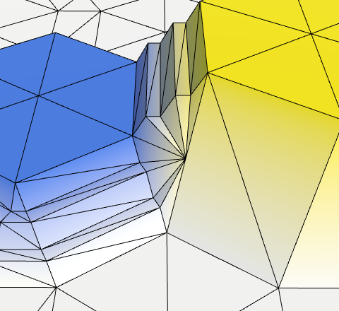 							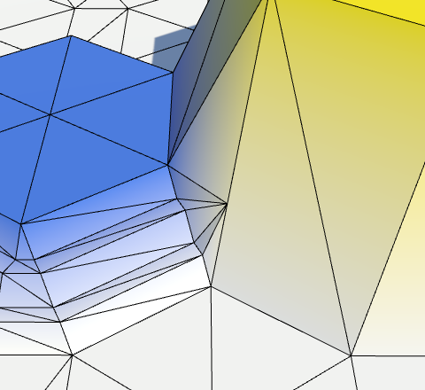 							Complete triangulation of both parts. 						

### The Mirror Cases

We have covered the slope-cliff cases. There are also two mirror cases, which have their cliff on the left.

 							
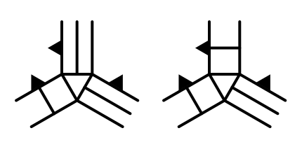 							CSS and CSC. 						

The approach is the same as before, with some small differences due to orientation. Copy `TriangulateCornerTerracesCliff` and adjust accordingly. I've marked only the differences.

```
	void TriangulateCornerCliffTerraces (
		Vector3 begin, HexCell beginCell,
		Vector3 left, HexCell leftCell,
		Vector3 right, HexCell rightCell
	) {
		float b = 1f / (leftCell.Elevation - beginCell.Elevation);
		Vector3 boundary = Vector3.Lerp(begin, left, b);
		Color boundaryColor = Color.Lerp(beginCell.color, leftCell.color, b);

		TriangulateBoundaryTriangle(
			right, rightCell, begin, beginCell, boundary, boundaryColor
		);

		if (leftCell.GetEdgeType(rightCell) == HexEdgeType.Slope) {
			TriangulateBoundaryTriangle(
				left, leftCell, right, rightCell, boundary, boundaryColor
			);
		}
		else {
			AddTriangle(left, right, boundary);
			AddTriangleColor(leftCell.color, rightCell.color, boundaryColor);
		}
	}
```

Include these cases in `TriangulateCorner`.

```
		if (leftEdgeType == HexEdgeType.Slope) {
			…
		}
		if (rightEdgeType == HexEdgeType.Slope) {
			if (leftEdgeType == HexEdgeType.Flat) {
				TriangulateCornerTerraces(
					right, rightCell, bottom, bottomCell, left, leftCell
				);
				return;
			}
			TriangulateCornerCliffTerraces(
				bottom, bottomCell, left, leftCell, right, rightCell
			);
			return;
		}
```

 							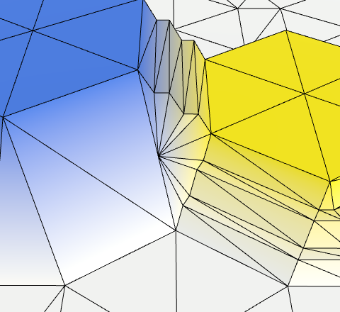 							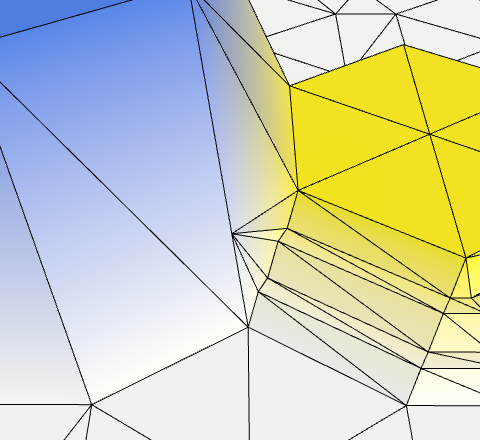 							CSS and CSC triangulated. 						

### Double Cliffs

The only remaining non-flat cases are those where the bottom  cell has cliffs on both sides. This leaves all options open for the top  edge. It could be either flat, a slope, or a cliff. We're only  interested in the cliff-cliff-slope case, as it is the only one with  terraces.

Actually, there are two different cliff-cliff-slope versions,  depending on which side is higher. They mirror each other. Let's  identify them as CCSR and CCSL.

 							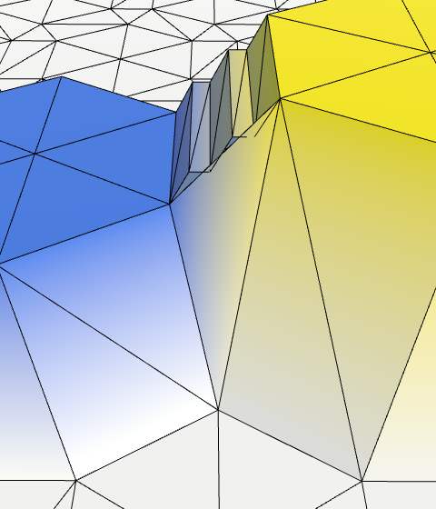 							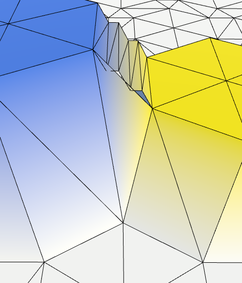 							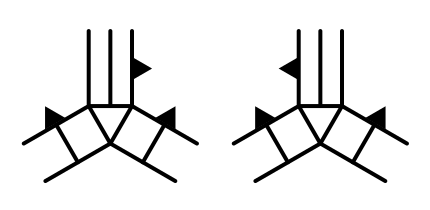 							CCSR and CCSL. 						

We can cover both cases in `TriangulateCorner` by invoking our `TriangulateCornerCliffTerraces` and `TriangulateCornerTerracesCliff` methods with different cell rotations.

```
		if (leftEdgeType == HexEdgeType.Slope) {
			…
		}
		if (rightEdgeType == HexEdgeType.Slope) {
			…
		}
		if (leftCell.GetEdgeType(rightCell) == HexEdgeType.Slope) {
			if (leftCell.Elevation < rightCell.Elevation) {
				TriangulateCornerCliffTerraces(
					right, rightCell, bottom, bottomCell, left, leftCell
				);
			}
			else {
				TriangulateCornerTerracesCliff(
					left, leftCell, right, rightCell, bottom, bottomCell
				);
			}
			return;
		}
```

However, this will produce a weird triangulation. This happens  because we're now triangulating from top to bottom. This causes our  boundary interpolators to be negative, which is incorrect. The solution  is to make sure that the interpolators are always positive.

```
	void TriangulateCornerTerracesCliff (
		Vector3 begin, HexCell beginCell,
		Vector3 left, HexCell leftCell,
		Vector3 right, HexCell rightCell
	) {
		float b = 1f / (rightCell.Elevation - beginCell.Elevation);
		if (b < 0) {
			b = -b;
		}
		…
	}

	void TriangulateCornerCliffTerraces (
		Vector3 begin, HexCell beginCell,
		Vector3 left, HexCell leftCell,
		Vector3 right, HexCell rightCell
	) {
		float b = 1f / (leftCell.Elevation - beginCell.Elevation);
		if (b < 0) {
			b = -b;
		}
		…
	}
```

 							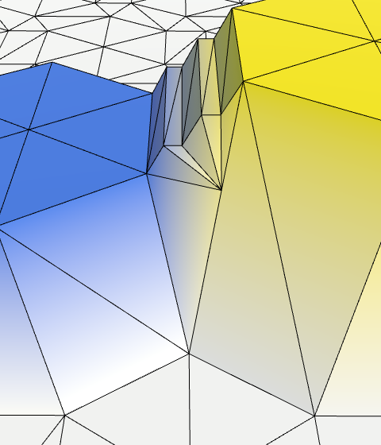 							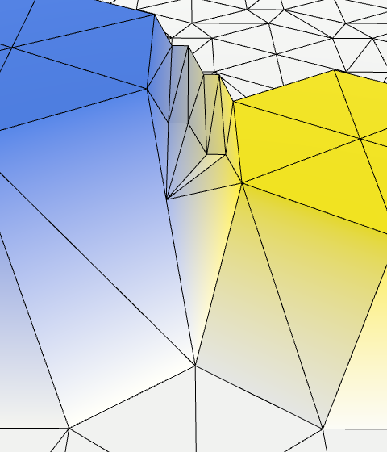 							CCSR and CCSL triangulated. 						

### Cleanup

We have now covered all cases that needed special treatment to make sure that the terraces are correctly triangulated.

 							
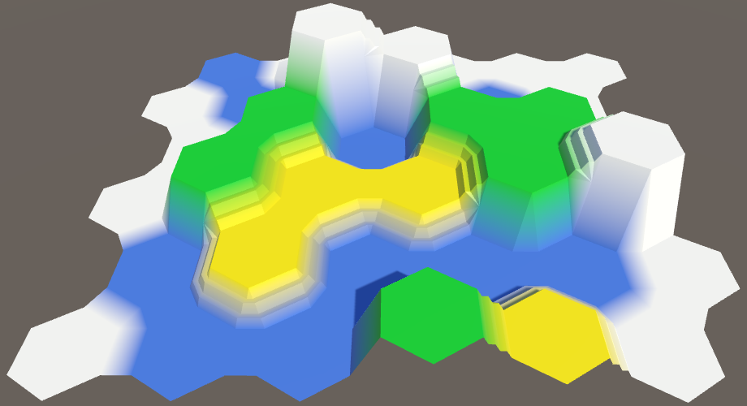 							Complete triangulation with terraces. 						

We can clean `TriangulateCorner` a little by getting rid of the `**return**` statements and using `**else**` blocks instead.

```
	void TriangulateCorner (
		Vector3 bottom, HexCell bottomCell,
		Vector3 left, HexCell leftCell,
		Vector3 right, HexCell rightCell
	) {
		HexEdgeType leftEdgeType = bottomCell.GetEdgeType(leftCell);
		HexEdgeType rightEdgeType = bottomCell.GetEdgeType(rightCell);

		if (leftEdgeType == HexEdgeType.Slope) {
			if (rightEdgeType == HexEdgeType.Slope) {
				TriangulateCornerTerraces(
					bottom, bottomCell, left, leftCell, right, rightCell
				);
			}
			else if (rightEdgeType == HexEdgeType.Flat) {
				TriangulateCornerTerraces(
					left, leftCell, right, rightCell, bottom, bottomCell
				);
			}
			else {
				TriangulateCornerTerracesCliff(
					bottom, bottomCell, left, leftCell, right, rightCell
				);
			}
		}
		else if (rightEdgeType == HexEdgeType.Slope) {
			if (leftEdgeType == HexEdgeType.Flat) {
				TriangulateCornerTerraces(
					right, rightCell, bottom, bottomCell, left, leftCell
				);
			}
			else {
				TriangulateCornerCliffTerraces(
					bottom, bottomCell, left, leftCell, right, rightCell
				);
			}
		}
		else if (leftCell.GetEdgeType(rightCell) == HexEdgeType.Slope) {
			if (leftCell.Elevation < rightCell.Elevation) {
				TriangulateCornerCliffTerraces(
					right, rightCell, bottom, bottomCell, left, leftCell
				);
			}
			else {
				TriangulateCornerTerracesCliff(
					left, leftCell, right, rightCell, bottom, bottomCell
				);
			}
		}
		else {
			AddTriangle(bottom, left, right);
			AddTriangleColor(bottomCell.color, leftCell.color, rightCell.color);
		}
	}
```

The final `**else**` block covers  all remaining cases that we haven't covered yet. Those cases are FFF,  CCF, CCCR, and CCCL. They are all covered with a single triangle.

 							
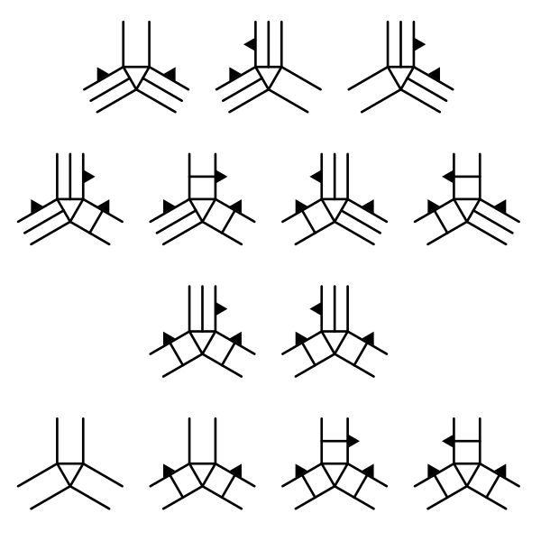 							All distinct cases. 						

The next tutorial is [Irregularity](https://catlikecoding.com/unity/tutorials/hex-map/part-4/).

unitypackage

PDF
