# Hex Map 20

Fog of War

- Store cell data in a texture.
- Change terrain types without triangulating.
- Keep track of visibility.
- Darken everything that is not visible.

This is part 20 of a tutorial series about [hexagon maps](https://catlikecoding.com/unity/tutorials/hex-map/). This installment is about adding a fog-of-war effect to our map.

From now on, this tutorial series is made with Unity 2017.1.0.

 					
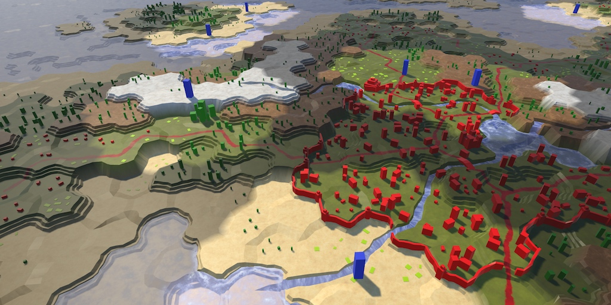 					Now you can see what you can and cannot see. 				

## Cell Shader Data

Many strategy games use what's known as fog of war. This means  that your vision is limited. You can only see things that are close to  your units or zone of control. While you might know the layout of the  land, you're not sure what's going on there while you can't see it.  Typically, terrain that you cannot currently see is rendered darker than  normal. To implement this, we need to keep track of a cell's visibility  and make sure that it is rendered appropriately.

The most straightforward way to change the appearance of hidden  cells is by adding a visibility indicator to the mesh data. However,  that would require us to trigger a new triangulation of the terrain  whenever visibility changes. As visibility changes happen all the time  during play, it is not a good idea to do it this way.

An often-described technique is to render a semitransparent  surface on top of the terrain, which partially masks the cells that you  cannot see. This can work well for fairly flat terrains, in combination  with a restricted view angle. Because our terrain can contain wildly  varying elevations and features and we can look at it from any angle, it  would require a highly-detailed form-fitting mesh. That would be more  expensive than the straightforward approach.

Another approach is to make the cell data available to the  shader while rendering, separate from the terrain mesh. This allows us  to triangulate once. The cell data can be made available via a texture.  Adjusting a texture is much simpler an faster that triangulating the  terrain. Doing a few more texture samples is also faster than rendering a  separate semitransparent overlay.

 						What about using shader arrays? 						 					

### Managing the Cell Data

We need a way to manage the texture that contains the cell data. Let's create a new `**HexCellShaderData**` component to take care of that.

```
using UnityEngine;

public class HexCellShaderData : MonoBehaviour {
	
	Texture2D cellTexture;
}
```

Whenever a new map is created or loaded, we have to create a  new texture with the correct size. So give it an initialization method  which creates the texture. We'll use an RGBA texture, without mipmaps,  and in linear color space. We don't want to blend cell data, so use  point filtering. Also, the data shouldn't wrap. Each pixel of the  texture will hold the data of one cell.

```
	public void Initialize (int x, int z) {
		cellTexture = new Texture2D(
			x, z, TextureFormat.RGBA32, false, true
		);
		cellTexture.filterMode = FilterMode.Point;
		cellTexture.wrapMode = TextureWrapMode.Clamp;
	}
```

 							Does the texture size have to match the map size? 							 						

We don't actually have to create a new texture every time a new  map is created. We can suffice with resizing our texture if it already  exists. We don't even have to check whether we already have the correct  size, as `Texture2D.Resize` is smart enough to do this for us.

```
	public void Initialize (int x, int z) {
		if (cellTexture) {
			cellTexture.Resize(x, z);
		}
		else {
			cellTexture = new Texture2D(
				x, z, TextureFormat.RGBA32, false, true
			);
			cellTexture.filterMode = FilterMode.Point;
			cellTexture.wrapMode = TextureWrapMode.Clamp;
		}
	}
```

Instead of applying cell data one pixel at a time, we'll use a color buffer and apply all cell data in one go. We'll use a `Color32` array for this. Create a new array instance at the end of `Initialize` when needed. If we already have an array of the correct size, reset its contents.

```
	Texture2D cellTexture;
	Color32[] cellTextureData;
	
	public void Initialize () {
		…
		
		if (cellTextureData == null || cellTextureData.Length != x * z) {
			cellTextureData = new Color32[x * z];
		}
		else {
			for (int i = 0; i < cellTextureData.Length; i++) {
				cellTextureData[i] = new Color32(0, 0, 0, 0);
			}
		}
	}
```

 							What's `Color32`? 							 						

It is the responsibility of `**HexGrid**` to create and initialize the cell shader data. So give it a `cellShaderData` field and create the component inside `Awake`.

```
	HexCellShaderData cellShaderData;

	void Awake () {
		HexMetrics.noiseSource = noiseSource;
		HexMetrics.InitializeHashGrid(seed);
		HexUnit.unitPrefab = unitPrefab;
		cellShaderData = gameObject.AddComponent<HexCellShaderData>();
		CreateMap(cellCountX, cellCountZ);
	}
```

Whenever a new map is created, `cellShaderData` has to be initialized as well.

```
	public bool CreateMap (int x, int z) {
		…

		cellCountX = x;
		cellCountZ = z;
		chunkCountX = cellCountX / HexMetrics.chunkSizeX;
		chunkCountZ = cellCountZ / HexMetrics.chunkSizeZ;
		cellShaderData.Initialize(cellCountX, cellCountZ);
		CreateChunks();
		CreateCells();
		return true;
	}
```

### Adjusting Cell Data

Up to this point, whenever a cell's properties were changed one  or more chunks had to be refreshed. But from now on cell data might  also need to be refreshed. This means that cells must also have a  reference to the cell shader data. Add a property for this to `**HexCell**`.

```
	public HexCellShaderData ShaderData { get; set; }
```

In `**HexGrid**.CreateCell`, assign its shader data component to this property.

```
	void CreateCell (int x, int z, int i) {
		…

		HexCell cell = cells[i] = Instantiate<HexCell>(cellPrefab);
		cell.transform.localPosition = position;
		cell.coordinates = HexCoordinates.FromOffsetCoordinates(x, z);
		cell.ShaderData = cellShaderData;
		
		…
	}
```

Now we can have cells update their shader data. At this point  we do not keep track of visibility yet, but we can also use the shader  data for something else. A cell's terrain type dictates which texture is  used when rendering it. It doesn't influence the cell's geometry. So we  could store the terrain type index in the cell data instead of in the  mesh data. This would eliminate the need for triangulation when a cell's  terrain type is changed.

Add a `RefreshTerrain` method to `**HexCellShaderData**` to facilitate this for a specific cell. Let's leave it an empty method for now.

```
	public void RefreshTerrain (HexCell cell) {
	}
```

Change `**HexCell**.TerrainTypeIndex` so it invokes this method, instead of scheduling a chunk refresh.

```
	public int TerrainTypeIndex {
		get {
			return terrainTypeIndex;
		}
		set {
			if (terrainTypeIndex != value) {
				terrainTypeIndex = value;
//				Refresh();
				ShaderData.RefreshTerrain(this);
			}
		}
	}
```

Also invoke it in `**HexCell**.Load` after retrieving the cell's terrain type.

```
	public void Load (BinaryReader reader) {
		terrainTypeIndex = reader.ReadByte();
		ShaderData.RefreshTerrain(this);
		elevation = reader.ReadByte();
		RefreshPosition();
		…
	}
```

### Cell Index

To adjust the cell data, we need to know the cell's index. The simplest way to do this is by adding an `Index` property to `**HexCell**`. This represents the cell's index in the map's cell list, which matches it's index in the cell shader data.

```
	public int Index { get; set; }
```

We already have this index available in `**HexGrid**.CreateCell`, so simply assign it to the newly created cell.

```
	void CreateCell (int x, int z, int i) {
		…
		cell.coordinates = HexCoordinates.FromOffsetCoordinates(x, z);
		cell.Index = i;
		cell.ShaderData = cellShaderData;

		…
	}
```

Now `**HexCellShaderData**.RefreshTerrain`  can use this index to set the cell's data. Let's store the terrain type  index in its pixel's alpha component, by simply converting the type to a  byte. This allows us to support up to 256 terrain types, which is  plenty.

```
	public void RefreshTerrain (HexCell cell) {
		cellTextureData[cell.Index].a = (byte)cell.TerrainTypeIndex;
	}
```

To actually apply the data to the texture and push it to the GPU, we have to invoke `Texture2D.SetPixels32` followed by `Texture2D.Apply`. Like we do with chunks, we're going to delay this to `LateUpdate` so we do it at most once per frame, no matter how many cells were changed.

```
	public void RefreshTerrain (HexCell cell) {
		cellTextureData[cell.Index].a = (byte)cell.TerrainTypeIndex;
		enabled = true;
	}
	
	void LateUpdate () {
		cellTexture.SetPixels32(cellTextureData);
		cellTexture.Apply();
		enabled = false;
	}
```

To make sure that the data is updated after creating a new map, also enable the component after initialization.

```
	public void Initialize (int x, int z) {
		…
		enabled = true;
	}
```

### Triangulating Cell Indices

Because we're now storing the terrain type index in the cell  data, we no longer have to include it while triangulating. But to use  the cell data, the shader has to know which cell indices to use. So we  have to store the cell indices in the mesh data, replacing the terrain  type indices. Also, we still need the mesh color channel to blend  between cells when using the cell data.

Remove the outdated `useColors` and `useTerrainTypes` public fields from `**HexMesh**`. Replace them with a single `useCellData` field.

```
//	public bool useCollider, useColors, useUVCoordinates, useUV2Coordinates;
//	public bool useTerrainTypes;
	public bool useCollider, useCellData, useUVCoordinates, useUV2Coordinates;
```

Refactor-rename the `terrainTypes` list to `cellIndices`. Let's also refactor-rename `colors` to `cellWeights`, which is a more appropriate name.

```
//	[NonSerialized] List<Vector3> vertices, terrainTypes;
//	[NonSerialized] List<Color> colors;
	[NonSerialized] List<Vector3> vertices, cellIndices;
	[NonSerialized] List<Color> cellWeights;
	[NonSerialized] List<Vector2> uvs, uv2s;
	[NonSerialized] List<int> triangles;
```

Adjust `Clear` so it grabs the two lists together when using cell data, instead of independent of one another.

```
	public void Clear () {
		hexMesh.Clear();
		vertices = ListPool<Vector3>.Get();
		if (useCellData) {
			cellWeights = ListPool<Color>.Get();
			cellIndices = ListPool<Vector3>.Get();
		}
//		if (useColors) {
//			colors = ListPool<Color>.Get();
//		}
		if (useUVCoordinates) {
			uvs = ListPool<Vector2>.Get();
		}
		if (useUV2Coordinates) {
			uv2s = ListPool<Vector2>.Get();
		}
//		if (useTerrainTypes) {
//			terrainTypes = ListPool<Vector3>.Get();
//		}
		triangles = ListPool<int>.Get();
	}
```

Perform the same grouping in `Apply`.

```
	public void Apply () {
		hexMesh.SetVertices(vertices);
		ListPool<Vector3>.Add(vertices);
		if (useCellData) {
			hexMesh.SetColors(cellWeights);
			ListPool<Color>.Add(cellWeights);
			hexMesh.SetUVs(2, cellIndices);
			ListPool<Vector3>.Add(cellIndices);
		}
//		if (useColors) {
//			hexMesh.SetColors(colors);
//			ListPool<Color>.Add(colors);
//		}
		if (useUVCoordinates) {
			hexMesh.SetUVs(0, uvs);
			ListPool<Vector2>.Add(uvs);
		}
		if (useUV2Coordinates) {
			hexMesh.SetUVs(1, uv2s);
			ListPool<Vector2>.Add(uv2s);
		}
//		if (useTerrainTypes) {
//			hexMesh.SetUVs(2, terrainTypes);
//			ListPool<Vector3>.Add(terrainTypes);
//		}
		hexMesh.SetTriangles(triangles, 0);
		ListPool<int>.Add(triangles);
		hexMesh.RecalculateNormals();
		if (useCollider) {
			meshCollider.sharedMesh = hexMesh;
		}
	}
```

Delete all the `AddTriangleColor` and `AddTriangleTerrainTypes` methods. Replace them with corresponding `AddTriangleCellData` methods that add the indices and weights in one go.

```
	public void AddTriangleCellData (
		Vector3 indices, Color weights1, Color weights2, Color weights3
	) {
		cellIndices.Add(indices);
		cellIndices.Add(indices);
		cellIndices.Add(indices);
		cellWeights.Add(weights1);
		cellWeights.Add(weights2);
		cellWeights.Add(weights3);
	}
		
	public void AddTriangleCellData (Vector3 indices, Color weights) {
		AddTriangleCellData(indices, weights, weights, weights);
	}
```

Apply the same treatment to the respective `AddQuad` methods.

```
	public void AddQuadCellData (
		Vector3 indices,
		Color weights1, Color weights2, Color weights3, Color weights4
	) {
		cellIndices.Add(indices);
		cellIndices.Add(indices);
		cellIndices.Add(indices);
		cellIndices.Add(indices);
		cellWeights.Add(weights1);
		cellWeights.Add(weights2);
		cellWeights.Add(weights3);
		cellWeights.Add(weights4);
	}

	public void AddQuadCellData (
		Vector3 indices, Color weights1, Color weights2
	) {
		AddQuadCellData(indices, weights1, weights1, weights2, weights2);
	}

	public void AddQuadCellData (Vector3 indices, Color weights) {
		AddQuadCellData(indices, weights, weights, weights, weights);
	}
```

### Refactoring HexGridChunk

At this point we get a lot of compiler errors in `**HexGridChunk**` that we have to fix. But first refactor-rename the static colors to weights, to stay consistent.

```
	static Color weights1 = new Color(1f, 0f, 0f);
	static Color weights2 = new Color(0f, 1f, 0f);
	static Color weights3 = new Color(0f, 0f, 1f);
```

Let's begin by fixing `TriangulateEdgeFan`. It used to require a type but now needs a cell index. Replace the `AddTriangleColor` and `AddTriangleTerrainTypes` code with the corresponding `AddTriangleCellData` code.

```
	void TriangulateEdgeFan (Vector3 center, EdgeVertices edge, float index) {
		terrain.AddTriangle(center, edge.v1, edge.v2);
		terrain.AddTriangle(center, edge.v2, edge.v3);
		terrain.AddTriangle(center, edge.v3, edge.v4);
		terrain.AddTriangle(center, edge.v4, edge.v5);

		Vector3 indices;
		indices.x = indices.y = indices.z = index;
		terrain.AddTriangleCellData(indices, weights1);
		terrain.AddTriangleCellData(indices, weights1);
		terrain.AddTriangleCellData(indices, weights1);
		terrain.AddTriangleCellData(indices, weights1);

//		terrain.AddTriangleColor(weights1);
//		terrain.AddTriangleColor(weights1);
//		terrain.AddTriangleColor(weights1);
//		terrain.AddTriangleColor(weights1);

//		Vector3 types;
//		types.x = types.y = types.z = type;
//		terrain.AddTriangleTerrainTypes(types);
//		terrain.AddTriangleTerrainTypes(types);
//		terrain.AddTriangleTerrainTypes(types);
//		terrain.AddTriangleTerrainTypes(types);
	}
```

This method is invoked in a few placed. Go through them and  make sure that it's supplied with the cell index instead of the terrain  type.

```
		TriangulateEdgeFan(center, e, cell.Index);
```

Next is `TriangulateEdgeStrip`. It's a bit more involved, but apply the same treatment. Also refactor-rename the `c1` and `c2` parameter names to `w1` and `w2`.

```
	void TriangulateEdgeStrip (
		EdgeVertices e1, Color w1, float index1,
		EdgeVertices e2, Color w2, float index2,
		bool hasRoad = false
	) {
		terrain.AddQuad(e1.v1, e1.v2, e2.v1, e2.v2);
		terrain.AddQuad(e1.v2, e1.v3, e2.v2, e2.v3);
		terrain.AddQuad(e1.v3, e1.v4, e2.v3, e2.v4);
		terrain.AddQuad(e1.v4, e1.v5, e2.v4, e2.v5);

		Vector3 indices;
		indices.x = indices.z = index1;
		indices.y = index2;
		terrain.AddQuadCellData(indices, w1, w2);
		terrain.AddQuadCellData(indices, w1, w2);
		terrain.AddQuadCellData(indices, w1, w2);
		terrain.AddQuadCellData(indices, w1, w2);

//		terrain.AddQuadColor(c1, c2);
//		terrain.AddQuadColor(c1, c2);
//		terrain.AddQuadColor(c1, c2);
//		terrain.AddQuadColor(c1, c2);

//		Vector3 types;
//		types.x = types.z = type1;
//		types.y = type2;
//		terrain.AddQuadTerrainTypes(types);
//		terrain.AddQuadTerrainTypes(types);
//		terrain.AddQuadTerrainTypes(types);
//		terrain.AddQuadTerrainTypes(types);

		if (hasRoad) {
			TriangulateRoadSegment(e1.v2, e1.v3, e1.v4, e2.v2, e2.v3, e2.v4);
		}
	}
```

Change the invocations of this method so they're supplied with the cell index. Also keep the variable names consistent.

```
		TriangulateEdgeStrip(
			m, weights1, cell.Index,
			e, weights1, cell.Index
		);
		
	…
		
			TriangulateEdgeStrip(
				e1, weights1, cell.Index,
				e2, weights2, neighbor.Index, hasRoad
			);
	
	…
	
	void TriangulateEdgeTerraces (
		EdgeVertices begin, HexCell beginCell,
		EdgeVertices end, HexCell endCell,
		bool hasRoad
	) {
		EdgeVertices e2 = EdgeVertices.TerraceLerp(begin, end, 1);
		Color w2 = HexMetrics.TerraceLerp(weights1, weights2, 1);
		float i1 = beginCell.Index;
		float i2 = endCell.Index;

		TriangulateEdgeStrip(begin, weights1, i1, e2, w2, i2, hasRoad);

		for (int i = 2; i < HexMetrics.terraceSteps; i++) {
			EdgeVertices e1 = e2;
			Color w1 = w2;
			e2 = EdgeVertices.TerraceLerp(begin, end, i);
			w2 = HexMetrics.TerraceLerp(weights1, weights2, i);
			TriangulateEdgeStrip(e1, w1, i1, e2, w2, i2, hasRoad);
		}

		TriangulateEdgeStrip(e2, w2, i1, end, weights2, i2, hasRoad);
	}
```

Now we move on to the corner methods. These changes are straightforward, but go through a lot of code. First is `TriangulateCorner`.

```
	void TriangulateCorner (
		Vector3 bottom, HexCell bottomCell,
		Vector3 left, HexCell leftCell,
		Vector3 right, HexCell rightCell
	) {
		…
		else {
			terrain.AddTriangle(bottom, left, right);
			Vector3 indices;
			indices.x = bottomCell.Index;
			indices.y = leftCell.Index;
			indices.z = rightCell.Index;
			terrain.AddTriangleCellData(indices, weights1, weights2, weights3);
//			terrain.AddTriangleColor(weights1, weights2, weights3);
//			Vector3 types;
//			types.x = bottomCell.TerrainTypeIndex;
//			types.y = leftCell.TerrainTypeIndex;
//			types.z = rightCell.TerrainTypeIndex;
//			terrain.AddTriangleTerrainTypes(types);
		}

		features.AddWall(bottom, bottomCell, left, leftCell, right, rightCell);
	}
```

`TriangulateCornerTerraces` is next.

```
	void TriangulateCornerTerraces (
		Vector3 begin, HexCell beginCell,
		Vector3 left, HexCell leftCell,
		Vector3 right, HexCell rightCell
	) {
		Vector3 v3 = HexMetrics.TerraceLerp(begin, left, 1);
		Vector3 v4 = HexMetrics.TerraceLerp(begin, right, 1);
		Color w3 = HexMetrics.TerraceLerp(weights1, weights2, 1);
		Color w4 = HexMetrics.TerraceLerp(weights1, weights3, 1);
		Vector3 indices;
		indices.x = beginCell.Index;
		indices.y = leftCell.Index;
		indices.z = rightCell.Index;

		terrain.AddTriangle(begin, v3, v4);
		terrain.AddTriangleCellData(indices, weights1, w3, w4);
//		terrain.AddTriangleColor(weights1, w3, w4);
//		terrain.AddTriangleTerrainTypes(indices);

		for (int i = 2; i < HexMetrics.terraceSteps; i++) {
			Vector3 v1 = v3;
			Vector3 v2 = v4;
			Color w1 = w3;
			Color w2 = w4;
			v3 = HexMetrics.TerraceLerp(begin, left, i);
			v4 = HexMetrics.TerraceLerp(begin, right, i);
			w3 = HexMetrics.TerraceLerp(weights1, weights2, i);
			w4 = HexMetrics.TerraceLerp(weights1, weights3, i);
			terrain.AddQuad(v1, v2, v3, v4);
			terrain.AddQuadCellData(indices, w1, w2, w3, w4);
//			terrain.AddQuadColor(w1, w2, w3, w4);
//			terrain.AddQuadTerrainTypes(indices);
		}

		terrain.AddQuad(v3, v4, left, right);
		terrain.AddQuadCellData(indices, w3, w4, weights2, weights3);
//		terrain.AddQuadColor(w3, w4, weights2, weights3);
//		terrain.AddQuadTerrainTypes(indices);
	}
```

Followed by `TriangulateCornerTerracesCliff`.

```
	void TriangulateCornerTerracesCliff (
		Vector3 begin, HexCell beginCell,
		Vector3 left, HexCell leftCell,
		Vector3 right, HexCell rightCell
	) {
		float b = 1f / (rightCell.Elevation - beginCell.Elevation);
		if (b < 0) {
			b = -b;
		}
		Vector3 boundary = Vector3.Lerp(
			HexMetrics.Perturb(begin), HexMetrics.Perturb(right), b
		);
		Color boundaryWeights = Color.Lerp(weights1, weights3, b);
		Vector3 indices;
		indices.x = beginCell.Index;
		indices.y = leftCell.Index;
		indices.z = rightCell.Index;

		TriangulateBoundaryTriangle(
			begin, weights1, left, weights2, boundary, boundaryWeights, indices
		);

		if (leftCell.GetEdgeType(rightCell) == HexEdgeType.Slope) {
			TriangulateBoundaryTriangle(
				left, weights2, right, weights3,
				boundary, boundaryWeights, indices
			);
		}
		else {
			terrain.AddTriangleUnperturbed(
				HexMetrics.Perturb(left), HexMetrics.Perturb(right), boundary
			);
			terrain.AddTriangleCellData(
				indices, weights2, weights3, boundaryWeights
			);
//			terrain.AddTriangleColor(weights2, weights3, boundaryColor);
//			terrain.AddTriangleTerrainTypes(indices);
		}
	}
```

And the slightly different `TriangulateCornerCliffTerraces`.

```
	void TriangulateCornerCliffTerraces (
		Vector3 begin, HexCell beginCell,
		Vector3 left, HexCell leftCell,
		Vector3 right, HexCell rightCell
	) {
		float b = 1f / (leftCell.Elevation - beginCell.Elevation);
		if (b < 0) {
			b = -b;
		}
		Vector3 boundary = Vector3.Lerp(
			HexMetrics.Perturb(begin), HexMetrics.Perturb(left), b
		);
		Color boundaryWeights = Color.Lerp(weights1, weights2, b);
		Vector3 indices;
		indices.x = beginCell.Index;
		indices.y = leftCell.Index;
		indices.z = rightCell.Index;

		TriangulateBoundaryTriangle(
			right, weights3, begin, weights1, boundary, boundaryWeights, indices
		);

		if (leftCell.GetEdgeType(rightCell) == HexEdgeType.Slope) {
			TriangulateBoundaryTriangle(
				left, weights2, right, weights3,
				boundary, boundaryWeights, indices
			);
		}
		else {
			terrain.AddTriangleUnperturbed(
				HexMetrics.Perturb(left), HexMetrics.Perturb(right), boundary
			);
			terrain.AddTriangleCellData(
				indices, weights2, weights3, boundaryWeights
			);
//			terrain.AddTriangleColor(weights2, weights3, boundaryWeights);
//			terrain.AddTriangleTerrainTypes(indices);
		}
	}
```

The previous two methods rely on `TriangulateBoundaryTriangle`, which requires an update as well.

```
	void TriangulateBoundaryTriangle (
		Vector3 begin, Color beginWeights,
		Vector3 left, Color leftWeights,
		Vector3 boundary, Color boundaryWeights, Vector3 indices
	) {
		Vector3 v2 = HexMetrics.Perturb(HexMetrics.TerraceLerp(begin, left, 1));
		Color w2 = HexMetrics.TerraceLerp(beginWeights, leftWeights, 1);

		terrain.AddTriangleUnperturbed(HexMetrics.Perturb(begin), v2, boundary);
		terrain.AddTriangleCellData(indices, beginWeights, w2, boundaryWeights);
//		terrain.AddTriangleColor(beginColor, c2, boundaryColor);
//		terrain.AddTriangleTerrainTypes(types);

		for (int i = 2; i < HexMetrics.terraceSteps; i++) {
			Vector3 v1 = v2;
			Color w1 = w2;
			v2 = HexMetrics.Perturb(HexMetrics.TerraceLerp(begin, left, i));
			w2 = HexMetrics.TerraceLerp(beginWeights, leftWeights, i);
			terrain.AddTriangleUnperturbed(v1, v2, boundary);
			terrain.AddTriangleCellData(indices, w1, w2, boundaryWeights);
//			terrain.AddTriangleColor(c1, c2, boundaryColor);
//			terrain.AddTriangleTerrainTypes(types);
		}

		terrain.AddTriangleUnperturbed(v2, HexMetrics.Perturb(left), boundary);
		terrain.AddTriangleCellData(indices, w2, leftWeights, boundaryWeights);
//		terrain.AddTriangleColor(c2, leftColor, boundaryColor);
//		terrain.AddTriangleTerrainTypes(types);
	}
```

The final method that requires changes is `TriangulateWithRiver`.

```
	void TriangulateWithRiver (
		HexDirection direction, HexCell cell, Vector3 center, EdgeVertices e
	) {
		…

		terrain.AddTriangle(centerL, m.v1, m.v2);
		terrain.AddQuad(centerL, center, m.v2, m.v3);
		terrain.AddQuad(center, centerR, m.v3, m.v4);
		terrain.AddTriangle(centerR, m.v4, m.v5);

		Vector3 indices;
		indices.x = indices.y = indices.z = cell.Index;
		terrain.AddTriangleCellData(indices, weights1);
		terrain.AddQuadCellData(indices, weights1);
		terrain.AddQuadCellData(indices, weights1);
		terrain.AddTriangleCellData(indices, weights1);

//		terrain.AddTriangleColor(weights1);
//		terrain.AddQuadColor(weights1);
//		terrain.AddQuadColor(weights1);
//		terrain.AddTriangleColor(weights1);

//		Vector3 types;
//		types.x = types.y = types.z = cell.TerrainTypeIndex;
//		terrain.AddTriangleTerrainTypes(types);
//		terrain.AddQuadTerrainTypes(types);
//		terrain.AddQuadTerrainTypes(types);
//		terrain.AddTriangleTerrainTypes(types);

		…
	}
```

To make this work, we have to indicate that we use cell data for the terrain child of the chunk prefab.

 							
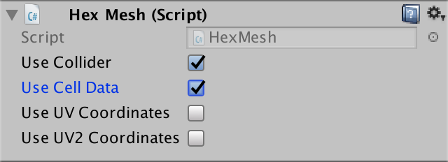 							Terrain uses cell data. 						

At this point, our mesh contains cell indices instead of  terrain type indices. Because the terrain shader still interprets them  as terrain indices, you'll see that the first cell is rendered with the  first texture, and so on until the last terrain texture is reached.

 							
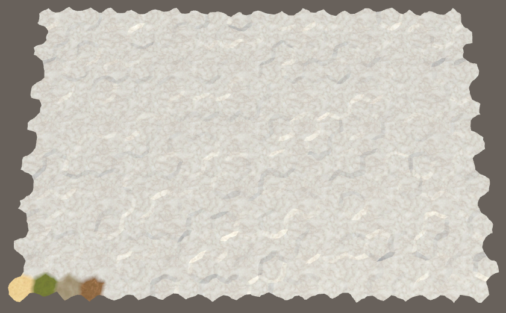 							Treating cell indices as terrain texture indices. 						

 							I can't get the refactored code to work. What am I doing wrong? 							 						

### Passing Cell Data to the Shader

In order to use the cell data, the terrain shader needs access  to it. We could do this via a shader property, which would require `**HexCellShaderData**`  to set the terrain material's property. An alternative is to make the  cell data texture globally available to all shaders. This is convenient,  as we'll be needing it in multiple shaders, so let's use that approach.

After the cell texture has been created, invoke the static `Shader.SetGlobalTexture` method to make it globally known as *_HexCellData*.

```
	public void Initialize (int x, int z) {
		…
		else {
			cellTexture = new Texture2D(
				x, z, TextureFormat.RGBA32, false, true
			);
			cellTexture.filterMode = FilterMode.Point;
			cellTexture.wrapMode = TextureWrapMode.Clamp;
			Shader.SetGlobalTexture("_HexCellData", cellTexture);
		}

		…
	}
```

When using a shader property, Unity also makes a texture's size available to the shader via a *textureName_TexelSize*  variable. This is a four-component vector which contains the  multiplicative inverses of the width and height, and the actual width  and height. But when setting a texture globally, this is not done. So  let's do it ourselves, via `Shader.SetGlobalVector` after the texture has been created or resized.

```
		else {
			cellTexture = new Texture2D(
				x, z, TextureFormat.RGBA32, false, true
			);
			cellTexture.filterMode = FilterMode.Point;
			cellTexture.wrapMode = TextureWrapMode.Clamp;
			Shader.SetGlobalTexture("_HexCellData", cellTexture);
		}
		Shader.SetGlobalVector(
			"_HexCellData_TexelSize",
			new Vector4(1f / x, 1f / z, x, z)
		);
```

### Accessing Shader Data

Create a new shader include file named *HexCellData*  in the material folder. Inside it, define variables for the cell data  texture and size info. Also provide a function for retrieving the cell  data, given the mesh data of a vertex.

```
sampler2D _HexCellData;
float4 _HexCellData_TexelSize;

float4 GetCellData (appdata_full v) {
}
```

 							
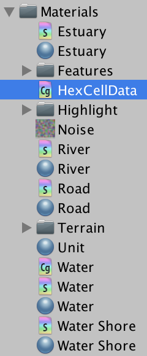 							New include file. 						

The cell indices are stored in `v.texcoord2`, just like the terrain types were. Let's start with the first index, `v.texcoord2.**x**`. Unfortunately, we cannot directly use an index to sample the cell data texture. We have to convert it to UV coordinates.

The first step of constructing the U coordinate is to divide  the cell index by the texture width. We can do this by multiplying with `_HexCellData_TexelSize.**x**`.

```
float4 GetCellData (appdata_full v) {
	float2 uv;
	uv.x = v.texcoord2.x * _HexCellData_TexelSize.x;
}
```

The result is a number of the form Z.U, where Z is the row  index and U is the U coordinate of the cell. We can extract the row by  flooring the number, then subtract that from the number to get the U  coordinate.

```
float4 GetCellData (appdata_full v) {
	float2 uv;
	uv.x = v.texcoord2.x * _HexCellData_TexelSize.x;
	float row = floor(uv.x);
	uv.x -= row;
}
```

The V coordinate is found by dividing the row by the texture height.

```
float4 GetCellData (appdata_full v) {
	float2 uv;
	uv.x = v.texcoord2.x * _HexCellData_TexelSize.x;
	float row = floor(uv.x);
	uv.x -= row;
	uv.y = row * _HexCellData_TexelSize.y;
}
```

Because we're sampling a texture, we want to use UV coordinates  that align with the centers of pixels. That ensures that we sample the  correct pixels. So add ½ before dividing by the texture sizes.

```
float4 GetCellData (appdata_full v) {
	float2 uv;
	uv.x = (v.texcoord2.x + 0.5) * _HexCellData_TexelSize.x;
	float row = floor(uv.x);
	uv.x -= row;
	uv.y = (row + 0.5) * _HexCellData_TexelSize.y;
}
```

This gives us the proper UV coordinates for the first cell  index stored in the vertex data. But we can have up to three different  indices per vertex. So let's make `GetCellData` work for any index. Give it an integer `index` parameter, which we use to access the cell index vector's component.

```
float4 GetCellData (appdata_full v, int index) {
	float2 uv;
	uv.x = (v.texcoord2[index] + 0.5) * _HexCellData_TexelSize.x;
	float row = floor(uv.x);
	uv.x -= row;
	uv.y = (row + 0.5) * _HexCellData_TexelSize.y;
}
```

Now that we have the desired cell data coordinates, we can sample `_HexCellData`.  Because we're sampling the texture in the vertex program, we have to  explicitly tell the shader which mipmap to use. This is done via the `tex2Dlod`  function, which requires four texture coordinates. Because the cell  data doesn't have mipmaps, set the extra coordinates to zero.

```
float4 GetCellData (appdata_full v, int index) {
	float2 uv;
	uv.x = (v.texcoord2[index] + 0.5) * _HexCellData_TexelSize.x;
	float row = floor(uv.x);
	uv.x -= row;
	uv.y = (row + 0.5) * _HexCellData_TexelSize.y;
	float4 data = tex2Dlod(_HexCellData, float4(uv, 0, 0));
}
```

The fourth data component contains the terrain type index,  which we directly stored as a byte. However, the GPU automatically  converted it into a floating-point value in the 0–1 range. To convert it  back to its proper value, multiply it with 255. After that, we can  return the data.

```
	float4 data = tex2Dlod(_HexCellData, float4(uv, 0, 0));
	data.w *= 255;
	return data;
```

To use this functionality, include *HexCellData* in the *Terrain* shader. Because I've placed this shader in *Materials / Terrain*, I have to use the relative path *../HexCellData.cginc*.

```
		#include "../HexCellData.cginc"

		UNITY_DECLARE_TEX2DARRAY(_MainTex);
```

In the vertex program, retrieve the cell data for all three  cell indices stored in the vertex data. Then assign their terrain  indices to `data.terrain`.

```
		void vert (inout appdata_full v, out Input data) {
			UNITY_INITIALIZE_OUTPUT(Input, data);
//			data.terrain = v.texcoord2.xyz;

			float4 cell0 = GetCellData(v, 0);
			float4 cell1 = GetCellData(v, 1);
			float4 cell2 = GetCellData(v, 2);

			data.terrain.x = cell0.w;
			data.terrain.y = cell1.w;
			data.terrain.z = cell2.w;
		}
```

At this point, our map should again show the correct terrain.  The big difference is that editing only the terrain types no longer  triggers new triangulations. If some other cell data is changed while  editing, a triangulation will occur as usual.

unitypackage

## Visibility

With our cell data framework in place, we can move on to adding  support for visibility. This will involve the shader, cells themselves,  and whoever decides what is visible. Note that the triangulation process  is completely unaware of this.

### Shader

Let's begin by making the *Terrain*  shader aware of visibility. It will extract the visibility data in the  vertex program and pass it to the fragment program via the `**Input**` structure. Because we're passing through three separate terrain indices, let's also pass through three visibility values.

```
		struct Input {
			float4 color : COLOR;
			float3 worldPos;
			float3 terrain;
			float3 visibility;
		};
```

We'll use the first component of the cell data to store the visibility.

```
		void vert (inout appdata_full v, out Input data) {
			UNITY_INITIALIZE_OUTPUT(Input, data);

			float4 cell0 = GetCellData(v, 0);
			float4 cell1 = GetCellData(v, 1);
			float4 cell2 = GetCellData(v, 2);

			data.terrain.x = cell0.w;
			data.terrain.y = cell1.w;
			data.terrain.z = cell2.w;

			data.visibility.x = cell0.x;
			data.visibility.y = cell1.x;
			data.visibility.z = cell2.x;
		}
```

A visibility of 0 means that a cell is currently not visible.  If the cell were visible, it would be set to 1 instead. So we can darken  the terrain by multiplying the result of `GetTerrainColor` by the appropriate visibility factor. That way, we modulate the terrain color of each blended cell independently.

```
		float4 GetTerrainColor (Input IN, int index) {
			float3 uvw = float3(IN.worldPos.xz * 0.02, IN.terrain[index]);
			float4 c = UNITY_SAMPLE_TEX2DARRAY(_MainTex, uvw);
			return c * (IN.color[index] * IN.visibility[index]);
		}
```

 							
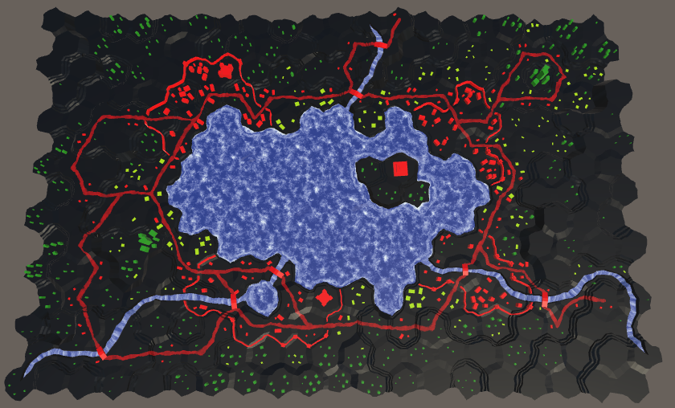 							Cells have become black. 						

 							Coulnd't we combine visibility in the vertex program instead? 							 						

Complete darkness is a bit too much for cells that aren't  currently visible. To still be able to see the terrain, we should  increase the factor used for hidden cells. Let's change the 0–1 choice  to ¼–1, which can be done with the `lerp` function at the end of the vertex program.

```
		void vert (inout appdata_full v, out Input data) {
			…

			data.visibility.x = cell0.x;
			data.visibility.y = cell1.x;
			data.visibility.z = cell2.x;
			data.visibility = lerp(0.25, 1, data.visibility);
		}
```

 							
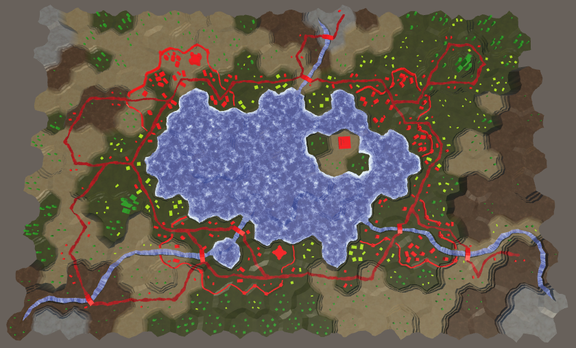 							Darkened cells. 						

### Keeping Track of Cell Visibility

To make visibility work, cells have to keep track of their  visibility. But how does a cell determine whether it is visible? We can  do this by having it keep track of how many entities can see it.  Whenever something acquires sight of a cell, it should inform that cell  about it. And when something loses sight of a cell, it has to inform  that cell as well. The cell simply keeps track of the view count, no  matter what or where these entities are. If the cell has a least a  visibility score of 1, then it is visible, otherwise it isn't. Add a  variable, two methods, and a property to `**HexCell**` to support this behavior.

```
	public bool IsVisible {
		get {
			return visibility > 0;
		}
	}

	…

	int visibility;

	…

	public void IncreaseVisibility () {
		visibility += 1;
	}

	public void DecreaseVisibility () {
		visibility -= 1;
	}
```

Next, add a `RefreshVisibility` method to `**HexCellShaderData**` that does the same as `RefreshTerrain`,  but for visibility. Store the data in the R component of the cell data.  Because we're working with bytes that get converted to 0–1 values in  the shader, use `(**byte**)255` to represent visible.

```
	public void RefreshVisibility (HexCell cell) {
		cellTextureData[cell.Index].r = cell.IsVisible ? (byte)255 : (byte)0;
		enabled = true;
	}
```

Invoke this method both when a cell's visibility is increased and decreased, when changing between a score of 0 and 1.

```
	public void IncreaseVisibility () {
		visibility += 1;
		if (visibility == 1) {
			ShaderData.RefreshVisibility(this);
		}
	}

	public void DecreaseVisibility () {
		visibility -= 1;
		if (visibility == 0) {
			ShaderData.RefreshVisibility(this);
		}
	}
```

### Giving Sight to Units

Let's make it possible for units to see the cell they're occupying. This is done by invoking `IncreaseVisibility` on the unit's new location when `**HexUnit**.Location` is set. Also invoke `DecreaseVisibility` on the old location, if any.

```
	public HexCell Location {
		get {
			return location;
		}
		set {
			if (location) {
				location.DecreaseVisibility();
				location.Unit = null;
			}
			location = value;
			value.Unit = this;
			value.IncreaseVisibility();
			transform.localPosition = value.Position;
		}
	}
```

 							
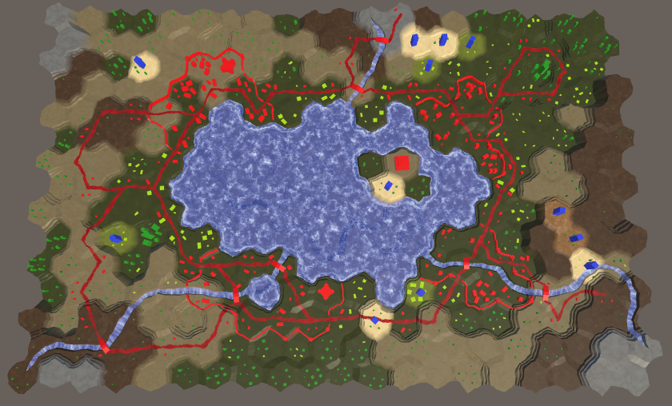 							Units can see where they are. 						

For the first time, we can see visibility in action! Units make  their location visible when added to the map. Their sight also  teleports to their new location when they travel. But their sight  remains active after they are removed from the map. To fix this,  decrease the visibility of their location when they die.

```
	public void Die () {
		if (location) {
			location.DecreaseVisibility();
		}
		location.Unit = null;
		Destroy(gameObject);
	}
```

### Vision Range

Only seeing the cell you're in is rather limiting. At least,  you should be able to see the adjacent cells as well. In general, units  can see all cells up to some distance, which could vary per unit.

Let's add a method to `**HexGrid**` to find all cells that are visible from one cell, given a vision range. We can create this method by duplicating and modifying `Search`. Change its parameters and have it return a list of cells, for which it can use the list pool.

Each iteration, the current cell is added to the list. There is  no longer a destination cell, so the search never ends when it reaches  that cell. Also get rid of the turn and movement cost logic. Make sure  that the `PathFrom` properties are no longer set, as we don't need them and we don't want to interfere with the grid's path.

Each step, the distance simply increases by 1. If it exceeds  the range, skip that cell. And we don't need a search heuristic, so  initialize it to 0. So we're effectively back at Dijkstra's algorithm.

```
	List<HexCell> GetVisibleCells (HexCell fromCell, int range) {
		List<HexCell> visibleCells = ListPool<HexCell>.Get();

		searchFrontierPhase += 2;
		if (searchFrontier == null) {
			searchFrontier = new HexCellPriorityQueue();
		}
		else {
			searchFrontier.Clear();
		}

		fromCell.SearchPhase = searchFrontierPhase;
		fromCell.Distance = 0;
		searchFrontier.Enqueue(fromCell);
		while (searchFrontier.Count > 0) {
			HexCell current = searchFrontier.Dequeue();
			current.SearchPhase += 1;
			visibleCells.Add(current);
//			if (current == toCell) {
//				return true;
//			}

//			int currentTurn = (current.Distance - 1) / speed;

			for (HexDirection d = HexDirection.NE; d <= HexDirection.NW; d++) {
				HexCell neighbor = current.GetNeighbor(d);
				if (
					neighbor == null ||
					neighbor.SearchPhase > searchFrontierPhase
				) {
					continue;
				}
//				…
//				int moveCost;
//				…

				int distance = current.Distance + 1;
				if (distance > range) {
					continue;
				}
//				int turn = (distance - 1) / speed;
//				if (turn > currentTurn) {
//					distance = turn * speed + moveCost;
//				}

				if (neighbor.SearchPhase < searchFrontierPhase) {
					neighbor.SearchPhase = searchFrontierPhase;
					neighbor.Distance = distance;
//					neighbor.PathFrom = current;
					neighbor.SearchHeuristic = 0;
					searchFrontier.Enqueue(neighbor);
				}
				else if (distance < neighbor.Distance) {
					int oldPriority = neighbor.SearchPriority;
					neighbor.Distance = distance;
//					neighbor.PathFrom = current;
					searchFrontier.Change(neighbor, oldPriority);
				}
			}
		}
		return visibleCells;
	}
```

 							Couldn't we use a simper algorithm to find all cells in range? 							 						

Now also give `**HexGrid**` an `IncreaseVisibility` and `DecreaseVisibility`  method. They take a cell and range, fetch the relevant cell list, and  either increase or decrease their visibility appropriately. After that's  done, they should put the list back in its pool.

```
	public void IncreaseVisibility (HexCell fromCell, int range) {
		List<HexCell> cells = GetVisibleCells(fromCell, range);
		for (int i = 0; i < cells.Count; i++) {
			cells[i].IncreaseVisibility();
		}
		ListPool<HexCell>.Add(cells);
	}

	public void DecreaseVisibility (HexCell fromCell, int range) {
		List<HexCell> cells = GetVisibleCells(fromCell, range);
		for (int i = 0; i < cells.Count; i++) {
			cells[i].DecreaseVisibility();
		}
		ListPool<HexCell>.Add(cells);
	}
```

`**HexUnit**` requires access to the grid to be able to use these methods, so add a `Grid` property to it.

```
	public HexGrid Grid { get; set; }
```

Assign the grid to this property when a unit is added to it, in `**HexGrid**.AddUnit`.

```
	public void AddUnit (HexUnit unit, HexCell location, float orientation) {
		units.Add(unit);
		unit.Grid = this;
		unit.transform.SetParent(transform, false);
		unit.Location = location;
		unit.Orientation = orientation;
	}
```

A vision range of three cells is plenty to start with. Add a constant for this to `**HexUnit**`, which could always become variable in the future. Then make sure that the unit invokes the `IncreaseVisibility` and `DecreaseVisibility` methods of the grid, instead of directly going to its location, passing along its range as well.

```
	const int visionRange = 3;

	…

	public HexCell Location {
		get {
			return location;
		}
		set {
			if (location) {
//				location.DecreaseVisibility();
				Grid.DecreaseVisibility(location, visionRange);
				location.Unit = null;
			}
			location = value;
			value.Unit = this;
//			value.IncreaseVisibility();
			Grid.IncreaseVisibility(value, visionRange);
			transform.localPosition = value.Position;
		}
	}

	…

	public void Die () {
		if (location) {
//			location.DecreaseVisibility();
			Grid.DecreaseVisibility(location, visionRange);
		}
		location.Unit = null;
		Destroy(gameObject);
	}
```

 							
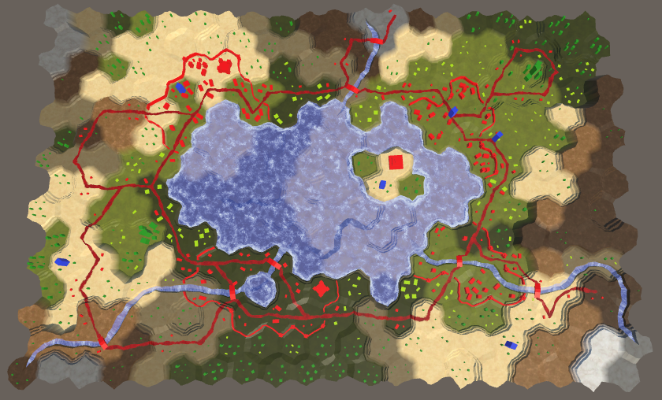 							Units with vision range, which can overlap. 						

### Vision While Traveling

Currently, a unit's vision directly teleports to its  destination when it is ordered to move. It would look better if the unit  and its vision moved together. The first step of making this work is no  longer setting the `Location` property in `**HexUnit**.Travel`. Instead, directly change the `location`  field, avoiding the property's code. So manually clean up the old  location and configure the new location. Leave the vision unchanged.

```
	public void Travel (List<HexCell> path) {
//		Location = path[path.Count - 1];
		location.Unit = null;
		location = path[path.Count - 1];
		location.Unit = this;
		pathToTravel = path;
		StopAllCoroutines();
		StartCoroutine(TravelPath());
	}
```

Inside the `TravelPath` coroutine, decrease visibility from the first cell only after `LookAt`  has finished. After that, before moving to a new cell, increase  visibility from that cell. After that's done, decrease visibility from  it again. Finally, increase visibility from the last cell.

```
	IEnumerator TravelPath () {
		Vector3 a, b, c = pathToTravel[0].Position;
//		transform.localPosition = c;
		yield return LookAt(pathToTravel[1].Position);
		Grid.DecreaseVisibility(pathToTravel[0], visionRange);

		float t = Time.deltaTime * travelSpeed;
		for (int i = 1; i < pathToTravel.Count; i++) {
			a = c;
			b = pathToTravel[i - 1].Position;
			c = (b + pathToTravel[i].Position) * 0.5f;
			Grid.IncreaseVisibility(pathToTravel[i], visionRange);
			for (; t < 1f; t += Time.deltaTime * travelSpeed) {
				…
			}
			Grid.DecreaseVisibility(pathToTravel[i], visionRange);
			t -= 1f;
		}

		a = c;
		b = location.Position; // We can simply use the destination here.
		c = b;
		Grid.IncreaseVisibility(location, visionRange);
		for (; t < 1f; t += Time.deltaTime * travelSpeed) {
			…
		}

		…
	}
```

<iframe src="https://gfycat.com/ifr/SkinnyIcyHairstreakbutterfly"></iframe>

Vision while traveling.

This works, except when a new move order is issued while the  unit is still traveling. That triggers a teleportation, which should  apply to vision as well. To support this, we have to keep track of the  unit's current location while traveling.

```
	HexCell location, currentTravelLocation;
```

Update this location every time a new cell is entered while  traveling, until the final cell is entered. Then it should be cleared.

```
	IEnumerator TravelPath () {
		…
		
		for (int i = 1; i < pathToTravel.Count; i++) {
			currentTravelLocation = pathToTravel[i];
			a = c;
			b = pathToTravel[i - 1].Position;
			c = (b + currentTravelLocation.Position) * 0.5f;
			Grid.IncreaseVisibility(pathToTravel[i], visionRange);
			for (; t < 1f; t += Time.deltaTime * travelSpeed) {
				transform.localPosition = Bezier.GetPoint(a, b, c, t);
				Vector3 d = Bezier.GetDerivative(a, b, c, t);
				d.y = 0f;
				transform.localRotation = Quaternion.LookRotation(d);
				yield return null;
			}
			Grid.DecreaseVisibility(pathToTravel[i], visionRange);
			t -= 1f;
		}
		currentTravelLocation = null;
		
		…
	}
```

Now we can check whether an old intermediate travel location is know, after finishing rotation in `TravelPath`. If so, we should decrease visibility from that cell, instead of the start of the path.

```
	IEnumerator TravelPath () {
		Vector3 a, b, c = pathToTravel[0].Position;
		yield return LookAt(pathToTravel[1].Position);
		Grid.DecreaseVisibility(
			currentTravelLocation ? currentTravelLocation : pathToTravel[0],
			visionRange
		);

		…
	}
```

We also have to fix visibility after a recompile happened while  a unit was traveling. If an intermediate location is still known,  decrease visibility from it and increase visibility from the  destination, then clear the intermediate location.

```
	void OnEnable () {
		if (location) {
			transform.localPosition = location.Position;
			if (currentTravelLocation) {
				Grid.IncreaseVisibility(location, visionRange);
				Grid.DecreaseVisibility(currentTravelLocation, visionRange);
				currentTravelLocation = null;
			}
		}
	}
```

unitypackage

## Visibility of Roads and Water

Although the terrain changes color based on visibility, roads  and water are not affected. They appear too bright for cells that are  out of sight. To apply visibility to roads and water, we have to add  cell indices and blend weights to their mesh data as well. So check *Use Cell Data* for the *Rivers*, *Roads*, *Water*, *Water Shore*, and *Estuaries* children of the chunk prefab.

### Roads

We start with roads. The `**HexGridChunk**.TriangulateRoadEdge`  method is used to create a small part of the road at the center of a  cell, so it needs a single cell index. Add a parameter for it and  generate the cell data for the triangle.

```
	void TriangulateRoadEdge (
		Vector3 center, Vector3 mL, Vector3 mR, float index
	) {
		roads.AddTriangle(center, mL, mR);
		roads.AddTriangleUV(
			new Vector2(1f, 0f), new Vector2(0f, 0f), new Vector2(0f, 0f)
		);
		Vector3 indices;
		indices.x = indices.y = indices.z = index;
		roads.AddTriangleCellData(indices, weights1);
	}
```

The other basic road-creation method is `TriangulateRoadSegment`.  It's used both inside and between cells, so it needs to work with two  different indices. An indices vector parameter is convenient for this.  As road segments can be part of terraces, the weights have to be  provided via parameters as well.

```
	void TriangulateRoadSegment (
		Vector3 v1, Vector3 v2, Vector3 v3,
		Vector3 v4, Vector3 v5, Vector3 v6,
		Color w1, Color w2, Vector3 indices
	) {
		roads.AddQuad(v1, v2, v4, v5);
		roads.AddQuad(v2, v3, v5, v6);
		roads.AddQuadUV(0f, 1f, 0f, 0f);
		roads.AddQuadUV(1f, 0f, 0f, 0f);
		roads.AddQuadCellData(indices, w1, w2);
		roads.AddQuadCellData(indices, w1, w2);
	}
```

Next up is `TriangulateRoad`, which creates roads  inside cells. It also needs an index parameter. It passes this data on  to the road methods it invokes, and adds it to the triangles it creates  itself.

```
	void TriangulateRoad (
		Vector3 center, Vector3 mL, Vector3 mR,
		EdgeVertices e, bool hasRoadThroughCellEdge, float index
	) {
		if (hasRoadThroughCellEdge) {
			Vector3 indices;
			indices.x = indices.y = indices.z = index;
			Vector3 mC = Vector3.Lerp(mL, mR, 0.5f);
			TriangulateRoadSegment(
				mL, mC, mR, e.v2, e.v3, e.v4,
				weights1, weights1, indices
			);
			roads.AddTriangle(center, mL, mC);
			roads.AddTriangle(center, mC, mR);
			roads.AddTriangleUV(
				new Vector2(1f, 0f), new Vector2(0f, 0f), new Vector2(1f, 0f)
			);
			roads.AddTriangleUV(
				new Vector2(1f, 0f), new Vector2(1f, 0f), new Vector2(0f, 0f)
			);
			roads.AddTriangleCellData(indices, weights1);
			roads.AddTriangleCellData(indices, weights1);
		}
		else {
			TriangulateRoadEdge(center, mL, mR, index);
		}
	}
```

What's left is to add the required method arguments to `TriangulateRoad`, `TriangulateRoadEdge`, and `TriangulateRoadSegment` until all compiler errors are fixed.

```
	void TriangulateWithoutRiver (
		HexDirection direction, HexCell cell, Vector3 center, EdgeVertices e
	) {
		TriangulateEdgeFan(center, e, cell.Index);

		if (cell.HasRoads) {
			Vector2 interpolators = GetRoadInterpolators(direction, cell);
			TriangulateRoad(
				center,
				Vector3.Lerp(center, e.v1, interpolators.x),
				Vector3.Lerp(center, e.v5, interpolators.y),
				e, cell.HasRoadThroughEdge(direction), cell.Index
			);
		}
	}
	
	…
	
	void TriangulateRoadAdjacentToRiver (
		HexDirection direction, HexCell cell, Vector3 center, EdgeVertices e
	) {
		…
		TriangulateRoad(roadCenter, mL, mR, e, hasRoadThroughEdge, cell.Index);
		if (previousHasRiver) {
			TriangulateRoadEdge(roadCenter, center, mL, cell.Index);
		}
		if (nextHasRiver) {
			TriangulateRoadEdge(roadCenter, mR, center, cell.Index);
		}
	}
	
	…
	
	void TriangulateEdgeStrip (
		…
	) {
		…

		if (hasRoad) {
			TriangulateRoadSegment(
				e1.v2, e1.v3, e1.v4, e2.v2, e2.v3, e2.v4, w1, w2, indices
			);
		}
	}
```

Now that the mesh data is correct, we move on to the *Road* shader. It needs a vertex program and has to include *HexCellData*.

```
		#pragma surface surf Standard fullforwardshadows decal:blend vertex:vert
		#pragma target 3.0

		#include "HexCellData.cginc"
```

Because we're not blending multiple materials, we can suffice with passing a single visibility factor to the fragment program.

```
		struct Input {
			float2 uv_MainTex;
			float3 worldPos;
			float visibility;
		};
```

The new vertex program only has to retrieve the data of two  cells. We blend their visibility immediately, tweak it, and add it to  the output data.

```
		void vert (inout appdata_full v, out Input data) {
			UNITY_INITIALIZE_OUTPUT(Input, data);

			float4 cell0 = GetCellData(v, 0);
			float4 cell1 = GetCellData(v, 1);

			data.visibility = cell0.x * v.color.x + cell1.x * v.color.y;
			data.visibility = lerp(0.25, 1, data.visibility);
		}
```

In the fragment program, all we have to do is factor the visibility into the color.

```
		void surf (Input IN, inout SurfaceOutputStandard o) {
			float4 noise = tex2D(_MainTex, IN.worldPos.xz * 0.025);
			fixed4 c = _Color * ((noise.y * 0.75 + 0.25) * IN.visibility);
			…
		}
```

 							
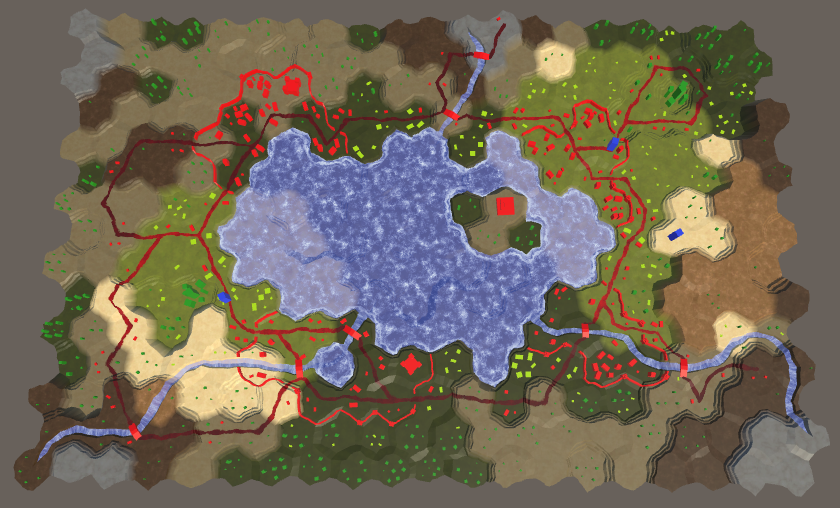 							Roads with visibility. 						

### Open Water

It might look like water is already affected by visibility, but  that's just the submerged terrain surface underneath it. Let's start  with applying visibility to the open water. This requires adjustment of `**HexGridChunk**.TriangulateOpenWater`.

```
	void TriangulateOpenWater (
		HexDirection direction, HexCell cell, HexCell neighbor, Vector3 center
	) {
		…

		water.AddTriangle(center, c1, c2);
		Vector3 indices;
		indices.x = indices.y = indices.z = cell.Index;
		water.AddTriangleCellData(indices, weights1);

		if (direction <= HexDirection.SE && neighbor != null) {
			…

			water.AddQuad(c1, c2, e1, e2);
			indices.y = neighbor.Index;
			water.AddQuadCellData(indices, weights1, weights2);

			if (direction <= HexDirection.E) {
				…
				water.AddTriangle(
					c2, e2, c2 + HexMetrics.GetWaterBridge(direction.Next())
				);
				indices.z = nextNeighbor.Index;
				water.AddTriangleCellData(
					indices, weights1, weights2, weights3
				);
			}
		}
	}
```

We also have to add cell data to the triangle fans next to water shores.

```
	void TriangulateWaterShore (
		HexDirection direction, HexCell cell, HexCell neighbor, Vector3 center
	) {
		…
		water.AddTriangle(center, e1.v1, e1.v2);
		water.AddTriangle(center, e1.v2, e1.v3);
		water.AddTriangle(center, e1.v3, e1.v4);
		water.AddTriangle(center, e1.v4, e1.v5);
		Vector3 indices;
		indices.x = indices.y = indices.z = cell.Index;
		water.AddTriangleCellData(indices, weights1);
		water.AddTriangleCellData(indices, weights1);
		water.AddTriangleCellData(indices, weights1);
		water.AddTriangleCellData(indices, weights1);
		
		…
	}
```

The *Water* shader has to be changed the same way as the *Road* shader, except that it needs to combine visibility of three cells instead of just two.

```
		#pragma surface surf Standard alpha vertex:vert
		#pragma target 3.0

		#include "Water.cginc"
		#include "HexCellData.cginc"

		sampler2D _MainTex;

		struct Input {
			float2 uv_MainTex;
			float3 worldPos;
			float visibility;
		};

		…

		void vert (inout appdata_full v, out Input data) {
			UNITY_INITIALIZE_OUTPUT(Input, data);

			float4 cell0 = GetCellData(v, 0);
			float4 cell1 = GetCellData(v, 1);
			float4 cell2 = GetCellData(v, 2);

			data.visibility =
				cell0.x * v.color.x + cell1.x * v.color.y + cell2.x * v.color.z;
			data.visibility = lerp(0.25, 1, data.visibility);
		}

		void surf (Input IN, inout SurfaceOutputStandard o) {
			float waves = Waves(IN.worldPos.xz, _MainTex);

			fixed4 c = saturate(_Color + waves);
			o.Albedo = c.rgb * IN.visibility;
			…
		}
```

 							
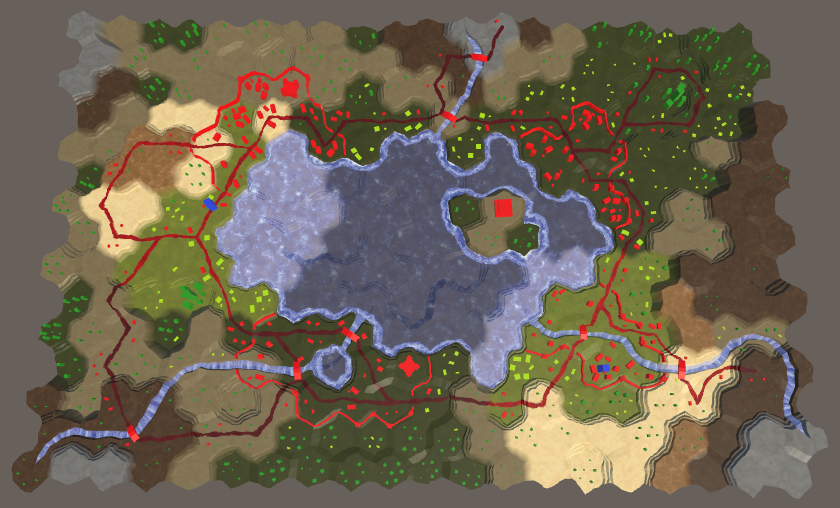 							Open water with visibility. 						

### Water Shores and Estuaries

To support water shores, we have to adjust `**HexGridChunk**.TriangulateWaterShore`  once again. We already created an indices vector, but only used a  single cell index for the open water. The shores also need the neighbor  index, so change that.

```
		Vector3 indices;
//		indices.x = indices.y = indices.z = cell.Index;
		indices.x = indices.z = cell.Index;
		indices.y = neighbor.Index;
```

Add the cell data to the shore quads and triangle. Also pass along the indices when invoking `TriangulateEstuary`.

```
		if (cell.HasRiverThroughEdge(direction)) {
			TriangulateEstuary(
				e1, e2, cell.IncomingRiver == direction, indices
			);
		}
		else {
			…
			waterShore.AddQuadUV(0f, 0f, 0f, 1f);
			waterShore.AddQuadCellData(indices, weights1, weights2);
			waterShore.AddQuadCellData(indices, weights1, weights2);
			waterShore.AddQuadCellData(indices, weights1, weights2);
			waterShore.AddQuadCellData(indices, weights1, weights2);
		}

		HexCell nextNeighbor = cell.GetNeighbor(direction.Next());
		if (nextNeighbor != null) {
			…
			waterShore.AddTriangleUV(
				…
			);
			indices.z = nextNeighbor.Index;
			waterShore.AddTriangleCellData(
				indices, weights1, weights2, weights3
			);
		}
```

Add the required parameter to `TriangulateEstuary`  and take care of the cell data for the shore and the estuary. Remember  that the estuaries are made with a trapezoid, flanked by two shore  triangles. Ensure the weights are provided in the correct order.

```
	void TriangulateEstuary (
		EdgeVertices e1, EdgeVertices e2, bool incomingRiver, Vector3 indices
	) {
		waterShore.AddTriangle(e2.v1, e1.v2, e1.v1);
		waterShore.AddTriangle(e2.v5, e1.v5, e1.v4);
		waterShore.AddTriangleUV(
			new Vector2(0f, 1f), new Vector2(0f, 0f), new Vector2(0f, 0f)
		);
		waterShore.AddTriangleUV(
			new Vector2(0f, 1f), new Vector2(0f, 0f), new Vector2(0f, 0f)
		);
		waterShore.AddTriangleCellData(indices, weights2, weights1, weights1);
		waterShore.AddTriangleCellData(indices, weights2, weights1, weights1);

		estuaries.AddQuad(e2.v1, e1.v2, e2.v2, e1.v3);
		estuaries.AddTriangle(e1.v3, e2.v2, e2.v4);
		estuaries.AddQuad(e1.v3, e1.v4, e2.v4, e2.v5);

		estuaries.AddQuadUV(
			new Vector2(0f, 1f), new Vector2(0f, 0f),
			new Vector2(1f, 1f), new Vector2(0f, 0f)
		);
		estuaries.AddTriangleUV(
			new Vector2(0f, 0f), new Vector2(1f, 1f), new Vector2(1f, 1f)
		);
		estuaries.AddQuadUV(
			new Vector2(0f, 0f), new Vector2(0f, 0f),
			new Vector2(1f, 1f), new Vector2(0f, 1f)
		);
		estuaries.AddQuadCellData(
			indices, weights2, weights1, weights2, weights1
		);
		estuaries.AddTriangleCellData(indices, weights1, weights2, weights2);
		estuaries.AddQuadCellData(indices, weights1, weights2);
		
		…
	}
```

The *WaterShore* shader requires the same changes as the *Water* shader, blending the visibility of three cells.

```
		#pragma surface surf Standard alpha vertex:vert
		#pragma target 3.0

		#include "Water.cginc"
		#include "HexCellData.cginc"

		sampler2D _MainTex;

		struct Input {
			float2 uv_MainTex;
			float3 worldPos;
			float visibility;
		};

		…

		void vert (inout appdata_full v, out Input data) {
			UNITY_INITIALIZE_OUTPUT(Input, data);

			float4 cell0 = GetCellData(v, 0);
			float4 cell1 = GetCellData(v, 1);
			float4 cell2 = GetCellData(v, 2);

			data.visibility =
				cell0.x * v.color.x + cell1.x * v.color.y + cell2.x * v.color.z;
			data.visibility = lerp(0.25, 1, data.visibility);
		}

		void surf (Input IN, inout SurfaceOutputStandard o) {
			…

			fixed4 c = saturate(_Color + max(foam, waves));
			o.Albedo = c.rgb * IN.visibility;
			…
		}
```

The *Estuary* shader blends the visibility of two cells, like the *Road* shader. It already has a vertex program because we needed it to pass through the river UV coordinates.

```
		#include "Water.cginc"
		#include "HexCellData.cginc"

		sampler2D _MainTex;

		struct Input {
			float2 uv_MainTex;
			float2 riverUV;
			float3 worldPos;
			float visibility;
		};

		half _Glossiness;
		half _Metallic;
		fixed4 _Color;

		void vert (inout appdata_full v, out Input o) {
			UNITY_INITIALIZE_OUTPUT(Input, o);
			o.riverUV = v.texcoord1.xy;

			float4 cell0 = GetCellData(v, 0);
			float4 cell1 = GetCellData(v, 1);

			o.visibility = cell0.x * v.color.x + cell1.x * v.color.y;
			o.visibility = lerp(0.25, 1, o.visibility);
		}

		void surf (Input IN, inout SurfaceOutputStandard o) {
			…

			fixed4 c = saturate(_Color + water);
			o.Albedo = c.rgb * IN.visibility;
			…
		}
```

 							
 							Water shores and estuaries with visibility. 						

### Rivers

The last water regions to deal with are the rivers. Add an indices vector parameter to `**HexGridChunk**.TriangulateRiverQuad` and add it to the mesh so it can support the visibility of two cells.

```
	void TriangulateRiverQuad (
		Vector3 v1, Vector3 v2, Vector3 v3, Vector3 v4,
		float y, float v, bool reversed, Vector3 indices
	) {
		TriangulateRiverQuad(v1, v2, v3, v4, y, y, v, reversed, indices);
	}

	void TriangulateRiverQuad (
		Vector3 v1, Vector3 v2, Vector3 v3, Vector3 v4,
		float y1, float y2, float v, bool reversed, Vector3 indices
	) {
		…
		rivers.AddQuadCellData(indices, weights1, weights2);
	}
```

`TriangulateWithRiverBeginOrEnd` creates the end points of rivers with a quad and a triangle in the center of a cell. Add the required cell data for that.

```
	void TriangulateWithRiverBeginOrEnd (
		HexDirection direction, HexCell cell, Vector3 center, EdgeVertices e
	) {
		…

		if (!cell.IsUnderwater) {
			bool reversed = cell.HasIncomingRiver;
			Vector3 indices;
			indices.x = indices.y = indices.z = cell.Index;
			TriangulateRiverQuad(
				m.v2, m.v4, e.v2, e.v4,
				cell.RiverSurfaceY, 0.6f, reversed, indices
			);
			center.y = m.v2.y = m.v4.y = cell.RiverSurfaceY;
			rivers.AddTriangle(center, m.v2, m.v4);
			…
			rivers.AddTriangleCellData(indices, weights1);
		}
	}
```

We already have the cell indices in `TriangulateWithRiver`, so simply pass them along when invoking `TriangulateRiverQuad`.

```
	void TriangulateWithRiver (
		HexDirection direction, HexCell cell, Vector3 center, EdgeVertices e
	) {
		…

		if (!cell.IsUnderwater) {
			bool reversed = cell.IncomingRiver == direction;
			TriangulateRiverQuad(
				centerL, centerR, m.v2, m.v4,
				cell.RiverSurfaceY, 0.4f, reversed, indices
			);
			TriangulateRiverQuad(
				m.v2, m.v4, e.v2, e.v4,
				cell.RiverSurfaceY, 0.6f, reversed, indices
			);
		}
	}
```

Also add support for indices to waterfalls that crash into deeper water.

```
	void TriangulateWaterfallInWater (
		Vector3 v1, Vector3 v2, Vector3 v3, Vector3 v4,
		float y1, float y2, float waterY, Vector3 indices
	) {
		…
		rivers.AddQuadCellData(indices, weights1, weights2);
	}
```

Finally, update `TriangulateConnection` so it provides the needed indices to the river and waterfall methods.

```
	void TriangulateConnection (
		HexDirection direction, HexCell cell, EdgeVertices e1
	) {
		…

		if (hasRiver) {
			e2.v3.y = neighbor.StreamBedY;
			Vector3 indices;
			indices.x = indices.z = cell.Index;
			indices.y = neighbor.Index;

			if (!cell.IsUnderwater) {
				if (!neighbor.IsUnderwater) {
					TriangulateRiverQuad(
						e1.v2, e1.v4, e2.v2, e2.v4,
						cell.RiverSurfaceY, neighbor.RiverSurfaceY, 0.8f,
						cell.HasIncomingRiver && cell.IncomingRiver == direction,
						indices
					);
				}
				else if (cell.Elevation > neighbor.WaterLevel) {
					TriangulateWaterfallInWater(
						e1.v2, e1.v4, e2.v2, e2.v4,
						cell.RiverSurfaceY, neighbor.RiverSurfaceY,
						neighbor.WaterSurfaceY, indices
					);
				}
			}
			else if (
				!neighbor.IsUnderwater &&
				neighbor.Elevation > cell.WaterLevel
			) {
				TriangulateWaterfallInWater(
					e2.v4, e2.v2, e1.v4, e1.v2,
					neighbor.RiverSurfaceY, cell.RiverSurfaceY,
					cell.WaterSurfaceY, indices
				);
			}
		}

		…
	}
```

The *River* shader requires the same changes as the *Road* shader.

```
		#pragma surface surf Standard alpha vertex:vert
		#pragma target 3.0

		#include "Water.cginc"
		#include "HexCellData.cginc"

		sampler2D _MainTex;

		struct Input {
			float2 uv_MainTex;
			float visibility;
		};

		…

		void vert (inout appdata_full v, out Input data) {
			UNITY_INITIALIZE_OUTPUT(Input, data);

			float4 cell0 = GetCellData(v, 0);
			float4 cell1 = GetCellData(v, 1);

			data.visibility = cell0.x * v.color.x + cell1.x * v.color.y;
			data.visibility = lerp(0.25, 1, data.visibility);
		}

		void surf (Input IN, inout SurfaceOutputStandard o) {
			float river = River(IN.uv_MainTex, _MainTex);
			
			fixed4 c = saturate(_Color + river);
			o.Albedo = c.rgb * IN.visibility;
			…
		}
```

 							
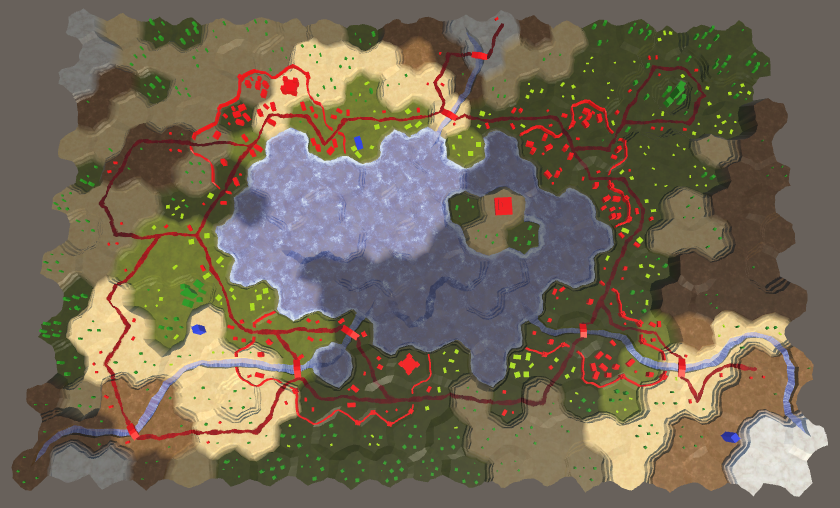 							Rivers with visibility. 						

unitypackage

## Features and Visibility

Visibility now works for the procedurally-generated terrain, but  the terrain features are still unaffected by it. Buildings, farms, and  trees are made by instantiating prefabs, not with procedural geometry.  So we cannot add cell indices and blend weights to their vertices. As  these features belong to a single cell each, we have to figure out which  cell they belong to. If we can do that, we can access the relevant cell  data and apply the visibility.

We can already convert world XZ positions into cell indices. We  use that to edit the terrain and manipulate units. However, the relevant  code isn't trivial. It relies on integer operations and requires logic  to deal with edge cases. That's isn't practical in a shader. Instead, we  can bake most of the logic in a texture and use that.

We already use a texture with a hexagonal pattern to project the  grid on top of the terrain. That texture defines a 2×2 cell region. So  it's easy to figure out which region we're in. We can then use a texture  that contains X and Z offsets for the cells in that region and use that  to pinpoint the cell we're in.

Here is such a texture. The X offset is stored in its red  channel and the Z offset is stored in its green channel. As it covers a  2×2 cell region, we need offsets between 0 and 2. This cannot be stored  in a color channel, so the offsets are halved. We don't need crisp cell  edges, so a small texture suffices.

 						
 						Grid coordinates texture. 					

Add the texture to the project. Make sure its *Wrap Mode* is set to *Repeat*, just like the other grid texture. We don't want any blending, so set its *Blend Mode* to *Point*. Also disable *Compression* so the data doesn't get messed up. Disable *sRGB* mode, to ensure that no color space conversions are performed when rendering in linear mode. Finally, we don't need mipmaps.

 						
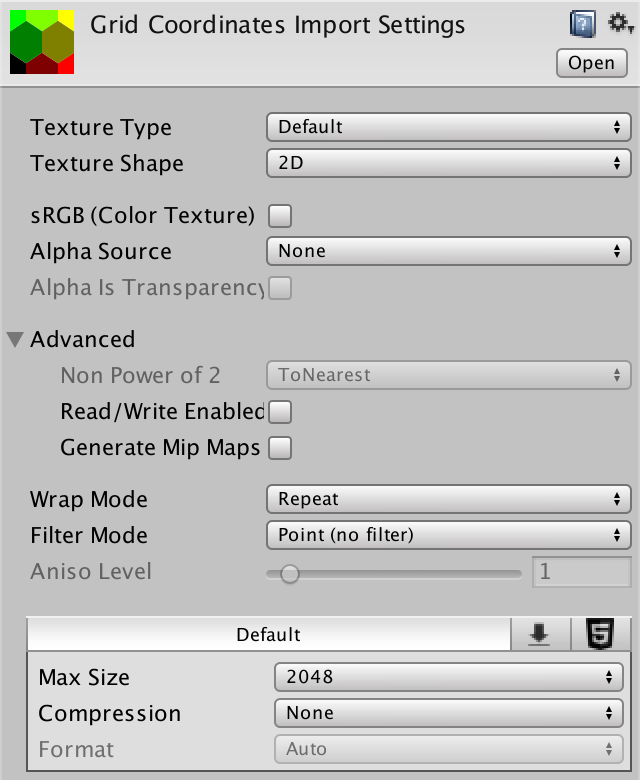 						Texture import settings. 					

### Feature Shader With Visibility

Create a new *Feature* shader to add visibility support to features. It's a straightforward surface shader, with a vertex program. Include *HexCellData*  and pass the visibility factor to the fragment program and factor it  into the color, as usual. What's different is that we cannot use `GetCellData`, because the required mesh data is missing. Instead, we'll use the world position. But for now, leave visibility at 1.

```
Shader "Custom/Feature" {
	Properties {
		_Color ("Color", Color) = (1,1,1,1)
		_MainTex ("Albedo (RGB)", 2D) = "white" {}
		_Glossiness ("Smoothness", Range(0,1)) = 0.5
		_Metallic ("Metallic", Range(0,1)) = 0.0
		[NoTilingOffset] _GridCoordinates ("Grid Coordinates", 2D) = "white" {}
	}
	SubShader {
		Tags { "RenderType"="Opaque" }
		LOD 200
		
		CGPROGRAM
		#pragma surface surf Standard fullforwardshadows vertex:vert
		#pragma target 3.0

		#include "../HexCellData.cginc"

		sampler2D _MainTex, _GridCoordinates;

		half _Glossiness;
		half _Metallic;
		fixed4 _Color;

		struct Input {
			float2 uv_MainTex;
			float visibility;
		};

		void vert (inout appdata_full v, out Input data) {
			UNITY_INITIALIZE_OUTPUT(Input, data);
			float3 pos = mul(unity_ObjectToWorld, v.vertex);

			data.visibility = 1;
		}

		void surf (Input IN, inout SurfaceOutputStandard o) {
			fixed4 c = tex2D (_MainTex, IN.uv_MainTex) * _Color;
			o.Albedo = c.rgb * IN.visibility;
			o.Metallic = _Metallic;
			o.Smoothness = _Glossiness;
			o.Alpha = c.a;
		}
		ENDCG
	}
	FallBack "Diffuse"
}
```

Change all feature materials so they use the new shader and assign the grid-coordinates texture to them.

 							
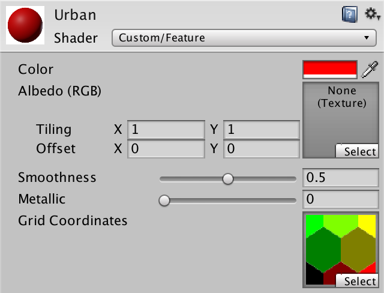 							Urban material with grid texture. 						

### Accessing the Cell Data

To sample the grid-coordinates texture in the vertex program, we again need to use `tex2Dlod`  with a four-component texture coordinates vector. The first two  coordinates are the world XZ position. The other two are zero, as  before.

```
		void vert (inout appdata_full v, out Input data) {
			UNITY_INITIALIZE_OUTPUT(Input, data);
			float3 pos = mul(unity_ObjectToWorld, v.vertex);

			float4 gridUV = float4(pos.xz, 0, 0);

			data.visibility = 1;
		}
```

Like in the *Terrain* shader, stretch the UV coordinates so the texture has the proper aspect ratio, matching the actual hexagonal grid.

```
			float4 gridUV = float4(pos.xz, 0, 0);
			gridUV.x *= 1 / (4 * 8.66025404);
			gridUV.y *= 1 / (2 * 15.0);
```

We can find which 2×2 cell patch we're in by taking the floor  of the UV coordinates. This forms the basis of our cell coordinates.

```
			float4 gridUV = float4(pos.xz, 0, 0);
			gridUV.x *= 1 / (4 * 8.66025404);
			gridUV.y *= 1 / (2 * 15.0);
			float2 cellDataCoordinates = floor(gridUV.xy);
```

To find the coordinates of the cell we're in, add the offsets stored in the texture.

```
			float2 cellDataCoordinates =
				floor(gridUV.xy) + tex2Dlod(_GridCoordinates, gridUV).rg;
```

Because the grid patch is 2×2 and the offsets are halved, we have to double the result to arrive at the final coordinates.

```
			float2 cellDataCoordinates =
				floor(gridUV.xy) + tex2Dlod(_GridCoordinates, gridUV).rg;
			cellDataCoordinates *= 2;
```

We now have XZ cell grid coordinates, which have to be  converted into cell data UV coordinates. This is done by simply shifting  to the pixel centers followed by dividing by the texture sizes. Let's  add a function for that to the *HexCellData* include file, also taking care of the sampling.

```
float4 GetCellData (float2 cellDataCoordinates) {
	float2 uv = cellDataCoordinates + 0.5;
	uv.x *= _HexCellData_TexelSize.x;
	uv.y *= _HexCellData_TexelSize.y;
	return tex2Dlod(_HexCellData, float4(uv, 0, 0));
}
```

Now we can use this function in the vertex program of the *Feature* shader.

```
			cellDataCoordinates *= 2;

			data.visibility = GetCellData(cellDataCoordinates).x;
			data.visibility = lerp(0.25, 1, data.visibility);
```

 							
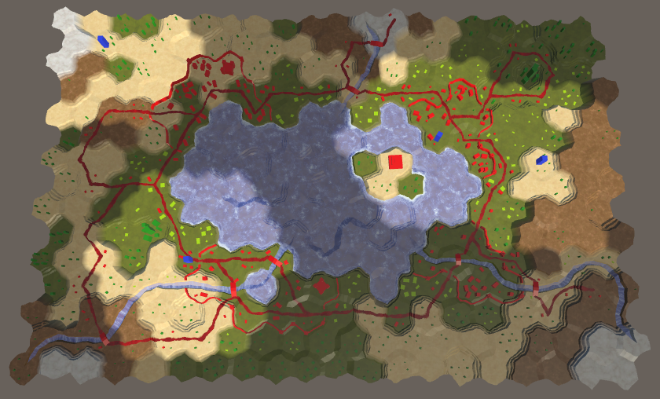 							Features with visibility. 						

Finally everything is affected by visibility, except units as  they're always visible. Because we're determining the visibility of  features per vertex, a feature that crosses a cell boundary will end up  blending between the visibility of the cells it covers. The idea is that  features are small enough that they always stay inside their cell, even  when taking position perturbation into account. But some might end up  with a few vertices in another cell. So our approach is cheap, but not  perfect. This is most obvious for walls, which can end up oscillating  between the visibility of the cells they sit between.

 							
 							Walls with varying visibility. 						

As the wall segments are procedurally generated, we could add  cell data to their mesh and switch to the approach that we use for the  terrain. Unfortunately, the wall towers are prefabs, so we'll still have  those inconsistencies. In general, the current approach looks good  enough for the simple geometry that we're using in this tutorial.

The next tutorial is [Exploration](https://catlikecoding.com/unity/tutorials/hex-map/part-21/).

unitypackage

PDF
