 			[](https://catlikecoding.com) 			 				 					[Catlike Coding](https://catlikecoding.com) 					[Unity](https://catlikecoding.com/unity/) 					[Tutorials](https://catlikecoding.com/unity/tutorials/) 					[Hex Map](https://catlikecoding.com/unity/tutorials/hex-map/) 				 			 		

# Hex Map 8

Water

- Add water to cells.
- Triangulate a water surface.
- Create shore water with foam.
- Make water and rivers play nice.

This tutorial is the eighth part of a series about [hexagon maps](https://catlikecoding.com/unity/tutorials/hex-map/). We have already added support for rivers. Now we're going to completely submerge cells.

 					
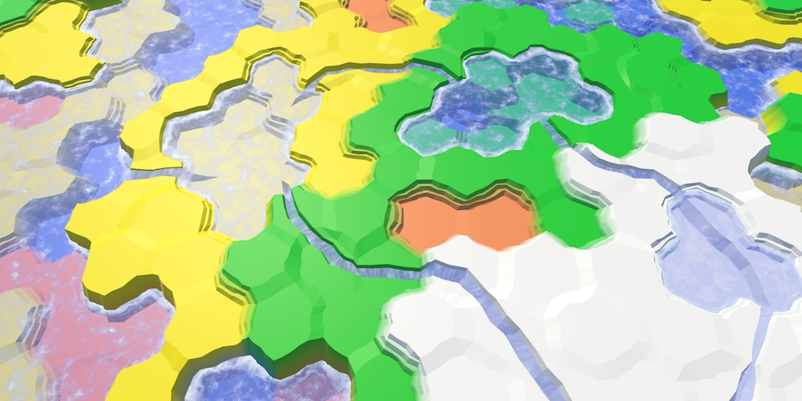 					The water level is rising. 				

## Water Level

The most straightforward way to support water is to define a  uniform water level. All cells that have an elevation lower than that  level are submerged. But it's more flexible to support water at  different elevations, so let's make the water level variable. This  requires each `**HexCell**` to keep track of its water level.

```
	public int WaterLevel {
		get {
			return waterLevel;
		}
		set {
			if (waterLevel == value) {
				return;
			}
			waterLevel = value;
			Refresh();
		}
	}
	
	int waterLevel;
```

If you want to, you could enforce that certain terrain features  cannot exist while underwater. But I'm not going to at this point.  Things like underwater roads are fine. It might represent an area that  has been recently submerged.

### Submerging Cells

Now that we have water levels, the most important question is  whether a cells is underwater or not. A cell is submerged if its water  level is higher than its elevation. Add a property to retrieve this  information.

```
	public bool IsUnderwater {
		get {
			return waterLevel > elevation;
		}
	}
```

This means that when the water level and elevation are equal,  the cell rises above the water. So the actual water surface is somewhere  below that elevation. Just like the surfaces of rivers, so let's use  the same offset, `**HexMetrics**.riverSurfaceElevationOffset`. Change its name to be more generic.

```
//	public const float riverSurfaceElevationOffset = -0.5f;
	public const float waterElevationOffset = -0.5f;
```

Adjust `**HexCell**.RiverSurfaceY` so it uses the new name. Then add a similar property for the water surface of a submerged cell.

```
	public float RiverSurfaceY {
		get {
			return
				(elevation + HexMetrics.waterElevationOffset) *
				HexMetrics.elevationStep;
		}
	}
	
	public float WaterSurfaceY {
		get {
			return
				(waterLevel + HexMetrics.waterElevationOffset) *
				HexMetrics.elevationStep;
		}
	}
```

### Editing Water

Editing the water level of a cell works just like editing its elevation. So `**HexMapEditor**` has to keep track of the active water level, and whether it should be applied to cells.

```
	int activeElevation;
	int activeWaterLevel;

	…
	
	bool applyElevation = true;
	bool applyWaterLevel = true;
	
	
```

Add the methods to connect these settings with the UI.

```
	public void SetApplyWaterLevel (bool toggle) {
		applyWaterLevel = toggle;
	}
	
	public void SetWaterLevel (float level) {
		activeWaterLevel = (int)level;
	}
```

And include the water level in `EditCell`.

```
	void EditCell (HexCell cell) {
		if (cell) {
			if (applyColor) {
				cell.Color = activeColor;
			}
			if (applyElevation) {
				cell.Elevation = activeElevation;
			}
			if (applyWaterLevel) {
				cell.WaterLevel = activeWaterLevel;
			}
			…
		}
	}
```

To add the water level to the UI, duplicate the elevation label  and slider and adjust them. Don't forget to hook their events to the  correct methods.

 							
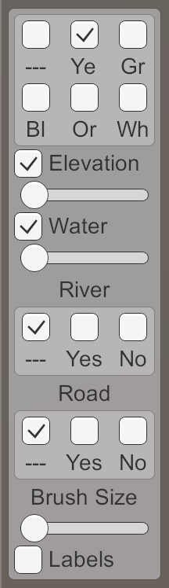 							Water level slider. 						

unitypackage

## Triangulating Water

We need a new mesh to triangulate the water, with a new material. First, create a *Water* shader by duplicating the *River* shader. Change it so it just uses the color property.

```
Shader "Custom/Water" {
	Properties {
		_Color ("Color", Color) = (1,1,1,1)
		_MainTex ("Albedo (RGB)", 2D) = "white" {}
		_Glossiness ("Smoothness", Range(0,1)) = 0.5
		_Metallic ("Metallic", Range(0,1)) = 0.0
	}
	SubShader {
		Tags { "RenderType"="Transparent" "Queue"="Transparent" }
		LOD 200
		
		CGPROGRAM
		#pragma surface surf Standard alpha
		#pragma target 3.0

		sampler2D _MainTex;

		struct Input {
			float2 uv_MainTex;
		};

		half _Glossiness;
		half _Metallic;
		fixed4 _Color;

		void surf (Input IN, inout SurfaceOutputStandard o) {
			fixed4 c = _Color;
			o.Albedo = c.rgb;
			o.Metallic = _Metallic;
			o.Smoothness = _Glossiness;
			o.Alpha = c.a;
		}
		ENDCG
	}
	FallBack "Diffuse"
}
```

Create a new material with this shader, by duplicating the *Water* material and changing its shader. Keep the noise texture, as we'll use it later.

 						
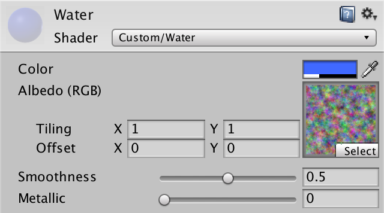 						Water material. 					

Add a new child object to the prefab by duplicating the *Rivers* child object. It doesn't need UV coordinates, and should use the *Water*  material. As usual, do this by creating a prefab instance, changing  that one, then applying the changes to the prefab. Afterwards, get rid  of the instance.

 						 						 						Water child object. 					

Next, add support for a water mesh to `**HexGridChunk**`.

```
	public HexMesh terrain, rivers, roads, water;

	public void Triangulate () {
		terrain.Clear();
		rivers.Clear();
		roads.Clear();
		water.Clear();
		for (int i = 0; i < cells.Length; i++) {
			Triangulate(cells[i]);
		}
		terrain.Apply();
		rivers.Apply();
		roads.Apply();
		water.Apply();
	}
```

And make sure to connect it with the actual prefab child object.

 						
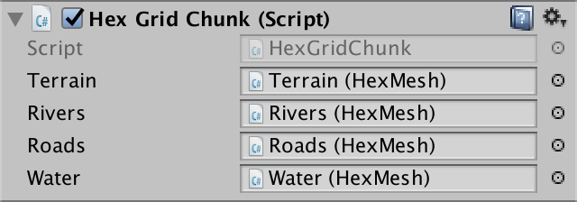 						Water object connected. 					

### Water Hexagons

As the water forms a second layer, let's give it its own  triangulation method, per direction. We only need to invoke it when a  cell is submerged.

```
	void Triangulate (HexDirection direction, HexCell cell) {
		…

		if (cell.IsUnderwater) {
			TriangulateWater(direction, cell, center);
		}
	}

	void TriangulateWater (
		HexDirection direction, HexCell cell, Vector3 center
	) {
	}
```

Just as with rivers, the height of the water surface doesn't  vary between cells with the same water level. As such, it looks like we  don't need complex edges. A simply triangle will do.

```
	void TriangulateWater (
		HexDirection direction, HexCell cell, Vector3 center
	) {
		center.y = cell.WaterSurfaceY;
		Vector3 c1 = center + HexMetrics.GetFirstSolidCorner(direction);
		Vector3 c2 = center + HexMetrics.GetSecondSolidCorner(direction);

		water.AddTriangle(center, c1, c2);
	}
```

 							
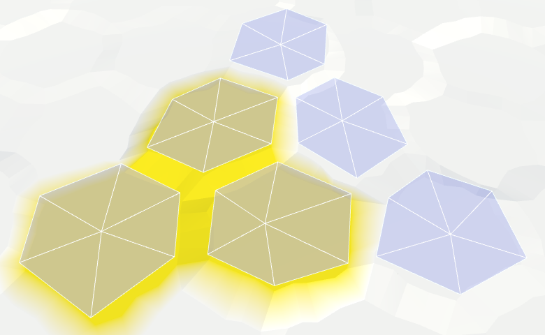 							Water hexagons. 						

### Water Connections

We can connect adjacent water cells with a single quad.

```
		water.AddTriangle(center, c1, c2);

		if (direction <= HexDirection.SE) {
			HexCell neighbor = cell.GetNeighbor(direction);
			if (neighbor == null || !neighbor.IsUnderwater) {
				return;
			}

			Vector3 bridge = HexMetrics.GetBridge(direction);
			Vector3 e1 = c1 + bridge;
			Vector3 e2 = c2 + bridge;

			water.AddQuad(c1, c2, e1, e2);
		}
```

 							
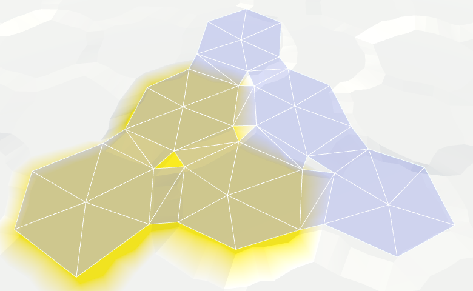 							Water edge connections. 						

And fill the corners with a single triangle.

```
		if (direction <= HexDirection.SE) {
			…

			water.AddQuad(c1, c2, e1, e2);

			if (direction <= HexDirection.E) {
				HexCell nextNeighbor = cell.GetNeighbor(direction.Next());
				if (nextNeighbor == null || !nextNeighbor.IsUnderwater) {
					return;
				}
				water.AddTriangle(
					c2, e2, c2 + HexMetrics.GetBridge(direction.Next())
				);
			}
		}
```

 							
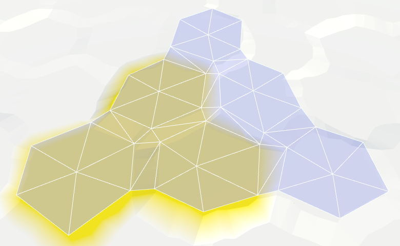 							Water corner connections. 						

We now have water cells that connect when they are adjacent.  They leave a gap between themselves and dry cells with a higher  elevation, but we'll deal with that later.

### Consistent Water Levels

We have made the assumption that adjacent submerged cells have  the same water level. Things look good when this is indeed the case, but  it goes wrong when we violate this assumption.

 							
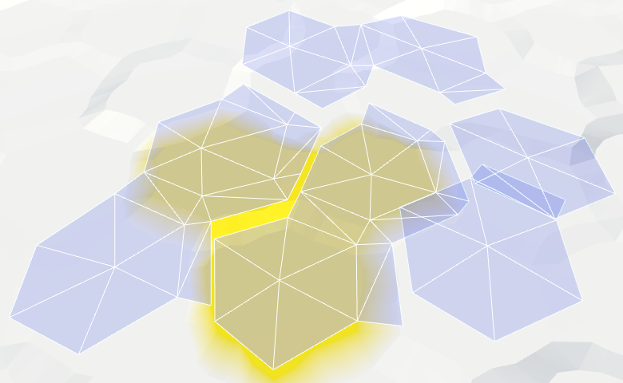 							Inconsistent water levels. 						

We could try to force our water levels to stay at the same  level. For example, when adjusting the water level of a submerged cell,  we could propagate changes to adjacent cells to keep the water level  synchronized. However, this process has to keep going until it  encounters cells that end up not submerged. Those cells define the  boundary of the water body.

The danger of this approach is that it can quickly go out of  control. An unlucky edit could submerge the entire map. Then all chunks  will need to be triangulating at the same time, causing a big lag spike.

So let's not do that now. It can be a feature of a more advanced editor. For now, it's up to the user to stay consistent.

unitypackage

## Animating Water

Instead of using a uniform color, let's create something that  looks somewhat like waves. As with our other shaders, we're not aiming  for great visuals at this time. Just a suggestion of waves will do.

 						
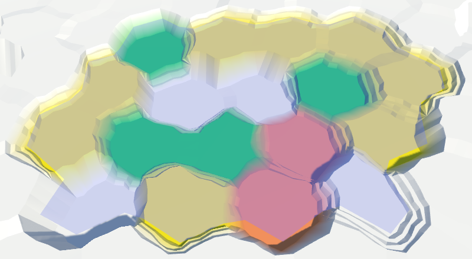 						Perfectly flat water. 					

Let's do the same thing that we did with rivers. Sample some  noise using the wold position, and add it to the uniform color. To  animate it, add the time to the V coordinate.

```
		struct Input {
			float2 uv_MainTex;
			float3 worldPos;
		};

		…

		void surf (Input IN, inout SurfaceOutputStandard o) {
			float2 uv = IN.worldPos.xz;
			uv.y += _Time.y;
			float4 noise = tex2D(_MainTex, uv * 0.025);
			float waves = noise.z;

			fixed4 c = saturate(_Color + waves);
			o.Albedo = c.rgb;
			o.Metallic = _Metallic;
			o.Smoothness = _Glossiness;
			o.Alpha = c.a;
		}
```

<iframe src="https://gfycat.com/ifr/AcceptableDarlingCoypu"></iframe>

Scrolling water, time ×10.

### Two Directions

That doesn't look like waves at all. Let's make it more complex  by adding a second noise sample, adding the time to the U coordinate  this time. Use a different noise channel so you end up with two  different patterns. The final waves will be these two samples added  together.

```
			float2 uv1 = IN.worldPos.xz;
			uv1.y += _Time.y;
			float4 noise1 = tex2D(_MainTex, uv1 * 0.025);

			float2 uv2 = IN.worldPos.xz;
			uv2.x += _Time.y;
			float4 noise2 = tex2D(_MainTex, uv2 * 0.025);

			float waves = noise1.z + noise2.x;
```

Summing both samples can produces results in the 0–2 range, so  we have to scale that back to 0–1. Instead of just halving the waves, we  can use the `smoothstep` function to create a more interesting result. We'll map ¾–2 to 0–1, so part of the water surface ends up without visible waves.

```
			float waves = noise1.z + noise2.x;
			waves = smoothstep(0.75, 2, waves);
```

<iframe src="https://gfycat.com/ifr/FaroffImpassionedIberianlynx"></iframe>

Two directions, time ×10.

### Blend Waves

It is still quite obvious that we have two scrolling noise  patterns that don't actually change. It will be more convincing if the  patterns changed. We can do this by interpolating between different  channels of the noise samples. But we shouldn't do this uniformly,  because then the entire water surface would change at the same time.  That would be very obvious. Instead, we'll use a blend wave.

We produce a blend wave by creating a sine wave that runs  diagonally across the water surface. We do that by adding the X and Z  world coordinates together and using that as input of the `sin` function. Scale them down so that we get reasonably large bands. And off course add the same, to animate it.

```
			float blendWave =
				sin((IN.worldPos.x + IN.worldPos.z) * 0.1 + _Time.y);
```

Sine waves undulate between -1 and 1, but we need a 0–1 range.  We can get there by squaring the wave. To see the result in isolation,  use it as the output, instead of the adjusted color.

```
			sin((IN.worldPos.x + IN.worldPos.z) * 0.1 + _Time.y);
			blendWave *= blendWave;

			float waves = noise1.z + noise2.x;
			waves = smoothstep(0.75, 2, waves);

			fixed4 c = blendWave; //saturate(_Color + waves);
```

 							
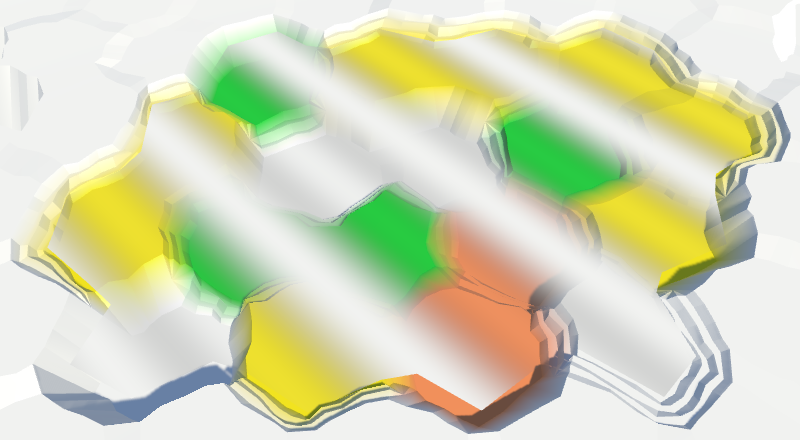 							Blend waves. 						

To make the blend wave a bit less obvious, add some noise to it, from both samples.

```
			float blendWave = sin(
				(IN.worldPos.x + IN.worldPos.z) * 0.1 +
				(noise1.y + noise2.z) + _Time.y
			);
			blendWave *= blendWave;
```

 							
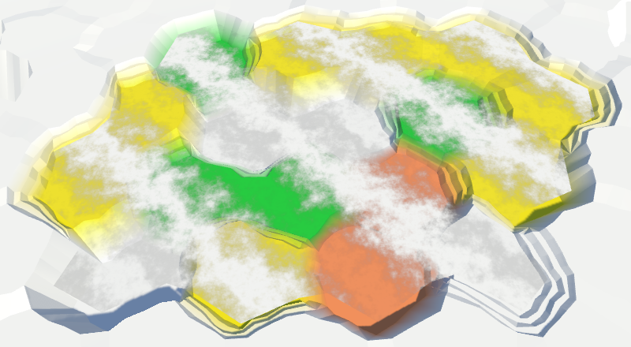 							Perturbed blend waves. 						

Finally, use the blend wave to interpolate between two  channels, for both of our noise samples. Use four different channels for  maximum variety.

```
			float waves =
				lerp(noise1.z, noise1.w, blendWave) +
				lerp(noise2.x, noise2.y, blendWave);
			waves = smoothstep(0.75, 2, waves);

			fixed4 c = saturate(_Color + waves);
```

<iframe src="https://gfycat.com/ifr/UnlawfulPolishedAmurminnow"></iframe>

Wave blending, time ×2.

unitypackage

## Shore Water

We are done with open water, but still have to fill the gap in  the water along the shore. Because we have to match the contours of the  land, the shore water requires a separate approach. Let's split `TriangulateWater`  into two methods, one for open water and one for shore water. To  determine whether we have a shore, we have to look at the neighbor cell.  So retrieving the neighbor stays in `TriangulateWater`. If there is a neighbor and it is not underwater, then we're dealing with shore water.

```
	void TriangulateWater (
		HexDirection direction, HexCell cell, Vector3 center
	) {
		center.y = cell.WaterSurfaceY;

		HexCell neighbor = cell.GetNeighbor(direction);
		if (neighbor != null && !neighbor.IsUnderwater) {
			TriangulateWaterShore(direction, cell, neighbor, center);
		}
		else {
			TriangulateOpenWater(direction, cell, neighbor, center);
		}
	}

	void TriangulateOpenWater (
		HexDirection direction, HexCell cell, HexCell neighbor, Vector3 center
	) {
		Vector3 c1 = center + HexMetrics.GetFirstSolidCorner(direction);
		Vector3 c2 = center + HexMetrics.GetSecondSolidCorner(direction);

		water.AddTriangle(center, c1, c2);

		if (direction <= HexDirection.SE && neighbor != null) {
//			HexCell neighbor = cell.GetNeighbor(direction);
//			if (neighbor == null || !neighbor.IsUnderwater) {
//				return;
//			}
			
			Vector3 bridge = HexMetrics.GetBridge(direction);
			…
		}
	}

	void TriangulateWaterShore (
		HexDirection direction, HexCell cell, HexCell neighbor, Vector3 center
	) {
		
	}
```

 						
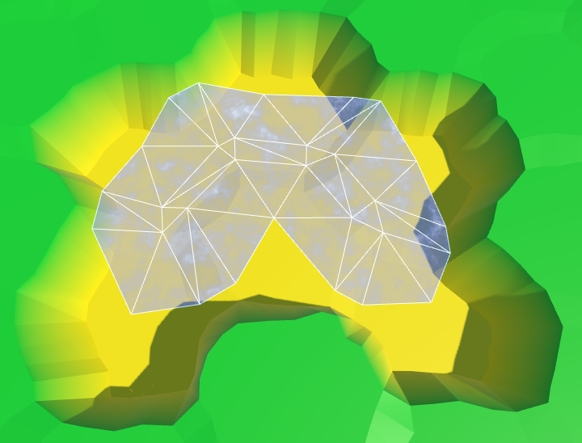 						No triangulation along the shore. 					

Because the shore is perturbed, we should perturb the water  triangles along the shore as well. So we need edge vertices and a  triangle fan.

```
	void TriangulateWaterShore (
		HexDirection direction, HexCell cell, HexCell neighbor, Vector3 center
	) {
		EdgeVertices e1 = new EdgeVertices(
			center + HexMetrics.GetFirstSolidCorner(direction),
			center + HexMetrics.GetSecondSolidCorner(direction)
		);
		water.AddTriangle(center, e1.v1, e1.v2);
		water.AddTriangle(center, e1.v2, e1.v3);
		water.AddTriangle(center, e1.v3, e1.v4);
		water.AddTriangle(center, e1.v4, e1.v5);
	}
```

 						
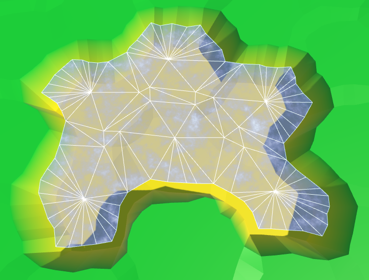 						Triangle fans along the shore. 					

Next comes the edge strip, just like for regular terrain.  However, we do not have to limit ourselves to only some directions.  That's because we're only invoking `TriangulateWaterShore` when we are facing a shore, which always requires a strip.

```
		water.AddTriangle(center, e1.v4, e1.v5);
		
		Vector3 bridge = HexMetrics.GetBridge(direction);
		EdgeVertices e2 = new EdgeVertices(
			e1.v1 + bridge,
			e1.v5 + bridge
		);
		water.AddQuad(e1.v1, e1.v2, e2.v1, e2.v2);
		water.AddQuad(e1.v2, e1.v3, e2.v2, e2.v3);
		water.AddQuad(e1.v3, e1.v4, e2.v3, e2.v4);
		water.AddQuad(e1.v4, e1.v5, e2.v4, e2.v5);
```

 						
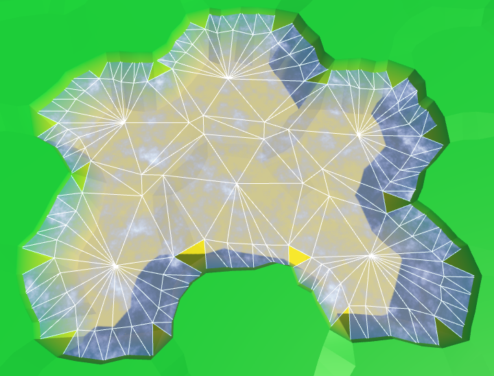 						Edge strips along the shore. 					

Likewise, we also have to add a corner triangle every time.

```
		water.AddQuad(e1.v4, e1.v5, e2.v4, e2.v5);

		HexCell nextNeighbor = cell.GetNeighbor(direction.Next());
		if (nextNeighbor != null) {
			water.AddTriangle(
				e1.v5, e2.v5, e1.v5 + HexMetrics.GetBridge(direction.Next())
			);
		}
```

 						
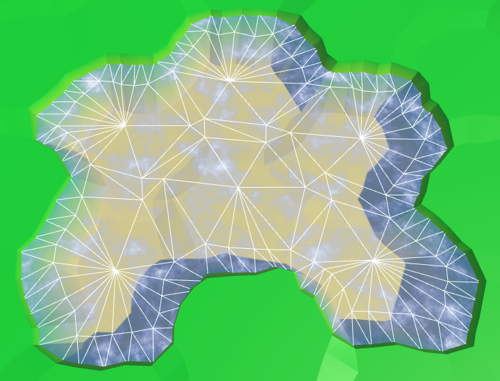 						Edge corners along the shore. 					

We now have complete shore water. Part of it always ends up below the terrain mesh, so there are no gaps.

### Shore UV

We could leave it like this, but it's more interesting if the  shore water had some extra visuals. A foam effect, which gets stronger  the closer you get to the shore. To support this, the shader has to know  how close a fragment is to the shore. We could provide this information  via UV coordinates.

Our open water doesn't have UV coordinates, and it doesn't need  any foam. That's only needed for the water near the shore. So the  requirements of both types of water are quite different. It makes sense  to give each type its own mesh. So add support for another mesh object  to `**HexGridChunk**`.

```
	public HexMesh terrain, rivers, roads, water, waterShore;
	
	public void Triangulate () {
		terrain.Clear();
		rivers.Clear();
		roads.Clear();
		water.Clear();
		waterShore.Clear();
		for (int i = 0; i < cells.Length; i++) {
			Triangulate(cells[i]);
		}
		terrain.Apply();
		rivers.Apply();
		roads.Apply();
		water.Apply();
		waterShore.Apply();
	}
```

`TriangulateWaterShore` will use this new mesh.

```
	void TriangulateWaterShore (
		HexDirection direction, HexCell cell, HexCell neighbor, Vector3 center
	) {
		…
		waterShore.AddQuad(e1.v1, e1.v2, e2.v1, e2.v2);
		waterShore.AddQuad(e1.v2, e1.v3, e2.v2, e2.v3);
		waterShore.AddQuad(e1.v3, e1.v4, e2.v3, e2.v4);
		waterShore.AddQuad(e1.v4, e1.v5, e2.v4, e2.v5);

		HexCell nextNeighbor = cell.GetNeighbor(direction.Next());
		if (nextNeighbor != null) {
			waterShore.AddTriangle(
				e1.v5, e2.v5, e1.v5 + HexMetrics.GetBridge(direction.Next())
			);
		}
	}
```

Duplicate the water object, connect it with the prefab, and  configure it to use UV coordinates. Also create a shader and material  for the shore water, by duplicating the exiting water shader and  material.

 							
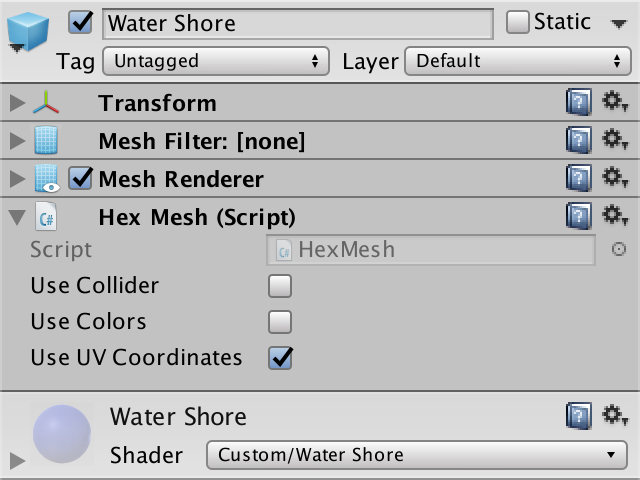 							Water shore object and material, with UV. 						

Adjust the *Water Shore* shader so it shows the UV coordinates instead of water.

```
			fixed4 c = fixed4(IN.uv_MainTex, 1, 1);
```

As we're not setting the coordinates yet, it will produce a  solid color. This makes it easy to see that the water shore indeed uses a  separate mesh and material.

 							
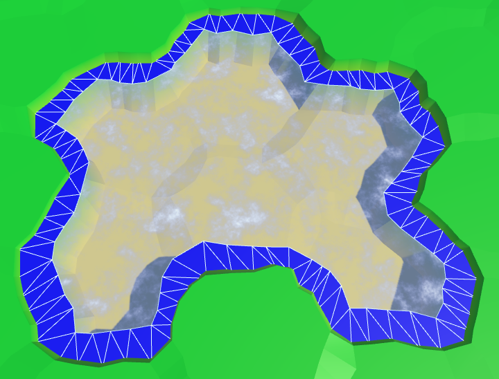 							Separate mesh for the water shore. 						

Let's put the information about the shore in the V coordinate.  Set it to 0 on the water side and to 1 on the land side. As we don't  need to communicate anything else, all U coordinates can just be 0.

```
		waterShore.AddQuad(e1.v1, e1.v2, e2.v1, e2.v2);
		waterShore.AddQuad(e1.v2, e1.v3, e2.v2, e2.v3);
		waterShore.AddQuad(e1.v3, e1.v4, e2.v3, e2.v4);
		waterShore.AddQuad(e1.v4, e1.v5, e2.v4, e2.v5);
		waterShore.AddQuadUV(0f, 0f, 0f, 1f);
		waterShore.AddQuadUV(0f, 0f, 0f, 1f);
		waterShore.AddQuadUV(0f, 0f, 0f, 1f);
		waterShore.AddQuadUV(0f, 0f, 0f, 1f);

		HexCell nextNeighbor = cell.GetNeighbor(direction.Next());
		if (nextNeighbor != null) {
			waterShore.AddTriangle(
				e1.v5, e2.v5, e1.v5 + HexMetrics.GetBridge(direction.Next())
			);
			waterShore.AddTriangleUV(
				new Vector2(0f, 0f),
				new Vector2(0f, 1f),
				new Vector2(0f, 0f)
			);
		}
```

 							
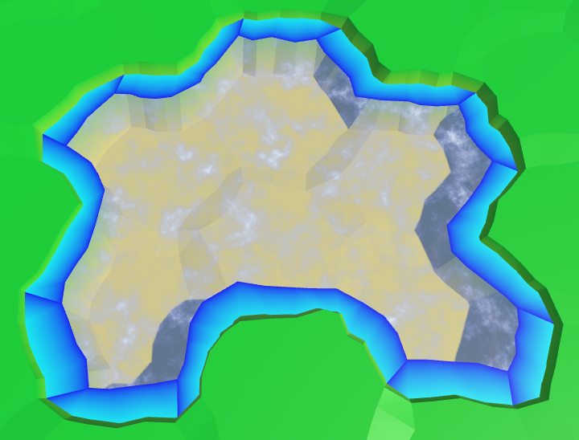 							Shore transitions, incorrect. 						

The above code works for edges, but goes wrong for some of the  corners. If the next neighbor is underwater, the current approach is  correct. But when the next neighbor is not underwater, then the third  vertex of the triangle is below land.

```
			waterShore.AddTriangleUV(
				new Vector2(0f, 0f),
				new Vector2(0f, 1f),
				new Vector2(0f, nextNeighbor.IsUnderwater ? 0f : 1f)
			);
```

 							
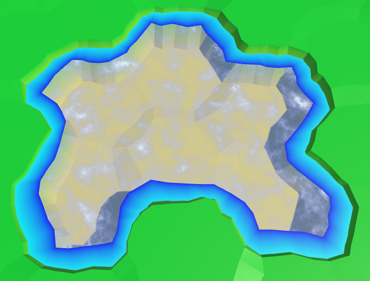 							Shore transitions, correct. 						

### Shore Foam

Now that the shore transitions are correct, we can use them to  create some foam effects. The simplest approach is to add the shore  value to the uniform color.

```
		void surf (Input IN, inout SurfaceOutputStandard o) {
			float shore = IN.uv_MainTex.y;
			
			float foam = shore;

			fixed4 c = saturate(_Color + foam);
			o.Albedo = c.rgb;
			o.Metallic = _Metallic;
			o.Smoothness = _Glossiness;
			o.Alpha = c.a;
		}
```

 							
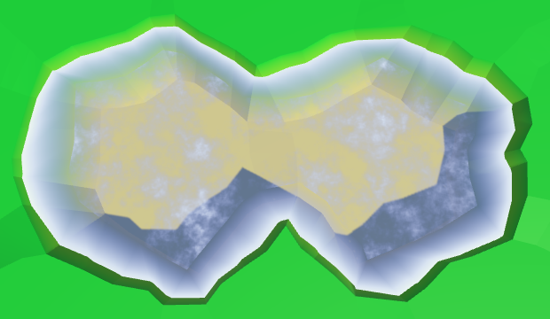 							Linear foam. 						

To make it more interesting, factor a squared sine wave into it.

```
			float foam = sin(shore * 10);
			foam *= foam * shore;
```

 							
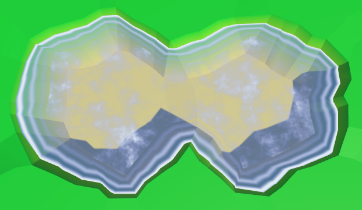 							Fading squared sine foam. 						

Let's make the foam front grow bigger as it approaches the  shore. This can be done by taking the square root of the shore value  before using it.

```
			float shore = IN.uv_MainTex.y;
			shore = sqrt(shore);
```

 							
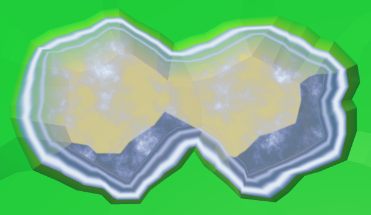 							Foam becomes stronger near the shore. 						

Add some distortion to make it look more natural. Make the  distortion grow weaker the closer it gets to the shore. That way it will  better match the coastline.

```
			float2 noiseUV = IN.worldPos.xz;
			float4 noise = tex2D(_MainTex, noiseUV * 0.015);

			float distortion = noise.x * (1 - shore);
			float foam = sin((shore + distortion) * 10);
			foam *= foam * shore;
```

 							
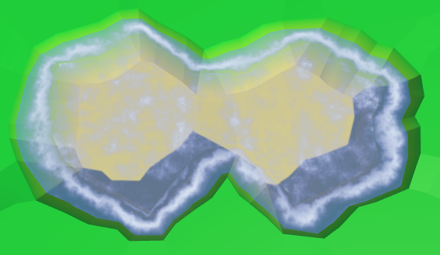 							Perturbed foam. 						

And of course animate it all, both the sine wave and the distortion.

```
			float2 noiseUV = IN.worldPos.xz + _Time.y * 0.25;
			float4 noise = tex2D(_MainTex, noiseUV * 0.015);

			float distortion = noise.x * (1 - shore);
			float foam = sin((shore + distortion) * 10 - _Time.y);
			foam *= foam * shore;
```

<iframe src="https://gfycat.com/ifr/SpryWideeyedBrownbear"></iframe>

Animated foam.

Besides advancing foam, there is also receding foam. Let's add a  second sine wave that moves in the opposite direction to simulate that.  Make it a little weaker and give it a time offset. The final foam is  the maximum of these two sine waves.

```
			float distortion1 = noise.x * (1 - shore);
			float foam1 = sin((shore + distortion1) * 10 - _Time.y);
			foam1 *= foam1;

			float distortion2 = noise.y * (1 - shore);
			float foam2 = sin((shore + distortion2) * 10 + _Time.y + 2);
			foam2 *= foam2 * 0.7;

			float foam = max(foam1, foam2) * shore;
```

<iframe src="https://gfycat.com/ifr/SerpentineAlarmedBlackpanther"></iframe>

Advancing and receding foam.

### Bleding Waves and Foam

There is a harsh transition between the open and shore water,  because the waves from the open water are not included in the water  shore. To fix this, we have to include those waves in the *Water Shore* shader as well.

Instead of copying the wave code, let's put it in a *Water.cginc* include file. In fact, put both the code for foam and wave in it, each as a separate function.

 							How do shader include files work? 							 						

```
float Foam (float shore, float2 worldXZ, sampler2D noiseTex) {
//	float shore = IN.uv_MainTex.y;
	shore = sqrt(shore);

	float2 noiseUV = worldXZ + _Time.y * 0.25;
	float4 noise = tex2D(noiseTex, noiseUV * 0.015);

	float distortion1 = noise.x * (1 - shore);
	float foam1 = sin((shore + distortion1) * 10 - _Time.y);
	foam1 *= foam1;

	float distortion2 = noise.y * (1 - shore);
	float foam2 = sin((shore + distortion2) * 10 + _Time.y + 2);
	foam2 *= foam2 * 0.7;

	return max(foam1, foam2) * shore;
}

float Waves (float2 worldXZ, sampler2D noiseTex) {
	float2 uv1 = worldXZ;
	uv1.y += _Time.y;
	float4 noise1 = tex2D(noiseTex, uv1 * 0.025);

	float2 uv2 = worldXZ;
	uv2.x += _Time.y;
	float4 noise2 = tex2D(noiseTex, uv2 * 0.025);

	float blendWave = sin(
		(worldXZ.x + worldXZ.y) * 0.1 +
		(noise1.y + noise2.z) + _Time.y
	);
	blendWave *= blendWave;

	float waves =
		lerp(noise1.z, noise1.w, blendWave) +
		lerp(noise2.x, noise2.y, blendWave);
	return smoothstep(0.75, 2, waves);
}
```

Adjust the *Water* shader so it uses our new include file.

```
		#include "Water.cginc"

		sampler2D _MainTex;

		…

		void surf (Input IN, inout SurfaceOutputStandard o) {
			float waves = Waves(IN.worldPos.xz, _MainTex);

			fixed4 c = saturate(_Color + waves);
			o.Albedo = c.rgb;
			o.Metallic = _Metallic;
			o.Smoothness = _Glossiness;
			o.Alpha = c.a;
		}
```

In the *Water Shore* shader, compute both  the foam and waves values. Then fade the waves as they approach the  shore. The final result the maximum of the foam and waves.

```
		#include "Water.cginc"

		sampler2D _MainTex;

		…

		void surf (Input IN, inout SurfaceOutputStandard o) {
			float shore = IN.uv_MainTex.y;
			float foam = Foam(shore, IN.worldPos.xz, _MainTex);
			float waves = Waves(IN.worldPos.xz, _MainTex);
			waves *= 1 - shore;

			fixed4 c = saturate(_Color + max(foam, waves));
			o.Albedo = c.rgb;
			o.Metallic = _Metallic;
			o.Smoothness = _Glossiness;
			o.Alpha = c.a;
		}
```

<iframe src="https://gfycat.com/ifr/ImpoliteNearAbyssiniangroundhornbill"></iframe>

Blending foam and waves.

unitypackage

## More Shore Water

Part of the water shore mesh ends up hidden below the terrain  mesh. This is fine when only a small part is hidden. Unfortunately,  steep cliffs end up hiding most of the shore water, and thus also the  foam.

 						
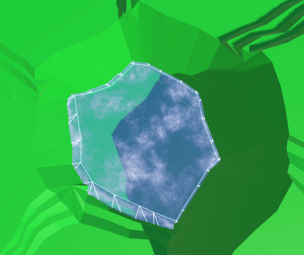 						Mostly hidden shore water. 					

We can combat this by increasing the size of the water shore  strip. This can be done by decreasing the radius of the water hexagons.  To do so, `**HexMetrics**` needs a water factor to accompany its solid factor, plus methods to get the water corners.

The solid factor is 0.8. To double the size of the water connections, we have to set the water factor to 0.6.

```
	public const float waterFactor = 0.6f;
	
	public static Vector3 GetFirstWaterCorner (HexDirection direction) {
		return corners[(int)direction] * waterFactor;
	}

	public static Vector3 GetSecondWaterCorner (HexDirection direction) {
		return corners[(int)direction + 1] * waterFactor;
	}
```

Use these new methods in `**HexGridChunk**` to find the water corners.

```
	void TriangulateOpenWater (
		HexDirection direction, HexCell cell, HexCell neighbor, Vector3 center
	) {
		Vector3 c1 = center + HexMetrics.GetFirstWaterCorner(direction);
		Vector3 c2 = center + HexMetrics.GetSecondWaterCorner(direction);

		…
	}
	
	void TriangulateWaterShore (
		HexDirection direction, HexCell cell, HexCell neighbor, Vector3 center
	) {
		EdgeVertices e1 = new EdgeVertices(
			center + HexMetrics.GetFirstWaterCorner(direction),
			center + HexMetrics.GetSecondWaterCorner(direction)
		);
		…
	}
```

 						
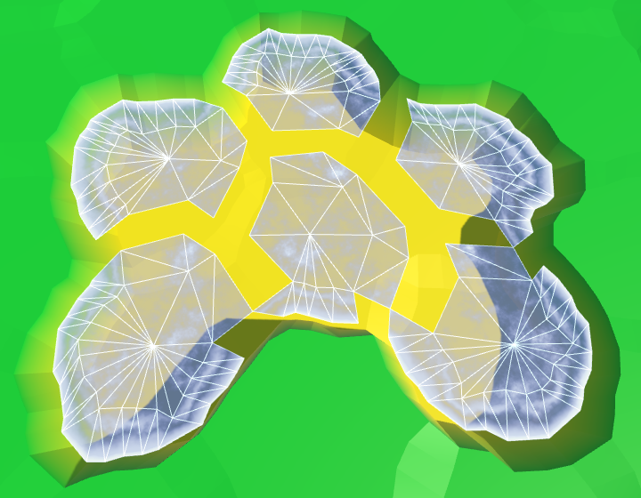 						Using water corners. 					

The distance between the water hexagons has indeed doubled. Now `**HexMetrics**` must also provide a water bridge method.

```
	public const float waterBlendFactor = 1f - waterFactor;
	
	public static Vector3 GetWaterBridge (HexDirection direction) {
		return (corners[(int)direction] + corners[(int)direction + 1]) *
			waterBlendFactor;
	}
```

Adjust `**HexGridChunk**` to use the new method.

```
	void TriangulateOpenWater (
		HexDirection direction, HexCell cell, HexCell neighbor, Vector3 center
	) {
		…

		if (direction <= HexDirection.SE && neighbor != null) {
			Vector3 bridge = HexMetrics.GetWaterBridge(direction);
			…

			if (direction <= HexDirection.E) {
				…
				water.AddTriangle(
					c2, e2, c2 + HexMetrics.GetWaterBridge(direction.Next())
				);
			}
		}
	}

	void TriangulateWaterShore (
		HexDirection direction, HexCell cell, HexCell neighbor, Vector3 center
	) {
		…
		
		Vector3 bridge = HexMetrics.GetWaterBridge(direction);
		…

		HexCell nextNeighbor = cell.GetNeighbor(direction.Next());
		if (nextNeighbor != null) {
			waterShore.AddTriangle(
				e1.v5, e2.v5, e1.v5 +
					HexMetrics.GetWaterBridge(direction.Next())
			);
			…
		}
	}
```

 						
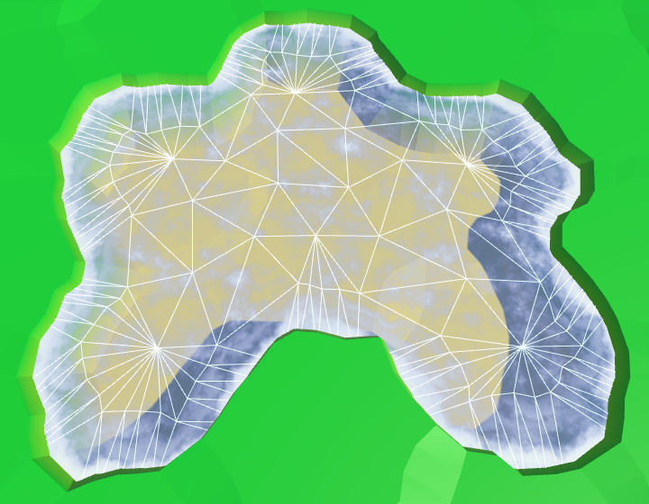 						Long water bridges. 					

### Between Water and Solid Edges

While this gives us more space for the foam, there is now also a  much larger part of it hidden below the terrain. Ideally, we could use  the water edge on the water side, and the solid edge on the land side.

We cannot use a simple bridge to find the opposite solid edge,  when starting with water corners. Instead, we can work backwards from  the center of the neighbor. Adjust `TriangulateWaterShore` so it uses this new approach.

```
//		Vector3 bridge = HexMetrics.GetWaterBridge(direction);
		Vector3 center2 = neighbor.Position;
		center2.y = center.y;
		EdgeVertices e2 = new EdgeVertices(
			center2 + HexMetrics.GetSecondSolidCorner(direction.Opposite()),
			center2 + HexMetrics.GetFirstSolidCorner(direction.Opposite())
		);
		…

		HexCell nextNeighbor = cell.GetNeighbor(direction.Next());
		if (nextNeighbor != null) {
			Vector3 center3 = nextNeighbor.Position;
			center3.y = center.y;
			waterShore.AddTriangle(
				e1.v5, e2.v5, center3 +
					HexMetrics.GetFirstSolidCorner(direction.Previous())
			);
			…
		}
```

 							
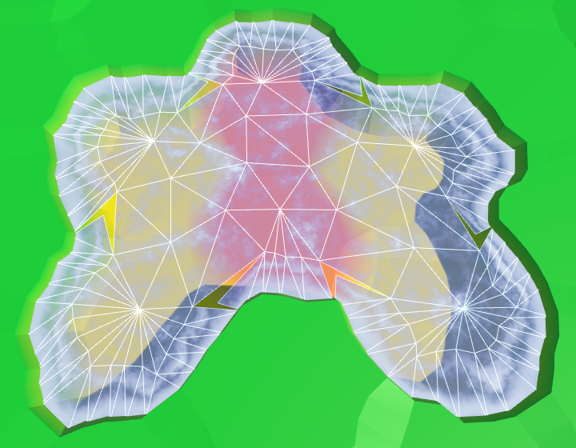 							Incorrect edge corners. 						

This works, except that once again we have two cases to consider for the corner triangles.

```
		HexCell nextNeighbor = cell.GetNeighbor(direction.Next());
		if (nextNeighbor != null) {
//			Vector3 center3 = nextNeighbor.Position;
//			center3.y = center.y;
			Vector3 v3 = nextNeighbor.Position + (nextNeighbor.IsUnderwater ?
				HexMetrics.GetFirstWaterCorner(direction.Previous()) :
				HexMetrics.GetFirstSolidCorner(direction.Previous()));
			v3.y = center.y;
			waterShore.AddTriangle(e1.v5, e2.v5, v3);
			waterShore.AddTriangleUV(
				new Vector2(0f, 0f),
				new Vector2(0f, 1f),
				new Vector2(0f, nextNeighbor.IsUnderwater ? 0f : 1f)
			);
		}
```

 							
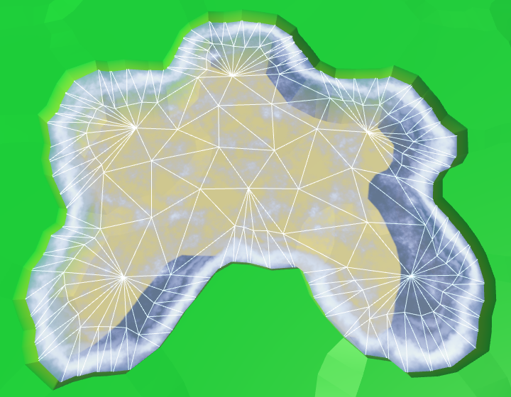 							Correct edge corners. 						

This works nice, except that the foam can get quite pronounced  when most of it is visible. To compensate, you can make the effect a  little weaker by scaling down the shore value in the shader.

```
	shore = sqrt(shore) * 0.9;
```

<iframe src="https://gfycat.com/ifr/FragrantGrandioseKangaroo"></iframe>

Final foam.

unitypackage

## Underwater Rivers

Our water is complete, at least when there aren't any rivers  flowing into it. As water and rivers are currently oblivious to each  other, the rivers will flow through and underneath the water.

 						
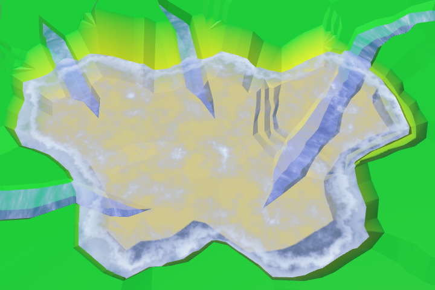 						Rivers flowing into the water. 					

The order in which semitransparent objects are rendered depends  on their distance from the camera. The nearest objects are rendered  last, which ensures they end up on top. As you move the camera around,  this means that sometimes rivers, and sometimes water ends up on top of  the other. Let's begin by making the rendering order consistent. Rivers  should be drawn on top of the water, so waterfalls are correctly  displayed. We can enforce this by changing the queue of the *River* shader.

```
		Tags { "RenderType"="Transparent" "Queue"="Transparent+1" }
```

 						
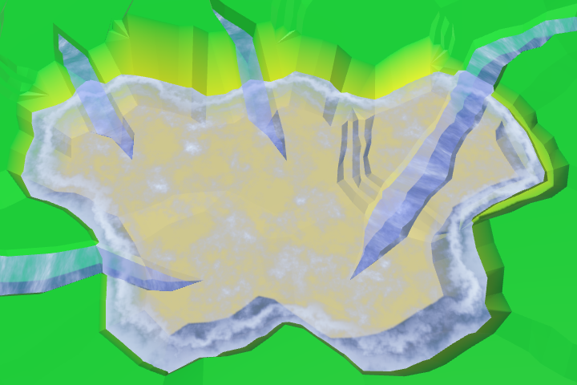 						Drawing rivers last. 					

### Hiding Underwater Rivers

While it is fine for a stream bed to exist underwater, and  water might actually flow through it, we shouldn't be able to see this  water. Especially not rendered on top of the actual water surface. We  can get rid of the underwater river's water by making sure to only add  river segments when the current cell in not underwater.

```
	void TriangulateWithRiverBeginOrEnd (
		HexDirection direction, HexCell cell, Vector3 center, EdgeVertices e
	) {
		…

		if (!cell.IsUnderwater) {
			bool reversed = cell.HasIncomingRiver;
			…
		}
	}
	
	void TriangulateWithRiver (
		HexDirection direction, HexCell cell, Vector3 center, EdgeVertices e
	) {
		…

		if (!cell.IsUnderwater) {
			bool reversed = cell.IncomingRiver == direction;
			…
		}
	}
```

For `TriangulateConnection`, let's start by only adding the river segment when neither the current nor the neighbor cell is underwater.

```
		if (cell.HasRiverThroughEdge(direction)) {
			e2.v3.y = neighbor.StreamBedY;

			if (!cell.IsUnderwater && !neighbor.IsUnderwater) {
				TriangulateRiverQuad(
					e1.v2, e1.v4, e2.v2, e2.v4,
					cell.RiverSurfaceY, neighbor.RiverSurfaceY, 0.8f,
					cell.HasIncomingRiver && cell.IncomingRiver == direction
				);
			}
		}
```

 							
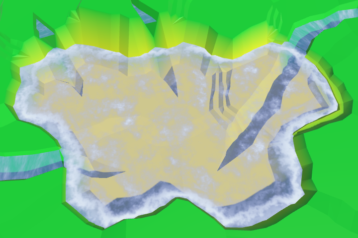 							No more underwater rivers. 						

### Waterfalls

The underwater rivers are gone, but now we get gaps in the  rivers where they meet the water surface. Rivers on the same level as  the water get small gaps or overlaps. But most obvious are the lacking  waterfalls for rivers that come from a higher elevation. Let's deal with  those first.

The river segment of a waterfall used to pass through the water  surface. It ended up partially above, and partially below the water. We  have to keep the part above the water level, discarding the rest. That  requires some work, so let's create a separate method for that.

The new method requires four vertices, two river levels, and  the water level. We'll align it so we're looking in the direction of the  flow, down the waterfall. So the first two vertices and the left and  right side at the top, followed by those for the bottom.

```
	void TriangulateWaterfallInWater (
		Vector3 v1, Vector3 v2, Vector3 v3, Vector3 v4,
		float y1, float y2, float waterY
	) {
		v1.y = v2.y = y1;
		v3.y = v4.y = y2;
		rivers.AddQuad(v1, v2, v3, v4);
		rivers.AddQuadUV(0f, 1f, 0.8f, 1f);
	}
```

Invoke this method in `TriangulateConnection`, when the neighbor ends up underwater and we have a waterfall.

```
			if (!cell.IsUnderwater) {
				if (!neighbor.IsUnderwater) {
					TriangulateRiverQuad(
						e1.v2, e1.v4, e2.v2, e2.v4,
						cell.RiverSurfaceY, neighbor.RiverSurfaceY, 0.8f,
						cell.HasIncomingRiver && cell.IncomingRiver == direction
					);
				}
				else if (cell.Elevation > neighbor.WaterLevel) {
					TriangulateWaterfallInWater(
						e1.v2, e1.v4, e2.v2, e2.v4,
						cell.RiverSurfaceY, neighbor.RiverSurfaceY,
						neighbor.WaterSurfaceY
					);
				}
			}
```

We also have to deal with waterfalls in the opposite direction, when the current cell is underwater and the neighbor isn't.

```
			if (!cell.IsUnderwater) {
				…
			}
			else if (
				!neighbor.IsUnderwater &&
				neighbor.Elevation > cell.WaterLevel
			) {
				TriangulateWaterfallInWater(
					e2.v4, e2.v2, e1.v4, e1.v2,
					neighbor.RiverSurfaceY, cell.RiverSurfaceY,
					cell.WaterSurfaceY
				);
			}
```

This again produces the original river quad. Next, we have to adjust `TriangulateWaterfallInWater`  so it pulls the bottom vertices up to the water level. Unfortunately,  we cannot suffice with only adjusting their Y coordinates. That would  pull the waterfall away from the cliff, which can lead to gaps. Instead,  we have to pull the bottom vertices towards the top vertices, via  interpolation.

 							
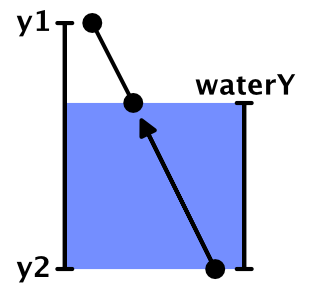 							Interpolating. 						

To move the bottom vertices upward, divide their distance below  the water surface by the height of the waterfall. That gives us the  interpolator value.

```
		v1.y = v2.y = y1;
		v3.y = v4.y = y2;
		float t = (waterY - y2) / (y1 - y2);
		v3 = Vector3.Lerp(v3, v1, t);
		v4 = Vector3.Lerp(v4, v2, t);
		rivers.AddQuad(v1, v2, v3, v4);
		rivers.AddQuadUV(0f, 1f, 0.8f, 1f);
```

The result is a shorter waterfall that still has the same  orientation. However, because the positions of the bottom vertices have  changed, they will be perturbed differently than the original vertices.  This means that the end result still does not match the original  waterfall. To solve this, we have to manually perturb the vertices  before interpolating, and then add an unperturbed quad.

```
		v1.y = v2.y = y1;
		v3.y = v4.y = y2;
		v1 = HexMetrics.Perturb(v1);
		v2 = HexMetrics.Perturb(v2);
		v3 = HexMetrics.Perturb(v3);
		v4 = HexMetrics.Perturb(v4);
		float t = (waterY - y2) / (y1 - y2);
		v3 = Vector3.Lerp(v3, v1, t);
		v4 = Vector3.Lerp(v4, v2, t);
		rivers.AddQuadUnperturbed(v1, v2, v3, v4);
		rivers.AddQuadUV(0f, 1f, 0.8f, 1f);
```

While we already have an unperturbed variant method for adding  triangles, we actually don't have one for quads yet. So add the required  `**HexMesh**.AddQuadUnperturbed` method.

```
	public void AddQuadUnperturbed (
		Vector3 v1, Vector3 v2, Vector3 v3, Vector3 v4
	) {
		int vertexIndex = vertices.Count;
		vertices.Add(v1);
		vertices.Add(v2);
		vertices.Add(v3);
		vertices.Add(v4);
		triangles.Add(vertexIndex);
		triangles.Add(vertexIndex + 2);
		triangles.Add(vertexIndex + 1);
		triangles.Add(vertexIndex + 1);
		triangles.Add(vertexIndex + 2);
		triangles.Add(vertexIndex + 3);
	}
```

 							
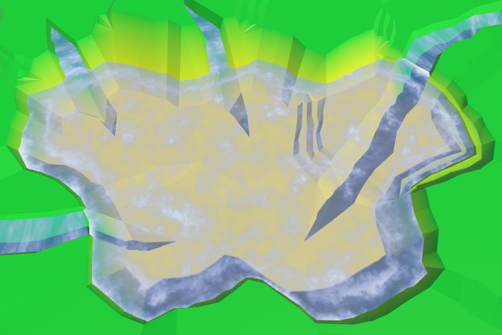 							Waterfalls end at the water surface. 						

unitypackage

## Estuaries

When rivers flow at the same height as the water surface, the  river mesh touches the shore mesh. If this were a river flowing into a  sea or ocean, this is where the river stream meets the tide. As such,  we'll refer to these regions as estuaries.

 						
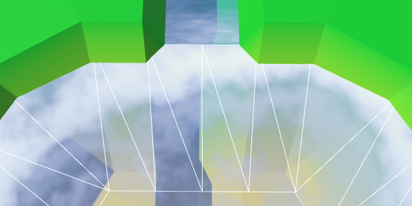 						River meets shore, without vertex perturbation. 					

There are currently two problems with estuaries. First, river quads connect the 2nd and 4th edge vertices, skipping the 3rd. As the water shore does use the 3rd vertex, it can end up creating a gap or an overlap. We can solve this by adjusting the geometry of the estuaries.

The second problem is that there is a harsh transition between  the foam and river materials. To solve this, we need yet another  material, which blends between the river and water shore effects.

This means that estuaries require special treatment, so let's create a separate method for them. It should be invoked in `TriangulateWaterShore`, when there is a river flowing through the current direction.

```
	void TriangulateWaterShore (
		HexDirection direction, HexCell cell, HexCell neighbor, Vector3 center
	) {
		…

		if (cell.HasRiverThroughEdge(direction)) {
			TriangulateEstuary(e1, e2);
		}
		else {
			waterShore.AddQuad(e1.v1, e1.v2, e2.v1, e2.v2);
			waterShore.AddQuad(e1.v2, e1.v3, e2.v2, e2.v3);
			waterShore.AddQuad(e1.v3, e1.v4, e2.v3, e2.v4);
			waterShore.AddQuad(e1.v4, e1.v5, e2.v4, e2.v5);
			waterShore.AddQuadUV(0f, 0f, 0f, 1f);
			waterShore.AddQuadUV(0f, 0f, 0f, 1f);
			waterShore.AddQuadUV(0f, 0f, 0f, 1f);
			waterShore.AddQuadUV(0f, 0f, 0f, 1f);
		}

		…
	}

	void TriangulateEstuary (EdgeVertices e1, EdgeVertices e2) {
	}
```

The region that blends both effects doesn't need to fill the  entire edge strip. We can suffice with a trapezoid shape. So we can use  two water shore triangles at the sides.

```
	void TriangulateEstuary (EdgeVertices e1, EdgeVertices e2) {
		waterShore.AddTriangle(e2.v1, e1.v2, e1.v1);
		waterShore.AddTriangle(e2.v5, e1.v5, e1.v4);
		waterShore.AddTriangleUV(
			new Vector2(0f, 1f), new Vector2(0f, 0f), new Vector2(0f, 0f)
		);
		waterShore.AddTriangleUV(
			new Vector2(0f, 1f), new Vector2(0f, 0f), new Vector2(0f, 0f)
		);
	}
```

 						
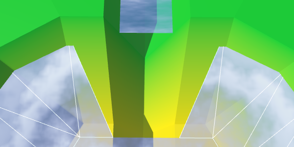 						Trapezoidal hole for the blend region. 					

### UV2 Coordinates

To create the river effect, we need UV coordinates. But to  create the foam effect, we also need UV coordinates. So when blending  both, we end up requiring two sets of UV coordinates. Fortunately,  Unity's meshes can support up to four UV sets. We just have to add  support for a second set to `**HexMesh**`.

```
	public bool useCollider, useColors, useUVCoordinates, useUV2Coordinates;

	[NonSerialized] List<Vector2> uvs, uv2s;
	
	public void Clear () {
		…
		if (useUVCoordinates) {
			uvs = ListPool<Vector2>.Get();
		}
		if (useUV2Coordinates) {
			uv2s = ListPool<Vector2>.Get();
		}
		triangles = ListPool<int>.Get();
	}

	public void Apply () {
		…
		if (useUVCoordinates) {
			hexMesh.SetUVs(0, uvs);
			ListPool<Vector2>.Add(uvs);
		}
		if (useUV2Coordinates) {
			hexMesh.SetUVs(1, uv2s);
			ListPool<Vector2>.Add(uv2s);
		}
		…
	}
```

To add to the second UV set, duplicate the UV methods and adjust them as you would expect.

```
	public void AddTriangleUV2 (Vector2 uv1, Vector2 uv2, Vector3 uv3) {
		uv2s.Add(uv1);
		uv2s.Add(uv2);
		uv2s.Add(uv3);
	}
	
	public void AddQuadUV2 (Vector2 uv1, Vector2 uv2, Vector3 uv3, Vector3 uv4) {
		uv2s.Add(uv1);
		uv2s.Add(uv2);
		uv2s.Add(uv3);
		uv2s.Add(uv4);
	}

	public void AddQuadUV2 (float uMin, float uMax, float vMin, float vMax) {
		uv2s.Add(new Vector2(uMin, vMin));
		uv2s.Add(new Vector2(uMax, vMin));
		uv2s.Add(new Vector2(uMin, vMax));
		uv2s.Add(new Vector2(uMax, vMax));
	}
```

### River Shader Function

Because we're going to use the river effect in two shaders, move the code from the *River* shader to a new function in the *Water* include file.

```
float River (float2 riverUV, sampler2D noiseTex) {
	float2 uv = riverUV;
	uv.x = uv.x * 0.0625 + _Time.y * 0.005;
	uv.y -= _Time.y * 0.25;
	float4 noise = tex2D(noiseTex, uv);

	float2 uv2 = riverUV;
	uv2.x = uv2.x * 0.0625 - _Time.y * 0.0052;
	uv2.y -= _Time.y * 0.23;
	float4 noise2 = tex2D(noiseTex, uv2);
	
	return noise.x * noise2.w;
}
```

Adjust the *River* shader to use this new function.

```
		#include "Water.cginc"

		sampler2D _MainTex;

		…

		void surf (Input IN, inout SurfaceOutputStandard o) {
			float river = River(IN.uv_MainTex, _MainTex);
			
			fixed4 c = saturate(_Color + river);
			…
		}
```

### Estuary Objects

Add support for an estuary mesh object to `**HexGridChunk**`.

```
	public HexMesh terrain, rivers, roads, water, waterShore, estuaries;
	
	public void Triangulate () {
		terrain.Clear();
		rivers.Clear();
		roads.Clear();
		water.Clear();
		waterShore.Clear();
		estuaries.Clear();
		for (int i = 0; i < cells.Length; i++) {
			Triangulate(cells[i]);
		}
		terrain.Apply();
		rivers.Apply();
		roads.Apply();
		water.Apply();
		waterShore.Apply();
		estuaries.Apply();
	}
```

Create an estuary shader, material, and object, by duplicating  and adjusting those for the water shore. Connect it with the chunk, and  make sure that it uses both UV and UV2 coordinates.

 							
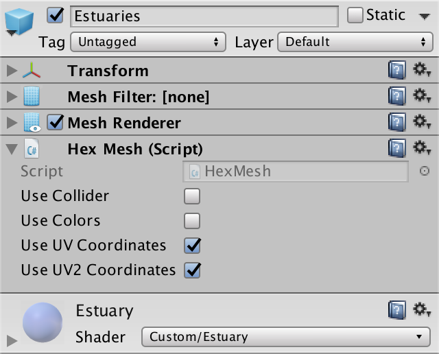 							Estuarties object. 						

### Triangulating the Estuary

We can solve the gap or overlap problem by placing a triangle  between the river's end and the middle of the water's edge. Because our  estuary shader is a duplicate of the water shore shader, set the UV  coordinates to match the foam effect.

```
	void TriangulateEstuary (EdgeVertices e1, EdgeVertices e2) {
		…

		estuaries.AddTriangle(e1.v3, e2.v2, e2.v4);
		estuaries.AddTriangleUV(
			new Vector2(0f, 0f), new Vector2(0f, 1f), new Vector2(0f, 1f)
		);
	}
```

 							
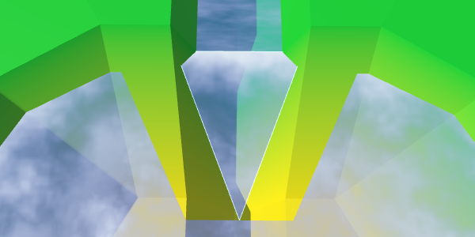 							Middle triangle. 						

We can fill the entire trapezoid by adding a quad on both sides of the middle triangle.

```
		estuaries.AddQuad(e1.v2, e1.v3, e2.v1, e2.v2);
		estuaries.AddTriangle(e1.v3, e2.v2, e2.v4);
		estuaries.AddQuad(e1.v3, e1.v4, e2.v4, e2.v5);
		
		estuaries.AddQuadUV(0f, 0f, 0f, 1f);
		estuaries.AddTriangleUV(
			new Vector2(0f, 0f), new Vector2(0f, 1f), new Vector2(0f, 1f)
		);
		estuaries.AddQuadUV(0f, 0f, 0f, 1f);
```

 							
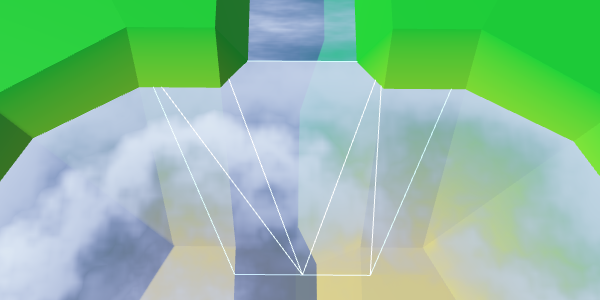 							Complete trapezoid. 						

Let's rotate the orientation of the quad on the left side, so  it has a shorter diagonal connection, and we end up with symmetrical  geometry.

```
		estuaries.AddQuad(e2.v1, e1.v2, e2.v2, e1.v3);
		estuaries.AddTriangle(e1.v3, e2.v2, e2.v4);
		estuaries.AddQuad(e1.v3, e1.v4, e2.v4, e2.v5);
		
		estuaries.AddQuadUV(
			new Vector2(0f, 1f), new Vector2(0f, 0f),
			new Vector2(0f, 1f), new Vector2(0f, 0f)
		);
//		estuaries.AddQuadUV(0f, 0f, 0f, 1f);
```

 							
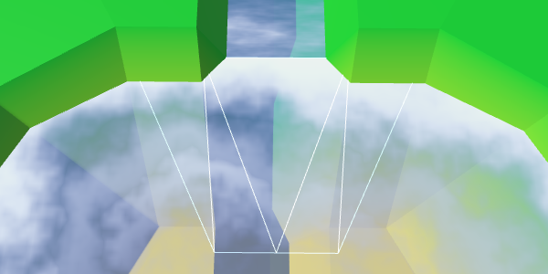 							Rotated quad, symmetrical geometry 						

### River Flow

To support the river effect, we need to add UV2 coordinates.  The bottom of the middle triangle sits in the middle of the river, so  its U coordinate should be 0.5. As the river flows towards the water,  its left point gets U coordinate 1, and its right point gets U  coordinate 0. Set the Y coordinates to 0 and 1, matching the flow  direction.

```
		estuaries.AddTriangleUV2(
			new Vector2(0.5f, 1f), new Vector2(1f, 0f), new Vector2(0f, 0f)
		);
```

The quads of either side of the triangle should match this  orientation. Keep the same U coordinates for the points that are beyond  the width of the river.

```
		estuaries.AddQuadUV2(
			new Vector2(1f, 0f), new Vector2(1f, 1f),
			new Vector2(1f, 0f), new Vector2(0.5f, 1f)
		);
		estuaries.AddTriangleUV2(
			new Vector2(0.5f, 1f), new Vector2(1f, 0f), new Vector2(0f, 0f)
		);
		estuaries.AddQuadUV2(
			new Vector2(0.5f, 1f), new Vector2(0f, 1f),
			new Vector2(0f, 0f), new Vector2(0f, 0f)
		);
```

 							
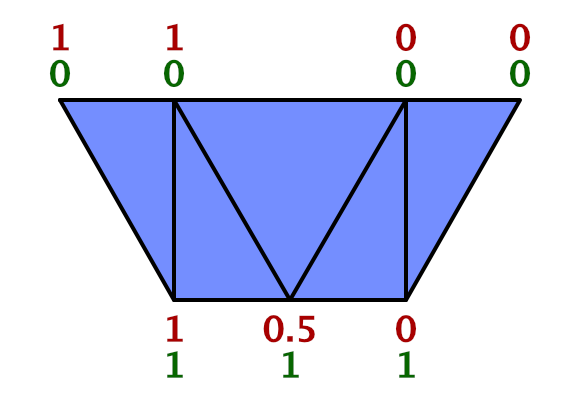 							Trapezoid UV2. 						

To check whether we set the UV2 coordinates correctly, have the *Estuary* shader visualize them. We can access these coordinates by adding `**float2** uv2_MainTex` to its input structure.

```
		struct Input {
			float2 uv_MainTex;
			float2 uv2_MainTex;
			float3 worldPos;
		};

		…

		void surf (Input IN, inout SurfaceOutputStandard o) {
			float shore = IN.uv_MainTex.y;
			float foam = Foam(shore, IN.worldPos.xz, _MainTex);
			float waves = Waves(IN.worldPos.xz, _MainTex);
			waves *= 1 - shore;

			fixed4 c = fixed4(IN.uv2_MainTex, 1, 1);
			…
		}
```

 							
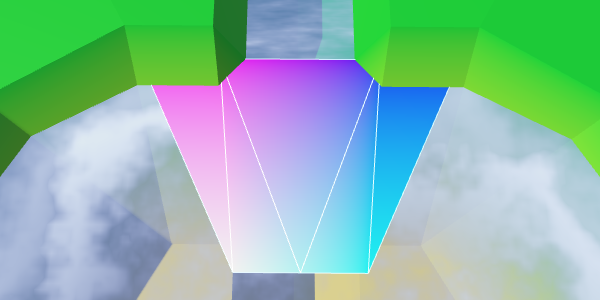 							UV2 coordinates. 						

That looks good. We can use this to create the river effect.

```
		void surf (Input IN, inout SurfaceOutputStandard o) {
			…

			float river = River(IN.uv2_MainTex, _MainTex);

			fixed4 c = saturate(_Color + river);
			…
		}
```

 							
 							Using UV2 to create the river effect. 						

We designed rivers so that when triangulating connections  between cells, the river's V coordinates go from 0.8 to 1. So we should  use this range here as well, instead of going from 0 to 1. However, the  shore connection is 50% larger than regular cell connections. So to best  match the river flow, we have to go from 0.8 to 1.1.

```
		estuaries.AddQuadUV2(
			new Vector2(1f, 0.8f), new Vector2(1f, 1.1f),
			new Vector2(1f, 0.8f), new Vector2(0.5f, 1.1f)
		);
		estuaries.AddTriangleUV2(
			new Vector2(0.5f, 1.1f),
			new Vector2(1f, 0.8f),
			new Vector2(0f, 0.8f)
		);
		estuaries.AddQuadUV2(
			new Vector2(0.5f, 1.1f), new Vector2(0f, 1.1f),
			new Vector2(0f, 0.8f), new Vector2(0f, 0.8f)
		);
```

 							
 							 							Synchronized river and estuary flow. 						

### Adjusting the Flow

Right now, the river flow continues along a straight line. But  when water flows into a larger area, it will spread out. The flow will  curve. We can simulate this by warping the UV2 coordinates.

Instead of keeping the top U coordinates constant beyond the  width of the river, shift them by 0.5. The leftmost point becomes 1.5,  and the rightmost becomes −0.5.

At the same time, widen the flow by shifting the U coordinates  of the left and right points at the bottom. Change the left one from 1  to 0.7, and change the right one from 0 to 0.3.

```
		estuaries.AddQuadUV2(
			new Vector2(1.5f, 0.8f), new Vector2(0.7f, 1.1f),
			new Vector2(1f, 0.8f), new Vector2(0.5f, 1.1f)
		);
		…
		estuaries.AddQuadUV2(
			new Vector2(0.5f, 1.1f), new Vector2(0.3f, 1.1f),
			new Vector2(0f, 0.8f), new Vector2(-0.5f, 0.8f)
		);
```

 							
 							 							Widening river flow. 						

To complete the curving effect, adjust the V coordinates of the  same four points. As the water flows away from the river exit, increase  the V coordinates of the top points to 1. And to produce a better  curve, increase the V coordinates of the bottom two points to 1.15.

```
		estuaries.AddQuadUV2(
			new Vector2(1.5f, 1f), new Vector2(0.7f, 1.15f),
			new Vector2(1f, 0.8f), new Vector2(0.5f, 1.1f)
		);
		estuaries.AddTriangleUV2(
			new Vector2(0.5f, 1.1f),
			new Vector2(1f, 0.8f),
			new Vector2(0f, 0.8f)
		);
		estuaries.AddQuadUV2(
			new Vector2(0.5f, 1.1f), new Vector2(0.3f, 1.15f),
			new Vector2(0f, 0.8f), new Vector2(-0.5f, 1f)
		);
```

 							
 							 							Curving river flow. 						

### Blending River and Shore

All that is left is to blend the shore and river effects. We'll  use linear interpolation for this, with the shore value as the  interpolator.

```
			float shoreWater = max(foam, waves);

			float river = River(IN.uv2_MainTex, _MainTex);

			float water = lerp(shoreWater, river, IN.uv_MainTex.x);

			fixed4 c = saturate(_Color + water);
```

While this should work, you might get a compile error. The compiler is complaining about a redefinition of `_MainTex_ST`. This is due to a bug in Unity's surface shader compiler, caused by using `uv_MainTex` and `uv2_MainTex` at the same time. We have to find a workaround.

Instead of relying on `uv2_MainTex`, we'll have to manually pass along the secondary UV coordinates. To do so, rename `uv2_MainTex` to `riverUV`. Then add a vertex function to the shader which assigns the coordinates to it.

```
		#pragma surface surf Standard alpha vertex:vert
		…
		
		struct Input {
			float2 uv_MainTex;
			float2 riverUV;
			float3 worldPos;
		};

		…

		void vert (inout appdata_full v, out Input o) {
			UNITY_INITIALIZE_OUTPUT(Input, o);
			o.riverUV = v.texcoord1.xy;
		}

		void surf (Input IN, inout SurfaceOutputStandard o) {
			…

			float river = River(IN.riverUV, _MainTex);

			…
		}
```

 							
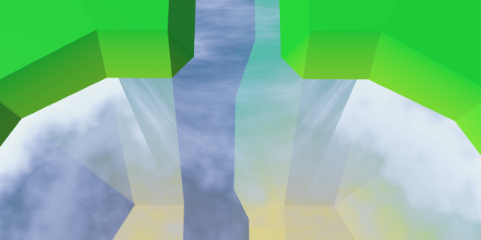 							Interpolating based on shore. 						

The interpolations works, except for the leftmost and rightmost  vertices at the top. The river should have faded away at those points.  So we cannot use the shore value. We have to use another value, which is  set to 0 at those two vertices. Fortunately, we still have the U  coordinate of the first UV set available, so we can store this value  there.

```
		estuaries.AddQuadUV(
			new Vector2(0f, 1f), new Vector2(0f, 0f),
			new Vector2(1f, 1f), new Vector2(0f, 0f)
		);
		estuaries.AddTriangleUV(
			new Vector2(0f, 0f), new Vector2(1f, 1f), new Vector2(1f, 1f)
		);
		estuaries.AddQuadUV(
			new Vector2(0f, 0f), new Vector2(0f, 0f),
			new Vector2(1f, 1f), new Vector2(0f, 1f)
		);
//		estuaries.AddQuadUV(0f, 0f, 0f, 1f);
```

 							
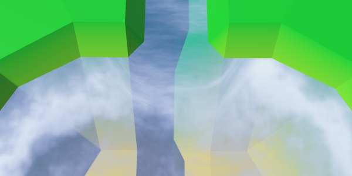 							Correct blend. 						

Our estuaries now contain a nice blend between the widening  river, shore water, and foam. Although it doesn't produce an exact match  with waterfalls, this effect looks fine in combination with waterfalls  as well.

<iframe src="https://gfycat.com/ifr/PointlessSafeGermanspaniel"></iframe>

Estuaries in motion.

unitypackage

## Rivers Flowing out of Water Bodies

While we have rivers flowing into bodies of water, we current do  not support rivers flowing in the other direction. As many lakes have  rivers flowing out of them, this is something that we should add.

When a river flows out of a body of water, it's actually flowing  towards a higher elevation. This is currently invalid. We have to make  an exception, and allow this when the water level matches the elevation  of the destination cell. Let's add a private method to `**HexCell**` that checks whether a neighbor is a valid destination for an outgoing river, using our new criteria.

```
	bool IsValidRiverDestination (HexCell neighbor) {
		return neighbor && (
			elevation >= neighbor.elevation || waterLevel == neighbor.elevation
		);
	}
```

Use this new method to determine whether setting an outgoing river is allowed.

```
	public void SetOutgoingRiver (HexDirection direction) {
		if (hasOutgoingRiver && outgoingRiver == direction) {
			return;
		}

		HexCell neighbor = GetNeighbor(direction);
//		if (!neighbor || elevation < neighbor.elevation) {
		if (!IsValidRiverDestination(neighbor)) {
			return;
		}

		RemoveOutgoingRiver();
		…
	}
```

We also have to validate the rivers when changing either the  elevation or water level. Create a private method that takes care of  this.

```
	void ValidateRivers () {
		if (
			hasOutgoingRiver &&
			!IsValidRiverDestination(GetNeighbor(outgoingRiver))
		) {
			RemoveOutgoingRiver();
		}
		if (
			hasIncomingRiver &&
			!GetNeighbor(incomingRiver).IsValidRiverDestination(this)
		) {
			RemoveIncomingRiver();
		}
	}
```

Take advantage of this new method in both the `Elevation` and `WaterLevel` properties.

```
	public int Elevation {
		…
		set {
			…

//			if (
//				hasOutgoingRiver &&
//				elevation < GetNeighbor(outgoingRiver).elevation
//			) {
//				RemoveOutgoingRiver();
//			}
//			if (
//				hasIncomingRiver &&
//				elevation > GetNeighbor(incomingRiver).elevation
//			) {
//				RemoveIncomingRiver();
//			}
			ValidateRivers();

			…
		}
	}

	public int WaterLevel {
		…
		set {
			if (waterLevel == value) {
				return;
			}
			waterLevel = value;
			ValidateRivers();
			Refresh();
		}
	}
```

 						
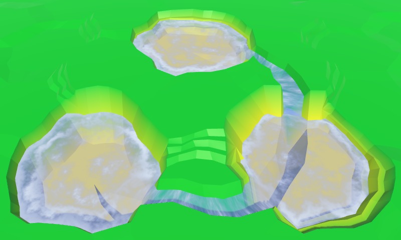 						Flowing both in and out of lakes. 					

### Reversing the Flow

We created `**HexGridChunk**.TriangulateEstuary`  while assuming that rivers only flow into bodies of water. As a result,  the river flow always goes in the same direction. We have to reverse  the flow when we're dealing with a river that flows away from the water.  This requires that `TriangulateEstuary` knows about the flow direction. So give it a boolean parameter that defines whether we're dealing with an incoming river.

```
	void TriangulateEstuary (
		EdgeVertices e1, EdgeVertices e2, bool incomingRiver
	) {
	…
}
```

Pass along this information when `TriangulateWaterShore` invokes the method.

```
		if (cell.HasRiverThroughEdge(direction)) {
			TriangulateEstuary(e1, e2, cell.IncomingRiver == direction);
		}
```

Now we have to reverse the river flow, by changing the UV2  coordinates. The U coordinates have to be mirrored for outgoing rivers.  −0.5 becomes 1.5, 0 becomes 1, 1 becomes 0, and 1.5 becomes −0.5.

The V coordinates a less straightforward. Reviewing how we  dealt with reversed river connections, 0.8 should become 0, and 1 should  become −0.2. This means that 1.1 becomes −0.3, and 1.15 becomes −0.35.

As the UV2 coordinates are so different for each case, let's use separate code for them.

```
	void TriangulateEstuary (
		EdgeVertices e1, EdgeVertices e2, bool incomingRiver
	) {
		…

		if (incomingRiver) {
			estuaries.AddQuadUV2(
				new Vector2(1.5f, 1f), new Vector2(0.7f, 1.15f),
				new Vector2(1f, 0.8f), new Vector2(0.5f, 1.1f)
			);
			estuaries.AddTriangleUV2(
				new Vector2(0.5f, 1.1f),
				new Vector2(1f, 0.8f),
				new Vector2(0f, 0.8f)
			);
			estuaries.AddQuadUV2(
				new Vector2(0.5f, 1.1f), new Vector2(0.3f, 1.15f),
				new Vector2(0f, 0.8f), new Vector2(-0.5f, 1f)
			);
		}
		else {
			estuaries.AddQuadUV2(
				new Vector2(-0.5f, -0.2f), new Vector2(0.3f, -0.35f),
				new Vector2(0f, 0f), new Vector2(0.5f, -0.3f)
			);
			estuaries.AddTriangleUV2(
				new Vector2(0.5f, -0.3f),
				new Vector2(0f, 0f),
				new Vector2(1f, 0f)
			);
			estuaries.AddQuadUV2(
				new Vector2(0.5f, -0.3f), new Vector2(0.7f, -0.35f),
				new Vector2(1f, 0f), new Vector2(1.5f, -0.2f)
			);
		}
	}
```

<iframe src="https://gfycat.com/ifr/PotableWideeyedIrishwolfhound"></iframe>

Correct river flow.

The next tutorial is [Terrain Features](https://catlikecoding.com/unity/tutorials/hex-map/part-9/).

unitypackage

PDF
