# Hex Map 5

Larger Maps

- Split the grid into chunks.
- Control the camera.
- Paint color and elevation separately.
- Use a larger cell brush.

This tutorial is the fifth part of a series about [hexagon maps](https://catlikecoding.com/unity/tutorials/hex-map/). Up to this point we've worked with a very small map. It's time we scale it up.

 					
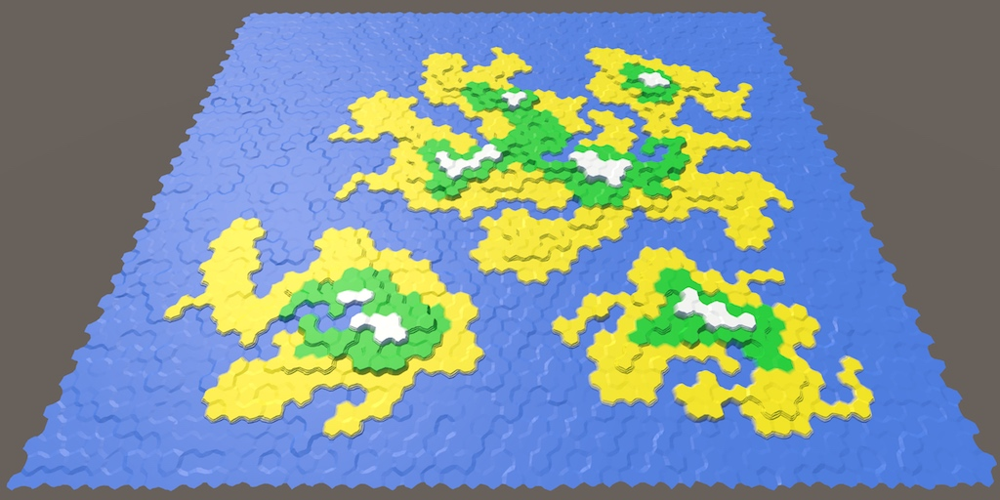 					It's time to get big. 				

## Grid Chunks

We cannot make our grid too large, because we run into the  limits of what can fit in a single mesh. The solution? Use more than one  mesh. To do so, we have to partition our grid into multiple chunks.  We'll use rectangular chunks of a fixed size.

 						
 						Partitioning a grid into 3 by 3 segments. 					

Let's use 5 by 5 blocks, so that's 25 cells per chunk. Define that in `**HexMetrics**`.

```
	public const int chunkSizeX = 5, chunkSizeZ = 5;
```

 						What is a good chunk size? 						 					

Now we can no longer use any size for our grid, we have to use multiples of the chunk size. So let's change `**HexGrid**`  so it defines its size in chunks instead of individual cells. Set it to  4 by 3 chunks by default, for a total of 12 chunks and 300 cells. This  gives us a nice small test map.

```
	public int chunkCountX = 4, chunkCountZ = 3;
```

We'll still use `width` and `height`, but they should become private. And rename them to `cellCountX` and `cellCountZ`.  Use your editor to rename all occurrences of these variables in one go.  Now it's clear when we're dealing with chunk or cell counts.

```
//	public int width = 6;
//	public int height = 6;
	
	int cellCountX, cellCountZ;
```

 						
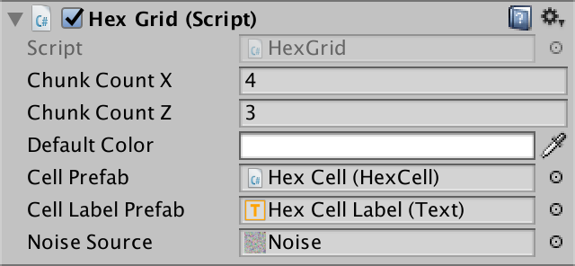 						Specifying size in chunks. 					

Adjust `Awake`  so the cell counts are derived from the chunk counts before they are  needed. Put the creation of the cells in their own method as well, to  keep `Awake` tidy.

```
	void Awake () {
		HexMetrics.noiseSource = noiseSource;

		gridCanvas = GetComponentInChildren<Canvas>();
		hexMesh = GetComponentInChildren<HexMesh>();

		cellCountX = chunkCountX * HexMetrics.chunkSizeX;
		cellCountZ = chunkCountZ * HexMetrics.chunkSizeZ;

		CreateCells();
	}

	void CreateCells () {
		cells = new HexCell[cellCountZ * cellCountX];

		for (int z = 0, i = 0; z < cellCountZ; z++) {
			for (int x = 0; x < cellCountX; x++) {
				CreateCell(x, z, i++);
			}
		}
	}
```

### Chunk Prefab

We need a new component type to represents our grid chunks.

```
using UnityEngine;
using UnityEngine.UI;

public class HexGridChunk : MonoBehaviour {
}
```

Next, create a chunk prefab. Do this by duplicating the *Hex Grid* object and renaming it to *Hex Grid Chunk*. Remove its `**HexGrid**` component and give it a `**HexGridChunk**` component instead. Then turn it into a prefab and remove the object from the scene.

 							
 							 							Chunk prefab, with its own canvas and mesh. 						

As `**HexGrid**` will be instantiating these chunks, give it a reference to the chunk prefab.

```
	public HexGridChunk chunkPrefab;
```

 							
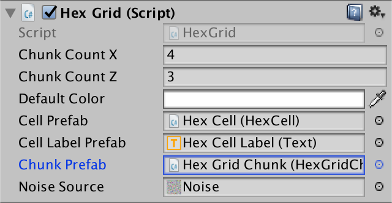 							Now with chunks. 						

Instantiating chunks looks a lot like instantiating cells. Keep track of them with an array, and use a double loop to fill it.

```
	HexGridChunk[] chunks;

	void Awake () {
		…

		CreateChunks();
		CreateCells();
	}

	void CreateChunks () {
		chunks = new HexGridChunk[chunkCountX * chunkCountZ];

		for (int z = 0, i = 0; z < chunkCountZ; z++) {
			for (int x = 0; x < chunkCountX; x++) {
				HexGridChunk chunk = chunks[i++] = Instantiate(chunkPrefab);
				chunk.transform.SetParent(transform);
			}
		}
	}
```

The initialization of a chunk is similar to how we used to initialize the hex grid. It sets things up in `Awake` and triangulates in `Start`.  It need a reference to its canvas and mesh, and an array for its cells.  However, it will not create these cells. We'll still let the grid do  that.

```
public class HexGridChunk : MonoBehaviour {

	HexCell[] cells;

	HexMesh hexMesh;
	Canvas gridCanvas;

	void Awake () {
		gridCanvas = GetComponentInChildren<Canvas>();
		hexMesh = GetComponentInChildren<HexMesh>();

		cells = new HexCell[HexMetrics.chunkSizeX * HexMetrics.chunkSizeZ];
	}
	
	void Start () {
		hexMesh.Triangulate(cells);
	}
}
```

### Assigning Cells to Chunks

`**HexGrid**` is still creating all  the cells. This is fine, but it now has to add each cell to the correct  chunk, instead of setting them up with its own mesh and canvas.

```
	void CreateCell (int x, int z, int i) {
		…

		HexCell cell = cells[i] = Instantiate<HexCell>(cellPrefab);
//		cell.transform.SetParent(transform, false);
		cell.transform.localPosition = position;
		cell.coordinates = HexCoordinates.FromOffsetCoordinates(x, z);
		cell.color = defaultColor;

		…

		Text label = Instantiate<Text>(cellLabelPrefab);
//		label.rectTransform.SetParent(gridCanvas.transform, false);
		label.rectTransform.anchoredPosition =
			new Vector2(position.x, position.z);
		label.text = cell.coordinates.ToStringOnSeparateLines();
		cell.uiRect = label.rectTransform;

		cell.Elevation = 0;

		AddCellToChunk(x, z, cell);
	}
	
	void AddCellToChunk (int x, int z, HexCell cell) {
	}
```

We can find the correct chunk via integer divisions of `x` and `z` by the chunk sizes.

```
	void AddCellToChunk (int x, int z, HexCell cell) {
		int chunkX = x / HexMetrics.chunkSizeX;
		int chunkZ = z / HexMetrics.chunkSizeZ;
		HexGridChunk chunk = chunks[chunkX + chunkZ * chunkCountX];
	}
```

Using the intermediate results, we can also determine the  cell's index local to its chunk. Once we have that, we can add the cell  to the chunk.

```
	void AddCellToChunk (int x, int z, HexCell cell) {
		int chunkX = x / HexMetrics.chunkSizeX;
		int chunkZ = z / HexMetrics.chunkSizeZ;
		HexGridChunk chunk = chunks[chunkX + chunkZ * chunkCountX];

		int localX = x - chunkX * HexMetrics.chunkSizeX;
		int localZ = z - chunkZ * HexMetrics.chunkSizeZ;
		chunk.AddCell(localX + localZ * HexMetrics.chunkSizeX, cell);
	}
```

The `**HexGridChunk**.AddCell` then put the cell in its own array. Then it sets the parents of the cell and its UI.

```
	public void AddCell (int index, HexCell cell) {
		cells[index] = cell;
		cell.transform.SetParent(transform, false);
		cell.uiRect.SetParent(gridCanvas.transform, false);
	}
```

### Cleaning Up

At this point `**HexGrid**` can get rid of its canvas and hex mesh child objects and code.

```
//	Canvas gridCanvas;
//	HexMesh hexMesh;

	void Awake () {
		HexMetrics.noiseSource = noiseSource;

//		gridCanvas = GetComponentInChildren<Canvas>();
//		hexMesh = GetComponentInChildren<HexMesh>();

		…
	}

//	void Start () {
//		hexMesh.Triangulate(cells);
//	}

//	public void Refresh () {
//		hexMesh.Triangulate(cells);
//	}
```

Because we got rid of `Refresh`, `**HexMapEditor**` should no longer use it.

```
	void EditCell (HexCell cell) {
		cell.color = activeColor;
		cell.Elevation = activeElevation;
//		hexGrid.Refresh();
	}
```

 							
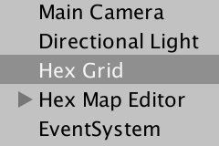 							Cleaned up hex grid. 						

After entering play mode, the map will still look the same. But the object hierarchy will be different. *Hex Grid* now spawns child chunk objects, which contain the cells, along with their mesh and canvas.

 							
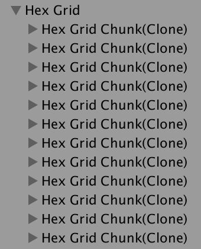 							Child chunks in play mode. 						

There is probably something wrong with the cell labels. We  initially set the label's width to 5. This was enough to show two  symbols, which was fine for the small map that we used up to this point.  But now we can get coordinates like −10, which have three symbols.  These won't fit and will be cut off. To fix this, increase the cell  label width to 10, or even more.

 							 							 							Wider cell labels. 						

We can now create much larger maps! As we generate the entire  grid on startup, it might take a while before huge maps are created. But  once that's finished, you have a large area to play with.

### Fixing Editing

Right now editing doesn't seem to work, because we no longer  refresh the grid. We have to refresh the individual chunks, so let's add  a `Refresh` method to `**HexGridChunk**`.

```
	public void Refresh () {
		hexMesh.Triangulate(cells);
	}
```

When do we invoke this method? We used to refresh the entire  grid every time, because there was only a single mesh. But now we have  many chunks. Instead of refreshing them all every time, it would be much  more efficient if we only refresh those chunks that have changed.  Editing large maps would become very sluggish otherwise.

How do we know which chunk to refresh? A simple way is to make  sure each cell knows which chunk it belongs to. Then the cell can  refresh its chunk whenever it is changed. So give `**HexCell**` a reference to its chunk.

```
	public HexGridChunk chunk;
```

`**HexGridChunk**` can assign itself to the cell when it is added.

```
	public void AddCell (int index, HexCell cell) {
		cells[index] = cell;
		cell.chunk = this;
		cell.transform.SetParent(transform, false);
		cell.uiRect.SetParent(gridCanvas.transform, false);
	}
```

With that hooked up, add a `Refresh` method to `**HexCell**` as well. Whenever a cell is refreshed, it simply refreshes its chunk.

```
	void Refresh () {
		chunk.Refresh();
	}
```

We don't need to make `**HexCell**.Refresh` public, because the cell itself knows best when it has changed. For example, after it has adjusted its elevation.

```
	public int Elevation {
		get {
			return elevation;
		}
		set {
			…
			Refresh();
		}
	}
```

Actually, it would only need to refresh if its elevation has  been set to a different value. It won't even need to recompute anything  if we assign the same elevation to it later. So we can bail out at the  start of the setter.

```
	public int Elevation {
		get {
			return elevation;
		}
		set {
			if (elevation == value) {
				return;
			}
			…
		}
	}
```

However, this will also skip the computation the first time the  elevation is set to zero, because that is currently the grid's default  elevation. To prevent this, make sure that the initial value is  something that will never be used.

```
	int elevation = int.MinValue;
```

 							What's `**int**.MinValue`? 							 						

To detect a change to a cell's color, we have to turn it into a property  as well. Rename it to the capitalized `Color`, then turn it into a property with a private `color` variable. The default color value is transparent black, which is fine.

```
	public Color Color {
		get {
			return color;
		}
		set {
			if (color == value) {
				return;
			}
			color = value;
			Refresh();
		}
	}

	Color color;
```

We now get null-reference exceptions when entering play mode.  That's because we set the color and elevation to their default values,  before assigning the cell to its chunk. It is fine that we don't refresh  the chunks at this point, because we'll triangulate them all after  initialization is done. In other words, only refresh the chunk if it has  been assigned.

```
	void Refresh () {
		if (chunk) {
			chunk.Refresh();
		}
	}
```

We can once again edit cells! However, there is a problem. Seams can appear when painting along chunk boundaries.

 							
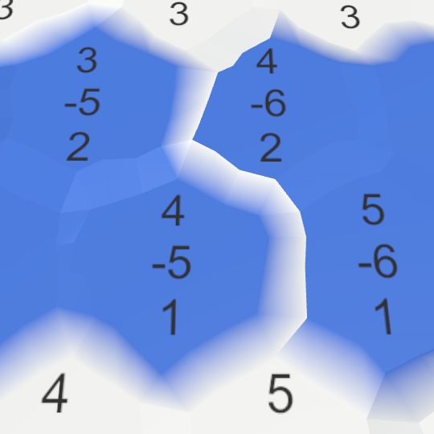 							Errors at chunk boundaries. 						

This makes sense, because when one cell changes, all  connections with its neighbors change as well. And those neighbors can  end up in different chunks. The simplest solution is to refresh the  chunks of all neighbors as well, if they're different.

```
	void Refresh () {
		if (chunk) {
			chunk.Refresh();
			for (int i = 0; i < neighbors.Length; i++) {
				HexCell neighbor = neighbors[i];
				if (neighbor != null && neighbor.chunk != chunk) {
					neighbor.chunk.Refresh();
				}
			}
		}
	}
```

While this works, we can end up refreshing a single chunk  multiple times. And once we start painting more than one cell at a time,  this will only get worse.

But we don't have to immediately triangulate when a chunk is  refreshed. Instead, we can take note that an update is needed, and  triangulate once editing is finished.

Because `**HexGridChunk**` doesn't  do anything else, we can use its enabled state to signal that an update  is needed. Whenever it is refreshed, we enable the component. Enabling  it multiple times doesn't change anything. Later on, the component is  updated. We'll triangulate at that point, and disable the component  again.

We'll use `LateUpdate` instead of `Update`, so we can be sure that triangulation happens after editing is finished for the current frame.

```
	public void Refresh () {
//		hexMesh.Triangulate(cells);
		enabled = true;
	}

	void LateUpdate () {
		hexMesh.Triangulate(cells);
		enabled = false;
	}
```

 							What is the difference between `Update` and `LateUpdate`? 							 						

Because our component is enabled by default, we don't need to explicitly triangulate in `Start` anymore. So we can remove that method.

```
//	void Start () {
//		hexMesh.Triangulate(cells);
//	}
```

 							
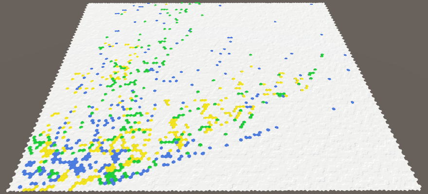 							20 by 20 chunks, containing 10,000 cells. 						

### Sharing Lists

Although we have significantly changed how we triangulate our grid, `**HexMesh**`  is still the same. All it needs is an array of cells, and it will do  its job. Whether there is a single or many hex meshes doesn't matter.  But we hadn't considered using multiple of them yet. Maybe there is an  improvement we could make?

The lists that `**HexMesh**` uses  are effectively temporary buffers. They are only used during  triangulation. And chunks are triangulated one at a time. So we really  only need one set of lists, not one set per hex mesh object. We can do  so by making the lists static.

```
	static List<Vector3> vertices = new List<Vector3>();
	static List<Color> colors = new List<Color>();
	static List<int> triangles = new List<int>();

	void Awake () {
		GetComponent<MeshFilter>().mesh = hexMesh = new Mesh();
		meshCollider = gameObject.AddComponent<MeshCollider>();
		hexMesh.name = "Hex Mesh";
//		vertices = new List<Vector3>();
//		colors = new List<Color>();
//		triangles = new List<int>();
	}
```

 							Do static lists make much of a difference? 							 						

unitypackage

## Camera Controls

Having a large map is nice, but it is no good if we cannot see  it. To reach the entire map, we have to move the camera around. Zooming  would also be quite handy. So let's create a camera rig that allows  this.

Create an empty object and name it *Hex Map Camera*.  Reset its transform component so it sits at the origin, without any  rotation or scale adjustment. Give it a child object named *Swivel* and give that one a child object named *Stick*. Make the main camera a child of the stick, and reset its transform component.

 						
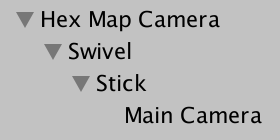 						Camera hierarchy. 					

The job of the swivel is to control the angle at which the  camera looks at the map. Set its rotation to (45, 0, 0). The stick  controls how far away the camera is. Set its position to (0, 0, -45).

Now we need a component to control this rig. Assign this  component to the root of the camera hierarchy. Give it a reference to  its swivel and stick, retrieving them in `Awake`.

```
using UnityEngine;

public class HexMapCamera : MonoBehaviour {

	Transform swivel, stick;

	void Awake () {
		swivel = transform.GetChild(0);
		stick = swivel.GetChild(0);
	}
}
```

 						
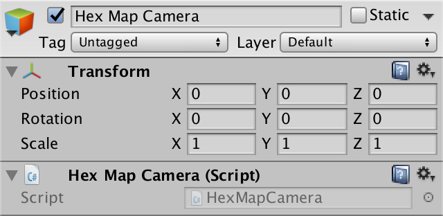 						Hex map camera. 					

### Zooming

The first feature we'll support is zooming. We can keep track  of the current zoom level with a float variable. A value of 0 means that  we are fully zoomed out, while a value of 1 is fully zoomed in. Let's  start at maximum zoom.

```
	float zoom = 1f;
```

Zooming is usually done with the mouse wheel, or an analogous input method. We can do so by using the default *Mouse ScrollWheel* input axis. Add an `Update` method that checks whether there is any input delta, and if so invoke a method to adjust the zoom.

```
	void Update () {
		float zoomDelta = Input.GetAxis("Mouse ScrollWheel");
		if (zoomDelta != 0f) {
			AdjustZoom(zoomDelta);
		}
	}
	
	void AdjustZoom (float delta) {
	}
```

To adjust the zoom level, simply add the delta to it, then clamp to keep it in the 0–1 range.

```
	void AdjustZoom (float delta) {
		zoom = Mathf.Clamp01(zoom + delta);
	}
```

As we zoom in and out, the distance of the camera should change  accordingly. We do this by adjusting the stick's Z position. Add two  public floats to configure the stick's position at minimum and maximum  zoom. As we're developing on a relatively small map, set them to -250  and -45.

```
	public float stickMinZoom, stickMaxZoom;
```

After adjusting the zoom, linearly interpolate between these  two values based on the new zoom value. Then update the stick's  position.

```
	void AdjustZoom (float delta) {
		zoom = Mathf.Clamp01(zoom + delta);

		float distance = Mathf.Lerp(stickMinZoom, stickMaxZoom, zoom);
		stick.localPosition = new Vector3(0f, 0f, distance);
	}
```


<iframe src="https://gfycat.com/ifr/SpiritedMasculineHerald"></iframe>

Stick min and max.

Zooming now works, but it is currently not that useful.  Typically, games have their camera transition to a top-down view as it  zooms out. We can do so by rotating the swivel. So add min and max  variables for the swivel as well. Set them to 90 and 45.

```
	public float swivelMinZoom, swivelMaxZoom;
```

Just like with the arm position, interpolate to find the appropriate zoom angle. Then set the swivel's rotation.

```
	void AdjustZoom (float delta) {
		zoom = Mathf.Clamp01(zoom + delta);

		float distance = Mathf.Lerp(stickMinZoom, stickMaxZoom, zoom);
		stick.localPosition = new Vector3(0f, 0f, distance);

		float angle = Mathf.Lerp(swivelMinZoom, swivelMaxZoom, zoom);
		swivel.localRotation = Quaternion.Euler(angle, 0f, 0f);
	}
```


<iframe src="https://gfycat.com/ifr/UnsightlyUniqueAddax"></iframe>

Swivel min and max.

You can tweak how quickly the zoom changes by adjusting the sensitivity of the scroll wheel input settings. You can find it via *Edit / Project Settings / Input*. For example, decreasing it from its default 0.1 to 0.025 results in a slower, smoother zoom experience.

 							
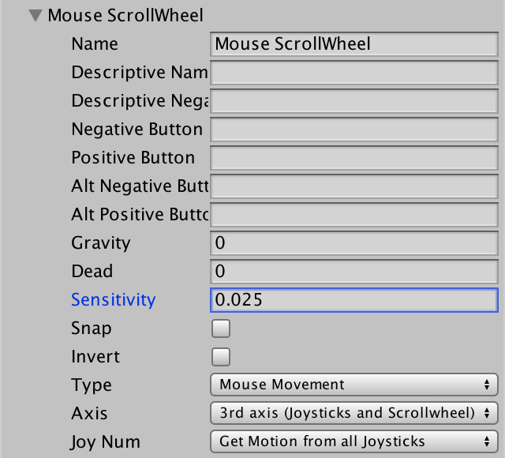 							Scroll wheel input settings. 						

### Moving

Next up is camera movement. We have to check for movement in the X and Z direction in `Update`, just like we do for zoom. We can use the default *Horizontal* and *Vertical* input axes for this. This allows use to move the camera with the arrow keys and the WASD keys.

```
	void Update () {
		float zoomDelta = Input.GetAxis("Mouse ScrollWheel");
		if (zoomDelta != 0f) {
			AdjustZoom(zoomDelta);
		}

		float xDelta = Input.GetAxis("Horizontal");
		float zDelta = Input.GetAxis("Vertical");
		if (xDelta != 0f || zDelta != 0f) {
			AdjustPosition(xDelta, zDelta);
		}
	}

	void AdjustPosition (float xDelta, float zDelta) {
	}
```

The most straightforward approach is to fetch the current  position of the camera rig, add the X and Z deltas to it, and assign the  result back to the rig's position.

```
	void AdjustPosition (float xDelta, float zDelta) {
		Vector3 position = transform.localPosition;
		position += new Vector3(xDelta, 0f, zDelta);
		transform.localPosition = position;
	}
```

This gets the camera moving while we hold down the arrow or  WASD keys, but not at a consistent velocity. It depends on the frame  rate. To determine the distance to move, we have use the time delta, as  well as a desired movement speed. So add a public `moveSpeed` variable and set it to 100. Then factor that and the time delta into the position delta.

```
	public float moveSpeed;
						
	void AdjustPosition (float xDelta, float zDelta) {
		float distance = moveSpeed * Time.deltaTime;
		
		Vector3 position = transform.localPosition;
		position += new Vector3(xDelta, 0f, zDelta) * distance;
		transform.localPosition = position;
	}
```

 							
 							Move speed. 						

We can now move with a constant velocity along either the X or Z  axis. But when moving along both at the same time – diagonally – we end  up going faster. To fix this, we have to normalize the delta vector.  That allows us to use it as a direction.

```
	void AdjustPosition (float xDelta, float zDelta) {
		Vector3 direction = new Vector3(xDelta, 0f, zDelta).normalized;
		float distance = moveSpeed * Time.deltaTime;

		Vector3 position = transform.localPosition;
		position += direction * distance;
		transform.localPosition = position;
	}
```

Diagonal movement is now correct, but all of a sudden the  camera keeps moving for quite a while after we release all keys. This  happens because the input axes don't immediately jump to their extreme  values when a key in pressed. Instead, they take a while to get there.  The same is true for when you release the keys. It takes a while before  the axes return to zero. However, because we normalize the input values,  we maintain maximum velocity all the time.

We could adjust the input settings to get rid of the delays,  but they give a smooth feeling to the input which is worth keeping. What  we can do is apply the most extreme axis value as a damping factor to  the movement.

```
		Vector3 direction = new Vector3(xDelta, 0f, zDelta).normalized;
		float damping = Mathf.Max(Mathf.Abs(xDelta), Mathf.Abs(zDelta));
		float distance = moveSpeed * damping * Time.deltaTime;
```

<iframe src="https://gfycat.com/ifr/QuarrelsomeFrankHornbill"></iframe>

Damped movement.

Movement now works fine, at least when zoomed in. When zoomed  out, it is way too slow. We should speed up when zooming out. This can  be done by replacing our single `moveSpeed` variable with two for minimum and maximum zoom, and interpolate. Set them to 400 and 100.

```
//	public float moveSpeed;
	public float moveSpeedMinZoom, moveSpeedMaxZoom;

	void AdjustPosition (float xDelta, float zDelta) {
		Vector3 direction = new Vector3(xDelta, 0f, zDelta).normalized;
		float damping = Mathf.Max(Mathf.Abs(xDelta), Mathf.Abs(zDelta));
		float distance =
			Mathf.Lerp(moveSpeedMinZoom, moveSpeedMaxZoom, zoom) *
			damping * Time.deltaTime;

		Vector3 position = transform.localPosition;
		position += direction * distance;
		transform.localPosition = position;
	}
```


<iframe src="https://gfycat.com/ifr/CelebratedSpiffyHerald"></iframe>

Move speed changes with zoom level.

Now we can move around the map quickly! In fact, we can also  move far beyond the edges of the map. This isn't desirable. The camera  should stay inside the map. To enforce this, we have to know the bounds  of the map, so we need a reference to the grid. Add one and hook it up.

```
	public HexGrid grid;
```

 							
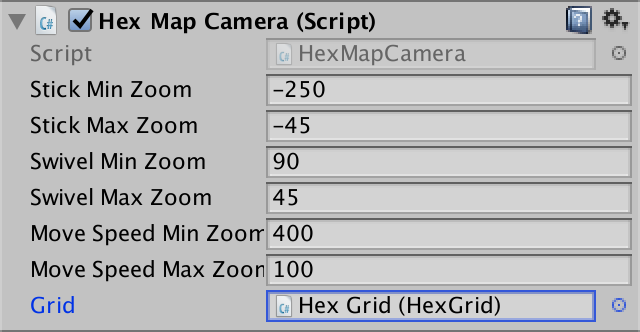 							Need to query the grid size. 						

After coming up with a new position, clamp it via a new method.

```
	void AdjustPosition (float xDelta, float zDelta) {
		…
		transform.localPosition = ClampPosition(position);
	}
	
	Vector3 ClampPosition (Vector3 position) {
		return position;
	}
```

The X position has a minimum of zero, and a maximum defined by the map size.

```
	Vector3 ClampPosition (Vector3 position) {
		float xMax =
			grid.chunkCountX * HexMetrics.chunkSizeX *
			(2f * HexMetrics.innerRadius);
		position.x = Mathf.Clamp(position.x, 0f, xMax);

		return position;
	}
```

The same goes for the Z position.

```
	Vector3 ClampPosition (Vector3 position) {
		float xMax =
			grid.chunkCountX * HexMetrics.chunkSizeX *
			(2f * HexMetrics.innerRadius);
		position.x = Mathf.Clamp(position.x, 0f, xMax);

		float zMax =
			grid.chunkCountZ * HexMetrics.chunkSizeZ *
			(1.5f * HexMetrics.outerRadius);
		position.z = Mathf.Clamp(position.z, 0f, zMax);

		return position;
	}
```

Actually, this is a little inaccurate. The origin lies at the  center of a cell, not to the left of it. So we want the camera to stop  at the center of the rightmost cells as well. To do so, subtract half a  cell from the X maximum.

```
		float xMax =
			(grid.chunkCountX * HexMetrics.chunkSizeX - 0.5f) *
			(2f * HexMetrics.innerRadius);
		position.x = Mathf.Clamp(position.x, 0f, xMax);
```

For the same reason, the Z maximum has to be decreased as well.  Because the metrics are a little different, we have to subtract a full  cell.

```
		float zMax =
			(grid.chunkCountZ * HexMetrics.chunkSizeZ - 1) *
			(1.5f * HexMetrics.outerRadius);
		position.z = Mathf.Clamp(position.z, 0f, zMax);
```

We are done with movement, except for one little detail.  Sometimes the UI responds to the arrow keys, which ends up moving the  slider while moving the camera. This happens when the UI considers  itself active, after you clicked on it and are still hovering over it  with the cursor.

You can prevent the UI from listening to key input. This is done by instructing the *EventSystem* object to not *Send Navigation Events*.

 							
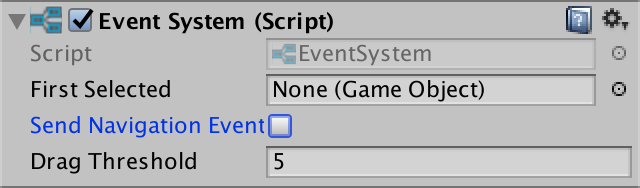 							No more navigation events. 						

### Rotating

Want to see what's behind a cliff? It sure would be handy if we could rotate the camera! So let's add that feature.

What zoom level we're at doesn't matter for rotation, so one speed suffices. Add a public `rotationSpeed` variable and set it to 180 degrees. Check the rotation delta in `Update` by sampling the *Rotation* axis, and adjust the rotation if needed.

```
	public float rotationSpeed;

	void Update () {
		float zoomDelta = Input.GetAxis("Mouse ScrollWheel");
		if (zoomDelta != 0f) {
			AdjustZoom(zoomDelta);
		}

		float rotationDelta = Input.GetAxis("Rotation");
		if (rotationDelta != 0f) {
			AdjustRotation(rotationDelta);
		}

		float xDelta = Input.GetAxis("Horizontal");
		float zDelta = Input.GetAxis("Vertical");
		if (xDelta != 0f || zDelta != 0f) {
			AdjustPosition(xDelta, zDelta);
		}
	}

	void AdjustRotation (float delta) {
	}
```

 							
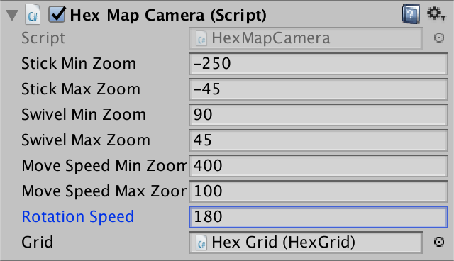 							Rotation speed. 						

Actually, there is no default *Rotation* axis. We have to create it ourselves. Go to the input settings and duplicate the topmost *Vertical* entry. Change the duplicate's name to *Rotation* and set its keys to QE and the comma and dot.

 							
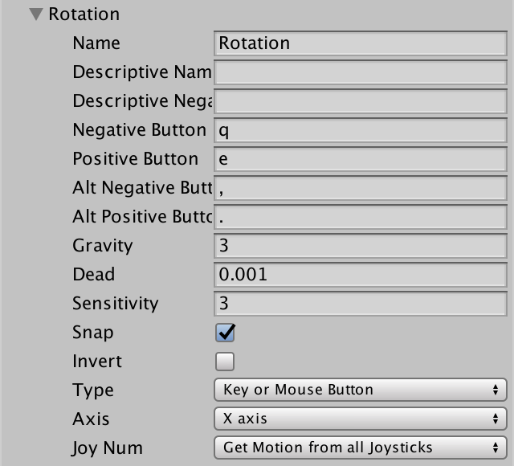 							Rotation input axis. 						

 							I downloaded a unitypackage, why does it not have this input? 							 						

Keep track of the rotation angle and adjust it in `AdjustRotation`. Then rotate the entire camera rig.

```
	float rotationAngle;
	
	void AdjustRotation (float delta) {
		rotationAngle += delta * rotationSpeed * Time.deltaTime;
		transform.localRotation = Quaternion.Euler(0f, rotationAngle, 0f);
	}
```

As a full circle is 360 degrees, wrap the rotation angle so it stays within 0 and 360.

```
	void AdjustRotation (float delta) {
		rotationAngle += delta * rotationSpeed * Time.deltaTime;
		if (rotationAngle < 0f) {
			rotationAngle += 360f;
		}
		else if (rotationAngle >= 360f) {
			rotationAngle -= 360f;
		}
		transform.localRotation = Quaternion.Euler(0f, rotationAngle, 0f);
	}
```

<iframe src="https://gfycat.com/ifr/OccasionalWiltedAurochs"></iframe>

Rotation in action.

Rotation now works. When trying it out, you'll notice that the  movement is absolute. So after rotating 180 degrees movement becomes the  opposite of what you'd expect. It is a lot more user-friendly if  movement was relative to the camera's point of view. We can make it so  by multiplying the current rotation with the movement direction.

```
	void AdjustPosition (float xDelta, float zDelta) {
		Vector3 direction =
			transform.localRotation *
			new Vector3(xDelta, 0f, zDelta).normalized;
		…
	}
```

<iframe src="https://gfycat.com/ifr/DefenselessSharpDunnart"></iframe>

Relative movement.

unitypackage

## Advanced Editing

Now that we have a larger map to work with, our map editor tools  can use an upgrade. Editing one cell at a time is quite limiting, so a  larger brush size is a good idea. It would also be handy if we can  decide to only paint color or elevation, leaving the other as it was.

### Optional Color and Elevation

We can make colors optional by adding a blank option to the  toggle group. Duplicate one of the color toggles and change its label to  *---* or something else that indicated that it is not a color. Then set the argument of its *On Value Changed* event to −1.

 							
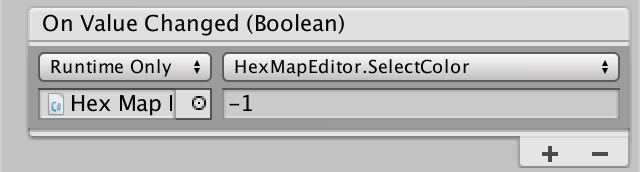 							Not a valid color index. 						

Of course this is an invalid index for our color array. We can  use it to determine whether we should apply a color to the cells or not.

```
	bool applyColor;

	public void SelectColor (int index) {
		applyColor = index >= 0;
		if (applyColor) {
			activeColor = colors[index];
		}
	}
	
	void EditCell (HexCell cell) {
		if (applyColor) {
			cell.Color = activeColor;
		}
		cell.Elevation = activeElevation;
	}
```

The elevation is controlled via a slider, so we cannot really  build a switch into that. Instead, we can use a separate toggle to turn  elevation editing on and off. Set it on by default.

```
	bool applyElevation = true;
	
	void EditCell (HexCell cell) {
		if (applyColor) {
			cell.Color = activeColor;
		}
		if (applyElevation) {
			cell.Elevation = activeElevation;
		}
	}
```

Add a new elevation toggle to the UI. I also put everything in a  new panel and made the elevation slider to horizontal, to make the UI  neater.

 							
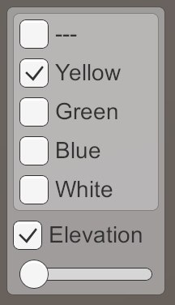 							Optional color and elevation. 						

To toggle the elevation, we need a new method to connect it with the UI.

```
	public void SetApplyElevation (bool toggle) {
		applyElevation = toggle;
	}
```

When you hook it up to the elevation toggle, make sure that you  use the dynamic bool method, at the top of the method list. The correct  versions does not show a checkbox in the inspector.

 							
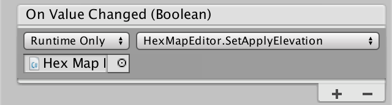 							Passing along the state of the elevation toggle. 						

You can now choose to paint only colors or only elevation. Or  both, as usual. You can even choose to paint neither, but that isn't  very useful right now.

<iframe src="https://gfycat.com/ifr/CooperativeWastefulIchthyostega"></iframe>

Switching between color and elevation.

 							Why does elevation turn off when I select a color? 							 						

### Brush Size

To support a variable brush size, add a `brushSize` integer variable and a method to set it via the UI. We'll use a slider, so we have to convert from float to int again.

```
	int brushSize;

	public void SetBrushSize (float size) {
		brushSize = (int)size;
	}
```

 							
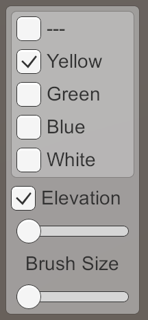 							Brush size slider. 						

You can create the new slider by duplicating the elevation  slider. Change its maximum value to 4 and hook it up to the correct  method. I also gave it a label.

 							
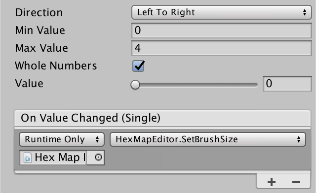 							Brush size slider settings. 						

Now that we can end up editing more than one cell, we should use an `EditCells` method. This method will take care of invoking `EditCell` for all cells that are affected. The originally selected cell will act as the center of our brush.

```
	void HandleInput () {
		Ray inputRay = Camera.main.ScreenPointToRay(Input.mousePosition);
		RaycastHit hit;
		if (Physics.Raycast(inputRay, out hit)) {
			EditCells(hexGrid.GetCell(hit.point));
		}
	}

	void EditCells (HexCell center) {
	}
	
	void EditCell (HexCell cell) {
		…
	}
```

The brush size defines the radius of the effect of our edit. At  radius 0, it is just the center cell. At radius 1, it is the center and  its neighbors. At radius 2, it includes the neighbors of its direct  neighbors as well. And so on.

 							
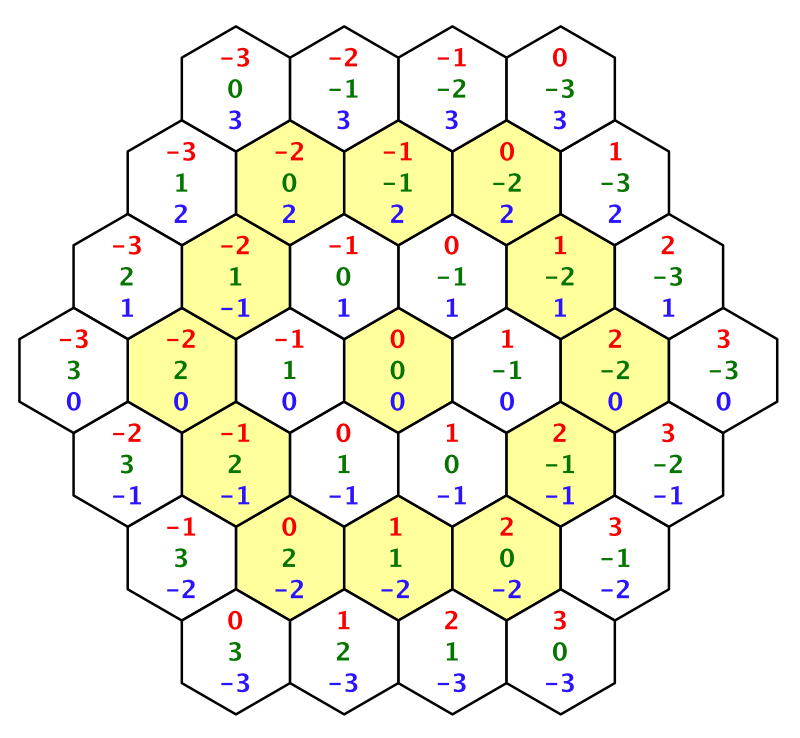 							Up to radius 3. 						

To edit all the cells, we have to loop through them. First, we need the X and Z coordinates of the center.

```
	void EditCells (HexCell center) {
		int centerX = center.coordinates.X;
		int centerZ = center.coordinates.Z;
	}
```

We find the minimum Z coordinate by subtracting the radius.  That defines row zero. Starting at that row, let's loop until have  covered the row at the center.

```
	void EditCells (HexCell center) {
		int centerX = center.coordinates.X;
		int centerZ = center.coordinates.Z;

		for (int r = 0, z = centerZ - brushSize; z <= centerZ; z++, r++) {
		}
	}
```

The first cell of the bottom row has the same X coordinate as  the center cell. This coordinate decreases as the row number increases.

The last cell always has an X coordinate equal to the center's plus the radius.

Now we can loop through each row and retrieve the cells via their coordinates.

```
		for (int r = 0, z = centerZ - brushSize; z <= centerZ; z++, r++) {
			for (int x = centerX - r; x <= centerX + brushSize; x++) {
				EditCell(hexGrid.GetCell(new HexCoordinates(x, z)));
			}
		}
```

We don't have a `**HexGrid**.GetCell` method with a coordinates parameter yet, so create it. Convert to offset coordinates and retrieve the cell.

```
	public HexCell GetCell (HexCoordinates coordinates) {
		int z = coordinates.Z;
		int x = coordinates.X + z / 2;
		return cells[x + z * cellCountX];
	}
```

 							
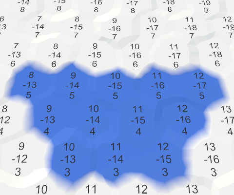 							Bottom half of brush, size 2. 						

The rest of the brush can be covered by looping from the top  down to the center. In this case, the logic is mirrored, and the center  row should be excluded.

```
	void EditCells (HexCell center) {
		int centerX = center.coordinates.X;
		int centerZ = center.coordinates.Z;

		for (int r = 0, z = centerZ - brushSize; z <= centerZ; z++, r++) {
			for (int x = centerX - r; x <= centerX + brushSize; x++) {
				EditCell(hexGrid.GetCell(new HexCoordinates(x, z)));
			}
		}
		for (int r = 0, z = centerZ + brushSize; z > centerZ; z--, r++) {
			for (int x = centerX - brushSize; x <= centerX + r; x++) {
				EditCell(hexGrid.GetCell(new HexCoordinates(x, z)));
			}
		}
	}
```

 							
 							Entire brush, size 2. 						

This works, unless our brush ends up extending beyond the  bounds of the grid. When that happens, you get an index-out-of-range  exception. To prevent this, check the bounds in `**HexGrid**.GetCell` and return `**null**` when a nonexistent cell is requested.

```
	public HexCell GetCell (HexCoordinates coordinates) {
		int z = coordinates.Z;
		if (z < 0 || z >= cellCountZ) {
			return null;
		}
		int x = coordinates.X + z / 2;
		if (x < 0 || x >= cellCountX) {
			return null;
		}
		return cells[x + z * cellCountX];
	}
```

To prevent a null-reference-exception, `**HexMapEditor**` should check that it really has a cell, before editing it.

```
	void EditCell (HexCell cell) {
		if (cell) {
			if (applyColor) {
				cell.Color = activeColor;
			}
			if (applyElevation) {
				cell.Elevation = activeElevation;
			}
		}
	}
```

<iframe src="https://gfycat.com/ifr/LividPopularKiwi"></iframe>

Using multiple brush sizes.

### Toggling Cell Labels

Most of the time, you probably don't need to see the cell  labels. So let's make them optional. As each chunk manages its own  canvas, add a `ShowUI` method to `**HexGridChunk**`. When the UI should be visible, activate the canvas. Otherwise, deactivate it.

```
	public void ShowUI (bool visible) {
		gridCanvas.gameObject.SetActive(visible);
	}
```

Let's hide the UI by default.

```
	void Awake () {
		gridCanvas = GetComponentInChildren<Canvas>();
		hexMesh = GetComponentInChildren<HexMesh>();

		cells = new HexCell[HexMetrics.chunkSizeX * HexMetrics.chunkSizeZ];
		ShowUI(false);
	}
```

As the UI is toggled for the entire map, add a `ShowUI` method to `**HexGrid**` as well. It simply passes the request on to its chunks.

```
	public void ShowUI (bool visible) {
		for (int i = 0; i < chunks.Length; i++) {
			chunks[i].ShowUI(visible);
		}
	}
```

`**HexMapEditor**` gets the same method as well, forwarding the request to the grid.

```
	public void ShowUI (bool visible) {
		hexGrid.ShowUI(visible);
	}
```

Finally, we can add a toggle to the UI and hook it up.

 							
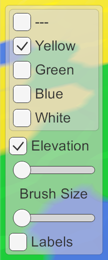 							Labels toggle. 						

The next tutorial is [Rivers](https://catlikecoding.com/unity/tutorials/hex-map/part-6).

unitypackage

PDF
