# Hex Map 11

More Features

- Add towers to walls.
- Connect roads across rivers via bridges.
- Support large special features.

This is part eleven of a tutorial series about [hexagon maps](https://catlikecoding.com/unity/tutorials/hex-map/). It adds wall towers, bridges, and special features to our terrain.

 					
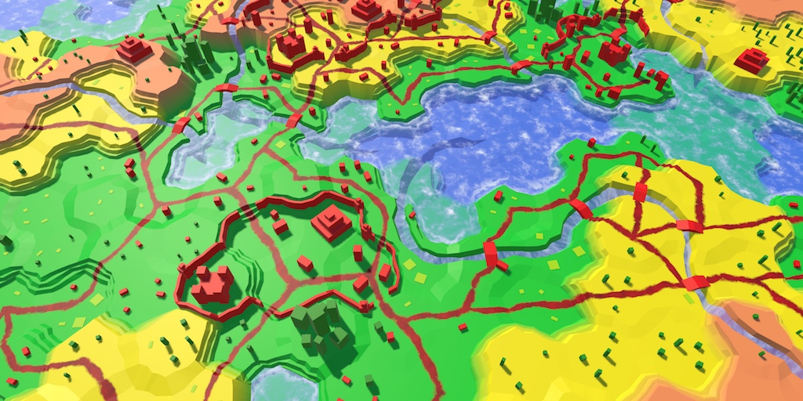 					A feature-rich landscape. 				

## Wall Towers

We added support for walls in the previous tutorial. They're  simple straight wall segments, without any distinguishing features. Now  we're going to make the walls more interesting, by adding towers to  them.

The wall segments had to be created procedurally, to fit the  terrain. This is not required for the towers. We can use a simple  prefab.

You can created a simple tower shape with two cubes that have  the red urban material. The tower base is 2 by 2 units wide and 4 units  high, so it's both thicker and taller than the wall. Above this cube,  put a unit cube to represent the top of the tower. Like the other  prefabs, these cubes don't need colliders.

Because the tower model consists of multiple objects, make them  children of a root object. Position them so the root's local origin sits  at the base of the tower. That way, we can place the towers without  having to worry about their height.

 						
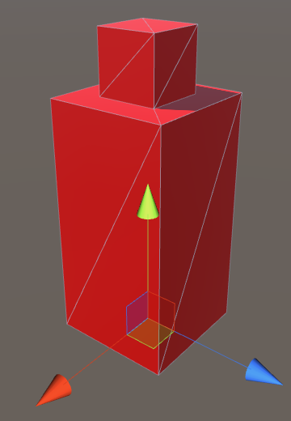 						Wall tower prefab. 					

Add a reference to this prefab to `**HexFeatureManager**` and hook it up.

```
	public Transform wallTower;
```

 						
 						Referencing the wall tower prefab. 					

### Building Towers

Let's begin by placing a tower in the middle of every wall segment. To do this, instantiate a tower at the end of the `AddWallSegment` method. Its position is the average of the left and right points of the segment.

```
	void AddWallSegment (
		Vector3 nearLeft, Vector3 farLeft, Vector3 nearRight, Vector3 farRight
	) {
		…

		Transform towerInstance = Instantiate(wallTower);
		towerInstance.transform.localPosition = (left + right) * 0.5f;
		towerInstance.SetParent(container, false);
	}
```

 							
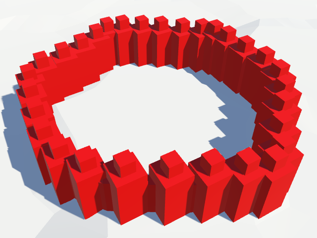 							One tower per wall segment. 						

We get a lot of towers along the wall, but their orientation  doesn't vary. We have to adjust their rotation so they align themselves  with the wall. As we have the left and right points of the wall, we know  which direction is right. We can use this to determine the orientation  of the wall segment, and thus that of its tower.

Rather than compute the rotation ourselves, we can just assign a vector to the `Transform.right`  property. Unity's code will take care of adjusting the object's  rotation so its local right direction aligns with the provided vector.

```
		Transform towerInstance = Instantiate(wallTower);
		towerInstance.transform.localPosition = (left + right) * 0.5f;
		Vector3 rightDirection = right - left;
		rightDirection.y = 0f;
		towerInstance.transform.right = rightDirection;
		towerInstance.SetParent(container, false);
```

 							
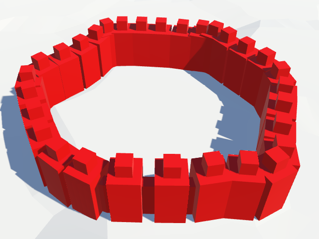 							Towers aligned with the wall. 						

 							How does setting `Transform.right` work? 							 							 						

### Fewer Towers

One tower per wall segment is way too much. So let's make adding a tower optional, by adding a boolean parameter to `AddWallSegment`. Give it a default value of `**false**`. That will make all the towers disappear.

```
	void AddWallSegment (
		Vector3 nearLeft, Vector3 farLeft, Vector3 nearRight, Vector3 farRight,
		bool addTower = false
	) {
		…

		if (addTower) {
			Transform towerInstance = Instantiate(wallTower);
			towerInstance.transform.localPosition = (left + right) * 0.5f;
			Vector3 rightDirection = right - left;
			rightDirection.y = 0f;
			towerInstance.transform.right = rightDirection;
			towerInstance.SetParent(container, false);
		}
	}
```

Let's limit towers to the wall segments places at the cell  corners. That will result in a few towers with fairly regular distances  between them.

```
	void AddWallSegment (
		Vector3 pivot, HexCell pivotCell,
		Vector3 left, HexCell leftCell,
		Vector3 right, HexCell rightCell
	) {
		…
				AddWallSegment(pivot, left, pivot, right, true);
		…
	}
```

 							
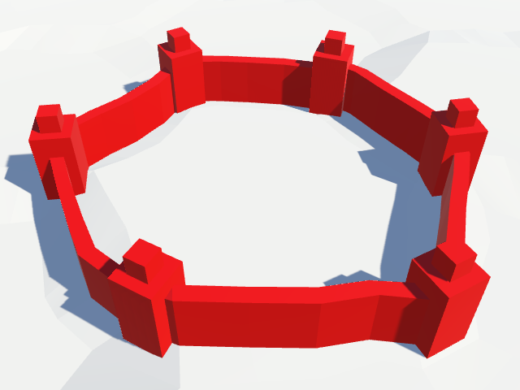 							Towers at cell corners only. 						

This look quite good, but you might want less regular wall  placement than this. Like with the other features, we can use the hash  grid to decide whether we place a tower at a corner. To do so, use the  center of the corner to sample the grid, then compare one of the hash  values with a tower threshold.

```
				HexHash hash = HexMetrics.SampleHashGrid(
					(pivot + left + right) * (1f / 3f)
				);
				bool hasTower = hash.e < HexMetrics.wallTowerThreshold;
				AddWallSegment(pivot, left, pivot, right, hasTower);
```

The threshold value belongs in `**HexMetrics**`. A value of 0.5 would spawn towers about half of the time, although you could get walls with many or no towers at all.

```
	public const float wallTowerThreshold = 0.5f;
```

 							
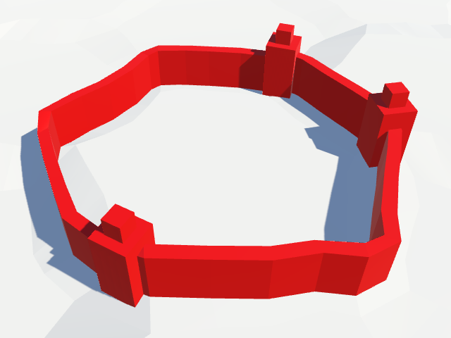 							Occasional towers. 						

### No Towers on Slopes

We're currently placing towers regardless off the shape of the  terrain. However, towers don't make much sense on slopes. The walls are  at an angle there, and might cut through the top of the tower.

 							
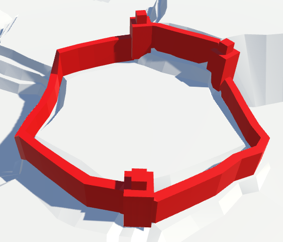 							Towers on slopes. 						

To avoid slopes, check whether the left and right cell of the  corner have the same elevation. Only then do we allow a potential tower.

```
				bool hasTower = false;
				if (leftCell.Elevation == rightCell.Elevation) {
					HexHash hash = HexMetrics.SampleHashGrid(
						(pivot + left + right) * (1f / 3f)
					);
					hasTower = hash.e < HexMetrics.wallTowerThreshold;
				}
				AddWallSegment(pivot, left, pivot, right, hasTower);
```

 							
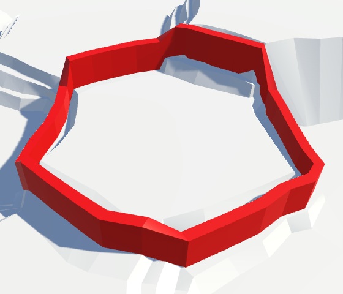 							No more towers on sloped walls. 						

### Grouding Walls and Towers

Although we avoid sloped walls, the terrain on both sides of  the wall can still have a different elevation. Walls can run along  terraces, and cells of the same elevation can have different vertical  adjustments. This can cause the base of the towers to float.

 							
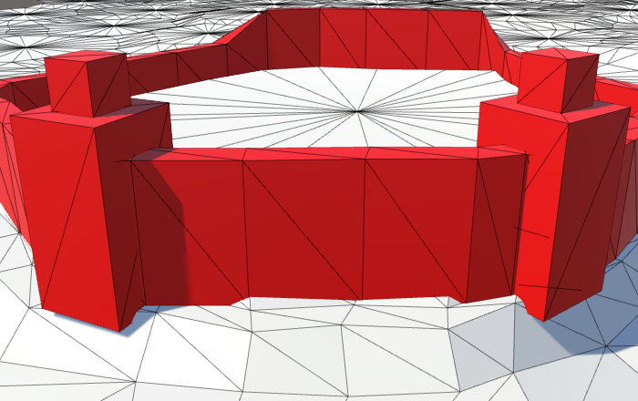 							Floating towers. 						

Actually, sloped walls can float as well, although it is not as noticeable as the towers.

 							
 							Floating walls. 						

A simple way to fix this is by extending the foundation of the  walls an towers into the ground. To do this, add an Y offset for walls  to `**HexMetrics**`. One unit down should be enough. Increase the height of the walls by the same amount.

```
	public const float wallHeight = 4f;
						
	public const float wallYOffset = -1f;
```

Adjust `**HexMetrics**.WallLerp` so it takes the new offset into account when determining the Y coordinate.

```
		public static Vector3 WallLerp (Vector3 near, Vector3 far) {
		near.x += (far.x - near.x) * 0.5f;
		near.z += (far.z - near.z) * 0.5f;
		float v =
			near.y < far.y ? wallElevationOffset : (1f - wallElevationOffset);
		near.y += (far.y - near.y) * v + wallYOffset;
		return near;
	}
```

We also have to adjust the tower prefab, as its base will now  end up one unit below ground. So increase the base cube's height by one  unity, and adjust the local position of the cubes accordingly.

 							
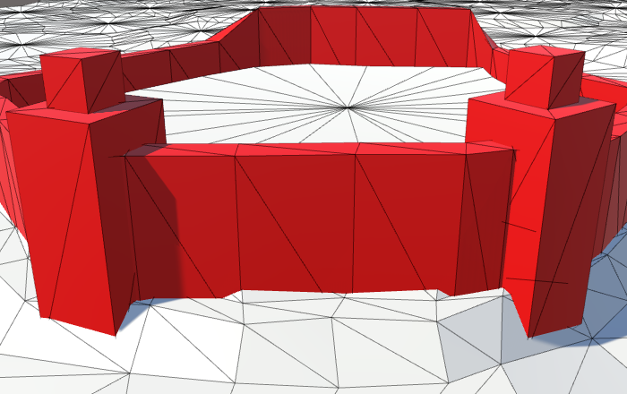							
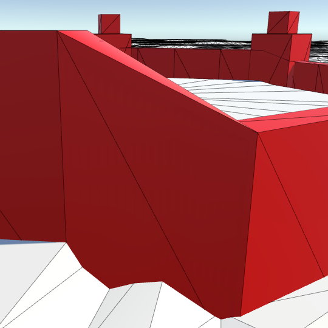 							Grounded walls and towers. 						

unitypackage

## Bridges

Up to this point, we have rivers and roads, but no way for roads to cross rivers. It is high time that we added bridges.

Start with a simple scaled cube to play the role of a bridge  prefab. The width of our rivers vary, but there's roughly seven units  between road centers on either side. So sets its scale to something like  (3, 1, 7). Give it the red urban material, and get rid of its collider.  Like the wall tower, put the cube inside a root object with uniform  scale. This way, the actual geometry of the bridge doesn't matter.

Add a bridge prefab reference to `**HexFeatureManager**` and assign the prefab to it.

```
	public Transform wallTower, bridge;
```

 						
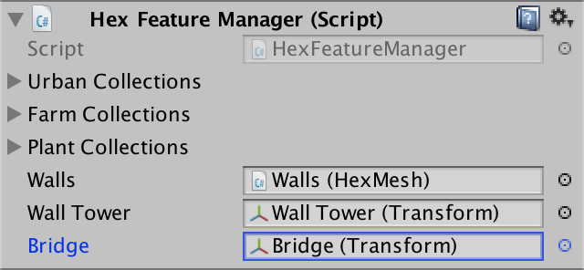 						Assigned bridge prefab. 					

### Placing Bridges

To place a bridge, we need a `**HexFeatureManager**.AddBridge` method. The bridge should be placed between the road center on either side of a river.

```
	public void AddBridge (Vector3 roadCenter1, Vector3 roadCenter2) {
		Transform instance = Instantiate(bridge);
		instance.localPosition = (roadCenter1 + roadCenter2) * 0.5f;
		instance.SetParent(container, false);
	}
```

We'll pass along the unperturbed road centers, so we have to perturb them before placing the bridge.

```
		roadCenter1 = HexMetrics.Perturb(roadCenter1);
		roadCenter2 = HexMetrics.Perturb(roadCenter2);
		Transform instance = Instantiate(bridge);
```

To properly align the bridge, we can use the same approach that  we used to rotate the wall towers. In this case, the road centers  define the forward vector of the bridge. As we stay within a single  cell, this vector is guaranteed to be horizontal, so we don't have to  set its Y component to zero.

```
		Transform instance = Instantiate(bridge);
		instance.localPosition = (roadCenter1 + roadCenter2) * 0.5f;
		instance.forward = roadCenter2 - roadCenter1;
		instance.SetParent(container, false);
```

### Bridging Straight Rivers

The only river configurations that need bridges are straight  and curved ones. Roads can run around end points, and zigzags can only  have roads on one side of them.

Let's first deal with straight rivers. Inside `**HexGridChunk**.TriangulateRoadAdjacentToRiver`, the first `**else** **if**` case takes care of placing roads adjacent to such rivers. It is here that we'll add the bridge.

We're on one side of the river. The road center is pulled away  from the river, and then the cell center itself is moved as well. To  find the road center on the opposite side, we have to pull in the  opposite direction by the same amount. This has to be done before the  center itself is modified.

```
	void TriangulateRoadAdjacentToRiver (
		HexDirection direction, HexCell cell, Vector3 center, EdgeVertices e
	) {
		…
		else if (cell.IncomingRiver == cell.OutgoingRiver.Opposite()) {
			…
			roadCenter += corner * 0.5f;
			features.AddBridge(roadCenter, center - corner * 0.5f);
			center += corner * 0.25f;
		}
		…
	}
```

 							
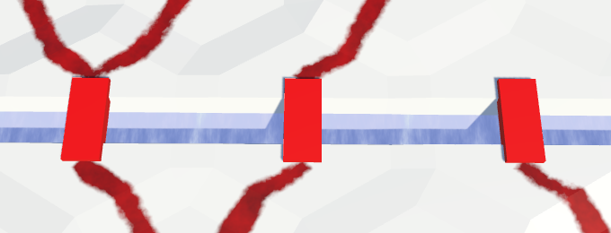 							Bridges across straight rivers. 						

Bridges appear! But we now get one bridge instance for each  direction that doesn't have a river flowing through it. We have to  ensure that only one bridge instance is generated per cell. This can be  done by choosing one direction relative to the river, to generate a  bridge from. It doesn't matter which.

```
			roadCenter += corner * 0.5f;
			if (cell.IncomingRiver == direction.Next()) {
				features.AddBridge(roadCenter, center - corner * 0.5f);
			}
			center += corner * 0.25f;
```

Furthermore, we should only add a bridge when there is a road  on both sides of the river. By this point, we're already sure that  there's a road on the current side. So we have to check whether there's a  road on the other side as well.

```
			if (cell.IncomingRiver == direction.Next() && (
				cell.HasRoadThroughEdge(direction.Next2()) ||
				cell.HasRoadThroughEdge(direction.Opposite())
			)) {
				features.AddBridge(roadCenter, center - corner * 0.5f);
			}
```

 							
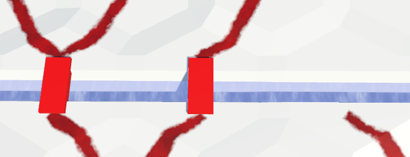 							Bridges between roads on both sides. 						

### Bridging Curving Rivers

Bridges across curving rivers work similarly, but the topology  is slightly different. We'll add the bridge when we're on the outside of  the curve. This is the case in the final `**else**`  block. There, the middle direction is used to offset the road center.  We'll need to use this offset twice, with different scale, so store it  in a variable.

```
	void TriangulateRoadAdjacentToRiver (
		HexDirection direction, HexCell cell, Vector3 center, EdgeVertices e
	) {
		…
		else {
			HexDirection middle;
			if (previousHasRiver) {
				middle = direction.Next();
			}
			else if (nextHasRiver) {
				middle = direction.Previous();
			}
			else {
				middle = direction;
			}
			if (
				!cell.HasRoadThroughEdge(middle) &&
				!cell.HasRoadThroughEdge(middle.Previous()) &&
				!cell.HasRoadThroughEdge(middle.Next())
			) {
				return;
			}
			Vector3 offset = HexMetrics.GetSolidEdgeMiddle(middle);
			roadCenter += offset * 0.25f;
		}

		…
	}
```

The offset scale on the outside of the curve is 0.25, but it's `**HexMetrics**.innerToOuter * 0.7f` on the inside. Use this to place the bridge.

```
			Vector3 offset = HexMetrics.GetSolidEdgeMiddle(middle);
			roadCenter += offset * 0.25f;
			features.AddBridge(
				roadCenter,
				center - offset * (HexMetrics.innerToOuter * 0.7f)
			);
```

 							
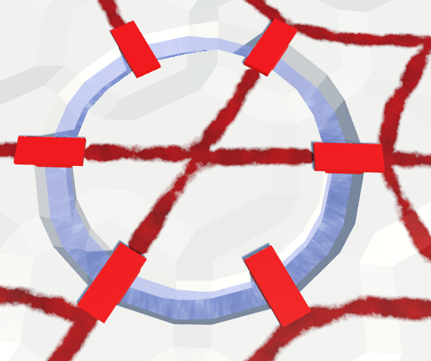 							Bridges across curving rivers. 						

Once again, we have to prevent duplicate bridges. We can do this by only adding a bridge from the middle direction.

```
			Vector3 offset = HexMetrics.GetSolidEdgeMiddle(middle);
			roadCenter += offset * 0.25f;
			if (direction == middle) {
				features.AddBridge(
					roadCenter,
					center - offset * (HexMetrics.innerToOuter * 0.7f)
				);
			}
```

And again, we have to make sure that there's a road on the opposite side as well.

```
			if (
				direction == middle &&
				cell.HasRoadThroughEdge(direction.Opposite())
			) {
				features.AddBridge(
					roadCenter,
					center - offset * (HexMetrics.innerToOuter * 0.7f)
				);
			}
```

 							
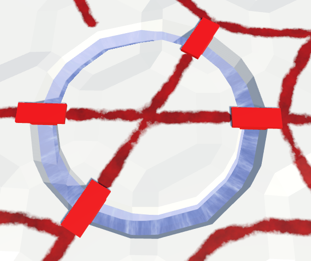 							Bridges between roads on both sides. 						

### Scaling Bridges

Because we perturb the terrain, the distance between road  centers on opposite sides of a river vary. Sometimes our bridges are too  short, and sometimes they're too long.

 							
 							Varying distances, but constant bridge length. 						

Although we've designed out bridge for a length of seven units,  we could scale the bridge to match the true distance between road  centers. This means that the bridge model will get deformed. As the  distances don't vary too much, this deformation might be more acceptable  than misfit bridges.

To perform correct scaling, we need to know the design length of the bridge prefab. Store this length in `**HexMetrics**`.

```
	public const float bridgeDesignLength = 7f;
```

Now we can set the Z scale of the bridge instance to the  distance between the road centers, divided by the design length. As the  root of the bridge prefab has uniform scale, the bridge will be  stretched correctly.

```
	public void AddBridge (Vector3 roadCenter1, Vector3 roadCenter2) {
		roadCenter1 = HexMetrics.Perturb(roadCenter1);
		roadCenter2 = HexMetrics.Perturb(roadCenter2);
		Transform instance = Instantiate(bridge);
		instance.localPosition = (roadCenter1 + roadCenter2) * 0.5f;
		instance.forward = roadCenter2 - roadCenter1;
		float length = Vector3.Distance(roadCenter1, roadCenter2);
		instance.localScale = new Vector3(
			1f,	1f, length * (1f / HexMetrics.bridgeDesignLength)
		);
		instance.SetParent(container, false);
	}
```

 							
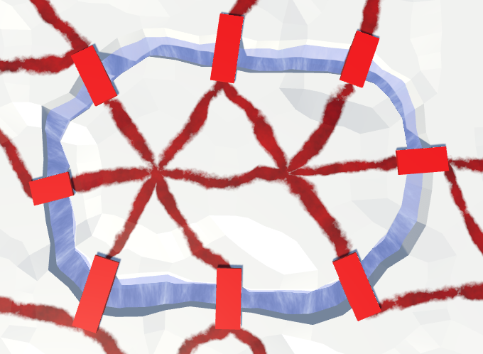 							Varying bridge length. 						

### Bridge Design

Instead of a single cube, you can use a more interesting bridge  model. For example, you can create a crude arch bridge with three  scaled and rotated cubes. Of course you could create much more fancy 3D  models, including bits of road. But keep in mind that the whole thing  will be squashed and stretched a bit.

 							 							 							Arch bridges of various lengths. 						

unitypackage

## Special Features

So far, our cells can contain urban, farm, and plant features.  Even through they have three levels each, the features are all  relatively small, compared to the size of a cell. What if we want to add  a large structure, like a castle?

Let's add a special feature type to our terrain. These features  are so large that they occupy an entire cell. Each of these features is  unique and needs its own prefab. For example, a simple castle can be  created with one large central cube, plus four corner towers. A scale of  (6, 4, 6) for the center cube produces a fairly large castle that still  fits inside highly deformed cells.

 						
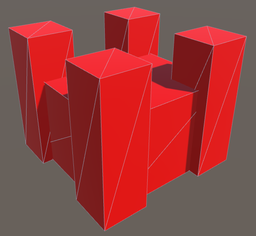 						Castle prefab. 					

Another special feature could be a ziggurat, for example made  from three stacked cubes. (8, 2.5, 8) is a good scale for the bottom  cube.

 						
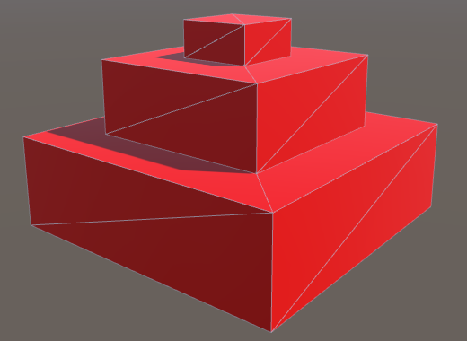 						Ziggurat prefab. 					

Special features could be anything, they needn't be limited to  architecture. For instance, a group of massive trees up to ten units  high can represent a cell filled with megaflora.

 						
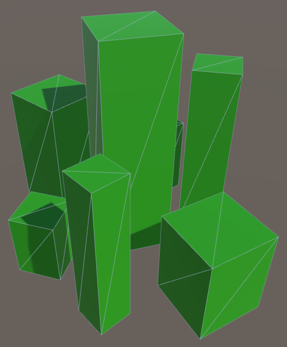 						Megaflora prefab. 					

Add an array to `**HexFeatureManager**` to keep track of these prefabs.

```
	public Transform[] special;
```

Add the castle to the array first, then the ziggurat, and then the megaflora.

 						
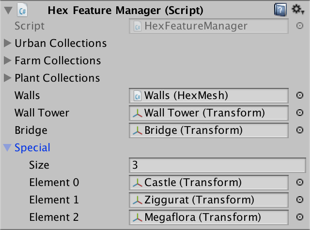 						Configuring special features. 					

### Making Cells Special

`**HexCell**` now needs a special index, to determine the special feature it has, if any.

```
	int specialIndex;
```

Like the other features, give it a property to get and set this value.

```
	public int SpecialIndex {
		get {
			return specialIndex;
		}
		set {
			if (specialIndex != value) {
				specialIndex = value;
				RefreshSelfOnly();
			}
		}
	}
```

By default, a cell does not contain a special feature. We'll  indicate this with index zero. Add a property which uses this approach  to determine whether the cell is special, or not.

```
	public bool IsSpecial {
		get {
			return specialIndex > 0;
		}
	}
```

To edit the cells, add support for the special index to `**HexMapEditor**`. It works just like the levels for urban, farm, and plant features.

```
	int activeUrbanLevel, activeFarmLevel, activePlantLevel, activeSpecialIndex;

	…

	bool applyUrbanLevel, applyFarmLevel, applyPlantLevel, applySpecialIndex;
	
	…
	
	public void SetApplySpecialIndex (bool toggle) {
		applySpecialIndex = toggle;
	}

	public void SetSpecialIndex (float index) {
		activeSpecialIndex = (int)index;
	}
	
	…
	
	void EditCell (HexCell cell) {
		if (cell) {
			if (applyColor) {
				cell.Color = activeColor;
			}
			if (applyElevation) {
				cell.Elevation = activeElevation;
			}
			if (applyWaterLevel) {
				cell.WaterLevel = activeWaterLevel;
			}
			if (applySpecialIndex) {
				cell.SpecialIndex = activeSpecialIndex;
			}
			if (applyUrbanLevel) {
				cell.UrbanLevel = activeUrbanLevel;
			}
			…
		}
	}
```

Add a slider to the UI to control the special feature. As we  have three features, set the slider's range to 0–3. Zero means no  feature, one is a castle, two is a ziggurat, and three is megaflora.

 							
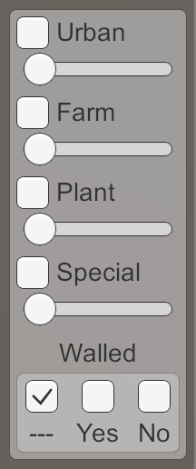 							Special slider. 						

### Adding Special Features

We can now assign special features to cells. To make them appear, we have to add yet another method to `**HexFeatureManager**`.  It simply instantiates the desired special feature and places it at the  desired position. Because zero is reserved for no feature, we have to  subtract one from the cell's special index before accessing the prefab  array.

```
	public void AddSpecialFeature (HexCell cell, Vector3 position) {
		Transform instance = Instantiate(special[cell.SpecialIndex - 1]);
		instance.localPosition = HexMetrics.Perturb(position);
		instance.SetParent(container, false);
	}
```

Give the features an arbitrary orientation, using the hash grid.

```
	public void AddSpecialFeature (HexCell cell, Vector3 position) {
		Transform instance = Instantiate(special[cell.SpecialIndex - 1]);
		instance.localPosition = HexMetrics.Perturb(position);
		HexHash hash = HexMetrics.SampleHashGrid(position);
		instance.localRotation = Quaternion.Euler(0f, 360f * hash.e, 0f);
		instance.SetParent(container, false);
	}
```

When triangulating a cell in `**HexGridChunk**.Triangulate`, check whether the cell has a special feature. If so, invoke our new method, just like `AddFeature`.

```
	void Triangulate (HexCell cell) {
		for (HexDirection d = HexDirection.NE; d <= HexDirection.NW; d++) {
			Triangulate(d, cell);
		}
		if (!cell.IsUnderwater && !cell.HasRiver && !cell.HasRoads) {
			features.AddFeature(cell, cell.Position);
		}
		if (cell.IsSpecial) {
			features.AddSpecialFeature(cell, cell.Position);
		}
	}
```

 							
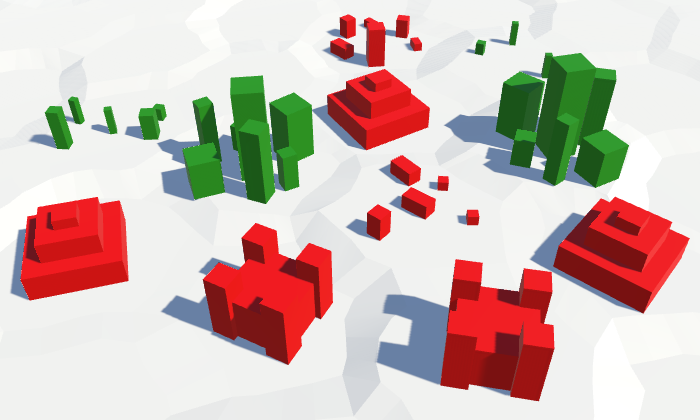 							Special features, much larger than regular features. 						

### Avoiding Rivers

Because special features sit in the centers of cells, they do not combine well with rivers. They end up floating above them.

 							
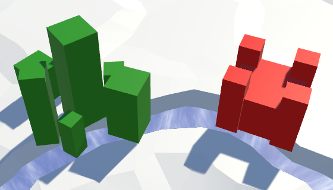 							Features on rivers. 						

To prevent special features from being placed on top of rivers, adjust the `**HexCell**.SpecialIndex` property. Only change the index when the cell doesn't have a river.

```
	public int SpecialIndex {
		…
		set {
			if (specialIndex != value && !HasRiver) {
				specialIndex = value;
				RefreshSelfOnly();
			}
		}
	}
```

Also, when adding a river, we have to get rid of any special  features. The river will wash them away. This can be done by setting the  special indices to zero in the `**HexCell**.SetOutgoingRiver` method.

```
	public void SetOutgoingRiver (HexDirection direction) {
		…
		hasOutgoingRiver = true;
		outgoingRiver = direction;
		specialIndex = 0;

		neighbor.RemoveIncomingRiver();
		neighbor.hasIncomingRiver = true;
		neighbor.incomingRiver = direction.Opposite();
		neighbor.specialIndex = 0;

		SetRoad((int)direction, false);
	}
```

### Avoiding Roads

Like rivers, roads also don't combine well with special  features, although it is not as bad. You might decide to leave the roads  as they are. Maybe some features could work with roads, while others  cannot. So you could make it depend on the feature. But we'll keep it  simple.

 							
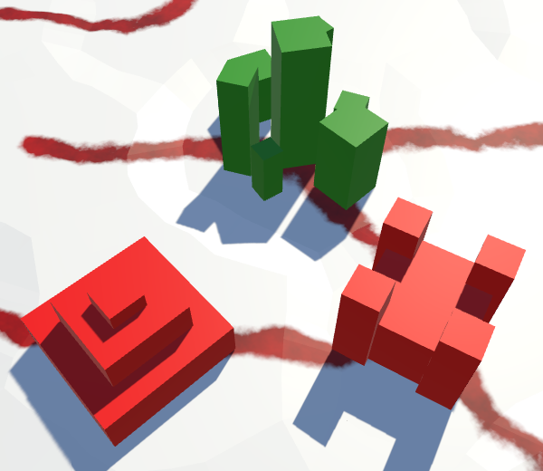 							Features on roads. 						

In this case, let's have the special features beat roads. So  when adjusting the special index, remove all the roads from the cell as  well.

```
	public int SpecialIndex {
		…
		set {
			if (specialIndex != value && !HasRiver) {
				specialIndex = value;
				RemoveRoads();
				RefreshSelfOnly();
			}
		}
	}
```

 							What if we remove the special feature? 							 						

This also means that we have to perform additional checks when  trying to add a road. Only add the road when neither cell is special.

```
	public void AddRoad (HexDirection direction) {
		if (
			!roads[(int)direction] && !HasRiverThroughEdge(direction) &&
			!IsSpecial && !GetNeighbor(direction).IsSpecial &&
			GetElevationDifference(direction) <= 1
		) {
			SetRoad((int)direction, true);
		}
	}
```

### Avoiding other Features

Special features don't mix with the other feature types either.  Having them overlap can get quite messy. Again, this could vary per  special feature, but we'll use a uniform approach.

 							
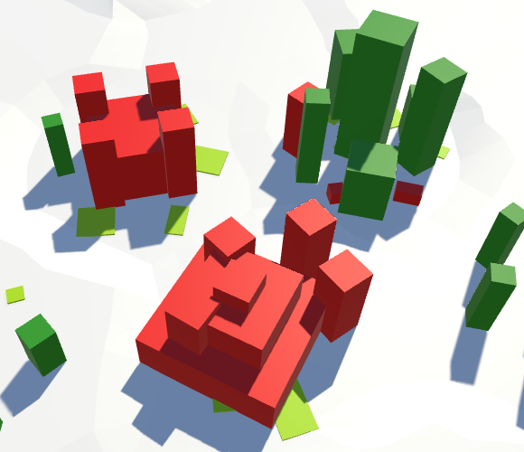 							Features intersecting other features. 						

In this case, let's suppress the minor features, like when they end up underwater. This time, let's perform the check in `**HexFeatureManager**.AddFeature`.

```
	public void AddFeature (HexCell cell, Vector3 position) {
		if (cell.IsSpecial) {
			return;
		}

		…
	}
```

### Avoiding Water

Finally, there's the issue of water. Do special features  survive being submerged, or not? As we suppress the minor features in  submerged cells, let's do the same for the special features.

 							
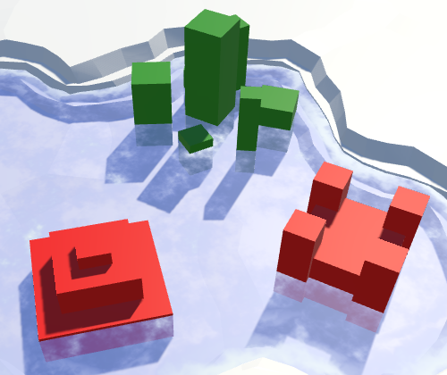 							Features in water. 						

In `**HexGridChunk**.Triangulate`, perform the same underwater check for both regular and special features.

```
	void Triangulate (HexCell cell) {
		for (HexDirection d = HexDirection.NE; d <= HexDirection.NW; d++) {
			Triangulate(d, cell);
		}
		if (!cell.IsUnderwater && !cell.HasRiver && !cell.HasRoads) {
			features.AddFeature(cell, cell.Position);
		}
		if (!cell.IsUnderwater && cell.IsSpecial) {
			features.AddSpecialFeature(cell, cell.Position);
		}
	}
```

As both `**if**` statements now check whether the cell in underwater, we can extract it and do it only once.

```
	void Triangulate (HexCell cell) {
		for (HexDirection d = HexDirection.NE; d <= HexDirection.NW; d++) {
			Triangulate(d, cell);
		}
		if (!cell.IsUnderwater) {
			if (!cell.HasRiver && !cell.HasRoads) {
				features.AddFeature(cell, cell.Position);
			}
			if (cell.IsSpecial) {
				features.AddSpecialFeature(cell, cell.Position);
			}
		}
	}
```

That should be enough feature types to play with. The next tutorial is [Saving and Loading](https://catlikecoding.com/unity/tutorials/hex-map/part-12/).

unitypackage

PDF
