# Hex Map 16

Pathfinding

- Highlight cells.
- Pick a search destination.
- Find the shortest path.
- Create a priority queue.

This is part 16 of a tutorial series about [hexagon maps](https://catlikecoding.com/unity/tutorials/hex-map/). After figuring out the distances between cells, we move on to finding paths between them.

From now on, the Hex Map tutorials are made with Unity 5.6.0.  Note that there is a bug in 5.6 that breaks texture arrays in builds on  multiple platforms. The workaround is to enable *Is Readable* via the texture array's inspector.

 					
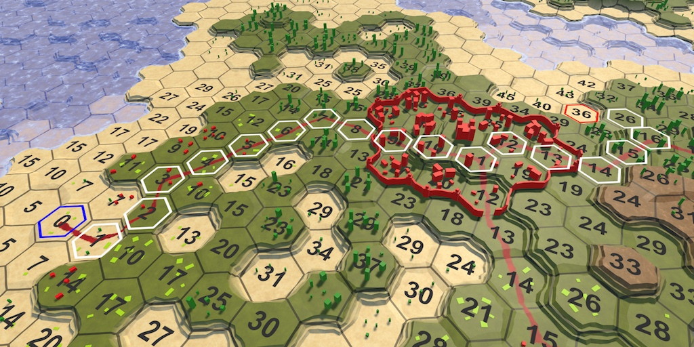 					Planning a journey. 				

## Highlighting Cells

To search for a path between two cells, we first have to select  these cells. It's no longer a matter of selecting a single cell and  watching the search spread through the map. For example, we first select  a starting cell, followed by a destination cell. After making these  selections, it would be handy to highlight them. So let's add that  functionality. We're not going to create a fancy or efficient  highlighting method now, just a quick one to aid development.

### Outline Texture

A simply way to highlight cells is by adding an outline to  them. The most straightforward way to do this is with a texture that  contains a hexagon outline. [Here](https://catlikecoding.com/unity/tutorials/hex-map/part-16/highlighting-cells/cell-outline.png)  is such a texture. It is transparent except for a white hexagon  outline. By making it white, we can colorize it later as we see fit.

 							
 							Cell outline on black background. 						

Import the texture and set its *Texture Type* to *Sprite*. Its *Sprite Mode* is *Single*, with the default settings. Because it's a pure white texture, we don't need *sRGB* conversion. The alpha channel represents transparency, so enable *Alpha is Transparency*. I also enabled mip maps and set the *Filter Mode* to *Trilinear*, because otherwise mip transitions can be obvious for outlines.

 							
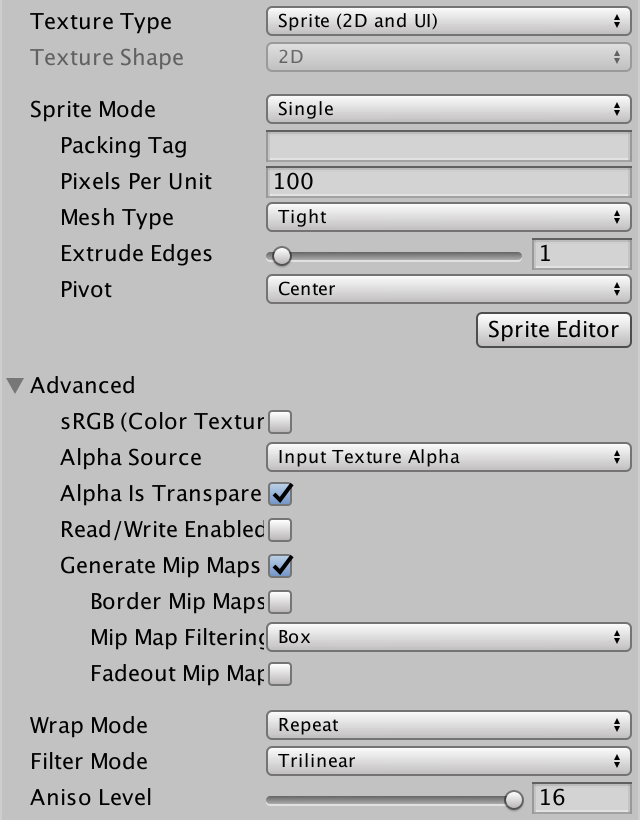 							Texture import settings. 						

### One Sprite Per Cell

The quickest ways to add a potential outline to each cell, is  to give each its own sprite. Create a new game object and add an image  component to it, via *Component / UI / Image*, and assign our outline sprite to it. Then, put a *Hex Cell Label*  prefab instance in the scene, make the sprite object a child of it, and  apply the changes to the prefab. Then get rid of the instance.

 							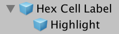 							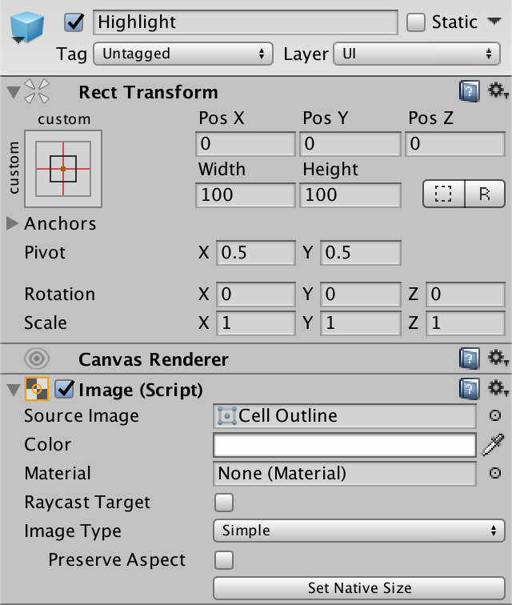 							Highlight prefab child. 						

Now every cells has a sprite, but they will be much too large. To make the outlines fit around the cell centers, change the *Width* and *Height* of the sprite's transform component to 17.

 							
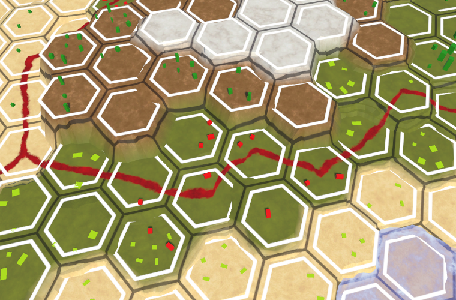 							Highlight sprites, partially obscured by terrain. 						

### Drawing on Top of Everything

Because the outline overlaps the cell edge regions, it often  ends up below the terrain geometry. This causes part of the outline to  disappear. Changing the vertical position of the sprites can prevent  this for small elevation changes, but not for cliffs. What we can do  instead, is always draw the outlines on top of everything else. We need  to create a custom sprite shader for this. We can suffice by copying  Unity's default sprite shader and making a few changes.

```
Shader "Custom/Highlight" {
	Properties {
		[PerRendererData] _MainTex ("Sprite Texture", 2D) = "white" {}
		_Color ("Tint", Color) = (1,1,1,1)
		[MaterialToggle] PixelSnap ("Pixel snap", Float) = 0
		[HideInInspector] _RendererColor ("RendererColor", Color) = (1,1,1,1)
		[HideInInspector] _Flip ("Flip", Vector) = (1,1,1,1)
		[PerRendererData] _AlphaTex ("External Alpha", 2D) = "white" {}
		[PerRendererData] _EnableExternalAlpha ("Enable External Alpha", Float) = 0
	}

	SubShader {
		Tags { 
			"Queue"="Transparent"
			"IgnoreProjector"="True"
			"RenderType"="Transparent"
			"PreviewType"="Plane"
			"CanUseSpriteAtlas"="True"
		}

		Cull Off
		ZWrite Off
		Blend One OneMinusSrcAlpha

		Pass {
			CGPROGRAM
			#pragma vertex SpriteVert
			#pragma fragment SpriteFrag
			#pragma target 2.0
			#pragma multi_compile_instancing
			#pragma multi_compile _ PIXELSNAP_ON
			#pragma multi_compile _ ETC1_EXTERNAL_ALPHA
			#include "UnitySprites.cginc"
			ENDCG
		}
	}
}
```

The first change is to ignore the depth buffer, by making the Z test always succeed.

```
		ZWrite Off
		ZTest Always
```

The second change is to draw after all other transparent geometry. Adding 10 to the transparent queue should suffice.

```
			"Queue"="Transparent+10"
```

Create a new material that uses this shader. We can ignore all  its properties, sticking with the default values. Then have our sprite  prefab use this material.

 							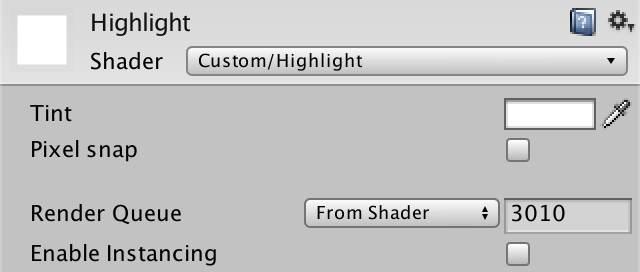 							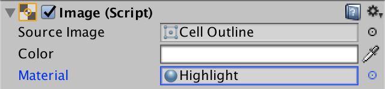 							Using a custom sprite material. 						

Our highlights are now always visible. Even when a cell is  hidden behind higher terrain, its outline will still be drawn on top of  everything else. This might not be pretty, but it ensures that we can  always spot the highlighted cells, which is useful.

 							
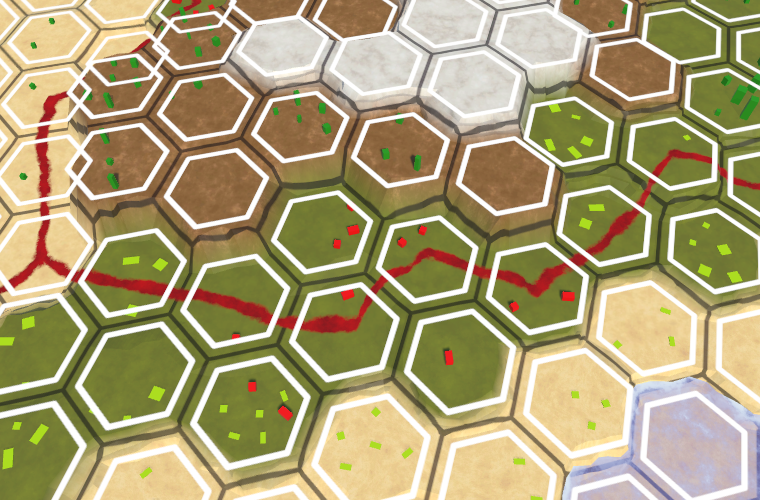 							Ignoring the depth buffer. 						

### Controlling Highlights

We don't want all cells to be highlighted all the time. In  fact, we want to start out with none of them highlighted. We can do this  by disabling the image component of the *Highlight* prefab object.

 							
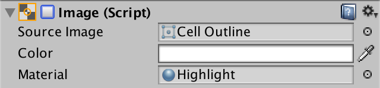 							Disabled image component. 						

To enable the highlight of a cell, add an `EnableHighlight` method to `**HexCell**`. It has to grab the only child of its `uiRect` and enable its image component. Create a `DisableHighlight` method as well.

```
	public void DisableHighlight () {
		Image highlight = uiRect.GetChild(0).GetComponent<Image>();
		highlight.enabled = false;
	}
	
	public void EnableHighlight () {
		Image highlight = uiRect.GetChild(0).GetComponent<Image>();
		highlight.enabled = true;
	}
```

Finally, we can also provide a color to tint the highlight when enabling it.

```
	public void EnableHighlight (Color color) {
		Image highlight = uiRect.GetChild(0).GetComponent<Image>();
		highlight.color = color;
		highlight.enabled = true;
	}
```

unitypackage

## Finding a Path

Now that we can highlight cells, we can go ahead and select two  cells, then search for a path between them. First we have to actually  select the cells, then limit the search to finding a path, and finally  show that path.

### Search Start

We have two different cells to select, the start and the end  point of the search. Let's say that to select the cell to search from,  you have to hold down the left shift key while clicking. Doing so will  highlight that cell with a blue color. We have to keep a reference to  this cell for later searching. Also, when a new starting cell is chosen,  the highlight of the old one should be disabled. So add a `searchFromCell` field to `**HexMapEditor**`.

```
	HexCell previousCell, searchFromCell;
```

Inside `HandleInput`, we can use `Input.GetKey(KeyCode.LeftShift)` to check whether the shift key is being held down.

```
			if (editMode) {
				EditCells(currentCell);
			}
			else if (Input.GetKey(KeyCode.LeftShift)) {
				if (searchFromCell) {
					searchFromCell.DisableHighlight();
				}
				searchFromCell = currentCell;
				searchFromCell.EnableHighlight(Color.blue);
			}
			else {
				hexGrid.FindDistancesTo(currentCell);
			}
```

 							
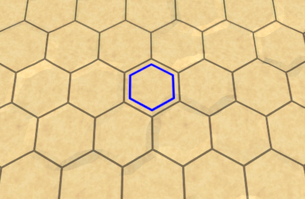 							Where to search from. 						

### Search Destination

Instead of finding all distances to a cell, we're now looking for a path between two specific cells. So rename `**HexGrid**.FindDistancesTo` to `**HexGrid**.FindPath` and give it a second `**HexCell**` parameter. Adjust the `Search` method as well.

```
	public void FindPath (HexCell fromCell, HexCell toCell) {
		StopAllCoroutines();
		StartCoroutine(Search(fromCell, toCell));
	}

	IEnumerator Search (HexCell fromCell, HexCell toCell) {
		for (int i = 0; i < cells.Length; i++) {
			cells[i].Distance = int.MaxValue;
		}

		WaitForSeconds delay = new WaitForSeconds(1 / 60f);
		List<HexCell> frontier = new List<HexCell>();
		fromCell.Distance = 0;
		frontier.Add(fromCell);
		…
	}
```

`**HexMapEditor**.HandleInput` now has to invoke the adjusted method, using `searchFromCell` and `currentCell`  as arguments. Also, we can only look for a path when we know which cell  to search from. And we don't have to bother looking for a path when the  destination is the same as the start.

```
			if (editMode) {
				EditCells(currentCell);
			}
			else if (Input.GetKey(KeyCode.LeftShift)) {
				…
			}
			else if (searchFromCell && searchFromCell != currentCell) {
				hexGrid.FindPath(searchFromCell, currentCell);
			}
```

Once we're going for a search, we should first get rid of all previous highlights. So have `**HexGrid**.Search`  disable the highlights while it's resetting the distances. As this also  disables the highlight of the starting cell, enable it again  afterwards. At this point, we can also highlight the destination cell.  Let's make it red.

```
	IEnumerator Search (HexCell fromCell, HexCell toCell) {
		for (int i = 0; i < cells.Length; i++) {
			cells[i].Distance = int.MaxValue;
			cells[i].DisableHighlight();
		}
		fromCell.EnableHighlight(Color.blue);
		toCell.EnableHighlight(Color.red);
		
		…
	}
```

 							
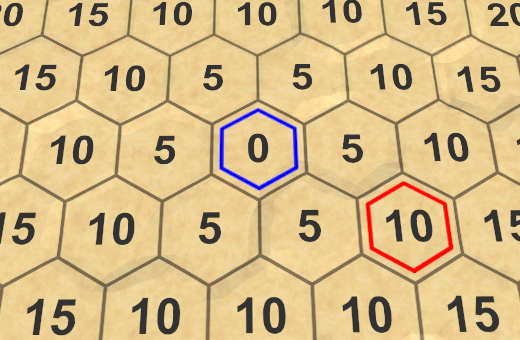 							The endpoints of a potential path. 						

### Limiting the Search

At this point, our search algorithm still computes the  distances for all cells that are reachable from the starting cell. This  is no longer necessary. We can stop as soon as we've found the final  distance to the destination cell. So when the current cell is the  destination, we can break out of the algorithm loop.

```
		while (frontier.Count > 0) {
			yield return delay;
			HexCell current = frontier[0];
			frontier.RemoveAt(0);

			if (current == toCell) {
				break;
			}

			for (HexDirection d = HexDirection.NE; d <= HexDirection.NW; d++) {
				…
			}
		}
```

 							
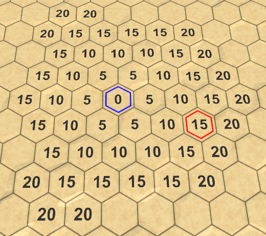 							Stopping at the destination. 						

 							What happens if the destination cannot be reached? 							 						

### Showing the Path

We can find the distance between the start and end of a path,  but we do not yet know what the actual path is. To do so, we have to  keep track of how each cell was reached. How can we do this?

When adding a cell to the frontier, we do so because it's a  neighbor of the current cell. The only exception is the starting cell.  All other cells were reached via the current cell. If we keep track of  from which cell each cell was reached, we end up with a cell network.  Spefically, a tree network with the starting cell as its root. We can  use this to construct a path once we reach the destination.

 							
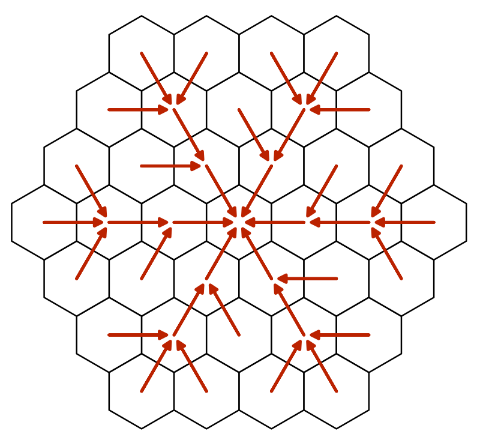 							A tree network describing paths to the center. 						

We can store this information by adding another cell reference to `**HexCell**`. We don't need to serialize this data, so let's use a default property for it.

```
	public HexCell PathFrom { get; set; }
```

Back in `**HexGrid**.Search`, set the neighbor's `PathFrom`  to the current cell when adding it to the frontier. We also have to  change this reference when we find a shorter route to a neighbor.

```
				if (neighbor.Distance == int.MaxValue) {
					neighbor.Distance = distance;
					neighbor.PathFrom = current;
					frontier.Add(neighbor);
				}
				else if (distance < neighbor.Distance) {
					neighbor.Distance = distance;
					neighbor.PathFrom = current;
				}
```

After arriving at the destination, we can visualize the path by  following these references back to the starting cell, and highlight  them.

```
			if (current == toCell) {
				current = current.PathFrom;
				while (current != fromCell) {
					current.EnableHighlight(Color.white);
					current = current.PathFrom;
				}
				break;
			}
```

 							
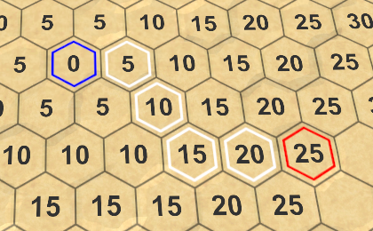 							A path has been found. 						

Note that there are often multiple shortest paths. Which is  found depends on the order in which the cells are processed. Some paths  might look good, others might look bad, but there's never a shorter  path. We'll get back to this later.

### Adjusting the Seach Start

Once a starting cell has been chosen, changing the destination  cell will trigger a new search. The same should happen when selecting a  new starting cell. To make this possible, `**HexMapEditor**` also has to remember the destination cell.

```
	HexCell previousCell, searchFromCell, searchToCell;
```

Using this field, we can also initiate a new search when selecting a new start.

```
			else if (Input.GetKey(KeyCode.LeftShift)) {
				if (searchFromCell) {
					searchFromCell.DisableHighlight();
				}
				searchFromCell = currentCell;
				searchFromCell.EnableHighlight(Color.blue);
				if (searchToCell) {
					hexGrid.FindPath(searchFromCell, searchToCell);
				}
			}
			else if (searchFromCell && searchFromCell != currentCell) {
				searchToCell = currentCell;
				hexGrid.FindPath(searchFromCell, searchToCell);
			}
```

Also, we should avoid making the start cell equal to the destination cell.

```
			if (editMode) {
				EditCells(currentCell);
			}
			else if (
				Input.GetKey(KeyCode.LeftShift) && searchToCell != currentCell
			) {
				…
			}
```

unitypackage

## Smarter Searching

Although our search algorithm finds the shortest path, it spends  a lot of time investigating cells that obviously won't be part of that  path. Obvious to us, at least. The algorithm doesn't have a high-level  view of the map. It cannot see that searching in some directions will be  pointless. It prefers to follow roads, even if they lead away from the  destination. Can we make it smarter?

Currently, we're only considering a cell's distance from the  start when deciding which cell to process next. If we want to be smart  about this, we also have to consider the distance to the destination.  Unfortunately, we don't know this yet. But we could make an estimate of  the remaining distance. Adding that to the cell distance gives us an  indication of the total path length that goes through this cell. We can  then use that to determine the search priorities for cells.

### Search Heuristic

When we're relying on an estimate or guess instead of exactly  known data, we say that we use a search heuristic. This heuristic  represents our best guess of the remaining distance. We have to  determine this value for each cell that we search through, so add an  integer property for it to `**HexCell**`. We don't need to serialize it, so we can suffice with another default property.

```
	public int SearchHeuristic { get; set; }
```

How do we guess the remaining distance? In the most ideal case,  there would be a road leading straight to the destination. If so, the  distance is equal to the unmodified distance between the coordinates of  this cell and the destination cell. Let's use that as our heuristic.

As the heuristic doesn't depend on the path traveled so far, it  is constant during the search. So we only have to compute it once, when  `**HexGrid**.Search` adds a cell to the frontier.

```
				if (neighbor.Distance == int.MaxValue) {
					neighbor.Distance = distance;
					neighbor.PathFrom = current;
					neighbor.SearchHeuristic =
						neighbor.coordinates.DistanceTo(toCell.coordinates);
					frontier.Add(neighbor);
				}
```

### Search Priority

From now on, we'll determine the search priority based on the  cell distance plus its heuristic. Let's add a convenient property for  this value to `**HexCell**`.

```
	public int SearchPriority {
		get {
			return distance + SearchHeuristic;
		}
	}
```

To make this work, adjust `**HexGrid**.Search` so it uses this property to sort the frontier.

```
				frontier.Sort(
					(x, y) => x.SearchPriority.CompareTo(y.SearchPriority)
				);
```

 							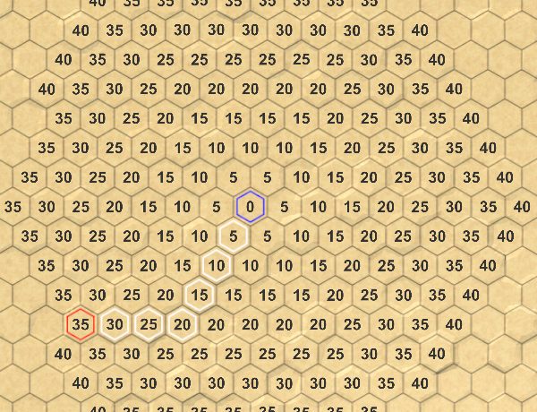 							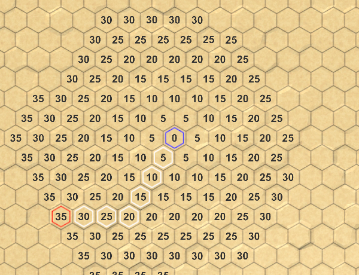 							Searching without vs. with heuristic. 						

### Admissible Heuristic

Using our new search priorities, we indeed end up visiting  fewer cells. However, on a featureless map the algorithm still processes  cells that lie in the wrong direction. This happens because our default  movement cost is 5 per step, while the heuristic only adds 1 per step.  So the influence of the heuristic isn't very strong.

If the movement costs are the same across the map, then we  could use the same costs when determining the heuristic. In our case,  that would be our current heuristic times 5. That would drastically  reduce the amount of processed cells.

 							
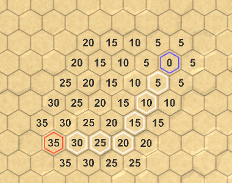 							Using heuristic × 5. 						

However, if there are roads on the map, we might end up  overestimating the remaining distance. As a result, the algorithm can  make mistakes and produce a path that isn't actually the shortest.

 							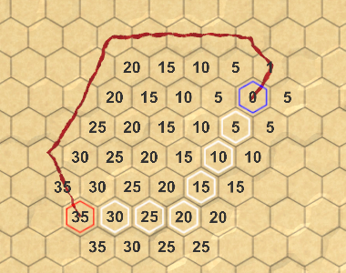 							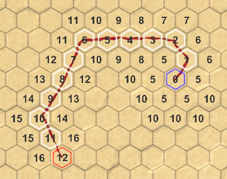 							Overestimating vs. admissible heuristic. 						

To guarantee that we find the shortest path, we have to make  sure that we never overestimate the remaining distance. This is known as  an admissible heuristic. Because our minimum movement cost is 1, we  have no choice but to use the same costs when determining the heuristic.

Technically, it's fine to use an even lower cost, but that  would only make the heuristic weaker. The lowest possible heuristic is  zero, which is simply Dijkstra's algorithm. When the heuristic is  nonzero, this algorithm is known as A*, pronounced as A-star.

 							Why is it known as A*? 							 						

unitypackage

## Priority Queue

Although A* is a good algorithm, our implementation  of it is not that efficient. That's because we're using a list to store  the frontier, which we have to sort each iteration. As mentioned in the [previous tutorial](https://catlikecoding.com/unity/tutorials/hex-map/part-15/), what we need is a priority queue, but there's no standard implementation of one. Let's now create one ourselves.

Our queue must support an enqueue and a dequeue operation, based  on priority. It must also support changing the priority of a cell  that's already in the queue. Ideally, we implement this while minimizing  searching, sorting, and memory allocations. And we want to keep it  simple too.

### Creating a Custom Queue

Create a new `**HexCellPriorityQueue**` class with the required public methods. We'll use a simple list to keep track of the queue's contents. Also, give it a `Clear` method to reset the queue, so we can reuse it.

```
using System.Collections.Generic;

public class HexCellPriorityQueue {

	List<HexCell> list = new List<HexCell>();

	public void Enqueue (HexCell cell) {
	}

	public HexCell Dequeue () {
		return null;
	}
	
	public void Change (HexCell cell) {
	}
	
	public void Clear () {
		list.Clear();
	}
}
```

We store the cell priorities in the cells themselves. So a  cell's priority has to be set before it is added to the queue. But in  case of a priority change, it is probably useful to know what was the  old priority. So let's add that as a parameter to `Change`.

```
	public void Change (HexCell cell, int oldPriority) {
	}
```

It's also useful to know how many cells are in the queue, so add a `Count` property for that. Simply use a field that is incremented and decremented appropriately.

```
	int count = 0;

	public int Count {
		get {
			return count;
		}
	}

	public void Enqueue (HexCell cell) {
		count += 1;
	}

	public HexCell Dequeue () {
		count -= 1;
		return null;
	}
	
	…
	
	public void Clear () {
		list.Clear();
		count = 0;
	}
```

### Adding to the Queue

When a cell is added to the queue, let's start by simply using its priority as its index, treating the list as a simple array.

```
	public void Enqueue (HexCell cell) {
		count += 1;
		int priority = cell.SearchPriority;
		list[priority] = cell;
	}
```

However, that only works if the list is long enough, otherwise  we go out of bounds. We can prevent that by adding dummy elements to the  list until it has the required length. These empty elements don't  reference a cell, so they're created by adding `**null**` to the list.

```
		int priority = cell.SearchPriority;
		while (priority >= list.Count) {
			list.Add(null);
		}
		list[priority] = cell;
```

 							
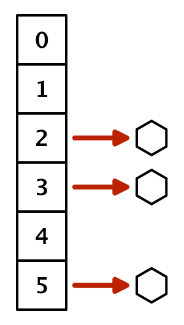 							List with holes. 						

But this only stores a single cell per priority, while there  will likely be multiple. To keep track of all the cells with the same  priority, we have to use another list. While we could use an actual list  per priority, we can also add a property to `**HexCell**` to link them together. This allows us to create a chain of cells, known as a linked list.

```
	public HexCell NextWithSamePriority { get; set; }
```

To create the chain, have `**HexCellPriorityQueue**.Enqueue` make the newly added cell reference the current value at the same priority, before replacing it.

```
		cell.NextWithSamePriority = list[priority];
		list[priority] = cell;
```

 							
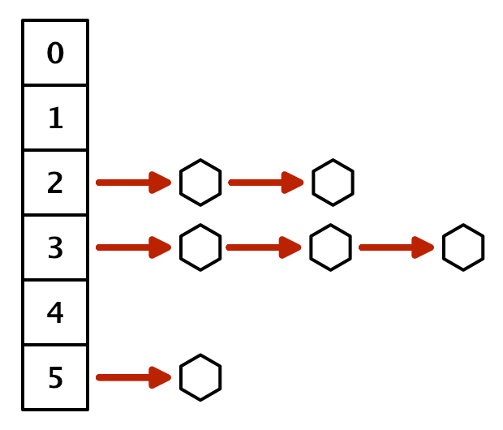 							List of linked lists. 						

### Removing from the Queue

To retrieve a cell from the priority queue, we have to access  the linked list at the lowest non-empty index. So loop through the list  until we find it. If we don't, then the queue is empty and we return `**null**`.

We could return any cell from the found chain, because they all  have the same priority. It's simplest to return the cell at the start  of the chain.

```
	public HexCell Dequeue () {
		count -= 1;
		for (int i = 0; i < list.Count; i++) {
			HexCell cell = list[i];
			if (cell != null) {
				return cell;
			}
		}
		return null;
	}
```

To keep a reference to the rest of the chain, use the next cell  with the same priority as the new start. If there was only one cell at  this priority level, the element will become `**null**` and it will be skipped in the future.

```
			if (cell != null) {
				list[i] = cell.NextWithSamePriority;
				return cell;
			}
```

### Keeping Track of the Minimum

This approach works, but requires us to iterate through the  list each time we retrieve a cell. We cannot avoid searching for the  lowest non-empty index, but we do not have to start from zero every  time. Instead, we could keep track of the minimum priority, and start  the search from there. Initially, the minimum is effectively infinite.

```
	int minimum = int.MaxValue;

	…
	
	public void Clear () {
		list.Clear();
		count = 0;
		minimum = int.MaxValue;
	}
```

When a cell is added to the queue, adjust the minimum if necessary.

```
	public void Enqueue (HexCell cell) {
		count += 1;
		int priority = cell.SearchPriority;
		if (priority < minimum) {
			minimum = priority;
		}
		…
	}
```

And when dequeuing, use the minimum to iterate through the list, instead of starting at zero.

```
	public HexCell Dequeue () {
		count -= 1;
		for (; minimum < list.Count; minimum++) {
			HexCell cell = list[minimum];
			if (cell != null) {
				list[minimum] = cell.NextWithSamePriority;
				return cell;
			}
		}
		return null;
	}
```

This drastically reduces the amount of time we have to spend looping through our priority list.

### Changing Priorities

When a cell's priority changes, it has to be removed from the  linked list that it's currently a part of. To do so, we have to follow  the chain until we find it.

Begin by declaring the head of the old priority list to be the  current cell, and also keep track of the next cell. We can directly grab  the next cell, because we know that there is at least one cell at this  index.

```
	public void Change (HexCell cell, int oldPriority) {
		HexCell current = list[oldPriority];
		HexCell next = current.NextWithSamePriority;
	}
```

If the current cell is the changed cell, then it is the head cell and we can cut it away, as if we dequeued it.

```
		HexCell current = list[oldPriority];
		HexCell next = current.NextWithSamePriority;
		if (current == cell) {
			list[oldPriority] = next;
		}
```

If not, we have to follow the chain until we end up at the cell  in front of the changed cell. That one holds the reference to the cell  that has been changed.

```
		if (current == cell) {
			list[oldPriority] = next;
		}
		else {
			while (next != cell) {
				current = next;
				next = current.NextWithSamePriority;
			}
		}
```

At this point, we can remove the changed cell from the linked list, by skipping it.

```
			while (next != cell) {
				current = next;
				next = current.NextWithSamePriority;
			}
			current.NextWithSamePriority = cell.NextWithSamePriority;
```

After the cell has been removed, it has to be added again so it ends up in the list for its new priority.

```
	public void Change (HexCell cell, int oldPriority) {
		…
		Enqueue(cell);
	}
```

The `Enqueue` method increments the count, but we're  not actually adding a new cell. So we have to decrement the count to  compensate for that.

```
		Enqueue(cell);
		count -= 1;
```

### Using the Queue

Now we can use our custom priority queue in `**HexGrid**`. We can make do with a single instance that we reuse for all searches.

```
	HexCellPriorityQueue searchFrontier;
	
	…
	
	IEnumerator Search (HexCell fromCell, HexCell toCell) {
		if (searchFrontier == null) {
			searchFrontier = new HexCellPriorityQueue();
		}
		else {
			searchFrontier.Clear();
		}
		
		…
	}
```

The `Search` method now has to enqueue `fromCell` before starting its loop, and each iteration begins by dequeuing a cell. This replaces the old frontier code.

```
		WaitForSeconds delay = new WaitForSeconds(1 / 60f);
//		List<HexCell> frontier = new List<HexCell>();
		fromCell.Distance = 0;
//		frontier.Add(fromCell);
		searchFrontier.Enqueue(fromCell);
		while (searchFrontier.Count > 0) {
			yield return delay;
			HexCell current = searchFrontier.Dequeue();
//			frontier.RemoveAt(0);
			…
		}
```

Adjust the code for adding and changing a neighbor as well. Make sure to remember the old priority before changing it.

```
				if (neighbor.Distance == int.MaxValue) {
					neighbor.Distance = distance;
					neighbor.PathFrom = current;
					neighbor.SearchHeuristic =
						neighbor.coordinates.DistanceTo(toCell.coordinates);
//					frontier.Add(neighbor);
					searchFrontier.Enqueue(neighbor);
				}
				else if (distance < neighbor.Distance) {
					int oldPriority = neighbor.SearchPriority;
					neighbor.Distance = distance;
					neighbor.PathFrom = current;
					searchFrontier.Change(neighbor, oldPriority);
				}
```

Finally, we no longer need to sort the frontier.

```
//				frontier.Sort(
//					(x, y) => x.SearchPriority.CompareTo(y.SearchPriority)
//				);
```

<iframe src="https://gfycat.com/ifr/SlimIdioticFlyingfox"></iframe>

Searching with a priority queue.

As mentioned earlier, which shortest path is found depends on  the order in which the cells are processed. Our queue produces a  different order than a sorted list, hence you can get different paths.  Because we're both adding to and removing from the head of the linked  lists for each priority, they function as stacks rather than queues. The  cells that were added last get processed first. A side effect of this  approach is that the algorithm tends to zigzag. This makes it more  likely to produce paths that zigzag as well. Fortunately, such paths  tend to look better, so it's a nice side effect.

 							 							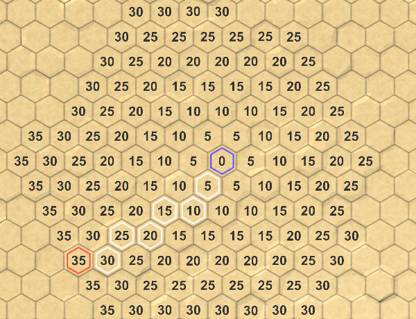 							Sorted list vs. priority queue. 						

The next tutorial is [Limited Movement](https://catlikecoding.com/unity/tutorials/hex-map/part-17/).

unitypackage

PDF
