# Hex Map 6

Rivers

- Add river data to cells.
- Support dragging to draw rivers.
- Create river channels.
- Use more than one mesh per chunk.
- Make a generic pool for lists.
- Triangulate and animate flowing water.

This tutorial is the sixth part of a series about [hexagon maps](https://catlikecoding.com/unity/tutorials/hex-map/).  The previous part was about supporting larger maps. Now that we can do  that, we can start thinking about larger terrain features. In this case,  rivers.

 					
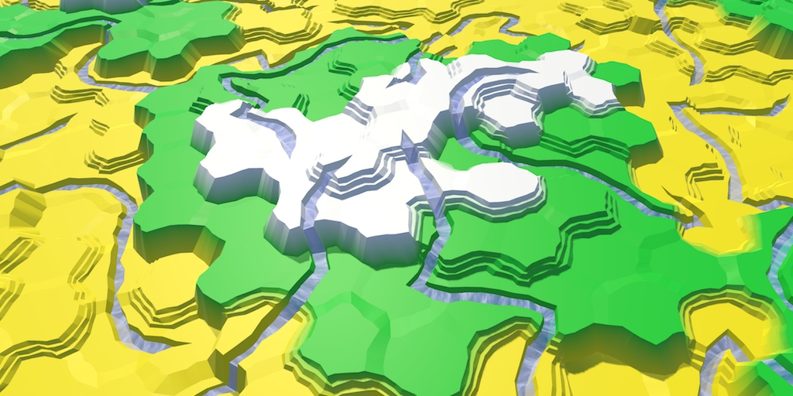 					Down the mountain the rivers flow. 				

## Cells With Rivers

There are three ways to add rivers to a hex grid. The first  approach is to let them flow from cell to cell. This is how Endless  Legend does it. The second method is to let them flow in between cells,  from edge to edge. This is how Civilization 5 does it. And the third way  is to have no special river structures at all, but to use water cells  to suggest them. This is how Age of Wonders 3 does it.

In our case, cell edges are already occupied by slopes and  cliffs. That leaves little room for rivers. So we're going to make them  flow from cell to cell. This means that every cell either has no river,  has a river flowing through it, or is either the begin or end point of a  river. Of the cells that have a river passing through them, it either  goes straight, makes a one-step turn, or makes a two-step turn.

 						
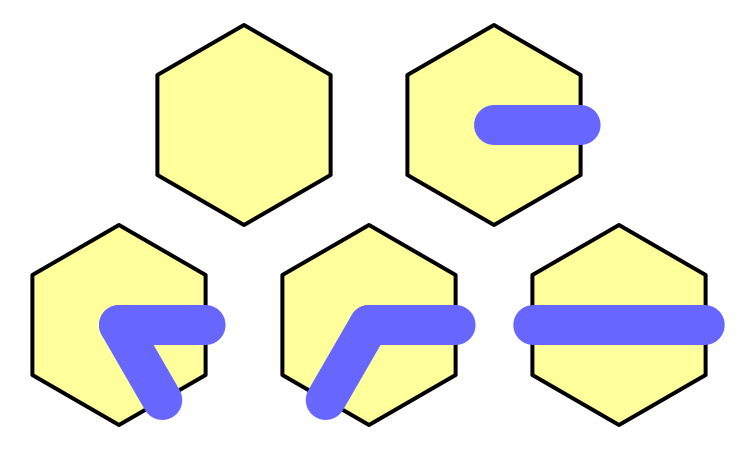 						Five possible river configurations. 					

We're not going to support forking or merging rivers. It would  make things a lot more complex, especially water flow. We also won't  concern ourselves with larger bodies of water yet. Those come in a later  tutorial.

### Keeping Track of Rivers

A cell that has a river flowing through it can be though of as  having both an incoming and an outgoing river. If it contains the  beginning of a river, it only has an outgoing river. And if it contains  the end of a river, it only has an incoming river. We can store this  information in `**HexCell**` with two booleans.

```
	bool hasIncomingRiver, hasOutgoingRiver;
```

But this is not enough. We also need to know the direction of  these rivers. In the case of an outgoing river, this indicates where  it's going. And for an incoming river, this indicates where it's coming  from.

```
	bool hasIncomingRiver, hasOutgoingRiver;
	HexDirection incomingRiver, outgoingRiver;
```

We're going to need this information when triangulating cells,  so add getter properties to access it. We won't support directly setting  them. We'll add a different method for that later.

```
	public bool HasIncomingRiver {
		get {
			return hasIncomingRiver;
		}
	}

	public bool HasOutgoingRiver {
		get {
			return hasOutgoingRiver;
		}
	}

	public HexDirection IncomingRiver {
		get {
			return incomingRiver;
		}
	}

	public HexDirection OutgoingRiver {
		get {
			return outgoingRiver;
		}
	}
```

A useful question is whether a cell has a river in it, regardless of the specifics. So let's add a property for that as well.

```
	public bool HasRiver {
		get {
			return hasIncomingRiver || hasOutgoingRiver;
		}
	}
```

Another typical questions is whether we have a beginning or  ending of a river. If the state of the incoming and outgoing river is  different, then this is the case. So that becomes another property.

```
	public bool HasRiverBeginOrEnd {
		get {
			return hasIncomingRiver != hasOutgoingRiver;
		}
	}
```

And finally, it is useful to know whether a river is flowing  through a certain edge, regardless whether it's incoming or outgoing.

```
	public bool HasRiverThroughEdge (HexDirection direction) {
		return
			hasIncomingRiver && incomingRiver == direction ||
			hasOutgoingRiver && outgoingRiver == direction;
	}
```

### Removing Rivers

Before worrying about how to add a river to a cell, let's first  support removing them. First, a method for removing just the outgoing  part of a river.

If there isn't an outgoing river to begin with, then there's nothing to do. Otherwise, turn it off and refresh.

```
	public void RemoveOutgoingRiver () {
		if (!hasOutgoingRiver) {
			return;
		}
		hasOutgoingRiver = false;
		Refresh();
	}
```

But that is not all. An outgoing river has to go somewhere. So  there has to be a neighbor with an incoming river. We have to get rid of  that one as well.

```
	public void RemoveOutgoingRiver () {
		if (!hasOutgoingRiver) {
			return;
		}
		hasOutgoingRiver = false;
		Refresh();

		HexCell neighbor = GetNeighbor(outgoingRiver);
		neighbor.hasIncomingRiver = false;
		neighbor.Refresh();
	}
```

 							Can't river flow out of the map? 							 						

Removing the river from a cell only changes the appearance of  that cell. Unlike when editing elevation or color, its neighbors are not  affected. So we only have to refresh the cells itself, not its  neighbors.

```
	public void RemoveOutgoingRiver () {
		if (!hasOutgoingRiver) {
			return;
		}
		hasOutgoingRiver = false;
		RefreshSelfOnly();

		HexCell neighbor = GetNeighbor(outgoingRiver);
		neighbor.hasIncomingRiver = false;
		neighbor.RefreshSelfOnly();
	}
```

This `RefreshSelfOnly` method simply only refreshes  the cell's chunk. As we're not changing rivers when initializing the  grid, we don't have to worry about whether the chunk has been assigned  yet.

```
	void RefreshSelfOnly () {
		chunk.Refresh();
	}
```

Removing the incoming river works the same way.

```
	public void RemoveIncomingRiver () {
		if (!hasIncomingRiver) {
			return;
		}
		hasIncomingRiver = false;
		RefreshSelfOnly();

		HexCell neighbor = GetNeighbor(incomingRiver);
		neighbor.hasOutgoingRiver = false;
		neighbor.RefreshSelfOnly();
	}
```

And removing the entire river just means removing both the outgoing and incoming river parts.

```
	public void RemoveRiver () {
		RemoveOutgoingRiver();
		RemoveIncomingRiver();
	}
```

### Adding Rivers

To support the creation of rivers, all we need is a method to  set the outgoing river of a cell. This should override any previous  outgoing river, and set the corresponding incoming river.

First, there's nothing to do when the river already exists.

```
	public void SetOutgoingRiver (HexDirection direction) {
		if (hasOutgoingRiver && outgoingRiver == direction) {
			return;
		}
	}
```

Then, we have to ensure that there is a neighbor in the desired  direction. Also, rivers cannot flow uphill. So we'll have to abort if  the neighbor has a higher elevation.

```
		HexCell neighbor = GetNeighbor(direction);
		if (!neighbor || elevation < neighbor.elevation) {
			return;
		}
```

Next, we have to clear the previous outgoing river. And we also  have to remove the incoming river, if it overlaps with our new outgoing  river.

```
		RemoveOutgoingRiver();
		if (hasIncomingRiver && incomingRiver == direction) {
			RemoveIncomingRiver();
		}
```

Now we can move on to setting the outgoing river.

```
		hasOutgoingRiver = true;
		outgoingRiver = direction;
		RefreshSelfOnly();
```

And don't forget to set the incoming river of the other cell, after removing its current incoming river, if any.

```
		neighbor.RemoveIncomingRiver();
		neighbor.hasIncomingRiver = true;
		neighbor.incomingRiver = direction.Opposite();
		neighbor.RefreshSelfOnly();
```

### Preventing Uphill Rivers

While we have made sure that we can only add valid rivers,  other actions can still result in invalid ones. When we change the  elevation of a cell, we must once again enforce that rivers can only  flow downhill. All illegal rivers have to be removed.

```
	public int Elevation {
		get {
			return elevation;
		}
		set {
			…

			if (
				hasOutgoingRiver &&
				elevation < GetNeighbor(outgoingRiver).elevation
			) {
				RemoveOutgoingRiver();
			}
			if (
				hasIncomingRiver &&
				elevation > GetNeighbor(incomingRiver).elevation
			) {
				RemoveIncomingRiver();
			}

			Refresh();
		}
	}
```

unitypackage

## Editing Rivers

To support editing rivers, we have to add a river toggle to our  UI. Actually, we need to support three edit modes. Either ignore rivers,  add them, or remove them. We can use a simple optional toggle  enumeration to keep track of this. Because we'll only use it inside the  editor, you can define it right inside the `**HexMapEditor**` class, along with a river mode field.

```
	enum OptionalToggle {
		Ignore, Yes, No
	}
	
	OptionalToggle riverMode;
```

And we need a method to adjust the river mode via the UI.

```
	public void SetRiverMode (int mode) {
		riverMode = (OptionalToggle)mode;
	}
```

To control the river mode, add three toggles to the UI and  combine them into a new toggle group, just like the colors. I adjusted  the toggles so their labels are below the checkboxes. This makes them  thin enough to put all three options in a single row.

 						
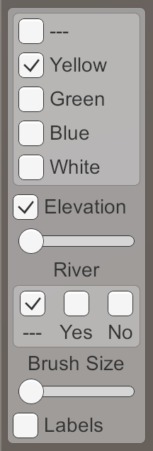 						River UI. 					

 						Why not use a dropdown list? 						 					

### Detecting Drags

To create a river, we need both a cell and a direction. Currently, `**HexMapEditor**` does not give us this information. So we have to add support for dragging from one cell to another.

We need to know whether we have a valid drag, and its  direction. And to detect a drag, we have to remember the previous cell  as well.

```
	bool isDrag;
	HexDirection dragDirection;
	HexCell previousCell;
```

Initally, when not dragging, there is no previous cell. So  whenever there is no input, or we don't interact with the map, we have  to set it to `**null**`.

```
	void Update () {
		if (
			Input.GetMouseButton(0) &&
			!EventSystem.current.IsPointerOverGameObject()
		) {
			HandleInput();
		}
		else {
			previousCell = null;
		}
	}

	void HandleInput () {
		Ray inputRay = Camera.main.ScreenPointToRay(Input.mousePosition);
		RaycastHit hit;
		if (Physics.Raycast(inputRay, out hit)) {
			EditCells(hexGrid.GetCell(hit.point));
		}
		else {
			previousCell = null;
		}
	}
```

The current cell is the one that we find based on the hit  point. After we're done editing cells this update, that cell becomes the  previous cell for the next update.

```
	void HandleInput () {
		Ray inputRay = Camera.main.ScreenPointToRay(Input.mousePosition);
		RaycastHit hit;
		if (Physics.Raycast(inputRay, out hit)) {
			HexCell currentCell = hexGrid.GetCell(hit.point);
			EditCells(currentCell);
			previousCell = currentCell;
		}
		else {
			previousCell = null;
		}
	}
```

After determining the current cell, we can compare it with the  previous cell, if there is any. If we end up with two different cells,  then we might have a valid drag and should check this. Otherwise, it  certainly isn't a drag.

```
		if (Physics.Raycast(inputRay, out hit)) {
			HexCell currentCell = hexGrid.GetCell(hit.point);
			if (previousCell && previousCell != currentCell) {
				ValidateDrag(currentCell);
			}
			else {
				isDrag = false;
			}
			EditCells(currentCell);
			previousCell = currentCell;
		}
```

How do we validate a drag? By verifying that the current cell  is a neighbor of the previous cell. We check this by looping through its  neighbors. If we find a match, then we also immediately know the drag  direction.

```
	void ValidateDrag (HexCell currentCell) {
		for (
			dragDirection = HexDirection.NE;
			dragDirection <= HexDirection.NW;
			dragDirection++
		) {
			if (previousCell.GetNeighbor(dragDirection) == currentCell) {
				isDrag = true;
				return;
			}
		}
		isDrag = false;
	}
```

 							Doesn't this produce jittery drags? 							 						

### Adjusting Cells

Now that we can detect drags, we can set outgoing rivers. We can remove rivers as well, we didn't need drag support for that.

```
	void EditCell (HexCell cell) {
		if (cell) {
			if (applyColor) {
				cell.Color = activeColor;
			}
			if (applyElevation) {
				cell.Elevation = activeElevation;
			}
			if (riverMode == OptionalToggle.No) {
				cell.RemoveRiver();
			}
			else if (isDrag && riverMode == OptionalToggle.Yes) {
				previousCell.SetOutgoingRiver(dragDirection);
			}
		}
	}
```

This will draw a river from the previous cell to the current  cell. But it ignores the brush size. That might make sense, but let's  draw rivers for all cells covered by the brush anyway. This can be done  by working relative to the cell that's being edited. In this case, we do  have to make sure that the other cell does exist.

```
			else if (isDrag && riverMode == OptionalToggle.Yes) {
				HexCell otherCell = cell.GetNeighbor(dragDirection.Opposite());
				if (otherCell) {
					otherCell.SetOutgoingRiver(dragDirection);
				}
			}
```

We are now able to edit rivers, although cannot see them yet.  You can verify that it works by inspecting the edited cells with the  debug inspector.

 							
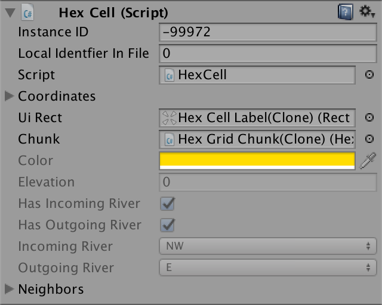 							Cell with river, debug inspector. 						

 							What's the debug inspector? 							 						

unitypackage

## River Channels Between Cells

When triangulating a river, we have to consider two parts.  There's the river's channel, and the water that's flowing through it.  We'll first create the channels and leave the water for later.

The simplest part of a river is where it flows across the  connection between cells. Currently, we triangulate this area with a  strip of three quads. We could add a river channel to that by lowering  the middle quad and adding two channel walls.

 						
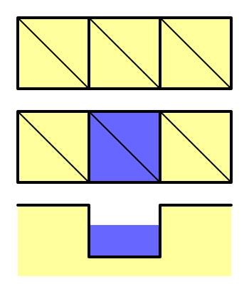 						Adding a river to an edge strip. 					

This would require two additional quads in case of a river, and  produces a channel with vertical walls. An alternative approach is to  always use four quads. Then we can lower the middle vertex to form a  channel with slanted walls.

 						
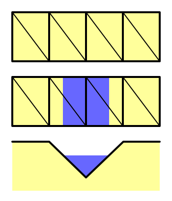 						Always four quads. 					

Always using the same amount of quads is convenient, so let's go with that option.

### Adding an Edge Vertex

Going from three to four quads per edge requires an additional edge vertex. Refactor `**EdgeVertices**` by first renaming `v4` to `v5` and then `v3` to `v4`.  Doing it in this order ensures that all code keeps referencing the  correct vertices. Use your editor's rename or refactor option for this,  so the changes are applied everywhere. Otherwise, you'll have to  manually go through all code and make the adjustments.

```
	public Vector3 v1, v2, v4, v5;
```

After everything has been renamed, add a new `v3`.

```
	public Vector3 v1, v2, v3, v4, v5;
```

Include the new vertex in the constructor. It sits halfway  between the corner vertices. Also, the other vertices should now end up  at ½ and ¾, instead of ⅓ and ⅔.

```
	public EdgeVertices (Vector3 corner1, Vector3 corner2) {
		v1 = corner1;
		v2 = Vector3.Lerp(corner1, corner2, 0.25f);
		v3 = Vector3.Lerp(corner1, corner2, 0.5f);
		v4 = Vector3.Lerp(corner1, corner2, 0.75f);
		v5 = corner2;
	}
```

Add `v3` to `TerraceLerp` as well.

```
	public static EdgeVertices TerraceLerp (
		EdgeVertices a, EdgeVertices b, int step)
	{
		EdgeVertices result;
		result.v1 = HexMetrics.TerraceLerp(a.v1, b.v1, step);
		result.v2 = HexMetrics.TerraceLerp(a.v2, b.v2, step);
		result.v3 = HexMetrics.TerraceLerp(a.v3, b.v3, step);
		result.v4 = HexMetrics.TerraceLerp(a.v4, b.v4, step);
		result.v5 = HexMetrics.TerraceLerp(a.v5, b.v5, step);
		return result;
	}
```

`**HexMesh**` now has to include the extra vertex in its triangle edge fans.

```
	void TriangulateEdgeFan (Vector3 center, EdgeVertices edge, Color color) {
		AddTriangle(center, edge.v1, edge.v2);
		AddTriangleColor(color);
		AddTriangle(center, edge.v2, edge.v3);
		AddTriangleColor(color);
		AddTriangle(center, edge.v3, edge.v4);
		AddTriangleColor(color);
		AddTriangle(center, edge.v4, edge.v5);
		AddTriangleColor(color);
	}
```

And also in its quad strips.

```
	void TriangulateEdgeStrip (
		EdgeVertices e1, Color c1,
		EdgeVertices e2, Color c2
	) {
		AddQuad(e1.v1, e1.v2, e2.v1, e2.v2);
		AddQuadColor(c1, c2);
		AddQuad(e1.v2, e1.v3, e2.v2, e2.v3);
		AddQuadColor(c1, c2);
		AddQuad(e1.v3, e1.v4, e2.v3, e2.v4);
		AddQuadColor(c1, c2);
		AddQuad(e1.v4, e1.v5, e2.v4, e2.v5);
		AddQuadColor(c1, c2);
	}
```

 							 							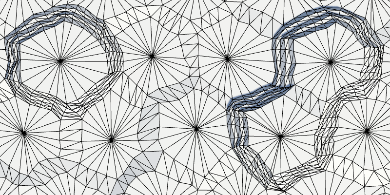 							Four vs. five vertices per edge. 						

### Stream Bed Elevation

We create the channel by lowering the middle vertex of an edge.  This defines the vertical position of the stream bed. Although the  exact vertical position of each cell is perturbed, we should keep the  stream bed constant across cells with the same elevation. This ensures  that water doesn't have to flow upstream. Also, the stream bed should be  low enough that it stays below even the most vertically perturbed  cells, while still allowing room for water.

Let's define this offset in `**HexMetrics**` and express it as an elevation. A one-level offset should be enough.

```
	public const float streamBedElevationOffset = -1f;
```

We can use this metric to add a property to `**HexCell**`, to retrieve the vertical position of its stream bed.

```
	public float StreamBedY {
		get {
			return
				(elevation + HexMetrics.streamBedElevationOffset) *
				HexMetrics.elevationStep;
		}
	}
```

### Creating the Channel

When `**HexMesh**` triangulates one  of the six triangular parts of a cell, we can detect whether there is a  river flowing through its edge. If so, we can now drop the middle edge  vertex to the stream bed's height.

```
	void Triangulate (HexDirection direction, HexCell cell) {
		Vector3 center = cell.Position;
		EdgeVertices e = new EdgeVertices(
			center + HexMetrics.GetFirstSolidCorner(direction),
			center + HexMetrics.GetSecondSolidCorner(direction)
		);

		if (cell.HasRiverThroughEdge(direction)) {
			e.v3.y = cell.StreamBedY;
		}

		TriangulateEdgeFan(center, e, cell.Color);

		if (direction <= HexDirection.SE) {
			TriangulateConnection(direction, cell, e);
		}
	}
```

 							
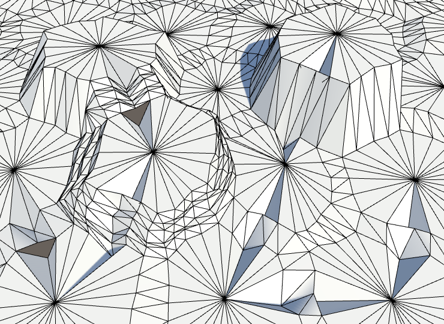 							Adjusting the middle edge vertex. 						

We can see the first traces of rivers appear, but we also get  holes in the terrain. To close them, we have to adjust the other edge as  well, when triangulating a connection.

```
	void TriangulateConnection (
		HexDirection direction, HexCell cell, EdgeVertices e1
	) {
		HexCell neighbor = cell.GetNeighbor(direction);
		if (neighbor == null) {
			return;
		}

		Vector3 bridge = HexMetrics.GetBridge(direction);
		bridge.y = neighbor.Position.y - cell.Position.y;
		EdgeVertices e2 = new EdgeVertices(
			e1.v1 + bridge,
			e1.v5 + bridge
		);

		if (cell.HasRiverThroughEdge(direction)) {
			e2.v3.y = neighbor.StreamBedY;
		}
		
		…
	}
```

 							
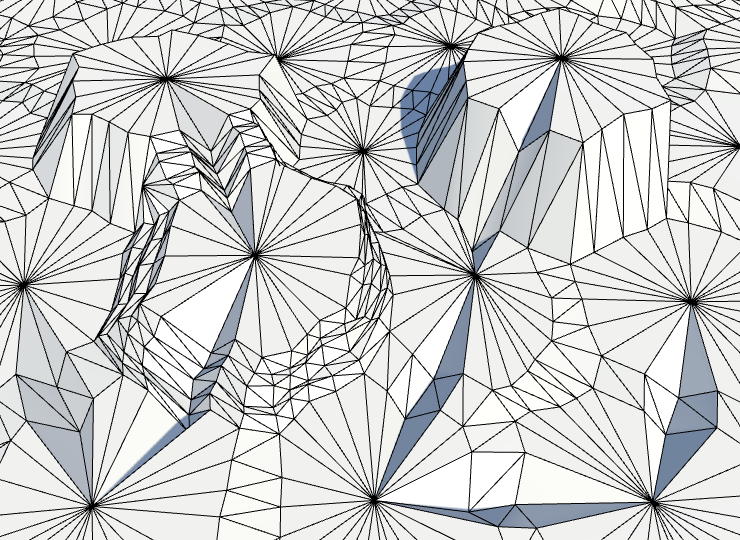 							Complete edge connection channels. 						

unitypackage

## River Channels Across Cells

We now have correct river channels between cells. But when a  river flows through a cell, the channels always terminate at its center.  Fixing this requires some work. Let's begin by considering the case  when a river flows straight across a cell, from one side to its  opposite.

If there isn't a river, each cell part can be a simple triangle  fan. But when a river flows straight through it, we have to insert a  channel. Effectively, we have to stretch the center vertex into a line,  thereby turning the middle two triangles into quads. The triangle fan  then becomes a trapezoid.

 						
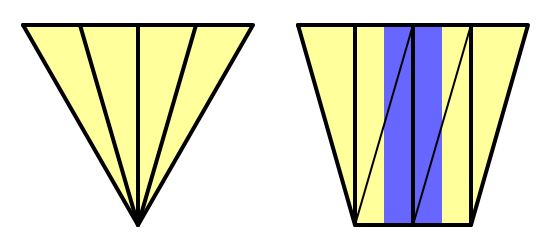 						Forcing a channel into a triangle. 					

These channels would be much longer than those running through  cell connections. This will become obvious when perturbing the vertices.  So let's split the trapezoid into two segments, by inserting another  set of edge vertices halfway between the center and edge.

 						
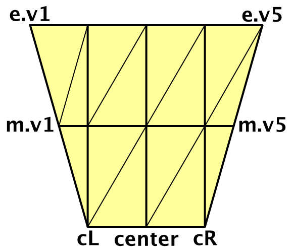 						Triangulating a channel. 					

Because triangulating with a river will be so different than  triangulating without one, let's create a dedicated method for it. If we  have a river, we use that method, otherwise we keep using a triangle  fan.

```
	void Triangulate (HexDirection direction, HexCell cell) {
		Vector3 center = cell.Position;
		EdgeVertices e = new EdgeVertices(
			center + HexMetrics.GetFirstSolidCorner(direction),
			center + HexMetrics.GetSecondSolidCorner(direction)
		);

		if (cell.HasRiver) {
			if (cell.HasRiverThroughEdge(direction)) {
				e.v3.y = cell.StreamBedY;
				TriangulateWithRiver(direction, cell, center, e);
			}
		}
		else {
			TriangulateEdgeFan(center, e, cell.Color);
		}

		if (direction <= HexDirection.SE) {
			TriangulateConnection(direction, cell, e);
		}
	}
	
	void TriangulateWithRiver (
		HexDirection direction, HexCell cell, Vector3 center, EdgeVertices e
	) {
	
	}
```

 						
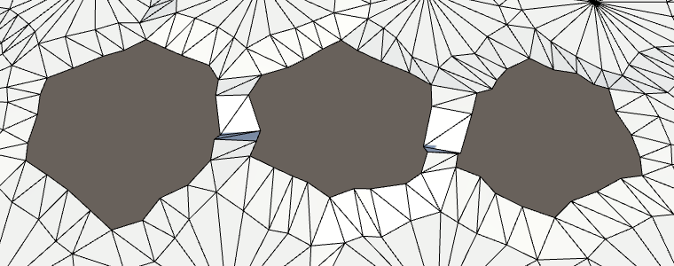 						Holes where rivers should be. 					

To get a better view of what we're doing, disable cell perturbation for now.

```
	public const float cellPerturbStrength = 0f; // 4f;
```

 						
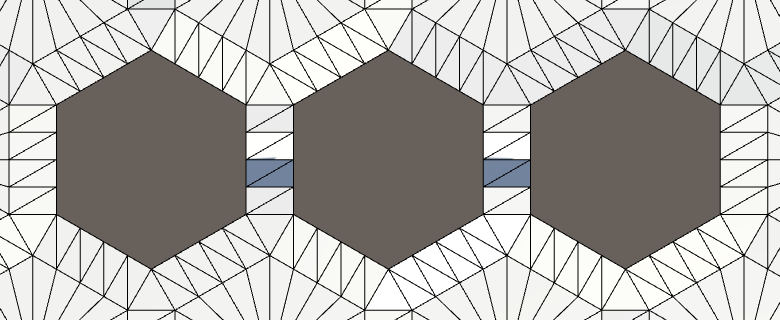 						Unperturbed vertices. 					

### Triangulating Straight Across

To create a channel straight across the cell part, we have to  stretch the center into a line. This line needs to have the same width  as the channel. We can find the left vertex by moving ¼ of the way from  the center to the first corner of the previous part.

```
	void TriangulateWithRiver (
		HexDirection direction, HexCell cell, Vector3 center, EdgeVertices e
	) {
		Vector3 centerL = center +
			HexMetrics.GetFirstSolidCorner(direction.Previous()) * 0.25f;
	}
```

Likewise for the right vertex. In this case, we need the second corner of the next part.

```
		Vector3 centerL = center +
			HexMetrics.GetFirstSolidCorner(direction.Previous()) * 0.25f;
		Vector3 centerR = center +
			HexMetrics.GetSecondSolidCorner(direction.Next()) * 0.25f;
```

The middle line can be found by creating edge vertices between the center and edge.

```
		EdgeVertices m = new EdgeVertices(
			Vector3.Lerp(centerL, e.v1, 0.5f),
			Vector3.Lerp(centerR, e.v5, 0.5f)
		);
```

Next, adjust the middle vertex of the middle edge, as well as the center, so they become channel bottoms.

```
		m.v3.y = center.y = e.v3.y;
```

Now we can use `TriangulateEdgeStrip` to fill the space between the middle and edge lines.

```
		TriangulateEdgeStrip(m, cell.Color, e, cell.Color);
```

 							
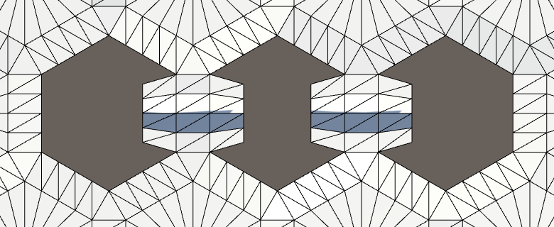 							Pinched channels. 						

Unfortunately, the channels appears to be pinched. This happens  because the middle edge vertices are too close together. Why does this  happen?

If we consider the outer edge's length to be 1, then the center  line's length is ½. As the middle edge sits halfway between them, its  length must be ¾.

The channel's width is ½, which should remain constant. As the  middle edge length is ¾, there is only ¼ left, ⅛ on either side of the  channel.

 							
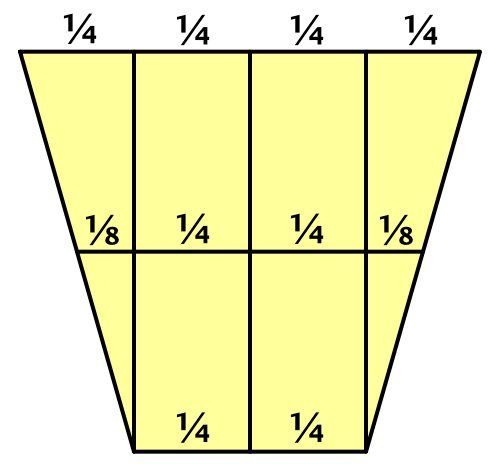 							Relative lengths. 						

Because the middle edge's length is ¾, the ⅛ become ⅙ relative  to the middle edge's length. This means that its second and fourth  vertex should be interpolated using sixths, instead of quarters.

We can support this alternative interpolation by adding another constructor to `**EdgeVertices**`. Instead of using fixed interpolations for `v2` and `v4`, let's use a parameter.

```
	public EdgeVertices (Vector3 corner1, Vector3 corner2, float outerStep) {
		v1 = corner1;
		v2 = Vector3.Lerp(corner1, corner2, outerStep);
		v3 = Vector3.Lerp(corner1, corner2, 0.5f);
		v4 = Vector3.Lerp(corner1, corner2, 1f - outerStep);
		v5 = corner2;
	}
```

Now we can use that with ⅙ in `**HexMesh**.TriangulateWithRiver`.

```
		EdgeVertices m = new EdgeVertices(
			Vector3.Lerp(centerL, e.v1, 0.5f),
			Vector3.Lerp(centerR, e.v5, 0.5f),
			1f / 6f
		);
```

 							
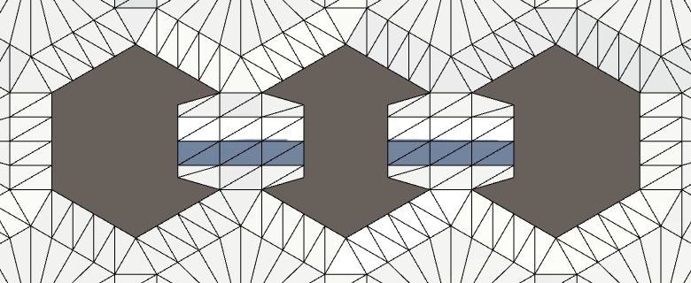 							Straight channels. 						

With the channel straightened out, we can move on to the second  section of the trapezoid. We cannot use an edge strip in this case, we  have to do it manually. Let's first create the triangles at the sides.

```
		AddTriangle(centerL, m.v1, m.v2);
		AddTriangleColor(cell.Color);
		AddTriangle(centerR, m.v4, m.v5);
		AddTriangleColor(cell.Color);
```

 							
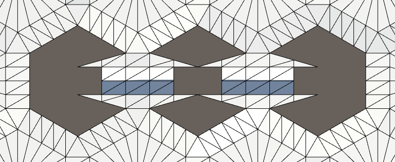 							Side triangles. 						

That looks good, so fill the remaining space with two quads, forming the final part of the channel.

```
		AddTriangle(centerL, m.v1, m.v2);
		AddTriangleColor(cell.Color);
		AddQuad(centerL, center, m.v2, m.v3);
		AddQuadColor(cell.Color);
		AddQuad(center, centerR, m.v3, m.v4);
		AddQuadColor(cell.Color);
		AddTriangle(centerR, m.v4, m.v5);
		AddTriangleColor(cell.Color);
```

Actually, we don't have an `AddQuadColor` alternative that requires only a single parameter. We didn't need one until now. So just create it.

```
	void AddQuadColor (Color color) {
		colors.Add(color);
		colors.Add(color);
		colors.Add(color);
		colors.Add(color);
	}
```

 							
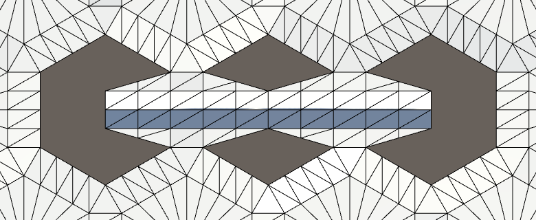 							Complete straight channels. 						

### Triangulating Begin and End

Triangulating a part that has only the beginning or end of a  river is different enough that it warrants its own method. So check for  it in `Triangulate` and invoke the appropriate method.

```
		if (cell.HasRiver) {
			if (cell.HasRiverThroughEdge(direction)) {
				e.v3.y = cell.StreamBedY;
				if (cell.HasRiverBeginOrEnd) {
					TriangulateWithRiverBeginOrEnd(direction, cell, center, e);
				}
				else {
					TriangulateWithRiver(direction, cell, center, e);
				}
			}
		}
```

In this case, we want to terminate the channel at the center,  but still use two steps to get there. So again create a middle edge  between the center and edge. Because we do want to terminate the  channel, it is fine that it gets pinched.

```
	void TriangulateWithRiverBeginOrEnd (
		HexDirection direction, HexCell cell, Vector3 center, EdgeVertices e
	) {
		EdgeVertices m = new EdgeVertices(
			Vector3.Lerp(center, e.v1, 0.5f),
			Vector3.Lerp(center, e.v5, 0.5f)
		);
	}
```

To make sure that the channel doesn't become too shallow too  fast, we still set the middle vertex to the stream bed height. But the  center should not be adjusted.

```
		m.v3.y = e.v3.y;
```

We can triangulate with a single edge strip and a fan.

```
		TriangulateEdgeStrip(m, cell.Color, e, cell.Color);
		TriangulateEdgeFan(center, m, cell.Color);
```

 							
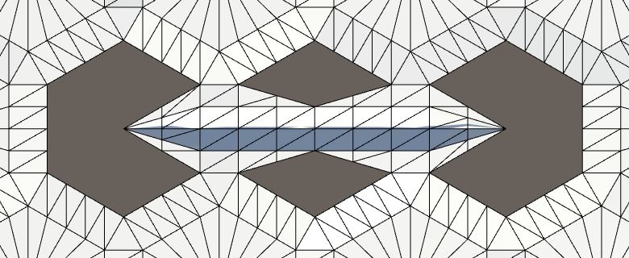 							Begin and end points. 						

### One-step Turns

Next, let's consider sharp turns, which zigzag across adjacent cells. We'll take care of these in `TriangulateWithRiver` as well. So we have to figure out which type of river we're working with.

 							
 							Zigzag river. 						

If the cell has a river going through the opposite direction as  well as the direction that we're working with, then it must be a  straight river. In that case, we can keep the center line that we  already figured out. Otherwise, let's revert back to a single point by  collapsing the center line.

```
		Vector3 centerL, centerR;
		if (cell.HasRiverThroughEdge(direction.Opposite())) {
			centerL = center +
				HexMetrics.GetFirstSolidCorner(direction.Previous()) * 0.25f;
			centerR = center +
				HexMetrics.GetSecondSolidCorner(direction.Next()) * 0.25f;
		}
		else {
			centerL = centerR = center;
		}
```

 							
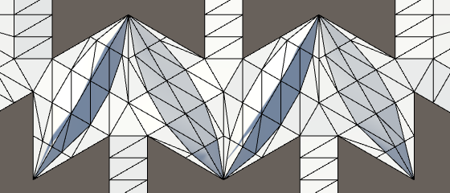 							Collapsed zigzag channels. 						

We can detect sharp turns by checking whether the cell has a  river going through the next or previous cell part. If so, we have to  align the center line with the edge between this and the adjacent part.  We can do that by placing the appropriate side of the line halfway  between the center and the shared corner. The other side of the line  then becomes the center.

```
		if (cell.HasRiverThroughEdge(direction.Opposite())) {
			centerL = center +
				HexMetrics.GetFirstSolidCorner(direction.Previous()) * 0.25f;
			centerR = center +
				HexMetrics.GetSecondSolidCorner(direction.Next()) * 0.25f;
		}
		else if (cell.HasRiverThroughEdge(direction.Next())) {
			centerL = center;
			centerR = Vector3.Lerp(center, e.v5, 0.5f);
		}
		else if (cell.HasRiverThroughEdge(direction.Previous())) {
			centerL = Vector3.Lerp(center, e.v1, 0.5f);
			centerR = center;
		}
		else {
			centerL = centerR = center;
		}
```

After deciding where the left and right points are, we can determine the final center by averaging them.

```
		if (cell.HasRiverThroughEdge(direction.Opposite())) {
			…
		}		
		center = Vector3.Lerp(centerL, centerR, 0.5f);
```

 							
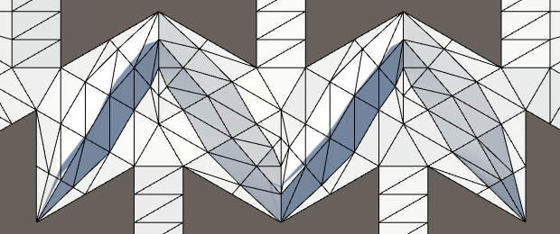 							Twisted center edge. 						

Although the channel has the same width on both sides, it  appears quite pinched. This is caused by the 60° rotation of the center  line. This can be alleviated by increasing the center line's width a  bit. Instead of interpolating with ½, use ⅔.

```
		else if (cell.HasRiverThroughEdge(direction.Next())) {
			centerL = center;
			centerR = Vector3.Lerp(center, e.v5, 2f / 3f);
		}
		else if (cell.HasRiverThroughEdge(direction.Previous())) {
			centerL = Vector3.Lerp(center, e.v1, 2f / 3f);
			centerR = center;
		}
```

 							
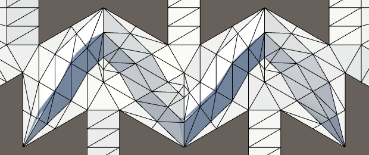 							Zigzag without pinch. 						

### Two-step Turns

The remaining cases sit between the zigzag and straight rivers.  They are the two-step rotations, producing gently curving rivers.

 							
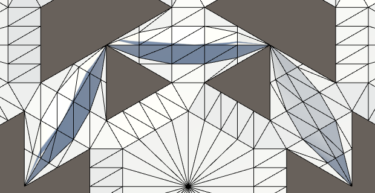 							Curving river. 						

To distinguish between the two possible orientations, we'll have to use `direction.Next().Next()`. But let's make that a bit more convenient by adding `Next2` and `Previous2` extension methods to `**HexDirection**`.

```
	public static HexDirection Previous2 (this HexDirection direction) {
		direction -= 2;
		return direction >= HexDirection.NE ? direction : (direction + 6);
	}

	public static HexDirection Next2 (this HexDirection direction) {
		direction += 2;
		return direction <= HexDirection.NW ? direction : (direction - 6);
	}
```

Back to `**HexMesh**.TriangulateWithRiver`, we can now detect the direction of our curving river by using `direction.Next2()`.

```
		if (cell.HasRiverThroughEdge(direction.Opposite())) {
			centerL = center +
				HexMetrics.GetFirstSolidCorner(direction.Previous()) * 0.25f;
			centerR = center +
				HexMetrics.GetSecondSolidCorner(direction.Next()) * 0.25f;
		}
		else if (cell.HasRiverThroughEdge(direction.Next())) {
			centerL = center;
			centerR = Vector3.Lerp(center, e.v5, 2f / 3f);
		}
		else if (cell.HasRiverThroughEdge(direction.Previous())) {
			centerL = Vector3.Lerp(center, e.v1, 2f / 3f);
			centerR = center;
		}
		else if (cell.HasRiverThroughEdge(direction.Next2())) {
			centerL = centerR = center;
		}
		else {
			centerL = centerR = center;
		}
```

In these last two cases, we have to push the center line into  the cell part that sits on the inside of the curve. If we had a vector  to the middle of a solid edge, we could use that to position the end  point. Let's assume that we have a method for that.

```
		else if (cell.HasRiverThroughEdge(direction.Next2())) {
			centerL = center;
			centerR = center +
				HexMetrics.GetSolidEdgeMiddle(direction.Next()) * 0.5f;
		}
		else {
			centerL = center +
				HexMetrics.GetSolidEdgeMiddle(direction.Previous()) * 0.5f;
			centerR = center;
		}
```

Of course now we have to add such a method to `**HexMetrics**`. It simply has to average two adjacent corner vectors and apply the solid factor.

```
	public static Vector3 GetSolidEdgeMiddle (HexDirection direction) {
		return
			(corners[(int)direction] + corners[(int)direction + 1]) *
			(0.5f * solidFactor);
	}
```

 							
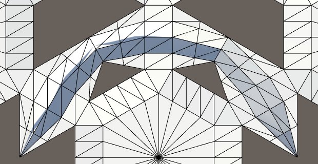 							Slightly-pinched curves. 						

Our center lines are now correctly rotated 30°. But they're not  long enough, resulting in slightly pinched channels. This happens  because an edge middle is closer to the center than an edge corner. Its  distance is equal to the inner solid radius, instead of the outer solid  radius. So we're working with the wrong scale.

We're already performing a conversion from outer to inner radius in `**HexMetrics**`. What we need here is the inverse of that. So let's make both conversion factors available via `**HexMetrics**`.

```
	public const float outerToInner = 0.866025404f;
	public const float innerToOuter = 1f / outerToInner;

	public const float outerRadius = 10f;

	public const float innerRadius = outerRadius * outerToInner;
```

Now we can convert to the right scale in `**HexMesh**.TriangulateWithRiver`.  The channels will still get pinched somewhat due to their rotation, but  far less extreme than with zigzags. So we don't have to compensate for  that.

```
		else if (cell.HasRiverThroughEdge(direction.Next2())) {
			centerL = center;
			centerR = center +
				HexMetrics.GetSolidEdgeMiddle(direction.Next()) *
				(0.5f * HexMetrics.innerToOuter);
		}
		else {
			centerL = center +
				HexMetrics.GetSolidEdgeMiddle(direction.Previous()) *
				(0.5f * HexMetrics.innerToOuter);
			centerR = center;
		}
```

 							
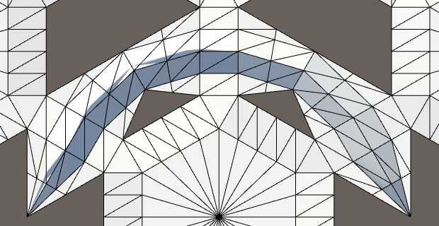 							Smooth curves. 						

unitypackage

## Triangulating Adjacent to Rivers

Our river channels are now complete. But we don't yet  triangulate the other parts of cells that contain rivers. We're now  going to plug those holes.

 						
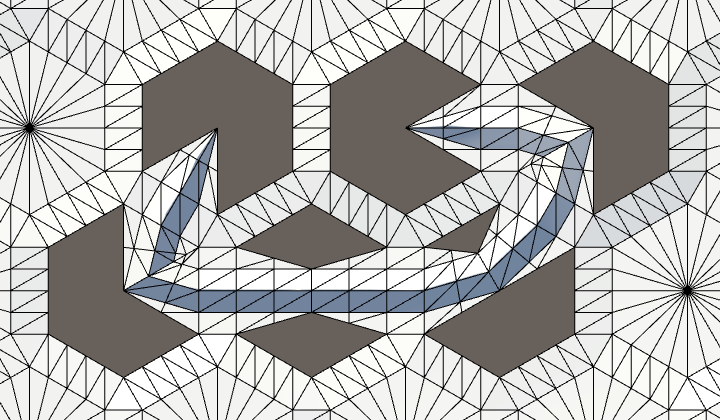 						Holes next to channels. 					

In `Triangulate`, invoke a new method when the cell has a river, but it doesn't flow through the current direction.

```
		if (cell.HasRiver) {
			if (cell.HasRiverThroughEdge(direction)) {
				e.v3.y = cell.StreamBedY;
				if (cell.HasRiverBeginOrEnd) {
					TriangulateWithRiverBeginOrEnd(direction, cell, center, e);
				}
				else {
					TriangulateWithRiver(direction, cell, center, e);
				}
			}
			else {
				TriangulateAdjacentToRiver(direction, cell, center, e);
			}
		}
		else {
			TriangulateEdgeFan(center, e, cell.Color);
		}
```

In this method, fill the cell triangle with a strip and a fan.  We cannot suffice with a single fan, because we have to make sure that  we match the middle edge of the parts that do contain a river.

```
	void TriangulateAdjacentToRiver (
		HexDirection direction, HexCell cell, Vector3 center, EdgeVertices e
	) {
		EdgeVertices m = new EdgeVertices(
			Vector3.Lerp(center, e.v1, 0.5f),
			Vector3.Lerp(center, e.v5, 0.5f)
		);
		
		TriangulateEdgeStrip(m, cell.Color, e, cell.Color);
		TriangulateEdgeFan(center, m, cell.Color);
	}
```

 						
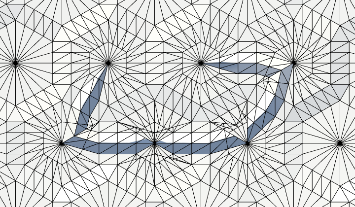 						Overlapping at curved and straight rivers. 					

### Matching the Channel

Of course we have to make sure that the center that we're using  matches the center line used by the river parts. Zigzags are fine, but  curved and straight rivers need some work. So we have to determine both  what kind or river we have, and its relative orientation.

Let's start by checking whether we're on the inside of a curve.  This is the case when both the previous and next direction contain a  river. If so, we'll have to move the center towards the edge.

```
		if (cell.HasRiverThroughEdge(direction.Next())) {
			if (cell.HasRiverThroughEdge(direction.Previous())) {
				center += HexMetrics.GetSolidEdgeMiddle(direction) *
					(HexMetrics.innerToOuter * 0.5f);
			}
		}

		EdgeVertices m = new EdgeVertices(
			Vector3.Lerp(center, e.v1, 0.5f),
			Vector3.Lerp(center, e.v5, 0.5f)
		);
```

 							
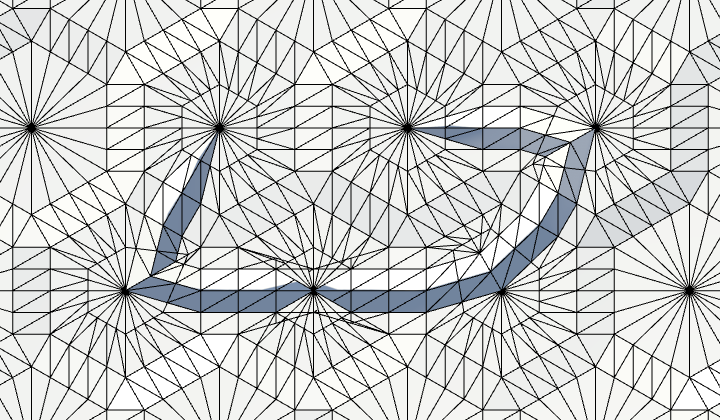 							Fixed when the river flows on both sides. 						

If we have a river in the next direction, but not the previous,  then check whether it's a straight river. If so, we'll have to move the  center towards our first solid corner.

```
		if (cell.HasRiverThroughEdge(direction.Next())) {
			if (cell.HasRiverThroughEdge(direction.Previous())) {
				center += HexMetrics.GetSolidEdgeMiddle(direction) *
					(HexMetrics.innerToOuter * 0.5f);
			}
			else if (
				cell.HasRiverThroughEdge(direction.Previous2())
			) {
				center += HexMetrics.GetFirstSolidCorner(direction) * 0.25f;
			}
		}
```

 							
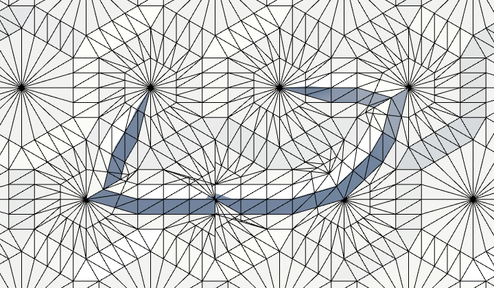 							Fixed half of the overlap with a straight river. 						

That took care of half of the parts adjacent to straight  rivers. The final case is when we have a river in the previous  direction, and it is a straight one. That requires moving the center  towards the next solid corner.

```
		if (cell.HasRiverThroughEdge(direction.Next())) {
			if (cell.HasRiverThroughEdge(direction.Previous())) {
				center += HexMetrics.GetSolidEdgeMiddle(direction) *
					(HexMetrics.innerToOuter * 0.5f);
			}
			else if (
				cell.HasRiverThroughEdge(direction.Previous2())
			) {
				center += HexMetrics.GetFirstSolidCorner(direction) * 0.25f;
			}
		}
		else if (
			cell.HasRiverThroughEdge(direction.Previous()) &&
			cell.HasRiverThroughEdge(direction.Next2())
		) {
			center += HexMetrics.GetSecondSolidCorner(direction) * 0.25f;
		}
```

 							
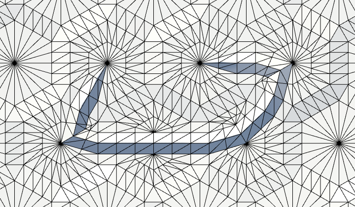 							No more overlap. 						

unitypackage

## Generalizing HexMesh

The triangulation of our channels is complete! Now we can fill  them with water. Because water is quite a bit different than land, we'll  have to use a different mesh, with different vertex data, and a  different material. It would be quite convenient if we could use `**HexMesh**` for both land and water. So let's generalize `**HexMesh**`, turning it into a class dedicated to mesh data, without caring what exactly it's used for. `**HexGridChunk**` will take over the responsibility of triangulating its cells.

### Moving Perturb Method

Because the `Perturb` method is quite generic and will be used in multiple places, let's move it to `**HexMetrics**`. First, refactor its name to `**HexMetrics**.Perturb`.  This is an invalid method name, but it refactors all code to correctly  access it. If your editor has special functionality for moving methods,  you can use that instead.

Once the method is inside `**HexMetrics**`, make it public and static, and fix its name.

```
	public static Vector3 Perturb (Vector3 position) {
		Vector4 sample = HexMetrics.SampleNoise(position);
		position.x += (sample.x * 2f - 1f) * HexMetrics.cellPerturbStrength;
		position.z += (sample.z * 2f - 1f) * HexMetrics.cellPerturbStrength;
		return position;
	}
```

### Moving Triangulation Methods

In `**HexGridChunk**`, replace the `hexMesh` variable with a public `terrain` variable.

```
	public HexMesh terrain;
//	HexMesh hexMesh;

	void Awake () {
		gridCanvas = GetComponentInChildren<Canvas>();
//		hexMesh = GetComponentInChildren<HexMesh>();

		cells = new HexCell[HexMetrics.chunkSizeX * HexMetrics.chunkSizeZ];
		ShowUI(false);
	}
```

Next, refactor all `Add…` methods in `**HexMesh**` to `terrain.Add…`. Then move all `Triangulate…` methods to `**HexGridChunk**`. Once that's done, you can fix the `Add…` method names in `**HexMesh**` and make them public. The result is that all complex triangulation methods are now in `**HexGridChunk**`, while the simple methods for adding things to the mesh remain in `**HexMesh**`.

We aren't done yet. `**HexGridChunk**.LateUpdate` now has to invoke its own `Triangulate` method. Also, it doesn't need to pass the cells as an argument anymore. So `Triangulate` can lose its parameter. And it should delegate clearing and applying the mesh data to `**HexMesh**`.

```
	void LateUpdate () {
		Triangulate();
//		hexMesh.Triangulate(cells);
		enabled = false;
	}
	
	public void Triangulate (HexCell[] cells) {
		terrain.Clear();
//		hexMesh.Clear();
//		vertices.Clear();
//		colors.Clear();
//		triangles.Clear();
		for (int i = 0; i < cells.Length; i++) {
			Triangulate(cells[i]);
		}
		terrain.Apply();
//		hexMesh.vertices = vertices.ToArray();
//		hexMesh.colors = colors.ToArray();
//		hexMesh.triangles = triangles.ToArray();
//		hexMesh.RecalculateNormals();
//		meshCollider.sharedMesh = hexMesh;
	}
```

Add the required `Clear` and `Apply` methods to `**HexMesh**`.

```
	public void Clear () {
		hexMesh.Clear();
		vertices.Clear();
		colors.Clear();
		triangles.Clear();
	}

	public void Apply () {
		hexMesh.SetVertices(vertices);
		hexMesh.SetColors(colors);
		hexMesh.SetTriangles(triangles, 0);
		hexMesh.RecalculateNormals();
		meshCollider.sharedMesh = hexMesh;
	}
```

 							What's up with `SetVertices`, `SetColors`, and `SetTriangles`? 							 						

Finally, manually hook up the mesh child object in the chunk  prefab. We can no longer do this automatically, because we'll add a  second mesh child soon. Also, rename it to *Terrain* to indicate its purpose.

 							
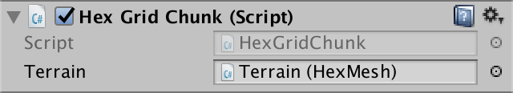 							Assigning terrain. 						

 							Renaming the prefab's child object doesn't work? 							 						

### Pooling Lists

Although we have moved quite some code, our map should still  function as it did before. Adding another mesh per chunk shouldn't  change that. But if we were to do that with the current `**HexMesh**`, it would go wrong.

The problem is that we assumed that we're only ever working on  one mesh at a time. That allowed us to use static lists to store the  temporary mesh data. But once we add water, we'll be working with two  meshes at the same time. So we can no longer use our static lists.

However, we do not have to go back to a set of lists per `**HexMesh**`  instance. Instead, we could use a static pool of lists. There's no such  pooling available by default, so let's create a generic list pool class  ourselves.

```
public static class ListPool<T> {

}
```

 							How does `**ListPool**<T>` work? 							 						

We can use a stack to store a collection of pooled lists. I  normally don't use stacks because Unity doesn't serialize them, but that  doesn't matter in this case.

```
using System.Collections.Generic;

public static class ListPool<T> {

	static Stack<List<T>> stack = new Stack<List<T>>();
}
```

 							What does `Stack<List<T>>` mean? 							 						

Add a public static method to get a list out of the pool. If  the stack isn't empty, we'll pop the top list off and return that one.  Otherwise, we create a new list on the spot.

```
	public static List<T> Get () {
		if (stack.Count > 0) {
			return stack.Pop();
		}
		return new List<T>();
	}
```

To actually reuse lists, we have to add them to the pool once we're done with them. `**ListPool**` will take care of clearing the list, and then pushes it onto its stack.

```
	public static void Add (List<T> list) {
		list.Clear();
		stack.Push(list);
	}
```

Now we can use our pools in `**HexMesh**`. Replace the static lists with non-static private references. Mark them as `NonSerialized` so Unity won't bother to save them during recompiles. Either write `System.NonSerialized` or add `**using** System;` at the top of the script.

```
	[NonSerialized] List<Vector3> vertices;
	[NonSerialized] List<Color> colors;
	[NonSerialized] List<int> triangles;

//	static List<Vector3> vertices = new List<Vector3>();
//	static List<Color> colors = new List<Color>();
//	static List<int> triangles = new List<int>();
```

As the mesh is cleared right before adding new data to it, this is the place to grab lists from our pools.

```
	public void Clear () {
		hexMesh.Clear();
		vertices = ListPool<Vector3>.Get();
		colors = ListPool<Color>.Get();
		triangles = ListPool<int>.Get();
	}
```

And we no longer need them after applying the mesh data, so we can add them to the pools there.

```
	public void Apply () {
		hexMesh.SetVertices(vertices);
		ListPool<Vector3>.Add(vertices);
		hexMesh.SetColors(colors);
		ListPool<Color>.Add(colors);
		hexMesh.SetTriangles(triangles, 0);
		ListPool<int>.Add(triangles);
		hexMesh.RecalculateNormals();
		meshCollider.sharedMesh = hexMesh;
	}
```

This takes care of our list reuse, no matter how many meshes we're filling at the same time.

### Optional Collider

While our terrain needs to have a collider, we don't really  need one for our rivers. Raycasts will simply pass through the water and  hit the channel underneath. So let's make it configurable whether `**HexMesh**` has a collider. Do this by adding a public `**bool** useCollider` field. Turn it on for the terrain.

```
	public bool useCollider;
```

 							
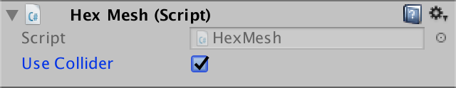 							Using a mesh collider. 						

All we have to do is ensure that we only create and assign the collider when it is turned on.

```
	void Awake () {
		GetComponent<MeshFilter>().mesh = hexMesh = new Mesh();
		if (useCollider) {
			meshCollider = gameObject.AddComponent<MeshCollider>();
		}
		hexMesh.name = "Hex Mesh";
	}

	public void Apply () {
		…
		if (useCollider) {
			meshCollider.sharedMesh = hexMesh;
		}

		…
	}
```

### Optional Colors

Vertex colors can also be optional. We need them to show  different terrain types, but water doesn't change color. We can make  them optional in the same way that we made the collider optional.

```
	public bool useCollider, useColors;

	public void Clear () {
		hexMesh.Clear();
		vertices = ListPool<Vector3>.Get();
		if (useColors) {
			colors = ListPool<Color>.Get();
		}
		triangles = ListPool<int>.Get();
	}

	public void Apply () {
		hexMesh.SetVertices(vertices);
		ListPool<Vector3>.Add(vertices);
		if (useColors) {
			hexMesh.SetColors(colors);
			ListPool<Color>.Add(colors);
		}
		…
	}
```

Of course, the terrain does use vertex colors, so make sure to turn them on.

 							
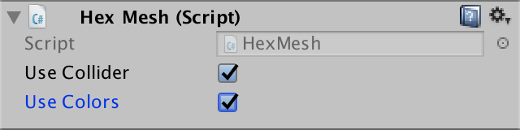 							Using colors. 						

### Optional UV

While we're at it, we can also add support for optional UV  coordinates. While our terrain doesn't use them, we will need them for  our water.

```
	public bool useCollider, useColors, useUVCoordinates;

	[NonSerialized] List<Vector2> uvs;

	public void Clear () {
		hexMesh.Clear();
		vertices = ListPool<Vector3>.Get();
		if (useColors) {
			colors = ListPool<Color>.Get();
		}
		if (useUVCoordinates) {
			uvs = ListPool<Vector2>.Get();
		}
		triangles = ListPool<int>.Get();
	}

	public void Apply () {
		hexMesh.SetVertices(vertices);
		ListPool<Vector3>.Add(vertices);
		if (useColors) {
			hexMesh.SetColors(colors);
			ListPool<Color>.Add(colors);
		}
		if (useUVCoordinates) {
			hexMesh.SetUVs(0, uvs);
			ListPool<Vector2>.Add(uvs);
		}
		…
	}
```

 							
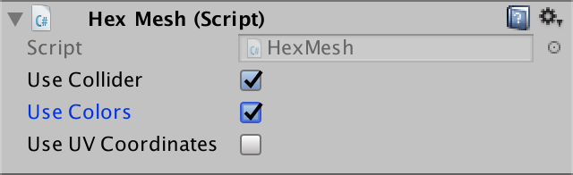 							Not using UV coordinates. 						

To make this useful, create methods to add UV coordinates for triangles and quads.

```
	public void AddTriangleUV (Vector2 uv1, Vector2 uv2, Vector2 uv3) {
		uvs.Add(uv1);
		uvs.Add(uv2);
		uvs.Add(uv3);
	}
	
	public void AddQuadUV (Vector2 uv1, Vector2 uv2, Vector2 uv3, Vector2 uv4) {
		uvs.Add(uv1);
		uvs.Add(uv2);
		uvs.Add(uv3);
		uvs.Add(uv4);
	}
```

Let's add an additional `AddQuadUV` method for  conveniently adding a rectangular UV area. This is a typical case when a  quad and its texture are aligned, which will be the case for our river  water.

```
	public void AddQuadUV (float uMin, float uMax, float vMin, float vMax) {
		uvs.Add(new Vector2(uMin, vMin));
		uvs.Add(new Vector2(uMax, vMin));
		uvs.Add(new Vector2(uMin, vMax));
		uvs.Add(new Vector2(uMax, vMax));
	}
```

unitypackage

## Flowing Rivers

It is finally time to create some water! We'll do this with  quads that represent the water's surface. And because we're working with  rivers, the water has to flow. We'll use UV coordinates to indicate the  river's orientation for that. To visualize this, we need a new shader.  So create a new standard shader and name it *River*. Adjust it so the UV coordinates are put in the red and green albedo channels.

```
Shader "Custom/River" {
	…

		void surf (Input IN, inout SurfaceOutputStandard o) {
			fixed4 c = tex2D(_MainTex, IN.uv_MainTex) * _Color;
			o.Albedo = c.rgb * IN.color;
			o.Metallic = _Metallic;
			o.Smoothness = _Glossiness;
			o.Alpha = c.a;
			o.Albedo.rg = IN.uv_MainTex;
		}
		ENDCG
	}
	FallBack "Diffuse"
}
```

Add a public `**HexMesh** rivers` field to `**HexGridChunk**`. Clear and apply it just like the terrain.

```
	public HexMesh terrain, rivers;
	
	public void Triangulate () {
		terrain.Clear();
		rivers.Clear();
		for (int i = 0; i < cells.Length; i++) {
			Triangulate(cells[i]);
		}
		terrain.Apply();
		rivers.Apply();
	}
```

 						Do we get additional draw calls, even if we don't have rivers? 						 					

Adjust the prefab – via an instance – by duplicating its terrain object, renaming it to *Rivers*, and hooking it up.

 						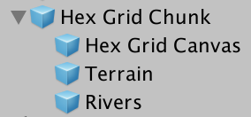 						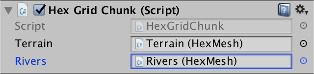 						Chunk prefab with rivers. 					

Create a *River* material that uses our new shader, and make sure that the *Rivers*  object uses it. Also configure the object's hex mesh component so that  it uses UV coordinates, but not vertex colors, nor a collider.

 						
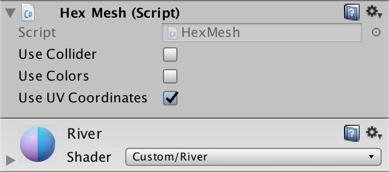 						Rivers sub-object. 					

### Triangulating Water

Before we can triangulate the water, we have to decide on its surface level. Let's make this an elevation offset in `**HexMetrics**`,  just like for the stream bed. Because the vertical perturbation of a  cell is set to half an elevation offset, let's use that as our river  surface offset as well. This ensures that the water never ends up above  the cell's terrain.

```
	public const float riverSurfaceElevationOffset = -0.5f;
```

 							Shouldn't it be slightly lower? 							 						

Add a property to `**HexCell**` to retrieve the vertical position of its river's surface.

```
	public float RiverSurfaceY {
		get {
			return
				(elevation + HexMetrics.riverSurfaceElevationOffset) *
				HexMetrics.elevationStep;
		}
	}
```

Now we can get to work in `**HexGridChunk**`!  Because we're going to create multiple river quads, let's add a  dedicated method for that. Give it four vertices plus a height as  parameters. This allows it to conveniently set the vertical position of  all four vertices at once, before adding the quad.

```
	void TriangulateRiverQuad (
		Vector3 v1, Vector3 v2, Vector3 v3, Vector3 v4,
		float y
	) {
		v1.y = v2.y = v3.y = v4.y = y;
		rivers.AddQuad(v1, v2, v3, v4);
	}
```

We'll add the quad's UV coordinates here as well. We'll simply go left to right, bottom to top.

```
		rivers.AddQuad(v1, v2, v3, v4);
		rivers.AddQuadUV(0f, 1f, 0f, 1f);
```

`TriangulateWithRiver` is the first method that  we'll add river quads to. The first quad sits between the center and  middle. The second sits between the middle and edge. We'll simply use  the vertices that we already have. Because those vertices will be  lowered, the water will end up partially below the slanted channel  walls. So we don't have to worry about the exact position of the water's  edge.

```
	void TriangulateWithRiver (
		HexDirection direction, HexCell cell, Vector3 center, EdgeVertices e
	) {
		…

		TriangulateRiverQuad(centerL, centerR, m.v2, m.v4, cell.RiverSurfaceY);
		TriangulateRiverQuad(m.v2, m.v4, e.v2, e.v4, cell.RiverSurfaceY);
	}
```

 							
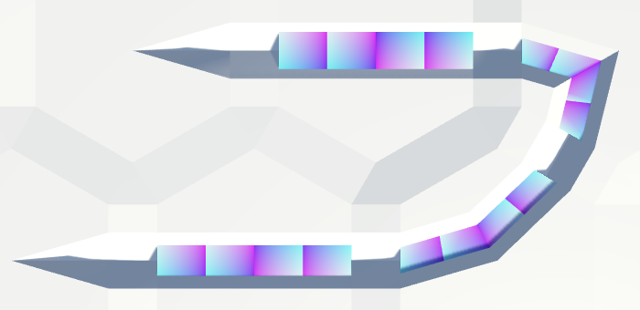 							The first signs of water. 						

 							Why does the water's width vary? 							 						

### Going with the Flow

Currently, the UV coordinates do not agree on the direction  that the river is flowing. We have to be consistent here. Let's say that  the U coordinate is 0 at the left of the river and 1 at the right, when  looking downstream. And the V coordinate should go from 0 to 1 in the  direction that the river is flowing.

Using the above specification, our UV are correct when  triangulating an outgoing river. They're wrong and have to be reversed  when triangulating an incoming river. To facilitate this, add a `**bool** reversed` parameter to `TriangulateRiverQuad`. Use it to reverse the UV when needed.

```
	void TriangulateRiverQuad (
		Vector3 v1, Vector3 v2, Vector3 v3, Vector3 v4,
		float y, bool reversed
	) {
		v1.y = v2.y = v3.y = v4.y = y;
		rivers.AddQuad(v1, v2, v3, v4);
		if (reversed) {
			rivers.AddQuadUV(1f, 0f, 1f, 0f);
		}
		else {
			rivers.AddQuadUV(0f, 1f, 0f, 1f);
		}
	}
```

In `TriangulateWithRiver`, we know that we have to reverse the direction when we're dealing with an incoming river.

```
		bool reversed = cell.IncomingRiver == direction;
		TriangulateRiverQuad(
			centerL, centerR, m.v2, m.v4, cell.RiverSurfaceY, reversed
		);
		TriangulateRiverQuad(
			m.v2, m.v4, e.v2, e.v4, cell.RiverSurfaceY, reversed
		);
```

 							
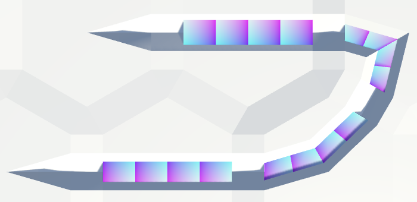 							Consistent river direction. 						

### River Begin and End

Inside `TriangulateWithRiverBeginOrEnd`, we only  have to check whether we have an incoming river, to determine the flow  direction. Then we can insert another river quad between the middle and  edge.

```
	void TriangulateWithRiverBeginOrEnd (
		HexDirection direction, HexCell cell, Vector3 center, EdgeVertices e
	) {
		…

		bool reversed = cell.HasIncomingRiver;
		TriangulateRiverQuad(
			m.v2, m.v4, e.v2, e.v4, cell.RiverSurfaceY, reversed
		);
	}
```

The part between the center and middle is a triangle, so we cannot use `TriangulateRiverQuad`. The only significant difference is that the center vertex sits in the middle of the river. So its U coordinate is always ½.

```
		center.y = m.v2.y = m.v4.y = cell.RiverSurfaceY;
		rivers.AddTriangle(center, m.v2, m.v4);
		if (reversed) {
			rivers.AddTriangleUV(
				new Vector2(0.5f, 1f), new Vector2(1f, 0f), new Vector2(0f, 0f)
			);
		}
		else {
			rivers.AddTriangleUV(
				new Vector2(0.5f, 0f), new Vector2(0f, 1f), new Vector2(1f, 1f)
			);
		}
```

 							
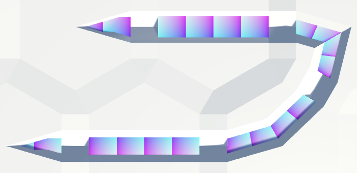 							Water at the beginning and end. 						

 							Are there bits of water missing at the ends? 							 						

### Flowing Between Cells

When adding water between cells, we have to be aware of elevation differences. To allow water to flow down slopes and cliffs, `TriangulateRiverQuad` has to support two height parameters. So let's add the second one.

```
	void TriangulateRiverQuad (
		Vector3 v1, Vector3 v2, Vector3 v3, Vector3 v4,
		float y1, float y2, bool reversed
	) {
		v1.y = v2.y = y1;
		v3.y = v4.y = y2;
		rivers.AddQuad(v1, v2, v3, v4);
		if (reversed) {
			rivers.AddQuadUV(1f, 0f, 1f, 0f);
		}
		else {
			rivers.AddQuadUV(0f, 1f, 0f, 1f);
		}
	}
```

Let's also add a variant that still accept one height, for convenience. It simply invokes the other method.

```
	void TriangulateRiverQuad (
		Vector3 v1, Vector3 v2, Vector3 v3, Vector3 v4,
		float y, bool reversed
	) {
		TriangulateRiverQuad(v1, v2, v3, v4, y, y, reversed);
	}
```

Now we can add a river quad in `TriangulateConnection`  as well. While in between cells, we do not immediately know what kind  of river we're dealing with. To determine if we need to reverse, we have  to check if we have an incoming river and if it's going in our  direction.

```
		if (cell.HasRiverThroughEdge(direction)) {
			e2.v3.y = neighbor.StreamBedY;
			TriangulateRiverQuad(
				e1.v2, e1.v4, e2.v2, e2.v4,
				cell.RiverSurfaceY, neighbor.RiverSurfaceY,
				cell.HasIncomingRiver && cell.IncomingRiver == direction
			);
		}
```

 							
 							Complete river. 						

### Stretching V Coordinates

Currently, we have the V coordinates go from 0 to 1 across each  river segment. So that's four times per cell. Five times, if we also  include the connection between cells. Whatever we'll use to texture the  river, it will repeat that many times.

We can reduce this repetition by stretching the V coordinates  so they go from 0 to 1 across an entire cell, plus one connection. This  can be done by increasing the V coordinate by 0.2 each segment. If we  put 0.4 at the center, it becomes 0.6 in the middle, and reaches 0.8 at  the edge. Then the cell connection takes it to 1.

If the river flows in the opposite direction, we still put 0.4  at the center, but it becomes 0.2 in the middle, and 0 at the edge. If  we continued this into a cell connection, it would end at -0.2. That is  fine, because that's equivalent to 0.8 for a texture with its filter  mode set to repeat, just like 0 is equivalent to 1.

 							
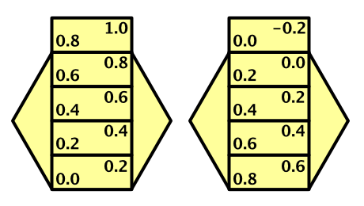 							Flow of V coordinates. 						

To support this, we have to add yet another parameter to `TriangulateRiverQuad`.

```
	void TriangulateRiverQuad (
		Vector3 v1, Vector3 v2, Vector3 v3, Vector3 v4,
		float y, float v, bool reversed
	) {
		TriangulateRiverQuad(v1, v2, v3, v4, y, y, v, reversed);
	}

	void TriangulateRiverQuad (
		Vector3 v1, Vector3 v2, Vector3 v3, Vector3 v4,
		float y1, float y2, float v, bool reversed
	) {
		…
	}
```

When the direction isn't reversed, we simply use the provided coordinate at the quad's bottom, and add 0.2 at its top.

```
		else {
			rivers.AddQuadUV(0f, 1f, v, v + 0.2f);
		}
```

We can deal with the revered direction by subtracting the coordinate from 0.8 and 0.6 instead.

```
		if (reversed) {
			rivers.AddQuadUV(1f, 0f, 0.8f - v, 0.6f - v);
		}
```

Now we have to provide the correct coordinates, as if we're dealing with an outgoing river. First in `TriangulateWithRiver`.

```
		TriangulateRiverQuad(
			centerL, centerR, m.v2, m.v4, cell.RiverSurfaceY, 0.4f, reversed
		);
		TriangulateRiverQuad(
			m.v2, m.v4, e.v2, e.v4, cell.RiverSurfaceY, 0.6f, reversed
		);
```

Then in `TriangulateConnection`.

```
			TriangulateRiverQuad(
				e1.v2, e1.v4, e2.v2, e2.v4,
				cell.RiverSurfaceY, neighbor.RiverSurfaceY, 0.8f,
				cell.HasIncomingRiver && cell.IncomingRiver == direction
			);
```

And finally in `TriangulateWithRiverBeginOrEnd`.

```
		TriangulateRiverQuad(
			m.v2, m.v4, e.v2, e.v4, cell.RiverSurfaceY, 0.6f, reversed
		);
		center.y = m.v2.y = m.v4.y = cell.RiverSurfaceY;
		rivers.AddTriangle(center, m.v2, m.v4);
		if (reversed) {
			rivers.AddTriangleUV(
				new Vector2(0.5f, 0.4f),
				new Vector2(1f, 0.2f), new Vector2(0f, 0.2f)
			);
		}
		else {
			rivers.AddTriangleUV(
				new Vector2(0.5f, 0.4f),
				new Vector2(0f, 0.6f), new Vector2(1f, 0.6f)
			);
		}
```

 							
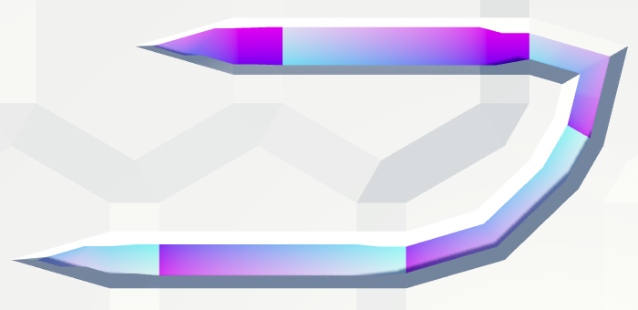 							Stretched V coordinates. 						

To correctly see the V coordinates wrap, make sure it stays positive in the river shader.

```
			if (IN.uv_MainTex.y < 0) {
				IN.uv_MainTex.y += 1;
			}
			o.Albedo.rg = IN.uv_MainTex;
```

 							
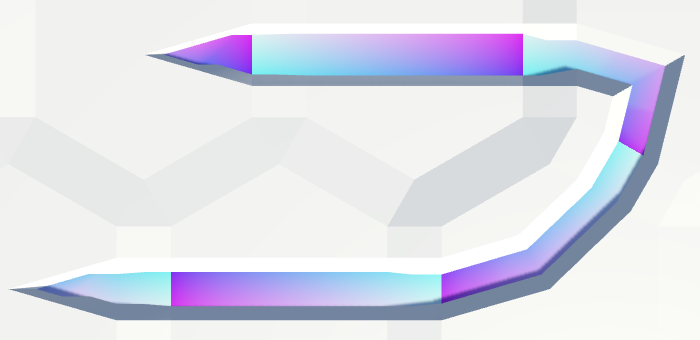 							Wrapped V coordinates. 						

unitypackage

## Animating Rivers

With the UV coordinates taken care of, we can move on to  animating the rivers. The river shader will take care of this, so we  don't have to continuously update the mesh.

We won't create a fancy river shader in this tutorial, that  comes later. For now, we'll make do with a simple effect to give you an  idea of how the animation works.

The animation is created by sliding the V coordinates based on the play time. Unity makes this available via the `_Time` variable. Its Y component contains the unmodified time, which we'll use. Its other components contain different time scales.

Get rid of the V wrapping, as we no longer need it. Instead,  subtract the current time from the V coordinate. This slides the  coordinate downwards, which creates the illusion of the river flowing  forwards.

```
//			if (IN.uv_MainTex.y < 0) {
//				IN.uv_MainTex.y += 1;
//			}
			IN.uv_MainTex.y -= _Time.y;
			o.Albedo.rg = IN.uv_MainTex;
```

After one second, the V coordinate will be below zero  everywhere, so we'll no longer see a difference. Again, this is fine due  to repeat texture filtering mode. But to see what's going on, we can  take the fractional part of the V coordinate.

```
			IN.uv_MainTex.y -= _Time.y;
			IN.uv_MainTex.y = frac(IN.uv_MainTex.y);
			o.Albedo.rg = IN.uv_MainTex;
```

<iframe src="https://gfycat.com/ifr/PlaintiveMeaslyHellbender"></iframe>

Animated V coordinates.

### Using Noise

Our river now animates, but there are harsh transitions in both  direction and velocity. Our UV pattern makes this quite obvious, but it  would be harder to detect when using a more water-like pattern. So  let's sample a texture instead of showing the raw UV. We can use the  noise texture that we already have. Sample it, and multiply the  material's color by the first noise channel.

```
		void surf (Input IN, inout SurfaceOutputStandard o) {
			float2 uv = IN.uv_MainTex;
			uv.y -= _Time.y;
			float4 noise = tex2D(_MainTex, uv);
			
			fixed4 c = _Color * noise.r;
			o.Albedo = c.rgb;
			o.Metallic = _Metallic;
			o.Smoothness = _Glossiness;
			o.Alpha = c.a;
		}
```

Assign the noise texture to the river material, and make sure that it has a white color.

 							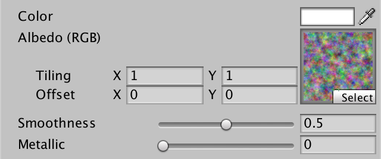
 							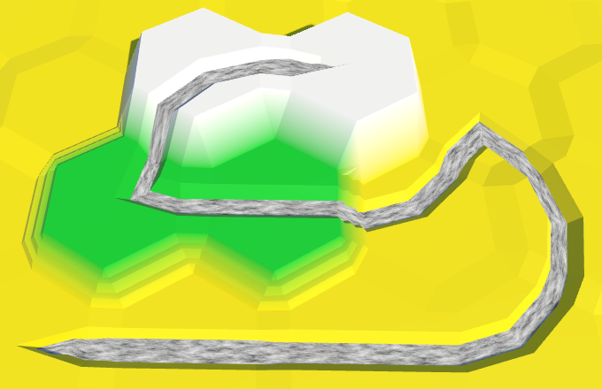 							Using the noise texture. 						

Because the V coordinates are stretched so much, the noise  texture gets stretched along the river as well. Unfortunately, this  doesn't produce a nice flow. Let's try stretching it the other way, by  greatly scaling down the U coordinates. One-sixteenth should do the  trick. That means that we're only sampling a narrow strip of the noise  texture.

```
			float2 uv = IN.uv_MainTex;
			uv.x *= 0.0625;
			uv.y -= _Time.y;
```

 							
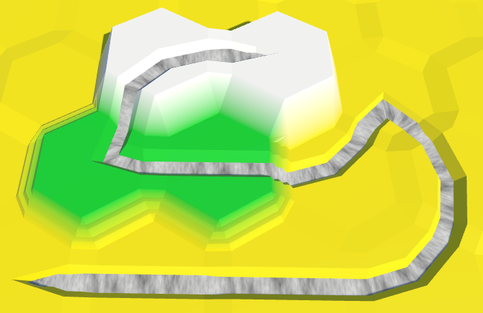 							Stretching the U coordinate. 						

Let's also slow down the flow to a quarter per second, so it takes four seconds for the texture to complete a cycle.

```
			uv.y -= _Time.y * 0.25;
```

<iframe src="https://gfycat.com/ifr/GrouchyGentleAfricanaugurbuzzard"></iframe>

Flowing noise.

### Mixing Noise

This already looks a lot better, but the pattern always stays the same. Water doesn't behave like that.

As we're only using a small strip of the noise, we could vary  the pattern by sliding the strip across the texture. This is done by  adding time to the U coordinate. We have to make sure to change it  slowly, otherwise the river will appear to flow sideways. Let's try a  factor of 0.005. That means it will take 200 seconds for the pattern to  loop.

```
			uv.x = uv.x * 0.0625 + _Time.y * 0.005;
```

<iframe src="https://gfycat.com/ifr/DefiantDirectFrillneckedlizard"></iframe>

Sliding noise.

Unfortunately, it doesn't look very good. The water still  appears static and the sliding is obvious, even when very slow. We might  be able to hide the sliding by combining two noise samples, sliding  both in opposite directions. And if we use slightly different values to  move the second sample, it will produce a subtle morphing animation.

To make sure that we never end up overlapping the exact same noise pattern, use a different channel for the second sample.

```
			float2 uv = IN.uv_MainTex;
			uv.x = uv.x * 0.0625 + _Time.y * 0.005;
			uv.y -= _Time.y * 0.25;
			float4 noise = tex2D(_MainTex, uv);
			
			float2 uv2 = IN.uv_MainTex;
			uv2.x = uv2.x * 0.0625 - _Time.y * 0.0052;
			uv2.y -= _Time.y * 0.23;
			float4 noise2 = tex2D(_MainTex, uv2);
			
			fixed4 c = _Color * (noise.r * noise2.a);
```

<iframe src="https://gfycat.com/ifr/LazyFatGrassspider"></iframe>

Combining two sliding noise patterns.

### Semitransparent Water

Our pattern looks dynamic enough. The next step is to make it semitransparent.

First, make sure that the water doesn't cast shadows. You can turn them off via the renderer component of the *Rivers* object in the prefab.

 							
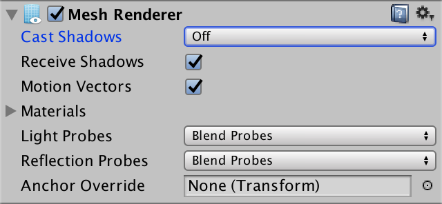 							No shadow casting. 						

Next, switch the shader to transparent mode. We have to use shader tags to indicate this. Then add the `alpha` keyword to the `#pragma surface` line. While we're at it, we can remove the `fullforwardshadows` keyword, as we're not casting shadows anyway.

```
		Tags { "RenderType"="Transparent" "Queue"="Transparent" }
		LOD 200
		
		CGPROGRAM
		#pragma surface surf Standard alpha // fullforwardshadows
		#pragma target 3.0
```

Now we're going to change how we color the river. Instead of  multiplying the noise with the color, add the noise to it instead. Then  use the `saturate` function to clamp the result, so we don't exceed 1.

```
			fixed4 c = saturate(_Color + noise.r * noise2.a);
```

This allows us to use the material's color as the base color.  The noise will increase its brightness and opacity. Try using a blue  color with a fairly low opacity. The result will be bluish  semitransparent water, with white highlights.


<iframe src="https://gfycat.com/ifr/InfamousAliveFinwhale"></iframe>

Colored and semitransparent water.

unitypackage

## Tweaking

Now that everything appears to be working, it is time to perturb  the vertices again. Besides deforming the cell edges, this will now  also make our rivers irregular.

```
	public const float cellPerturbStrength = 4f;
```

 						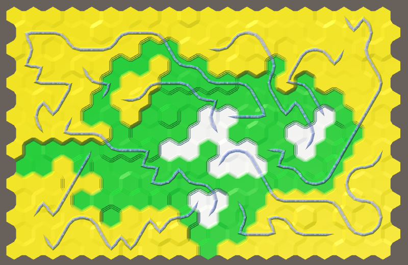 						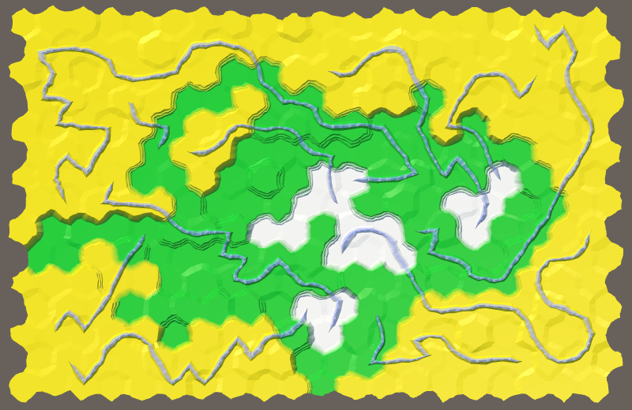 						Unperturbed vs. perturbed. 					

Inspect the terrain to see if the perturbations cause any problems. It turns out that they do! Check out some high waterfalls.

 						
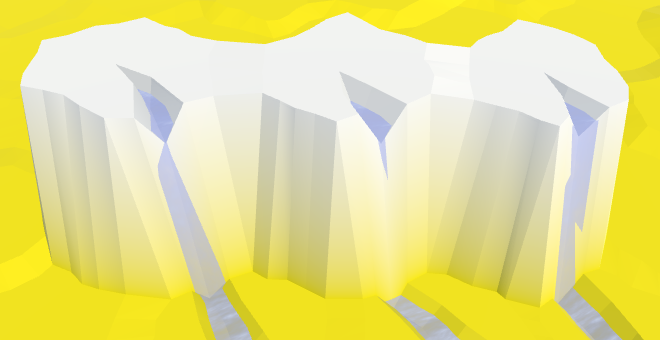 						Water clipped by cliffs. 					

The water falling down a high waterfall can disappear behind a  cliff. When this happens, it is very obvious, so we have to do something  about it.

Far less obvious is that the waterfalls can be slanted, instead  of dropping straight down. While water doesn't work like that, it is not  that noticeable. Your brain will come up with an interpretation that  makes it look fine. So let's ignore this.

The simplest way to prevent the water from disappearing is by  making the channels deeper. This creates more space between the water  surface and stream bed. It also makes the channel walls more vertical,  so we don't want to go too far. Let's set `**HexMetrics**.streamBedElevationOffset`  to -1.75. This solves most of the problem, without cutting too deep.  Some water will still be clipped, but not entire waterfalls.

```
	public const float streamBedElevationOffset = -1.75f;
```

 						
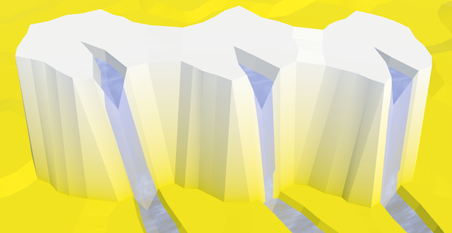 						Deeper channels. 					

The next tutorial is [Roads](https://catlikecoding.com/unity/tutorials/hex-map/part-7/).

unitypackage

PDF
