# Hex Map 7

Roads

- Add support for roads.
- Triangulate roads.
- Combine roads and rivers.
- Give roads a rugged appearance.

This tutorial is the seventh part of a series about [hexagon maps](https://catlikecoding.com/unity/tutorials/hex-map/). In part six, we added rivers to our terrain. This time, we'll add roads.

 					
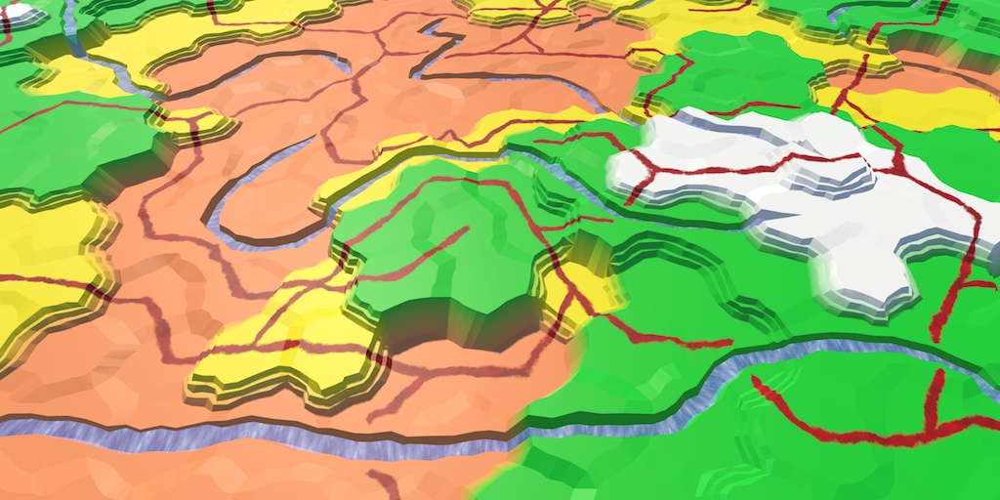 					The first signs of civilization. 				

## Cells With Roads

Like rivers, roads go from cell to cell, through the middle of  cell edges. The big difference is that roads don't have flowing water,  so they're bidirectional. Also, a functional road network requires  crossroads, so we'll support more than two roads per cell.

Allowing roads to go in all six directions means that a cell can  contain from zero to six roads. This leads to fourteen possible road  configurations. That's a lot more than the five possible configurations  for rivers. To make this workable, we'll have to use a generic approach  that can handle all configurations.

 						
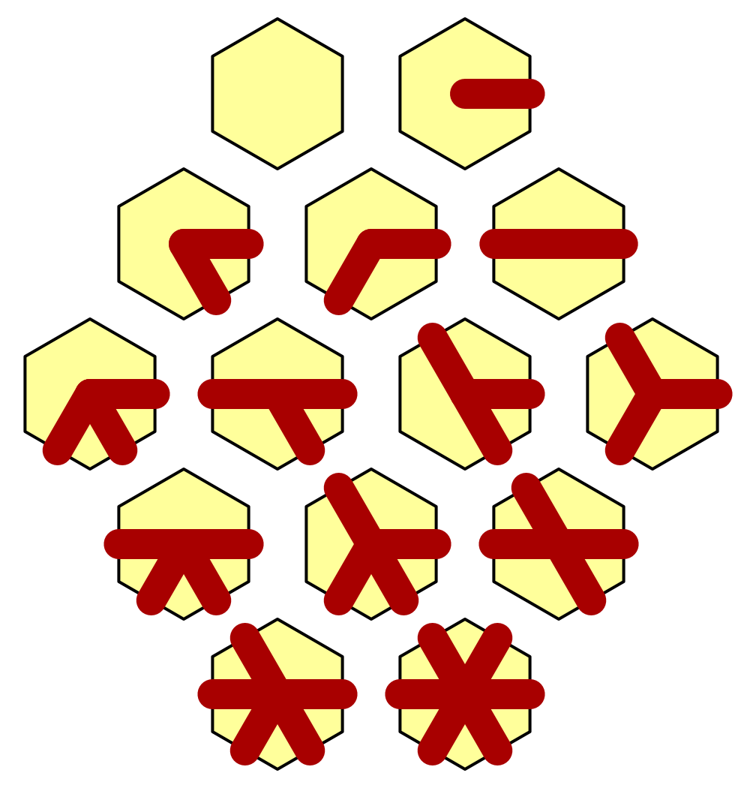 						14 possible road configurations. 					

### Keeping Track of Roads

The most straightforward way to keep track of roads per cell is to use an array of booleans. Add a private array field to `**HexCell**` and make it serializable, so we can see it in the inspector. Set the array size via the cell prefab so it supports six roads.

```
	[SerializeField]
	bool[] roads;
```

 							
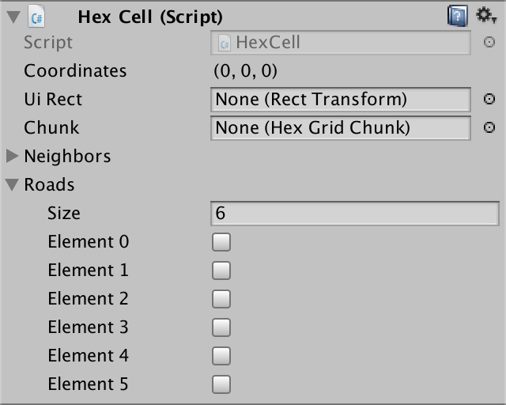 							Cell prefab with six roads. 						

Add a method to check whether the cell has a road in a certain direction.

```
	public bool HasRoadThroughEdge (HexDirection direction) {
		return roads[(int)direction];
	}
```

It is also handy to know whether a cell has at least one road,  so add a property for that. Just loop through the array and return `**true**` as soon as you find a road. If there isn't any, return `**false**`.

```
	public bool HasRoads {
		get {
			for (int i = 0; i < roads.Length; i++) {
				if (roads[i]) {
					return true;
				}
			}
			return false;
		}
	}
```

### Removing Roads

Just like with rivers, we'll add a method to remove all roads  from a cell. It's done with a loop that turns off each road that was  previously enabled.

```
	public void RemoveRoads () {
		for (int i = 0; i < neighbors.Length; i++) {
			if (roads[i]) {
				roads[i] = false;
			}
		}
	}
```

Of course we also have to disable the corresponding roads of the cell's neighbors.

```
			if (roads[i]) {
				roads[i] = false;
				neighbors[i].roads[(int)((HexDirection)i).Opposite()] = false;
			}
```

And after we're done, we have to make sure that both cells are  refreshed. As the roads are local to the cells, we only have to refresh  the cells themselves, not also their neighbors.

```
			if (roads[i]) {
				roads[i] = false;
				neighbors[i].roads[(int)((HexDirection)i).Opposite()] = false;
				neighbors[i].RefreshSelfOnly();
				RefreshSelfOnly();
			}
```

### Adding Roads

Adding a road works like removing a road. The only difference is that we set the boolean to `**true**` instead of to `**false**`. We can create a private method that can do either. Then we can use it both when adding and removing roads.

```
	public void AddRoad (HexDirection direction) {
		if (!roads[(int)direction]) {
			SetRoad((int)direction, true);
		}
	}

	public void RemoveRoads () {
		for (int i = 0; i < neighbors.Length; i++) {
			if (roads[i]) {
				SetRoad(i, false);
			}
		}
	}

	void SetRoad (int index, bool state) {
		roads[index] = state;
		neighbors[index].roads[(int)((HexDirection)index).Opposite()] = state;
		neighbors[index].RefreshSelfOnly();
		RefreshSelfOnly();
	}
```

We cannot have both a river and a road going in the same  direction. So make sure that there is room for the new road, before  adding it.

```
	public void AddRoad (HexDirection direction) {
		if (!roads[(int)direction] && !HasRiverThroughEdge(direction)) {
			SetRoad((int)direction, true);
		}
	}
```

Roads also cannot be combined with cliffs, as they're too  steep. Or maybe you might be OK with a road across a low cliff, but not  across a high cliff? To determine this, we can create a method that  tells us the elevation difference in a certain direction.

```
	public int GetElevationDifference (HexDirection direction) {
		int difference = elevation - GetNeighbor(direction).elevation;
		return difference >= 0 ? difference : -difference;
	}
```

Now we can enforce that roads are only added when the elevation  difference is small enough. I'll limit it to slopes at most, so that's a  maximum of 1.

```
	public void AddRoad (HexDirection direction) {
		if (
			!roads[(int)direction] && !HasRiverThroughEdge(direction) &&
			GetElevationDifference(direction) <= 1
		) {
			SetRoad((int)direction, true);
		}
	}
```

### Removing Invalid Roads

We made sure that roads are only added when allowed. Now we  have to make sure to remove them when they become invalid later. For  example, when adding a river. We could disallow rivers to be placed on  top of roads, but rivers aren't stopped by roads. Let them wash the  roads away.

We can suffice with setting the road to `**false**`, regardless whether there actually was a road. This will always refresh both cells, so we don't have to explicitly invoke `RefreshSelfOnly` anymore in `SetOutgoingRiver`.

```
	public void SetOutgoingRiver (HexDirection direction) {
		if (hasOutgoingRiver && outgoingRiver == direction) {
			return;
		}

		HexCell neighbor = GetNeighbor(direction);
		if (!neighbor || elevation < neighbor.elevation) {
			return;
		}

		RemoveOutgoingRiver();
		if (hasIncomingRiver && incomingRiver == direction) {
			RemoveIncomingRiver();
		}
		hasOutgoingRiver = true;
		outgoingRiver = direction;
//		RefreshSelfOnly();
		
		neighbor.RemoveIncomingRiver();
		neighbor.hasIncomingRiver = true;
		neighbor.incomingRiver = direction.Opposite();
//		neighbor.RefreshSelfOnly();
		
		SetRoad((int)direction, false);
	}
```

The other operation that can invalidate roads is an elevation  change. In this case, we'll have to check for roads in all directions.  If an elevation difference has become too great, an existing road has to  be removed.

```
	public int Elevation {
		get {
			return elevation;
		}
		set {
			…

			for (int i = 0; i < roads.Length; i++) {
				if (roads[i] && GetElevationDifference((HexDirection)i) > 1) {
					SetRoad(i, false);
				}
			}

			Refresh();
		}
	}
```

unitypackage

## Editing Roads

Editing roads works exactly like editing rivers. So `**HexMapEditor**` requires another optional toggle, plus an accompanying method to set its state.

```
	OptionalToggle riverMode, roadMode;

	public void SetRiverMode (int mode) {
		riverMode = (OptionalToggle)mode;
	}

	public void SetRoadMode (int mode) {
		roadMode = (OptionalToggle)mode;
	}
```

The `EditCell` method now has to support removing and  adding roads as well. That means it has two possible actions to take  when a drag happened. Restructure the code a bit so both toggle states  are checked when there's a valid drag.

```
	void EditCell (HexCell cell) {
		if (cell) {
			if (applyColor) {
				cell.Color = activeColor;
			}
			if (applyElevation) {
				cell.Elevation = activeElevation;
			}
			if (riverMode == OptionalToggle.No) {
				cell.RemoveRiver();
			}
			if (roadMode == OptionalToggle.No) {
				cell.RemoveRoads();
			}
			if (isDrag) {
				HexCell otherCell = cell.GetNeighbor(dragDirection.Opposite());
				if (otherCell) {
					if (riverMode == OptionalToggle.Yes) {
						otherCell.SetOutgoingRiver(dragDirection);
					}
					if (roadMode == OptionalToggle.Yes) {
						otherCell.AddRoad(dragDirection);
					}
				}
			}
		}
	}
```

You can quickly add a road panel to the UI by copying the river panel and adjusting the method that the toggles invoke.

This will result in a pretty tall UI. To combat this, I changed  the layout of the color panel to match the more compact road and river  panels.

 						
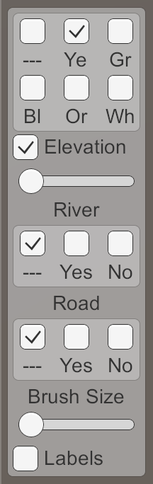 						UI with roads. 					

Because I'm now using two rows of three options for the colors, there's room for another color. So I added an entry for orange.

 						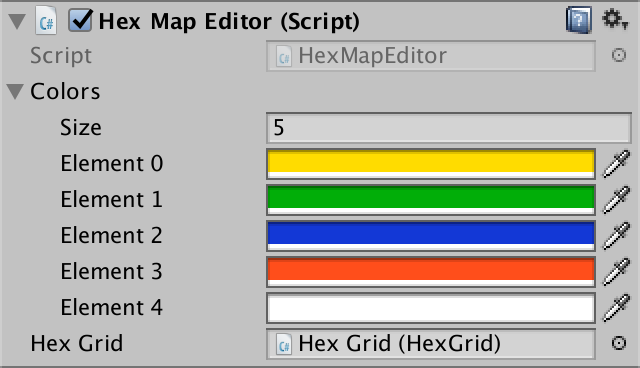 						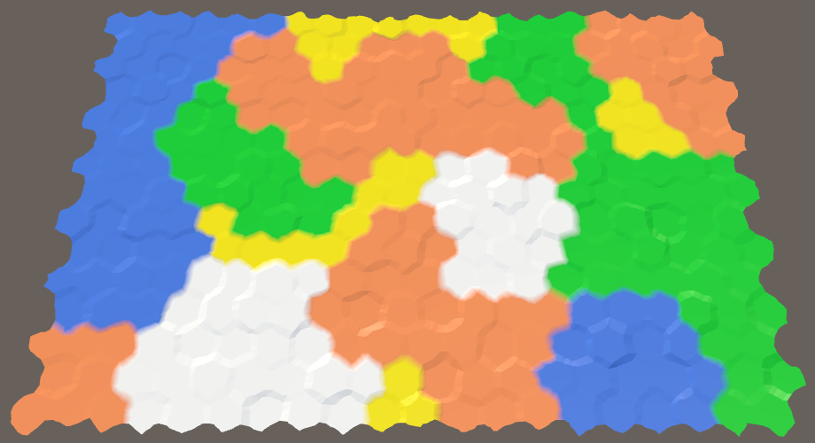 						Five colors, yellow, green, blue, orange, and white. 					

You can now edit roads, although they aren't visible yet. You can use the inspector to verify that it does work.

 						
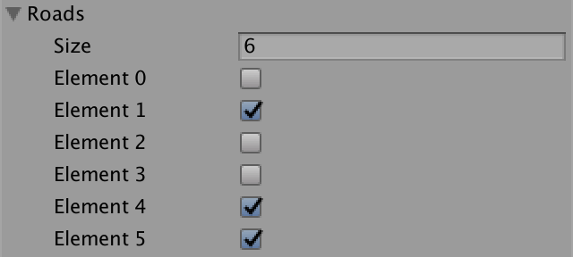 						Inspecting a cell with roads. 					

unitypackage

## Triangulating Roads

To visualize the roads, we'll have to triangulate them. This  works like the water mesh for rivers, except that the terrain doesn't  get a channel.

First, create a new standard shader that once again uses the UV coordinates to color the road surface.

```
Shader "Custom/Road" {
	Properties {
		_Color ("Color", Color) = (1,1,1,1)
		_MainTex ("Albedo (RGB)", 2D) = "white" {}
		_Glossiness ("Smoothness", Range(0,1)) = 0.5
		_Metallic ("Metallic", Range(0,1)) = 0.0
	}
	SubShader {
		Tags { "RenderType"="Opaque" }
		LOD 200
		
		CGPROGRAM
		#pragma surface surf Standard fullforwardshadows
		#pragma target 3.0

		sampler2D _MainTex;

		struct Input {
			float2 uv_MainTex;
		};

		half _Glossiness;
		half _Metallic;
		fixed4 _Color;

		void surf (Input IN, inout SurfaceOutputStandard o) {
			fixed4 c = fixed4(IN.uv_MainTex, 1, 1);
			o.Albedo = c.rgb;
			o.Metallic = _Metallic;
			o.Smoothness = _Glossiness;
			o.Alpha = c.a;
		}
		ENDCG
	}
	FallBack "Diffuse"
}
```

Create a road material that uses this shader.

 						
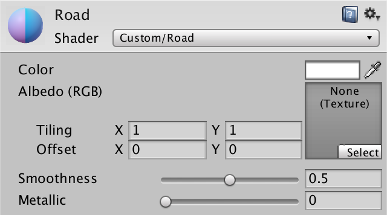 						Road material. 					

Then adjust the chunk prefab so it gets another hex mesh child,  for the roads. This mesh shouldn't cast shadows, and only uses UV  coordinates. The quickest way to do this – via a prefab instance – is to  duplicate the *Rivers* object and change its material.

 						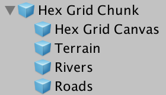 						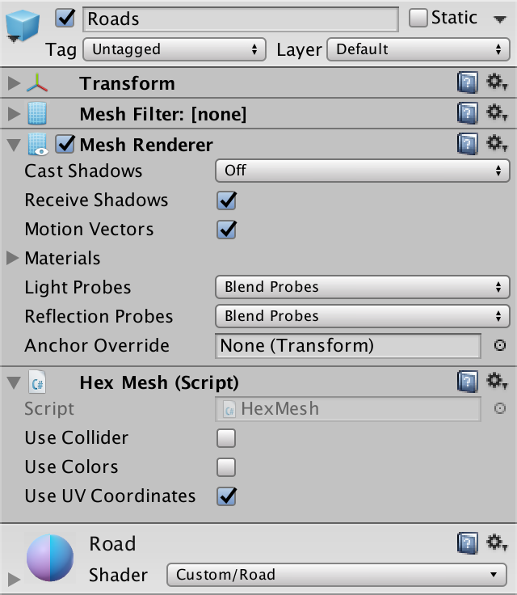 						Roads child object. 					

After that, add a public `**HexMesh** roads` field to `**HexGridChunk**` and include it in `Triangulate`. Connect it to the *Roads* object via the inspector.

```
	public HexMesh terrain, rivers, roads;
	
	public void Triangulate () {
		terrain.Clear();
		rivers.Clear();
		roads.Clear();
		for (int i = 0; i < cells.Length; i++) {
			Triangulate(cells[i]);
		}
		terrain.Apply();
		rivers.Apply();
		roads.Apply();
	}
```

 						
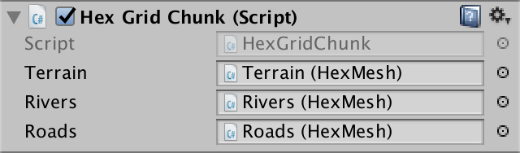 						Roads object connected. 					

### Roads Between Cells

Let's first consider the road segments in between cells. Like  rivers, roads will cover the middle two quads. We'll completely cover  these connection quads with road quads, so we can use the same six  vertex positions. Add a `TriangulateRoadSegment` method to `**HexGridChunk**` for this.

```
	void TriangulateRoadSegment (
		Vector3 v1, Vector3 v2, Vector3 v3,
		Vector3 v4, Vector3 v5, Vector3 v6
	) {
		roads.AddQuad(v1, v2, v4, v5);
		roads.AddQuad(v2, v3, v5, v6);
	}
```

As we don't have to worry about water flow, we don't need the V  coordinate, so we'll just set it zero everywhere. We can use the U  coordinate to indicate whether we're at the middle of the road, or at  the side. Let's set it to 1 at the middle and 0 at both sides.

```
	void TriangulateRoadSegment (
		Vector3 v1, Vector3 v2, Vector3 v3,
		Vector3 v4, Vector3 v5, Vector3 v6
	) {
		roads.AddQuad(v1, v2, v4, v5);
		roads.AddQuad(v2, v3, v5, v6);
		roads.AddQuadUV(0f, 1f, 0f, 0f);
		roads.AddQuadUV(1f, 0f, 0f, 0f);
	}
```

 							
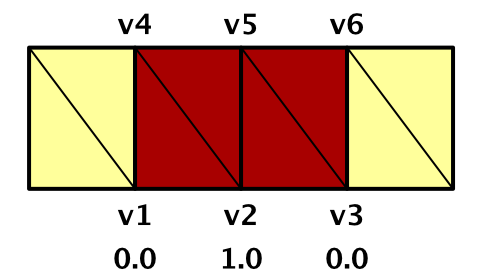 							Road segment between cells. 						

`TriangulateEdgeStrip` is the logical place to  invoke this method, but only when a road is actually there. Add a  boolean parameter to the method, so we can communicate this information.

```
	void TriangulateEdgeStrip (
		EdgeVertices e1, Color c1,
		EdgeVertices e2, Color c2,
		bool hasRoad
	) {
		…
	}
```

Of course we get compiler errors now, because we're not supplying this information yet. The solution is to add `**false**` as a final argument everywhere we invoke `TriangulateEdgeStrip`. However, we can also declare that the default value for this parameter is `**false**`. This turns it into an optional parameter and solves the compile errors.

```
	void TriangulateEdgeStrip (
		EdgeVertices e1, Color c1,
		EdgeVertices e2, Color c2,
		bool hasRoad = false
	) {
		…
	}
```

 							How do optional parameters work? 							 						

To triangulate the road, simply invoke `TriangulateRoadSegment` with the middle six vertices, if there is a need for it.

```
	void TriangulateEdgeStrip (
		EdgeVertices e1, Color c1,
		EdgeVertices e2, Color c2,
		bool hasRoad = false
	) {
		terrain.AddQuad(e1.v1, e1.v2, e2.v1, e2.v2);
		terrain.AddQuadColor(c1, c2);
		terrain.AddQuad(e1.v2, e1.v3, e2.v2, e2.v3);
		terrain.AddQuadColor(c1, c2);
		terrain.AddQuad(e1.v3, e1.v4, e2.v3, e2.v4);
		terrain.AddQuadColor(c1, c2);
		terrain.AddQuad(e1.v4, e1.v5, e2.v4, e2.v5);
		terrain.AddQuadColor(c1, c2);

		if (hasRoad) {
			TriangulateRoadSegment(e1.v2, e1.v3, e1.v4, e2.v2, e2.v3, e2.v4);
		}
	}
```

That takes care of flat cell connections. To support roads on terraces, we have to also tell `TriangulateEdgeTerraces` whether it has to add a road. It can simply pass this knowledge on to `TriangulateEdgeStrip`.

```
	void TriangulateEdgeTerraces (
		EdgeVertices begin, HexCell beginCell,
		EdgeVertices end, HexCell endCell,
		bool hasRoad
	) {
		EdgeVertices e2 = EdgeVertices.TerraceLerp(begin, end, 1);
		Color c2 = HexMetrics.TerraceLerp(beginCell.Color, endCell.Color, 1);

		TriangulateEdgeStrip(begin, beginCell.Color, e2, c2, hasRoad);

		for (int i = 2; i < HexMetrics.terraceSteps; i++) {
			EdgeVertices e1 = e2;
			Color c1 = c2;
			e2 = EdgeVertices.TerraceLerp(begin, end, i);
			c2 = HexMetrics.TerraceLerp(beginCell.Color, endCell.Color, i);
			TriangulateEdgeStrip(e1, c1, e2, c2, hasRoad);
		}

		TriangulateEdgeStrip(e2, c2, end, endCell.Color, hasRoad);
	}
```

`TriangulateEdgeTerraces` is invoked inside `TriangulateConnection`.  This is where we can determine whether there's actually a road going  through the current direction. Both when triangulating an edge, and when  triangulating terraces.

```
		if (cell.GetEdgeType(direction) == HexEdgeType.Slope) {
			TriangulateEdgeTerraces(
				e1, cell, e2, neighbor, cell.HasRoadThroughEdge(direction)
			);
		}
		else {
			TriangulateEdgeStrip(
				e1, cell.Color, e2, neighbor.Color,
				cell.HasRoadThroughEdge(direction)
			);
		}
```

 							
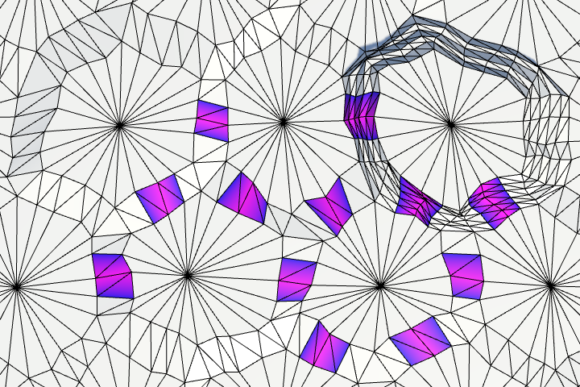 							Road segments between cells. 						

### Rendering On Top

When drawing roads, you'll see road segments pop up in between  cells. The middle of these segments will be magenta, transitioning to  blue at the sides.

However, when you move the camera around, the segments will  probably flicker, and sometimes disappear completely. This happens  because the road triangles exactly overlap the terrain triangles. It is  arbitrary which ends up rendered on top. Fixing this requires two steps.

First, we want to always draw the roads after the terrain has  been drawn. This is accomplished by rendering them after the regular  geometry is drawn, by putting them in a later render queue.

```
		Tags {
			"RenderType"="Opaque"
			"Queue" = "Geometry+1"
		}
```

Second, we want to make sure that the roads are drawn on top of  the terrain triangles that sit in the same position. We do this by  adding a depth test offset. This lets the GPU treat the triangles as if  they are closer to the camera than they really are.

```
		Tags {
			"RenderType"="Opaque"
			"Queue" = "Geometry+1"
		}
		LOD 200
		Offset -1, -1
```

### Roads Across Cells

When triangulating rivers, we only had to deal with at most two  river directions per cell. We could identify the five possible  scenarios and triangulate them differently to create well-behaved  rivers. However, there are fourteen possible scenarios for roads. We're  not going to use a different approach for each of these scenarios.  Instead, we'll treat each of the six cell directions the exact same way,  regardless of the specific road configuration.

When there's a road running across a cell part, we'll run it  straight to the cell center, without going outside of the triangular  zone. We'll draw a road segment from the edge halfway towards the  center. Then we'll use two triangles to cover the rest of the way to the  center.

 							
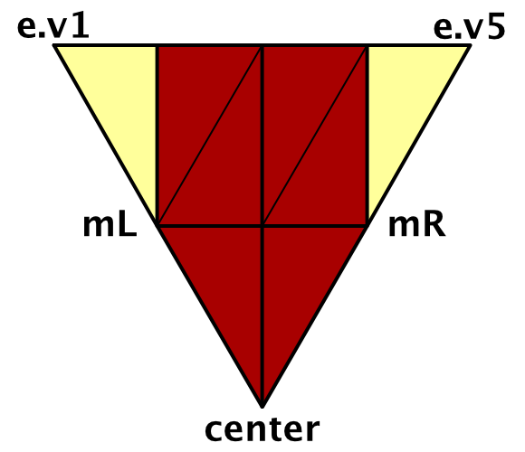 							Triangulating part of a road. 						

To triangulate this, we need to know the cell's center, the left and right middle vertices, and the edge vertices. Add a `TriangulateRoad` method with the corresponding parameters.

```
	void TriangulateRoad (
		Vector3 center, Vector3 mL, Vector3 mR, EdgeVertices e
	) {
	}
```

We need one additional vertex to construct the road segment. It sits between the left and right middle vertices.

```
	void TriangulateRoad (
		Vector3 center, Vector3 mL, Vector3 mR, EdgeVertices e
	) {
		Vector3 mC = Vector3.Lerp(mL, mR, 0.5f);
		TriangulateRoadSegment(mL, mC, mR, e.v2, e.v3, e.v4);
	}
```

Now we can also add the remaining two triangles.

```
		TriangulateRoadSegment(mL, mC, mR, e.v2, e.v3, e.v4);
		roads.AddTriangle(center, mL, mC);
		roads.AddTriangle(center, mC, mR);
```

And we have to add the UV coordinates of the triangles as well.  Two of their vertices sit in the middle of the road, the other at its  edge.

```
		roads.AddTriangle(center, mL, mC);
		roads.AddTriangle(center, mC, mR);
		roads.AddTriangleUV(
			new Vector2(1f, 0f), new Vector2(0f, 0f), new Vector2(1f, 0f)
		);
		roads.AddTriangleUV(
			new Vector2(1f, 0f), new Vector2(1f, 0f), new Vector2(0f, 0f)
		);
```

For now, let's only concern ourselves with cells that don't have a river in them. In those cases, `Triangulate` simply created an edge fan. Move this code to its own method. Then add an invocation of `TriangulateRoad`,  when there's actually a road. The left and right middle vertices can be  found by interpolating between the center and the two corner vertices.

```
	void Triangulate (HexDirection direction, HexCell cell) {
		…

		if (cell.HasRiver) {
			…
		}
		else {
			TriangulateWithoutRiver(direction, cell, center, e);
		}

		…
	}

	void TriangulateWithoutRiver (
		HexDirection direction, HexCell cell, Vector3 center, EdgeVertices e
	) {
		TriangulateEdgeFan(center, e, cell.Color);
		
		if (cell.HasRoadThroughEdge(direction)) {
			TriangulateRoad(
				center,
				Vector3.Lerp(center, e.v1, 0.5f),
				Vector3.Lerp(center, e.v5, 0.5f),
				e
			);
		}
	}
```

 							
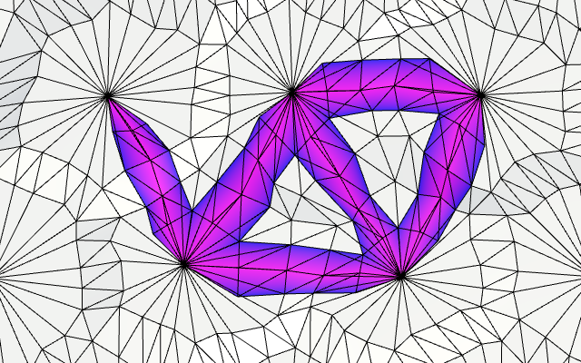 							Roads across cells. 						

### Road Edges

We can now see the roads, but they taper toward the cell  centers. Because we're not checking which of the fourteen road scenarios  we're dealing with, we can't move the road center to produce more  pleasing shapes. What we can do instead is add additional road edges in  other parts of the cell.

When a cell has roads through it, but not in the current  direction, add a road edge triangle. This triangle is defined by the  center, and the left and right middle vertices. In this case, only the  center vertex lies in the middle of the road. The other two vertices  sits at its edge.

```
	void TriangulateRoadEdge (Vector3 center, Vector3 mL, Vector3 mR) {
		roads.AddTriangle(center, mL, mR);
		roads.AddTriangleUV(
			new Vector2(1f, 0f), new Vector2(0f, 0f), new Vector2(0f, 0f)
		);
	}
```

 							
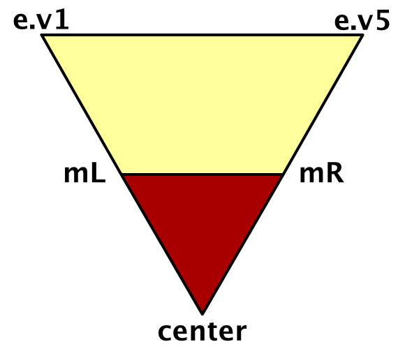 							Part of the edge of a road. 						

Whether we should triangulate a full road or only an edge, is something we'll leave up to `TriangulateRoad`.  To do so, it needs to know whether a road is going through the  direction of the current cell edge. So add a parameter for that.

```
	void TriangulateRoad (
		Vector3 center, Vector3 mL, Vector3 mR,
		EdgeVertices e, bool hasRoadThroughCellEdge
	) {
		if (hasRoadThroughCellEdge) {
			Vector3 mC = Vector3.Lerp(mL, mR, 0.5f);
			TriangulateRoadSegment(mL, mC, mR, e.v2, e.v3, e.v4);
			roads.AddTriangle(center, mL, mC);
			roads.AddTriangle(center, mC, mR);
			roads.AddTriangleUV(
				new Vector2(1f, 0f), new Vector2(0f, 0f), new Vector2(1f, 0f)
			);
			roads.AddTriangleUV(
				new Vector2(1f, 0f), new Vector2(1f, 0f), new Vector2(0f, 0f)
			);
		}
		else {
			TriangulateRoadEdge(center, mL, mR);
		}
	}
```

`TriangulateWithoutRiver` will now have to invoke `TriangulateRoad` whenever the cell has any roads going through it. And it'll have to pass along whether a road goes through the current edge.

```
	void TriangulateWithoutRiver (
		HexDirection direction, HexCell cell, Vector3 center, EdgeVertices e
	) {
		TriangulateEdgeFan(center, e, cell.Color);

		if (cell.HasRoads) {
			TriangulateRoad(
				center,
				Vector3.Lerp(center, e.v1, 0.5f),
				Vector3.Lerp(center, e.v5, 0.5f),
				e, cell.HasRoadThroughEdge(direction)
			);
		}
	}
```

 							
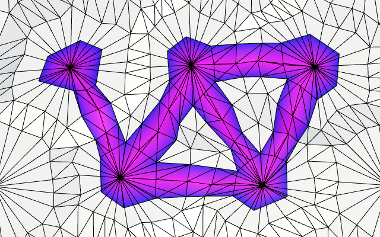 							Roads with complete edges. 						

### Smoothing Roads

Our roads are now complete. Unfortunately, this approach  produces bulges at the center of cells. Placing the left and right  vertices halfway between the center and corners is fine, when there's a  road adjacent to them. But when there isn't, it results in a bulge. To  counter this, we could place the vertices closer to the center in those  cases. Specifically, by interpolating with ¼ instead of with ½.

Let's create a separate method to figure out which  interpolators we should use. As there's two of them, we can put the  result in a `Vector2`. Its X component is the interpolator for the left point, and its Y component is the interpolator for the right point.

```
	Vector2 GetRoadInterpolators (HexDirection direction, HexCell cell) {
		Vector2 interpolators;
		return interpolators;
	}
```

If there's a road going in the current direction, we can put the points halfway.

```
	Vector2 GetRoadInterpolators (HexDirection direction, HexCell cell) {
		Vector2 interpolators;
		if (cell.HasRoadThroughEdge(direction)) {
			interpolators.x = interpolators.y = 0.5f;
		}
		return interpolators;
	}
```

Otherwise, it depends. For the left point, we can use ½ when  there's a road going through the previous direction. If not, we should  use ¼. The same goes for the right point, but with the next direction.

```
	Vector2 GetRoadInterpolators (HexDirection direction, HexCell cell) {
		Vector2 interpolators;
		if (cell.HasRoadThroughEdge(direction)) {
			interpolators.x = interpolators.y = 0.5f;
		}
		else {
			interpolators.x =
				cell.HasRoadThroughEdge(direction.Previous()) ? 0.5f : 0.25f;
			interpolators.y =
				cell.HasRoadThroughEdge(direction.Next()) ? 0.5f : 0.25f;
		}
		return interpolators;
	}
```

Now we can use this new method to determine which interpolators to use. This will smooth out the roads.

```
	void TriangulateWithoutRiver (
		HexDirection direction, HexCell cell, Vector3 center, EdgeVertices e
	) {
		TriangulateEdgeFan(center, e, cell.Color);

		if (cell.HasRoads) {
			Vector2 interpolators = GetRoadInterpolators(direction, cell);
			TriangulateRoad(
				center,
				Vector3.Lerp(center, e.v1, interpolators.x),
				Vector3.Lerp(center, e.v5, interpolators.y),
				e, cell.HasRoadThroughEdge(direction)
			);
		}
	}
```

 							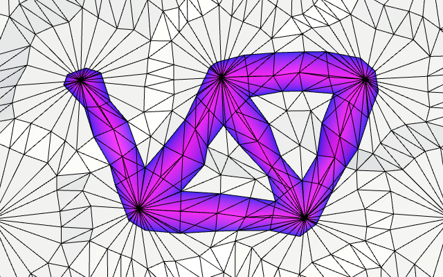 							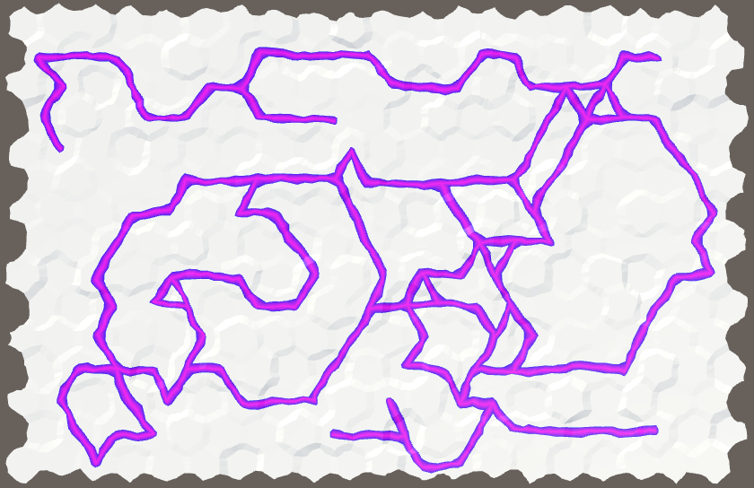 							Smooth roads. 						

unitypackage

## Combining Rivers and Roads

At this point we have functional roads, but only if there aren't  any rivers. When a cell has a river in it, no roads will be  triangulated.

 						
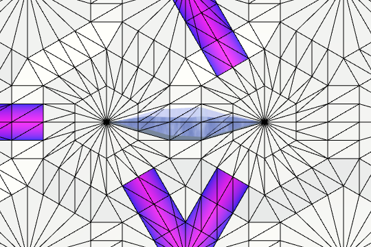 						No roads near rivers. 					

Let's create a new `TriangulateRoadAdjacentToRiver` method to take care of roads in this situation. Give it the usual parameters. Invoke it at the beginning of the `TriangulateAdjacentToRiver` method.

```
	void TriangulateAdjacentToRiver (
		HexDirection direction, HexCell cell, Vector3 center, EdgeVertices e
	) {
		if (cell.HasRoads) {
			TriangulateRoadAdjacentToRiver(direction, cell, center, e);
		}

		…
	}

	void TriangulateRoadAdjacentToRiver (
		HexDirection direction, HexCell cell, Vector3 center, EdgeVertices e
	) {
	}
```

To start with, do the same thing as for roads without rivers.  Check whether a road goes through the current edge, get the  interpolators, create the middle vertices, and invoke `TriangulateRoad`.  But because rivers will get in the way, we'll have to push the roads  away from them. As a result, the center of the road will end up at a  different position. We'll use a `roadCenter` variable to hold this new position. It starts out equal to the cell center.

```
void TriangulateRoadAdjacentToRiver (
		HexDirection direction, HexCell cell, Vector3 center, EdgeVertices e
	) {
		bool hasRoadThroughEdge = cell.HasRoadThroughEdge(direction);
		Vector2 interpolators = GetRoadInterpolators(direction, cell);
		Vector3 roadCenter = center;
		Vector3 mL = Vector3.Lerp(roadCenter, e.v1, interpolators.x);
		Vector3 mR = Vector3.Lerp(roadCenter, e.v5, interpolators.y);
		TriangulateRoad(roadCenter, mL, mR, e, hasRoadThroughEdge);
	}
```

This will produce partial roads in cells with rivers. The directions with rivers through them will cut gaps in the roads.

 						
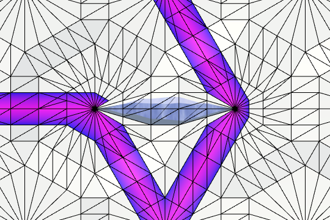 						Roads with gaps. 					

### River Begin Or End

Let's first consider cells that contain either the beginning or  end of a river. To make sure that roads don't overlap with the water,  we'll have to push the road center away from the river. To get the  direction of the incoming or outgoing river, add a convenient property  to `**HexCell**`.

```
	public HexDirection RiverBeginOrEndDirection {
		get {
			return hasIncomingRiver ? incomingRiver : outgoingRiver;
		}
	}
```

Now we can use this property in `**HexGridChunk**.TriangulateRoadAdjacentToRiver`  to push the road center in the opposite direction. Moving a third of  the way towards the middle edge in that direction does the trick.

```
		bool hasRoadThroughEdge = cell.HasRoadThroughEdge(direction);
		Vector2 interpolators = GetRoadInterpolators(direction, cell);
		Vector3 roadCenter = center;

		if (cell.HasRiverBeginOrEnd) {
			roadCenter += HexMetrics.GetSolidEdgeMiddle(
				cell.RiverBeginOrEndDirection.Opposite()
			) * (1f / 3f);
		}

		Vector3 mL = Vector3.Lerp(roadCenter, e.v1, interpolators.x);
		Vector3 mR = Vector3.Lerp(roadCenter, e.v5, interpolators.y);
		TriangulateRoad(roadCenter, mL, mR, e, hasRoadThroughEdge);
```

 							
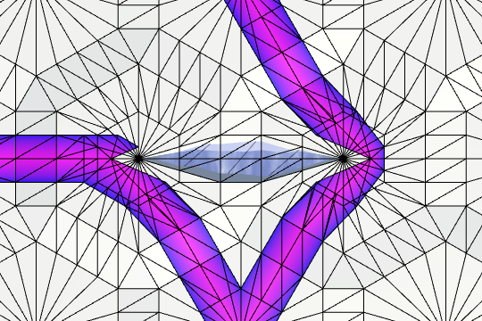 							Adjusted roads. 						

Next, we have to close the gaps. We do this by adding  additional road edge triangles when we're adjacent to a river. If there  is a river in the previous direction, then we add a triangle between the  road center, the cell center, and the middle left point. And if there's  a river in the next direction, then we add a triangle between the road  center, the middle right point, and the cell center.

We're going to do this no matter what river configuration we're dealing with, so put this code at the end of the method.

```
		Vector3 mL = Vector3.Lerp(roadCenter, e.v1, interpolators.x);
		Vector3 mR = Vector3.Lerp(roadCenter, e.v5, interpolators.y);
		TriangulateRoad(roadCenter, mL, mR, e, hasRoadThroughEdge);
		if (cell.HasRiverThroughEdge(direction.Previous())) {
			TriangulateRoadEdge(roadCenter, center, mL);
		}
		if (cell.HasRiverThroughEdge(direction.Next())) {
			TriangulateRoadEdge(roadCenter, mR, center);
		}
```

 							Can't we use an `**else**` statement? 							 						

 							
 							Complete roads. 						

### Straight Rivers

Cells with straight rivers pose an extra challenge, because  they effectively split the cell center in two. We're already adding  extra triangles to fill the gaps along rivers, but we also have to  disconnect the roads on opposite sides of the river.

 							
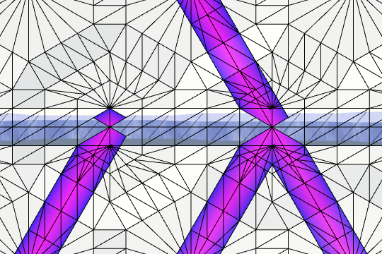 							Roads overlapping a straight river. 						

If the cell doesn't have the beginning or end of a river, we  can check whether the incoming and outgoing rivers go in opposite  directions. If so, we have a straight river.

```
		if (cell.HasRiverBeginOrEnd) {
			roadCenter += HexMetrics.GetSolidEdgeMiddle(
				cell.RiverBeginOrEndDirection.Opposite()
			) * (1f / 3f);
		}
		else if (cell.IncomingRiver == cell.OutgoingRiver.Opposite()) {
		}
```

To determine where the river is relative to the current  direction, we'll have to check the adjacent directions. The river is  either on the left, or on the right. As we're also doing this at the end  of the method, cache these queries in boolean variables. This also  makes our code easier to read.

```
		bool hasRoadThroughEdge = cell.HasRoadThroughEdge(direction);
		bool previousHasRiver = cell.HasRiverThroughEdge(direction.Previous());
		bool nextHasRiver = cell.HasRiverThroughEdge(direction.Next());
		Vector2 interpolators = GetRoadInterpolators(direction, cell);
		Vector3 roadCenter = center;

		if (cell.HasRiverBeginOrEnd) {
			roadCenter += HexMetrics.GetSolidEdgeMiddle(
				cell.RiverBeginOrEndDirection.Opposite()
			) * (1f / 3f);
		}
		else if (cell.IncomingRiver == cell.OutgoingRiver.Opposite()) {
			if (previousHasRiver) {
			}
			else {
			}
		}

		Vector3 mL = Vector3.Lerp(roadCenter, e.v1, interpolators.x);
		Vector3 mR = Vector3.Lerp(roadCenter, e.v5, interpolators.y);
		TriangulateRoad(roadCenter, mL, mR, e, hasRoadThroughEdge);
		if (previousHasRiver) {
			TriangulateRoadEdge(roadCenter, center, mL);
		}
		if (nextHasRiver) {
			TriangulateRoadEdge(roadCenter, mR, center);
		}
```

We have to push the road center towards the corner vector that  points straight away from the river. If the river goes through the  previous direction, then that's second solid corner. Otherwise, it's the  first solid corner.

```
		else if (cell.IncomingRiver == cell.OutgoingRiver.Opposite()) {
			Vector3 corner;
			if (previousHasRiver) {
				corner = HexMetrics.GetSecondSolidCorner(direction);
			}
			else {
				corner = HexMetrics.GetFirstSolidCorner(direction);
			}
		}
```

To shift the road so it ends up adjacent to the river, we have  to move the road center half of the way towards that corner. Then, we  have to also move the cell center a quarter of the way in that  direction.

```
		else if (cell.IncomingRiver == cell.OutgoingRiver.Opposite()) {
			Vector3 corner;
			if (previousHasRiver) {
				corner = HexMetrics.GetSecondSolidCorner(direction);
			}
			else {
				corner = HexMetrics.GetFirstSolidCorner(direction);
			}
			roadCenter += corner * 0.5f;
			center += corner * 0.25f;
		}
```

 							
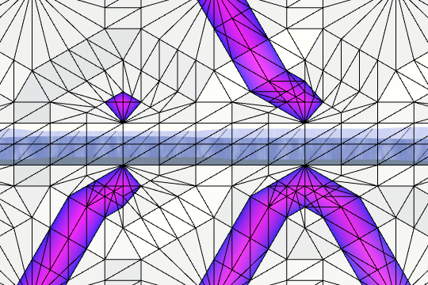 							Separated roads. 						

We have split the road network inside this cell. This is fine  when there are roads on both sides of the river. But when one side  doesn't have a road, we end up with a small bit of isolated road. That  doesn't make much sense, so let's get rid of such parts.

Verify that there is a road going through the current  direction. If there isn't, check the other direction on the same side of  the river for a road. If neither have a road going through them, jump  out of the method before triangulating anything.

```
			if (previousHasRiver) {
				if (
					!hasRoadThroughEdge &&
					!cell.HasRoadThroughEdge(direction.Next())
				) {
					return;
				}
				corner = HexMetrics.GetSecondSolidCorner(direction);
			}
			else {
				if (
					!hasRoadThroughEdge &&
					!cell.HasRoadThroughEdge(direction.Previous())
				) {
					return;
				}
				corner = HexMetrics.GetFirstSolidCorner(direction);
			}
```

 							
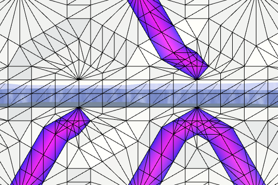 							Pruned roads. 						

 							What about bridges? 							 						

### Zigzag Rivers

The next type of river that we'll deal with are zigzags. These  rivers do not split the road network, so we only have to move the road  center.

 							
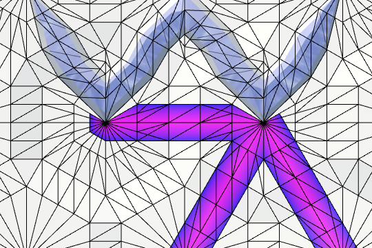 							Zigzags cutting through roads. 						

The simplest way to check for zigzags is to compare the  directions of the incoming and outgoing rivers. If they're adjacent,  then we have a zigzag. This leads to two possible cases, depending on  the flow direction.

```
		if (cell.HasRiverBeginOrEnd) {
			…
		}
		else if (cell.IncomingRiver == cell.OutgoingRiver.Opposite()) {
			…
		}
		else if (cell.IncomingRiver == cell.OutgoingRiver.Previous()) {
		}
		else if (cell.IncomingRiver == cell.OutgoingRiver.Next()) {
		}
```

We can move the road center by using one of the corners of the  incoming river direction. Which corner it is depends on the flow  direction. Push the road center away from that corner with a factor of  0.2.

```
		else if (cell.IncomingRiver == cell.OutgoingRiver.Previous()) {
			roadCenter -= HexMetrics.GetSecondCorner(cell.IncomingRiver) * 0.2f;
		}
		else if (cell.IncomingRiver == cell.OutgoingRiver.Next()) {
			roadCenter -= HexMetrics.GetFirstCorner(cell.IncomingRiver) * 0.2f;
		}
```

 							
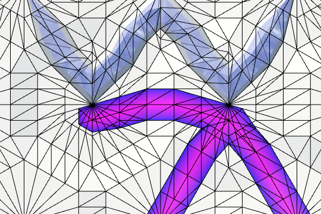 							Road pushed away from the zigzags. 						

### Inside of Curved Rivers

The final river configuration is a smooth curve. Like a  straight river, this one can also disconnect roads. But in this case,  the sides are different. We'll first deal with the inside of the curve.

 							
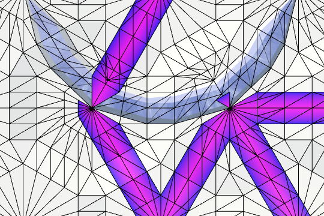 							Curved river with overlapping roads. 						

When there's a river on both sides of the current direction, then we're on the inside of a curve.

```
		else if (cell.IncomingRiver == cell.OutgoingRiver.Next()) {
			…
		}
		else if (previousHasRiver && nextHasRiver) {
		}
```

We have to pull the road center towards the current cell edge,  shortening the road by a lot. A factor of 0.7 is fine. The cell center  has to move as well, with a factor of 0.5.

```
		else if (previousHasRiver && nextHasRiver) {
			Vector3 offset = HexMetrics.GetSolidEdgeMiddle(direction) *
				HexMetrics.innerToOuter;
			roadCenter += offset * 0.7f;
			center += offset * 0.5f;
		}
```

 							
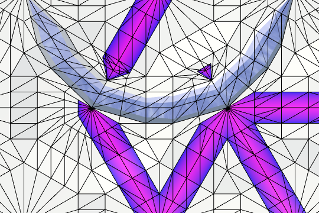 							Shortened roads. 						

Like with straight rivers, we'll have to prune isolated road parts. In this case, we only have to check the current direction.

```
		else if (previousHasRiver && nextHasRiver) {
			if (!hasRoadThroughEdge) {
				return;
			}
			Vector3 offset = HexMetrics.GetSolidEdgeMiddle(direction) *
				HexMetrics.innerToOuter;
			roadCenter += offset * 0.7f;
			center += offset * 0.5f;
		}
```

 							
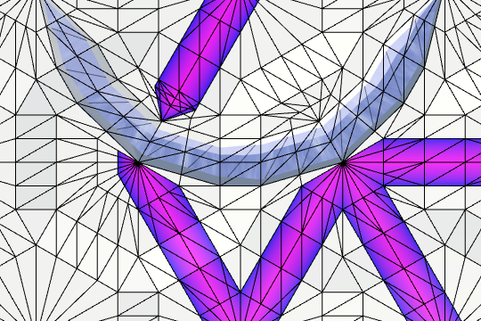 							Pruned roads. 						

### Outside of Curved Rivers

After checking all the previous cases, the only remaining  possibility is that we're on the outside of a curving river. There are  three cell parts on the outside. We have to find the middle direction.  Once we have it, we can move the road center towards that edge by a  factor of 0.25.

```
		else if (previousHasRiver && nextHasRiver) {
			…
		}
		else {
			HexDirection middle;
			if (previousHasRiver) {
				middle = direction.Next();
			}
			else if (nextHasRiver) {
				middle = direction.Previous();
			}
			else {
				middle = direction;
			}
			roadCenter += HexMetrics.GetSolidEdgeMiddle(middle) * 0.25f;
		}
```

 							
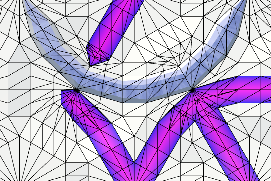 							Adjusted roads on the outside. 						

As a final step, we have to prune roads on this side of the  river as well. The simplest way it to check all three directions for a  road, relative to the middle. If there is no road, abort.

```
		else {
			HexDirection middle;
			if (previousHasRiver) {
				middle = direction.Next();
			}
			else if (nextHasRiver) {
				middle = direction.Previous();
			}
			else {
				middle = direction;
			}
			if (
				!cell.HasRoadThroughEdge(middle) &&
				!cell.HasRoadThroughEdge(middle.Previous()) &&
				!cell.HasRoadThroughEdge(middle.Next())
			) {
				return;
			}
			roadCenter += HexMetrics.GetSolidEdgeMiddle(middle) * 0.25f;
		}
```

 							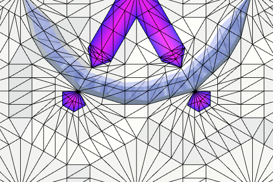 							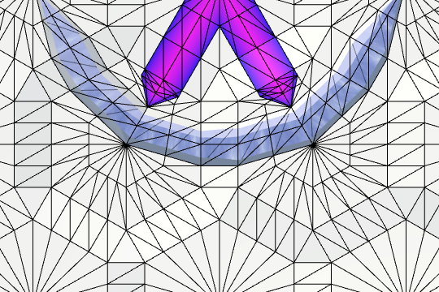 							Roads before and after pruning. 						

Having covered all river scenarios, our rivers and road can now  coexist. The rivers ignore roads, and the roads adjust to the rivers.

 							
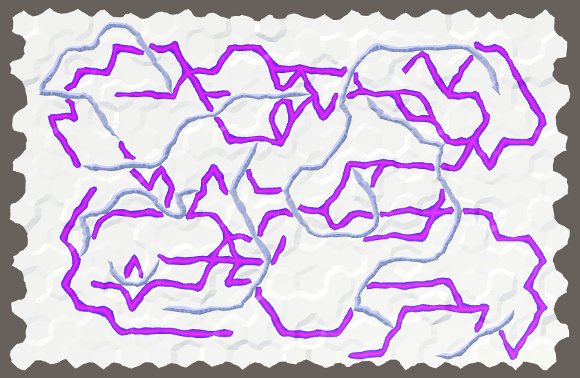 							Combining rivers and roads. 						

unitypackage

## Road Appearance

Up to this point, we've used the road's UV coordinates as its  colors. Because we're only varying the U coordinate, what we're really  visualizing is the transition between the middle of the road and the  edge.

 						
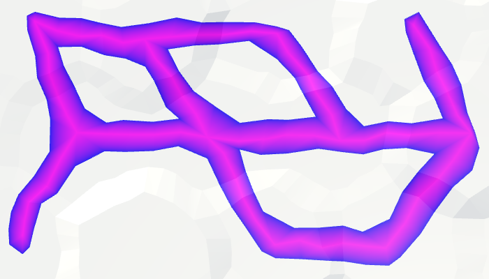 						Showing UV coordinates. 					

Now that we are sure that the roads are triangulated correctly,  we can change the road shader so it renders something more road-like.  Just as for rivers, this will be a simple visualization, nothing fancy.

We'll begin by using a solid color for the roads. Just use the material's color. I made it red.

```
		void surf (Input IN, inout SurfaceOutputStandard o) {
			fixed4 c = _Color;
			
			o.Albedo = c.rgb;
			o.Metallic = _Metallic;
			o.Smoothness = _Glossiness;
			o.Alpha = c.a;
		}
```

 						
 						Red roads. 					

This already looks a lot better! But let's continue by blending  the road with the terrain, by using the U coordinate as a blend factor.

```
		void surf (Input IN, inout SurfaceOutputStandard o) {
			fixed4 c = _Color;
			float blend = IN.uv_MainTex.x;
			
			o.Albedo = c.rgb;
			o.Metallic = _Metallic;
			o.Smoothness = _Glossiness;
			o.Alpha = blend;
		}
```

This seems to have no effect. That's because our shader is  opaque. It now needs to be alpha-blended. Specifically, we need a  blending decal surface shader. We can get the desired shader by adding `decal:blend` to the `#pragma surface` directive.

```
		#pragma surface surf Standard fullforwardshadows decal:blend
```

 						
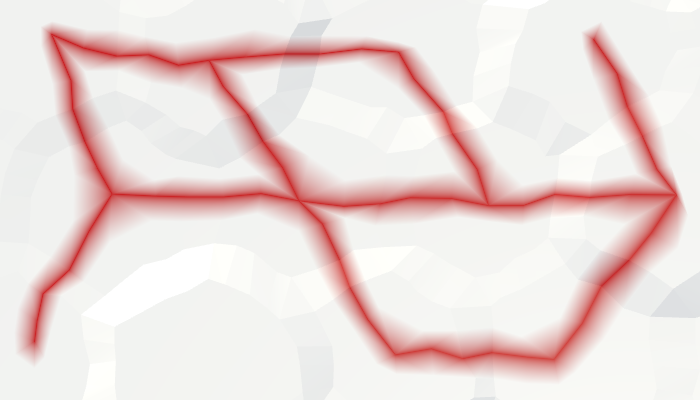 						Blending roads. 					

This produces a smooth linear blend from middle to edge, which  doesn't look very good. To make it look like a road, we need a solid  region, followed by a quick transition to an opaque region. We can use  the `smoothstep` function for this. It turns a linear progression form 0 to 1 into an S-curve.

 						
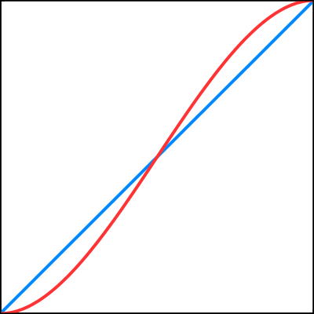 						Linear and smoothstep. 					

The `smoothstep`  function has a minimum and maximum parameter, to fit the curve inside  an arbitrary range. Inputs outside of this range are clamped so the  curve becomes flat. Let's use 0.4 as the start of the curve and 0.7 and  the end. This means that U coordinates from 0 to 0.4 will be fully  transparent. And U coordinates from 0.7 to 1 will be fully opaque. The  transition happens between 0.4 and 0.7.

```
			float blend = IN.uv_MainTex.x;
			blend = smoothstep(0.4, 0.7, blend);
```

 						
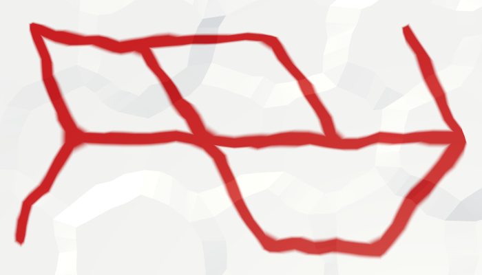 						Quick transition between opaque and transparent. 					

### Noisy Road

Because the road mesh gets perturbed, the roads have varying  widths. As a result, the width of the edge transition varies as well.  Sometimes it is fuzzy, sometimes it is sharp. This variability is fine  when we think of our roads as dirt or sand roads.

Let's go a step further and add some noise to the road edges.  This will make them look more rugged and less polygonal. We can do this  by sampling our noise texture. We can use the world XZ coordinates to  sample it, just like we do when perturbing cell vertices.

To access the world position in the surface shader, add `**float3** worldPos` to the input structure.

```
		struct Input {
			float2 uv_MainTex;
			float3 worldPos;
		};
```

Now we can use that position in `surf` to sample the main texture. Make sure to scale down the coordinates, otherwise the texture will tile too quickly.

```
			float4 noise = tex2D(_MainTex, IN.worldPos.xz * 0.025);
			fixed4 c = _Color;
			float blend = IN.uv_MainTex.x;
```

Perturb the transition by multiplying the U coordinate with `noise.**x**`.  But because the noise values are 0.5 on average, that would wipe out  most of the roads. To prevent this, add 0.5 to the noise before  multiplying.

```
			float blend = IN.uv_MainTex.x;
			blend *= noise.x + 0.5;
			blend = smoothstep(0.4, 0.7, blend);
```

 							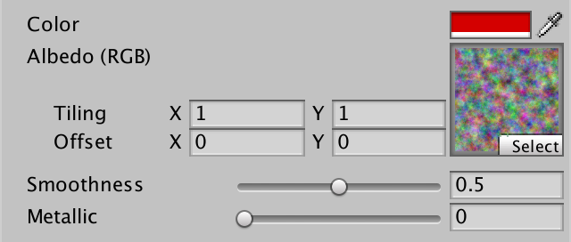 							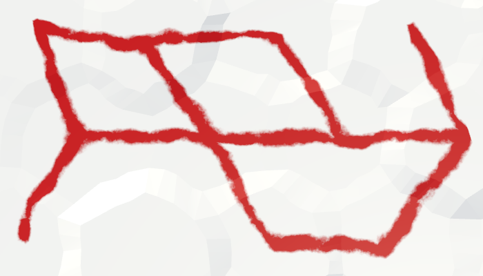 							Perturbed road edges. 						

To wrap things up, let's also perturb the road color. This gives the roads a hint of dirtiness to match their messy edges.

Multiply the color by a different noise channel, say `noise.**y**`.  This will half the color on average. As that is a bit much, scale down  the noise somewhat and add a constant so the total can still reach 1.

```
			fixed4 c = _Color * (noise.y * 0.75 + 0.25);
```

 							
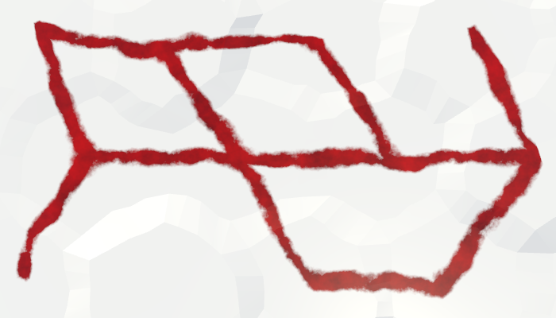 							Messy roads. 						

The next tutorial is [Water](https://catlikecoding.com/unity/tutorials/hex-map/part-8/).

unitypackage

PDF
