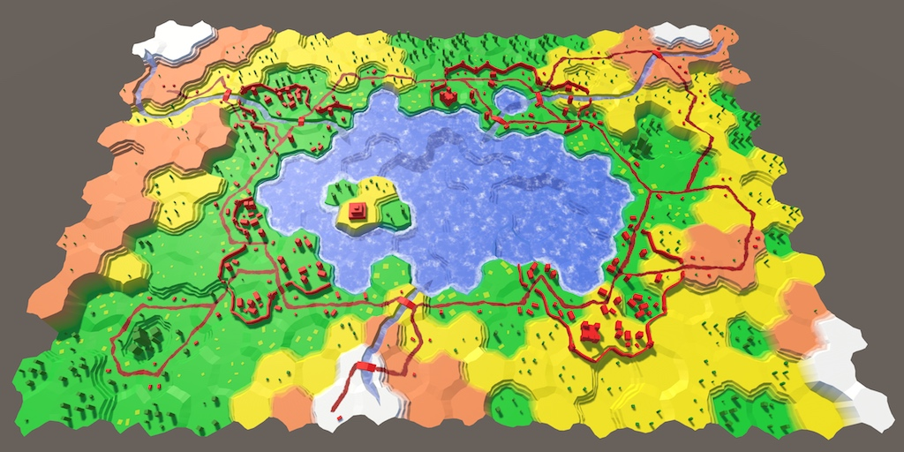
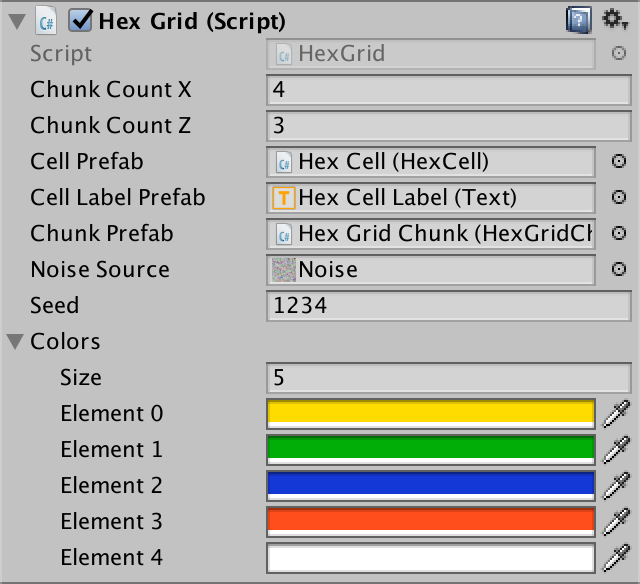
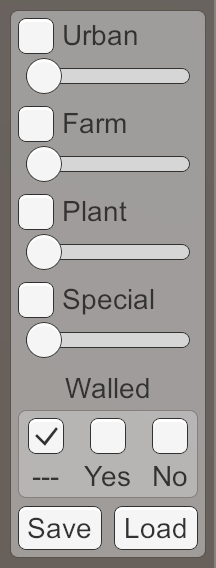

# Hex Map 12

Saving and Loading

- Keep track of terrain type, instead of color.
- Create a file.
- Write data to a file, then read it.
- Serialize cell data.
- Reduce file size.

This is the 12th part of a tutorial series about [hexagon maps](https://catlikecoding.com/unity/tutorials/hex-map/). By now we can create reasonably interesting maps. It's time to save them.

 					
					Loadedfroma[test.map](https://catlikecoding.com/unity/tutorials/hex-map/part-12/test.map) file. 				

## Terrain Type

When saving a map, we do not need to store all the data that we  keep track of at run time. For example, we only have to remember the  elevation level of a cell. Its actual vertical position is derived from  it, so need not be stored. In fact, it is better that we don't store  those derived metrics. That way, the map data remains valid, even if  later on we decide to adjust the elevation offset. The data is separate  from the presentation.

Likewise, the exact color of a cell need not be stored. It's ok  to remember that a cell is green. But the exact shade of green might  change if we adjust the visual style. To do this, we could store the  color index, instead of the colors themselves. In fact, we can suffice  with storing this index in cells at run time as well, instead of the  actual colors. That allows us to upgrade to a more advanced terrain  visualization later.

### Moving the Color Array

If cells no longer have color data, then it should be available somewhere else. The most convenient place is `**HexMetrics**`. So let's add a color array to it.

```
	public static Color[] colors;
```

Like with other global data like the noise, we can initialize these colors via `**HexGrid**`.

```
	public Color[] colors;
	
	…
	
	void Awake () {
		HexMetrics.noiseSource = noiseSource;
		HexMetrics.InitializeHashGrid(seed);
		HexMetrics.colors = colors;

		…
	}

	…

	void OnEnable () {
		if (!HexMetrics.noiseSource) {
			HexMetrics.noiseSource = noiseSource;
			HexMetrics.InitializeHashGrid(seed);
			HexMetrics.colors = colors;
		}
	}
```

And as we'll no longer directly assign colors to cells, get rid of the default color.

```
//	public Color defaultColor = Color.white;
	
	…
					
	void CreateCell (int x, int z, int i) {
		…

		HexCell cell = cells[i] = Instantiate<HexCell>(cellPrefab);
		cell.transform.localPosition = position;
		cell.coordinates = HexCoordinates.FromOffsetCoordinates(x, z);
//		cell.Color = defaultColor;

		…
	}
```

Configure the new colors so they match the public array of the hex map editor.

 							
 							Colors added to the grid. 						

### Refactoring Cells

Remove the color field from `**HexCell**`. Instead, we'll store an index. And instead of a color index, we'll use a more generic terrain type index.

```
//	Color color;
	int terrainTypeIndex;
```

The color property can use this index to retrieve the  appropriate color. It can no longer be directly set, so remove that  part. That will produce a compile error, which we'll fix shortly.

```
	public Color Color {
		get {
			return HexMetrics.colors[terrainTypeIndex];
		}
//		set {
//			…
//		}
	}
```

Add a new property to get and set our new terrain type index.

```
	public int TerrainTypeIndex {
		get {
			return terrainTypeIndex;
		}
		set {
			if (terrainTypeIndex != value) {
				terrainTypeIndex = value;
				Refresh();
			}
		}
	}
```

### Refactoring the Editor

Inside `**HexMapEditor**`, remove all the code that deals with colors. That will fix the compile error as well.

```
//	public Color[] colors;

	…

//	Color activeColor;

	…

//	bool applyColor;

…

//	public void SelectColor (int index) {
//		applyColor = index >= 0;
//		if (applyColor) {
//			activeColor = colors[index];
//		}
//	}

…

//	void Awake () {
//		SelectColor(0);
//	}
	
	…
	
	void EditCell (HexCell cell) {
		if (cell) {
//			if (applyColor) {
//				cell.Color = activeColor;
//			}
			…
		}
	}
```

Now add a field and method to control the active terrain type index.

```
	int activeTerrainTypeIndex;
	
	…
	
	public void SetTerrainTypeIndex (int index) {
		activeTerrainTypeIndex = index;
	}
```

Use this method as a replacement for the now missing `SelectColor` method. Connect the color widgets in the UI to `SetTerrainTypeIndex`,  keeping everything else the same. This means that a negative index is  still used to indicate that the color shouldn't be changed.

Adjust `EditCell` so the terrain type index is assigned to the edited cell, when appropriate.

```
	void EditCell (HexCell cell) {
		if (cell) {
			if (activeTerrainTypeIndex >= 0) {
				cell.TerrainTypeIndex = activeTerrainTypeIndex;
			}
			…
		}
	}
```

Although we have removed the color data from our cells, the map  should still work as before. The only difference is that the default  color is now the first in the array, which is yellow in my case.

 							
 							Yellow is the new default. 						

unitypackage

## Storing Data in a File

We'll use `**HexMapEditor**` to control saving and loading our map. Create two methods to take care of this, leaving them empty for now.

```
	public void Save () {
	}

	public void Load () {
	}
```

Add two buttons to the UI, via *GameObject / UI / Button*. Hook them up to the `Save` and `Load` methods, and give them appropriate labels. I put them at the bottom of the right panel.

 						
 						Save and Load buttons. 					

### File Location

To save a map, we have to store it somewhere. As most games do,  we'll store the data in a file. But where on the player's file system  should this file be put? The answer depends on which operating system  the game runs on. Each has a different convention for storing  application-specific files.

We don't need to know these conventions. Unity knows the appropriate path, which we can retrieve via `Application.persistentDataPath`. You can check what it is for you, by logging it in `Save` and clicking the button while in play mode.

```
	public void Save () {
		Debug.Log(Application.persistentDataPath);
	}
```

On desktops, the path will contain the company and product  name. Both the editor and builds use this path. You can adjust the names  via *Edit / Project Settings / Player*.

 							
 							Company and product name. 						

 							Why can't I find the Library folder on a Mac? 							 						

 							What about WebGL? 							 						

### Creating a File

To create a file, we have to use classes from the `System.IO` namespace. So add a `**using**` statement for it above the `**HexMapEditor**` class.

```
using UnityEngine;
using UnityEngine.EventSystems;
using System.IO;

public class HexMapEditor : MonoBehaviour {
	…
}
```

First, we need to create the full path of the file. We'll use *test.map*  as the file's name. It should be appended to the persistent data path.  Whether we have to put a slash or a backslash between them depends on  the platform. The `Path.Combine` method will take care of this for us.

```
	public void Save () {
		string path = Path.Combine(Application.persistentDataPath, "test.map");
	}
```

Next, we have to access the file at this location. We do this with the `File.Open`  method. Because we want to write data to this file, we have to use its  create mode. That will either create a new file at the provided path, or  replace the file if it already existed.

```
		string path = Path.Combine(Application.persistentDataPath, "test.map");
		File.Open(path, FileMode.Create);
```

The result of invoking this method is an open data stream,  linked to this file. We can use it to write data into the file. And we  must make sure to close the stream, once we no longer need it.

```
		string path = Path.Combine(Application.persistentDataPath, "test.map");
		Stream fileStream = File.Open(path, FileMode.Create);
		fileStream.Close();
```

At this point, pressing the *Save* button will create a *test.map*  file in the folder specified by the persistent data path. If you  inspect this file, you'll find that it is empty, with a size of zero  bytes. That's because we haven't written anything to it yet.

### Writing to a File

To actually put data into the file, we need a way to stream data to it. The most basic way to do this is by using a `BinaryWriter`. These objects allow us to write primitive data to any stream.

Create a new `BinaryWriter`  object, with our file stream as an argument. Closing the writer will  also close the stream that it uses. So we don't need to keep a direct  reference to the stream anymore.

```
		string path = Path.Combine(Application.persistentDataPath, "test.map");
		BinaryWriter writer =
			new BinaryWriter(File.Open(path, FileMode.Create));
		writer.Close();
```

We can use the `BinaryWriter.Write` method to send data into the stream. There is a `Write` method variant for all primitive types, like integers and floats. It can also write strings. Let's try writing the integer 123.

```
		BinaryWriter writer =
			new BinaryWriter(File.Open(path, FileMode.Create));
		writer.Write(123);
		writer.Close();
```

Press our *Save* button, and inspect *test.map* again. Its size is now four bytes. That's because the size of an integer is four bytes.

 							Why does my file browser report that the file takes up more space? 							 						

Note that we are storing binary data, not human-readable text.  So if you were to open our file in a text editor, you would see  gibberish. You might see the character *{*, followed by either nothing or some placeholder characters.

You could open the file with a hex editor. In that case, you would see *7b 00 00 00*. Those are the four bytes of our integer, displayed using hexadecimal notation. That's *123 0 0 0* when using regular decimal numbers. In binary notation, the first byte is *01111011*.

The ASCII code for *{* is 123, which is  why a text editor might show that character. ASCII 0 is the null  character, which doesn't correspond to a valid visible character.

The other three bytes are zero, because we wrote a number that  is smaller than 256. Had we written 256, then the hex editor would have  shown *00 01 00 00*.

 							Shouldn't *123* be stored as *00 00 00 7b*? 							 						

### Making Sure Resources are Released

It is important that we close the writer. As long as we have it  open, the file system locks the file, preventing other processes from  writing to it. If we forgot to close it, we'd lock ourselves out too. If  we clicked the save button twice, we'd fail to open a stream the second  time.

Instead of manually closing the writer, we can create a `**using**`  block for it. This defines a scope inside which the writer is valid.  Once code execution exits this scope, the writer is disposed of and the  stream is closed.

```
		using (
			BinaryWriter writer =
				new BinaryWriter(File.Open(path, FileMode.Create))
		) {
			writer.Write(123);
		}
//		writer.Close();
```

This works because both the writer and file stream classes implement the `IDisposable` interface. These objects have a `Dispose` method, which is implicitly invoked when exiting the `**using**` scope.

The big advantage of `**using**`  is that it works no matter how execution leaves the scope. Early  returns, exceptions, and errors don't break it. It's also concise to  write.

### Retrieving the Data

To read back the data that we wrote earlier, we have to put code in our `Load`  method. Like when saving, we have to construct the path and open a file  stream. What's different is that this time we open the file to read,  not write. And we need a `BinaryReader` instead of a writer.

```
	public void Load () {
		string path = Path.Combine(Application.persistentDataPath, "test.map");
		using (
			BinaryReader reader =
				new BinaryReader(File.Open(path, FileMode.Open))
		) {
		}
	}
```

In this case, we can use the shorthand method `File.OpenRead` to open the file for the purpose of reading.

```
		using (BinaryReader reader = new BinaryReader(File.OpenRead(path))) {
		}
```

 							Why can't we use `File.OpenWrite` when writing? 							 						

When reading, we have to be explicit about the type of data  we're retrieving. To read our integer from the stream, we have to use `BinaryReader.ReadInt32`. That method reads a 32-bit integer, so four bytes.

```
		using (BinaryReader reader = new BinaryReader(File.OpenRead(path))) {
			Debug.Log(reader.ReadInt32());
		}
```

Note that to retrieve *123*, we could  suffice with reading a single byte. But that would leave three bytes  still in the stream that belong to the integer. It also wouldn't work  for numbers outside the 0–255 range. So don't do that.

unitypackage

## Writing and Reading Map Data

When storing anything, a big question is whether you should use a  human-readable format. Common human-readable formats are JSON, XML, and  plain ASCII with some custom structure. Such files can be opened,  parsed, and edited in text editors. It can also make sharing data  between different applications more easy.

However, such formats come with a cost. The file sizes will be  larger – sometimes much larger – than when using binary data. They can  also add a lot of overhead when encoding and decoding the data, both in  execution time and memory allocations.

In contrast, binary data is compact and fast. This is important  when you write a lot of data. For example, when auto-saving a large map  every game turn. So we'll stick to binary. If you can handle that, you  can also handle more verbose formats.

 						What about automatic serialization? 						 					

To serialize our map, we have to store the data of every cell. To save and load a single cell, add a `Save` and a `Load` method to `**HexCell**`. As they need a writer or reader to do their work, add those as parameters.

```
using UnityEngine;
using System.IO;

public class HexCell : MonoBehaviour {
	
	…
	
	public void Save (BinaryWriter writer) {
	}

	public void Load (BinaryReader reader) {
	}
}
```

Add `Save` and `Load` methods to `**HexGrid**` as well. These methods simply iterate through all the cells, invoking their `Load` and `Save` methods.

```
using UnityEngine;
using UnityEngine.UI;
using System.IO;

public class HexGrid : MonoBehaviour {

	…

	public void Save (BinaryWriter writer) {
		for (int i = 0; i < cells.Length; i++) {
			cells[i].Save(writer);
		}
	}

	public void Load (BinaryReader reader) {
		for (int i = 0; i < cells.Length; i++) {
			cells[i].Load(reader);
		}
	}
}
```

If we load a map, it has to be refreshed after the cell data has been changed. To do this, simply refresh all the chunks.

```
	public void Load (BinaryReader reader) {
		for (int i = 0; i < cells.Length; i++) {
			cells[i].Load(reader);
		}
		for (int i = 0; i < chunks.Length; i++) {
			chunks[i].Refresh();
		}
	}
```

Finally, replace our test code in `**HexMapEditor**` with invocations of the `Save` and `Load` methods of the grid, passing along the writer or reader.

```
	public void Save () {
		string path = Path.Combine(Application.persistentDataPath, "test.map");
		using (
			BinaryWriter writer =
				new BinaryWriter(File.Open(path, FileMode.Create))
		) {
			hexGrid.Save(writer);
		}
	}

	public void Load () {
		string path = Path.Combine(Application.persistentDataPath, "test.map");
		using (BinaryReader reader = new BinaryReader(File.OpenRead(path))) {
			hexGrid.Load(reader);
		}
	}
```

### Saving Terrain Type

At this point, saving once again produces an empty file, and  loading does nothing. Let's start slow, by writing and loading just the  terrain type index of `**HexCell**`.

Directly write the `terrainTypeIndex` field, and directly assign it well. We're not going to use the properties. As we're explicitly refreshing all chunks, the `Refresh`  invocations of properties are unneeded. Also, as we're only saving  valid maps, we're going to assume that all maps we load are valid too.  So we don't need to check whether a river or road is allowed, for  example.

```
	public void Save (BinaryWriter writer) {
		writer.Write(terrainTypeIndex);
	}
	
	public void Load (BinaryReader reader) {
		terrainTypeIndex = reader.ReadInt32();
	}
```

When saving, the terrain type index of all cells will be  written to the file, one after the other. Because the index is an  integer, its size is four bytes. My map contains 300 cells, which means  that the file size will be 1,200 bytes.

Loading reads the indices back in the same order that they were  written. If you've changed the cell colors after saving, loading the  map will revert the colors to the same state that you saved. Because  we're not storing anything else, the other cell data remains the same.  So loading will replace the terrain type, but not their elevation, water  level, features, and so on.

### Saving All Integers

Saving the terrain type index is not enough. We have to store  all the other cell data as well. Let's start with all integer fields.  These are the terrain type index, elevation, water level, urban level,  farm level, plant level, and the special index. Be sure to read them  back in the same order that you write them.

```
	public void Save (BinaryWriter writer) {
		writer.Write(terrainTypeIndex);
		writer.Write(elevation);
		writer.Write(waterLevel);
		writer.Write(urbanLevel);
		writer.Write(farmLevel);
		writer.Write(plantLevel);
		writer.Write(specialIndex);
	}

	public void Load (BinaryReader reader) {
		terrainTypeIndex = reader.ReadInt32();
		elevation = reader.ReadInt32();
		waterLevel = reader.ReadInt32();
		urbanLevel = reader.ReadInt32();
		farmLevel = reader.ReadInt32();
		plantLevel = reader.ReadInt32();
		specialIndex = reader.ReadInt32();
	}
```

Try to save and load the map now, while making some changes in  between. Everything that we included gets restored as expected, except  for the elevation. That's because when changing the elevation level, the  cell's vertical position should be updated as well. We could do this by  assigning the loaded elevation to its property, instead of its field.  But that property performs additional work that we don't need. So let's  extract the code which updates the cell position from the `Elevation` setter, and put it inside a separate `RefreshPosition` method. The only change we have to make to this bit of code is replacing `value` with a reference to the `elevation` field.

```
	void RefreshPosition () {
		Vector3 position = transform.localPosition;
		position.y = elevation * HexMetrics.elevationStep;
		position.y +=
			(HexMetrics.SampleNoise(position).y * 2f - 1f) *
			HexMetrics.elevationPerturbStrength;
		transform.localPosition = position;

		Vector3 uiPosition = uiRect.localPosition;
		uiPosition.z = -position.y;
		uiRect.localPosition = uiPosition;
	}
```

Now we can invoke this method when setting the property, and also after loading the elevation data.

```
	public int Elevation {
		…
		set {
			if (elevation == value) {
				return;
			}
			elevation = value;
			RefreshPosition();
			ValidateRivers();
			
			…
		}
	}
	
	…
	
	public void Load (BinaryReader reader) {
		terrainTypeIndex = reader.ReadInt32();
		elevation = reader.ReadInt32();
		RefreshPosition();
		…
	}
```

With this change, the cells will correctly adjust their visible elevation when loading.

### Saving All Data

Whether a cell is walled and has an incoming or outgoing river  is stored in boolean fields. We can write these just like integers.  Besides that, the road data is an array of six booleans, which we can  write using a loop.

```
	public void Save (BinaryWriter writer) {
		writer.Write(terrainTypeIndex);
		writer.Write(elevation);
		writer.Write(waterLevel);
		writer.Write(urbanLevel);
		writer.Write(farmLevel);
		writer.Write(plantLevel);
		writer.Write(specialIndex);
		writer.Write(walled);

		writer.Write(hasIncomingRiver);
		writer.Write(hasOutgoingRiver);

		for (int i = 0; i < roads.Length; i++) {
			writer.Write(roads[i]);
		}
	}
```

The directions of the incoming and outgoing rivers are stored in `**HexDirection**` fields. The `**HexDirection**`  type is an enumeration, which is internally stored as integers. So we  can serialize them as integers too, using an explicit cast.

```
		writer.Write(hasIncomingRiver);
		writer.Write((int)incomingRiver);

		writer.Write(hasOutgoingRiver);
		writer.Write((int)outgoingRiver);
```

Reading the booleans is done with the `BinaryReader.ReadBoolean` method. The river directions are integers, which we have to cast back to `**HexDirection**`.

```
	public void Load (BinaryReader reader) {
		terrainTypeIndex = reader.ReadInt32();
		elevation = reader.ReadInt32();
		RefreshPosition();
		waterLevel = reader.ReadInt32();
		urbanLevel = reader.ReadInt32();
		farmLevel = reader.ReadInt32();
		plantLevel = reader.ReadInt32();
		specialIndex = reader.ReadInt32();
		walled = reader.ReadBoolean();

		hasIncomingRiver = reader.ReadBoolean();
		incomingRiver = (HexDirection)reader.ReadInt32();

		hasOutgoingRiver = reader.ReadBoolean();
		outgoingRiver = (HexDirection)reader.ReadInt32();

		for (int i = 0; i < roads.Length; i++) {
			roads[i] = reader.ReadBoolean();
		}
	}
```

We're now storing all the cell data that we need to completely  save and restore our map. It takes nine integers and nine booleans per  cell. Booleans take up a single byte each, so we end up using 45 bytes  per cell. So a map with 300 cells requires 13,500 bytes in total.

unitypackage

## Smaller File Size

Although 13,500 bytes doesn't seem like much for 300 cells,  maybe we can make do with less. After all, we have total control over  how our data gets serialized. Let's see if we can find a more compact  way to store it.

### Reducing Numerical Range

The various levels and indices of our cells are stored as  integers. However, they only cover a small value range. They certainly  stay inside the 0–255 range each. This means that only the first byte of  each integer will be used. The other three will always be zero. There  is no point in storing those empty bytes. We can discard them by  converting the integers to bytes before writing to the stream.

```
		writer.Write((byte)terrainTypeIndex);
		writer.Write((byte)elevation);
		writer.Write((byte)waterLevel);
		writer.Write((byte)urbanLevel);
		writer.Write((byte)farmLevel);
		writer.Write((byte)plantLevel);
		writer.Write((byte)specialIndex);
		writer.Write(walled);

		writer.Write(hasIncomingRiver);
		writer.Write((byte)incomingRiver);

		writer.Write(hasOutgoingRiver);
		writer.Write((byte)outgoingRiver);
```

Now we have to use `BinaryReader.ReadByte` to get our numbers back. The conversion from byte to integer is implicit, so we don't have to add explicit casts.

```
		terrainTypeIndex = reader.ReadByte();
		elevation = reader.ReadByte();
		RefreshPosition();
		waterLevel = reader.ReadByte();
		urbanLevel = reader.ReadByte();
		farmLevel = reader.ReadByte();
		plantLevel = reader.ReadByte();
		specialIndex = reader.ReadByte();
		walled = reader.ReadBoolean();

		hasIncomingRiver = reader.ReadBoolean();
		incomingRiver = (HexDirection)reader.ReadByte();

		hasOutgoingRiver = reader.ReadBoolean();
		outgoingRiver = (HexDirection)reader.ReadByte();
```

This eliminates three bytes per integer, which saves us 27  bytes per cell. We're now at 18 bytes per cell, a total of 5,400 bytes  for 300 cells.

Note that old map data has become meaningless at this point.  When loading an old save, the data is misaligned and you'll get  messed-up cells. That's because we're now reading less data than before.  Had we instead read more data than before, we'd get an error when  trying to read beyond the end of the file.

Being unable to handle older save data is fine while we're in  the middle of defining the format. But once we've settled on a save  format, we have to make sure that future code will always be able to  read it. Even if we change the format, we should ideally still be able  to read the old format as well.

### Merging River Bytes

At this point, we're using four bytes to store the river data,  two per direction. For one direction, we store whether there's a river,  and in which direction it flows.

It seems obvious that we don't have to store the direction of a  river, if it doesn't exist. That means that cells without a river need  two fewer bytes. Actually, we can make do with a single byte per river  direction, regardless whether it exists or not.

There are six possible directions, which get stored as numbers  in the 0–5 range. This requires only three bits, because in binary the  numbers 0 through 5 are 000, 001, 010, 011, 100, and 101. That leaves  five more bits of a single byte unused. We can use one of those to store  whether a river exists. For example, we can use the eighth bit, which  corresponds with the number 128.

To do this, add 128 to the direction before casting it to a  byte. So if we have a river going northwest, we'll write 133, which is  10000101 in binary. And if there isn't a river, we simply write a zero  byte.

This leaves four bits of our byte still unused, which is fine.  We could merge both river directions in a single byte, but that's  getting rather convoluted.

```
//		writer.Write(hasIncomingRiver);
//		writer.Write((byte)incomingRiver);
		if (hasIncomingRiver) {
			writer.Write((byte)(incomingRiver + 128));
		}
		else {
			writer.Write((byte)0);
		}

//		writer.Write(hasOutgoingRiver);
//		writer.Write((byte)outgoingRiver);
		if (hasOutgoingRiver) {
			writer.Write((byte)(outgoingRiver + 128));
		}
		else {
			writer.Write((byte)0);
		}
```

To decode the river data, we have to first read back the byte.  If its value is at least 128, it means that there is a river. To get its  direction, subtract 128 before casting to `**HexDirection**`.

```
//		hasIncomingRiver = reader.ReadBoolean();
//		incomingRiver = (HexDirection)reader.ReadByte();
		byte riverData = reader.ReadByte();
		if (riverData >= 128) {
			hasIncomingRiver = true;
			incomingRiver = (HexDirection)(riverData - 128);
		}
		else {
			hasIncomingRiver = false;
		}

//		hasOutgoingRiver = reader.ReadBoolean();
//		outgoingRiver = (HexDirection)reader.ReadByte();
		riverData = reader.ReadByte();
		if (riverData >= 128) {
			hasOutgoingRiver = true;
			outgoingRiver = (HexDirection)(riverData - 128);
		}
		else {
			hasOutgoingRiver = false;
		}
```

This gets us down to 16 bytes per cell. It might not be a big  improvement, but it's one of the tricks used to reduce the size of  binary data.

### Storing Roads in a Single Byte

We can use a similar trick to compress our road data. We have  six booleans, which we can store in the six first bits of a byte. So  each road direction is represented by a number that's a power of 2. They  are 1, 2, 4, 8, 16, and 32, which in binary is 1, 10, 100, 1000, 10000,  and 100000.

To create the final byte, we have to set the bits corresponding to the road directions that are in use. We can use the `<<`  operator to get the correct value for a direction. Then we merge those  together using the bitwise OR operator. For example, if the 1st, 2nd, 3rd, and 6th roads are in use, the final byte will be 100111.

```
		int roadFlags = 0;
		for (int i = 0; i < roads.Length; i++) {
//			writer.Write(roads[i]);
			if (roads[i]) {
				roadFlags |= 1 << i;
			}
		}
		writer.Write((byte)roadFlags);
```

 							How does `<<` work? 							 						

To get a road's boolean back, we have to check whether its bit  is set. To do so, mask all other bits by using the bitwise AND operator  with the corresponding number. If the result isn't zero, the bit is set  and the road exists.

```
		int roadFlags = reader.ReadByte();
		for (int i = 0; i < roads.Length; i++) {
			roads[i] = (roadFlags & (1 << i)) != 0;
		}
```

Having compressed six bytes into a single one, we have now  reached 11 bytes per cell. For 300 cells, that's only 3,300 bytes. So  messing around with some bytes has reduced our file size by 75%.

### Preparing for the Future

Before we declare our save format finished, let's add one little detail. Before saving the map data, have `**HexMapEditor**` write the integer zero.

```
	public void Save () {
		string path = Path.Combine(Application.persistentDataPath, "test.map");
		using (
			BinaryWriter writer =
				new BinaryWriter(File.Open(path, FileMode.Create))
		) {
			writer.Write(0);
			hexGrid.Save(writer);
		}
	}
```

This prepends four empty bytes to our data. So before we can load the map, we have to read these four bytes.

```
	public void Load () {
		string path = Path.Combine(Application.persistentDataPath, "test.map");
		using (BinaryReader reader = new BinaryReader(File.OpenRead(path))) {
			reader.ReadInt32();
			hexGrid.Load(reader);
		}
	}
```

While these bytes are currently useless, they act as a header  that make future backwards-compatibility possible. Had we not added  these zero bytes, the contents of the first few bytes would depend on  the fist cell of the map. That would make it harder to figure out which  save format version we're dealing with in the future. Now we can simply  check the first four bytes. If they're empty, we're dealing with format  version zero. It's up to future versions to put something else in there.

So if the header is not zero, we're dealing with some unknown  version. As we have no way of knowing what data is in there, we should  refuse to load the map.

```
		using (BinaryReader reader = new BinaryReader(File.OpenRead(path))) {
			int header = reader.ReadInt32();
			if (header == 0) {
				hexGrid.Load(reader);
			}
			else {
				Debug.LogWarning("Unknown map format " + header);
			}
		}
```

The next tutorial is [Managing Maps](https://catlikecoding.com/unity/tutorials/hex-map/part-13/).

unitypackage

PDF
