# Hex Map 14

Terrain Textures

- Use vertex colors to design a splat map.
- Create a texture array asset.
- Add terrain indices to meshes.
- Blend between terrain textures.

This is part 14 of a tutorial series about [hexagon maps](https://catlikecoding.com/unity/tutorials/hex-map/). Up to this point, we've used solid colors to paint our maps. Now we're going to use textures instead.

 					
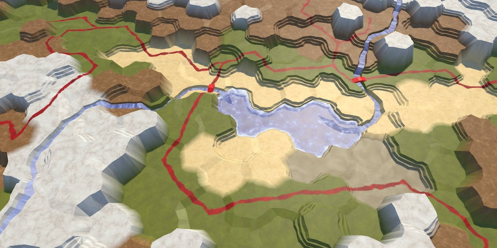 					Painting with textures. 				

## Blending Three Types

While uniform colors are clear and get the job done, they're not  very interesting to look at. Upgrading to textures can greatly increase  the appeal of our maps. Of course, that requires that we blend  textures, instead of just colors. The [Rendering 3, Combining Textures](https://catlikecoding.com/unity/tutorials/rendering/part-3/) tutorial shows how you can blend multiple textures, by using a splat map. We can use a similar approach for our hex maps.

The [Rendering 3](https://catlikecoding.com/unity/tutorials/rendering/part-3/)  tutorial only blends four textures, and could support up to five with a  single splat map. We currently use five different colors, so that could  work. However, we might want to add more types later. So we should  support an arbitrary amount of terrain types. This isn't possible with  explicit texture properties. Instead, we have to use a texture array.  We'll create one later.

When using texture arrays, we have to somehow tell the shader  which textures to blend. The most complex blend is required for corner  triangles, which can sit between three cells that each have a different  terrain type. So we have to support blending between three different  types per triangle.

### Using Vertex Colors as Splat Maps

Assuming we can communicate which textures to blend, we can use  vertex colors to create a splat map for each triangle. As there are at  most three textures in play at a time, we only need three color  channels. Red represents the first texture, green corresponds with the  second, and blue is for the third.

 							
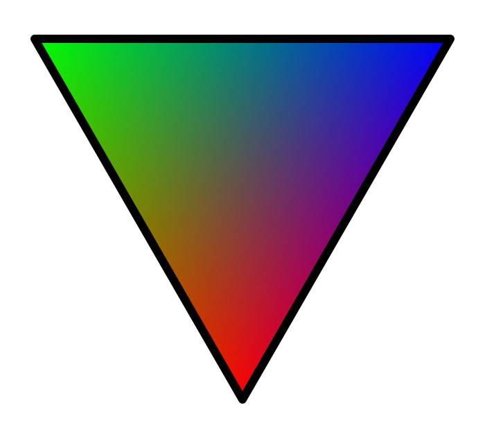 							Splat map triangle. 						

 							Does the splat map triangle always sum to one? 							 						

If a triangle requires only a single texture, we'll just use  the first channel. So its color will be solid red. In the case of a  blend between two different types, we'll use both the first and second  channel. So that triangle's color will be a blend between red and green.  And if all three types are in play, it's a blend between red, green,  and blue.

 							
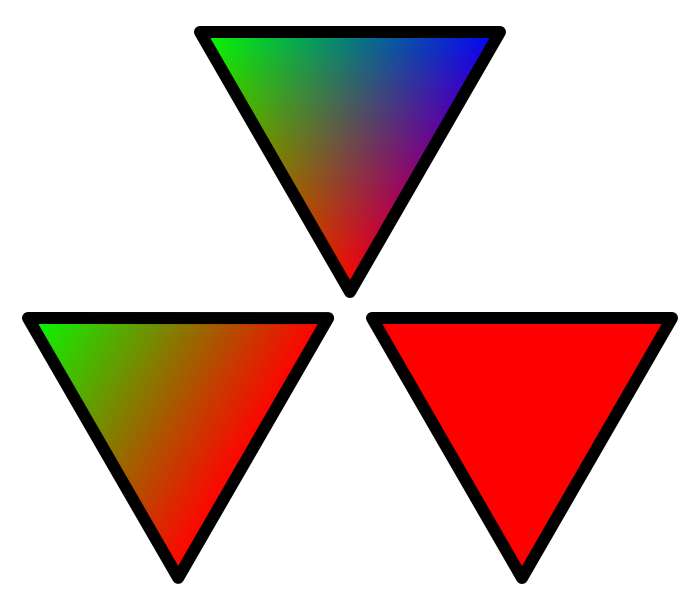 							Three splat map configurations. 						

We'll use these splat map configurations no matter which  textures are actually blended. So the splat map is always the same. It's  the textures that vary. We'll figure out how to do that later.

We have to update `**HexGridChunk**`  so it creates these splat maps, instead of using the cell colors.  Because we'll be using the three colors a lot, create static fields for  them.

```
	static Color color1 = new Color(1f, 0f, 0f);
	static Color color2 = new Color(0f, 1f, 0f);
	static Color color3 = new Color(0f, 0f, 1f);
```

### Cell Centers

Start by replacing the color of the default cell centers. There  is no blend going on here, so we simply use the first color, which is  red.

```
	void TriangulateWithoutRiver (
		HexDirection direction, HexCell cell, Vector3 center, EdgeVertices e
	) {
		TriangulateEdgeFan(center, e, color1);

		…
	}
```

 							
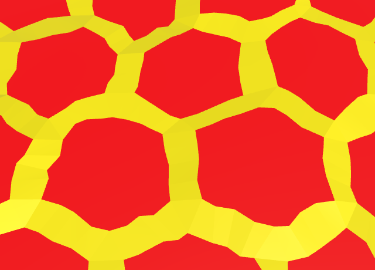 							Red cell centers. 						

The cell centers have now become red. They all use the first of  the three textures, no matter which texture that happens to be. Their  splat maps are identical, no matter which color you paint the cells. 					

### Adjacent to Rivers

We've only changed segments inside cells without rivers flowing  through them. We have to do the same for segments that are adjacent to  rivers. In this case, it's both an edge strip and an edge fan. Again,  red is all we need.

```
	void TriangulateAdjacentToRiver (
		HexDirection direction, HexCell cell, Vector3 center, EdgeVertices e
	) {
		…

		TriangulateEdgeStrip(m, color1, e, color1);
		TriangulateEdgeFan(center, m, color1);

		…
	}
```

 							
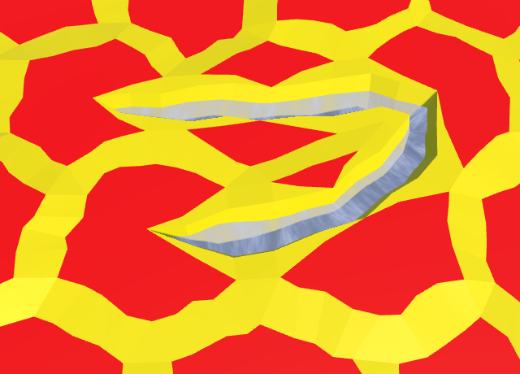 							Red segments adjacent to rivers. 						

### Rivers

Next, we have to take care of the river geometry inside the  cells. They should all become red too. First, the parts at the beginning  and end of rivers.

```
	void TriangulateWithRiverBeginOrEnd (
		HexDirection direction, HexCell cell, Vector3 center, EdgeVertices e
	) {
		…

		TriangulateEdgeStrip(m, color1, e, color1);
		TriangulateEdgeFan(center, m, color1);

		…
	}
```

And then the geometry that makes up the river banks and  channel. I've also grouped the color method invocations, so the code is  easier to read.

```
	void TriangulateWithRiver (
		HexDirection direction, HexCell cell, Vector3 center, EdgeVertices e
	) {
		…

		TriangulateEdgeStrip(m, color1, e, color1);

		terrain.AddTriangle(centerL, m.v1, m.v2);
//		terrain.AddTriangleColor(cell.Color);
		terrain.AddQuad(centerL, center, m.v2, m.v3);
//		terrain.AddQuadColor(cell.Color);
		terrain.AddQuad(center, centerR, m.v3, m.v4);
//		terrain.AddQuadColor(cell.Color);
		terrain.AddTriangle(centerR, m.v4, m.v5);
//		terrain.AddTriangleColor(cell.Color);
		
		terrain.AddTriangleColor(color1);
		terrain.AddQuadColor(color1);
		terrain.AddQuadColor(color1);
		terrain.AddTriangleColor(color1);

		…
	}
```

 							
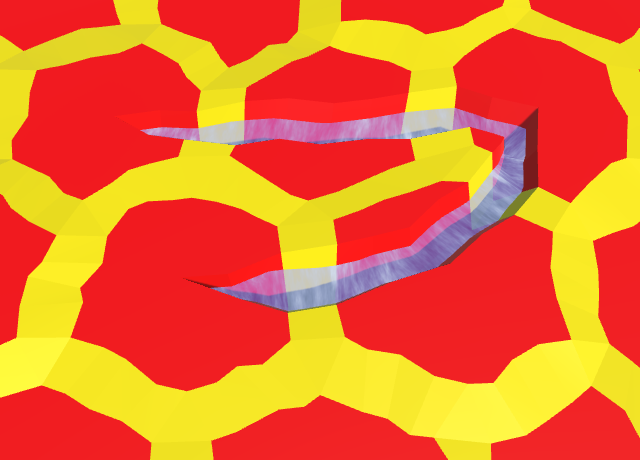 							Red rivers across cells. 						

### Edges

Edges are different, because they're between two cells, which  could have different terrain types. We'll use the first color for the  current cell's type, and the second color for its neighbor's type. As a  result, the splat map is a red-green gradient, even if both cells happen  to have the same type. If both cells use the same texture, then it will  simply become a blend between the same texture on both ends.

```
	void TriangulateConnection (
		HexDirection direction, HexCell cell, EdgeVertices e1
	) {
		…

		if (cell.GetEdgeType(direction) == HexEdgeType.Slope) {
			TriangulateEdgeTerraces(e1, cell, e2, neighbor, hasRoad);
		}
		else {
			TriangulateEdgeStrip(e1, color1, e2, color2, hasRoad);
		}

		…
	}
```

 							
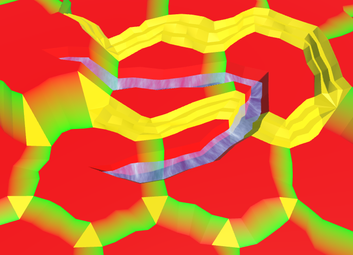 							Red-green edges, except for terraces. 						

 							Isn't the hard transition between red and green a problem? 							 						

Edges with terraces are more complex, because they have extra  vertices. Fortunately, the existing interpolation code works just fine  with our splat map colors. Simply use the first and second colors,  instead of those of the begin and end cells.

```
	void TriangulateEdgeTerraces (
		EdgeVertices begin, HexCell beginCell,
		EdgeVertices end, HexCell endCell,
		bool hasRoad
	) {
		EdgeVertices e2 = EdgeVertices.TerraceLerp(begin, end, 1);
		Color c2 = HexMetrics.TerraceLerp(color1, color2, 1);

		TriangulateEdgeStrip(begin, color1, e2, c2, hasRoad);

		for (int i = 2; i < HexMetrics.terraceSteps; i++) {
			EdgeVertices e1 = e2;
			Color c1 = c2;
			e2 = EdgeVertices.TerraceLerp(begin, end, i);
			c2 = HexMetrics.TerraceLerp(color1, color2, i);
			TriangulateEdgeStrip(e1, c1, e2, c2, hasRoad);
		}

		TriangulateEdgeStrip(e2, c2, end, color2, hasRoad);
	}
```

 							
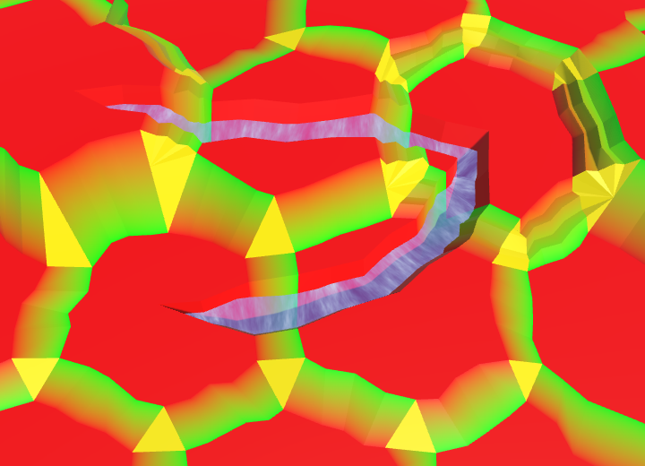 							Red-green edge terraces. 						

### Corners

Cell corners are the most complex, because they have to blend  three different textures. We'll use red for the bottom vertex, green for  the left vertex, and blue for the right vertex. We start with the  single-triangle corners.

```
	void TriangulateCorner (
		Vector3 bottom, HexCell bottomCell,
		Vector3 left, HexCell leftCell,
		Vector3 right, HexCell rightCell
	) {
		…
		else {
			terrain.AddTriangle(bottom, left, right);
			terrain.AddTriangleColor(color1, color2, color3);
		}

		features.AddWall(bottom, bottomCell, left, leftCell, right, rightCell);
	}
```

 							
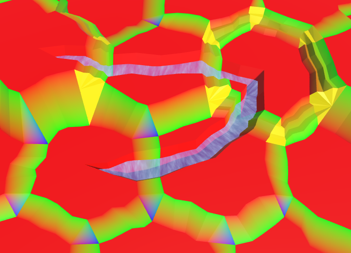 							Red-green-blue corners, except for terraces. 						

Again, we can use the existing color interpolation code for  corners with terraces. It's just between three colors, instead of two.  First, terraces that aren't next to cliffs.

```
	void TriangulateCornerTerraces (
		Vector3 begin, HexCell beginCell,
		Vector3 left, HexCell leftCell,
		Vector3 right, HexCell rightCell
	) {
		Vector3 v3 = HexMetrics.TerraceLerp(begin, left, 1);
		Vector3 v4 = HexMetrics.TerraceLerp(begin, right, 1);
		Color c3 = HexMetrics.TerraceLerp(color1, color2, 1);
		Color c4 = HexMetrics.TerraceLerp(color1, color3, 1);

		terrain.AddTriangle(begin, v3, v4);
		terrain.AddTriangleColor(color1, c3, c4);

		for (int i = 2; i < HexMetrics.terraceSteps; i++) {
			Vector3 v1 = v3;
			Vector3 v2 = v4;
			Color c1 = c3;
			Color c2 = c4;
			v3 = HexMetrics.TerraceLerp(begin, left, i);
			v4 = HexMetrics.TerraceLerp(begin, right, i);
			c3 = HexMetrics.TerraceLerp(color1, color2, i);
			c4 = HexMetrics.TerraceLerp(color1, color3, i);
			terrain.AddQuad(v1, v2, v3, v4);
			terrain.AddQuadColor(c1, c2, c3, c4);
		}

		terrain.AddQuad(v3, v4, left, right);
		terrain.AddQuadColor(c3, c4, color2, color3);
	}
```

 							
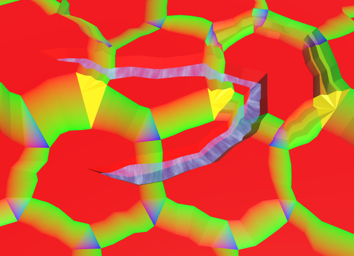 							Red-green-blue corner terraces, except along cliffs. 						

When cliffs are involved, we have to use the `TriangulateBoundaryTriangle`  method. This method used to have the begin and left cell as parameters.  However, we now need the relevant splat colors instead, which can vary  based on the topology. So change those parameters into colors.

```
	void TriangulateBoundaryTriangle (
		Vector3 begin, Color beginColor,
		Vector3 left, Color leftColor,
		Vector3 boundary, Color boundaryColor
	) {
		Vector3 v2 = HexMetrics.Perturb(HexMetrics.TerraceLerp(begin, left, 1));
		Color c2 = HexMetrics.TerraceLerp(beginColor, leftColor, 1);

		terrain.AddTriangleUnperturbed(HexMetrics.Perturb(begin), v2, boundary);
		terrain.AddTriangleColor(beginColor, c2, boundaryColor);

		for (int i = 2; i < HexMetrics.terraceSteps; i++) {
			Vector3 v1 = v2;
			Color c1 = c2;
			v2 = HexMetrics.Perturb(HexMetrics.TerraceLerp(begin, left, i));
			c2 = HexMetrics.TerraceLerp(beginColor, leftColor, i);
			terrain.AddTriangleUnperturbed(v1, v2, boundary);
			terrain.AddTriangleColor(c1, c2, boundaryColor);
		}

		terrain.AddTriangleUnperturbed(v2, HexMetrics.Perturb(left), boundary);
		terrain.AddTriangleColor(c2, leftColor, boundaryColor);
	}
```

Adjust `TriangulateCornerTerracesCliff` so it uses the correct colors.

```
	void TriangulateCornerTerracesCliff (
		Vector3 begin, HexCell beginCell,
		Vector3 left, HexCell leftCell,
		Vector3 right, HexCell rightCell
	) {
		…
		Color boundaryColor = Color.Lerp(color1, color3, b);

		TriangulateBoundaryTriangle(
			begin, color1, left, color2, boundary, boundaryColor
		);

		if (leftCell.GetEdgeType(rightCell) == HexEdgeType.Slope) {
			TriangulateBoundaryTriangle(
				left, color2, right, color3, boundary, boundaryColor
			);
		}
		else {
			terrain.AddTriangleUnperturbed(
				HexMetrics.Perturb(left), HexMetrics.Perturb(right), boundary
			);
			terrain.AddTriangleColor(color2, color3, boundaryColor);
		}
	}
```

And do the same for `TriangulateCornerCliffTerraces`.

```
	void TriangulateCornerCliffTerraces (
		Vector3 begin, HexCell beginCell,
		Vector3 left, HexCell leftCell,
		Vector3 right, HexCell rightCell
	) {
		…
		Color boundaryColor = Color.Lerp(color1, color2, b);

		TriangulateBoundaryTriangle(
			right, color3, begin, color1, boundary, boundaryColor
		);

		if (leftCell.GetEdgeType(rightCell) == HexEdgeType.Slope) {
			TriangulateBoundaryTriangle(
				left, color2, right, color3, boundary, boundaryColor
			);
		}
		else {
			terrain.AddTriangleUnperturbed(
				HexMetrics.Perturb(left), HexMetrics.Perturb(right), boundary
			);
			terrain.AddTriangleColor(color2, color3, boundaryColor);
		}
	}
```

 							
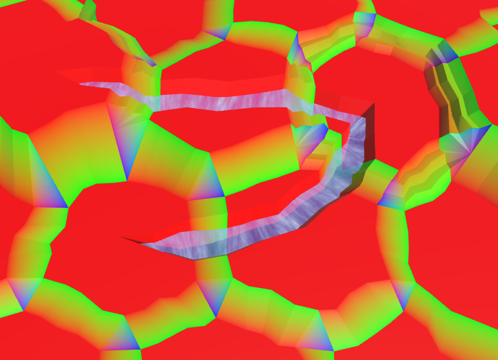 							Complete terrain splat map. 						

unitypackage

## Texture Arrays

Now that our terrain has a splat map, we have to supply our  shader with a collection of textures. We can't just assign a C# array of  textures to a shader, because the array has to exist as a single entity  in GPU memory. We have to use a special `Texture2DArray` object, which has been supported by Unity since version 5.4.

 						Do all GPUs support texture arrays? 						 					

### Wizard

Unfortunately, Unity's editor support for texture arrays is  minimal in version 5.5. We cannot simply create a texture array asset  and assign textures to it. We have to do it manually. We could either  create a texture array in play mode, or create an asset in the editor.  Let's go for the asset.

 							Why create an asset? 							 						

To create our texture array, we'll build a custom wizard. Create a `**TextureArrayWizard**` script and place it inside an *Editor* folder. Instead of `MonoBehaviour`, it should extend the `ScriptableWizard` type from the `UnityEditor` namespace.

```
using UnityEditor;
using UnityEngine;

public class TextureArrayWizard : ScriptableWizard {
}
```

We can open our wizard via the generic static `ScriptableWizard.DisplayWizard` method. Its parameters are the names of the wizard's window and its create button. Invoke this method in a static `CreateWizard` method.

```
	static void CreateWizard () {
		ScriptableWizard.DisplayWizard<TextureArrayWizard>(
			"Create Texture Array", "Create"
		);
	}
```

To access the wizard via the editor, we have to add this method to Unity's menu. This is done by adding the `MenuItem` attribute to the method. Let's add it to the *Assets* menu, specifically *Assets / Create / Texture Array*.

```
	[MenuItem("Assets/Create/Texture Array")]
	static void CreateWizard () {
		…
	}
```

 							
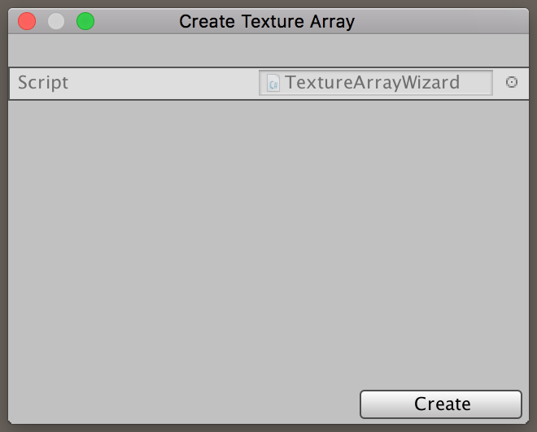 							Our custom wizard. 						

Using the new menu item, we get a popup window for our custom  wizard. It's not pretty, but it will get the job done. However, it is  still empty. To create the texture array, we need an array of textures.  Add a public field for this to our wizard. The default wizard GUI will  display it, just like a default inspector does.

```
	public Texture2D[] textures;
```

 							
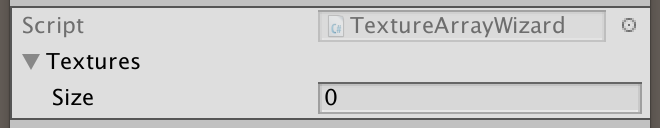 							Wizard with textures. 						

### Creating Something

When you press the wizard's *Create* button, it will disappear. Also, Unity will complain that there's no `OnWizardCreate` method. This is the method that gets invoked when the create button is pressed, so we should add it to our wizard.

```
	void OnWizardCreate () {
	}
```

Here is where we create our texture array. At least, if the  user has added any textures to the wizard. If not, then there's nothing  to create, so we should abort.

```
	void OnWizardCreate () {
		if (textures.Length == 0) {
			return;
		}
	}
```

The next step is to ask the user where to save the texture array asset. We can open a save file panel via the `EditorUtility.SaveFilePanelInProject`  method. Its parameters determine the panel name, default file name, the  file extension, and description. Texture arrays use the generic *asset* file extension.

```
		if (textures.Length == 0) {
			return;
		}
		EditorUtility.SaveFilePanelInProject(
			"Save Texture Array", "Texture Array", "asset", "Save Texture Array"
		);
```

`SaveFilePanelInProject` returns the file path that  the user selected. If the user canceled the panel, then the path will be  the empty string. So we should abort in that case.

```
		string path = EditorUtility.SaveFilePanelInProject(
			"Save Texture Array", "Texture Array", "asset", "Save Texture Array"
		);
		if (path.Length == 0) {
			return;
		}
```

### Creating a Texture Array

If we got a valid path, we can go on and create a new `Texture2DArray`  object. Its constructor method requires the texture width and height,  the array length, the texture format, and whether there are mipmaps.  These settings have to be the same for all textures in the array. We'll  use the first texture to configure the object. It's up to the user to  make sure that all textures have the same format.

```
		if (path.Length == 0) {
			return;
		}

		Texture2D t = textures[0];
		Texture2DArray textureArray = new Texture2DArray(
			t.width, t.height, textures.Length, t.format, t.mipmapCount > 1
		);
```

As the texture array is a single GPU resource, it uses the same  filter and wrap modes for all textures. Once again, we'll use the first  texture to configure this.

```
		Texture2DArray textureArray = new Texture2DArray(
			t.width, t.height, textures.Length, t.format, t.mipmapCount > 1
		);
		textureArray.anisoLevel = t.anisoLevel;
		textureArray.filterMode = t.filterMode;
		textureArray.wrapMode = t.wrapMode;
```

Now we can copy the textures to the array, using the `Graphics.CopyTexture`  method. This method copies the raw texture data, one mip level at a  time. So we have to loop through all textures and their mip levels. The  parameters of the method are two sets consisting of a texture resource,  index, and mip level. As the source textures aren't arrays, their index  is always zero.

```
		textureArray.wrapMode = t.wrapMode;

		for (int i = 0; i < textures.Length; i++) {
			for (int m = 0; m < t.mipmapCount; m++) {
				Graphics.CopyTexture(textures[i], 0, m, textureArray, i, m);
			}
		}
```

At this point we have a valid texture array in memory, but it is not yet an asset. The final step is to invoke `AssetDatabase.CreateAsset` with the array and its path. That will write the data to a file in our project, and it will appear in the project window.

```
		for (int i = 0; i < textures.Length; i++) {
			…
		}

		AssetDatabase.CreateAsset(textureArray, path);
```

### Textures

To actually create a texture array, we need source textures.  Here are five textures which correspond to the colors that we have been  using up to this point. Yellow becomes sand, green becomes grass, blue  becomes mud, orange becomes stone, and white becomes snow.

 							 							 							 							 							 							Sand, grass, mud, stone, and snow textures. 						

Note that these textures aren't photos of actual terrain. They're subtle pseudorandom patterns, which I created using [NumberFlow](https://catlikecoding.com/numberflow/).  My goal was to suggest recognizable terrain types and details, without  clashing with the abstract polygonal terrain. Photorealism would feel  out of place. Also, while these patterns add variety, they lack distinct  features which would make their tiling immediately obvious.

Add these textures to the wizard's array, making sure that  their order matches our colors. So sand first, followed by grass, mud,  stone, and finally snow.

 							 							 							Creating the texture array. 						

After creating the texture array asset, select it and give it a look in the inspector.

 							
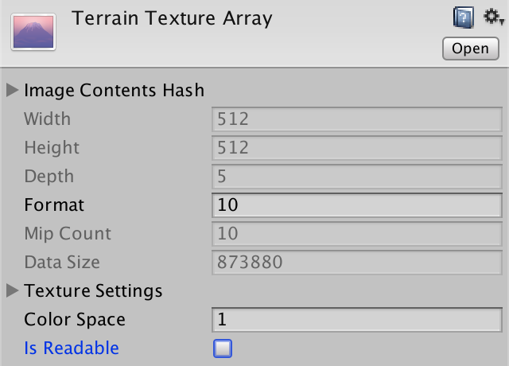 							Texture array inspector. 						

It's a bare-bones display of some of the data of the texture array. Note that there is an *Is Readable*  toggle, which is initially enabled. As we don't need to read pixel data  from the array, disable it. We couldn't do this via our wizard, because  `Texture2DArray` has no method or property to access this setting.

(There is a bug in Unity 5.6 that breaks texture arrays in builds on multiple platforms. The workaround is to keep *Is Readable* enabled. Also, in later versions of Unity you need to set the inspector to debug mode to see most of the data.)

Also note that there is a *Color Space*  field, which is set to 1. This means that the textures are assumed to be  in gamma space, which is correct. If they had to be in linear space, we  would have to set this field to 0. The constructor of `Texture2DArray` actually has an extra parameter to set the color space, however `Texture2D` doesn't expose whether it's in linear space or not, so you'd have to set it manually anyway.

### Shader

Now that we have our texture array, it's time to make our shader work with it. We're currently using the *VertexColors* shader to render our terrain. As we'll switch to textures instead of colors, rename it to *Terrain*. Then turn its *_MainTex* parameter into a texture array, and assign our asset to it.

```
Shader "Custom/Terrain" {
	Properties {
		_Color ("Color", Color) = (1,1,1,1)
		_MainTex ("Terrain Texture Array", 2DArray) = "white" {}
		_Glossiness ("Smoothness", Range(0,1)) = 0.5
		_Metallic ("Metallic", Range(0,1)) = 0.0
	}
	…
}
```

 							
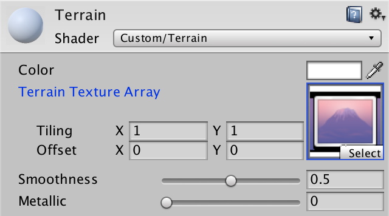 							Terrain material with texture array. 						

To enable texture arrays on all platforms that support it, we have to increase our shader target level from 3.0 to 3.5.

```
		#pragma target 3.5
```

As the `_MainTex` variable now  references a texture array, we have to change its type. The exact type  depends on the target platform, which is taken care of by the `**UNITY_DECLARE_TEX2DARRAY**` macro.

```
//		sampler2D _MainTex;
		UNITY_DECLARE_TEX2DARRAY(_MainTex);
```

Like the other shaders, we'll need the XZ world coordinates to  sample our terrain textures. So add the world position to the surface  shader input structure. Also remove the default UV coordinates, as we  don't need them.

```
		struct Input {
//			float2 uv_MainTex;
			float4 color : COLOR;
			float3 worldPos;
		};
```

To sample the texture array, we have to use the `**UNITY_SAMPLE_TEX2DARRAY**`  macro. It requires three coordinates to sample the array. The first two  are regular UV coordinates. We'll use the world XZ coordinates, scaled  by 0.02. That produces a good texture resolution when fully zoomed in,  with textures tiling roughly every four cells.

The third coordinate is used to index the texture array, just  like a regular array. As the coordinates are floats, the GPU rounds them  before indexing the array. As we don't yet know which texture is  needed, let's always use the first one. Also, no longer factor the  vertex color into the final result, as that's the splat map.

```
		void surf (Input IN, inout SurfaceOutputStandard o) {
			float2 uv = IN.worldPos.xz * 0.02;
			fixed4 c = UNITY_SAMPLE_TEX2DARRAY(_MainTex, float3(uv, 0));
			o.Albedo = c.rgb * _Color;
			o.Metallic = _Metallic;
			o.Smoothness = _Glossiness;
			o.Alpha = c.a;
		}
```

 							
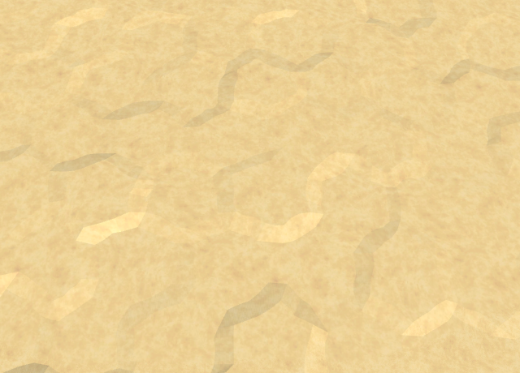 							Everything is sand. 						

unitypackage

## Selecting Textures

We have a terrain splat map which blends between three types per  triangle. We have a texture array with a texture for each terrain type.  We have a shader that can sample the texture array. But we do not yet  have a means to tell the shader which textures to select, per triangle.

As each triangle blends between up to three types, we need to  associate three indices with every triangle. As we cannot store  information per triangle, we'll have to store the indices per vertex  instead. All three vertices of a triangle will simply store the same  indices, just like a solid color.

### Mesh Data

We can use one of the mesh's UV sets to store the indices.  Because there are three indices per vertex, the existing 2D UV sets  aren't sufficient. Fortunately, UV sets can contain up to four  coordinates. So let's add a second `Vector3` list to `**HexMesh**`, which we'll refer to as the terrain types.

```
	public bool useCollider, useColors, useUVCoordinates, useUV2Coordinates;
	public bool useTerrainTypes;

	[NonSerialized] List<Vector3> vertices, terrainTypes;
```

Enable the terrain types for the *Terrain* child object of the *Hex Grid Chunk* prefab.

 							
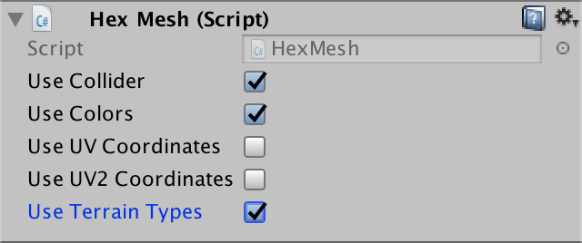 							Using terrain types. 						

Grab another `Vector3` list for the terrain types when clearing the mesh, if needed.

```
	public void Clear () {
		…
		if (useTerrainTypes) {
			terrainTypes = ListPool<Vector3>.Get();
		}
		triangles = ListPool<int>.Get();
	}
```

When applying the mesh data, store the terrain types in the  third UV set. That way, it won't clash with the other two sets, if we  were to ever use them together.

```
	public void Apply () {
		…
		if (useTerrainTypes) {
			hexMesh.SetUVs(2, terrainTypes);
			ListPool<Vector3>.Add(terrainTypes);
		}
		hexMesh.SetTriangles(triangles, 0);
		…
	}
```

We'll use a `Vector3` to set the terrain types of a triangle. As they're uniform across a triangle, simply add the same data three times.

```
	public void AddTriangleTerrainTypes (Vector3 types) {
		terrainTypes.Add(types);
		terrainTypes.Add(types);
		terrainTypes.Add(types);
	}
```

Blending across a quad works the same way. All four vertices have the same types.

```
	public void AddQuadTerrainTypes (Vector3 types) {
		terrainTypes.Add(types);
		terrainTypes.Add(types);
		terrainTypes.Add(types);
		terrainTypes.Add(types);
	}
```

### Edge Fans

Now we have to add the types to the mesh data in `**HexGridChunk**`. Let's start with `TriangulateEdgeFan`.  First, let's separate the vertex and color method invocations, for  readability. Also recall that everywhere we invoke this method, we  supply it with `color1`. So we can use that color directly, instead of relying on the parameter.

```
	void TriangulateEdgeFan (Vector3 center, EdgeVertices edge, Color color) {
		terrain.AddTriangle(center, edge.v1, edge.v2);
//		terrain.AddTriangleColor(color);
		terrain.AddTriangle(center, edge.v2, edge.v3);
//		terrain.AddTriangleColor(color);
		terrain.AddTriangle(center, edge.v3, edge.v4);
//		terrain.AddTriangleColor(color);
		terrain.AddTriangle(center, edge.v4, edge.v5);
//		terrain.AddTriangleColor(color);
		
		terrain.AddTriangleColor(color1);
		terrain.AddTriangleColor(color1);
		terrain.AddTriangleColor(color1);
		terrain.AddTriangleColor(color1);
	}
```

After the colors, we add the terrain types. As the type varies  per triangle, it has to be a parameter, replacing the color. Use this  single type to construct a `Vector3`.  Only the first channel matters, because the splat map is always red in  this case. As all three vector components need to be set to something,  let's set them all to the same type.

```
	void TriangulateEdgeFan (Vector3 center, EdgeVertices edge, float type) {
		…

		Vector3 types;
		types.x = types.y = types.z = type;
		terrain.AddTriangleTerrainTypes(types);
		terrain.AddTriangleTerrainTypes(types);
		terrain.AddTriangleTerrainTypes(types);
		terrain.AddTriangleTerrainTypes(types);
	}
```

Now we have to adjust all invocations of this method, replacing  the color argument with the cell's terrain type index. Make this  adjustment in `TriangulateWithoutRiver`, `TriangulateAdjacentToRiver`, and `TriangulateWithRiverBeginOrEnd`.

```
//		TriangulateEdgeFan(center, e, color1);
		TriangulateEdgeFan(center, e, cell.TerrainTypeIndex);
```

At this point, entering play mode will produce errors which say  that the third UV sets of the meshes are out of bounds. That's because  we're not yet adding the terrain types to every triangle and quad. So  let's continue updating `**HexGridChunk**`.

### Edge Strips

When creating an edge strip, we now have to know what the  terrain types on both side are. So add them as parameters. Then  construct a types vector with the first two channels set to these types.  The third channel doesn't matter, just make it equal to the first. Add  the types to the quads after adding the colors.

```
	void TriangulateEdgeStrip (
		EdgeVertices e1, Color c1, float type1,
		EdgeVertices e2, Color c2, float type2,
		bool hasRoad = false
	) {
		terrain.AddQuad(e1.v1, e1.v2, e2.v1, e2.v2);
		terrain.AddQuad(e1.v2, e1.v3, e2.v2, e2.v3);
		terrain.AddQuad(e1.v3, e1.v4, e2.v3, e2.v4);
		terrain.AddQuad(e1.v4, e1.v5, e2.v4, e2.v5);

		terrain.AddQuadColor(c1, c2);
		terrain.AddQuadColor(c1, c2);
		terrain.AddQuadColor(c1, c2);
		terrain.AddQuadColor(c1, c2);

		Vector3 types;
		types.x = types.z = type1;
		types.y = type2;
		terrain.AddQuadTerrainTypes(types);
		terrain.AddQuadTerrainTypes(types);
		terrain.AddQuadTerrainTypes(types);
		terrain.AddQuadTerrainTypes(types);

		if (hasRoad) {
			TriangulateRoadSegment(e1.v2, e1.v3, e1.v4, e2.v2, e2.v3, e2.v4);
		}
	}
```

Now we have to update the invocations of `TriangulateEdgeStrip`. First, `TriangulateAdjacentToRiver`, `TriangulateWithRiverBeginOrEnd`, and `TriangulateWithRiver` have to use the cell's type for both sides of the edge strip.

```
//		TriangulateEdgeStrip(m, color1, e, color1);
		TriangulateEdgeStrip(
			m, color1, cell.TerrainTypeIndex,
			e, color1, cell.TerrainTypeIndex
		);
```

Next, the simplest edge case of `TriangulateConnection`  has to use the cell's type for the near edge, and the neighbor's type  for the far edge. They might be the same, but could also be different.

```
	void TriangulateConnection (
		HexDirection direction, HexCell cell, EdgeVertices e1
	) {
		…
		if (cell.GetEdgeType(direction) == HexEdgeType.Slope) {
			TriangulateEdgeTerraces(e1, cell, e2, neighbor, hasRoad);
		}
		else {
//			TriangulateEdgeStrip(e1, color1, e2, color2, hasRoad);
			TriangulateEdgeStrip(
				e1, color1, cell.TerrainTypeIndex,
				e2, color2, neighbor.TerrainTypeIndex, hasRoad
			);
		}
		…
	}
```

The same is true in `TriangulateEdgeTerraces`, which invokes `TriangulateEdgeStrip` three times. The types are uniform across the terraces.

```
	void TriangulateEdgeTerraces (
		EdgeVertices begin, HexCell beginCell,
		EdgeVertices end, HexCell endCell,
		bool hasRoad
	) {
		EdgeVertices e2 = EdgeVertices.TerraceLerp(begin, end, 1);
		Color c2 = HexMetrics.TerraceLerp(color1, color2, 1);
		float t1 = beginCell.TerrainTypeIndex;
		float t2 = endCell.TerrainTypeIndex;

		TriangulateEdgeStrip(begin, color1, t1, e2, c2, t2, hasRoad);

		for (int i = 2; i < HexMetrics.terraceSteps; i++) {
			EdgeVertices e1 = e2;
			Color c1 = c2;
			e2 = EdgeVertices.TerraceLerp(begin, end, i);
			c2 = HexMetrics.TerraceLerp(color1, color2, i);
			TriangulateEdgeStrip(e1, c1, t1, e2, c2, t2, hasRoad);
		}

		TriangulateEdgeStrip(e2, c2, t1, end, color2, t2, hasRoad);
	}
```

### Corners

The simplest corner case is a single triangle. The bottom cell  provides the first type, the left cell the second, and the right cell  the third. Construct a types vector with them and add it to the  triangle.

```
	void TriangulateCorner (
		Vector3 bottom, HexCell bottomCell,
		Vector3 left, HexCell leftCell,
		Vector3 right, HexCell rightCell
	) {
		…
		else {
			terrain.AddTriangle(bottom, left, right);
			terrain.AddTriangleColor(color1, color2, color3);
			Vector3 types;
			types.x = bottomCell.TerrainTypeIndex;
			types.y = leftCell.TerrainTypeIndex;
			types.z = rightCell.TerrainTypeIndex;
			terrain.AddTriangleTerrainTypes(types);
		}

		features.AddWall(bottom, bottomCell, left, leftCell, right, rightCell);
	}
```

We use the same approach in `TriangulateCornerTerraces`, except that we're creating a bunch of quads as well.

```
	void TriangulateCornerTerraces (
		Vector3 begin, HexCell beginCell,
		Vector3 left, HexCell leftCell,
		Vector3 right, HexCell rightCell
	) {
		Vector3 v3 = HexMetrics.TerraceLerp(begin, left, 1);
		Vector3 v4 = HexMetrics.TerraceLerp(begin, right, 1);
		Color c3 = HexMetrics.TerraceLerp(color1, color2, 1);
		Color c4 = HexMetrics.TerraceLerp(color1, color3, 1);
		Vector3 types;
		types.x = beginCell.TerrainTypeIndex;
		types.y = leftCell.TerrainTypeIndex;
		types.z = rightCell.TerrainTypeIndex;

		terrain.AddTriangle(begin, v3, v4);
		terrain.AddTriangleColor(color1, c3, c4);
		terrain.AddTriangleTerrainTypes(types);

		for (int i = 2; i < HexMetrics.terraceSteps; i++) {
			Vector3 v1 = v3;
			Vector3 v2 = v4;
			Color c1 = c3;
			Color c2 = c4;
			v3 = HexMetrics.TerraceLerp(begin, left, i);
			v4 = HexMetrics.TerraceLerp(begin, right, i);
			c3 = HexMetrics.TerraceLerp(color1, color2, i);
			c4 = HexMetrics.TerraceLerp(color1, color3, i);
			terrain.AddQuad(v1, v2, v3, v4);
			terrain.AddQuadColor(c1, c2, c3, c4);
			terrain.AddQuadTerrainTypes(types);
		}

		terrain.AddQuad(v3, v4, left, right);
		terrain.AddQuadColor(c3, c4, color2, color3);
		terrain.AddQuadTerrainTypes(types);
	}
```

When terraces and cliffs mix, we need to use `TriangulateBoundaryTriangle`. Simply give it a types vector parameter, and add it to all its triangles.

```
	void TriangulateBoundaryTriangle (
		Vector3 begin, Color beginColor,
		Vector3 left, Color leftColor,
		Vector3 boundary, Color boundaryColor, Vector3 types
	) {
		Vector3 v2 = HexMetrics.Perturb(HexMetrics.TerraceLerp(begin, left, 1));
		Color c2 = HexMetrics.TerraceLerp(beginColor, leftColor, 1);

		terrain.AddTriangleUnperturbed(HexMetrics.Perturb(begin), v2, boundary);
		terrain.AddTriangleColor(beginColor, c2, boundaryColor);
		terrain.AddTriangleTerrainTypes(types);

		for (int i = 2; i < HexMetrics.terraceSteps; i++) {
			Vector3 v1 = v2;
			Color c1 = c2;
			v2 = HexMetrics.Perturb(HexMetrics.TerraceLerp(begin, left, i));
			c2 = HexMetrics.TerraceLerp(beginColor, leftColor, i);
			terrain.AddTriangleUnperturbed(v1, v2, boundary);
			terrain.AddTriangleColor(c1, c2, boundaryColor);
			terrain.AddTriangleTerrainTypes(types);
		}

		terrain.AddTriangleUnperturbed(v2, HexMetrics.Perturb(left), boundary);
		terrain.AddTriangleColor(c2, leftColor, boundaryColor);
		terrain.AddTriangleTerrainTypes(types);
	}
```

In `TriangulateCornerTerracesCliff`, create a types vector using the provided cells. Then add it to the single triangle and pass it to `TriangulateBoundaryTriangle`.

```
	void TriangulateCornerTerracesCliff (
		Vector3 begin, HexCell beginCell,
		Vector3 left, HexCell leftCell,
		Vector3 right, HexCell rightCell
	) {
		float b = 1f / (rightCell.Elevation - beginCell.Elevation);
		if (b < 0) {
			b = -b;
		}
		Vector3 boundary = Vector3.Lerp(
			HexMetrics.Perturb(begin), HexMetrics.Perturb(right), b
		);
		Color boundaryColor = Color.Lerp(color1, color3, b);
		Vector3 types;
		types.x = beginCell.TerrainTypeIndex;
		types.y = leftCell.TerrainTypeIndex;
		types.z = rightCell.TerrainTypeIndex;

		TriangulateBoundaryTriangle(
			begin, color1, left, color2, boundary, boundaryColor, types
		);

		if (leftCell.GetEdgeType(rightCell) == HexEdgeType.Slope) {
			TriangulateBoundaryTriangle(
				left, color2, right, color3, boundary, boundaryColor, types
			);
		}
		else {
			terrain.AddTriangleUnperturbed(
				HexMetrics.Perturb(left), HexMetrics.Perturb(right), boundary
			);
			terrain.AddTriangleColor(color2, color3, boundaryColor);
			terrain.AddTriangleTerrainTypes(types);
		}
	}
```

The same goes for `TriangulateCornerCliffTerraces`.

```
	void TriangulateCornerCliffTerraces (
		Vector3 begin, HexCell beginCell,
		Vector3 left, HexCell leftCell,
		Vector3 right, HexCell rightCell
	) {
		float b = 1f / (leftCell.Elevation - beginCell.Elevation);
		if (b < 0) {
			b = -b;
		}
		Vector3 boundary = Vector3.Lerp(
			HexMetrics.Perturb(begin), HexMetrics.Perturb(left), b
		);
		Color boundaryColor = Color.Lerp(color1, color2, b);
		Vector3 types;
		types.x = beginCell.TerrainTypeIndex;
		types.y = leftCell.TerrainTypeIndex;
		types.z = rightCell.TerrainTypeIndex;

		TriangulateBoundaryTriangle(
			right, color3, begin, color1, boundary, boundaryColor, types
		);

		if (leftCell.GetEdgeType(rightCell) == HexEdgeType.Slope) {
			TriangulateBoundaryTriangle(
				left, color2, right, color3, boundary, boundaryColor, types
			);
		}
		else {
			terrain.AddTriangleUnperturbed(
				HexMetrics.Perturb(left), HexMetrics.Perturb(right), boundary
			);
			terrain.AddTriangleColor(color2, color3, boundaryColor);
			terrain.AddTriangleTerrainTypes(types);
		}
	}
```

### Rivers

The last method that requires an update is `TriangulateWithRiver`.  As we're inside a cell center here, we're dealing with the current  cell's type only. So create a vector for it and add it to the triangles  and quads.

```
	void TriangulateWithRiver (
		HexDirection direction, HexCell cell, Vector3 center, EdgeVertices e
	) {
		…

		terrain.AddTriangleColor(color1);
		terrain.AddQuadColor(color1);
		terrain.AddQuadColor(color1);
		terrain.AddTriangleColor(color1);

		Vector3 types;
		types.x = types.y = types.z = cell.TerrainTypeIndex;
		terrain.AddTriangleTerrainTypes(types);
		terrain.AddQuadTerrainTypes(types);
		terrain.AddQuadTerrainTypes(types);
		terrain.AddTriangleTerrainTypes(types);

		…
	}
```

### Blending the Types

By now the meshes contain the required terrain indices. All that's left is for the *Terrain*  shader to actually use them. To get the indices to the fragment shader,  we have to pass them through the vertex shader first. We can do so with  a custom vertex function, just like we did in the *Estuary* shader. In this case, we add a `**float3** terrain` field to the input structure and copy `v.texcoord2.**xyz**` to it.

```
		#pragma surface surf Standard fullforwardshadows vertex:vert
		#pragma target 3.5

		…

		struct Input {
			float4 color : COLOR;
			float3 worldPos;
			float3 terrain;
		};
		
		void vert (inout appdata_full v, out Input data) {
			UNITY_INITIALIZE_OUTPUT(Input, data);
			data.terrain = v.texcoord2.xyz;
		}
```

We have to sample the texture array three times per fragment.  So let's create a convenient function to construct the texture  coordinates, sample the array, and modulate the sample with the splat  map for one index.

```
		float4 GetTerrainColor (Input IN, int index) {
			float3 uvw = float3(IN.worldPos.xz * 0.02, IN.terrain[index]);
			float4 c = UNITY_SAMPLE_TEX2DARRAY(_MainTex, uvw);
			return c * IN.color[index];
		}

		void surf (Input IN, inout SurfaceOutputStandard o) {
			…
		}
```

 							Can you treat a vector as an array? 							 						

Using this function, it's simple to sample the texture array three times and combine the results.

```
		void surf (Input IN, inout SurfaceOutputStandard o) {
//			float2 uv = IN.worldPos.xz * 0.02;
			fixed4 c =
				GetTerrainColor(IN, 0) +
				GetTerrainColor(IN, 1) +
				GetTerrainColor(IN, 2);
			o.Albedo = c.rgb * _Color;
			o.Metallic = _Metallic;
			o.Smoothness = _Glossiness;
			o.Alpha = c.a;
		}
```

 							
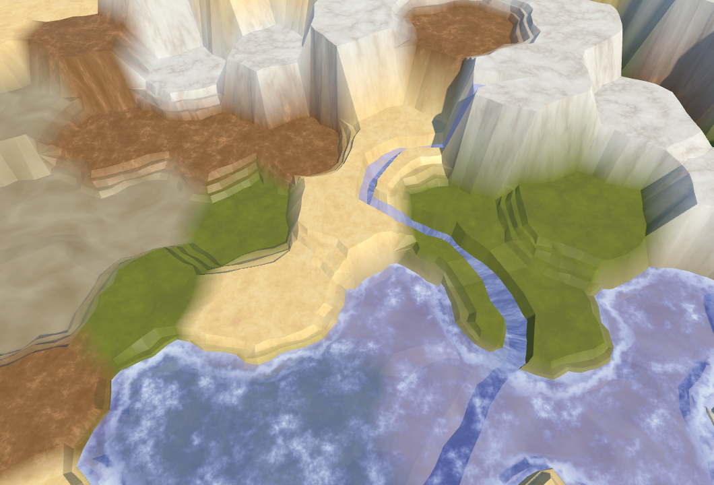 							Textured terrain. 						

We can now paint our terrain with textures. They blend just  like the solid colors did. Because we're using the world position as UV  coordinates, they don't change with altitude. As a result, the textures  are stretched along steep cliffs. If the textures are neutral enough and  have plenty of variety, the results can be acceptable. Otherwise,  you'll get big ugly streaks. You could try to hide that with additional  geometry or cliff textures, but that's not part of this tutorial.

### Cleaning Up

Now that we're using textures instead of colors, it makes sense  to adjust our editor panel. You could make a neat interface which even  shows the terrain textures, but I'll settle for abbreviations that fit  the existing layout.

 							
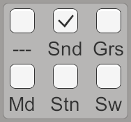 							Terrain choices. 						

Also, `**HexCell**` no longer needs a color property, so delete it.

```
//	public Color Color {
//		get {
//			return HexMetrics.colors[terrainTypeIndex];
//		}
//	}
```

The color array and associated code can also be removed from `**HexGrid**`.

```
//	public Color[] colors;

	…

	void Awake () {
		HexMetrics.noiseSource = noiseSource;
		HexMetrics.InitializeHashGrid(seed);
//		HexMetrics.colors = colors;
		CreateMap(cellCountX, cellCountZ);
	}
	
	…

	…

	void OnEnable () {
		if (!HexMetrics.noiseSource) {
			HexMetrics.noiseSource = noiseSource;
			HexMetrics.InitializeHashGrid(seed);
//			HexMetrics.colors = colors;
		}
	}
```

And finally, `**HexMetrics**` no longer needs the color array either.

```
//	public static Color[] colors;
```

The next tutorial is [Distances](https://catlikecoding.com/unity/tutorials/hex-map/part-15/).

unitypackage

PDF
