# Hex Map 27

Wrapping

- Split maps into columns that can move.
- Keep the map centered on the camera.
- Wrap everything.

This is part 27 of a tutorial series about [hexagon maps](https://catlikecoding.com/unity/tutorials/hex-map/). The [previous part](https://catlikecoding.com/unity/tutorials/hex-map/part-26/)  completed the procedural terrain generator. In this final installment  we add support for wrapping the map, by connecting the east and west  edges.

This tutorial is made with Unity 2017.3.0p3.

 					
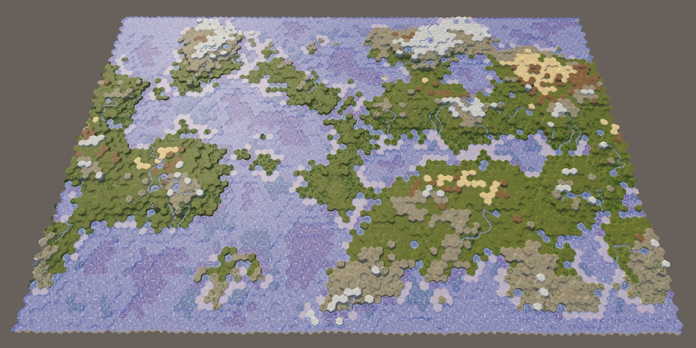 					Wrapping makes the world go round. 				

## Wrapping Maps

Our maps can be used to represent areas of varying sizes, but  they're always constrained to a rectangular shape. We could make a map  for a single island or an entire continent, but not an entire planet.  Planets are spherical, without hard boundaries to block travel on their  surface. Keep going in one direction, and at some point you'll come back  to where you started.

We cannot wrap a hexagonal grid around a sphere, such a tiling  is impossible. The best approximations use an icosahedral topology,  which requires twelve cells to be pentagons. However, wrapping the grid  around a cylinder is possible without distortions or exceptions. This is  simply a matter of connecting the east and west sides of the map.  Besides the wrapping logic, everything else can remain the same.

A cylinder is a poor approximation of a sphere, as it cannot  represent the poles. But this hasn't stopped many games from using  east–west wrapping to represent planetary maps. The polar regions are  simply not part of the playable area.

 						What about wrapping north and south too? 						 					

There are two ways to approach cylindrical wrapping. The first  approach is to actually make the map cylindrical, bending its surface  and everything on it so the east and west sides touch each other. You're  no longer playing on a flat surface, but a real cylinder. The second  approach is to stick with a flat map and use teleportation or  duplication to make the wrapping work. Most games use the second  approach and so will we.

### Optional Wrapping

Whether you want a wrapping map depends on whether you're going  for a local or planetary scale. We can support both by making wrapping  optional. Add a new toggle to the *Create New Map* menu to make this possible, with wrapping as the default choice.

 							
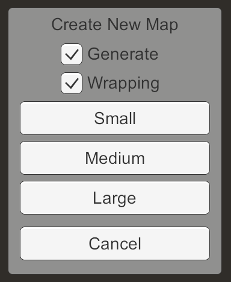 							New map menu with wrapping option. 						

Add a field to keep track of this choice in `**NewMapMenu**`, along with a method to change it. Have the new toggle invoke this method when its state changes.

```
	bool wrapping = true;

	…

	public void ToggleWrapping (bool toggle) {
		wrapping = toggle;
	}
```

When a new map is requested, pass along whether it should wrap.

```
	void CreateMap (int x, int z) {
		if (generateMaps) {
			mapGenerator.GenerateMap(x, z, wrapping);
		}
		else {
			hexGrid.CreateMap(x, z, wrapping);
		}
		HexMapCamera.ValidatePosition();
		Close();
	}
```

Adjust `**HexMapGenerator**.GenerateMap` so it accepts this new argument, then passes it on to `**HexGrid**.CreateMap`.

```
	public void GenerateMap (int x, int z, bool wrapping) {
		…
		grid.CreateMap(x, z, wrapping);
		…
	}
```

`**HexGrid**` should know whether it's currently wrapping, so give it a field for that and have `CreateMap`  set it. Other classes will need to change their logic based on whether  the grid wraps, so make the field public. This also makes it possible to  set the default value via the inspector.

```
	public int cellCountX = 20, cellCountZ = 15;
	
	public bool wrapping;

	…

	public bool CreateMap (int x, int z, bool wrapping) {
		…

		cellCountX = x;
		cellCountZ = z;
		this.wrapping = wrapping;
		…
	}
```

`**HexGrid**` invokes its own `CreateMap` in two places. We can just use its own field for the wrapping argument.

```
	void Awake () {
		…
		CreateMap(cellCountX, cellCountZ, wrapping);
	}
	
	…
	
	public void Load (BinaryReader reader, int header) {
		…
		if (x != cellCountX || z != cellCountZ) {
			if (!CreateMap(x, z, wrapping)) {
				return;
			}
		}

		…
	}
```

 							
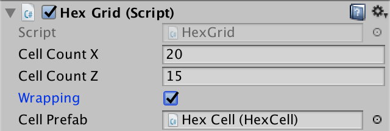 							Grid wrapping toggle, enabled by default. 						

### Saving and Loading

Because wrapping is defined per map, it should be saved and  loaded as well. This means we have to adjust our save file format, so  increment the version constant in `**SaveLoadMenu**`.

```
	const int mapFileVersion = 5;
```

When saving, have `**HexGrid**` simply write the wrapping boolean after the map dimensions.

```
	public void Save (BinaryWriter writer) {
		writer.Write(cellCountX);
		writer.Write(cellCountZ);
		writer.Write(wrapping);

		…
	}
```

When loading, only read it when we have to correct file  version. If not, we have and older map so it doesn't wrap. Store this  info in a local variable and compare it with the correct wrapping state.  If it's different, we cannot reuse the existing map topology, just like  we cannot if we loaded different dimensions.

```
	public void Load (BinaryReader reader, int header) {
		ClearPath();
		ClearUnits();
		int x = 20, z = 15;
		if (header >= 1) {
			x = reader.ReadInt32();
			z = reader.ReadInt32();
		}
		bool wrapping = header >= 5 ? reader.ReadBoolean() : false;
		if (x != cellCountX || z != cellCountZ || this.wrapping != wrapping) {
			if (!CreateMap(x, z, wrapping)) {
				return;
			}
		}

		…
	}
```

### Wrapping Metrics

A wrapping map requires quite some changes to logic, for  example when calculating distances. So this can affect code that doesn't  have a direct reference to the grid. Instead of passing this  information as arguments all the time, let's add it to `**HexMetrics**`.  Introduce a static integer that contains the wrap size, which matches  the width of the map. If it's larger than zero, then we have a wrapping  map. Add a convenient property to check this.

```
	public static int wrapSize;

	public static bool Wrapping {
		get {
			return wrapSize > 0;
		}
	}
```

We have to set the wrap size each time `**HexGrid**.CreateMap` is invoked.

```
	public bool CreateMap (int x, int z, bool wrapping) {
		…
		this.wrapping = wrapping;
		HexMetrics.wrapSize = wrapping ? cellCountX : 0;
		…
	}
```

As this data doesn't survive recompilation while in play mode, set it in `OnEnable` as well.

```
	void OnEnable () {
		if (!HexMetrics.noiseSource) {
			HexMetrics.noiseSource = noiseSource;
			HexMetrics.InitializeHashGrid(seed);
			HexUnit.unitPrefab = unitPrefab;
			HexMetrics.wrapSize = wrapping ? cellCountX : 0;
			ResetVisibility();
		}
	}
```

### Cell Width

When working with wrapping maps, we're going to deal a lot with  positions along the X dimension, measured in cell width. While we can  use `**HexMetrics**.innerRadius * 2f` for that, it's convenient if we don't have to add the multiplication all the time. So let's add an additional `**HexMetrics**.innerDiameter` constant.

```
	public const float innerRadius = outerRadius * outerToInner;

	public const float innerDiameter = innerRadius * 2f;
```

We can already use the diameter in three places. First, in `**HexGrid**.CreateCell`, when positioning the new cell.

```
	void CreateCell (int x, int z, int i) {
		Vector3 position;
		position.x = (x + z * 0.5f - z / 2) * HexMetrics.innerDiameter;
		…
	}
```

Second, in `**HexMapCamera**`, when clamping the camera's position.

```
	Vector3 ClampPosition (Vector3 position) {
		float xMax = (grid.cellCountX - 0.5f) * HexMetrics.innerDiameter;
		position.x = Mathf.Clamp(position.x, 0f, xMax);

		…
	}
```

And also in `**HexCoordinates**`, when converting from a position to coordinates.

```
	public static HexCoordinates FromPosition (Vector3 position) {
		float x = position.x / HexMetrics.innerDiameter;
		…
	}
```

unitypackage

## Centering the Map

When a map doesn't wrap, it has a well-defined east and west  edge, and thus also a well-defined horizontal center. This isn't the  case for a wrapping map. It doesn't have east and west edges, so also no  center. Alternatively, we can say that the center is wherever the  camera happens to be. This is useful, because we'd like the map to  always be centered on our point of view. Then no matter where we are, we  never see either an east or west edge of the map.

### Columns of Chunks

To keep the map visualization centered on the camera, we have  to change where things are in response to the camera's movement. If it  moves to the west, we have to take what's on the currently far east side  and move that to the far west side. The same goes for the opposite  direction.

Ideally, whenever the camera moves to an adjacent column of  cells, we immediately transplant the furthest cell column to the other  side. However, we don't need to be so precise. Instead, we can  transplant entire map chunks. This allows us to move parts of the map  without having to change any meshes.

As we'll move entire columns of chunks at the same time, let's  group them by creating a column parent object per group. Add an array  for these objects to `**HexGrid**` and initialize it in `CreateChunks`. We only use them as containers, so we only need to keep track of a reference to their `Transform` components. Just like the chunks, their initial positions are all at the local origin of the grid.

```
	Transform[] columns;
	
	…
	
	void CreateChunks () {
		columns = new Transform[chunkCountX];
		for (int x = 0; x < chunkCountX; x++) {
			columns[x] = new GameObject("Column").transform;
			columns[x].SetParent(transform, false);
		}
		
		…
	}
```

Chunk should now become children of the appropriate column, instead of the grid.

```
	void CreateChunks () {
		…
		
		chunks = new HexGridChunk[chunkCountX * chunkCountZ];
		for (int z = 0, i = 0; z < chunkCountZ; z++) {
			for (int x = 0; x < chunkCountX; x++) {
				HexGridChunk chunk = chunks[i++] = Instantiate(chunkPrefab);
				chunk.transform.SetParent(columns[x], false);
			}
		}
	}
```

 							
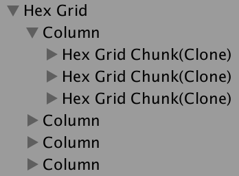 							Chunks grouped into columns. 						

Because all chunks are now children of the columns, we can  suffice with directly destroying all columns instead of the chunks in `CreateMap`. That will get rid of the chunk children as well.

```
	public bool CreateMap (int x, int z, bool wrapping) {
		…
		if (columns != null) {
			for (int i = 0; i < columns.Length; i++) {
				Destroy(columns[i].gameObject);
			}
		}

		…
	}
```

### Teleporting Columns

Add a new `CenterMap` method to `**HexGrid**`,  with an X position as parameter. Convert the position to a column index  by dividing it by the chunk width in units. This is the index of the  column that the camera is currently in, which means that it should be  the center column of the map.

```
	public void CenterMap (float xPosition) {
		int centerColumnIndex = (int)
			(xPosition / (HexMetrics.innerDiameter * HexMetrics.chunkSizeX));
	}
```

We only have to adjust the map visualization when the center  column index changes. So let's keep track of it in a field. Use a  default value of −1 and when creating a map, so new maps will always get  centered.

```
	int currentCenterColumnIndex = -1;
	
	…
	
	public bool CreateMap (int x, int z, bool wrapping) {
		…
		this.wrapping = wrapping;
		currentCenterColumnIndex = -1;
		…
	}
	
	…
	
	public void CenterMap (float xPosition) {
		int centerColumnIndex = (int)
			(xPosition / (HexMetrics.innerDiameter * HexMetrics.chunkSizeX));
		
		if (centerColumnIndex == currentCenterColumnIndex) {
			return;
		}
		currentCenterColumnIndex = centerColumnIndex;
	}
```

Now that we know the center column index, we can determine the  minimum and maximum indices too, by simply subtracting and adding half  the amount of columns. As we're using integers, this works perfectly  when we have an odd number of columns. In the case of an even number  there cannot be a perfectly-centered column, so one of the indices will  be one step too far away. This causes a single-column bias in the  direction to the farthest map edge, but that isn't a problem.

```
		currentCenterColumnIndex = centerColumnIndex;

		int minColumnIndex = centerColumnIndex - chunkCountX / 2;
		int maxColumnIndex = centerColumnIndex + chunkCountX / 2;
```

Note that these indices can be negative or greater that the  natural maximum column index. The minimum is only zero if the camera  ends up near the natural center of the map. Our job is to move columns  around so they align with these relative indices. We do this by  adjusting the local X coordinate of each column in a loop.

```
		int minColumnIndex = centerColumnIndex - chunkCountX / 2;
		int maxColumnIndex = centerColumnIndex + chunkCountX / 2;

		Vector3 position;
		position.y = position.z = 0f;
		for (int i = 0; i < columns.Length; i++) {
			position.x = 0f;
			columns[i].localPosition = position;
		}
```

For each column, check whether its index is smaller than the  minimum index. If so, it's too far to the left of the center. It has to  teleport to the other side of the map. This is done by making its X  coordinate equal to the map width. Likewise, if the column's index is  greater than the maximum index, then it's too far to the right of the  center and has to be teleported in the other direction.

```
		for (int i = 0; i < columns.Length; i++) {
			if (i < minColumnIndex) {
				position.x = chunkCountX *
					(HexMetrics.innerDiameter * HexMetrics.chunkSizeX);
			}
			else if (i > maxColumnIndex) {
				position.x = chunkCountX *
					-(HexMetrics.innerDiameter * HexMetrics.chunkSizeX);
			}
			else {
				position.x = 0f;
			}
			columns[i].localPosition = position;
		}
```

### Moving the Camera

Change `**HexMapCamera**.AdjustPosition` so it invokes `WrapPosition` instead of `ClampPosition` when we're dealing with a wrapping map. Initially, simply make the new `WrapPosition` method a duplicate of `ClampPosition`, with the only difference that it invokes `CenterMap` at the end.

```
	void AdjustPosition (float xDelta, float zDelta) {
		…
		transform.localPosition =
			grid.wrapping ? WrapPosition(position) : ClampPosition(position);
	}

	…

	Vector3 WrapPosition (Vector3 position) {
		float xMax = (grid.cellCountX - 0.5f) * HexMetrics.innerDiameter;
		position.x = Mathf.Clamp(position.x, 0f, xMax);

		float zMax = (grid.cellCountZ - 1) * (1.5f * HexMetrics.outerRadius);
		position.z = Mathf.Clamp(position.z, 0f, zMax);

		grid.CenterMap(position.x);
		return position;
	}
```

To make sure that the map immediately begins centered, invoke `ValidatePosition` in `OnEnable`.

```
	void OnEnable () {
		instance = this;
		ValidatePosition();
	}
```

<iframe src="https://gfycat.com/ifr/GlumSomberConey"></iframe>

Moving left and right while centering the map.

While we're still clamping the camera's movement, the map now  tries to stay centered on the camera, teleporting chunk columns as  needed. This is obvious when using a small map and a zoomed-out view,  but on a large map the teleporting chunks are out of view of the camera.  The original east–west edges of the map are only obvious because there  is no triangulation between them yet.

To wrap the camera too, remove the clamping of its X coordinate in `WrapPosition`.  Instead, keep increasing X by the map width while it's below zero, and  keep decreasing it while it's greater than the map width.

```
	Vector3 WrapPosition (Vector3 position) {
//		float xMax = (grid.cellCountX - 0.5f) * HexMetrics.innerDiameter;
//		position.x = Mathf.Clamp(position.x, 0f, xMax);
		float width = grid.cellCountX * HexMetrics.innerDiameter;
		while (position.x < 0f) {
			position.x += width;
		}
		while (position.x > width) {
			position.x -= width;
		}

		float zMax = (grid.cellCountZ - 1) * (1.5f * HexMetrics.outerRadius);
		position.z = Mathf.Clamp(position.z, 0f, zMax);

		grid.CenterMap(position.x);
		return position;
	}
```

<iframe src="https://gfycat.com/ifr/LinearMistyFlea"></iframe>

Wrapping camera moving across the map.

### Wrapping Shader Textures

Besides the triangulation gap, the camera wrapping should be  unnoticeable in the game view. However, there is a visual change in half  the terrain and water when that happens. That's because we use the  world position to sample these textures. Suddenly teleporting a chunk  changes the texture alignment.

We can solve this problem by making sure that the textures tile  in multiples of the chunk size. The chunk size is derived from  constants in `**HexMetrics**`, so let's create a *HexMetrics.cginc*  shader include file and put the relevant definitions in there. The base  tiling scale is derived from the chunk size and outer cell radius. If  you happen to use different metrics, you have to adjust this file as  well.

```
#define OUTER_TO_INNER 0.866025404
#define OUTER_RADIUS 10
#define CHUNK_SIZE_X 5
#define TILING_SCALE (1 / (CHUNK_SIZE_X * 2 * OUTER_RADIUS / OUTER_TO_INNER))
```

This leads to a tiling scale of 0.00866025404. If we use an  integer multiple of that, the texturing won't be affected by chunk  teleportation. Also, the textures of the east and west edges map edge  will align seamlessly, once we correctly triangulate their connection.

We've used 0.02 for our UV scale in the *Terrain*  shader. We can use twice the tiling scale instead, which would be  0.01732050808. It's a little smaller than it used to be, scaling up the  texture a bit, but its not a visually obvious change.

```
		#include "../HexMetrics.cginc"
		#include "../HexCellData.cginc"

		…

		float4 GetTerrainColor (Input IN, int index) {
			float3 uvw = float3(
				IN.worldPos.xz * (2 * TILING_SCALE),
				IN.terrain[index]
			);
			…
		}
```

We used 0.025 for the noise UV in the *Roads* shader. We can use three times the tiling scale instead, which at 0.02598076212 is a close match.

```
		#include "HexMetrics.cginc"
		#include "HexCellData.cginc"

		…

		void surf (Input IN, inout SurfaceOutputStandardSpecular o) {
			float4 noise =
				tex2D(_MainTex, IN.worldPos.xz * (3 * TILING_SCALE));
			…
		}
```

Finally, in *Water.cginc* we've used 0.015 for the foam and 0.025 for the waves. Once again we can substitute double and triples the tiling scale.

```
#include "HexMetrics.cginc"

float Foam (float shore, float2 worldXZ, sampler2D noiseTex) {
	shore = sqrt(shore) * 0.9;

	float2 noiseUV = worldXZ + _Time.y * 0.25;
	float4 noise = tex2D(noiseTex, noiseUV * (2 * TILING_SCALE));

	…
}

…

float Waves (float2 worldXZ, sampler2D noiseTex) {
	float2 uv1 = worldXZ;
	uv1.y += _Time.y;
	float4 noise1 = tex2D(noiseTex, uv1 * (3 * TILING_SCALE)); 

	float2 uv2 = worldXZ;
	uv2.x += _Time.y;
	float4 noise2 = tex2D(noiseTex, uv2 * (3 * TILING_SCALE));

	…
}
```

unitypackage

## Connecting East and West

At this point the only visual clue that we're wrapping the map  is the small gap between the east-most and west-most columns. This gap  exists because we're currently not triangulating edge and corner  connections between the cells at opposite sides of the non-wrapping map.

 						
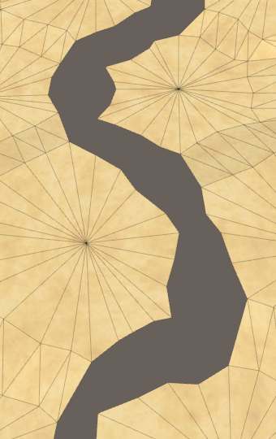 						Edge gap. 					

### Wrapping Neighbors

To triangulate the east–west connection we have to make the  cells on the opposite sides of the map neighbors of each other. We're  currently not doing this, because in `**HexGrid**.CreateCell`  we only establish the E–W relationship with the previous cell if its X  index is greater than zero. To wrap this relationship, we also have to  connect the last cell of a row with the first of the same row, when  wrapping is enabled.

```
	void CreateCell (int x, int z, int i) {
		…

		if (x > 0) {
			cell.SetNeighbor(HexDirection.W, cells[i - 1]);
			if (wrapping && x == cellCountX - 1) {
				cell.SetNeighbor(HexDirection.E, cells[i - x]);
			}
		}
		…
	}
```

With the E–W neighbor relationships established, we now get  partial triangulation across the gap. The edge connection isn't perfect,  because the perturbation doesn't tile correctly. We'll deal with that  later.

 							
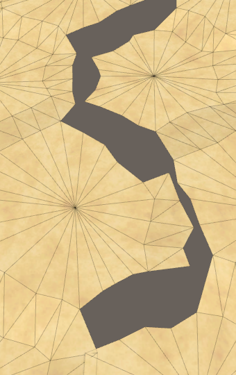 							E–W connections. 						

We also have to wrap the NE–SW relationships. We can do this by  connecting the first cell of each even row with last cells of the  previous row. That's simply the previous cell.

```
		if (z > 0) {
			if ((z & 1) == 0) {
				cell.SetNeighbor(HexDirection.SE, cells[i - cellCountX]);
				if (x > 0) {
					cell.SetNeighbor(HexDirection.SW, cells[i - cellCountX - 1]);
				}
				else if (wrapping) {
					cell.SetNeighbor(HexDirection.SW, cells[i - 1]);
				}
			}
			else {
				…
			}
		}
```

 							
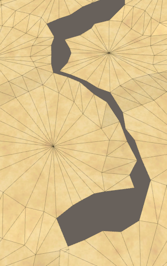 							NE–SW connections. 						

Finally, the wrapping SE–NW connections are established at the  end of each odd row beyond the first. Those cells are to be connected to  the first cell of the previous row.

```
		if (z > 0) {
			if ((z & 1) == 0) {
				…
			}
			else {
				cell.SetNeighbor(HexDirection.SW, cells[i - cellCountX]);
				if (x < cellCountX - 1) {
					cell.SetNeighbor(HexDirection.SE, cells[i - cellCountX + 1]);
				}
				else if (wrapping) {
					cell.SetNeighbor(
						HexDirection.SE, cells[i - cellCountX * 2 + 1]
					);
				}
			}
		}
```

 							
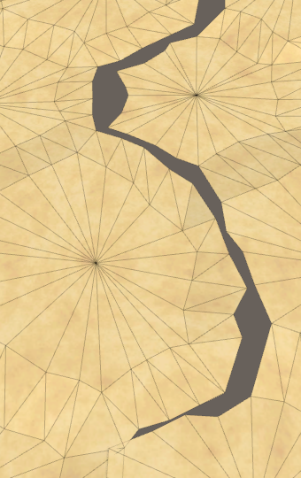 							SE–NW connections. 						

### Wrapping Noise

To make the gap perfect we have to make sure that the noise  used to perturb the vertex positions matches on the east and west edges  of the map. We can use the same trick that we used for the shaders, but  the noise scale that we use for perturbation is 0.003. We'd have to  drastically scale it up to make it tile, which would make the  perturbation more erratic.

An alternative approach is to not tile the noise, but to  cross-fade the noise at the edge of the map. If we cross-fade across the  width of a single cell, then the perturbation will transition smoothly,  without discontinuities. The noise will be a bit smoothed out in this  region, and from a distance the change would appear sudden, but that's  not obvious when used for a little vertex perturbation.

 							What about the temperature jitter? 							 						

If we're not wrapping the map, we can make do with taking a single sample in `**HexMetrics**.SampleNoise`. But when wrapping, we have to add the cross-fade. So store the sample in a variable before returning it.

```
	public static Vector4 SampleNoise (Vector3 position) {
		Vector4 sample = noiseSource.GetPixelBilinear(
			position.x * noiseScale,
			position.z * noiseScale
		);
		return sample;
	}
```

When wrapping, we need a second sample to blend with. We'll  perform the transition at the east side of the map, so the second sample  has to be taken at the west side.

```
		Vector4 sample = noiseSource.GetPixelBilinear(
			position.x * noiseScale,
			position.z * noiseScale
		);

		if (Wrapping && position.x < innerDiameter) {
			Vector4 sample2 = noiseSource.GetPixelBilinear(
				(position.x + wrapSize * innerDiameter) * noiseScale,
				position.z * noiseScale
			);
		}
```

The cross-fade is done with a simple linear interpolation, from the west to the east side, across the width of a single cell.

```
		if (Wrapping && position.x < innerDiameter) {
			Vector4 sample2 = noiseSource.GetPixelBilinear(
				(position.x + wrapSize * innerDiameter) * noiseScale,
				position.z * noiseScale
			);
			sample = Vector4.Lerp(
				sample2, sample, position.x * (1f / innerDiameter)
			);
		}
```

 							
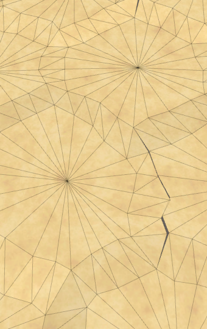 							Blending noise, imperfect 						

The result isn't an exact match. That's because part of the  cells on the east side have negative X coordinates. To stay away from  this area, let's shift the transition region half a cell-width to the  west.

```
		if (Wrapping && position.x < innerDiameter * 1.5f) {
			Vector4 sample2 = noiseSource.GetPixelBilinear(
				(position.x + wrapSize * innerDiameter) * noiseScale,
				position.z * noiseScale
			);
			sample = Vector4.Lerp(
				sample2, sample, position.x * (1f / innerDiameter) - 0.5f
			);
		}
```

 							
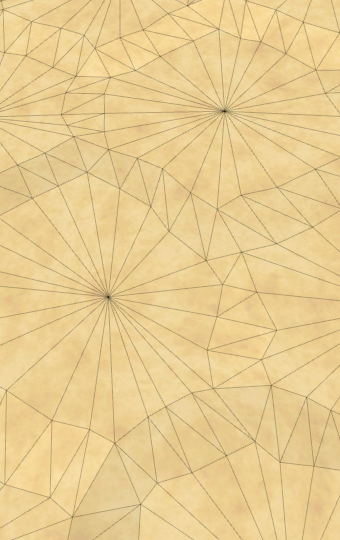 							Correct cross-fade. 						

### Editing Cells

Now that it seems that we have correct triangulation, let's  make sure that we can edit everywhere on the map and across the wrapping  seam. As it turns out, coordinates are wrong on teleported chunks and  larger brushes are cut off by the seam.

 							
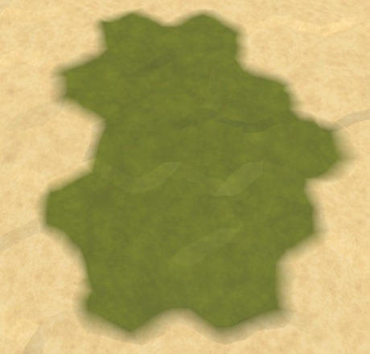 							Brush got cut off. 						

To fix this, we have to make `**HexCoordinates**`  aware of the wrapping. We can do this by validating the X coordinate in  the constructor method. We know that the axial X coordinate is derived  from the X offset coordinate by subtracting half the Z coordinate. We  can use this knowledge to convert back and check whether the offset  coordinate is below zero. If so, we have a coordinate beyond the east  side of the unwrapped map. As we teleport at most half the map in each  direction, we can suffice by adding the wrap size to X once. And when  the offset coordinate is greater than the wrap size, we have to subtract  instead.

```
	public HexCoordinates (int x, int z) {
		if (HexMetrics.Wrapping) {
			int oX = x + z / 2;
			if (oX < 0) {
				x += HexMetrics.wrapSize;
			}
			else if (oX >= HexMetrics.wrapSize) {
				x -= HexMetrics.wrapSize;
			}
		}
		this.x = x;
		this.z = z;
	}
```

 							Sometimes I get errors when editing at the bottom or top of the map? 							 						

### Wrapping Shores

Triangulation goes well for the terrain, but it appears that  water shore edges are missing along the east-west seam. They're actually  not missing, but they aren't wrapping. They're flipped and stretch all  the way to the other side of the map.

 							
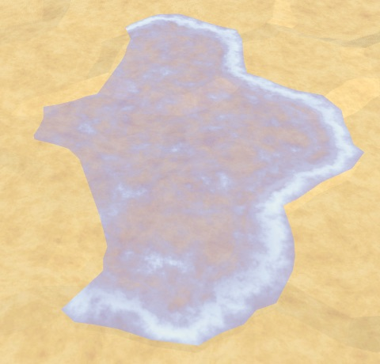 							Missing water edge. 						

This happens because we use the neighbor's position when  triangulating the shore water. To fix this, we have to detect that we're  dealing with a neighbor that's on the other side of the map. To make  this easy, we'll add a property for a cell's column index to `**HexCell**`.

```
	public int ColumnIndex { get; set; }
```

Assign this index in `**HexGrid**.CreateCell`. It's simply equal to the X offset coordinate divided by the chunk size.

```
	void CreateCell (int x, int z, int i) {
		…
		cell.Index = i;
		cell.ColumnIndex = x / HexMetrics.chunkSizeX;
		…
	}
```

Now we can detect that we're wrapping in `**HexGridChunk**.TriangulateWaterShore`,  by comparing the column index of the current cell and its neighbor. If  the neighbor's column index is more than one step smaller, then we're on  the west side while the neighbor is on the east side. So we have to  wrap the neighbor to the west. Conversely for the other direction.

```
		Vector3 center2 = neighbor.Position;
		if (neighbor.ColumnIndex < cell.ColumnIndex - 1) {
			center2.x += HexMetrics.wrapSize * HexMetrics.innerDiameter;
		}
		else if (neighbor.ColumnIndex > cell.ColumnIndex + 1) {
			center2.x -= HexMetrics.wrapSize * HexMetrics.innerDiameter;
		}
```

 							
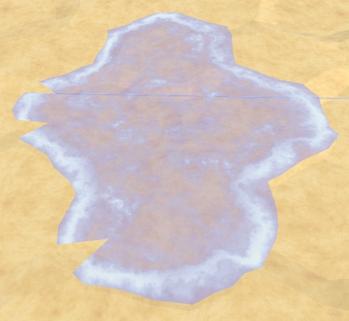 							Shore edges, but not corners. 						

This takes care of the shore edges, but not yet the corners. We have to do the same with the next neighbor too.

```
		if (nextNeighbor != null) {
			Vector3 center3 = nextNeighbor.Position;
			if (nextNeighbor.ColumnIndex < cell.ColumnIndex - 1) {
				center3.x += HexMetrics.wrapSize * HexMetrics.innerDiameter;
			}
			else if (nextNeighbor.ColumnIndex > cell.ColumnIndex + 1) {
				center3.x -= HexMetrics.wrapSize * HexMetrics.innerDiameter;
			}
			Vector3 v3 = center3 + (nextNeighbor.IsUnderwater ?
				HexMetrics.GetFirstWaterCorner(direction.Previous()) :
				HexMetrics.GetFirstSolidCorner(direction.Previous()));
			…
		}
```

 							
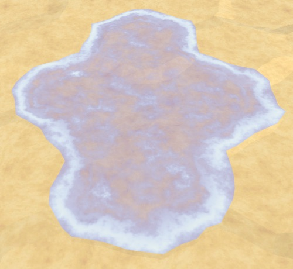 							Correctly wrapped shore. 						

### Map Generation

Whether the east and west sides of the map are connected also  influences map generation. When the map wraps, the generation algorithm  wraps as well. This will result in a different map, but the wrapping  isn't obvious when using a nonzero *Map Border X*.

 							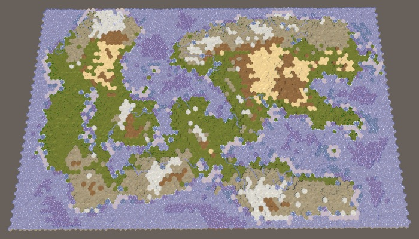 							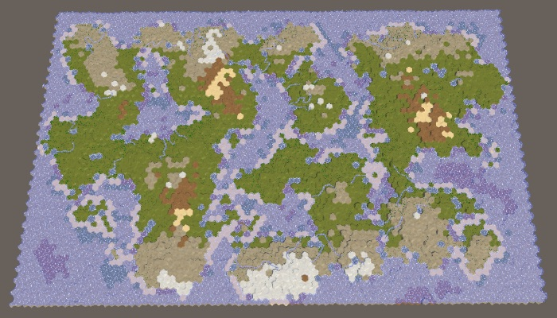 							Default large map 1208905299, without and with wrapping. 						

When wrapping, it doesn't make sense to use *Map Border X*. But we can't just do away with it, because that would merge regions. When wrapping, we can just use *RegionBorder* instead.

Adjust `**HexMapGenerator**.CreateRegions` by replacing the usage of `mapBorderX` with `borderX` in all cases. This new variable will be equal to either `regionBorder` or `mapBorderX`, depending on whether the map is wrapping. I've only shown changes to the first case below.

```
		int borderX = grid.wrapping ? regionBorder : mapBorderX;
		MapRegion region;
		switch (regionCount) {
		default:
			region.xMin = borderX;
			region.xMax = grid.cellCountX - borderX;
			region.zMin = mapBorderZ;
			region.zMax = grid.cellCountZ - mapBorderZ;
			regions.Add(region);
			break;
		…
		}
```

This keeps the regions apart, but that's only necessary when  there are actually different regions on the east and west sides of the  map. There are two cases for which this is not true. First, when there's  only a single region. Second, when there are two regions that  horizontally split the map. In those cases we can set `borderX` to zero, allowing landmasses to cross the east-west seam.

```
		switch (regionCount) {
		default:
			if (grid.wrapping) {
				borderX = 0;
			}
			region.xMin = borderX;
			region.xMax = grid.cellCountX - borderX;
			region.zMin = mapBorderZ;
			region.zMax = grid.cellCountZ - mapBorderZ;
			regions.Add(region);
			break;
		case 2:
			if (Random.value < 0.5f) {
				…
			}
			else {
				if (grid.wrapping) {
					borderX = 0;
				}
				region.xMin = borderX;
				region.xMax = grid.cellCountX - borderX;
				region.zMin = mapBorderZ;
				region.zMax = grid.cellCountZ / 2 - regionBorder;
				regions.Add(region);
				region.zMin = grid.cellCountZ / 2 + regionBorder;
				region.zMax = grid.cellCountZ - mapBorderZ;
				regions.Add(region);
			}
			break;
		…
		}
```

 							
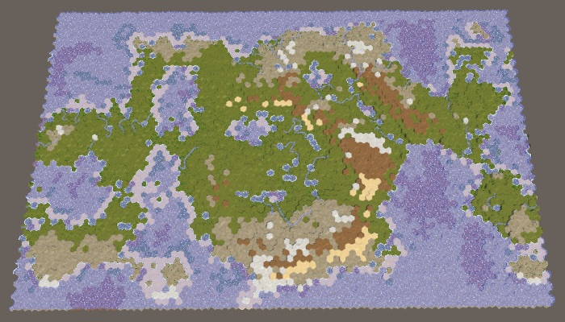 							Single wrapping region. 						

At first glance this might appear to work fine, but there's  actually a discontinuity along the seam. This becomes more obvious when  setting *Erosion Percentage* to zero.

 							
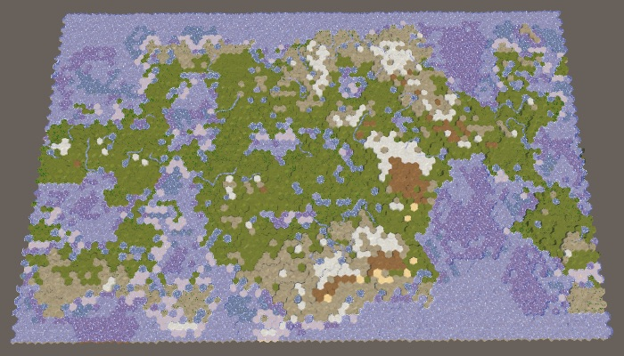							
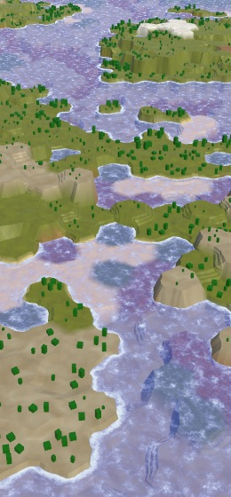 							Using no erosion reveals a terrain seam. 						

The discontinuity happens because the seam blocks the growth of  terrain chunks. The distance of cells to the chunk's center is used to  determine which are added first, and cells on the other side of the map  end up very far away, so they almost never get included. This is of  course incorrect. We have to make `**HexCoordinates**.DistanceTo` aware of the wrapping map.

We calculate the distance between `**HexCoordinates**`  by adding the absolute distances along each of the three axes and  halving the result. The Z distance is always correct, but the X and Y  distances can be influenced by wrapping. So let's begin by separately  calculating X+Y.

```
	public int DistanceTo (HexCoordinates other) {
//		return
//			((x < other.x ? other.x - x : x - other.x) +
//			(Y < other.Y ? other.Y - Y : Y - other.Y) +
//			(z < other.z ? other.z - z : z - other.z)) / 2;
		
		int xy =
			(x < other.x ? other.x - x : x - other.x) +
			(Y < other.Y ? other.Y - Y : Y - other.Y);

		return (xy + (z < other.z ? other.z - z : z - other.z)) / 2;
	}
```

Determining whether wrapping produces a smaller distance for  arbitrary cells isn't straightforward, so let's simply calculate X+Y for  when we wrap the other coordinate to the west side. If that ends up  smaller than the original X+Y, use it instead.

```
		int xy =
			(x < other.x ? other.x - x : x - other.x) +
			(Y < other.Y ? other.Y - Y : Y - other.Y);

		if (HexMetrics.Wrapping) {
			other.x += HexMetrics.wrapSize;
			int xyWrapped =
				(x < other.x ? other.x - x : x - other.x) +
				(Y < other.Y ? other.Y - Y : Y - other.Y);
			if (xyWrapped < xy) {
				xy = xyWrapped;
			}
		}
```

If that doesn't lead to a shorter distance, then maybe wrapping in the other direction is shorter, so check that as well.

```
		if (HexMetrics.Wrapping) {
			other.x += HexMetrics.wrapSize;
			int xyWrapped =
				(x < other.x ? other.x - x : x - other.x) +
				(Y < other.Y ? other.Y - Y : Y - other.Y);
			if (xyWrapped < xy) {
				xy = xyWrapped;
			}
			else {
				other.x -= 2 * HexMetrics.wrapSize;
				xyWrapped =
					(x < other.x ? other.x - x : x - other.x) +
					(Y < other.Y ? other.Y - Y : Y - other.Y);
				if (xyWrapped < xy) {
					xy = xyWrapped;
				}
			}
		}
```

Now we always end up with the shortest distance on a wrapping  map. Terrain chunks are no longer blocked by the seam, making it  possible for landmasses to wrap.

 							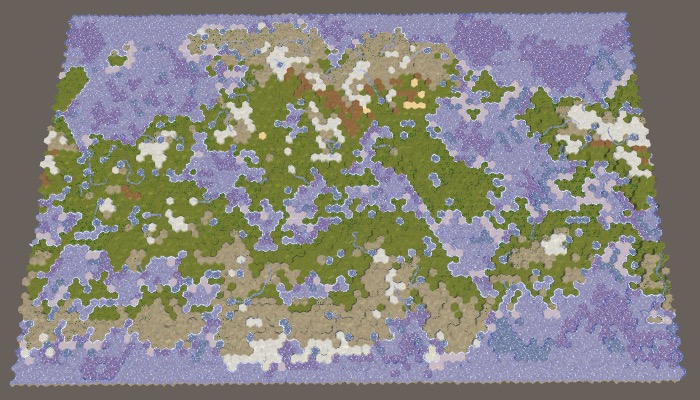 							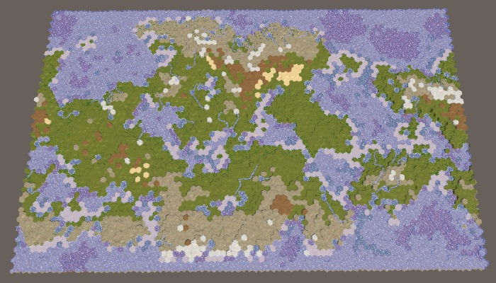 							Correctly wrapped terrain, without and with erosion. 						

unitypackage

## Traveling Around the World

Now that map generation and triangulation are covered, all that's left is to check units, exploration, and visibility.

### Explorable Seam

The first obstacle that we encounter when trying to move a unit around the world is the map's edge that cannot be explored.

 							
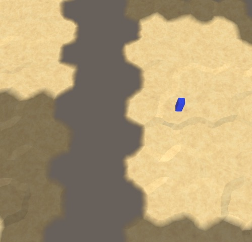 							Map seam cannot be explored. 						

The cells along the edge of the map are not explorable, to hide  the sudden end of the map. But when a map wraps, only the north and  south cells have to be marked as such, not the east and west cells.  Adjust `**HexGrid**.CreateCell` to take this into account.

```
		if (wrapping) {
			cell.Explorable = z > 0 && z < cellCountZ - 1;
		}
		else {
			cell.Explorable =
				x > 0 && z > 0 && x < cellCountX - 1 && z < cellCountZ - 1;
		}
```

### Feature Visibility

Next, let's check whether visibility works correctly across the  seam. It does for the terrain, but not for terrain features. It looks  like wrapped features pick up the visibility of the last cell that isn't  wrapped.

 							
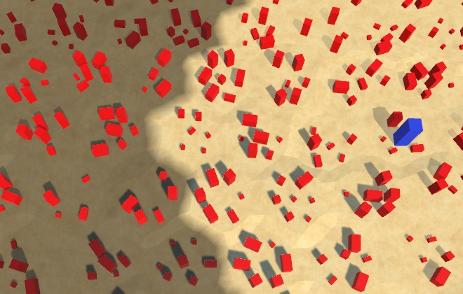 							Incorrect feature visibility. 						

This happens because the wrap mode of the texture used by `**HexCellShaderData**`  is set to clamp. The solution is simply to set its clamp mode to  repeat. But we only need to do this for the U coordinates, so set `wrapModeU` and `wrapModeV` separately in `Initialize`.

```
	public void Initialize (int x, int z) {
		if (cellTexture) {
			cellTexture.Resize(x, z);
		}
		else {
			cellTexture = new Texture2D(
				x, z, TextureFormat.RGBA32, false, true
			);
			cellTexture.filterMode = FilterMode.Point;
//			cellTexture.wrapMode = TextureWrapMode.Clamp;
			cellTexture.wrapModeU = TextureWrapMode.Repeat;
			cellTexture.wrapModeV = TextureWrapMode.Clamp;
			Shader.SetGlobalTexture("_HexCellData", cellTexture);
		}
		…
	}
```

### Units and Columns

Another problem is that units currently do not wrap. They stay where they are when the column they're in is relocated.

 							
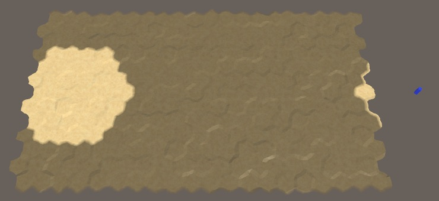 							Unit didn't wrap and is on the wrong side. 						

This can be solved by making the units children of the columns,  just like the chunks. First, no longer make them a direct child of the  grid in `**HexGrid**.AddUnit`.

```
	public void AddUnit (HexUnit unit, HexCell location, float orientation) {
		units.Add(unit);
		unit.Grid = this;
//		unit.transform.SetParent(transform, false);
		unit.Location = location;
		unit.Orientation = orientation;
	}
```

Because units move, they may end up in a different column,  which means that we have to change their parent. To make this possible,  add a public `MakeChildOfColumn` method to `**HexGrid**`, with the child's `Transform` component and the column index as parameters.

```
	public void MakeChildOfColumn (Transform child, int columnIndex) {
		child.SetParent(columns[columnIndex], false);
	}
```

Invoke this method when the `**HexUnit**.Location` property is set.

```
	public HexCell Location {
		…
		set {
			…
			Grid.MakeChildOfColumn(transform, value.ColumnIndex);
		}
	}
```

That takes care of the creation of units. We also have to make  sure they move to the correct column while traveling. This requires us  to keep track of the current column index in `**HexUnit**.TravelPath`.  At the start of this method, it's the column index of the cell at the  start of the path, or the current one if traveling was interrupted by a  recompile.

```
	IEnumerator TravelPath () {
		Vector3 a, b, c = pathToTravel[0].Position;
		yield return LookAt(pathToTravel[1].Position);

//		Grid.DecreaseVisibility(
//			currentTravelLocation ? currentTravelLocation : pathToTravel[0],
//			VisionRange
//		);
		if (!currentTravelLocation) {
			currentTravelLocation = pathToTravel[0];
		}
		Grid.DecreaseVisibility(currentTravelLocation, VisionRange);
		int currentColumn = currentTravelLocation.ColumnIndex;

		…
	}
```

During each iteration of the journey, check whether the next column index is different, and if so adjust the parent of the unit.

```
		int currentColumn = currentTravelLocation.ColumnIndex;

		float t = Time.deltaTime * travelSpeed;
		for (int i = 1; i < pathToTravel.Count; i++) {
			…
			Grid.IncreaseVisibility(pathToTravel[i], VisionRange);

			int nextColumn = currentTravelLocation.ColumnIndex;
			if (currentColumn != nextColumn) {
				Grid.MakeChildOfColumn(transform, nextColumn);
				currentColumn = nextColumn;
			}

			…
		}
```

This makes units wrap just like chunks. However, when moving  across the map seam the units don't wrap yet. Instead, they suddenly  move in the wrong direction. This happens no matter where the seam is  located, but is most dramatic when they race across the entire map.

<iframe src="https://gfycat.com/ifr/DimBreakableIchthyostega"></iframe>

Bouncing across the map.

Here we can use the same approach that we used for the water  shores, except this time we wrap the curve that the unit is traveling  along. When the next column is wrapped to the east, we teleport the  curve to the east as well, likewise for the other direction. We have to  adjust the `a` and `b` control points of the curve, which also takes care of the `c` control point.

```
		for (int i = 1; i < pathToTravel.Count; i++) {
			currentTravelLocation = pathToTravel[i];
			a = c;
			b = pathToTravel[i - 1].Position;
//			c = (b + currentTravelLocation.Position) * 0.5f;
//			Grid.IncreaseVisibility(pathToTravel[i], VisionRange);

			int nextColumn = currentTravelLocation.ColumnIndex;
			if (currentColumn != nextColumn) {
				if (nextColumn < currentColumn - 1) {
					a.x -= HexMetrics.innerDiameter * HexMetrics.wrapSize;
					b.x -= HexMetrics.innerDiameter * HexMetrics.wrapSize;
				}
				else if (nextColumn > currentColumn + 1) {
					a.x += HexMetrics.innerDiameter * HexMetrics.wrapSize;
					b.x += HexMetrics.innerDiameter * HexMetrics.wrapSize;
				}
				Grid.MakeChildOfColumn(transform, nextColumn);
				currentColumn = nextColumn;
			}

			c = (b + currentTravelLocation.Position) * 0.5f;
			Grid.IncreaseVisibility(pathToTravel[i], VisionRange);

			…
		}
```

<iframe src="https://gfycat.com/ifr/FlatBonyIchthyosaurs"></iframe>

Wrapping movement.

The final thing that we have to tweak is the initial rotation  of the unit, when it faces the first cell it's going to travel to. If  that cell happens to be on the other side of the east–west seam, then  the unit ends up looking in the wrong direction.

When the map is wrapping, there are two ways to look at a point  that's not directly north or south. You could look either eastward or  westward. It makes sense to look in the direction that matches the  closest distance to the point, as that's also the travel direction, so  let's use that in `LookAt`.

When wrapping, check the relative distance in the X dimension.  If it's smaller than negative half of the map width, then we should look  westward, which is done by wrapping the point to the west. Otherwise,  if the distance is greater than half the map width, then we should wrap  to the east.

```
	IEnumerator LookAt (Vector3 point) {
		if (HexMetrics.Wrapping) {
			float xDistance = point.x - transform.localPosition.x;
			if (xDistance < -HexMetrics.innerRadius * HexMetrics.wrapSize) {
				point.x += HexMetrics.innerDiameter * HexMetrics.wrapSize;
			}
			else if (xDistance > HexMetrics.innerRadius * HexMetrics.wrapSize) {
				point.x -= HexMetrics.innerDiameter * HexMetrics.wrapSize;
			}
		}

		…
	}
```

At this point we have a fully functional wrapping map. This  also ends the Hex Map series. More topics could be covered, as mention  in some earlier tutorials, but they're not specific to hex maps. I might  cover them in future series of their own. Enjoy your maps!

 							I downloaded the final package and get rotation errors in play mode? 							 						

 							I downloaded the final package and get graphics uglier than the screenshots? 							 						

 							I downloaded the final package and always generate the same map? 							 						

unitypackage

PDF
