# [内容分享]在Unity中实现2D光照系统                                        

​         2019-06-25 14:17                       

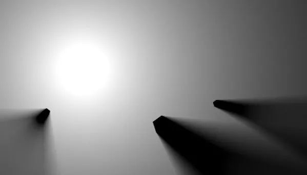

一些2D游戏中引入实时光影效果能给游戏带来非常大的视觉效果提升，亦或是利用2D光影实现视线遮挡机制。例如Terraria,Starbound。

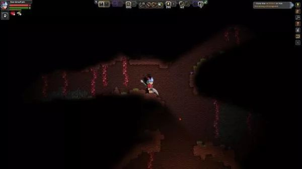

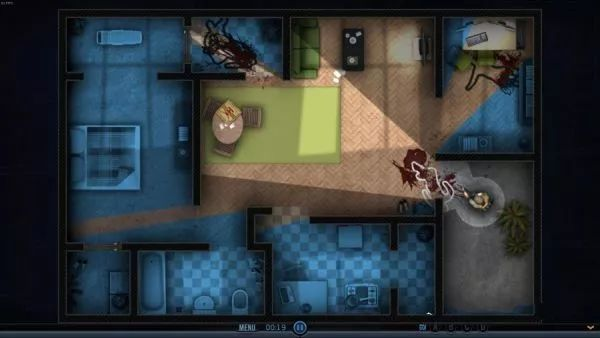

2D光影效果需要一个动态光照系统实现，而通常游戏引擎所提供的实时光照系统仅限于3D场景，要实现图中效果的2D光影需要额外设计适用于2D场景的光照系统。虽然在Unity  Assets Store上有不少2D光照系统插件，实际上实现一个2D光照系统并不复杂，并且可以借此机会熟悉Unity渲染管线开发。

本文将介绍通过Command Buffer扩展Unity Built-in  Render Pipeline实现一个简单的2D光照系统。所涉及到的前置技术栈包括Unity,C#,render pipeline,shader  programming等。本文仅包含核心部分的部分代码，完整代码可以在我的GitHub上找到：

SardineFish/Unity2DLightinggithub.com

2D Lighting Model

首先我们尝试仿照3D场景中的光照模型，对2D光照进行理论建模。

在现实世界中，我们通过肉眼所观测到的视觉图像，来自于光源产生的光，经过物体表面反射，通过晶状体、瞳孔等眼球光学结构，投射在视网膜上导致视觉细胞产生神经冲动，传递到大脑中形成。而在照片摄影中，则是经过镜头后投射在感光元件上成像并转换为数字图像数据。而在图形渲染中，通常通过模拟该过程，计算摄像机所接收到的来自物体反射的光，从而渲染出图像。

1986年，James T.Kajiya在论文THE RENDERING EQUATION[1]中提出了一个著名的渲染方程：

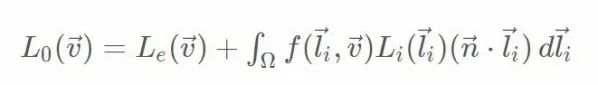

3D场景中物体表面任意一面元所受光照，等于来自所有方向的光线辐射度的总和。这些光经过反射和散射后，其中一部分射向摄像机（观察方向）。（通常为了简化这一过程，我们可以假定这些光线全部射向摄像机）

而在2D平面场景中，我们可以认为，该平面上任意一点所受的光照，等于来自所有方向的光线辐射度的总和，其中的一部分射向摄像机，为了简化，我们认为这些光线全部进入摄像机。这一光照模型可以用以下方程描述：

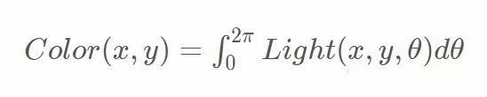

即，平面上任意一点，或者说一个像素(x,y)的颜色，等于在该点处来自[0,2π]所有方向的光的总和。其中Light(x,y,θ)表示在点(x,y)处来自θ方向的光量。

基于这一光照模型，我们可以实现一个2D空间内的光线追踪渲染器。去年我在这系列文章的启发下，基于js实现了一个简单的2D光线追踪渲染器demo

Raytrace 2Dray-trace-2d.sardinefish.com

关于该渲染器，我写过一篇Blog:2D光线追踪渲染，借用该渲染器渲染出来的2D光线追踪图像，我们可以对2D光照效果做出一定的分析和比较。

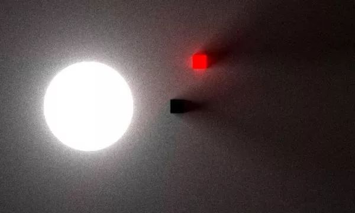

2D Lighting System

Light Source

相较于3D实时渲染中的点光源、平行光源和聚光灯等多种精确光源，在2D光照中，通常我们只需要点光源就足以满足对2D光照的需求。

由于精确光源的引入，我们不再需要对光线进行积分计算，因此上文中的2D光照方程就可以简化为：

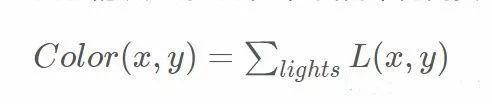

即空间每点的光照等于场景中所有点光源在(x,y)处光量的总和。为了使光照更加真实，我们可以对点光源引入光照衰减机制：

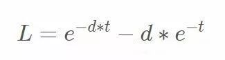

其中d为平面上一点到光源的距离，t为可调节参数，取值范围[0,1]

所得到的光照效果如图(t=0.3)：

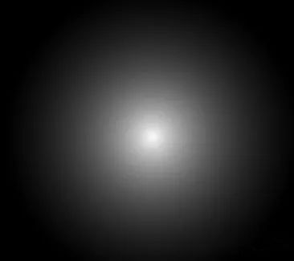

光照衰减模型还有很多种，可以根据需求进行更改。

Light Rendering

在有了光源模型之后，我们需要将光照绘制到屏幕上，也就是光照的渲染实现。计算光照颜色与物体固有颜色的结合通常采用直接相乘的形式，即color=lightColor.rgb*albedo.rgb，与Photoshop等软件中的“正片叠底”是同样的。

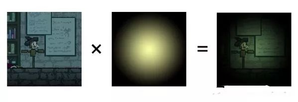

在3D光照中，通常有两种光照渲染实现：Forward Rendering和Deferred Shading。在2D光照中，我们也可以参考这两种光照实现：

Forward：对场景中的每个Sprite设置自定义Shader材质，渲染每一个2D光源的光照，然而由于Unity渲染管线的限制，这一过程的实现相当复杂，并且对于具有N个Sprite，M个光源的场景，光照渲染的时间复杂度为O(MN)。

Deferred：这一实现类似于屏幕后处理，在Unity完成场景渲染后，对场景中的每个光源，绘制到一张屏幕光照贴图上，将该光照贴图与屏幕图像相乘得到最终光照效果，过程类似于上图。

显然在实现难度和运行效率上来说，选择Deferred的渲染方式更方便

Render Pipeline

在Unity中实现这样的一个光照渲染系统，一些开发者选择生成一张覆盖屏幕的Mesh，用该Mesh渲染光照，最终利用Unity渲染管线中的透明度混合实现光照效果。这样的实现具有很好的平台兼容性，但也存在可扩展性较差，难以进行更复杂的光照和软阴影生成等问题。

因此我在这里选择使用CommandBuffer对Unity渲染管线进行扩展，设计一条2D光照渲染管线，并添加到Unity  Built-in Render Pipeline中。对于使用Unity able Render  Pipeline的开发者，本文提到的渲染管线亦有一定参考用途，SRP也提供了相应扩展其渲染管线的相关API。

总结一下上文关于2D光照系统的建模，以及光照渲染的实现，我们的2D光照渲染管线需要实现以下过程：

1.针对场景中每个需要渲染2D光照的摄像机，设置我们的渲染管线

2.准备一张空白的Light Map

3.遍历场景中的所有2D光源，将光照渲染到Light Map

4.抓取当前摄像机目标Buffer中的图像，将其与Light Map相乘混合后输出到摄像机渲染目标

Camera 

要使用CommandBuffer扩展渲染管线，一个CommandBuffer实例只需要实例化一次，并通过Camera.AddCommandBuffer方法添加到摄像机的某个渲染管线阶段。此后需要在每次摄像机渲染图像前，即调用OnPreRender方法时，清空该CommandBuffer并重新设置相关参数。

这里还设置ExecuteInEditMode和ImageEffectAllowedInSceneView属性以确保能在编辑器的Scene视图中实时渲染2D光照效果。

这里选择CameraEvent.BeforeImageEffects作为插入点，即在Unity完成了场景渲染后，准备渲染屏幕后处理前的阶段。

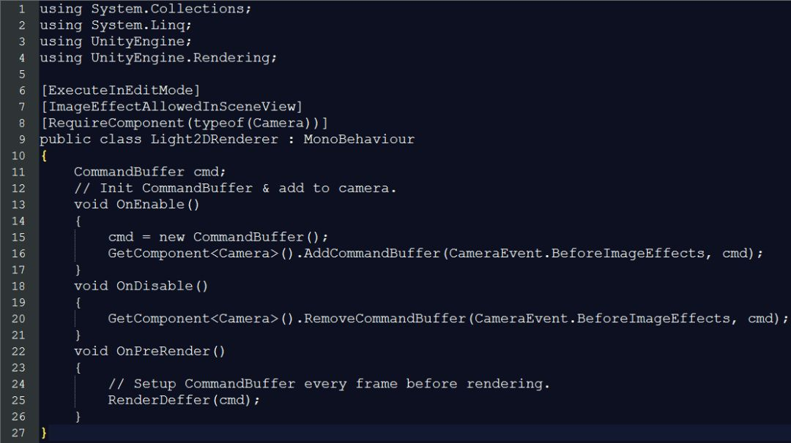

Setup CommandBuffer

由于我们要绘制一张光照贴图，并将其与屏幕图像混合，我们需要一个临时的RenderTexture(RT)，这里设置Light   Map的贴图格式为ARGBFloat，原因是我们希望光照贴图中每个像素的RGB光照分量是可以大于1的，这样可以提供更精确的光照效果和更好的扩展性，而默认的RT会在混合前将缓冲区中每个像素的值裁剪到[0,1]。

在临时RT使用完毕后，请务必Release！请务必Release！请务必Release！（别问，问就是显卡崩溃）

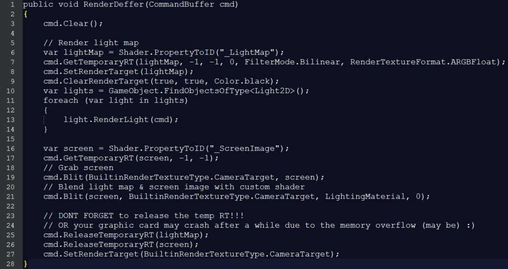

最终用于光照混合的Shader代码非常简单，这里使用了UNITY_LIGHTMODEL_AMBIENT引入一个场景全局光照，全局光照可以在Lighting>Scene面板里设置：

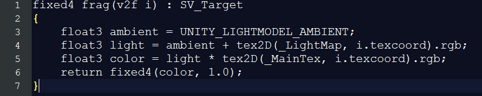

Render Lighting

渲染光源光照贴图的过程，对于不同的光源类型有不同的实现方式，例如直接使用Shader程序式生成，亦或是使用一张光斑贴图。其核心部分就是：

1.生成一张用于渲染的Mesh（通常就是一个简单的Quad）

2.设置CommandBuffer将该Mesh绘制到Light Map

Quad就是一个正方形，可以用以下代码生成：

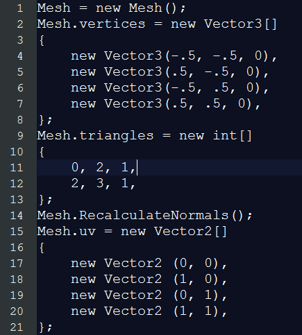

需要注意的是，Mesh资源不参与GC，也就是每次new出来的Mesh会永久驻留内存直到退出（导致Unity内存泄漏的一个主要因素）。因此不应该在每次渲染的时候new一个新的Mesh，而是在每次渲染时，调用Mesh.Clear方法将Mesh清空后重新设置。

这里生成的Mesh基于该GameObject的本地坐标系，在调用CommandBuffer.DrawMesh以渲染该Mesh

我们还需要设置相应的TRS变换矩阵，以确保渲染在屏幕上的正确位置。

由于我们需要同时将多个光照绘制到同一张光照贴图上，根据光照物理模型，光照强度的叠加应当使用直接相加的方式，因此用于渲染光照贴图的Shader应该设置Blend属性为One One：

2D Shadow

要在该光照系统中引入2D阴影，只需要在每次绘制光照贴图时，额外对每个阴影投射光源绘制一个阴影贴图(Shadow Map)，并应用在渲染光照贴图的Shader中采样即可。

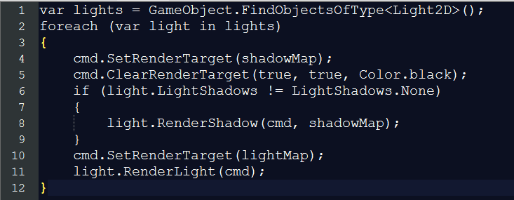

关于2D阴影贴图的生成，可以参考伪人的这篇文章：

**伪人：如何在unity实现足够快的2d动态光照**

**（https://zhuanlan.zhihu.com/p/52423823）**

或者我有时间继续填坑再写一个。(FLAG)

阴影投射物体目前仅支持多边形，未来将加入对Box和Circle等2D碰撞体的阴影实现。

**Git Tag：**

https://github.com/SardineFish/Unity2DLighting/tree/v0.1.0