# Noise, being a pseudorandom artist

In this tutorial you will create your own texture, and make it interesting with pseudorandom noise.

 				You'll learn to 				

- Create and fill a texture;
- Visualize a slice through world space;
- Use delegates;
- Use a hash array for 1D, 2D, and 3D hashing;
- Compute Value noise;
- Compute Perlin noise;
- Create fractal noise;
- Use a gradient.

This tutorial builds on the foundation laid by previous tutorials. If you completed the [Curves and Splines](https://catlikecoding.com/unity/tutorials/curves-and-splines/) tutorial then you're good to go.

This tutorial has been made with Unity 4.5.2. It might not work for older versions.


 				
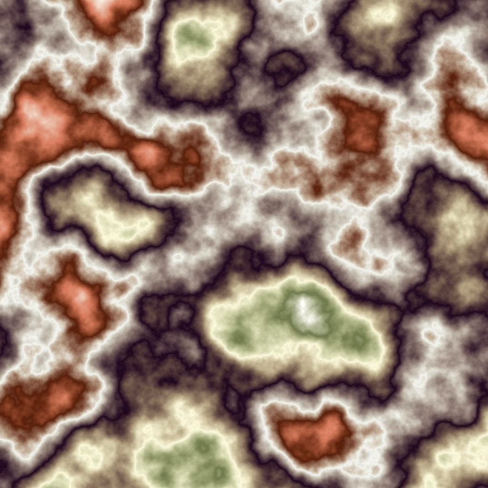 				A slice through colored 3D Perlin noise. 			

## Creating a Texture

Let's begin by creating a default quad object. This object has a  mesh with two triangles that form a square with a width and height of  one unit each.

 				 				 				A bland quad. 			

We can make the quad more interesting by giving it a material  with a nice texture. We could use any image as a texture, but we're  going to create one procedurally. For this we need a material to assign  the texture to, so create one and have the quad use it instead of the  default. Then create a *TextureCreator* component script and attach it to the quad as well.

 				 					[Why not use a procedural shader?](https://catlikecoding.com/unity/tutorials/noise/#a-shader) 				 			

```
using UnityEngine;

public class TextureCreator : MonoBehaviour {
}
```

 				
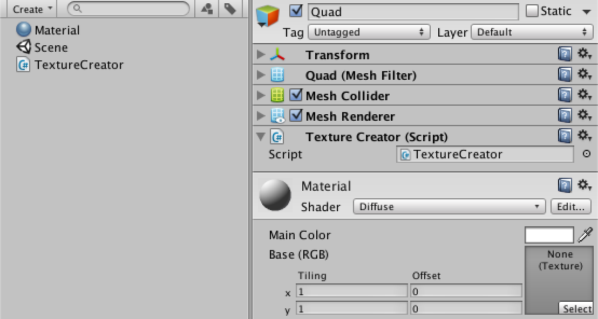 				Quad with custom material and texture creator. 			

To create a texture, we need to know how many pixels it should  have. We'll create a square texture, so we can control its size with a  single `resolution` variable. Let's give it a default of 256.

 				 					[Why 256?](https://catlikecoding.com/unity/tutorials/noise/#a-256) 				 			

```
	public int resolution = 256;
```

We will create the texture when our component awakens. As we  won't use transparency, the texture's format is RGB. The fourth argument  of the texture's constructor indicates that we want to use mipmaps. We  also give it a descriptive name.

Then we grab the `MeshRenderer`  component of the game object. Because we're only using it with our quad  object, it should exist so we directly assign the texture to its  material.

 				 					[What does RGB24 mean?](https://catlikecoding.com/unity/tutorials/noise/#a-rgb24) 					[What are mipmaps?](https://catlikecoding.com/unity/tutorials/noise/#a-mipmaps) 				 			

```
	private Texture2D texture;

	private void Awake () {
		texture = new Texture2D(resolution, resolution, TextureFormat.RGB24, true);
		texture.name = "Procedural Texture";
		GetComponent<MeshRenderer>().material.mainTexture = texture;
	}
```

 				
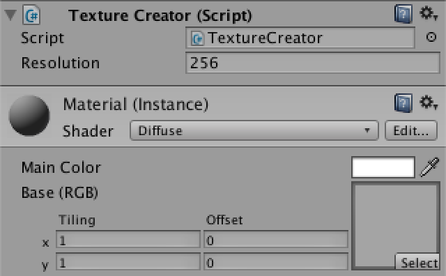 				Quad awakens with a texture in play mode. 			

Without filling the texture this doesn't make much sense. So let's add a `FillTexture` method that uses a double loop to make all the pixels red.

After setting the pixels, you have to call the texture's `Apply` method otherwise the changes won't show up.

```
	private void Awake () {
		texture = new Texture2D(resolution, resolution, TextureFormat.RGB24, true);
		texture.name = "Procedural Texture";
		GetComponent<MeshRenderer>().material.mainTexture = texture;
		FillTexture();
	}

	private void FillTexture () {
		for (int y = 0; y < resolution; y++) {
			for (int x = 0; x < resolution; x++) {
				texture.SetPixel(x, y, Color.red);
			}
		}
		texture.Apply();
	}
```

 				
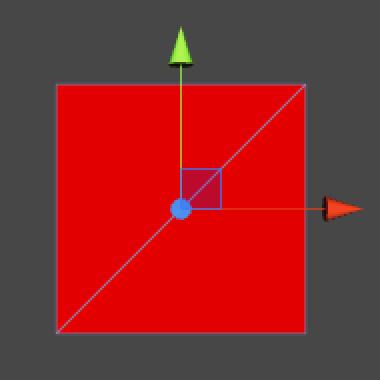 				A red quad. 			

Don't like red? What about green? Go ahead and change the color, but do this while still in play mode.

```
	private void FillTexture () {
		for (int y = 0; y < resolution; y++) {
			for (int x = 0; x < resolution; x++) {
				texture.SetPixel(x, y, Color.green);
			}
		}
		texture.Apply();
	}
```

You will see that Unity recompiles the code just fine, but the texture stays red. This is because `Awake` isn't called again when there is a recompile. However, there is another option.

The `OnEnable` method is called directly after `Awake`, each time the component is activated. This also happens after a recompile while in play mode. So if we use `OnEnable` instead of `Awake`, our quad will turn green without having to toggle play mode.

```
	private void OnEnable () {
		texture = new Texture2D(resolution, resolution, TextureFormat.RGB24, true);
		texture.name = "Procedural Texture";
		GetComponent<MeshRenderer>().material.mainTexture = texture;
		FillTexture();
	}
```

A flat color is not interesting at all. Instead, we can use a pixel's coordinates to define its color. We can directly put `x` in the red channel and `y`  in the green channel, leaving blue at zero. However, as color channels  are defined in a 0–1 range, we have to divide by the resolution, which  we can define outside the loop. 			

 				 					[Why a 0–1 range?](https://catlikecoding.com/unity/tutorials/noise/#a-01-range) 				 			

```
	private void FillTexture () {
		float stepSize = 1f / resolution;
		for (int y = 0; y < resolution; y++) {
			for (int x = 0; x < resolution; x++) {
				texture.SetPixel(x, y, new Color(x * stepSize, y * stepSize, 0f));
			}
		}
		texture.Apply();
	}
```

 				
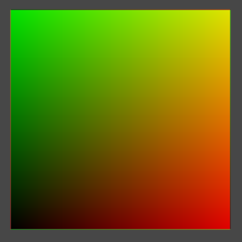 				Colored with texture coordinates. 			

Have now visualized the texture coordinates, also known as uv  coordinates. But there is something weird going on at the edge of the  texture. It is easier to see this when using a smaller resolution.  Unfortunately, changing the resolution has no effect while in play mode.

Let's create a custom inspector for our component so we can  easily detect any change to our component. It simply draws the default  inspector and checks for changes. If a change happened while we are also  in play mode, we should call `FillTexture`.

 				
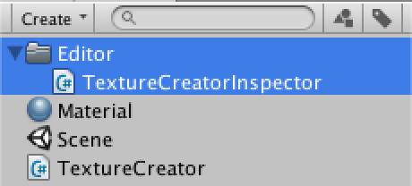 				Adding an inspector. 			

```
using UnityEditor;
using UnityEngine;

[CustomEditor(typeof(TextureCreator))]
public class TextureCreatorInspector : Editor {

	public override void OnInspectorGUI () {
		EditorGUI.BeginChangeCheck();
		DrawDefaultInspector();
		if (EditorGUI.EndChangeCheck() && Application.isPlaying) {
			(target as TextureCreator).FillTexture();
		}
	}
}
```

Of course this means that we have to make `FillTexture`  public. And it should also check whether the resolution has changed,  and if so resize the texture. Let's also constrain it to some reasonable  range, like 2–512.

```
	[Range(2, 512)]
	public int resolution = 256;

	public void FillTexture () {
		if (texture.width != resolution) {
			texture.Resize(resolution, resolution);
		}
		float stepSize = 1f / resolution;
		for (int y = 0; y < resolution; y++) {
			for (int x = 0; x < resolution; x++) {
				texture.SetPixel(x, y, new Color(x * stepSize, y * stepSize, 0f));
			}
		}
		texture.Apply();
	}
```

 				
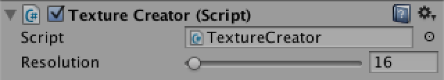 				Scrubbing the resolution, still in play mode. 			

We can do even better than that. We can also respond to undo and  redo actions, while in play mode. We can do this by registering a method  to the `Undo.undoRedoPerformed` delegate. So we create such a method and place the check whether we're in play mode there as well.

`**TextureCreatorInspector**` has to  register the method when it is enabled, but should also unregister it  when it is disabled. So add the appropriate methods, and also store a  reference to our creator so we don't have to cast it every time.

 				 					[What's a delegate?](https://catlikecoding.com/unity/tutorials/noise/#a-delegate) 				 			

```
	private TextureCreator creator;

	private void OnEnable () {
		creator = target as TextureCreator;
		Undo.undoRedoPerformed += RefreshCreator;
	}

	private void OnDisable () {
		Undo.undoRedoPerformed -= RefreshCreator;
	}

	private void RefreshCreator () {
		if (Application.isPlaying) {
			creator.FillTexture();
		}
	}

	public override void OnInspectorGUI () {
		EditorGUI.BeginChangeCheck();
		DrawDefaultInspector();
		if (EditorGUI.EndChangeCheck()) {
			RefreshCreator();
		}
	}
```

 				
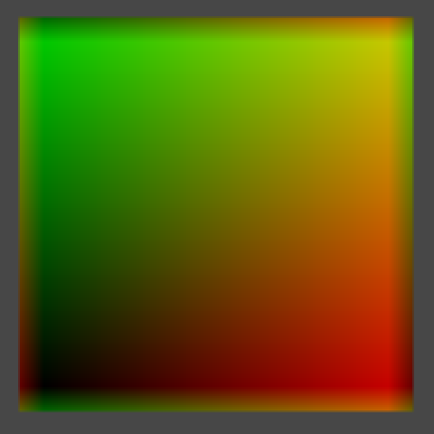 				UV colors at resolution 8. 			

Back to our weird edges! At a resolution of 8, it is a lot easier  to see what is happening. At the edges, colors from opposite sides are  blended together. This happens because the default wrap mode of textures  is to repeat themselves. We can get rid of this by having `**TextureCreator**` set its texture's wrap mode to clamp.

```
	private void OnEnable () {
		texture = new Texture2D(resolution, resolution, TextureFormat.RGB24, true);
		texture.name = "Procedural Texture";
		texture.wrapMode = TextureWrapMode.Clamp;
		GetComponent<MeshRenderer>().material.mainTexture = texture;
		FillTexture();
	}
```

 				
 				Clamped colors. 			

Why are we actually seeing a smooth color transition, if our  texture is only 8 by 8 pixels? This is because the default filter mode  is bilinear. Let's compare this with point filtering.

```
	private void OnEnable () {
		texture = new Texture2D(resolution, resolution, TextureFormat.RGB24, true);
		texture.name = "Procedural Texture";
		texture.wrapMode = TextureWrapMode.Clamp;
		texture.filterMode = FilterMode.Point;
		GetComponent<MeshRenderer>().material.mainTexture = texture;
		FillTexture();
	}
```

 				
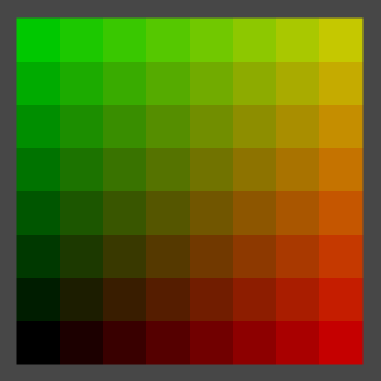 				Point filtering. 			

Now we see 64 blocks of solid colors, although an optical illusion will make it look like they contain gradients.

For each rendered pixel, point filter mode selects the color of  the texture pixel that it covers. This visually tells us where the  centers of our texture's pixels are, right in the middle of those  squares. Bilinear filtering linearly interpolates between those pixel  centers. Let's compare them again at a resolution of 2.

```
	private void OnEnable () {
		texture = new Texture2D(resolution, resolution, TextureFormat.RGB24, true);
		texture.name = "Procedural Texture";
		texture.wrapMode = TextureWrapMode.Clamp;
		texture.filterMode = FilterMode.Bilinear;
		GetComponent<MeshRenderer>().material.mainTexture = texture;
		FillTexture();
	}
```

 				 				 				2 by 2, point and bilinear filtering. 			

So the center of the bottom left texture pixel has uv coordinates (0.25, 0.25). The top right is at (0.75, 0.75). However, in `FillTexture`  we currently compute the colors for (0, 0) and (0.5, 0.5) respectively.  This means we are calculating the colors at the bottom left corners of  our pixels, instead of their centers. To fix this, we need to add half a  pixel to `x` and `y`.

```
	public void FillTexture () {
		if (texture.width != resolution) {
			texture.Resize(resolution, resolution);
		}
		float stepSize = 1f / resolution;
		for (int y = 0; y < resolution; y++) {
			for (int x = 0; x < resolution; x++) {
				texture.SetPixel(x, y, new Color((x + 0.5f) * stepSize, (y + 0.5f) * stepSize, 0f));
			}
		}
		texture.Apply();
	}
```

 				
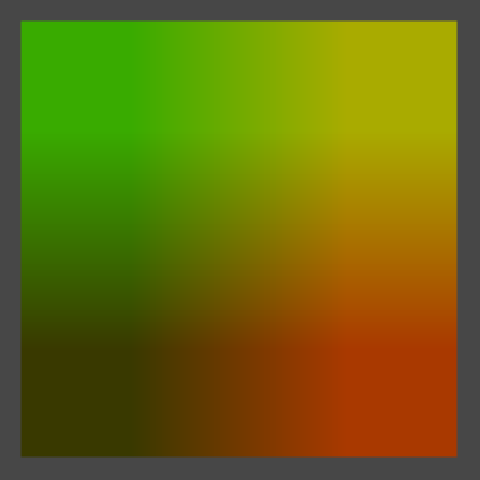 				2 by 2, correctly centered. 			

You can let the pattern repeat inside the texture by using the  remainder operator. For example, by taking the remainder of dividing by  0.1 we end up going from 0 to just below 0.1 ten times. To keep the  result visible, we simply scale it up by ten.

```
				texture.SetPixel(x, y,
					new Color((x + 0.5f) * stepSize % 0.1f, (y + 0.5f) * stepSize % 0.1f, 0f) * 10f);
```

 				
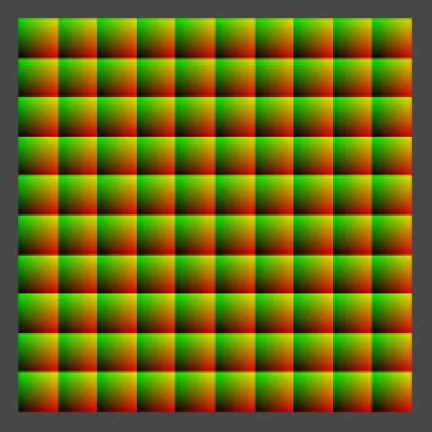 				Repeating the pattern. 			

After doing that, zoom out the scene view to see what happens.  Especially when zooming out far, you'll see the image gets sharper and  then suddenly blurrier a few times. This happens because of mipmapping,  which we have enabled. We can disable this by setting our texture's  fourth constructor argument to false.

```
	private void OnEnable () {
		texture = new Texture2D(resolution, resolution, TextureFormat.RGB24, false);
		texture.name = "Procedural Texture";
		texture.wrapMode = TextureWrapMode.Clamp;
		texture.filterMode = FilterMode.Bilinear;
		GetComponent<MeshRenderer>().material.mainTexture = texture;
		FillTexture();
	}
```

 				 				 				Zoomed out, with and without mipmapping. 			

Mipmapping definitely produces better results when zoomed out,  but it is unfortunate that there is a harsh transition between  successive mipmap levels. You can also see some of these transitions  when looking at the quad from a sharp angle, especially when in motion.

The quad will probably turn dark in the scene view when seen at  an angle, because of the way scene view lighting works. To temporarily  solve this, you can enable lighting in the scene view by toggling the  light button in its toolbar, and create a directional light.

Fortunately, there is a trilinear filtering option which also interpolated between adjacent mipmap levels, so let's use that.

```
	private void OnEnable () {
		texture = new Texture2D(resolution, resolution, TextureFormat.RGB24, true);
		texture.name = "Procedural Texture";
		texture.wrapMode = TextureWrapMode.Clamp;
		texture.filterMode = FilterMode.Trilinear;
		GetComponent<MeshRenderer>().material.mainTexture = texture;
		FillTexture();
	}
```

 				 				 				Bilinear and trilinear filtering. 			

With trilinear filtering, our texture is now displayed smoothly,  without sharp transitions. The downside is that it gets fuzzy quick when  viewed at an angle. To improve this, we can use anisotropic filtering.  It is enabled by setting the texture's aniso level to a value higher  than one. Let's set it to nine, because that's the highest level.

 				 					[What's anisotropic filtering?](https://catlikecoding.com/unity/tutorials/noise/#a-anisotropic) 				 			

```
	private void OnEnable () {
		texture = new Texture2D(resolution, resolution, TextureFormat.RGB24, true);
		texture.name = "Procedural Texture";
		texture.wrapMode = TextureWrapMode.Clamp;
		texture.filterMode = FilterMode.Trilinear;
		texture.anisoLevel = 9;
		GetComponent<MeshRenderer>().material.mainTexture = texture;
		FillTexture();
	}
```

 				
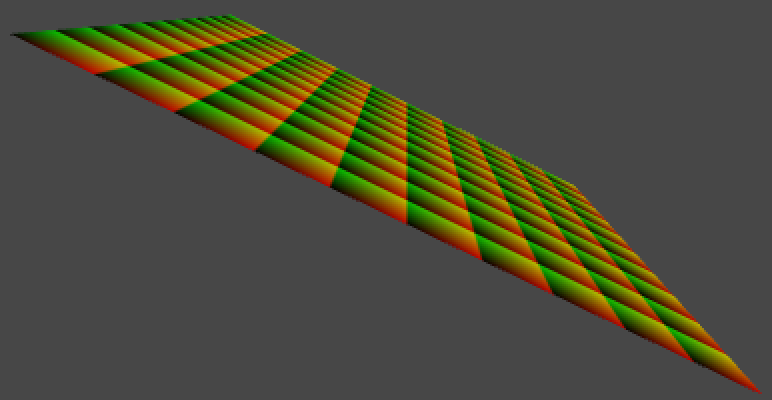 				Anisotropic filtering. 			

Let's leave our texture with these settings. But while we're at  it, we shouldn't create a new one each time our component is enabled. So  add a check for that.

```
	private void OnEnable () {
		if (texture == null) {
			texture = new Texture2D(resolution, resolution, TextureFormat.RGB24, true);
			texture.name = "Procedural Texture";
			texture.wrapMode = TextureWrapMode.Clamp;
			texture.filterMode = FilterMode.Trilinear;
			texture.anisoLevel = 9;
			GetComponent<MeshRenderer>().material.mainTexture = texture;
		}
		FillTexture();
	}
```

## Visualizing World Space

Right now we are visualizing the uv coordinates of our texture's  space, which is always the same. We can change this so we are  visualizing world coordinates instead. Our quad will act like a  measuring device for world coordinates.

First, let's define the local coordinates of the four corners of  our quad. Because it is centered on its own origin, these are  (-0.5,-0.5,0), (0.5,-0.5,0), (-0.5,0.5,0), and (0.5,0.5,0). We name them  *pointxy*, where *x* is 0 for the left side and 1 for the right size. Likewise, *y* is 0 for the bottom side and 1 for the top side.

```
	public void FillTexture () {
		if (texture.width != resolution) {
			texture.Resize(resolution, resolution);
		}

		Vector3 point00 = new Vector3(-0.5f,-0.5f);
		Vector3 point10 = new Vector3( 0.5f,-0.5f);
		Vector3 point01 = new Vector3(-0.5f, 0.5f);
		Vector3 point11 = new Vector3( 0.5f, 0.5f);

		float stepSize = 1f / resolution;
		for (int y = 0; y < resolution; y++) {
			for (int x = 0; x < resolution; x++) {
				texture.SetPixel(x, y,
					new Color((x + 0.5f) * stepSize % 0.1f, (y + 0.5f) * stepSize % 0.1f, 0f) * 10f);
			}
		}
		texture.Apply();
	}
```

Second, we linearly interpolate these corners inside our loops. We do this in two steps.

Step one is to interpolate between the bottom left and top left corner based on `y`, which gives us a point on the left side. We name it `point0`. We do the same thing for the right side, naming the result `point1`.

Step two is to interpolate between these intermediate points based on `x`.

We have now used bilinear interpolation to find the final point, which we directly convert into a color.

```
		float stepSize = 1f / resolution;
		for (int y = 0; y < resolution; y++) {
			Vector3 point0 = Vector3.Lerp(point00, point01, (y + 0.5f) * stepSize);
			Vector3 point1 = Vector3.Lerp(point10, point11, (y + 0.5f) * stepSize);
			for (int x = 0; x < resolution; x++) {
				Vector3 point = Vector3.Lerp(point0, point1, (x + 0.5f) * stepSize);
				texture.SetPixel(x, y, new Color(point.x, point.y, point.z));
			}
		}
```

 				
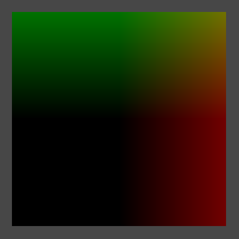 				Local coordinates. 			

We are now visualizing the local coorindates of our quad. So it  is always black at the center. It is also black at the bottom left  because those coordinates are negative and colors are clamped to the 0–1  range.

To visualize world-space coorinates instead, all we have to do is transform our four corner points to world space.

```
		Vector3 point00 = transform.TransformPoint(new Vector3(-0.5f,-0.5f));
		Vector3 point10 = transform.TransformPoint(new Vector3( 0.5f,-0.5f));
		Vector3 point01 = transform.TransformPoint(new Vector3(-0.5f, 0.5f));
		Vector3 point11 = transform.TransformPoint(new Vector3( 0.5f, 0.5f));
```

However, moving the quad currently doesn't cause the texture to change. We could add an `Update`  method and simply fill our texture every frame. That will ensure that  the texture is always up to date. Let's do this, but also check whether  our quad's transform has actually changed. That way the texture is only  refilled when necessary.

 				 					[How does `hasChanged` work?](https://catlikecoding.com/unity/tutorials/noise/#a-has-changed) 				 			

```
	private void Update () {
		if (transform.hasChanged) {
			transform.hasChanged = false;
			FillTexture();
		}
	}
```

Now you can move, rotate, and even scale the quad and it will  immediately change its color to match to world position it occupies.

 				
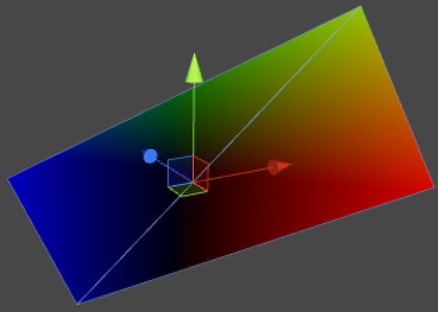 				World coordinates on a rotated and scaled quad. 			

## Making Noise

Visualizing world coordinates isn't very interesting. Instead, we  could visualize some mathematical formula, like a sine wave. Such  formulas are regular and predictable, while we often need irregular and  unpredictale shapes. For example to simulate dirt, rust, fabric  irregularities, and other patterns that appear random to us.

A naive approach is to simply use `Random.value`.  Unity's random methods use a function that computes its next number  based on some of its previous numbers, in such a way that we cannot  easily see a pattern.

```
		for (int y = 0; y < resolution; y++) {
			Vector3 point0 = Vector3.Lerp(point00, point01, (y + 0.5f) * stepSize);
			Vector3 point1 = Vector3.Lerp(point10, point11, (y + 0.5f) * stepSize);
			for (int x = 0; x < resolution; x++) {
				Vector3 point = Vector3.Lerp(point0, point1, (x + 0.5f) * stepSize);
				texture.SetPixel(x, y, Color.white * Random.value);
			}
		}
```

 				
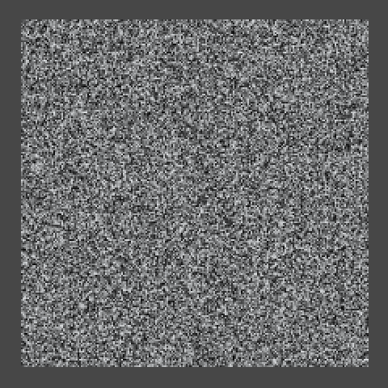 				Noise. 			

The result sure looks random. Unfortunately, it is so random that  we get a different result each time the texture is filled. This is  because the random sequence continues from where it ended after the  previous texture fill. But we don't want this, we actually want  pseudorandom noise that produces the same results each time. We can  solve this by choosing a fixed initial value – known as a seed – before  filling the texture.

```
		float stepSize = 1f / resolution;
		Random.seed = 42;
		for (int y = 0; y < resolution; y++) {
			Vector3 point0 = Vector3.Lerp(point00, point01, (y + 0.5f) * stepSize);
			Vector3 point1 = Vector3.Lerp(point10, point11, (y + 0.5f) * stepSize);
			for (int x = 0; x < resolution; x++) {
				Vector3 point = Vector3.Lerp(point0, point1, (x + 0.5f) * stepSize);
				texture.SetPixel(x, y, Color.white * Random.value);
			}
		}
```

Now we get the same pattern each time. That is, until we change  the resolution of the image. The value sequence does not depend on the  pixel uv coordinates, but on the order in which the pixels are filled.  The left side of the bottom row stays the same as you increase the  resolution, but the rest of the sequence shifts as it gets applied to  longer rows.

 				 				 				 				The same sequence at resolutions 32, 64, and 128. 			

This won't do. We want our pattern to be independent of the  resolution and order in which we fill our texture. It is time to write  our own pseudorandom noise code!

Create a script named *Noise* and turn it into a static class. This will become our noise library.

 				
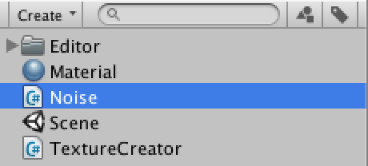 				Noise library. 			

```
using UnityEngine;

public static class Noise {
}
```

What we want is a method that, given point in 3D space, returns a  seemingly random value. Let's just return the point's x coordinate for  now.

```
	public static float Value (Vector3 point) {
		return point.x;
	}
```

Now we can change the `FillTexture` method of `**TextureCreator**` so it uses this new method. Also remove the assigment to `Random.seed`, because we no longer need it.

```
		float stepSize = 1f / resolution;
		for (int y = 0; y < resolution; y++) {
			Vector3 point0 = Vector3.Lerp(point00, point01, (y + 0.5f) * stepSize);
			Vector3 point1 = Vector3.Lerp(point10, point11, (y + 0.5f) * stepSize);
			for (int x = 0; x < resolution; x++) {
				Vector3 point = Vector3.Lerp(point0, point1, (x + 0.5f) * stepSize);
				texture.SetPixel(x, y, Color.white * Noise.Value(point));
			}
		}
```

Of course `**Noise**.Value` doesn't  produce anything that looks like noise yet. But how do we generate such a  pattern? Let's start very simple, with alternating stripes of black and  white.

We can generate vertical stripes by casting the point's x  coordinate to an integer, discarding its fractional part. Then we return  1 when the integer is odd, otherwise we return 0. We could do this by  returning the remainder of dividing our integer by two.

```
	public static float Value (Vector3 point) {
		int i = (int)point.x;
		return i % 2;
	}
```

We should now see unit-length stripes on our quad, but only if we  move it far enough to the right or increase its scale. We could get a  better look at our pattern if we scaled it down. Let's do so by adding a  frequency parameter to our method. The idea is that if the frequency is  doubled, the pattern changes twice as fast. We can do this by simply  multiplying the point by the frequency.

```
	public static float Value (Vector3 point, float frequency) {
		point *= frequency;
		int i = (int)point.x;
		return i % 2;
	}
```

Then add a public `frequency` variable to `**TextureCreator**` so it becomes configurable, and pass it to the noise method.

```
	public float frequency = 1f;
			
	public void FillTexture () {
		if (texture.width != resolution) {
			texture.Resize(resolution, resolution);
		}
		
		Vector3 point00 = transform.TransformPoint(new Vector3(-0.5f,-0.5f));
		Vector3 point10 = transform.TransformPoint(new Vector3( 0.5f,-0.5f));
		Vector3 point01 = transform.TransformPoint(new Vector3(-0.5f, 0.5f));
		Vector3 point11 = transform.TransformPoint(new Vector3( 0.5f, 0.5f));
		
		float stepSize = 1f / resolution;
		for (int y = 0; y < resolution; y++) {
			Vector3 point0 = Vector3.Lerp(point00, point01, (y + 0.5f) * stepSize);
			Vector3 point1 = Vector3.Lerp(point10, point11, (y + 0.5f) * stepSize);
			for (int x = 0; x < resolution; x++) {
				Vector3 point = Vector3.Lerp(point0, point1, (x + 0.5f) * stepSize);
				texture.SetPixel(x, y, Color.white * Noise.Value(point, frequency));
			}
		}
		texture.Apply();
	}
```

 				 				 				Half the stripes at frequency 10. 			

Assuming the quad is not transformed, at a frequency of 10 we can  see a total of five stripes – three black and two white – on the  positive side, but nothing on the negative side. That's because the  remainder on the left side is either zero or negative one. So we should  return the absolute value of the remainder.

Alternatively, because integers are stored as binary numbers, we  can look at the least significant bit to determine whether the number is  odd. This can be done with the bitwise-and operator, discarding  everything except the least significant bit. As a bonus, this approach  is also very fast.

 				 					[How does `&` work?](https://catlikecoding.com/unity/tutorials/noise/#a-bitwise-and) 				 			

```
		return i & 1;
```

 				
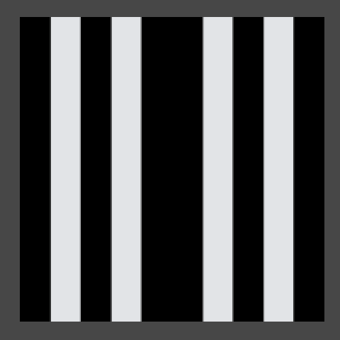 				Stripes with a gap. 			

The stripes now appear on both sides, but the pattern is  mirrored, which causes a gap. As casting to an integer discards the  fractional part of a float, it effectively rounds down on the positive  side, while rounding up on the negative side. We could solve this by  subtracting one when on the negative side. But there's also a convenient  method that does this for us, so let's use that.

```
		int i = Mathf.FloorToInt(point.x);
		return i & 1;
```

 				
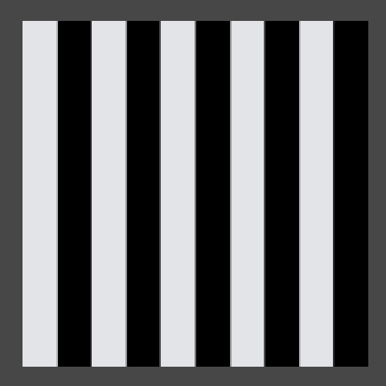 				Correct stripe pattern. 			

Now that we have produced a correct pattern by partitioning  space, we can build our noise on top of that. Such noice is known as  lattice noise, because it divides space into a regular lattice. In this  case it's regular 1D intervals, while in 2D it would be a square grid  and in 3D a cube grid.

The next step is to assign seemingly random values to each stripe  coordinate, instead of just alternating black and white. This is done  by using some function that converts any lattice coordinate into some  other value. Such a function is known as a hash function, and there are  many different flavors of those.

We will use a permutation array as our hashing method. This is  simply an array containing a bunch of integers, let's use 0 through 7.

If we were to use our integer coordinate to index this array,  we'd get a value up to seven. Let's do that and scale the result so we  stay in the 0–1 range.

```
	private static int[] hash = {
		0, 1, 2, 3, 4, 5, 6, 7
	};

	public static float Value (Vector3 point, float frequency) {
		point *= frequency;
		int i = Mathf.FloorToInt(point.x);
		return hash[i] / 7f;
	}
```

However, this will result in an error as `i` goes out  of the index range of our array when it goes above seven or below zero.  Because our array has a length of eight, if we limit ourselves to the  three least significant bits of `i`, the index will wrap around exactly when it needs to.

```
		point *= frequency;
		int i = Mathf.FloorToInt(point.x);
		i &= 7;
		return hash[i] / 7f;
```

 				
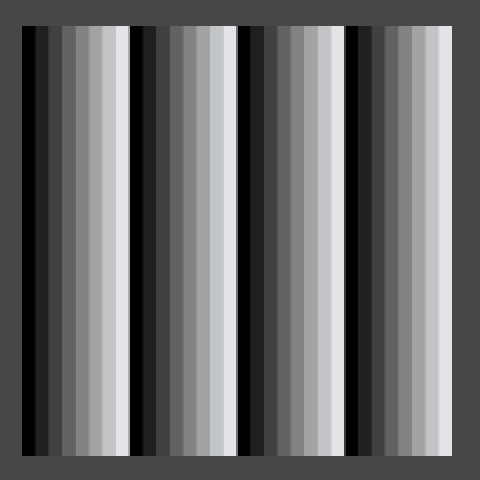 				Using the hash array with frequency 32. 			

We now see up to eight different colors, but the pattern is still  obviously regular and repeating. Let's make it less obvious by  shuffling the values inside the array. That will result in a different  permutation of the same collection of numbers. This is why such an array  is often named a permutation array or a permutation table.

```
	private static int[] hash = {
		4, 2, 7, 5, 1, 6, 3, 0
	};
```

 				
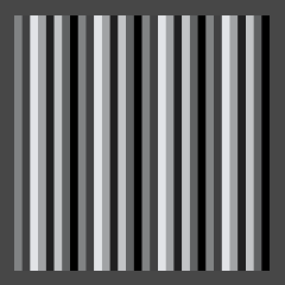 				Using a different permutation. 			

The pattern now looks less regular, but it still clearly repeats.  What would happen if we add another permutation of the same sequence to  the array? As this increases our array's size to 16, we also need to  add an additional bit to our bit mask.

```
	private static int[] hash = {
		4, 2, 7, 5, 1, 6, 3, 0, 1, 5, 3, 7, 2, 0, 4, 6
	};

	public static float Value (Vector3 point, float frequency) {
		point *= frequency;
		int i = Mathf.FloorToInt(point.x);
		i &= 15;
		return hash[i] / 7f;
	}
```

 				
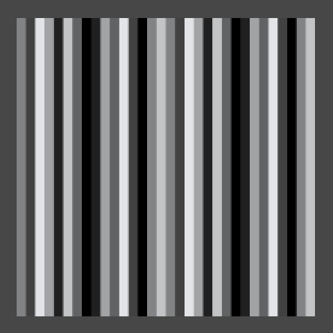 				Using two permutations in one array. 			

We simply got a larger sequence that contains each value twice.  We might as well make every value unique and increase our output range  to 16 different values.

```
	private static int[] hash = {
		7, 3, 15, 8, 1, 6, 0, 2, 11, 5, 12, 4, 9, 14, 13, 10
	};

	public static float Value (Vector3 point, float frequency) {
		point *= frequency;
		int i = Mathf.FloorToInt(point.x);
		i &= 15;
		return hash[i] / 15f;
	}
```

 				
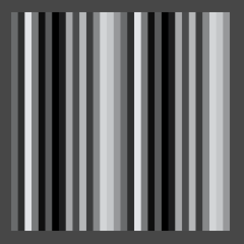 				16 distinct values. 			

The hash array will always produce a tiling pattern, but we only  notice that when we see a large enough sampling of it. So let's increase  its length to 256. If we also define the hash mask value as a constant,  our method will work regardless of the array's size.

```
	private static int[] hash = {
		151,160,137, 91, 90, 15,131, 13,201, 95, 96, 53,194,233,  7,225,
		140, 36,103, 30, 69,142,  8, 99, 37,240, 21, 10, 23,190,  6,148,
		247,120,234, 75,  0, 26,197, 62, 94,252,219,203,117, 35, 11, 32,
		 57,177, 33, 88,237,149, 56, 87,174, 20,125,136,171,168, 68,175,
		 74,165, 71,134,139, 48, 27,166, 77,146,158,231, 83,111,229,122,
		 60,211,133,230,220,105, 92, 41, 55, 46,245, 40,244,102,143, 54,
		 65, 25, 63,161,  1,216, 80, 73,209, 76,132,187,208, 89, 18,169,
		200,196,135,130,116,188,159, 86,164,100,109,198,173,186,  3, 64,
		 52,217,226,250,124,123,  5,202, 38,147,118,126,255, 82, 85,212,
		207,206, 59,227, 47, 16, 58, 17,182,189, 28, 42,223,183,170,213,
		119,248,152,  2, 44,154,163, 70,221,153,101,155,167, 43,172,  9,
		129, 22, 39,253, 19, 98,108,110, 79,113,224,232,178,185,112,104,
		218,246, 97,228,251, 34,242,193,238,210,144, 12,191,179,162,241,
		 81, 51,145,235,249, 14,239,107, 49,192,214, 31,181,199,106,157,
		184, 84,204,176,115,121, 50, 45,127,  4,150,254,138,236,205, 93,
		222,114, 67, 29, 24, 72,243,141,128,195, 78, 66,215, 61,156,180
	};

	private const int hashMask = 255;

	public static float Value (Vector3 point, float frequency) {
		point *= frequency;
		int i = Mathf.FloorToInt(point.x);
		i &= hashMask;
		return hash[i] * (1f / hashMask);
	}
```

 				 				 				 				256 values, at frequency 32, 256, and 512. 			

This particular permutation is the same one that Ken Perlin uses  in his reference implementations of his noise algorithm, which we'll  cover later. Besides that, there is nothing special about it.

With this array it takes a while before we see it repeat. When  using a frequency of 512 we can see that it repeats once, but at that  point we can't even see the individual lines anymore. You can increase  the array size even more, or use other tricks to dramatically increase  the period length, but 256 suffices for most cases.

## Going Into Higher Dimensions

Let's extend this approach to two dimensions. Duplicate the `Value` method and add a *1D* and a *2D* suffix to them.

```
	public static float Value1D (Vector3 point, float frequency) {
		point *= frequency;
		int i = Mathf.FloorToInt(point.x);
		i &= hashMask;
		return hash[i] * (1f / hashMask);
	}

	public static float Value2D (Vector3 point, float frequency) {
		point *= frequency;
		int i = Mathf.FloorToInt(point.x);
		i &= hashMask;
		return hash[i] * (1f / hashMask);
	}
```

Then change `**TextureCreator**.FillTexture` so it uses the 2D version of our noise method.

```
				texture.SetPixel(x, y, Color.white * Noise.Value2D(point, frequency));
```

Now we have to give the y coordinate the same treatment as the x coordinate. So add a second versions of the `i` variable, naming them `ix` and `iy`.

Instead of directly returning the hash of `ix`, we'll add it to `iy` and use that to index the hash array a second time. Of course, we need to make sure that their sum remains within bounds.

```
	public static float Value2D (Vector3 point, float frequency) {
		point *= frequency;
		int ix = Mathf.FloorToInt(point.x);
		int iy = Mathf.FloorToInt(point.y);
		ix &= hashMask;
		iy &= hashMask;
		return hash[(hash[ix] + iy) & hashMask] * (1f / hashMask);
	}
```

 				
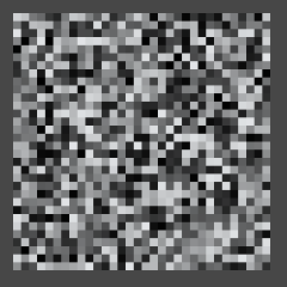 				2D hashing. 			

It looks pretty random, right? We are offseting the hash index of  the y coordinate by the hash result of the x coordinate. But this means  that the vertical patterns are all the same, they're just placed at  different offsets. You can spot this in the image above if you know  where to look. It contains two adjacent columns that are offset by  exactly one step. This happens because the fourth and fifth numbers in  the hash array are 91 and 90. So in case you cannot find them, they are  the fourth and fifth column to the right of the center.

So should we eliminate all such sequences from the hash array?  No, because there are many more small patterns that become obvious once  you are aware of them. Instead of improving the hash array, you're  better off using a different hashing method altogether. But again, for  most purposes the illusion of randomness is convincing enough.

Of course there is also a third dimension, so let's copy our 2D  method and change it into a 3D one. The approach is the same as going  from 1D to 2D. Although the method is entirely new, I've only marked the  adjustments needed to take the third dimension into account.

```
	public static float Value3D (Vector3 point, float frequency) {
		point *= frequency;
		int ix = Mathf.FloorToInt(point.x);
		int iy = Mathf.FloorToInt(point.y);
		int iz = Mathf.FloorToInt(point.z);
		ix &= hashMask;
		iy &= hashMask;
		iz &= hashMask;
		return hash[(hash[(hash[ix] + iy) & hashMask] + iz) & hashMask] * (1f / hashMask);
	}
```

Why are we actually masking `iy` and `iz`,  if we mask them again after adding them to a hash? That is a good  question, because a mask operator after adding should suffice. What  you'll actually encounter a lot in practice is that the additional hash  doesn't happen. But then the maximum possible index that we could get is  255 + 255, which is clearly out of bounds. This problem is solved by  doubling the length of the hash array, repeating its contents. That way  indices 256 through 511 give the same result as indices 0 through 255,  so a new mask operation is no longer needed. So let's do that as well.

```
	private static int[] hash = {
		151,160,137, 91, 90, 15,131, 13,201, 95, 96, 53,194,233,  7,225,
		140, 36,103, 30, 69,142,  8, 99, 37,240, 21, 10, 23,190,  6,148,
		247,120,234, 75,  0, 26,197, 62, 94,252,219,203,117, 35, 11, 32,
		 57,177, 33, 88,237,149, 56, 87,174, 20,125,136,171,168, 68,175,
		 74,165, 71,134,139, 48, 27,166, 77,146,158,231, 83,111,229,122,
		 60,211,133,230,220,105, 92, 41, 55, 46,245, 40,244,102,143, 54,
		 65, 25, 63,161,  1,216, 80, 73,209, 76,132,187,208, 89, 18,169,
		200,196,135,130,116,188,159, 86,164,100,109,198,173,186,  3, 64,
		 52,217,226,250,124,123,  5,202, 38,147,118,126,255, 82, 85,212,
		207,206, 59,227, 47, 16, 58, 17,182,189, 28, 42,223,183,170,213,
		119,248,152,  2, 44,154,163, 70,221,153,101,155,167, 43,172,  9,
		129, 22, 39,253, 19, 98,108,110, 79,113,224,232,178,185,112,104,
		218,246, 97,228,251, 34,242,193,238,210,144, 12,191,179,162,241,
		 81, 51,145,235,249, 14,239,107, 49,192,214, 31,181,199,106,157,
		184, 84,204,176,115,121, 50, 45,127,  4,150,254,138,236,205, 93,
		222,114, 67, 29, 24, 72,243,141,128,195, 78, 66,215, 61,156,180,

		151,160,137, 91, 90, 15,131, 13,201, 95, 96, 53,194,233,  7,225,
		140, 36,103, 30, 69,142,  8, 99, 37,240, 21, 10, 23,190,  6,148,
		247,120,234, 75,  0, 26,197, 62, 94,252,219,203,117, 35, 11, 32,
		 57,177, 33, 88,237,149, 56, 87,174, 20,125,136,171,168, 68,175,
		 74,165, 71,134,139, 48, 27,166, 77,146,158,231, 83,111,229,122,
		 60,211,133,230,220,105, 92, 41, 55, 46,245, 40,244,102,143, 54,
		 65, 25, 63,161,  1,216, 80, 73,209, 76,132,187,208, 89, 18,169,
		200,196,135,130,116,188,159, 86,164,100,109,198,173,186,  3, 64,
		 52,217,226,250,124,123,  5,202, 38,147,118,126,255, 82, 85,212,
		207,206, 59,227, 47, 16, 58, 17,182,189, 28, 42,223,183,170,213,
		119,248,152,  2, 44,154,163, 70,221,153,101,155,167, 43,172,  9,
		129, 22, 39,253, 19, 98,108,110, 79,113,224,232,178,185,112,104,
		218,246, 97,228,251, 34,242,193,238,210,144, 12,191,179,162,241,
		 81, 51,145,235,249, 14,239,107, 49,192,214, 31,181,199,106,157,
		184, 84,204,176,115,121, 50, 45,127,  4,150,254,138,236,205, 93,
		222,114, 67, 29, 24, 72,243,141,128,195, 78, 66,215, 61,156,180
	};

	public static float Value2D (Vector3 point, float frequency) {
		point *= frequency;
		int ix = Mathf.FloorToInt(point.x);
		int iy = Mathf.FloorToInt(point.y);
		ix &= hashMask;
		iy &= hashMask;
		return hash[hash[ix] + iy] * (1f / hashMask);
	}

	public static float Value3D (Vector3 point, float frequency) {
		point *= frequency;
		int ix = Mathf.FloorToInt(point.x);
		int iy = Mathf.FloorToInt(point.y);
		int iz = Mathf.FloorToInt(point.z);
		ix &= hashMask;
		iy &= hashMask;
		iz &= hashMask;
		return hash[hash[hash[ix] + iy] + iz] * (1f / hashMask);
	}
```

Now we could once again change which method we use in our  texture-filling loop, but that is getting tedious. Let's make it  configurable instead.

Begin by creating a delegate type for our noise methods. As it  belongs with the noise library place it in the same script, but outside  of the `**Noise**` class.

```
using UnityEngine;

public delegate float NoiseMethod (Vector3 point, float frequency);

public static class Noise {
	…
}
```

Then add a public static array containing references to the value methods to `**Noise**`, ordered by their dimension.

```
	public static NoiseMethod[] valueMethods = {
		Value1D,
		Value2D,
		Value3D
	};
```

Also add a public dimension variable to `**TextureCreator**`  so we can configure which noise value it should use. To limit the value  we can set it to via the inspector, give it a range from 1 to 3.

```
	[Range(1, 3)]
	public int dimensions = 3;
```

Now we can let `**TextureCreator**.FillTexture` select the desired method from the value methods array, using `dimensions` minus one as an index. Then we can call this method to get our noise value.

```
		NoiseMethod method = Noise.valueMethods[dimensions - 1];
		float stepSize = 1f / resolution;
		for (int y = 0; y < resolution; y++) {
			Vector3 point0 = Vector3.Lerp(point00, point01, (y + 0.5f) * stepSize);
			Vector3 point1 = Vector3.Lerp(point10, point11, (y + 0.5f) * stepSize);
			for (int x = 0; x < resolution; x++) {
				Vector3 point = Vector3.Lerp(point0, point1, (x + 0.5f) * stepSize);
				texture.SetPixel(x, y, Color.white * method(point, frequency));
			}
		}
```

 				 				 				3D hasing and a dimension slider. 			

If our quad is not rotated, the 3D version of our noise looks  similar to the 2D version. The only difference is that the values are  hashed an additional time by the 3D method. This similarity vanishes  when we rotate the quad so it is no longer aligned with the world axes.

 				 				 				 				1D, 2D, and 3D hash values with rotation (45,45,0). 			

## Interpolating Hash Values

We can now produce reasonably random-looking patterns that are  also resolution-independent. However, there is a sharp transition  between adjacent hash values, which is most often undesirable. Instead,  we want a pattern that smoothly transitions from one hash value to the  next.

For our 1D noise version, that would mean instead of one hash  value we'll have to compute two. One for the lattice coordinate to the  left of our sample point, and one for the lattice coordinate to the  right of it. Let's rename `i` to `i0` and add `i1` to represent the next coordinate. We then retrieve the hashes for both of them, which we store in `h0` and `h1`.

```
	public static float Value1D (Vector3 point, float frequency) {
		point *= frequency;
		int i0 = Mathf.FloorToInt(point.x);
		i0 &= hashMask;
		int i1 = i0 + 1;

		int h0 = hash[i0];
		int h1 = hash[i1];

		return h0 * (1f / hashMask);
	}
```

Now we have to interpolate between `h0` and `h1`.  The linear interpolant value is simply the distance from the left  integer coordinate to the sample point. As we must compute this before  masking the coordinate, we store this value in a new variable `t`.

```
	public static float Value1D (Vector3 point, float frequency) {
		point *= frequency;
		int i0 = Mathf.FloorToInt(point.x);
		float t = point.x - i0;
		i0 &= hashMask;
		int i1 = i0 + 1;

		int h0 = hash[i0];
		int h1 = hash[i1];

		return Mathf.Lerp(h0, h1, t) * (1f / hashMask);
	}
```

 				 				 				Sharp vs. linear transitions in 1D. 			

This particular type of noise is known as Value noise.

Although the values of our noise are now interpolated, there are  still sharp transitions. This is because we now see adjacent linear  gradients that abruptly change direction. Instead of directly using the  linear distance, we can turn it into a smooth curve by using a function  that has a first derivative which is zero at both ends. That way the  rate of change is always zero at gradient boundaries. Actually, let's go  a step further and use a function with a second derivate that has the  same properties. Such a function is **6t5 - 15t4 + 10t3**.

Let's add a method that puts `t` though this function.  Because we don't have an atomic power operation, we program it using  multiplications only, for example as **t t t (t (t 6 - 15) + 10)**.

 				 					[Why a 5th degree polynomial?](https://catlikecoding.com/unity/tutorials/noise/#a-polynomial) 				 			

```
	private static float Smooth (float t) {
		return t * t * t * (t * (t * 6f - 15f) + 10f);
	}
```

Now we can smooth `t` before using it to interpolate between our hashes.

```
		t = Smooth(t);
		return Mathf.Lerp(h0, h1, t) * (1f / hashMask);
```

 				 				 				 				Smooth transitions in 1D. 			

The 1D noise only needed to interpolate along the x axis, but the  2D version also needs to interpolate along the y axis, performing a  bilinear interpolation between four hashes. First, let's rewrite `Value2D` a bit so it has the same structure as the 1D version.

```
	public static float Value2D (Vector3 point, float frequency) {
		point *= frequency;
		int ix0 = Mathf.FloorToInt(point.x);
		int iy0 = Mathf.FloorToInt(point.y);
		ix0 &= hashMask;
		iy0 &= hashMask;

		int h0 = hash[ix0];
		int h00 = hash[h0 + iy0];

		return h00 * (1f / hashMask);
	}
```

Then add the hash of the opposite corner.

```
	public static float Value2D (Vector3 point, float frequency) {
		point *= frequency;
		int ix0 = Mathf.FloorToInt(point.x);
		int iy0 = Mathf.FloorToInt(point.y);
		ix0 &= hashMask;
		iy0 &= hashMask;
		int ix1 = ix0 + 1;
		int iy1 = iy0 + 1;

		int h0 = hash[ix0];
		int h1 = hash[ix1];
		int h00 = hash[h0 + iy0];
		int h11 = hash[h1 + iy1];

		return h00 * (1f / hashMask);
	}
```

But of course we need four hashes, not only the bottom left and top right ones.

```
		int h0 = hash[ix0];
		int h1 = hash[ix1];
		int h00 = hash[h0 + iy0];
		int h10 = hash[h1 + iy0];
		int h01 = hash[h0 + iy1];
		int h11 = hash[h1 + iy1];
```

And finally, we create the interpolants and perform the bilinear interpolation.

```
		int ix0 = Mathf.FloorToInt(point.x);
		int iy0 = Mathf.FloorToInt(point.y);
		float tx = point.x - ix0;
		float ty = point.y - iy0;
		ix0 &= hashMask;
		iy0 &= hashMask;
		int ix1 = ix0 + 1;
		int iy1 = iy0 + 1;

		int h0 = hash[ix0];
		int h1 = hash[ix1];
		int h00 = hash[h0 + iy0];
		int h10 = hash[h1 + iy0];
		int h01 = hash[h0 + iy1];
		int h11 = hash[h1 + iy1];

		tx = Smooth(tx);
		ty = Smooth(ty);
		return Mathf.Lerp(
			Mathf.Lerp(h00, h10, tx),
			Mathf.Lerp(h01, h11, tx),
			ty) * (1f / hashMask);
	}
```

 				 				 				 				2D Value noise. 			

When applying this approach to three dimensions the process is  the same, it just gets bigger. you end up with eight hashes and need to  perform a trilinear interpolation. I've copied the 2D code into the 3D  method and marked the changes from there.

```
	public static float Value3D (Vector3 point, float frequency) {
		point *= frequency;
		int ix0 = Mathf.FloorToInt(point.x);
		int iy0 = Mathf.FloorToInt(point.y);
		int iz0 = Mathf.FloorToInt(point.z);
		float tx = point.x - ix0;
		float ty = point.y - iy0;
		float tz = point.z - iz0;
		ix0 &= hashMask;
		iy0 &= hashMask;
		iz0 &= hashMask;
		int ix1 = ix0 + 1;
		int iy1 = iy0 + 1;
		int iz1 = iz0 + 1;

		int h0 = hash[ix0];
		int h1 = hash[ix1];
		int h00 = hash[h0 + iy0];
		int h10 = hash[h1 + iy0];
		int h01 = hash[h0 + iy1];
		int h11 = hash[h1 + iy1];
		int h000 = hash[h00 + iz0];
		int h100 = hash[h10 + iz0];
		int h010 = hash[h01 + iz0];
		int h110 = hash[h11 + iz0];
		int h001 = hash[h00 + iz1];
		int h101 = hash[h10 + iz1];
		int h011 = hash[h01 + iz1];
		int h111 = hash[h11 + iz1];

		tx = Smooth(tx);
		ty = Smooth(ty);
		tz = Smooth(tz);
		return Mathf.Lerp(
			Mathf.Lerp(Mathf.Lerp(h000, h100, tx), Mathf.Lerp(h010, h110, tx), ty),
			Mathf.Lerp(Mathf.Lerp(h001, h101, tx), Mathf.Lerp(h011, h111, tx), ty),
			tz) * (1f / hashMask);
	}
```

 				 				 				 				 				 				 				3D Value noise, moving to the next z coordinate in the lattice grid. 			

The 3D noise still appears the same as 2D noise when looking  along the z axis. But now it smoothly morphs into a new pattern when  moving along z, instead of abruptly changing. Because the rate of change  is zero at the lattice points, when moving at constant speed the noise  appears to pulse, oscillating between pure 2D patterns and fuzzy blends.  Of course the picture changes dramatically when you rotate the quad.

 				 				 				 				1D, 2D, and 3D Value noise with rotation (45,45,0). 			

### Creating Gradient Noise

While Value noise is smooth, it has a blocky appearance. The  patterns look random but are clearly constrained to a grid, which is  undesirable when trying to create a more chaotic or natural-looking  surface.

Until now we've selected a single fixed value per lattice  coordinate, which means only the intensity of the image varies. If we  could somehow add more variety – especially a sense of direction – we  might be able to obfuscate that we're using a grid.

A solution is to associate gradients with each lattice  coordinate, instead of constant values. If we orient those gradients in  different directions and then interpolate between them, then the grid  becomes a lot less obvious. As Ken Perlin was the first to use this  technique, it is known as Perlin noise.

So let's create some Perlin noise! Begin by copying the three Value methods in `**Noise**`, renaming them to Perlin. Then also add a `perlinMethods` array. Let's go one step further and create an array of noise method arrays as well, containing our two existing arrays.

```
	public static NoiseMethod[] perlinMethods = {
		Perlin1D,
		Perlin2D,
		Perlin3D
	};

	public static NoiseMethod[][] noiseMethods = {
		valueMethods,
		perlinMethods
	};
	
	public static float Perlin1D (Vector3 point, float frequency) {
		…
	}
	
	public static float Perlin2D (Vector3 point, float frequency) {
		…
	}
	
	public static float Perlin3D (Vector3 point, float frequency) {
		…
	}
```

Then add a noise method type enumeration, which can be used to index the double array.

```
using UnityEngine;

public delegate float NoiseMethod (Vector3 point, float frequency);

public enum NoiseMethodType {
	Value,
	Perlin
}

public static class Noise {
	…
}
```

Now we can add another configuration option to `**TextureCreator**`, so we can use the inspector to switch between Value noise and Perlin noise.

```
	public NoiseMethodType type;
	
	public void FillTexture () {
		if (texture.width != resolution) {
			texture.Resize(resolution, resolution);
		}
		
		Vector3 point00 = transform.TransformPoint(new Vector3(-0.5f,-0.5f));
		Vector3 point10 = transform.TransformPoint(new Vector3( 0.5f,-0.5f));
		Vector3 point01 = transform.TransformPoint(new Vector3(-0.5f, 0.5f));
		Vector3 point11 = transform.TransformPoint(new Vector3( 0.5f, 0.5f));

		NoiseMethod method = Noise.noiseMethods[(int)type][dimensions - 1];
		float stepSize = 1f / resolution;
		for (int y = 0; y < resolution; y++) {
			Vector3 point0 = Vector3.Lerp(point00, point01, (y + 0.5f) * stepSize);
			Vector3 point1 = Vector3.Lerp(point10, point11, (y + 0.5f) * stepSize);
			for (int x = 0; x < resolution; x++) {
				Vector3 point = Vector3.Lerp(point0, point1, (x + 0.5f) * stepSize);
				texture.SetPixel(x, y, Color.white * method(point, frequency));
			}
		}
		texture.Apply();
	}
```

 				
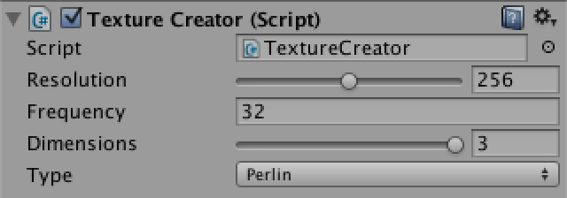 				Selecing which noise type to use. 			

Of course we see no change yet when switching to Perlin noise,  because those methods are still producing Value noise. So how how do we  convert from using hash values to using hash gradients? Let's consider  one-dimensional noise first, which so far is simply interpolating  between two hash values.

The most basic one-dimensional gradient function is **g(x) = x**, which is simply *x* unmodified. In our case, we are only interested in the values of *x* in between two integer coodinates, so we can use our `t` variable, before it is smoothed. Let's visualize this gradient by simply returning `t`, ignoring the hashes for a moment.

```
	public static float Perlin1D (Vector3 point, float frequency) {
		point *= frequency;
		int i0 = Mathf.FloorToInt(point.x);
		float t = point.x - i0;
		i0 &= hashMask;
		int i1 = i0 + 1;
		
		int h0 = hash[i0];
		int h1 = hash[i1];
		
		return t;
	}
```

 				
 				The most basic gradient. 			

Now every stripe has the same gradient, except that they are offset from one another. So for every `t0`, the gradient to the right of it is `t1 = t0 - 1`. Let's smoothly interpolate them.

```
		point *= frequency;
		int i0 = Mathf.FloorToInt(point.x);
		float t0 = point.x - i0;
		float t1 = t0 - 1f;
		i0 &= hashMask;
		int i1 = i0 + 1;
		
		int h0 = hash[i0];
		int h1 = hash[i1];

		float t = Smooth(t0);
		return Mathf.Lerp(t0, t1, t);
```

 				
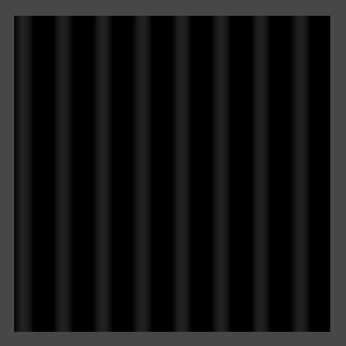 				Smoothly interpolating gradients. 			

The resulting image is dark because the gradients cancel each  other out. Had we used linear interpolation it would be completely  black, but because we're using smooth interpolation each gradient gets  more dominant as it approaches zero. As the `t1` values go below zero, we don't see them.

Indeed, Perlin noise can procude both positive and negative values. Ideally, its range is -1–1. To make this range visible, `**TextureCreator**.FillTexture`  has to scale and offset the noise samples so -1 becomes 0, 0 becomes  0.5, and 1 stays 1, but we shouldn't do this when using Value noise.

```
		for (int y = 0; y < resolution; y++) {
			Vector3 point0 = Vector3.Lerp(point00, point01, (y + 0.5f) * stepSize);
			Vector3 point1 = Vector3.Lerp(point10, point11, (y + 0.5f) * stepSize);
			for (int x = 0; x < resolution; x++) {
				Vector3 point = Vector3.Lerp(point0, point1, (x + 0.5f) * stepSize);
				float sample = method(point, frequency);
				if (type != NoiseMethodType.Value) {
					sample = sample * 0.5f + 0.5f;
				}
				texture.SetPixel(x, y, Color.white * sample);
			}
		}
```

 				
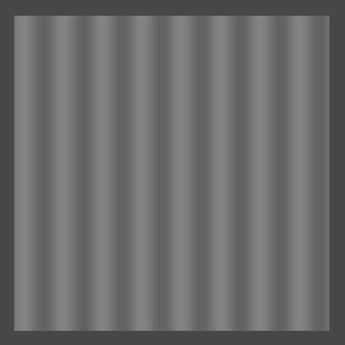 				Mapping -1–1 to 0–1. 			

To reintroduce randomness, we have to convert the hash values  into gradient functions. Assuming we have an array of 1D gradients, we  can simply use the hash values to index this array, applying a mask so  the arrays don't need to be the same length.

```
	public static float Perlin1D (Vector3 point, float frequency) {
		point *= frequency;
		int i0 = Mathf.FloorToInt(point.x);
		float t0 = point.x - i0;
		float t1 = t0 - 1f;
		i0 &= hashMask;
		int i1 = i0 + 1;
		
		float g0 = gradients1D[hash[i0] & gradientsMask1D];
		float g1 = gradients1D[hash[i1] & gradientsMask1D];

		float t = Smooth(t0);
		return Mathf.Lerp(t0, t1, t);
	}
```

For gradients, we simply pick the two directions of movement  possible in one dimension. This means we end up using positive gradients  for even hash values, and negative gradients for odd hash values.

```
	private static float[] gradients1D = {
		1f, -1f
	};

	private const int gradientsMask1D = 1;
```

After retrieving these gradients, we compute their values at the current point by multiplying with `t0` and `t1`, which can then be interpolated.

```
		float g0 = gradients1D[hash[i0] & gradientsMask1D];
		float g1 = gradients1D[hash[i1] & gradientsMask1D];

		float v0 = g0 * t0;
		float v1 = g1 * t1;

		float t = Smooth(t0);
		return Mathf.Lerp(v0, v1, t);
```

 				
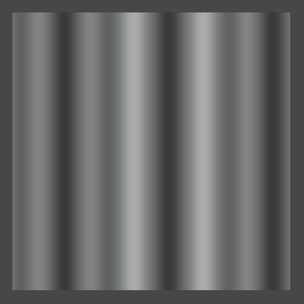 				Mixing two different gradients. 			

Now adjacent gradients can point in either the same or opposite  directions, going either up or down. So there are four possible  transitions, and the order in which they appear depends on the hash  values.

While this is already 1D Perlin noise, it doesn't yet cover the  entire -1–1 range, so we need to normalize it. So what is currently the  maximum possible value? If we were to linearly interpolate two gradients  pointing in opposite directions, they would both be 0.5 at the halfway  point, which means their interpolation is also 0.5 there. As the  gradients start at zero, this must be the maximum possible value.  Smoothly interpolating does not change this maximum. So doubling the  result will produde the desired range.

```
		return Mathf.Lerp(v0, v1, t) * 2f;
```

 				 				 				 				Normalized 1D Perlin noise. 			

For 2D Perlin noise we have to perform the same steps, but now in  two dimensions. First, we need 2D gradient coefficients, so we need to  use `Vector2` structs instead of floats. The most obvious gradient choices are right, left, up, and down, so let's pick those.

```
	private static Vector2[] gradients2D = {
		new Vector2( 1f, 0f),
		new Vector2(-1f, 0f),
		new Vector2( 0f, 1f),
		new Vector2( 0f,-1f),
	};
	
	private const int gradientsMask2D = 3;
```

This time we're using gradient functions of the form **g(x, y) = ax + by**, where a and b are either -1, 0, or 1. Let's add a convenient method to compute this function for us, given a gradient vector.

 				 					[Why name it Dot?](https://catlikecoding.com/unity/tutorials/noise/#a-dot) 				 			

```
	private static float Dot (Vector2 g, float x, float y) {
		return g.x * x + g.y * y;
	}
```

Next, we can compute gradients values just like we did for 1D Perlin noise.

```
	public static float Perlin2D (Vector3 point, float frequency) {
		point *= frequency;
		int ix0 = Mathf.FloorToInt(point.x);
		int iy0 = Mathf.FloorToInt(point.y);
		float tx0 = point.x - ix0;
		float ty0 = point.y - iy0;
		float tx1 = tx0 - 1f;
		float ty1 = ty0 - 1f;
		ix0 &= hashMask;
		iy0 &= hashMask;
		int ix1 = ix0 + 1;
		int iy1 = iy0 + 1;
		
		int h0 = hash[ix0];
		int h1 = hash[ix1];
		Vector2 g00 = gradients2D[hash[h0 + iy0] & gradientsMask2D];
		Vector2 g10 = gradients2D[hash[h1 + iy0] & gradientsMask2D];
		Vector2 g01 = gradients2D[hash[h0 + iy1] & gradientsMask2D];
		Vector2 g11 = gradients2D[hash[h1 + iy1] & gradientsMask2D];

		float v00 = Dot(g00, tx0, ty0);
		float v10 = Dot(g10, tx1, ty0);
		float v01 = Dot(g01, tx0, ty1);
		float v11 = Dot(g11, tx1, ty1);
		
		float tx = Smooth(tx0);
		float ty = Smooth(ty0);
		return Mathf.Lerp(
			Mathf.Lerp(v00, v10, tx),
			Mathf.Lerp(v01, v11, tx),
			ty) * 2f;
	}
```

 				 				 				Interpolating four gradients vs. showing only v00. 			

This is starting to look interesting, but the noise has a  dominant horizontal and vertical alignment. What would happen if we made  our gradients diagonal instead?

```
	private static Vector2[] gradients2D = {
		new Vector2( 1f, 1f),
		new Vector2(-1f, 1f),
		new Vector2( 1f,-1f),
		new Vector2(-1f,-1f)
	};
```

 				 				 				Diagonal gradients that go out of range, interpolated vs. only v00. 			

As you probably expected, we're now seeing a strong diagonal  alignment. We also see that the noise goes out of range. That happens  because when the four corner gradients of a lattice cell all end up  pointing towards its center, the final interpolated value in the middle  will be 1. So we shouldn't double our result when using these gradients.

While using either axis-aligned gradients or diagonal gradients  doesn't look varied enough, using both at the same time will give us a  lot more to work with. But then we better make sure that all gradient  vectors have the same length, otherwise their intensity will vary a lot.  We can do that by normalizing the diagonals.

```
	private static Vector2[] gradients2D = {
		new Vector2( 1f, 0f),
		new Vector2(-1f, 0f),
		new Vector2( 0f, 1f),
		new Vector2( 0f,-1f),
		new Vector2( 1f, 1f).normalized,
		new Vector2(-1f, 1f).normalized,
		new Vector2( 1f,-1f).normalized,
		new Vector2(-1f,-1f).normalized
	};
	
	private const int gradientsMask2D = 7;
```

In this case the maximum value is still reached at the center off  a cell with four diagonal gradients pointing at its center, however  that value is no longer 1 but √½. So we need to divide by √½, which is  the same as multiplying by √2.

 				 					[Why is it √½?](https://catlikecoding.com/unity/tutorials/noise/#a-sqrt-one-half) 				 			

```
		return Mathf.Lerp(
			Mathf.Lerp(v00, v10, tx),
			Mathf.Lerp(v01, v11, tx),
			ty) * sqr2;
```

Unfortunately the square root of 2 is not a rational number, so  we cannot write it as a constant. We could write an approximation, like  1.4142136, but let's just use a static variable and have `Mathf.Sqrt` figure it out.

```
	private static float sqr2 = Mathf.Sqrt(2f);
```

 				 				 				 				Normalized 2D Perlin noise. 			

We can still see horizontal and diagonal structures, but the  probability of either showing up is equal. But what if we included even  more gradients, like using sixteen rotated in 22.5 degree increments? It  turns out that this doesn't really increase the apparent randomness of  the patterns, so we stick with eight.

The same is true for three dimensions. Ken Perlin found that you  don't need many gradients. He chose just twelve vectors for his improved  noise, each pointing from the center of a cube to the middle of one of  its edges. However, twelve is not a power of two, so bit masking doesn't  work with that. He decided to lengthen his array by including four  vectors twice. He picked four that form a regular tetrahedron so they  don't introduce a directional bias. Let us use the same gradients.

```
	private static Vector3[] gradients3D = {
		new Vector3( 1f, 1f, 0f),
		new Vector3(-1f, 1f, 0f),
		new Vector3( 1f,-1f, 0f),
		new Vector3(-1f,-1f, 0f),
		new Vector3( 1f, 0f, 1f),
		new Vector3(-1f, 0f, 1f),
		new Vector3( 1f, 0f,-1f),
		new Vector3(-1f, 0f,-1f),
		new Vector3( 0f, 1f, 1f),
		new Vector3( 0f,-1f, 1f),
		new Vector3( 0f, 1f,-1f),
		new Vector3( 0f,-1f,-1f),
		
		new Vector3( 1f, 1f, 0f),
		new Vector3(-1f, 1f, 0f),
		new Vector3( 0f,-1f, 1f),
		new Vector3( 0f,-1f,-1f)
	};
	
	private const int gradientsMask3D = 15;
```

While we could normalize these gradients, as they all have the  same length this is not really necessary. Furthermore, Because each  individual vector only uses two dimensions, the maximum possible value  is the same as for the unnormalized 2D diagonals case, which is 1. So we  don't have to scale the interpolated value at all.

The only extra thing we need to do is add another `Dot` method that works for three dimensions.

```
	private static float Dot (Vector3 g, float x, float y, float z) {
		return g.x * x + g.y * y + g.z * z;
	}
	
	public static float Perlin3D (Vector3 point, float frequency) {
		point *= frequency;
		int ix0 = Mathf.FloorToInt(point.x);
		int iy0 = Mathf.FloorToInt(point.y);
		int iz0 = Mathf.FloorToInt(point.z);
		float tx0 = point.x - ix0;
		float ty0 = point.y - iy0;
		float tz0 = point.z - iz0;
		float tx1 = tx0 - 1f;
		float ty1 = ty0 - 1f;
		float tz1 = tz0 - 1f;
		ix0 &= hashMask;
		iy0 &= hashMask;
		iz0 &= hashMask;
		int ix1 = ix0 + 1;
		int iy1 = iy0 + 1;
		int iz1 = iz0 + 1;
		
		int h0 = hash[ix0];
		int h1 = hash[ix1];
		int h00 = hash[h0 + iy0];
		int h10 = hash[h1 + iy0];
		int h01 = hash[h0 + iy1];
		int h11 = hash[h1 + iy1];
		Vector3 g000 = gradients3D[hash[h00 + iz0] & gradientsMask3D];
		Vector3 g100 = gradients3D[hash[h10 + iz0] & gradientsMask3D];
		Vector3 g010 = gradients3D[hash[h01 + iz0] & gradientsMask3D];
		Vector3 g110 = gradients3D[hash[h11 + iz0] & gradientsMask3D];
		Vector3 g001 = gradients3D[hash[h00 + iz1] & gradientsMask3D];
		Vector3 g101 = gradients3D[hash[h10 + iz1] & gradientsMask3D];
		Vector3 g011 = gradients3D[hash[h01 + iz1] & gradientsMask3D];
		Vector3 g111 = gradients3D[hash[h11 + iz1] & gradientsMask3D];

		float v000 = Dot(g000, tx0, ty0, tz0);
		float v100 = Dot(g100, tx1, ty0, tz0);
		float v010 = Dot(g010, tx0, ty1, tz0);
		float v110 = Dot(g110, tx1, ty1, tz0);
		float v001 = Dot(g001, tx0, ty0, tz1);
		float v101 = Dot(g101, tx1, ty0, tz1);
		float v011 = Dot(g011, tx0, ty1, tz1);
		float v111 = Dot(g111, tx1, ty1, tz1);

		float tx = Smooth(tx0);
		float ty = Smooth(ty0);
		float tz = Smooth(tz0);
		return Mathf.Lerp(
			Mathf.Lerp(Mathf.Lerp(v000, v100, tx), Mathf.Lerp(v010, v110, tx), ty),
			Mathf.Lerp(Mathf.Lerp(v001, v101, tx), Mathf.Lerp(v011, v111, tx), ty),
			tz);
	}
```

 				 				 				 				3D Perlin noise. 			

Because we are using different gradients for 3D than for 2D, the  two noise patterns appear slightly different when viewed along the z  axis. While the 3D gradients are all the same length when taking all  their dimensions into account, when you ignore one dimension this is no  longer true.

 				 				 				 				 				 				 				3D Perlin noise, moving to the next z coordinate in the lattice grid. 			

Of course 3D Perlin noise makes the most sense when animating 2D patterns or when really working with three dimensions.

 				 				 				 				1D, 2D, and 3D Perlin noise with rotation (45,45,0). 			

## Making Fractal Noise

Because our noise is based on a lattice, its features – though  seemingly random – are all the same size. However, many things have both  larger and smaller features. Think clouds, mountains, coastlines, and  many plants. As you zoom in, you will discover more and more detail.  Often, the details look similar to the larger shape, like a branch on a  tree is could look like a smaller tree itself, with even smaller  braches. These self-similar shapes are known as fractals.

Our noise patterns don't have this property, but we can make a  limited version of it by combining samples at different frequencies. For  example, adding frequency 8 and frequency 16 together. Here the  frequency 16 samples represent the details, so they should be less  pronounced than the larger features. Because the frequency is doubled,  it makes sense to half its strength. Of couse we can go a step further,  and also add a frequency 32 sample at quarter strength, and so on. Such a  summation of noise frequencies is known as 1/f noise, or fractal noise,  or fractional noise, pink noise, and some other names.

Let's add a `Sum` method to `**Noise**`  that combines two samples, the second at double frequency and half  strength or amplitude. We can give it a parameter to determine which  method to use, so we don't need to create a separate summation method  for all our noise types and dimensions.

```
	public static float Sum (NoiseMethod method, Vector3 point, float frequency) {
		return method(point, frequency) + method(point * 2f, frequency * 2f) * 0.5f;
	}
```

Now `**TextureCreator**.FillTexture` can pass its noise method to `Sum` instead of calling it directly.

```
				Vector3 point = Vector3.Lerp(point0, point1, (x + 0.5f) * stepSize);
				float sample = Noise.Sum(method, point, frequency);
				if (type != NoiseMethodType.Value) {
					sample = sample * 0.5f + 0.5f;
				}
				texture.SetPixel(x, y, Color.white * sample);
```

 				 				 				 				2D Value noise at frequency 4 and 8, separate and summed with 8 at half strength. 			

Of course the range of this summation is 0–1.5, or -1.5–1.5 when  using Perlin noise, so to get a normalized result we have to divide by  1.5.

```
		return ((method(point, frequency) + method(point * 2f, frequency * 2f) * 0.5f) / 1.5f;
```

 				 				 				Normalized sum, for Value and Perlin noise. 			

Of course we don't always want to sum exactly two samples, so  let's make configurable how many samples, or octaves, we want to  include. Because each successive octave will be smaller than the  previous, at some point adding more octaves won't visibly change the  image any more. Besides that, more samples require more computation  time, so this also limits how many octaves are practical.

Let's add an `octaves` setting to `**TextureCreator**` and give it a range from one to eight.

```
	public float frequency = 1f;

	[Range(1, 8)]
	public int octaves = 1;

	[Range(1, 3)]
	public int dimensions = 3;
```

Then pass it to `Sum` in `FillTexture`.

 				
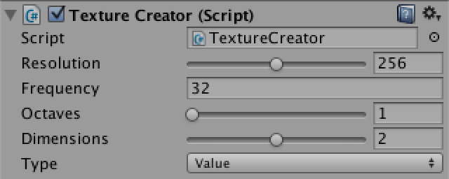 				Adding a slider for octaves. 			

```
				float sample = Noise.Sum(method, point, frequency, octaves);
```

`**Noise**.Sum` now has to accumulate  all the octaves, at each step increasing the frequency, halving the  amplitude, and keeping track of the total range for nomalization.  Because it is pointless to ask for zero octaves, let's always compute  the first, then loop through the others.

```
	public static float Sum (NoiseMethod method, Vector3 point, float frequency, int octaves) {
		float sum = method(point, frequency);
		float amplitude = 1f;
		float range = 1f;
		for (int o = 1; o < octaves; o++) {
			frequency *= 2f;
			amplitude *= 0.5f;
			range += amplitude;
			sum += method(point, frequency) * amplitude;
		}
		return sum / range;
	}
```

 				 				 				 				 				
 				 				 				 				 				 				Value and Perlin noise with base frequency 3, from one to five octaves. 			

It is not required that the frequency is exactly doubled each  octave, neither does the amplitude need to be exactly halved. The factor  by which the frequency changes is often known as the lacunarity,  while  the amplitude factor is often named persistence or gain. Let's add  these options to `**TextureCreator**` with reasonable ranges.

```
	public float frequency = 1f;

	[Range(1, 8)]
	public int octaves = 1;

	[Range(1f, 4f)]
	public float lacunarity = 2f;

	[Range(0f, 1f)]
	public float persistence = 0.5f;
```

 				
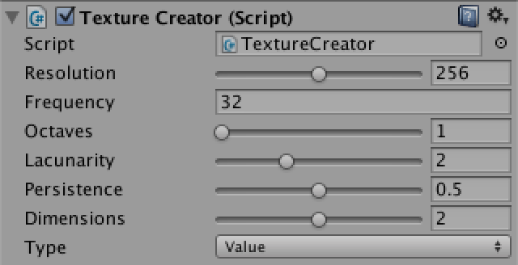 				Lacunarity and persistence with typical values. 			

Of course we need to pass them to the `Sum` method.

```
				float sample = Noise.Sum(method, point, frequency, octaves, lacunarity, persistence);
```

And `Sum` itself has to use them instead of contant values.

```
	public static float Sum (
		NoiseMethod method, Vector3 point, float frequency, int octaves, float lacunarity, float persistence
	) {
		float sum = method(point, frequency);
		float amplitude = 1f;
		float range = 1f;
		for (int o = 1; o < octaves; o++) {
			frequency *= lacunarity;
			amplitude *= persistence;
			range += amplitude;
			sum += method(point, frequency) * amplitude;
		}
		return sum / range;
	}
```

 				 				 				 				Two octaves of Perlin noise with base frequency 8, using lacunarity 2, 3, and 4. 			

 				 				 				 				Three octaves of Perlin noise with base frequency 8, using persistence ½, ¾, and 1. 			

You might have noticed that when changing the frequency or the  lacunarity, it looks like you're zooming from the center of the image.  This happens when the quad is placed at the origin. Because everything  is relative to that point, the same features of successive octaves will  overlap, producing lines or cones that are obviously not random. This is  a problem in all dimensions. To avoid these artifacts, move away from  the origin.

 				 				 				Rotated summed 3D Value noise, positioned at (0,0,0) and at (1,2,3). 			

So far we've converted the noise values to grayscale colors, but  we need not limit ourselves to that. To allow more interesting color  transitions, let's wrap up `**TextureCreator**` by adding a gradient to it.

```
	public Gradient coloring;
```

If you let the gradient go from black to white, you'll get the  same result as before. So design something else instead. As an example, I  put a narrow black region in the middle, made the lower half  white–blue, and the upper half yellow–red. This will divide the patterns  into two parts.

 				
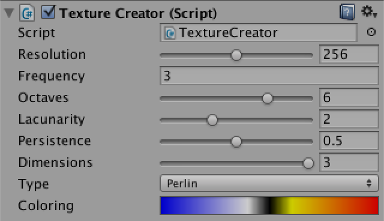 				A gradient. 			

To actually show the colors, instead of multiplying our noise  samples with a constant white color, we use them to evaluate the  gradient in `FillTexture`.

```
				texture.SetPixel(x, y, coloring.Evaluate(sample));
```

 				 
 				  				Colored 2D and 3D Value noise, one octave with frequency 16, and six octaves with base frequency 3. 			

 				 
 				  				Colored 2D and 3D Perlin noise, one octave with frequency 16, and six octaves with base frequency 3. 			

Of course you can create many different results with other  gradients, especially once you start playing with lacunarity and  persistence as well. Have fun experimenting with noise settings, or  immediately move on to [Noise Derivatives](https://catlikecoding.com/unity/tutorials/noise-derivatives/).

Enjoyed the tutorial? [Help me make more by becoming a patron!](https://www.patreon.com/catlikecoding)


## Downloads

- [noise-01.unitypackage](https://catlikecoding.com/unity/tutorials/noise/noise-01.unitypackage)

  The project after Creating a Texture.

- [noise-02.unitypackage](https://catlikecoding.com/unity/tutorials/noise/noise-02.unitypackage)

  The project after Visualizing World Space.

- [noise-03.unitypackage](https://catlikecoding.com/unity/tutorials/noise/noise-03.unitypackage)

  The project after Making Noise.

- [noise-04.unitypackage](https://catlikecoding.com/unity/tutorials/noise/noise-04.unitypackage)

  The project after Going Into Higher Dimensions.

- [noise-05.unitypackage](https://catlikecoding.com/unity/tutorials/noise/noise-05.unitypackage)

  The project after Interpolating Hash Values.

- [noise-06.unitypackage](https://catlikecoding.com/unity/tutorials/noise/noise-06.unitypackage)

  The project after Making Fractal Noise.

- [noise-finished.unitypackage](https://catlikecoding.com/unity/tutorials/noise/noise-finished.unitypackage)

  The finished project.

- [Why not use a procedural shader?](https://catlikecoding.com/unity/tutorials/noise/#q-shader)

   				Why create a texture on the CPU, while you could use the GPU?  It's a good questions. The GPU is very good at this job, and you could  even render to a texture so you don't have to compute complex noise all  the time. The GPU can also be used for other massively parallel  computations that need noise, like mesh deformations and particle  systems. But there are lots of other applications of noise, many of  which don't benefit from massive parallelism, in which case CPU noise is  useful. There are also many situations in which there simply is no  access to an advanced GPU, either because of software or hardware  limitations. 				Ideally, you have access to both CPU and GPU noise and can use  the best tool for the job. Both approaches use the same noise  algorithms, but GPU programming is still quite arcane compared to C#  programming. A big part of writing shaders is playing to the strenghts  of the hardware and working around its limitations. This distracts from  the noise algorithms themselves, which don't depend on specific  hardware. So it makes sense to start with CPU noise. 			

- [Why 256?](https://catlikecoding.com/unity/tutorials/noise/#q-256)

   				Because all hardware are binary systems, they like their numbers  in power-of-two increments. This is most efficient and sometimes even  required for textures. That's why you always see the numbers 2, 4, 8,  16, 32, 64, 128, 256, 512, 1024, 2048, and 4096 pop up. 			

- [What does RGB24 mean?](https://catlikecoding.com/unity/tutorials/noise/#q-rgb24)

   				The 24 after RGB indicates how many bits are use to store a  single pixel. In this case we're only using the red, green, and blue  channels, so eight bits – one byte – are available per channel. This  means we can represents 28 or 256 different values per channel, and a total of 224 or 16777216 different colors. 			

- [What are mipmaps?](https://catlikecoding.com/unity/tutorials/noise/#q-mipmaps)

   				Mipmaps are downsampled versions of the base texture, each at  half the resolution of the previous level. When used, the GPU decides  which level to render based on which best matches the output resolution.  When a smaller area is covered, a smaller mipmap is chosen. 			

- [Why a 0–1 range?](https://catlikecoding.com/unity/tutorials/noise/#q-01-range)

   				You'll often see two ranges used for color channels, either 0–1 or 0–255. Unity's `Color` struct uses the first range. 				The 0–255 range is an obvious choise when using one byte per  color channel. However, that means your color representation is tied to  whatever fidelity you're currently using. If you were to later switch to  using only four bits per channel, or to sixteen bits per channel, then  what? Because everything has been expressed in the 0–255 range, it is  either too expensive, impractical, or simply impossible to change the  range. You'll have no choice but to keep using it, even though it no  longer makes sense. That is the curse of backwards compatibility. An  implementation-agnostic range like 0–1 avoids this problem. 				On the other hand, by sticking to the range that's really being  used, there is no conversion step necessary, which costs performance.  That's why Unity also has the `Color32` struct, which uses bytes. 			

- [What's a delegate?](https://catlikecoding.com/unity/tutorials/noise/#q-delegate)

   				Besides simple values and object references, you also store  method references in a variable. Such a variable is known as a delegate. 				A delegate type is defined like a method, except that there's no  code body. You can assign any method to such a variable, as long as its  parameter types and return type match. The variable can then be called  like a normal method. 				Actually, a delegate variable acts like a list. You can add  multiple methods to it, which will all be invoked when calling the  variable. That's why we're adding to and removing from the undo  delegate. Had we directly assigned to it, the entire method list  would've been replaced. 			

- [What's anisotropic filtering?](https://catlikecoding.com/unity/tutorials/noise/#q-anisotropic)

   				Being anisotripic means that whatever you're doing is  directionally dependent. This case, it means that how you filter depends  on the view angle. 				If we were to rotate the view or the quad around the x or y axis,  the quad's projection will turn into a rectangle, and eventually a  line. As this happens, one of its dimensions visually gets smaller,  while the other stays constant. As the smallest dimension dictates which  mipmap level is used, the smaller dimension will look fine, but the  larger one will become too blurry. Anisotropic filtering solves this by  also including stretched mipmaps that are downsampled in one dimension  while the other is held constant. 			

- [How does `hasChanged` work?](https://catlikecoding.com/unity/tutorials/noise/#q-has-changed)

   				`Transform` has a `hasChanged` property which is set to `**true**`  whenever one of its values is changed. So it is useful to check whether  the position, rotation, or scale has been modified since the last time  you checked. 				However, nobody sets `hasChanged` back to `**false**`, because there is no universal moment when this should happen. It is up to you to reset it. 			

- [How does `&` work?](https://catlikecoding.com/unity/tutorials/noise/#q-bitwise-and)

   				While `&&` is the boolean AND operator, `&`  is the bitwise AND operator. It performs the same logic, but on each  individual pair of bits of its operands. So both bits of a pair need to  be 1 for the result to be 1. 				For example, performing the bitwise AND operation on the binary  numbers 10111010 and 00000011 results in 00000010. Effectively, the  second operand has erased all but the rightmost two bits of the first  operand. The decimal representation of these numbers are 186, 3, and 2.  As it turns out, 2 is the remainder of dividing 170 by 4. This makes  sense, because the mask cuts off everything above 3. So you can use the  binary bit masks 1, 11, 111, 1111, and so on to produce the remainder of  dividing by 2, 4, 8, 16, and so on. 				But how does this work for negative numbers? The `**int**`  type is used to represent signed 32-bit integers. This means that they  contain 32 bits, of which one is used to indicate the sign of the  number. The sign bit is placed in front of the most significant bit. As  the bitwise AND operator doesn't care about the meaning of individual  bits, the sign will be masked out like any other bit, effectively making  the remainder positive. However, this is not the only difference  between positive and negative numbers, because they're stores using a  two's complement representation. This means that when you drop the sign  bit, -1 becomes 231 - 1, - 2 becomes 231 - 2, and so on. The result is that masked number sequences aren't mirrored around zero, they simply keep repeating. 			

- [Why a 5th degree polynomial?](https://catlikecoding.com/unity/tutorials/noise/#q-polynomial)

   				Typically, when desiring a smooth interpolation, people will use the 3rd degree polynomial **3t2 - 2t3**, which is known as *smoothstep*.  This works fine, except when the noise is used for bump mapping. In  that case you're effectively showing the derivative function, which for  smoothstep is **6t - 6t2**. Because the derivative of that function – the second derivative of smoothstep – is **6 - 12t**, its rate of change is not zero when *t* is zero or one. This causes visible discontinuities at lattice boundaries as the curvature suddenly changes direction. 				For his improved noise, Ken Perlin suggested to use **6t5 - 15t4 + 10t3** instead. The first derivative of this alternative function is **30t4 - 60t3 + 30t2** and the second derivative is **120t3 - 180t2 + 60t**. Both are zero when *t* is zero or one. 			

- [Why name it Dot?](https://catlikecoding.com/unity/tutorials/noise/#q-dot)

   				We name it so because this function is known as the dot product,  or sometimes scalar product. Simply put, the dot operation between two  vectors **(a,b,c) · (x,y,z)** yields **ax + by + cz**. 				The dot product shows up a lot when performing geometric calculations with vectors. For example, **(x,y) · (x,y)** yields **x2 + y2**,  which is the square length of the vector. Also, the dot product of two  vectors of unit length yields the cosine of the absolute angle between  them. 			

- [Why is it √½?](https://catlikecoding.com/unity/tutorials/noise/#q-sqrt-one-half)

   				The Pythagorean theorem states that for a right triangle with edge lenghts a, b, and c, **a2 + b2 = c2**,  where c is the length of the side opposite to the right angle. In case  of our diagonal gradients, a and b are the same length while c is 1.  Therefore **a2 = b2 = ½**. 			

[About](https://catlikecoding.com/about/)[Contact](https://catlikecoding.com/contact/)[Tutorials](https://catlikecoding.com/unity/tutorials/)

© Catlike Coding


- [Twitter](https://twitter.com/catlikecoding)
- [Facebook](https://www.facebook.com/catlikecoding)
- [Google+](https://google.com/+CatlikeCoding)
