# Noise Derivatives, going with the flow

In this tutorial you will create a mesh that looks like a terrain. You will also use noise to animate particle flows.

 				You'll learn to 				

- Use a mesh to create a triangle grid;
- Compute surface normals for a vertex grid;
- Write a simple surface shader;
- Compute analytical derivatives of Value noise;
- Compute analytical derivatives of Perlin noise;
- Turn derivatives into normals.
- Use 2D Curl noise to flow particles around terrain features;
- Use 3D Curl noise to simulate volumetric flows.

This tutorial comes after the [Noise](https://catlikecoding.com/unity/tutorials/noise/) tutorial. I assume you did that one first.

This tutorial has been made with Unity 4.5.2. It might not work for older versions.


 				
 				Fun with meshes and particles. 			

## Setting the Scene

In the [Noise](https://catlikecoding.com/unity/tutorials/noise/)  tutorial we experimented with coloring a texture based on pseudorandom  noise, but that's not the only thing you can do. Another common  technique is to deform a flat surface, interpreting the noise function  as a height field.

Because we'll be using the same noise and roughly the same approach we used for our textured quad, start with the [finished project](https://catlikecoding.com/unity/tutorials/noise/noise-finished.unitypackage) of the [Noise](https://catlikecoding.com/unity/tutorials/noise/)  tutorial. Then move all the quad-related stuff into their own folder  and rename things a bit for clarity. We'll put the surface stuff in its  own folder too, starting with a new scene.

 				
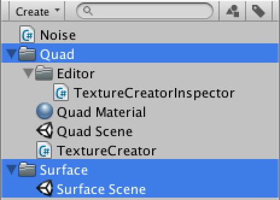 				Organizing the project. 			

This time we'll be creating a surface, so create a new `**SurfaceCreator**` script, along with a new default material for it.

We'll use a mesh to represent our surface, so like with `**TextureCreator**` we generate a new one in `**SurfaceCreator**.OnEnable` if it doesnt' exist yet, then call a method to refill or refresh it.

 				 					[What's a ``](https://catlikecoding.com/unity/tutorials/noise-derivatives/#a-mesh)`Mesh`? 				 			

```
using UnityEngine;

public class SurfaceCreator : MonoBehaviour {

	private Mesh mesh;

	private void OnEnable () {
		if (mesh == null) {
			mesh = new Mesh();
			mesh.name = "Surface Mesh";
		}
		Refresh();
	}

	public void Refresh () {
	}
}
```

Of course we also want to make sure that our mesh gets rendered. We do that by assigning it to a `MeshFilter` component that should be attached to our game object, and making sure that there's a `MeshRenderer` component attached as well. To make sure those components exist, add the `RequireComponent` attribute to our script with the types that we need.

 				 					[What does ``](https://catlikecoding.com/unity/tutorials/noise-derivatives/#a-require-component)`RequireComponent` do? 				 			

```
using UnityEngine;

[RequireComponent(typeof(MeshFilter), typeof(MeshRenderer))]
public class SurfaceCreator : MonoBehaviour {

	private Mesh mesh;

	private void OnEnable () {
		if (mesh == null) {
			mesh = new Mesh();
			mesh.name = "Surface Mesh";
			GetComponent<MeshFilter>().mesh = mesh;
		}
		Refresh();
	}

	public void Refresh () {
	}
}
```

Now when creating a new game object and adding our component to  it, the other two components will be added as well. Then we can set the  renderer to use our surface material by dragging it onto the game  object.

 				
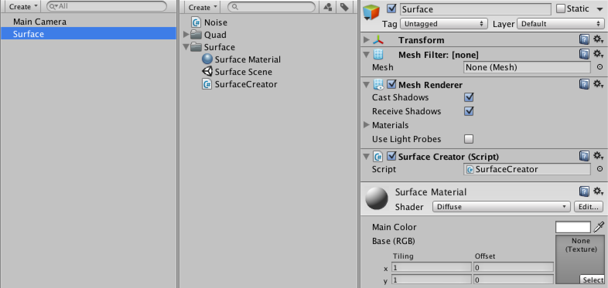 				A new surface. 			

Our `**TextureCreator**` component has  a handy custom editor which makes sure that its texture is updated as  soon as a change is made via the inspector. Let's copy it and turn it  into a version that works with our new `**SurfaceCreator**`.

```
using UnityEditor;
using UnityEngine;

[CustomEditor(typeof(SurfaceCreator))]
public class SurfaceCreatorInspector : Editor {

	private SurfaceCreator creator;

	private void OnEnable () {
		creator = target as SurfaceCreator;
		Undo.undoRedoPerformed += RefreshCreator;
	}

	private void OnDisable () {
		Undo.undoRedoPerformed -= RefreshCreator;
	}

	private void RefreshCreator () {
		if (Application.isPlaying) {
			creator.Refresh();
		}
	}

	public override void OnInspectorGUI () {
		EditorGUI.BeginChangeCheck();
		DrawDefaultInspector();
		if (EditorGUI.EndChangeCheck()) {
			RefreshCreator();
		}
	}
}
```

 				
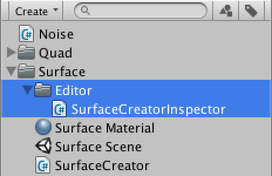 				Custom inspector for our surface creator. 			

## Creating a Mesh

Right now we only have an empty mesh. We have to add vertices and  triangles to it before anything shows up. Let's start with a single  right triangle.

In `Refresh`, first give an array containing three  vertices to our mesh. Now that it knows how many vertices it has, we can  give it an array of vertex indices that tells it how to draw a  triangle.

```
	public void Refresh () {
		mesh.vertices = new Vector3[] {
			new Vector3(0f, 0f),
			new Vector3(1f, 0f),
			new Vector3(0f, 1f)
		};
		mesh.triangles = new int[] {
			0, 1, 2
		};
	}
```

Now a triangle will show up while in play mode, but it is only  visible when you look at it in the negative-Z direction. The triangle  isn't drawn when looking in the positive-Z direction, because the  default material's shader only draws one side of it. This is known as  face culling. It is done because you're typically only interested in the  outside of a mesh, not its inside.

To determine which side of a triangle you're looking at, the  shader checks the winding order of its three vertices. In Unity's case,  by default a clockwise order indicates forward-facing triangles that  should be drawn, while counterclockwise triangles should be discarded.

To to see our triangle when looking down the Z axis, we should switch to a clockwise vertex order.

```
		mesh.triangles = new int[] {
			0, 2, 1
		};
```

 				 				 				Counterclockwise vs. clockwise triangle, viewed from their appropriate sides. 			

We can turn our mesh into a quad by adding a second triangle to  it. First we have to add a fourth vertex so they all form a square. Then  we can add three more vertex incides, which causes a second triangle to  be drawn.

```
		mesh.vertices = new Vector3[] {
			new Vector3(0f, 0f),
			new Vector3(1f, 0f),
			new Vector3(0f, 1f),
			new Vector3(1f, 1f)
		};
		mesh.triangles = new int[] {
			0, 2, 1,
			1, 2, 3
		};
```

 				
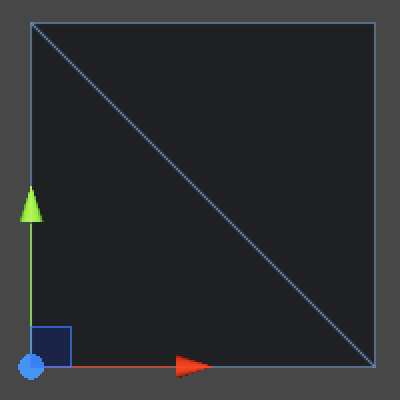 				Two triangles forming a quad. 			

A surface that consists of one quad is like a texture that has  only one pixel. If we want to show any details, we have to use a grid of  smaller quads. So let's add a resolution variable to `**SurfaceCreator**` with a range of 1–200. Also add a `currentResolution` variable so we only recreate the grid when the resolution has changed, just like we did for `**TextureCreator**`. 			

```
	[Range(1, 200)]
	public int resolution = 10;
	
	private int currentResolution;
	
	public void Refresh () {
		if (resolution != currentResolution) {
			CreateGrid();
		}
	}

	private void CreateGrid () {
		currentResolution = resolution;
		mesh.vertices = new Vector3[] {
			new Vector3(0f, 0f),
			new Vector3(1f, 0f),
			new Vector3(0f, 1f),
			new Vector3(1f, 1f)
		};
		mesh.triangles = new int[] {
			0, 2, 1,
			1, 2, 3
		};
	}
```

 				
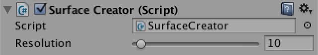 				Surface resolution. 			

Now replace the fixed vertex array with a double loop over y and x, like for `**TextureCreator**`, but with two differences.

First, because a quad needs two vertices in both directions, a grid of **n2** quads – with **n** being its resolution – needs **(n + 1)2** vertices.

Second, as the vertices are placed on the edge of our quad cells  and not in their centers, we don't have to offset them by half a pixel.  We will still offset the entire quad by -½ to center it on the origin  though.

```
	private void CreateGrid () {
		currentResolution = resolution;
		Vector3[] vertices = new Vector3[(resolution + 1) * (resolution + 1)];
		float stepSize = 1f / resolution;
		for (int v = 0, y = 0; y <= resolution; y++) {
			for (int x = 0; x <= resolution; x++, v++) {
				vertices[v] = new Vector3(x * stepSize - 0.5f, y * stepSize - 0.5f);
			}
		}
		mesh.vertices = vertices;
		mesh.triangles = new int[] {
			0, 2, 1,
			1, 2, 3
		};
	}
```

As the triangle array requires six vertex indices per quad, its length is **6n2**. Filling it is a bit more involved.

First, we will loop over y and x in units of quads, which means six triangle indices per step.

Second, as each row has **n** quads but **n + 1** vertices, we have to increase the vertex index after each quad, but also after each row.

Third, we have to replace the quad indices 0, 1, 2, 3 into  offsets relative to the current vertex index. 0 and 1 stay the same as  offsets, but 2 and 3 are actually the 0 and 1 of the next row. So we  need to add the length of a vertex row to get them, which is **n + 1**.

```
		int[] triangles = new int[resolution * resolution * 6];
		for (int t = 0, v = 0, y = 0; y < resolution; y++, v++) {
			for (int x = 0; x < resolution; x++, v++, t += 6) {
				triangles[t] = v;
				triangles[t + 1] = v + resolution + 1;
				triangles[t + 2] = v + 1;
				triangles[t + 3] = v + 1;
				triangles[t + 4] = v + resolution + 1;
				triangles[t + 5] = v + resolution + 2;
			}
		}
		mesh.triangles = triangles;
```

Now you will see the quad density increase as you slide up the  resolution. However, it will go wrong when you try to decrease the  resolution. This happens because we try to assign less vertices to the  mesh than are currently being used by its triangles. We should clear the  mesh data before assigning a different amount of vertices.

```
		currentResolution = resolution;
		mesh.Clear();
```

 				 				 				 				 				Mesh resolution 1, 2, 3, and 4. 			

While our vertices and triangles are all good now, Unity keeps  complaining that our material's shader wants some stuff that our mesh  doesn't have.

Because the default diffuse shader has a texture to show, it  needs to know how to map it onto our mesh. We can either add UV  coordinates to our mesh, or use a shader that doesn't need them. As it  is quite easy to add them, let's just do so.

```
		Vector3[] vertices = new Vector3[(resolution + 1) * (resolution + 1)];
		Vector2[] uv = new Vector2[vertices.Length];
		float stepSize = 1f / resolution;
		for (int v = 0, y = 0; y <= resolution; y++) {
			for (int x = 0; x <= resolution; x++, v++) {
				vertices[v] = new Vector3(x * stepSize - 0.5f, y * stepSize - 0.5f);
				uv[v] = new Vector2(x * stepSize, y * stepSize);
			}
		}
		mesh.vertices = vertices;
		mesh.uv = uv;
```

The other missing elements are the normal vectors. These vectors  are used for lighting calculations and are (0,0,1) by default, which is  why the counter-clockwise triangle was light while the clockwise ones  are dark. If we set them all to (0,0,-1) our grid should be light too  when viewed head-on with the scene view's default lighting.

 				 					[How to normals work?](https://catlikecoding.com/unity/tutorials/noise-derivatives/#a-normals) 				 			

```
		Vector3[] vertices = new Vector3[(resolution + 1) * (resolution + 1)];
		Vector3[] normals = new Vector3[vertices.Length];
		Vector2[] uv = new Vector2[vertices.Length];
		float stepSize = 1f / resolution;
		for (int v = 0, y = 0; y <= resolution; y++) {
			for (int x = 0; x <= resolution; x++, v++) {
				vertices[v] = new Vector3(x * stepSize - 0.5f, y * stepSize - 0.5f);
				normals[v] = Vector3.back;
				uv[v] = new Vector2(x * stepSize, y * stepSize);
			}
		}
		mesh.vertices = vertices;
		mesh.normals = normals;
		mesh.uv = uv;
```

 				
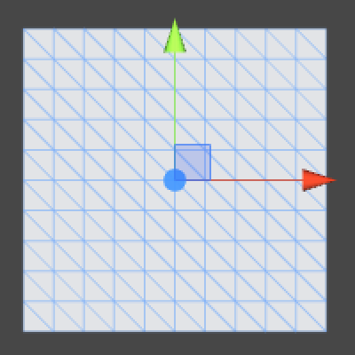 				Normals pointing at you. 			

You can also assign colors to vertices, which will be interpolated across triangles, just like bilinear filtering for a texture.

```
		Vector3[] vertices = new Vector3[(resolution + 1) * (resolution + 1)];
		Color[] colors = new Color[vertices.Length];
		Vector3[] normals = new Vector3[vertices.Length];
		Vector2[] uv = new Vector2[vertices.Length];
		float stepSize = 1f / resolution;
		for (int v = 0, y = 0; y <= resolution; y++) {
			for (int x = 0; x <= resolution; x++, v++) {
				vertices[v] = new Vector3(x * stepSize - 0.5f, y * stepSize - 0.5f);
				colors[v] = Color.black;
				normals[v] = Vector3.back;
				uv[v] = new Vector2(x * stepSize, y * stepSize);
			}
		}
		mesh.vertices = vertices;
		mesh.colors = colors;
```

Strangely, the mesh remains white even when it has black color  data. This is because the default diffuse shader does not use the vertex  colors. So let's make a shader that does use them.

Create a new shader and set our surface material to use it,  either by dragging the shader on it or by selecting our shader from the  shader list.

 				 				 				Using a custom shader. 			

The mesh will still look the same, because the new shader is the  same as the default diffuse shader, except that it doesn't have a main  color property. When selecting the shader, the inspector view will show  some information about the imported shader object. Note that under *Geometry* it mentions position, normal, and uv, but not color.

 				
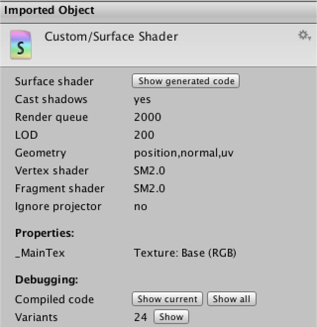 				Shader info. 			

Our custom shader contains Unity's default code for a surface  shader. In this case surface does not mean our mesh surface, it refers  to Unity's shader solution that takes care of most of the details of  multiplatform multipass shader programming for us. What's left is to set  some material properties, like albedo. Here is the default code.

```
Shader "Custom/Surface Shader" {
	Properties {
		_MainTex ("Base (RGB)", 2D) = "white" {}
	}
	SubShader {
		Tags { "RenderType"="Opaque" }
		LOD 200
		
		CGPROGRAM
		#pragma surface surf Lambert

		sampler2D _MainTex;

		struct Input {
			float2 uv_MainTex;
		};

		void surf (Input IN, inout SurfaceOutput o) {
			half4 c = tex2D (_MainTex, IN.uv_MainTex);
			o.Albedo = c.rgb;
			o.Alpha = c.a;
		}
		ENDCG
	} 
	FallBack "Diffuse"
}
```

The `surf` method is where the material's properties  are set, other than its position and normal. We see that the main  texture is used as input and used to set the albedo and alpha. To  include color, we have to add it to the input structure and factor it  into the result. Let's just use the same data type that's used for the  texture sample. The only special thing we need to do is indicate that  our color input should link to the vertex color data.

```
		struct Input {
			float2 uv_MainTex;
			half4 color : COLOR;
		};

		void surf (Input IN, inout SurfaceOutput o) {
			half4 c = tex2D (_MainTex, IN.uv_MainTex);
			o.Albedo = c.rgb * IN.color.rgb;
			o.Alpha = c.a * IN.color.a;
		}
```

 				 				 				Shader using vertex colors. 			

## Making a Noisy Surface

It's time to make some noise again! Let's just copy the same noise configuration variables that we used for `**TextureCreator**`.

```
	public float frequency = 1f;
	
	[Range(1, 8)]
	public int octaves = 1;
	
	[Range(1f, 4f)]
	public float lacunarity = 2f;
	
	[Range(0f, 1f)]
	public float persistence = 0.5f;
	
	[Range(1, 3)]
	public int dimensions = 3;
	
	public NoiseMethodType type;
	
	public Gradient coloring;
```

 				
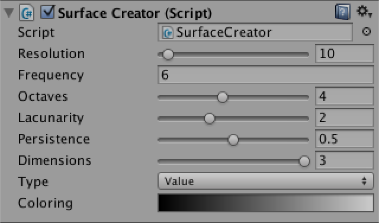 				Noise settings. 			

We also use the same approach to sample the noise, with some  slight tweaks because we're working with vertex data instead of pixels.

```
	public void Refresh () {
		if (resolution != currentResolution) {
			CreateGrid();
		}
		Vector3 point00 = transform.TransformPoint(new Vector3(-0.5f,-0.5f));
		Vector3 point10 = transform.TransformPoint(new Vector3( 0.5f,-0.5f));
		Vector3 point01 = transform.TransformPoint(new Vector3(-0.5f, 0.5f));
		Vector3 point11 = transform.TransformPoint(new Vector3( 0.5f, 0.5f));
		
		NoiseMethod method = Noise.methods[(int)type][dimensions - 1];
		float stepSize = 1f / resolution;
		for (int v = 0, y = 0; y <= resolution; y++) {
			Vector3 point0 = Vector3.Lerp(point00, point01, y * stepSize);
			Vector3 point1 = Vector3.Lerp(point10, point11, y * stepSize);
			for (int x = 0; x <= resolution; x++, v++) {
				Vector3 point = Vector3.Lerp(point0, point1, x * stepSize);
				float sample = Noise.Sum(method, point, frequency, octaves, lacunarity, persistence);
				if (type != NoiseMethodType.Value) {
					sample = sample * 0.5f + 0.5f;
				}
				colors[v] = coloring.Evaluate(sample);
			}
		}
		mesh.colors = colors;
	}
```

For this to work we need to promote `colors` to a class variable instead of only defining it inside `CreateGrid`. Let's go ahead and do this for `vertices` and `normals` as well.

```
	private Vector3[] vertices;
	private Vector3[] normals;
	private Color[] colors;
	
	private void CreateGrid () {
		currentResolution = resolution;
		mesh.Clear();
		vertices = new Vector3[(resolution + 1) * (resolution + 1)];
		colors = new Color[vertices.Length];
		normals = new Vector3[vertices.Length];
		Vector2[] uv = new Vector2[vertices.Length];
		…
	}
```

 				 				 				 				 				Sampled vertex colors at resolution 10, 20, 40, and 80. 			

Now you might want to move the noise sampling away from the  origin, but we haven't put in code that checks for a transform change  yet, so the mesh won't be refreshed when moving it. We could put this  code in to make it behave just like `**TextureCreator**`, but this is not really convenient. Instead, let's keep our mesh in a fixed position and add an offset to the noise instead.

```
	public Vector3 offset;
	
	public void Refresh () {
		if (resolution != currentResolution) {
			CreateGrid();
		}
		Vector3 point00 = new Vector3(-0.5f,-0.5f) + offset;
		Vector3 point10 = new Vector3( 0.5f,-0.5f) + offset;
		Vector3 point01 = new Vector3(-0.5f, 0.5f) + offset;
		Vector3 point11 = new Vector3( 0.5f, 0.5f) + offset;
		…
	}
```

Let's add support for rotation as well. We use a vector to  configure angular rotations, but we'll use a quaternion to actually  transform our positions. If we multiply the quaternion with our original  positions and then offset the result, we act the same as a `Transform` component would.

```
	public Vector3 rotation;
	
	public void Refresh () {
		if (resolution != currentResolution) {
			CreateGrid();
		}
		Quaternion q = Quaternion.Euler(rotation);
		Vector3 point00 = q * new Vector3(-0.5f, -0.5f) + offset;
		Vector3 point10 = q * new Vector3( 0.5f, -0.5f) + offset;
		Vector3 point01 = q * new Vector3(-0.5f, 0.5f) + offset;
		Vector3 point11 = q * new Vector3( 0.5f, 0.5f) + offset;
		…
	}
```

 				 				 				Noise with offset and rotation. 			

To perturb the shape of our surface, we can simply displace the vertices along the Z axis using our noise samples.

```
		for (int v = 0, y = 0; y <= resolution; y++) {
			Vector3 point0 = Vector3.Lerp(point00, point01, y * stepSize);
			Vector3 point1 = Vector3.Lerp(point10, point11, y * stepSize);
			for (int x = 0; x <= resolution; x++, v++) {
				Vector3 point = Vector3.Lerp(point0, point1, x * stepSize);
				float sample = Noise.Sum(method, point, frequency, octaves, lacunarity, persistence);
				if (type != NoiseMethodType.Value) {
					sample = sample * 0.5f + 0.5f;
				}
				vertices[v].z = sample;
				colors[v] = coloring.Evaluate(sample);
			}
		}
		mesh.vertices = vertices;
		mesh.colors = colors;
```

 				
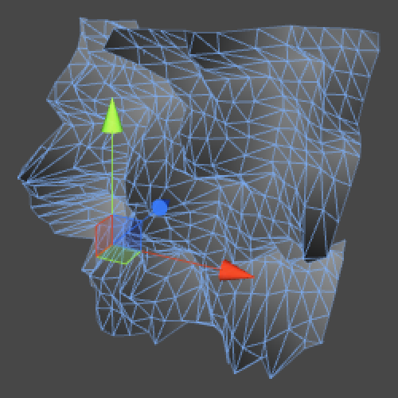 				Displaced surface. 			

We are now displacing a vertical surface, which is a bit awkward  to work with. It is easier to work with a horizontal surface, because  then it would resemble a terrain, which is something we are all very  familiar with.

We could rotate our mesh to make it horizontal, but we can also change its construction so is horizontal to begin with.

```
	private void CreateGrid () {
		…
		for (int v = 0, z = 0; z <= resolution; z++) {
			for (int x = 0; x <= resolution; x++, v++) {
				vertices[v] = new Vector3(x * stepSize - 0.5f, 0f, z * stepSize - 0.5f);
				colors[v] = Color.black;
				normals[v] = Vector3.up;
				uv[v] = new Vector2(x * stepSize, z * stepSize);
			}
		}
		…
	}
```

We could also change `Refresh` so it sample from XZ  instead of XY, but then it won't work for 2D noise because that's  defined in XY, so we leave our sampling unchanged. We just use the  sample to displace Y instead of Z.

While we're at it, as our surface goes from -½ to ½ in both  horizontal directions, it makes sense for the displaced surface to have  the same range vertically. That way it can theoretically be defined  anywhere inside a unit cube, but not outside of it. That means we have  to subtract half a unit from Value noise and halve Perlin noise.

```
				Vector3 point = Vector3.Lerp(point0, point1, x * stepSize);
				float sample = Noise.Sum(method, point, frequency, octaves, lacunarity, persistence);
				sample = type == NoiseMethodType.Value ? (sample - 0.5f) : (sample * 0.5f);
				vertices[v].y = sample;
				colors[v] = coloring.Evaluate(sample + 0.5f);
```

 				 				 				Horizontal surface displaced with Value and Perlin noise. 			

Now when you use a coloring that somewhat resembles terrain  strata, you end up with a result that looks a lot like a landscape. For  example, I'm using the colors (1,25,34) at 0%, (32,111,139) at 30%,  (121,159,61) at 50%, (231,190,129) at 70%, and white at 100%.

 				 				 				Colored terrain. 			

However, this terrain looks rather flat, because all the vertex  normals are still pointing straight up, causing the lighting to behave  as if it were. The easiest way to get proper normals is to invoke `Mesh.RecalculateNormals` after we changed all vertices, so let's do that.

 				 					[How are normals recalculated?](https://catlikecoding.com/unity/tutorials/noise-derivatives/#a-recalculate-normals) 				 			

```
	public void Refresh () {
		…
		mesh.vertices = vertices;
		mesh.colors = colors;
		mesh.RecalculateNormals();
	}
```

 				 				 				Normals calculated by the mesh, at resolution 100 and 200. 			

The default scene view light always shines in the direction that  you're looking, which isn't very interesting. So go ahead and add a  directional light so you can change the light's direction. A handy trick  is to position yourself in the scene view as if you were a light, and  then use *GameObject / Align With View* with the light selected. That way your current view direction becomes the light's direction as well.

 				 				 				Light coming from a different direction, without and with shadows. 			

## Scaling the Displacement

Right now the noise results in quite strong displacement of our  surface. But often we desire a more subtle displacement, so let's add a  variable to control the strength of the noise with a range of 0–1.

```
	[Range(0f, 1f)]
	public float strength = 1f;
```

Inside `Refresh`, we have to scale our sample after it has been brought into the -½–½ range.

```
				Vector3 point = Vector3.Lerp(point0, point1, x * stepSize);
				float sample = Noise.Sum(method, point, frequency, octaves, lacunarity, persistence);
				sample = type == NoiseMethodType.Value ? (sample - 0.5f) : (sample * 0.5f);
				sample *= strength;
				vertices[v].y = sample;
				colors[v] = coloring.Evaluate(sample + 0.5f);
```

 				
 				 				 				 				 				Strength 1, ¾, ½, and ¼. 			

Of course this means that as strength decreases, you'll see less  of the gradient. This is fine if that's what you want, but if it's not  then you'll have to evaluate the gradient before scaling the sample. To  allow a choice, add a boolean variable named *coloringForStrength*.

```
	public bool coloringForStrength;
			
	public void Refresh () {
		…
				sample = type == NoiseMethodType.Value ? (sample - 0.5f) : (sample * 0.5f);
				if (coloringForStrength) {
					colors[v] = coloring.Evaluate(sample + 0.5f);
					sample *= strength;
				}
				else {
					sample *= strength;
					colors[v] = coloring.Evaluate(sample + 0.5f);
				}
				vertices[v].y = sample;
		…
	}
```

 				
 				 				 				 				Coloring for strength, at ¾, ½, and ¼. 			

There is another phenomenon that we might want to do something  about. If we increase the frequency of the noise, the surface  deformation becomes a lot more extreme. This happens because the same  vertical displacement happens much faster, which basically means that  the energy level of our system has increased. If we want to keep the  rate of change at a constant level, we have to decrease the amplitude of  the noise, just like we do when we sum noise octaves. Let's make this  optional with a *dampen* boolean. If it's on, we divide the strength by the frequency before applying it.

```
	public bool damping;
			
	public void Refresh () {
		…
		float amplitude = damping ? strength / frequency : strength;
		for (int v = 0, y = 0; y <= resolution; y++) {
			Vector3 point0 = Vector3.Lerp(point00, point01, y * stepSize);
			Vector3 point1 = Vector3.Lerp(point10, point11, y * stepSize);
			for (int x = 0; x <= resolution; x++, v++) {
				Vector3 point = Vector3.Lerp(point0, point1, x * stepSize);
				float sample = Noise.Sum(method, point, frequency, octaves, lacunarity, persistence);
				sample = type == NoiseMethodType.Value ? (sample - 0.5f) : (sample * 0.5f);
				if (coloringForStrength) {
					colors[v] = coloring.Evaluate(sample + 0.5f);
					sample *= amplitude;
				}
				else {
					sample *= amplitude;
					colors[v] = coloring.Evaluate(sample + 0.5f);
				}
				vertices[v].y = sample;
			}
		}
		…
	}
```

 				
 				 				 				
 				 				 				 				Frequency 2, 4, and 8, without damping vs. with damping. 			

## Calculating Normals

Instead of relying on `RecalculateNormals`, we could  also calculate the normals ourselves. Our advantage is that we know the  topology of our grid, which means that we can be more efficient. But  first, let's add an option to show the normal vectors when we have our  mesh selected in the scene view. We can do that by adding another  boolean variable and utilizing Unity's `OnDrawGizmosSelected` event method.

Inside `OnDrawGizmosSelected`, we simply loop through  all vertices and draw a gizmo ray using their position and normal. But  we only do this when we want to, and also only if the vertex array  exists. This extra check is necessary because the gizmos event method  can end up being called by Unity before our component has awoken.

 				 					[What are gizmos?](https://catlikecoding.com/unity/tutorials/noise-derivatives/#a-gizmos) 				 			

```
	public bool showNormals;
			
	private void OnDrawGizmosSelected () {
		if (showNormals && vertices != null) {
			Gizmos.color = Color.yellow;
			for (int v = 0; v < vertices.Length; v++) {
				Gizmos.DrawRay(vertices[v], normals[v]);
			}
		}
	}
```

 				 				 				Showing quite large gizmos. 			

These gizmos are so large that they're unusable, they should be  scaled down. It makes sense to scale based on the resolution of our  mesh, that way a vector of unit length becomes as long as the horizontal  width of one quad in the mesh.

```
	private void OnDrawGizmosSelected () {
		float scale = 1f / resolution;
		if (showNormals && vertices != null) {
			Gizmos.color = Color.yellow;
			for (int v = 0; v < vertices.Length; v++) {
				Gizmos.DrawRay(vertices[v], normals[v] * scale);
			}
		}
	}
```

 				 				 				 				Scaling gizmos at resolution 5, 10, and 20. 			

Right now we're seeing vectors that point straight up. Shouldn't  we see the normals of our mesh? No, we're seeing the vectors in our  normals array, but these are not the same as the normals currently being  used by the mesh. When assigning data to the mesh object, it actually  copies what's in our arrays to its own data structures. We're assigning  to mesh properties, not variables. That's why we have to assign –  actually copy – our arrays again when we change them. Likewise, if the  mesh changes its own data, we have to extract it to update our own  arrays. 			

```
	public void Refresh () {
		…
		mesh.RecalculateNormals();
		normals = mesh.normals;
	}
```

 				
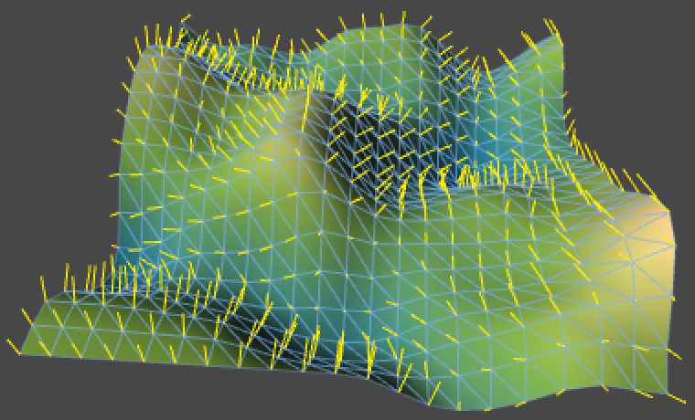 				Normals calculated by the mesh itself. 			

To calculate normals ourselves, we have to loop through all  vertices and figure out the normal of each one. Because our mesh is a  grid, most vertices have four neighbors. If you connect opposite  neighbors, you get two lines that form a cross. Those two lines define a  plane, which we can consider an approximation of the tangent plane of  the slope at the center vertex. If we take the cross product of those  two vectors and normalize it, we end up with the normal of that slope.

As we consider the two lines lines tangent to the slope at our  vertex, then if we scale them so that their X or Z component is 1, then  their Y component is the proper rate of change in that direction. Let's  go one step at a time, and misuse our normals to show the rate of change  – the derivative – of the X direction only. For that reason we won't  assign our normals to the mesh just yet.

 				 					[What is the cross product?](https://catlikecoding.com/unity/tutorials/noise-derivatives/#a-cross-product) 				 			

```
	public void Refresh () {
		…
		mesh.RecalculateNormals();
		CalculateNormals();
	}
	
	private void CalculateNormals () {
		for (int v = 0, z = 0; z <= resolution; z++) {
			for (int x = 0; x <= resolution; x++, v++) {
				normals[v] = Vector3.up * GetXDerivative(x, z);
			}
		}
	}
```

To get the derivative along the X axis, we have to take the  difference between the height to the left and to the right of a vertex,  so right minus left. We then have to divide this by the distance between  the left and right vertices, which is twice the mesh resolution.

 				 					[How to get the vertex index for x and z?](https://catlikecoding.com/unity/tutorials/noise-derivatives/#a-vertex-index) 				 			

```
	private float GetXDerivative (int x, int z) {
		int rowOffset = z * (resolution + 1);
		float left, right, distance;
		left = vertices[rowOffset + x - 1].y;
		right = vertices[rowOffset + x + 1].y;
		distance = 2f / resolution;
		return (right - left) / distance;
	}
```

As we're now dividing by a division, we might as well convert it into a multiplication.

```
	private float GetXDerivative (int x, int z) {
		int rowOffset = z * (resolution + 1);
		float left, right, scale;
		left = vertices[rowOffset + x - 1].y;
		right = vertices[rowOffset + x + 1].y;
		scale = 0.5f * resolution;
		return (right - left) * scale;
	}
```

But this approach will only work for vertices that aren't on the  edge of the grid. The edge vertices will lack either a left or a right  neighbor. In those cases the best we can do is take the difference  between the vertex and its single neighbor. As that halves the distance  covered, we also have to double the scale.

```
	private float GetXDerivative (int x, int z) {
		int rowOffset = z * (resolution + 1);
		float left, right, scale;
		if (x > 0) {
			left = vertices[rowOffset + x - 1].y;
			if (x < resolution) {
				right = vertices[rowOffset + x + 1].y;
				scale = 0.5f * resolution;
			}
			else {
				right = vertices[rowOffset + x].y;
				scale = resolution;
			}
		}
		else {
			left = vertices[rowOffset + x].y;
			right = vertices[rowOffset + x + 1].y;
			scale = resolution;
		}
		return (right - left) * scale;
	}
```

 				
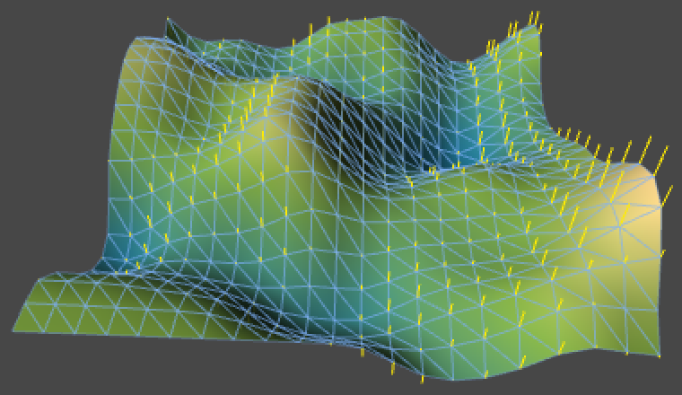 				Rate of vertical change in the X direction. 			

To turn this into tangent lines, we have to use vectors of the form (1, derivative, 0).

```
				normals[v] = new Vector3(1f, GetXDerivative(x, z), 0f);
```

 				
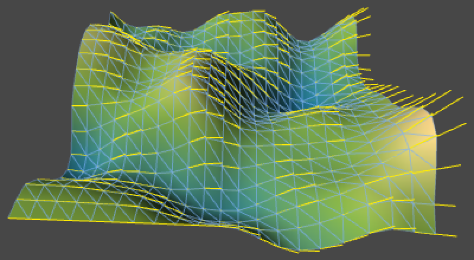 				Tangent lines in the X direction. 			

We can do the same thing for the Z direction.

```
	private float GetZDerivative (int x, int z) {
		int rowLength = resolution + 1;
		float back, forward, scale;
		if (z > 0) {
			back = vertices[(z - 1) * rowLength + x].y;
			if (z < resolution) {
				forward = vertices[(z + 1) * rowLength + x].y;
				scale = 0.5f * resolution;
			}
			else {
				forward = vertices[z * rowLength + x].y;
				scale = resolution;
			}
		}
		else {
			back = vertices[z * rowLength + x].y;
			forward = vertices[(z + 1) * rowLength + x].y;
			scale = resolution;
		}
		return (forward - back) * scale;
	}

	private void CalculateNormals () {
		for (int v = 0, z = 0; z <= resolution; z++) {
			for (int x = 0; x <= resolution; x++, v++) {
				normals[v] = new Vector3(0f, GetZDerivative(x, z), 1f);
			}
		}
	}
```

 				
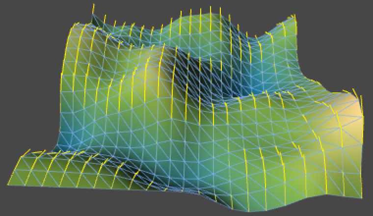 				Tangent lines in the Z direction. 			

Now if we take the cross product of these two tangent vectors,  we'll get a vector pointing along our surface's normal. We have to  perform Z-tangent × X-tangent to get them to point upward instead of  downward.

```
				normals[v] = Vector3.Cross(
					new Vector3(0f, GetZDerivative(x, z), 1f),
					new Vector3(1f, GetXDerivative(x, z), 0f));
```

Because of the nature of our vectors, quite a few parts of the  cross product are constant. In fact, we only have to flip the signs of  the derivatives. The final step is to normalize the result, so it  becomes a proper normal vector for our mesh. Now we can use our own code  instead of relying on `Mesh.RecalculateNormals`. Note that both approaches produce slightly different normals.

```
	public void Refresh () {
		…
		mesh.vertices = vertices;
		mesh.colors = colors;
		CalculateNormals();
		mesh.normals = normals;
	}
	
	private void CalculateNormals () {
		for (int v = 0, z = 0; z <= resolution; z++) {
			for (int x = 0; x <= resolution; x++, v++) {
				normals[v] = new Vector3(-GetXDerivative(x, z), 1f, -GetZDerivative(x, z)).normalized;
			}
		}
	}
	
```

 				
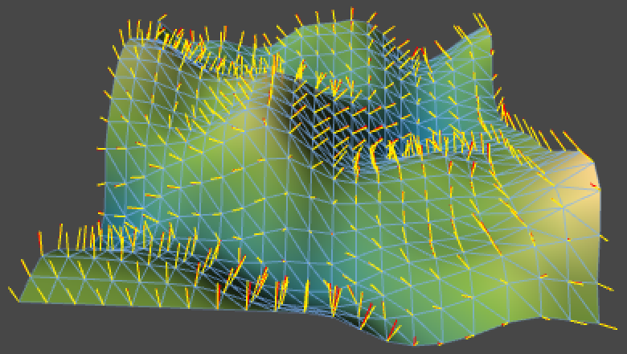 				Calculated by us in yellow vs. calculated by the mesh in red. 			

## Using Analytical Derivatives

What we've done so far is approximate the partial derivatives of  our noise function. They're partial because we consider the change in  the X and Z direction indepdently, while keeping the other constant.  Specifically, we're performing numerical differentiation using the  finite difference formula **(f(x + h) - f(x - h)) / 2h** for all vertices except those along edges, for which we use **(f(x + h) - f(x)) / h** instead.

In our case **h** is 1 / resolution, which is quite large. Using a smaller value for **h**  will produce results that are closer to the true derivative. We could  do that, but then we can no longer use the values of adjacent vertices.  We'd have to sample the noise four additional times per vertex for most  vertices. While that's possible, we must take care that we don't use too  small a value for **h**. Because we're using floating-point numbers, we only have limited numerical precision. If **h** is too small, **x** and **x + h** become hard or even impossible to distinguish, which leads to significant rounding errors.

Instead of taking more samples and approximate the derivatives,  it is also possible to compute the analytical derivatives directly. We  already know the derivative of the smoothing function we're using for  our noise, why not figure out the derivative function for the entire  noise as well? We get the best possible result, and it should be cheaper  to compute than sampling five times.

This means that our noise methods will have to return both their  value and their derivative. So let's create a convenient struct that  contains both.

```
using UnityEngine;

public struct NoiseSample {

	public float value;
	public Vector3 derivative;
}
```

 				
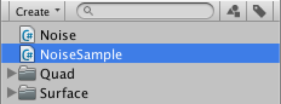 				Structure for noise samples. 			

Then we change the return type of our `**NoiseMethod**` delegate type that we defined at the top of our noise script.

```
public delegate NoiseSample NoiseMethod (Vector3 point, float frequency);
```

Now all six noise methods need to be updated so they return a `**NoiseSample**`  instead of a float. For now, simply assign their result to a sample's  value and set all the sample's derivative components to zero.

However, before we worry about how the compute the derivatives,  we already know that when the frequency is increased, slopes become  steeper, which means the derivatives become larger. This is actually  because of the chain rule. So we have to multiply the derivative by the  frequency, so let's put that in already.

Only the change for `Value1D` is shown below, but you have to adjust the other five methods in the same way as well.

 				 					[What's the chain rule?](https://catlikecoding.com/unity/tutorials/noise-derivatives/#a-chain-rule) 				 			

```
	public static NoiseSample Value1D (Vector3 point, float frequency) {
		point *= frequency;
		int i0 = Mathf.FloorToInt(point.x);
		float t = point.x - i0;
		i0 &= hashMask;
		int i1 = i0 + 1;

		int h0 = hash[i0];
		int h1 = hash[i1];

		t = Smooth(t);
		NoiseSample sample;
		sample.value = Mathf.Lerp(h0, h1, t) * (1f / hashMask);
		sample.derivative.x = 0f;
		sample.derivative.y = 0f;
		sample.derivative.z = 0f;
		sample.derivative *= frequency;
		return sample;
	}
```

With that out of the way, the next method that needs updating is `Sum`.

```
	public static NoiseSample Sum (
		NoiseMethod method, Vector3 point, float frequency, int octaves, float lacunarity, float persistence
	) {
		NoiseSample sum = method(point, frequency);
		float amplitude = 1f;
		float range = 1f;
		for (int o = 1; o < octaves; o++) {
			frequency *= lacunarity;
			amplitude *= persistence;
			range += amplitude;
			sum += method(point, frequency) * amplitude;
		}
		return sum / range;
	}
```

Unfortunately this naive conversion doesn't work, because we're  now trying to perform addition, multiplication, and dividision with  entire noise samples. As it would be very convenient if this just worked  – and it makes mathematical sense – why not make it so?

We're going to define what addition does when performed with two `**NoiseSample**` values. We do this by adding a static method to `**NoiseSample**` and declare that is overloads the plus operator.

 				 					[How do operator methods work?](https://catlikecoding.com/unity/tutorials/noise-derivatives/#a-operator-methods) 				 			

```
	public static NoiseSample operator + (NoiseSample a, NoiseSample b) {
	}
```

Addition of the value is straightforward. And because **(f + g)' = f' + g'** the derivatives can also simply be added together.

 				 					[Can derivatives really be added?](https://catlikecoding.com/unity/tutorials/noise-derivatives/#a-adding-derivatives) 				 			

```
	public static NoiseSample operator + (NoiseSample a, NoiseSample b) {
		a.value += b.value;
		a.derivative += b.derivative;
		return a;
	}
```

As it's also possible to add a single float to our sample, we  should support that as well. Because the derivative of a constant is  zero, we don't need to change the derivate in this case. Also, because  the operands could be placed in any order, we should be tidy and support  both options.

```
	public static NoiseSample operator + (NoiseSample a, float b) {
		a.value += b;
		return a;
	}

	public static NoiseSample operator + (float a, NoiseSample b) {
		b.value += a;
		return b;
	}
```

We also perform subtractions, so that operator needs to go in as well. Again, we should support all versions.

```
	public static NoiseSample operator - (NoiseSample a, float b) {
		a.value -= b;
		return a;
	}
	
	public static NoiseSample operator - (float a, NoiseSample b) {
		b.value = a - b.value;
		b.derivative = -b.derivative;
		return b;
	}
	
	public static NoiseSample operator - (NoiseSample a, NoiseSample b) {
		a.value -= b.value;
		a.derivative -= b.derivative;
		return a;
	}
```

Next up is multiplication. Because a constant factor is simply passed on to the derivative – meaning that **(cf)' = cf'** – we simply apply multiplication with a float to both the value and the derivative. 

```
	public static NoiseSample operator * (NoiseSample a, float b) {
		a.value *= b;
		a.derivative *= b;
		return a;
	}

	public static NoiseSample operator * (float a, NoiseSample b) {
		b.value *= a;
		b.derivative *= a;
		return b;
	}
```

To be complete, we should also support the multiplication of two  noise samples. In that case we have to apply the product rule to get the  final derivative.

 				 					[What's the product rule?](https://catlikecoding.com/unity/tutorials/noise-derivatives/#a-product-rule) 				 			

```
	public static NoiseSample operator * (NoiseSample a, NoiseSample b) {
		a.derivative = a.derivative * b.value + b.derivative * a.value;
		a.value *= b.value;
		return a;
	}
```

Let's not bother with division now and just rewrite `Sum` so it uses a multiplication instead.

```
	public static NoiseSample Sum (
		NoiseMethod method, Vector3 point, float frequency, int octaves, float lacunarity, float persistence
	) {
		NoiseSample sum = method(point, frequency);
		float amplitude = 1f;
		float range = 1f;
		for (int o = 1; o < octaves; o++) {
			frequency *= lacunarity;
			amplitude *= persistence;
			range += amplitude;
			sum += method(point, frequency) * amplitude;
		}
		return sum * (1f / range);
	}
```

Now we have to adjust how we use the result of `Sum` in `**TextureCreator**.FillTexture`. As we don't use derivatives there we can simply grab the sample's value.

```
				float sample =
					Noise.Sum(method, point, frequency, octaves, lacunarity, persistence).value;
```

We do want to keep the whole sample inside `**SurfaceCreator**.Refresh`, so we turn `sample` into a `**NoiseSample**` instead of a float and extract its value when needed for the vertex color and offset.

```
				Vector3 point = Vector3.Lerp(point0, point1, x * stepSize);
				NoiseSample sample =
					Noise.Sum(method, point, frequency, octaves, lacunarity, persistence);
				sample = type == NoiseMethodType.Value ? (sample - 0.5f) : (sample * 0.5f);
				if (coloringForStrength) {
					colors[v] = coloring.Evaluate(sample.value + 0.5f);
					sample *= amplitude;
				}
				else {
					sample *= amplitude;
					colors[v] = coloring.Evaluate(sample.value + 0.5f);
				}
				vertices[v].y = sample.value;
```

We can use the same approach as before to turn the derivative  into a normal. The only difference is that we have to use the  derivative's Y component instead of its Z component, because we're  sampling in XY instead of in XZ.

```
				vertices[v].y = sample.value;
				normals[v] = new Vector3(-sample.derivative.x, 1f, -sample.derivative.y).normalized;
```

Now we can choose whether to use analyitical derivatives or stick  with our numerical approach to define our normals. Let's add an option  to choose between them so their results can be easily compared.

```
	public bool analyticalDerivatives;
			
	public void Refresh () {
		…
				vertices[v].y = sample.value;
				if (analyticalDerivatives) {
					normals[v] =
						new Vector3(-sample.derivative.x, 1f, -sample.derivative.y).normalized;
				}
			}
		}
		mesh.vertices = vertices;
		mesh.colors = colors;
		if (!analyticalDerivatives) {
			CalculateNormals();
		}
		mesh.normals = normals;
	}
```

 				
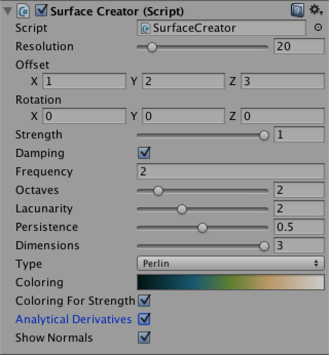 				Using analytical derivatives. Or not. 			

Or course our sampled derivatives are still zero, so the  resulting normals all point straight up. So it's time to start  calculating analytical derivatives!

The first thing to consider is the `**Noise**.Smooth` method, which computes **6t5 - 15t4 + 10t3**. It's derivative is **30t4 - 60t3 + 30t2**, so add a method to calculate that as well.

```
	private static float SmoothDerivative (float t) {
		return 30f * t * t * (t * (t - 2f) + 1f);
	}
```

We first consider the most simple noise method that we have, which is `Value1D`. To recap, it determines two hash values, interpolates between them using the smooth function, and scales the result.

```
	public static NoiseSample Value1D (Vector3 point, float frequency) {
		point *= frequency;
		int i0 = Mathf.FloorToInt(point.x);
		float t = point.x - i0;
		i0 &= hashMask;
		int i1 = i0 + 1;

		int h0 = hash[i0];
		int h1 = hash[i1];

		t = Smooth(t);
		NoiseSample sample;
		sample.value = Mathf.Lerp(h0, h1, t) * (1f / hashMask);
		sample.derivative.x = 0f;
		sample.derivative.y = 0f;
		sample.derivative.z = 0f;
		sample.derivative *= frequency;
		return sample;
	}
```

As the scaling applies to the derivative as well, we can perform  the multiplication with the whole sample just before we return it.

```
		sample.value = Mathf.Lerp(h0, h1, t);
		sample.derivative.x = 0f;
		sample.derivative.y = 0f;
		sample.derivative.z = 0f;
		sample.derivative *= frequency;
		return sample * (1f / hashMask);
```

To get the derivative of `Smooth(t)`, we simply invoke `SmoothDerivative(t)` with the unsmoothed `t` and hold on to it.

```
		float dt = SmoothDerivative(t);
		t = Smooth(t);
```

But how do we deal with the linear interpolation? Remember that  linear interpolation is just a simple function. We could have directly  programmed **h0 + (h1 - h0)t** instead of using `Mathf.Lerp`. As **h0** and **h1**  are hash values, they are constants. Let's make that explicit by  putting all constant components of the function into variables.

```
		float dt = SmoothDerivative(t);
		t = Smooth(t);

		float a = h0;
		float b = h1 - h0;

		NoiseSample sample;
		sample.value = a + b * t;
```

The derivative of **a + bt** is simply **bt'**, so that becomes our partial derivative for X. As there's no change in the Y and Z directions, those components remain zero.

```
		sample.derivative.x = b * dt;
```

You'll notice that the numerical approach produces normals that  don't always follow the shape of the mesh. The numerical normals produce  more extreme results. This is so because they adhere to the actual  shape of the noise, regardless of the resolution of the mesh. This  difference becomes larger as the mesh resolution decreases, or as the  frequency of the noise increases. If the resolution is too low, the  result will look wrong.

This is a pretty good reason for using the actual mesh topology  to compute the normals, instead of relying on analytical derivatives. No  matter how badly the mesh approximates the noise, at least its normals  always look reasonable. An advantage of analytical derivatives is that  the edges aren't treated differently, which means you can break the  terrain into multiple meshes without causing normal seams.

 				 				 				Mutiple octaves of 1D Value noise at resolution 20, analytical vs. numerical normals. 			

 				 				 				The same noise at resolution 5, analytical vs. numerical normals. 			

While our normal calculation seems correct, it goes wrong when we  rotate the noise. This is because the derivative calculation doesn't  care what direction X points to, but we do. So when supplying a rotated  point to our noise, we have to rotate the derivative vector in the  opposite direction to get the correct result from our frame of  reference. We do this by multiplying with the inverse of our rotation  quaterion.

```
	public void Refresh () {
		…
		Quaternion q = Quaternion.Euler(rotation);
		Quaternion qInv = Quaternion.Inverse(q);
		…
		
				sample.derivative = qInv * sample.derivative;
				if (analyticalDerivatives) {
					normals[v] =
						new Vector3(-sample.derivative.x, 1f, -sample.derivative.y).normalized;
				}
		…
	}
```

 				 				 				Rotated 1D Value noise, using unrotated vs. rotated derivatives. 			

## Dealing with More Dimensions

When computing the derivatives for `Value2D`, we have to take interpolation over two dimensions into account. We can replace the use of the nested `Mathf.Lerp` invocations with the large function **h00 + (h10 - h00)tx + (h01 + (h11 - h01)tx - (h00 + (h10 - h00)tx))ty**, which can be rewritten to get **h00 + (h10 - h00)tx + (h01 - h00)ty + (h11 - h01 - h10 + h00)txty**. Then we turn the hash values into constants, and end up with **a + btx + cty + dtxty**, which is a lot more manageable.

Note that we can rewrite our new function to **a + cty + (b + dty)tx**. Because **ty** is held constant when determining the partial derivative for X, it simply becomes **(b + dty)tx'**.

As we can also rewrite our function to **a + btx + (c + dtx)ty**, the partial derivative for Y becomes the function **(c + dtx)ty'**.

```
	public static NoiseSample Value2D (Vector3 point, float frequency) {
		…

		float dtx = SmoothDerivative(tx);
		float dty = SmoothDerivative(ty);
		tx = Smooth(tx);
		ty = Smooth(ty);

		float a = h00;
		float b = h10 - h00;
		float c = h01 - h00;
		float d = h11 - h01 - h10 + h00;

		NoiseSample sample;
		sample.value = a + b * tx + (c + d * tx) * ty;
		sample.derivative.x = (b + d * ty) * dtx;
		sample.derivative.y = (c + d * tx) * dty;
		sample.derivative.z = 0f;
		sample.derivative *= frequency;
		return sample * (1f / hashMask);
	}
```

 				 				 				2D Value noise, using analytical vs. numerical normals. 			

When you apply the same approach to `Value3D`, you'll end up with a quite large function of the form **a + btx + cty + dtz + etxty + ftxtz + gtytz + htxtytz**.

In this case the partial derivative for X is **(b + ety + (f + hty)tz)tx'**  and the other two partial derivatives look similar. You might think  that we don't actually use the partial derivative of Z for our mesh, but  we will when we rotate the noise around the X or Y axis.

```
	public static NoiseSample Value3D (Vector3 point, float frequency) {
		…
		
		float dtx = SmoothDerivative(tx);
		float dty = SmoothDerivative(ty);
		float dtz = SmoothDerivative(tz);
		tx = Smooth(tx);
		ty = Smooth(ty);
		tz = Smooth(tz);

		float a = h000;
		float b = h100 - h000;
		float c = h010 - h000;
		float d = h001 - h000;
		float e = h110 - h010 - h100 + h000;
		float f = h101 - h001 - h100 + h000;
		float g = h011 - h001 - h010 + h000;
		float h = h111 - h011 - h101 + h001 - h110 + h010 + h100 - h000;

		NoiseSample sample;
		sample.value = a + b * tx + (c + e * tx) * ty + (d + f * tx + (g + h * tx) * ty) * tz;
		sample.derivative.x = (b + e * ty + (f + h * ty) * tz) * dtx;
		sample.derivative.y = (c + e * tx + (g + h * tx) * tz) * dty;
		sample.derivative.z = (d + f * tx + (g + h * tx) * ty) * dtz;
		sample.derivative *= frequency;
		return sample * (1f / hashMask);
	}
```

 				 				 				3D Value noise, using analytical vs. numerical normals. 			

## Computing the Derivatives of Perlin Noise

How about the analytical derivatives of Perlin noise? Let's start by doing the same for `Perlin1D` that we did for `Value1D`, except that we're now using gradient values instead of hash values.

```
	public static NoiseSample Perlin1D (Vector3 point, float frequency) {
		point *= frequency;
		int i0 = Mathf.FloorToInt(point.x);
		float t0 = point.x - i0;
		float t1 = t0 - 1f;
		i0 &= hashMask;
		int i1 = i0 + 1;
		
		float g0 = gradients1D[hash[i0] & gradientsMask1D];
		float g1 = gradients1D[hash[i1] & gradientsMask1D];

		float v0 = g0 * t0;
		float v1 = g1 * t1;

		float dt = SmoothDerivative(t0);
		float t = Smooth(t0);

		float a = v0;
		float b = v1 - v0;

		NoiseSample sample;
		sample.value = a + b * t;
		sample.derivative.x = b * dt;
		sample.derivative.y = 0f;
		sample.derivative.z = 0f;
		sample.derivative *= frequency;
		return sample * 2f;
	}
```

 				
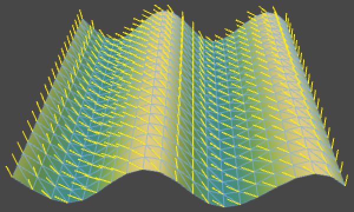 				1D Perlin noise with incorrect analytical normals. 			

The result is clearly wrong. This is because we are treating **a** and **b** as constants, while they are not. They are composed of gradients multiplied by **t0** and **t1**, which means that we have to get their derivatives as well. Fortunately, this is easy.

The derivative of **v0** is simply **(g0t0)' = g0**. And for **v1** we have **(g1t1)' = (g1(t0 - 1))' = g1**. These are simply the gradient directions, which makes sense.

The final derivative now becomes more complex. Because **a**, **b**, and **t** are all functions of **t0** we can no longer eliminate anything and we have to apply the product rule. Specifically, we now have **(a + bt)' = a' + b't + bt'**.

```
		float da = g0;
		float db = g1 - g0;

		NoiseSample sample;
		sample.value = a + b * t;
		sample.derivative.x = da + db * t + b * dt;
```

 				 				 				1D Perlin noise, using analytical vs. numerical normals. 			

Compared to the Value noise derivative, what we've effectively done is add the original noise formula, but with **a** and **b**  replaced by their derivatives. Technically, we could also do this for  Value noise, as they become zeros in that case and it has no effect.

Now consider the two-dimensional case. We calculate the noise with **a + btx + (c + dtx)ty** and for Value noise the partial derivative for X is **(b + dty)tx'**. To turn this into the correct derivative for Perlin noise, we have to add the gradient formula **a' + b'tx + (c' + d'tx)ty** to it.

Of course the 2D gradients are 2D vectors. We have to add the X  component of the gradient formula to the partial derivate of X, and its Y  component to the partial derivative of Y.

```
	public static NoiseSample Perlin2D (Vector3 point, float frequency) {
		…

		float dtx = SmoothDerivative(tx0);
		float dty = SmoothDerivative(ty0);
		float tx = Smooth(tx0);
		float ty = Smooth(ty0);

		float a = v00;
		float b = v10 - v00;
		float c = v01 - v00;
		float d = v11 - v01 - v10 + v00;

		Vector2 da = g00;
		Vector2 db = g10 - g00;
		Vector2 dc = g01 - g00;
		Vector2 dd = g11 - g01 - g10 + g00;

		NoiseSample sample;
		sample.value = a + b * tx + (c + d * tx) * ty;
		sample.derivative = da + db * tx + (dc + dd * tx) * ty;
		sample.derivative.x += (b + d * ty) * dtx;
		sample.derivative.y += (c + d * tx) * dty;
		sample.derivative.z = 0f;
		sample.derivative *= frequency;
		return sample * sqr2;
	}
```

 				 				 				2D Perlin noise, using analytical vs. numerical normals. 			

The partial derivatives for 3D Perlin noise become quite long, but are found using the same simple procedure.

```
	public static NoiseSample Perlin3D (Vector3 point, float frequency) {
		…;
		
		float dtx = SmoothDerivative(tx0);
		float dty = SmoothDerivative(ty0);
		float dtz = SmoothDerivative(tz0);
		float tx = Smooth(tx0);
		float ty = Smooth(ty0);
		float tz = Smooth(tz0);

		float a = v000;
		float b = v100 - v000;
		float c = v010 - v000;
		float d = v001 - v000;
		float e = v110 - v010 - v100 + v000;
		float f = v101 - v001 - v100 + v000;
		float g = v011 - v001 - v010 + v000;
		float h = v111 - v011 - v101 + v001 - v110 + v010 + v100 - v000;

		Vector3 da = g000;
		Vector3 db = g100 - g000;
		Vector3 dc = g010 - g000;
		Vector3 dd = g001 - g000;
		Vector3 de = g110 - g010 - g100 + g000;
		Vector3 df = g101 - g001 - g100 + g000;
		Vector3 dg = g011 - g001 - g010 + g000;
		Vector3 dh = g111 - g011 - g101 + g001 - g110 + g010 + g100 - g000;

		NoiseSample sample;
		sample.value = a + b * tx + (c + e * tx) * ty + (d + f * tx + (g + h * tx) * ty) * tz;
		sample.derivative = da + db * tx + (dc + de * tx) * ty + (dd + df * tx + (dg + dh * tx) * ty) * tz;
		sample.derivative.x += (b + e * ty + (f + h * ty) * tz) * dtx;
		sample.derivative.y += (c + e * tx + (g + h * tx) * tz) * dty;
		sample.derivative.z += (d + f * tx + (g + h * tx) * ty) * dtz;
		sample.derivative *= frequency;
		return sample;
	}
```

 				 				 				3D Perlin noise, using analytical vs. numerical normals. 			

## Flowing Through Noise

Because the noise derivative is a 3D vector, we could interpret  it as a velocity map, which could represent stuff like movement of a  liquid or gas. Let's create a `**SurfaceFlow**` component that visualizes the flow along our surface with a particle system.

It should get a reference to our surface, so it can know what  noise settings are used. It also needs its own particle system and an  array to hold the particles that it will be manipulating.

```
using UnityEngine;

[RequireComponent(typeof(ParticleSystem))]
public class SurfaceFlow : MonoBehaviour {

	public SurfaceCreator surface;

	private ParticleSystem system;
	private ParticleSystem.Particle[] particles;
}
```

 				
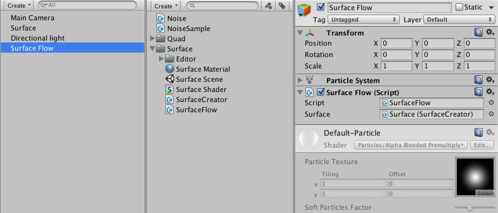 				Surface flow object. 			

To make the system fit our surface area, set its shape to a unit  cube. As this defines the particle spawn area and elevation will be  determined by the terrain, I made the cube flat. The other settings  don't matter that much, use whatever looks good to you.

 				 				 				 				Particle system settings. 			

We'll leave the management of particles to the particle system.  What we'll do is fetch the data of all living particles each update,  manipulate their positions, and push that data back to the system. We do  this via the `GetParticles` and `SetParticles` methods of `ParticleSystem`.  The first method copies particle data into an array that we provide and  returns how many living particles were copied. The second method is  used to do the opposite. Of course we also have to grab the particle  system component first and guarantee that our array can hold all the  particles.

Actually, we'll use a `LateUpdate` method instead of `Update`.  This is an alternative update method that will be invoked after regular  update methods and physics calculations. We do this because we want to  mess with the particles after the system has done its thing. If we  don't, we might get some popping artifacts, as newborn particles won't  have the correct values during their first frame.

 				 					[Why do I see no particles?](https://catlikecoding.com/unity/tutorials/noise-derivatives/#a-particles) 				 			

```
	private void LateUpdate () {
		if (system == null) {
			system = GetComponent<ParticleSystem>();
		}
		if (particles == null || particles.Length < system.maxParticles) {
			particles = new ParticleSystem.Particle[system.maxParticles];
		}
		int particleCount = system.GetParticles(particles);
		PositionParticles();
		system.SetParticles(particles, particleCount);
	}
	
	private void PositionParticles () {
	}
```

To make the particles adhere to the surface, we have to sample the noise the exact same way as `**SurfaceCreator**`  does. Only in this case we loop through all particles and use their 2D  positions as input, instead of going through a vertex grid.

```
	private void PositionParticles () {
		Quaternion q = Quaternion.Euler(surface.rotation);
		Quaternion qInv = Quaternion.Inverse(q);
		NoiseMethod method = Noise.methods[(int)surface.type][surface.dimensions - 1];
		float amplitude = surface.damping ? surface.strength / surface.frequency : surface.strength;
		for (int i = 0; i < particles.Length; i++) {
			Vector3 position = particles[i].position;
			Vector3 point = q * new Vector3(position.x, position.z) + surface.offset;
			NoiseSample sample = Noise.Sum(method, point,
				surface.frequency, surface.octaves, surface.lacunarity, surface.persistence);
			sample = surface.type == NoiseMethodType.Value ? (sample - 0.5f) : (sample * 0.5f);
			sample *= amplitude;
			sample.derivative = qInv * sample.derivative;
			position.y = sample.value;
			particles[i].position = position;
		}
	}
```

 				 				 				Particles ignoring vs. adhering to the surface. 			

Because the particles have a size they are now partially clipped  by our surface. We can solve this by simply moving them upward a bit.

```
		position.y = sample.value + system.startSize;
```

 				
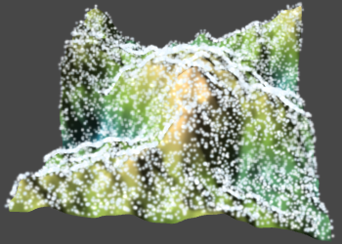 				Particles with vertical offset. 			

What would happen if we used the derivate of our noise as a  velocity? We can do so by simply adding it to the current particle  position, multiplied by the time delta. By setting the vertical position  after this movement, we effectively ignore the Z component of the  derivative. In that case the noise sample gives us the altitude where  the partical was, not what it would have after it moved. But if the  movement is not too large this shoudln't be much of a problem.

```
			position += sample.derivative * Time.deltaTime;
			position.y = sample.value + system.startSize;
```

 				
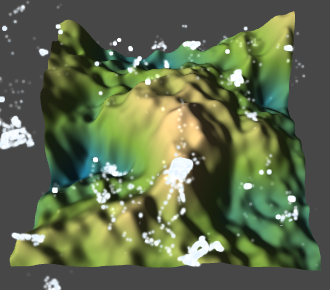 				Using the derivate as velocity. 			

This causes the particles to immediately clump and become quite  jittery, so it looks like the resulting displacement is too large. Also,  because the particles are not constrained to their spawn area, they  also move beyond the surface edge. Let's add a `flowStrenth` setting so we can bring this down to a reasonable level.

```
	public float flowStrength;
			
	private void PositionParticles () {
		…
			position += sample.derivative * Time.deltaTime * flowStrength;
		…
		}
	}
```

 				
 				 				 				Flow strength 0.10 and 0.01. 			

When using a lower strength the clumping happens again, but slow  enough that we can actually see what is happening. Indeed, there are  areas that the particles quickly leave and areas where they clump until  they expire. If we interpret this as gas or liquid flow, then these  areas are sources and sinks where matter is added to and removed from  the system. Alternatively, the matter expands and compresses.

While this already produces an interesting effect, to make  something that looks more realistic we have to get rid of the sources  and sinks and instead simulate the flow of a noncompressible fluid. We  can do this by performing the 2D curl operation on our noise, which  gives us a smoothly flowing vector field. When using this field  to set  the velocities of our particles, they will end up flowing around the  slopes of our surface.

 				 					[What's the curl operator?](https://catlikecoding.com/unity/tutorials/noise-derivatives/#a-curl) 				 			

```
			Vector3 curl = new Vector3(sample.derivative.y, 0f, -sample.derivative.x);
			position += curl * Time.deltaTime * flowStrength;
```

 				 				 				2D curl at strength 0.25 and 0.10. 			

If you don't like that the particles move out of the surface's  area, you can simply eliminate them when they do so by setting their  remaining lifetime to zero. That will recude the number of particles on  the surface as well though, because some of the particles that leave the  surface would have eventually returned to it.

```
			particles[i].position = position;
			if (position.x < -0.5f || position.x > 0.5f || position.z < -0.5f || position.z > 0.5f) {
				particles[i].lifetime = 0f;
			}
```

 				
 				Particles no longer escape. 			

## Flowing in 3D

We've now seen 2D curl noise in action, but what would it look like in 3D? Let's make a new scene to find out!

Create a `**Flow3D**` component, to  distinguish it from our surface flow component. It has the same particle  system logic, and it also needs its own noise settings. It doesn't need  a separate flow strength variable, as the noise strength serves the  same purpose.

```
using UnityEngine;

[RequireComponent(typeof(ParticleSystem))]
public class Flow3D : MonoBehaviour {
	
	public Vector3 offset;
	public Vector3 rotation;
	
	[Range(0f, 1f)]
	public float strength = 1f;
	
	public bool damping;
	
	public float frequency = 1f;
	
	[Range(1, 8)]
	public int octaves = 1;
	
	[Range(1f, 4f)]
	public float lacunarity = 2f;
	
	[Range(0f, 1f)]
	public float persistence = 0.5f;
	
	[Range(1, 3)]
	public int dimensions = 3;
	
	public NoiseMethodType type;
	
	private ParticleSystem system;
	private ParticleSystem.Particle[] particles;
	
	private void LateUpdate () {
		if (system == null) {
			system = GetComponent<ParticleSystem>();
		}
		if (particles == null || particles.Length < system.maxParticles) {
			particles = new ParticleSystem.Particle[system.maxParticles];
		}
		int particleCount = system.GetParticles(particles);
		PositionParticles();
		system.SetParticles(particles, particleCount);
	}
	
	private void PositionParticles () {
	}
}
```

 				 				 				3D Flow object. 			

This time, don't directly set the position of the particles,  instead set their velocity and let the particle system figure it out  from there. That way you can configure the system to color and stretch  the particles based on their speed, which looks nice. I chose a gradient  that makes it look like particles start to glow as they move faster,  but you can use whatever settings you like. I also now use a sphere for  the spawn shape.

```
	private void PositionParticles () {
		Quaternion q = Quaternion.Euler(rotation);
		Quaternion qInv = Quaternion.Inverse(q);
		NoiseMethod method = Noise.methods[(int)type][dimensions - 1];
		float amplitude = damping ? strength / frequency : strength;
		for (int i = 0; i < particles.Length; i++) {
			Vector3 position = particles[i].position;
			Vector3 point = q * position + offset;
			NoiseSample sample = Noise.Sum(method, point, frequency, octaves, lacunarity, persistence);
			sample *= amplitude;
			sample.derivative = qInv * sample.derivative;
			particles[i].velocity = sample.derivative;
		}
	}
```

 				 				 				Using derivatives of Value and Perlin noise as velocities. 			

Of course we need to apply the curl operation to get a proper  flow. Let's start naive and use only one noise sample to compute it.

```
			Vector3 curl;
			curl.x = sample.derivative.y - sample.derivative.z;
			curl.y = sample.derivative.z - sample.derivative.x;
			curl.z = sample.derivative.x - sample.derivative.y;
			particles[i].velocity = curl;
```

 				 				 				Flattened noise, shown head-on and from the side. 			

While this does appear nice from a certain viewpoint, when  observing the resulting noise from multiple angles it becomes clear that  the result is flat. All particles move in a plane that has (1,1,1) as  its normal, which makes sense because all three components of our source  vector fields are equal so we end up with a 1D rotation.

So we have to take three noise samples. To make them different, we simply add offsets in different directions.

```
			Vector3 point = q * position + offset;
			NoiseSample sampleX = Noise.Sum(method, point, frequency, octaves, lacunarity, persistence);
			sampleX *= amplitude;
			sampleX.derivative = qInv * sampleX.derivative;
			point = q * new Vector3(position.x + 100f, position.y, position.z) + offset;
			NoiseSample sampleY = Noise.Sum(method, point, frequency, octaves, lacunarity, persistence);
			sampleY *= amplitude;
			sampleY.derivative = qInv * sampleY.derivative;
			point = q * new Vector3(position.x, position.y + 100f, position.z) + offset;
			NoiseSample sampleZ = Noise.Sum(method, point, frequency, octaves, lacunarity, persistence);
			sampleZ *= amplitude;
			sampleZ.derivative = qInv * sampleZ.derivative;
			Vector3 curl;
			curl.x = sampleZ.derivative.y - sampleY.derivative.z;
			curl.y = sampleX.derivative.z - sampleZ.derivative.x;
			curl.z = sampleY.derivative.x - sampleX.derivative.y;
			particles[i].velocity = curl;
```

 				 				 				3D Curl, using frequency 1 Value and Perlin noise. 			

It is possible to swap components of our sample points –  transforming the noise result as well – as long as we also swap them in  the curl calculation. For example, we can swap the X and Z components  for `Sample1`.

```
			Vector3 point = q * new Vector3(position.z, position.y, position.x) + offset;
			NoiseSample sampleX = Noise.Sum(method, point, frequency, octaves, lacunarity, persistence);
			…
			curl.x = sampleZ.derivative.y - sampleY.derivative.z;
			curl.y = sampleX.derivative.x - sampleZ.derivative.x;
			curl.z = sampleY.derivative.x - sampleX.derivative.y;
			
```

This doesn't seem very useful, but we can do it for all three  samples so that the curl is computed using X and Y components only.

```
			Vector3 point = q * new Vector3(position.z, position.y, position.x) + offset;
			NoiseSample sampleX = Noise.Sum(method, point, frequency, octaves, lacunarity, persistence);
			sampleX *= amplitude;
			sampleX.derivative = qInv * sampleX.derivative;
			point = q * new Vector3(position.x + 100f, position.z, position.y) + offset;
			NoiseSample sampleY = Noise.Sum(method, point, frequency, octaves, lacunarity, persistence);
			sampleY *= amplitude;
			sampleY.derivative = qInv * sampleY.derivative;
			point = q * new Vector3(position.y, position.x + 100f, position.z) + offset;
			NoiseSample sampleZ = Noise.Sum(method, point, frequency, octaves, lacunarity, persistence);
			sampleZ *= amplitude;
			sampleZ.derivative = qInv * sampleZ.derivative;
			Vector3 curl;
			curl.x = sampleZ.derivative.x - sampleY.derivative.y;
			curl.y = sampleX.derivative.x - sampleZ.derivative.y;
			curl.z = sampleY.derivative.x - sampleX.derivative.y;
```

This means that we could technically get away with three samples  of 2D noise, which is a lot cheaper to compute, especially when using  multiple octaves. Even though this means that part of the equation does  not vary in each direction, combining three 2D samples still leads to  acceptable results.

 				 				 				3D Curl, using 2D Value and Perlin noise. 			

You can also create a flow that changes over time by adding an  increasing offset to the noise. Adding to the Z component of 3D noise is  an obvious choise. You typically want to keep the morph speed slow so  the flow evolves slowly and smoothly.

We implement our offset by incrementing a variable each update.  As we'll get numerical precision problems if it would grow too large, we  wrap it at 256, which coincides with the period of our noise.

```
	public float morphSpeed;
			
	private float morphOffset;
	
	private void PositionParticles () {
		…
		morphOffset += Time.deltaTime * morphSpeed;
		if (morphOffset > 256f) {
			morphOffset -= 256f;
		}
		…
			Vector3 point = q * new Vector3(position.z, position.y, position.x + morphOffset) + offset;
			…
			point = q * new Vector3(position.x + 100f, position.z, position.y + morphOffset) + offset;
			…
			point = q * new Vector3(position.y, position.x + 100f, position.z + morphOffset) + offset;
		…
	}
```

 				
 				Morph speed. 			

Another fun thing you can do is manipulate the vector field  before applying the curl operator. As long as it remains smooth, the  curl operation will produce a divergence-free field. For example, we  could adjust the field so that we end up with a vertical velocity. But  we might as well directly add this velocity. We could even make it  decrease with height, so upward movement dominates at the bottom but the  noise dominates at the top. If you decrease the size of the spawn area –  say to 0.1 – you'll get a focused flow of particles that branches  outward the higher it gets.

 				 					[Can we really just add the velocity?](https://catlikecoding.com/unity/tutorials/noise-derivatives/#a-add-velocity) 				 			

```
			curl.x = sampleZ.derivative.x - sampleY.derivative.y;
			curl.y = sampleX.derivative.x - sampleZ.derivative.y + (1f / (1f + position.y));
			curl.z = sampleY.derivative.x - sampleX.derivative.y;
```

 				 				
 				 				 				Rising particles using Perlin and Value noise, one and two octaves. 			

That's it! Have fun cooking up nice terrains and flows.

Enjoyed the tutorial? [Help me make more by becoming a patron!](https://www.patreon.com/catlikecoding)


## Downloads

- [noise-derivatives-01.unitypackage](https://catlikecoding.com/unity/tutorials/noise-derivatives/noise-derivatives-01.unitypackage)

  The project after Setting the Scene.

- [noise-derivatives-02.unitypackage](https://catlikecoding.com/unity/tutorials/noise-derivatives/noise-derivatives-02.unitypackage)

  The project after Creating a Mesh.

- [noise-derivatives-03.unitypackage](https://catlikecoding.com/unity/tutorials/noise-derivatives/noise-derivatives-03.unitypackage)

  The project after Making a Noisy Surface.

- [noise-derivatives-04.unitypackage](https://catlikecoding.com/unity/tutorials/noise-derivatives/noise-derivatives-04.unitypackage)

  The project after Scaling the Displacement.

- [noise-derivatives-05.unitypackage](https://catlikecoding.com/unity/tutorials/noise-derivatives/noise-derivatives-05.unitypackage)

  The project after Calculating Normals.

- [noise-derivatives-06.unitypackage](https://catlikecoding.com/unity/tutorials/noise-derivatives/noise-derivatives-06.unitypackage)

  The project after Using Analytical Derivatives.

- [noise-derivatives-07.unitypackage](https://catlikecoding.com/unity/tutorials/noise-derivatives/noise-derivatives-07.unitypackage)

  The project after Dealing with More Dimensions.

- [noise-derivatives-08.unitypackage](https://catlikecoding.com/unity/tutorials/noise-derivatives/noise-derivatives-08.unitypackage)

  The project after Computing the Derivatives of Perlin Noise.

- [noise-derivatives-09.unitypackage](https://catlikecoding.com/unity/tutorials/noise-derivatives/noise-derivatives-09.unitypackage)

  The project after Flowing Through Noise.

- [noise-derivatives-finished.unitypackage](https://catlikecoding.com/unity/tutorials/noise-derivatives/noise-derivatives-finished.unitypackage)

  The finished project.

- [What's a ``](https://catlikecoding.com/unity/tutorials/noise-derivatives/#q-mesh)`Mesh`?

   				Conceptually, a `Mesh`  is a construct used by the graphics hardware to draw complex stuff. It  contains at least a collection of points in 3D space plus a set of  triangles – the most basic 2D shapes – defined by these points. The  triangles form the surface of whatever the mesh respresents. Often, you  won't realize that you're looking at a bunch of triangles instead of a  real object. 			

- [What does ``](https://catlikecoding.com/unity/tutorials/noise-derivatives/#q-require-component)`RequireComponent` do?

   				You can add the `RequireComponent`  attribute to a component to indicate that you need another type of  component to be attached to the same game object that your own component  is. Unity will check whether this is the case when adding yours, and if  not will add the required ones first. 				Unity will also disallow removal of required components via the  editor. However, you could still destroy them through scripts, so  there's no hard guarantee they'll always exist. 				The attribute has a version with one and two arguments. If you  require more components, you'll have to add the attribute multiple  times. 			

- [How do normals work?](https://catlikecoding.com/unity/tutorials/noise-derivatives/#q-normals)

   				A normal is vector that is perpendicular to a surface. We always  use normals of unit length and they point to the outside of its surface,  not to the inside. 				Normal vectors can be used to determine the angle at which a  light ray hits a surface, which is used to determine the diffuse term of  the lighting calculation. Specifically, it is the dot product of the  normal and the light direction, as long as the result is positive. A  negative result means that light is coming from behind it, in which case  the surface is unlit. The normal is also used for other parts of the  light calculation, in more complex shaders. 				As a triangle is always flat, there shouldn't be a need to  provide separate information about normals. However, by doing so we can  cheat. In reality vertices don't have normals, triangles do. By  attaching custom normals to vertices and interpolating between them  across triangles, we can pretend that we have a smoothly curving surface  instead of a bunch of flat triangles. This illusion is convincing, as  long as you don't pay attention to the sharp silhouette of the mesh. 			

- [How are normals recalculated?](https://catlikecoding.com/unity/tutorials/noise-derivatives/#q-recalculate-normals)

   				The `Mesh.RecalculateNormals`  method basically computes the normal of each vertex by figuring out  which triangles use the vertex, determining the normals of those  triangles, averaging them, and normalizing the result. This gives pretty  good results that fit the mesh topology well. However, in the case of a  grid the vertices along the edges are used by fewer triangles, so their  normals are not as balanced as the other normals. 			

- [What are gizmos?](https://catlikecoding.com/unity/tutorials/noise-derivatives/#q-gizmos)

   				Gizmos are visual cues that you can use in the editor. By default  they're visible in the scene view and not in the game view, but you can  adjust this via their toolbars. 				The `Gizmos` utility class allows you to draw icons, lines, and some other things. Like with `Handles`,  they are drawn directly in world space, so you have to manually  transform vectors into the local space of objects to have them move  along with them. I neglected to do that for our surface because I'll  never move it, so its local space is the same as world space. 			

- [What is the cross product?](https://catlikecoding.com/unity/tutorials/noise-derivatives/#q-cross-product)

   				The cross product of two vectors is an operation that produces a  vector that has two interesting properties. First, it is perpendicular  to the plane formed by both vectors. Second, its length is equal to the  surface area of the parallelogram that has the vectors as edges. For  example, the cross product of unit vectors pointing right and forward  also has unit length and points either down or up, depending on the  order of the operands. 				Mathematically, the dot product for 3D vectors is defined as **(x, y, z) × (a, b, c) = (yc - zb, za - xc, xb - ya)**. 			

- [How to get the vertex index for x and z?](https://catlikecoding.com/unity/tutorials/noise-derivatives/#q-vertex-index)

   				How can we index our one-dimensional vertex array based on (x,z)  coordinates? Because we defined the vertices as successive rows along  the X axis, the indices of the first row of vertices are simply x. So  the indices of the second row are also x, plus an offset equal to the  length of a row. The third row adds twice that offset, and so on. In  general, the vertex index is **zr + x**, where **r** is the vertex row length, which is resolution + 1. 			

- [What's the chain rule?](https://catlikecoding.com/unity/tutorials/noise-derivatives/#q-chain-rule)

   				The chain rule states that **f(g)' = f'(g)g'**. For example, consider **f = 2t3 - t**. Its derivative is **f' =  6t2 - 1**. Now consider that **g = 2t** and we're using **g** as input for **f** instead of **t**. Then we have **2g3 - g = 2(2t)3 - 2t = 16t3 - 2t**. The derivative of that is **48t2 - 2**. If we use the chain rule instead, we get **(6(2t)2 - 1)2**, which rewrites to the same result. 				Applied to noise samples, it means that if we multiply our sample  point by the frequency, the derivative of that is the frequency itself,  so we have to multiply the sampled derivative by the frequency to get  the correct result. 				You could define the sample point's components in more exotic ways. For example, you could use **(x, 2y, z2)**, in which case you'd have to multiply the partial derivatives by **1**, **2**, and **2z**,  respectively. However, the partial derivatives are computed by keeping  the other dimensions static. So our approach will fail for sample points  like **(x + y, y, z)**. 			

- [How do operator methods work?](https://catlikecoding.com/unity/tutorials/noise-derivatives/#q-operator-methods)

   				Operator methods are simply static methods that masquerade as an  operator, just like properties are methods that pretend to be variables.  Yes, methods are hidden everywhere. You're able to directly add `Vector3` values together because Unity has defined an operator method for it. 				You should only overload operators this way if the result is obvious and makes sense, just like a method named *Add*  should add stuff. For example, Unity has no multiplication method for  two vectors, because there is no universal interpretation of what that  should do. 				Note that because `a += b` is shorthand for `a = a + b`, both cases are covered when overriding such an operator. 			

- [Can derivatives really be added?](https://catlikecoding.com/unity/tutorials/noise-derivatives/#q-adding-derivatives)

   				Yes they can, because the parts of a function are differentiated independently. For example, **(t3 + 2t)' = 3t2 + 2**. In this case we can consider **f = t3** and **g = 2t**. 			

- [What's the product rule?](https://catlikecoding.com/unity/tutorials/noise-derivatives/#q-product-rule)

   				The product rule states that **(fg)' = f'g + fg'**. As an example, consider the case **f = t3 - 5** and **g = 2t2**. In that case we have **f' = 3t2** and **g' = 4t**. Then **f'g + fg' = (3t2)(2t2) + (t3 - 5)(4t) = 6t4 + (4t4 - 20t) = 10t4 - 20t**. 				If we don't use the product rule then **(fg)' = ((t3 - 5)2t2)' = (2t5 - 10t2)' = 10t4 - 20t**, which is the same result. 			

- [Why do I see no particles?](https://catlikecoding.com/unity/tutorials/noise-derivatives/#q-particles)

   				If you end up in a situation where the particle system doesn't  show anything, it's turned off. You turn it back on by clicking the *Simulate* button in the *Particle Effect* panel. It is visible in the scene view when you have the particle system selected. 			

- [What's the curl operator?](https://catlikecoding.com/unity/tutorials/noise-derivatives/#q-curl)

   				The curl operator measures the rotation inside a vector field.  Imagine that you are floating in a river. If all the water around you  flows forward equally fast, then you are simply pushed forward as well.  But if the water on your left happens to flow faster than the water on  your right, you will be pushed forward harder on your left side than on  your right side. You will start to rotate clockwise. Of course, sideways  water movement influences the rotation as well. 				That the curl operator gives us a measure of rotation is nice,  but the main point is that when applied to a smooth vector field, the  result is divergence-free, meaning that it gives us an incompressible  velocity field. 				 				In three dimensions, given some vector field **F = (Fx, Fy, Fz)**, the curl operation yields a 3D rotation vector and is defined as **(δFz/δy - δFy/δz, δFx/δz - δFz/δx, δFy/δx - δFx/δy)**. Here **δ** (delta) means rate of change. So the Y component is equal to the rate of change of **Fx** along **z** minus the rate of change of **Fz** along **x**, which matches our water example. 				If we use noise samples for **Fx**, **Fy**, and **Fz**,  then our noise derivatives directly give use the rates of change that  we need. Note that we cannot directly use the noise derviate vector for **F**.  Well, we could, but then we'd still need to figure out the derivatives  of all its components in all three directions, so there's no point in  doing that. 				If we are only interested in a 2D result, then we can eliminate the third component and **δz** from the equation, so we end up with **(δFz/δy, -δFz/δx)**. As we are only using one component of **F** now, we can suffice with a single noise sample. 				The use of the curl operator to simulate fluid flow was first mentioned in a paper by Robert Bridson et al. 			

- [Can we really just add the velocity?](https://catlikecoding.com/unity/tutorials/noise-derivatives/#q-add-velocity)

   				Yes. We want to add some vertical velocity to the result. That  means we have to increase the Y component of the curl result, which is **δFx/δz - δFz/δx**. We could do that by increasing **δFx/δz**. So we add a vector field to **Fx** that smoothly increases in the Z direction and is contant in the other two directions. 				For example, we could add **(0,0,z)** to **Fx**, which is smooth so **Fx + (0,0,z)** is smooth as well. This means we add **(0,0,1)** to **δFx**, which leads to **(0,1,0)** being added to the curl result. 				We can add a different field and end up adding **(0,1 / (1 + y),0)**, we just don't bother figuring out what it is. But if you insist, **(0,0,ln(1 + y))** is a suitable field. 			

[About](https://catlikecoding.com/about/)[Contact](https://catlikecoding.com/contact/)[Tutorials](https://catlikecoding.com/unity/tutorials/)

© Catlike Coding


- [Twitter](https://twitter.com/catlikecoding)
- [Facebook](https://www.facebook.com/catlikecoding)
- [Google+](https://google.com/+CatlikeCoding)
