# Simplex Noise, keeping it simple

In this tutorial you will create alternatives of Value and Perlin noise, known as Simplex Noise.

 				You'll learn to 				

- Use a falloff function based on distance;
- Convert between a square and a triangular grid;
- Convert between a cube and a tetrahedron grid;
- Compute Simplex Value noise, up to 3D, with derivatives;
- Compute Simplex Gradient noise, up to 3D, with derivatives.

This tutorial follows the [Noise](https://catlikecoding.com/unity/tutorials/noise/) and [Noise Derivatives](https://catlikecoding.com/unity/tutorials/noise-derivatives/) tutorials. I assume you did those first, as we'll be using code and knowledge gained from them.

This tutorial has been made with Unity 4.5.2. It might not work for older versions.


 				
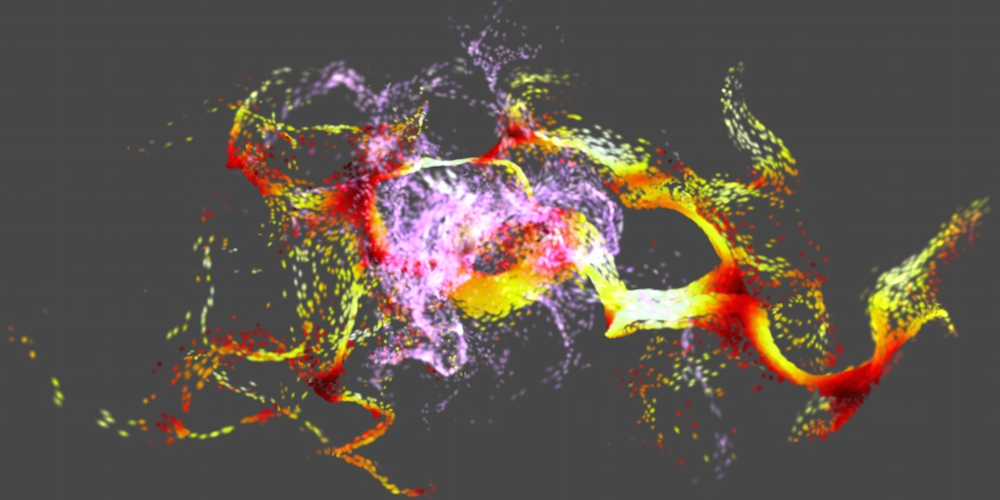 				Pushing particles around with Simplex curl noise. 			

## Simplifying Noise

In the [Noise](https://catlikecoding.com/unity/tutorials/noise/) and [Noise Derivatives](https://catlikecoding.com/unity/tutorials/noise-derivatives/)  tutorial we used pseudorandom noise to color a texture, deform a flat  surface, and animate particles flows. We created two forms of lattice  noise, interpolating between intersection points of grid lines. We chose  to use a hypercube grid – a line grid in 1D, a square grid in 2D, and a  cube grid in 3D – because it's an obvious and easy way to partition  space.

We created Value noise by defining hash values for each lattice  point and smoothly interpolating between them. We created Gradient noise  by interpolating gradients instead of fixed values, which is most often  known as Perlin noise.

You can produce very nice effects with these noise types, but  they have some limitations. As they're based on a hypercube grid, you  will be able to detect square patterns if you look hard enough. Also,  when moving an axis-aligned 2D slice through 3D noise you will see a  distinct change in the noise as you alternate between edges and centers  of cube cells. Due to the triple interpolation, a cube's center is a lot  more fuzzy than its faces. Finally, analytical derivatives are hard to  compute and higher dimensions get more expensive quickly. 4D noise  requires a tesseract grid, which means you'd have to interpolate 16  points per sample.

### Using a Simplex Grid

We do not need to use a hypercube grid, all we need is a way to  partition space into regular chunks. Ideally, we'd use the smallest  possible shape for our grid cells, which would be a simplex. For 1D this  is a line, so it makes no difference. For 2D it is a triangle instead  of a square. For 3D it is a tetrahedron instead of a cube. And for 4D it  is a pentatope instead of a tesseract. This means that for **n** dimension we only have consider **1 + n** points, instead of **2n**.

### Falloff instead of Interpolation

How would we interpolate between the corners of a simplex?  Actually, we don't need to. Instead of interpolating, we can decrease  the contribution of a corner based on its distance from the sample  point. For 2D, this would be a radial falloff function, which should  drop to zero when it reaches the opposide side of the triangle. For 3D  it would be a spherical falloff, and so on.

A big advantage of using a falloff instead of an interpolation is  that the contribution of each point is now indepedent. They're just  added together to get the final value. This simplifies the calculation  of the derivatives a great deal.

You could use this approach with a hypercube grid as well, but  the radial falloff doesn't work as well with squares as it does with  triangles.

 				 				
 				 				 				2D Value and Perlin noise, radial falloff vs. interpolation. 			

### Simplex Noise

Using a simplex grid with a falloff function to compute gradient  noise was first proposed by Ken Perlin as an alternative for the  gradient noise that he previously invented. Most people refer to this as  simplex noise, so let's stick with the same name for our simplex-based  gradient noise. For our Value noise alternative, let's name it Simplex  Value to distinquish it from the hypercube-based Value noise.

We'll be building on top of the previous tutorial, so start with the [finished project](https://catlikecoding.com/unity/tutorials/noise-derivatives/noise-derivatives-finished.unitypackage) of the [Noise Derivatives](https://catlikecoding.com/unity/tutorials/noise-derivatives/) tutorial.

 				 					[Isn't Simplex noise patented?](https://catlikecoding.com/unity/tutorials/simplex-noise/#a-patented) 				 			

## Simplex Value Noise

Let's again start with Value noise, as it is simpler than  Gradient noise. However, before we start remember that we've so far  treated Value noise as a special case. This is because it has a range of  0–1 while Gradient noise has a range of -1–1. So we should update our  code to also make that exception for Simplex Value noise. Alternatively,  we could do away with the special case entirely if we change the range  of our Value noise to -1–1. Let's do that, just because we can.

First, adjust the result of the `Value1D`, `Value2D`, and `Value3D` methods in `**Noise**`. Simply double it and subtract one.

```
		return sample * (2f / hashMask) - 1f;
```

Then remove the checks for Value noise from `**TextureCreator**`, `**SurfaceCreator**`, and `**SurfaceFlow**`. After taking a noise sample we now always half it.

```
				NoiseSample sample = …;
				sample = sample * 0.5f;
```

And to keep `**TextureCreator**` in the 0–1 range, add ½.

```
				sample = sample * 0.5f + 0.5f;
```

With that out of the way, add our new noise type to the enumeration at the top of the `**Noise**` script.

```
public enum NoiseMethodType {
	Value,
	Perlin,
	SimplexValue
}
```

Now we can add placeholder methods and their method array, and  include it in the methods collection. This allows use to select Simplex  Value noise in the inspectors of our creators.

```
	public static NoiseMethod[] simplexValueMethods = {
		SimplexValue1D,
		SimplexValue2D,
		SimplexValue3D
	};

	public static NoiseMethod[][] methods = {
		valueMethods,
		perlinMethods,
		simplexValueMethods
	};
	
	public static NoiseSample SimplexValue1D (Vector3 point, float frequency) {
		return new NoiseSample();
	}

	public static NoiseSample SimplexValue2D (Vector3 point, float frequency) {
		return new NoiseSample();
	}

	public static NoiseSample SimplexValue3D (Vector3 point, float frequency) {
		return new NoiseSample();
	}
```

### 1D

We start considering just one dimension, which keeps it simple.  The simplex and hypercube grid are equal in this case, so we can just  grab the integer portion of the sample point to get the lattice point to  its left.

```
	public static NoiseSample SimplexValue1D (Vector3 point, float frequency) {
		point *= frequency;
		int ix = Mathf.FloorToInt(point.x);
		return new NoiseSample();
	}
```

 				 					[Why can the derivatives be nonzero?](https://catlikecoding.com/unity/tutorials/simplex-noise/#a-nonzero-derivatives) 					[How do you find the falloff derivatives?](https://catlikecoding.com/unity/tutorials/simplex-noise/#a-falloff-derivatives) 				 			

Let's focus on the contribution of the left end of the line  segment we're in. It should start at one and drop to zero when we reach  the right end, just like with regular Value noise. And once again we  want to make sure that the first and second derivative of that falloff  function drops to zero as well. What's different is that the derivatives  don't need to be zero at the start, they just need to be continuous.

Besides those considerations, we want a function that would work  in any dimension, based on the distance to the grid intersection. While  we could compute the actual distance, this would require performing a  square root operation for higher dimensions, and we rather avoid doing  that. So could we work with the squared distance instead? If so, we  automatically get a radially symmetrical falloff.

The simplest such falloff would be **1 - x2**. Its first and second derivatives are **-2x** and **-2**, which aren't zero when **x** is one, so it won't work. What about if we squared the whole function? Then we get **(1 - x2)2**, which still drops to zero when it should. Its derivatives are **-4x(1 - x2)**, which does drop to zero, and **-4(1 - x2) + 8x2**, which doesn't. So let's go one step further and try the cubic version, **(1 - x2)3**. That one has derivatives **-6x(1 - x2)2** and **-6(1 - x2)2 + 24x2(1 - x2)**, which both drop to zero when we want them to.

 				
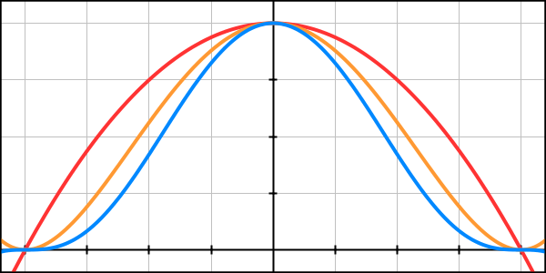				(1-x2)n with n from 1 to 3. 			

So **(1 - x2)3** is our falloff  function. Let's compute it step by step and visualize it. Also don't  forget that we have to convert the final result to the -1–1 range.

```
	public static NoiseSample SimplexValue1D (Vector3 point, float frequency) {
		point *= frequency;
		int ix = Mathf.FloorToInt(point.x);
		float x = point.x - ix;
		float f = 1f - x * x;
		float f2 = f * f;
		float f3 = f * f2;
		NoiseSample sample = new NoiseSample();
		sample.value = f3;
		return sample * 2f - 1f;
	}
```

 				
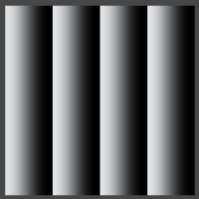 				Falloff in 1D, frequency 4. 			

Now the idea is that we can compute this for both end points  separately and simply sum the results. So let's put the code to compute  one part of the result in a separate method and call it twice so we get  both ends.

```
	private static NoiseSample SimplexValue1DPart (Vector3 point, int ix) {
		float x = point.x - ix;
		float f = 1f - x * x;
		float f2 = f * f;
		float f3 = f * f2;
		NoiseSample sample = new NoiseSample();
		sample.value = f3;
		return sample;
	}

	public static NoiseSample SimplexValue1D (Vector3 point, float frequency) {
		point *= frequency;
		int ix = Mathf.FloorToInt(point.x);
		NoiseSample sample = SimplexValue1DPart(point, ix);
		sample += SimplexValue1DPart(point, ix + 1);
		return sample * 2f - 1f;
	}
```

 				
 				Adding both parts. 			

As you can see, the result is at full strength at the end points  of the line segments and weakest halfway between them. This difference  becomes more pronounced in higher dimensions.

All that's left to turn it into Value noise is factoring in the hash values.

```
	private static NoiseSample SimplexValue1DPart (Vector3 point, int ix) {
		float x = point.x - ix;
		float f = 1f - x * x;
		float f2 = f * f;
		float f3 = f * f2;
		float h = hash[ix & hashMask];
		NoiseSample sample = new NoiseSample();
		sample.value = h * f3;
		return sample;
	}

	public static NoiseSample SimplexValue1D (Vector3 point, float frequency) {
		point *= frequency;
		int ix = Mathf.FloorToInt(point.x);
		NoiseSample sample = SimplexValue1DPart(point, ix);
		sample += SimplexValue1DPart(point, ix + 1);
		return sample * (2f / hashMask) - 1f;
	}
```

 				 				 				Simplex Value noise vs. Value noise, frequency 8. 			

The end result looks very much like regular interpolated Value noise, though the falloff function produces more bands.

Of course we still have to include the derivate computation, but we leave that for later.

### 2D

For two-dimension noise, we again begin with visualizing the falloff. Building on our 1D apprach, let's just include **y** the exact same way that we use **x**.

```
	private static NoiseSample SimplexValue2DPart (Vector3 point, int ix, int iy) {
		float x = point.x - ix;
		float y = point.y - iy;
		float f = 1f - x * x - y * y;
		float f2 = f * f;
		float f3 = f * f2;
		NoiseSample sample = new NoiseSample();
		sample.value = f3;
		return sample;
	}

	public static NoiseSample SimplexValue2D (Vector3 point, float frequency) {
		point *= frequency;
		int ix = Mathf.FloorToInt(point.x);
		int iy = Mathf.FloorToInt(point.y);
		NoiseSample sample = SimplexValue2DPart(point, ix, iy);
		sample += SimplexValue2DPart(point, ix + 1, iy + 1);
		return sample * 2f - 1f;
	}
```

 				
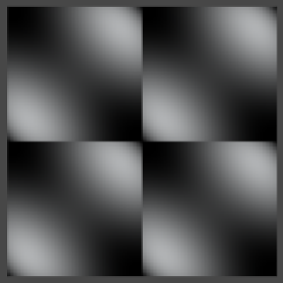 				Radial falloff in 2D square, frequency 2. 			

We now see the radial falloff of two corners per square, along  the main diagonal. However, those corners themselves aren't white. This  is because the falloff function from the other corner is negative at  that point, which is something that couldn't happen in 1D. We don't want  negative contributions, so only include them when they are larger than  zero.

```
	private static NoiseSample SimplexValue2DPart (Vector3 point, int ix, int iy) {
		float x = point.x - ix;
		float y = point.y - iy;
		float f = 1f - x * x - y * y;
		NoiseSample sample = new NoiseSample();
		if (f > 0f) {
			float f2 = f * f;
			float f3 = f * f2;
			sample.value = f3;
		}
		return sample;
	}
```

 				
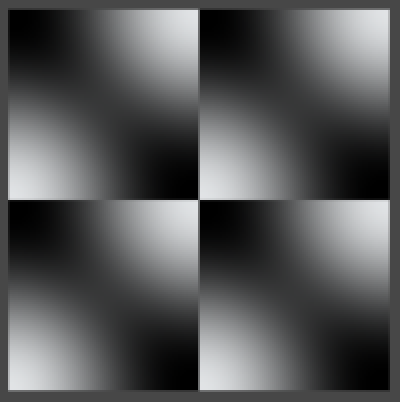 				No more negative contributions. 			

Of course we don't want squares, we want triangles. So how do we  determine which triangle contains a sample point, and how do we locate  the corners of that triangle? We know that 2D space can be tiled with  equilateral triangles. We also know that 2D space can be tiled with  squares, which we've already used a lot. It would be convenient if we  could convert between the two tilings.

If you split a square along its diagonal, you end up with two  triangles. These are both right and isosceles triangles. If you were to  compress those triangles along the same diagonal, at some point they'll  become equilateral. So if we skew a square grid by the right amount and  split the squares, we end up with an equilateral triangular grid.

Scaling along the main diagonal means that we need to figure out where along that line each point lies. For any point **<x, y>** this is equal to **x + y**. The downscaling itself can be done by subtracting **s(x + y)** from both components of the point. We have to choose the scaling factor **s** such that we end up with equilateral triangles.

 				
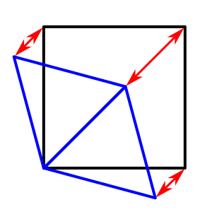 				Skewing to convert between grids. 			

Let's consider the triangle defined by **A = <0, 0>**, **B = <1, 0>**, and **C = <1, 1>**. Point **A** won't change, but the other two will be transformed into **B = <1 - s, -s>** and **C = <1 - 2s, 1 - 2s>**. To get an equilateral triangle, the length of all three sides of the triangle have to be equal.

For the unscaled triangle the distance from **A** to **B** – or simply **|AB|** – is 1. The distance **|BC|** between **B** and **C** is the same as **|B|**, so we can ignore that one. The distance from **A** to **C** – or simply **|AC|** – is √2. For the transformed triangle these lenghts are yet unknown.

 				
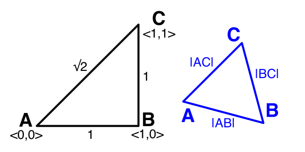 				Comparing edges. 			

We have to find a value for **s** such that after scaling **|AB| = |AC|**. Alternatively, we can equate the squared lengths **|AB|2 = |AC|2**, which means we don't have to work with square roots. The squared length of a point **<x, y>** is simply **x2 + y2**.

We have **|AB|2 = (1 - s)2 + (-s)2 = 2s2 - 2s + 1**.

We also have **|AC|2 = 2(1 - 2s)2 = 8s2 - 8s + 2**.

Equating those rewrites to **6s2 - 6s + 1 = 0**. Using the quadratic formula, we end up with the two solutions **s = (3 ± √3) / 6**.  That we get two solutions makes sense, because you can create both a  positive and a negative equilateral triangle. To stay positive we simple  choose the smallest solution, which is **(3 - √3) / 6**.

 				 					[What's the quadratic formula?](https://catlikecoding.com/unity/tutorials/simplex-noise/#a-quadratic-formula) 				 			

```
	private static float squaresToTriangles = (3f - Mathf.Sqrt(3f)) / 6f;
```

But how do we convert the other way, from the triangles to the squares? For that, consider the transformed point **C**. It has to go from **<x + 2sx, y + 2sy>** back to **<1, 1>**, for some new **s** that we have to find.

We have **x + 2sx = 1**, which means that **s = 1 / 2x - ½**. We also know that **x = 1 - 2((3 - √3) / 6)**, which equals **√3 / 3** or **1 / √3**. Substituting that in, we get **s = 1 / (2 / √3) - ½ = (√3 - 1) / 2**.

Now we finally have both our conversion factors.

 				 					[How do you derive those equalities?](https://catlikecoding.com/unity/tutorials/simplex-noise/#a-equalities) 				 			

```
	private static float trianglesToSquares = (Mathf.Sqrt(3f) - 1f) / 2f;
```

So to easily figure out which pair of triangles we're in, we  first skew the grid so it becomes square. The we determine the lattice  points, which we feed into the part method.

```
	public static NoiseSample SimplexValue2D (Vector3 point, float frequency) {
		point *= frequency;
		float skew = (point.x + point.y) * trianglesToSquares;
		float sx = point.x + skew;
		float sy = point.y + skew;
		int ix = Mathf.FloorToInt(sx);
		int iy = Mathf.FloorToInt(sy);
		NoiseSample sample = SimplexValue2DPart(point, ix, iy);
		sample += SimplexValue2DPart(point, ix + 1, iy + 1);
		return sample * 2f - 1f;
	}
```

To get the actual corner points for determining their distance, we have to unskew them.

```
	private static NoiseSample SimplexValue2DPart (Vector3 point, int ix, int iy) {
		float unskew = (ix + iy) * squaresToTriangles;
		float x = point.x - ix + unskew;
		float y = point.y - iy + unskew;
		float f = 1f - x * x - y * y;
		NoiseSample sample = new NoiseSample();
		if (f > 0f) {
			float f2 = f * f;
			float f3 = f * f2;
			sample.value = f3;
		}
		return sample;
	}
```

 				
 				We're skewed. 			

We now see rhombuses formed by two equilateral triangles instead  of squares. We also see that the falloff isn't quick enough. It  currently reaches zero at a distance of one, while it should do so at a  distance equal to the height of our triangle.

The height of an equilateral triangle is equal to its edge length multiplied by **√3 / 2**. So we must determine the length of its edges. We already know that **|AB|2 = 2s2 - 2s + 1** with **s = (3 - √3) / 6**, which leads to **|AB|2 = ⅔**. That's the square length, so the actual edge length is **√⅔** or **√6 / 3**. This means that the triangle height is **√½** or **√2 / 2**.

So our falloff function should reach zero when the squared distance reaches **½**. That means we should use **½ - x2 - y2** as our basis, instead of **1 - x2 - y2**.

 				 					[How do you calculate that length?](https://catlikecoding.com/unity/tutorials/simplex-noise/#a-calculate-length) 				 			

```
		float f = 0.5f - x * x - y * y;
```

Of course this also means that the falloff now starts at **½3 = ⅛**, so we have to scale up the end result to compensate.

```
		return sample * (8f * 2f) - 1f;
```

 				 				 				Correct falloff, unscaled vs. scaled. 			

The next step is determining which of the two triangles we're in,  either the bottom or the top one. This is easy to do inside the  rectangular grid. If the fraction of our X coordinate is larger than or  equal to the fraction of the Y coordinate, then we're in the bottom  triangle. This triangle has the relative corner coordinates **<0, 0>**, **<1, 0>**, and **<1, 1>**. The other triangles sits above it and has the corner coordinates **<0, 0>**, **<0, 1>**, and **<1, 1>**. As we already included the corners along the main diagonal, we only need to add the one that's still missing.

 				
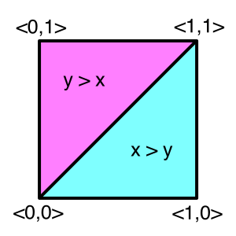 				Determining which triangle you're in. 			

```
		NoiseSample sample = SimplexValue2DPart(point, ix, iy);
		sample += SimplexValue2DPart(point, ix + 1, iy + 1);
		if (sx - ix >= sy - iy) {
			sample += SimplexValue2DPart(point, ix + 1, iy);
		}
		else {
			sample += SimplexValue2DPart(point, ix, iy + 1);
		}
```

 				
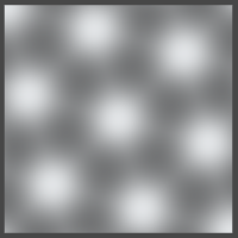 				Complete triangles. 			

To turn it into real Value noise, we have to factor the hash values into the result.

```
			float h = hash[hash[ix & hashMask] + iy & hashMask];
			sample.value = h * f3;
```

And the final step is to readjust the scale.

```
		return sample * (8f * 2f / hashMask) - 1f;
```

 				 				 				
 				 				 				 				2D Simplex Value noise vs. Value noise, frequency 2, 4, and 8. 			

As you can see, 2D Simplex Value noise looks like spheres placed  in a triangular or honeycomb grid. It shows the same hash pattern as 2D  Value noise does, but skewed along the main diagonal.

### 3D

We can apply the same approach we used for 2D to work out the  grid for three dimensions, but in this case we're working with cubes and  tetrahedra. However, it is not possible to tile 3D space with regular  tetrahedra. We have to make do with skewed tetrahedra, which means that  not all edges will have the same length.

A cube can be split into six tetrahedra just like a square can be  split into two triangles. Each tetrahedron has one edge along the main  diagonal of the cube, from **<0, 0, 0>** to **<1, 1, 1>**.  How many ways can you walk between those two points, if you must follow  three edges of the cube? Six ways, each defining three more edges of a  tetrahedron. Besides that, each tetrahedron has two edges along  diagonals of adjacent cube faces.

 				
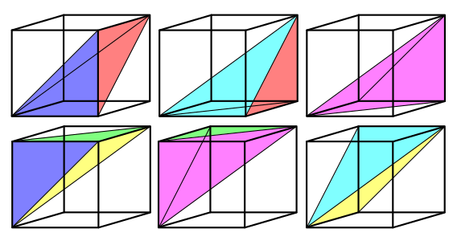 				Six tetrahedra inside a cube. 			

So we start with three different edge lengths. Let's consider the tetrahedron that is defined by the four points **A = <0, 0, 0>**, **B = <1, 0, 0>**, **C = <1, 0, 1>**, and **D = <1, 1, 1>**. Applying a yet unknown scale factor, we end up with three transformed points.

**B = <1 - s, -s, -s>** with **|AB|2 = 3s2 - 2s + 1**.

**C = <1 - 2s, -2s, 1 - 2s>** with **|AC|2 = 12s2 - 8s + 2**.

**D = <1 - 3s, 1 - 3s, 1 - 3s>** with **|AD|2 = 27s2 - 18s + 3**.

 				 				 				Skewing between grids and comparing edges. 			

Let's try out **|AB|2 = |AC|2**. This leads to **9s2 - 6s + 1 = 0** and **s = ⅓**. What square lenghts do we end up with? **|AB|2 = |AC|2 = ⅔**, and **|AD|2 = 0**. This doesn't work, we've collapsed the tetrahedron into a triangle.

So let's try **|AB|2 = |AD|2** instead. This leads to **14s2 - 16s + 2 = 0** and **s = ⅙**. This gives us square lenghts **|AB|2 = |AD|2 = ¾**, and **|AC|2 = 1**. This could work, and making the shortest and longest edges equal matches what we did in 2D as well.

The last option is to try **|AC|2 = |AD|2**. This leads to **15s2 - 10s + 1 = 0** and **s = (5 - √10) / 15**. That results in **|AB|2 = ⅘**, and  = **|AC|2 = |AD|2 = 1 + ⅕**. This also works, although the difference between edge lengths is larger.

So let's use a scale factor of **⅙** to go from cubes to  tetrahedra. These tetrahedra are composed of four isosceles triangles.  Each triangle has one long side with length **1** and two short sides with length **√¾** or **√3 / 2**.

To scale in the other direction, consider one component of the transformed point **D**. This time we have **x + 3sx = 1**, with **x = 1 - 3(⅙) = ½**. So **s = ⅓**.

Let's just copy the 2D code, remove the triangle check, add the  third dimension, substitude our new scale factors, and see what happens.

```
	private static NoiseSample SimplexValue3DPart (Vector3 point, int ix, int iy, int iz) {
		float unskew = (ix + iy + iz) * (1f / 6f);
		float x = point.x - ix + unskew;
		float y = point.y - iy + unskew;
		float z = point.z - iz + unskew;
		float f = 0.5f - x * x - y * y - z * z;
		NoiseSample sample = new NoiseSample();
		if (f > 0f) {
			float f2 = f * f;
			float f3 = f * f2;
			sample.value = f3;
		}
		return sample;
	}

	public static NoiseSample SimplexValue3D (Vector3 point, float frequency) {
		point *= frequency;
		float skew = (point.x + point.y + point.z) * (1f / 3f);
		float sx = point.x + skew;
		float sy = point.y + skew;
		float sz = point.z + skew;
		int ix = Mathf.FloorToInt(sx);
		int iy = Mathf.FloorToInt(sy);
		int iz = Mathf.FloorToInt(sz);
		NoiseSample sample = SimplexValue3DPart(point, ix, iy, iz);
		sample += SimplexValue3DPart(point, ix + 1, iy + 1, iz + 1);
		return sample * (8f * 2f) - 1f;
	}
```

 				 				 				Falloff along main diagonal, frequency 2 and 8. 			

The falloff looks pretty good. Inspecting the geometry of the face triangles reveals that the height of our tetrahedron is **√½**.  Because this is the same as for our 2D case, we do not need to adjust  the falloff base. It also happens to be equal to the height of a regular  tetrahedron with edge length √¾.

 				 					[How do you calculate that height?](https://catlikecoding.com/unity/tutorials/simplex-noise/#a-calculate-height) 				 			

 				
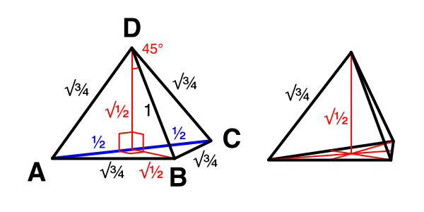 				Determining the tetrahedron height, compared with a regular tetrahedron. 			

Now we need to determine which tetrahedron we're in. This works  the same as for 2D, but now we have to compare three components instead  of two. So let's start with figuring out the closest corner on the main  axes.

```
		float x = sx - ix;
		float y = sy - iy;
		float z = sz - iz;
		if (x >= y) {
			if (x >= z) {
				sample += SimplexValue3DPart(point, ix + 1, iy, iz);
			}
			else {
				sample += SimplexValue3DPart(point, ix, iy, iz + 1);
			}
		}
		else {
			if (y >= z) {
				sample += SimplexValue3DPart(point, ix, iy + 1, iz);
			}
			else {
				sample += SimplexValue3DPart(point, ix, iy, iz + 1);
			}
		}
```

 				 				 				Falloff of three corners. 			

To get the fourth and last corner, we have to repeat this process and add the second-closest corner.

 				
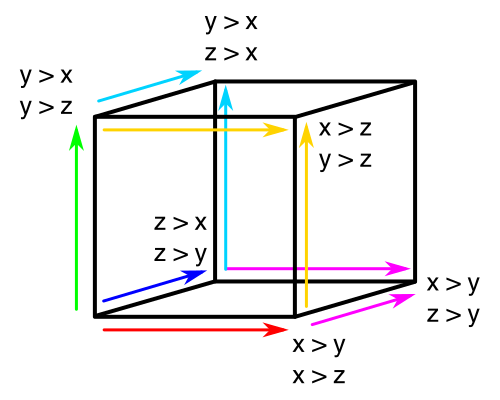 				Determining which other two corners to include. 			

```
		if (x >= y) {
			if (x >= z) {
				sample += SimplexValue3DPart(point, ix + 1, iy, iz);
				if (y >= z) {
					sample += SimplexValue3DPart(point, ix + 1, iy + 1, iz);
				}
				else {
					sample += SimplexValue3DPart(point, ix + 1, iy, iz + 1);
				}
			}
			else {
				sample += SimplexValue3DPart(point, ix, iy, iz + 1);
				sample += SimplexValue3DPart(point, ix + 1, iy, iz + 1);
			}
		}
		else {
			if (y >= z) {
				sample += SimplexValue3DPart(point, ix, iy + 1, iz);
				if (x >= z) {
					sample += SimplexValue3DPart(point, ix + 1, iy + 1, iz);
				}
				else {
					sample += SimplexValue3DPart(point, ix, iy + 1, iz + 1);
				}
			}
			else {
				sample += SimplexValue3DPart(point, ix, iy, iz + 1);
				sample += SimplexValue3DPart(point, ix, iy + 1, iz + 1);
			}
		}
```

 				 				 				Complete tetrahedron falloff. 			

We once again get a triangular grid, but it doesn't look the same  as the 2D grid. This is because the tetrahedra aren't aligned with any  of the three main axes. They follow the main diagonal, so you're seeing a  slanted slice through tetrahedra when sampling in an axis-aligned  plane, which causes an obvious diagonal undulation.

So how does it look with hash values?

```
			float h = hash[hash[hash[ix & hashMask] + iy & hashMask] + iz & hashMask];
			sample.value = h * f3;
```

Don't forget to readjust the scale of the result.

```
		return sample * (8f * 2f / hashMask) - 1f;
```

 				 				 				 				3D Simplex Value noise, frequency 2, 4, and 8. 			

 				 				 				 				 				 				 				Moving along Z. 			

Unlike regular Value noise, this pattern doesn't really change  appearance when moving along Z. The circles slide along the diagonal,  but it doesn't alternate between fuzzy and sharp results as it passes  lattice boundaries. Actually, this does happen, just not all at once.  Instead, you get the sharp and fuzzy bands along the diagonal. It's like  hypercube-based Value noise that's rotated around X and Y.

 				 				 				Simplex Value noise vs. Value noise, rotated to look down the main diagonal. 			

### Derivatives

So what about the derivatives? Fortunately, they are quite simple. The derivative of the falloff function **(1 - x2)3** is **-6x(1 - x2)2**. Factor the hash value into this, and you have the 1D derivative.

```
		NoiseSample sample = new NoiseSample();
		sample.value = h * f3;
		sample.derivative.x = -6f * h * x * f2;
		return sample;
```

Of course we still need to adjust for the frequency, so do this  right before returning the final result. In fact, do this for 2D and 3D  right now as well so we won't forget.

```
		sample.derivative *= frequency;
```

 				
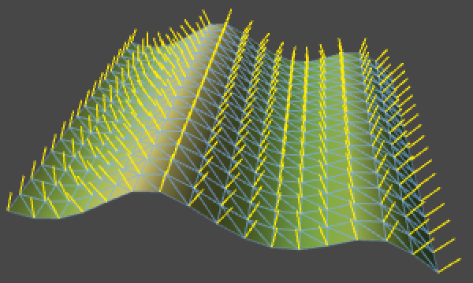 				1D Simplex Value noise surface with analytical normals. 			

For two dimensions, we can use the exact same approach. The only  difference between the derivative components is which component to  multiply with. As the rest of the formula is the same, we might as well  compute it only once.

```
			float h = hash[hash[ix & hashMask] + iy & hashMask];
			float h6f2 = -6f * h * f2;
			sample.value = h * f3;
			sample.derivative.x = h6f2 * x;
			sample.derivative.y = h6f2 * y;
```

It's just as easy for three dimensions.

```
			float h = hash[hash[hash[ix & hashMask] + iy & hashMask] + iz & hashMask];
			float h6f2 = -6f * h * f2;
			sample.value = h * f3;
			sample.derivative.x = h6f2 * x;
			sample.derivative.y = h6f2 * y;
			sample.derivative.z = h6f2 * z;
```

 				 				 				2D and 3D Simplex Value noise surface with analytical normals. 			

## Gradient Noise

It's time to tackle Gradient Simplex noise, which we'll just name Simplex noise. So we add a new noise type.

```
public enum NoiseMethodType {
	Value,
	Perlin,
	SimplexValue,
	Simplex
}
```

And of course we adjust the method arrays.

```
	public static NoiseMethod[] simplexMethods = {
		Simplex1D,
		Simplex2D,
		Simplex3D
	};

	public static NoiseMethod[][] methods = {
		valueMethods,
		perlinMethods,
		simplexValueMethods,
		simplexMethods
	};
```

Now copy and rename the Simplex Value methods. Make sure you have  them call their own part methods. I've only shown the changes for the  1D case.

```
	private static NoiseSample Simplex1DPart (Vector3 point, int ix) {
		float x = point.x - ix;
		float f = 1f - x * x;
		float f2 = f * f;
		float f3 = f * f2;
		float h = hash[ix & hashMask];
		NoiseSample sample = new NoiseSample();
		sample.value = h * f3;
		sample.derivative.x = -6f * h * x * f2;
		return sample;
	}
	
	public static NoiseSample Simplex1D (Vector3 point, float frequency) {
		point *= frequency;
		int ix = Mathf.FloorToInt(point.x);
		NoiseSample sample = Simplex1DPart(point, ix);
		sample += Simplex1DPart(point, ix + 1);
		sample.derivative *= frequency;
		return sample * (2f / hashMask) - 1f;
	}
```

### 1D

Continuing with 1D, we now have to retrieve a 1D gradient instead  of just the hash value. As with Perlin noise, we compute the gradient  value by taking the dot product of the gradient vector and the vector  from the corner to our sample point. For 1D this is a simple  multiplication.

Once again just as with Perlin noise, the gradient now has to include the falloff multiplied by the gradient vector.

```
		float g = gradients1D[hash[ix & hashMask] & gradientsMask1D];
		float v = g * x;
		NoiseSample sample = new NoiseSample();
		sample.value = v * f3;
		sample.derivative.x = g * f3 - 6f * v * x * f2;
		return sample;
```

Now we have to determine the maximum value of the noise. Like  Perlin noise, the maximum value is reached halfway along the line  segment when the gradients on both ends are pointing towards each other.  This means that the maximum is **2x(1 - x2)3** where **x = ½**, which is **27 / 64**. So we have to divide the final result by this value, which means multiplying by **64 / 27**.

```
		return sample * (64f / 27f);
```

 				 				 				1D Simplex noise vs. Perlin noise. 			

 				
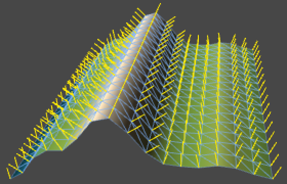 				1D Simplex noise surface with analytical normals. 			

### 2D

It goes the same for 2D. Get the gradient vector, compute the dot  product, include them in the value and the partial derivatives.

```
			Vector2 g = gradients2D[hash[hash[ix & hashMask] + iy & hashMask] & gradientsMask2D];
			float v = Dot(g, x, y);
			float v6f2 = -6f * v * f2;
			sample.value = v * f3;
			sample.derivative.x = g.x * f3 + v6f2 * x;
			sample.derivative.y = g.y * f3 + v6f2 * y;
```

The question is now where the maximum lies. Along the edge of a triangle, or at its center? Let's compute them both.

Remember that the edge length is **√⅔** or **√6 / 3**. So halfway along an edge we get **2x(½ - x2)3** where **x = √6 / 6**, which is **√6 / 81**.

Next, the distance from a corner to the center of an equilateral triangle is equal to its edge length multiplied by **√3 / 3** or  **√⅓**. So at the center we get **3x(½ - x2)3** where **x = √2 / 3**, which gives us **125√2 / 5832**.  As this value is a tiny bit larger than the other one, it is our  theoretical maximum. Its multiplicative inverse can be written as **2916√2 / 125**, so that's our final scale.

 				
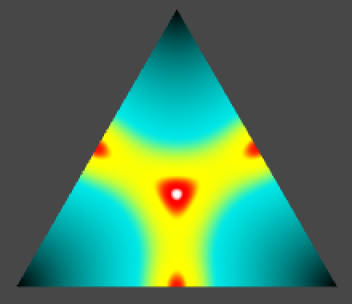 				Visualizing maximum possible values. The white center is highest. 			

```
	private static float simplexScale2D = 2916f * sqr2 / 125f;
```

Now we just need to factor it in at the end, and we're done.

```
		return sample * simplexScale2D;
```

 				 				 				
 				 				 				 				2D Simplex noise vs. Perlin noise, frequency 2, 4, and 8. 			

An additional question is whether we actually cover the entire  -1–1 range, because we didn't consider that we're only using eight  gradient vectors. It turns out that our eight 45-degree rotated gradient  vectors produce maximum values that can get very close to -1 and 1. So  yes, we're effectively covering the entire range.

 				
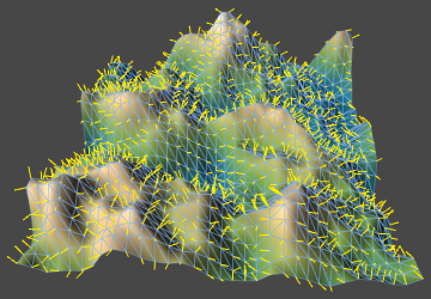 				2D Simplex noise surface with analytical normals. 			

### 3D

The changes required for 3D Simplex noise should hold no surpises.

```
			Vector3 g = gradients3D[hash[hash[hash[ix & hashMask] + iy & hashMask] + iz & hashMask] &
				gradientsMask3D];
			float v = Dot(g, x, y, z);
			float v6f2 = -6f * v * f2;
			sample.value = v * f3;
			sample.derivative.x = g.x * f3 + v6f2 * x;
			sample.derivative.y = g.y * f3 + v6f2 * y;
			sample.derivative.z = g.z * f3 + v6f2 * z;
```

To get the maximum, it makes sense to look at the middle of short  edges of our skewed tetrahedron. We obviously won't find the maximum on  the longer edge. In case of a regular triangle, the difference between  the middle and halfway across an edge was extremely small. Turning it  into a right triangle only increases the distance between two corners,  so the face middle is also out. The distance to the tetrahedron's center  is even larger, so we can ignore it too.

 				
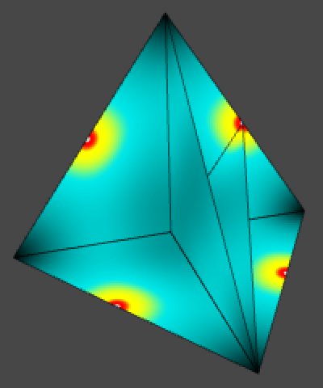 				Visualizing maximum possible values. The white centers are highest. 			

As the shortest edge length is **√3 / 2**, we get **2x(½ - x2)3** where **x = √3 / 4**, which ends up being **125√3 / 8192**. The reciprocal of that can be written as **8192√3 / 375**, so that is our scale factor.

Actually, because our 3D gradient array contains vectors of  length √2 we have to compensate by factoring this into our denominator.

```
	private static float simplexScale3D = 8192f * Mathf.Sqrt(3f) / (sqr2 * 375f);
```

After multiplying our final result with that, we can check out the noise.

```
		return sample * simplexScale3D;
```

 				
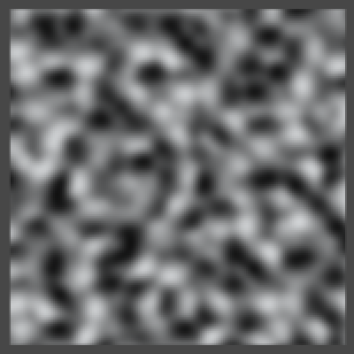 				3D Simplex noise with insufficient range. 			

It looks nice, but it turns out that our current set of gradient  vectors doesn't fill the entire range. The maximum amplitude appears to  be roughly 0.85 instead of 1. How could we fix this?

We know that all tetrahedrons have one of their shortest edges  aligned with the main diagonal. So if we include two opposite vectors  along the main diagonal, we can cover the entire -1–1 range.

The gradient array we're currently using was designed by Ken  Perlin. It contains vectors pointing to the middle of the twelve edges  of a cube. Four of these are duplicated to increase the array size to  16.

To include the main diagonal, we have to add vectors pointing to  two corners of the cube. To maintain symmetry, we should add all eight  corner vectors. Twelve edges plus eight corners gives us twenty vectors,  which isn't a power of two. However, if we include the edges twice, we  end up with 32 vectors. To keep them all the same length, we have to  normalize them.

```
	private static Vector3[] simplexGradients3D = {
		new Vector3( 1f, 1f, 0f).normalized,
		new Vector3(-1f, 1f, 0f).normalized,
		new Vector3( 1f,-1f, 0f).normalized,
		new Vector3(-1f,-1f, 0f).normalized,
		new Vector3( 1f, 0f, 1f).normalized,
		new Vector3(-1f, 0f, 1f).normalized,
		new Vector3( 1f, 0f,-1f).normalized,
		new Vector3(-1f, 0f,-1f).normalized,
		new Vector3( 0f, 1f, 1f).normalized,
		new Vector3( 0f,-1f, 1f).normalized,
		new Vector3( 0f, 1f,-1f).normalized,
		new Vector3( 0f,-1f,-1f).normalized,
		
		new Vector3( 1f, 1f, 0f).normalized,
		new Vector3(-1f, 1f, 0f).normalized,
		new Vector3( 1f,-1f, 0f).normalized,
		new Vector3(-1f,-1f, 0f).normalized,
		new Vector3( 1f, 0f, 1f).normalized,
		new Vector3(-1f, 0f, 1f).normalized,
		new Vector3( 1f, 0f,-1f).normalized,
		new Vector3(-1f, 0f,-1f).normalized,
		new Vector3( 0f, 1f, 1f).normalized,
		new Vector3( 0f,-1f, 1f).normalized,
		new Vector3( 0f, 1f,-1f).normalized,
		new Vector3( 0f,-1f,-1f).normalized,
		
		new Vector3( 1f, 1f, 1f).normalized,
		new Vector3(-1f, 1f, 1f).normalized,
		new Vector3( 1f,-1f, 1f).normalized,
		new Vector3(-1f,-1f, 1f).normalized,
		new Vector3( 1f, 1f,-1f).normalized,
		new Vector3(-1f, 1f,-1f).normalized,
		new Vector3( 1f,-1f,-1f).normalized,
		new Vector3(-1f,-1f,-1f).normalized
	};
	
	private const int simplexGradientsMask3D = 31;
```

Now we can use these new gradients instead of those used by Perlin noise.

```
			Vector3 g = simplexGradients3D[hash[hash[hash[ix & hashMask] + iy & hashMask] + iz & hashMask] &
				simplexGradientsMask3D];
```

And we no longer need to divide by √2.

```
	private static float simplexScale3D = 8192f * Mathf.Sqrt(3f) / 375f;
```

With this, our noise covers the entire range.

 				 				 				 				3D Simplex noise, frequency 2, 4, and 8. 			

 				 				 				 				 				 				 				Moving along Z. 			

 				 				 				Simplex noise vs. Perlin noise, rotated to look down the main diagonal. 			

 				
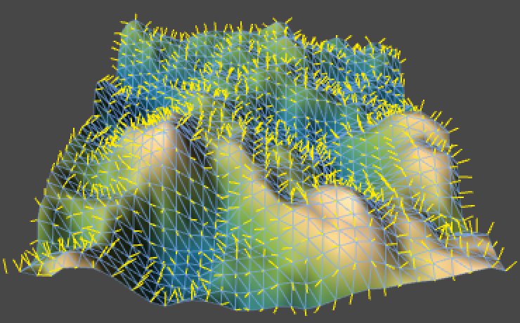 				3D Simplex noise surface with analytical normals. 			

And that's how you can make Simplex noise.

Enjoyed the tutorial? [Help me make more by becoming a patron!](https://www.patreon.com/catlikecoding)


## Downloads

- [simplex-noise-finished.unitypackage](https://catlikecoding.com/unity/tutorials/simplex-noise/simplex-noise-finished.unitypackage)

  The finished project.

- [Isn't Simplex noise patented?](https://catlikecoding.com/unity/tutorials/simplex-noise/#q-patented)

   				When people mention that Simplex Noise is patented, they refer to  patent US 6867776 B2, "Standard for perlin noise" which is owned by  Nokia. Look it up online if you want to know the specifics, I'll give a  quick summary. 				The patent's claims are all made in the context of producing a  texture without visible grid artifacts. This means that Simplex Value  noise doesn't infringe any of them, as its grid is obvious. Also,  they're specifically about 3D or higher dimensions, so 1D and 2D Simplex  noise aren't covered by them. 				The first independent claim is about bit-manipulation of a 3D  lattice point. Simply put, if you perform multiple lookups in a hash and  gradient array and compute dot products, you don't infringe this. 				The second independent claim is specifically about finding  simplex grid points in 3D using a skew factor of ⅓. So only 3D Simplex  noise infringes this. Working around it requires finding a different way  to construct a grid, or using higher-dimensional noise. It has a  sub-claim that adds flooring of the skewed coordinates to get the corner  of a unit cube. A further sub-claim of that includes evaluating the  entire simplex. 				The third independent claim is about splitting an n-dimensional  hypercube into n! simplices by obivous edge traversal. It mentions that n  is at least three, so it applies to 3D and up. Working around it  requires not splitting hypercubes into simplices. It has a sub-claim  that mentions it has computational complexity O(n2). 				So what is the validity of this patent? As that is a legal  question, I have no idea. No one knows until it has been tried in court.  I've never heard of it being enforced or licensed, despite multiple  implementations of Simplex noise being available and having been used  for years. 				If you want to play it safe, don't include code for gradient  noise using a simplex grid for 3D and up in your products. Or contact  Nokia. 			

- [Why can the derivatives be nonzero?](https://catlikecoding.com/unity/tutorials/simplex-noise/#q-nonzero-derivatives)

   				As we're working with a decreasing function of the distance from a  point, the value goes down no matter in what direction you're moving  away from it. Conversely, the value increases when approaching the point  from any direction. As you reach the point and then continue to move  past it, you'll suddenly go from increasing to decreasing. This means  that the rate of change and thus the first derivative went from positive  to negative, which means that it should be zero at the center. However,  for the first derivative to do so, its rate of change must be  decreasing, suggesting that the second derivative can be negative at the  center. So the first derivative will be zero, but second needn't be. 			

- [How do you find the falloff derivatives?](https://catlikecoding.com/unity/tutorials/simplex-noise/#q-falloff-derivatives)

   				The derivative of **(1 - x2)2** can be quickly derived by applying the [chain rule](https://catlikecoding.com/unity/tutorials/noise-derivatives/#a-chain-rule), as explained in the Noise Derivatives tutorial. The first derivative becomes **2(1 - x2)(-2x) = -4x(1 - x2)**. We continue to the second derivative by applying the [product rule](https://catlikecoding.com/unity/tutorials/noise-derivatives/#a-product-rule), which leads to **(-4)(1 - x2) + (-4x)(-2x) = -4(1 - x2) + 8x2**. We leave it in that form so it's easy to see that the first part becomes zero when **x = 1**, while the second part does not. 				The first derivative of **(1 - x2)3** similarly becomes **3(1 - x2)2(-2x) = -6x(1 - x2)2**.  The second derivative now requires an application of both the the chain  and the product rule. As we already know what the derivative of the **(1 - x2)2** part is, we can direcly insert it. The end result is **-6(1 - x2)2 + (-6x)(-4x(1 - x2)) = -6(1 - x2)2 + 24x2(1 - x2)**, which drops to zero as desired, and produces **-6** when **x = 0**. 			

- [What's the quadratic formula?](https://catlikecoding.com/unity/tutorials/simplex-noise/#q-quadratic-formula)

   				The quadratic formula is a way to solve equations of the form **ax2 + bx + c = 0**. It states that **x = (-b ± √(b2 - 4ac)) / 2a**.  The parabola described by such quadratic equations can end up going  through zero twice, that's why there can be two solutions. If the **b2 - 4ac**  part becomes zero then there is only one solution, which happens when  the tip of the parabola touches zero. If it doesn't touch zero at all,  then **b2 - 4ac** will be negative and you end up with complex numbers. 				As we have **a = 6**, **b = -6**, and **c = 1** our solution becomes **(6 ± √12) / 12 = (6 ± 2√3) / 12 = (3 ± √3) / 6**. 			

- [How do you derive those equalities?](https://catlikecoding.com/unity/tutorials/simplex-noise/#q-equalities)

   				To isolate **s** from **x + 2sx = 1**, divide by **2x** to get **½ + s = 1 / 2x**, then move **½** to the other side to get **s = 1 / 2x - ½**. 				Next, **x** represents the transformed X coordinate of **C**, which is **1 - 2s** with the first scale factor **s = (3 - √3) / 6**. This leads to **x = 1 - (3 - √3) / 3 = 1 - 1 + √3 / 3 =  √3 / 3 = 1 / √3**. 				Now we know what the new scale factor is. **s = 1 / (2 / √3) - ½ = √3 / 2 - ½ = (√3 - 1) / 2**. 			

- [How do you calculate that length?](https://catlikecoding.com/unity/tutorials/simplex-noise/#q-calculate-length)

   				We have **2s2 - 2s + 1** with **s = (3 - √3) / 6**. First isolate **s2 = (9 - 6√3 + 3) / 36 = (12 - 6√3) / 36 = (2 - √3) / 6**. Replacing both **s** and **s2**, we end up with **(2 - √3) / 3 - (3 - √3) / 3 + 1 = -⅓ + 1 = ⅔**. 				That's the square edge length, so the triangle's height is **√⅔√3 / 2 = √2 / 2**. 			

- [How do you calculate that height?](https://catlikecoding.com/unity/tutorials/simplex-noise/#q-calculate-height)

   				First determine the height of a face triangle, which is the the  distance from the middle of its long edge to the opposite corner. We can  do that by cutting the triangle in half along that line, ending up with  a right triangle. The Pythagorean theorem then gives us the length we  want, **√(√¾2 - ½2)**, which is **√½**. 				Now consider two of the terahedron's faces that are connected  along their long edge. One lies flat and the other point up. What is the  height of the top corner? Look at the triangle defined by the two  height lines of these faces and the long tetrahedon edge between the  corners that aren't touching. This triangles has edges of length **√½**, **√½**, and **1**.  This is a right triangle, which means that the angle between the two  faces is 90°. The second face is pointing straight up, so the  tetrahedon's height is also **√½**. 				In case of a regular tetrahedron, its height is equal to its edge length multiplied by **√⅔**. So **√¾√⅔ = √(6 / 12) = √½**. 			

[About](https://catlikecoding.com/about/)[Contact](https://catlikecoding.com/contact/)[Tutorials](https://catlikecoding.com/unity/tutorials/)

© Catlike Coding


- [Twitter](https://twitter.com/catlikecoding)
- [Facebook](https://www.facebook.com/catlikecoding)
- [Google+](https://google.com/+CatlikeCoding)
