# Boat Attack project seawater technology analysis

作者：jaleco
链接：https://zhuanlan.zhihu.com/p/127116312
来源：知乎
著作权归作者所有。商业转载请联系作者获得授权，非商业转载请注明出处。


**一、Boat Attack项目的前世今生**

Unity Technologies是最受欢迎的游戏引擎。(pa，一个鸡蛋飞上来了)

应该已经有看官准备鸡蛋了，Unreal不比你画面好，逼格高，这个那个大作都是Unreal做的。

那改下，Unity是最受欢迎的手机游戏引擎。

这样说大家应该都没意见了，不过这么说Unity的投资人们应该是不太满意的，投入了7亿多美元裤子都脱了你就给我这个。。。

在这样的大背景下，针对矛盾的焦点Unity的画质问题，HDRP和URP出现了，按照Unity的想法开发3A大作Unity可以用HDRP，开发手机游戏可以用URP，那么问题来了，谁第一个吃螃蟹呢，怎么尽快将新产品推销出去呢，Unity花了很大力气在市场宣传上，比如Adam，Book Of Dead，The Heretic等优秀的RealTime短片为HDRP宣传。在URP上，Unity创建Boat Attack这个项目，是为了帮助Universal RP的测试和开发。该项目是赛艇游戏的小片段。在GitHub上的开源项目。

源代码传送门：[https://github.com/Verasl/BoatAttack](https://link.zhihu.com/?target=https%3A//github.com/Verasl/BoatAttack)

demo视频：

<iframe width="600" height="400" src="https://www.youtube.com/embed/m6YqTrwjpP0" frameborder="0" allow="accelerometer; autoplay; encrypted-media; gyroscope; picture-in-picture"></iframe>


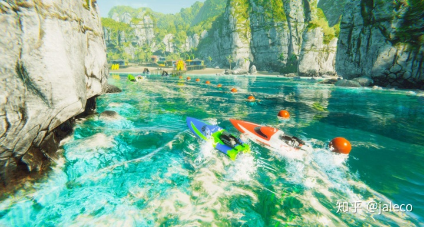


**二、Boat Attack 水体技术使用的功能点**

Boat Attack使用了Universal Render Pipeline的许多新图形功能，以及最新的Unity功能，例如使用了[C＃Job System](https://link.zhihu.com/?target=https%3A//docs.unity3d.com/Manual/JobSystemOverview.html)的浮力系统，[Shader Graph](https://link.zhihu.com/?target=https%3A//unity.com/shader-graph)创造的散焦、自定义渲染通道波浪拖尾，水面平面反射使用的SingleCamera Render，以及用于折射效果的 OpaqueTexture


- **波形的实现方法**

使用了Gerstner 波（Gerstner Wave）作为水面波形模拟方案

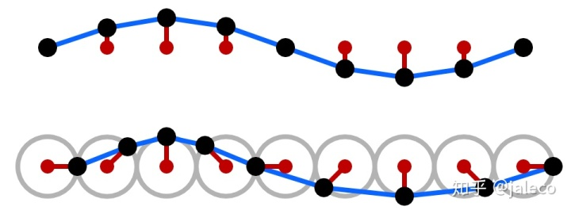Sine vs. Gerstner wave.

生成代码在GerstnerWaves.hlsl，比较长，就不贴了。

可能是考虑到老式手机的兼容性，没有使用Compute Shader。虽然Gerstner波比正弦波表现强一些，但创作人员没有使用Wave Particles或者更高级的手段来精细化波浪的表现，让我有失望。


- **水体通透度与着色**

Boat Attack的水体通透比较trick，看起来像是使用了基于深度的查找表方法（Depth Based LUT Approach）和次表面散射近似方法

生成代码Water.cs

```text
private void GenerateColorRamp()
{
    if(_rampTexture == null)
        _rampTexture = new Texture2D(128, 4, GraphicsFormat.R8G8B8A8_SRGB, TextureCreationFlags.None);
    _rampTexture.wrapMode = TextureWrapMode.Clamp;

    var defaultFoamRamp = resources.defaultFoamRamp;

    var cols = new Color[512];
    for (var i = 0; i < 128; i++)
    {
        cols[i] = surfaceData._absorptionRamp.Evaluate(i / 128f);
    }
    for (var i = 0; i < 128; i++)
    {
        cols[i + 128] = surfaceData._scatterRamp.Evaluate(i / 128f);
    }
    for (var i = 0; i < 128; i++)
    {
        switch(surfaceData._foamSettings.foamType)
        {
            case 0: // default
                cols[i + 256] = defaultFoamRamp.GetPixelBilinear(i / 128f , 0.5f);
                break;
            case 1: // simple
                cols[i + 256] = defaultFoamRamp.GetPixelBilinear(surfaceData._foamSettings.basicFoam.Evaluate(i / 128f) , 0.5f);
                break;
            case 2: // custom
                cols[i + 256] = Color.black;
                break;
        }
    }
    _rampTexture.SetPixels(cols);
    _rampTexture.Apply();
    Shader.SetGlobalTexture(AbsorptionScatteringRamp, _rampTexture);
}
```

实际是UI Gradient上调整的渐变色一条模拟散射，一条模拟吸收，其实就是靠感觉配合深度调颜色，深度是正交相机俯视图离线渲染的。

生成代码WaterCommon.hlsl

```text
half3 Scattering(half depth)
{
	return SAMPLE_TEXTURE2D(_AbsorptionScatteringRamp, sampler_AbsorptionScatteringRamp, half2(depth, 0.375h)).rgb;
}

half3 Absorption(half depth)
{
	return SAMPLE_TEXTURE2D(_AbsorptionScatteringRamp, sampler_AbsorptionScatteringRamp, half2(depth, 0.0h)).rgb;
}
```

然而效果还不错，可以说通透表现已经让人眼前一亮。

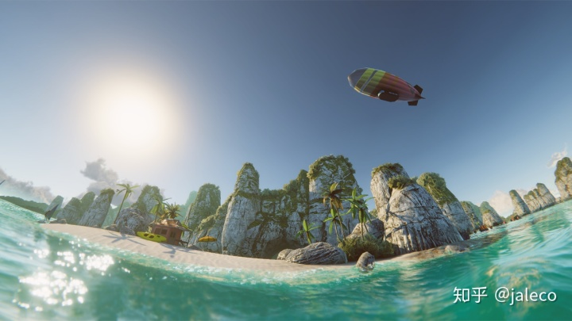


- **水面的平面反射的实现**

水面作为一个介质，入射光线的折射、反射、吸收都与固态的物质差异很明显，平静的水面会像镜子一样映射出周围的景致，水面的反射如果做不好，水面就会与环境没有互动，使得水面脱离了环境融入显得不真实。水面的反射其实并不难，主要的问题是性能。

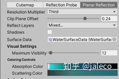

Boat Attack提供了Cubemap、Reflection Probe、Planar Reflection三种反射模拟

Cubemap的反射原理

Cubemap的反射贴图是离线烘焙的，烘焙是摄像机位置是固定的，你如果想移动一下，比如摄像机由烘焙时的S点移动到了P点，这时仍然使用I-2.0*N*dot(N,I)公式计算就会发生偏移而使得反射发生错误。

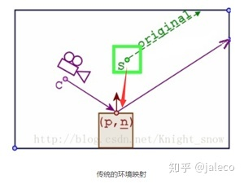

脑子灵的同学肯定会想到我把Original的向量作一点纠正使之落到正确的点PB上。

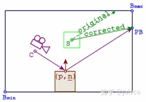

这个叫Box Projected Cubemap Environment Mapping，由于需要用到Box的Bmin和Bmax的Bounces作交点运算，就需要功能更为全面的Reflecton Probe(反射探针)，细心的同学肯定注意过Unity Reflection Probe上的Box Projection选项

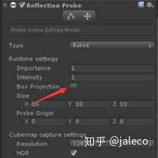

虽然反射探针可以做一定的偏移反射向量纠正，反射探针的的Bmin和Bmax的Bounces仍然需要和PB的交集点大概空间一致才能有比较合理的反射，超出Bounces的范围需要用到2个最近的Reflection Probe的插值，一旦交集空间岔开过大效果是还是不能让人信服的。

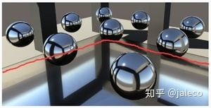

还有一种比较消耗性能的真反射实现方法，PlanarReflections，比屏幕空间反射（SSR）更加精确，简单说就是以水面为中轴将场景镜像再画在反射上。

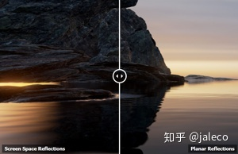SSR 主要是来源无法提供画面外的物体供反射用

生成代码PlanarReflections.cs,UpdateReflectionCamera函数

```text
var clipPlane = CameraSpacePlane(_reflectionCamera, pos - Vector3.up * 0.1f, normal, 1.0f);
var projection = realCamera.CalculateObliqueMatrix(clipPlane);
_reflectionCamera.projectionMatrix = projection;
```

名为“ CalculateObliqueMatrix”的函数，该函数应返回一个投影Matrix oblique投影矩阵，与普通投影矩阵（透视投影矩阵和正交投影矩阵）的差别是：普通投影矩阵所描述的视截体近平面与锥轴垂直，而oblique投影矩阵所描述的视截体近平面是斜的（与锥轴不垂直）。

如下图所示，左图中红色的是透视投影视截体，右图中红色的是oblique投影视截体。由于水面是反射面，所以渲染反射图象时必须以视截体被水面所截的截面作为视口，即“斜视口”，所以必须将反射相机转化成oblique投影模式。reflectionCamera.projectionMatrix = projection就是干这个事儿。

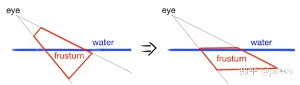


- **JobSystem的水体浮力**

作为一个赛艇游戏，船只在水面上与波浪起伏交互，加速度和重力的关系表现必须要有一个让人觉得就是这样的感觉，我们需要有一套表现浮力，加速度，重力关系的计算船只在波浪间畅游的刚体采样点Update Vertex position功能。

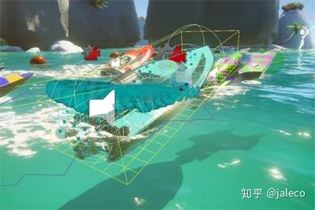

Boat Attack的Buoyancy的浮力功能使用了Job System Update，没有使用Compute Shader

```text
 GerstnerWavesJobs.UpdateSamplePoints(ref _samplePoints, _guid);
 GerstnerWavesJobs.GetData(_guid, ref Heights, ref _normals);
```

虽然和图形关系不大，但是我们刚才说了波浪的产生是在GerstnerWaves.hlsl的，Boat Attack通过

```text
Shader.SetGlobalVectorArray(WaveData, GetWaveData());
...
private Vector4[] GetWaveData()
{
     var waveData = new Vector4[20];
     for (var i = 0; i < _waves.Length; i++)
     {
       waveData[i] = new Vector4(_waves[i].amplitude, _waves[i].direction, _waves[i].wavelength, _waves[i].onmiDir);
       waveData[i+10] = new Vector4(_waves[i].origin.x, _waves[i].origin.y, 0, 0);
      }
      return waveData;
}
```

在启动时将初始数据传入GerstnerWaves.hlsl，然后两边采用同样的算法来保持CPU与GPU的数据同步

GerstnerWavesJobs.cs

```text
public void Execute(int i)
{
for (var wave = 0; wave < WaveData.Length; wave++) // for each wave
{
	// Wave data vars
	var pos = Position[i].xz;

	var amplitude = WaveData[wave].amplitude;
	var direction = WaveData[wave].direction;
	var wavelength = WaveData[wave].wavelength;
	var omniPos = WaveData[wave].origin;
	////////////////////////////////wave value calculations//////////////////////////
	var w = 6.28318f / wavelength; // 2pi over wavelength(hardcoded)
	var wSpeed = math.sqrt(9.8f * w); // frequency of the wave based off wavelength
	const float peak = 0.8f; // peak value, 1 is the sharpest peaks
	var qi = peak / (amplitude * w * WaveData.Length);
...
}
```

GerstnerWaves.hlsl

```text
WaveStruct GerstnerWave(half2 pos, float waveCountMulti, half amplitude, half direction, half wavelength, half omni, half2 omniPos)
{
	WaveStruct waveOut;
        ...
	////////////////////////////////wave value calculations//////////////////////////
	half3 wave = 0; // wave vector
	half w = 6.28318 / wavelength; // 2pi over wavelength(hardcoded)
	half wSpeed = sqrt(9.8 * w); // frequency of the wave based off wavelength
	half peak = 1.2; // peak value, 1 is the sharpest peaks
	half qi = peak / (amplitude * w * _WaveCount);
...
}
```

余下的就是在BuoyantObject.cs设置好速度重力重量等等，在FixedUpdate()中Physics.SyncTransforms()更新船体位置。


- **RendererFeatures和[Shader Graph](https://link.zhihu.com/?target=https%3A//unity.com/shader-graph)在项目的作用**

在URP中，渲染是基于ScriptableRenderPasses（可编程渲染通道）设定渲染对象和方法的各种指令。许多的ScriptableRenderPasses排列起来后，便成为了ScriptableRenderer（可编程渲染器）。另一部分是ScriptableRendererFeatures（可编程渲染器功能）。ForwardRenderer支持插入不同的ScriptableRendererFeatures。

按我的理解就是完成Dx或是Vulkan的API层面上的高亮的这一个周期，而ScriptableRendererFeatures差不多就是2ndary Command-Buffer的语法糖，在红箭头这里插入正Cmmand-Buffer周期的几个RenderPassEvent点。当然URP是前向的情况比较单纯。

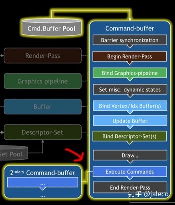

在《Boat Attack》演示项目中，WaterSystemFeature为水体渲染添加了两种额外的渲染通道：一种用于焦散效果，另一种则是WaterEffects（水体效果）。

焦散效果使用了[Shader Graph](https://link.zhihu.com/?target=https%3A//xians.me/go/aHR0cHM6Ly91bml0eS5jb20vc2hhZGVyLWdyYXBoP19nYT0yLjM5NTkwODE2LjI0MTE1MjkwMi4xNTgzOTE1MDkzLTExNTQyMjcxMDguMTU4MzA1MDQyOQ%3D%3D)制作，Shader Graph是一款对艺术家十分友好的着色器创作界面，在技术美术的手中，它是一个强大的原型构建工具。其实就是和Unreal蓝图差不多的意思啦。

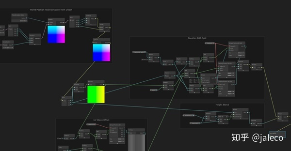WaterCaustics


焦散的WaterCausticsPass为场景添加的渲染通道，可以在Opaque（不透明）和Transparent（透明）通道之间渲染一种自定义的焦散着色效果。通道会渲染一片与水面平行的大四边形，防止渲染到空中的像素。四边形随镜头移动，被固定在水面的高度上，然后着色器再叠加渲染屏幕中不透明通道的数据。

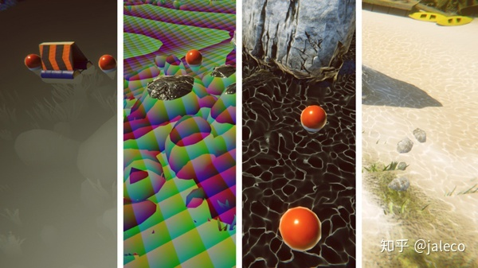

焦散合成过程，深度图，基于深度图重建的世界空间位置，焦散纹理，最终效果

船体浪花拖逸效果，这个分两个，一个是船体划开水面产生的波浪，一个是船尾产生的浪花。

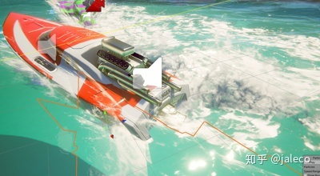

船体划开水面产生的波浪对水面的影响使用了WaterFXPass，这个要稍微复杂一点。我们制作该效果的目的是让对象能影响到水体，制造出波浪和浮沫。为此，我们将部分对象渲染到了一个看不到的RenderTexture上，使用了一个自定义着色器将不同的渲染信息写入纹理的通道上：在红色通道中将浮沫遮到水面上，X和Z轴的法线分别偏移在水面法线上，最后将水体displacement效果放在了不透明度通道上。

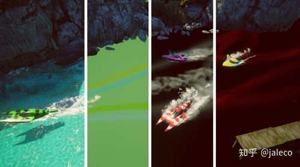从左往右，合成效果，偏移法线，泡沫遮罩，高度图

首先，我们以一半的分辨率制作了渲染纹理。接着，创建一个过滤器，来过滤出含有WaterFX着色通道的透明对象。

然后，使用`ScriptableRenderContext.DrawRenderers` ,将对象渲染进场景。最终代码如下：

```text
class WaterFXPass : ScriptableRenderPass
{
 const string k_RenderWaterFXTag = "Render Water FX";
 private readonly ShaderTagId m_WaterFXShaderTag = new ShaderTagId("WaterFX");
 private readonly Color m_ClearColor = new Color(0.0f, 0.5f, 0.5f, 0.5f); //r = foam mask, g = normal.x, b = normal.z, a = displacement
 private FilteringSettings m_FilteringSettings;
 RenderTargetHandle m_WaterFX = RenderTargetHandle.CameraTarget;
 
 public WaterFXPass()
 {
 m_WaterFX.Init("_WaterFXMap");
 m_FilteringSettings = new FilteringSettings(RenderQueueRange.transparent);
 }
 
 public override void Configure(CommandBuffer cmd, RenderTextureDescriptor cameraTextureDescriptor)
 {
 cameraTextureDescriptor.depthBufferBits = 0;
 cameraTextureDescriptor.width /= 2;
 cameraTextureDescriptor.height /= 2;
 cameraTextureDescriptor.colorFormat = RenderTextureFormat.Default;
 cmd.GetTemporaryRT(m_WaterFX.id, cameraTextureDescriptor, FilterMode.Bilinear);
 ConfigureTarget(m_WaterFX.Identifier());
 ConfigureClear(ClearFlag.Color, m_ClearColor);
 }
    ....................
}
```


性能的取巧方法

波浪的细节，离不开丰富的顶点数量，手机的性能又比较低，我注意到了Boat attack其实是带有细分顶点方案WaterTessellated.hlsl，但是性能比较差。

Boat Attack的制作者采用了一个视角匹配Lod的方案，简单说就是把Lod的海面模型通过在MainCameraAlign.cs中匹配Camera的forward，将海面模型的中心点移动到Camera的视点。这样基本保证摄像机近处的模型始终是最高细节的部分。

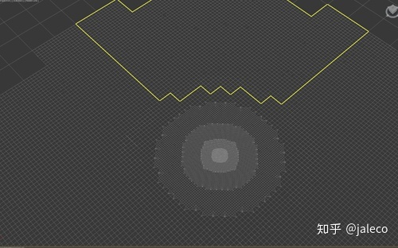

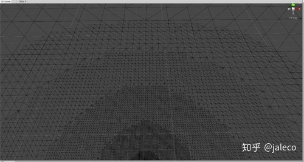

```text
        private void UpdatePosition(ScriptableRenderContext src, Camera cam)
        {
            if (cam.cameraType == CameraType.Preview) return;
            var newPos = cam.transform.TransformPoint(Vector3.forward * forwards);
            newPos.y = yOffset;
            newPos.x = QuantizeValue(newPos.x);
            newPos.z = QuantizeValue(newPos.z);
            transform.position = newPos;
        }
```

我觉得其实可以更近一步，将视锥裁剪在RenderPipeline里加进去，重组Mesh，再进行[vert fragment](https://link.zhihu.com/?target=http%3A//www.baidu.com/link%3Furl%3DvvMyyPrYLE_8yjJHgKXBBmLA2mDGFX8mHdSxg6DeqNhZP64WecrZKLizaDc3fpss_Eh8AOYcjvWaJoofbyJOQ6xpY3baK-50TFUnNdtdtxW)是否性能会更好一些。

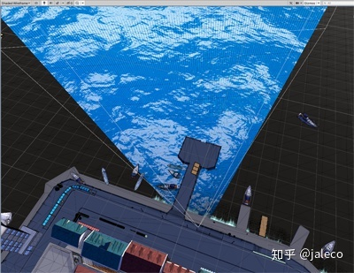


- **BoatAttack项目的一点感想**

就像Unity说的制作《Boat Attack》演示项目是为了验证和测试通用渲染管线的性能（当时还叫轻量渲染管线）。在开发时制作的这个垂直切片式演示，也是一次生产流程实地操作的练习。这个项目给我2个感觉，一是Unity对URP还是不太上心，我们看下Hub上的制作人员

```text
Credits
Andre McGrail - Design, Programming, Modeling, Textures, SFX
Alex Best - Modeling, Textures
Stintah - Soundtrack
Special thanks to:
Felipe Lira - For Making Universal RP & LWRP
Tim Cooper - Assorted SRP code help
And thanks to many more who have helped with suggestions and feedback!
```

项目组三个人，一个模型贴图，一个音效，还有一个设计、模型、贴图、特效、程序。。。

这位大佬的名字是[Andre McGrail](https://link.zhihu.com/?target=http%3A//www.andremcgrail.com/)，给大佬跪了。但是相比Unity在HDRP上的投入，远的有Book Of The Dead,Adam，近的有The Heretic，投入的力度不是一个等量级的，同理Unity还在花大力气整合光线追踪到HDRP，对URP的投入就相形见绌，我其实觉得Unity的起家是屌丝立足于Mobile开发，其实国内绝大多数项目还是手游项目，用Unity开发3A项目还是比较少，我的意思是如果先守住自己的传统邻域再去图谋新的领域是不是会更稳一些。

还有我觉得，可能有人觉得看起来Boat Attack也蛮简单的嘛，但是这是在别人开放代码的前提下，这有点想别人扶着你往前走，什么东西原创总是最难的，哪怕你可以在别人的基础上改良得比原创的更好。看看别人设计，美术，程序一个人搞定，你能感觉到制作者的功力老道，越了解越觉得自己的渺小。好吧，让我们认清自己的渺小，补足自己的基础。


**Reference**

1. [Achieve beautiful, scalable, and performant graphics with the Universal Render Pipeline - Unity Technologies Blog](https://link.zhihu.com/?target=https%3A//blogs.unity3d.com/2020/02/10/achieve-beautiful-scalable-and-performant-graphics-with-the-universal-render-pipeline/)
2. [unity, WaterProDaytime注意事项](https://link.zhihu.com/?target=https%3A//www.cnblogs.com/wantnon/p/4569096.html)