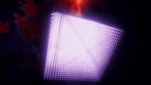

## 创建3D均匀粒子网格

今天我们将分享游戏开发者Mirza的一个简单教程，介绍如何在脚本中使用for循环，创建出3D均匀粒子网格。虽然该效果并不是很惊艳，但它将成为在后续教程测试GPU粒子替换功能的学习基础。

一旦设置好网格后，我们可以对其进行修改，实现下图的变形效果。

Part 1：粒子系统设置

首先，设置粒子系统。我们新建一个粒子系统，然后放入场景。

 

如下图所示，将Start Lifetime设为Infinity，因为我们不打算让粒子消失。将Start Size设为0.5，Max Particles设为100,000。禁用掉除Renderer模块外的所有模块，我们不会让粒子系统控制发射过程，因为该过程将由脚本控制。

 

 

在Renderer模块的Material属性可以使用任意材质，本文使用了Ultimate VFX插件中的Alpha混合点精灵材质，因为它能够展示粒子，我们也可以使用默认粒子材质/纹理。

Part 2：发射均匀网格

设置好粒子系统后，我们可以处理脚本，设定范围，大小和密度等属性，使之以网格形式发射粒子。

  

新建一个脚本并命名为ParticleGrid，删除所有方法。

using System.Collections;

using System.Collections.Generic;

using UnityEngine;

 

public class ParticleGrid : MonoBehaviour

{

}

我们将此脚本附加到与粒子系统相同的对象上，添加ParticleSystem变量。这样我们就可以通过GetComponent调用self，来保留对粒子系统的引用。

 

我们还需要一个变量来设定网格边界以及密度，我们将其定义为分辨率，用来控制指定轴上的粒子数量，因此粒子的整体数量将以分辨率X * Y * Z的形式表示，以适应由边界定义的3D空间。

 

为了方便处理，我们将给这二个变量都设定了默认值。

public class ParticleGrid : MonoBehaviour

{

​    ParticleSystem particleSystem;

 

​    public Vector3 bounds = new Vector3(25.0f, 25.0f, 25.0f);

​    public Vector3Int resolution = new Vector3Int(10, 10, 10);

}

我们将在OnEnable调用中实现所有功能，所以如果禁用或启用游戏对象，我们可以重新初始化网格发射过程。

 

我们会获取并保存当前对象的粒子系统，然后在迭代循环过程的时候，手动为每个轴发射粒子，此时边界和分辨率仍保持不变。然后减少每个轴一半的边界，使游戏对象的Transform位于网格中心，而且相对于该位置有正负范围。

 

最终脚本如下所示。

using System.Collections;

using System.Collections.Generic;

using UnityEngine;

 

public class ParticleGrid : MonoBehaviour

{

​    ParticleSystem particleSystem;

 

​    public Vector3 bounds = new Vector3(25.0f, 25.0f, 25.0f);

​    public Vector3Int resolution = new Vector3Int(10, 10, 10);

​     

​    void OnEnable()

​    {

​        particleSystem = GetComponent<ParticleSystem>();

​                 

​        Vector3 scale;

​        Vector3 boundsHalf = bounds / 2.0f;

 

​        scale.x = bounds.x / resolution.x;

​        scale.y = bounds.y / resolution.y;

​        scale.z = bounds.z / resolution.z;

 

​        ParticleSystem.EmitParams ep = new ParticleSystem.EmitParams();

 

​        for (int i = 0; i < resolution.x; i++)

​        {

​            for (int j = 0; j < resolution.y; j++)

​            {

​                for (int k = 0; k < resolution.z; k++)

​                {

​                    Vector3 position;

 

​                    position.x = (i * scale.x) - boundsHalf.x;

​                    position.y = (j * scale.y) - boundsHalf.y;

​                    position.z = (k * scale.z) - boundsHalf.z;

​                     

​                    ep.position = position;

​                    particleSystem.Emit(ep, 1);

​                }

​            }

​        }

​    }

}

我们将此脚本附加到粒子系统游戏对象，运行场景后，将得到如下图所示的效果。

 

如果我们想要制作2D网格，则可以设置分辨率和边界的Y轴为1。

Part 3：变形

现在脚本已经完成，下面将展示变形均匀网格。

我们将Start Lifetime改为15，Simulation Speed设为2，从而快速运行变形效果，不必进行过多改动。

 

 

我们启用Noise模块，如下图所示进行设置。Strength调整成最大1.5，曲线在中部会降为-1.5，最后再升为1.5。实际上我们反转了噪声，然后平滑处理到正范围内，这样就能实现类效果图的“翻转”效果。最后将Frequency设为0.25，Scroll Speed设为1。

教程到这里就结束了，你可以启用和修改Colour over Lifetime模块和Size over Lifetime模块，调整想要的效果。

 

如果觉得现在的粒子效果太平淡，后续我们将分享如何在GPU粒子替换教程中加入更有趣的效果。你也可以思考如何创造性地利用均匀粒子网格，甚至修改脚本使之在网格顶点上完美地发射粒子。

资源

本文的作者Mirza作为一名VFX的大神，在Asset Store资源商店中发布了多款VFX相关插件，也希望开发者们多多支持其资源。

本文中所使用的Ultimate VFX，下载地址：

https://assetstore.unity.com/packages/vfx/particles/ultimate-vfx-26701

Mirza创作了一系列由浅入深的教程，帮助大家学习制作VFX：

http://www.mirzabeig.com/tutorials/

小结

希望通过本篇教程学习，让你了解在Unity中创作惊艳的特效，并非难事。我们也将在下周分享Unity全新特效工具Visual Effect Graph的教程，帮助你掌握如何快速创作出出色的视觉特效。更多Unity教程分享尽在Unity官方中文论坛(UnityChina.cn）！