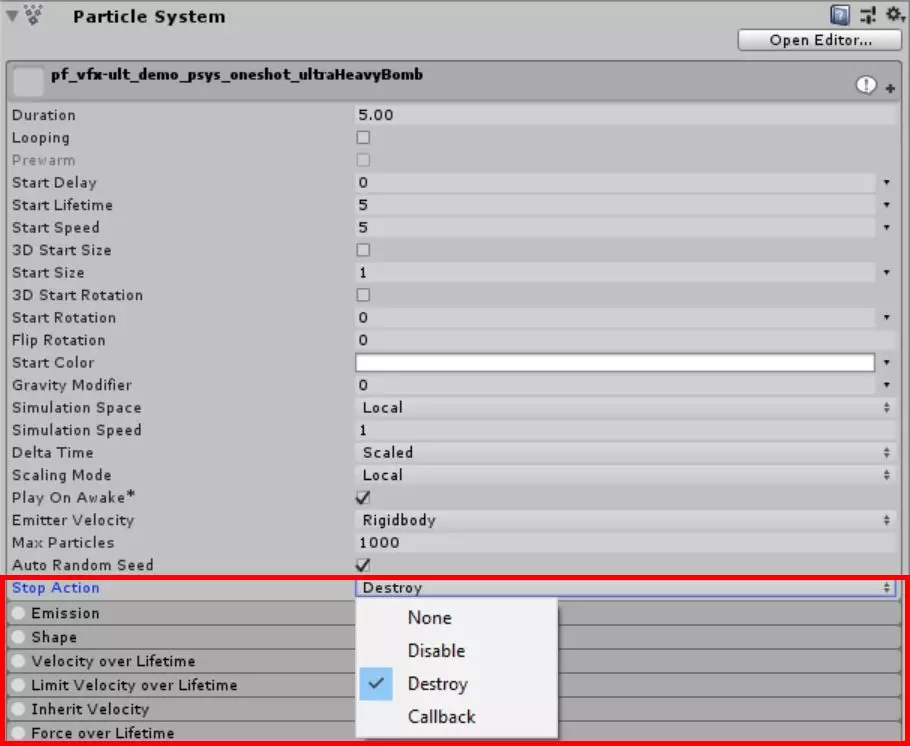
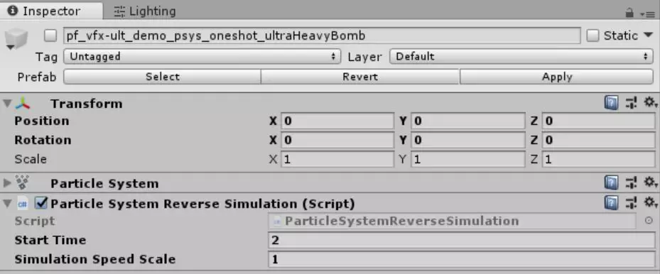

## 倒放粒子系统

Unity本身不支持从初始偏移时间倒放粒子系统，粒子系统会无视所有设为负模拟值的属性，并将所有属性设为0。


上周我们分享了游戏开发者Mirza的《[使用粒子实现Logo消融效果](http://mp.weixin.qq.com/s?__biz=MzU5MjQ1NTEwOA==&mid=2247495476&idx=1&sn=7ec7919fe42f870bd861caca1463d885&chksm=fe1ddb9fc96a5289eaca8b0cd5694dac8deccbb0325df42aca02d4110ae5a85cd7e13b972bec&scene=21#wechat_redirect)》，其效果让人尤为惊艳。今天将继续由Mirza分享如何通过编写C#脚本，使其支持倒放粒子效果的功能。


小贴士：本文所有效果的预览图都使用了Mirza所开发的Ultimate VFX中的预制件，这款资源同时j将在Asset Store双11的促销活动中，如果你对这款插件有需要，可以抓住半价促销的机会支持一下Mirza。


编写脚本代码


首先，我们创建一个新脚本并命名为RewindParticleSystem。

using System.Collections;

using System.Collections.Generic;

using UnityEngine;

 

public class RewindParticleSystem : MonoBehaviour

{

  // 初始化

​    void Start () {        

​    }

​     

  // 每帧都会调用一次Update函数

​    void Update () {       

​    }

}


我们需要将该脚本的效果应用于，所附加游戏对象层级结构中的所有粒子系统。

ParticleSystem[] particleSystems;

 

因为每个粒子系统在编辑器中会设定不同的模拟速度，所以我们还需要跟踪所有粒子系统的模拟时间。

float[] simulationTimes;


因为要实现的是倒放效果，我们需要一个偏移开始时间。我们还加入了模拟速度比例值，用于处理粒子系统自身的模拟速度。

 

因为一个粒子效果会带有多个子对象，分别处理这些对象会很麻烦，所以只要将该脚本附加到根节点粒子系统上，我们就可以调整整个效果的速度。

public float startTime = 2.0f;

public float simulationSpeedScale = 1.0f;

 

下面让我们在新函数中初始化这些数值。


首先，获取对象层次结构中的所有粒子系统，其中包括与此脚本附加到相同对象上的组件。False表示我们打算无视层次结构中的不活动实例。


然后，我们将simulationTimes数组初始化为粒子系统数量。 

void Initialize()

{

​    particleSystems = GetComponentsInChildren<ParticleSystem>(false);

​    simulationTimes = new float[particleSystems.Length];

}

 

最后，将Start函数替换为OnEnable函数。这是因为我们希望能在对象先禁用再启用后，重新播放该模拟效果。


我们在particleSystems的值为Null时，调用Initialize函数。然后在调用OnEnable函数时，重置所有模拟时间，因此我们将循环处理所有模拟时间变量并将数值设为0。

 

我们将粒子系统的模拟时间提前到startTime值，方法是在根粒子系统对象调用Simulate函数，并给第一个参数传入True，这表示该模拟效果的子对象也会包含在内。第二个传入的布尔值为False，表示不重新播放该粒子系统；第三个为True，表示此处将使用固定的时间步长。

void OnEnable()

{

​    if (particleSystems == null)

​    {

​        Initialize();

​    }

 

​    for (int i = 0; i < simulationTimes.Length; i++)

​    {

​        simulationTimes[i] = 0.0f;

​    }

 

​    particleSystems[0].Simulate(startTime, true, false, true);

}


现在处理Update函数，我们将在该函数的for循环中处理每个粒子系统。请注意，该循环以相反顺序进行迭代。这样子发射器将正确模拟父系统。

void Update()

{

​    particleSystems[0].Stop(true,

​        ParticleSystemStopBehavior.StopEmittingAndClear);

 

​    for (int i = particleSystems.Length - 1; i >= 0; i--)

​    {

​        float deltaTime = particleSystems[i].main.useUnscaledTime ? Time.unscaledDeltaTime : Time.deltaTime;

​        simulationTimes[i] += (-deltaTime * particleSystems[i].main.simulationSpeed) * simulationSpeedScale;

 

​        float currentSimulationTime = startTime + simulationTimes[i];

​        particleSystems[i].Simulate(currentSimulationTime, false, false, true);

​    }

}


现在处理循环的每个部分，从以下语句开始。


通过使用index 0的根对象并给withChildren参数传入True，强制整个粒子效果停止模拟过程。我们不仅是停止粒子的发射过程，而是打算将所有现有粒子清除，因为稍后将在调用Simulate函数时给restart参数传入True。

 

我们也可以将该语句放在循环中，使用当前循环索引并将布尔参数设为False，但是那样做会多次调用相同函数，而我们目前的做法只需调用一次。

 particleSystems[0].Stop(true,

​    ParticleSystemStopBehavior.StopEmittingAndClear);


这部分代码会检查当前迭代的粒子系统是否使用Unscaled时间，然后选择使用合适的增量时间。

float deltaTime = particleSystems[i].main.useUnscaledTime ? Time.unscaledDeltaTime : Time.deltaTime;




接下来，我们将模拟时间“向前”移动一个步长，实际上是向后。具体根据由粒子系统模拟速度调整的增量时间而定，增量时间还会由“全局”模拟速度比例再次调整。

simulationTimes[i] -= (deltaTime * particleSystems[i].main.simulationSpeed) * simulationSpeedScale;


通过将该值添加到开始时间，我们获得粒子系统的目标模拟时间，我们可以将其传入Simulate函数。

 

第一个布尔参数为False，因为我们会循环对象结构中的每个粒子系统，所以带着子对象进行模拟会浪费资源。第二个参数也是False，因为我们已经停止并清除了所有粒子系统，这样就没必要为restart参数传入True。

 

最后一个参数是True，这很重要，因为我们打算明显地使用固定增量时间。请记住，如果帧率可变，可能无法使用相同的time.deltaTime值来计算模拟的中间部分。使用固定增量时间还能确保粒子系统进行更确切的渲染过程。

float currentSimulationTime = startTime + simulationTimes[i];

particleSystems[i].Simulate(currentSimulationTime, false, false, true);


以上代码将倒放模拟效果，但结果会有些奇怪，如下图所示。


下面我们将处理这个问题。上图中效果混乱的原因是，每当我们调用Simulate函数时，随机种子值都会改变。我们只需要禁用自动生成随机种子值。即取消勾选Auto Random Seed即可。


但是，如果想保持勾选该选项要怎么做？

 

我们可以在编辑器中跟踪种子值的变化，暂时禁用它，然后再启用该选项，将种子值恢复为禁用前的数值。这样能使保持粒子系统的随机性，同时不会在倒放期间产生任何问题。

 

我们只需要修改for循环内的代码即可，方法是添加一个布尔值，用于保存禁用该选项时粒子系统的useAutoRandomSeed值，请留意下面代码中的红色高亮部分。

```
for (int i = particleSystems.Length - 1; i >= 0; i--)
{
    bool useAutoRandomSeed = particleSystems[i].useAutoRandomSeed;
    particleSystems[i].useAutoRandomSeed = false;
	particleSystems[i].Play(false);
    float deltaTime = particleSystems[i].main.useUnscaledTime ? Time.unscaledDeltaTime : Time.deltaTime;
    simulationTimes[i] -= (deltaTime * particleSystems[i].main.simulationSpeed) * simulationSpeedScale;
    float currentSimulationTime = startTime + simulationTimes[i];
    particleSystems[i].Simulate(currentSimulationTime, false, false, true);
    particleSystems[i].useAutoRandomSeed = useAutoRandomSeed;
}
```


如果我们想要支持粒子系统的停止动作，可以将以下代码加入循环的结尾。首先调用Play函数强制系统取消暂停，然后完全停止，并清除粒子系统，触发指定的停止动作。

```
if (currentSimulationTime < 0.0f)
{
    particleSystems[i].Play(false);
	particleSystems[i].Stop(false, ParticleSystemStopBehavior.StopEmittingAndClear);
}
```


下面是最终的脚本代码。

```c#
using System.Collections;

using System.Collections.Generic;

using UnityEngine;

 

public class ParticleSystemReverseSimulationSuperSimple : MonoBehaviour

{

    ParticleSystem[] particleSystems;
    float[] simulationTimes;
    public float startTime = 2.0f;
    public float simulationSpeedScale = 1.0f;
    
    void Initialize()
   {
        particleSystems = GetComponentsInChildren<ParticleSystem>(false);
        simulationTimes = new float[particleSystems.Length];
   }

    void OnEnable()
    {
        if (particleSystems == null)
        {
            Initialize();
        }

        for (int i = 0; i < simulationTimes.Length; i++)
		{
			simulationTimes[i] = 0.0f; }

			particleSystems[0].Simulate(startTime, true, false, true);
		}
		
		void Update()
		{
		particleSystems[0].Stop(true,ParticleSystemStopBehavior.StopEmittingAndClear);
			for (int i = particleSystems.Length - 1; i >= 0; i--)
        	{

                bool useAutoRandomSeed = particleSystems[i].useAutoRandomSeed;
                particleSystems[i].useAutoRandomSeed = false;
                particleSystems[i].Play(false);
                float deltaTime = particleSystems[i].main.useUnscaledTime ? Time.unscaledDeltaTime : Time.deltaTime;
                simulationTimes[i] -= (deltaTime * particleSystems[i].main.simulationSpeed) * simulationSpeedScale;
                float currentSimulationTime = startTime + simulationTimes[i];
                particleSystems[i].Simulate(currentSimulationTime, false, false, true);
                particleSystems[i].useAutoRandomSeed = useAutoRandomSeed;
                if (currentSimulationTime < 0.0f)
                {
                    particleSystems[i].Play(false);
                    particleSystems[i].Stop(false, ParticleSystemStopBehavior.StopEmittingAndClear);
                }
        	}
    	}
}
```


将该脚本附加到任意带有粒子系统的游戏对象即可。





现在我们就能够实现倒放粒子系统效果了。


小结


编写C#脚本，使其支持倒放粒子效果的功能就为大家介绍到这里了，希望大家能够借此和掌握运营粒子系统，创造出精彩的特效。更多Unity教程分享尽在Unity官方中文论坛(UnityChina.cn)!