# Rendering 7

Shadows

- Investigate how Unity renders shadows.
- Cast directional shadows.
- Receive directional shadows.
- Add support for spotlight and point light shadows.

This is the seventh part of a tutorial series about rendering. The [previous part](https://catlikecoding.com/unity/tutorials/rendering/part-6) covered normal mapping. Now we'll take a look at shadows.

This tutorial was made with Unity 5.4.0f3.

 					 					When rendering, casting a shadow is a good thing. 				

## Directional Shadows

While our lighting shader produces fairly realistic results by  now, it evaluates each surface fragment in isolation. It assumes that a  ray of light from every light source eventually hits every fragment. But  this is only true if those rays aren't blocked by something.

 						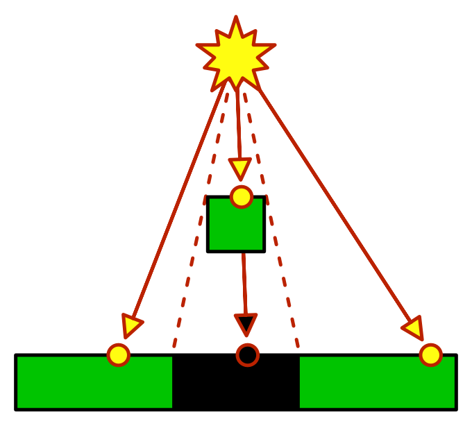 						Some light rays get blocked. 					

When an object sits in between a light source and another  object, it might prevent part or all of the light rays from reaching  that other object. The rays that illuminate the first object are no  longer available to illuminate the second object. As as result, the  second object will remain at least partially unlit. The area that is not  lit lies in the shadow of the first object. To describe this, we often  say that the fist object casts a shadow on the second one.

In reality, there is a transition region between fully lit and  fully shadowed space, know as the penumbra. It exists because all light  sources have a volume. As a result, there are regions where only part of  the light source is visible, which means that they are partially  shadowed. The larger the light source, and the further away a surface is  from its shadow caster, the larger this region is.

 						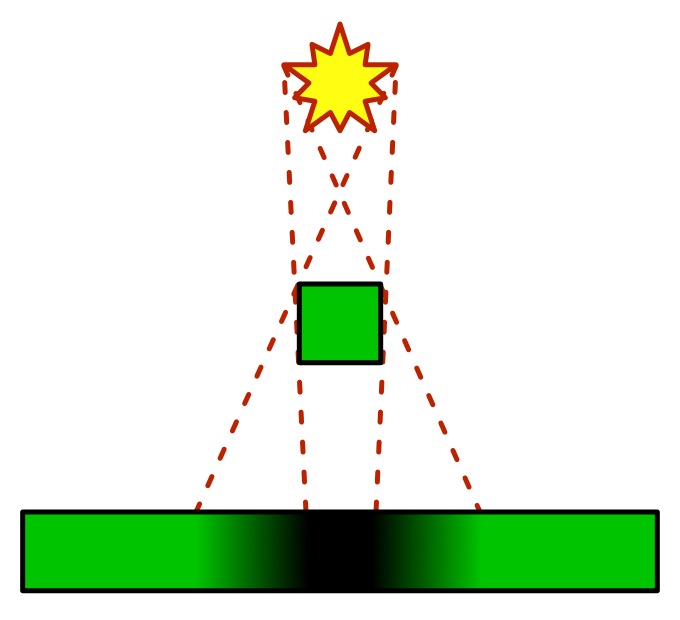 						Shadow with penumbra. 					

Unity doesn't support penumbra. Unity does support soft shadows,  but that is a shadow filtering technique, not a simulation of penumbra.

### Enabling Shadows

Without shadows, it is hard to see the spatial relationships  between objects. To illustrate this, I created a simple scene with a few  stretched cubes. I placed four rows of spheres above these cubes. The  middle rows float of spheres, while the outer rows are connected to the  cubes below them via cylinders.

The objects have Unity's default white material. The scene has  two directional lights, the default directional light, and a slightly  weaker yellow light. These are the same lights used in previous  tutorials.

Currently, the shadows are disabled project-wide. We did that  in an earlier tutorial. The ambient intensity is also set to zero, which  makes it easier to see the shadows.

 							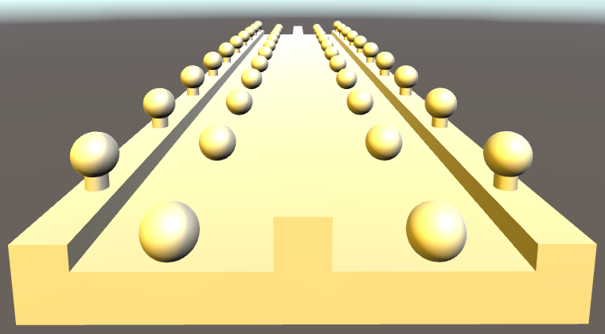 							Two directional lights, no shadows, no ambient light. 						

Shadows are part of the project-wide quality settings, found via *Edit / Project Settings / Quality*.  We'll enable them at a high quality level. This means supporting both  hard and soft shadows, using a high resolution, a stable fit projection,  a distance of 150, and four cascades.

 							 							Shadow quality settings. 						

Make sure that both lights are set to cast soft shadows. Their resolution should depend on the quality settings.

 							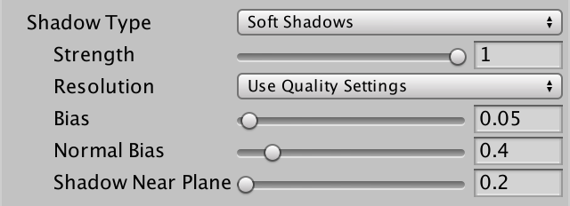 							Shadow settings per light. 						

With both directional lights casting shadows, the spatial  relationships between all objects becomes a lot clearer. The entire  scene has become both more realistic and more interesting to look at.

 							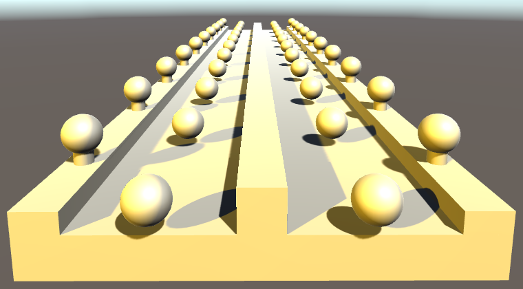 							Scene with shadows. 						

### Shadow Mapping

How does Unity add these shadows to the scene? The standard  shader apparently has some way to determine whether a ray is blocked or  not.

You could figure this out whether a point lies in a shadow, by  casting a ray through the scene, from the light to the surface fragment.  If that ray hits something before it reaches the fragment, then it is  blocked. This is something that a physics engine could do, but it would  be very impractical to do so for each fragment, and per light. And then  you'd have to get the results to the GPU somehow.

There are a few techniques to support real-time shadows. Each  has it advantages and disadvantages. Unity uses the most common  technique nowadays, which is shadow mapping. This means that Unity  stores shadow information in textures, somehow. We'll now investigate  how that works.

Open the frame debugger via *Window / Frame Debugger*,  enable it, and look at the hierarchy of rendering steps. Look at the  differences between a frame without and a frame with shadows enabled.

 							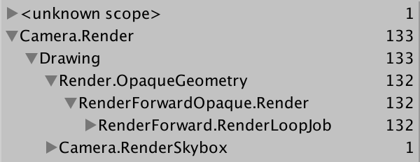 							 							Rendering process without vs. with shadows. 						

When shadows are disabled, all objects are rendered as usual.  We were already familiar with this process. But when shadows are  enabled, the process becomes more complex. There are a few more  rendering phases, and quite a lot more draw calls. Shadows are  expensive!

### Rendering to the Depth Texture

When directional shadows are enabled, Unity begins a depth pass  into the rendering process. The result is put into a texture that  matches the screen resolution. This pass renders the entire scene, but  only records the depth information of each fragment. This is the same  information that is used by the GPU to determine whether a fragment ends  up on top or below a previously rendered fragment.

This data corresponds with a fragment's Z coordinate, in clip  space. This is the space that defines the area that the camera can see.  The depth information ends up stored as a value in the 0–1 range. When  viewing the texture, nearby texels appear dark. The further away a texel  is, the lighter it becomes.

 							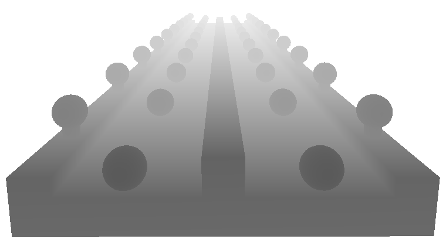 							Depth texture, with camera near plane set to 5. 						

### What is clip space?

It is the space that determines what the camera sees. When  you select the main camera in the scene view, you will see a pyramid  wire frame in front of it, which indicates what it can see. 

 									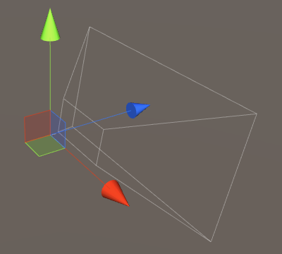 									Camera view, with large near plane value. 								

In clip space, this pyramid is a regular cube. The  model-view-projection matrix is used to convert mesh vertices to this  space. It is known as clip space, because everything that ends up  outside of this cube gets clipped, because it isn't visible.

This information actually has nothing to do with shadows directly, but Unity will use it in a later pass.

### Rendering to Shadow Maps

The next thing Unity renders is the shadow map of the first  light. A little later, it will render the shadow map of the second light  as well.

Again, the entire scene is rendered, and again only the depth  information is stored in a texture. However, this time the scene is  rendered from the point of the view of the light source. Effectively,  the light acts as a camera. This means that the depth value tells us how  far a ray of light traveled before it hit something. This can be used  to determine if something is shadowed!

### What about normal maps?

The shadow maps record the depth of the actual geometry.  Normals maps add the illusion of a rough surface, and shadow maps ignore  them. Thus, shadows are not affected by normal maps.

Because we're using directional lights, their cameras are  orthographic. As such, there is no perspective projection, and the exact  position of the light's camera doesn't matter. Unity will position the  camera so it sees all objects that are in view of the normal camera.

 							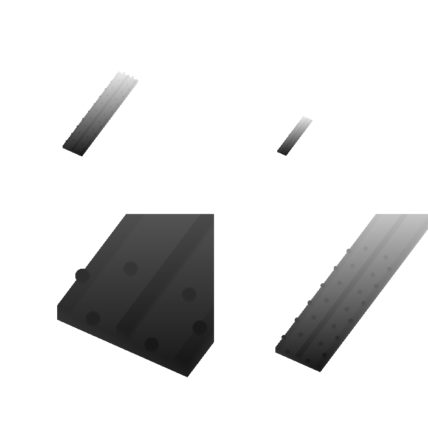 							 							Two shadow maps, each with four viewpoints. 						

Actually, it turns out that Unity doesn't just render the  entire scene once per light. The scene is rendered four times per light!  The textures are split into four quadrants, each being rendered to from  a different point of view. This happens because we have opted to use  four shadow cascades. If you were to switch to two cascades, the scene  would be rendered twice per light. And without cascades, it is only  rendered once per light. We will see why Unity does this when we look at  the quality of shadows.

### Collecting Shadows

We have the depth information of the scene, from the point of  view of the camera. We also have this information from the point of view  of each light. Of course this data is stored in different clip spaces,  but we know the relative positions and orientations of these spaces. So  we can convert from one space to the other. This allows us to compare  the depth measurements from both points of view. Conceptually, we have  two vectors that should end up at the same point. If they do, both the  camera and light can see that point, and so it is lit. If the light's  vector ends before reaching the point, then the light is blocked, which  means that the point is shadowed.

### What about when the scene camera can't see a point?

Those points are hidden behind other points that are closer  to the camera. The scene's depth texture only contains the closest  points. As a result, no time is wasted on evaluating hidden points.

 							 							 							Screen-space shadows, per light. 						

Unity creates these textures by rendering a single quad that covers the entire view. It uses the *Hidden/Internal-ScreenSpaceShadows*  shader for this pass. Each fragment samples from the scene's and  light's depth textures, makes the comparison, and renders the final  shadow value to a screen-space shadow map. Lit texels are set to 1, and  shadowed texels are set to 0. At this point Unity can also perform  filtering, to create soft shadows.

 							Why does Unity alternate between rendering and collecting? 							 						

### Sampling the Shadow Maps

Finally, Unity is finished rendering shadows. Now the scene is  rendered normally, with one change. The light colors are multiplied  by  the values stored in their shadow maps. This eliminates the light when  it should be blocked.

Every fragment that gets rendered samples the shadow maps. Also  fragments that end up hidden behind other objects that are drawn later.  So these fragments can end up receiving the shadows of the objects that  end up hiding them. You can see this when stepping through the frame  debugger. You can also see shadows appear before the objects that  actually cast them. Of course these mistakes only manifest while  rendering the frame. Once it is finished, the image is correct.

 							 							Patially rendered frame, containing strange shadows. 						

### Shadow Quality

When the scene is rendered from the light's point of view, the  orientation does not match the scene camera. So the texels of the shadow  maps don't align with the texels of the final image. The resolution of  the shadow maps also ends up being different. The resolution of the  final image is determined by the display settings. The resolution of the  shadow maps is determined by the shadow quality settings.

When the texels of the shadow maps end up rendered larger than  those of the final image, they will become noticeable. The edges of the  shadows will be aliased. This is most obvious when using hard shadows.

 							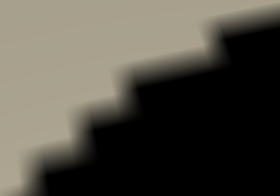 							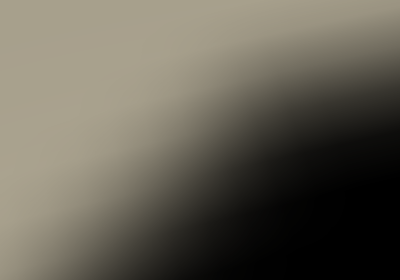 							Hard vs. soft shadows. 						

To make this as obvious as possible, change the shadow quality  settings so we only get hard shadows, at the lowest resolution, with no  cascades.

 							 							Low quality shadows. 						

It is now very obvious that the shadows are textures. Also,  bits of shadow are appearing in places where they shouldn't. We'll look  into that later.

The closer the shadows get to the scene camera, the larger  their texels become. That's because the shadow map currently covers the  entire area visible to the scene camera. We can increase the quality  close to the camera, by reducing the area that is covered by shadows,  via the quality settings.

 							 							Shadow distance reduced to 25. 						

By limiting shadows to an area close to the scene camera, we  can use the same shadow maps to cover a much smaller area. As a result,  we get better shadows. But we lose the shadows that are further away.  The shadows fade away as they approach the maximum distance.

Ideally, we get high-quality shadows up close, while also  keeping the shadows that are far away. Because far away shadows end up  rendered to a smaller screen area, those could make do with a  lower-resolution shadow map. This is what shadow cascades do. When  enabled, multiple shadow maps are rendered into the same texture. Each  map is for use at a certain distance.

 							 							Low resolution textures, with four cascades. 						

When using four cascades, the result looks a lot better, even  though we're still using the same texture resolution. We're just using  the texels much more efficiently. The downside is that we now have to  render the scene three more times.

When rendering to the screen-space shadow maps, Unity takes  care of sampling from the correct cascade. You can find where one  cascade ends and another begins, by looking for a sudden change of the  shadow texel size.

You can control the range of the cascade bands via the quality  settings, as portions of the shadow distance. You can also visualize  them in the scene view, by changing its *Shading Mode*. Instead of just *Shaded*, use *Miscellaneous / Shadow Cascades*. This will render the colors of the cascades on top of the scene.

 							 							Cascade regions, adjusted to show three bands. 						

 							How do I change the scene view's display mode? 							 						

The shape of the cascade bands depends on the *Shadow Projection* quality setting. The default is *Stable Fit*. In this mode, the bands are chosen based on the distance to the camera's position. The other option is *Close Fit*, which uses the camera's depth instead. This produces rectangular bands in the camera's view direction.

 							 							Close fit. 						

This configuration allows more efficient use of the shadow  texture, which leads to higher-quality shadows. However, the shadow  projection now depends on the position and orientation of the camera. As  a result, when the camera moves or rotates, the shadow maps change as  well. If you can see the shadow texels, you'll notice that they move.  This effect is known as shadow edge swimming, and can be very obvious.  That's why the other mode is the default.

<iframe src="https://gfycat.com/ifr/MassiveLeafyHamster"></iframe>

Shadow swimming.

 							Don't *Stable Fit* shadows also depend on the camera position? 							 						

### Shadow Acne

When we used low quality hard shadows, we saw bits of shadow  appear where they shouldn't. Unfortunately, this can happen regardless  of the quality settings.

Each texel in the shadow map represents the point where a light  ray hit a surface. However, texels aren't single points. They end up  covering a larger area. And they are aligned with the light direction,  not with the surface. As a result of this, they can end up sticking in,  through, and out of surfaces like dark shards. As parts of the texels  end up poking out of the surfaces that cast the shadow, the surface  appears to shadow itself. This is known as shadow acne.

 							 							Shadow map causes acne. 						

Another source of shadow acne is numerical precision  limitations. These limitations can cause incorrect result when very  small distances are involved.

 							 							Severe acne, when using no biases at all. 						

One way to prevent this problem is by adding a depth offset  when rendering the shadow maps. This bias is added to the distance from  the light to the shadow casting surface, pushes the shadows into the  surfaces.

 							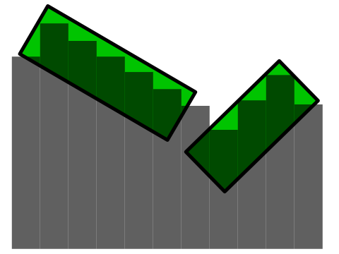 							Biased shadow map. 						

The shadow bias is configured per light, and is set to 0.05 by default.

 							 							Shadow settings per light. 						

A low bias can produce shadow acne, but a large bias introduces  another problem. As the shadow-casting objects are pushed away from the  lights, so are their shadows. As a result, the shadows will not be  perfectly aligned with the objects. This isn't so bad when using a small  bias. But when the bias is too large shadows will appear disconnected  from the objects that cast them, which is known as peter panning.

 							 							Large bias causes peter panning. 						

Besides this distance bias, there is also a *Normal Bias*.  This is a subtler adjustment of the shadow casters. This bias pushes  the vertices of the shadow casters inwards, along their normals. This  also reduces self-shadowing, but it also makes the shadows smaller and  can cause holes to appear in the shadows.

 							What are the best bias settings? 							 						

### Anti-Aliasing

Do you have anti-aliasing enabled in the quality settings? If  you have, then you might have spotted another problem of shadow maps.  They do not mix with the standard anti-aliasing approach.

 							 							 							Aliasing when using anti-aliasing. 						

When you enable anti-aliasing in the quality settings, Unity  will use multi-sampling anti-aliasing, MSAA. It removes the aliasing at  triangle edges by performing some super-sampling along those edges. The  details don't matter here. What matters is that when Unity renders the  screen-space shadow maps, it does so with a single quad that covers the  entire view. As a result, there are no triangle edges, and thus MSAA  does not affect the screen-space shadow map. MSAA does work for the  final image, but the shadow values are taken straight from the  screen-space shadow map. This becomes very obvious when a light surface  next to a darker surface is shadowed. The edge between the light and  dark geometry is anti-aliased, while the shadow edge isn't.

 							 							 							 							No AA vs. MSAA 4× vs. FXAA. 						

Anti-aliasing methods that rely on image post-processing – like  FXAA – don't have this problem, because they are applied after the  entire scene has been rendered.

 							Does this mean that I cannot combine MSAA with directional shadows? 							 						

unitypackage

## Casting Shadows

Now that we know how Unity creates shadows for directional  lights, it is time to support add support for them to our own shader.  Currently, *My First Lighting Shader* neither casts nor received shadows.

Let's deal with casting shadows first. I have changed the  spheres and cylinders in the example scene so they use our material. So  now they no longer cast shadows.

 						 						No shadows are cast by our material. 					

We know that Unity renders the scene multiple times for  directional shadows. Once for the depth pass, and once per light, for  each shadow map cascade. The screen-space shadow map is a screen-space  effect and doesn't concern us.

To support all relevant passes, we have to add a pass to our shader, with its light mode set to *ShadowCaster*. Because we are only interested in the depth values, it will be a lot simpler than our other passes.

```
	SubShader {

		Pass {
			Tags {
				"LightMode" = "ForwardBase"
			}

			…
		}

		Pass {
			Tags {
				"LightMode" = "ForwardAdd"
			}

			…
		}

		Pass {
			Tags {
				"LightMode" = "ShadowCaster"
			}

			CGPROGRAM

			#pragma target 3.0

			#pragma vertex MyShadowVertexProgram
			#pragma fragment MyShadowFragmentProgram

			#include "My Shadows.cginc"

			ENDCG
		}
	}
```

Let's give the shadow programs their own include file, named *My Shadows.cginc*.  They are very simple. The vertex program converts the position from  object space to clip space as usual, and does nothing else. The fragment  program actually doesn't need to do anything, so just return zero. The  GPU records the depth value for us.

```
#if !defined(MY_SHADOWS_INCLUDED)
#define MY_SHADOWS_INCLUDED

#include "UnityCG.cginc"

struct VertexData {
	float4 position : POSITION;
};

float4 MyShadowVertexProgram (VertexData v) : SV_POSITION {
	return mul(UNITY_MATRIX_MVP, v.position);
}

half4 MyShadowFragmentProgram () : SV_TARGET {
	return 0;
}

#endif
```

This is already enough to cast shadows directional.

 						 						Casting shadows. 					

### Bias

We also have to support the shadow bias. During the depth pass,  the biases are zero, but when rendering the shadow maps, the biases  correspond to the light settings. We do so by applying the depth bias to  the position in the vertex shader, in clip space.

To support the depth bias, we can use the `UnityApplyLinearShadowBias` function, which is defined in *UnityCG*.

```
float4 MyShadowVertexProgram (VertexData v) : SV_POSITION {
	float4 position = mul(UNITY_MATRIX_MVP, v.position);
	return UnityApplyLinearShadowBias(position);
}
```

 							How does `UnityApplyLinearShadowBias` work? 							 						

To also support the normal bias, we have to move the vertex  position based on the normal Vector. So we have to add the normal to our  vertex data. Then we can use the `UnityClipSpaceShadowCasterPos` function to apply the bias. This function is also defined in *UnityCG*.

```
struct VertexData {
	float4 position : POSITION;
	float3 normal : NORMAL;
};

float4 MyShadowVertexProgram (VertexData v) : SV_POSITION {
	float4 position = UnityClipSpaceShadowCasterPos(v.position.xyz, v.normal);
	return UnityApplyLinearShadowBias(position);
}
```

 							How does `UnityClipSpaceShadowCasterPos` work? 							 						

Our shader is now a fully functional shadow caster.

unitypackage

## Receiving Shadows

The second part of the process is receiving shadows. All objects in the test scene now use our material.

 						 						No shadows are received, when only using our material. 					

Let's first concern ourselves with the shadows of the main  directional light only. Because this light is included in the base pass,  we have to adjust that one.

When the main directional light casts shadows, Unity will look for a shader variant that has the `SHADOWS_SCREEN`  keyword enabled. So we have to create two variants of our base pass,  one with and one without this keyword. This works the same as for the `VERTEXLIGHT_ON` keyword.

```
			#pragma multi_compile _ SHADOWS_SCREEN
			#pragma multi_compile _ VERTEXLIGHT_ON
```

The pass now has two multi-compile directives, each for a single  keyword. As a result, there are four possible variants. One with no  keywords, one for each keyword, and one with both keywords.

```
// Snippet #0 platforms ffffffff:
SHADOWS_SCREEN VERTEXLIGHT_ON

4 keyword variants used in scene:

<no keywords defined>
VERTEXLIGHT_ON
SHADOWS_SCREEN
SHADOWS_SCREEN VERTEXLIGHT_ON
```

After adding the multi-compile pragma, the shader compiler will complain about a nonexistent `_ShadowCoord`. This happens because the `**UNITY_LIGHT_ATTENUATION**` macro behaves differently when shadows are in play. To quickly fix this, open the *My Lighting.cginc* file and just set the attenuation to 1 when we have shadows.

```
UnityLight CreateLight (Interpolators i) {
	UnityLight light;

	#if defined(POINT) || defined(POINT_COOKIE) || defined(SPOT)
		light.dir = normalize(_WorldSpaceLightPos0.xyz - i.worldPos);
	#else
		light.dir = _WorldSpaceLightPos0.xyz;
	#endif

	#if defined(SHADOWS_SCREEN)
		float attenuation = 1;
	#else
		UNITY_LIGHT_ATTENUATION(attenuation, 0, i.worldPos);
	#endif

	light.color = _LightColor0.rgb * attenuation;
	light.ndotl = DotClamped(i.normal, light.dir);
	return light;
}
```

### Sampling Shadows

To get to the shadows, we have to sample the screen-space  shadow map. To do this, we need to know the screen-space texture  coordinates. Like other texture coordinates, we'll pass them from the  vertex shader to the fragment shader. So we need use an additional  interpolator when supporting shadows. We'll begin by just passing along  the homogeneous clip-space position, so we need a `**float4**`.

```
struct Interpolators {
	…

	#if defined(SHADOWS_SCREEN)
		float4 shadowCoordinates : TEXCOORD5;
	#endif

	#if defined(VERTEXLIGHT_ON)
		float3 vertexLightColor : TEXCOORD6;
	#endif
};

…

Interpolators MyVertexProgram (VertexData v) {
	…

	#if defined(SHADOWS_SCREEN)
		i.shadowCoordinates = i.position;
	#endif

	ComputeVertexLightColor(i);
	return i;
}
```

We can access the screen-space shadows via `_ShadowMapTexture`. It is defined in *AutoLight* when appropriate. The naive approach is to simply use the clip-space XY coordinates of the fragment to sample this texture.

```
UnityLight CreateLight (Interpolators i) {
	…

	#if defined(SHADOWS_SCREEN)
		float attenuation = tex2D(_ShadowMapTexture, i.shadowCoordinates.xy);
	#else
		UNITY_LIGHT_ATTENUATION(attenuation, 0, i.worldPos);
	#endif

	…
}
```

 							 							Sampling shadows. 						

We're now sampling shadows, but with clip-space coordinates  instead of screen-space coordinates. We do get shadows, but they end up  compressed into a tiny region at the center of the screen. We have to  stretch them to cover the entire window.

 							My shadows are upside down? 							 						

In clip space, all visible XY coordinates fall inside the −1–1  range, while the range for screen-space is 0–1. The first step to solve  this by halving XY. Next, we also have to offset the coordinates so they  are zero at the bottom-left corner of the screen. Because we're dealing  with a perspective transformation, how much we must offset the  coordinates depends on how far away they are. In this case, the offset  is equal to the fourth homogeneous coordinate, before halving.

```
	#if defined(SHADOWS_SCREEN)
		i.shadowCoordinates.xy = (i.position.xy + i.position.w) * 0.5;
		i.shadowCoordinates.zw = i.position.zw;
	#endif
```

 							 							Shadows in the bottom-left corner. 						

The projection is still not correct, because we're using  homogeneous coordinates. We have to convert to screen-space coordinates,  by dividing X and Y by W.

```
		i.shadowCoordinates.xy =
			(i.position.xy + i.position.w) * 0.5 / i.position.w;
```

 							 							Incorrect conversion. 						

The result gets distorted. The shadows are stretched and  curved. This happens because we do the division before interpolation.  This is incorrect, the coordinates should be interpolated independently,  before the division. So we have to move the division to the fragment  shader.

```
Interpolators MyVertexProgram (VertexData v) {
	…

	#if defined(SHADOWS_SCREEN)
		i.shadowCoordinates.xy =
			(i.position.xy + i.position.w) * 0.5; // / i.position.w;
		i.shadowCoordinates.zw = i.position.zw;
	#endif
	
	…
}

UnityLight CreateLight (Interpolators i) {
	…

	#if defined(SHADOWS_SCREEN)
		float attenuation = tex2D(
			_ShadowMapTexture,
			i.shadowCoordinates.xy / i.shadowCoordinates.w
		);
	#else
		UNITY_LIGHT_ATTENUATION(attenuation, 0, i.worldPos);
	#endif

	…
}
```

 							How does interpolation affect division? 							 						

 							 							Correctly sampled shadows. 						

At this point, your shadows will either appear correct, or  upside down. If they are flipped, it means that your graphics API –  Direct3D – has the screen-space Y coordinates go from 0 to 1 downwards,  instead of upwards. To synchronize with this, flip the Y coordinate of  the vertex.

```
		i.shadowCoordinates.xy =
			(float2(i.position.x, -i.position.y) + i.position.w) * 0.5;
```

 							 							Flipped shadows. 						

### Using Unity's Code

Unity's include file provide a collection of functions and  macros to help us sample shadows. They take care of API differences and  platform limitations. For example, we can use the `ComputeScreenPos` function from *UnityCG*.

UnityCG.

```
	#if defined(SHADOWS_SCREEN)
		i.shadowCoordinates = ComputeScreenPos(i.position);
	#endif
```

 							What does `ComputeScreenPos` look like? 							 						

The *AutoLight* include file defines three useful macros. They are `**SHADOW_COORDS**`, `**TRANSFER_SHADOW**`, and `**SHADOW_ATTENUATION**`. When shadows are enabled, these macros perform the same work that we just did. They do nothing when there are no shadows.

`**SHADOW_COORDS**` defines the interpolator for shadow coordinates, when needed. It uses the `_ShadowCoord` name, which was what the compiler complained about earlier.

```
struct Interpolators {
	…
	
//	#if defined(SHADOWS_SCREEN)
//		float4 shadowCoordinates : TEXCOORD5;
//	#endif
	SHADOW_COORDS(5)

	…
};
```

`**TRANSFER_SHADOW**` fills these coordinates in the vertex program.

```
Interpolators MyVertexProgram (VertexData v) {
	…

//	#if defined(SHADOWS_SCREEN)
//		i.shadowCoordinates = i.position;
//	#endif
	TRANSFER_SHADOW(i);

	…
}
```

And `**SHADOW_ATTENUATION**` uses the coordinates to sample the shadow map in the fragment program.

```
UnityLight CreateLight (Interpolators i) {
	…

	#if defined(SHADOWS_SCREEN)
		float attenuation = SHADOW_ATTENUATION(i);
	#else
		UNITY_LIGHT_ATTENUATION(attenuation, 0, i.worldPos);
	#endif

	…
}
```

Actually, the `**UNITY_LIGHT_ATTENUATION**` macro already uses `**SHADOW_ATTENUATION**`.  That's why we got that compiler error before. So we can suffice with  using just that macro. The only change is that we have to use the  interpolators as its second argument, while we just used zero before.

```
//	#if defined(SHADOWS_SCREEN)
//		float attenuation = SHADOW_ATTENUATION(i);
//	#else
	UNITY_LIGHT_ATTENUATION(attenuation, i, i.worldPos);
//	#endif
```

After rewriting our code to use these macros, we get new  compile errors. This happens because Unity's macros unfortunately make  assumptions about the vertex data and interpolator structures. First, it  is assumed that the vertex position is named `vertex`, while we named it `position`. Second, it is assumed that the interpolator position is named `pos`, but we named it `position`.

Let's be pragmatic and adopt these names too. They're only used in a few places anyway, so we don't have to change much.

```
struct VertexData {
	float4 vertex : POSITION;
	…
};

struct Interpolators {
	float4 pos : SV_POSITION;
	…
};

…

Interpolators MyVertexProgram (VertexData v) {
	Interpolators i;
	i.pos = mul(UNITY_MATRIX_MVP, v.vertex);
	i.worldPos = mul(unity_ObjectToWorld, v.vertex);
	…
}
```

Our shadows should work again, and this time on as many platforms as Unity supports.

 							What do these macros look like? 							 						

### Multiple Shadows

The main directional light is now casting shadows, but the  second directional light still doesn't. That's because we don't yet  define `SHADOWS_SCREEN` in the additive pass. We could add a multi-compile statement to it, but `SHADOWS_SCREEN`  only works for directional lights. To get the correct combination of  keywords, change the existing multi-compile statement to one that also  includes shadows.

```
			#pragma multi_compile_fwdadd_fullshadows
```

This adds four additional keywords into the mix, to support different light types.

```
// -----------------------------------------
// Snippet #1 platforms ffffffff:
DIRECTIONAL DIRECTIONAL_COOKIE POINT POINT_COOKIE SHADOWS_CUBE SHADOWS_DEPTH
SHADOWS_SCREEN SHADOWS_SOFT SPOT

13 keyword variants used in scene:

POINT
DIRECTIONAL
SPOT
POINT_COOKIE
DIRECTIONAL_COOKIE
SHADOWS_DEPTH SPOT
DIRECTIONAL SHADOWS_SCREEN
DIRECTIONAL_COOKIE SHADOWS_SCREEN
POINT SHADOWS_CUBE
POINT_COOKIE SHADOWS_CUBE
SHADOWS_DEPTH SHADOWS_SOFT SPOT
POINT SHADOWS_CUBE SHADOWS_SOFT
POINT_COOKIE SHADOWS_CUBE SHADOWS_SOFT
```

 							 							Two directional lights casting shadows. 						

unitypackage

## Spotlight Shadows

Now that we have dealt with directional lights, let's move on to  spotlights. Disable the directional lights and add some spotlights with  shadows to the scene. Surprise! Thanks to Unity's macros, spotlight  shadows already work.

 						 						Two spotlights with shadows. 					

When looking at the frame debugger, you'll see that Unity does  less work for spotlight shadows. There is no separate depth pass, and no  screen-space shadow passes. Only the shadow maps are rendered.

 						 						Rendering with spotlight shadows. 					

The shadow maps works the same as for directional lights.  They're depth maps, rendered from the light's point of view. However,  there are big differences between a directional light and a spotlight.  The spotlight has an actual position, and its light rays aren't  parallel. So the spotlight's camera has a perspective view, and cannot  be more around arbitrarily. As a result, these lights cannot support  shadow cascades.

 						 						Shadow map, near plane set to 4. 					

Although the camera setup is different, the shadow casting code  is identical for both light types. The normal bias is only supported for  directional shadows, but it's simply set to zero for other lights.

### Sampling the Shadow Map

Because spotlights don't use screen-space shadows, the sampling  code has to be different. But Unity's macros hide this difference from  us.

 							What do the macros look like, for spotlights? 							 						

We found directional shadows by simply sampling the  screen-space shadow map. Unity took care of shadow filtering when  creating that map, so we didn't need to worry about that. However,  spotlights don't use screen-space shadows. So if we want to use soft  shadows, we have to do the filtering in the fragment program.

Then `**SHADOW_ATTENUATION**` macro uses the `UnitySampleShadowmap` function to sample the shadow map. This function is defined in *UnityShadowLibrary*, which *AutoLight*  includes. When using hard shadows, the function samples the shadow map  once. When using soft shadows, it samples the map four times and  averages the result. The result isn't as good as the filtering used for  screen-space shadows, but it is a lot faster.

 							 							 							Hard vs. soft spotlight shadows. 						

 							What does `UnitySampleShadowmap` look like? 							 						

unitypackage

## Point Light Shadows

Now try some point lights. When you enable shadows for a point light, you will be greeted with a compile error. Apparently, `UnityDecodeCubeShadowDepth` is undefined. This error happens because *UnityShadowLibrary* depends on *UnityCG*, but doesn't explicitly include it. So we have to make sure that *UnityCG* is included first. We can do this by including *UnityPBSLighting* before including *AutoLight* in *My Lighting*.

```
#include "UnityPBSLighting.cginc"
#include "AutoLight.cginc"
//#include "UnityPBSLighting.cginc"
```

It compiles, but all objects in range of the lights end up black. There is something wrong with the shadow maps.

 						 						An incorrect shadow map. 					

When you inspect the shadow maps via the frame debugger, you  will discover that not one, but six maps are rendered per light. This  happens because point lights shine in all directions. As a result, the  shadow map has to be a cube map. Cube maps are created by rendering the  scene with the camera pointing in six different directions, once per  face of the cube. So shadows for point lights are expensive.

### Casting Shadows

Unfortunately, Unit doesn't use depth cube maps. Apparently,  not enough platforms support them. So we cannot rely on the fragment's  depth value in *My Shadows*. Instead, we'll have to output the fragment's distance as the result of the fragment program.

When rendering point light shadow maps, Unity looks for a shadow caster variant with the `SHADOWS_CUBE` keyword be defined. The `SHADOWS_DEPTH`  keyword is used for directional and spotlight shadows. To support this,  add a special multi-compile directive for shadow casters to our pass.

```
		Pass {
			Tags {
				"LightMode" = "ShadowCaster"
			}

			CGPROGRAM

			#pragma target 3.0

			#pragma multi_compile_shadowcaster
			
			#pragma vertex MyShadowVertexProgram
			#pragma fragment MyShadowFragmentProgram
			
			#include "My Shadows.cginc"
			
			ENDCG
		}
```

This adds the variants that we need.

```
// Snippet #2 platforms ffffffff:
SHADOWS_CUBE SHADOWS_DEPTH

2 keyword variants used in scene:

SHADOWS_DEPTH
SHADOWS_CUBE
```

Because points lights require such a different approach, let's create a separate set of program function for them.

```
#if defined(SHADOWS_CUBE)

#else
	float4 MyShadowVertexProgram (VertexData v) : SV_POSITION {
		float4 position =
			UnityClipSpaceShadowCasterPos(v.position.xyz, v.normal);
		return UnityApplyLinearShadowBias(position);
	}

	half4 MyShadowFragmentProgram () : SV_TARGET {
		return 0;
	}
#endif
```

To figure out a fragment's distance from the light, we have to  construct the world-space vector from the light to the fragment. We can  do so by creating these vectors per vertex, and interpolating them. This  requires an additional interpolator.

```
#if defined(SHADOWS_CUBE)
	struct Interpolators {
		float4 position : SV_POSITION;
		float3 lightVec : TEXCOORD0;
	};

	Interpolators MyShadowVertexProgram (VertexData v) {
		Interpolators i;
		i.position = UnityObjectToClipPos(v.position);
		i.lightVec =
			mul(unity_ObjectToWorld, v.position).xyz - _LightPositionRange.xyz;
		return i;
	}
	
	float4 MyShadowFragmentProgram (Interpolators i) : SV_TARGET {
		return 0;
	}
#else
```

In the fragment program, we take the length of the light vector  and add the bias to it. Then we divide that by light's range to fit  them in the 0–1 range. The `_LightPositionRange.**w**`  variable contains the inverse of its range, so we have to multiply by  this value. The result is output as a floating-point value.

```
	float4 MyShadowFragmentProgram (Interpolators i) : SV_TARGET {
		float depth = length(i.lightVec) + unity_LightShadowBias.x;
		depth *= _LightPositionRange.w;
		return UnityEncodeCubeShadowDepth(depth);
	}
```

 							What does `UnityEncodeCubeShadowDepth` do? 							 						

 							 							Correct shadow map. 						

### Sampling the Shadow Maps

Now that our shadow maps are correct, the point light shadows appear. Unity's macros take care of the sampling of those maps.

 							 							Shadowed point lights. 						

 							What do that macros look like, for point lights? 							 						

Just like with spotlight shadows, the shadow map is sampled  once for hard shadows, and four times for soft shadows. The big  difference is that Unity doesn't support filtering for the shadow cube  maps. As a result, the edges of the shadows are much harsher. So point  light shadows are both expensive and aliased.

 							 							 							Hard vs. soft point light shadows. 						

 							How can I make nice soft lantern shadows? 							 						

The next tutorial is [Reflections](https://catlikecoding.com/unity/tutorials/rendering/part-8/).