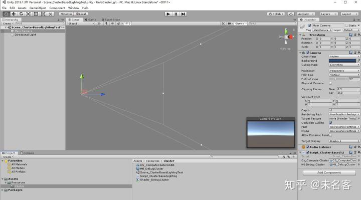
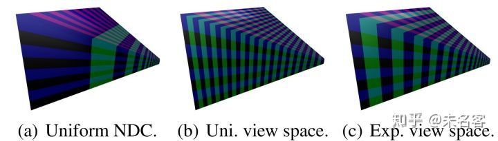
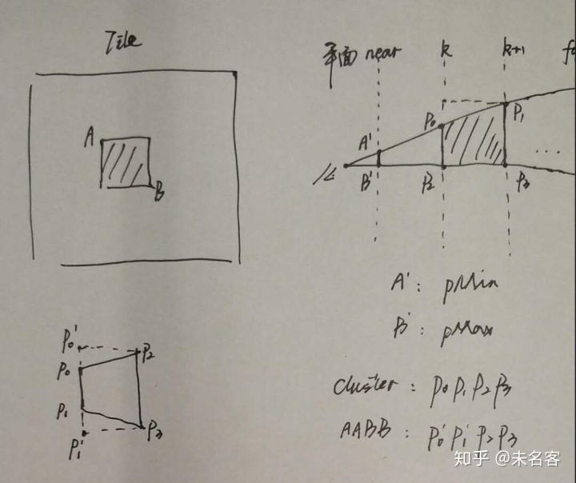
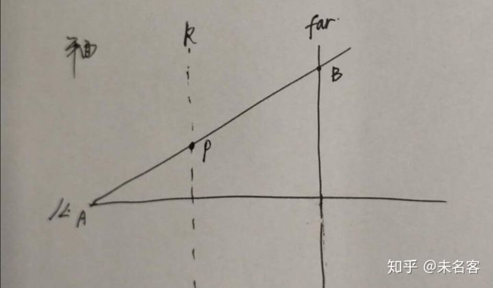
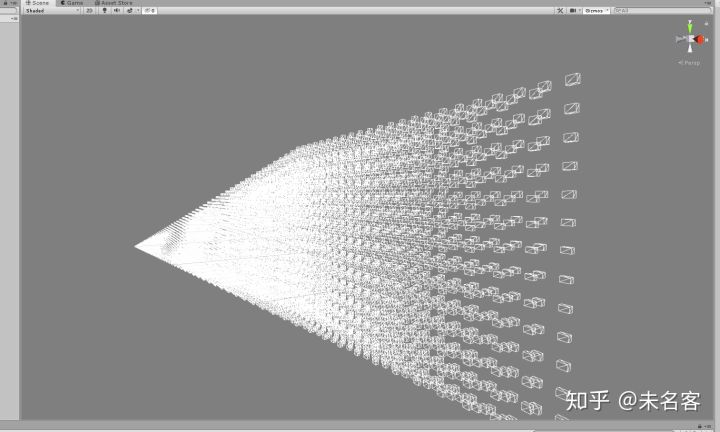

# 【渲染流程】Cluster_Unity实现详解(一)预计算AABB


篇文章，是对Unity 实现Cluster 灯光裁剪的一个概述，从这篇文章开始，我们开始结合代码详细展开，实现每一个流程。强烈建议大家先看上篇文章，很多推导，总结都在上篇文章里，这里及以后的文章不重复相关内容。

用Unity 实现ClusterBasedLighting，一开始考虑的便是Unity 的Srp，不过一来，自己对SRP 不熟，目前也没有足够的时间学习相关的东西，其二，本文的重点是梳理Cluster的流程，想更纯粹一些。最后受[MaxwellGeng](https://zhuanlan.zhihu.com/p/43588045) 兄弟的启发，决定，决定从零开始，完全自己手写。未来某一天如果对SRP 比较熟，会移植一下~ 

其实这里所谓的完全自定义，是自己调用一些Unity 较底层的绘制函数，绘制到自己创建的RT上，最后使用一个Blit 操作，把我们自己创建的RT 拷贝到摄像机的RT 上，由Unity 提交，最后在屏幕上显示。

## 一、准备环境

这一步比较简单，首先在一个空场景中，新建脚本Script_ClusterBasedLighting.cs,  并把它挂在Camera 上面，当你的Scene 视图，背景被清空成灰色，环境准备完成~

clear rt:  gray color

```csharp
[ExecuteInEditMode]
#if UNITY_5_4_OR_NEWER
[ImageEffectAllowedInSceneView]
#endif
public class Script_ClusterBasedLighting : MonoBehaviour
{
    private RenderTexture _rtColor;
    private RenderTexture _rtDepth;

    void Start()
    {
        _rtColor = new RenderTexture(Screen.width, Screen.height, 24);
        _rtDepth = new RenderTexture(Screen.width, Screen.height, 24, RenderTextureFormat.Depth, RenderTextureReadWrite.Linear);
    }

    void OnRenderImage(RenderTexture sourceTexture, RenderTexture destTexture)
    {
        Graphics.SetRenderTarget(_rtColor.colorBuffer, _rtDepth.depthBuffer);
        GL.Clear(true, true, Color.gray);

        Graphics.Blit(_rtColor, destTexture);
    }
}
```

我们在_*rtColor, _*rtDepth 上面绘制内容，最后blit 到 camera 的rt 上。

使用OnRenderImage() 函数，配合【ExecuteInEditMode】，【ImageEffectAllowedInSceneView】 是为了能在Scene视图窗口 预览结果。

这部分内容[MaxwellGeng](https://zhuanlan.zhihu.com/p/43588045) 已经解释的很清楚了，这里不做赘述，有兴趣或者不太明白的小伙伴可以点一下链接过去学习一下。

## 二、预计算ClusterAABB, 绘制调试Cluster

从这一阶段开始，我们进入正题，如标题所言，我们将实现如下内容：

1. 预计算Cluster AABB
2. 绘制供调试的Cluster  

完成以后，就能得到本篇文章标题的画面啦~ 

### 2.1 预计算Cluster AABB

主相机的视锥体被按照一定规则，切分成一定数量的小锥体，为了能更快的完成后面Cluster  与光源的求交，我们用AABB BoundBox  包围盒这种方式来表示Cluster，且此包围盒需要完整包含小锥体。这一步，我们的目标就是求出View空间下一系列Cluster AABB  的数组。



之前有提到我们最终实现的cluster， 是类似cube 的aabb，尽量做到均匀分布，实现方法就是在view 空间，做一种类似指数型的切分，具体推导过程见上篇文章，最终我们得到了如下公式：

![[公式]](Cluster_Unity.assets/equation.svg)                          （1）

![[公式]](Cluster_Unity.assets/equation.svg)                （2）

这两个公式非常重要，是我们后面做各种变化的基础。简单解释一下：

第一个公式：根据View 空间下的z ，计算当前z 所处的 cluster z 方向的Index；

第二个公式：根据cluster z 方向的Index ，反推 View 空间下 z坐标。

设想，假设我们知道屏幕上的一个Tile（即，Cluster 的xy 坐标），配合相机近裁面的z，便可得出一个view 空间下的3d 坐标，这个坐标与 摄像机的位置，便可形成一条线。

同时我知道了view 空间下，第k 个 cluster 的z坐标，根据这个z 构建一个平行于相机近、远裁面的面，那么便可以求出 这条线与k 平面的交点。 这个交点其实 就是 小cluster 锥体的某个点啦~

屏幕上的Tile，对应Cluster，及AABB

有了这个思路就可以写代码了~

为了方便，我们构建如下结构体：

```c#
struct CD_DIM
{
    public float fieldOfViewY;
    public float zNear;
    public float zFar;

    public float sD;
    public float logDimY;
    public float logDepth;

    public int clusterDimX;
    public int clusterDimY;
    public int clusterDimZ;
    public int clusterDimXYZ;
};
```

用来表示cluster 和相机的一些信息。在相机视锥体发生改变时（初始化需要调用一次），计算这个结构：

```c#
    void CalculateMDim(Camera cam)
    {
        // The half-angle of the field of view in the Y-direction.
        float fieldOfViewY = cam.fieldOfView * Mathf.Deg2Rad * 0.5f;//Degree 2 Radiance:  Param.CameraInfo.Property.Perspective.fFovAngleY * 0.5f;
        float zNear = cam.nearClipPlane;// Param.CameraInfo.Property.Perspective.fMinVisibleDistance;
        float zFar = cam.farClipPlane;// Param.CameraInfo.Property.Perspective.fMaxVisibleDistance;

        // Number of clusters in the screen X direction.
        int clusterDimX = Mathf.CeilToInt(Screen.width / (float)m_ClusterGridBlockSize);
        // Number of clusters in the screen Y direction.
        int clusterDimY = Mathf.CeilToInt(Screen.height / (float)m_ClusterGridBlockSize);

        // The depth of the cluster grid during clustered rendering is dependent on the 
        // number of clusters subdivisions in the screen Y direction.
        // Source: Clustered Deferred and Forward Shading (2012) (Ola Olsson, Markus Billeter, Ulf Assarsson).
        float sD = 2.0f * Mathf.Tan(fieldOfViewY) / (float)clusterDimY;
        float logDimY = 1.0f / Mathf.Log(1.0f + sD);

        float logDepth = Mathf.Log(zFar / zNear);
        int clusterDimZ = Mathf.FloorToInt(logDepth * logDimY);

        m_DimData.zNear = zNear;
        m_DimData.zFar = zFar;
        m_DimData.sD = sD;
        m_DimData.fieldOfViewY = fieldOfViewY;
        m_DimData.logDepth = logDepth;
        m_DimData.logDimY = logDimY;
        m_DimData.clusterDimX = clusterDimX;
        m_DimData.clusterDimY = clusterDimY;
        m_DimData.clusterDimZ = clusterDimZ;
        m_DimData.clusterDimXYZ = clusterDimX * clusterDimY * clusterDimZ;
    }
```

其中，clusterDimX/Y/Z 就是Cluster 的三维个数， clusterDimXYZ 就是总个数。

我们根据这个clusterDimXYZ，来创建一个AABB数组

```text
    private ComputeBuffer cb_ClusterAABBs;

    void Start()
    {
        //...
        CalculateMDim(_camera);

        int stride = Marshal.SizeOf(typeof(AABB));
        cb_ClusterAABBs = new ComputeBuffer(m_DimData.clusterDimXYZ, stride);
        //...
    }
```

完成以后，就可以调用CS 数组里面填数据了。

**2.1.1 先说shader**

CS 计算的过程，就是我们刚刚分析的过程，完整的cs代码，如下：

```
// Each #kernel tells which function to compile; you can have many kernels
#pragma kernel CSMain
#pragma enable_d3d11_debug_symbols

//Cluster Data
uint3 ClusterCB_GridDim;      // The 3D dimensions of the cluster grid.
float ClusterCB_ViewNear;     // The distance to the near clipping plane. (Used for computing the index in the cluster grid)
uint2 ClusterCB_Size;         // The size of a cluster in screen space (pixels).
float ClusterCB_NearK;        // ( 1 + ( 2 * tan( fov * 0.5 ) / ClusterGridDim.y ) ) // Used to compute the near plane for clusters at depth k.
float ClusterCB_LogGridDimY;  // 1.0f / log( 1 + ( tan( fov * 0.5 ) / ClusterGridDim.y )
float4 ClusterCB_ScreenDimensions;

struct Plane
{
	float3 N;   // Plane normal.
	float  d;   // Distance to origin.
};

/**
 * Convert a 1D cluster index into a 3D cluster index.
 */
uint3 ComputeClusterIndex3D(uint clusterIndex1D)
{
	uint i = clusterIndex1D % ClusterCB_GridDim.x;
	uint j = clusterIndex1D % (ClusterCB_GridDim.x * ClusterCB_GridDim.y) / ClusterCB_GridDim.x;
	uint k = clusterIndex1D / (ClusterCB_GridDim.x * ClusterCB_GridDim.y);

	return uint3(i, j, k);
}

/**
 * Convert the 3D cluster index into a 1D cluster index.
 */
uint ComputeClusterIndex1D(uint3 clusterIndex3D)
{
	return clusterIndex3D.x + (ClusterCB_GridDim.x * (clusterIndex3D.y + ClusterCB_GridDim.y * clusterIndex3D.z));
}

/**
* Compute the 3D cluster index from a 2D screen position and Z depth in view space.
* source: Clustered deferred and forward shading (Olsson, Billeter, Assarsson, 2012)
*/
uint3 ComputeClusterIndex3D(float2 screenPos, float viewZ)
{
	uint i = screenPos.x / ClusterCB_Size.x;
	uint j = screenPos.y / ClusterCB_Size.y;
	// It is assumed that view space z is negative (right-handed coordinate system)
	// so the view-space z coordinate needs to be negated to make it positive.
	uint k = log(viewZ / ClusterCB_ViewNear) * ClusterCB_LogGridDimY;

	return uint3(i, j, k);
}
/**
 * Find the intersection of a line segment with a plane.
 * This function will return true if an intersection point
 * was found or false if no intersection could be found.
 * Source: Real-time collision detection, Christer Ericson (2005)
 */
bool IntersectLinePlane(float3 a, float3 b, Plane p, out float3 q)
{
	float3 ab = b - a;

	float t = (p.d - dot(p.N, a)) / dot(p.N, ab);

	bool intersect = (t >= 0.0f && t <= 1.0f);

	q = float3(0, 0, 0);
	if (intersect)
	{
		q = a + t * ab;
	}

	return intersect;
}

/// Functions.hlsli
// Convert clip space coordinates to view space
float4 ClipToView(float4 clip)
{
	// View space position.
	//float4 view = mul(clip, g_Com.Camera.CameraProjectInv);
	float4 view = mul(_InverseProjectionMatrix, clip);
	// Perspecitive projection.
	view = view / view.w;

	return view;
}

// Convert screen space coordinates to view space.
float4 ScreenToView(float4 screen)
{
	// Convert to normalized texture coordinates in the range [0 .. 1].
	float2 texCoord = screen.xy * ClusterCB_ScreenDimensions.zw;

	// Convert to clip space
	float4 clip = float4(texCoord * 2.0f - 1.0f, screen.z, screen.w);

	return ClipToView(clip);
}

#ifndef BLOCK_SIZE
#define BLOCK_SIZE 1024
#endif

struct ComputeShaderInput
{
	uint3 GroupID           : SV_GroupID;           // 3D index of the thread group in the dispatch.
	uint3 GroupThreadID     : SV_GroupThreadID;     // 3D index of local thread ID in a thread group.
	uint3 DispatchThreadID  : SV_DispatchThreadID;  // 3D index of global thread ID in the dispatch.
	uint  GroupIndex        : SV_GroupIndex;        // Flattened local index of the thread within a thread group.
};

struct AABB
{
	float4 Min;
	float4 Max;
};
RWStructuredBuffer<AABB> RWClusterAABBs;

[numthreads(BLOCK_SIZE, 1, 1)]
void CSMain(ComputeShaderInput cs_IDs)
{
	uint clusterIndex1D = cs_IDs.DispatchThreadID.x;

	// Convert the 1D cluster index into a 3D index in the cluster grid.
	uint3 clusterIndex3D = ComputeClusterIndex3D(clusterIndex1D);

	// Compute the near and far planes for cluster K.
	Plane nearPlane = { 0.0f, 0.0f, 1.0f, ClusterCB_ViewNear * pow(abs(ClusterCB_NearK), clusterIndex3D.z) };
	Plane farPlane = { 0.0f, 0.0f, 1.0f, ClusterCB_ViewNear * pow(abs(ClusterCB_NearK), clusterIndex3D.z + 1) };

	// The top-left point of cluster K in screen space.
	float4 pMin = float4(clusterIndex3D.xy * ClusterCB_Size.xy, 0.0f, 1.0f);
	// The bottom-right point of cluster K in screen space.
	float4 pMax = float4((clusterIndex3D.xy + 1) * ClusterCB_Size.xy, 0.0f, 1.0f);

	// Transform the screen space points to view space.
	pMin = ScreenToView(pMin);
	pMax = ScreenToView(pMax);

	pMin.z *= -1;
	pMax.z *= -1;

	// Find the min and max points on the near and far planes.
	float3 nearMin, nearMax, farMin, farMax;
	// Origin (camera eye position)
	float3 eye = float3(0, 0, 0);
	IntersectLinePlane(eye, (float3)pMin, nearPlane, nearMin);
	IntersectLinePlane(eye, (float3)pMax, nearPlane, nearMax);
	IntersectLinePlane(eye, (float3)pMin, farPlane, farMin);
	IntersectLinePlane(eye, (float3)pMax, farPlane, farMax);

	float3 aabbMin = min(nearMin, min(nearMax, min(farMin, farMax)));
	float3 aabbMax = max(nearMin, max(nearMax, max(farMin, farMax)));

	AABB aabb = { float4(aabbMin, 1.0f), float4(aabbMax, 1.0f) };
	
	RWClusterAABBs[clusterIndex1D] = aabb;
}
```

ComputeShader 分析：

1、每一个cluster 就是一个线程，若一个线程组有1024个线程，所以，需要dispath m_DimData.clusterDimXYZ / 1024.0 个线程组

2、为了方便填充我们的一维数组结果，这里我们分配的线程组是一维的。虽然cluster index 是3维的，但是不虚，因为index 3维到一维是非常方便的。所以在shader 的一开始，我们写了如下一些用于转换的工具函数，这些函数后面会被反复用到。

```text
/**
 * Convert a 1D cluster index into a 3D cluster index.
 */
uint3 ComputeClusterIndex3D(uint clusterIndex1D)
{
	uint i = clusterIndex1D % ClusterCB_GridDim.x;
	uint j = clusterIndex1D % (ClusterCB_GridDim.x * ClusterCB_GridDim.y) / ClusterCB_GridDim.x;
	uint k = clusterIndex1D / (ClusterCB_GridDim.x * ClusterCB_GridDim.y);

	return uint3(i, j, k);
}

/**
 * Convert the 3D cluster index into a 1D cluster index.
 */
uint ComputeClusterIndex1D(uint3 clusterIndex3D)
{
	return clusterIndex3D.x + (ClusterCB_GridDim.x * (clusterIndex3D.y + ClusterCB_GridDim.y * clusterIndex3D.z));
}

/**
* Compute the 3D cluster index from a 2D screen position and Z depth in view space.
* source: Clustered deferred and forward shading (Olsson, Billeter, Assarsson, 2012)
*/
uint3 ComputeClusterIndex3D(float2 screenPos, float viewZ)
{
	uint i = screenPos.x / ClusterCB_Size.x;
	uint j = screenPos.y / ClusterCB_Size.y;
	uint k = log(viewZ / ClusterCB_ViewNear) * ClusterCB_LogGridDimY;

	return uint3(i, j, k);
}
```

前两个转换非常简单，第三个有一点意思，用到了上面提到的公式1， 即，根据屏幕像素坐标，和 view 空间的z 计算cluster 的3维index。

3、接下来是一个线面求交的函数，这个等下将用来计算 cluster 锥体两个平面的的左上角，和右下角，四个顶点。

线面求交，简单图示

4、再下来就是常规的空间转化，不多解释。

5、CSMain 的内容简单介绍：

1）DispatchThreadID 即对应cluster 的1维索引。

2）这里要注意，Unity 的View 空间是右手坐标系，我们所有view 空间下的z 值都是负数，同理，在构建纵向k，k+1 两个平面的时候，他们的法向量是，（ 0，0，1）。

3）下面的代码是，计算view 空间的z， 用到了公式1

```text
ClusterCB_ViewNear * pow(abs(ClusterCB_NearK), clusterIndex3D.z) 
```

4）我们将屏幕tile （即cluster 的xy） 左上角，右下角转换到view空间，求出view 空间的坐标，pMin， pMax。注意view z 是负数。

5）最后就可以做线面求交了，从四个点中，拼出最小最大的，就是我们cluster aabb 的左上，右下角的点啦~ 

cluster AABB 的计算，到了这一步，就已经完成了。在实际游戏运行过程中，因为视锥体常规情况下是不会发生变化的，所以可以预先把数据准备好，在Init 的时候就可以Dispatch 执行CS了。

**2.1.2 c# 分析**

最后简单看一眼c# 这边情况

```csharp
    void UpdateClusterCBuffer(ComputeShader cs)
    {
        int[] gridDims = { m_DimData.clusterDimX, m_DimData.clusterDimY, m_DimData.clusterDimZ };
        int[] sizes = { m_ClusterGridBlockSize, m_ClusterGridBlockSize };
        Vector4 screenDim = new Vector4((float)Screen.width, (float)Screen.height, 1.0f / Screen.width, 1.0f / Screen.height);
        float viewNear = m_DimData.zNear;

        cs.SetInts("ClusterCB_GridDim", gridDims);
        cs.SetFloat("ClusterCB_ViewNear", viewNear);
        cs.SetInts("ClusterCB_Size", sizes);
        cs.SetFloat("ClusterCB_NearK", 1.0f + m_DimData.sD);
        cs.SetFloat("ClusterCB_LogGridDimY", m_DimData.logDimY);
        cs.SetVector("ClusterCB_ScreenDimensions", screenDim);
    }
     void Pass_ComputeClusterAABB()
    {
        var projectionMatrix = GL.GetGPUProjectionMatrix(_camera.projectionMatrix, false);
        var projectionMatrixInvers = projectionMatrix.inverse;
        cs_ComputeClusterAABB.SetMatrix("_InverseProjectionMatrix", projectionMatrixInvers);

        UpdateClusterCBuffer(cs_ComputeClusterAABB);

        int threadGroups = Mathf.CeilToInt(m_DimData.clusterDimXYZ / 1024.0f);

        int kernel = cs_ComputeClusterAABB.FindKernel("CSMain");
        cs_ComputeClusterAABB.SetBuffer(kernel, "RWClusterAABBs", cb_ClusterAABBs);
        cs_ComputeClusterAABB.Dispatch(kernel, threadGroups, 1, 1);
    }
```

这里有一点要注意的是，Unity InvProjectMatrix 的用法。Dx 系列和OpenGl  系类的投影是不一样的。DX是以左上角为（0,0） OpenGL是以右下角为（0,0） ，DX的Z范围是（0,1）  GL是（-1,1）。为了跨平台，Unity 使用GetGPUProjectionMatrix  函数，做转换，友情提示，这里处理不好，出来的结果很有可能是 Y 方向相反哦。

这个我当时也被坑了，最后翻了翻Untiy PostProcess Steck 里面SSR 代码，才明白过来.....

### 2.2 绘制供调试的Cluster  

ClusterAABB 计算完以后，心里还是没底，也为了后面调试的方便，我们首先把计算出来的AABB 画出来，先看个大概~

cluster AABB 的调试界面

绘制的话，我们使用GS的方式，提交clusterDimXYZ 这个点，shader 里面根据点的id， 访问我们刚刚完成的数组，就能拿到当前点对应的cluster aabb 啦，然后在GS里面，生成8个点，表示cube。

简单看一下shader :

```cpp
Shader "ClusterBasedLightingGit/Shader_DebugCluster"
{
	Properties
	{
	}
	SubShader
	{
		Tags { "RenderType"="Opaque" }
		LOD 100

		Pass
		{
			CGPROGRAM

			#pragma vertex main_VS
			#pragma fragment main_PS
			#pragma geometry main_GS
			#pragma target 5.0
			#pragma enable_d3d11_debug_symbols

			#include "UnityCG.cginc"

			struct VertexShaderOutput
			{
				float4 Min          : AABB_MIN;  // Min vertex position in view space.
				float4 Max          : AABB_MAX;  // Max vertex position in view space.
				float4 Color        : COLOR;     // Cluster color.
			};

			struct GeometryShaderOutput
			{
				float4 Color        : COLOR;
				float4 Position     : SV_POSITION;          // Clip space position.
			};

			struct AABB
			{
				float4 Min;
				float4 Max;
			};

			StructuredBuffer<AABB> ClusterAABBs;// : register(t1);

			bool CMin(float3 a, float3 b)
			{
				if (a.x < b.x && a.y < b.y && a.z < b.z)
					return true;
				else
					return false;
			}

			bool CMax(float3 a, float3 b)
			{
				if (a.x > b.x && a.y > b.y && a.z > b.z)
				{
					return true;
				}
				else
				{
					return false;
				}
			}

			float4 WorldToProject(float4 posWorld)
			{	
				float4 posVP0 = UnityObjectToClipPos(posWorld);
				return posVP0;
			}

			VertexShaderOutput main_VS(uint VertexID : SV_VertexID)
			{
				uint clusterID = VertexID; ;// UniqueClusters[VertexID];// VertexID;

				VertexShaderOutput vsOutput = (VertexShaderOutput)0;

				AABB aabb = ClusterAABBs[clusterID];// ClusterAABBs[VertexID];

				vsOutput.Min = aabb.Min;
				vsOutput.Max = aabb.Max;

				float4 factor = aabb.Max - aabb.Min;
				//factor *= 0.2;
				vsOutput.Max = aabb.Min + factor;
				vsOutput.Color = float4(1,1,1,1);

				return vsOutput;
			}


			// Geometry shader to convert AABB to cube.
			[maxvertexcount(16)]
			void main_GS(point VertexShaderOutput IN[1], inout TriangleStream<GeometryShaderOutput> OutputStream)
			{
				float4 min = IN[0].Min;
				float4 max = IN[0].Max;

				// Clip space position
				GeometryShaderOutput OUT = (GeometryShaderOutput)0;

				// AABB vertices
				const float4 Pos[8] = {
					float4(min.x, min.y, min.z, 1.0f),    // 0
					float4(min.x, min.y, max.z, 1.0f),    // 1
					float4(min.x, max.y, min.z, 1.0f),    // 2

					float4(min.x, max.y, max.z, 1.0f),    // 3
					float4(max.x, min.y, min.z, 1.0f),    // 4
					float4(max.x, min.y, max.z, 1.0f),    // 5
					float4(max.x, max.y, min.z, 1.0f),    // 6
					float4(max.x, max.y, max.z, 1.0f)     // 7
				};

				// Colors (to test correctness of AABB vertices)
				const float4 Col[8] = {
					float4(0.0f, 0.0f, 0.0f, 1.0f),       // Black
					float4(0.0f, 0.0f, 1.0f, 1.0f),       // Blue
					float4(0.0f, 1.0f, 0.0f, 1.0f),       // Green
					float4(0.0f, 1.0f, 1.0f, 1.0f),       // Cyan
					float4(1.0f, 0.0f, 0.0f, 1.0f),       // Red
					float4(1.0f, 0.0f, 1.0f, 1.0f),       // Magenta
					float4(1.0f, 1.0f, 0.0f, 1.0f),       // Yellow
					float4(1.01, 1.0f, 1.0f, 1.0f)        // White
				};

				const uint Index[18] = {
					0, 1, 2,
					3, 6, 7,
					4, 5, -1,
					2, 6, 0,
					4, 1, 5,
					3, 7, -1
				};

				[unroll]
				for (uint i = 0; i < 18; ++i)
				{
					if (Index[i] == (uint) - 1)
					{
						OutputStream.RestartStrip();
					}
					else
					{
						OUT.Position = WorldToProject(Pos[Index[i]]);
						OUT.Color = IN[0].Color;
						OutputStream.Append(OUT);
					}
				}
			}

			float4 main_PS(GeometryShaderOutput IN) : SV_Target
			{
				return IN.Color;
			}

			ENDCG
		}
	}
}
```

GS 的用法和DX11， 很常规，这里就不多介绍了，不了解的小伙伴，可以搜一下，GS的具体用法，功能很灵活，但是慎用哦，效率是一个很大的问题。

可以从上面的图里看出，Cluster 的AABB 确实把小锥体完全包围住了， 因为很多AABB在边缘的地方都有重叠，这是符合我们的需求的。为了方便查看，我把aabb 的左上角做了保留，实际大小做了一下缩放，看上去，清晰明了~ 标题图，get！



c# 脚本简单看一眼

```csharp
    void Pass_DebugCluster()
    {
        GL.wireframe = true;

        mtlDebugCluster.SetBuffer("ClusterAABBs", cb_ClusterAABBs);

        mtlDebugCluster.SetPass(0);
        Graphics.DrawProceduralNow(MeshTopology.Points, m_DimData.clusterDimXYZ);
        
        GL.wireframe = false;
    }
    void OnRenderImage(RenderTexture sourceTexture, RenderTexture destTexture)
    {
        Graphics.SetRenderTarget(_rtColor.colorBuffer, _rtDepth.depthBuffer);
        GL.Clear(true, true, Color.gray);

        Pass_DebugCluster();

        Graphics.Blit(_rtColor, destTexture);
    }
```

没什么好说的=-=

因为白天还要上班，晚上回家抽了一点时间写了这么多，回过神儿来，不知不觉，已经凌晨0.27分了，由于时间问题，就只能先总结到了，下一篇再见~

