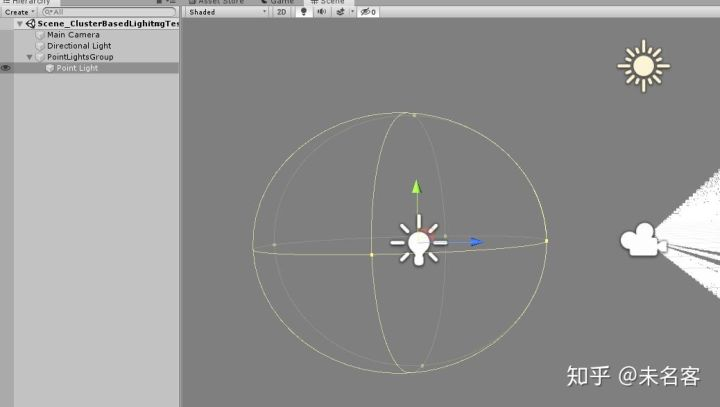
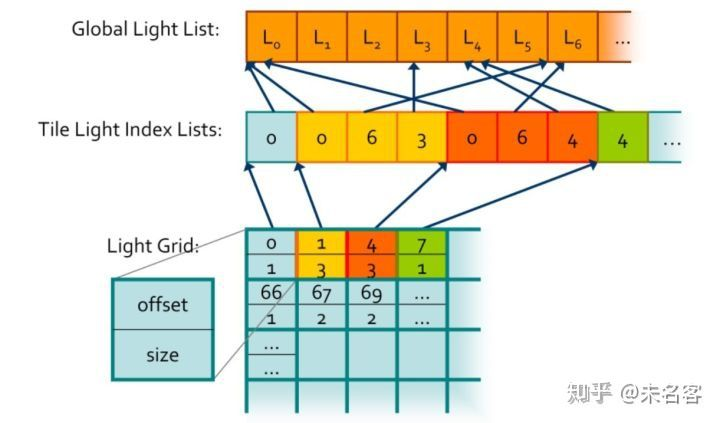
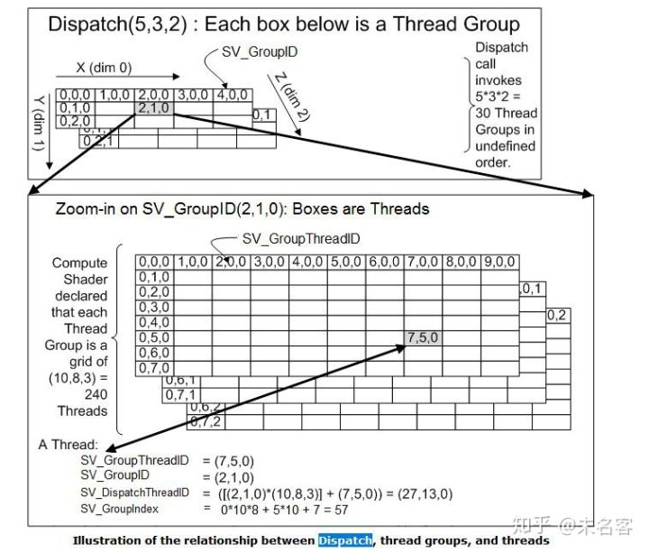

# Cluster_Unity实现详解(二)光源求交


​    再说明一下，第一篇文章，是对Unity 实现Cluster 灯光裁剪的一个概述，从第二篇开始，我们开始结合代码详细展开，实现每一个流程。强烈建议大家先看概述那篇文章，很多推导，总结都在那里，这里及以后的文章不重复相关内容。

​     这篇文章，我将介绍如何实现cluster  与光源的求交，这一步骤，是整套流程最为核心的地方，如果这一步计算错误，那么后面的结果都没法继续。为了方便预览，我们先考虑在scene  视图下做求交并显示，实际在game 视图中，只需要稍微修改一下即可，这个会在下篇文章，也就是Unity 实现的最后一片文章里面做介绍。

### 1. Cluster Cube 跟随camera

上回我们算出了View  空间下 Cluster aabb 的列表，并把它存到了cb_ClusterAABBs 这个buffer中，并且在scene  视图中画出了debug 的cube。但是当我们移动相机是发现，debug cube 并没有跟着动，是因为，上篇文章里面，我们直接把View  空间下的坐标 当成世界坐标，去做MVP，为了能让scene 视图下的debug cube 跟着相机动，我们需要把相机的world  矩阵传给shader：  

```cpp
float4x4 _CameraWorldMatrix;

float4 WorldToProject(float4 posWorld)
{	
	float4 l_posWorld = mul(_CameraWorldMatrix, posWorld);
	float4 posVP0 = UnityObjectToClipPos(l_posWorld);
	return posVP0;
}
[maxvertexcount(16)]
void main_GS(point VertexShaderOutput IN[1], inout TriangleStream<GeometryShaderOutput> OutputStream)
{
    ...
    
    [unroll]
    for (uint i = 0; i < 18; ++i)
    {
            ...
            OUT.Position = WorldToProject(Pos[Index[i]]);
            ...
    }
}
```

c# 脚步传参数到shader

```csharp
mtlDebugCluster.SetMatrix("_CameraWorldMatrix", _camera.transform.localToWorldMatrix);
```

搞定~

<iframe allowfullscreen="" src="https://www.zhihu.com/video/1130885118210039808?autoplay=false&amp;useMSE=" frameborder="0"></iframe>

scene 窗口 cube 跟随相机


## 2. 光源准备

接下来，我们开始准备光源的数据。我创建了一个空物体，表示pointlight 组，子物体都是场景中的点光源。



在光源求交这一步，我们只需要关心，点光源的世界坐标和range 属性。将设我们最多支持2048个点光源，构建如下buffer，存放点光源pos range 列表，并传递给shader:

```text
private ComputeBuffer cb_PointLightPosRadius;

cb_PointLightPosRadius = new ComputeBuffer(MAX_NUM_LIGHTS, sizeof(float) * 4);
```

在每帧开始的时候，更新这个buffer

```text
void UpdateLightBuffer()
{
    List<Vector4> lightPosRatioList = new List<Vector4>();
    foreach (var lit in lightList)
    {
        lightPosRatioList.Add(new Vector4(lit.transform.position.x, lit.transform.position.y, lit.transform.position.z, lit.range));
    }

    cb_PointLightPosRadius.SetData(lightPosRatioList);
}
```

ok，光源准备完毕，接下来开始求交。

### 3. 数据结构

数据结构

- GlobalLightList: 全局灯光列表，包含了灯光的所有信息
- LightIndexList: 灯光索引列表
- LightGrid: Cluster 灯光列表对应起始位置，个数

我们只需要在这一步骤里面，LightIndexList， 和 LightGrid 计算出来即可。

### 4. 光源 与 Cluster 求交

需要注意的是：

1、我们为每一个Cluster 分配一个线程组，所以需要dispatch clusterDimXYZ 个线程组。

2、需要定义几个groupshared临时变量方便处理数据

3、因为是多线程处理，所以线程同步非常重要

4、最终目的，求解LightIndexList 和 LightGrid


首先先把完整的cs 代码贴出来，我们一点一点分析：

```text
// Each #kernel tells which function to compile; you can have many kernels
#pragma kernel CSMain

// Axis-Aligned bounding box
struct AABB
{
	float4 Min;
	float4 Max;
};

struct Sphere
{
	float3 c;   // Center point.
	float  r;   // Radius.
};

RWStructuredBuffer<uint> RWPointLightIndexCounter_Cluster;// : register(u2);
RWStructuredBuffer<uint2> RWPointLightGrid_Cluster;// : register(u4);
RWStructuredBuffer<uint> RWPointLightIndexList_Cluster;// : register(u6);

StructuredBuffer<AABB> ClusterAABBs;// : register(t1);
StructuredBuffer<float4> PointLights;// : register(t8);

uint PointLightCount;

// Compute the square distance between a point p and an AABB b.
// Source: Real-time collision detection, Christer Ericson (2005)
float SqDistancePointAABB(float3 p, AABB b)
{
	float sqDistance = 0.0f;

	for (int i = 0; i < 3; ++i)
	{
		float v = p[i];

		if (v < b.Min[i]) sqDistance += pow(b.Min[i] - v, 2);
		if (v > b.Max[i]) sqDistance += pow(v - b.Max[i], 2);
	}

	return sqDistance;
}

// Check to see if a sphere is interesecting an AABB
// Source: Real-time collision detection, Christer Ericson (2005)
bool SphereInsideAABB(Sphere sphere, AABB aabb)
{
	float sqDistance = SqDistancePointAABB(sphere.c, aabb);

	return sqDistance <= sphere.r * sphere.r;
}

////////////////////////////////////////////////////////////////////////////////////////////////
#define NUM_THREADS 1024
groupshared uint gs_ClusterIndex1D;
groupshared AABB gs_ClusterAABB;
groupshared uint gs_PointLightCount;
groupshared uint gs_PointLightStartOffset;
groupshared uint gs_PointLightList[1024];

struct ComputeShaderInput
{
	uint3 GroupID           : SV_GroupID;           // 3D index of the thread group in the dispatch.
	uint3 GroupThreadID     : SV_GroupThreadID;     // 3D index of local thread ID in a thread group.
	uint3 DispatchThreadID  : SV_DispatchThreadID;  // 3D index of global thread ID in the dispatch.
	uint  GroupIndex        : SV_GroupIndex;        // Flattened local index of the thread within a thread group.
};

#define AppendLight( lightIndex, counter, lightList ) \
    InterlockedAdd( counter, 1, index ); \
    if ( index < 1024 ) \
    { \
        lightList[index] = lightIndex; \
    }

[numthreads(NUM_THREADS, 1, 1)]
void CSMain (ComputeShaderInput IN)
{	
	uint i, index;

	if (IN.GroupIndex == 0)
	{
		gs_PointLightCount = 0;
		gs_SpotLightCount = 0;

		gs_ClusterIndex1D = IN.GroupID.x;
		gs_ClusterAABB = ClusterAABBs[gs_ClusterIndex1D];
	}

	GroupMemoryBarrierWithGroupSync();

	// Intersect point lights against AABB.
	for (i = IN.GroupIndex; i < PointLightCount; i += NUM_THREADS)
	{
		//if ( PointLights[i].Enabled )
		{
			float4 pointLight = PointLights[i];
			float3 pointLightPosView = pointLight.xyz;
			Sphere sphere = { pointLightPosView, pointLight.w };

			if (SphereInsideAABB(sphere, gs_ClusterAABB))
			{
				AppendLight(i, gs_PointLightCount, gs_PointLightList);
			}
		}
	}

	GroupMemoryBarrierWithGroupSync();

	// Now update the global light grids with the light lists and light counts.
	if (IN.GroupIndex == 0)
	{
		// Update light grid for point lights.
		InterlockedAdd(RWPointLightIndexCounter_Cluster[0], gs_PointLightCount, gs_PointLightStartOffset);
		RWPointLightGrid_Cluster[gs_ClusterIndex1D] = uint2(gs_PointLightStartOffset, gs_PointLightCount);
	}

	GroupMemoryBarrierWithGroupSync();

	// Now update the global light index lists with the group shared light lists.
	for (i = IN.GroupIndex; i < gs_PointLightCount; i += NUM_THREADS)
	{
		RWPointLightIndexList_Cluster[gs_PointLightStartOffset + i] = gs_PointLightList[i];
	}
}
```

### **4.1 CS 知识复习**

使用cs 做这种求交，其实很有意思，也稍微有点绕。为了方便大家理解，我先解释一下这里要用到的一些CS 知识：

1）**ID相关**：

C# IDs

2）**Barrier 相关**

当我们在不同线程访问同一个资源的时候，我们需要使用Barrier来进行阻塞和同步。

分为以下两种：

```text
GroupMemoryBarrier
DeviceMemoryBarrier
AllMemoryBarrier 
```


```text
DeviceMemoryBarrierWithGroupSync 
GroupMemoryBarrierWithGroupSync  
AllMemoryBarrierWithGroupSync
```

GroupMemoryBarrier是等待对GroupShared变量的访问。

DeviceMemoryBarrier是等待对Texture或Buffer的访问。

AllMemoryBarrier是以上两者的和。

*WithGroupSync版本是需要同步到当前指令

3) **Interlocked 操作**

原子操作，不会被线程调度机制打断。

```text
InterlockedAdd
InterlockedAnd
InterlockedCompareExchange
InterlockedCompareStore
InterlockedExchange
InterlockedMax
InterlockedMin
InterlockedOr
InterlockedXor
```

### 4.2 求交函数

求交函数很好理解，我们已经有了了cluster 的aabb，根据光源xyz，range 创建一个球体，就可以执行常规 球体与aabb的求交运算。

```text
float SqDistancePointAABB(float3 p, AABB b)
bool SphereInsideAABB(Sphere sphere, AABB aabb)
```

### 4.3 group shared 变量

```text
groupshared uint gs_ClusterIndex1D;
groupshared AABB gs_ClusterAABB;

groupshared uint gs_PointLightCount;
groupshared uint gs_PointLightStartOffset;
groupshared uint gs_PointLightList[1024];
```

因为一个线程组，处理一个cluster  的数据，所以 这些个 groupshared 变量，是每一个cluster  的1024个线程共有的，内容很好理解，就是他们各自的名字。我们在这里创建这些临时的变量，主要的目的，是能求出一个cluster  的gs_PointLightList，即点光源列表，点光源总个数，gs_PointLightCount， 以及它在总点光源 list 中的位置  gs_PointLightStartOffset。

### 4.4 4个阶段

整个计算过程，分四个阶段，一个步骤必须等带全部线程执行完，才能执行下一个阶段，针对当前cluster

第一阶段： 初始化groupshared 变量值

第二阶段：计算当前 cluster， 所受点光源影响的总个数，并填充光源index 列表

第三阶段：使用gs_PointLightStartOffset，gs_PointLightCount，填充light grid

第四阶段：填充light 列表

### 4.5 第二阶段

对第二阶段简单介绍一下：

```text
// Intersect point lights against AABB.
for (i = IN.GroupIndex; i < PointLightCount; i += NUM_THREADS)
{
    //if ( PointLights[i].Enabled )
    {
        float4 pointLight = PointLights[i];
        float3 pointLightPosView = WorldToView(float4(pointLight.xyz, 1)).xyz;// mul(float4(pointLight.xyz, 1), _CameraLastViewMatrix).xyz;
        Sphere sphere = { pointLightPosView, pointLight.w };

        if (SphereInsideAABB(sphere, gs_ClusterAABB))
        {
            AppendLight(i, gs_PointLightCount, gs_PointLightList);
        }
    }
}
```

1）i += NUM_THREADS

请记住：因为我们为每一个cluster，分配了一个线程组。所以这个组内处理的都是同一个cluster 的数据~~~

所以，我们在这里，是为了对当前cluster 遍历所有的light，整个线程组，总共有NUM_THREADS个线程，一个线程跑一盏灯，一个来回，就是i += NUM_THREADS啦~

2） Append宏

```text
#define AppendLight( lightIndex, counter, lightList ) \
    InterlockedAdd( counter, 1, index ); \
    if ( index < 1024 ) \
    { \
        lightList[index] = lightIndex; \
    }
```

为了方便，我们定义了一个AppendLight 宏，其实可以说的不多，在线程安全的前提下，两个功能：

1）更新index， counter+1

2）填充pointlist 的列表

### 4.6 c#部分

```csharp
    void Pass_AssignLightsToClusts()
    {
        ClearLightGirdIndexCounter();

        int kernel = cs_AssignLightsToClusts.FindKernel("CSMain");

        //Output
        cs_AssignLightsToClusts.SetBuffer(kernel, "RWPointLightIndexCounter_Cluster", cb_ClusterPointLightIndexCounter);
        cs_AssignLightsToClusts.SetBuffer(kernel, "RWPointLightGrid_Cluster", cb_ClusterPointLightGrid);
        cs_AssignLightsToClusts.SetBuffer(kernel, "RWPointLightIndexList_Cluster", cb_ClusterPointLightIndexList);

        //Input
        cs_AssignLightsToClusts.SetInt("PointLightCount", lightList.Count);
        cs_AssignLightsToClusts.SetMatrix("_CameraLastViewMatrix", _camera.transform.worldToLocalMatrix);
        cs_AssignLightsToClusts.SetBuffer(kernel, "PointLights", cb_PointLightPosRadius);
        cs_AssignLightsToClusts.SetBuffer(kernel, "ClusterAABBs", cb_ClusterAABBs);

        cs_AssignLightsToClusts.Dispatch(kernel, m_DimData.clusterDimXYZ, 1, 1);
    }
```

嗯....基本没什么好说的

### 5. 查看求交结果

到了这一步，我们就已经完成整个cluster 与点光源求交的过程了，在debug cluster 里面，我们调试看一眼效果：

首先shader 中加入如下 ：

```cpp
StructuredBuffer<uint2> PointLightGrid_Cluster;

float fClusterLightCount = PointLightGrid_Cluster[clusterID].y;
if (fClusterLightCount > 0)
{
    vsOutput.Color = float4(1, 0, 0, 1);
}
```

在 c# 脚本中，把计算求得的 LightGrid 传入

```csharp
mtlDebugCluster.SetBuffer("PointLightGrid_Cluster", cb_ClusterPointLightGrid);
```

搞定~ 这时候，我们已经看到scene 视图下，点光源附近的cluster  已经变成红色的了，所以我们计算没有问题。但是移动摄像机的时候，虽然 cluster cube 跟着动了，但是红色 cube  没有更新，其实是因为，在求交函数中，我们直接使用了点光源的世界坐标，为了能让红色cube 更新，我们需要把点光源的世界坐标，转到camera 下

```cpp
float4 WorldToView(float4 posWorld)
{
	float4 posView = mul(_CameraLastViewMatrix, posWorld);
	//posView.z *= -1;
	return posView;
}

float3 pointLightPosView = WorldToView(float4(pointLight.xyz, 1)).xyz;// mul(float4(pointLight.xyz, 1), _CameraLastViewMatrix).xyz;
```


```csharp
cs_AssignLightsToClusts.SetMatrix("_CameraLastViewMatrix", _camera.transform.worldToLocalMatrix);
```

封面图get~ 搞定！

<iframe allowfullscreen="" src="https://www.zhihu.com/video/1130904151751823360?autoplay=false&amp;useMSE=" frameborder="0"></iframe>

光源求交结果


### 6 总结

到目前为止，我们已经完成cluster 与点光源的求交，可以看出来，这里完全是在camera 空间下完成的，没有引入任何的场景，其实，这也反应了cluster 这套流程的一个有点，它并不依赖引擎渲染流程是Forward，还是Deferred.

同时也没有做任何的优化，在下一篇文章，也就是unity  实现详解的最后一片文章，我将会介绍如何在实际场景中，使用cluster。用深度图，去裁剪多余cluster， 结合Indirect  的系列函数，使用类似GpuDriven 的思路，去优化我们的代码，最后完成一个简单的多点光源光照的效果。

谢谢大家~