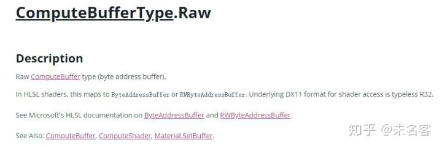
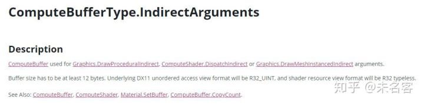
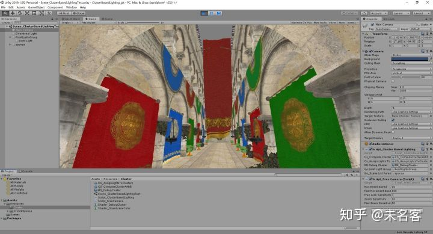
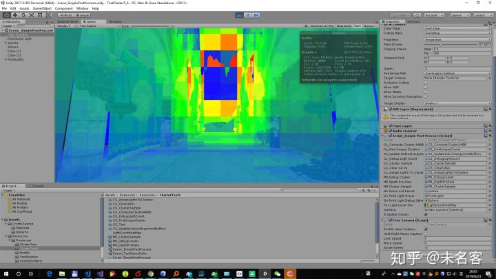
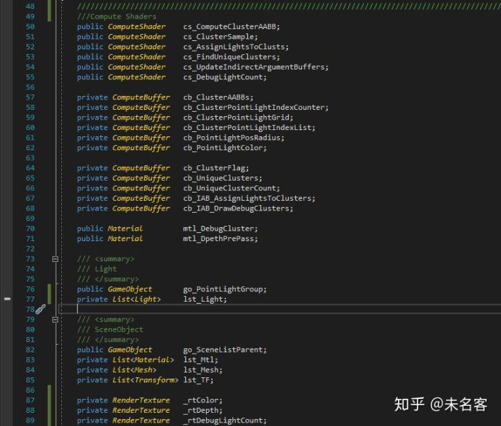
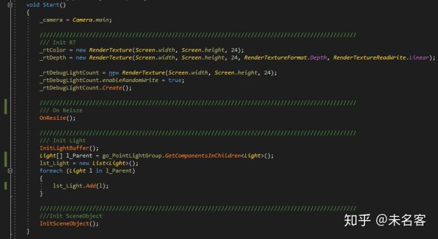
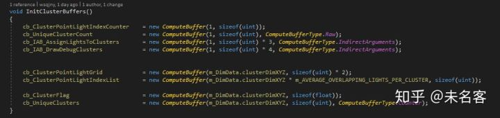
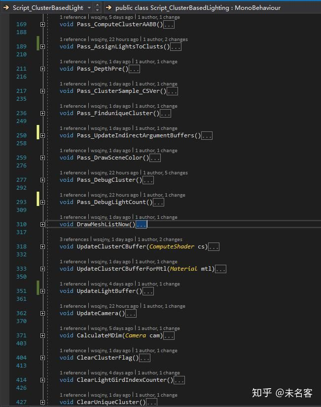
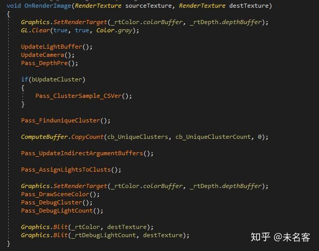
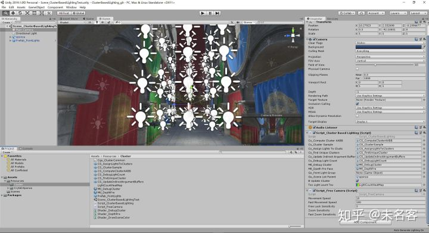

# Cluster_Unity实现详解三GpuDriven


上两篇文章中，我们实现了预计算AABB，Cluster灯光求交，实现过程，并没有引入具体的场景。在这一篇中，我们 将引入具体的场景，并且使用GpuDriven的流程去优化我们的代码。

紧上回，今天我们就在具体的场景中应用之前完成的内容，整套ClusterBasedForward 就算完成啦。

这篇文章将对之前做一个整合，主要包含如下步骤：

1. 预计算视锥体AABB
2. 准备场景，写深度
3. 使用深度，裁剪Cluster， 获得Cluster有效列表
4. 根据有效列表个数，分配线程组，做求交
5. 根据求交结果，绘制场景
6. 绘制调试信息

翻译到代码，总共包含如下Pass：

1. Pass_ComputeAABB， 预计算AABB，已完成。
2. Pass_Z-Pre， 准备场景，写深度。
3. Pass_ClusterSample, 使用深度图，裁剪Cluster，并标记。
4. Pass_FinduniqueCluster，根据cluster 标记获得有效Cluster列表。
5. Pass_UpdateIndirectArgument, 填充Indirect 参数。
6. Pass_AssignLightsToClusts，cluster 与灯光求交。
7. Pass_DrawSceneColor，正常绘制场景。
8. Pass_DebugCluster，绘制调试ClusterCube。
9. Pass_DebugLightCount，绘制调试信息，像素所受点光源的个数热力图。

------

## 0. ComputeShader 相关内容复习

正式开始之前，因为我们的整套Cluster  流程是Gpu驱动的，所谓GpuDriven，这里还是给大家复习一下Unity 里面ComputeShader  的一个小知识，其实和DX系列是通用的，不过Unity 还是对Dx  的一些类型做了封装，因为这篇文章里面我们是Unity实现的，所以我们按照Unity 的组织方式来介绍。

### 0.1 ComputeBufferType

Unity 中总共有如下 ComputeBufferType：

Untiy2019：

```csharp
    [Flags]
    public enum ComputeBufferType
    {
        Default = 0,
        Raw = 1,
        Append = 2,
        Counter = 4,
        Constant = 8,
        Structured = 16,
        DrawIndirect = 256,
        IndirectArguments = 256,
        GPUMemory = 512
    }
```

Unity 2017:

```csharp
    //
    // Summary:
    //     ComputeBuffer type.
    [Flags]
    public enum ComputeBufferType
    {
        //
        // Summary:
        //     Default ComputeBuffer type (structured buffer).
        Default = 0,
        //
        // Summary:
        //     Raw ComputeBuffer type (byte address buffer).
        Raw = 1,
        //
        // Summary:
        //     Append-consume ComputeBuffer type.
        Append = 2,
        //
        // Summary:
        //     ComputeBuffer with a counter.
        Counter = 4,
        DrawIndirect = 256,
        //
        // Summary:
        //     ComputeBuffer used for Graphics.DrawProceduralIndirect, ComputeShader.DispatchIndirect
        //     or Graphics.DrawMeshInstancedIndirect arguments.
        IndirectArguments = 256,
        GPUMemory = 512
    }
```

2017\2019 差不多。

下面是我们这篇文章将会用到的部分ComputeBuffer

```csharp
    void InitClusterBuffers()
    {
        cb_ClusterPointLightIndexCounter    = new ComputeBuffer(1, sizeof(uint));
        cb_UniqueClusterCount               = new ComputeBuffer(1, sizeof(uint), ComputeBufferType.Raw);
        cb_IAB_AssignLightsToClusters       = new ComputeBuffer(1, sizeof(uint) * 3, ComputeBufferType.IndirectArguments);
        cb_IAB_DrawDebugClusters            = new ComputeBuffer(1, sizeof(uint) * 4, ComputeBufferType.IndirectArguments);


        cb_ClusterPointLightGrid            = new ComputeBuffer(m_DimData.clusterDimXYZ, sizeof(uint) * 2);
        cb_ClusterPointLightIndexList       = new ComputeBuffer(m_DimData.clusterDimXYZ * m_AVERAGE_OVERLAPPING_LIGHTS_PER_CLUSTER, sizeof(uint));

        cb_ClusterFlag                      = new ComputeBuffer(m_DimData.clusterDimXYZ, sizeof(float));
        cb_UniqueClusters                   = new ComputeBuffer(m_DimData.clusterDimXYZ, sizeof(uint), ComputeBufferType.Counter);
    }
```

挑几个我们用到来讲：

1、Default 标记的默认类型，即StructuredBuffer，这种类型非常常见，其实也是从c# 到Shader 传递数组的一种方式，不多讲。

2、使用Raw 标记的ByteAddressBuffers。 



> BAB为HLSL提供了一种相对低级的方式来访问显存块。与通过索引访问元素的方法不同，BAB使用字节地址访问其中的元素:字节地址n代表的值为从资源开头偏移n个字节后的4个32位无符号整数的值，注意，n必须为4的倍数，指向的4个32位无符号整数也可以通过转型转义为其他类型的值。这种类型的buffer为HLSL提供了强大的数据管理操作能力，几乎可以用它来实现任意类型的数据结构。来源【[https://www.cnblogs.com/clayman/archive/2011/10/25/2224532.html](https://link.zhihu.com/?target=https%3A//www.cnblogs.com/clayman/archive/2011/10/25/2224532.html)】

Unity 官方解释： 

[ComputeBufferType.Raw](https://link.zhihu.com/?target=https%3A//docs.unity3d.com/ScriptReference/ComputeBufferType.Raw.html)[docs.unity3d.com](https://link.zhihu.com/?target=https%3A//docs.unity3d.com/ScriptReference/ComputeBufferType.Raw.html)[ByteAddressBuffer - Windows applications](https://link.zhihu.com/?target=https%3A//docs.microsoft.com/zh-cn/windows/win32/direct3dhlsl/sm5-object-byteaddressbuffer)

其实已经说的很清楚了，我们在这里是用BAB，主要的目的是为了使用[ComputeBuffer](https://link.zhihu.com/?target=https%3A//docs.unity3d.com/ScriptReference/ComputeBuffer.html).CopyCount() 这个函数。Unity 中明确规定这个函数的dest 参数类型必须为Raw，或者[IndirectArguments](https://link.zhihu.com/?target=https%3A//docs.unity3d.com/ScriptReference/ComputeBufferType.IndirectArguments.html)，等下我会具体介绍这个函数的意义。

3、使用IndirectArguments 标记的IndirectArgumentBuffers



> 前面介绍的几种buffer主要用于把数据从CPU端传递到GPU端，而IAB的设计理念是允许GPU自己填充数据，并且在后面的计算中使用。创建IAB的方法和前面几种buffer没有太多区别，一般来说，如果希望用GPU填充数据，那么一定要使用default   usage，此外，MiscFlags必须是D3D11_RESOURCE_MISC_DRAWINDIRECT_ARGS，最后，byteWidth必须是4byte的n倍。来源【[https://www.cnblogs.com/clayman/archive/2011/10/25/2224532.html](https://link.zhihu.com/?target=https%3A//www.cnblogs.com/clayman/archive/2011/10/25/2224532.html)】

Unity 官方解释：[https://docs.unity3d.com/ScriptReference/ComputeBufferType.IndirectArguments.html](https://link.zhihu.com/?target=https%3A//docs.unity3d.com/ScriptReference/ComputeBufferType.IndirectArguments.html)

其实解释的很清楚啦，我们在这里用，也是为了，后面调用Indirect系列函数的时候，用来做参数的。

这一部分我不详细展开，在这篇文章用到的地方我都会点到。以后有机会会和大家分享一下更多ComputeShader 的经验。在这里推荐大家看这位大大的博客，里面把各种DX11 类型的Buffer 介绍的非常清楚。

### 0.2 [SetCounterValue](https://link.zhihu.com/?target=https%3A//docs.unity3d.com/ScriptReference/ComputeBuffer.SetCounterValue.html) 函数

是用来设置带有Counter 的buffer，的counter值。以下为Unity官方介绍

[ComputeBuffer.SetCounterValue](https://link.zhihu.com/?target=https%3A//docs.unity3d.com/ScriptReference/ComputeBuffer.SetCounterValue.html)[docs.unity3d.com](https://link.zhihu.com/?target=https%3A//docs.unity3d.com/ScriptReference/ComputeBuffer.SetCounterValue.html)

### 0.3 IncrementCounter 函数

是用来对Counter 值递增的。

> 微软：Increments  the object's hidden counter.，A structured resource can be further  indexed based on the component names of the structures.

[IncrementCounter function - Windows applications](https://link.zhihu.com/?target=https%3A//docs.microsoft.com/en-us/windows/win32/direct3dhlsl/sm5-object-rwstructuredbuffer-incrementcounter)[docs.microsoft.com](https://link.zhihu.com/?target=https%3A//docs.microsoft.com/en-us/windows/win32/direct3dhlsl/sm5-object-rwstructuredbuffer-incrementcounter)

### 0.4 CopyCount 函数

先看一下Unity官方是如何介绍的：


摘取一些重点：

1. 把append/consume buffer 的counter 值拷贝到另外一个buffer 中。
2. Append/consume、counter  buffers 这些个buffer 会使用一个Counter 变量跟踪buffer  里面的元素。CopyCount函数把这个buffer作为source， 并把它按照给定的偏移量拷贝到dest 目标buffer 中。
3. 在 [Graphics.DrawProceduralIndirect](https://link.zhihu.com/?target=https%3A//docs.unity3d.com/ScriptReference/Graphics.DrawProceduralIndirect.html) 系列函数中用的非常多。
4. DX11 对dest buffer的格式有明确要求，必须是[ComputeBufferType.Raw](https://link.zhihu.com/?target=https%3A//docs.unity3d.com/ScriptReference/ComputeBufferType.Raw.html)or，[ComputeBufferType.IndirectArguments](https://link.zhihu.com/?target=https%3A//docs.unity3d.com/ScriptReference/ComputeBufferType.IndirectArguments.html)类型，其他平台随意。
5. 与这个函数相关的，还有[SetCounterValue](https://link.zhihu.com/?target=https%3A//docs.unity3d.com/ScriptReference/ComputeBuffer.SetCounterValue.html)，是用来设置带有Counter 的buffer，的counter值。

Unity官方介绍：

[https://docs.unity3d.com/ScriptReference/ComputeBuffer.CopyCount.html](https://link.zhihu.com/?target=https%3A//docs.unity3d.com/ScriptReference/ComputeBuffer.CopyCount.html)[docs.unity3d.com](https://link.zhihu.com/?target=https%3A//docs.unity3d.com/ScriptReference/ComputeBuffer.CopyCount.html)

- 承上：从Cluster 有效列表中，拷贝列表的个数。
- 启下：用列表个数，拼凑Indirect 系列函数的参数列表，执行Indirect 系列函数，比如Dispatch，和DrawIndirect，用来分配线程组，执行Cluster 与光源求交，以及调试ClusterCube

到了这一步，我们GpuDriven 流程里面，比较关键的点就介绍完了，有了上面的知识，以及前两篇的铺垫，接下来，我们快速的把整套流程过完。

另外还有一点注意，因为从这篇文章中，我们将要使用到场景深度图，方便简单起见，我们就直接在Game视图中工作了，Scene视图大家如果有兴趣，可以自己整理补齐，一些逻辑向的内容，这里能绕就绕。OK，我们从一个空场景开始。

------

## 1、准备场景

大家可以在自己的场景，也可以下载Sponza 场景做测试，我选择后者。这里是链接

[Unity Crytek Sponza](https://link.zhihu.com/?target=https%3A//unitylist.com/p/b2/Unity-Crytek-Sponza)[unitylist.com](https://link.zhihu.com/?target=https%3A//unitylist.com/p/b2/Unity-Crytek-Sponza)

接着，因为要在Game 视图下工作，所以需要一个FreeCamera，这里大家可以自己写，我直接在GitHub 上找到了一份，就直接用他的了，这里是链接：

[https://gist.github.com/ashleydavis/f025c03a9221bc840a2b](https://link.zhihu.com/?target=https%3A//gist.github.com/ashleydavis/f025c03a9221bc840a2b)[gist.github.com](https://link.zhihu.com/?target=https%3A//gist.github.com/ashleydavis/f025c03a9221bc840a2b)

这里，在正式接Cluster 之前，我们需要先使用我们“自定义管线”，绘制场景，如果这一步都做不了，后面就是无稽之谈啦~

如何手动绘制Object，[MaxwellGeng](https://www.zhihu.com/people/maxwellgeng)大兄弟也有详细讲解，这里不赘述，大家可以过去看一下~

[MaxwellGeng：在Unity里写一个纯手动的渲染管线（一）](https://zhuanlan.zhihu.com/p/43588045)[zhuanlan.zhihu.com](https://zhuanlan.zhihu.com/p/43588045)

我们使用Unity 自带的Unlit/Texture shader测试，运行，场景正常显示，没问题。

Game 视图下，Unlit\Texture : Sponze 场景

## 3、预计算Cluster AABB

当摄像机视锥体发生改变时（也包括初始化），需要预先计算Cluster AABB。 这一步，和上一篇文章一样，这里不多说了。

## 4、绘制场景深度

Z-Pre Pass，这里只考虑最简单的情况，不处理alphaTest，所以只需要VS，不需要PS，shader 非常简单

```cpp
Shader "MyTest/ClusterBasedForward/Shader_DepthPrePass"
{
	Properties
	{
	}
	SubShader
	{
		Tags { "RenderType" = "Opaque" }
		LOD 100

		Pass
		{
			CGPROGRAM
			#pragma vertex vert

			#include "UnityCG.cginc"

			struct appdata
			{
				float4 vertex : POSITION;
			};

			struct v2f
			{
				float4 vertex : SV_POSITION;
			};

			v2f vert(appdata v)
			{
				v2f o;
				o.vertex = UnityObjectToClipPos(v.vertex);
				return o;
			}

			ENDCG
		}
	}
}
```

脚本这边：

```csharp
void Pass_DepthPre()
{
	mtl_DpethPrePass.SetPass(0);
	DrawMeshListNow();
}

void DrawMeshListNow()
{
	for (int i = 0; i < lst_Mesh.Count; i++)
	{
		Graphics.DrawMeshNow(lst_Mesh[i], lst_TF[i].localToWorldMatrix);
	}
}
```

这个Pass，代码确实很简单，过。

## 5、采样深度图，标记Cluster

有了深度图，我们开始在CS 中，读深度，标记Cluster。

Cs shader 如下：

```cpp
// Each #kernel tells which function to compile; you can have many kernels
#pragma kernel CSMain
#include "Cgs_ClusterCommon.cginc"

Texture2D DepthTexture;
RWStructuredBuffer<float> RWClusterFlags;

[numthreads(32,32,1)]
void CSMain (uint3 id : SV_DispatchThreadID)
{
	int2 texCoord = id.xy;
	float fDepth = DepthTexture.Load(uint3(texCoord, 0)).x;

	if (fDepth > 0)
	{
		float4 viewPos = ScreenToView(float4(texCoord, fDepth, 1));
		viewPos.z *= -1;
		
		// Compute the 3D cluster index.
		uint3 clusterIndex3D = ComputeClusterIndex3D(texCoord, viewPos.z);
		// Convert to 1D cluster index.
		uint clusterIndex1D = ComputeClusterIndex1D(clusterIndex3D);

		RWClusterFlags[clusterIndex1D] = 1.0;
		return;
	}
}
```

c# 如下：

```csharp
void Pass_ClusterSample_CSVer()
{
	ClearClusterFlag();
	UpdateClusterCBuffer(cs_ClusterSample);

	var projectionMatrix = GL.GetGPUProjectionMatrix(_camera.projectionMatrix, true);
	var projectionMatrixInvers = projectionMatrix.inverse;        

	int kernel = cs_ClusterSample.FindKernel("CSMain");
	Vector4 screenDim = new Vector4((float)Screen.width, (float)Screen.height, 1.0f / Screen.width, 1.0f / Screen.height);

	cs_ClusterSample.SetTexture(kernel, ShaderIDs.DepthTexture, _rtDepth);
	cs_ClusterSample.SetBuffer(kernel, ShaderIDs.RWClusterFlags, cb_ClusterFlag);
	cs_ClusterSample.SetMatrix(ShaderIDs.InverseProjectionMatrix, projectionMatrixInvers);        
	cs_ClusterSample.SetVector(ShaderIDs.ClusterCB_ScreenDimensions, screenDim);

	cs_ClusterSample.Dispatch(kernel, Mathf.CeilToInt(Screen.width / 32.0f), Mathf.CeilToInt(Screen.height / 32.0f), 1);
}
```

1. 这一步，我们为屏幕上每一个像素分配一个线程，读深度，设定一个线程组有32*32*1个线程，所以需要分配 Screen.width/32,Screen.height/32,1 个线程组
2. Shader 里面就是常规的，ScreenToView 空间转换。
3. 在这里我们对shader 常用的函数及变量做一个包装，简化shader 文件

```cpp
// Camera Data
float4x4 _InverseProjectionMatrix;


//Cluster Data
uint3 ClusterCB_GridDim;      // The 3D dimensions of the cluster grid.
float ClusterCB_ViewNear;     // The distance to the near clipping plane. (Used for computing the index in the cluster grid)
uint2 ClusterCB_Size;         // The size of a cluster in screen space (pixels).
float ClusterCB_NearK;        // ( 1 + ( 2 * tan( fov * 0.5 ) / ClusterGridDim.y ) ) // Used to compute the near plane for clusters at depth k.
float ClusterCB_LogGridDimY;  // 1.0f / log( 1 + ( tan( fov * 0.5 ) / ClusterGridDim.y )
float4 ClusterCB_ScreenDimensions;


struct AABB
{
	float4 Min;
	float4 Max;
};

struct Sphere
{
	float3 c;   // Center point.
	float  r;   // Radius.
};

struct Plane
{
	float3 N;   // Plane normal.
	float  d;   // Distance to origin.
};


struct ComputeShaderInput
{
	uint3 GroupID           : SV_GroupID;           // 3D index of the thread group in the dispatch.
	uint3 GroupThreadID     : SV_GroupThreadID;     // 3D index of local thread ID in a thread group.
	uint3 DispatchThreadID  : SV_DispatchThreadID;  // 3D index of global thread ID in the dispatch.
	uint  GroupIndex        : SV_GroupIndex;        // Flattened local index of the thread within a thread group.
};


/**
 * Convert a 1D cluster index into a 3D cluster index.
 */
uint3 ComputeClusterIndex3D(uint clusterIndex1D)
{
	uint i = clusterIndex1D % ClusterCB_GridDim.x;
	uint j = clusterIndex1D % (ClusterCB_GridDim.x * ClusterCB_GridDim.y) / ClusterCB_GridDim.x;
	uint k = clusterIndex1D / (ClusterCB_GridDim.x * ClusterCB_GridDim.y);

	return uint3(i, j, k);
}

/**
 * Convert the 3D cluster index into a 1D cluster index.
 */
uint ComputeClusterIndex1D(uint3 clusterIndex3D)
{
	return clusterIndex3D.x + (ClusterCB_GridDim.x * (clusterIndex3D.y + ClusterCB_GridDim.y * clusterIndex3D.z));
}

/**
* Compute the 3D cluster index from a 2D screen position and Z depth in view space.
* source: Clustered deferred and forward shading (Olsson, Billeter, Assarsson, 2012)
*/
uint3 ComputeClusterIndex3D(float2 screenPos, float viewZ)
{
	uint i = screenPos.x / ClusterCB_Size.x;
	uint j = screenPos.y / ClusterCB_Size.y;
	// It is assumed that view space z is negative (right-handed coordinate system)
	// so the view-space z coordinate needs to be negated to make it positive.
	uint k = log(viewZ / ClusterCB_ViewNear) * ClusterCB_LogGridDimY;

	return uint3(i, j, k);
}

/// Functions.hlsli
// Convert clip space coordinates to view space
float4 ClipToView(float4 clip)
{
	// View space position.
	//float4 view = mul(clip, g_Com.Camera.CameraProjectInv);
	float4 view = mul(_InverseProjectionMatrix, clip);
	// Perspecitive projection.
	view = view / view.w;

	return view;
}

// Convert screen space coordinates to view space.
float4 ScreenToView(float4 screen)
{
	// Convert to normalized texture coordinates in the range [0 .. 1].
	float2 texCoord = screen.xy * ClusterCB_ScreenDimensions.zw;

	// Convert to clip space
	float4 clip = float4(texCoord * 2.0f - 1.0f, screen.z, screen.w);

	return ClipToView(clip);
}

/**
 * Find the intersection of a line segment with a plane.
 * This function will return true if an intersection point
 * was found or false if no intersection could be found.
 * Source: Real-time collision detection, Christer Ericson (2005)
 */
bool IntersectLinePlane(float3 a, float3 b, Plane p, out float3 q)
{
	float3 ab = b - a;

	float t = (p.d - dot(p.N, a)) / dot(p.N, ab);

	bool intersect = (t >= 0.0f && t <= 1.0f);

	q = float3(0, 0, 0);
	if (intersect)
	{
		q = a + t * ab;
	}

	return intersect;
}


// Compute the square distance between a point p and an AABB b.
// Source: Real-time collision detection, Christer Ericson (2005)
float SqDistancePointAABB(float3 p, AABB b)
{
	float sqDistance = 0.0f;

	for (int i = 0; i < 3; ++i)
	{
		float v = p[i];

		if (v < b.Min[i]) sqDistance += pow(b.Min[i] - v, 2);
		if (v > b.Max[i]) sqDistance += pow(v - b.Max[i], 2);
	}

	return sqDistance;
}

// Check to see if a sphere is interesecting an AABB
// Source: Real-time collision detection, Christer Ericson (2005)
bool SphereInsideAABB(Sphere sphere, AABB aabb)
{
	float sqDistance = SqDistancePointAABB(sphere.c, aabb);

	return sqDistance <= sphere.r * sphere.r;
}
```

都是之前提到的内容，这里跳过。

## 6、创建有效Cluster 列表

在对cluster  标记以后，我们便可以构建有效cluster 列表了。这一步也非常重要，将直接决定我们后面GpuDriven  能否正常工作。当然，从这一步我们开始接触GPU Driven 流程里面第一个有意思的东西，带有Counter 的ComputeBuffer：

```csharp
ComputeBuffer cb_UniqueClusters = new ComputeBuffer(m_DimData.clusterDimXYZ, sizeof(uint), ComputeBufferType.Counter);

//public ComputeBuffer(int count, int stride, ComputeBufferType type);
```

因为后续，我们将在Gpu 中直接使用这个Buffer 也就是有效Cluster 列表的个数，所以在创建时，我们需要指定它的类型为Counter类型。

cs 代码如下：

```cpp
// A buffer that contains a set flag for clusters that contain samples.
StructuredBuffer<float> ClusterFlags;
// For each unique cluster, append the 1D cluster index.
RWStructuredBuffer<uint> RWUniqueClusters;

[numthreads(NUM_THREADS, 1, 1)]
void CSMain (uint3 id : SV_DispatchThreadID)
{
	uint clusterID = id.x;
	if (ClusterFlags[clusterID] > 0.5)
	{
		uint i = RWUniqueClusters.IncrementCounter();
		RWUniqueClusters[i] = clusterID;
	}
}
```

代码非常简单，代码里面用到了IncrementCounter() 这个函数，用来对Counter 递增

c# 脚本这边

```csharp
    void Pass_FinduniqueCluster()
    {
        ClearUniqueCluster();

        cb_UniqueClusters.SetCounterValue(0);

        int threadGroups = Mathf.CeilToInt(m_DimData.clusterDimXYZ / 1024.0f);

        int kernel = cs_FindUniqueClusters.FindKernel("CSMain");
        cs_FindUniqueClusters.SetBuffer(kernel, "RWUniqueClusters", cb_UniqueClusters);
        cs_FindUniqueClusters.SetBuffer(kernel, "ClusterFlags", cb_ClusterFlag);
        cs_FindUniqueClusters.Dispatch(kernel, threadGroups, 1, 1);
    }
```

这边注意一点的是，首先我们每一帧都需要把UniqueCluster  buffer清空，然后把它的Counter 设置为0，以保证这个buffer 的有效性。在DX  这边是可以直接用一个命令来做清空，设置为0的，Unity 这边我暂时还不太清楚对应什么函数。有知道的小伙伴，还望不吝赐教。

```cpp
// c++ DX 
UINT clearValue[4] = { 0,0,0,0 };
UINT clearCounter = 0;
piDeviceContext->ClearUnorderedAccessViewUint(m_pkBuffer_UniqueClusters->GetStructUAV(), clearValue);
piDeviceContext->CSSetUnorderedAccessViews(0, 1, &piUniqueClustersUAV, &clearCounter);
```

## 7.拷贝Cluster有效列表的Counter

最简单一个pass，就一句话

```csharp
ComputeBuffer.CopyCount(cb_UniqueClusters, cb_UniqueClusterCount, 0);
```

这里要注意，cb_UniqueClusterCounter 的类型，我们在创建时，指定其为Raw，因为Unity官方明确说明，在DX 平台下，CopyCount 这个函数的dest 参数是Raw 或者Iab。

```text
cb_UniqueClusterCount               = new ComputeBuffer(1, sizeof(uint), ComputeBufferType.Raw);
```

## 8、拼接参数Indirect 函数buffer

这一步，也是GpuDriven  里面比较有特色的一步，我们需要根据Counter 的个数，来拼接Indierct  系列函数的参数。之所以要这么做，我们在上一篇文章，其实细心的小伙伴是发现了的，Cluster 与光源求交，我们为视锥体内每一个Cluster  分配了一个线程去处理。实际上这个非常浪费，我们为了cluster 光源的精度，把cluster 设置的非常小，但是这导致了有大量的Cluster  是无效的。

为了能只为有效cluster 分配线程，我们在上文首先引入了有效cluster 列表，实际上，最简单的方式是，从gpu   中读数据，拷贝到内存，这样我们就可以直接接上一篇了，但是拷贝数据的这个过程相对较长，切打断了Gpu的执行，我们都知道这种做法非常忌讳的，所以出现了下一代引擎。

这里我们借助显卡为我们提供的函数，继续 引入了Counter，并使用Count填充Indirect 系列函数，比如IndirectDispath，IndirectDraw 的参数。

我们在一个线程中完成这一步，cs代码如下，非常简单

```cpp
ByteAddressBuffer ClusterCounter;
RWByteAddressBuffer AssignLightsToClustersIndirectArgumentBuffer;
RWByteAddressBuffer DebugClustersIndirectArgumentBuffer;

[numthreads(1,1,1)]
void CSMain (uint3 id : SV_DispatchThreadID)
{
	// Read the cluster counter.
	uint clusterCount = ClusterCounter.Load(0);

	// Update the indirect argument buffers.
	AssignLightsToClustersIndirectArgumentBuffer.Store3(0, uint3(clusterCount, 1, 1)); // NumThreadGroupsX, NumThreadGroupsY, NumThreadGroupsZ

	//if (UpdateUniqueClusters)
	{
		DebugClustersIndirectArgumentBuffer.Store4(0, uint4(clusterCount, 1, 0, 0)); // VertexCountPerInstance, InstanceCount, StartVertexLocation, StartInstanceLocation
	}
}
```

脚本这边

```csharp
    void Pass_UpdateIndirectArgumentBuffers()
    {
        int kernel = cs_UpdateIndirectArgumentBuffers.FindKernel("CSMain");
        cs_UpdateIndirectArgumentBuffers.SetBuffer(kernel, "ClusterCounter", cb_UniqueClusterCount);
        cs_UpdateIndirectArgumentBuffers.SetBuffer(kernel, "AssignLightsToClustersIndirectArgumentBuffer", cb_IAB_AssignLightsToClusters);
        cs_UpdateIndirectArgumentBuffers.SetBuffer(kernel, "DebugClustersIndirectArgumentBuffer", cb_IAB_DrawDebugClusters);
        cs_UpdateIndirectArgumentBuffers.Dispatch(kernel, 1, 1, 1);
    }    
```

确实也没啥好说，主要还是提醒一句，cb_IAB_DrawDebugClusters，cb_IAB_AssignLightsToClusters 这两个buffer，创建时，需要指定其类型为IAB

```text
cb_IAB_AssignLightsToClusters       = new ComputeBuffer(1, sizeof(uint) * 3, ComputeBufferType.IndirectArguments);
cb_IAB_DrawDebugClusters            = new ComputeBuffer(1, sizeof(uint) * 4, ComputeBufferType.IndirectArguments);
```

## 9、Cluster 光源求交

我们上一篇文章中已经完成了这部分内容，这里只要对代码稍作处理，让他完成GpuDriven 的流程。

1、c# 这边， Dispatch 函数的变化，由分配固定的Dim_XYZ 个线程组，到根据有效列表分配对应个数的线程组。

```csharp
//cs_AssignLightsToClusts.Dispatch(kernel, m_DimData.clusterDimXYZ, 1, 1);
cs_AssignLightsToClusts.DispatchIndirect(kernel, cb_IAB_AssignLightsToClusters);
```

2、Shader修改

```cpp
StructuredBuffer<uint>	UniqueClusters;
void CSMain (ComputeShaderInput IN)
{
    ...
    gs_ClusterIndex1D = UniqueClusters[IN.GroupID.x];
    ...
}
```

- 新增 有效列表Buffer，存储了有效Cluster index
- 当前线程组Cluster ID 的修改，由原来的IN.GroupID.x， 改为从有效列表中获取UniqueClusters[IN.GroupID.x];

这样 就搞定了~

<iframe allowfullscreen="" src="https://www.zhihu.com/video/1132377291627507712?autoplay=false&amp;useMSE=" frameborder="0"></iframe>


## 10、场景点光源着色

以上全部是准备工作，到了这一步，就可以做真正使用Cluster 灯光裁剪的结果，做场景点光源着色了。我们将使用LightGrid、LightIndexList和PointList 三个Buffer，上篇文章有对数据结构的介绍，不了解的小伙伴，可以翻阅一下。

接下来，我将做一个简单的点光源，来说明一下 Cluster 的结果究竟如何使用。因为这篇文章的重点在于，和大家一起梳理Cluster 的流程，而不是具体光照用什么算法，该做成什么样子，就不纠结点光源具体的光照算法了。

先看c# 代码：

```csharp
void Pass_DrawSceneColor()
{
    //GL.wireframe = true;
    for (int i = 0; i < lst_Mesh.Count; i++)
    {
        UpdateClusterCBufferForMtl(lst_Mtl[i]);

        lst_Mtl[i].SetBuffer("PointLightGrid_Cluster", cb_ClusterPointLightGrid);
        lst_Mtl[i].SetBuffer("PointLightIndexList_Cluster", cb_ClusterPointLightIndexList);
        lst_Mtl[i].SetBuffer("PointLights", cb_PointLightPosRadius);
        lst_Mtl[i].SetBuffer("PointLightsColors", cb_PointLightColor);

        lst_Mtl[i].SetPass(0);
        Graphics.DrawMeshNow(lst_Mesh[i], lst_TF[i].localToWorldMatrix);
    }
    //GL.wireframe = false;
}
```

没啥可以说的，正常传参。

shader：

```cpp
Shader "ClusterBasedLightingGit/Shader_Color"
{
	Properties
	{
		_MainTex("Texture", 2D) = "white" {}
	}
		SubShader
	{
		Tags { "RenderType" = "Opaque" }
		LOD 100

		Pass
		{
			CGPROGRAM
			#pragma vertex vert
			#pragma fragment frag

			#include "UnityCG.cginc"

			struct appdata
			{
				float4 vertex : POSITION;
				float2 uv : TEXCOORD0;
				float3 normal : NORMAL;
			};

			struct v2f
			{
				float4 vertex	: SV_POSITION;
				float4 posWorld : WORLDPOS;
				float2 uv		: TEXCOORD0;
				float3 normal	: TEXCOORD1;
			};

			sampler2D _MainTex;
			float4 _MainTex_ST;

			v2f vert(appdata v)
			{
				v2f o;
				o.vertex = UnityObjectToClipPos(v.vertex);
				o.posWorld = mul(unity_ObjectToWorld, v.vertex);
				o.uv = TRANSFORM_TEX(v.uv, _MainTex);
				o.normal = UnityObjectToWorldNormal(v.normal);
				return o;
			}

			StructuredBuffer<uint2>		PointLightGrid_Cluster;
			StructuredBuffer<uint>		PointLightIndexList_Cluster;
			StructuredBuffer<float4>	PointLights;
			StructuredBuffer<float4>	PointLightsColors;

			float3 ACESFilm(float3 x)
			{
				float a = 2.51f;
				float b = 0.03f;
				float c = 2.43f;
				float d = 0.59f;
				float e = 0.14f;
				return saturate((x*(a*x + b)) / (x*(c*x + d) + e));
			}

			fixed4 frag(v2f psInput) : SV_Target
			{
				// sample the texture
				fixed4 col = tex2D(_MainTex, psInput.uv);
			
				float3 normal = normalize(psInput.normal);

				uint clusterIndex1D = ComputeClusterIndex1D(psInput.vertex.xy, psInput.vertex.w);

				// Get the start position and offset of the light in the light index list.
				uint startOffset = PointLightGrid_Cluster[clusterIndex1D].x;
				uint lightCount = PointLightGrid_Cluster[clusterIndex1D].y;

				float4 pointLightFinal = 0;
				// Iterate point lights.
				for (uint i = 0; i < lightCount; ++i)
				{
					uint lightIndex = PointLightIndexList_Cluster[startOffset + i];

					float3	pointLightPos = PointLights[lightIndex].xyz;
					float	pointLightRadius = PointLights[lightIndex].w;
					float4  pointLightColor = PointLightsColors[lightIndex];

					float3 ToLight = psInput.posWorld.xyz - pointLightPos;
					float  disToLight = distance(psInput.posWorld.xyz, pointLightPos);

					float3 lightDirection = normalize(ToLight);
					float NdotL = saturate(dot(normal, lightDirection));

					float disFactor = (saturate(pointLightRadius - disToLight)) / pointLightRadius;
					pointLightFinal += NdotL * col * disFactor * pointLightColor;
				}

				pointLightFinal += col * 0.1;
				pointLightFinal.rgb = ACESFilm(pointLightFinal.rgb);

				return pointLightFinal;
			}
			ENDCG
		}
	}
}
```

shader里面

- 1、我们需要求出当前像素对应的cluster index
- 2、在ClusterGird 中读出，当前Cluster 点光源列表在总点光源列表中的起始index，和数量。
- 3、变量所有点光源，做简单光照计算

<iframe allowfullscreen="" src="https://www.zhihu.com/video/1132376844263124992?autoplay=false&amp;useMSE=" frameborder="0"></iframe>


其实到了这一步，我们的正经工作已经完成啦，为了方便美术同学在编辑场景时能实时监控性能，我们可以做两个调试画面。

## 11、绘制Debug Cluster Cube

这个在我们之前第一篇文章中也有实现，同样，这里主要介绍一下，怎么把它放到GpuDriven 的流程里，其实改动主要如下：

```cpp
void Pass_DebugCluster()
{
    GL.wireframe = true;

    mtl_DebugCluster.SetBuffer("ClusterAABBs", cb_ClusterAABBs);
    mtl_DebugCluster.SetBuffer("PointLightGrid_Cluster", cb_ClusterPointLightGrid);

    mtl_DebugCluster.SetMatrix("_CameraWorldMatrix", _camera.transform.localToWorldMatrix);
    mtl_DebugCluster.SetMatrix("_ViewInvMatrix", mmatPreviousView.inverse);

    mtl_DebugCluster.SetPass(0);
    //Graphics.DrawProceduralNow(MeshTopology.Points, m_DimData.clusterDimXYZ);
    Graphics.DrawProceduralIndirectNow(MeshTopology.Points, cb_IAB_DrawDebugClusters);

    GL.wireframe = false;
}
```

- 1、分配线程组个数，由以前Dim_xyz 改变成， iab buffer 中拼出来的参数buffer。
- 2、 Graphics.DrawProceduralIndirectNow 取代，Graphics.DrawProceduralNow

shader 部分，原先 直接使用VertexID， 现在改为使用Unique【VertexID】 查找ClusterID，绘制。

```text
uint clusterID = UniqueClusters[VertexID];// VertexID;
```

### 12、绘制像素点光源热力图

我们可以把每个像素 受到的点光源数目绘制出来，方便对性能进行分析。

同样，还是使用ClusterGrid Buffer 即可，为了方便这里还是用一个ComputeShader 搞定：

```text
// Each #kernel tells which function to compile; you can have many kernels
#pragma kernel CSMain
#pragma target 5.0
#include "Cgs_ClusterCommon.cginc"

Texture2D SourceTex;
Texture2D DepthTexture;
Texture2D LightCountHeatMapTex;
SamplerState sampler_linear_repeat;

StructuredBuffer<uint2> PointLightGrid_Cluster;
RWTexture2D<float4> RWDebugTexture;

[numthreads(32, 32, 1)]
void CSMain(uint3 id : SV_DispatchThreadID)
{
	int2 texCoord = id.xy;
	float fDepth = DepthTexture.Load(uint3(texCoord, 0)).x;
	float4 fColor = SourceTex.Load(uint3(texCoord, 0));	

	uint lightCount = 0;
	if (fDepth > 0)
	{
		float4 viewPos = ScreenToView(float4(texCoord, fDepth, 1));
		viewPos.z *= -1;

		// Compute the 3D cluster index.
		uint3 clusterIndex3D = ComputeClusterIndex3D(texCoord, viewPos.z);
		// Convert to 1D cluster index.
		uint clusterIndex1D = ComputeClusterIndex1D(clusterIndex3D);

		lightCount += PointLightGrid_Cluster[clusterIndex1D].y;
	}

	RWDebugTexture[texCoord] = fColor * 0.2;
	if (lightCount > 0)
	{
		float normalizedLightCount = lightCount / 50.0f;
		
		float4 lightCountColor = LightCountHeatMapTex.SampleLevel(sampler_linear_repeat, float2(normalizedLightCount, 0), 0);//   tex2D(LightCountHeatMapTex, float2(normalizedLightCount, 0));
		float3 color = lightCountColor.rgb;
		//float4 color = tex2D(LightCountHeatMapTex, float2(normalizedLightCount, 0));
		RWDebugTexture[texCoord] += float4(color.rgb, 0.9f);
	}
}
```

为了是的更清楚一些，我们在SouceColor 的基础上，绘制点光源数量热力图。

c#脚本这边也很简单：

```text
void Pass_DebugLightCount()
{
    UpdateClusterCBuffer(cs_DebugLightCount);
   
    var projectionMatrix = GL.GetGPUProjectionMatrix(_camera.projectionMatrix, true);
    var projectionMatrixInvers = projectionMatrix.inverse;
    cs_DebugLightCount.SetMatrix(ShaderIDs.InverseProjectionMatrix, projectionMatrixInvers);

    int kernel = cs_ComputeClusterAABB.FindKernel("CSMain");
    cs_DebugLightCount.SetTexture(kernel, "RWDebugTexture", _rtDebugLightCount);
    cs_DebugLightCount.SetTexture(kernel, "DepthTexture", _rtDepth);
    cs_DebugLightCount.SetTexture(kernel, "LightCountHeatMapTex", texLightLountTex);
    cs_DebugLightCount.SetTexture(kernel, "SourceTex", _rtColor);
    cs_DebugLightCount.SetBuffer(kernel, "PointLightGrid_Cluster", cb_ClusterPointLightGrid);
    cs_DebugLightCount.Dispatch(kernel, Mathf.CeilToInt(Screen.width / 32.0f), Mathf.CeilToInt(Screen.height / 32.0f), 1);
}
```

最后拷贝的时候，注意一下，要把最终结果拷贝到相机的dest RT 上，最终由相机提交显示到屏幕上。

```text
Graphics.Blit(_rtDebugLightCount, destTexture);
```

如此，便得到了下面的调试图



------


花了几个晚上，终于把代码全部重新写了一遍，这边就已经全部结束了，最后给大家整体展示一下代码截图：

1、使用到的一些变量



2、初始化





3、所有的Pass



4、Pass 包装，执行逻辑



5、项目截图



到这里，Unity 实现整套Cluster 已经完成，关于渲染流程 和 Cluster 还有最后一篇总结性质的文章，会总结前向、延迟、Forward+、Cluster 的实现，优缺点，最后也会把参考到的文章，视频一并放出。

ok，多谢大家