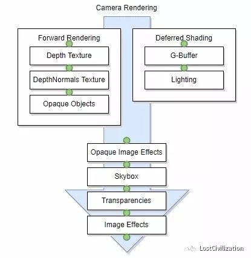
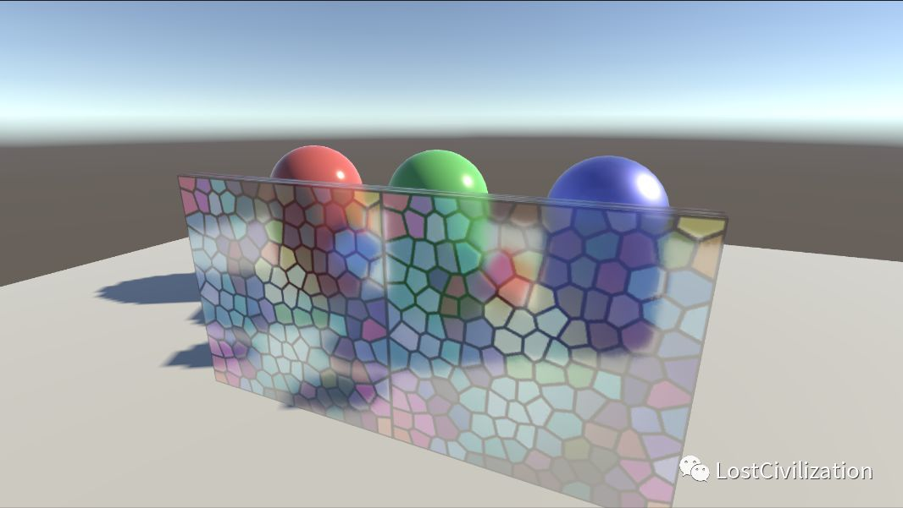
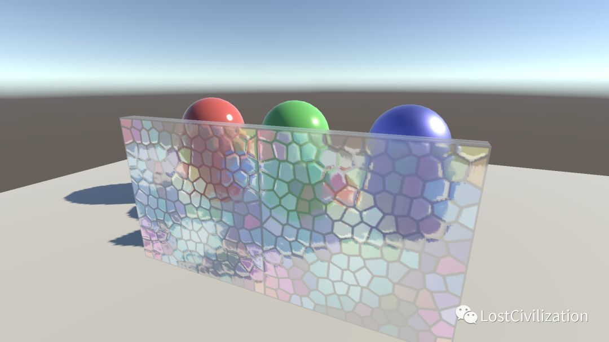
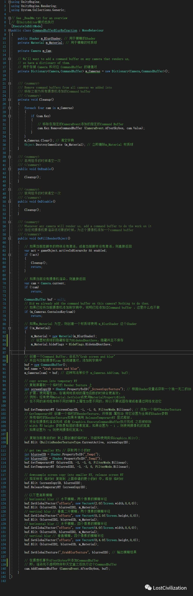
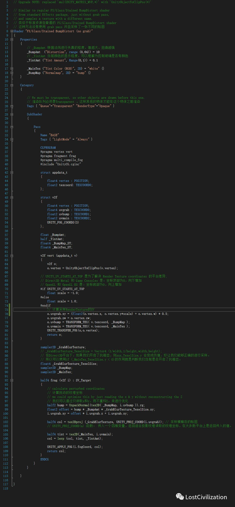
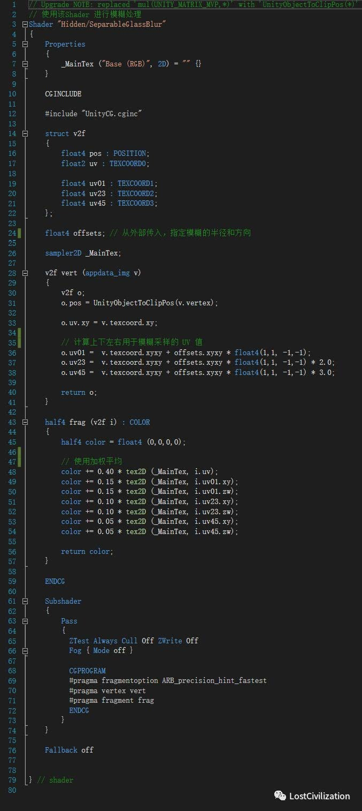

#  Command Buffers In Unity

1、参考文档：1、Unity官方文档:https://docs.unity3d.com/Manual/GraphicsCommandBuffers.html2、Unity官方API:https://docs.unity3d.com/ScriptReference/Rendering.CommandBuffer.html3、CSDN 博客:http://blog.csdn.net/puppet_master/article/details/726699772、概括介绍：Command Buffers 出现的目的是为了扩展Unity的渲染管线（Rendering Pipeline） ，一个Command Buffer 中存储很多绘制命令（Rendering Command），这些 Rendering Command 其实就是OpenGL或者DirectX 中的一些列指令，比如glDrawElement，glClear等。Command Buffer 扩展渲染管线的方法是：预定义一系列的渲染指令，然后在特定的时机去执行这些指令。这些特定的时机是由我们来指定的，下图渲染过程中的绿点说明了这些可以指定的时机：

（图片来自Unity官网）注：Skybox的渲染是在不透明图像效果之后，半透明物体之前，是因为不透明物体的绘制是从前往后，而半透明物体的绘制是从后往前的。Command buffers 可以用来代替 Image Effect ，也可以和Image Effect 一起使用。3、官方毛玻璃案例分析a、效果

b、原理说明原理：在不透明物体和天空盒渲染完成之后，复制渲染图像到一个临时的RT上，然后对其进行模糊处理，将处理的结果应用到一个Shader全局参数上。这么一来，所有在天空盒之后渲染的物体（例如所有的半透明物体）可以采样这个“模糊处理后的场景图像”。这种做法的效果类似 GrabPass ，但是比抓取屏幕的效率更高一些。c、问题1、在Scene视图，目前并不能正确捕捉渲染结果，只能捕捉到天空盒。2、在Android手机上测试，效果有些差别

d、代码分析直接附上注释的代码CommandBufferBlurRefraction.cs

用于渲染毛玻璃的ShaderGlassWithoutGrab.shader

用于模糊的ShaderSeparableBlur.shader

4、Command Buffer总结a、Command Buffer的功能非常强大，它不仅可以用来处理Render Texture，也可以用于直接渲染物体：使用CommandBuffer.DrawMesh 和CommandBuffer.DrawRenderer 两个API 来实现，两者不同之处在于：DrawMesh 可以手动指定变换矩阵，更加灵活，同时也更加复杂。b、使用Command Buffer 渲染物体时，如果给 shaderPass 形参传递了 -1 值，将会执行Shader中的所有Pass，但是需要注意：if (**!**(**LightMode == nullLightMode == ForwardBaseLightMode == ForwardAdd**)){// Command Buffer 执行的渲染结果会出现问题~;}c、执行Command Buffer 的方法：使用**Camera.AddCommandBuffer()**为摄像机指定的渲染事件添加CommandBuffer；也可以使用**Graphics.ExecuteCommandBuffer()**立即执行或**Graphics.ExecuteCommandBufferAsync()**; 异步执行 。d、在使用Command Buffer的时候，一定要特别注意执行的时机和渲染的先后顺序，避免出现不可预估的渲染结果。Command Buffer的特点是可以在指定的时机执行一些特殊的渲染操作，从而达到节省资源和实现特殊效果的目的。Command Buffer 固然好用，切记，不可为了Command Buffer 而刻意使用Command Buffer，这样往往得不偿失~

本次关于Command Buffer 的介绍就到这里，有问题欢迎留言~

- 发表于:  2018-02-09
- 原文链接：http://kuaibao.qq.com/s/20180209G143OZ00?refer=cp_1026
- 腾讯「云+社区」是腾讯内容开放平台帐号（企鹅号）传播渠道之一，根据[《腾讯内容开放平台服务协议》](https://om.qq.com/notice/a/20160429/047194.htm)转载发布内容。