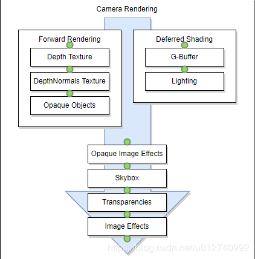
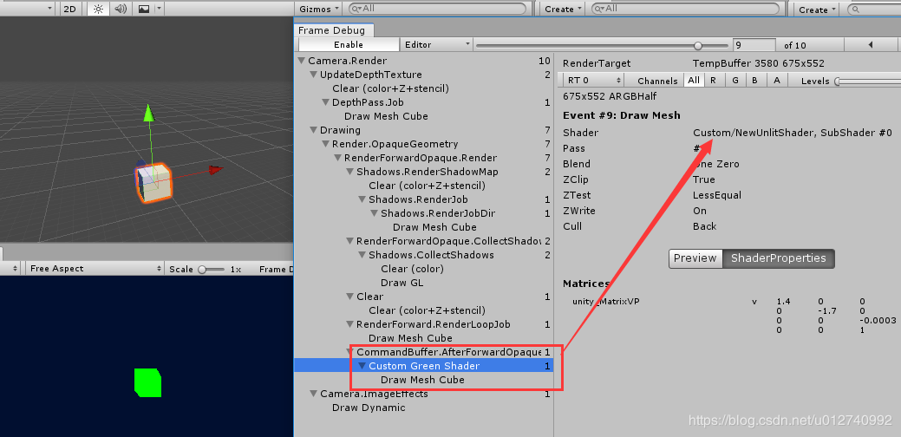
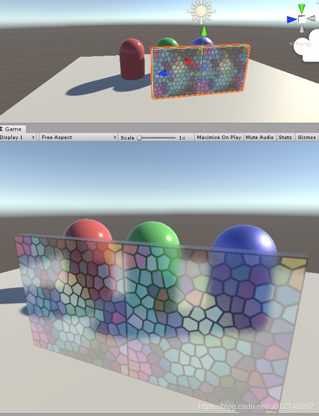

# (转)Unity 的CommandBuffer基础


**CommandBuffer，上 官方文档。 依照官方解释： CommandBuffer携带一系列的渲染命令，依赖相机，用来拓展渲染管线的渲染效果。 而且可以指定在相机渲染的某个点执行本身的拓展渲染。 如下图，我们可以根据参数指定CommandBuffer在绿色的点上添加执行命令。 Command buffers也可以结合屏幕后期效果使用。**
 
 **那CommandBuffer是个什么鬼，先来实现一个最简单的CommandBuffer，先不考虑其它问题。 1，Hierarchy中右键创建一个3D Cube； 2，Project新建一个Unlit Shader，将fixed4 frag (v2f i)修改为绿色。**

```
            fixed4 frag (v2f i) : SV_Target
            {
				return fixed4(0,1,0,1);
            }
1234
```

**3，新建脚本TestCommandBuffer.cs，挂到Cube，脚本挂上2新建的Shader。 TestCommandBuffer.cs ：**

```csharp
using UnityEngine;
using UnityEngine.Rendering;

[ExecuteInEditMode]
public class TestCommandBuffer : MonoBehaviour
{
    public Shader shader;
    private void OnEnable()
    {
        CommandBuffer buf = new CommandBuffer();
        //设置自己的渲染。
        buf.DrawRenderer(GetComponent<Renderer>(), new Material(shader));
        //不透明物体渲染完后执行
        Camera.main.AddCommandBuffer(CameraEvent.AfterForwardOpaque, buf);
    }
}
12345678910111213141516
```

**发现了啥？同是一个Cube，Game中的绿了有木有，而Scene中的依旧。 赶紧打开FrameDebug看看**
 
 **可以看到在Drawing下出现2次Draw Mesh Cube，Cube被渲染了两次，额外多出的一次红色框框那个就是CommandBuffer的渲染。 能看得出，CommandBuffer作用就是在相机渲染的某个阶段，再另外执行自己的额外渲染，至于渲染的结果就看我们怎么用了。**

=============================================================================

**因此，官方由CommandBuffer的特性，展示了模糊透明的例子，我觉得这是个很好的例子，其思路如下： (以下提到的抓取当前屏幕纹理意思是：用CommandBuffer渲染出当前屏幕纹理。) 1，CommandBuffer在本GameObject的OnWillRenderObject()，进行抓屏得到屏幕纹理； 2，将1得到的纹理再用SeparableBlur.shader模糊化； 3，GlassWithoutGrab.shader将2的模糊纹理和自己的主纹理结合，得到模糊透明效果。**

代码文件：
 1，SeparableBlur.shader //(不需挂载目标) 作用：渲染模糊效果。
 2，GlassWithoutGrab.shader //(糊透明玻璃镜体挂的着色器)  作用：等待输入模糊的抓屏纹理，  将自己的主纹理与抓屏输入纹理混合作为输出，得出模糊透明效果。
 3，CommandBufferBlurRefraction.cs //(糊透明玻璃镜体挂的脚本)  作用：抓取当前屏幕纹理并用SeparableBlur.shader渲染出模糊纹理，将模糊纹理传给GlassWithoutGrab.shader混合。**
 

**其代码解读如下：**
 CommandBufferBlurRefraction.cs

```csharp
using UnityEngine;
using UnityEngine.Rendering;
using System.Collections.Generic;

[ExecuteInEditMode]
public class CommandBufferBlurRefraction : MonoBehaviour
{
	public Shader m_BlurShader;
	private Material m_Material;

	private Camera m_Cam;

	// We'll want to add a command buffer on any camera that renders us,
	// so have a dictionary of them.
	private Dictionary<Camera,CommandBuffer> m_Cameras = new Dictionary<Camera,CommandBuffer>();

	// Remove command buffers from all cameras we added into
	private void Cleanup()
	{
		foreach (var cam in m_Cameras)
		{
			if (cam.Key)
			{
				cam.Key.RemoveCommandBuffer (CameraEvent.AfterSkybox, cam.Value);
			}
		}
		m_Cameras.Clear();
		Object.DestroyImmediate (m_Material);
	}

	public void OnEnable()
	{
		Cleanup();
	}

	public void OnDisable()
	{
		Cleanup();
	}

	// Whenever any camera will render us, add a command buffer to do the work on it
	public void OnWillRenderObject()
	{
		var act = gameObject.activeInHierarchy && enabled;
		if (!act)
		{
			Cleanup();
			return;
		}
		
		var cam = Camera.current;
		if (!cam)
			return;

		CommandBuffer buf = null;
		// Did we already add the command buffer on this camera? Nothing to do then.
		if (m_Cameras.ContainsKey(cam))
			return;

		if (!m_Material)
		{
			m_Material = new Material(m_BlurShader);
			m_Material.hideFlags = HideFlags.HideAndDontSave;
		}

		buf = new CommandBuffer();
		buf.name = "Grab screen and blur";
		m_Cameras[cam] = buf;

		// copy screen into temporary RT
        //获取渲染纹理ID
		int screenCopyID = Shader.PropertyToID("_ScreenCopyTexture");
        //用screenCopyID标识，获取一个模板纹理。
        buf.GetTemporaryRT (screenCopyID, -1, -1, 0, FilterMode.Bilinear);
        //BuiltinRenderTextureType.CurrentActive也就是当前屏幕的纹理标识，将其赋值进screenCopyID标识的纹理。
        buf.Blit (BuiltinRenderTextureType.CurrentActive, screenCopyID);
		
		// get two smaller RTs
        //获取2个模板纹理，后面将它们2的效果轮流混合。
		int blurredID = Shader.PropertyToID("_Temp1");
		int blurredID2 = Shader.PropertyToID("_Temp2");
		buf.GetTemporaryRT (blurredID, -2, -2, 0, FilterMode.Bilinear);
		buf.GetTemporaryRT (blurredID2, -2, -2, 0, FilterMode.Bilinear);

        // downsample screen copy into smaller RT, release screen RT
        //将抓屏纹理_ScreenCopyTexture采样填充到_Temp1后释放。
        buf.Blit (screenCopyID, blurredID);
		buf.ReleaseTemporaryRT (screenCopyID);

        // horizontal blur
        //修改SeparableBlur.shader的全局参数offsets，使其产生各个方向的模糊效果来叠加增强效果。
        //（如果着色器不在 Properties模块中暴露某个参数，将使用全局属性）
        buf.SetGlobalVector("offsets", new Vector4(2.0f/Screen.width,0,0,0));
        //使用m_Material渲染blurredID结果赋值给blurredID2。
        buf.Blit (blurredID, blurredID2, m_Material);
		// vertical blur
		buf.SetGlobalVector("offsets", new Vector4(0,2.0f/Screen.height,0,0));
		buf.Blit (blurredID2, blurredID, m_Material);
		// horizontal blur
		buf.SetGlobalVector("offsets", new Vector4(4.0f/Screen.width,0,0,0));
		buf.Blit (blurredID, blurredID2, m_Material);
		// vertical blur
		buf.SetGlobalVector("offsets", new Vector4(0,4.0f/Screen.height,0,0));
		buf.Blit (blurredID2, blurredID, m_Material);

        //得到透明效果纹理后，赋值给GlassWithoutGrab.shader的_GrabBlurTexture混合得出模糊透明。
        buf.SetGlobalTexture("_GrabBlurTexture", blurredID);

		cam.AddCommandBuffer (CameraEvent.AfterSkybox, buf);
	}	
}

123456789101112131415161718192021222324252627282930313233343536373839404142434445464748495051525354555657585960616263646566676869707172737475767778798081828384858687888990919293949596979899100101102103104105106107108109110111112
```

SeparableBlur.shader

```c
// Upgrade NOTE: replaced 'mul(UNITY_MATRIX_MVP,*)' with 'UnityObjectToClipPos(*)'

Shader "Hidden/SeparableGlassBlur" {
	Properties {
		_MainTex ("Base (RGB)", 2D) = "" {}
	}

	CGINCLUDE
	
	#include "UnityCG.cginc"
	
	struct v2f {
		float4 pos : POSITION;
		float2 uv : TEXCOORD0;

		float4 uv01 : TEXCOORD1;
		float4 uv23 : TEXCOORD2;
		float4 uv45 : TEXCOORD3;
	};
	
	float4 offsets;
	
	sampler2D _MainTex;
	//偏移定点uv，使其读取到周围颜色值进行混合。
	v2f vert (appdata_img v) {
		v2f o;
		o.pos = UnityObjectToClipPos(v.vertex);

		o.uv.xy = v.texcoord.xy;

		o.uv01 =  v.texcoord.xyxy + offsets.xyxy * float4(1,1, -1,-1);
		o.uv23 =  v.texcoord.xyxy + offsets.xyxy * float4(1,1, -1,-1) * 2.0;
		o.uv45 =  v.texcoord.xyxy + offsets.xyxy * float4(1,1, -1,-1) * 3.0;

		return o;
	}
	//混合颜色值。
	half4 frag (v2f i) : COLOR {
		half4 color = float4 (0,0,0,0);

		color += 0.40 * tex2D (_MainTex, i.uv);
		color += 0.15 * tex2D (_MainTex, i.uv01.xy);
		color += 0.15 * tex2D (_MainTex, i.uv01.zw);
		color += 0.10 * tex2D (_MainTex, i.uv23.xy);
		color += 0.10 * tex2D (_MainTex, i.uv23.zw);
		color += 0.05 * tex2D (_MainTex, i.uv45.xy);
		color += 0.05 * tex2D (_MainTex, i.uv45.zw);
		
		return color;
	}

	ENDCG
	
Subshader {
 Pass {
	  ZTest Always Cull Off ZWrite Off
	  Fog { Mode off }

      CGPROGRAM
      #pragma fragmentoption ARB_precision_hint_fastest
      #pragma vertex vert
      #pragma fragment frag
      ENDCG
  }
}

Fallback off


} 
12345678910111213141516171819202122232425262728293031323334353637383940414243444546474849505152535455565758596061626364656667686970
```

GlassWithoutGrab.shader

```c
// Upgrade NOTE: replaced 'mul(UNITY_MATRIX_MVP,*)' with 'UnityObjectToClipPos(*)'

// Similar to regular FX/Glass/Stained BumpDistort shader
// from standard Effects package, just without grab pass,
// and samples a texture with a different name.

Shader "FX/Glass/Stained BumpDistort (no grab)" {
Properties {
	_BumpAmt  ("Distortion", range (0,64)) = 10
	_TintAmt ("Tint Amount", Range(0,1)) = 0.1
	_MainTex ("Tint Color (RGB)", 2D) = "white" {}
	_BumpMap ("Normalmap", 2D) = "bump" {}
}

Category {

	// We must be transparent, so other objects are drawn before this one.
	Tags { "Queue"="Transparent" "RenderType"="Opaque" }

	SubShader {

		Pass {
			Name "BASE"
			Tags { "LightMode" = "Always" }
			
		CGPROGRAM
		#pragma vertex vert
		#pragma fragment frag
		#pragma multi_compile_fog
		#include "UnityCG.cginc"

		struct appdata_t {
			float4 vertex : POSITION;
			float2 texcoord: TEXCOORD0;
		};

		struct v2f {
			float4 vertex : POSITION;
			float4 uvgrab : TEXCOORD0;
			float2 uvbump : TEXCOORD1;
			float2 uvmain : TEXCOORD2;
			UNITY_FOG_COORDS(3)
		};

		float _BumpAmt;
		half _TintAmt;
		float4 _BumpMap_ST;
		float4 _MainTex_ST;

		v2f vert (appdata_t v)
		{
			v2f o;
			o.vertex = UnityObjectToClipPos(v.vertex);
			#if UNITY_UV_STARTS_AT_TOP
			float scale = -1.0;
			#else
			float scale = 1.0;
			#endif
			//将顶点裁剪空间下的坐标，计算NDC空间上的位置后，映射到模糊纹理的uv。
			o.uvgrab.xy = (float2(o.vertex.x, o.vertex.y*scale) + o.vertex.w) * 0.5;
			o.uvgrab.zw = o.vertex.zw;
			o.uvbump = TRANSFORM_TEX( v.texcoord, _BumpMap );
			o.uvmain = TRANSFORM_TEX( v.texcoord, _MainTex );
			UNITY_TRANSFER_FOG(o,o.vertex);
			return o;
		}
		//抓屏得到的模糊纹理会赋值到此。(因为Properties没有定义_GrabBlurTexture，所以默认使用全局的参数)
		sampler2D _GrabBlurTexture;
		float4 _GrabBlurTexture_TexelSize;
		sampler2D _BumpMap;
		sampler2D _MainTex;

		half4 frag (v2f i) : SV_Target
		{
			// calculate perturbed coordinates
			// we could optimize this by just reading the x & y without reconstructing the Z
			half2 bump = UnpackNormal(tex2D( _BumpMap, i.uvbump )).rg;
			float2 offset = bump * _BumpAmt * _GrabBlurTexture_TexelSize.xy;
			i.uvgrab.xy = offset * i.uvgrab.z + i.uvgrab.xy;
	
			//对模糊纹理采样
			half4 col = tex2Dproj (_GrabBlurTexture, UNITY_PROJ_COORD(i.uvgrab));
			half4 tint = tex2D(_MainTex, i.uvmain);
			//模糊纹理与主纹理混合得出模糊透明效果
			col = lerp (col, tint, _TintAmt);
			UNITY_APPLY_FOG(i.fogCoord, col);
			return col;
		}
		ENDCG
		}
	}

}

}
```