#  			[Unity CommandBuffer的一些学习整理](https://www.cnblogs.com/hont/p/8968804.html) 		


## 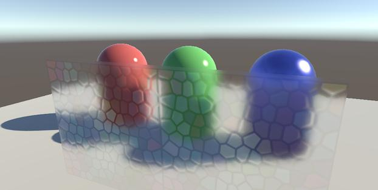

##  

## 1.前言

近期在整理CommandBuffer这块资料，之前的了解一直较为混乱。

算不上新东西了，但个人觉得有些时候要比加一个摄像机再转RT廉价一些，至少省了深度排序这些操作。

本文使用两个例子讲解CommandBuffer如何使用，但在此之前稍稍总结一下官方CommandBuffer的案例。

 

 

## 2.官方案例

案例地址如下：

<https://blogs.unity3d.com/cn/2015/02/06/extending-unity-5-rendering-pipeline-command-buffers/>

文章尾部有Demo下载链接。

 

该demo包含3个例子。

第一个例子BlurryRefraction，和新建摄像机渲染RT类似，在渲染透明对象之前渲染屏幕，并做模糊处理。然后丢给shader转换到对应的UV空间，转换的代码和Grab一样不做赘述。

第二个例子DeferredCustomLights，这里灯光的容器模型和第三个例子的贴花容器模型差不多，都是为了空间剔除而建立的模型，灯光部分直接拿到GBuffer的数据进行绘制。

第三个例子DeferredDecals，和第二个差不多，容器模型直接是方块，而方块的投影方式又有点像地形的三方向投影。

 

 

## 3.学习案例

 

### 3.1 - 在延迟渲染环境下创建一个standard小球

总的来说坑还是蛮多的，unity的pbr这块本身和管线有所交互，所以commandBuffer要在光照和GBuffer两个阶段做插入。

其实最后光照还是有一些问题，所以暂时得出结论不要尝试直接绘制延迟光照的材质物体。

但如果是普通的vf shader没有太多问题，放在屏幕特效前做插入即可。

总之可以算作一次实践。

 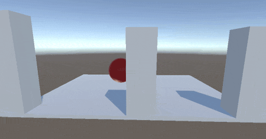

这是完成效果。

 

那么从头开始，首先按照常规思路是在GBuffer之后绘制一个球。

初始代码：

[](javascript:void(0);)

```
void OnEnable()
{
    mCacheCommandBuffer = new CommandBuffer();
    mCacheCommandBuffer.name = "TestCommandBuffer";
    mCacheCommandBuffer.DrawRenderer(testRenderer, testMaterial, 0, -1);
    Camera.main.AddCommandBuffer(CameraEvent.AfterGBuffer, mCacheCommandBuffer);
}
```

[](javascript:void(0);)

释放：

```
void OnDisable()
{
    Camera.main.RemoveCommandBuffer(CameraEvent.AfterGBuffer, mCacheCommandBuffer);
    mCacheCommandBuffer.Dispose();
}
```

 

释放时Dispose要放在RemoveCommandBuffer之后调用。

DrawRenderer比起DrawMesh多了很多自由度，但缺点是遇到多维子材质会比较棘手。

这里**第四个参数是对应shader的pass，如果填写-1则所有pass都绘制**。

 

 

绘制效果如下

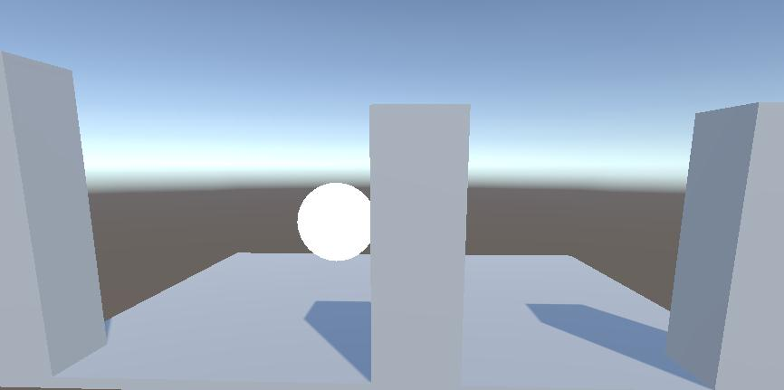

(直接画肯定是有问题的)

 

 

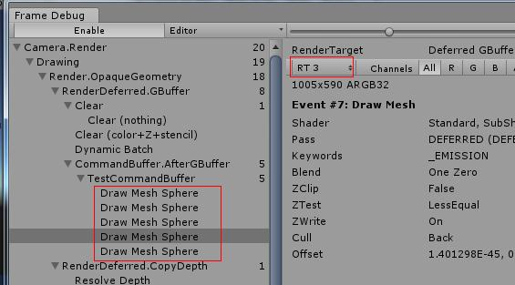

打开FrameDebugger看问题，把standard里所有的pass都绘制了出来这不是想要的。

这里看了下standard的pass，第三个pass针对的是延迟光照，后面都用pass 3来绘制。

 

而且还有个问题RT3的自发光信息不正确。

 

**unity的GBuffer中四个RT分别是RT0-漫反射,RT1-高光,RT2-屏幕法线,RT3-自发光**。

翻阅了一下standard shader源码，发现可能是缺失了间接光照信息，而间接光照信息可能没有正确的初始化

不过发现了这么一个东西

[](javascript:void(0);)

```
void fragDeferred(
    VertexOutputDeferred i,
    out half4 outGBuffer0 : SV_Target0,
    out half4 outGBuffer1 : SV_Target1,
    out half4 outGBuffer2 : SV_Target2,
    out half4 outEmission : SV_Target3          // RT3: emission (rgb), --unused-- (a)
#if defined(SHADOWS_SHADOWMASK) && (UNITY_ALLOWED_MRT_COUNT > 4)
    , out half4 outShadowMask : SV_Target4       // RT4: shadowmask (rgba)
#endif
)
{
    //...
}
```

[](javascript:void(0);)

 

也就是说可以自己定义输出的GBuffer，而且也可以指定只输出某一项GBuffer的值

[](javascript:void(0);)

```
void frag(
    v2f i,
    out half4 outEmission : SV_Target3
)
{
    outEmission = 0;
}
```

[](javascript:void(0);)

有时候这个还是蛮管用的，因为在CommandBuffer里Blit很多通道拷贝不了(应该是我技术不行)。

 

绘制多加一次:

```
mCacheCommandBuffer.DrawRenderer(testRenderer, testMaterial, 0, 3);
mCacheCommandBuffer.DrawRenderer(testRenderer, testMaterial_fix, 0, -1);
Camera.main.AddCommandBuffer(CameraEvent.AfterGBuffer, mCacheCommandBuffer);
```

 

解决是解决了，但是和天空盒接触的地方就会没有光照。

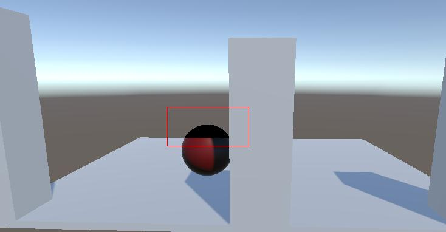

 

查看了FrameDebugger，确认是光照部分出了问题，踩了一些坑之后发现在AfterLighting处再绘制一次即可。

[](javascript:void(0);)

```
void OnEnable()
{
    mCacheCommandBuffer = new CommandBuffer();
    mCacheCommandBuffer.name = "TestCommandBuffer";

    mCacheCommandBuffer.DrawRenderer(testRenderer, testMaterial, 0, 3);

    Camera.main.AddCommandBuffer(CameraEvent.AfterGBuffer, mCacheCommandBuffer);

    mCacheCommandBuffer2 = new CommandBuffer();
    mCacheCommandBuffer2.name = "TestCommandBuffer2";
    mCacheCommandBuffer2.DrawRenderer(testRenderer, testMaterial, 0, 0);
    Camera.main.AddCommandBuffer(CameraEvent.AfterLighting, mCacheCommandBuffer2);
}
```

[](javascript:void(0);)

 

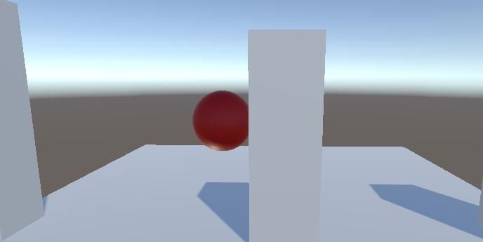

 

但这样依然有很多问题，例如只支持平行光，而且高光位置是错误的。应该是光照的初始化问题。

所以这个例子只能算作实践，总之不推荐这类对象的绘制。

 

 

### 3.2 - 使用CommandBuffer对挖洞模型进行模糊

之前别人做过，觉得这个案例有些意思，自己试了一下。

完成效果如下

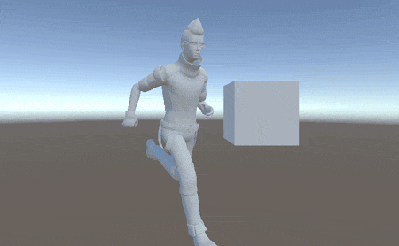

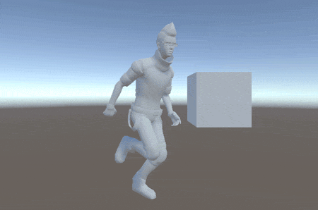

这是完成效果，使用Stencil挖洞可以达到模拟半透明的效果，但如果渐变速度较慢时则会造成视觉上的不适。

而通过stencil来标记主角在屏幕中的位置，然后对主角在挖洞的基础上再做一次高斯模糊可以缓解这种视觉上的不适。

 

 

直接在原始模型上做Stencil会导致在shadow阶段Stencil数据被清除。

(2018/12/14补充: 在unity的camera中有这样一个接口:Camera.main.clearStencilAfterLightingPass，也可以尝试使用)

 

 

但是先不急着改变CommandBuffer的位置，先切换到正向渲染下看看Stencil不被清除的结果

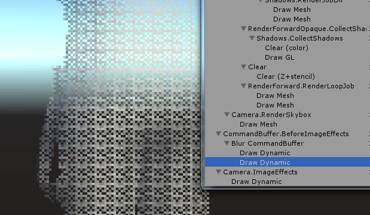

可以看见即使Stencil生效，挖洞区域的Stencil也被挖掉了。所以必须想另外一个办法覆盖这个坏的Stencil。

 

 

 

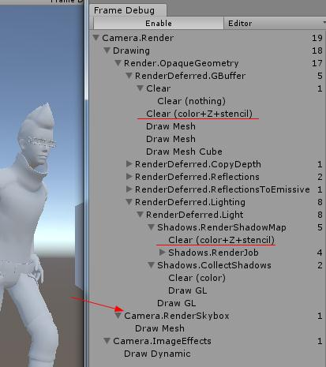

我的思路是通过DrawRenderer在RenderSkybox之后绘制一个alpha为0的主角Renderer，并且带有正常Stencil，来覆盖掉旧的。

 

也就是需要两个CommandBuffer

[](javascript:void(0);)

```
mStencilFixCommandBuffer = new CommandBuffer();
mStencilFixCommandBuffer.name = "StencilFix";

for (int i = 0; i < playerRenderers.Length; i++)
{
    var item = playerRenderers[i];
    mStencilFixCommandBuffer.DrawRenderer(item, playerReplaceMaterial, 0, -1);
}

Camera.main.AddCommandBuffer(CameraEvent.AfterSkybox, mStencilFixCommandBuffer);
```

[](javascript:void(0);)

 

```
Camera.main.AddCommandBuffer(CameraEvent.BeforeReflections, mBlurCommandBuffer);
```

 

可以看见这个正确的Stencil已经绘制上去了(当然也可以用这个方法修改深度，GBuffer)


 

然后就是模糊采样的问题，在CommandBuffer中你不能插入Lambda的CPU代码去执行异步内容

所以这里用几个RT来回切换做到重复采样，这里参考官方CommandBuffer里的第一个例子，也是需要用两个RT来回切换。

 

CommandBuffer里新建RT建议像下面这样，而不是用RenderTexture创建：

```
mBlurTempRT1 = Shader.PropertyToID("BlurTempRT1");
mBlurCommandBuffer.GetTemporaryRT(mBlurTempRT1, -1, -1, 0);
```

当然这么用也取不出RT对象，只能通过索引进行操作。

**这里GetTemporaryRT方法第二和三个参数指定了分辨率，-1为默认值，-2为一半大小分辨率，-3为1/3以此类推**。

 

这时我遇到了第二个坑，**Stencil信息不能通过通道单独拷贝出来，只有在和CameraTarget进行Blit操作时，才能读到Stencil信息**。

读Stencil信息是这样的，必须Blit的目标通道有Stencil才行（有待查证），比如下面这种就有问题:

```
mBlurCommandBuffer.Blit(BuiltinRenderTextureType.CameraTarget, mBlurTempRT1, mat);
mBlurCommandBuffer.Blit(mBlurTempRT1, BuiltinRenderTextureType.CameraTarget);
```


正确用法：

[](javascript:void(0);)

```
mBlurCommandBuffer.Blit(BuiltinRenderTextureType.CameraTarget, mBlurTempRT1);

for (int i = 0; i < sampleNum - 1; i++)
{
    mBlurCommandBuffer.Blit(mBlurTempRT1, BuiltinRenderTextureType.CameraTarget, blurMaterial);
    mBlurCommandBuffer.Blit(BuiltinRenderTextureType.CameraTarget, mBlurTempRT1);
}

mBlurCommandBuffer.Blit(mBlurTempRT1, BuiltinRenderTextureType.CameraTarget, blurMaterial);
```

[](javascript:void(0);)

所以这里的模糊迭代这么做(这里理解的不太清晰，代码还可以优化)

 

 最后效果也就达到了

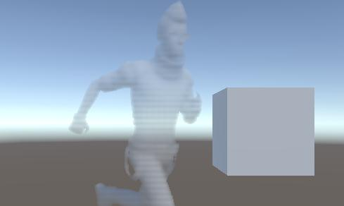

 

 

 

就写到这里，本来还想做一个用到CommandBuffer的UI面板3D模型展示，但后来还是遇到了一些问题。

所以还是创建一个新相机吧。

 

 

测试工程地址:<https://gitee.com/Hont/CommandBufferExample>

(unity 2017.4)