# Rendering 6

Bumpiness

- Perturb normals to simulate bumps.
- Compute normals from a height field.
- Sample and blend normal maps.
- Convert from tangent space to world space.

This is the sixth part of a tutorial series about rendering. The [previous part](https://catlikecoding.com/unity/tutorials/rendering/part-5) added support for more complex lighting. This time, we'll create the illusion of more complex surfaces.

This tutorial was made with Unity 5.4.0f3.

 					
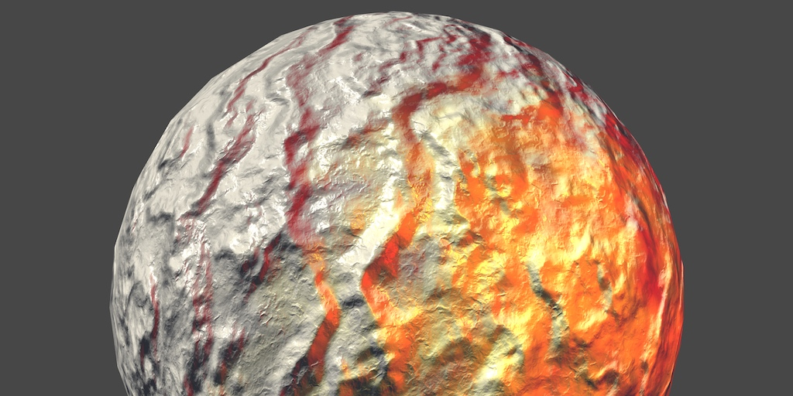 					It doesn't look like a smooth sphere anymore. 				

## Bump Mapping

We can use albedo textures to create materials with complex  color patterns. We can use normals to adjust the apparent surface  curvature. With these tools, we can produces all kinds of surfaces.  However, the surface of a single triangle will always be smooth. It can  only interpolate between three normal vectors. So it cannot represent a  rough or varied surface. This becomes obvious when forsaking an albedo  texture and using only a solid color.

A good example of this flatness is a simple quad. Add one to the  scene and make it point upwards, by rotating it 90° around the X axis.  Give it our *Lighting* material, without textures and with a fully white tint.

 						
 						Perfectly flat quad. 					

Because the default skybox is very bright, it is hard to see the  contribution of the other lights. So let's turn it off for this  tutorial. You can do so by decreasing the *Ambient Intensity*  to zero in the lighting settings. Then only enable the main directional  light. Find a good point of view in the scene view so you can some  light differences on the quad.

 						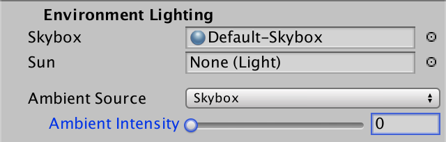 						 						No ambient, only the main directional light. 					

How could we make this quad appear non-flat? We could fake  roughness by baking shading into the albedo texture. However, that would  be completely static. If the lights change, or the objects move, so  should the shading. If it doesn't, the illusion will be broken. And in  case of specular reflections, even the camera isn't allowed to move.

We can change the normals to create the illusion of a curving  surface. But there are only four normals per quad, one for each vertex.  This can only produce smooth transitions. If we want a varied and rough  surface, we need more normals.

We could subdivide our quad into smaller quads. This gives us  more normals to work with. In fact, once we have more vertices, we can  also move them around. Then we don't need the illusion of roughness, we  can make an actual rough surface! But the sub-quads still have the same  problem. Are we going to subdivide those too? That will lead to huge  meshes with an enormous amount of triangles. That is fine when creating  3D models, but isn't feasible for real-time use in games.

### Height Maps

A rough surface has a non-uniform elevation, compared to a flat  surface. If we store this elevation data in a texture, we might be able  to use it generate normal vectors per fragment, instead of per vertex.  This idea is known as bump mapping, and was first formulated by James  Blinn.

Here is a height map to accompany our marble texture. It is an  RGB texture with each channel set to the same value. Import it into your  project, with the default import settings.

 							
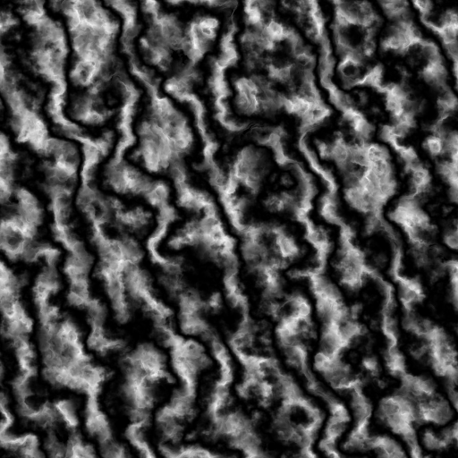 							Height map for marble. 						

Add a `_HeightMap` texture property to *My First Lighting Shader*.  As it'll use the same UV as our albedo texture, it doesn't need its own  scale and offset parameters. The default texture doesn't really matter,  as long as it's uniform. Gray will do.

```
	Properties {
		_Tint ("Tint", Color) = (1, 1, 1, 1)
		_MainTex ("Albedo", 2D) = "white" {}
		[NoScaleOffset] _HeightMap ("Heights", 2D) = "gray" {}
		[Gamma] _Metallic ("Metallic", Range(0, 1)) = 0
		_Smoothness ("Smoothness", Range(0, 1)) = 0.1
	}
```

 							
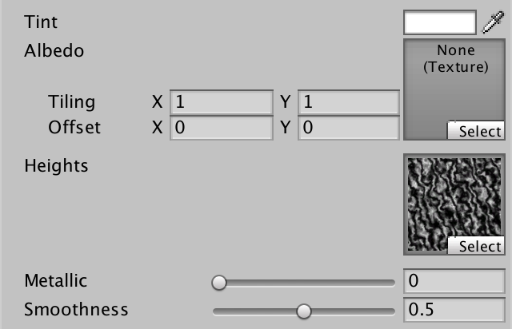 							Material with height map. 						

Add the matching variable to the *My Lighting* include file, so we can access the texture. Let's see how it looks, by factoring it into the albedo.

```
float4 _Tint;
sampler2D _MainTex;
float4 _MainTex_ST;

sampler2D _HeightMap;

…

float4 MyFragmentProgram (Interpolators i) : SV_TARGET {
	i.normal = normalize(i.normal);

	float3 viewDir = normalize(_WorldSpaceCameraPos - i.worldPos);

	float3 albedo = tex2D(_MainTex, i.uv).rgb * _Tint.rgb;
	albedo *= tex2D(_HeightMap, i.uv);

	…
}
```

 							
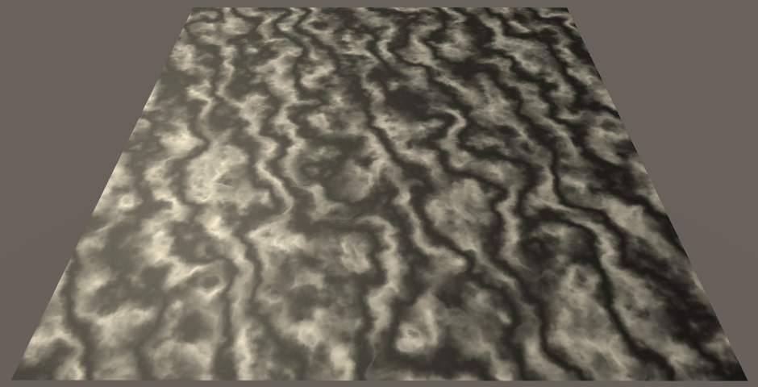 							Using heights as colors. 						

### Adjusting Normals

Because our fragment normals are going to become more complex,  let's move their initialization to a separate function. Also, get rid  the height map test code.

```
void InitializeFragmentNormal(inout Interpolators i) {
	i.normal = normalize(i.normal);
}

float4 MyFragmentProgram (Interpolators i) : SV_TARGET {
	InitializeFragmentNormal(i);

	float3 viewDir = normalize(_WorldSpaceCameraPos - i.worldPos);

	float3 albedo = tex2D(_MainTex, i.uv).rgb * _Tint.rgb;
//	albedo *= tex2D(_HeightMap, i.uv);

	…
}
```

Because we're currently working with a quad that lies in the XZ  plane, its normal vector is always (0, 1, 0). So we can use a constant  normal, ignoring the vertex data. Let's do that for now, and worry about  different orientations later.

```
void InitializeFragmentNormal(inout Interpolators i) {
	i.normal = float3(0, 1, 0);
	i.normal = normalize(i.normal);
}
```

How do we include the height data in this? A naive approach is  to use the height as the normal's Y component, before normalizing.

```
void InitializeFragmentNormal(inout Interpolators i) {
	float h = tex2D(_HeightMap, i.uv);
	i.normal = float3(0, h, 0);
	i.normal = normalize(i.normal);
}
```

 							
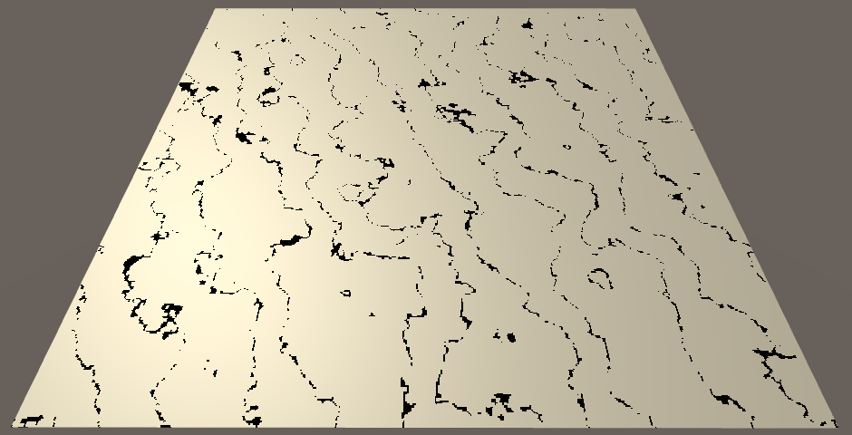 							Using heights as normals. 						

This doesn't work, because normalization converts every vector  back to (0, 1, 0). The black lines appear where the heights are zero,  because normalization fails in those cases. We need a different method.

### Finite Difference

Because we're working with texture data, we have  two-dimensional data. There's the U and V dimensions. The heights can be  thought of as going in a third dimension, upwards. We could say that  the texture represents a function, f(u,v)=h

. Let's begin by limiting ourselves to only the U dimension. So the function is reduced to 

f(u)=h

. Can we derive normal vectors from this function?

If we knew the slope of the function, then we could use it to  compute its normal at any point. The slope is defined by the rate of  change of h

. This is its derivative, 

h′

. Because 

h

 is the result of a function, 

h′

 is the result of a function as well. So we have the derivative function 

f′(u)=h′

.

Unfortunately, we do not know what these function are. But we  can approximate them. We can compare the heights at two different points  in our texture. For example, at the extreme ends, using U coordinates 0  and 1. The difference between those two samples is the rate of change  between those coordinates. Expressed as a function, that's f(1)−f(0)

. We can use this to construct a tangent vector, 

⎡⎢⎣1f(1)−f(0)0⎤⎥⎦

.

 							
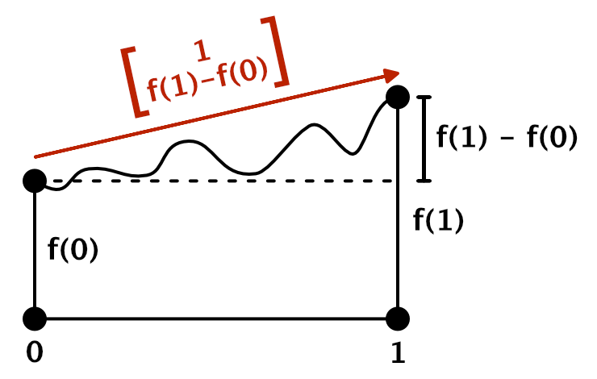							Tangentvectorfrom[0f(0)]

 to 

[1f(1)]

. 						

That's of course a very crude approximation of the real tangent  vector. It treats the entire texture as a linear slope. We can do  better by sampling two points that are closer together. For example, U  coordinates 0 and ½. The rate of change between those two points is f(12)−f(0)

,  per half a unit of U. Because it is easier to deal with rate of change  per whole units, we divide it by the distance between the points, so we  get 

f(12)−f(0)12=2(f(12)−f(0))

. That gives us the tangent vector 

⎡⎢ ⎢⎣12(f(12)−f(0))0⎤⎥ ⎥⎦

.

In general, we have to do this relative to the U coordinate of  every fragment that we render. The distance to the next point is defined  by a constant delta. So the derivative function is approximated by f′(u)≈f(u+δ)−f(u)δ

.

The smaller δ becomes, the better we approximate the true  derivative function. Of course it cannot become zero, but when taken to  its theoretical limit, you get f′(u)=limδ→0f(u+δ)−f(u)δ

.  This method of approximating a derivative is known as the finite  difference method.  With that, we can construct tangent vectors at any  point, 

⎡⎢⎣1f′(u)0⎤⎥⎦

.

### From Tangent to Normal

What value could we use for δ in our shader? The smallest  sensible difference would cover a single texel of our texture. We can  retrieve this information in the shader via a `**float4**` variable with the `_TexelSize` suffix. Unity sets those variables, similar to `_ST` variables.

```
sampler2D _HeightMap;
float4 _HeightMap_TexelSize;
```

 							What is stored in `_TexelSize` variables? 							 						

Now we can sample the texture twice, compute the height  derivative, and construct a tangent vector. Let's directly use that as  our normal vector.

```
	float2 delta = float2(_HeightMap_TexelSize.x, 0);
	float h1 = tex2D(_HeightMap, i.uv);
	float h2 = tex2D(_HeightMap, i.uv + delta);
	i.normal = float3(1, (h2 - h1) / delta.x, 0);

	i.normal = normalize(i.normal);
```

Actually, because we're normalizing anyway, we can scale our  tangent vector by δ. This eliminates a division and improves precision.

```
	i.normal = float3(delta.x, h2 - h1, 0);
```

 							
 							Using tangents as normals. 						

We get a very pronounced result. That's because the heights  have a range of one unit, which produces very steep slopes. As the  perturbed normals don't actually change the surface, we don't want such  huge differences. We can scale the heights by an arbitrary factor. Let's  reduce the range to a single texel. We can do that by multiplying the  height difference by δ, or by simply replacing δ with 1 in the tangent.

```
	i.normal = float3(1, h2 - h1, 0);
```

 							
 							Scaled heights. 						

This is starting to look good, but the lighting is wrong. It is  far too dark. That's because we're directly using the tangent as a  normal. To turn it into an upward-pointing normal vector, we have to  rotate the tangent 90° around the Z axis.

```
	i.normal = float3(h1 - h2, 1, 0);
```

 							
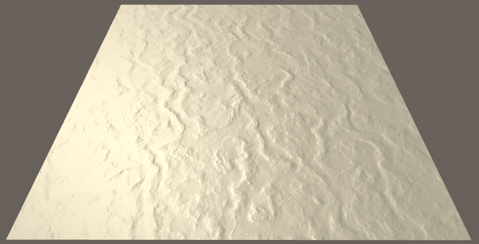 							Using actual normals. 						

 							How does that vector rotation work? 							 						

### Central Difference

We've used finite difference approximations to create normal  vectors. Specifically, by using the forward difference method. We take a  point, and then look in one direction to determine the slope. As a  result, the normal is biased in that direction. To get a better  approximation of the normal, we can instead offset the sample points in  both directions. This centers the linear approximation on the current  point, and is known as the central difference method. This changes the  derivative function to f′(u)=limδ→0f(u+δ2)−f(u−δ2)δ

.

```
	float2 delta = float2(_HeightMap_TexelSize.x * 0.5, 0);
	float h1 = tex2D(_HeightMap, i.uv - delta);
	float h2 = tex2D(_HeightMap, i.uv + delta);
	i.normal = float3(h1 - h2, 1, 0);
```

This shifts the bumps slightly, so they are better aligned with the height field. Besides that, their shape doesn't change.

### Using Both Dimensions

The normals that we have created only take the change along U  into account. We've been using the partial derivative of the function f(u,v)

 with respect to 

u

. That's 

f′u(u,v)

, or just 

f′u

 for short. We can also create normals along V, by using 

f′v

. In that case, the tangent vector is 

⎡⎢⎣0f′v1⎤⎥⎦

 and the normal vector is 

⎡⎢⎣01−f′v⎤⎥⎦

.

```
	float2 du = float2(_HeightMap_TexelSize.x * 0.5, 0);
	float u1 = tex2D(_HeightMap, i.uv - du);
	float u2 = tex2D(_HeightMap, i.uv + du);
	i.normal = float3(u1 - u2, 1, 0);

	float2 dv = float2(0, _HeightMap_TexelSize.y * 0.5);
	float v1 = tex2D(_HeightMap, i.uv - dv);
	float v2 = tex2D(_HeightMap, i.uv + dv);
	i.normal = float3(0, 1, v1 - v2);

	i.normal = normalize(i.normal);
```

 							
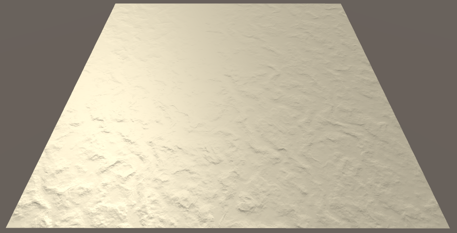 							Normals along V. 						

We now have access to both the U and V tangents. Together,  these vectors describe the surface of the height field at our fragment.  By computing their cross product, we find the normal vector of the 2D  height field.

```
	float2 du = float2(_HeightMap_TexelSize.x * 0.5, 0);
	float u1 = tex2D(_HeightMap, i.uv - du);
	float u2 = tex2D(_HeightMap, i.uv + du);
	float3 tu = float3(1, u2 - u1, 0);

	float2 dv = float2(0, _HeightMap_TexelSize.y * 0.5);
	float v1 = tex2D(_HeightMap, i.uv - dv);
	float v2 = tex2D(_HeightMap, i.uv + dv);
	float3 tv = float3(0, v2 - v1, 1);

	i.normal = cross(tv, tu);
	i.normal = normalize(i.normal);
```

 							 							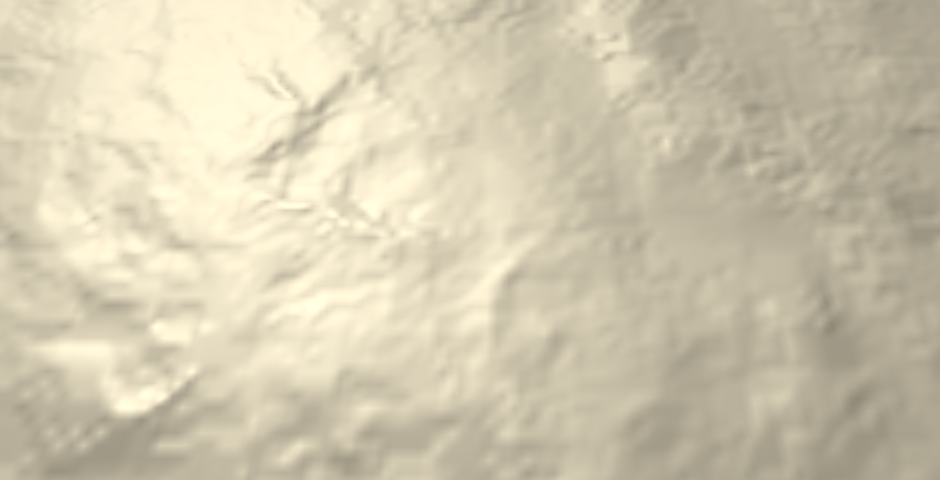 							Complete normals. 						

 							What's a cross product? 							 						

When you calculate the cross product with the tangent vectors, you'll see that ⎡⎢⎣0f′v1⎤⎥⎦×⎡⎢⎣1f′u0⎤⎥⎦=⎡⎢⎣−f′u1−f′v⎤⎥⎦

. So we can construct the vector directly, instead of having to rely on the `cross` function.

```
void InitializeFragmentNormal(inout Interpolators i) {
	float2 du = float2(_HeightMap_TexelSize.x * 0.5, 0);
	float u1 = tex2D(_HeightMap, i.uv - du);
	float u2 = tex2D(_HeightMap, i.uv + du);
//	float3 tu = float3(1, u2 - u1, 0);

	float2 dv = float2(0, _HeightMap_TexelSize.y * 0.5);
	float v1 = tex2D(_HeightMap, i.uv - dv);
	float v2 = tex2D(_HeightMap, i.uv + dv);
//	float3 tv = float3(0, v2 - v1, 1);

//	i.normal = cross(tv, tu);
	i.normal = float3(u1 - u2, 1, v1 - v2);
	i.normal = normalize(i.normal);
}
```

unitypackage

## Normal Mapping

While bump mapping works, we have to perform multiple texture  samples and finite difference calculations. This seems like a waste, as  the resulting normal should always be the same. Why do all this work  every frame? We can do it once and store the normals in a texture.

 						Does this work with texture filtering? 						 					

This means that we need a normal map. I could provide one, but we can let Unity do the work for us. Change the *Texture Type* of the height map to *Normal Map*.  Unity automatically switches the texture to use trilinear filtering,  and assumes that we want to use the grayscale image data to generate a  normal map. This is exactly what we want, but change the *Bumpiness* to a much lower value, like 0.05.

 						 						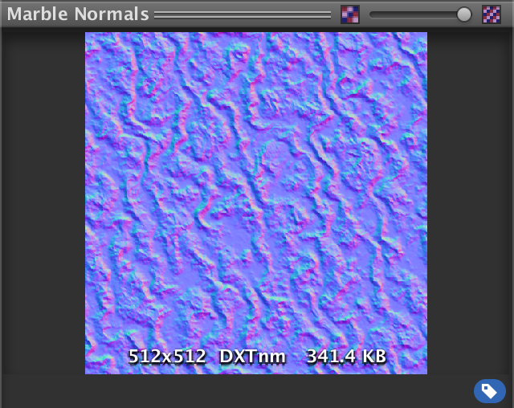 						Generating normals from heights. 					

After applying the import settings, Unity will compute the  normal map. The original height map still exists, but Unity internally  uses the generated map.

Like we did when visualizing normals as colors, they have to be adjusted to fit inside the 0–1 range. So they are stored as N+12

.  This would suggest that flat areas will appear light green. However,  they appear light blue instead. That's because the most common  convention for normal maps is to store the up direction in the Z  component. The Y and Z coordinates are swapped, from Unity's point of  view.

### Sampling the Normal Map

Because a normal map is quite different than a height map, rename the shader property accordingly.

```
	Properties {
		_Tint ("Tint", Color) = (1, 1, 1, 1)
		_MainTex ("Albedo", 2D) = "white" {}
		[NoScaleOffset] _NormalMap ("Normals", 2D) = "bump" {}
//		[NoScaleOffset] _HeightMap ("Heights", 2D) = "gray" {}
		[Gamma] _Metallic ("Metallic", Range(0, 1)) = 0
		_Smoothness ("Smoothness", Range(0, 1)) = 0.1
	}
```

 							
 							Now using a normal map. 						

We can remove all the height map code and replace it with a single texture sample, followed by a normalization.

```
sampler2D _NormalMap;

//sampler2D _HeightMap;
//float4 _HeightMap_TexelSize;

…

void InitializeFragmentNormal(inout Interpolators i) {
	i.normal = tex2D(_NormalMap, i.uv).rgb;
	i.normal = normalize(i.normal);
}
```

Of course, we have to convert the normals back to their original −1–1 range, by computing 2N−1

.

```
	i.normal = tex2D(_NormalMap, i.uv).xyz * 2 - 1;
```

Also, make sure to swap Y and Z.

```
	i.normal = tex2D(_NormalMap, i.uv).xyz * 2 - 1;
	i.normal = i.normal.xzy;
```

 							
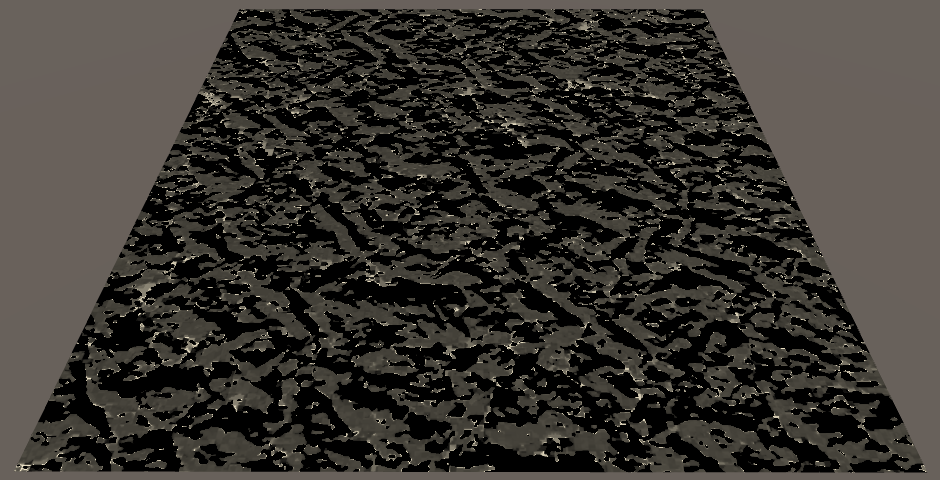 							Using a normal map. 						

### DXT5nm

There is definitely something wrong with our normals. That's  because Unity ended up encoding the normals in a different way than we  expected. Even though the texture preview shows RGB encoding, Unity  actually uses DXT5nm.

The DXT5nm format only stores the X and Y components of the  normal. Its Z component is discarded. The Y component is stored in the G  channel, as you might expect. However, the X component is stored in the  A channel. The R and B channels are not used.

 							Why store X and Y that way? 							 						

So when using DXT5nm, we can only retrieve the first two components of our normal.

```
	i.normal.xy = tex2D(_NormalMap, i.uv).wy * 2 - 1;
```

We have to infer the third component from the other two. Because normals are unit vectors, ||N||=||N||2=N2x+N2y+N2z=1

. Thus 

Nz=√1−N2x−N2y

.

```
	i.normal.xy = tex2D(_NormalMap, i.uv).wy * 2 - 1;
	i.normal.z = sqrt(1 - dot(i.normal.xy, i.normal.xy));
	i.normal = i.normal.xzy;
```

Theoretically, the result should be equal to the original Z  component. However, because the texture has limited precision, and  because of texture filtering, the result will often be different. It's  close enough, though.

Also, because of precision limitations, it is possible that N2x+N2y

 ends up out of bounds. Make sure that this doesn't happen, by clamping the dot product.

```
	i.normal.z = sqrt(1 - saturate(dot(i.normal.xy, i.normal.xy)));
```

 							
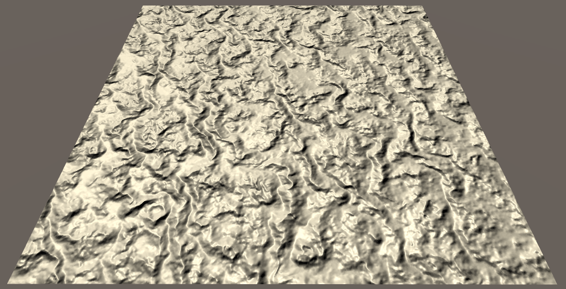 							Decoded DXT5nm normals. 						

### Scaling Bumpiness

Because we bake the normals into a texture, we cannot scale them in the fragment shader. Or can we?

We can scale the normal's X and Y components before computing  Z. If we decrease X and Y, then Z will become larger, resulting in a  flatter surface. The opposite will happen if we increase them. So we can  adjust the bumpiness that way. As we're already clamping the squares of  X and Y, we'll never end up with invalid normals.

Let's add a bump scale property to our shader, just like Unity's standard shader.

```
	Properties {
		_Tint ("Tint", Color) = (1, 1, 1, 1)
		_MainTex ("Albedo", 2D) = "white" {}
		[NoScaleOffset] _NormalMap ("Normals", 2D) = "bump" {}
		_BumpScale ("Bump Scale", Float) = 1
		[Gamma] _Metallic ("Metallic", Range(0, 1)) = 0
		_Smoothness ("Smoothness", Range(0, 1)) = 0.1
	}
```

Incorporate this scale into our normal calculations.

```
sampler2D _NormalMap;
float _BumpScale;

…

void InitializeFragmentNormal(inout Interpolators i) {
	i.normal.xy = tex2D(_NormalMap, i.uv).wy * 2 - 1;
	i.normal.xy *= _BumpScale;
	i.normal.z = sqrt(1 - saturate(dot(i.normal.xy, i.normal.xy)));
	i.normal = i.normal.xzy;
	i.normal = normalize(i.normal);
}
```

To get bumps of about the same strength as we got while using the height map, reduce the scale to something like 0.25.

 							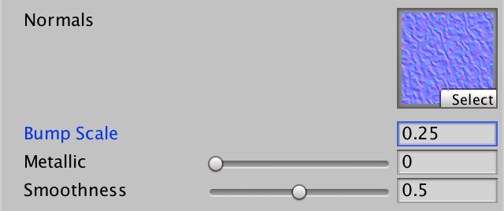 							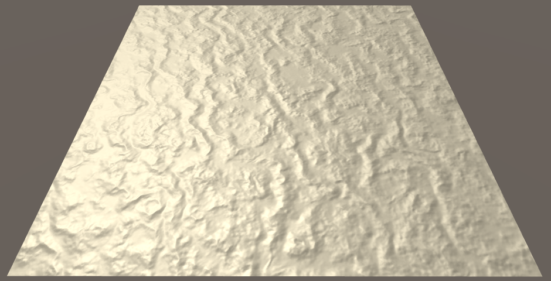 							 							Scaled bumps. 						

*UnityStandardUtils* contains the `UnpackScaleNormal`  function. It automatically uses the correct decoding for normal maps,  and scales normals as well. So let's take advantage of that convenient  function.

```
void InitializeFragmentNormal(inout Interpolators i) {
//	i.normal.xy = tex2D(_NormalMap, i.uv).wy * 2 - 1;
//	i.normal.xy *= _BumpScale;
//	i.normal.z = sqrt(1 - saturate(dot(i.normal.xy, i.normal.xy)));
	i.normal = UnpackScaleNormal(tex2D(_NormalMap, i.uv), _BumpScale);
	i.normal = i.normal.xzy;
	i.normal = normalize(i.normal);
}
```

 							What does `UnpackScaleNormal` look like? 							 						

### Combining Albedo and Bumps

Now that we have a functional normal map, you can check the  difference it makes. When only using the marble albedo texture, our quad  looks like perfectly polished stone. Add the normal map, and it becomes  a much more interesting surface.

 							 							 							Without vs. with bumps. 						

unitypackage

## Bump Details

In [part 3, Combining Textures](https://catlikecoding.com/unity/tutorials/rendering/part-3/),  we created a shader with a detail texture. We did this with the albedo,  but we can also do it with bumps. First, add support for detail albedo  to the *My First Lighting Shader* as well.

```
	Properties {
		_Tint ("Tint", Color) = (1, 1, 1, 1)
		_MainTex ("Albedo", 2D) = "white" {}
		[NoScaleOffset] _NormalMap ("Normals", 2D) = "bump" {}
		_BumpScale ("Bump Scale", Float) = 1
		[Gamma] _Metallic ("Metallic", Range(0, 1)) = 0
		_Smoothness ("Smoothness", Range(0, 1)) = 0.1
		_DetailTex ("Detail Texture", 2D) = "gray" {}
	}
```

 						
 						Now with detail albedo texture. 					

Instead of adding an interpolator for the detail UV, let's  manually pack both the main UV and detail UV in a single interpolator.  The main UV go in XY, the detail UV go in ZW.

```
struct Interpolators {
	float4 position : SV_POSITION;
//	float2 uv : TEXCOORD0;
	float4 uv : TEXCOORD0;
	float3 normal : TEXCOORD1;
	float3 worldPos : TEXCOORD2;

	#if defined(VERTEXLIGHT_ON)
		float3 vertexLightColor : TEXCOORD3;
	#endif
};
```

Add the required variables and fill the interpolator in the vertex program.

```
sampler2D _MainTex, _DetailTex;
sampler2D _MainTex, _DetailTex;
float4 _MainTex_ST, _DetailTex_ST;

…

Interpolators MyVertexProgram (VertexData v) {
	Interpolators i;
	i.position = mul(UNITY_MATRIX_MVP, v.position);
	i.worldPos = mul(unity_ObjectToWorld, v.position);
	i.normal = UnityObjectToWorldNormal(v.normal);
	i.uv.xy = TRANSFORM_TEX(v.uv, _MainTex);
	i.uv.zw = TRANSFORM_TEX(v.uv, _DetailTex);
	ComputeVertexLightColor(i);
	return i;
}
```

Now we have should use `i.uv.**xy**` instead of `i.uv`, when we need the main UV.

```
void InitializeFragmentNormal(inout Interpolators i) {
	i.normal = UnpackScaleNormal(tex2D(_NormalMap, i.uv.xy), _BumpScale);
	i.normal = i.normal.xzy;
	i.normal = normalize(i.normal);
}

float4 MyFragmentProgram (Interpolators i) : SV_TARGET {
	InitializeFragmentNormal(i);

	float3 viewDir = normalize(_WorldSpaceCameraPos - i.worldPos);

	float3 albedo = tex2D(_MainTex, i.uv.xy).rgb * _Tint.rgb;

	…
}
```

Factor the detail texture into the albedo.

```
	float3 albedo = tex2D(_MainTex, i.uv.xy).rgb * _Tint.rgb;
	albedo *= tex2D(_DetailTex, i.uv.zw) * unity_ColorSpaceDouble;
```

 						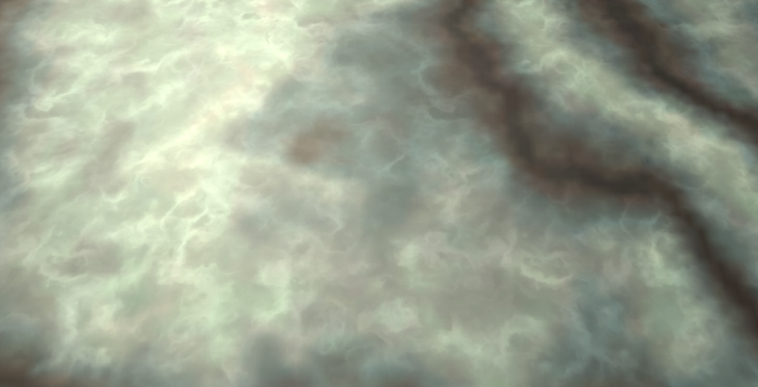 						 						Detailed albedo, without vs. with bumps. 					

### Detail Normals

As the detail texture of our marble material is grayscale, we can use it to generate a normal map. Duplicate it and change its *Import Type* to *Normal Map*. Decrease its *Bumpiness* to something like 0.1 and leave all other settings as they were.

As we're fading out the mipmaps, the colors fade to gray. As a  result, the detail normal map that Unity generates fades to flat. So  they fade out together.

 							 							 							Detail normals texture. 						

Add a property for the detail normal map to our shader. Give it a bump scale as well.

```
	Properties {
		_Tint ("Tint", Color) = (1, 1, 1, 1)
		_MainTex ("Albedo", 2D) = "white" {}
		[NoScaleOffset] _NormalMap ("Normals", 2D) = "bump" {}
		_BumpScale ("Bump Scale", Float) = 1
		[Gamma] _Metallic ("Metallic", Range(0, 1)) = 0
		_Smoothness ("Smoothness", Range(0, 1)) = 0.1
		_DetailTex ("Detail Texture", 2D) = "gray" {}
		[NoScaleOffset] _DetailNormalMap ("Detail Normals", 2D) = "bump" {}
		_DetailBumpScale ("Detail Bump Scale", Float) = 1
	}
```

 							
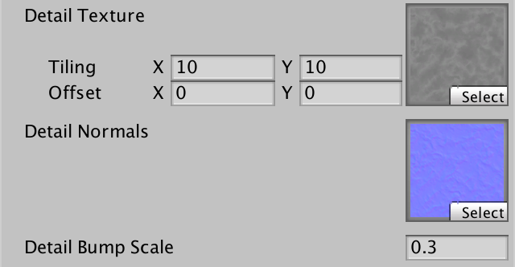 							Detail normal map and scale. 						

Add the required variables and fetch the detail normal map,  just like the main normal map. Before we combine them, show just the  detail normal.

```
sampler2D _NormalMap, _DetailNormalMap;
float _BumpScale, _DetailBumpScale;

…

void InitializeFragmentNormal(inout Interpolators i) {
	i.normal = UnpackScaleNormal(tex2D(_NormalMap, i.uv.xy), _BumpScale);
	i.normal =
		UnpackScaleNormal(tex2D(_DetailNormalMap, i.uv.zw), _DetailBumpScale);
	i.normal = i.normal.xzy;
	i.normal = normalize(i.normal);
}
```

 							
 							Detail bumps. 						

### Blending Normals

We combined the main and detail albedo by multiplying them  together. We cannot do this with normals, because they are vectors. But  we could average them, before normalizing.

```
void InitializeFragmentNormal(inout Interpolators i) {
	float3 mainNormal =
		UnpackScaleNormal(tex2D(_NormalMap, i.uv.xy), _BumpScale);
	float3 detailNormal =
		UnpackScaleNormal(tex2D(_DetailNormalMap, i.uv.zw), _DetailBumpScale);
	i.normal = (mainNormal + detailNormal) * 0.5;
	i.normal = i.normal.xzy;
	i.normal = normalize(i.normal);
}
```

 							
 							Averaged normals. 						

The result isn't very good. Both the main and detail bumps get  flattened. Ideally, when one of them is flat, it shouldn't affect the  other at all.

What we're effectively trying to do here, is combine two height  fields. Averaging those makes no sense. It makes a lot more sense to  add them. When adding two height functions, their slopes – thus their  derivatives – are added as well. Can we extract the derivatives from the  normals?

Earlier, we constructed our own normal vector by normalizing ⎡⎢⎣−f′u1−f′v⎤⎥⎦

. Our normal maps contain normals of the same type, except with their Y and Z components swapped. So they're of the form 

⎡⎢⎣−f′u−f′v1⎤⎥⎦

. However, these normals have been scaled by the normalization process. So we start with 

⎡⎢⎣−sf′u−sf′vs⎤⎥⎦

, where 

s

  is an arbitrary scale factor. The Z component is equal to this factor.  This means that we can find the partial derivatives by dividing X and Y  by Z. This only fails when Z is zero, which corresponds with a vertical  surface. Our bumps are nowhere near that steep, so we don't need to  worry about that.

Once we have the derivatives, we can add them to find the  derivatives of the summed height fields. Then, we convert back to a  normal vector. The resulting vector, before normalizing, is ⎡⎢ ⎢ ⎢⎣MxMz+DxDzMyMz+DyDz1⎤⎥ ⎥ ⎥⎦

.

```
void InitializeFragmentNormal(inout Interpolators i) {
	float3 mainNormal =
		UnpackScaleNormal(tex2D(_NormalMap, i.uv.xy), _BumpScale);
	float3 detailNormal =
		UnpackScaleNormal(tex2D(_DetailNormalMap, i.uv.zw), _DetailBumpScale);
	i.normal =
		float3(mainNormal.xy / mainNormal.z + detailNormal.xy / detailNormal.z, 1);
	i.normal = i.normal.xzy;
	i.normal = normalize(i.normal);
}
```

 							
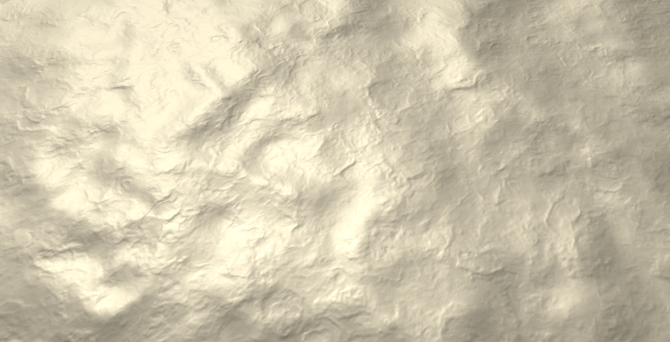 							Adding derivatives. 						

This produces a much better result! It works quite well when  combining maps that are mostly flat. However, combining steep slopes  will still lose details. A slightly alternative method is whiteout  blending. First, multiply the new normal by MzDz

. We can do this, because we normalize afterwards anyway. This gives us the vector 

⎡⎢⎣MxDz+DxMzMyDz+DyMzMzDz⎤⎥⎦

. Then drop the scaling of X and Y, leading to 

⎡⎢⎣Mx+DxMy+DyMzDz⎤⎥⎦

.

This tweak exaggerates the X and Y components, and thus  produces more pronounced bumps along steep slopes. But when one of the  normals is flat, the other normal is not altered.

 							Why is it known as whiteout blending? 							 						

```
	i.normal =
		float3(mainNormal.xy + detailNormal.xy, mainNormal.z * detailNormal.z);
//		float3(mainNormal.xy / mainNormal.z + detailNormal.xy / detailNormal.z, 1);
```

 							
 							Whiteout blending normals, with albedo. 						

*UnityStandardUtils* contains the `BlendNormals`  function, which also uses whiteout blending. So let's that function. It  also normalizes the result, so we don't have to do that ourselves  anymore.

```
	i.normal = BlendNormals(mainNormal, detailNormal);
//		float3(mainNormal.xy + detailNormal.xy, mainNormal.z * detailNormal.z);
	i.normal = i.normal.xzy;
//	i.normal = normalize(i.normal);
```

 							What does `BlendNormals` look like? 							 						

unitypackage

## Tangent Space

Up to this points, we have assumed that we're shading a flat  surface that is aligned with the XZ plane. But for this technique to be  of any use, it must work for arbitrary geometry.

 						 						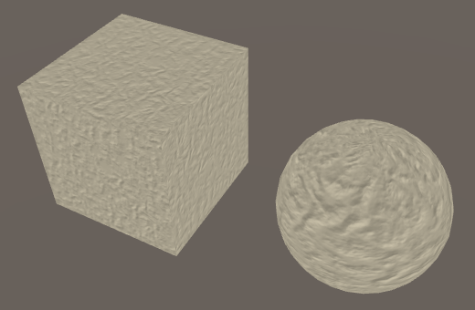 						Incorrectly bump mapping a cube and sphere. 					

One of the faces of a cube can be aligned so that it matches our  assumptions. We could support the other sides, by swapping and flipping  dimensions. But this assumes a cube that is axis-aligned. When the cube  has an arbitrary rotation, it becomes more complex. We have to  transform the results of our bump mapping code so it matches the real  orientation of the face.

Can we know the orientation of a face? For that, we need vectors  that define the U and V axes. Those two, plus the normal vector, define  a 3D space which matches our assumptions. Once we have that space, we  can use it to transform the bumps to world space.

As we already have the normal vector N

, we only require one additional vector. The cross product of those two vectors defines the third one.

The additional vector is provided as part of the mesh's vertex  data. As it lies in the plane defined by the surface normal, it is known  as the tangent vector T

. By convention, this vector matches the U axis, pointing to the right.

The third vector is known as B

,  the bitangent, or the binormal. As Unity refers to it as the binormal,  so will I. This vector defines the V axis, pointing forward. The  standard way to derive the bitangent is via 

B=N×T

.  However, this will produce a vector that points backwards, not  forwards. To correct this, the result has to be multiplied with −1. This  factor is stored as an extra fourth component of 

T

.

 						Why store −1 in the tangent vector? 						 					

So we can use the vertex normal and tangent to construct a 3D  space that matches the mesh surface. This space is known as tangent  space, the tangent basis, or TBN space. In the case of a cube, tangent  space is uniform per face. In the case of a sphere, tangent space wraps  around its surface.

In order to construct this space, the mesh has to contain  tangent vectors. Fortunately, Unity's default meshes contain this data.  When importing a mesh into Unity, you either import your own tangents,  or have Unity generate them for you.

### Visualizing Tangent Space

To get an idea of how tangent space works, let's code a quick visualization of it. Create a `**TangentSpaceVisualizer**` component with an `OnDrawGizmos` method.

```
using UnityEngine;

public class TangentSpaceVisualizer : MonoBehaviour {

	void OnDrawGizmos () {
	}
}
```

Each time gizmos are drawn, grab the mesh from the game  object's mesh filter, and use it to show its tangent space. Of course  this only works if there actually is a mesh. Grab the `shadedMesh`, not the `mesh`. The first gives us a reference to the mesh asset, while the second would create a copy.

 							Why does the `MeshFilter.mesh` property create a copy? 							 						

```
	void OnDrawGizmos () {
		MeshFilter filter = GetComponent<MeshFilter>();
		if (filter) {
			Mesh mesh = filter.sharedMesh;
			if (mesh) {
				ShowTangentSpace(mesh);
			}
		}
	}

	void ShowTangentSpace (Mesh mesh) {
	}
```

First, we'll show the normal vectors. Get the vertex positions  and normals from the mesh, and use those to draw lines. We have to  transform them to world space so they match the geometry in the scene.  As the normal corresponds with the up direction in tangent space, let's  give them a green color.

```
	void ShowTangentSpace (Mesh mesh) {
		Vector3[] vertices = mesh.vertices;
		Vector3[] normals = mesh.normals;
		for (int i = 0; i < vertices.Length; i++) {
			ShowTangentSpace(
				transform.TransformPoint(vertices[i]),
				transform.TransformDirection(normals[i])
			);
		}
	}

	void ShowTangentSpace (Vector3 vertex, Vector3 normal) {
		Gizmos.color = Color.green;
		Gizmos.DrawLine(vertex, vertex + normal);
	}
```

 							Isn't it inefficient to retrieve the mesh data every time? 							 						

Add this component to some objects with a mesh to see their vertex normals.

 							
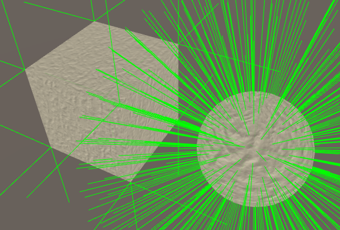 							Showing normals. 						

What is a sensible length of the lines? It depends on the  geometry. So let's add a configurable scale. Let's also support a  configurable offset, which pushes the lines away from the surface. That  makes it easier to inspect overlapping vertices.

```
	public float offset = 0.01f;
	public float scale = 0.1f;

	void ShowTangentSpace (Vector3 vertex, Vector3 normal) {
		vertex += normal * offset;
		Gizmos.color = Color.green;
		Gizmos.DrawLine(vertex, vertex + normal * scale);
	}
```

 							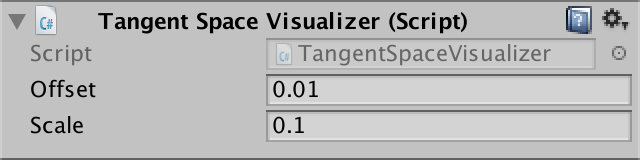
 							 							Offset and scaled. 						

Now include the tangent vectors. They works just like normal  vectors, except that they're 4D vectors. As they point rightward  locally, give them a red color.

```
	void ShowTangentSpace (Mesh mesh) {
		Vector3[] vertices = mesh.vertices;
		Vector3[] normals = mesh.normals;
		Vector4[] tangents = mesh.tangents;
		for (int i = 0; i < vertices.Length; i++) {
			ShowTangentSpace(
				transform.TransformPoint(vertices[i]),
				transform.TransformDirection(normals[i]),
				transform.TransformDirection(tangents[i])
			);
		}
	}

	void ShowTangentSpace (Vector3 vertex, Vector3 normal, Vector3 tangent) {
		vertex += normal * offset;
		Gizmos.color = Color.green;
		Gizmos.DrawLine(vertex, vertex + normal * scale);
		Gizmos.color = Color.red;
		Gizmos.DrawLine(vertex, vertex + tangent * scale);
	}
```

 							
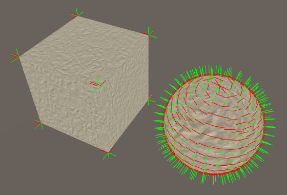 							Showing normals and tangents. 						

Finally, construct and show the binormal vectors with a blue line.

```
	void ShowTangentSpace (Mesh mesh) {
		…
		for (int i = 0; i < vertices.Length; i++) {
			ShowTangentSpace(
				transform.TransformPoint(vertices[i]),
				transform.TransformDirection(normals[i]),
				transform.TransformDirection(tangents[i]),
				tangents[i].w
			);
		}
	}

	void ShowTangentSpace (
		Vector3 vertex, Vector3 normal, Vector3 tangent, float binormalSign
	) {
		…
		Vector3 binormal = Vector3.Cross(normal, tangent) * binormalSign;
		Gizmos.color = Color.blue;
		Gizmos.DrawLine(vertex, vertex + binormal * scale);
	}
```

 							
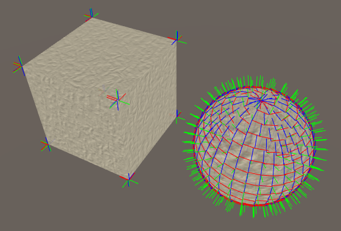 							Showing the complete tangent space. 						

You can see that the tangent space is difference but constant  for each face of a default cube. In case of a default sphere, the  tangent space is different for each vertex. As as result, the tangent  space will be interpolated across triangles, resulting in a curved  space.

 							
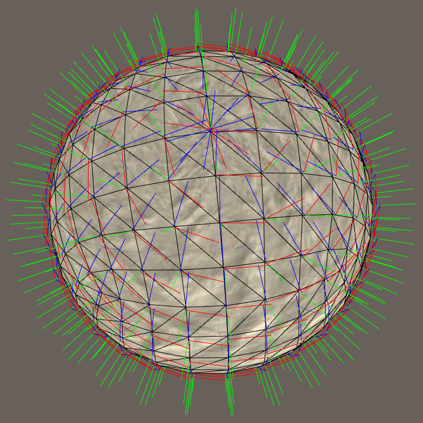 							Tangents space around default sphere. 						

Wrapping tangent space around a sphere is problematic. Unity's  default sphere uses the longitude-latitude texture layout. It's like  wrapping a piece of paper around a ball, forming a cylinder. Then, the  top and bottom of the cylinder are crumpled until they match the sphere.  So the poles are quite messy. Unity's default sphere combines that with  a cubic vertex layout, which exacerbates the problem. They're fine for  mock-ups, but don't expect the default meshes to produce high-quality  results.

### Tangent Space in the Shader

To access the tangents in our shader, we have to add them to the `**VertexData**` struct.

```
struct VertexData {
	float4 position : POSITION;
	float3 normal : NORMAL;
	float4 tangent : TANGENT;
	float2 uv : TEXCOORD0;
};
```

And we have to include them as an additional interpolator. The  order of the interpolators doesn't matter, but I like to keep the normal  and tangent together.

```
struct Interpolators {
	float4 position : SV_POSITION;
	float4 uv : TEXCOORD0;
	float3 normal : TEXCOORD1;
	float4 tangent : TEXCOORD2;
	float3 worldPos : TEXCOORD3;

	#if defined(VERTEXLIGHT_ON)
		float3 vertexLightColor : TEXCOORD4;
	#endif
};
```

Transform the tangent to world space in the vertex program, using `UnityObjectToWorldDir` from *UnityCG*. Of course this only applies to the XYZ part of the tangent. Its W component needs to be passed along unmodified.

```
Interpolators MyVertexProgram (VertexData v) {
	Interpolators i;
	i.position = mul(UNITY_MATRIX_MVP, v.position);
	i.worldPos = mul(unity_ObjectToWorld, v.position);
	i.normal = UnityObjectToWorldNormal(v.normal);
	i.tangent = float4(UnityObjectToWorldDir(v.tangent.xyz), v.tangent.w);
	i.uv.xy = TRANSFORM_TEX(v.uv, _MainTex);
	i.uv.zw = TRANSFORM_TEX(v.uv, _DetailTex);
	ComputeVertexLightColor(i);
	return i;
}
```

 							What does `UnityObjectToWorldDir` look like? 							 						

We now have access to both the normal and the tangent in the fragment shader. So we can construct the binormal in `InitializeFragmentNormal`.  However, we must take care to not replace the original normal with the  bumped normal. The bumped normal exists in tangent space, so keep it  separate.

```
void InitializeFragmentNormal(inout Interpolators i) {
	float3 mainNormal =
		UnpackScaleNormal(tex2D(_NormalMap, i.uv.xy), _BumpScale);
	float3 detailNormal =
		UnpackScaleNormal(tex2D(_DetailNormalMap, i.uv.zw), _DetailBumpScale);
	float3 tangentSpaceNormal = BlendNormals(mainNormal, detailNormal);
	tangentSpaceNormal = tangentSpaceNormal.xzy;

	float3 binormal = cross(i.normal, i.tangent.xyz) * i.tangent.w;
}
```

 							Shouldn't we normalize the normal and tangent vectors? 							 						

Now we can convert the bumped normal from tangent space to world space.

```
	float3 binormal = cross(i.normal, i.tangent.xyz) * i.tangent.w;

	i.normal = normalize(
		tangentSpaceNormal.x * i.tangent +
		tangentSpaceNormal.y * i.normal +
		tangentSpaceNormal.z * binormal
	);
```

We can also get rid of the explicit YZ swap, combining it with the space conversion.

```
//	tangentSpaceNormal = tangentSpaceNormal.xzy;
	
	float3 binormal = cross(i.normal, i.tangent.xyz) * i.tangent.w;

	i.normal = normalize(
		tangentSpaceNormal.x * i.tangent +
		tangentSpaceNormal.y * binormal +
		tangentSpaceNormal.z * i.normal
	;
```

 							
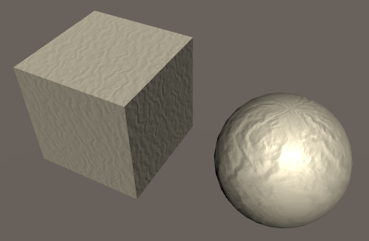 							Converted normals. 						

There is one additional detail, when constructing the binormal.  Suppose an object has its scale set to (-1, 1, 1). That means that it  is mirrored. We have to flip the binormal in this case, to correctly  mirror the tangent space as well. In fact, we have to do this when an  odd number of dimensions are negative. *UnityShaderVariables* helps us with this, by defining the `**float4** unity_WorldTransformParams` variable. Its fourth component contains −1 when we need to flip the binormal, and 1 otherwise.

```
	float3 binormal = cross(i.normal, i.tangent.xyz) *
		(i.tangent.w * unity_WorldTransformParams.w);
```

 							What other data does `unity_WorldTransformParams` contain? 							 						

### Synched Tangent Space

When a 3D artist creates a detailed model, the usual approach  is to build a very high-resolution model. All the details are actual 3D  geometry. To make this work in a game, a low-resolution version of the  model is generated. The details are baked into textures for this model.

The normals of the high-resolution model are baked into a  normal map. This is done by converting the normals from world space to  tangent space. When rendering the low-resolution model in a game, this  conversion is reversed.

This process works fine, as long as both conversions use the  same algorithm and tangent space. When they don't, the in-game results  will be wrong. This can cause 3D artists a lot of grief. So you have to  make sure that your normal map generator, Unity's mesh import process,  and the shader are all synchronized. This is known as a synched tangent  space workflow.

 							What about our normal maps? 							 						

Since version 5.3, Unity uses mikktspace. So make sure that  you're using mikktspace as well when generating your normal maps. When  importing a mesh, you can allow Unity to generate the tangent vectors  for you, as it uses the mikktspace algorithm for that. Alternatively,  export mikktspace tangents yourself and have Unity use those.

 							What is mikktspace? 							 						

When using mikktspace, there is one choice to make. The  binormal can either be constructed in the fragment program – like we do –  or in the vertex program – like Unity does. Both approaches produce  slightly different binormals.

 							
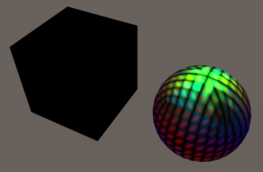 							Exaggerated binormal difference. 						

So when generating your normal map for Unity, use settings that  corresponds with calculating binormals per vertex. Or go ahead and  assume they're calculated per fragment, and use a shader that does so as  well.

 							Tangent space is a hassle, can we make do without it? 							 						

### Binormals Per Vertex or Fragment

If we want to be consistent with Unity's standard shaders, we  have to calculate the binormal per vertex. The upside of doing that is  that we don't have to compute a cross product in the fragment shader.  The downside is that we need an additional interpolator.

If you're not sure which method to use, you can always support both. Let's say that if `BINORMAL_PER_FRAGMENT` is defined, we calculate the binormal per fragment. Otherwise, we do it per vertex. In the former case, we keep our `**float4**` tangent interpolator. In the latter, we need two `**float3**` interpolators instead.

```
struct Interpolators {
	float4 position : SV_POSITION;
	float4 uv : TEXCOORD0;
	float3 normal : TEXCOORD1;

	#if defined(BINORMAL_PER_FRAGMENT)
		float4 tangent : TEXCOORD2;
	#else
		float3 tangent : TEXCOORD2;
		float3 binormal : TEXCOORD3;
	#endif

	float3 worldPos : TEXCOORD4;

	#if defined(VERTEXLIGHT_ON)
		float3 vertexLightColor : TEXCOORD5;
	#endif
};
```

 							Does that mean we skip an interpolator? 							 						

Let's put the binormal calculation in its own function. We can then use it in either the vertex or the fragment shader.

```
float3 CreateBinormal (float3 normal, float3 tangent, float binormalSign) {
	return cross(normal, tangent.xyz) *
		(binormalSign * unity_WorldTransformParams.w);
}

Interpolators MyVertexProgram (VertexData v) {
	Interpolators i;
	i.position = mul(UNITY_MATRIX_MVP, v.position);
	i.worldPos = mul(unity_ObjectToWorld, v.position);
	i.normal = UnityObjectToWorldNormal(v.normal);

	#if defined(BINORMAL_PER_FRAGMENT)
		i.tangent = float4(UnityObjectToWorldDir(v.tangent.xyz), v.tangent.w);
	#else
		i.tangent = UnityObjectToWorldDir(v.tangent.xyz);
		i.binormal = CreateBinormal(i.normal, i.tangent, v.tangent.w);
	#endif
		
	i.uv.xy = TRANSFORM_TEX(v.uv, _MainTex);
	i.uv.zw = TRANSFORM_TEX(v.uv, _DetailTex);
	ComputeVertexLightColor(i);
	return i;
}

…

void InitializeFragmentNormal(inout Interpolators i) {
	float3 mainNormal =
		UnpackScaleNormal(tex2D(_NormalMap, i.uv.xy), _BumpScale);
	float3 detailNormal =
		UnpackScaleNormal(tex2D(_DetailNormalMap, i.uv.zw), _DetailBumpScale);
	float3 tangentSpaceNormal = BlendNormals(mainNormal, detailNormal);

	#if defined(BINORMAL_PER_FRAGMENT)
		float3 binormal = CreateBinormal(i.normal, i.tangent.xyz, i.tangent.w);
	#else
		float3 binormal = i.binormal;
	#endif
	
	i.normal = normalize(
		tangentSpaceNormal.x * i.tangent +
		tangentSpaceNormal.y * binormal +
		tangentSpaceNormal.z * i.normal
	);
}
```

As `BINORMAL_PER_FRAGMENT` is not  defined anywhere, our shader will now calculate the binormals per  vertex. If you want to calculate them per fragment, you have to define `BINORMAL_PER_FRAGMENT` somewhere. You can consider this a configuration option of our include file. As such, it makes sense to define it inside *My First Lighting Shader*, before including *My Lighting*.

As it makes sense to use the same setting for all our passes,  we have to define it in both the base and the additive pass. But we can  also put it inside a `CGINCLUDE` block at the top of our shader. The contents of that block is included inside all `CGPROGRAM` blocks.

```
	Properties {
		…
	}

	CGINCLUDE

	#define BINORMAL_PER_FRAGMENT

	ENDCG

	SubShader {
		…
	}
```

You can verify that this works by inspecting the compiled  shader code. For example, here are the interpolators used by D3D11,  without `BINORMAL_PER_FRAGMENT` defined.

```
// Output signature:
//
// Name                 Index   Mask Register SysValue  Format   Used
// -------------------- ----- ------ -------- -------- ------- ------
// SV_POSITION              0   xyzw        0      POS   float   xyzw
// TEXCOORD                 0   xyzw        1     NONE   float   xyzw
// TEXCOORD                 1   xyz         2     NONE   float   xyz 
// TEXCOORD                 2   xyz         3     NONE   float   xyz 
// TEXCOORD                 3   xyz         4     NONE   float   xyz 
// TEXCOORD                 4   xyz         5     NONE   float   xyz 
```

And here they are, when `BINORMAL_PER_FRAGMENT` is defined.

```
// Output signature:
//
// Name                 Index   Mask Register SysValue  Format   Used
// -------------------- ----- ------ -------- -------- ------- ------
// SV_POSITION              0   xyzw        0      POS   float   xyzw
// TEXCOORD                 0   xyzw        1     NONE   float   xyzw
// TEXCOORD                 1   xyz         2     NONE   float   xyz 
// TEXCOORD                 2   xyzw        3     NONE   float   xyzw
// TEXCOORD                 4   xyz         4     NONE   float   xyz 
```

The next tutorial is [Shadows](https://catlikecoding.com/unity/tutorials/rendering/part-7/).

unitypackage

PDF
