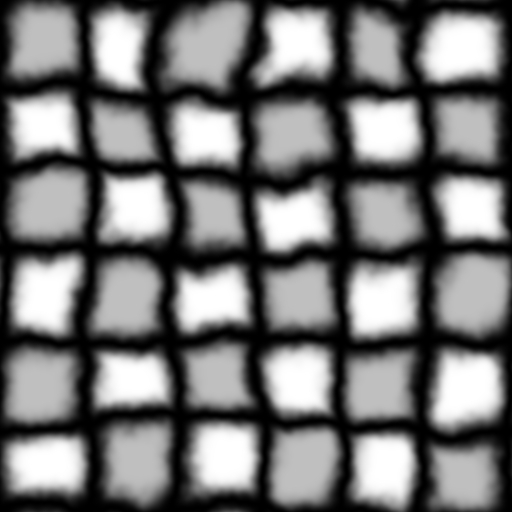
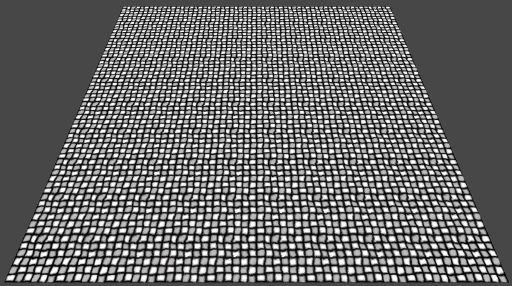
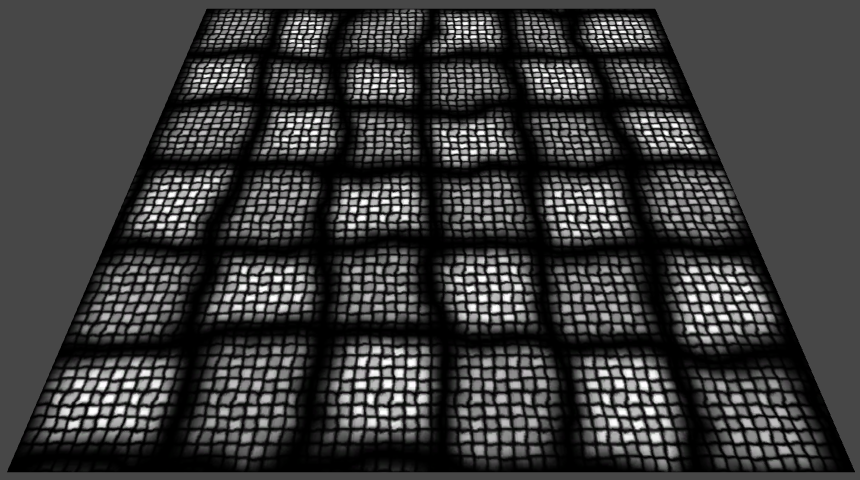
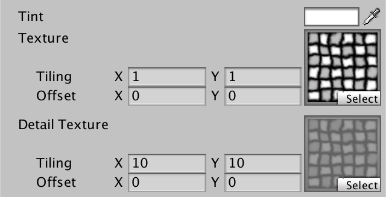
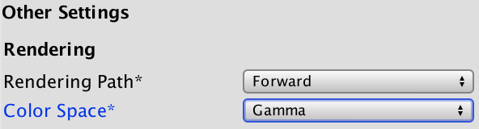
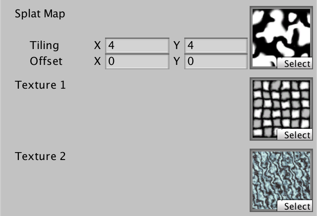
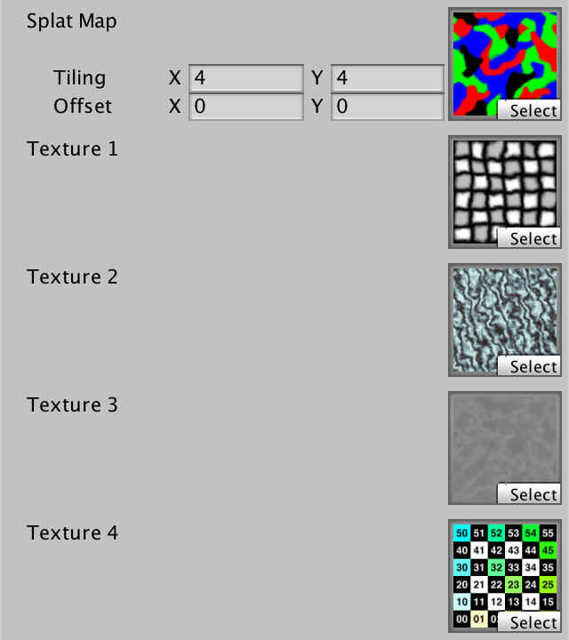

# Rendering 3

Combining Textures

- Sample multiple textures.
- Apply a detail texture.
- Deal with colors in linear space.
- Use a splat map.

This is the third part of a tutorial series about rendering. The [previous part](https://catlikecoding.com/unity/tutorials/rendering/part-2)  introduced shaders and textures. We've seen how you can use a single  texture to make a flat surface appear more complex. Now we go beyond  that and use multiple textures at the same time.

This tutorials was made using Unity 5.4.0b15.

 					
 					Combining multiple textures. 				

## Detail Textures

Textures are nice, but they have limitations. They have a fixed  amount of texels, no matter at what size they are displayed. If they are  rendered small, we can use mipmaps to keep them looking good. But when  they are rendered large, they become blurry. We cannot invent extra  details out of nothing, so there's no way around that. Or is there?

Of course, we could use a larger texture. More texels means more  details. But there's a limit to a texture's size. And it is kind of  wasteful to store a lot of extra data that is only noticeable up close.

Another way to increase the texel density is to tile a texture.  Then you can get as small as you want, but you will obviously get a  repeating pattern. This might not be noticeable up close, though. After  all, when you're standing with your nose touching a wall, you'll only  see a very small section of the entire wall.

So we should be able to add details by combining an untiled  texture with a tiled texture. To try this out, let's use a texture with  an obvious pattern. Here's a checkered grid. Grab it and put it to your  project, with the default import settings. I perturbed the grid lines a  bit, to make it more interesting and to make it possible to perceive its  tiling.

 						
 						Slightly distorted grid texture. 					

Duplicate *My First Shader* and rename it to *Textured With Detail*. We'll use this new shader from now on.

```
Shader "Custom/Textured With Detail" {

	Properties {
		_Tint ("Tint", Color) = (1, 1, 1, 1)
		_MainTex ("Texture", 2D) = "white" {}
	}

	SubShader {
		…
	}
}
```

Create a new material with this shader, then assign the grid texture to it.

 						 						 						Detailed material, with grid. 					

Assign the material to a quad and have a look at it. From a  distance, it will look fine. But get too close, and it will become  blurry and fuzzy. Besides the lack of details, artifacts caused by  texture compression will also become obvious.

 						
 						Close-up of the grid, showing low texel density and DXT1 artifacts. 					

### Multiple Texture Samples

Right now we're taking a single texture sample and using that  as the result of our fragment shader. As we're going to change that  approach, it's handy to store the sampled color in a temporary variable.

```
			float4 MyFragmentProgram (Interpolators i) : SV_TARGET {
				float4 color = tex2D(_MainTex, i.uv) * _Tint;
				return color;
			}
```

We reasoned that we can increase the texel density by  introducing a tiled texture. Let's simply perform a second texture  sample which tiles ten times as much as the original sample. Actually  replace the original color, don't add to it just yet.

```
				float4 color = tex2D(_MainTex, i.uv) * _Tint;
				color = tex2D(_MainTex, i.uv * 10);
				return color;
```

This produces a much smaller grid. You can get much closes to  that before it starts to look bad. Of course, because the grid is  irregular, it is obviously a repeating pattern.

 						
 						Hard-coded tiling. 					

Notice that at this point we're performing two texture samples,  but end up using only one of them. This seems wasteful. Is it? Take a  look at the compiled vertex programs. Just like in the [previous tutorial](https://catlikecoding.com/unity/tutorials/rendering/part-2), I'll include the relevant compiled code for OpenGLCore and Direct3D 11.

```
uniform  sampler2D _MainTex;
in  vec2 vs_TEXCOORD0;
layout(location = 0) out vec4 SV_TARGET0;
vec2 t0;
void main()
{
    t0.xy = vs_TEXCOORD0.xy * vec2(10.0, 10.0);
    SV_TARGET0 = texture(_MainTex, t0.xy);
    return;
}
SetTexture 0 [_MainTex] 2D 0
      ps_4_0
      dcl_sampler s0, mode_default
      dcl_resource_texture2d (float,float,float,float) t0
      dcl_input_ps linear v0.xy
      dcl_output o0.xyzw
      dcl_temps 1
   0: mul r0.xy, v0.xyxx, l(10.000000, 10.000000, 0.000000, 0.000000)
   1: sample o0.xyzw, r0.xyxx, t0.xyzw, s0
   2: ret
```

Did you notice that there is only one texture sample in the  compiled code? That's right, the compiler removed the unnecessary code  for us! Basically, it works its way back from the end result, and  discards anything that ends up unused.

Of course, we don't want to replace the original sample. We  want to combine both samples. Let's do so by multiplying them together.  But once again, let's add a twist. Sample the texture twice, with the  exact same UV coordinates.

```
				float4 color = tex2D(_MainTex, i.uv) * _Tint;
				color *= tex2D(_MainTex, i.uv);
				return color;
```

What does the shader compiler make of that?

```
uniform  sampler2D _MainTex;
in  vec2 vs_TEXCOORD0;
layout(location = 0) out vec4 SV_TARGET0;
mediump vec4 t16_0;
lowp vec4 t10_0;
void main()
{
    t10_0 = texture(_MainTex, vs_TEXCOORD0.xy);
    t16_0 = t10_0 * t10_0;
    SV_TARGET0 = t16_0 * _Tint;
    return;
}
SetTexture 0 [_MainTex] 2D 0
ConstBuffer "$Globals" 144
Vector 96 [_Tint]
BindCB  "$Globals" 0
      ps_4_0
      dcl_constantbuffer cb0[7], immediateIndexed
      dcl_sampler s0, mode_default
      dcl_resource_texture2d (float,float,float,float) t0
      dcl_input_ps linear v0.xy
      dcl_output o0.xyzw
      dcl_temps 1
   0: sample r0.xyzw, v0.xyxx, t0.xyzw, s0
   1: mul r0.xyzw, r0.xyzw, r0.xyzw
   2: mul o0.xyzw, r0.xyzw, cb0[6].xyzw
   3: ret
```

Once again, we end up with a single texture sample. The  compiler detected the duplicate code and optimized it. So the texture is  only sampled once. The result is stored in a register and reused. The  compiler is smart enough to detect such code duplications, even when you  use intermediary variables and such. It traces everything back to its  original input. It then reorganizes everything as efficiently as  possible.

Now put pack the ×10 UV coordinates for the second sample. We'll finally see the large and small grids combined.

```
				color *= tex2D(_MainTex, i.uv * 10);
```

 							
 							Multiplying two different tilings. 						

As the texture samples are no longer the same, the compiler will have to use two of them as well.

```
uniform  sampler2D _MainTex;
in  vec2 vs_TEXCOORD0;
layout(location = 0) out vec4 SV_TARGET0;
vec4 t0;
lowp vec4 t10_0;
vec2 t1;
lowp vec4 t10_1;
void main()
{
    t10_0 = texture(_MainTex, vs_TEXCOORD0.xy);
    t0 = t10_0 * _Tint;
    t1.xy = vs_TEXCOORD0.xy * vec2(10.0, 10.0);
    t10_1 = texture(_MainTex, t1.xy);
    SV_TARGET0 = t0 * t10_1;
    return;
}
SetTexture 0 [_MainTex] 2D 0
ConstBuffer "$Globals" 144
Vector 96 [_Tint]
BindCB  "$Globals" 0
      ps_4_0
      dcl_constantbuffer cb0[7], immediateIndexed
      dcl_sampler s0, mode_default
      dcl_resource_texture2d (float,float,float,float) t0
      dcl_input_ps linear v0.xy
      dcl_output o0.xyzw
      dcl_temps 2
   0: sample r0.xyzw, v0.xyxx, t0.xyzw, s0
   1: mul r0.xyzw, r0.xyzw, cb0[6].xyzw
   2: mul r1.xy, v0.xyxx, l(10.000000, 10.000000, 0.000000, 0.000000)
   3: sample r1.xyzw, r1.xyxx, t0.xyzw, s0
   4: mul o0.xyzw, r0.xyzw, r1.xyzw
   5: ret
```

### Separate Detail Texture

When you multiply two textures together, the result will be  darker. Unless at least one of the textures is white. That's because  each color channel of a texel has a value between 0 and 1. When adding  details to a texture, you might want to do so by darkening, but also by  brightening.

To brighten the original texture, you need values that are  greater than 1. Let's say up to 2, which would double the original  color. This can be supported by doubling the detail sample before  multiplying it with the original color.

```
				color *= tex2D(_MainTex, i.uv * 10) * 2;
```

 							
 							Doubled details. 						

This approach requires that we reinterpret the texture used for  the details. Multiplying by 1 does not change anything. But as we  double the detail sample, this is now true for ½. This means that a  solid gray – not white – texture will produce no change. All values  below ½ will darken the result, while anything above ½ will brighten it.

So we need a special detail texture, which is centered around gray. Here is such a texture for the grid.

 							
 							Grid detail texture. 						

 							Must detail textures be grayscale? 							 						

To use this separate detail texture, we have to add a second  texture property to our shader. Use gray as its default, as that doesn't  change the main texture's appearance.

```
	Properties {
		_Tint ("Tint", Color) = (1, 1, 1, 1)
		_MainTex ("Texture", 2D) = "white" {}
		_DetailTex ("Detail Texture", 2D) = "gray" {}
	}
```

Assign the detail texture to our material and set its tiling to 10.

 							
 							Two textures. 						

Of course we have to add variables to access the detail texture and its tiling and offset data.

```
			sampler2D _MainTex, _DetailTex;
			float4 _MainTex_ST, _DetailTex_ST;
```

### Using Two UV Pairs

Instead of using a hard-coded multiplication by 10, we should  use the tiling and offset data of the detail texture. We can compute the  final detail UV like the main UV, in the vertex program. This means  that we need to interpolate an additional UV pair.

```
			struct Interpolators {
				float4 position : SV_POSITION;
				float2 uv : TEXCOORD0;
				float2 uvDetail : TEXCOORD1;
			};
```

The new detail UV are created by transforming the original UV with the detail texture's tiling and offset.

```
			Interpolators MyVertexProgram (VertexData v) {
				Interpolators i;
				i.position = mul(UNITY_MATRIX_MVP, v.position);
				i.uv = TRANSFORM_TEX(v.uv, _MainTex);
				i.uvDetail = TRANSFORM_TEX(v.uv, _DetailTex);
				return i;
			}
uniform 	vec4 _Tint;
uniform 	vec4 _MainTex_ST;
uniform 	vec4 _DetailTex_ST;
in  vec4 in_POSITION0;
in  vec2 in_TEXCOORD0;
out vec2 vs_TEXCOORD0;
out vec2 vs_TEXCOORD1;
vec4 t0;
void main()
{
    t0 = in_POSITION0.yyyy * glstate_matrix_mvp[1];
    t0 = glstate_matrix_mvp[0] * in_POSITION0.xxxx + t0;
    t0 = glstate_matrix_mvp[2] * in_POSITION0.zzzz + t0;
    gl_Position = glstate_matrix_mvp[3] * in_POSITION0.wwww + t0;
    vs_TEXCOORD0.xy = in_TEXCOORD0.xy * _MainTex_ST.xy + _MainTex_ST.zw;
    vs_TEXCOORD1.xy = in_TEXCOORD0.xy * _DetailTex_ST.xy + _DetailTex_ST.zw;
    return;
}
Vector 112 [_MainTex_ST]
Vector 128 [_DetailTex_ST]
ConstBuffer "UnityPerDraw" 352
Matrix 0 [glstate_matrix_mvp]
BindCB  "$Globals" 0
BindCB  "UnityPerDraw" 1
      vs_4_0
      dcl_constantbuffer cb0[9], immediateIndexed
      dcl_constantbuffer cb1[4], immediateIndexed
      dcl_input v0.xyzw
      dcl_input v1.xy
      dcl_output_siv o0.xyzw, position
      dcl_output o1.xy
      dcl_output o1.zw
      dcl_temps 1
   0: mul r0.xyzw, v0.yyyy, cb1[1].xyzw
   1: mad r0.xyzw, cb1[0].xyzw, v0.xxxx, r0.xyzw
   2: mad r0.xyzw, cb1[2].xyzw, v0.zzzz, r0.xyzw
   3: mad o0.xyzw, cb1[3].xyzw, v0.wwww, r0.xyzw
   4: mad o1.xy, v1.xyxx, cb0[7].xyxx, cb0[7].zwzz
   5: mad o1.zw, v1.xxxy, cb0[8].xxxy, cb0[8].zzzw
   6: ret
```

Note how the two UV outputs are defined in both compiler vertex programs. OpenGLCore uses two outputs, `vs_TEXCOORD0` and `vs_TEXCOORD1`, as you would expect. In contrast, Direct3D 11 uses only a single output, `o1`. How this works is explained by the output comment section that I usually omit from these code snippets.

```
// Output signature:
//
// Name                 Index   Mask Register SysValue  Format   Used
// -------------------- ----- ------ -------- -------- ------- ------
// SV_POSITION              0   xyzw        0      POS   float   xyzw
// TEXCOORD                 0   xy          1     NONE   float   xy  
// TEXCOORD                 1     zw        1     NONE   float     zw
```

What this means is that both UV pairs get packed into a single  output register. The first ends up in the X and Y channels, and the  second in the Z and W channels. This is possible because the registers  are always groups of four numbers. The Direct3D 11 compiler took  advantage of that.

 							Can you manually pack outputs like that? 							 						

Now we can use the extra UV pair in the fragment program.

```
			float4 MyFragmentProgram (Interpolators i) : SV_TARGET {
				float4 color = tex2D(_MainTex, i.uv) * _Tint;
				color *= tex2D(_DetailTex, i.uvDetail) * 2;
				return color;
			}
uniform 	vec4 _Tint;
uniform 	vec4 _MainTex_ST;
uniform 	vec4 _DetailTex_ST;
uniform  sampler2D _MainTex;
uniform  sampler2D _DetailTex;
in  vec2 vs_TEXCOORD0;
in  vec2 vs_TEXCOORD1;
layout(location = 0) out vec4 SV_TARGET0;
vec4 t0;
lowp vec4 t10_0;
lowp vec4 t10_1;
void main()
{
    t10_0 = texture(_MainTex, vs_TEXCOORD0.xy);
    t0 = t10_0 * _Tint;
    t10_1 = texture(_DetailTex, vs_TEXCOORD1.xy);
    t0 = t0 * t10_1;
    SV_TARGET0 = t0 + t0;
    return;
}
SetTexture 0 [_MainTex] 2D 0
SetTexture 1 [_DetailTex] 2D 1
ConstBuffer "$Globals" 144
Vector 96 [_Tint]
BindCB  "$Globals" 0
      ps_4_0
      dcl_constantbuffer cb0[7], immediateIndexed
      dcl_sampler s0, mode_default
      dcl_sampler s1, mode_default
      dcl_resource_texture2d (float,float,float,float) t0
      dcl_resource_texture2d (float,float,float,float) t1
      dcl_input_ps linear v0.xy
      dcl_input_ps linear v0.zw
      dcl_output o0.xyzw
      dcl_temps 2
   0: sample r0.xyzw, v0.xyxx, t0.xyzw, s0
   1: mul r0.xyzw, r0.xyzw, cb0[6].xyzw
   2: sample r1.xyzw, v0.zwzz, t1.xyzw, s1
   3: mul r0.xyzw, r0.xyzw, r1.xyzw
   4: add o0.xyzw, r0.xyzw, r0.xyzw
   5: ret
```

Our shader is now fully functional. The main texture becomes both brighter and dimmer based on the detail texture.

 							 							 							Brighting and dimming. 						

### Fading Details

The idea of adding details was that they improve the material's  appearance up close or zoomed in. They're not supposed to be visible  far away or zoomed out, because that makes the tiling obvious. So we  need a way to fade the details away as the display size of the texture  decreases. We can do so by fading the detail texture to gray, as that  results in no color change.

We have done this before! All we need to do is enable *Fadeout Mip Maps*  in the detail texture's import settings. Note that this also  automatically switches the filter mode to trilinear, so that the fade to  gray is gradual.

 							 							 							Fading details. 						

The grid makes the transition from detailed to not detailed  very obvious, but you normally wouldn't notice it. For example, here is a  main and a detail texture for a marble material. Grab them and use the  same texture import settings we used for the grid textures.

 							 							 							Marble textures. 						

Once our material uses these textures, the fading of the detail texture is no longer noticeable.

 							 							 							Marble material. 						

However, thanks to the detail texture, the marble looks much better up close.

 							 							 							Close-up without and with details. 						

### Linear Color Space

Our shader works fine while we're rendering our scene in gamma  color space, but it will go wrong if we switch to linear color space.  Which color space you use is a project-wide setting. It is configured in  the *Other Settings* panel of the player settings, which you can access via *Edit / Project Settings / Player*.

 							
 							Selecting the color space. 						

 							What is gamma space? 							 						

Unity assumes that textures and colors are stored as sRGB. When  rendering in gamma space, shaders directly access the raw color and  texture data. This is what we assumed up to this point.

When rendering in linear space, this is no longer true. The GPU  will convert texture samples to linear space. Also, Unity will convert  material color properties to linear space as well. The shader then  operates with these linear colors. After that, the output of the  fragment program will be converted back to gamma space.

One of the advantages of using linear colors is that it enables  more realistic lighting calculations. That's because light interactions  are linear in real life, not exponential. Unfortunately, it screws up  our detail material. After switching to linear space, it becomes much  darker. Why does this happen?

 							 							 							Gamma vs. linear space. 						

Because we double the detail texture sample, a value of ½  results in no change to the main texture. However, the conversion to  linear space changes this to something near ½2.2 ≈ 0.22. Doubling that is roughly 0.44, which is much less that 1. That explains the darkening.

We could solve this error by enabling *Bypass sRGB Sampling*  in the detail texture's import settings. This prevents the conversion  from gamma to linear space, so the shader will always access the raw  image data. However, the detail texture is an sRGB image, so the result  would still be wrong.

The best solution is to realign the detail colors so they're centered around 1 again. We can do that by multiplying by 1 / ½2.2 ≈ 4.59, instead of by 2. But we must only do this when we are rendering in linear space.

Fortunately, *UnityCG* defines a uniform variable which will contain the correct numbers to multiply with. It is a `**float4**`  which has either 2 or roughly 4.59 in its rgb components, as  appropriate. As gamma correction is not applied to the alpha channel, it  is always 2.

```
				color *= tex2D(_DetailTex, i.uvDetail) * unity_ColorSpaceDouble;
```

With that change, our detail material will look the same no matter which color space we're rendering in.

unitypackage

## Texture Splatting

A limitation of detail textures is that the same details are  used for the entire surface. This works fine for a uniform surface, like  a slab of marble. However, if your material does not have a uniform  appearance, you don't want to use the same details everywhere.

Consider a large terrain. It can have grass, sand, rocks, snow,  and so on. You want those terrain types to be fairly detailed up close.  But a texture that covers the entire terrain will never have enough  texels for that. You can solve that by using a separate texture for each  surface type, and tile those. But how do you know which texture to use  where?

Let's assume that we have a terrain with two different surface  types. At every point, we have to decide which surface texture to use.  Either the first, or the second. We could represent that with a boolean  value. If it is set to true, we use the first texture, otherwise the  second. We can use a grayscale texture to store this choice. A value of 1  represents the first texture, while a value of 0 represents the second  texture. In fact, we can use these values to linearly interpolate  between both textures. Then values in between 0 and 1 represent a blend  between both textures. This makes smooth transitions possible.

Such a texture is know as a splat map. It's like you splatter  multiple terrain features onto a canvas. Because of the interpolation,  this map doesn't even require a high resolution. Here's a small example  map.

 						
 						Binary splat map. 					

After adding it to your project, switch its import type to advanced. Enable *Bypass sRGB Sampling* and indicate that its mipmaps should be generated *In Linear Space*.  This is required because the texture doesn't represent sRGB colors, but  choices. So it should not be converted when rendering in linear space.  Also, set its *Wrap Mode* to clamp, as we're not going to tile this map.

 						
 						Import settings. 					

Create a new *Texture Splatting* shader by duplicating `My First Shader` and changing its name. Because terrains are typically not uniformly tinted, let's get rid of that functionality.

```
Shader "Custom/Texture Splatting" {

	Properties {
//		_Tint ("Tint", Color) = (1, 1, 1, 1)
		_MainTex ("Splat Map", 2D) = "white" {}
	}

	SubShader {

		Pass {
			CGPROGRAM

			#pragma vertex MyVertexProgram
			#pragma fragment MyFragmentProgram

			#include "UnityCG.cginc"

//			float4 _Tint;
			sampler2D _MainTex;
			float4 _MainTex_ST;
			
			struct VertexData {
				float4 position : POSITION;
				float2 uv : TEXCOORD0;
			};

			struct Interpolators {
				float4 position : SV_POSITION;
				float2 uv : TEXCOORD0;
			};

			Interpolators MyVertexProgram (VertexData v) {
				Interpolators i;
				i.position = mul(UNITY_MATRIX_MVP, v.position);
				i.uv = TRANSFORM_TEX(v.uv, _MainTex);
				return i;
			}

			float4 MyFragmentProgram (Interpolators i) : SV_TARGET {
				return tex2D(_MainTex, i.uv); // * _Tint;
			}

			ENDCG
		}
	}
}
```

Make a new material that uses this shader, and assign the splat  map as its main texture. Because we haven't changed the shader yet, it  will just show the map.

 						 						 						Showing the splat map. 					

### Adding Textures

To be able to choose between two textures, we have to add them as properties to our shader. Let's just name them *Texture1* and *Texture2*.

```
	Properties {
		_MainTex ("Splat Map", 2D) = "white" {}
		_Texture1 ("Texture 1", 2D) = "white" {}
		_Texture2 ("Texture 2", 2D) = "white" {}
	}
```

You can use any texture you want for them. I simply picked the grid and marble textures that we already have.

 							
 							Two additional textures. 						

Of course we get tiling and offset controls for each texture  that we add to the shader. We could indeed support separate tiling and  offset for every texture individually. But that would require us to pass  more data from the vertex to the fragment shader, or to calculate the  UV adjustments in the pixel shader. This is fine, but typically all  textures of a terrain are tiled the same. And a splat map is not tiled  at all. So we need only one instance of tiling and offset controls.

You can add attributes to shader properties, just like in C# code. The `NoScaleOffset`  attribute will do as its name suggests. Yes, it does refer to tiling  and offset as scale and offset. It's not very consistent naming.

Let's add this attribute to our extra textures, and keep the tiling and offset inputs for the main texture.

```
	Properties {
		_MainTex ("Splat Map", 2D) = "white" {}
		[NoScaleOffset] _Texture1 ("Texture 1", 2D) = "white" {}
		[NoScaleOffset] _Texture2 ("Texture 2", 2D) = "white" {}
}
```

The idea is that the tiling and offset controls appear at the  top of our shader inspector. While they're next to the splat map, we'll  actually apply them to the other textures. Put in some tiling, like 4.

 							
 							No extra tiling and offset controls. 						

Now we have to add the sampler variables to our shader code. But we don't have to add their corresponding `_ST` variables.

```
			sampler2D _MainTex;
			float4 _MainTex_ST;

			sampler2D _Texture1, _Texture2;
```

To check that we can indeed sample both textures this way, change the fragment shader so it adds them together.

```
			float4 MyFragmentProgram (Interpolators i) : SV_TARGET {
				return
					tex2D(_Texture1, i.uv) +
					tex2D(_Texture2, i.uv);
			}
```

 							
 							Two textures, added. 						

### Using the Splat Map

To sample the splat map, we have to also pass the unmodified UV from the vertex program to the fragment program.

```
			struct Interpolators {
				float4 position : SV_POSITION;
				float2 uv : TEXCOORD0;
				float2 uvSplat : TEXCOORD1;
			};

			Interpolators MyVertexProgram (VertexData v) {
				Interpolators i;
				i.position = mul(UNITY_MATRIX_MVP, v.position);
				i.uv = TRANSFORM_TEX(v.uv, _MainTex);
				i.uvSplat = v.uv;
				return i;
			}
```

We can then sample the splat map before sampling the other textures.

```
			float4 MyFragmentProgram (Interpolators i) : SV_TARGET {
				float4 splat = tex2D(_MainTex, i.uvSplat);
				return
					tex2D(_Texture1, i.uv) +
					tex2D(_Texture2, i.uv);
			}
```

We decided that a value of 1 represents the first texture. As  our splat map is monochrome, we can use any of the RGB channels to  retrieve this value. Let's use the R channel and multiply it with the  texture.

```
				return
					tex2D(_Texture1, i.uv) * splat.r +
					tex2D(_Texture2, i.uv);
```

 							
 							Modulating the first texture. 						

The first texture is now modulated by the splat map. To  complete the interpolation, we have to multiply the other texture with 1  - R.

```
				return
					tex2D(_Texture1, i.uv) * splat.r +
					tex2D(_Texture2, i.uv) * (1 - splat.r);
```

 							
 							Modulating both textures. 						

### RGB Splat Map

We have a functional splat material, but it only supports two  textures. Can we support more? We're only using the R channel, so what  about we add the R and G channels as well? Then (1,0,0) represents the  first texture, (0,1,0) represents the second texture, and (0,0,1)  represents a third texture. To get a correct interpolation between those  three, we just have to make sure that the RGB channels always add up to  1.

But wait, when we used only one channel, we could support two  textures. That's because the weight of the second texture was derived  via 1 - R. This same trick works for any number of channels. So it is  possible to support yet another texture, via 1 - R - G - B.

This leads to a splat map with three colors, and black. As long  as the three channels added together don't exceed 1, it is a valid map.  Here is such a map, grab it and use the same import settings as before.

 							
 							RGB splat map. 						

 							What happens when R + G + B exceeds 1? 							 						

 							Can we use the alpha channel as well? 							 						

To support RGB splat maps, we have to add two additional  textures to our shader. I assigned the marble detail and the test  texture to them.

```
	Properties {
		_MainTex ("Splat Map", 2D) = "white" {}
		[NoScaleOffset] _Texture1 ("Texture 1", 2D) = "white" {}
		[NoScaleOffset] _Texture2 ("Texture 2", 2D) = "white" {}
		[NoScaleOffset] _Texture3 ("Texture 3", 2D) = "white" {}
		[NoScaleOffset] _Texture4 ("Texture 4", 2D) = "white" {}
	}
```

 							
 							Four textures. 						

Add the required variables to the shader. Once again, no extra `_ST` variables needed.

```
			sampler2D _Texture1, _Texture2, _Texture3, _Texture4;
```

Inside the fragment program, add the extra texture samples. The  second sample now uses the G channel and the third uses the B channel.  The final sample is modulated with (1 - R - G - B).

```
				return
					tex2D(_Texture1, i.uv) * splat.r +
					tex2D(_Texture2, i.uv) * splat.g +
					tex2D(_Texture3, i.uv) * splat.b +
					tex2D(_Texture4, i.uv) * (1 - splat.r - splat.g - splat.b);
```

 							
 							Four textures splatted. 						

 							Why do the blended regions look different in linear color space? 							 						

Now you know how to apply detail textures and how to blend  multiple textures with a splat map. It is also possible to combine these  approaches.

You could add four detail textures to the splat shader and use  the map to blend between them. Of course this requires four additional  texture samples, so it doesn't come for free.

You could also use a map to control where a detail texture is  applied, and where it is omitted. In that case, you need a monochrome  map and it functions as a mask. This is useful when a single texture  contains regions that represent different materials, but on not as large  a scale as a terrain. For example, if our marble texture also contained  pieces of metal, you wouldn't want the marble details to be applied  there.

The next tutorial is [The First Light](https://catlikecoding.com/unity/tutorials/rendering/part-4/).
