# Rendering 9

Complex Materials

- Create a custom shader GUI.
- Mix metals and nonmetals.
- Use nonuniform smoothness.
- Support emissive surfaces.

This is the ninth part of a tutorial series about rendering. [Last time](https://catlikecoding.com/unity/tutorials/rendering/part-8),  we added support for environmental maps. In this part we'll combine  multiple textures to create complex materials. But before we get to  that, we need a better GUI for our shader.

This tutorial was made with Unity 5.4.1f1.

 					
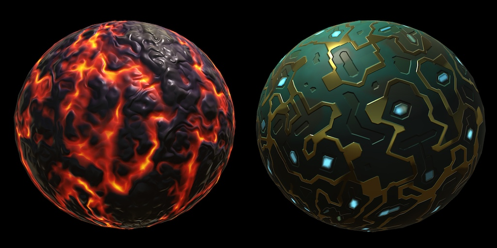 					Same shader, different maps. 				

## User Interface

Up to this points, we've been using Unity's default material  inspector for our material. It is serviceable, but Unity's standard  shader has quite a different look. Let's create a custom inspector for  our own shader, mimicking the standard shader.

 						
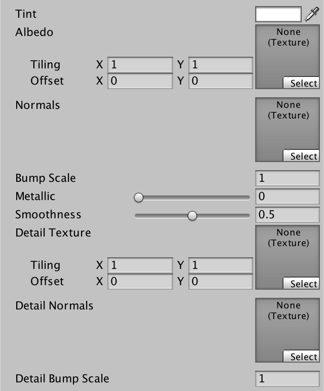						
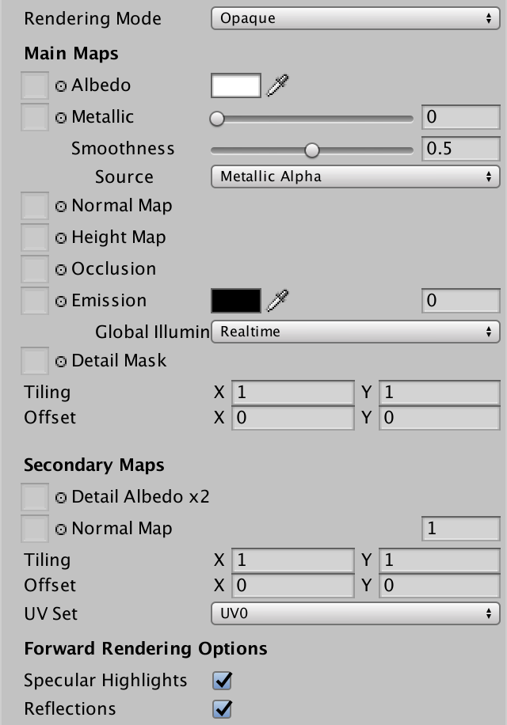 						Our default inspector vs. the standard shader inspector. 					

### ShaderGUI

We can create a custom inspector by adding a class that extends `UnityEditor.ShaderGUI`. As it is an editor class, place its script file in an *Editor* folder.

```
using UnityEngine;
using UnityEditor;

public class MyLightingShaderGUI : ShaderGUI {
}
```

 							Don't we need to extend `MaterialEditor`? 							 						

To use a custom GUI, you have to add the `**CustomEditor**` directive to a shader, followed by a string containing the name of the GUI class to use.

```
Shader "Custom/My First Lighting Shader" {
	…
	
	CustomEditor "MyLightingShaderGUI"
}
```

 							Can `ShaderGUI` classes be put inside namespaces? 							 						

To replace the default inspector, we have to override the `ShaderGUI.OnGUI` method. This method has two parameters. First, a reference to a `MaterialEditor`. This object manages the inspector of the currently selected material. Second, an array containing that material's properties.

```
public class MyLightingShaderGUI : ShaderGUI {
	
	public override void OnGUI (
		MaterialEditor editor, MaterialProperty[] properties
	) {
	}
}
```

Inside this method, we can create our own GUI. As we're not doing so yet, the inspector has become empty.

### Creating a Label

The standard shader GUI is split into two sections, one for the  main maps, and another for the secondary maps. We'll use the same  layout in our GUI. To keep the code clean, we'll use separate methods  for distinct parts of the GUI. We start with the main section and its  label.

```
	public override void OnGUI (
		MaterialEditor editor, MaterialProperty[] properties
	) {
		DoMain();
	}
	
	void DoMain() {
		GUILayout.Label("Main Maps");
	}
```

 							
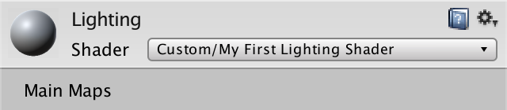 							Main maps label. 						

 							How does `GUILayout` work? 							 						

The standard shader has a bold label, so we want a bold label  as well. This is done by adding a GUI style to the label, in this case `EditorStyles.boldLabel`.

```
		GUILayout.Label("Main Maps", EditorStyles.boldLabel);
```

 							
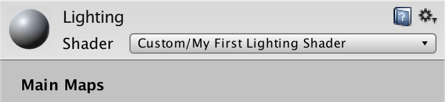 							Bold label. 						

### Showing Albedo

To show the properties of our material, we have to access them in our methods. We could pass the parameters of `OnGUI` on to all other methods, but this would lead to a lot of repeated code. Instead, let's put them in fields.

```
	MaterialEditor editor;
	MaterialProperty[] properties;

	public override void OnGUI (
		MaterialEditor editor, MaterialProperty[] properties
	) {
		this.editor = editor;
		this.properties = properties;
		DoMain();
	}
```

 							Do we need to copy the references each time `OnGUI` is invoked? 							 						

The albedo map is shown first in the standard shader. This is  the main texture. Its property sits somewhere inside the properties  array. Its array index depends on the order in which the properties are  defined in our shader. But it is more robust to search for it by name. `ShaderGUI` contains the `FindProperty` method, which does exactly that, given a name and a property array.

```
	void DoMain () {
		GUILayout.Label("Main Maps", EditorStyles.boldLabel);

		MaterialProperty mainTex = FindProperty("_MainTex", properties);
	}
```

Besides the texture property, we also need to define the contents of a label. This is done with `GUIContent`, which is a simple container class.

```
		MaterialProperty mainTex = FindProperty("_MainTex", properties);
		GUIContent albedoLabel = new GUIContent("Albedo");
```

But we've already named the main texture *Albedo* in our shader. We can just use that name, which we can access via the property.

```
		GUIContent albedoLabel = new GUIContent(mainTex.displayName);
```

To create one of those small texture widgets, we have to rely  on the editor that we've been given a reference to. It has a collection  of methods to draw such widgets.

```
		MaterialProperty mainTex = FindProperty("_MainTex", properties);
		GUIContent albedoLabel = new GUIContent(mainTex.displayName);
		editor.TexturePropertySingleLine(albedoLabel, mainTex);
```

 							
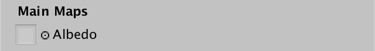 							Albedo map. 						

This is beginning to look like the standard shader! But that  inspector also has tooltips, when you hover over the property labels. In  the case of the albedo map, it says *Albedo (RGB) and Transparency (A)*.

We can add a tooltip as well, by simply adding it to the label content. As we don't support transparency yet, let's just use *Albedo (RGB)*.

```
		GUIContent albedoLabel =
			new GUIContent(mainTex.displayName, "Albedo (RGB)");
```

 							
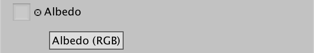 							Albedo with tooltip. 						

The `TexturePropertySingleLine` method has variants  that work with more than one property, up to three. The first should be a  texture, but the others can be something else. They will all be put on  the same line. We can use this to display the tint next to the texture.

```
		MaterialProperty tint = FindProperty("_Tint", properties);
		editor.TexturePropertySingleLine(albedoLabel, mainTex, tint);
```

 							
 							Albedo map and tint. 						

Let's skip ahead to the bottom of the main section. That's  where the tiling and offset values of the main texture are shown. This  is done with the `MaterialEditor.TextureScaleOffsetProperty` method.

```
		editor.TexturePropertySingleLine(albedoLabel, mainTex, tint);
		editor.TextureScaleOffsetProperty(mainTex);
```

 							
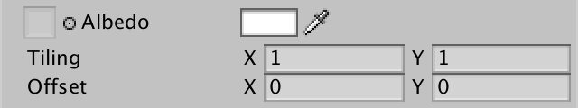 							Tiling and offset. 						

### Convenience Methods

Instead of using the existing `FindProperty` method, let's create one that only requires a name parameter, taking advantage of our `properties` field. This will make our code more legible.

```
	MaterialProperty FindProperty (string name) {
		return FindProperty(name, properties);
	}
```

Switch to using this method in `DoMain`. Also, we can directly pass the tint property to the `TexturePropertySingleLine` method. We're not using it anywhere else.

```
	void DoMain () {
		GUILayout.Label("Main Maps", EditorStyles.boldLabel);

		MaterialProperty mainTex = FindProperty("_MainTex");
//		MaterialProperty tint = FindProperty("_Tint", properties);
		GUIContent albedoLabel =
			new GUIContent(mainTex.displayName, "Albedo (RGB)");
		editor.TexturePropertySingleLine(
			albedoLabel, mainTex, FindProperty("_Tint")
		);
		editor.TextureScaleOffsetProperty(mainTex);
	}
```

Let's also create a method to configure the contents of a label. We only need to use a single static `GUIContent`  instance for this. We'll just replace its text and its tooltip. As we  might not need a tooltip all the time, let's make it optional, with a  default parameter value.

```
	static GUIContent staticLabel = new GUIContent();
	
	static GUIContent MakeLabel (string text, string tooltip = null) {
		staticLabel.text = text;
		staticLabel.tooltip = tooltip;
		return staticLabel;
	}
```

It's even more convenient if we don't have to bother with extracting the display name from properties all the time. So create a `MakeLabel` variant that does this as well.

```
	static GUIContent MakeLabel (
		MaterialProperty property, string tooltip = null
	) {
		staticLabel.text = property.displayName;
		staticLabel.tooltip = tooltip;
		return staticLabel;
	}
```

Now `DoMain` can become even smaller. The same goes for all our future methods.

```
	void DoMain () {
		GUILayout.Label("Main Maps", EditorStyles.boldLabel);

		MaterialProperty mainTex = FindProperty("_MainTex");
//		GUIContent albedoLabel =
//			new GUIContent(mainTex.displayName, "Albedo (RGB)");
		editor.TexturePropertySingleLine(
			MakeLabel(mainTex, "Albedo (RGB)"), mainTex, FindProperty("_Tint")
		);
		editor.TextureScaleOffsetProperty(mainTex);
	}
```

### Showing Normals

The next texture to be displayed is the normal map. Instead of putting all the code in `DoMain`, delegate it to a separate `DoNormals` method. Invoke it after the albedo line, before the tiling and offset.

```
		DoNormals();
		editor.TextureScaleOffsetProperty(mainTex);
```

The new `DoNormals` method simply retrieves the map  property and displays it. The standard shader doesn't provide any extra  tooltip info, so we won't either.

```
	void DoNormals () {
		MaterialProperty map = FindProperty("_NormalMap");
		editor.TexturePropertySingleLine(MakeLabel(map), map);
	}
```

Of course there is a bump scale as well, so add it to the line.

```
		editor.TexturePropertySingleLine(
			MakeLabel(map), map, FindProperty("_BumpScale")
		);
```

 							
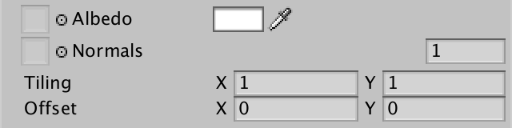 							Normal map and bump scale. 						

The standard shader only shows the bump scale when there is a  normal map assigned to the material. We can do this too, by checking  whether the property references a texture. If it does, show the bump  scale. If not, just use `**null**` as an argument for `TexturePropertySingleLine`.

```
		editor.TexturePropertySingleLine(
			MakeLabel(map), map,
			map.textureValue ? FindProperty("_BumpScale") : null
		);
```

 							
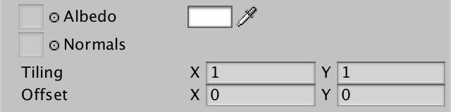 							Hidden bump scale. 						

### Showing Metallic and Smoothness

The metallic and smoothness properties are simple float ranges. At least, for now. We can show them via the general-purpose `MaterialEditor.ShaderProperty` method. Unlike the texture methods, this method has the property as its first argument. The label contents come second.

```
	void DoMain () {
		…
		editor.TexturePropertySingleLine(
			MakeLabel(mainTex, "Albedo (RGB)"), mainTex, FindProperty("_Tint")
		);
		DoMetallic();
		DoSmoothness();
		DoNormals();
		editor.TextureScaleOffsetProperty(mainTex);
	}
	
	…
	
	void DoMetallic () {
		MaterialProperty slider = FindProperty("_Metallic");
		editor.ShaderProperty(slider, MakeLabel(slider));
	}

	void DoSmoothness () {
		MaterialProperty slider = FindProperty("_Smoothness");
		editor.ShaderProperty(slider, MakeLabel(slider));
	}
```

 							
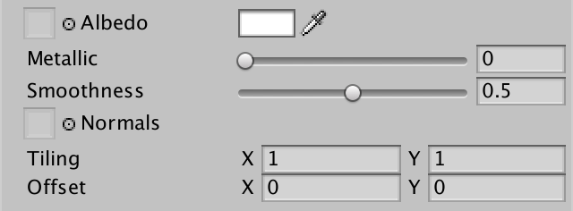 							Metallic and smoothness. 						

We can make these properties line up with the other labels, by  increasing the indent level of the editor. In this case, by two steps.

The indent level can be adjusted via the static `EditorGUI.indentLevel` property. Make sure to reset it to its old value afterwards.

```
	void DoMetallic () {
		MaterialProperty slider = FindProperty("_Metallic");
		EditorGUI.indentLevel += 2;
		editor.ShaderProperty(slider, MakeLabel(slider));
		EditorGUI.indentLevel -= 2;
	}

	void DoSmoothness () {
		MaterialProperty slider = FindProperty("_Smoothness");
		EditorGUI.indentLevel += 2;
		editor.ShaderProperty(slider, MakeLabel(slider));
		EditorGUI.indentLevel -= 2;
	}
```

 							
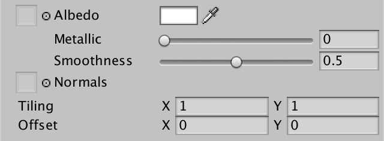 							Indented properties. 						

### Showing the Secondary Maps

The secondary maps work just like the main maps. So create a `DoSecondary` method which takes care of the bold label, the detail texture, and its tiling and offset.

```
	public override void OnGUI (
		MaterialEditor editor, MaterialProperty[] properties
	) {
		this.editor = editor;
		this.properties = properties;
		DoMain();
		DoSecondary();
	}
	
	…
	
	void DoSecondary () {
		GUILayout.Label("Secondary Maps", EditorStyles.boldLabel);

		MaterialProperty detailTex = FindProperty("_DetailTex");
		editor.TexturePropertySingleLine(
			MakeLabel(detailTex, "Albedo (RGB) multiplied by 2"), detailTex
		);
		editor.TextureScaleOffsetProperty(detailTex);
	}
```

Adjust the display name of the detail texture in our shader, to match the standard shader.

```
		_DetailTex ("Detail Albedo", 2D) = "gray" {}
```

 							
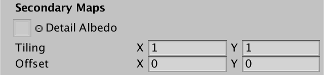 							Secondary maps. 						

The detail normal map works just like the main normal map.  Curiously, the standard shader GUI doesn't hide the detail bump scale.  But we're consistent, so we do hide it when there's no detail normal  map.

```
	void DoSecondary () {
		…
		DoSecondaryNormals();
		editor.TextureScaleOffsetProperty(detailTex);
	}

	void DoSecondaryNormals () {
		MaterialProperty map = FindProperty("_DetailNormalMap");
		editor.TexturePropertySingleLine(
			MakeLabel(map), map,
			map.textureValue ? FindProperty("_DetailBumpScale") : null
		);
	}
```

 							
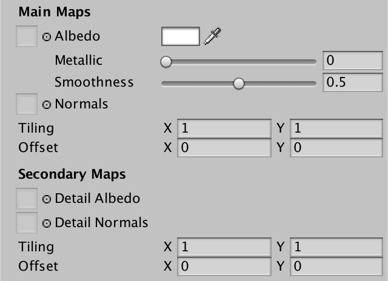 							Complete inspector. 						

unitypackage

## Mixing Metal and Nonmetal

Because our shader uses a uniform value to determine how  metallic something is, it cannot vary across a material's surface. This  prevents us from creating complex materials that actually represent a  mix of different materials. For example, here are the albedo and normal  maps for an artistic impression of computer circuitry.

 						 						 						Albedo and normal map for circuitry. 					

The green parts form the base of the circuit board, while the  blue parts represent lights. These are nonmetallic. The yellow gold  parts represent conductive circuitry, which should be metallic. On top  of that are some brown stains, for variety.

Create a new material with these maps, using our lighting  shader. Make it fairly smooth. Also, because the material isn't bright,  it works with Unity's default ambient environment. So set the scene's *Ambient Intensity* back to 1, if you still had it lowered to zero.

 						
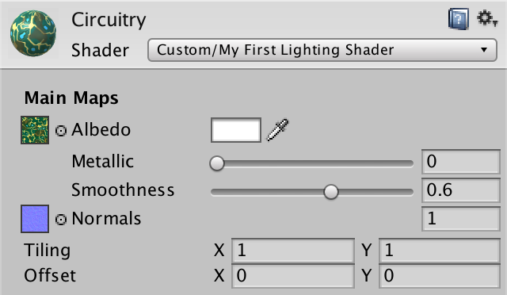 						Circuitry material. 					

Using the *Metallic* slider, we can make  the whole surface either nonmetallic, metallic, or something in between.  This is not sufficient for the circuitry.

 						 						 						Uniform nonmetal vs. metal. 					

### Metallic Maps

The standard shader has support for metallic maps. These maps  define the metallic value per texel, instead of for the whole material  at once. Here is a grayscale map which marks the circuitry as metallic,  and the rest as nonmetallic. Stained metal is darker, because of the  semitransparent dirty layer on top.

 							
 							Metallic map. 						

Add a property for such a map to our shader.

```
	Properties {
		_Tint ("Tint", Color) = (1, 1, 1, 1)
		_MainTex ("Albedo", 2D) = "white" {}

		[NoScaleOffset] _NormalMap ("Normals", 2D) = "bump" {}
		_BumpScale ("Bump Scale", Float) = 1

		[NoScaleOffset] _MetallicMap ("Metallic", 2D) = "white" {}
		[Gamma] _Metallic ("Metallic", Range(0, 1)) = 0
		_Smoothness ("Smoothness", Range(0, 1)) = 0.1

		_DetailTex ("Detail Albedo", 2D) = "gray" {}
		[NoScaleOffset] _DetailNormalMap ("Detail Normals", 2D) = "bump" {}
		_DetailBumpScale ("Detail Bump Scale", Float) = 1
	}
```

 							Do we still need the `NoScaleOffset` attributes? 							 						

Add the corresponding variable to our include file as well.

```
sampler2D _MetallicMap;
float _Metallic;
```

Let's create a function to retrieve the metallic value of a  fragment, with the interpolators as a parameter. It simply samples the  metallic map and multiplies it with the uniform metallic value. Unity  uses the R channel of the map, so we use that channel as well.

```
struct Interpolators {
	…
};

float GetMetallic (Interpolators i) {
	return tex2D(_MetallicMap, i.uv.xy).r * _Metallic;
}
```

Now we can retrieve the metallic value in `MyFragmentProgram`.

```
float4 MyFragmentProgram (Interpolators i) : SV_TARGET {
	…
	
	albedo = DiffuseAndSpecularFromMetallic(
		albedo, GetMetallic(i), specularTint, oneMinusReflectivity
	);
	
	…
}
```

Note that the code of `MyFragmentProgram`  doesn't care how the metallic value is obtained. If you want to  determine the metallic value a different way, you only have to change `GetMetallic`.

### Custom GUI

Had we still used the default shader GUI, the metallic map  would've appeared in the inspector. But now we have to explicitly add it  to `**MyLightingShaderGUI**`, by adjusting `DoMetallic`. Like the standard shader, we show the map and the slider on a single line.

```
	void DoMetallic () {
		MaterialProperty map = FindProperty("_MetallicMap");
		editor.TexturePropertySingleLine(
			MakeLabel(map, "Metallic (R)"), map,
			FindProperty("_Metallic")
		);
	}
```

 							 							 							Using a metallic map. 						

### Map or Slider

The GUI of the standard shader hides the slider when a metallic  map is used. We can do so as well. It works like the bump scales,  except that the value is shown when there's no texture.

```
		editor.TexturePropertySingleLine(
			MakeLabel(map, "Metallic (R)"), map,
			map.textureValue ? null : FindProperty("_Metallic")
		);
```

 							
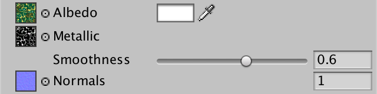 							Hidden slider. 						

### Custom Shader Keywords

The metallic slider is hidden, because the standard shader uses  either a map, or a uniform value. They aren't multiplied. When a  metallic map is provided, the uniform value is ignored. To use the same  approach, we have to distinguish between materials with and without a  metallic map. This can be done by generating two shader variants, one  with and one without the map.

There are already multiple variants of our shader generated, due to the `#pragma multi_compile`  directives in our shader. They're based on keywords provided by Unity.  By defining our own shader keywords, we can create the variants that we  need.

You can name custom keywords however you like, but the  convention is to use uppercase words with a leading underscore. In this  case, we'll use *_METALLIC_MAP*.

 							Where are custom keywords defined? 							 						

To add custom keywords to a material, we have to access the  material directly in our GUI. We can get to the currently selected  material via the `MaterialEditor.target` property. As this is actually an inherited property from the base `Editor` class, it has the generic `Object` type. So we have to cast it to `Material`.

```
	Material target;
	MaterialEditor editor;
	MaterialProperty[] properties;

	public override void OnGUI (
		MaterialEditor editor, MaterialProperty[] properties
	) {
		this.target = editor.target as Material;
		this.editor = editor;
		this.properties = properties;
		DoMain();
		DoSecondary();
	}
```

Adding a keyword to a shader is done with the `Material.EnableKeyword` method, which has the keyword's name as a parameter. For removal of a keyword, there's `Material.DisableKeyword`. Let's create a convenient method that enables or disables a keyword based on a boolean parameter.

```
	void SetKeyword (string keyword, bool state) {
		if (state) {
			target.EnableKeyword(keyword);
		}
		else {
			target.DisableKeyword(keyword);
		}
	}
```

Now we can toggle our custom *_METALLIC_MAP* keyword, based on whether there's a texture assigned to the *_MetallicMap* material property.

```
	void DoMetallic () {
		…
		SetKeyword("_METALLIC_MAP", map.textureValue);
	}
```

### Debugging Keywords

You can use the debug inspector to verify that our keyword gets  added to or removed from the material. You can switch the inspector to  debug mode via the dropdown menu at the top right of its tab bar. The  custom keywords are shown as a list in the *Shader Keywords* text field.

 							
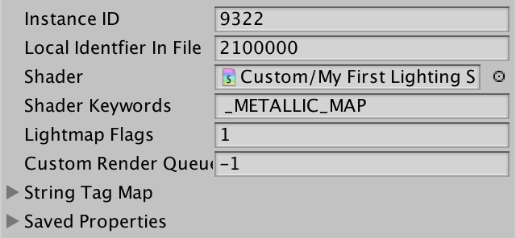 							Debug inspector. 						

Any unexpected shader keywords you find here have been defined  because of previous shaders that were assigned to the material. For  example, as soon as you selected a new material, the standard shader GUI  will add the _EMISSION keyword. They are useless to our shader, so  remove them from the list.

### Shader Features

To generate the shader variants, we have to add another  multi-compile directive to our shader. Do this for both the base pass  and the additive pass. The shadow pass doesn't need it.

```
			#pragma target 3.0

			#pragma multi_compile _ _METALLIC_MAP
```

When showing the shader variants, you will see that our custom  keyword has been included. The base pass now has a total of eight  variants.

```
// Total snippets: 3
// -----------------------------------------
// Snippet #0 platforms ffffffff:
SHADOWS_SCREEN VERTEXLIGHT_ON _METALLIC_MAP

8 keyword variants used in scene:

<no keywords defined>
VERTEXLIGHT_ON
SHADOWS_SCREEN
SHADOWS_SCREEN VERTEXLIGHT_ON
_METALLIC_MAP
VERTEXLIGHT_ON _METALLIC_MAP
SHADOWS_SCREEN _METALLIC_MAP
SHADOWS_SCREEN VERTEXLIGHT_ON _METALLIC_MAP
```

When using a multi-compile directive, Unity generates shader  variants for all possible combinations. Compiling all permutations can  take a lot of time, when many keywords are used. All these variants are  also included in builds, which might be unnecessary.

An alternative is to define a shader feature, instead of a  multi-compile directive. The difference is that permutations of shader  features are only compiled when needed. If no material uses a certain  keyword, then no shader variants for that keyword are compiled. Unity  also checks which keywords are used in builds, only including the  necessary shader variants.

So let's used `#pragma shader_feature` for our custom keyword.

```
			#pragma shader_feature _ _METALLIC_MAP
```

 							When can you use shader features? 							 						

If the shader feature is a toggle for a single keyword, you can omit the single underscore.

```
			#pragma shader_feature _METALLIC_MAP
```

After making this change, all shader variants are still listed, although the order in which Unity lists them might be different.

```
// Total snippets: 3
// -----------------------------------------
// Snippet #0 platforms ffffffff:
_METALLIC_MAP
SHADOWS_SCREEN VERTEXLIGHT_ON

8 keyword variants used in scene:

<no keywords defined>
_METALLIC_MAP
VERTEXLIGHT_ON
VERTEXLIGHT_ON _METALLIC_MAP
SHADOWS_SCREEN
SHADOWS_SCREEN _METALLIC_MAP
SHADOWS_SCREEN VERTEXLIGHT_ON
SHADOWS_SCREEN VERTEXLIGHT_ON _METALLIC_MAP
```

Finally, adjust the `GetMetallic` function in our include file. When *_METALLIC_MAP* is defined, sample the map. Otherwise, return the uniform value.

```
float GetMetallic (Interpolators i) {
	#if defined(_METALLIC_MAP)
		return tex2D(_MetallicMap, i.uv.xy).r;
	#else
		return _Metallic;
	#endif
}
```

 							So either `_MetallicMap` or `_Metallic` is used, never both? 							 						

### Only Setting Keywords When Needed

At the moment, we're setting the material's keyword every time `OnGUI`  is invoked, which is often. Logically, we only have to do this when the  map property has been edited. We can check whether something was  changed by using the `EditorGUI.BeginChangeCheck` and `EditorGUI.EndChangeCheck`  methods. The first method defines the point from which we want to begin  tracking changes. The second method marks the end, and returns whether a  change was made.

By putting these methods before and after the invocation of `TexturePropertySingleLine`, we can easily detect whether the metallic line was edited. If so, we set the keyword.

```
	void DoMetallic () {
		MaterialProperty map = FindProperty("_MetallicMap");
		EditorGUI.BeginChangeCheck();
		editor.TexturePropertySingleLine(
			MakeLabel(map, "Metallic (R)"), map,
			map.textureValue ? null : FindProperty("_Metallic")
		);
		if (EditorGUI.EndChangeCheck()) {
			SetKeyword("_METALLIC_MAP", map.textureValue);
		}
	}
```

 							Doesn't this also trigger when `_Metallic` is changed? 							 						

 							Does this work with undo and redo? 							 						

unitypackage

## Smoothness Maps

Like the metallic map, smoothness can also be defined via a map.  Here is a grayscale smoothness texture for the circuitry. The metal  parts are the smoothest, followed by the lights. The rest is fairly  rough. The stains are smoother than the board, so the texture is lighter  there.

 						
 						Smoothness map. 					

Unity's standard shader expects smoothness to be stored in the  alpha channel. In fact, it is expected that the metallic and smoothness  maps are combined in the same texture. Because DXT5 compressed the RGB  and the A channels separately, merging the maps into one DXT5 texture  produces the same quality as using two DXT1 textures. This doesn't  require less memory, but allows us to retrieve both metallic and  smoothness from a single texture sample, instead of two.

Here is a texture that combines both maps. Although metallic  only needs the R channel, I still filled the RGB channels with the  metallic value. Smoothness uses the alpha channel.

 						
 						Metallic and smoothness map. 					

### Determining Smoothness

When there is a metallic map, we can get the smoothness from there. Otherwise, we use the uniform *_Smoothness* property. Add a `GetSmoothness` function to our include file to take care of this. It's almost exactly like `GetMetallic`.

```
float GetSmoothness (Interpolators i) {
	#if defined(_METALLIC_MAP)
		return tex2D(_MetallicMap, i.uv.xy).a;
	#else
		return _Smoothness;
	#endif
}
```

 							Aren't we still sampling the texture twice? 							 						

Actually, the standard shader has two different properties for  smoothness. One is the stand-alone uniform value, like we have. The  other is a scalar that modulates the smoothness map. Let's keep it  simple and use the *_Smoothness* property for both purposes. This means that you have to set it to 1 to get the unmodified smoothness map values.

```
		return tex2D(_MetallicMap, i.uv.xy).a * _Smoothness;
```

Use this new function to get the smoothness in `MyFragmentProgram`.

```
float4 MyFragmentProgram (Interpolators i) : SV_TARGET {
	…

	return UNITY_BRDF_PBS(
		albedo, specularTint,
		oneMinusReflectivity, GetSmoothness(i),
		i.normal, viewDir,
		CreateLight(i), CreateIndirectLight(i, viewDir)
	);
}
```

But that's not the only place where we need the smoothness. `CreateIndirectLight` makes use of it as well. We could add a smoothness parameter to this function. But we can also just invoke `GetSmoothness` a second time. The shader compiler will detect the duplicate code and optimize it away.

```
UnityIndirect CreateIndirectLight (Interpolators i, float3 viewDir) {
	…
		Unity_GlossyEnvironmentData envData;
		envData.roughness = 1 - GetSmoothness(i);
	…
}
```

 							 							 							Mapped smoothness, at full strength. 						

 							What are those square artifacts along the edges of the metal strips? 							 						

### Combining Smoothness with Albedo

Combining metallic and smoothness maps into a single texture is  fine, when you need both of them. Metallic parts are nearly always  smoother than the other bits. So when you need a metallic map, you  practically always want a smoothness map too. But you might need a  smoothness map, without mixing metals and nonmetals. In that case, the  metallic map is useless.

For opaque materials that don't require a metallic map, it is  possible to store the smoothness in the alpha channel of the albedo map.  As this practice is common, the standard shader supports packing  smoothness in either the metallic map or the albedo map. Let's support  this too.

### Switching Between Keywords

Like the standard shader, we have to add an option to pick the  smoothness source to our GUI. Although the standard shader only supports  the choice between two maps, let's go ahead and include a uniform  smoothness as a third option as well. To represent these options, define  an enumeration type inside `**MyLightingShaderGUI**`.

```
	enum SmoothnessSource {
		Uniform, Albedo, Metallic
	}
```

When the albedo map is used as the smoothness source, we'll add the *_SMOOTHNESS_ALBEDO* keyword to the material. When the metallic source is used, we'll add *_SMOOTHNESS_METALLIC* instead. The uniform option corresponds with no keyword.

The standard shader also uses a float property to track which  option a material uses, but we can make do with the keywords alone. The  GUI can determine the current choice by checking which keyword is  enabled. This can be done via the `Material.IsKeywordEnabled` method, for which we'll create a convenient wrapper.

```
	bool IsKeywordEnabled (string keyword) {
		return target.IsKeywordEnabled(keyword);
	}
```

Now `DoSmoothness` can figure out the current smoothness source of the selected material.

```
	void DoSmoothness () {
		SmoothnessSource source = SmoothnessSource.Uniform;
		if (IsKeywordEnabled("_SMOOTHNESS_ALBEDO")) {
			source = SmoothnessSource.Albedo;
		}
		else if (IsKeywordEnabled("_SMOOTHNESS_METALLIC")) {
			source = SmoothnessSource.Metallic;
		}
		
		…
	}
```

To show the options, we can use the `EditorGUILayout.EnumPopup` method. Increase the indent level an additional step, to match the layout of the standard shader.

```
		EditorGUI.indentLevel += 2;
		editor.ShaderProperty(slider, MakeLabel(slider));
		EditorGUI.indentLevel += 1;
		EditorGUILayout.EnumPopup(MakeLabel("Source"), source);
		EditorGUI.indentLevel -= 3;
```

 							
 							Smoothness source popup. 						

`EnumPopup` is a basic editor widget which creates a  popup list for any enumeration. It returns the selected value. If the  user doesn't choose a new option, this value is the same as the original  choice. Otherwise, it is different. So to know which option was chosen,  we have to assign it back to the source variable. As the method works  with the generic enumeration type, we have to cast it to `**SmoothnessSource**`.

```
		source = (SmoothnessSource)EditorGUILayout.EnumPopup(
			MakeLabel("Source"), source
		);
```

If a change has been made, we can use the source variable to control which keyword should be set, if any.

```
		EditorGUI.BeginChangeCheck();
		source = (SmoothnessSource)EditorGUILayout.EnumPopup(
			MakeLabel("Source"), source
		);
		if (EditorGUI.EndChangeCheck()) {
			SetKeyword("_SMOOTHNESS_ALBEDO", source == SmoothnessSource.Albedo);
			SetKeyword(
				"_SMOOTHNESS_METALLIC", source == SmoothnessSource.Metallic
			);
		}
```

 							
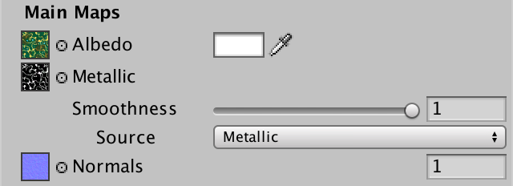 							Smoothness from the metallic map. 						

### Supporting Undo

We can now change the smoothness source, but it doesn't support  undo and redo actions yet. Because we're using a basic widget, we have  to manually signal that we performed an action that should support undo.  This can be done via the `MaterialEditor.RegisterPropertyChangeUndo` method, which has a descriptive label as a parameter. Create a wrapper for this method as well.

```
	void RecordAction (string label) {
		editor.RegisterPropertyChangeUndo(label);
	}
```

`RecordAction` must be invoked before the change  that we're about to make. It creates a snapshot of the old state, so an  undo action can revert to it.

```
		if (EditorGUI.EndChangeCheck()) {
			RecordAction("Smoothness Source");
			SetKeyword("_SMOOTHNESS_ALBEDO", source == SmoothnessSource.Albedo);
			SetKeyword(
				"_SMOOTHNESS_METALLIC", source == SmoothnessSource.Metallic
			);
		}
```

### Smoothness Variants

To support all three options, add a shader feature that selects between no keyword, *_SMOOTHNESS_ALBEDO*, and *_SMOOTHNESS_METALLIC*. As before, both the base and additive passes have to support it.

```
			#pragma shader_feature _METALLIC_MAP
			#pragma shader_feature _ _SMOOTHNESS_ALBEDO _SMOOTHNESS_METALLIC
```

In `GetSmoothness`, start with a  smoothness of 1. Then check whether the albedo source is chosen. If so,  replace the 1 with the albedo map. Otherwise, check whether the metallic  source is chosen, and if so use the metallic map instead. Of course  this is only sensible when the material actually uses a metallic map, so  check for that as well.

After that, return whatever smoothness value we got, multiplied with the value of the *_Smoothness* property. If we end up with a variant that does not use a map, the compiler will optimize away the multiplication with 1.

```
float GetSmoothness (Interpolators i) {
	float smoothness = 1;
	#if defined(_SMOOTHNESS_ALBEDO)
		smoothness = tex2D(_MainTex, i.uv.xy).a;
	#elif defined(_SMOOTHNESS_METALLIC) && defined(_METALLIC_MAP)
		smoothness = tex2D(_MetallicMap, i.uv.xy).a;
	#endif
	return smoothness * _Smoothness;
}
```

### Lava Material

Here are example albedo and normal maps for an artistic  impression of cooled lava. The material isn't metallic, but does have  varying smoothness. So the smoothness values are stored in the alpha  channel of the albedo map.

 							 							 							Albedo with smoothness, and normals. 						

Create a material with these maps, using the albedo source option for smoothness.

 							
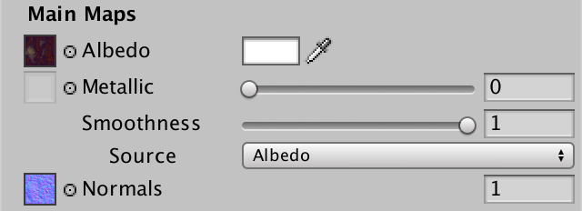 							Lava material. 						

When using the albedo source, the grayish lumps turn out to be significantly smoother than the reddish gulleys.

 							 							 							Uniform vs. mapped, using albedo alpha. 						

unitypackage

## Emissive Surfaces

So far, we've only worked with materials that reflect light, via  either diffuse or specular reflection. We need a light source to see  such surfaces. But there are also surfaces that emit light themselves.  For example, when something becomes hot enough, it starts to glow. You  don't need a different light source to see that. The standard shader  supports this via an emissive map and color, and so will we.

### Mapped and Uniform

Add properties for an emission map and color to our shader.  Both should be black by default, meaning that no light is emitted. As we  only care about the RGB channels, we can omit the fourth component of  the default color.

```
		[NoScaleOffset] _EmissionMap ("Emission", 2D) = "black" {}
		_Emission ("Emission", Color) = (0, 0, 0)
```

Many materials won't have an emission map, so let's use a  shader feature to create variants without and with an emission map.  Because we only have to add the emitted light once, only include the  feature in the base pass.

```
			#pragma shader_feature _METALLIC_MAP
			#pragma shader_feature _ _SMOOTHNESS_ALBEDO _SMOOTHNESS_METALLIC
			#pragma shader_feature _EMISSION_MAP
```

Add the required sampler and float variables to the include file.

```
sampler2D _EmissionMap;
float3 _Emission;
```

Create a `GetEmission` function to  retrieve the emitted color, if any. When there's a map, sample it and  multiply with the uniform color. Otherwise, just return the uniform  color. But only bother to do this in the base pass. In all other cases,  the emission is zero, which the compiler will optimize away.

```
float3 GetEmission (Interpolators i) {
	#if defined(FORWARD_BASE_PASS)
		#if defined(_EMISSION_MAP)
			return tex2D(_EmissionMap, i.uv.xy) * _Emission;
		#else
			return _Emission;
		#endif
	#else
		return 0;
	#endif
}
```

As the emission comes from the object itself, it is independent of the reflected light. So just add it to the final color.

```
float4 MyFragmentProgram (Interpolators i) : SV_TARGET {
	…

	float4 color = UNITY_BRDF_PBS(
		albedo, specularTint,
		oneMinusReflectivity, GetSmoothness(i),
		i.normal, viewDir,
		CreateLight(i), CreateIndirectLight(i, viewDir)
	);
	color.rgb += GetEmission(i);
	return color;
}
```

### Adding Emission to the GUI

Create a `DoEmission` method inside `**MyLightingShaderGUI**`. The quickest way to do this is by duplicating `DoMetallic` and making a few changes.

```
	void DoEmission () {
		MaterialProperty map = FindProperty("_EmissionMap");
		EditorGUI.BeginChangeCheck();
		editor.TexturePropertySingleLine(
			MakeLabel(map, "Emission (RGB)"), map, FindProperty("_Emission")
		);
		if (EditorGUI.EndChangeCheck()) {
			SetKeyword("_EMISSION_MAP", map.textureValue);
		}
	}
```

Include it in the main maps section.

```
	void DoMain () {
		…
		DoNormals();
		DoEmission();
		editor.TextureScaleOffsetProperty(mainTex);
	}
```

 							
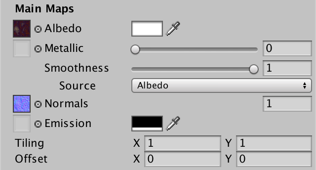 							Inspector with emission map and color. 						

### HDR Emission

The standard shader doesn't use a regular color for emission.  Instead, it supports high-dynamic-range colors. This means that the RGB  components of the color can be higher than 1. This way, you can  represent extremely bright light.

 							Can we see colors that are brighter than 1? 							 						

As color properties are float vectors, we are not limited to  just values in the 0–1 range. However, the standard color widget is  designed with this limit in mind. Fortunately, `MaterialEditor` contains the `TexturePropertyWithHDRColor`  method, which is specifically made for a texture plus an HDR color  property. It requires two additional parameters. First, configuration  options for the HDR range. Second, whether the alpha channel should be  shown, which we do not want.

```
	void DoEmission () {
		…
		editor.TexturePropertyWithHDRColor(
			MakeLabel("Emission (RGB)"), map, FindProperty("_Emission"),
			emissionConfig, false
		);
		…
	}
```

The HDR color widget is configured via a `ColorPickerHDRConfig`  object. This object contains the allowed brightness and exposure range.  The standard shader uses 0–99 for brightness, and nearly zero to 3 for  exposure. We'll simply use the same ranges.

```
	static ColorPickerHDRConfig emissionConfig =
		new ColorPickerHDRConfig(0f, 99f, 1f / 99f, 3f);
```

 							
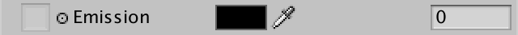 							Inspector with HDR emission. 						

The extra value after the color picker corresponds with the  brightness of the color. This is simply the largest of the RGB channels.  A quick way to switch the emissive color to black or white is to set  this value to 0 or 1.

### Emissive Lava

Here is an emission map for the lava material. It makes the  lava in the gulleys glowing hot. You can change the brightness and tint  of the emission by adjusting the uniform color.

 							 							 							Emission map for lava. 						

 							I assigned the emission map, but it doesn't show? 							 						

 							 							 							Glowing lava, lit and unlit. 						

### Emissive Circuitry

And here is an emission map for the circuitry lights.

 							 							 							Emission map for circuitry. 						

The lights have varying brightness, and the stains affect them as well.

 							 							 							Circuitry with functioning lights, lit and unlit. 						

 							Does the emitted light illuminate other objects? 							 						

The next tutorial is [More Complexity](https://catlikecoding.com/unity/tutorials/rendering/part-10/).

unitypackage

PDF

Enjoying the [tutorials](https://catlikecoding.com/unity/tutorials/)? Are they useful? Want more?

**Please support me on Patreon!**

[](https://www.patreon.com/catlikecoding)

**Or make a direct donation!**

made by [Jasper Flick](https://catlikecoding.com/jasper-flick/)
