# Rendering 15

Deferred Lights

- Use a custom light shader.
- Decode LDR colors.
- Add lighting in a separate pass.
- Support directional, spotlight, and point lights.
- Manually sample shadow maps.

This is part 15 of a tutorial series about rendering. In the [previous installment](https://catlikecoding.com/unity/tutorials/rendering/part-14), we added fog. Now we'll create our own deferred lights.

From now on, the Rendering tutorials are made with Unity 5.6.0.  This Unity version changes a few things in both the editor and shaders,  but you should still be able to find your way.

 					
 					Playing with our own deferred lights. 				

## Light Shader

We added support for the deferred rendering path in [Rendering 13, Deferred Shading](https://catlikecoding.com/unity/tutorials/rendering/part-13/).  All we had to do was fill the G-buffers. The lights were rendered  later. The tutorial briefly explained how those lights were added by  Unity. This time, we'll render these lights ourselves.

To test the lights, I'll use a simple scene with its ambient intensity set to zero. It is rendered with a deferred HDR camera.

 						 						 						Test scene, with and without directional light. 					

All objects in the scene are rendered to the G-buffers with our  own shader. But the lights are rendered with Unity's default deferred  shader, which is named *Hidden / Internal-DefferedShader*. You can verify this by going to the graphics settings via *Edit / Project Settings / Graphics* and switching the *Deferred* shader mode to *Custom shader*.

 						
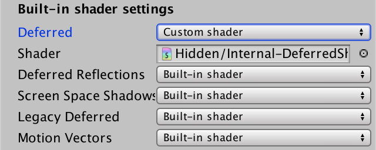 						Default deferred light shader. 					

### Using a Custom Shader

Each deferred light is rendered in a separate pass, modifying  the colors of the image. Effectively, they're image effects, like our  deferred fog shader from [the previous tutorial](https://catlikecoding.com/unity/tutorials/rendering/part-14/). Let's start with a simple shader that overwrites everything with black.

```
Shader "Custom/DeferredShading" {
	
	Properties {
	}

	SubShader {

		Pass {
			Cull Off
			ZTest Always
			ZWrite Off
			
			CGPROGRAM

			#pragma target 3.0
			#pragma vertex VertexProgram
			#pragma fragment FragmentProgram
			
			#pragma exclude_renderers nomrt
			
			#include "UnityCG.cginc"

			struct VertexData {
				float4 vertex : POSITION;
			};

			struct Interpolators {
				float4 pos : SV_POSITION;
			};

			Interpolators VertexProgram (VertexData v) {
				Interpolators i;
				i.pos = UnityObjectToClipPos(v.vertex);
				return i;
			}

			float4 FragmentProgram (Interpolators i) : SV_Target {
				return 0;
			}

			ENDCG
		}
	}
}
```

Instruct Unity to use this shader when rendering deferred lights.

 							
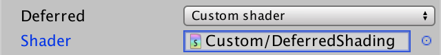 							Using our custom shader. 						

### A Second Pass

After switching to our shader, Unity complains that it doesn't  have enough passes. Apparently, a second pass is needed. Let's just  duplicate the pass that we already have and see what happens.

```
		Pass {
			…
		}

		Pass {
			…
		}
```

Unity now accepts our shader and uses it to render the  directional light. As a result, everything becomes black. The only  exception is the sky. The stencil buffer is used as a mask to avoid  rendering there, because the directional light doesn't affect the  background.

 							 							 							Custom shader, lit and unlit. 						

But what about that second pass? Remember that when HDR is  disabled, light data is logarithmically encoded. A final pass is needed  to reverse this encoding. That's what the second pass is for. So if you  disabled HDR for the camera, the second pass of our shader will also be  used, once.

### Avoiding the Sky

When rendering in LDR mode, you might see the sky turn black  too. This can happen in the scene view or the game view. If the sky  turns black, the conversion pass doesn't correctly use the stencil  buffer as a mask. To fix this, explicitly configure the stencil settings  of the second pass. We should only render when we're dealing with a  fragment that's not part of the background. The appropriate stencil  value is provided via `_StencilNonBackground`.

```
		Pass {
			Cull Off
			ZTest Always
			ZWrite Off

			Stencil {
				Ref [_StencilNonBackground]
				ReadMask [_StencilNonBackground]
				CompBack Equal
				CompFront Equal
			}
			
			…
		}
```

 							Can we debug the stencil buffer? 							 						

### Converting Colors

To make the second pass work, we have to convert the data in  the light buffer. Like our fog shader, a full-screen quad is drawn with  UV coordinates that we can use to sample the buffer.

```
			struct VertexData {
				float4 vertex : POSITION;
				float2 uv : TEXCOORD0;
			};

			struct Interpolators {
				float4 pos : SV_POSITION;
				float2 uv : TEXCOORD0;
			};

			Interpolators VertexProgram (VertexData v) {
				Interpolators i;
				i.pos = UnityObjectToClipPos(v.vertex);
				i.uv = v.uv;
				return i;
			}
```

The light buffer itself is made available to the shader via the `_LightBuffer` variable.

```
			sampler2D _LightBuffer;

			…

			float4 FragmentProgram (Interpolators i) : SV_Target {
				return tex2D(_LightBuffer, i.uv);
			}
```

 							
 							Raw LDR data, when unlit. 						

LDR colors are logarithmically encoded, using the formula 2-C. To decode this, we have to use the formula -log2 C.

```
				return -log2(tex2D(_LightBuffer, i.uv));
```

 							
 							Decoded unlit LDR image. 						

Now that we know that it works, enable HDR again.

unitypackage

## Directional Lights

The first pass takes care of rendering the lights, so it's going  to be fairly complicated. Let's create an include file for it, named *MyDeferredShading.cginc*. Copy all code from the pass to this file.

```
#if !defined(MY_DEFERRED_SHADING)
#define MY_DEFERRED_SHADING

#include "UnityCG.cginc"

…

#endif
```

Then include *MyDeferredShading* in the first pass.

```
		Pass {
			Cull Off
			ZTest Always
			ZWrite Off

			CGPROGRAM

			#pragma vertex VertexProgram
			#pragma fragment FragmentProgram

			#pragma exclude_renderers nomrt

			#include "MyDeferredShading.cginc"

			ENDCG
		}
```

Because we're supposed to add light to the image, we have to  make sure that we don't erase what's already been rendered. We can do so  by changing the blend mode to combine the full source and destination  colors.

```
			Blend One One
			Cull Off
			ZTest Always
			ZWrite Off
```

We need shader variants for all possible light configurations. The `multi_compile_lightpass`  compiler directive creates all keyword combinations that we need. The  only exception is HDR mode. We have to add a separate multi-compile  directive for that.

```
			#pragma exclude_renderers nomrt

			#pragma multi_compile_lightpass
			#pragma multi_compile _ UNITY_HDR_ON
```

Although this shader is used for all three light types, we'll first limit ourselves to directional lights only.

### G-Buffer UV Coordinates

We need UV coordinates to sample from the G-buffers.  Unfortunately, Unity doesn't supply light passes with convenient texture  coordinates. Instead, we have to derive them from the clip-space  position. To do so, we can use the `ComputeScreenPos`, which is defined in `UnityCG`. This function produces homogeneous coordinates, just like the clip-space coordinates, so we have to use a `**float4**` to store them.

```
struct Interpolators {
	float4 pos : SV_POSITION;
	float4 uv : TEXCOORD0;
};

Interpolators VertexProgram (VertexData v) {
	Interpolators i;
	i.pos = UnityObjectToClipPos(v.vertex);
	i.uv = ComputeScreenPos(i.pos);
	return i;
}
```

In the fragment program, we can compute the final 2D coordinates. As explained in [Rendering 7, Shadows](https://catlikecoding.com/unity/tutorials/rendering/part-7/), this has to happen after interpolation.

```
float4 FragmentProgram (Interpolators i) : SV_Target {
	float2 uv = i.uv.xy / i.uv.w;

	return 0;
}
```

### World Position

When we created our [deferred fog image effect](https://catlikecoding.com/unity/tutorials/rendering/part-14/),  we had to figure out the fragment's distance from the camera. We did so  by shooting rays from the camera through each fragment to the far  plane, then scaling those by the fragment's depth value. We can use the  same approach here to reconstruct the fragment's world position.

In the case of directional lights, the rays for the four  vertices of the quad are supplied as normal vectors. So we can just pass  them through the vertex program and interpolate them.

```
struct VertexData {
	float4 vertex : POSITION;
	float3 normal : NORMAL;
};

struct Interpolators {
	float4 pos : SV_POSITION;
    float4 uv : TEXCOORD0;
    float3 ray : TEXCOORD1;
};

Interpolators VertexProgram (VertexData v) {
	Interpolators i;
	i.pos = UnityObjectToClipPos(v.vertex);
	i.uv = ComputeScreenPos(i.pos);
	i.ray = v.normal;
	return i;
}
```

We can find the depth value in the fragment program by sampling the `_CameraDepthTexture` texture and linearizing it, just like we did for the fog effect.

```
UNITY_DECLARE_DEPTH_TEXTURE(_CameraDepthTexture);

…

float4 FragmentProgram (Interpolators i) : SV_Target {
	float2 uv = i.uv.xy / i.uv.w;
	
	float depth = SAMPLE_DEPTH_TEXTURE(_CameraDepthTexture, uv);
	depth = Linear01Depth(depth);

	return 0;
}
```

However, a big difference is that we supplied rays that reached  the far plane to our fog shader. In this case, we are supplied with  rays that reach the near plane. We have to scale them so we get rays  that reach the far plane. This can be done by scaling the ray so its Z  coordinate becomes 1, and multiplying it with the far plane distance.

```
	depth = Linear01Depth(depth);

	float3 rayToFarPlane = i.ray * _ProjectionParams.z / i.ray.z;
```

Scaling this ray by the depth value gives us a position. The  supplied rays are defined in view space, which is the camera's local  space. So we end up with the fragment's position in view space as well.

```
	float3 rayToFarPlane = i.ray * _ProjectionParams.z / i.ray.z;
	float3 viewPos = rayToFarPlane * depth;
```

The conversion from this space to world space is done with the `unity_CameraToWorld` matrix, which is defined in *ShaderVariables*.

```
	float3 viewPos = rayToFarPlane * depth;
	float3 worldPos = mul(unity_CameraToWorld, float4(viewPos, 1)).xyz;
```

### Reading G-Buffer Data

Next, we need access to the G-buffers to retrieve the surface properties. The buffers are made available via three `_CameraGBufferTexture` variables.

```
sampler2D _CameraGBufferTexture0;
sampler2D _CameraGBufferTexture1;
sampler2D _CameraGBufferTexture2;
```

We filled these same buffers in the [Rendering 13, Deferred Shader](https://catlikecoding.com/unity/tutorials/rendering/part-13/) tutorial. Now we get to read from them. We need the albedo, specular tint, smoothness, and normal.

```
	float3 worldPos = mul(unity_CameraToWorld, float4(viewPos, 1)).xyz;

	float3 albedo = tex2D(_CameraGBufferTexture0, uv).rgb;
	float3 specularTint = tex2D(_CameraGBufferTexture1, uv).rgb;
	float3 smoothness = tex2D(_CameraGBufferTexture1, uv).a;
	float3 normal = tex2D(_CameraGBufferTexture2, uv).rgb * 2 - 1;
```

### Computing BRDF

The BRDF functions are defined in *UnityPBSLighting*, so we'll have to include that file.

```
//#include "UnityCG.cginc"
#include "UnityPBSLighting.cginc"
```

Now we only need three more bits of data before we can invoke  the BRDF function in our fragment program. First is the view direction,  which is found as usual.

```
	float3 worldPos = mul(unity_CameraToWorld, float4(viewPos, 1)).xyz;
	float3 viewDir = normalize(_WorldSpaceCameraPos - worldPos);
```

Second is the surface reflectivity. We derive that from the  specular tint. It's simply the strongest color component. We can use the  `SpecularStrength` function to extract it.

```
	float3 albedo = tex2D(_CameraGBufferTexture0, uv).rgb;
	float3 specularTint = tex2D(_CameraGBufferTexture1, uv).rgb;
	float3 smoothness = tex2D(_CameraGBufferTexture1, uv).a;
	float3 normal = tex2D(_CameraGBufferTexture2, uv).rgb * 2 - 1;
	float oneMinusReflectivity = 1 - SpecularStrength(specularTint);
```

Third, we need the light data. Let's start with dummy lights.

```
	float oneMinusReflectivity = 1 - SpecularStrength(specularTint);

	UnityLight light;
	light.color = 0;
	light.dir = 0;
	UnityIndirect indirectLight;
	indirectLight.diffuse = 0;
	indirectLight.specular = 0;
```

Finally, we can compute the contribution of the light for this fragment, using the BRDF function.

```
	indirectLight.specular = 0;

	float4 color = UNITY_BRDF_PBS(
    	albedo, specularTint, oneMinusReflectivity, smoothness,
    	normal, viewDir, light, indirectLight
    );

	return color;
```

### Configuring the Light

Indirect light is not applicable here, so it remains black. But  the direct light has to be configured so it matches the light that's  currently being rendered. For a directional light, we need a color and a  direction. These are made available via the `_LightColor` and `_LightDir` variables.

```
float4 _LightColor, _LightDir;
```

Let's create a separate function to setup the light. Simply copy the variables into a light structure and return it.

```
UnityLight CreateLight () {
	UnityLight light;
	light.dir = _LightDir;
	light.color = _LightColor.rgb;
	return light;
}
```

Use this function in the fragment program.

```
	UnityLight light = CreateLight();
//	light.color = 0;
//	light.dir = 0;
```

 							
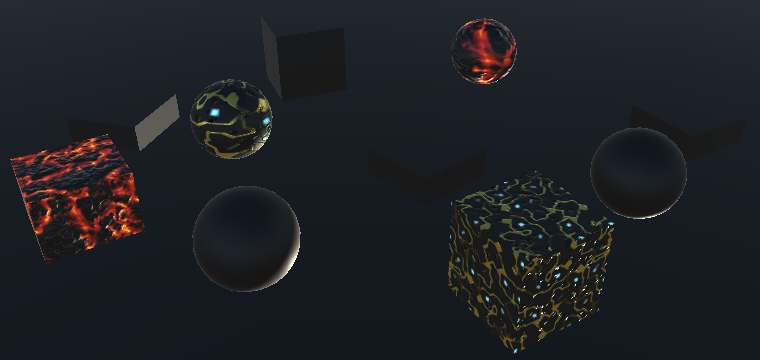 							Light from the wrong direction. 						

We finally get lighting, but it appears to come from the wrong direction. This happens because `_LightDir`  is set to the direction in which the light is traveling. For our  calculations, we need the direction from the surface to the light, so  the opposite.

```
	light.dir = -_LightDir;
```

 							
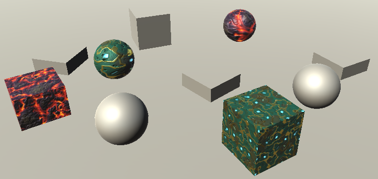 							Directional light, without shadows. 						

### Shadows

In *My Lighting*, we relied on the macros from *AutoLight*  to determine the light attenuation caused by shadows. Unfortunately,  that file wasn't written with deferred lights in mind. So we'll do the  shadow sampling ourselves. The shadow map can be accessed via the `_ShadowMapTexture` variable.

```
sampler2D _ShadowMapTexture;
```

However, we cannot indiscriminately declare this variable. It is already defined for point and spotlight shadows in *UnityShadowLibrary*, which we indirectly include. So we should not define it ourselves, except when working with shadows for directional lights.

```
#if defined (SHADOWS_SCREEN)
	sampler2D _ShadowMapTexture;
#endif
```

To apply directional shadows, we simply have to sample the  shadow texture and use it to attenuate the light color. Doing this in `CreateLight` means that the UV coordinates have to be added to it as a parameter.

```
UnityLight CreateLight (float2 uv) {
	UnityLight light;
	light.dir = -_LightDir;
	float shadowAttenuation = tex2D(_ShadowMapTexture, uv).r;
	light.color = _LightColor.rgb * shadowAttenuation;
	return light;
}
```

Pass the UV coordinates to it in the fragment program.

```
	UnityLight light = CreateLight(uv);
```

 							
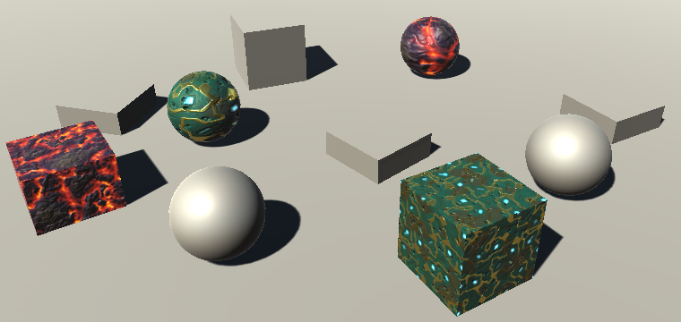 							Directional light with shadows. 						

Of course this is only valid when the directional light has shadows enabled. If not, the shadow attenuation is always 1.

```
	float shadowAttenuation = 1;
	#if defined(SHADOWS_SCREEN)
		shadowAttenuation = tex2D(_ShadowMapTexture, uv).r;
	#endif
	light.color = _LightColor.rgb * shadowAttenuation;
```

### Fading Shadows

The shadow map is finite. It cannot cover the entire world. The  larger an area it covers, the lower the resolution of the shadows.  Unity has a maximum distance up to which shadows are drawn. Beyond that,  there are no real-time shadows. This distance can be adjust via *Edit / Project Settings / Quality*.

 							
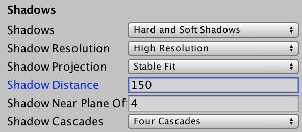 							Shadow distance quality setting. 						

When shadows approach this distance, they fade out. At least,  that's what Unity's shaders do. Because we're manually sampling the  shadow map, our shadows get truncated when the edge of the map is  reached. The result is that shadows get sharply cut off or are missing  beyond the fade distance.

 							 							 							Large and small shadow distance. 						

To fade the shadows, we must first know the distance at which  they should be completely gone. This distance depends on how the  directional shadows are projected. In *Stable Fit* mode the fading is spherical, centered on the middle of the map. In *Close Fit* mode it's based on the view depth.

The `UnityComputeShadowFadeDistance`  function can figure out the correct metric for us. It has the world  position and view depth as parameters. It will either return the  distance from the shadow center, or the unmodified view depth.

```
UnityLight CreateLight (float2 uv, float3 worldPos, float viewZ) {
	UnityLight light;
	light.dir = -_LightDir;
	float shadowAttenuation = 1;
	#if defined(SHADOWS_SCREEN)
		shadowAttenuation = tex2D(_ShadowMapTexture, uv).r;

		float shadowFadeDistance =
			UnityComputeShadowFadeDistance(worldPos, viewZ);
	#endif
	light.color = _LightColor.rgb * shadowAttenuation;
	return light;
}
```

The shadows should begin to fade as they approach the fade distance, completely disappearing once they reach it. The `UnityComputeShadowFade` function calculates the appropriate fade factor.

```
		float shadowFadeDistance =
			UnityComputeShadowFadeDistance(worldPos, viewZ);
		float shadowFade = UnityComputeShadowFade(shadowFadeDistance);
```

 							What do these functions look like? 							 						

The shadow fade factor is a value from 0 to 1, which indicates  how much the shadows should fade away. The actual fading can be done by  simply adding this value to the shadow attenuation, and clamping to 0–1.

```
		float shadowFade = UnityComputeShadowFade(shadowFadeDistance);
		shadowAttenuation = saturate(shadowAttenuation + shadowFade);
```

To make this work, supply the world position and view depth to `CreateLight` in our fragment program. The view depth is the Z component of the fragment's position in view space.

```
	UnityLight light = CreateLight(uv, worldPos, viewPos.z);
```

 							
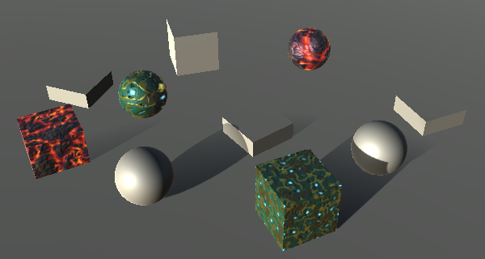 							Fading shadows. 						

### Light Cookies

Another thing that we have to support are light cookies. The cookie texture is made available via `_LightTexture0`.  Besides that, we also have to convert from world to light space, so we  can sample the texture. The transformation for that is made available  via the `unity_WorldToLight` matrix variable.

```
sampler2D _LightTexture0;
float4x4 unity_WorldToLight;
```

In `CreateLight`, use the matrix to  convert the world position to light-space coordinates. Then use those to  sample the cookie texture. Let's use a separate `attenuation` variable to keep track of the cookie's attenuation.

```
	light.dir = -_LightDir;
	float attenuation = 1;
	float shadowAttenuation = 1;
	
	#if defined(DIRECTIONAL_COOKIE)
		float2 uvCookie = mul(unity_WorldToLight, float4(worldPos, 1)).xy;
		attenuation *= tex2D(_LightTexture0, uvCookie).w;
	#endif

	…
	
	light.color = _LightColor.rgb * (attenuation * shadowAttenuation);
```

 							
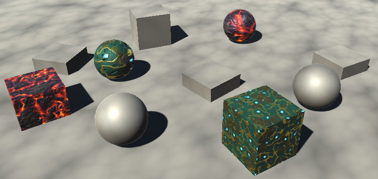 							Directional light with cookie. 						

The results appear good, except when you pay close attention to geometry edges.

 							
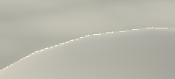 							Artifacts along edges. 						

These artifacts appear when there is a large difference between  the cookie coordinates of adjacent fragments. In those cases, the GPU  chooses a mipmap level that is too low for the closest surface. Aras  Pranckevičius [figured this one out](http://aras-p.info/blog/2010/01/07/screenspace-vs-mip-mapping/) for Unity. The solution Unity uses is to apply a bias when sampling mip maps, so we'll do that too.

```
		attenuation *= tex2Dbias(_LightTexture0, float4(uvCookie, 0, -8)).w;
```

 							
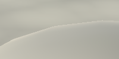 							Biased cookie sampling. 						

### Supporting LDR

By now we can correctly render directional lights, but only in HDR mode. It goes wrong for LDR.

 							
 							Incorrect LDR colors. 						

First, the encoded LDR colors have to be multiplied into the  light buffer, instead of added. We can do so by changing the blend mode  of our shader to `**Blend** **DstColor** **Zero**`. However, if we do that then HDR rendering will go wrong. Instead, we'll have to make the blend mode variable. Unity uses `_SrcBlend` and `_DstBlend` for this.

```
			Blend [_SrcBlend] [_DstBlend]
```

 							
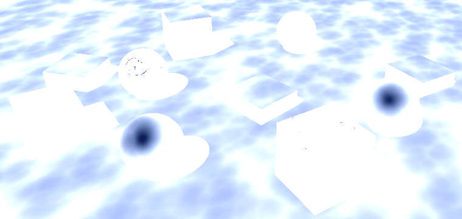 							Different, but still incorrect. 						

We also have to apply the 2-C conversion at the end of our fragment program, when `UNITY_HDR_ON` is not defined.

```
	float4 color = UNITY_BRDF_PBS(
    	albedo, specularTint, oneMinusReflectivity, smoothness,
    	normal, viewDir, light, indirectLight
    );
    #if !defined(UNITY_HDR_ON)
		color = exp2(-color);
	#endif
	return color;
```

unitypackage

## Spotlights

Because directional lights affect everything, they are drawn as  full-screen quads. In contrast, spotlights affect only the part of the  scene that lies inside their cone. It is usually unnecessary to  calculate spotlight lighting for the entire image. Instead, a pyramid is  rendered that matches the spotlight's area of influence.

### Drawing a Pyramid

Disable the directional light and use a spotlight instead.  Because our shader only works correctly for directional lights, the  result will be wrong. But it allows you to see which parts of the  pyramid get rendered.

 							
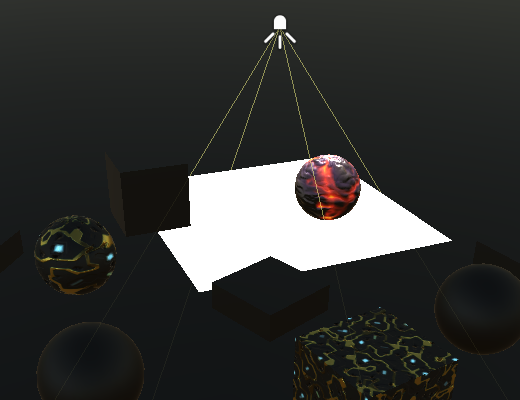 							Parts of a pyramid. 						

It turns out that the pyramid is rendered as a regular 3D  object. Its back faces are culled, so we see the pyramid's front side.  And it's only drawn when there's nothing in front of it. Besides that, a  pass is added which sets the stencil buffer to limit the drawing to  fragments that lie inside the pyramid volume. You can verify these  settings via the frame debugger.

 							
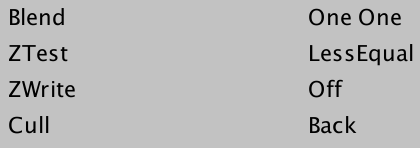 							How it is drawn. 						

This means that the culling and z-test settings of our shader are overruled. So let's just remove them from our shader.

```
			Blend [_SrcBlend] [_DstBlend]
//			Cull Off
//			ZTest Always
			ZWrite Off
```

This approach works when the spotlight volume is sufficiently  far away from the camera. However, it fails when the light gets too  close to the camera. When that happens, the camera could end up inside  the volume. It is even possible that part of the near plane lies inside  it, while the rest lies outside of it. In these cases, the stencil  buffer cannot be used to limit the rendering.

The trick used to still render the light is to draw the inside  surface of the pyramid, instead of its outside surface. This is done by  rendering its back faces instead of its front faces. Also, these  surfaces are only rendered when they end up behind what's already  rendered. This approach also covers all fragments that lie inside the  spotlight's volume. But it ends up rendering too many fragments, as  normally hidden parts of the pyramid now also get rendered. So it's only  done when necessary.

 							 							 							Drawing the backside when close to the camera. 						

If you move the camera or spotlight around near each other,  you'll see Unity switch between these two rendering methods as needed.  Once our shader works correctly for spotlights, there will be no visual  difference between both approaches.

### Supporting Multiple Light Types

Currently, `CreateLight` only works for directional lights. Let's make sure that the code specific to directional lights is only used when appropriate.

```
UnityLight CreateLight (float2 uv, float3 worldPos, float viewZ) {
	UnityLight light;
//	light.dir = -_LightDir;
	float attenuation = 1;
	float shadowAttenuation = 1;

	#if defined(DIRECTIONAL) || defined(DIRECTIONAL_COOKIE)
		light.dir = -_LightDir;

		#if defined(DIRECTIONAL_COOKIE)
			float2 uvCookie = mul(unity_WorldToLight, float4(worldPos, 1)).xy;
			attenuation *= tex2Dbias(_LightTexture0, float4(uvCookie, 0, -8)).w;
		#endif

		#if defined(SHADOWS_SCREEN)
			shadowed = true;
			shadowAttenuation = tex2D(_ShadowMapTexture, uv).r;

			float shadowFadeDistance =
				UnityComputeShadowFadeDistance(worldPos, viewZ);
			float shadowFade = UnityComputeShadowFade(shadowFadeDistance);
			shadowAttenuation = saturate(shadowAttenuation + shadowFade);
		#endif
	#else
		light.dir = 1;
	#endif

	light.color = _LightColor.rgb * (attenuation * shadowAttenuation);
	return light;
}
```

Although the shadow fading works based on the directional  shadow map, the shadows of the other light types are faded too. This  ensures that all shadows fade the same way, instead of only some  shadows. Thus, the shadow fading code applies to all lights, as long as  there are shadows. So let's move that code outside of the light-specific  block.

We can use a boolean to control whether the shadow-fading code  is used. As the boolean is as a constant value, the code will be  eliminated if it remains false.

```
UnityLight CreateLight (float2 uv, float3 worldPos, float viewZ) {
	UnityLight light;
	float attenuation = 1;
	float shadowAttenuation = 1;
	bool shadowed = false;

	#if defined(DIRECTIONAL) || defined(DIRECTIONAL_COOKIE)
		…

		#if defined(SHADOWS_SCREEN)
			shadowed = true;
			shadowAttenuation = tex2D(_ShadowMapTexture, uv).r;

//			float shadowFadeDistance =
//				UnityComputeShadowFadeDistance(worldPos, viewZ);
//			float shadowFade = UnityComputeShadowFade(shadowFadeDistance);
//			shadowAttenuation = saturate(shadowAttenuation + shadowFade);
		#endif
	#else
		light.dir = 1;
	#endif

	if (shadowed) {
		float shadowFadeDistance =
			UnityComputeShadowFadeDistance(worldPos, viewZ);
		float shadowFade = UnityComputeShadowFade(shadowFadeDistance);
		shadowAttenuation = saturate(shadowAttenuation + shadowFade);
	}

	light.color = _LightColor.rgb * (attenuation * shadowAttenuation);
	return light;
}
```

Lights that aren't directional have a position. It is made available via `_LightPos`.

```
float4 _LightColor, _LightDir, _LightPos;
```

Now we can determine the light vector and light direction for spotlights.

```
	#else
		float3 lightVec = _LightPos.xyz - worldPos;
		light.dir = normalize(lightVec);
	#endif
```

### World Position Again

The light direction doesn't appear to be correct, the result is  black. This happens because the world position is computed incorrectly  for spotlights. As we're rendering a pyramid somewhere in the scene, we  don't have a convenient full-screen quad with rays stored in the normal  channel. Instead, `MyVertexProgram` has to  derive the rays from the vertex positions. This is done by converting  the points to view space, for which we can use the `UnityObjectToViewPos` function.

```
	i.ray = UnityObjectToViewPos(v.vertex);
```

However, this produces rays with the wrong orientation. We have to negate their X and Y coordinates.

```
	i.ray = UnityObjectToViewPos(v.vertex) * float3(-1, -1, 1);
```

 							
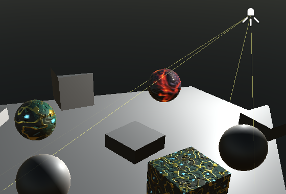 							Correct world position. 						

 							How does `UnityObjectToViewPos` work? 							 						

This alternative approach works when light geometry is rendered  in the scene. When a full-screen quad is used, we should just use the  vertex normals. Unity tells us which case we're dealing with via the `_LightAsQuad` variable.

```
float _LightAsQuad;
```

If it's set to 1, we're dealing with a quad and can use the normals. Otherwise, we have to use `UnityObjectToViewPos`.

```
	i.ray = lerp(
		UnityObjectToViewPos(v.vertex) * float3(-1, -1, 1),
		v.normal,
		_LightAsQuad
	);
```

### Cookie Attenuation

The spotlight's conic attenuation is created via a cookie  texture, whether it's the default circle or a custom cookie. We can  begin by copying the cookie code of the directional light.

```
		float3 lightVec = _LightPos.xyz - worldPos;
		light.dir = normalize(lightVec);

		float2 uvCookie = mul(unity_WorldToLight, float4(worldPos, 1)).xy;
		attenuation *= tex2Dbias(_LightTexture0, float4(uvCookie, 0, -8)).w;
```

However, spotlight cookies get larger the further away from the  light's position you go. This is done with a perspective  transformation. So the matrix multiplication produces 4D homogeneous  coordinates. To end up with regular 2D coordinates, we have to divide X  and Y by W.

```
		float4 uvCookie = mul(unity_WorldToLight, float4(worldPos, 1));
		uvCookie.xy /= uvCookie.w;
		attenuation *= tex2Dbias(_LightTexture0, float4(uvCookie.xy, 0, -8)).w;
```

 							
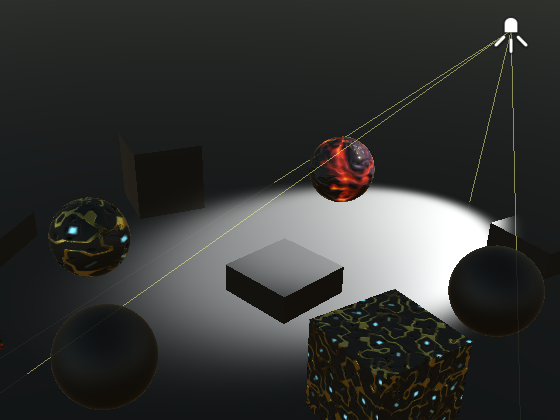 							Cookie attenuation. 						

This actually results in two light cones, one forward and one  backward. The backward cone usually ends up outside of the rendered  area, but this is not guaranteed. We only want the forward cone, which  corresponds with a negative W coordinate.

```
		attenuation *= tex2Dbias(_LightTexture0, float4(uvCookie.xy, 0, -8)).w;
		attenuation *= uvCookie.w < 0;
```

### Distance Attenuation

The light from a spotlight also attenuates based on distance.  This attenuation is stored in a lookup texture, which is made available  via `_LightTextureB0`.

```
sampler2D _LightTexture0, _LightTextureB0;
```

The texture is designed so it has to be sampled with the  squared light distance, scaled by the light's range. The range is stored  in the fourth component of `_LightPos`. Which of the texture's channels should be used varies per platform and is defined by the `**UNITY_ATTEN_CHANNEL**` macro.

```
		light.dir = normalize(lightVec);

		attenuation *= tex2D(
			_LightTextureB0,
			(dot(lightVec, lightVec) * _LightPos.w).rr
		).UNITY_ATTEN_CHANNEL;

		float4 uvCookie = mul(unity_WorldToLight, float4(worldPos, 1));
```

 							
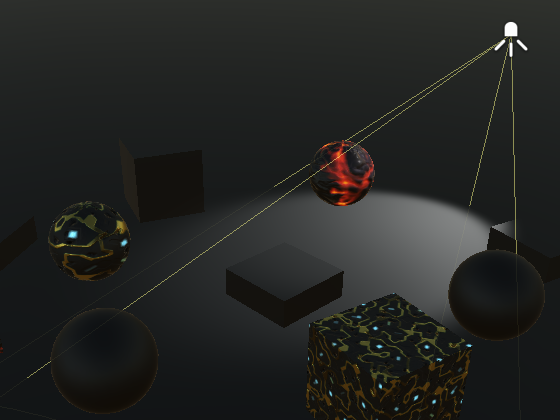 							Cookie and distance attenuation. 						

### Shadows

When the spotlight has shadows, the `SHADOWS_DEPTH` keyword is defined.

```
		float4 uvCookie = mul(unity_WorldToLight, float4(worldPos, 1));
		uvCookie.xy /= uvCookie.w;
		attenuation *= tex2Dbias(_LightTexture0, float4(uvCookie.xy, 0, -8)).w;

		#if defined(SHADOWS_DEPTH)
			shadowed = true;
		#endif
```

Spotlights and directional lights use the same variable to sample their shadow map. In the case of spotlights, we can use `UnitySampleShadowmap`  to take care of the details of sampling hard or soft shadows. We have  to supply it with the fragment position in shadow space. The first  matrix in the `unity_WorldToShadow` array can be used to convert from world to shadow space.

```
			shadowed = true;
			shadowAttenuation = UnitySampleShadowmap(
				mul(unity_WorldToShadow[0], float4(worldPos, 1))
			);
```

 							
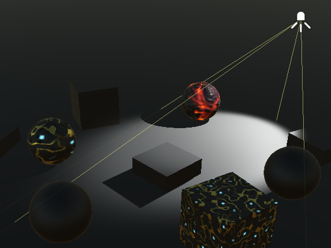 							Spotlight with shadows. 						

unitypackage

## Point Lights

Points lights use the same light vector, direction, and distance  attenuation as spotlights. So they can share that code. The rest of the  spotlight code should only be used when the `SPOT` keyword is defined.

```
	#if defined(DIRECTIONAL) || defined(DIRECTIONAL_COOKIE)
		…
	#else
		float3 lightVec = _LightPos.xyz - worldPos;
		light.dir = normalize(lightVec);

		attenuation *= tex2D(
			_LightTextureB0,
			(dot(lightVec, lightVec) * _LightPos.w).rr
		).UNITY_ATTEN_CHANNEL;

		#if defined(SPOT)
			float4 uvCookie = mul(unity_WorldToLight, float4(worldPos, 1));
			uvCookie.xy /= uvCookie.w;
			attenuation *=
				tex2Dbias(_LightTexture0, float4(uvCookie.xy, 0, -8)).w;
			attenuation *= uvCookie.w < 0;

			#if defined(SHADOWS_DEPTH)
				shadowed = true;
				shadowAttenuation = UnitySampleShadowmap(
					mul(unity_WorldToShadow[0], float4(worldPos, 1))
				);
			#endif
		#endif
	#endif
```

This is already enough to get point lights working. They are  rendered the same as spotlights, except that an icosphere is used  instead of a pyramid.

 						
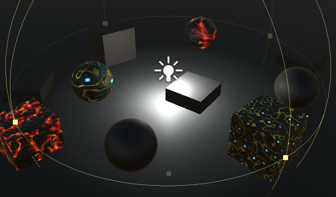 						High-intensity point light. 					

### Shadows

The shadows of point lights are stored in a cube map. `UnitySampleShadowmap`  takes care of the sampling for us. In this case, we have to provide it  with a vector going from light to surface, to sample the cube map. This  is the opposite of the light vector.

```
		#if defined(SPOT)
			…
		#else
			#if defined(SHADOWS_CUBE)
				shadowed = true;
				shadowAttenuation = UnitySampleShadowmap(-lightVec);
			#endif
		#endif
```

 							
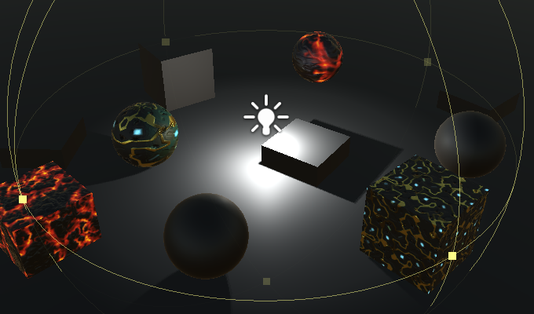 							Point light with shadows. 						

### Cookies

Point light cookies are also made available via `_LightTexture0`. However, in this case we need a cube map instead of a regular texture.

```
//sampler2D _LightTexture0, _LightTextureB0;
#if defined(POINT_COOKIE)
	samplerCUBE _LightTexture0;
#else
	sampler2D _LightTexture0;
#endif

sampler2D _LightTextureB0;
float4x4 unity_WorldToLight;
```

To sample the cookie, convert the fragment's world position to light space and use that to sample the cube map.

```
		#else
			#if defined(POINT_COOKIE)
				float3 uvCookie =
					mul(unity_WorldToLight, float4(worldPos, 1)).xyz;
				attenuation *=
					texCUBEbias(_LightTexture0, float4(uvCookie, -8)).w;
			#endif
			
			#if defined(SHADOWS_CUBE)
				shadowed = true;
				shadowAttenuation = UnitySampleShadowmap(-lightVec);
			#endif
		#endif
```

 							
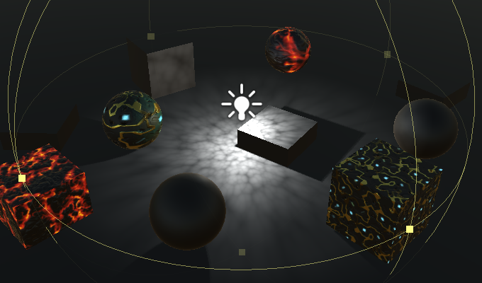 							Point light with cookie. 						

 							The point light cookie texture doesn't work? 							 						

### Skipping Shadows

We are now able to render all dynamic lights with our own  shader. While we don't pay much attention to optimizations at this  point, there is one potentially large optimization worth considering.

Fragments that end up beyond the shadow fade distance won't be  shadowed. However, we're still sampling their shadows, which can be  expensive. We can avoid this by branching based on the shadow fade  factor. It it approaches 1, then we can skip the shadow attenuation  completely.

```
	if (shadowed) {
		float shadowFadeDistance =
			UnityComputeShadowFadeDistance(worldPos, viewZ);
		float shadowFade = UnityComputeShadowFade(shadowFadeDistance);
		shadowAttenuation = saturate(shadowAttenuation + shadowFade);

		UNITY_BRANCH
		if (shadowFade > 0.99) {
			shadowAttenuation = 1;
		}
	}
```

However, branches are potentially expensive themselves. It's  only an improvement because this is a coherent branch. Except near the  edge of the shadow region, all fragments either fall inside or outside  of it. But this only matters if the GPU can take advantage of this. *HLSLSupport* defines the `UNITY_FAST_COHERENT_DYNAMIC_BRANCHING` macro when this should be the case.

```
		#if defined(UNITY_FAST_COHERENT_DYNAMIC_BRANCHING)
			UNITY_BRANCH
			if (shadowFade > 0.99) {
				shadowAttenuation = 1;
			}
		#endif
```

Even then, it is only really worth it when the shadows require  multiple texture samples. This is the case for soft spotlight and point  light shadows, which is indicated with the `SHADOWS_SOFT` keyword. Directional shadows always require a single texture sample, so that's cheap.

```
		#if defined(UNITY_FAST_COHERENT_DYNAMIC_BRANCHING) && defined(SHADOWS_SOFT)
			UNITY_BRANCH
			if (shadowFade > 0.99) {
				shadowAttenuation = 1;
			}
		#endif
```

The next tutorial is [Static Lighting](https://catlikecoding.com/unity/tutorials/rendering/part-16/).

unitypackage

PDF
