# Rendering 13

Deferred Shading

- Explore deferred shading.
- Fill Geometry Buffers.
- Support both HDR and LDR.
- Work with Deferred Reflections.

This is part 13 of a tutorial series about rendering. The [previous installment](https://catlikecoding.com/unity/tutorials/rendering/part-12) covered semitransparent shadows. Now we'll look at deferred shading.

This tutorial was made with Unity 5.5.0f3.

 					
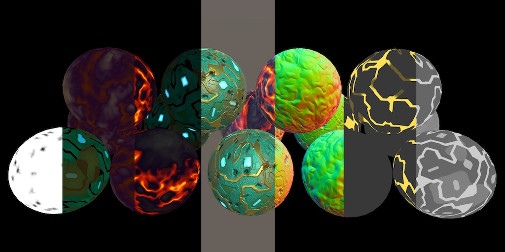 					The anatomy of geometry. 				

## Another Rendering Path

Up to this point we've always used Unity's forward rendering  path. But that's not the only rendering method that Unity supports.  There's also the deferred path. And there are also the legacy vertex lit  and the legacy deferred paths, but we won't cover those.

So there is a deferred rendering path, but why would we bother  with it? After all, we can render everything we want using the forward  path. To answer that question, let's investigate their differences.

### Switching Paths

Which rendering path is used is defined by the project-wide graphics settings. You can get there via *Edit / Project Settings / Graphics*.  The rendering path and a few other settings are configured in three  tiers. These tiers correspond to different categories of GPUs. The  better the GPU, the higher a tier Unity uses. You can select which tier  the editor uses via the *Editor / Graphics Emulation* submenu.

 							
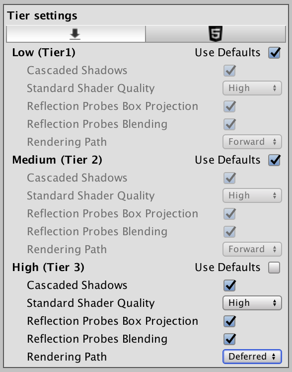 							Graphics settings, per tier. 						

To change the rendering path, disable *Use Defaults* for the desired tier, then select either *Forward* or *Deferred* as the *Rendering Path*.

### Comparing Draw Calls

I'll use the *Shadows Scene* from the [Rendering 7, Shadows](https://catlikecoding.com/unity/tutorials/rendering/part-7/) tutorial to compare both approaches. This scene has its *Ambient Intensity*  set to zero, to make the shadows more visible. Because our own shader  doesn't support deferred yet, change the used material so it relies on  the standard shader.

The scene has quite a few objects and two directional lights.  Let's look at it both without and with shadows enabled for both lights.

 							 							 							Shadows scene, without and with shadows. 						

While using the forward rendering path, use the frame debugger to examine how the scene gets rendered.

There are 66 geometry objects in the scene, all visible. If  dynamic batching was possible, these could've been drawn with less than  66 batches. However, that only works with a single directional light. As  there is an additional light, dynamic batching is not used. And because  there are two directional lights, all geometry gets drawn twice. So  that's 132 draw calls, 133 with the skybox.

 							
 							Forward rendering, without shadows. 						

When shadows are enabled, we need more draw calls to generate  the cascading shadow maps. Recall how directional shadow maps are  created. First, the depth buffer is filled, which requires only 48 draw  calls, thanks to some dynamic batching. Then, the cascading shadow maps  are created. The first light's shadow map ends up requiring 111 draw  calls, while the second one needs 121. These shadow maps are rendered to  screen-space buffers, which perform filtering. Then the geometry is  drawn, once per light. Doing all this requires 418 draw calls.

 							
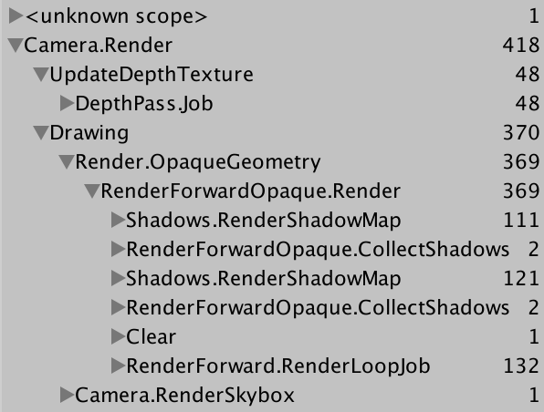 							Forward rendering, with shadows. 						

Now disable the shadows again and switch to the deferred  rendering path. The scene still looks the same, except that MSAA has  been turned off. How does it get drawn this time?

 							Why doesn't MSAA work in deferred mode? 							 						

 							
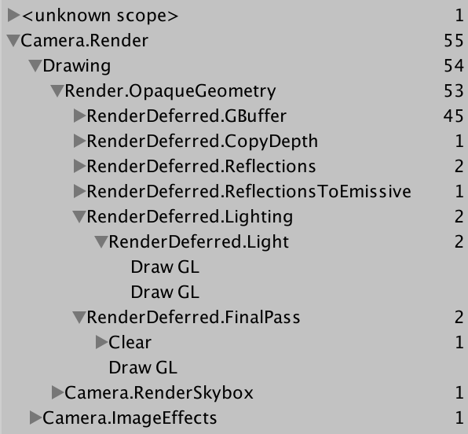 							Deferred rendering, without shadows. 						

Apparently, a *GBuffer* gets rendered,  which requires 45 draw calls. That's one per object, with some dynamic  batching. Then the depth texture gets copied, followed by thee draw  calls that do something with reflections. After that, we get to  lighting, which requires two draw calls, one per light. Then there's a  final pass and the skybox, for a total of 55 draw calls.

55 is quite a bit less than 133. It looks like deferred only  draws each object once in total, not once per light. Besides that and  some other work, each light gets its own draw call. What about when  shadows are enabled?

 							
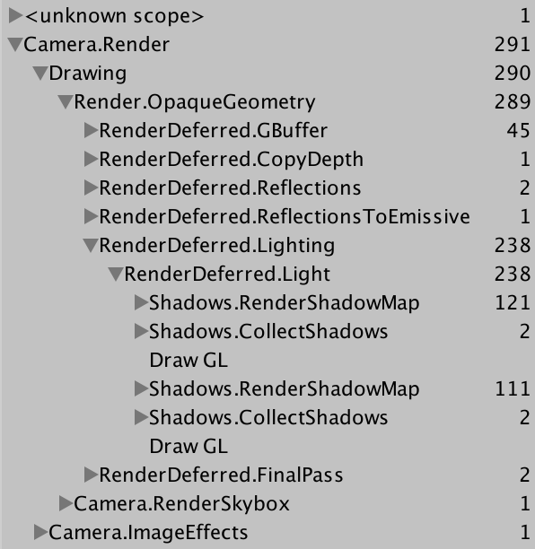 							Deferred rendering, with shadows. 						

We see that both shadow maps get rendered and then filtered in  screen space, right before their lights are drawn. Just like in forward  mode, this adds 236 draw calls, for a total of 291. As deferred already  created a depth texture, we got that for free. Again, 291 is quite a bit  less than 418.

### Splitting the Work

Deferred shading appears to be more efficient when rendering  more than one light, compared to forward shading. While forward requires  one additional additive pass per object per light, deferred doesn't  need this. Of course both still have to render the shadow maps, but  deferred doesn't have to pay extra for the depth texture that  directional shadows need. How does the deferred path get away with this?

To render something, the shader has to grab the mesh data,  convert it to the correct space, interpolate it, retrieve and derive  surface properties, and calculate lighting. Forward shaders have to  repeat all of this for every pixel light that illuminates an object.  Additive passes are cheaper than the base pass, because the depth buffer  has already been primed, and they don't bother with indirect light. But  they still have to repeat most of the work that the base pass has  already done.

 							
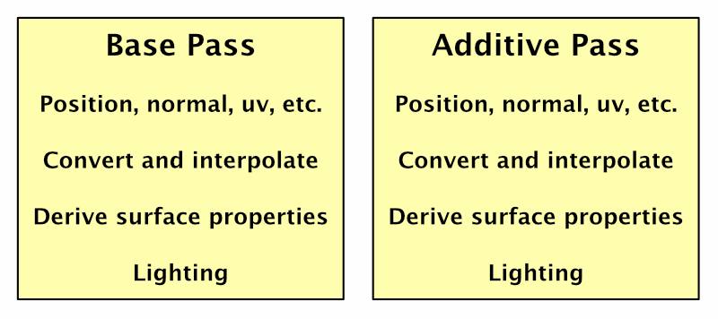 							Duplicate work. 						

As the geometry's properties are the same every time, why don't  we cache them? Have the base pass store them in a buffer. Then additive  passes can reuse that data, eliminating duplicate work. We have to  store this data per fragment, so we need a buffer that fits the display,  just like the depth and the frame buffer.

 							
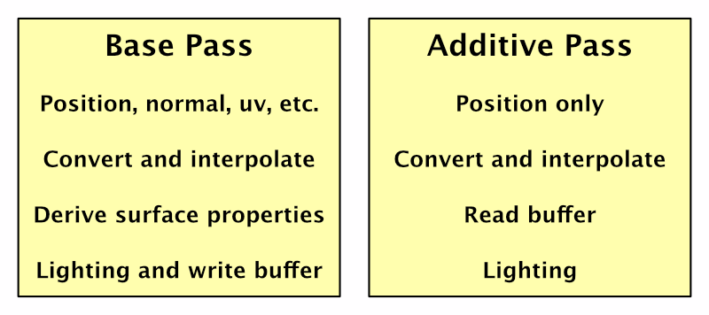 							Caching surface properties. 						

Now we have all the geometry data that we require for lighting  available in a buffer. The only thing that's missing is the light  itself. But that means we no longer need to render the geometry at all.  We can suffice with rendering the light. Furthermore, the base pass only  has to fill the buffer. All direct lighting calculations can be  deferred until the lights are rendered individually. Hence, deferred  shading.

 							
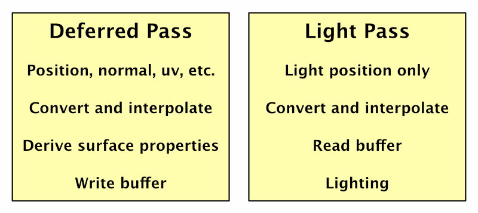 							Deferred shading. 						

### Many Lights

If you're only using a single light, then deferred by itself  doesn't provide any benefit. But when using many lights, it shines. Each  additional light only adds a little extra work, as long as they don't  cast shadows.

Also, when geometry and lights are rendered separately, there  is no limit to how many lights can affect an object. All lights are  pixel lights and illuminate everything in their range. The *Pixel Light Count* quality setting does not apply.

 							 							 							Ten spotlights, deferred succeeds while forward fails. 						

### Rendering Lights

So how are lights themselves rendered? As directional lights  affect everything, they are rendered with a single quad that covers the  entire view.

 							
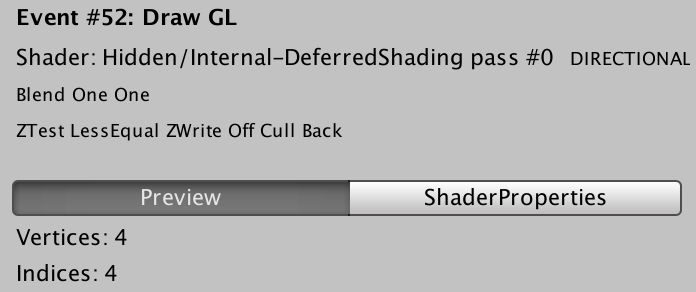 							Directional lights use a quad. 						

This quad is rendered with the *Internal-DeferredShading* shader. Its fragment program fetches the geometry data from the buffer and relies on the *UnityDeferredLibrary* include file to configure the light. Then it computes the lighting, just like a forward shader does.

Spotlights work the same way, except that they don't have to  cover the entire view. Instead, a pyramid is rendered that fits the  volume that the spotlight illuminates. So only the visible potion of  this volume will be rendered. If it ends up completely hidden behind  other geometry, no shading is performed for this light.

 							
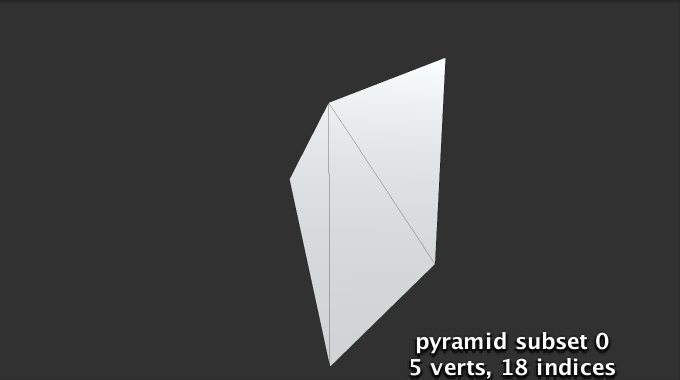 							Spotlights use a pyramid. 						

If a fragment of this pyramid is rendered, it will perform  lighting calculations. But this only makes sense if there actually is  geometry inside the light's volume. Geometry behind the volume need not  be rendered, because the light doesn't reach there. To prevent rendering  these unnecessary fragments, the pyramid is first rendered with the *Internal-StencilWrite*  shader. This pass writes to the stencil buffer, which can be used to  mask which fragments get rendered later. The only case when this  technique can't be used is when the light volume intersects the camera's  near plane.

Point lights use the same approach, except with an icosphere instead of a pyramid.

 							
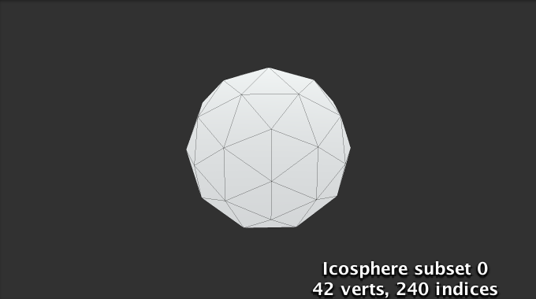 							Point lights use an icosphere. 						

### Light Range

If you've been stepping through the frame debugger, you might  have noticed that the colors look weird during the deferred lighting  phase. It's as if they're inverted, like a photo negative. The final  deferred pass converts this intermediate state to the final correct  colors.

 							
 							Inverted colors. 						

Unity does this when the scene is rendered with low dynamic  range – LDR – colors, which is the default. In this case, the colors are  written to an ARGB32 texture. Unity logarithmically encodes the colors  to achieve a greater dynamic range than usual for this format. The final  deferred pass converts to normal colors.

When the scene is rendered in high dynamic range – HDR – Unity  uses the ARGBHalf format. In this case, the special encoding is not  needed and there is no final deferred pass. Whether HDR is enabled is a  property of the camera. Switch it on, so we see normal colors when using  the frame debugger.

 							
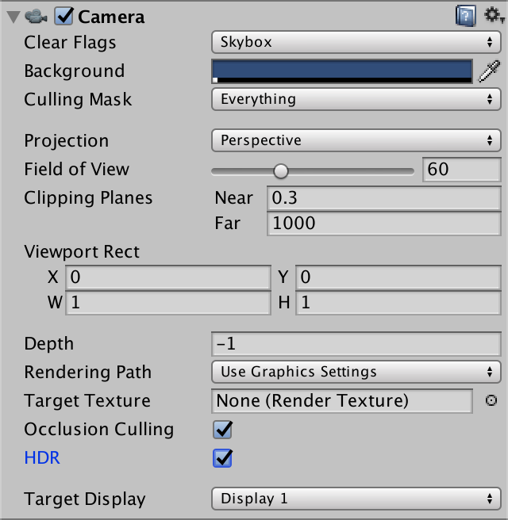 							HDR enabled. 						

### Geometry Buffers

The downside of caching data is that it has to be stored  somewhere. The deferred rendering path uses multiple render textures for  this purpose. These textures are known as geometry buffers, or  G-buffers for short.

Deferred shading requires four G-buffers. Their combined size  is 160 bits per pixel for LDR and 192 bits per pixel for HDR. That's  quite a bit more than a single 32-bit frame buffer. Modern desktop GPUs  can deal with that, but mobile and even laptop GPUs can have trouble  with higher resolutions.

You can inspect some of the data in the G-buffer via the scene  window. Use the button at the top left of the window to select a  different display mode. It's set to *Shaded* by default. When using the deferred rendering path, you can choose one of the four *Deferred* options. For example, *Normal* shows the RGB channels of the buffer that contains the surface normals.

 							 							 							Standard spheres and their deferred normals. 						

You can also inspects the multiple render targets of a draw  call via the frame debugger. There is a dropdown menu to select the  render target at the top left of the menu on the right side of the  window. The default is the first target, which is *RT 0*.

 							
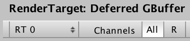 							Selecting a render target. 						

### Mixing Rendering Modes

Our own shader doesn't support the deferred rendering path yet.  So what would happen if some of the objects in the scene were rendered  with our shader, while in deferred mode?

 							 							 							Mixed spheres, with their deferred normals. 						

Our objects appear to render fine. It turns out that deferred  rendering is done first, followed by an additional forward rendering  phase. During the deferred rendering phase, the forward objects do not  exist. The only exception is when there are directional shadows. In that  case, a depth pass is needed for the forward objects. This is done  directly after the G-buffers are filled. As a side effect, the forward  objects end up as solid black in the albedo buffer.

 							 							 							Both deferred and forward rendering. 						

This is true for transparent objects as well. They require a separate forward rendering phase, as usual.

 							 							 							 							Deferred an forward opaque, plus transparent. 						

unitypackage

## Filling the G-Buffers

Now that we have an idea of how deferred shading works, let's add support for it to *My First Lighting Shader*. This is done by adding a pass with its *LightMode* tag set to *Deferred*. The order of the passes doesn't matter. I put it in between the additive and the shadow passes.

```
		Pass {
			Tags {
				"LightMode" = "Deferred"
			}
		}
```

 						
 						White normals. 					

Unity detects that our shader has a deferred pass, so it  includes the opaque and cutout objects that use our shader in the  deferred phase. Transparent objects will still be rendered in the  transparent phase, of course.

Because our pass is empty, everything gets rendered as solid  white. We have to add shader features and programs. The deferred pass is  mostly the same as the base pass, so copy the contents of that pass,  then make a few changes. First, we'll define *DEFERRED_PASS* instead of *FORWARD_BASE_PASS*. Second, the deferred pass doesn't need variants for the *_RENDERING_FADE* and *_RENDERING_TRANSPARENT*  keywords. Third, deferred shading is only possible when the GPU  supports writing to multiple render targets. So we'll add a directive to  exclude it when those are not supported. I marked these differences.

```
		Pass {
			Tags {
				"LightMode" = "Deferred"
			}

			CGPROGRAM

			#pragma target 3.0
			#pragma exclude_renderers nomrt

			#pragma shader_feature _ _RENDERING_CUTOUT
			#pragma shader_feature _METALLIC_MAP
			#pragma shader_feature _ _SMOOTHNESS_ALBEDO _SMOOTHNESS_METALLIC
			#pragma shader_feature _NORMAL_MAP
			#pragma shader_feature _OCCLUSION_MAP
			#pragma shader_feature _EMISSION_MAP
			#pragma shader_feature _DETAIL_MASK
			#pragma shader_feature _DETAIL_ALBEDO_MAP
			#pragma shader_feature _DETAIL_NORMAL_MAP

			#pragma vertex MyVertexProgram
			#pragma fragment MyFragmentProgram

			#define DEFERRED_PASS

			#include "My Lighting.cginc"

			ENDCG
		}
```

 						
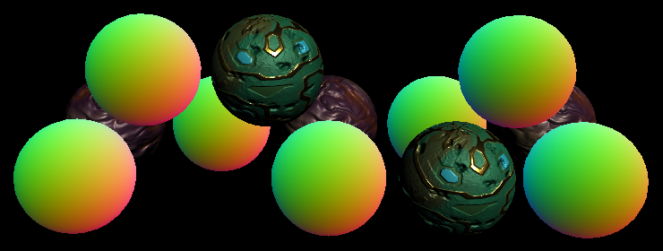 						Shaded normals. 					

Now the deferred pass functions roughly like the base pass. So  it ends up writing shaded results to the G-buffers, instead of geometry  data. This is not correct. We have to output the geometry data and not  compute direct lighting.

### Four Outputs

In *My Lighting*, we have to support two kinds of output for `MyFragmentProgram`.  In the case of the deferred pass, there are four buffers that we need  to fill. We do that by outputting to four targets. In all other cases,  we can suffice with a single target. Let's define an output structure  for this, directly above `MyFragmentProgram`.

```
struct FragmentOutput {
	#if defined(DEFERRED_PASS)
		float4 gBuffer0 : SV_Target0;
		float4 gBuffer1 : SV_Target1;
		float4 gBuffer2 : SV_Target2;
		float4 gBuffer3 : SV_Target3;
	#else
		float4 color : SV_Target;
	#endif
};
```

 							Shouldn't it be `**SV_TARGET**`? 							 						

Adjust `MyFragmentProgram` so it  returns this structure. For the deferred pass, we'll have to assign  values to all four outputs, which we'll do shortly. The other passes  simply copy the final shaded color.

```
FragmentOutput MyFragmentProgram (Interpolators i) {
	…

	FragmentOutput output;
	#if defined(DEFERRED_PASS)
	#else
		output.color = color;
	#endif
	return output;
}
```

### Buffer 0

The first G-buffer is used to store the diffuse albedo and the  surface occlusion. It's an ARGB32 texture, like a regular frame buffer.  Albedo is stored in the RGB channels and the occlusion is stored in the A  channel. We know the albedo color at this point, and we can use `GetOcclusion` to access the occlusion value.

```
	#if defined(DEFERRED_PASS)
		output.gBuffer0.rgb = albedo;
		output.gBuffer0.a = GetOcclusion(i);
	#else
```

 							 							 							Albedo and occlusion. 						

You can use the scene view or the frame debugger to inspect the  contents of the first G-buffer, to verify that we fill it correctly.  This will show you its RGB channels. However, the A channel isn't shown.  To inspect the occlusion data, you can temporarily assign it to the RGB  channels.

### Buffer 1

The second G-buffer is used to store the specular color in the  RGB channels, and the smoothness value in the A channel. It is also an  ARGB32 texture. We know what the specular tint is, and can use `GetSmoothness` to retrieve the smoothness value.

```
		output.gBuffer0.rgb = albedo;
		output.gBuffer0.a = GetOcclusion(i);
		output.gBuffer1.rgb = specularTint;
		output.gBuffer1.a = GetSmoothness(i);
```

 							 							 							Specular color and smoothness. 						

The scene view allows us to directly see the smoothness values, so we don't have to use a trick to verify them.

### Buffer 2

The third G-buffer contains the world-space normal vectors.  They're stored in the RGB channels of an ARGB2101010 texture. This means  that each coordinate is stored using ten bits, instead of the usual  eight, which makes them more precise. The A channel only has two bits –  so the total is again 32 bits – but it isn't used, so we'll just set it  to 1. The normal is encoded like a regular normal map.

```
		output.gBuffer1.rgb = specularTint;
		output.gBuffer1.a = GetSmoothness(i);
		output.gBuffer2 = float4(i.normal * 0.5 + 0.5, 1);
```

 							
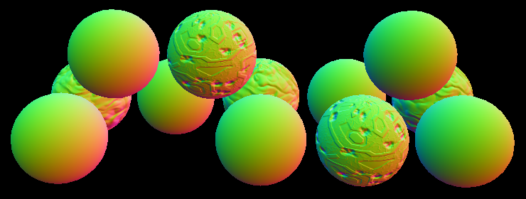 							Normals. 						

### Buffer 3

The final G-buffer is used to accumulate the lighting of the  scene. Its format depends on whether the camera is set to LDR or HDR. In  the case of LDR, it's an ARGB2101010 texture, just like the buffer for  normals. When HDR is enabled, the format is ARGBHalf, which stores a  16-bit floating-point value per channel, for a total of 64 bits. So the  HDR version is twice as large as the other buffers. Only the RGB  channels are used, so the A channel can be set to 1 again.

 							Can't we use RGBHalf instead of ARGBHalf? 							 						

The first light that is added to this buffer is the emissive  light. There is no separate light for this, so we have to do it in this  pass. Let's begin by using the color that we've already computed.

```
		output.gBuffer2 = float4(i.normal * 0.5 + 0.5, 1);
		output.gBuffer3 = color;
```

To preview this buffer, either use the frame debugger, or temporarily assign this color to the first G-buffer.

 							
 							Emission, but wrong. 						

The color that we're using right now is fully shaded as if  there was a directional light, which is incorrect. We can eliminate all  the direct light calculations by using a dummy light set to black for  the deferred pass.

```
UnityLight CreateLight (Interpolators i) {
	UnityLight light;

	#if defined(DEFERRED_PASS)
		light.dir = float3(0, 1, 0);
		light.color = 0;
	#else
		#if defined(POINT) || defined(POINT_COOKIE) || defined(SPOT)
			light.dir = normalize(_WorldSpaceLightPos0.xyz - i.worldPos);
		#else
			light.dir = _WorldSpaceLightPos0.xyz;
		#endif

		UNITY_LIGHT_ATTENUATION(attenuation, i, i.worldPos);
		
		light.color = _LightColor0.rgb * attenuation;
	#endif
	light.ndotl = DotClamped(i.normal, light.dir);
	return light;
}
```

While we're adjusting `CreateLight`, let's also get rid of the `light.ndotl` calculation. Both that structure field and the `DotClamped` function have been deprecated by Unity.

```
//	light.ndotl = DotClamped(i.normal, light.dir);
```

We've shut off the direct light, but we still need to include  the emissive light. Currently, it's only retrieved for the forward base  pass. Make sure it's included in the deferred pass as well.

```
float3 GetEmission (Interpolators i) {
	#if defined(FORWARD_BASE_PASS) || defined(DEFERRED_PASS)
		…
	#else
		return 0;
	#endif
}
```

 							
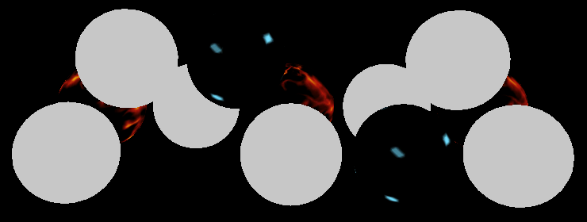 							Emission. 						

### Ambient Light

The result looks good, but it's not complete yet. We're missing the ambient environmental light.

 							
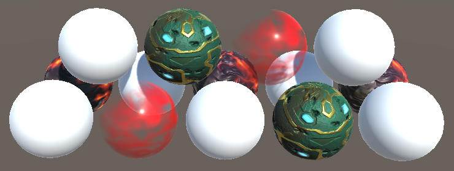 							Without ambient. 						

There is no separate pass for the ambient light. Like emissive  light, it has to be added when the G-buffers are filled. So let's enable  the indirect light for the deferred pass as well.

```
UnityIndirect CreateIndirectLight (Interpolators i, float3 viewDir) {
	…

	#if defined(FORWARD_BASE_PASS) || defined(DEFERRED_PASS)
		…
	#endif

	return indirectLight;
}
```

 							
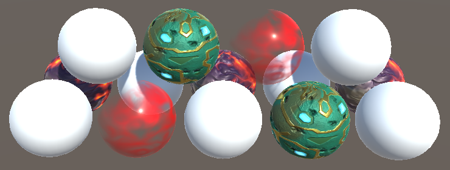 							With ambient. 						

### HDR and LDR

Our shader now produces the same results in both forward and  deferred mode. At least, when using an HDR camera. It looks quite wrong  in LDR mode.

 							
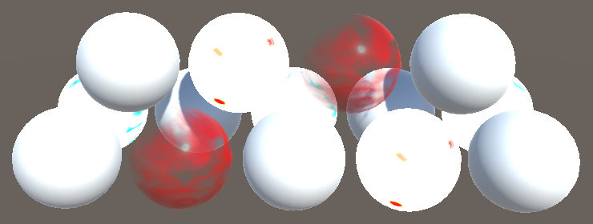 							Incorrect in LDR mode. 						

This happens because Unity expects LDR data to be  logarithmically encoded, as described earlier. So we have to use this  encoding as well, for the emissive and ambient contribution.

First, we have to know which color range we're using. This is  done by adding a multi-compile directive to our pass, based on the `UNITY_HDR_ON` keyword.

```
			#pragma shader_feature _DETAIL_NORMAL_MAP

			#pragma multi_compile _ UNITY_HDR_ON
```

Now we can convert our color data when this keyword has been defined. The logarithmic encoding is done with the formula 2-C, where C is the original color. We can use the `exp2` function for that.

 							
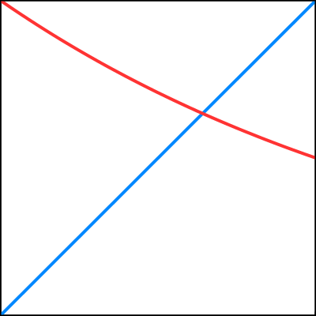 							The functions x and 2-x from 0 to 1. 						

```
	#if defined(DEFERRED_PASS)
		#if !defined(UNITY_HDR_ON)
			color.rgb = exp2(-color.rgb);
		#endif
		…
	#else
		output.color = color;
	#endif
```

 							 							 							Accumulating light in LDR and HRD mode. 						

unitypackage

## Deferred Reflections

The [Rendering 8, Reflections](https://catlikecoding.com/unity/tutorials/rendering/part-8/)  tutorial covered how Unity uses reflection probes to add specular  reflections to surfaces. However, the approach described there applies  to the forward rendering path. When using the deferred path, a different  approach is used by default. I'll use the *Reflections Scene* to compare both approaches. This scene also has its *Ambient Intensity* set to zero. After opening the scene, make sure that the material used for the mirrored sphere and floor has its *Metallic* and *Smoothness* set to 1. Also, it has to use our shader.

 						 						 						Scene and reflection probes. 					

The scene has three reflection probes. One covers the area  inside the structure. Another covers a small region outside the  structure. These probes do not overlap. The third probe sits in between  them and partially overlaps both. It was placed there to create a better  blend transition between inside and outside the structure. Take a good  look at this region, both in forward and in deferred mode.

 						 						 						Forward and deferred reflections. 					

It appears that the middle probe is much stronger in deferred  mode. It dominates the middle region of the transition. Worse, it also  affects the floor's reflection, which looks quite wrong.

### Probes Per Pixel

What's different in deferred mode is that the probes aren't  blended per object. Instead, they are blended per pixel. This is done by  the *Internal-DeferredReflections* shader. To  make this obvious, enlarge the floor mirror so it extends beyond the  structure and look at it from a distance. Then compare forward and  deferred.

 							 							 							Large floor mirror, forward and deferred. 						

In forward mode, the floor is forced to use the probe inside  the structure for its entire surface. As a result, the box projection  becomes nonsensical on the outside. You can also see that it blends a  little bit with one of the other probes.

 							 							 							Mesh renderer of floor, forward vs. deferred. 						

In deferred mode, the reflection probes themselves get  rendered. They're projected onto the geometry that intersects their  volume. So the reflections of the probe that's inside the structure  don't extend beyond their bounds. Actually, they extend a little bit, as  they fade out. The same goes for the other two probes.


<iframe src="https://gfycat.com/ifr/TartSadAuk"></iframe>

Drawing deferred reflections.

The skybox is rendered first, covering the entire view. Then each probe is rendered, just like lights, except they use cubes.

Each probe ends up completely covering the surfaces inside its  volume. Any reflections that were rendered earlier are overwritten.  Unity decides the order in which the probes are rendered. It turns out  that larger volumes are drawn first and smaller volumes are drawn later.  That way, local small probes can overrule probes for larger areas. You  can use the *Importance* value of probes to adjust this order, via their inspector.

 							
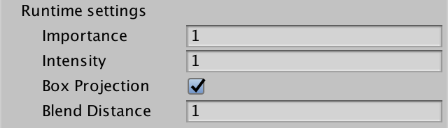 							Some reflection Probe settings. 						

### Blend Distance

In deferred mode, a probe's reflections are at full strength  inside its volume. But they also extend beyond the volume. They fade out  and blend with the other reflections that were already rendered. How  far they extend is controlled by the probe's *Fade Distance*, which is set to one unit by default. This setting is only enabled when the deferred rendering path is used.

<iframe src="https://gfycat.com/ifr/MealyIndelibleIridescentshark"></iframe>

Varying blend distance.

The blend distance effectively increases the volume of the  reflection probe. The bounds used to calculate the box projection are  expanded by the same amount. As a result, box projections that are  correct in forward mode can be wrong in deferred mode, and vice versa.  In our case, the reflections inside the structure can be fixed by  reducing the probe's *Blend Distance* to zero.

The volume increase due to blend distance is also the reason  why the middle probe affects the floor mirror. The probe's expanded  volume intersects it. We cannot set this probe's blend distance to zero,  because that would eliminate blending. Instead, we have to decrease the  vertical size of the probe's volume, so it no longer intersects the  floor.

 							 							 							Adjusted probes. 						

### Reflections in the Deferred Pass

While deferred reflections are efficient and can blend more  than two probes per object, there is a downside. It isn't possible to  use an *Anchor Override* to force an object to use  a specific reflection probe. But sometimes that's the only way to make  sure objects receive the correct reflections. For example, when there  are reflection probes both inside and outside a structure that isn't an  axis-aligned rectangle.

Fortunately, you can disable deferred reflections, via the graphics settings. To do so, switch the *Deferred Reflections* graphics setting from *Built-in Shader* to *No Support*.

 							
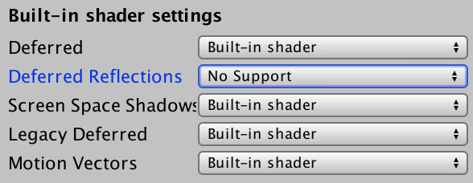 							Deferred reflections disabled. 						

When deferred reflections are disabled, the deferred pass has  to blend between reflection probes, like the forward base pass. The  result is added to the emissive color. You can see this by inspecting  the fourth buffer – RT 3 – via the frame debugger, when the G-buffers  are filled.

 							 							 							Emissive with and without reflections. 						

It turns out that our deferred pass already renders reflections  when needed and leaves them black otherwise. In fact, we've been using  reflection probes all the time. It's just that they're set to black when  not used.

Sampling black probes is a waste of time. Let's make sure that our deferred pass only does so when needed. We can use `UNITY_ENABLE_REFLECTION_BUFFERS` to check this. It's defined as 1 when deferred reflections are enabled.

```
UnityIndirect CreateIndirectLight (Interpolators i, float3 viewDir) {
	…

	#if defined(FORWARD_BASE_PASS) || defined(DEFERRED_PASS)
		…

		float occlusion = GetOcclusion(i);
		indirectLight.diffuse *= occlusion;
		indirectLight.specular *= occlusion;

		#if defined(DEFERRED_PASS) && UNITY_ENABLE_REFLECTION_BUFFERS
			indirectLight.specular = 0;
		#endif
	#endif

	return indirectLight;
}
```

The next tutorial is [Fog](https://catlikecoding.com/unity/tutorials/rendering/part-14/).

unitypackage

PDF
