# Rendering 14

Fog

- Apply fog to objects.
- Base fog on either distance or depth.
- Create an image effect.
- Support deferred fog.

This is part 14 of a tutorial series about rendering. The [previous installment](https://catlikecoding.com/unity/tutorials/rendering/part-13) introduced deferred shading. This time we'll add fog to our scene.

This tutorial was made with Unity 5.5.0f3.

 					
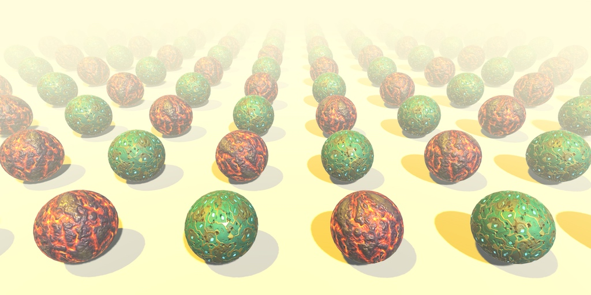 					Things tend to fade with distance. 				

## Forward Fog

Up to this point, we've always treated light rays as if they  traveled through a vacuum. This might be accurate when your scene is set  in space, but otherwise light has to travel through an atmosphere or  liquid. Under those circumstances, light rays can get absorbed,  scattered, and reflected anywhere in space, not only when hitting a  solid surface.

An accurate rendering of atmospheric interference would require  an expensive volumetric approach, which is something we usually cannot  afford. Instead, we'll settle for an approximation which relies on only a  few constant fog parameters. It's known as fog, because the effect is  typically used for foggy atmospheres. The visual distortions causes by  clear atmospheres are usually so subtle that they can be ignored for  shorter distances.

### Standard Fog

Unity's *Lighting* window contains a  section with the scene's fog settings. It's disabled by default. When  activated, you get a default gray fog. However, this only works for  objects that are rendered using the forward rendering path. When the  deferred mode is active, this is mentioned in the fog section.

 							
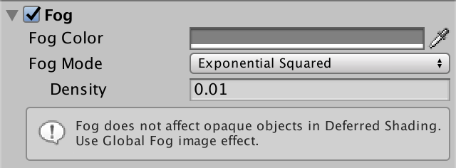 							Default fog enabled. 						

We'll deal with deferred mode later. For now, let's focus on  forward fog. To do so, we need to use forward rendering mode. You can  change the global rendering mode, or force the main camera to use the  desired rendering mode. So set the camera's *Rendering Path* to *Forward*. Let's also disable *HDR* rendering for now.

 							
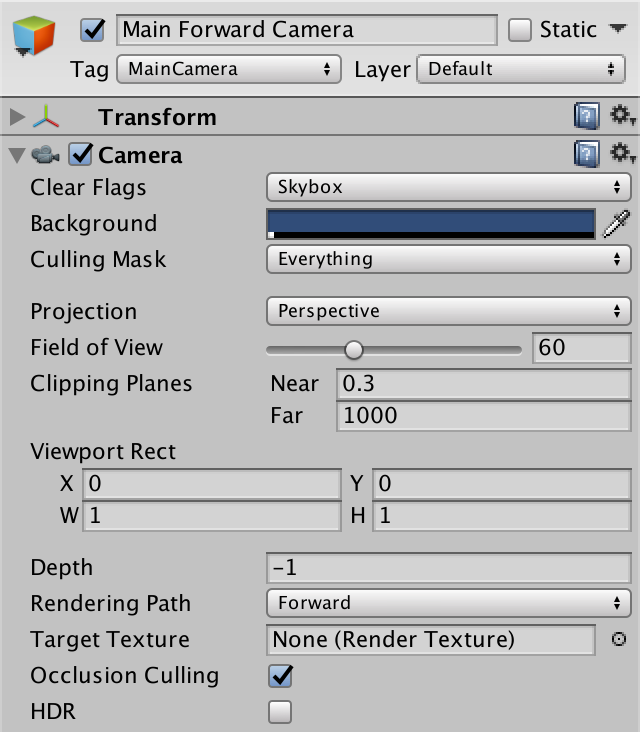 							Forward camera. 						

Create a small test scene, like a few spheres on top of a plane or cube. Use Unity's default white material.

 							
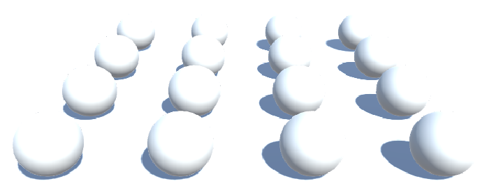 							Unnoticeable fog. 						

With ambient lighting set to its default intensity of 1, you'll get a few very bright objects and no noticeable fog at all.

### Linear Fog

To make the fog more noticeable, set its color to solid black.  That would represent an atmosphere that absorbs light without much  scattering, like thick black smoke.

Set the *Fog Mode* to *Linear*.  This isn't realistic, but easy to configure. You can set the distance  at which the fog's influence begins and where it effectively becomes  solid. It increases linearly in between. This is measured in view  distance. Before the fog starts, visibility is normal. Beyond that  distance, the fog will gradually obscure objects. Beyond the end,  nothing but the fog's color is visible.

 							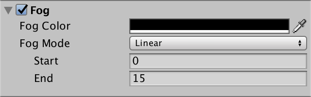 							 							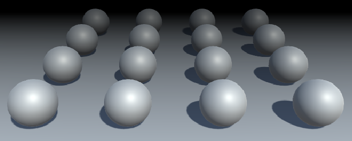 							Linear fog. 						

The linear fog factor is computed with the function f=E−cE−S

, where 

c

 is the fog coordinate and 

S

 and 

E

  and the start and end. This factor is then clamped to the 0–1 range and  used to interpolate between the fog and the object's shaded color.

 							Why doesn't fog affect the skybox? 							 						

### Exponential Fog

The second fog mode that Unity supports is exponential, which is a more realistic approximation of fog. It uses the function f=12cd=2−cd

 where 

d

  is the fog's density factor. This equation will never reach zero,  unlike the linear version. Increase the density to 0.1 to make the fog  appear closer to the camera.

 							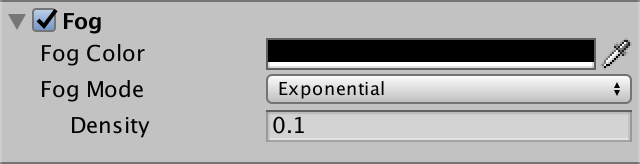 							 							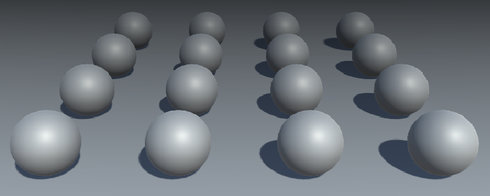 							Exponential fog. 						

### Exponential Squared Fog

The last mode is exponential squared fog. This works like exponential fog, but uses the function f=12(cd)2=2−(cd)2

 which results in less fog at close range, but it increases quicker.

 							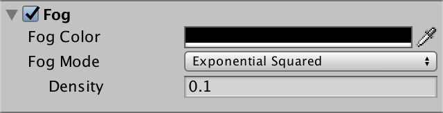 							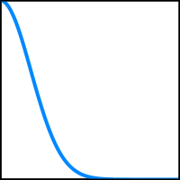 							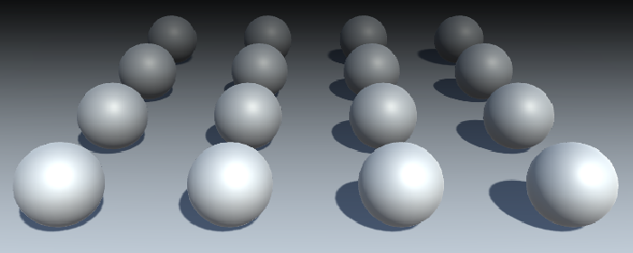 							Exponential squared fog. 						

### Adding Fog

Now that we know what fog looks like, let's add support for it  to our own forward shader. To make comparison easier, set half of the  objects to use our own material, while the rest keeps using the default  material.

 							
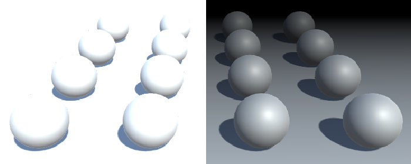 							Our material on the left, standard material on the right. 						

The fog mode is controlled with shader keywords, so we have to  add a multi-compile directive to support them. There is a pre-defined `multi_compile_fog` directive that we can use for this purpose. It results in extra shader variants for the `FOG_LINEAR`, `FOG_EXP`, and `FOG_EXP2` keywords. Add this directive to the two forward passes only.

```
			#pragma multi_compile_fog
```

Next, let's add a function to *My Lighting*  to apply the fog to our fragment color. It takes the current color and  the interpolators as parameters, and should return the final color with  fog applied.

```
float4 ApplyFog (float4 color, Interpolators i) {
	return color;
}
```

The fog effect is based on the view distance, which is equal to  the length of the vector between the camera position and the fragment's  world position. We have access to both positions, so we can compute  this distance.

```
float4 ApplyFog (float4 color, Interpolators i) {
	float viewDistance = length(_WorldSpaceCameraPos - i.worldPos);
	return color;
}
```

Then we use this as the fog coordinate for the fog density function, which is computed by the `**UNITY_CALC_FOG_FACTOR_RAW**` macro. This macro creates the `unityFogFactor` variable, which we can use to interpolate between the fog and fragment color. The fog color is stored in `unity_FogColor`, which is defined in *ShaderVariables*.

```
float4 ApplyFog (float4 color, Interpolators i) {
	float viewDistance = length(_WorldSpaceCameraPos - i.worldPos);
	UNITY_CALC_FOG_FACTOR_RAW(viewDistance);
	return lerp(unity_FogColor, color, unityFogFactor);
}
```

 							How does `**UNITY_CALC_FOG_FACTOR_RAW**` work? 							 						

As the fog factor can end up outside the 0–1 range, we have to clamp it before interpolating.

```
	return lerp(unity_FogColor, color, saturate(unityFogFactor));
```

Also, because fog doesn't affect the alpha component, we can leave that out of the interpolation.

```
	color.rgb = lerp(unity_FogColor.rgb, color.rgb, saturate(unityFogFactor));
	return color;
```

Now we can apply the fog to the final forward-pass color in `MyFragmentProgram`.

```
	#if defined(DEFERRED_PASS)
		#if !defined(UNITY_HDR_ON)
			color.rgb = exp2(-color.rgb);
		#endif
		output.gBuffer0.rgb = albedo;
		output.gBuffer0.a = GetOcclusion(i);
		output.gBuffer1.rgb = specularTint;
		output.gBuffer1.a = GetSmoothness(i);
		output.gBuffer2 = float4(i.normal * 0.5 + 0.5, 1);
		output.gBuffer3 = color;
	#else
		output.color = ApplyFog(color, i);
	#endif
```

 							
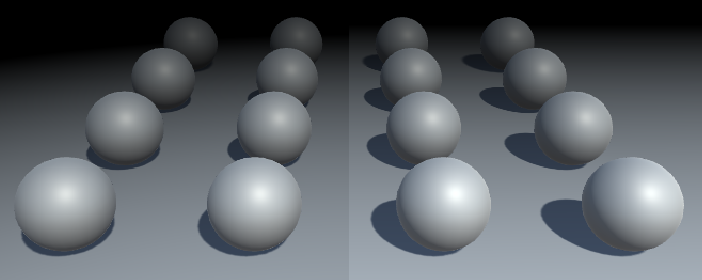 							Linear fog, but different. 						

Our own shader now also includes fog. However, it doesn't quite  match the fog computed by the standard shader. To make the difference  very clear, use linear fog with a start and end that have the same or  nearly the same value. This results in a sudden transition from no to  total fog.

 							
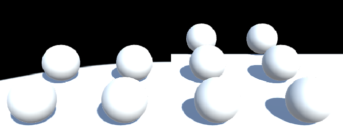 							Curving vs. straight fog transition. 						

### Depth-Based Fog

The difference between our and the standard shader is due to  the way we compute the fog coordinate. While it makes sense to use the  world-space view distance, the standard shader uses a different metric.  Specifically, it uses the clip-space depth value. As a result, the view  angle doesn't affect the fog coordinate. Also, in some cases the  distance is affected by the near clip plane distance of the camera,  which pushes the fog away a bit.

 							
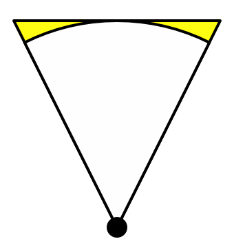 							Flat depth vs. distance. 						

The advantage of using depth instead of distance is that you  don't have to calculate a square root, so it's faster. Also, while less  realistic, depth-based fog might be desirable in certain cases, like for  side-scrolling games. The downside is that, because view-angles are  ignored, the camera orientation influences the fog. As it rotates, the  fog density changes, while it logically shouldn't.

 							
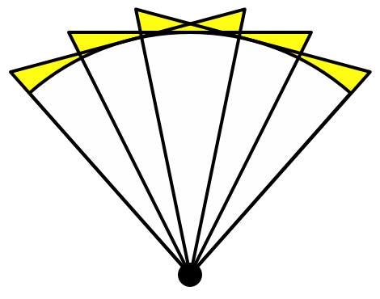 							Rotation changes depth. 						

Let's add support for depth-based fog to our shader, to match  Unity's approach. This requires a few changes to our code. We now have  to pass the clip-space depth value to the fragment program. So define a `FOG_DEPTH` keyword when one of the fog modes is active.

```
#include "UnityPBSLighting.cginc"
#include "AutoLight.cginc"

#if defined(FOG_LINEAR) || defined(FOG_EXP) || defined(FOG_EXP2)
	#define FOG_DEPTH 1
#endif
```

We have to include an interpolator for the depth value. But  instead of giving it a separate interpolator, we can piggyback it on the  world position, as its fourth component.

```
struct Interpolators {
	…
	
	#if FOG_DEPTH
		float4 worldPos : TEXCOORD4;
	#else
		float3 worldPos : TEXCOORD4;
	#endif
	
	…
}
```

To make sure that our code remains correct, replace all usage of `i.worldPos` with `i.worldPos.**xyz**`. After that, assign the clip-space depth value to `i.worldPos.**w**`  in the fragment program, when needed. It's simply the Z coordinate of  the homogeneous clip-space position, so before it gets converted to a  value in the 0–1 range.

```
Interpolators MyVertexProgram (VertexData v) {
	Interpolators i;
	i.pos = UnityObjectToClipPos(v.vertex);
	i.worldPos.xyz = mul(unity_ObjectToWorld, v.vertex);
	#if FOG_DEPTH
		i.worldPos.w = i.pos.z;
	#endif
	i.normal = UnityObjectToWorldNormal(v.normal);

	…
}
```

In `ApplyFog`, overwrite the computed view distance with the interpolated depth value. Keep the old computation, as we'll still use it later.

```
float4 ApplyFog (float4 color, Interpolators i) {
	float viewDistance = length(_WorldSpaceCameraPos - i.worldPos.xyz);
	#if FOG_DEPTH
		viewDistance = i.worldPos.w;
	#endif
	UNITY_CALC_FOG_FACTOR_RAW(viewDistance);
	return lerp(unity_FogColor, color, saturate(unityFogFactor));
}
```

 							
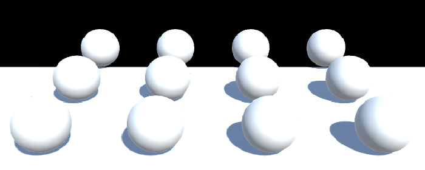 							Fog based on clip space depth. 						

Now you most likely get the same result as the standard shader.  However, in some cases the clip space is configured differently,  producing incorrect fog. To compensate for that, use the `**UNITY_Z_0_FAR_FROM_CLIPSPACE**` macro to convert the depth value.

```
		viewDistance = UNITY_Z_0_FAR_FROM_CLIPSPACE(i.worldPos.w);
```

 							What does `**UNITY_Z_0_FAR_FROM_CLIPSPACE**` do? 							 						

### Depth or Distance

So, which metric should we use for our fog? Clip-space depth,  or world-space distance? Let's support both! But it's not worth making  it a shader-feature. We'll make it a shader configuration option  instead, like `BINORMAL_PER_FRAGMENT`. Let's say that depth-based fog it the default, and you can switch to distance-based fog by defining `FOG_DISTANCE`, in the `CGINCLUDE` section near the top of our shader.

```
	CGINCLUDE

	#define BINORMAL_PER_FRAGMENT
	#define FOG_DISTANCE

	ENDCG
```

All we have to do in *My Lighting* to switch to distance-based fog, is to get rid of the `FOG_DEPTH` definition, if `FOG_DISTANCE` has already been defined.

```
#if defined(FOG_LINEAR) || defined(FOG_EXP) || defined(FOG_EXP2)
	#if !defined(FOG_DISTANCE)
		#define FOG_DEPTH 1
	#endif
#endif
```

### Disabling Fog

Of course we don't always want to use fog. So only include the fog code when it's actually turned on.

```
#if defined(FOG_LINEAR) || defined(FOG_EXP) || defined(FOG_EXP2)
	#if !defined(FOG_DISTANCE)
		#define FOG_DEPTH 1
	#endif
	#define FOG_ON 1
#endif

…

float4 ApplyFog (float4 color, Interpolators i) {
	#if FOG_ON
		float viewDistance = length(_WorldSpaceCameraPos - i.worldPos.xyz);
		#if FOG_DEPTH
			viewDistance = UNITY_Z_0_FAR_FROM_CLIPSPACE(i.worldPos.w);
		#endif
		UNITY_CALC_FOG_FACTOR_RAW(viewDistance);
		color.rgb = lerp(unity_FogColor.rgb, color.rgb, saturate(unityFogFactor));
	#endif
	return color;
}
```

### Multiple Lights

Our fog works correctly with a single light, but how does it  behave when there are multiple lights in the scene? It appears fine when  we're using black fog, but try it with another color as well.

 							 							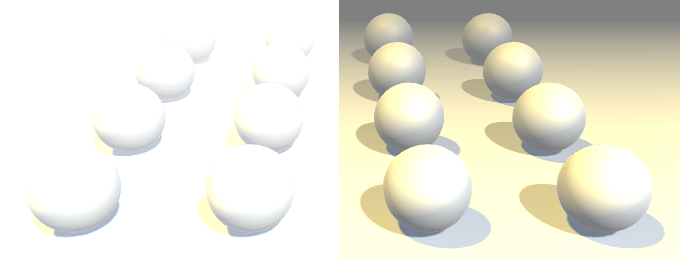 							Gray fog with one and two directional lights. 						

The result is too bright. This happens because we're adding the  fog color once per light. This wasn't a problem when the fog color was  black. So the solution is to always use a black color in the additive  pass. That way, the fog fades the contribution of additional lights,  without brightening the fog itself.

```
		float3 fogColor = 0;
		#if defined(FORWARD_BASE_PASS)
			fogColor = unity_FogColor.rgb;
		#endif
		color.rgb = lerp(fogColor, color.rgb, saturate(unityFogFactor));
```

 							
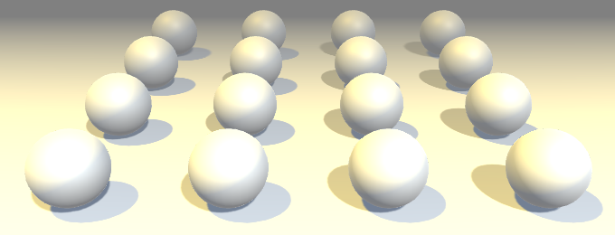 							Correct gray fog with two lights. 						

unitypackage

## Deferred Fog

Now that we have fog working for the forward rendering path,  let's switch to the deferred path. Duplicate the forward-mode camera.  Change the duplicate into a deferred camera, then disable the forward  camera. This way, you can quickly switch between rendering modes by  changing which camera is enabled.

You'll notice that there is no fog at all when using the  deferred rendering path. That's because the fog has to be applied after  all lighting has been calculated. So we cannot add fog in the deferred  pass of our shader.

To compare deferred and forward rendering in the same image, you  can force some of the objects to be rendered in forward mode. For  example, by using a transparent material while keeping it fully opaque.

 						
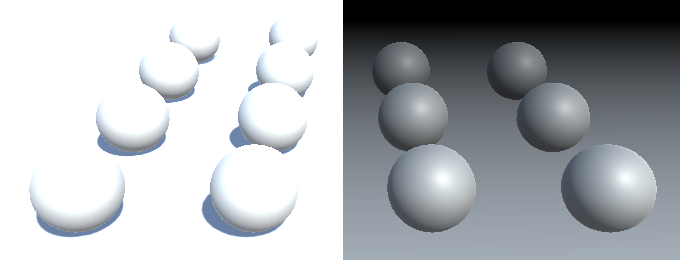 						Opaque and transparent materials. 					

Sure enough, the objects that use a transparent material are affected by the fog.

 						Why are two spheres missing? 						 					

### Image Effects

To add fog to deferred rendering, we have to wait until all  lights are rendered, then do another pass to factor in the fog. As the  fog applies to the entire scene, it's like rendering a directional  light.

A simply way to add such a pass is by adding a custom component to the camera. So create a `**DeferredFogEffect**` class than extends `MonoBehaviour`. Because it's useful to be able to see the fog in edit mode, give it the `ExecuteInEditMode` attribute. Add this component to our deferred camera. That should eventually make the fog appear in the game view.

```
using UnityEngine;

[ExecuteInEditMode]
public class DeferredFogEffect : MonoBehaviour {
}
```

 							
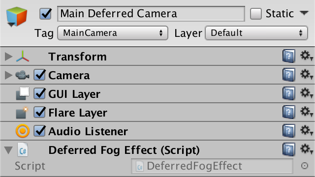 							Deferred camera with fog effect. 						

To add an additional full-screen pass to the rendering process, give our component an `OnRenderImage`  method. Unity will check whether the camera has components with this  method and invoke them after rendering the scene. This allows you to  alter or apply effects to the rendered image. If there are multiple such  components, they will be invoked in the order that they're attached to  the camera.

The `OnRenderImage` method has two `RenderTexture`  parameters. The first being the source texture, which contains the  final colors of the scene, up to this point. The second parameter is the  destination texture that we have to render to. It might be `**null**`, which means it goes directly to the frame buffer.

```
	void OnRenderImage (RenderTexture source, RenderTexture destination) {
	}
```

Once we have added this method, the game view will fail to  render. We have to make sure that we're drawing something. To do so,  invoke the `Graphics.Blit`  method with both textures as arguments. That method will draw a  full-screen quad with a shader that simply reads the source texture and  outputs the sampled colors, unmodified.

```
	void OnRenderImage (RenderTexture source, RenderTexture destination) {
		Graphics.Blit(source, destination);
	}
```

The scene once again gets rendered as usual. However, if you  inspect the frame debugger, you'll see that a pass has been added for  our image effect.

 							
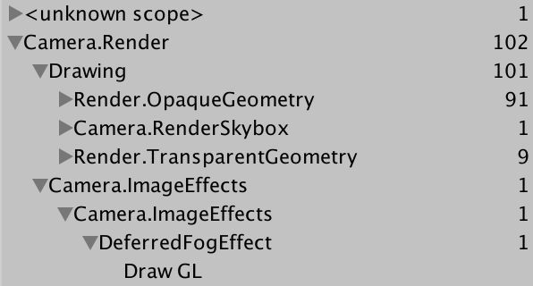 							Drawing an image effect. 						

### Fog Shader

Simply copying the image data is useless. We have to create a  new custom shader to apply the fog effect to the image. Start with a  bare-bones shader. Because we're only drawing a single full-screen quad  that's supposed to cover everything, we should ignore culling and the  depth buffer. We shouldn't write to the depth buffer either.

```
Shader "Custom/Deferred Fog" {
	
	Properties {
		_MainTex ("Source", 2D) = "white" {}
	}

	SubShader {
		Cull Off
		ZTest Always
		ZWrite Off

		Pass {
		}
	}
}
```

Our effect component requires this shader, so add a public field for it, then assign our new shader to it.

```
	public Shader deferredFog;
```

 							
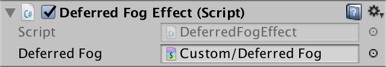 							Using a fog shader. 						

We also need a material for rendering with our shader. We only  need it when active, so no asset is required. Use a non-serialized field  to hold a reference to it.

```
using UnityEngine;
using System;

[ExecuteInEditMode]
public class DeferredFogEffect : MonoBehaviour {

	public Shader deferredFog;

	[NonSerialized]
	Material fogMaterial;
	
	…
}
```

In `OnRenderImage`, we now begin by checking whether we have a material instance. If not, create a new one that uses the fog shader. Then invoke `Graphics.Blit` with this material.

```
	void OnRenderImage (RenderTexture source, RenderTexture destination) {
		if (fogMaterial == null) {
			fogMaterial = new Material(deferredFog);
		}
		Graphics.Blit(source, destination, fogMaterial);
	}
```

This will result in a solid white image. We have to create our  own shader pass to render something useful. Begin with simple vertex and  fragment programs that copy the RGB colors from the source texture,  using the vertex position and UV data from the full-screen quad. Also,  let's already include the multi-compile directive for the fog modes.

```
		Pass {
			CGPROGRAM

			#pragma vertex VertexProgram
			#pragma fragment FragmentProgram

			#pragma multi_compile_fog

			#include "UnityCG.cginc"

			sampler2D _MainTex;

			struct VertexData {
				float4 vertex : POSITION;
				float2 uv : TEXCOORD0;
			};

			struct Interpolators {
				float4 pos : SV_POSITION;
				float2 uv : TEXCOORD0;
			};

			Interpolators VertexProgram (VertexData v) {
				Interpolators i;
				i.pos = UnityObjectToClipPos(v.vertex);
				i.uv = v.uv;
				return i;
			}

			float4 FragmentProgram (Interpolators i) : SV_Target {
				float3 sourceColor = tex2D(_MainTex, i.uv).rgb;
				return float4(sourceColor, 1);
			}

			ENDCG
		}
```

### Depth-Based Fog

Because we're using deferred rendering, we know that there is a  depth buffer available. After all, the light passes need it to their  work. So we can read from it as well, which means that we can use it to  compute depth-based fog.

Unity makes the depth buffer available via the `_CameraDepthTexture` variable, so add it to our shader.

```
			sampler2D _MainTex, _CameraDepthTexture;
```

We can sample this texture, although the exact syntax depends on the target platform. The `**SAMPLE_DEPTH_TEXTURE**` macro, defined in *HLSLSupport*, takes care of this for us.

```
			float4 FragmentProgram (Interpolators i) : SV_Target {
				float depth = SAMPLE_DEPTH_TEXTURE(_CameraDepthTexture, i.uv);

				float3 sourceColor = tex2D(_MainTex, i.uv).rgb;
				return float4(sourceColor, 1);
			}
```

This gives us the raw data from the depth buffer, so after the  conversion from homogeneous coordinates to a clip-space value in the 0–1  range. We have to convert this value so it becomes a linear depth value  in world space. First, we can use the `Linear01Depth` function defined in *UnityCG* to convert it to a linear range.

```
				float depth = SAMPLE_DEPTH_TEXTURE(_CameraDepthTexture, i.uv);
				depth = Linear01Depth(depth);
```

 							What does `Linear01Depth` look like? 							 						

Next, we have to scale this value by the far clip plane's  distance, to get the actual depth-based view distance. The clip space  settings are made available via the `**float4** _ProjectionParams` variable, which is defined in *UnityShaderVariables*. Its Z component contains the far plane's distance.

```
				depth = Linear01Depth(depth);

				float viewDistance = depth * _ProjectionParams.z;
```

Once we have our distance, we can compute the fog factor and interpolate.

```
				float viewDistance = depth * _ProjectionParams.z;
				
				UNITY_CALC_FOG_FACTOR_RAW(viewDistance);
				unityFogFactor = saturate(unityFogFactor);
						
				float3 sourceColor = tex2D(_MainTex, i.uv).rgb;
				float3 foggedColor =
					lerp(unity_FogColor.rgb, sourceColor, unityFogFactor);
				return float4(foggedColor, 1);
```

 							
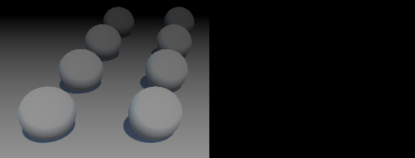 							Incorrect fog. 						

### Fixing the Fog

Unfortunately, our fog isn't quite right yet. The most obvious  error is that we're drawing the fog on top of the transparent geometry.  To prevent this from happening, we have to apply the fog effect before  drawing the transparent objects. We can attach the `ImageEffectOpaque` attribute to our method to instruct Unity to do so.

```
	[ImageEffectOpaque]
	void OnRenderImage (RenderTexture source, RenderTexture destination) {
		Graphics.Blit(source, destination, fogMaterial);
	}
```

 							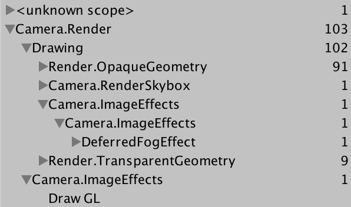
 							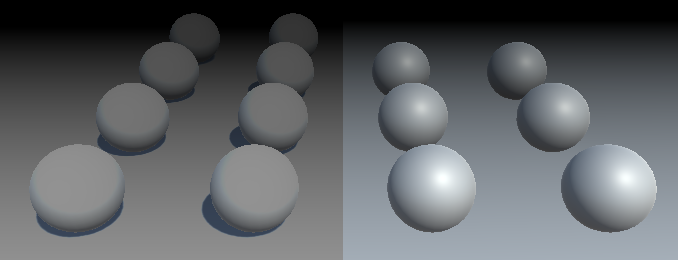 							Fog after opaque, before transparent. 						

Another problem is that the fog colors are obviously wrong.  This happens when not using an HDR camera, which screws up the colors.  So simple enable *HDR* on our deferred camera.

 							
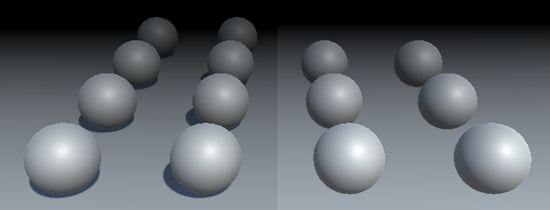 							With HDR camera. 						

Finally, we once again can get a difference in depth, because we're not taking the near plane into consideration.

 							
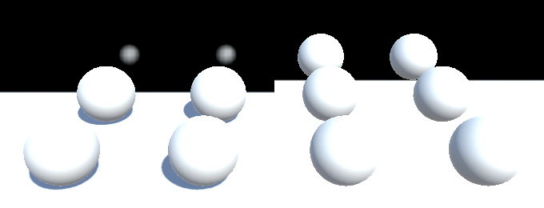 							Different depths. 						

We can slightly compensate for this by subtracting the near  plane distance from the view distance. It's stored in the Y component of  `_ProjectionParams`. Unfortunately, it won't  produce an exact match, because of the order in which we have to convert  the depth value. Unity's fog effects use it anyway to adjust the fog,  so let's do it as well.

```
				float viewDistance =
					depth * _ProjectionParams.z - _ProjectionParams.y;
```

 							
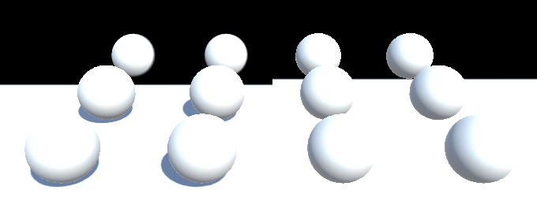 							Partially-compensated depth. 						

### Distance-Based Fog

The shader for deferred lights reconstructs the world-space  position from the depth buffer, in order to calculate lighting. We can  do this as well.

The clip space of a perspective camera defines a trapezoid  region of space. If we ignore the near plane, then we get a pyramid with  its top at the camera's world position. Its height is equal to the  camera's far plane distance. The linearized depth is 0 at its tip, and 1  and its base.

 							
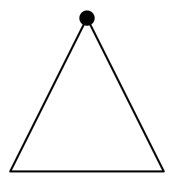 							Side view of pyramid. 						

For every pixel of our image, we can shoot a ray from the top  to a point on the base of the pyramid. If there's nothing in the way,  then the ray reaches the base, which is the far plane. Otherwise, it  hits whatever object was rendered.

 							
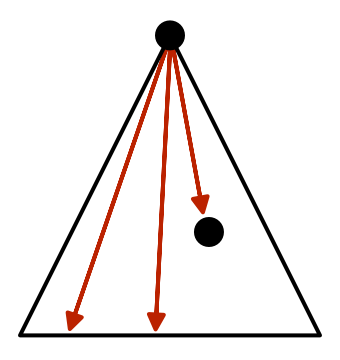 							One ray per pixel. 						

If something was hit, then the corresponding pixel has a depth  value less than 1. For example, if it hit something halfway, then the  depth value will be ½. This means that the ray's Z coordinate is half  the size it would've been if it hadn't been blocked. As the direction of  the ray is still the same, this means that the X and Y coordinates are  also halved. In general, we can find the actual ray by starting with a  ray that goes all the way to the far plane, and then scaling it by the  depth value.

 							
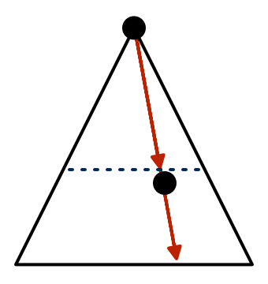 							Scaling rays. 						

Once we have this ray, we can add it to the camera's position  to find the world-space position of the rendered surface. But as we're  only interested in the distance, all we really need is the length of  this ray.

For this to be useful, we have to know the rays from the camera  to far the plane, for each pixel. Actually, we only need four rays, one  per corner of the pyramid. Interpolation gives us the rays for all the  pixels in between.

### Calculating Rays

We can construct the rays based on the camera's far plane and  its field of view angle. The camera's orientation and position don't  matter for distances, so we can ignore its transformation. The `Camera.CalculateFrustumCorners`  method can do this for us. It has four parameters. The first is the  rectangular area to use, which in our case is the entire image. The  second is how far away to project the rays, which has to match the far  plane. The third parameter involves stereoscopic rendering. We'll just  use the currently active eye. Finally, the method needs an array of 3D  vectors to store the rays. So we have to cache both a reference to the  camera and a vector array.

```
	[NonSerialized]
	Camera deferredCamera;

	[NonSerialized]
	Vector3[] frustumCorners;

	[ImageEffectOpaque]
	void OnRenderImage (RenderTexture source, RenderTexture destination) {
		if (fogMaterial == null) {
			deferredCamera = GetComponent<Camera>();
			frustumCorners = new Vector3[4];
			fogMaterial = new Material(deferredFog);
		}
		deferredCamera.CalculateFrustumCorners(
			new Rect(0f, 0f, 1f, 1f),
			deferredCamera.farClipPlane,
			deferredCamera.stereoActiveEye,
			frustumCorners
		);

		Graphics.Blit(source, destination, fogMaterial);
	}
```

Next, we have to pass this data to the shader. We can do so with a vector array. However, we cannot directly use `frustumCorners`. The first reason is that we can only pass 4D vectors to the shader. So let's include a `Vector4[]` field as well, and pass that to the shader as *_FrustumCorners*.

```
	[NonSerialized]
	Vector4[] vectorArray;

	[ImageEffectOpaque]
	void OnRenderImage (RenderTexture source, RenderTexture destination) {
		if (fogMaterial == null) {
			deferredCamera = GetComponent<Camera>();
			frustumCorners = new Vector3[4];
			vectorArray = new Vector4[4];
			fogMaterial = new Material(deferredFog);
		}
		deferredCamera.CalculateFrustumCorners(
			new Rect(0f, 0f, 1f, 1f),
			deferredCamera.farClipPlane,
			deferredCamera.stereoActiveEye,
			frustumCorners
		);

		vectorArray[0] = frustumCorners[0];
		vectorArray[1] = frustumCorners[1];
		vectorArray[2] = frustumCorners[2];
		vectorArray[3] = frustumCorners[3];
		fogMaterial.SetVectorArray("_FrustumCorners", vectorArray);

		Graphics.Blit(source, destination, fogMaterial);
	}
```

The second problem is that the order of the corners has to be changed. The `CalculateFrustumCorners`  orders them bottom-left, top-left, top-right, bottom-right. However,  the quad used to render the image effect has its corner vertices ordered  bottom-left, bottom-right, top-left, top-right. So let's reorder them  to match the quad's vertices.

```
		vectorArray[0] = frustumCorners[0];
		vectorArray[1] = frustumCorners[3];
		vectorArray[2] = frustumCorners[1];
		vectorArray[3] = frustumCorners[2];
```

### Deriving Distances

To access the rays in our shader, add a float array variable.  We don't actually have to add a property for this to work, as we won't  be manually editing them anyway. Although we can only pass 4D vectors to  the shader, internally we only need the first three components. So the `**float3**` type suffices.

```
			sampler2D _MainTex, _CameraDepthTexture;

			float3 _FrustumCorners[4];
```

Next, define `FOG_DISTANCE` to indicate that we want to base our fog on actual distances, like in our other shader.

```
			#pragma multi_compile_fog

			#define FOG_DISTANCE
```

When we need distances, we have to interpolate the rays and send them to the fragment program.

```
			struct Interpolators {
				float4 pos : SV_POSITION;
				float2 uv : TEXCOORD0;
				
				#if defined(FOG_DISTANCE)
					float3 ray : TEXCOORD1;
				#endif
			};
```

In the vertex program, we can simply use the UV coordinates to  access the corner array. The coordinates are (0, 0), (1, 0), (0, 1), and  (1, 1). So the index is u+2v

.

```
			Interpolators VertexProgram (VertexData v) {
				Interpolators i;
				i.pos = UnityObjectToClipPos(v.vertex);
				i.uv = v.uv;
				#if defined(FOG_DISTANCE)
					i.ray = _FrustumCorners[v.uv.x + 2 * v.uv.y];
				#endif
				return i;
			}
```

Finally, we can replace the depth-based distance with the actual distance in the fragment program.

```
				float viewDistance =
					depth * _ProjectionParams.z - _ProjectionParams.y;
				#if defined(FOG_DISTANCE)
					viewDistance = length(i.ray * depth);
				#endif
```

 							
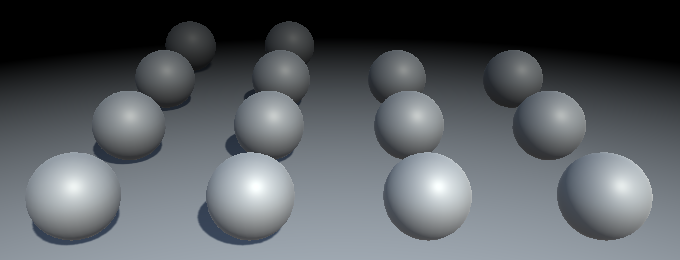 							Fog based on distance. 						

Besides precision limitations of the depth buffer, both forward and deferred approaches produce the same distance-based fog.

### Fogged Skybox

Actually, there is still a significant difference between  forward and deferred fog. You might have noticed that deferred fog  affects the skybox as well. It acts as is the far plane is a solid  barrier, which is affected by the fog.

 							
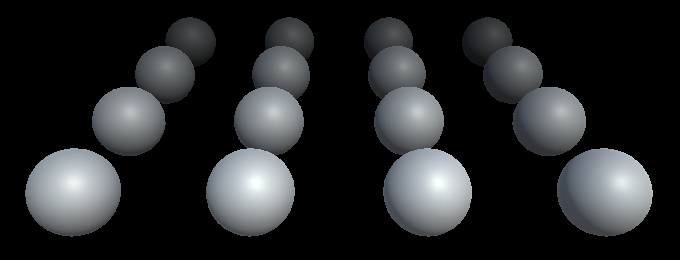 							Fogged skybox. 						

We know that we've reached the far plane when the depth value  approaches 1. If we don't want to fog the skybox, we can prevent that by  setting the fog factor to 1, when that's the case.

```
				UNITY_CALC_FOG_FACTOR_RAW(viewDistance);
				unityFogFactor = saturate(unityFogFactor);
				if (depth > 0.9999) {
					unityFogFactor = 1;
				}
```

 							
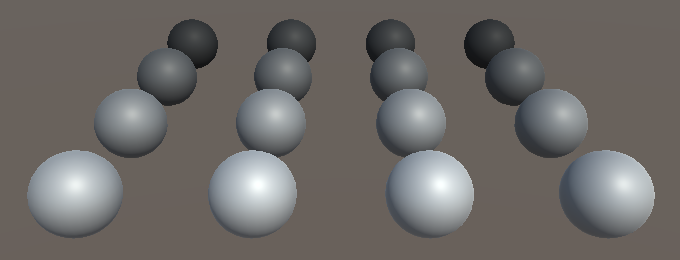 							Skybox without fog. 						

In case you do want to apply fog to the entire image, you can control it via a macro definition. When `FOG_SKYBOX` is defined, apply fog to the skybox, otherwise don't.

```
			#define FOG_DISTANCE
//			#define FOG_SKYBOX

			…

				UNITY_CALC_FOG_FACTOR_RAW(viewDistance);
				unityFogFactor = saturate(unityFogFactor);
				#if !defined(FOG_SKYBOX)
					if (depth > 0.9999) {
						unityFogFactor = 1;
					}
				#endif
```

### No Fog

Finally, we have to consider the scenario in which the fog has been deactivated.

 							
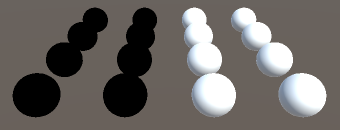 							No fog, incorrect. 						

This can also be done by forcing the fog factor to 1, when none  of the fog keywords are defined. This turns our shader into nothing but  a texture copy operation, so it's actually better to deactivate or  remove the fog component if you don't need it.

```
				#if !defined(FOG_SKYBOX)
					if (depth > 0.9999) {
						unityFogFactor = 1;
					}
				#endif
				#if !defined(FOG_LINEAR) && !defined(FOG_EXP) && !defined(FOG_EXP2)
					unityFogFactor = 1;
				#endif
```

The next tutorial is [Deferred Lights](https://catlikecoding.com/unity/tutorials/rendering/part-15/).

unitypackage

PDF
