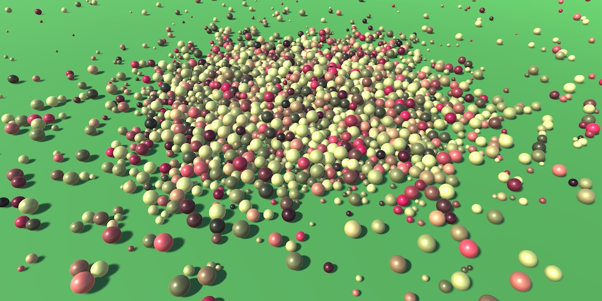
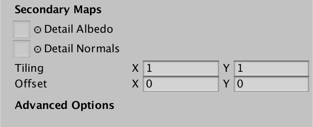
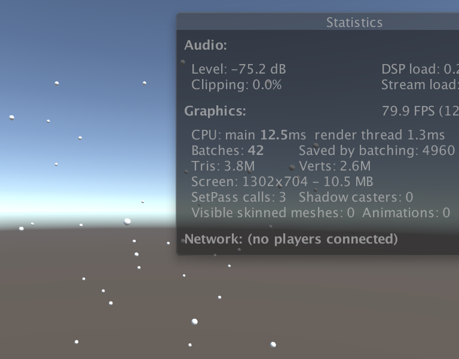
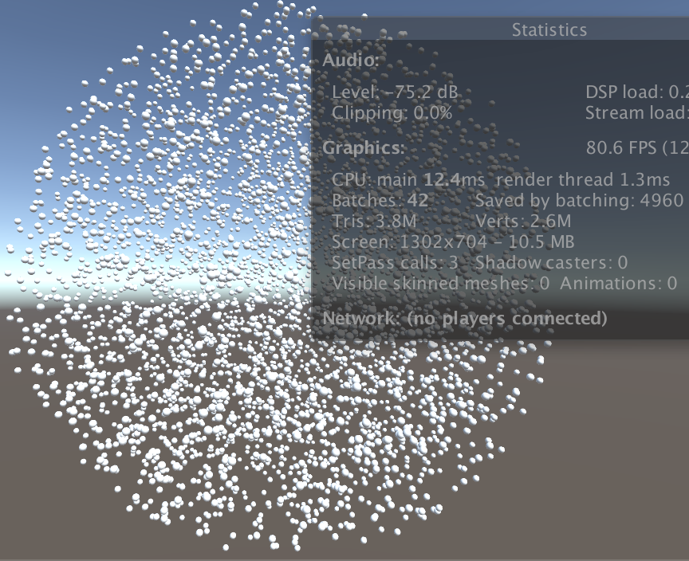
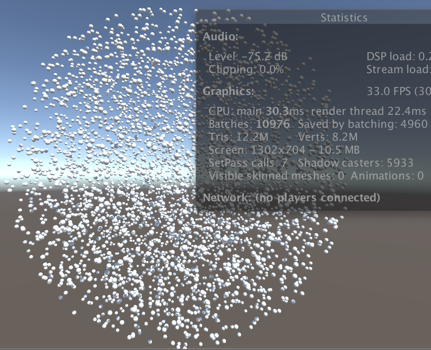
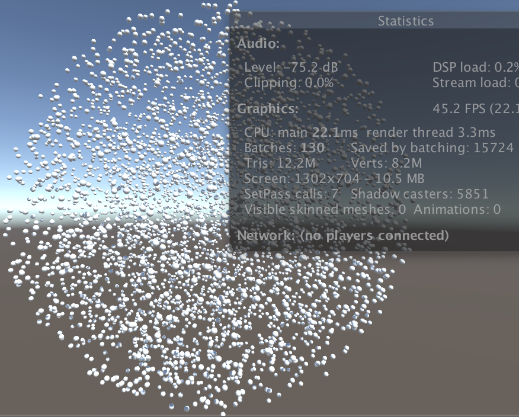
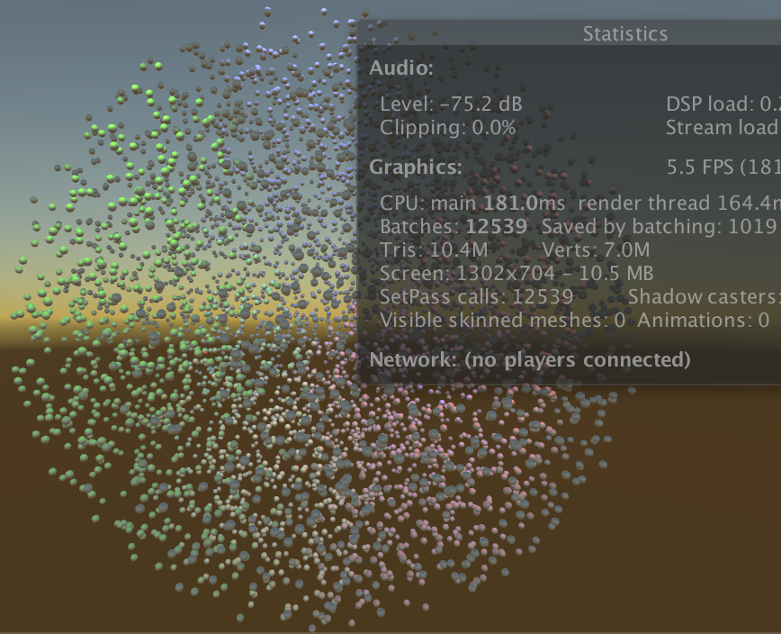
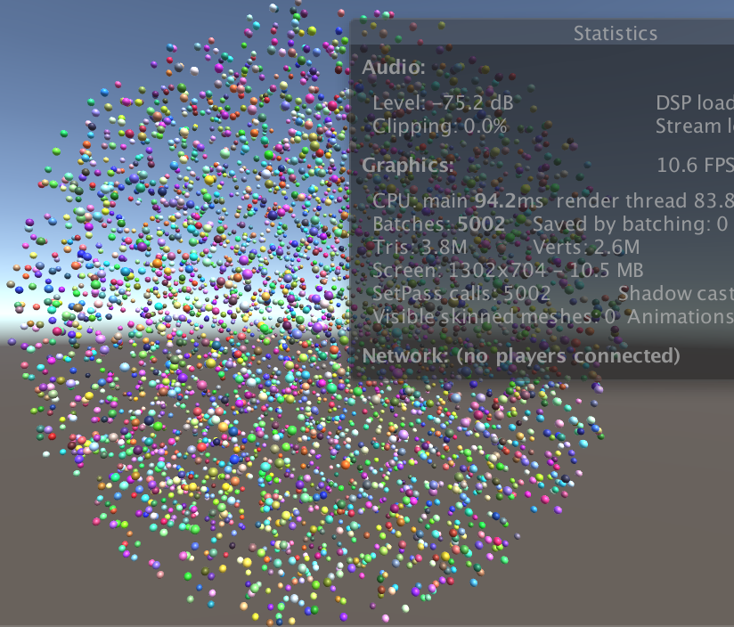
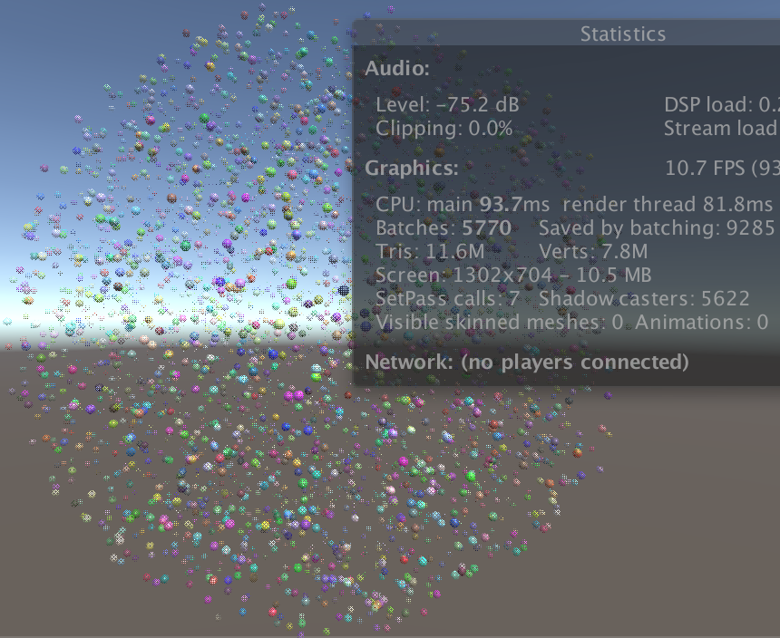
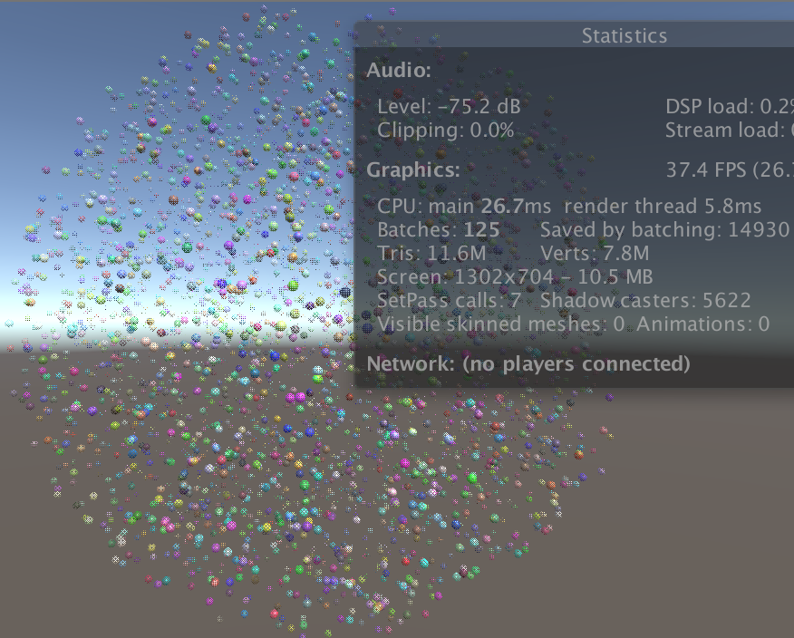

# (DZR)Rendering 19

GPU Instancing

- Render a boatload of spheres.
- Add support for GPU instancing.
- Use material property blocks.
- Make instancing work with LOD groups.

This is part 19 of a tutorial series about rendering. The [previous part](https://catlikecoding.com/unity/tutorials/rendering/part-18/)  covered realtime GI, probe volumes, and LOD groups. This time we'll add  support for another way to consolidate draw calls into batches.

This tutorial was made with Unity 2017.1.0f3.


 					Thousands of spheres, rendered in a few dozen batches. 				

## Batching Instances

Instructing the GPU to draw something takes time. Feeding it the  data to do so, including the mesh and material properties, takes time  as well. We already know of two ways to decrease the amount of draw  calls, which are static and dynamic batching.

Unity can merge the meshes of static objects into a larger  static mesh, which reduces draw calls. Only objects that use the same  material can be combined in this way. This comes at the cost of having  to store more mesh data. When dynamic batching is enabled, Unity does  the same thing at runtime for dynamic objects that are in view. This  only works for small meshes, otherwise the overhead becomes too great.

There is yet another way to combine draw calls. It is know as  GPU instancing or geometry instancing. Like dynamic batching, this is  done at runtime for visible objects. The idea is that the GPU is told to  render the same mesh multiple times in one go. So it cannot combine  different meshes or materials, but it's not restricted to small meshes.  We're going to try out this approach.

### Many Spheres

To test GPU instancing, we need to render the same mesh many  times. Let's create a simple sphere prefab for this, which uses our  white material.


 							White sphere prefab. 						

To instantiate this sphere, create a test component which  spawns a prefab many times and positions it randomly inside a spherical  area. Make the spheres children of the instantiator so the editor's  hierarchy window doesn't have to struggle with displaying thousands of  instances.

```
using UnityEngine;

public class GPUInstancingTest : MonoBehaviour {

	public Transform prefab;

	public int instances = 5000;

	public float radius = 50f;

	void Start () {
		for (int i = 0; i < instances; i++) {
			Transform t = Instantiate(prefab);
			t.localPosition = Random.insideUnitSphere * radius;
			t.SetParent(transform);
		}
	}
}
```

Create a new scene and put a test object in it with this  component. Assign the sphere prefab to it. I'll use it to create 5000  sphere instances inside a sphere of radius 50.


 							Test object. 						

With the test object positioned at the origin, placing the  camera at (0, 0, -100) ensures that the entire ball of spheres is in  view. Now we can use the statistics panel of the game window to  determine how all the objects are drawn. Turn off the shadows of the  main light so only the spheres are drawn, plus the background. Also set  the camera to use the forward rendering path.


 							A sphere of spheres. 						

In my case, it takes 5002 draw calls to render the view, which is mentioned as *Batches* in the statistics panel. That's 5000 spheres plus two extra for the background and camera effects.

Note that the spheres are not batched, even with dynamic  batching enabled. That's because the sphere mesh is too large. Had we  used cubes instead, they would've been batched.


 							A sphere of cubes. 						

In the case of cubes, I only end up with eight batches, so all  cubes are rendered in six batches. That's 4994 fewer draw calls,  reported as *Saved by batching* in the statistics  panel. In my case it also reports a much higher frame rate. 83 instead  of 35 fps. This is a measure of the time to render a frame, not the  actual frame rate, but it's still a good indication of the performance  difference. The cubes are faster to draw because they're batched, but  also because a cube requires far less mesh data than a sphere. So it's  not a fair comparison. 							 						

As the editor generates a lot of overhead, the performance  difference can be much greater in builds. Especially the scene window  can slow things down a lot, as it's an extra view that has to be  rendered. I have it hidden when in play mode to improve performance.

### Supporting Instancing

GPU instancing isn't possible by default. Shaders have to be  designed to support it. Even then, instancing has to be explicitly  enabled per material. Unity's standard shaders have a toggle for this.  Let's add an instancing toggle to `**MyLightingShaderGUI**` as well. Like the standard shader's GUI, we'll create an *Advanced Options* section for it. The toggle can be added by invoking the `MaterialEditor.EnableInstancingField` method. Do this is a new `DoAdvanced` method.

```
	void DoAdvanced () {
		GUILayout.Label("Advanced Options", EditorStyles.boldLabel);

		editor.EnableInstancingField();
	}
```

Add this section at the bottom of our GUI.

```
	public override void OnGUI (
		MaterialEditor editor, MaterialProperty[] properties
	) {
		this.target = editor.target as Material;
		this.editor = editor;
		this.properties = properties;
		DoRenderingMode();
		DoMain();
		DoSecondary();
		DoAdvanced();
	}
```

Select our white material. An *Advanced Options* header is now visible at the bottom of its inspector. However, there isn't a toggle for instancing yet.


 							No support for instancing yet. 						

The toggle will only be shown if the shader actually supports instancing. We can enabled this support by adding the `#pragma multi_compile_instancing` directive to at least one pass of a shader. This will enable shader variants for a few keywords, in our case *INSTANCING_ON*, but other keywords are also possible. Do this for the base pass of *My First Lighting Shader*.

```
			#pragma multi_compile_fwdbase
			#pragma multi_compile_fog
			#pragma multi_compile_instancing
```


 							Supported and enabled instancing. 						

Our material now has an *Enable Instancing* toggle. Checking will change how the spheres are rendered.


 							Only one position per batch. 						

In my case, the number of batches has been reduces to 42, which  means that all 5000 spheres are now rendered with only 40 batches. The  frame rate has also shot up to 80 fps. But only a few spheres are  visible.

All 5000 spheres are still being rendered, it's just that all  spheres in the same batch end up at the same position. They all use the  transformation matrix of the first sphere in the batch. This happens  because the matrices of all spheres in a batch are now send to the GPU  as an array. Without telling the shader which array index to use, it  always uses the first one.

### Instance IDs

The array index corresponding to an instance is known as its  instance ID. The GPU passes it to the shader's vertex program via the  vertex data. It is an unsigned integer named `instanceID` with the *SV_InstanceID* semantic on most platforms. We can simply use the `**UNITY_VERTEX_INPUT_INSTANCE_ID**` macro to include it in our `**VertexData**` structure. It is defined in *UnityInstancing*, which is included by *UnityCG*. It gives us the correct definition of the instance ID, or nothing when instancing isn't enabled. Add it to the `**VertexData**` structure in *My Lighting*.

```
struct VertexData {
	UNITY_VERTEX_INPUT_INSTANCE_ID
	float4 vertex : POSITION;
	…
};
```

We now have access to the instance ID in our vertex program,  when instancing is enabled. With it, we can use the correct matrix when  transforming the vertex position. However, `UnityObjectToClipPos` doesn't have a matrix parameter. It always uses `unity_ObjectToWorld`. To work around this, the *UnityInstancing* include file overrides `unity_ObjectToWorld`  with a macro that uses the matrix array. This can be considered a dirty  macro hack, but it works without having to change existing shader code,  ensuring backwards compatibility.

To make the hack work, the instance's array index has to be  globally available for all shader code. We have to manually set this up  via the `**UNITY_SETUP_INSTANCE_ID**` macro, which must by done in the vertex program before any code that might potentially need it.

```
InterpolatorsVertex MyVertexProgram (VertexData v) {
	InterpolatorsVertex i;
	UNITY_INITIALIZE_OUTPUT(Interpolators, i);
	UNITY_SETUP_INSTANCE_ID(v);
	i.pos = UnityObjectToClipPos(v.vertex);
	…
}
```


 							Instanced spheres. 						

The shader can now access the transformation matrices of all instances, so the spheres are rendered at their actual locations.

 							How does the matrix array replacement work? 							 						

### Batch Size

It is possible that you end up with a different amount of  batches than I get. In my case, 5000 sphere instances are rendered in 40  batches, which means 125 spheres per batch.

Each batch requires its own array of matrices. This data is  send to the GPU and stored in a memory buffer, known as a constant  buffer in Direct3D and a uniform buffer in OpenGL. These buffers have a  maximum size, which limits how many instances can fit in one batch. The  assumption is that desktop GPUs have a limit of 64KB per buffer.

A single matrix consists of 16 floats, which are four bytes  each. So that's 64 bytes per matrix. Each instance requires an  object-to-world transformation matrix. However, we also need a  world-to-object matrix to transform normal vectors. So we end up with  128 bytes per instance. This leads to a maximum batch size of 64000128=500

, which could render 5000 spheres in only 10 batched.

 							Isn't the maximum 512? 							 						

Although the maximum is 64KB for desktops, most mobiles are  assumed to have a maximum of only 16KB. Unity copes with this by simply  dividing the maximum by four when targeting OpenGL ES 3, OpenGL Core, or  Metal. Because I'm using OpenGL Core in the editor, I end up with a  maximum batch size of 5004=125

.

You can disable this automatic reduction by adding the compiler directive `#pragma instancing_options force_same_maxcount_for_gl`.  Multiple instancing options are combined in the same directive.  However, that might lead to failure when deploying to mobile devices, so  be careful.

 							What about the *assumeuniformscaling* option? 							 						

### Instancing Shadows

Up to this point we have worked without shadows. Turn the soft  shadows back on for the main light and make sure that the shadow  distance is enough to include all spheres. As the camera sits at -100  and the sphere's radius is 50, a shadow distance of 150 is enough for  me.


 							Lots of shadows. 						

Rendering shadows for 5000 spheres takes a toll on the GPU. But  we can use GPU instancing when rendering the sphere shadows as well.  Add the required directive to the shadow caster pass.

```
			#pragma multi_compile_shadowcaster
			#pragma multi_compile_instancing
```

Also add `**UNITY_VERTEX_INPUT_INSTANCE_ID**` and `**UNITY_SETUP_INSTANCE_ID**` to *My Shadows*.

```
struct VertexData {
	UNITY_VERTEX_INPUT_INSTANCE_ID
	…
};

…

InterpolatorsVertex MyShadowVertexProgram (VertexData v) {
	InterpolatorsVertex i;
	UNITY_SETUP_INSTANCE_ID(v);
	…
}
```


 							Instanced shadows. 						

Now it is a lot easier to render all those shadows.

### Multiple Lights

We've only added support for instancing to the base pass and  the shadow caster pass. So batching won't work for additional lights. To  verify this, deactivate the main light and add a few spotlights or  point lights that affect many spheres each. Don't bother turning on  shadows for them, as that would really drop the frame rate.


 							Multiple lights take a while to render. 						

It turns out that spheres that aren't affected by the extra  lights are still batched, along with the shadows. But the other spheres  aren't even batched in their base pass. Unity doesn't support batching  for those cases at all. To use instancing in combination with multiple  lights, we have no choice but to switch to the deferred rendering path.  To make that work, add the required compiler directive to the deferred  pass of our shader.

```
			#pragma multi_compile_prepassfinal
			#pragma multi_compile_instancing
```


 							Multiple lights with deferred rendering. 						

After verifying that it works for deferred rendering, switch back to the forward rendering mode.

unitypackage

## Mixing Material Properties

One limitation of all forms of batching is that they are limited  to objects that have identical materials. This limitation becomes a  problem when we desire variety in the objects that we render.

### Randomized Colors

As an example, let's vary the colors of our spheres. Assign a  random color to each instance's material after it has been created. This  will implicitly create a duplicate of the shared material, so we end up  with 5000 material instances in memory.

```
	void Start () {
		for (int i = 0; i < instances; i++) {
			Transform t = Instantiate(prefab);
			t.localPosition = Random.insideUnitSphere * radius;
			t.SetParent(transform);

			t.GetComponent<MeshRenderer>().material.color =
				new Color(Random.value, Random.value, Random.value);
		}
	}
```


 							Spheres with random colors, without batching and shadows. 						

Even though we have enabled batching for our material, it no  longer works. Turn of shadows to see this more clearly. We're back to  one draw call per sphere. And as each now has its own material, the  shader state has to be changed for each sphere as well. This is shown in  the statistics panel as *SetPass calls*. It used to be one for all spheres, but now it's 5000. As a result, my frame rate has dropped to 10fps.

### Material Property Blocks

Instead of creating a new material instance per sphere, we can  also use material property blocks. These are small objects which contain  overrides for shader properties. Instead of directly assigning the  material's color, set the color of a property block and pass that to the  sphere's renderer.

```
//			t.GetComponent<MeshRenderer>().material.color =
//				new Color(Random.value, Random.value, Random.value);

			MaterialPropertyBlock properties = new MaterialPropertyBlock();
			properties.SetColor(
				"_Color", new Color(Random.value, Random.value, Random.value)
			);
			t.GetComponent<MeshRenderer>().SetPropertyBlock(properties);
```

The `MeshRenderer.SetPropertyBlock`  method copies the data of the block, so there is no dependency on the  block that we have locally created. This allows us to reuse one block to  configure all of our instances.

```
	void Start () {
		MaterialPropertyBlock properties = new MaterialPropertyBlock();
		for (int i = 0; i < instances; i++) {
			Transform t = Instantiate(prefab);
			t.localPosition = Random.insideUnitSphere * radius;
			t.SetParent(transform);

//			MaterialPropertyBlock properties = new MaterialPropertyBlock();
			properties.SetColor(
				"_Color", new Color(Random.value, Random.value, Random.value)
			);
			t.GetComponent<MeshRenderer>().SetPropertyBlock(properties);
		}
	}
```

After this change, we're back to one *SetPass call* for all our spheres. But they're also white again. That's because the GPU doesn't know about the property overrides yet.

### Property Buffers

When rendering instanced objects, Unity makes the  transformation matrices available to the GPU by uploading arrays to its  memory. Unity does the same for the properties stored in material  property blocks. But for this to work, we have to define an appropriate  buffer in *My Lighting*.

Declaring an instancing buffer works like creating a structure  such as the interpolators, but the exact syntax varies per platform. We  can use the `**UNITY_INSTANCING_CBUFFER_START**` and `**UNITY_INSTANCING_CBUFFER_END**` macros to take care of the difference. When instancing is enabled, they do nothing.

Put the definition of our `_Color` variable inside an instancing buffer. The `**UNITY_INSTANCING_CBUFFER_START**` macro requires a name parameter. The actual name doesn't matter. The macro prefixes it with *UnityInstancing_* to prevent name clashes.

```
UNITY_INSTANCING_CBUFFER_START(InstanceProperties)
	float4 _Color;
UNITY_INSTANCING_CBUFFER_END
```

Like the transformation matrices, the color data will be uploaded to the GPU as an array when instancing is enabled. The `**UNITY_DEFINE_INSTANCED_PROP**` macro takes care of the correct declaration syntax for us.

```
UNITY_INSTANCING_CBUFFER_START(InstanceProperties)
//	float4 _Color;
	UNITY_DEFINE_INSTANCED_PROP(float4, _Color)
UNITY_INSTANCING_CBUFFER_END
```

To access the array in the fragment program, we need to know  the instance ID there as well. So add it to the interpolator structures.

```
struct InterpolatorsVertex {
	UNITY_VERTEX_INPUT_INSTANCE_ID
	…
};

struct Interpolators {
	UNITY_VERTEX_INPUT_INSTANCE_ID
	…
};
```

In the vertex program, copy the ID from the vertex data to the interpolators. The `**UNITY_TRANSFER_INSTANCE_ID**` macro defines this simple operation when instancing is enabled and does nothing otherwise.

```
InterpolatorsVertex MyVertexProgram (VertexData v) {
	InterpolatorsVertex i;
	UNITY_INITIALIZE_OUTPUT(Interpolators, i);
	UNITY_SETUP_INSTANCE_ID(v);
	UNITY_TRANSFER_INSTANCE_ID(v, i);
	…
}
```

At the beginning of the fragment program, make the ID globally available, just like in the vertex program.

```
FragmentOutput MyFragmentProgram (Interpolators i) {
	UNITY_SETUP_INSTANCE_ID(i);
	…
}
```

Now we have to access the colors either simply as `_Color` when instancing isn't used, and as `_Color[unity_InstanceID]` when instancing is enabled. We can use the `**UNITY_ACCESS_INSTANCED_PROP**` macro for that.

```
float3 GetAlbedo (Interpolators i) {
	float3 albedo =
		tex2D(_MainTex, i.uv.xy).rgb * UNITY_ACCESS_INSTANCED_PROP(_Color).rgb;
	…
}

float GetAlpha (Interpolators i) {
	float alpha = UNITY_ACCESS_INSTANCED_PROP(_Color).a;
	…
}
```

 							Why doesn't it compile, or why does Unity change my code? 							 						


 							Batched colored spheres. 						

Now our randomly-colored spheres are batched again. We could  make other properties variable in the same way. This is possible for  colors, floats, matrices, and four-component float vectors. If you  wanted to vary textures, you could use a separate texture array and add  the indices to an instancing buffer.

Multiple properties can be combined in the same buffer, but  keep the size limitation in mind. Also be aware that the buffers are  partitioned into 32-bit blocks, so a single floats requires the same  space as a vector. You can also use multiple buffers, but there's a  limit for that too and they don't come for free. Every property that  gets buffered becomes an array when instancing is enabled, so only do  this for properties that need to vary per instance.

### Shadows

Our shadows also depend on the color. Adjust *My Shadows* so it can support a unique color per instance as well.

```
//float4 _Color;
UNITY_INSTANCING_CBUFFER_START(InstanceProperties)
	UNITY_DEFINE_INSTANCED_PROP(float4, _Color)
UNITY_INSTANCING_CBUFFER_END

…
struct InterpolatorsVertex {
	UNITY_VERTEX_INPUT_INSTANCE_ID
	…
};

struct Interpolators {
	UNITY_VERTEX_INPUT_INSTANCE_ID
	…
};

float GetAlpha (Interpolators i) {
	float alpha = UNITY_ACCESS_INSTANCED_PROP(_Color).a;
	…
}

InterpolatorsVertex MyShadowVertexProgram (VertexData v) {
	InterpolatorsVertex i;
	UNITY_SETUP_INSTANCE_ID(v);
	UNITY_TRANSFER_INSTANCE_ID(v, i);
	…
}

float4 MyShadowFragmentProgram (Interpolators i) : SV_TARGET {
	UNITY_SETUP_INSTANCE_ID(i);
	…
}
```

### LOD Instancing

[Last time](https://catlikecoding.com/unity/tutorials/rendering/part-18/),  we added support for LOD groups. Let's see whether they are compatible  with GPU instancing. Create a new prefab with a LOD group that only  contains one sphere with our white material. Set it to *Cross Fade*  and configure it so LOD 0 gets culled at 3% with a transition width of  0.25. That gives us a nice transition range for our visibly small  spheres.

 							 							 							LOD sphere prefab. 						

Assing this prefab to our test object, instead of the regular  sphere. As this object doesn't have a mesh renderer itself, we will get  errors when entering play mode at this point. We have to adjust `**GPUInstancingTest**.Start`  so it accesses the renderer of the child objects, if the root object  doesn't have a renderer itself. While we're at it, make sure that it  works both with simple objects and LOD groups with an arbitrary amount  of levels.

```
//			t.GetComponent<MeshRenderer>().SetPropertyBlock(properties);

			MeshRenderer r = t.GetComponent<MeshRenderer>();
			if (r) {
				r.SetPropertyBlock(properties);
			}
			else {
				for (int ci = 0; ci < t.childCount; ci++) {
					r = t.GetChild(ci).GetComponent<MeshRenderer>();
					if (r) {
						r.SetPropertyBlock(properties);
					}
				}
			}
```


 							Without instanced LOD fading, with shadows. 						

We now get fading spheres, unfortunately without efficient  batching. Unity is able to batch spheres that end up with the same LOD  fade factor, but it would be better if they could be batched as usual.  We could achieve this by replacing `unity_LODFade` with a buffered array. We can instruct Unity's shader code do this by adding the *lodfade* instancing option for each pass that supports instancing.

```
			#pragma multi_compile_instancing
			#pragma instancing_options lodfade
```


 							With instanced LOD fading. 						

Now our shaders support both optimal instancing and LOD fading at the same time.

The next tutorial is [Parallax](https://catlikecoding.com/unity/tutorials/rendering/part-20/).

unitypackage

PDF
