# Rendering 1

Matrices

- Create a cube grid.
- Support scaling, positioning, and rotating.
- Work with transformation matrices.
- Create simple camera projections.

This is the first part of a tutorial series about the basics of  rendering. It covers transformation matrices. First, go through the Mesh  Basics  series, which starts with [Procedural Grid](https://catlikecoding.com/unity/tutorials/procedural-grid). Then you will know how meshes work. This series will explore how those meshes actually end up as pixels on a display.

This tutorial was made with Unity 5.3.1.

 					
 					Manipulating points in space. 				

## Visualizing Space

You already know what meshes are and how they can be positioned  in a scene. But how does this positioning actually work? How does a  shader know where to draw? Of course we can just rely on Unity's  transform component and shaders to take care of it all, but  understanding what's actually going on is crucial if you want to gain  total control. To understand this process fully, it's best if we create  our own implementation.

Moving, rotating, and scaling a mesh is done by manipulating the  positions of its vertices. This is a transformation of space, so to see  it in action we have to make space visible. We can do this by creating a  3D grid of points. The points could be any prefab.

```
using UnityEngine;

public class TransformationGrid : MonoBehaviour {

	public Transform prefab;

	public int gridResolution = 10;

	Transform[] grid;

	void Awake () {
		grid = new Transform[gridResolution * gridResolution * gridResolution];
		for (int i = 0, z = 0; z < gridResolution; z++) {
			for (int y = 0; y < gridResolution; y++) {
				for (int x = 0; x < gridResolution; x++, i++) {
					grid[i] = CreateGridPoint(x, y, z);
				}
			}
		}
	}
}
```

 						Why not use particles to visualize the points? 						 					

Creating a point is a matter of instantiating the prefab, determining its coordinates, and giving it a distinct color.

```
	Transform CreateGridPoint (int x, int y, int z) {
		Transform point = Instantiate<Transform>(prefab);
		point.localPosition = GetCoordinates(x, y, z);
		point.GetComponent<MeshRenderer>().material.color = new Color(
			(float)x / gridResolution,
			(float)y / gridResolution,
			(float)z / gridResolution
		);
		return point;
	}
```

The most obvious shape of our grid is a cube, so let's go with  that. We center it at the origin, so transformations – specifically  rotation and scaling – are relative to the midpoint of the grid cube.

```
	Vector3 GetCoordinates (int x, int y, int z) {
		return new Vector3(
			x - (gridResolution - 1) * 0.5f,
			y - (gridResolution - 1) * 0.5f,
			z - (gridResolution - 1) * 0.5f
		);
	}
```

I'll use a default cube as a prefab, scaled to half size so there's room between them.

 						
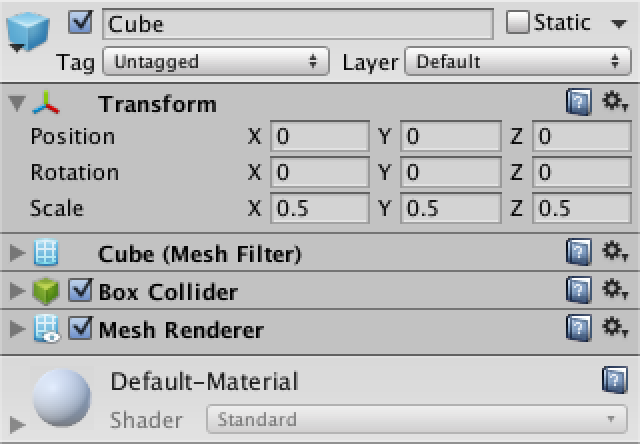 						Small cube prefab. 					

Create a grid object, add our component, and hook up the prefab.  When entering play mode, the grid cube will appear, centered on our  object's local origin.

 						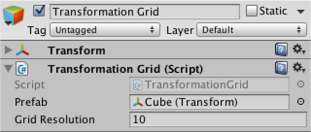 						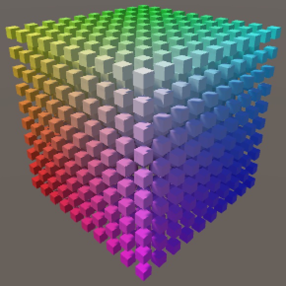 						Transformation grid. 					

unitypackage

## Transformations

Ideally, we should be able to apply an arbitrary amount of  transformations to our grid. And there are many types of transformations  that we could dream up, but let's restrict ourselves to positioning,  rotating, and scaling.

If we created a component type for each transformation, we could  add those to our grid object in any order and quantity that we want.  And while the details of each transformation is different, they'll all  need a method to apply themselves to a point in space.

Let's create a base component for all transformations, that they  can inherit from. This will be an abstract class, which means that it  cannot be used directly, as that would be pointless. Give it an abstract  `Apply` method that will be used by the concrete transformation components to do their job.

```
using UnityEngine;

public abstract class Transformation : MonoBehaviour {

	public abstract Vector3 Apply (Vector3 point);
}
```

Once we add such components to our grid object, we'll have to  retrieve them somehow so we can apply them to all our grid points. We  will use a generic list to store references to these components.

```
using UnityEngine;
using System.Collections.Generic;

public class TransformationGrid : MonoBehaviour {
	
	…
	List<Transformation> transformations;

	void Awake () {
		…
		transformations = new List<Transformation>();
	}
}
```

Now we can add an `Update` method which retrieves the transformation, then loops through the entire grid and transforms all of our points.

```
	void Update () {
		GetComponents<Transformation>(transformations);
		for (int i = 0, z = 0; z < gridResolution; z++) {
			for (int y = 0; y < gridResolution; y++) {
				for (int x = 0; x < gridResolution; x++, i++) {
					grid[i].localPosition = TransformPoint(x, y, z);
				}
			}
		}
	}
```

 						Why get the components each update? 						 					

 						Why use a list instead of an array? 						 					

Transforming each point is done by getting the original  coordinates, and then applying each transformation. We cannot rely on  the actual position of each point, because those have already been  transformed and we don't want to accumulate transformations each frame.

```
	Vector3 TransformPoint (int x, int y, int z) {
		Vector3 coordinates = GetCoordinates(x, y, z);
		for (int i = 0; i < transformations.Count; i++) {
			coordinates = transformations[i].Apply(coordinates);
		}
		return coordinates;
	}
```

### Translation

Our first concrete component will be for translation, which seems the simplest. So create a new component which extends `**Transformation**`, with a position to be used as a local offset.

```
using UnityEngine;

public class PositionTransformation : Transformation {

	public Vector3 position;

}
```

At this point the compiler will correctly complain that we're not providing a concrete version of `Apply`, so let's do that. It's simply a matter of adding the desired position to the original point.

```
	public override Vector3 Apply (Vector3 point) {
		return point + position;
	}
```

Now you can add a position transformation component to our grid  object. This allows us to move the points around, without moving the  actual grid object. All our transformations take place in the local  space of our object.


<iframe src="https://gfycat.com/ifr/UnfortunateBrokenIberianbarbel"></iframe>

Transforming the position.

### Scaling

Next up is the scaling transformation. It's almost the same as  positioning, except that the scale components are multiplied instead of  added to the original point.

```
using UnityEngine;

public class ScaleTransformation : Transformation {

	public Vector3 scale;

	public override Vector3 Apply (Vector3 point) {
		point.x *= scale.x;
		point.y *= scale.y;
		point.z *= scale.z;
		return point;
	}
}
```

Add this component to our grid object as well. Now we can scale  the grid too. Note that we're only adjusting the positions of our grid  points, so scaling won't change the size of their visualizations.


<iframe src="https://gfycat.com/ifr/ScholarlyVillainousButterfly"></iframe>

Adjusting scale.

Try both positioning and scaling at once. You will find that  the scale also affects the position. This happens because we first  reposition space, and then scale it. Unity's transform component does it  the other way around, which is much more useful. We should do so as  well, which can be done by reordering the components. They can be moved  via the pop-up menu under the gear icon at the top right of each  component.

 							
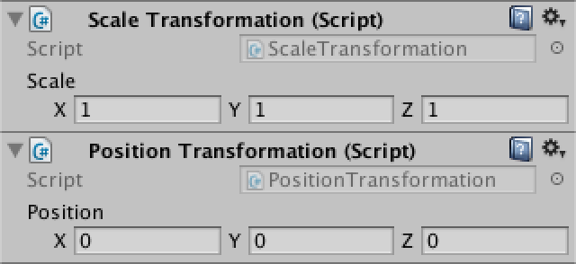 							Changing the order of transformations. 						

### Rotation

The third transformation type is rotation. It is a bit more  difficult than the previous two. Start with a new component which just  returns the point unchanged.

```
using UnityEngine;

public class RotationTransformation : Transformation {

	public Vector3 rotation;

	public override Vector3 Apply (Vector3 point) {
		return point;
	}
}
```

So how does rotation work? Let's limit ourselves to rotation  around a single axis for now, the Z axis. Rotating a point around this  axis is like spinning a wheel. As Unity uses a left-handed coordinate  system, a positive rotation will make the wheel go counterclockwise,  when looking at it in the positive Z direction.

 							
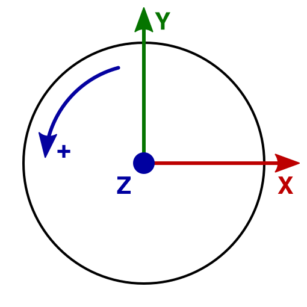 							2D rotation around the Z axis. 						

What happens to a point's coordinates when it rotates? It is  easiest to consider points that lie on a circle with a radius of one  unit, the unit circle. And the most straightforward points correspond  with the X and the Y axes. If we rotate those points by 90° steps, we  always end up with coordinates that are either 0, 1, or −1.

 							
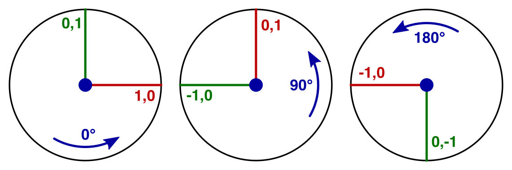							Rotating(1,0)and(0,1) by 90 and 180 degrees. 						

The point (1,0) becomes (0,1) after the first step. The next  step puts it at (−1,0). Then comes (0,−1), and finally back to (1,0).

If we start with the point (0,1) instead, we're just one step  ahead compared to the previous sequence. We go from (0,1) to (−1,0) to  (0,−1) to (1,0) and back.

So the coordinates of our points go through the cycle 0, 1, 0, −1. They just have different starting points.

What if we rotated in 45° increments instead? That will produce  points that lie on the diagonals in the XY plane. And as the distance  to the origin doesn't change, we have to end up with coordinates of the  form (±√½, ±√½). This expands our cycle to 0, √½, 1, √½, 0, −√½, −1,  −√½. If we keep decreasing the step size, we'll end up with a sine wave.

 							
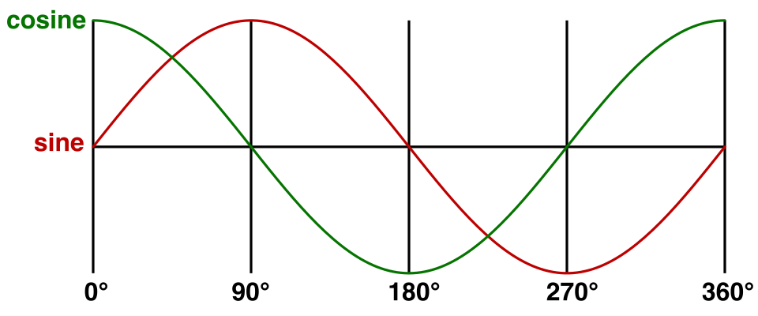 							Sine and cosine. 						

In our case, the sine wave matches the y coordinate when  starting at (1,0). The cosine matches the x coordinate. This means that  we can redefine (1,0) as (cosz,sinz)

. Likewise, we can replace (0,1) with 

(−sinz,cosz)

.

So we start by computing the sine and cosine of the desired  rotation around the Z axis. We provide the angles in degrees, but the  sine and cosine work with radians, so we have to convert.

```
	public override Vector3 Apply (Vector3 point) {
		float radZ = rotation.z * Mathf.Deg2Rad;
		float sinZ = Mathf.Sin(radZ);
		float cosZ = Mathf.Cos(radZ);

		return point;
	}
```

 							What are radians? 							 						

It is nice that we found a way to rotate (1,0) and (0,1), but  what about rotating arbitrary points? Well, these two points define the X  and Y axes. We can decompose any 2D point (x,y)

 into 

xX+yY

. Without any rotation, this is equal to 

x(1,0)+y(0,1)

 which indeed is just 

(x,y)

. But when rotating, we can now use 

x(cosZ,sinZ)+y(−sinZ,cosZ)

  and end up with a correctly rotated point. You can think of it like  scaling a point so it falls on the unit circle, rotating, and then  scaling back. Compressed into a single coordinate pair, this becomes 

(xcosZ−ysinZ,xsinZ+ycosZ)

.

```
		return new Vector3(
			point.x * cosZ - point.y * sinZ,
			point.x * sinZ + point.y * cosZ,
			point.z
		);
```

Add a rotation component to the grid and make it the middle  transformation. This means we scale first, then rotate, and finally  reposition, which is exactly what Unity's transform component does. Of  course we're only supporting rotation around Z at this point. We'll deal  with the other two axes later.


<iframe src="https://gfycat.com/ifr/ShorttermImpishDrake"></iframe>

All three transformations.

unitypackage

## Full Rotations

Right now we can only rotate around the Z axis. To provide the  same rotation support that Unity's transform component does, we have to  enable rotation around the X and Y axes as well. While rotating around  these axes in isolation is similar to rotating around Z, it gets more  complicated when rotating around multiple axes at once. To tackle that,  we could use a better way to write down our rotation math.

### Matrices

From now on, we'll write the coordinates of a point vertically instead of horizontally. Instead of (x,y)

 we'll use 

[xy]

. Likewise, 

(xcosZ−ysinZ,xsinZ+ycosZ)

 is split into two rows and becomes 

[xcosZ−ysinZxsinZ+ycosZ]

, which is easier to read.

Notice that the x and y factors end up arranged in vertical columns. It's as if we multiplied something with [xy]

. That would suggest a 2D multiplication. Indeed, the multiplication we performed is 

[cosZ−sinZsinZcosZ][xy]

.  This is a matrix multiplication. The first column of the 2 by 2 matrix  represents the X axis and its second column represents the Y axis.

 							
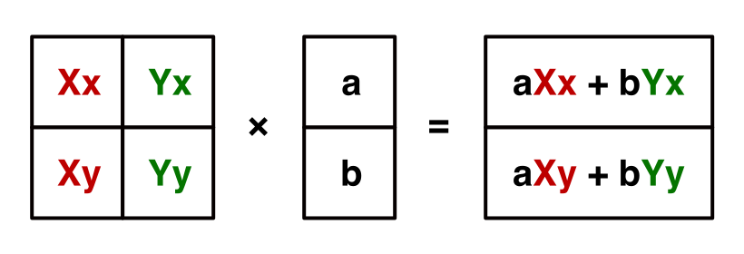 							Defining the X and Y axes with a 2D matrix. 						

In general, when multiplying two matrices, you go row by row in  the first matrix and column by column in the second matrix. Each term  in the result matrix is the sum of the terms of a row multiplied with  the corresponding terms of a column. This means that the rows of the  first matrix and columns of the second matrix must have the same amount  of elements.

 							
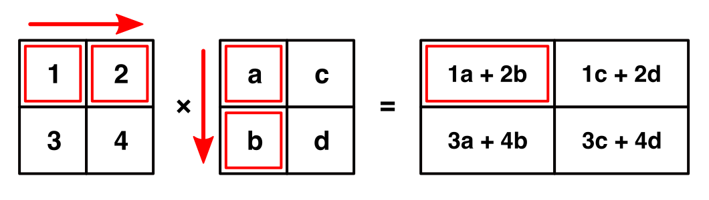 							Multiplying two 2 by 2 matrices. 						

The first row of the resulting matrix contains row 1 × column  1, row 1 × column 2, and so on. The second row contains row 2 × column  1, row 2 × column 2, and so on. Thus, it has the same amount of rows as  the first matrix, and the same amount of columns as the second matrix.

### 3D Rotation Matrices

So far, we have a 2 by 2 matrix that we can use to rotate a 2D  point around the Z axis. But we're actually using 3D points. So we're  attempting the multiplication [cosZ−sinZsinZcosZ]⎡⎢⎣xyz⎤⎥⎦

,  which in invalid because the row and column length of the matrices  don't match. So we have to increase our rotation matrix to 3 by 3, by  including the third dimension. What happens if we just pad it with  zeros?

⎡⎢⎣cosZ−sinZ0sinZcosZ0000⎤⎥⎦⎡⎢⎣xyz⎤⎥⎦=⎡⎢⎣xcosZ−ysinZ+0zxsinZ+ycosZ+0z0x+0y+0z⎤⎥⎦=⎡⎢⎣xcosZ−ysinZxsinZ+ycosZ0⎤⎥⎦


The X and Y components of the result are good, but the Z  component always becomes zero. That is incorrect. In order to keep Z  unchanged, we have to insert a 1 at the bottom right of our rotation  matrix. This makes sense, because the third column represents the Z  axis, which is ⎡⎢⎣001⎤⎥⎦

.

⎡⎢⎣cosZ−sinZ0sinZcosZ0001⎤⎥⎦⎡⎢⎣xyz⎤⎥⎦=⎡⎢⎣xcosZ−ysinZxsinZ+ycosZz⎤⎥⎦


If we used this trick for all three dimension at once, we'd end  up with a matrix with 1s along its diagonal and 0s everywhere else.  This is known as an identity matrix, as it doesn't change whatever it is  multiplied with. It's like a filter that lets everything through  unchanged.

⎡⎢⎣100010001⎤⎥⎦⎡⎢⎣xyz⎤⎥⎦=⎡⎢⎣xyz⎤⎥⎦


### Rotation Matrices for X and Y

Using the same reasoning we applied to find a way to rotate  around Z, we can come up with a matrix for rotating around Y. First, the  X axis starts as ⎡⎢⎣100⎤⎥⎦

 and becomes 

⎡⎢⎣00−1⎤⎥⎦

 after a 90° counterclockwise rotation. This means that the rotated X axis can be represented with 

⎡⎢⎣cosY0−sinY⎤⎥⎦

. The Z axis lags 90° behind it, so that's 

⎡⎢⎣sinY0cosY⎤⎥⎦

. The Y axis remains unchanged, which completes the rotation matrix.

⎡⎢⎣cosY0sinY010−sinY0cosY⎤⎥⎦


The third rotation matrix keeps X constant and adjust Y and Z in a similar way.

⎡⎢⎣1000cosX−sinX0sinXcosX⎤⎥⎦


### Unified Rotation Matrix

Our three rotation matrices each rotate around a single axis.  To combine them, we have to apply one after the other. Let's rotate  around Z first, then around Y, and finally around X. We can do this by  first applying the Z rotation to our point, then applying the Y rotation  to the result, and then applying the X rotation to that result.

But we can also multiply our rotation matrices with each other.  That will produce a new rotation matrix, which would apply all three  rotations at once. Let's fist perform Y × Z.

The first entry of the result matrix is cosYcosZ−0sinZ−0sinY=cosYcosZ

. The entire matrix requires a lot of multiplications, but many parts end up as 0s and can be discarded.

⎡⎢⎣cosYcosZ−cosYsinZsinYsinZcosZ0−sinYcosZsinYsinZcosY⎤⎥⎦


Now perform X × (Y × Z) to get our final matrix.

⎡⎢⎣cosYcosZ−cosYsinZsinYcosXsinZ+sinXsinYcosZcosXcosZ−sinXsinYsinZ−sinXcosYsinXsinZ−cosXsinYcosZsinXcosZ+cosXsinYsinZcosXcosY⎤⎥⎦


 							Does the multiplication order matter? 							 						

Now that we have this matrix, we can see how the X, Y, and Z axes of the rotation result can be constructed.

```
	public override Vector3 Apply (Vector3 point) {
		float radX = rotation.x * Mathf.Deg2Rad;
		float radY = rotation.y * Mathf.Deg2Rad;
		float radZ = rotation.z * Mathf.Deg2Rad;
		float sinX = Mathf.Sin(radX);
		float cosX = Mathf.Cos(radX);
		float sinY = Mathf.Sin(radY);
		float cosY = Mathf.Cos(radY);
		float sinZ = Mathf.Sin(radZ);
		float cosZ = Mathf.Cos(radZ);

		Vector3 xAxis = new Vector3(
			cosY * cosZ,
			cosX * sinZ + sinX * sinY * cosZ,
			sinX * sinZ - cosX * sinY * cosZ
		);
		Vector3 yAxis = new Vector3(
			-cosY * sinZ,
			cosX * cosZ - sinX * sinY * sinZ,
			sinX * cosZ + cosX * sinY * sinZ
		);
		Vector3 zAxis = new Vector3(
			sinY,
			-sinX * cosY,
			cosX * cosY
		);

		return xAxis * point.x + yAxis * point.y + zAxis * point.z;
	}
```

<iframe src="https://gfycat.com/ifr/BrokenAlarmedCaimanlizard"></iframe>

Rotating around three axes.

unitypackage

## Matrix Transformations

If we can combine three rotations into a single matrix, could we  also combine scaling, rotating, and repositioning into one matrix? If  we can represent scaling and repositioning as matrix multiplications,  then the answer is yes.

A scaling matrix is straightforward to construct. Take the identity matrix and scale its components.

⎡⎢⎣200030004⎤⎥⎦⎡⎢⎣xyz⎤⎥⎦=⎡⎢⎣2x3y4z⎤⎥⎦


But how could we support repositioning? This is not a  redefinition of the three axes, it is an offset. So we cannot represent  it with the 3 by 3 matrix that we have right now. We need an additional  column to contain the offset.

⎡⎢⎣100201030014⎤⎥⎦⎡⎢⎣xyz⎤⎥⎦=⎡⎢⎣x+2y+3z+4⎤⎥⎦


However, this is invalid because our matrix's row length has  become 4. So we need to add a fourth component to our point. As this  component gets multiplied with the offset, it should be 1. And we want  to preserve that 1, so it can be used in further matrix multiplications.  This leads to a 4 by 4 matrix and a 4D point.

⎡⎢ ⎢ ⎢ ⎢⎣1002010300140001⎤⎥ ⎥ ⎥ ⎥⎦⎡⎢ ⎢ ⎢ ⎢⎣xyz1⎤⎥ ⎥ ⎥ ⎥⎦=⎡⎢ ⎢ ⎢ ⎢⎣1x+0y+0z+20x+1y+0z+30x+0y+1z+40x+0y+0z+1⎤⎥ ⎥ ⎥ ⎥⎦=⎡⎢ ⎢ ⎢ ⎢⎣x+2y+3z+41⎤⎥ ⎥ ⎥ ⎥⎦


So we have to use 4 by 4 transformation matrices. This means  that the scale and rotation matrices get an additional row and column  with 0s and a 1 at the bottom right. And all our points get a fourth  coordinate, which is always 1. 

### Homogeneous Coordinates

Can we make any sense of that fourth coordinate? Does it  represent anything useful? We know that we give it the value 1 to enable  repositioning of points. If its value were 0, the offset would be  ignored, but scaling and rotation would still happen.

Something that can be scaled and rotated, but not moved. That is not a point, that is a vector. A direction.

So ⎡⎢ ⎢ ⎢ ⎢⎣xyz1⎤⎥ ⎥ ⎥ ⎥⎦

 represents a point, while 

⎡⎢ ⎢ ⎢ ⎢⎣xyz0⎤⎥ ⎥ ⎥ ⎥⎦

  represents a vector. This is useful, because it means that we can use  the same matrix to transform positions, normals, and tangents.

So what happens when the fourth coordinate gets a value other  than 0 or 1? Well, it shouldn't. Or actually, it should make no  difference. We are now working with homogeneous coordinates. The idea is  that each point in space can be represented by an infinite amount of  coordinate sets. The most straightforward form uses 1 as the fourth  coordinate. All other alternatives can be found by multiplying the whole  set with an arbitrary number.

⎡⎢ ⎢ ⎢ ⎢⎣xyz1⎤⎥ ⎥ ⎥ ⎥⎦=⎡⎢ ⎢ ⎢ ⎢⎣2x2y2z2⎤⎥ ⎥ ⎥ ⎥⎦=⎡⎢ ⎢ ⎢ ⎢⎣3x3y3z3⎤⎥ ⎥ ⎥ ⎥⎦=⎡⎢ ⎢ ⎢ ⎢⎣wxwywzw⎤⎥ ⎥ ⎥ ⎥⎦=w⎡⎢ ⎢ ⎢ ⎢⎣xyz1⎤⎥ ⎥ ⎥ ⎥⎦


So to get the Euclidean point – the actual 3D point – you divide each coordinate by the fourth one, which is then discarded.

⎡⎢ ⎢ ⎢ ⎢⎣xyzw⎤⎥ ⎥ ⎥ ⎥⎦=1w⎡⎢ ⎢ ⎢ ⎢⎣xyzw⎤⎥ ⎥ ⎥ ⎥⎦=⎡⎢ ⎢ ⎢ ⎢ ⎢⎣xwywzw1⎤⎥ ⎥ ⎥ ⎥ ⎥⎦→⎡⎢ ⎢⎣xwywzw⎤⎥ ⎥⎦


Of course that doesn't work when the fourth coordinate is 0.  Such points are defined to be infinitely far away. That's why they  behave as directions.

### Using Matrices

We can use Unity's `Matrix4x4`  struct to perform matrix multiplications. From now on, we'll use it to  perform out transformations instead of the current approach.

Add an abstract readonly property to `**Transformation**` to retrieve the transformation matrix.

```
	public abstract Matrix4x4 Matrix { get; }
```

Its `Apply` method no longer needs to be abstract. It will just grab the matrix and perform the multiplication.

```
	public Vector3 Apply (Vector3 point) {
		return Matrix.MultiplyPoint(point);
	}
```

Note that `Matrix4x4.MultiplyPoint`  has a 3D vector parameter. It assumes that the missing fourth  coordinate is 1. It also takes care of the conversion back from  homogeneous coordinates to Euclidean coordinates. If you want to  multiply a direction instead of a point, you can use `Matrix4x4.MultiplyVector`.

The concrete transformation classes now have to change their `Apply` methods into `Matrix` properties.

First up is `**PositionTransformation**`. The `Matrix4x4.SetRow` method offers a convenient way to fill a matrix.

```
	public override Matrix4x4 Matrix {
		get {
			Matrix4x4 matrix = new Matrix4x4();
			matrix.SetRow(0, new Vector4(1f, 0f, 0f, position.x));
			matrix.SetRow(1, new Vector4(0f, 1f, 0f, position.y));
			matrix.SetRow(2, new Vector4(0f, 0f, 1f, position.z));
			matrix.SetRow(3, new Vector4(0f, 0f, 0f, 1f));
			return matrix;
		}
	}
```

Next up is `**ScaleTransformation**`.

```
	public override Matrix4x4 Matrix {
			get {
			Matrix4x4 matrix = new Matrix4x4();
			matrix.SetRow(0, new Vector4(scale.x, 0f, 0f, 0f));
			matrix.SetRow(1, new Vector4(0f, scale.y, 0f, 0f));
			matrix.SetRow(2, new Vector4(0f, 0f, scale.z, 0f));
			matrix.SetRow(3, new Vector4(0f, 0f, 0f, 1f));
			return matrix;
		}
	}
```

For `**RotationTransformation**`, it's more convenient to set the matrix column by column, as that matches our already existing code.

```
	public override Matrix4x4 Matrix {
			get {
			float radX = rotation.x * Mathf.Deg2Rad;
			float radY = rotation.y * Mathf.Deg2Rad;
			float radZ = rotation.z * Mathf.Deg2Rad;
			float sinX = Mathf.Sin(radX);
			float cosX = Mathf.Cos(radX);
			float sinY = Mathf.Sin(radY);
			float cosY = Mathf.Cos(radY);
			float sinZ = Mathf.Sin(radZ);
			float cosZ = Mathf.Cos(radZ);
			
			Matrix4x4 matrix = new Matrix4x4();
			matrix.SetColumn(0, new Vector4(
				cosY * cosZ,
				cosX * sinZ + sinX * sinY * cosZ,
				sinX * sinZ - cosX * sinY * cosZ,
				0f
			));
			matrix.SetColumn(1, new Vector4(
				-cosY * sinZ,
				cosX * cosZ - sinX * sinY * sinZ,
				sinX * cosZ + cosX * sinY * sinZ,
				0f
			));
			matrix.SetColumn(2, new Vector4(
				sinY,
				-sinX * cosY,
				cosX * cosY,
				0f
			));
			matrix.SetColumn(3, new Vector4(0f, 0f, 0f, 1f));
			return matrix;
		}
	}
```

### Combining Matrices

Let's now combine our transformation matrices into a single matrix. Add a transformation matrix field to `**TransformationGrid**`.

```
	Matrix4x4 transformation;
```

We'll update this transformation matrix each Update. This  involves grabbing the first matrix, then multiplying it with all the  others. Make sure that they are multiplied in the correct order.

```
	void Update () {
		UpdateTransformation();
		for (int i = 0, z = 0; z < gridResolution; z++) {
			…
		}
	}

	void UpdateTransformation () {
		GetComponents<Transformation>(transformations);
		if (transformations.Count > 0) {
			transformation = transformations[0].Matrix;
			for (int i = 1; i < transformations.Count; i++) {
				transformation = transformations[i].Matrix * transformation;
			}
		}
	}
```

Now the grid no longer invokes `Apply`, but performs the matrix multiplication itself.

```
	Vector3 TransformPoint (int x, int y, int z) {
		Vector3 coordinates = GetCoordinates(x, y, z);
		return transformation.MultiplyPoint(coordinates);
	}
```

This new approach is more efficient, because we used to create  each transformation matrix separately for every point and apply them  individually. Now we create a unified transformation matrix once and  reuse it for every point. Unity uses the same trick to reduce every  object hierarchy to a single transformation matrix.

In our case, we could make it even more efficient. All transformation matrices have the same bottom row, [0001]

. Knowing this, we could forget about that row, skipping the computation of 0s and the conversion division at the end. The `Matrix4x4.MultiplyPoint4x3`  method does exactly that. However, we're not going to use that method,  because there are useful transformations that do change the bottom row.

unitypackage

## Projection Matrices

So far, we've been transforming points from one position in 3D  to another position in 3D space. But how do those points end up drawn on  a 2D display? This requires a transformation from 3D to 2D space. We  can create a transformation matrix for that!

Make a new concrete transformation for a camera projection. Start with the identity matrix.

```
using UnityEngine;

public class CameraTransformation : Transformation {

	public override Matrix4x4 Matrix {
		get {
			Matrix4x4 matrix = new Matrix4x4();
			matrix.SetRow(0, new Vector4(1f, 0f, 0f, 0f));
			matrix.SetRow(1, new Vector4(0f, 1f, 0f, 0f));
			matrix.SetRow(2, new Vector4(0f, 0f, 1f, 0f));
			matrix.SetRow(3, new Vector4(0f, 0f, 0f, 1f));
			return matrix;
		}
	}
}
```

Add it as the final transformation.

 						
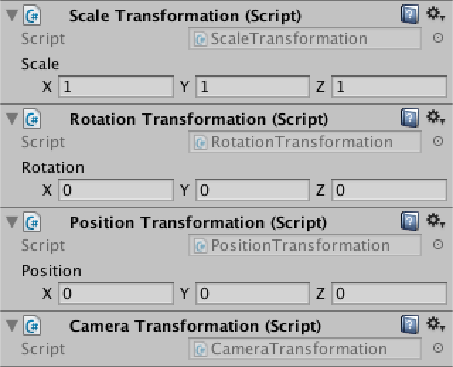 						The camera projection comes at the end. 					

### Orthographic Camera

The most straightforward way to go from 3D to 2D is to simply  discard one dimension. That will collapse 3D space into a flat plane.  This plane acts like a canvas, used to render the scene. Let's just drop  the Z dimension and see what happens.

⎡⎢ ⎢ ⎢ ⎢⎣1000010000000001⎤⎥ ⎥ ⎥ ⎥⎦


```
			matrix.SetRow(0, new Vector4(1f, 0f, 0f, 0f));
			matrix.SetRow(1, new Vector4(0f, 1f, 0f, 0f));
			matrix.SetRow(2, new Vector4(0f, 0f, 0f, 0f));
			matrix.SetRow(3, new Vector4(0f, 0f, 0f, 1f));
```

 							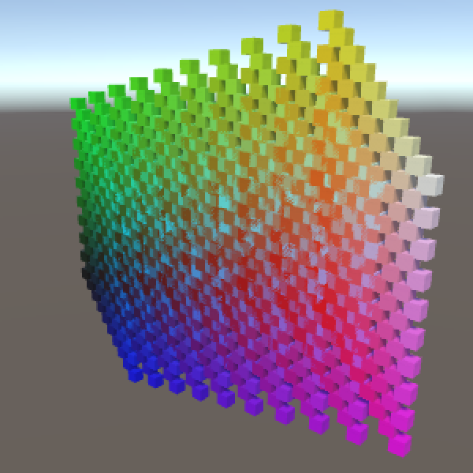 							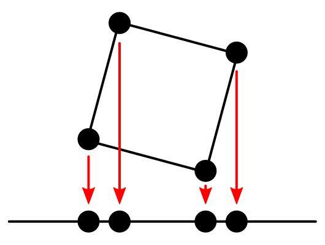 							Orthographic Projection. 						

Indeed, our grid becomes 2D. You can still scale, rotate, and  reposition everything, but it gets projected onto the XY plane  afterwards. This is a rudimentary orthographic camera projection.

 							Why do the colors become erratic? 							 						

Our primitive camera sits at the origin and looks in the  positive Z direction. Could we move it around and rotate it? Yes, in  fact we can already do that. Moving the camera has the same visual  effect as moving the world in the opposite direction. The same goes for  rotation and scaling. So we can use our existing transformations to move  the camera, although it is a bit awkward. Unity uses matrix inversion  to do the same thing.

### Perspective Camera

An orthographic camera is nice, but doesn't show the world as  we see it. We need a perspective camera for that. Due to perspective,  things that are further away appear smaller to us. We can reproduce this  effect by scaling points based on their distance from the camera.

Let's just divide everything by the Z coordinate. Can we do  that with a matrix multiplication? Yes, by changing the bottom row of an  identity matrix to [0,0,1,0]

.  That will make the fourth coordinate of the result equal to the  original Z coordinate. Converting from homogeneous to Euclidean  coordinates then takes care of the desired division.

⎡⎢ ⎢ ⎢ ⎢⎣1000010000000010⎤⎥ ⎥ ⎥ ⎥⎦⎡⎢ ⎢ ⎢ ⎢⎣xyz1⎤⎥ ⎥ ⎥ ⎥⎦=⎡⎢ ⎢ ⎢ ⎢⎣xy0z⎤⎥ ⎥ ⎥ ⎥⎦→⎡⎢ ⎢⎣xzyz0⎤⎥ ⎥⎦


```
			matrix.SetRow(0, new Vector4(1f, 0f, 0f, 0f));
			matrix.SetRow(1, new Vector4(0f, 1f, 0f, 0f));
			matrix.SetRow(2, new Vector4(0f, 0f, 0f, 0f));
			matrix.SetRow(3, new Vector4(0f, 0f, 1f, 0f));
```

The big difference with the orthographic projection is that  points aren't moved straight down to the projection plane. Instead, they  are moved towards the camera's position – the origin – until they hit  the plane. Of course this is only valid for points that lie in front of  the camera. Points that lie behind the camera will be incorrectly  projected. As we're not discarding those points, make sure everything  lies in front of the camera, via repositioning. A distance of 5 would be  enough when the grid is not scaled or rotated, otherwise you might need  more.

 							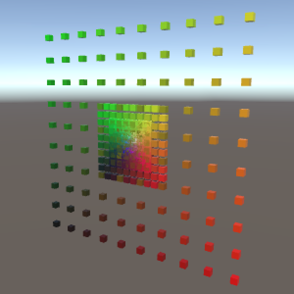 							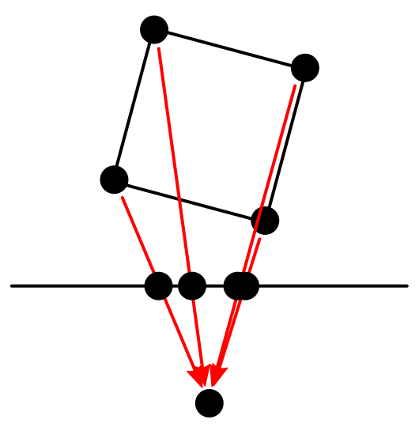 							Perspective Projection. 						

The distance between the origin and the projection plane also  influences the projection. It acts like the focal length of a camera.  The larger you make it, the smaller your field of view will be. Right  now we're using a focal length of 1, which produces a 90° field of view.  We can make that configurable.

```
	public float focalLength = 1f;
```

 							
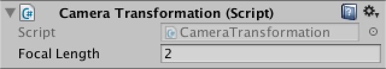
 							Focal length. 						

As a larger focal length means we're zooming in, this  effectively increases the scale of our final points, so we can support  it that way. As we're collapsing the Z dimension, that one doesn't need  to be scaled.

⎡⎢ ⎢ ⎢ ⎢⎣fl0000fl0000000010⎤⎥ ⎥ ⎥ ⎥⎦⎡⎢ ⎢ ⎢ ⎢⎣xyz1⎤⎥ ⎥ ⎥ ⎥⎦=⎡⎢ ⎢ ⎢ ⎢⎣xflyfl0z⎤⎥ ⎥ ⎥ ⎥⎦→⎡⎢ ⎢ ⎢⎣xflzyflz0⎤⎥ ⎥ ⎥⎦


```
			matrix.SetRow(0, new Vector4(focalLength, 0f, 0f, 0f));
			matrix.SetRow(1, new Vector4(0f, focalLength, 0f, 0f));
			matrix.SetRow(2, new Vector4(0f, 0f, 0f, 0f));
			matrix.SetRow(3, new Vector4(0f, 0f, 1f, 0f));
```

<iframe src="https://gfycat.com/ifr/ConventionalEverlastingBlackfish"></iframe>

Adjusting the focal length.

We now have a very simple perspective camera. If we were to  fully mimic Unity's camera projection, we would also have to deal with  the near and far plane. That would require projecting into a cube  instead of a plane, so depth information is retained. Then there is the  view aspect ratio to worry about. Also, Unity's camera looks in the  negative Z direction, which requires negating some numbers. You could  incorporate all that into the projection matrix. I leave it to you to  figure out how to do that, if you want to.

So what was the point of all this? We rarely need to construct  matrices ourselves, and definitely not projection matrices. The point is  that you now understand what's going on. Matrices aren't scary, they  just transform points and vectors from one space to another. And you  understand how. That's good, because you'll encounter matrices again  once we start writing our own shaders. We'll do so in [part 2, Shader Fundamentals](https://catlikecoding.com/unity/tutorials/rendering/part-2).

unitypackage

PDF
