# Rendering 17

Mixed Lighting

- Bake only indirect light.
- Mix baked and realtime shadows.
- Deal with code changes and bugs.
- Support subtractive lighting.

This is part 17 of a tutorial series about rendering. [Last time](https://catlikecoding.com/unity/tutorials/rendering/part-16/),  we added support for static lighting via lightmaps. Now we follow up  with combining features of both baked and realtime lighting.

This tutorial was made with Unity 5.6.0.

 					
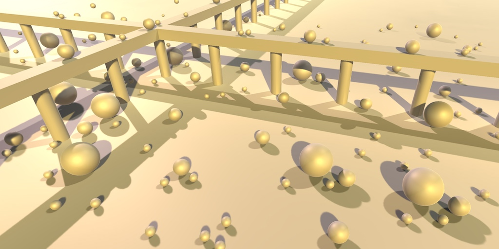 					Mixing baked and realtime lighting. 				

## Baking Indirect Light

Lightmaps allow us to compute lighting ahead of time. This  reduces the amount of work that the GPU has to do in realtime, at the  cost of texture memory. Besides that, it also adds indirect lighting.  But as we saw last time, there are limitations. First, specular lighting  cannot be baked. Second, baked lights only influence dynamic objects  via light probes. And third, baked lights do not cast realtime shadows.

You can see the difference between fully realtime and fully baked lighting in the screenshots below. It is the scene from the [previous tutorial](https://catlikecoding.com/unity/tutorials/rendering/part-16/),  except that I have made all spheres dynamic and relocated a few.  Everything else is static. This is using the forward rendering path.

 						 						 						Fully realtime and fully baked lighting. 					

I haven't adjusted the light probes, so their positions make  less sense now that there is less static geometry. The resulting probe  lighting is a bit off now, which makes it easier to notice when it's  being used.

### Mixed Mode

Indirect light is the one thing that baked lighting has that  realtime lighting lacks, because it requires a lightmap. As indirect  light can add a lot of realism to a scene, it would be nice if we could  combine it with realtime lighting. This is possible, although of course  this means that shading becomes more expensive. It requires the *Lighting Mode* of *Mixed Lighting* to be set to *Baked Indirect*.

 							
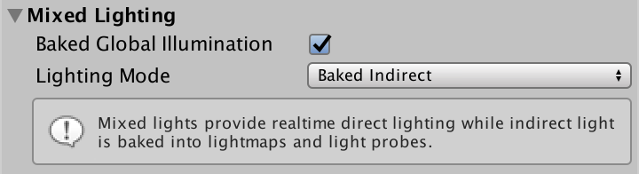 							Mixed lighting, baked indirect. 						

We already switched to this mode in the [previous tutorial](https://catlikecoding.com/unity/tutorials/rendering/part-16/),  but back then we only worked with fully baked lights. As a result, the  mode for mixed lighting didn't make a difference. To make use of mixed  lighting, a light's *Mode* has to be set to *Mixed*.

 							
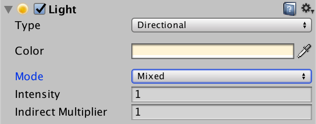 							Mixed-mode main light. 						

After turning the main directional light into a mixed light,  two things will happen. First, Unity will bake the lightmap again. This  time, it will only store the indirect light, so the resulting lightmap  will be much darker than before.

 							 							 							Fully baked vs. indirect-only lightmaps. 						

Second, everything will be lit as if the main light was set to  realtime, with one difference. The lightmap is used to add indirect  light to static objects, instead of spherical harmonics or probes. The  dynamic objects still use light probes for their indirect light.

 							
 							Mixed lighting, realtime direct plus baked indirect. 						

We didn't have to change our shader to support this, because  the forward base pass already combines lightmapped data and the main  directional light. Additional lights get additive passes, as usual. When  using the deferred rendering path, the main light will simply gets a  pass as well.

 							Can mixed lights be adjusted at runtime? 							 						

### Upgrading Our Shader

Initially, everything appears to work fine. However, it turns  out that shadow fading no longer works correct for the directional  light. The shadows are cut off, which is easiest to see by greatly  reducing the shadow distance.

 							 							 							Shadow fading, standard vs. our shader. 						

While Unity has had a mixed lighting mode for a long time, it  actually became nonfunctional in Unity 5. A new mixed lighting mode was  added in Unity 5.6, which is what we are using now. When this new mode  was added, the code behind the `**UNITY_LIGHT_ATTENUATION**`  macro was changed. We didn't notice this when using fully baked or  realtime lighting, but we have to update our code to work with the new  approach for mixed lighting. As this has been a recent big change, we  have to be on our guard for bugs.

The first thing we have to change is to no longer use the `**SHADOW_COORDS**` macro to define the interpolator for shadow coordinates. We have to use new `**UNITY_SHADOW_COORDS**` macro instead.

```
struct Interpolators {
	…

//	SHADOW_COORDS(5)
	UNITY_SHADOW_COORDS(5)

	…
};
```

Likewise, `**TRANSFER_SHADOW**` should be replaced with `**UNITY_TRANSFER_SHADOW**`.

```
Interpolators MyVertexProgram (VertexData v) {
	…

//	TRANSFER_SHADOW(i);
	UNITY_TRANSFER_SHADOW(i);

	…
}
```

However, this will produce a compiler error, because that macro  requires an additional parameter. Since Unity 5.6, only the  screen-space coordinates for directional shadows are put in an  interpolator. Shadows coordinates for point lights and spotlights are  now computed in the fragment program. What's new is that lightmap  coordinates are used to a shadowmasks in some cases, which we'll cover  later. For this to work, the macro has to be provided with data from the  second UV channel, which contains the lightmap coordinates.

```
	UNITY_TRANSFER_SHADOW(i, v.uv1);
```

This once again produces a compiler error. When this happens, it's because `**UNITY_SHADOW_COORDS**` in some cases incorrectly creates an interpolator, even though it is not actually needed. In that case, `**TRANSFER_SHADOW**` doesn't initialize it, which leads to the error. This bug is in versions 5.6.0, up to at least 5.6.2 and the 2017.1.0 beta.

The bug usually goes unnoticed, because Unity's standard shader uses the `**UNITY_INITIALIZE_OUTPUT**`  macro to fully initialize its interpolators structure. Because we  didn't use that macro, we found the bug. To work around it, use the `**UNITY_INITIALIZE_OUTPUT**` macro to initialize our interpolators as well. That way, our code will compile with and without the bug.

```
Interpolators MyVertexProgram (VertexData v) {
	Interpolators i;
	UNITY_INITIALIZE_OUTPUT(Interpolators, i);
	…
}
```

 							What does `**UNITY_INITIALIZE_OUTPUT**` do? 							 						

### Fading Shadows Ourselves

We are now correctly using the new macros, but the shadows of  our main light still don't fade out like they should. It turns out that `**UNITY_LIGHT_ATTENUATION**`  does not perform this fading when both directional shadows and  lightmaps are used at the same time, which is the case for the  mixed-mode main directional light. So we must do it manually.

 							Why does it not fade shadows in this case? 							 						

We already have code to perform shadow fading, for our deferred lighting shader. Copy the relevant code fragment from *MyDeferredShading* to a new function in *My Lighting*. The only real difference is that we have to construct `viewZ`  from the view vector and the view matrix. Only the Z component is  needed, so we don't need to perform a full matrix multiplication.

```
float FadeShadows (Interpolators i, float attenuation) {
	float viewZ =
		dot(_WorldSpaceCameraPos - i.worldPos, UNITY_MATRIX_V[2].xyz);
	float shadowFadeDistance =
		UnityComputeShadowFadeDistance(i.worldPos, viewZ);
	float shadowFade = UnityComputeShadowFade(shadowFadeDistance);
	attenuation = saturate(attenuation + shadowFade);
	return attenuation;
}
```

This manual fading must be done after using `**UNITY_LIGHT_ATTENUATION**`.

```
UnityLight CreateLight (Interpolators i) {
	…

		UNITY_LIGHT_ATTENUATION(attenuation, i, i.worldPos.xyz);
		attenuation = FadeShadows(i, attenuation);

	…
}
```

But only when `**UNITY_LIGHT_ATTENUATION**` decides to skip fading. This is the case when `HANDLE_SHADOWS_BLENDING_IN_GI` is defined in the *UnityShadowLibrary* include file. So `FadeShadows` should only do anything when `HANDLE_SHADOWS_BLENDING_IN_GI` is defined.

```
float FadeShadows (Interpolators i, float attenuation) {
	#if HANDLE_SHADOWS_BLENDING_IN_GI
		// UNITY_LIGHT_ATTENUATION doesn't fade shadows for us.
		float viewZ =
			dot(_WorldSpaceCameraPos - i.worldPos, UNITY_MATRIX_V[2].xyz);
		float shadowFadeDistance =
			UnityComputeShadowFadeDistance(i.worldPos, viewZ);
		float shadowFade = UnityComputeShadowFade(shadowFadeDistance);
		attenuation = saturate(attenuation + shadowFade);
	#endif
	return attenuation;
}
```

Finally, our shadows again fade as they should.

unitypackage

## Using a Shadowmask

Baked-indirect mixed-mode lights are quite expensive. They  require as much work as realtime lights, plus lightmaps for indirect  light. Most significant compared to fully-baked lights is the addition  of realtime shadows. Fortunately, there is a way to still bake shadows  into lightmaps, in combination with realtime shading. To enable this,  change the mixed lighting mode to *Shadowmask*.

 						
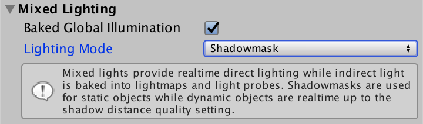 						Shadowmask mode. 					

In this mode, both the indirect lighting and the shadow  attenuation for mixed lights are stored in lightmaps. The shadows are  stored in a separate map, known as a shadowmask. When using only the  main directional light, everything that's illuminated will show up red  in the shadowmask. It's red because the shadow information is stored in  the texture's R channel. Actually, shadows for up to four lights can be  stored in the map, as it has four channels.

 						
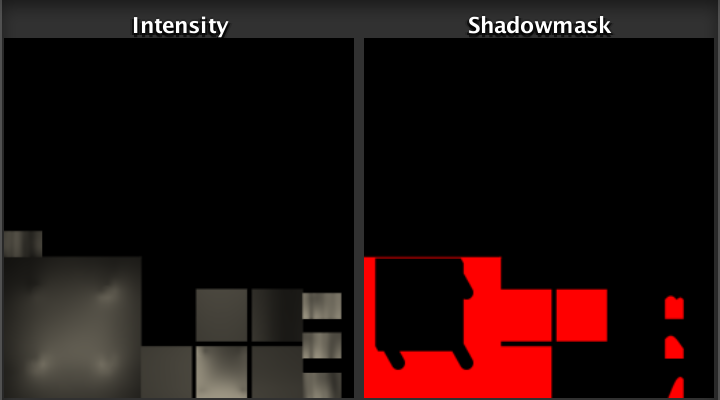 						Baked intensity and shadowmask. 					

After Unity has created the shadowmask, the shadows cast by  static objects will disappear. Only the light probes still take them  into consideration. Shadows of dynamic objects are unaffected.

 						
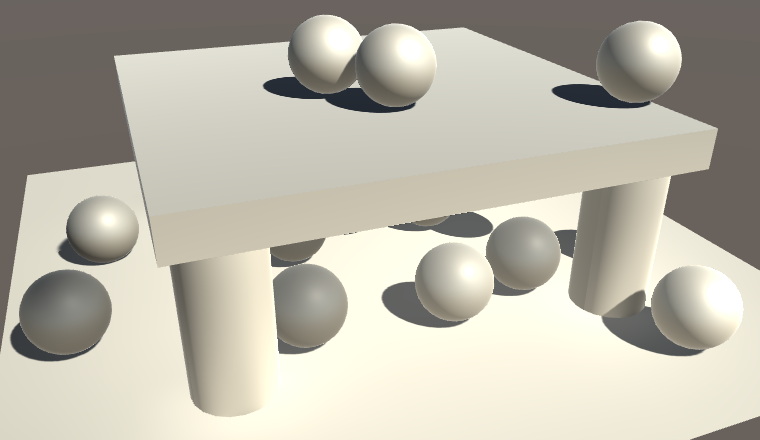 						No baked shadows. 					

### Sampling the Shadowmask

To get the baked shadows back, we have to sample the  shadowmask. Unity's macro already does that for point lights and  spotlights, but we have to include it in our `FadeShadows` function as well. We can use the `UnitySampleBakedOcclusion` function from *UnityShadowLibrary* for this. It requires the lightmap UV coordinates and world position as arguments.

```
float FadeShadows (Interpolators i, float attenuation) {
	#if HANDLE_SHADOWS_BLENDING_IN_GI
		…
		float bakedAttenuation =
			UnitySampleBakedOcclusion(i.lightmapUV, i.worldPos);
		attenuation = saturate(attenuation + shadowFade);
	#endif
	return attenuation;
}
```

 							What does `UnitySampleBakedOcclusion` look like? 							 						

`UnitySampleBakedOcclusion` provides  us with the baked shadow attenuation when a shadowmask is used, and  simply 1 in all other cases. Now we have to combine this with the  attenuation that we already have and then fade the shadows. The `UnityMixRealtimeAndBakedShadows` function does all this for us.

```
		float bakedAttenuation =
			UnitySampleBakedOcclusion(i.lightmapUV, i.worldPos);
//		attenuation = saturate(attenuation + shadowFade);
		attenuation = UnityMixRealtimeAndBakedShadows(
			attenuation, bakedAttenuation, shadowFade
		);
```

 							How does `UnityMixRealtimeAndBakedShadows` work? 							 						

 							
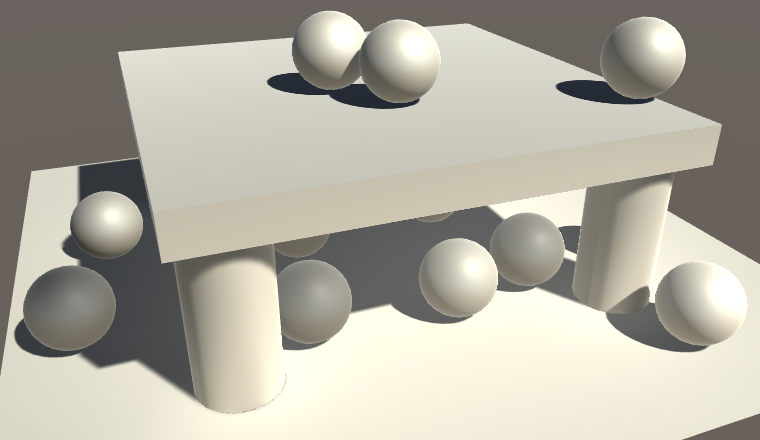 							Both realtime and shadowmask shadows. 						

We now get both realtime and baked shadows on static objects,  and they correctly blend. The realtime shadows still fade out beyond the  shadow distance, but the baked shadows don't.

 							
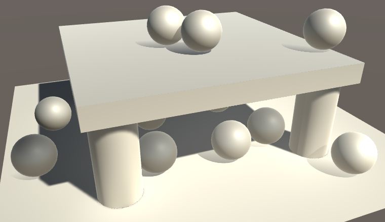 							Only realtime shadows fade. 						

### Adding a Shadowmask G-Buffer

The shadowmask now works with forward rendering, but we have  some work to do before it also works with the deferred rendering path.  Specifically, we have to add the shadowmask information as an additional  G-buffer, when needed. So add another buffer to our `**FragmentOutput**` structure when *SHADOWS_SHADOWMASK* is defined.

```
struct FragmentOutput {
	#if defined(DEFERRED_PASS)
		float4 gBuffer0 : SV_Target0;
		float4 gBuffer1 : SV_Target1;
		float4 gBuffer2 : SV_Target2;
		float4 gBuffer3 : SV_Target3;

		#if defined(SHADOWS_SHADOWMASK)
			float4 gBuffer4 : SV_Target4;
		#endif
	#else
		float4 color : SV_Target;
	#endif
};
```

This is our fifth G-buffer, which is quite a lot. Not all  platforms support it. Unity only supports shadowmasks when enough render  targets are available, and we should do so as well.

```
		#if defined(SHADOWS_SHADOWMASK) && (UNITY_ALLOWED_MRT_COUNT > 4)
			float4 gBuffer4 : SV_Target4;
		#endif
```

We simply have to store the sampled shadowmask data in the  G-buffer, as we're not working with a specific light at this point. We  can use the `UnityGetRawBakedOcclusions` function for this. It works like `UnitySampleBakedOcclusion`, except that it doesn't select one of the channels.

```
	FragmentOutput output;
	#if defined(DEFERRED_PASS)
		#if !defined(UNITY_HDR_ON)
			color.rgb = exp2(-color.rgb);
		#endif
		output.gBuffer0.rgb = albedo;
		output.gBuffer0.a = GetOcclusion(i);
		output.gBuffer1.rgb = specularTint;
		output.gBuffer1.a = GetSmoothness(i);
		output.gBuffer2 = float4(i.normal * 0.5 + 0.5, 1);
		output.gBuffer3 = color;

		#if defined(SHADOWS_SHADOWMASK) && (UNITY_ALLOWED_MRT_COUNT > 4)
			output.gBuffer4 =
				UnityGetRawBakedOcclusions(i.lightmapUV, i.worldPos.xyz);
		#endif
	#else
		output.color = ApplyFog(color, i);
	#endif
```

To make this compile without lightmaps, substitute 0 for the lightmap coordinates when they're not available.

```
		#if defined(SHADOWS_SHADOWMASK) && (UNITY_ALLOWED_MRT_COUNT > 4)
			float2 shadowUV = 0;
			#if defined(LIGHTMAP_ON)
				shadowUV = i.lightmapUV;
			#endif
			output.gBuffer4 =
				UnityGetRawBakedOcclusions(shadowUV, i.worldPos.xyz);
		#endif
```

### Using the Shadowmask G-Buffer

This is enough to make our shader work with the default  deferred lighting shader. But to make it work with our custom shader, we  have to adjust *MyDeferredShading*. The first step is to add a variable for the extra G-buffer.

```
sampler2D _CameraGBufferTexture0;
sampler2D _CameraGBufferTexture1;
sampler2D _CameraGBufferTexture2;
sampler2D _CameraGBufferTexture4;
```

Next, create a function to retrieve the appropriate shadow  attenuation. If we have a shadowmask, this is done by sampling the  texture and performing a saturated dot product with `unity_OcclusionMaskSelector`. That variable is defined in *UnityShaderVariables* and contains a vector for selecting the channel for the light that's currently being rendered.

```
float GetShadowMaskAttenuation (float2 uv) {
	float attenuation = 1;
	#if defined (SHADOWS_SHADOWMASK)
		float4 mask = tex2D(_CameraGBufferTexture4, uv);
		attenuation = saturate(dot(mask, unity_OcclusionMaskSelector));
	#endif
	return attenuation;
}
```

In `CreateLight`, we now have to also fade shadows in case of a shadowmask, even if there are no realtime shadows for the current light.

```
UnityLight CreateLight (float2 uv, float3 worldPos, float viewZ) {
	…

	#if defined(SHADOWS_SHADOWMASK)
		shadowed = true;
	#endif

	if (shadowed) {
		…
	}

	…
}
```

To properly include the baked shadows, again use `UnityMixRealtimeAndBakedShadows` instead of our old fading computation.

```
	if (shadowed) {
		float shadowFadeDistance =
			UnityComputeShadowFadeDistance(worldPos, viewZ);
		float shadowFade = UnityComputeShadowFade(shadowFadeDistance);
//		shadowAttenuation = saturate(shadowAttenuation + shadowFade);
		shadowAttenuation = UnityMixRealtimeAndBakedShadows(
			shadowAttenuation, GetShadowMaskAttenuation(uv), shadowFade
		);

		…
	}
```

We now get correct baked shadows with our custom deferred  lighting shader as well. Except when our optimization branch ends up  being used, which skips shadow blending. That shortcut isn't possible  when a shadowmask is used.

```
	if (shadowed) {
		…

		#if defined(UNITY_FAST_COHERENT_DYNAMIC_BRANCHING) && defined(SHADOWS_SOFT)
			#if !defined(SHADOWS_SHADOWMASK)
				UNITY_BRANCH
				if (shadowFade > 0.99) {
					shadowAttenuation = 1;
				}
			#endif
		#endif
	}
```

### Distance Shadowmask Mode

While the shadowmask mode gives us good baked shadows for  static objects, dynamic objects cannot benefit from them. Dynamic  objects can only receive realtime shadows, and light probe data. If we  want good shadows on dynamic objects, then the static objects have to  cast realtime shadows as well. This is what the *Distance Shadowmask* mixed lighting mode is for.

 							
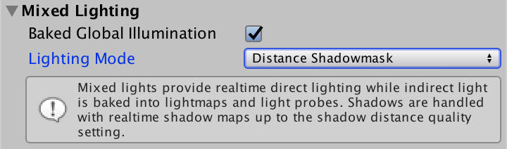 							Distance Shadowmask mode. 						

 							I have no *Distance Shadowmask* option? 							 						

When using *Distance Shadowmask* mode, everything uses realtime shadows. At first glance, it appears to be exactly the same as the *Baked Indirect* mode.

 							
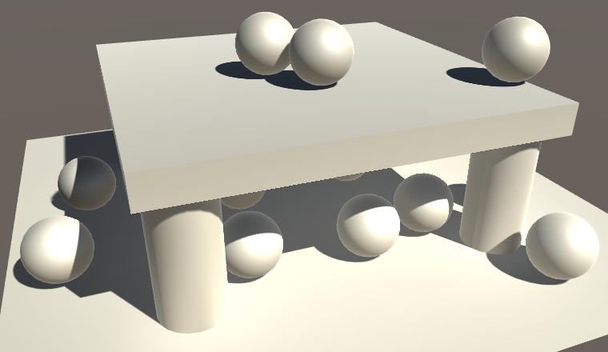 							Realtime shadows on everything. 						

However, there is still a shadowmask. In this mode, the baked  shadows and light probes are used beyond the shadow distance. So this is  the most expensive mode, equal to *Baked Indirect* up to the shadow distance, and *Shadowmask* beyond that.

 							
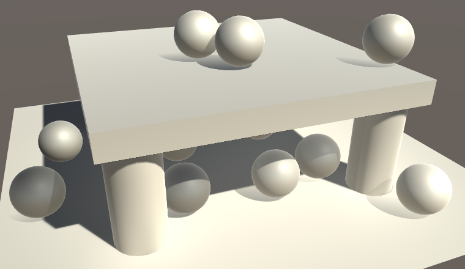 							Realtime nearby, shadowmask and probes further away. 						

We already support this mode, because we're using `UnityMixRealtimeAndBakedShadows`.  To correctly blend between fully realtime and baked shadows, it simply  fades realtime shadows as usual, then takes the minimum of that and the  baked shadows.

### Multiple Lights

Because the shadowmask has four channels, it can support up to  four overlapping light volumes at once. For example, here is a  screenshot with lightmaps of the scene with three additional spotlights.  I lowered the intensity of the main light so it's easier to see the  spotlights.

 							 							 							Four lights, all mixed. 						

The main directional light's shadows are still stored in the R  channel. You can also see the shadows of the spotlights that are stored  in the G and B channels. The last spotlight's shadows are stored in the A  channel, which is not visible.

When light volumes do not overlap, they can use the same  channel to store their shadow data. So you can have as many mixed lights  as you want. But you have to make sure that at most four light volumes  end up overlapping each other. If there are too many mixed lights  influencing the same area, then some will fall back to fully baked mode.  To illustrate this, below is a screenshot with lightmaps after adding  one more spotlight. One of them has turned into a baked light, which you  can clearly see in the intensity map.

 							 							 							Five overlapping lights, one fully baked. 						

### Supporting Multiple Masked Directional Lights

Unfortunately, it turns out that shadowmasks only work  correctly when there is at most one mixed-mode directional light  involved. Shadow fading goes wrong for additional directional lights. At  least, when using the forward rendered path. Deferred rendering works  fine.

 							
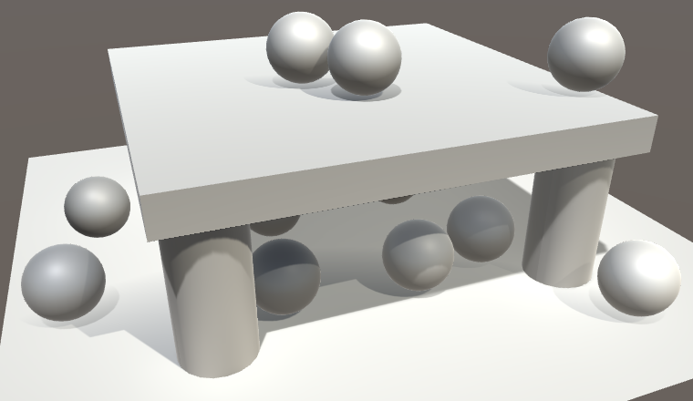 							Incorrect fading with two directional lights. 						

Unity's standard shader also has this problem, at least up to  versions 5.6.2 and 2017.1.0f1. However, it is not an inherent limitation  of the lightmapping engine. It is an oversight in the new approach used  for `**UNITY_LIGHT_ATTENUATION**`. Unity uses the shadow interpolator defined via `**UNITY_SHADOW_COORDS**`  to either store the screen-space coordinates for directional shadows,  or the lightmap coordinates for other lights that have a shadowmask.

Directional lights that use the shadowmask also need the  lightmap coordinates. In case of the forward base pass, these  coordinates will be included, because *LIGHTMAP_ON* will be defined when needed. However, *LIGHTMAP_ON*  is never defined in additive passes. This means that additive  directional lights won't have lightmap coordinates available. It turns  out that `**UNITY_LIGHT_ATTENUATION**` simply uses 0 when that's the case, leading to incorrect lightmap sampling.

So we cannot rely on `**UNITY_LIGHT_ATTENUATION**`  for additional directional lights that use the shadowmask. Let's make  it easy to identify when this is the case. This all assumes that we're  actually using screen-space directional shadows, which on some platforms  isn't the case.

```
#if defined(FOG_LINEAR) || defined(FOG_EXP) || defined(FOG_EXP2)
	…
#endif


#if !defined(LIGHTMAP_ON) && defined(SHADOWS_SCREEN)
	#if defined(SHADOWS_SHADOWMASK) && !defined(UNITY_NO_SCREENSPACE_SHADOWS)
		#define ADDITIONAL_MASKED_DIRECTIONAL_SHADOWS 1
	#endif
#endif
```

Next, we have to include the lightmap coordinates also when we have the additional masked directional shadows.

```
struct Interpolators {
	…

	#if defined(LIGHTMAP_ON) || ADDITIONAL_MASKED_DIRECTIONAL_SHADOWS
		float2 lightmapUV : TEXCOORD6;
	#endif
};

…

Interpolators MyVertexProgram (VertexData v) {
	…

	#if defined(LIGHTMAP_ON) || ADDITIONAL_MASKED_DIRECTIONAL_SHADOWS
		i.lightmapUV = v.uv1 * unity_LightmapST.xy + unity_LightmapST.zw;
	#endif

	…
}
```

With the lightmap coordinates available, we can again use our `FadeShadows` function to perform our own fading.

```
float FadeShadows (Interpolators i, float attenuation) {
	#if HANDLE_SHADOWS_BLENDING_IN_GI || ADDITIONAL_MASKED_DIRECTIONAL_SHADOWS
		…
	#endif

	return attenuation;
}
```

However, this is still not correct, because we're feeding it bugged attenuation data. We have to bypass `**UNITY_LIGHT_ATTENUATION**` and get the baked attenuation only, which in this case we can do via the `**SHADOW_ATTENUATION**` macro.

```
float FadeShadows (Interpolators i, float attenuation) {
	#if HANDLE_SHADOWS_BLENDING_IN_GI || ADDITIONAL_MASKED_DIRECTIONAL_SHADOWS
		// UNITY_LIGHT_ATTENUATION doesn't fade shadows for us.
		#if ADDITIONAL_MASKED_DIRECTIONAL_SHADOWS
			attenuation = SHADOW_ATTENUATION(i);
		#endif
		…
	#endif

	return attenuation;
}
```

 							
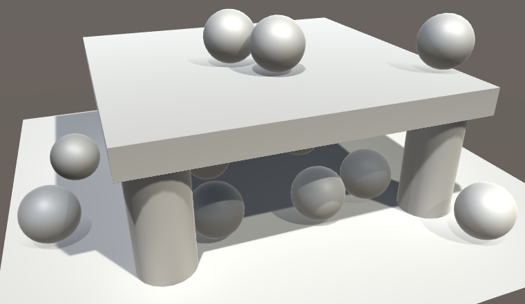 							Correct fading with two directional lights. 						

 							Is it a good idea to rely on `**UNITY_LIGHT_ATTENUATION**` at all? 							 						

unitypackage

## Subtractive Shadows

Mixed lighting is nice, but it's is not as cheap as fully baked  lighting. If you're targeting low-performance hardware, then mixed  lighting is not feasible. Baked lighting will work, but you might really  need dynamic objects to cast shadows on static objects. In that case,  you can use the *Subtractive* mixed lighting mode.

 						
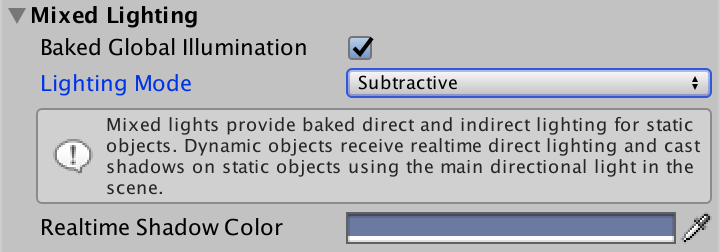 						Subtractive mode. 					

After switching to *Subtractive* mode, the  scene will get a lot brighter. That happens because static objects now  use both the fully-baked lightmap and direct lighting. Dynamic objects  still use light probes and direct lighting, as usual.

 						
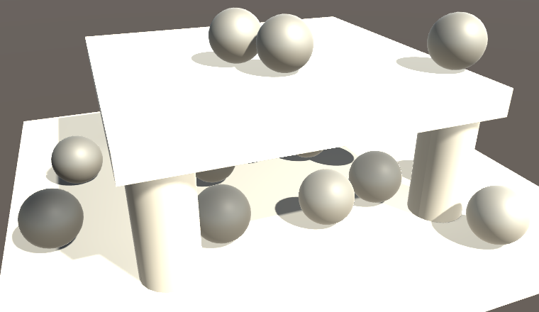 						Static objects are lit twice. 					

*Subtractive* mode only works with forward  rendering. When using the deferred rendering path, the relevant objects  will fall back to forward the forward path, like transparent objects  do.

### Subtractive Lighting

The idea of *Subtractive* mode is that  static objects are lit via lightmaps, while also factoring dynamic  shadows into it. This is done by decreasing the intensity of the  lightmap in shadowed areas. To do this, the shader needs to access both  the lightmap and the realtime shadows. It also need to use the realtime  light to figure out how much the lightmap has to be dimmed. That's why  we got double lighting after switching to this mode.

Subtractive lighting is an approximation, which only works with  a single directional light. So only shadows of the main directional  light are supported. Also, we have to somehow know what the indirect  light situation is supposed to be in dynamically shaded areas. As we're  using a fully-baked lightmap, we don't have this information. Instead of  including an additional lightmap with only the indirect light, Unity  uses a uniform color to approximate the ambient light. This is the *Realtime Shadow Color*, which you can adjust in the mixed lighting section.

In the shader, we know that we should be using subtractive lighting when the *LIGHTMAP_ON*, *SHADOWS_SCREEN*, and *LIGHTMAP_SHADOW_MIXING* keywords are defined, while *SHADOWS_SHADOWMASK* isn't. Let's define *SUBTRACTIVE_LIGHTING* when that's the case, to make it easier to work with.

```
#if !defined(LIGHTMAP_ON) && defined(SHADOWS_SCREEN)
	#if defined(SHADOWS_SHADOWMASK) && !defined(UNITY_NO_SCREENSPACE_SHADOWS)
		#define ADDITIONAL_MASKED_DIRECTIONAL_SHADOWS 1
	#endif
#endif

#if defined(LIGHTMAP_ON) && defined(SHADOWS_SCREEN)
	#if defined(LIGHTMAP_SHADOW_MIXING) && !defined(SHADOWS_SHADOWMASK)
		#define SUBTRACTIVE_LIGHTING 1
	#endif
#endif
```

Before we do anything else, we have to get rid of the double  lighting. This can be done by switching off the dynamic light, like we  do for the deferred pass.

```
UnityLight CreateLight (Interpolators i) {
	UnityLight light;

	#if defined(DEFERRED_PASS)  || SUBTRACTIVE_LIGHTING
		light.dir = float3(0, 1, 0);
		light.color = 0;
	#else
		…
	#endif

	return light;
}
```

 							
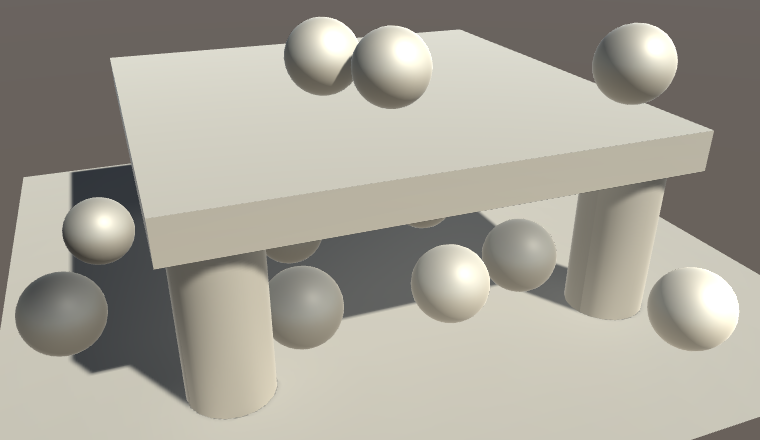 							Only baked lighting for static objects. 						

### Shadowing Baked Light

To apply subtractive shadows, let's create a function to adjust the indirect light when needed. It usually does nothing.

```
void ApplySubtractiveLighting (
	Interpolators i, inout UnityIndirect indirectLight
) {}
```

This function has to be invoked after we have retrieved the lightmap data.

```
UnityIndirect CreateIndirectLight (Interpolators i, float3 viewDir) {
	…

	#if defined(FORWARD_BASE_PASS) || defined(DEFERRED_PASS)
		#if defined(LIGHTMAP_ON)
			indirectLight.diffuse =
				DecodeLightmap(UNITY_SAMPLE_TEX2D(unity_Lightmap, i.lightmapUV));
			
			#if defined(DIRLIGHTMAP_COMBINED)
				…
			#endif

			ApplySubtractiveLighting(i, indirectLight);
		#else
			indirectLight.diffuse += max(0, ShadeSH9(float4(i.normal, 1)));
		#endif
		…
	#endif

	return indirectLight;
}
```

If there is subtractive lighting, then we have to fetch the shadow attenuation. We can simply copy the code from `CreateLight`.

```
void ApplySubtractiveLighting (
	Interpolators i, inout UnityIndirect indirectLight
) {
	#if SUBTRACTIVE_LIGHTING
		UNITY_LIGHT_ATTENUATION(attenuation, i, i.worldPos.xyz);
		attenuation = FadeShadows(i, attenuation);
	#endif
}
```

Next, we have to figure out how much light we would receive, if  we were using realtime lighting. We assume that this information  matches what's baked in the lightmap. As the lightmap only contains  diffuse light, we can suffice with computing the Lambert term for the  directional light.

```
	#if SUBTRACTIVE_LIGHTING
		UNITY_LIGHT_ATTENUATION(attenuation, i, i.worldPos.xyz);
		attenuation = FadeShadows(i, attenuation);

		float ndotl = saturate(dot(i.normal, _WorldSpaceLightPos0.xyz));
	#endif
```

To arrive at the shadowed light intensity, we have to multiply  the Lambert term with the attenuation. But we already have the fully  unshadowed baked light. So instead we'll estimate how much light is  blocked by the shadow.

```
		float ndotl = saturate(dot(i.normal, _WorldSpaceLightPos0.xyz));
		float3 shadowedLightEstimate =
			ndotl * (1 - attenuation) * _LightColor0.rgb;
```

By subtracting this estimate from the baked light, we end up with the adjusted light.

```
		float3 shadowedLightEstimate =
			ndotl * (1 - attenuation) * _LightColor0.rgb;
		float3 subtractedLight = indirectLight.diffuse - shadowedLightEstimate
		indirectLight.diffuse = subtractedLight;
```

 							
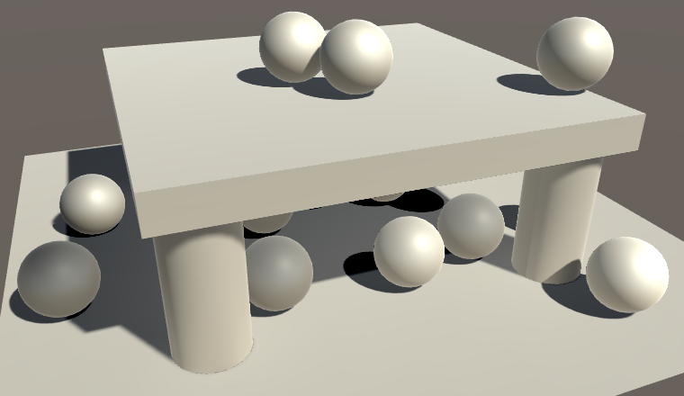 							Subtracted light. 						

This always produces solid black shadows, regardless of ambient  lighting situation. To better match the scene, we can use our  subtractive shadow color, which is made available via `unity_ShadowColor`.  The shadowed areas shouldn't be darker than this color, but they could  be brighter. So take the maximum of the computed light and the shadow  color.

```
		float3 subtractedLight = indirectLight.diffuse - shadowedLightEstimate;
		subtractedLight = max(subtractedLight, unity_ShadowColor.rgb);
		indirectLight.diffuse = subtractedLight;
```

We must also take into consideration the possibility that the  shadow strength has been set to lower than 1. To apply the shadow  strength, interpolate between the shadowed and unshadowed light based on  the X component of `_LightShadowData`.

```
		subtractedLight = max(subtractedLight, unity_ShadowColor.rgb);
		subtractedLight =
			lerp(subtractedLight, indirectLight.diffuse, _LightShadowData.x);
		indirectLight.diffuse = subtractedLight;
```

 							
 							Colored shadows. 						

Because our scene has its ambient intensity set to zero, the  default shadow color doesn't match the scene very well. But it makes it  easy to spot the subtractive shadows, so I didn't adjust it. This also  makes it obvious that the shadow color now overrides all baked shadows,  which shouldn't happen. It should only affect areas that receive dynamic  shadows, not brighten baked shadows. To enforce this, use the minimum  of the subtractive lighting and the baked lighting.

```
//		indirectLight.diffuse = subtractedLight;
		indirectLight.diffuse = min(subtractedLight, indirectLight.diffuse);
```

 							
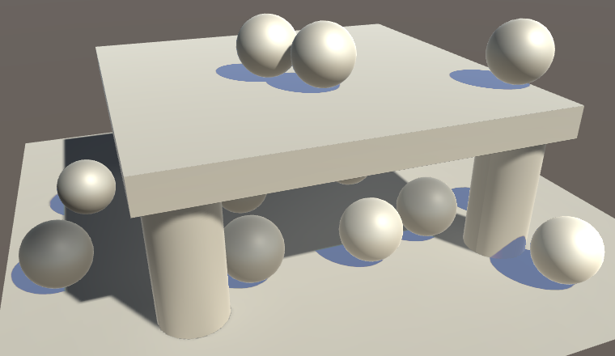 							Proper subtractive shadows. 						

We now get correct subtractive shadows, as long as we use an  appropriate shadow color. But keep in mind that this is just an  approximation, and it doesn't work well with multiple lights. For  example, other baked lights will be shadowed incorrectly.

 							
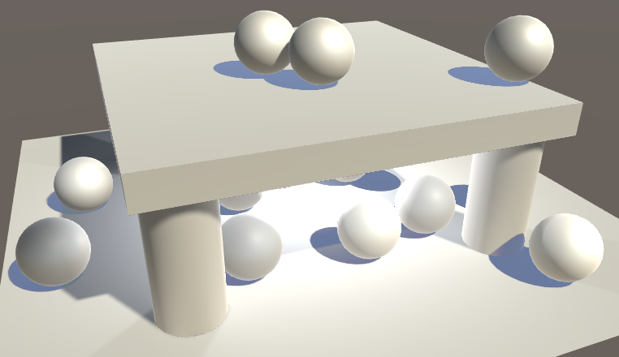 							Incorrect subtraction for other lights. 						

The next tutorial is [Realtime GI, Probe Volumes, LOD Groups](https://catlikecoding.com/unity/tutorials/rendering/part-18/).

unitypackage

PDF
