# Rendering 10

More Complexity

- Bake self-shadowing into a material.
- Add details to part of a surface.
- Support more efficient shader variants.
- Edit multiple materials at once.

This is the tenth part of a tutorial series about rendering. [Last time](https://catlikecoding.com/unity/tutorials/rendering/part-9),  we used multiple textures to create complex materials. We'll add some  more complexity this time, and also support multi-material editing.

This tutorial was made with Unity 5.4.3f1.

 					
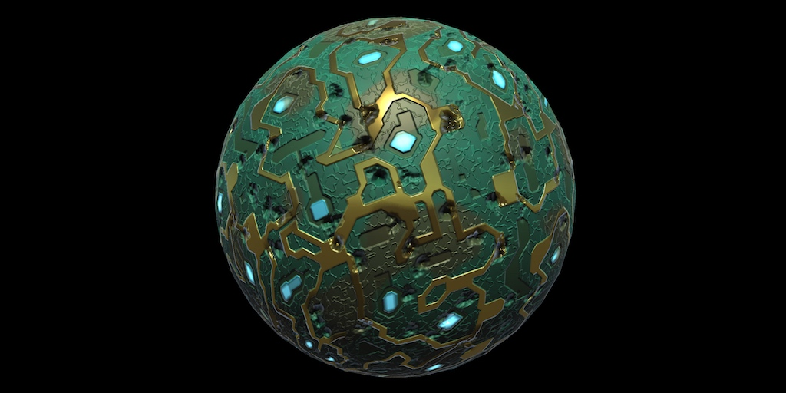 					Complex materials are often a mess. 				

## Occluded Areas

Even through we can create materials that appear complex, it is  just an illusion. The triangles are still flat. Normal maps can give the  impression of depth, but that only works for direct light. There is no  self-shadowing. Parts that are supposedly higher, should casts shadows  on areas that are lower. But this doesn't happen. This is most obvious  when the normal map would suggest that there are small holes, dents, or  cracks.

For example, let's say that someone has been shooting at our  circuit board. The shots didn't go through the board, but left  significant dents. Here's an adjusted normal map for that.

 						
 						Dented circuitry normal map. 					

When using this normal map, the circuitry material indeed  appears dented. But the deepest parts of the dents are lit just as well  as the undented surface. There isn't any self-shadowing going on in the  dents. As as result, they do not appear to be very deep.

 						
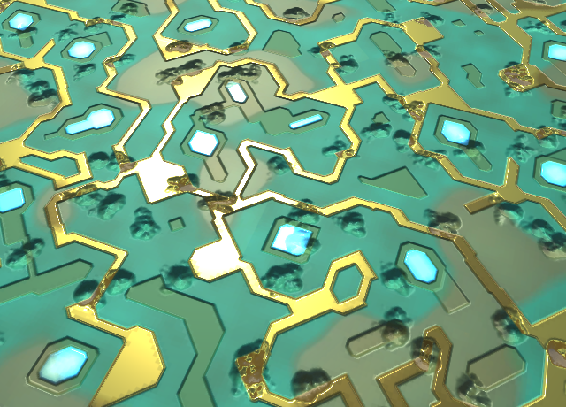 						Dented circuitry. 					

### Occlusion Map

To add self-shadowing, we can use what's known as an occlusion  map. You can think of this as a fixed shadow map that's part of the  material. Here is such a map for the dented circuitry, as a grayscale  image.

 							
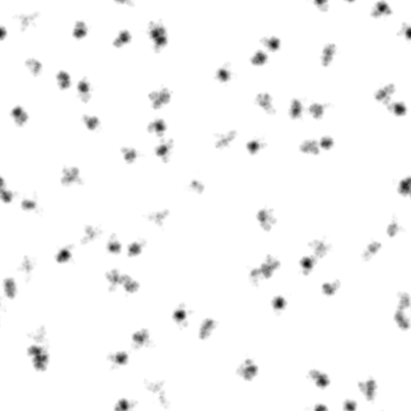 							Occlusion map. 						

To use this map, add a texture property for this map to our  shader. Also add an occlusion strength slider property, so we can  fine-tune it.

```
		[NoScaleOffset] _OcclusionMap ("Occlusion", 2D) = "white" {}
		_OcclusionStrength("Occlusion Strength", Range(0, 1)) = 1
```

Just like with the metallic map, let's use a shader feature to  only sample the occlusion map when it is set. Add the feature to the  base pass only, don't worry about additional lights now.

```
			#pragma shader_feature _ _SMOOTHNESS_ALBEDO _SMOOTHNESS_METALLIC
			#pragma shader_feature _OCCLUSION_MAP
			#pragma shader_feature _EMISSION_MAP
```

### Occlusion UI

Because we have a custom shader GUI, we have to manually add the new properties to our shader's UI. So add a `DoOcclusion` step to `**MyLightingShaderGUI**.DoMain`.

```
	void DoMain () {
		…
		DoNormals();
		DoOcclusion();
		DoEmission();
		editor.TextureScaleOffsetProperty(mainTex);
	}
```

This new method is nearly identical do `DoMetallic`, which is also about a map, a slider, and a keyword. So duplicate that method and make the required changes. While `DoMetallic`  shows the slider when there is no map, we have to do the opposite here.  Also, Unity's standard shader uses the G color channel of the occlusion  map, so we'll do this as well. Indicate this in the tooltip.

```
	void DoOcclusion () {
		MaterialProperty map = FindProperty("_OcclusionMap");
		EditorGUI.BeginChangeCheck();
		editor.TexturePropertySingleLine(
			MakeLabel(map, "Occlusion (G)"), map,
			map.textureValue ? FindProperty("_OcclusionStrength") : null
		);
		if (EditorGUI.EndChangeCheck()) {
			SetKeyword("_OCCLUSION_MAP", map.textureValue);
		}
	}
```

 							 							 							Inspector without and with occlusion map. 						

### Adding Shadows

To access the map in our include file, add a sampler and float variable.

```
sampler2D _OcclusionMap;
float _OcclusionStrength;
```

Create a function to take care of sampling the map, if it  exists. If not, the light should not be modulated, so the result is  simply 1.

```
float GetOcclusion (Interpolators i) {
	#if defined(_OCCLUSION_MAP)
		return tex2D(_OcclusionMap, i.uv.xy).g;
	#else
		return 1;
	#endif
}
```

When the occlusion strength is zero, the map should't affect  the light at all. Thus, the function should return 1. When at full  strength, the result is exactly what's in the map. We can do this by  interpolating between 1 and the map, based on the slider.

```
		return lerp(1, tex2D(_OcclusionMap, i.uv.xy).g, _OcclusionStrength);
```

To apply the shadows to the light, we have to factor the occlusion into the light attention inside `CreateLight`.

```
UnityLight CreateLight (Interpolators i) {
	…

	UNITY_LIGHT_ATTENUATION(attenuation, i, i.worldPos);
	attenuation *= GetOcclusion(i);
	light.color = _LightColor0.rgb * attenuation;
	light.ndotl = DotClamped(i.normal, light.dir);
	return light;
}
```

 							
							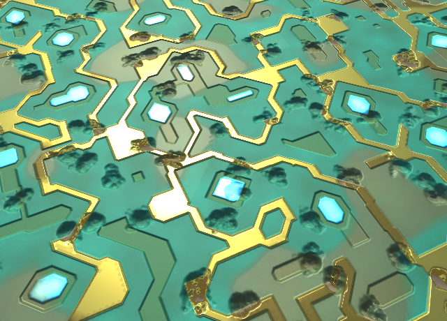 							Without and with occlusion at full strength. 						

### Shadowing Indirect Light

The dents have become darker, but overall not by much. That's  because a lot of the light is actually indirect light in this scene. As  our occlusion map is not specific to any light, we can apply it to  indirect light as well. This is done by modulating both the diffuse and  specular indirect light.

```
UnityIndirect CreateIndirectLight (Interpolators i, float3 viewDir) {
	…

	#if defined(FORWARD_BASE_PASS)
		…

		float occlusion = GetOcclusion(i);
		indirectLight.diffuse *= occlusion;
		indirectLight.specular *= occlusion;
	#endif

	return indirectLight;
}
```

 							
							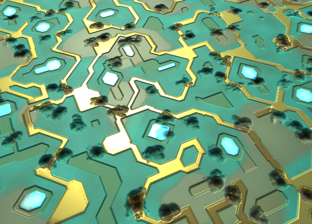 							Without and with full occlusion. 						

This produces much stronger shadows. In fact, they might be too  strong. As the occlusion map is based on the surface shape and not on a  specific light, it makes sense that it is only applied to indirect  light. Light coming from all directions is reduced the deeper you go  into a dent. But when a light shines directly in it, the dent should be  fully lit. So let's remove occlusion from direct lights.

```
UnityLight CreateLight (Interpolators i) {
	…

	UNITY_LIGHT_ATTENUATION(attenuation, i, i.worldPos);
//	attenuation *= GetOcclusion(i);
	light.color = _LightColor0.rgb * attenuation;
	light.ndotl = DotClamped(i.normal, light.dir);
	return light;
}
```

 							
							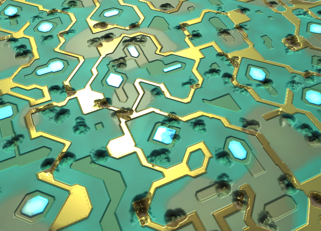 							Without and with indirect occlusion only. 						

As far as occlusion maps go, this is as realistic as it can  get. Having said that, you'll often find games where occlusion maps are  applied to direct lights as well. Unity's older shaders did this too.  While that is not realistic, it does give artist more control over  lighting.

 							What about screen-space ambient occlusion? 							 						

### Merging Maps

We're only using one channel of the occlusion map, the G  channel. The metallic map for circuitry is stored in the R channel, and  the smoothness is stored in the alpha channel. This means that we could  combine all three maps into a single texture. Here is such a map.

 							 							 							Combining metallic, occlusion, and smoothness in a single map. 						

The shader doesn't know that we're reusing the texture, so it  will still sample it a second time for the occlusion map. But using a  single texture does reduce memory and storage requirements. By using  DXT5 compression, our three 512×512 maps only require 341KB. This does  mean that the metallic and occlusion maps are combined into a single  gradient, potentially reducing quality. Fortunately, these maps usually  aren't that detailed and don't need to be very accurate. So the results  are often acceptable.

 							Could we reduce it to a single texture sample? 							 						

unitypackage

## Masking Details

Our circuitry material is lacking details. Let's do something about that. Here is a detail albedo map and normal map.

 						 						 						Detail albedo and normal map. 					

Import then and set the texture to fade out mipmap. Assign the  textures and use full-strength normals. These details shouldn't be too  small, a 3 by 3 tiling works well.

 						 						 						Detailed circuitry. 					

### Detail Mask

The details cover the entire surface, but this doesn't look so  good. It's better is the details don't cover the metal parts. We could  use a mask texture to control where details show up. This works like a  binary splat map, like we used in [part 3, Combining Textures](https://catlikecoding.com/unity/tutorials/rendering/part-3/). The difference is that a value of 0 means no details, and a value of 1 means full details.

Here is a detail mask that prevents details from showing up on  the metal parts. For added variety, it also reduces and even eliminates  them from the lower regions of the circuit board. And the details got  wiped out wherever dents were punched into the board.

 							
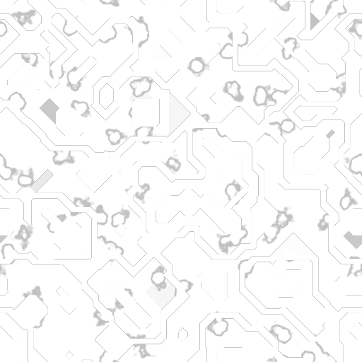 							Detail mask. 						

Unity's standard shader uses the alpha channel of the detail  mask, so we use that channel as well. The image above has all four color  channels set to the same value.

Add a property for this map to our shader.

```
		[NoScaleOffset] _DetailMask ("Detail Mask", 2D) = "white" {}
```

As many materials won't have a detail mask, give it a shader  feature as well. It's needed in both the base and the additive passes.

```
			#pragma shader_feature _DETAIL_MASK
```

Add the requires variable and a function to get the mask data to our include file.

```
sampler2D _MainTex, _DetailTex, _DetailMask;

…

float GetDetailMask (Interpolators i) {
	#if defined (_DETAIL_MASK)
		return tex2D(_DetailMask, i.uv.xy).a;
	#else
		return 1;
	#endif
}
```

Add the map to our UI as well, below the emission map and  color. In this case, it's a single texture property combined with a  shader keyword.

```
	void DoMain () {
		…
		DoEmission();
		DoDetailMask();
		editor.TextureScaleOffsetProperty(mainTex);
	}
	
	…
	
	void DoDetailMask () {
		MaterialProperty mask = FindProperty("_DetailMask");
		EditorGUI.BeginChangeCheck();
		editor.TexturePropertySingleLine(
			MakeLabel(map, "Detail Mask (A)"), mask
		);
		if (EditorGUI.EndChangeCheck()) {
			SetKeyword("_DETAIL_MASK", mask.textureValue);
		}
	}
```

 							
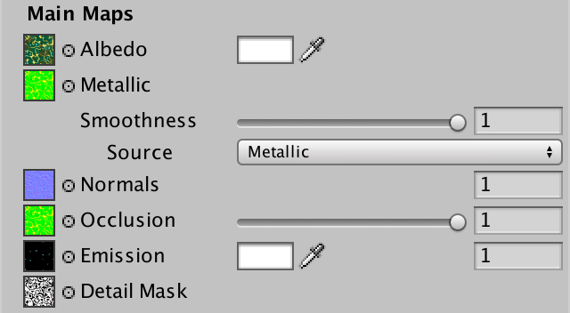 							Using a detail mask. 						

### Albedo Details

To mask the details, we'll have to adjust our include file  again. Instead of always multiplying albedo with the details, we have to  interpolate between the unmodified and modified albedo, based on the  mask. While we're at it, let's put the retrieval of the albedo into its  own function, just like for all the other properties.

```
float3 GetAlbedo (Interpolators i) {
	float3 albedo = tex2D(_MainTex, i.uv.xy).rgb * _Tint.rgb;
	float3 details = tex2D(_DetailTex, i.uv.zw) * unity_ColorSpaceDouble;
	albedo = lerp(albedo, albedo * details, GetDetailMask(i));
	return albedo;
}

…

float4 MyFragmentProgram (Interpolators i) : SV_TARGET {
	…

//	float3 albedo = tex2D(_MainTex, i.uv.xy).rgb * _Tint.rgb;
//	albedo *= tex2D(_DetailTex, i.uv.zw) * unity_ColorSpaceDouble;

	float3 specularTint;
	float oneMinusReflectivity;
	float3 albedo = DiffuseAndSpecularFromMetallic(
		GetAlbedo(i), GetMetallic(i), specularTint, oneMinusReflectivity
	);

	…
}
```

### Normal Details

We have to make the same adjustment for the normal vector. In  this case, no details corresponds with an unmodified upward-facing  tangent-space normal vector. So we replace the original detail normal by  an interpolation between that vector and its original value, once again  based on the detail mask.

```
void InitializeFragmentNormal(inout Interpolators i) {
	float3 mainNormal =
		UnpackScaleNormal(tex2D(_NormalMap, i.uv.xy), _BumpScale);
	float3 detailNormal =
		UnpackScaleNormal(tex2D(_DetailNormalMap, i.uv.zw), _DetailBumpScale);
	detailNormal = lerp(float3(0, 0, 1), detailNormal, GetDetailMask(i));
	float3 tangentSpaceNormal = BlendNormals(mainNormal, detailNormal);

	…
}
```

 							
 							Masked details. 						

unitypackage

## More Keywords

We've been using shader features to enable shader code that  samples and includes various maps into our lighting equation. Unity's  standard shader does this as well. That's the idea of an uber shader. It  can do many things, but has variants for many flavors of use.

The standard shader also has shader features to toggle the use  of normal and detail maps. Normal maps are enabled when either a main or  detail normal map is assigned. And details are enabled when either a  detail albedo or normal is set.

Let's add these features to our shader as well. But let's keep  it simple and toggle each map independently. First, let's set a keyword  based on the existence of a detail albedo map.

```
	void DoSecondary () {
		GUILayout.Label("Secondary Maps", EditorStyles.boldLabel);

		MaterialProperty detailTex = FindProperty("_DetailTex");
		EditorGUI.BeginChangeCheck();
		editor.TexturePropertySingleLine(
			MakeLabel(detailTex, "Albedo (RGB) multiplied by 2"), detailTex
		);
		if (EditorGUI.EndChangeCheck()) {
			SetKeyword("_DETAIL_ALBEDO_MAP", detailTex.textureValue);
		}
		DoSecondaryNormals();
		editor.TextureScaleOffsetProperty(detailTex);
	}
```

Next, a keyword based on the main normal map.

```
	void DoNormals () {
		MaterialProperty map = FindProperty("_NormalMap");
		EditorGUI.BeginChangeCheck();
		editor.TexturePropertySingleLine(
			MakeLabel(map), map,
			map.textureValue ? FindProperty("_BumpScale") : null
		);
		if (EditorGUI.EndChangeCheck()) {
			SetKeyword("_NORMAL_MAP", map.textureValue);
		}
	}
```

And similar for the detail normal map.

```
	void DoSecondaryNormals () {
		MaterialProperty map = FindProperty("_DetailNormalMap");
		EditorGUI.BeginChangeCheck();
		editor.TexturePropertySingleLine(
			MakeLabel(map), map,
			map.textureValue ? FindProperty("_DetailBumpScale") : null
		);
		if (EditorGUI.EndChangeCheck()) {
			SetKeyword("_DETAIL_NORMAL_MAP", map.textureValue);
		}
	}
```

### More Shader Variants

To make this work, add a new shader features for each keyword to our shader passes. First, the base pass.

```
			#pragma shader_feature _METALLIC_MAP
			#pragma shader_feature _ _SMOOTHNESS_ALBEDO _SMOOTHNESS_METALLIC
			#pragma shader_feature _NORMAL_MAP
			#pragma shader_feature _OCCLUSION_MAP
			#pragma shader_feature _EMISSION_MAP
			#pragma shader_feature _DETAIL_MASK
			#pragma shader_feature _DETAIL_ALBEDO_MAP
			#pragma shader_feature _DETAIL_NORMAL_MAP
```

Then, the additive pass.

```
			#pragma shader_feature _METALLIC_MAP
			#pragma shader_feature _ _SMOOTHNESS_ALBEDO _SMOOTHNESS_METALLIC
			#pragma shader_feature _NORMAL_MAP
			#pragma shader_feature _DETAIL_MASK
			#pragma shader_feature _DETAIL_ALBEDO_MAP
			#pragma shader_feature _DETAIL_NORMAL_MAP
```

The amount of shader variants has now increased a lot. However,  to activate the keywords in a material, you'll have to change all the  relevant maps via the inspector. Otherwise the shader GUI will not  properly set the keywords. This isn't an issue when creating new  materials, but existing ones need to be refreshed after this change.

### Using the Keywords

Now we have to change the include file to take advantage of the new keywords. First, `GetAlbedo` might be able to leave out the detail map part.

```
float3 GetAlbedo (Interpolators i) {
	float3 albedo = tex2D(_MainTex, i.uv.xy).rgb * _Tint.rgb;
	#if defined (_DETAIL_ALBEDO_MAP)
		float3 details = tex2D(_DetailTex, i.uv.zw) * unity_ColorSpaceDouble;
		albedo = lerp(albedo, albedo * details, GetDetailMask(i));
	#endif
	return albedo;
}
```

 							How can you test whether this actually works? 							 						

Next, we have to deal with the normal maps. In this case, we  have four possible configurations. Either no normal maps, only a main  map, only a detail map, or both maps. Let's isolate the code that  samples these maps, moving it to a new function.

```
float3 GetTangentSpaceNormal (Interpolators i) {
	float3 mainNormal =
		UnpackScaleNormal(tex2D(_NormalMap, i.uv.xy), _BumpScale);
	float3 detailNormal =
		UnpackScaleNormal(tex2D(_DetailNormalMap, i.uv.zw), _DetailBumpScale);
	detailNormal = lerp(float3(0, 0, 1), detailNormal, GetDetailMask(i));
	return BlendNormals(mainNormal, detailNormal);
}

…

void InitializeFragmentNormal(inout Interpolators i) {
//	float3 mainNormal =
//		UnpackScaleNormal(tex2D(_NormalMap, i.uv.xy), _BumpScale);
//	float3 detailNormal =
//		UnpackScaleNormal(tex2D(_DetailNormalMap, i.uv.zw), _DetailBumpScale);
//	detailNormal = lerp(float3(0, 0, 1), detailNormal, GetDetailMask(i));
//	float3 tangentSpaceNormal = BlendNormals(mainNormal, detailNormal);
	
	float3 tangentSpaceNormal = GetTangentSpaceNormal(i);
	…
}
```

Now rewrite `GetTangentSpaceNormal`  so it can deal with all four situation efficiently. Thanks to the shader  compiler's optimizations, we can do this with two define checks.

```
float3 GetTangentSpaceNormal (Interpolators i) {
	float3 normal = float3(0, 0, 1);
	#if defined(_NORMAL_MAP)
		normal = UnpackScaleNormal(tex2D(_NormalMap, i.uv.xy), _BumpScale);
	#endif
	#if defined(_DETAIL_NORMAL_MAP)
		float3 detailNormal =
			UnpackScaleNormal(
				tex2D(_DetailNormalMap, i.uv.zw), _DetailBumpScale
			);
		detailNormal = lerp(float3(0, 0, 1), detailNormal, GetDetailMask(i));
		normal = BlendNormals(normal, detailNormal);
	#endif
	return normal;
}
```

 							What about the albedo map, and colors? 							 						

unitypackage

## Editing Multiple Materials

So far, we've only considered editing a single material at a  time. But Unity allows us to have multiple materials selected. If those  materials all use our shader, then the shader GUI can be used to edit  all of them at once. You'll also see the entire selection in the preview  panel.

 						
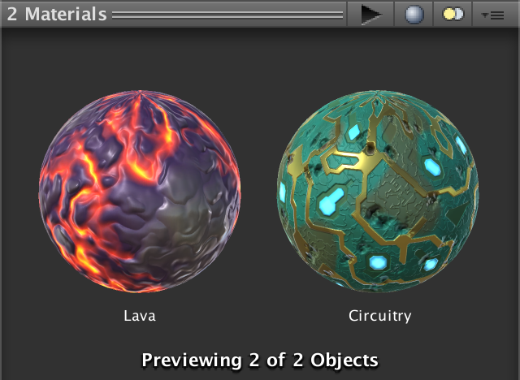 						Preview of two selected materials. 					

### Setting Too Few Keywords

So editing multiple materials at the same time already works!  However, there is a problem. You'll see this when creating two new  materials that use our shader. Select both, then assign a normal map to  them. Even though both materials now have a normal map, only the first  material ends up using them.

 							
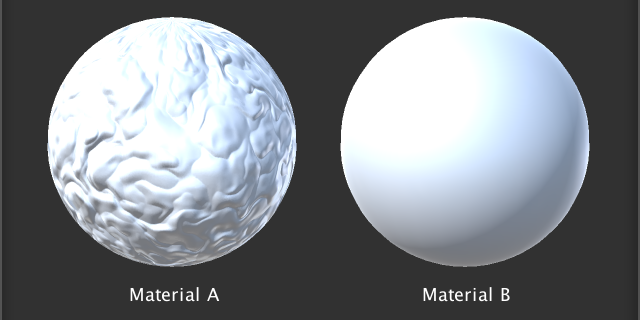 							Only the first material with normals. 						

This happens because our shader gui only sets the keyword of  one material. This is the editor's target, which is the first material  in the selection.

 							What determines the order of the selected materials? 							 						

We can solve this problem by adjusting the keywords of all  materials in the selection. To do this, we have to adjust our shader  GUI's `SetKeyword` method. Instead of using the `target` field, we have to iterate through all the material in the editor's `targets` array. Let's use a `**foreach**` loop to do this, as it's concise code, and we don't need to worry about performance here.

```
	void SetKeyword (string keyword, bool state) {
		if (state) {
			foreach (Material m in editor.targets) {
				m.EnableKeyword(keyword);
			}
		}
		else {
			foreach (Material m in editor.targets) {
				m.DisableKeyword(keyword);
			}
		}
	}
```

 							How does `**foreach**` work? 							 						

With this change, the normals will show up in all materials, after changing the map or the bump scale.

 							
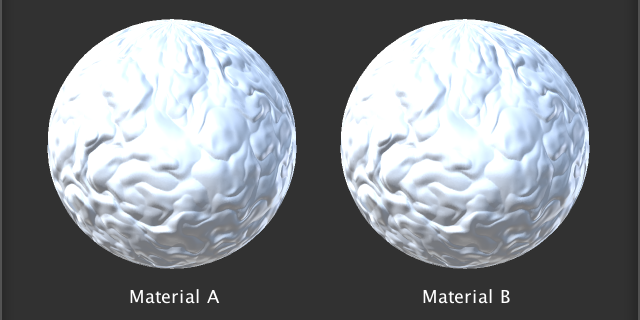 							Both materials with normals. 						

### Setting Too Many Keywords

Unfortunately, we just created another problem. Consider a  selection of two materials. The first material uses a normal map, while  the second does not. In this case, the bump scale is shown by the UI,  because that is based on the first material. This is not a problem, as  the second material will just ignore the bump scale. However, when the  bump scale is changed, the UI will update the keywords of both  materials. The result will be that both materials have the *_NORMAL_MAP* keyword set. So the second material ends up with the *_NORMAL_MAP* keyword enabled, even though it doesn't use a normal map!

This problem wouldn't exist if we only updated the keywords when the texture property is changed. Unfortunately, because `TexturePropertySingleLine` combines two properties, we cannot distinguish between them with the `BeginChangeCheck` and `EndChangeCheck` methods. This was fine before, but no longer.

To fix this problem, we have to keep track of the map's texture  reference before it can be changed. Then we only set the keyword if a  change was made, and it's the map that's different.

```
	void DoNormals () {
		MaterialProperty map = FindProperty("_NormalMap");
		Texture tex = map.textureValue;
		EditorGUI.BeginChangeCheck();
		editor.TexturePropertySingleLine(
			MakeLabel(map), map,
			tex ? FindProperty("_BumpScale") : null
		);
		if (EditorGUI.EndChangeCheck() && tex != map.textureValue) {
			SetKeyword("_NORMAL_MAP", map.textureValue);
		}
	}
```

This solves the problem for `DoNormals`. But it also affects `DoMetallic`, `DoOcclusion`, `DoEmission`, and `DoSecondaryNormals`. Adjust all these methods like we fixed `DoNormals`. Now our shader GUI properly supports multi-material editing!

The next tutorial is [Transparency](https://catlikecoding.com/unity/tutorials/rendering/part-11/).

unitypackage

PDF
