# Rendering 5

Multiple Lights

- Render multiple lights per object.
- Support different light types.
- Use light cookies.
- Compute vertex lights.
- Include spherical harmonics.

This is the fifth part of a tutorial series about rendering. The [previous part](https://catlikecoding.com/unity/tutorials/rendering/part-4) introduced lighting, with a single directional light. Now we'll add support for multiple lights.

This tutorials was made using Unity 5.4.0b21.

 					
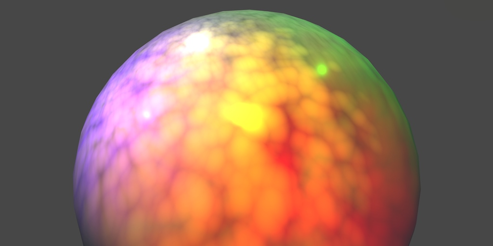 					A boring white sphere, with interesting lights. 				

## Include Files

To add support for multiple lights to our shader, we'll have to  add more passes to it. These passes will end up containing nearly  identical code. To prevent code duplication, we're going to move our  shader code to an include file.

Unity doesn't have a menu option to create a shader include  file. So you'll have to manually go to the asset folder of your project,  via the file browser of your operating system. Create a *My Lighting.cginc*  plain text file in the same folder as your lighting shader. You could  do so by duplicating our shader, renaming it, and then clearing its  contents.

 						
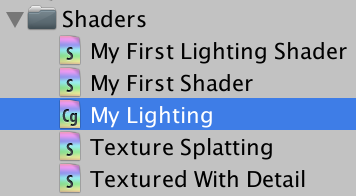 						Your first include file. 					

Copy all the code of our lighting shader to this file, from right below the `#pragma` statements until `ENDCG`. Because this code is no longer directly inside a shader pass, I'll no longer indent it.

```
#include "UnityPBSLighting.cginc"

…

float4 MyFragmentProgram (Interpolators i) : SV_TARGET {
	…
}
```

We can now include this file in our shader, replacing the code  that used to be there. Because it's in the same folder, we can directly  reference it.

```
			CGPROGRAM

			#pragma target 3.0

			#pragma vertex MyVertexProgram
			#pragma fragment MyFragmentProgram

			#include "My Lighting.cginc"

			ENDCG
```

### Preventing Redefinitions

As you already know, include files can themselves include other  include files. When you're including files that in turn include the  same other file, you end up with code duplication. This will lead to  compiler errors about code redefinitions.

To prevent such redefinitions, it is typical to guard include  files with a definition check. This is a pre-processor check to see  whether a certain definition has been made. The definition is simply a  unique identifier that corresponds with the name of the include file.  You can define it to be anything, even nothing. In our case, we'll use  the identifier `MY_LIGHTING_INCLUDED`.

```
#define MY_LIGHTING_INCLUDED

#include "UnityPBSLighting.cginc"

…
```

Now we can put the entire contents of our include file inside a pre-processor if-block. The condition is that `MY_LIGHTING_INCLUDED` has not yet been defined.

```
#if !defined(MY_LIGHTING_INCLUDED)
#define MY_LIGHTING_INCLUDED

#include "UnityPBSLighting.cginc"

…

#endif
```

Typically, the code inside this include-file guard is not indented.

unitypackage

## The Second Light

Our second light will once again be a directional light.  Duplicate the main light and change its color and rotation so you can  tell them apart. Also, reduce its intensity slider, for example to 0.8.  Unity will use the intensity to automatically determine the main light.

 						 						 						Two directional lights. 					

Even though we have two directional lights, there is no visual  difference. We can see their light independently, by having only one  active at a time. But when both are active, only the main light has any  effect.

 						 						 						One or the other, not both. 					

### A Second Pass

We see only a single light, because our shader only computes  one light. The forward base pass is for the main directional light. To  render an additional light, we need an additional pass.

Duplicate our shader pass code and set the new one's light mode to *ForwardAdd*. Unity will use this pass to render the additional light.

```
	SubShader {

		Pass {
			Tags {
				"LightMode" = "ForwardBase"
			}

			CGPROGRAM

			#pragma target 3.0

			#pragma vertex MyVertexProgram
			#pragma fragment MyFragmentProgram

			#include "My Lighting.cginc"

			ENDCG
		}

		Pass {
			Tags {
				"LightMode" = "ForwardAdd"
			}

			CGPROGRAM

			#pragma target 3.0

			#pragma vertex MyVertexProgram
			#pragma fragment MyFragmentProgram

			#include "My Lighting.cginc"

			ENDCG
		}
	}
```

We now see the secondary light, instead of the main light.  Unity renders both, but the additive pass ends up overwriting the  results of the base pass. This is wrong. The additive pass has to add  its results to the base pass, not replace it. We can instruct the GPU to  do this, by changing the blend mode of the additive pass.

How the new and old pixel data is combined is defined by two  factors. The new and old data is multiplied with these factors, then  added to become the final result. The default mode is no blending, which  is equivalent to `**One** **Zero**`.  The result of such a pass replaced anything that was previously in the  frame buffer. To add to the frame buffer, we'll have to instruct it to  use the `**One** **One**` blend mode. This is known as additive blending.

```
			Tags {
				"LightMode" = "ForwardAdd"
			}

			Blend One One

			CGPROGRAM
```

 							
 							Both lights added together. 						

The first time an object is rendered, the GPU checks whether a  fragments ends up in front of anything else that's already been rendered  to that pixel. This distance information is stored in the GPU's depth  buffer, also known as the Z buffer. So each pixel has both a color and a  depth. This depth represents the distance to the nearest surface from  the camera, per pixel. It's like sonar.

If there's nothing in front of the fragment that we want to  render, then it's currently the surface closest to the camera. The GPU  goes ahead and runs the fragment program. It overwrites the pixel's  color and also records its new depth.

If the fragment ends up further away than what's already there,  then there's something in front of it. In that case, we cannot see it,  and it won't be rendered at all.

 							What about semitransparent objects? 							 						

This process is repeated for the secondary light, except now  we're adding to what's already there. Once again, the fragment program  is only run if nothing is in front of what we're rendering. If so, we  end up at the exact same depth as the previous pass, because it's for  the same object. So we end up recording the exact same depth value.

Because writing to the depth buffer twice is not necessary, let's disable it. This is done with the `**ZWrite** **Off**` shader statement.

```
			Blend One One
			ZWrite Off
```

### Draw Call Batches

To get a better idea of what's going on, you can enable the *Stats*  panel at the top right corner of the game view. Look at the amount of  batches, as well as those saved by batching. These represent draw calls.  Do this with only the main light active.

 							
 							Five batches, seven total. 						

As we have six objects, you'd expect six batches. But with  dynamic batching enabled, all three cubes are combined into a single  batch. So you'd expect four batches, with two saved. But you might have  five batches.

The extra batch is caused by dynamic shadows. Let's eliminate it by entirely disabling shadows in the quality settings, via *Edit / Project Settings / Quality*. Make sure that you adjust the quality settings that you're currently using in the editor.

 							 							 							No more shadows, four batches. 						

 							Why do I still have an additional batch? 							 						

You might have to trigger a statistics update – for example by  clicking the game view – after which the draw calls should be four, with  two saved by batching. Then, activate the secondary light.

 							
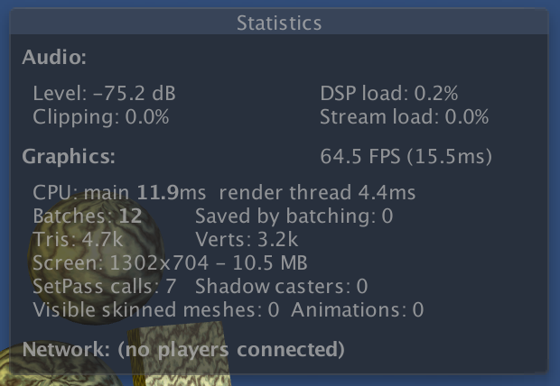 							Two lights, twelve batches. 						

Because each object is now rendered twice, we end up with  twelve batches, instead of six. This is expected. What you might not  expect, is that dynamic batching is no longer working. Unfortunately,  Unity's dynamic batching only works for objects that are affected by at  most a single directional light. Activating the second light made this  optimization impossible.

### Frame Debugger

To get an even better insight into how the scene is rendered, you can use the frame debugger. Open it via *Window / Frame Debugger*.

 							
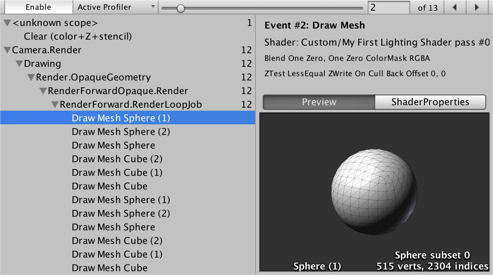 							Frame debugger window. 						

When enabled, the frame debugger allows you to step through  each individual draw call. The window itself shows details of each draw  call. The game view will show what's rendered up to and including the  selected draw call.

<iframe src="https://gfycat.com/ifr/NegativeClearDutchshepherddog"></iframe>

Stepping though draw calls.

Preferably, opaque objects close to the camera are drawn first.  This front-to-back draw order is efficient, because thanks to the depth  buffer, hidden fragments will be skipped. If we would draw  back-to-front instead, we'd keep overwriting pixels of more distant  objects. This is known as overdraw, and should be avoided as much as  possible.

Unity orders objects front-to-back, but that's not the only  thing that determines the draw order. Changing GPU state is also  expensive, and should be minimized too. This is done by rendering  similar objects together. For example, Unity prefers to render the  spheres and cubes in groups, because then it doesn't have to switch  between meshes as often. Likewise, Unity prefers to group objects that  use the same material.

unitypackage

## Point Lights

Directional lights are not the only types of light. Let's add a point light, via *GameObject / Light / Point Light*.

 						
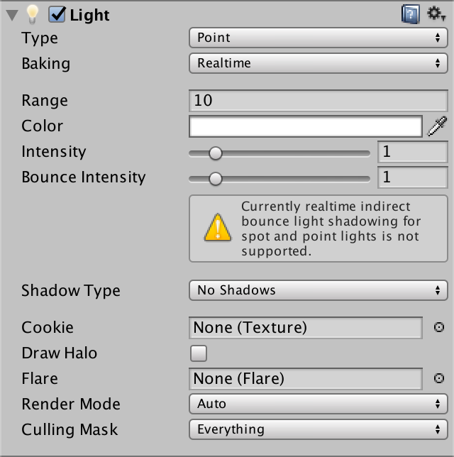 						A point light. 					

To get a good look at it, disable both directional lights. Then move the point light around a bit.

<iframe src="https://gfycat.com/ifr/EllipticalLimpingCamel"></iframe>

Moving the light from below to above.

The light behaves very strange. What's going on? When you use  the frame debugger, you'll notice that our objects are first rendered  solid black, then again with the weird light.

The first pass is the base pass. It is always rendered, even  though there isn't an active directional light. So we end up with a  black silhouettes.

The second pass is our additive pass again. This time, it uses a  point light instead of a directional light. But our code still assumes a  directional light. We have to fix this.

### Light Function

Because our light is about to become more complex, let's move  the code that creates it to a separate function. Place this function  directly above the `MyFragmentProgram` function.

```
UnityLight CreateLight (Interpolators i) {
	UnityLight light;
	light.dir = _WorldSpaceLightPos0.xyz;
	light.color = _LightColor0.rgb;
	light.ndotl = DotClamped(i.normal, light.dir);
	return light;
}
```

Now we can simplify `MyFragmentProgram`.

```
float4 MyFragmentProgram (Interpolators i) : SV_TARGET {
	i.normal = normalize(i.normal);
//	float3 lightDir = _WorldSpaceLightPos0.xyz;
	float3 viewDir = normalize(_WorldSpaceCameraPos - i.worldPos);

//	float3 lightColor = _LightColor0.rgb;
	float3 albedo = tex2D(_MainTex, i.uv).rgb * _Tint.rgb;

	float3 specularTint;
	float oneMinusReflectivity;
	albedo = DiffuseAndSpecularFromMetallic(
		albedo, _Metallic, specularTint, oneMinusReflectivity
	);

//	UnityLight light;
//	light.color = lightColor;
//	light.dir = lightDir;
//	light.ndotl = DotClamped(i.normal, lightDir);

	UnityIndirect indirectLight;
	indirectLight.diffuse = 0;
	indirectLight.specular = 0;

	return UNITY_BRDF_PBS(
		albedo, specularTint,
		oneMinusReflectivity, _Smoothness,
		i.normal, viewDir,
		CreateLight(i), indirectLight
	);
}
```

### Light Position

The `_WorldSpaceLightPos0` variable  contains the current light's position. But in case of a directional  light, it actually holds the direction towards the light. Now that we're  using a point light, the variable really contains the data that its  name suggests. So we have to compute the light direction ourselves. This  is done by subtracting the fragment's world position and normalizing  the result.

```
	light.dir = normalize(_WorldSpaceLightPos0.xyz - i.worldPos);
```

<iframe src="https://gfycat.com/ifr/ExcellentVeneratedEmeraldtreeskink"></iframe>

Deriving direction from position.

### Light Attenuation

In case of a directional light, knowing its direction is  enough. It is assumed to be infinitely far away. But a point light has  an explicit position. This means that its distance to the object's  surface can also have an effect. The further away a light, the dimmer it  gets. This is known as the light's attenuation.

In case of a direction light, the attenuation is assumed to  vary so slowly that we can treat it as constant. So we don't bother with  it. But what does the attenuation of a point light look like?

Imagine a point from which we emit a single burst of photons.  These photons move in all directions. As time passes, the photons move  further away from the point. As they all travel at the same velocity,  the photons act as the surface of a sphere, which has the point at its  center. The radius of this sphere increases as the photons keep moving.  As the sphere grows, so does its surface. But this surface always  contains the same amount of photons. So the density of the photons  decreases. This determines the brightness of the observed light.

 							
 							Spherical attenuation. 						

The surface area of a sphere with radius r

 is equal to 

4πr2

. To determine the photon density, we can divide by that. We can ignore the constant 

4π

, as we can just assume that's factored into the light's intensity. That leads to an attenuation factor of 

1d2

 where 

d

 is the light's distance.

```
UnityLight CreateLight (Interpolators i) {
	UnityLight light;
	light.dir = normalize(_WorldSpaceLightPos0.xyz - i.worldPos);
	float3 lightVec = _WorldSpaceLightPos0.xyz - i.worldPos;
	float attenuation = 1 / (dot(lightVec, lightVec));
	light.color = _LightColor0.rgb * attenuation;
	light.ndotl = DotClamped(i.normal, light.dir);
	return light;
}
```

 							
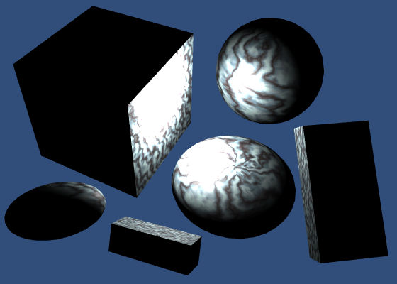 							Too bright up close. 						

This produces extremely bright results close to the light. This  happens because the attenuation factor shoots to infinity when the  distance approaches zero. To make sure that the light's intensity is at  its maximum at a distance of zero, change the attenuation equation to 11+d2

.

```
	float attenuation = 1 / (1 + dot(lightVec, lightVec));
```

 							
 							No longer too bright. 						

### Light Range

In real life, photons keep moving until they hit something.  This means that a light's range is potentially infinite, even though it  becomes so weak that we can no longer see it. But we don't want to waste  time rendering lights that we cannot see. So we'll have to stop  rendering them at some point.

Point lights and spotlights have a range. Objects that lie  inside this range will get a draw call with this lights. All other  objects won't. The default range is 10. The smaller this range, the  fewer objects get an extra draw call, which leads to higher frame rates.  Set our light's range to 1 and move it around.


<iframe src="https://gfycat.com/ifr/OddDisfiguredKinkajou"></iframe>

Light with range 1.

You'll clearly see when objects come in and out of range, as  they'll suddenly switch between being lit and unlit. This happens  because the light would still be visible beyond the range that we chose.  To fix this, we have to ensure that the attenuation and range are  synchronized.

Realistically, light has no maximum range. So any range that we  set is artistic liberty. Our objective then becomes to make sure that  there is no sudden light transition when objects move out of range. This  requires that the attenuation factor reaches zero at maximum range.

Unity determines a point light's attenuation by transforming  the fragment's world position into a light space position. This is a  point in the local space of the light object, scaled by its attenuation.  In this space, the point light sits at the origin. Anything that's more  than one unit away from it is out of range. So the square distance from  the origin defines the scaled attenuation factor.

Unity goes one step further, and uses the squared distance to  sample a falloff texture. This is done to ensure that the attenuation  drops to zero a bit early. Without this step, you could still get light  popping when objects move in or out of range.

The code for this technique is found in the *AutoLight* include file. Let's use that instead of writing it ourselves.

 							

 							AutoLight include file hierarchy. 						

```
#include "AutoLight.cginc"
#include "UnityPBSLighting.cginc"
```

We can now access the `**UNITY_LIGHT_ATTENUATION**`  macro. This macro inserts the code to compute the correct attenuation  factor. It has three parameters. The first is the name of the variable  that will contain the attenuation. We'll use `attenuation`  for that. The second parameter has something to do with shadows. As we  don't support  those yet, just use zero. And the third parameter is the  world position.

Note that the macro defines the variable in the current scope. So we shouldn't declare it ourselves anymore.

```
UnityLight CreateLight (Interpolators i) {
	UnityLight light;
	light.dir = normalize(_WorldSpaceLightPos0.xyz - i.worldPos);
//	float3 lightVec = _WorldSpaceLightPos0.xyz - i.worldPos;
//	float attenuation = 1 / (dot(lightVec, lightVec));
	UNITY_LIGHT_ATTENUATION(attenuation, 0, i.worldPos);
	light.color = _LightColor0.rgb * attenuation;
	light.ndotl = DotClamped(i.normal, light.dir);
	return light;
}
```

 							What does `**UNITY_LIGHT_ATTENUATION**` look like? 							 						

After using this macro, it looks like attenuation doesn't work  anymore. That's because there are multiple versions of it, one per light  type. By default, it's for the directional light, which has no  attenuation at all.

The correct macro is only defined when it is known that we're dealing with a point light. To indicate this, we have to `#define POINT` before including *AutoLight*. As we're only dealing with point lights in our additive pass, define it there, before we include *My Lighting*.

```
		Pass {
			Tags {
				"LightMode" = "ForwardAdd"
			}

			Blend One One
			ZWrite Off

			CGPROGRAM

			#pragma target 3.0

			#pragma vertex MyVertexProgram
			#pragma fragment MyFragmentProgram

			#define POINT

			#include "My Lighting.cginc"

			ENDCG
		}
```

<iframe src="https://gfycat.com/ifr/NegligiblePrestigiousCurlew"></iframe>

Attenuation with range 10.

unitypackage

## Mixing Lights

Turn off the point light and activate our two directional lights again.

 						 						
 						Incorrect vs. correct directional lights. 					

There's something wrong. We're interpreting their light  directions as positions. And the secondary directional light – rendered  by the additive pass – is completely treated as if it were a point  light. To solve this, we have to create shader variants for the  different light types.

### Shader Variants

Check our shader in the inspector. The dropdown menu under the *Compile and show code* button contains a section that tells us how many shader variants it currently has. Click the *Show* button to get an overview of them.

 							
 							Currently two variants. 						

```
// Total snippets: 2
// -----------------------------------------
// Snippet #0 platforms ffffffff:

Just one shader variant.


// -----------------------------------------
// Snippet #1 platforms ffffffff:

Just one shader variant.
```

The file that is opened tells us that we have two snippets,  each with one shader variant. These are our base and additive passes.

We want to create two shader variants for our additive pass.  One for directional lights, and one for point lights. We do this by  adding a multi-compile pragma statement to the pass. This statement  defines a list of keywords. Unity will create multiple shader variants  for us, each defining one of those keywords.

Each variant is a separate shader. They are compiled  individually. The only difference between them is which keywords are  defined.

In this case, we need `DIRECTIONAL` and `POINT`, and we should no longer define `POINT` ourselves.

```
		Pass {
			Tags {
				"LightMode" = "ForwardAdd"
			}

			Blend One One
			ZWrite Off

			CGPROGRAM

			#pragma target 3.0

			#pragma multi_compile DIRECTIONAL POINT

			#pragma vertex MyVertexProgram
			#pragma fragment MyFragmentProgram

//			#define POINT

			#include "My Lighting.cginc"

			ENDCG
		}
```

Summon the shader variant overview again. This time, the second snippet will contain two variants, as we requested.

```
// Total snippets: 2
// -----------------------------------------
// Snippet #0 platforms ffffffff:

Just one shader variant.


// -----------------------------------------
// Snippet #1 platforms ffffffff:
DIRECTIONAL POINT

2 keyword variants used in scene:

DIRECTIONAL
POINT
```

### Using Keywords

We can check which of these keywords exist, just like *AutoLight* does for `POINT`. In our case, if `POINT` is defined, then we have to compute the light direction ourselves. Otherwise, we have a directional light and `_WorldSpaceLightPos0` is the direction.

```
UnityLight CreateLight (Interpolators i) {
	UnityLight light;
	
	#if defined(POINT)
		light.dir = normalize(_WorldSpaceLightPos0.xyz - i.worldPos);
	#else
		light.dir = _WorldSpaceLightPos0.xyz;
	#endif
	
	float3 lightVec = _WorldSpaceLightPos0.xyz - i.worldPos;
	UNITY_LIGHT_ATTENUATION(attenuation, 0, i.worldPos);
	light.color = _LightColor0.rgb * attenuation;
	light.ndotl = DotClamped(i.normal, light.dir);
	return light;
}
```

This works for our two additive pass variants. It also works for the base pass, because it doesn't define `POINT`.

Unity decides which variant to use based on the current light  and the shader variant keywords. When rendering a directional light, it  uses the `DIRECTIONAl` variant. When rendering a point light, it uses the `POINT` variant. And when there isn't a match, it just picks the first variant from the list.

<iframe src="https://gfycat.com/ifr/HopefulAffectionateChimneyswift"></iframe>

Rendering three lights.

unitypackage

## Spotlights

Besides directional and point lights, unity also supports  spotlights. Spotlights are like point lights, except that they are  restricted to a cone, instead of shining in all directions.

 						
 						A spotlight. 					

 						What about area lights? 						 					

To support spotlights as well, we have to add `SPOT` to the keyword list of our multi-compile statement.

```
			#pragma multi_compile DIRECTIONAL POINT SPOT
```

Our additive shader now has three variants.

```
// Snippet #1 platforms ffffffff:
DIRECTIONAL POINT SPOT

3 keyword variants used in scene:

DIRECTIONAL
POINT
SPOT
```

Spotlights have a position, just like point lights. So when either `POINT` or `SPOT` is defined, we have to compute the light direction.

```
	#if defined(POINT) || defined(SPOT)
		light.dir = normalize(_WorldSpaceLightPos0.xyz - i.worldPos);
	#else
		light.dir = _WorldSpaceLightPos0.xyz;
	#endif
```

 						
 						Spotlight with 60° angle. 					

This was already enough to get spotlights to work. They end up with a different `**UNITY_LIGHT_ATTENUATION**` macro, which takes care of the cone shape.

The attenuation approach starts identical to that of a point  light. Convert to light space, then compute the attenuation factor.  Then, force the attenuation to zero for all points that lie behind the  origin. That limits the light to everything in front of the spotlight.

Then the X and Y coordinates in light space are used as UV  coordinates to sample a texture. This texture is used to mask the light.  The texture is simply a circle with a blurred edge. This produces a  light cylinder. To turn it into a cone, the conversion to light space is  actually a perspective transformation, and uses homogeneous  coordinates.

 						What does `**UNITY_LIGHT_ATTENUATION**` look like for spotlights? 						 					

### Spotlight Cookies

The default spotlight mask texture is a blurry circle. But you  could use any square texture, as longs as it drops to zero at its edges.  These textures are known as spotlight cookies. This name is derived  from cucoloris, which refers to a film, theatre, or photography prop  that adds shadows to a light.

The alpha channel of cookies is used to mask the light. The  other channels don't matter. Here's an example texture, which has all  four channels set to the same value.

 							
 							Spotlight cookie. 						

When importing the texture, you can select *Cookie* as its type. Then you also have to set its light type, in this case *Spotlight*. Unity will then take care of most other settings for you.

 							 							 							Imported texture. 						

You can now use this texture as a custom cookie for your spotlight.

 							 							 							Using a spotlight cookie. 						

unitypackage

## More Cookies

Directional lights can have cookies too. These cookies are  tiled. So they don't need to fade to zero at their edge. Instead, they  have to tile seamlessly.

 						 						 						A directional cookie. 					

Cookies for directional lights have a size. This determines  their visual size, which in turn affects how quickly they tile. The  default is 10, but a small scene requires a much smaller scale, like 1.

 						
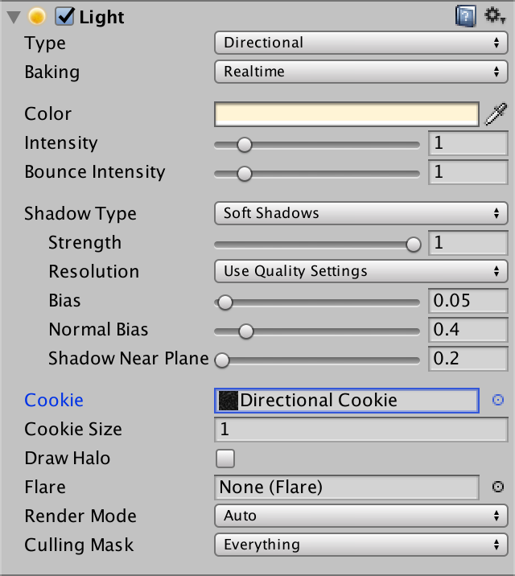 						Main directional light with cookie. 					

Directional lights with cookies also have to perform a conversion to light space. As such, it has its own `**UNITY_LIGHT_ATTENUATION**`  macro. Thus, Unity treats it as a different light type than a  directional light without a cookie. So they'll always be rendered by the  additive pass, using the `DIRECTIONAL_COOKIE` keyword.

```
			#pragma multi_compile DIRECTIONAL DIRECTIONAL_COOKIE POINT SPOT
```

 						
 						Directional light with cookie. 					

 						What does `**UNITY_LIGHT_ATTENUATION**` look like in this case? 						 					

### Cookies for Point Lights

Point lights can also have cookies. In this case, the light  goes in all directions, so the cookie has to wrap around a sphere. This  is done by using a cube map.

You can use various texture formats to create a point light  cookie, and Unity will convert it to a cube map. You'll have to specify  the *Mapping* so Unity knows how to interpret your  image. The best method is to provide a cube map yourself, in which case  you can suffice with the automatic mapping mode.

 							 							 							Point light cookie cube map. 						

Point light cookies don't have any additional settings.

 							
 							Point light with cookie. 						

At this point, we'll have to add the `POINT_COOKIE`  keyword to our multi-compile statement. It is becoming quite a long  list. Because it is such a common list, Unity provides us with a  shorthand pragma statement that we can use instead.

```
			#pragma multi_compile_fwdadd
//			#pragma multi_compile DIRECTIONAL DIRECTIONAL_COOKIE POINT SPOT
```

You can verify that this indeed produces the five variants that we need.

```
// Snippet #1 platforms ffffffff:
DIRECTIONAL DIRECTIONAL_COOKIE POINT POINT_COOKIE SPOT

5 keyword variants used in scene:

POINT
DIRECTIONAL
SPOT
POINT_COOKIE
DIRECTIONAL_COOKIE
```

And don't forget to compute the light direction for point lights with a cookie as well.

```
	#if defined(POINT) || defined(POINT_COOKIE) || defined(SPOT)
		light.dir = normalize(_WorldSpaceLightPos0.xyz - i.worldPos);
	#else
		light.dir = _WorldSpaceLightPos0.xyz;
	#endif
```

 							
 							Point light with a cookie. 						

 						What does `**UNITY_LIGHT_ATTENUATION**` look like in this case? 						 					

unitypackage

## Vertex Lights

Every visible object always gets rendered with its base pass.  This pass takes care of the main directional light. Every additional  light will add an extra additive pass on top of that. Thus, many lights  will result in many draw calls. Many lights with many objects in their  range will result in a whole lot of draw calls.

Take for example a scene with four point lights and six objects.  All objects are in range of all four lights. This requires five draw  calls per object. One for the base pass, plus the four additive passes.  That's 30 draw calls in total. Note that you could add a single  directional light to that, without increasing the draw calls.

 						
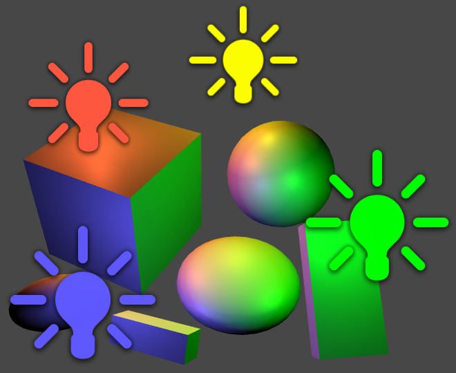 						Four point lights, six objects, 30 draw calls. 					

To keep the amount of draw calls in check, you can limit the *Pixel Light Count*  via the quality settings. This defines the maximum amount of pixels  lights used per object. Lights are referred to as pixel lights, when  they are computed per fragment.

Higher quality levels allow more pixel lights. The default of the highest quality level is four pixel lights.


<iframe src="https://gfycat.com/ifr/FlatHeartyElephantbeetle"></iframe>

From 0 to 4 lights per object.

Which lights are rendered is different for each object. Unity  orders lights from most to least significant, based on their relative  intensity and distance. The lights that are expected to contribute the  least are discarded first.

Actually, a few more things happen, but we'll get to that later.

Because different objects are affected by different lights,  you'll get inconsistent lighting. This gets worse when things are in  motion, as it can result in sudden changes in lighting.

The problem is so bad, because lights are completely switched  off. Fortunately, there is another way to render lights much cheaper,  without completely turning them off. We can render them per vertex,  instead of per fragment.

Rendering a light per vertex means that you perform the lighting  calculations in the vertex program. The resulting color is then  interpolated and passed to the fragment program. This is so cheap, that  Unity includes such lights in the base pass. When this happens, Unity  looks for a base pass shader variant with the `VERTEXLIGHT_ON` keyword.

Vertex lighting is only supported for point lights. So directional lights and spot lights cannot be vertex lights.

To use vertex lights, we have to add a multi-compile statement to our base pass. It only needs a single keyword, `VERTEXLIGHT_ON`. The other option is simply no keyword at all. To indicate that, we have to use `_`.

```
		Pass {
			Tags {
				"LightMode" = "ForwardBase"
			}

			CGPROGRAM

			#pragma target 3.0

			#pragma multi_compile _ VERTEXLIGHT_ON

			#pragma vertex MyVertexProgram
			#pragma fragment MyFragmentProgram

			#include "My Lighting.cginc"

			ENDCG
		}
```

### One Vertex Light

To pass the color of the vertex light to the fragment program, we have to add it to our `**Interpolators**` struct. This is of course only necessary when the `VERTEXLIGHT_ON` keyword is defined.

```
struct Interpolators {
	float4 position : SV_POSITION;
	float2 uv : TEXCOORD0;
	float3 normal : TEXCOORD1;
	float3 worldPos : TEXCOORD2;

	#if defined(VERTEXLIGHT_ON)
		float3 vertexLightColor : TEXCOORD3;
	#endif
};
```

Let's create a separate function to compute this color. It both reads from and writes to the interpolators, so that becomes an `**inout**` parameter.

```
void ComputeVertexLightColor (inout Interpolators i) {
}

Interpolators MyVertexProgram (VertexData v) {
	Interpolators i;
	i.position = mul(UNITY_MATRIX_MVP, v.position);
	i.worldPos = mul(unity_ObjectToWorld, v.position);
	i.normal = UnityObjectToWorldNormal(v.normal);
	i.uv = TRANSFORM_TEX(v.uv, _MainTex);
	ComputeVertexLightColor(i);
	return i;
}
```

For now, we'll simply pass along the color of the first vertex  light. We can only do this when the light exists. Otherwise we keep  doing nothing. *UnityShaderVariables* defines an array of vertex light colors. These are RGBA colors, but we only need the RGB part.

```
void ComputeVertexLightColor (inout Interpolators i) {
	#if defined(VERTEXLIGHT_ON)
		i.vertexLightColor = unity_LightColor[0].rgb;
	#endif
}
```

In the fragment program, we have to add this color to all the  other lights that we compute there. We can do this by treating the  vertex light color as indirect light. Move the creation of the indirect  lighting data to its own function. In there, assign the vertex light  color to the indirect diffuse component, if it exists.

```
UnityIndirect CreateIndirectLight (Interpolators i) {
	UnityIndirect indirectLight;
	indirectLight.diffuse = 0;
	indirectLight.specular = 0;

	#if defined(VERTEXLIGHT_ON)
		indirectLight.diffuse = i.vertexLightColor;
	#endif
	return indirectLight;
}

float4 MyFragmentProgram (Interpolators i) : SV_TARGET {
	i.normal = normalize(i.normal);
	float3 viewDir = normalize(_WorldSpaceCameraPos - i.worldPos);
	float3 albedo = tex2D(_MainTex, i.uv).rgb * _Tint.rgb;

	float3 specularTint;
	float oneMinusReflectivity;
	albedo = DiffuseAndSpecularFromMetallic(
		albedo, _Metallic, specularTint, oneMinusReflectivity
	);

//	UnityIndirect indirectLight;
//	indirectLight.diffuse = 0;
//	indirectLight.specular = 0;

	return UNITY_BRDF_PBS(
		albedo, specularTint,
		oneMinusReflectivity, _Smoothness,
		i.normal, viewDir,
		CreateLight(i), CreateIndirectLight(i)
	);
}
```

Set the pixel light count to zero. Every object should now be rendered as a silhouette with the color of a single light.

 							
 							Color of the first vertex light, per object. 						

Unity supports up to four vertex lights this way. The positions of these lights are stored in four `**float4**` variables, one per coordinate. They are `unity_4LightPosX0`, `unity_4LightPosY0`, and `unity_4LightPosZ0`, and they are defined in *UnityShaderVariables*. The first components of these variables contain the position of the first vertex light.

```
void ComputeVertexLightColor (inout Interpolators i) {
	#if defined(VERTEXLIGHT_ON)
		float3 lightPos = float3(
			unity_4LightPosX0.x, unity_4LightPosY0.x, unity_4LightPosZ0.x
		);
		i.vertexLightColor = unity_LightColor[0].rgb;
	#endif
}
```

Next, we compute the light vector, the light direction, and the ndotl factor. We cannot use the `**UNITY_LIGHT_ATTENUATION**` macro here, so let's just use 11+d2

 again. This leads to the final color.

```
void ComputeVertexLightColor (inout Interpolators i) {
	#if defined(VERTEXLIGHT_ON)
		float3 lightPos = float3(
			unity_4LightPosX0.x, unity_4LightPosY0.x, unity_4LightPosZ0.x
		);
		float3 lightVec = lightPos - i.worldPos;
		float3 lightDir = normalize(lightVec);
		float ndotl = DotClamped(i.normal, lightDir);
		float attenuation = 1 / (1 + dot(lightVec, lightVec));
		i.vertexLightColor = unity_LightColor[0].rgb * ndotl * attenuation;
	#endif
}
```

Note that this is just a diffuse term. While we could compute  the specular term as well, it will look very bad when interpolating it  across large triangles.

Actually, *UnityShaderVariables* provides another variable, `unity_4LightAtten0`. It contains factors to help approximate the attenuation of the pixel lights. Using this, our attenuation become 11+d2a

.

```
		float attenuation = 1 /
			(1 + dot(lightVec, lightVec) * unity_4LightAtten0.x);
```

 							
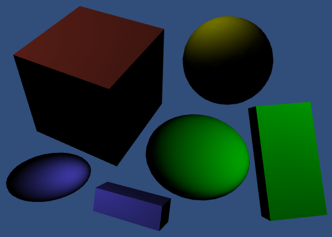 							One vertex light per object. 						

### Four Vertex Lights

To include all four vertex lights that Unity supports, we have  to perform the same vertex-light computations four times, and add the  results together. Instead of writing all the code ourselves, we can use  the `Shade4PointLights` function, which is defined in *UnityCG*. We have to feed it the position vectors, light colors, attenuation factors, plus the vertex position and normal.

```
void ComputeVertexLightColor (inout Interpolators i) {
	#if defined(VERTEXLIGHT_ON)
		i.vertexLightColor = Shade4PointLights(
			unity_4LightPosX0, unity_4LightPosY0, unity_4LightPosZ0,
			unity_LightColor[0].rgb, unity_LightColor[1].rgb,
			unity_LightColor[2].rgb, unity_LightColor[3].rgb,
			unity_4LightAtten0, i.worldPos, i.normal
		);
	#endif
}
```

 							What does `Shade4PointLights` look like? 							 						

 							
 							Four vertex lights. 						

Now up to four lights will be included as vertex lights, if an  objects ends up with more lights than the pixel light count. Actually,  Unity tries to hide the transitions between pixel and vertex lights by  including one light as both a pixel and a vertex light. That light is  included twice, with varying intensity for its vertex and pixel  versions.

 							What happens when there are less than four vertex lights? 							 						

<iframe src="https://gfycat.com/ifr/GrandioseNeedyGeese"></iframe>

Switching between vertex and pixel lights.

By default, Unity decides which lights become pixel lights. You can override this by changing a light's *Render Mode*.  Important lights are always rendered as pixel lights, regardless of the  limit. Lights that are not important are never rendered as pixel  lights.

 							
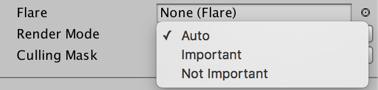 							Light render mode. 						

unitypackage

## Spherical Harmonics

When we've used up all pixel lights and all vertex lights, we  can fall back to yet another method of rendering lights. We can use  spherical harmonics. This is supported for all three light types.

The idea behind spherical harmonics is that you can describe all  incoming light at some point with a single function. This function is  defined on the surface of a sphere.

Typically, this function is described with spherical  coordinates. But you can use 3D coordinates as well. That allows us to  use our object's normal vector to sample the function.

To create such a function, you'd have to sample the light  intensity in all directions, then figure out how to turn that into a  single, continuous function. To be perfect, you'd have to do this for  every point on every object's surface. This is of course not possible.  We'll have to suffice with an approximation.

First, we'll only define the function from the point of view of  the object's local origin. This is fine for lighting conditions that  don't change much along the surface of the object. This is true for  small objects, and lights that are either weak or far away from the  object. Fortunately, this is typically the case for lights that don't  qualify for pixel or vertex light status.

Second, we also have to approximate the function itself. You can  decompose any continuous function into multiple functions of different  frequencies. These are known as bands. For an arbitrary function, you  might need an infinite amount of bands to do this.

A simple example is composing sinusoids. Start with a basic sine wave.

 						
 						Sine wave, sin2πx

. 					

This is the first band. For the second band, use a sine wave with double the frequency, and half the amplitude.

 						
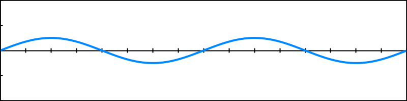 						Double frequency, half amplitude, sin4πx2

. 					

When added together, these two bands describe a more complex function.

 						
 						Two bands, sin2πx+sin4πx2

. 					

You can keep adding bands like this, doubling the frequency and halving the amplitude each step.

 						 						 						Third and fourth bands. 					

Each band that you add makes the function more complex.

 						
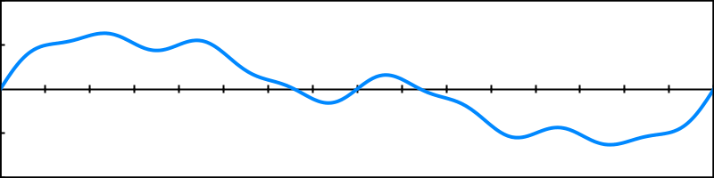 						Four sine wave bands, 4∑i=1sin2πixi2

. 					

This example used regular sine waves with a fixed pattern. To  describe an arbitrary function with sine waves, you'd have to adjust the  frequency, amplitude, and offset of each band until you get a perfect  match.

If you use less bands than needed for a perfect match, you end  up with an approximation of the original function. The fewer bands you  use, the less accurate the approximation gets. This technique is used to  compress lots of things, like sound and image data. In our case, we'll  use it to approximate 3D lighting.

The bands with the lowest frequencies correspond with the large  features of the function. We definitely want to keep those. So we'll  discard the bands with higher frequencies. This means that we lose the  details of our lighting function. This is fine if the lighting doesn't  vary quickly, so once again we'll have to limit ourselves to diffuse  light only.

### Spherical Harmonics Bands

The simplest approximation of lighting is a uniform color. The  lighting is the same in all directions. This is the first band, which  we'll identify as Y00

. It is defined by a single sub-function, which is simply a constant value.

The second band introduces linear directional light. For each  axis, it describes where most of the light is coming from. As such, it  is split into three functions, identified with Y−11

, 

Y01

, and 

Y11

. Each function includes one of our normal's coordinates, multiplied by a constant.

The third band gets more complex. It consists of five functions, Y−22

 … 

Y22

. These functions are quadratic, meaning that they contain the product of two of our normal's coordinates.

We could keep going, but Unity uses only these first three bands. Here they are, in a table. All terms should be multiplied by 12√π

.

|      | -2   | -1   | 0    | 1    | 2    |
| ---- | ---- | ---- | ---- | ---- | ---- |
| 0    |      |      | 1    |      |      |

|      |      |      |
| ---- | ---- | ---- |
| 1    |      | −y√3 |

|      | z√3  |
| ---- | ---- |
|      |      |

|      | −x√3 |
| ---- | ---- |
|      |      |

|      |       |
| ---- | ----- |
| 2    | xy√15 |

|      | −yz√15 |
| ---- | ------ |
|      |        |

|      | (3z2−1)√52 |
| ---- | ---------- |
|      |            |

|      | −xz√15 |
| ---- | ------ |
|      |        |

|      | (x2−y2)√152 |
| ---- | ----------- |
|      |             |


This is really a single function, split so you can identify its  sub-functions. The final result is all nine terms added together.  Different lighting conditions are created by modulating each of the nine  terms, with an additional factor.

 							What determines the shape of this function? 							 						

So we can represent an approximation of any lighting condition  with nine factors. As these are RGB colors, we end up with 27 numbers.  And we can merge the constant parts of the function into those factors  too. That leads to our final function, a+by+cz+dx+exy+fyz+gz2+hxz+i(x2−y2)

, where 

a

 through 

i

 are the factors.

 							Does that approach work for Y02

? 							 						

You can visualize the normal coordinates to get a sense of  which directions the terms represent. For example, here's a way to color  positive coordinates white and negative coordinates red.

```
	float t = i.normal.x;
	return t > 0 ? t : float4(1, 0, 0, 1) * -t;
```

You can then visualize each term by using `i.normal.**x**`, and `i.normal.**x** * i.normal.**y**`, and so on.

 							
 							 							 							
 							 							 							 							 							 							1,
y, z, x,
xy, yz, zz, xz, xx - yy. 						

### Using Spherical Harmonics

Every light that gets approximated by spherical harmonics has  to be factored into the 27 numbers. Fortunately, Unity can do this very  quickly. The base pass can access them via a set of seven `**float4**` variables, defined in *UnityShaderVariables*.

*UnityCG* contains the `ShadeSH9` function, which computes lighting based on the spherical harmonics data, and a normal parameter. It expects a `**float4**` parameter, with its fourth component set to 1.

 							What does `ShadeSH9` look like? 							 						

To get a good look at the final approximation, directly return the result of `ShadeSH9` in the fragment program.

```
	float3 shColor = ShadeSH9(float4(i.normal, 1));
	return float4(shColor, 1);

	return UNITY_BRDF_PBS(
		albedo, specularTint,
		oneMinusReflectivity, _Smoothness,
		i.normal, viewDir,
		CreateLight(i), CreateIndirectLight(i)
	);
```

Now turn off all lights.

 							
 							Ambient color. 						

Surprise! Our objects aren't black anymore. They have picked up  the ambient color. Unity uses spherical harmonics to add the scene's  ambient color to objects.

Now activate a bunch of lights. Make sure that there are enough  so all pixel and vertex lights are used up. The rest are added to the  spherical harmonics. Again, Unity will split a light to blend the  transition.

 							
 							Lights via spherical harmonics. 						

Just like with vertex lights, we'll add the spherical harmonics  light data to the diffuse indirect light. Also, let's make sure that it  never contributes any negative light. It's an approximation, after all.

```
UnityIndirect CreateIndirectLight (Interpolators i) {
	UnityIndirect indirectLight;
	indirectLight.diffuse = 0;
	indirectLight.specular = 0;

	#if defined(VERTEXLIGHT_ON)
		indirectLight.diffuse = i.vertexLightColor;
	#endif

	indirectLight.diffuse += max(0, ShadeSH9(float4(i.normal, 1)));
	
	return indirectLight;
}

float4 MyFragmentProgram (Interpolators i) : SV_TARGET {
	…

//	float3 shColor = ShadeSH9(float4(i.normal, 1));
//	return float4(shColor, 1);

	return UNITY_BRDF_PBS(
		albedo, specularTint,
		oneMinusReflectivity, _Smoothness,
		i.normal, viewDir,
		CreateLight(i), CreateIndirectLight(i)
	);
}
```

But we must only do this in the base pass. As spherical  harmonics are independent of the vertex lights, we cannot rely on the  same keyword. Instead, we'll check whether `FORWARD_BASE_PASS` is defined.

```
	#if defined(FORWARD_BASE_PASS)
		indirectLight.diffuse += max(0, ShadeSH9(float4(i.normal, 1)));
	#endif
```

This eliminates spherical harmonics again, because `FORWARD_BASE_PASS` is defined nowhere. If you have the pixel light count set to zero, only the vertex lights are visible.

 							
 							Only four vertex lights. 						

Define `FORWARD_BASE_PASS` in the base pass, before including *My Lighting*. Now our code knows when we're in the base pass.

```
		Pass {
			Tags {
				"LightMode" = "ForwardBase"
			}

			CGPROGRAM

			#pragma target 3.0

			#pragma multi_compile _ VERTEXLIGHT_ON

			#pragma vertex MyVertexProgram
			#pragma fragment MyFragmentProgram

			#define FORWARD_BASE_PASS

			#include "My Lighting.cginc"

			ENDCG
		}
```

 							
 							Vertex lights and spherical harmonics. 						

Our shader finally includes both vertex lights and spherical  harmonics. And if you make sure that the pixel light count is greater  than zero, you'll see all three lighting methods combined.

 							
 							With an additional four pixel lights. 						

### Skybox

If spherical harmonics includes the solid ambient color, can it  also work with an environmental skybox? Yes! Unity will approximate  that skybox with spherical harmonics as well. To try this out, turn off  all lights, then select the default skybox for environmental lighting.  New scenes use this skybox by default, but we removed it in an earlier  tutorial.

 							 							 							Default skybox, without directional light. 						

Unity now renders the skybox in the background. It is a  procedurally generated skybox, based on the main directional light. As  we have no active light, it behaves as if the sun sits at the horizon.  You can see that the objects have picked up some of the color of the  skybox, which results in some subtle shading. This is all done via  spherical harmonics.

Turn on the main directional light. This will change the skybox  a lot. You might be able to notice that the spherical harmonics change a  little later than the skybox. That's because Unity needs some time to  approximate the skybox. This is only really noticeable when it changes  abruptly.

 							 							 							Skybox with main light, with and without spherical harmonics. 						

The objects suddenly became a lot brighter! The ambient  contribution is very strong. The procedural skybox represents a perfect  sunny day. In these conditions, completely white surfaces will appear  very bright indeed. And this effect will be strongest when rendering in  gamma space. There aren't many perfectly white surfaces in real life,  they're typically much darker. 

 							 							 							Textured, with and without spherical harmonics. 						

The next tutorial is [Bumpiness](https://catlikecoding.com/unity/tutorials/rendering/part-6).
