# Rendering 20

Parallax

- Shift texture coordinates based on view direction.
- Use a height field to create the illusion of depth.
- Trace a ray through a height field.
- Approximate or search for an intersection point.

This is part 20 of a tutorial series about rendering. The [previous part](https://catlikecoding.com/unity/tutorials/rendering/part-19/)  covered GPU instancing. In this installment we'll add the final part of  the standard shader that we so far didn't support, which is parallax  mapping.

This tutorial was made with Unity 2017.1.0f3.

 					
 					A single quad, up close. 				

## Parallax Mapping

Due to perspective, the observed relative position of things  that we see changes when we adjust our point of view. This visual  phenomenon is known as parallax. It is most obvious when looking  sideways when traveling at a high speed. Nearby things appear large and  move by quickly, while the distant background appears small and moves  slower.

We already account for perspective when rendering, at least when  using a camera in perspective mode. Thus, geometry exhibits parallax.

We also use normal maps to add the illusion of surface  irregularities to smooth triangles. This affects the lighting, but not  the actual shape of the surface. Thus, this effect does not exhibit  parallax. This limits the illusion of depth that we can add via normal  maps.

### Test Scene

Below is an albedo map and normal map that suggest many elevation differences.

 							 							 							Albedo and normal maps. 						

Import these textures, then create a material that uses them and *My First Lighting Shader*. Create a new scene with a single quad, rotated (90, 0, 0) so it lies flat, and give it the material.

 							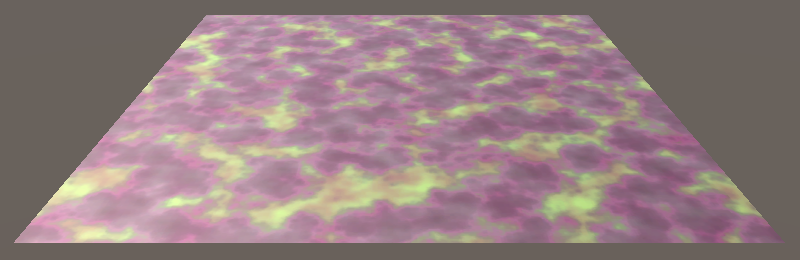 							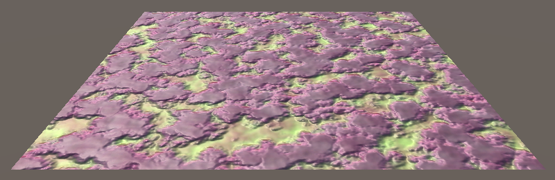 							Quad without and with normal map. 						

Without the normal map, the quad is obviously flat. Adding a  normal map makes it look as if it has an irregular surface. However, the  elevation differences appear small. This becomes evident when observing  the quad from a shallow view angle. Were the elevation differences  large, the relative visual position of surface features should change a  lot due to parallax, but they don't. The parallax that we see is that of  a flat surface.

 							
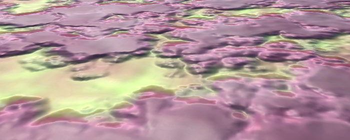 							Shallow view angle. 						

We could increase the strength of the normal map, but this  doesn't change the parallax. Also, when the normal map becomes too  strong it will just look weird. The lighting suggests steep slopes,  while the parallax tells us it's flat. So normal maps only work for  small variations that wouldn't exhibit obvious parallax.

 							
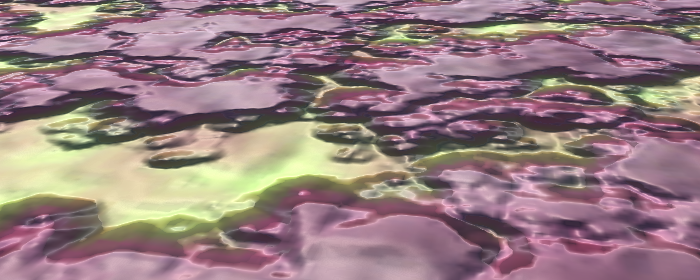 							Strong normals, still flat. 						

To get a true sense of depth, we first need to determine how  much depth there should be. Normal maps don't contain this information.  So we need a height map. With that, we might be able to create fake  parallax, like we create fake slopes. Below is such a map for our  material. It is grayscale, with black representing the lowest points and  white representing the highest points. Because we'll use this map to  create a parallax effect, it's often known as a parallax map instead of a  height map.

 							
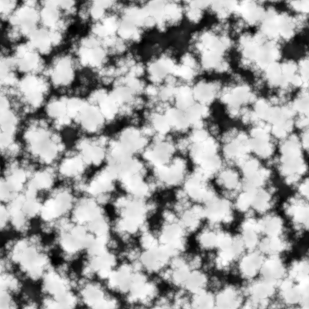 							Height map for parallax. 						

Make sure to disable *sRGB (Color Texture)* when importing it, so the data doesn't get messed up when using linear rendering.

### Parallax Shader Parameters

To be able to use the parallax map, we have to add a property for it to *My First Lighting Shader*.  Just like for occlusion, we'll also give it a strength parameter to  scale the effect. Because parallax effects are rather strong, we'll set  its range to 0–0.1.

```
		[NoScaleOffset] _ParallaxMap ("Parallax", 2D) = "black" {}
		_ParallaxStrength ("Parallax Strength", Range(0, 0.1)) = 0

		[NoScaleOffset] _OcclusionMap ("Occlusion", 2D) = "white" {}
		_OcclusionStrength ("Occlusion Strength", Range(0, 1)) = 1
```

Parallax mapping is a shader feature that we'll enable with the *_PARALLAX_MAP* keyword. Add the required compiler directive to the base pass, the additive pass, and the deferred pass.

```
			#pragma shader_feature _NORMAL_MAP
			#pragma shader_feature _PARALLAX_MAP
```

 							Doesn't the shadowcaster pass need parallax as well? 							 						

To access the new properties, add the corresponding variables to *My Lighting*.

```
sampler2D _ParallaxMap;
float _ParallaxStrength;

sampler2D _OcclusionMap;
float _OcclusionStrength;
```

And to make it possible to configure the material, add a `DoParallax` method to `**MyLightingShaderGUI**`. You can duplicate its `DoOcclusion`  method and change the property names, label, and keyword. Like the  occlusion map, Unity's standard shader expects the height data to be  stored in the texture's G channel. So we'll do this as well and indicate  this in the tooltip.

```
	void DoParallax () {
		MaterialProperty map = FindProperty("_ParallaxMap");
		Texture tex = map.textureValue;
		EditorGUI.BeginChangeCheck();
		editor.TexturePropertySingleLine(
			MakeLabel(map, "Parallax (G)"), map,
			tex ? FindProperty("_ParallaxStrength") : null
		);
		if (EditorGUI.EndChangeCheck() && tex != map.textureValue) {
			SetKeyword("_PARALLAX_MAP", map.textureValue);
		}
	}
```

Invoke the new method in `DoMain`, between `DoNormals` and `DoOcclusion`.

```
	void DoMain () {
		…
		DoNormals();
		DoParallax();
		DoOcclusion();
		…
	}
```

It is now possible to assign a parallax map to our material. After doing so, set its strength to a low value, like 0.03.

 							
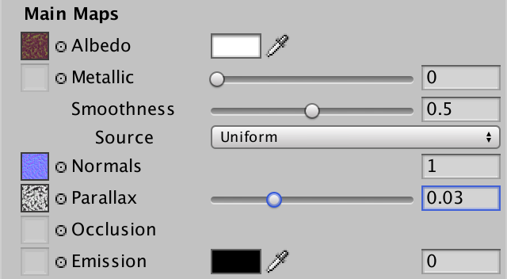 							Material with parallax properties. 						

### Adjusting Texture Coordinates

To apply a parallax effect, we have to make parts of the  surface appear to be somewhere else. This is done by adjust the texture  coordinates in the fragment program. Create an `ApplyParallax` function for that somewhere above `MyFragmentProgram` in *My Lighting*. This function is going to adjust the interpolated data when needed, so give it an `**inout** **Interpolators**` parameter.

```
void ApplyParallax (inout Interpolators i) {
}
```

`ApplyParallax` should be invoked in  our fragment program before the interpolated data is used. The exception  is LOD fading, because that depends on the screen position. We're not  going to adjust those coordinates.

```
FragmentOutput MyFragmentProgram (Interpolators i) {
	UNITY_SETUP_INSTANCE_ID(i);
	#if defined(LOD_FADE_CROSSFADE)
		UnityApplyDitherCrossFade(i.vpos);
	#endif
	
	ApplyParallax(i);

	float alpha = GetAlpha(i);
	#if defined(_RENDERING_CUTOUT)
		clip(alpha - _Cutoff);
	#endif

	…
}
```

Let's begin by adjusting the texture coordinates by simply  adding the parallax strength to the U coordinate. Only do this when the  parallax feature is enabled.

```
void ApplyParallax (inout Interpolators i) {
	#if defined(_PARALLAX_MAP)
		i.uv.x += _ParallaxStrength;
	#endif
}
```

<iframe src="https://gfycat.com/ifr/WhoppingWildAnkole"></iframe>

Shifting U Coordinates.

Changing the parallax strength now causes the texture to  scroll. Increasing the U coordinates moves the texture in the negative U  direction. This doesn't look like a parallax effect yet, because it's a  uniform displacement, and it's independent of the point of view.

### Shifting Along View Direction

Parallax is caused by perspective projection, which is relative  to the observer. So we have to shift the texture coordinates with that  in mind. What this means is that we have to shift the coordinates based  on the view direction, which is different for each fragment.

 							
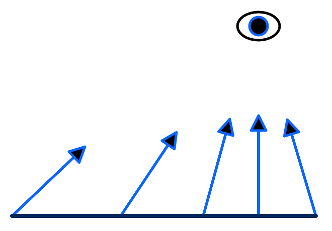 							View direction varies across a surface. 						

Texture coordinates exist in tangent space. To adjust these  coordinates, we need to know the view direction in tangent space as  well. This will require a space conversion, which means a matrix  multiplication. We already have a tangent-space matrix available in the  fragment shader, but that one is for converting from tangent to world  space. In this case, we need to transform in the other direction. We  could pass another matrix to the fragment program and use it there, but  that's getting costly.

The view direction is defined as the vector from the surface to  the camera, normalized. We can determine this vector in the vertex  program, convert it there, and pass it to the fragment program. It we  postpone normalization until after interpolation, we end up with the  correct direction. Then we only have to add the tangent-space view  direction as a new interpolator.

```
struct InterpolatorsVertex {
	…

	#if defined(_PARALLAX_MAP)
		float3 tangentViewDir : TEXCOORD8;
	#endif
};

struct Interpolators {
	…

	#if defined(_PARALLAX_MAP)
		float3 tangentViewDir : TEXCOORD8;
	#endif
};
```

 							Do we have room for a ninth interpolator? 							 						

We can create an object-to-tangent space transformation matrix  in the vertex program, using the raw vertex tangent and normal vectors  from the mesh data. As we only use it for transforming a vector – not a  position – we can suffice with a 3×3 matrix.

```
InterpolatorsVertex MyVertexProgram (VertexData v) {
	…

	ComputeVertexLightColor(i);

	#if defined (_PARALLAX_MAP)
		float3x3 objectToTangent = float3x3(
			v.tangent.xyz,
			cross(v.normal, v.tangent.xyz) * v.tangent.w,
			v.normal
		);
	#endif

	return i;
}
```

Next, we need the view direction to the vertex position in object space, for which we can use the `ObjSpaceViewDir` function. Transform that using our matrix, and we have what we need.

```
	#if defined (_PARALLAX_MAP)
		float3x3 objectToTangent = float3x3(
			v.tangent.xyz,
			cross(v.normal, v.tangent.xyz) * v.tangent.w,
			v.normal
		);
		i.tangentViewDir = mul(objectToTangent, ObjSpaceViewDir(v.vertex));
	#endif
```

 							What does `ObjSpaceViewDir` do? 							 						

Now we have access to the tangent-space view direction in `ApplyParallax`.  First, normalize it to turn it into a proper direction vector. Then,  add its XY components to the texture coordinates, modulated by the  parallax strength.

```
void ApplyParallax (inout Interpolators i) {
	#if defined(_PARALLAX_MAP)
		i.tangentViewDir = normalize(i.tangentViewDir);
		i.uv.xy += i.tangentViewDir.xy * _ParallaxStrength;
	#endif
}
```

What this effectively does is project the view direction onto  the texture surface. When looking straight at the surface, at a 90°  angle, the view direction in tangent space is equal to the surface  normal (0, 0, 1), which results in no displacement. The shallower the  view angle gets, the larger the projection becomes, and the greater the  displacement effect.

 							
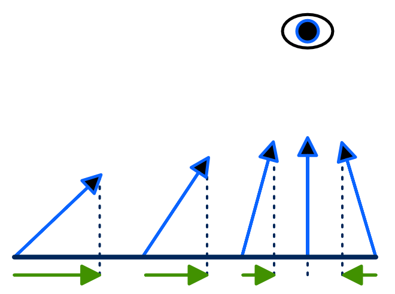 							Projected view directions used as UV offsets. 						

The effect of all of this is that the surface appears to get  pulled upwards in tangent space, appearing higher than it actually is,  based on the parallax strength.

<iframe src="https://gfycat.com/ifr/RingedSpectacularBlackbird"></iframe>

Shifting UV along projected view direction.

### Sliding Based on Height

At this point we can make the surface appear higher, but it's  still a uniform displacement. The next step is to use the parallax map  to scale the displacement. Sample the map, use its G channel as the  height, apply the parallax strength, and use that to modulate the  displacement.

```
		i.tangentViewDir = normalize(i.tangentViewDir);
		float height = tex2D(_ParallaxMap, i.uv.xy).g;
		height *= _ParallaxStrength;
		i.uv.xy += i.tangentViewDir.xy * height;
```

<iframe src="https://gfycat.com/ifr/BouncyFastKinglet"></iframe>

Shifting modulated by height.

Lows area now remain in place, while high areas get pulled  upwards. The standard shader offsets this effect, so low areas move  downward as well, while areas in the middle remain where they are. This  is done by subtracting ½ from the raw height data.

```
		float height = tex2D(_ParallaxMap, i.uv.xy).g;
		height -= 0.5;
		height *= _ParallaxStrength;
```

<iframe src="https://gfycat.com/ifr/SecretRecentBullmastiff"></iframe>

Parallax mapping at reasonable strength, and beyond.

This produces the parallax effect that we're looking for, but  it only works at low strength. The displacement quickly becomes too  great, ripping the surface apart.

### Correctly Projected Offsets

The parallax mapping technique that we're currently using is  known as parallax mapping with offset limiting. We're simply using the  XY part of the view direction, which has a maximum length of 1. Hence,  the texture offset is limited. The effect can give decent results, but  doesn't represent a correct perspective projection.

A more physically accurate way to calculate offsets would be to  treat the height field as a volume below the geometry surface, and  shoot a view ray though it. The ray is shot from the camera to the  surface, enters the height field volume from above, and continues until  it hits the surface defined by the field.

If the height field were uniformly zero, then the ray would  simply continue until it reaches the bottom of the volume. How far away  that is depends on the angle at which the ray entered the volume. It is  not limited. The shallower the angle, the further it goes. The most  extreme case is when the view angle approaches zero, which makes the ray  shoot towards infinity.

 							
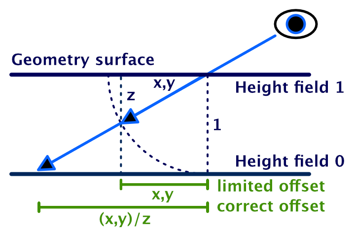 							Raycasting to the bottom, limited and correct. 						

To find the appropriate offset, we have to scale the view  direction vector so it's Z component becomes 1, which we do by dividing  it by its own Z component. As we don't need to use Z later, we only have  to divide X and Y by Z.

```
		i.tangentViewDir = normalize(i.tangentViewDir);
		i.tangentViewDir.xy /= i.tangentViewDir.z;
```

While this results in a more correct projection, it does worsen  the artifacts of our parallax effect for shallow view angles. The  standard shader alleviates this by adding a bias to the Z component,  which is 0.42, so it never gets close to zero. This warps the  perspective, but keeps the artifacts more manageable. Let's add this  bias as well.

```
		i.tangentViewDir.xy /= (i.tangentViewDir.z + 0.42);
```

 							
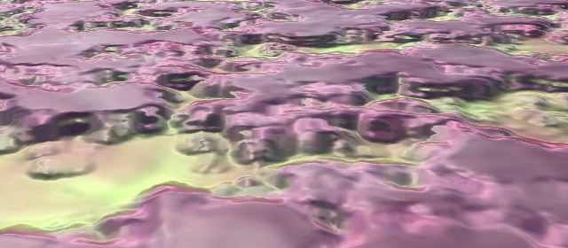 							Parallax mapping like the standard shader. 						

Our shader now support the same parallax effect as the standard  shader. While parallax mapping can be applied to any surface, the  projection assumes that the tangent space is uniform. Curved surfaces  have curved tangent spaces, so will produce physically incorrect  results. As long as the parallax strength and curvature are small, you  can get away with it.

 							
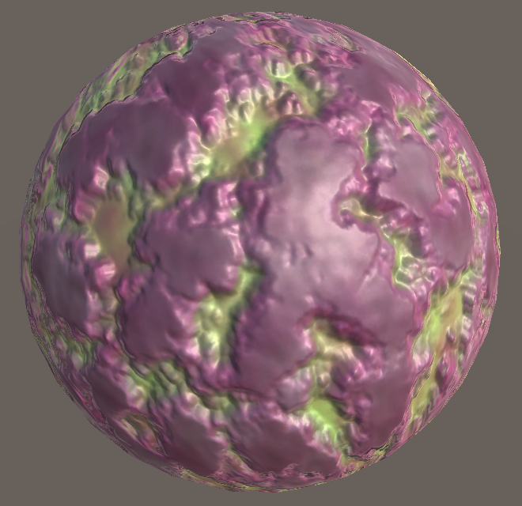 							Parallax mapping on a sphere. 						

Also, shadow coordinates are not influenced by this effect. As a  result, shadows can look weird in combination with strong parallax,  appearing to float above the surface.

 							
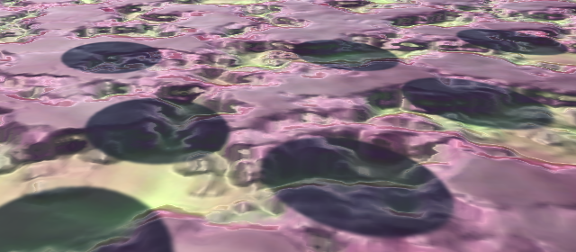 							Shadows unaffected by parallax mapping. 						

### Parallax Configuration

Do you agree with Unity's bias of 0.42? Would you like to use a  different value, or leave it at zero? Or would you like to use offset  limiting instead? Let's make it configurable!

When you want to use offset limiting, define `PARALLAX_OFFSET_LIMITING` in your shader. Otherwise, set which bias you want to use by defining `PARALLAX_BIAS`. Adjust `ApplyParallax` to make this possible.

```
void ApplyParallax (inout Interpolators i) {
	#if defined(_PARALLAX_MAP)
		i.tangentViewDir = normalize(i.tangentViewDir);
		#if !defined(PARALLAX_OFFSET_LIMITING)
			i.tangentViewDir.xy /= (i.tangentViewDir.z + PARALLAX_BIAS);
		#endif
		…
	#endif
}
```

Let's stick to the default bias of 0.42 when nothing is defined. We can do that by simply defining it in `ApplyParallax` when someone else hasn't. Note that macro definitions don't care about function scope, they're always global.

```
		#if !defined(PARALLAX_OFFSET_LIMITING)
			#if !defined(PARALLAX_BIAS)
				#define PARALLAX_BIAS 0.42
			#endif
			i.tangentViewDir.xy /= (i.tangentViewDir.z + PARALLAX_BIAS);
		#endif
```

Now we can fine-tune our parallax effect via the `CGINCLUDE` block in *My First Lighting Shader*. I added the options for no bias and offset-limiting, but turned them into comments to stick with the default options.

```
	CGINCLUDE

	#define BINORMAL_PER_FRAGMENT
	#define FOG_DISTANCE
	
//	#define PARALLAX_BIAS 0
//	#define PARALLAX_OFFSET_LIMITING

	ENDCG
```

### Detail UV

Parallax mapping works with the main maps, but we haven't taken  care of the secondary maps yet. We have to apply the texture coordinate  offset to the detail UV as well.

First, below is a detail map containing a grid pattern. It  makes it easy to verify whether the effect gets applied to the details  correctly.

 							
 							Detail grid texture. 						

Use this texture as the detail albedo map for our material. Set  the tiling of the secondary maps to 10×10. This reveals that the detail  UV are indeed still unaffected.

 							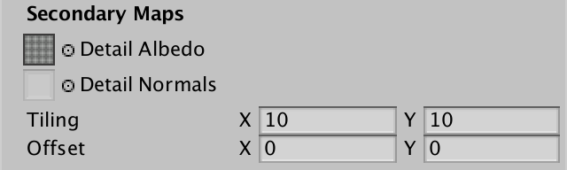
 							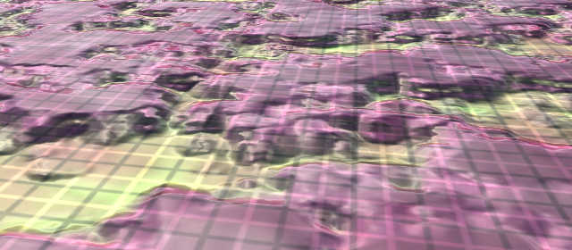 							Detail UV unaffected. 						

The standard shader simply also adds the UV offset to the  detail UV, which are stored in the ZW components of the UV interpolator.  Let's do the same.

```
		float height = tex2D(_ParallaxMap, i.uv.xy).g;
		height -= 0.5;
		height *= _ParallaxStrength;
		float2 uvOffset = i.tangentViewDir.xy * height;
		i.uv.xy += uvOffset;
		i.uv.zw += uvOffset;
```

The details might have changed a little, but they definitely do  not match the parallax effect yet. That's because we tile our secondary  maps. This scales the detail UV by 10, making the parallax offset ten  times too weak. We have to apply the detail tiling to the offset as  well. The standard shader does not take this into account.

```
		i.uv.zw += uvOffset * _DetailTex_ST.xy;
```

Actually, the scaling should be relative to the main UV tiling,  in case it's set to something else than 1×1. This ensures that it  always works.

```
		i.uv.zw += uvOffset * (_DetailTex_ST.xy / _MainTex_ST.xy);
```

 							
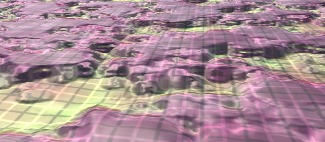 							Correct detail UV. 						

 							Shouldn't the offset be scaled by the main tiling as well? 							 						

unitypackage

## Raymarching

The idea is that our parallax effect works by shooting a view  ray thought the height volume and determining where it hits the surface.  It does this by sampling the height map only once, at the point where  the ray enters the volume. But when we're looking at an angle, this  doesn't tell us anything about the height where the ray actually  intersects the height field.

 						
 						Correct vs. guessed offset. 					

Our current approach assumes that the height at the entry point  is the same as the height at the intersection point. This is only  correct if the entry and intersection points actually have the same  height. It still works fairly well when the offset isn't large and the  height field doesn't vary too much. However, when the offset becomes too  large or the heights vary too quickly, we end up with a wild guess,  which is likely wrong. This is what causes the artifacts that rip the  surface apart.

If we can figure out where the ray actually hits the height  field, then we can we can always find the true visible surface point.  This cannot be done with a single texture sample. We'll have to move  along the view ray in small steps, sampling the height field each time,  until we reach the surface. This technique is known as raymarching.

 						
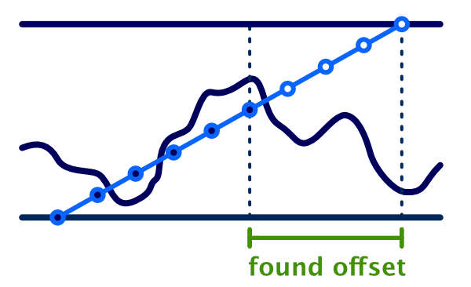 						Marching along the view ray. 					

There are various variants of parallax mapping that use raymarching. The most well-known are *Steep Parallax Mapping*, *Relief Mapping*, and *Parallax Occlusion Mapping*.  Their names don't tell you what they do exactly, but what they're  trying to achieve. Basically, it's tree ways to say the same thing. They  raymarch through a height field to create a better parallax effect,  compared to using a single texture sample. Besides that, they can apply  additional shading and techniques to improve the algorithm. I'll call it  out when what we're doing matches one of these approaches.

### Parallax Functions

The standard shader only supports simple offset parallax  mapping. We're now going to add support for parallax raymarching to our  own shader. But let's also keep supporting the simple approach. Both  will need to sample the height field, so put the sampling code line in a  separate `GetParallaxHeight` function. Also,  the projected view direction and the final application of the offset  will be the same for both approaches. So put the offset calculation in  its own function as well. It only requires the original UV coordinates  and processed view direction as parameters. Its result is the UV offset  to apply.

```
float GetParallaxHeight (float2 uv) {
	return tex2D(_ParallaxMap, uv).g;
}

float2 ParallaxOffset (float2 uv, float2 viewDir) {
	float height = GetParallaxHeight(uv);
	height -= 0.5;
	height *= _ParallaxStrength;
	return viewDir * height;
}
	
void ApplyParallax (inout Interpolators i) {
	#if defined(_PARALLAX_MAP)
		i.tangentViewDir = normalize(i.tangentViewDir);
		#if !defined(PARALLAX_OFFSET_LIMITING)
			#if !defined(PARALLAX_BIAS)
				#define PARALLAX_BIAS 0.42
			#endif
			i.tangentViewDir.xy /= (i.tangentViewDir.z + PARALLAX_BIAS);
		#endif
		
		float2 uvOffset = ParallaxOffset(i.uv.xy, i.tangentViewDir.xy);
		i.uv.xy += uvOffset;
		i.uv.zw += uvOffset * (_DetailTex_ST.xy / _MainTex_ST.xy);
	#endif
}
```

Now we'll make our parallax approach flexible by replacing the hard-coded invocation of `ParallaxOffset` with the `PARALLAX_FUNCTION` macro. If it hasn't been defined, we'll set it to use the offset approach.

```
void ApplyParallax (inout Interpolators i) {
	#if defined(_PARALLAX_MAP)
		…

		#if !defined(PARALLAX_FUNCTION)
			#define PARALLAX_FUNCTION ParallaxOffset
		#endif
		float2 uvOffset = PARALLAX_FUNCTION(i.uv.xy, i.tangentViewDir.xy);
		i.uv.xy += uvOffset;
		i.uv.zw += uvOffset * (_DetailTex_ST.xy / _MainTex_ST.xy);
	#endif
}
```

Create a new function for our raymarching approach. It has to match the behavior of `ParallaxOffset`, so give it the same parameters and return type. Initially it does nothing, returning a zero offset.

```
float2 ParallaxOffset (float2 uv, float2 viewDir) {
	…
}

float2 ParallaxRaymarching (float2 uv, float2 viewDir) {
	float2 uvOffset = 0;
	return uvOffset;
}
```

It is now possible to change the parallax approach in *My First Lighting Shader* by defining `PARALLAX_FUNCTION`. Set it to `ParallaxRaymarching`.

```
	#define PARALLAX_BIAS 0
//	#define PARALLAX_OFFSET_LIMITING
	#define PARALLAX_FUNCTION ParallaxRaymarching
```

### Stepping Through the Height Field

To find the point where the view ray hits the height field, we  have to sample multiple points on the ray and figure out where we end up  below the surface. The first sample point is at the top, where we enter  the height volume, like with the offset approach. The last sample point  would be where the ray hits the bottom of the volume. We'll add  additional sample points evenly spaced in between those end points.

Let's go with ten samples per ray. This means that we're going  to sample the height map ten times instead of just once, so this isn't a  cheap effect.

Because we use ten samples, our step size is 0.1. This is the  factor by which we move along the view ray, which becomes our UV delta.

```
float2 ParallaxRaymarching (float2 uv, float2 viewDir) {
	float2 uvOffset = 0;
	float stepSize = 0.1;
	float2 uvDelta = viewDir * stepSize;
	return uvOffset;
}
```

To apply the parallax strength, we could adjust the height we  sample each step. But scaling the UV delta has the same effect, which we  only need to do once.

```
	float2 uvDelta = viewDir * (stepSize * _ParallaxStrength);
```

By doing it this way, we can keep using 0–1 as the range of the  height field, regardless of the parallax strength. Thus, the height of  the first step on the ray is always 1. The height of the surface point  below or above it is defined by the height field.

```
	float stepSize = 0.1;
	float2 uvDelta = viewDir * (stepSize * _ParallaxStrength);

	float stepHeight = 1;
	float surfaceHeight = GetParallaxHeight(uv);
```

Now we have to iterate along the ray. Each step we'll increase  the UV offset by the UV delta. The view vector points towards the  camera, but we're moving towards the surface, so we actually have to  subtract the UV delta instead. Then we decrease the step height by the  step size. Then we sample the height map again. We keep doing this as  long as we stay above the surface, which is at most nine more times  after the first sample. We can use a `**while**` loop to program this.

```
	float stepHeight = 1;
	float surfaceHeight = GetParallaxHeight(uv);

	while (stepHeight > surfaceHeight) {
		uvOffset -= uvDelta;
		stepHeight -= stepSize;
		surfaceHeight = GetParallaxHeight(uv + uvOffset);
	}
```

When attempting to compile this, we get a shader compiler  warning and error. The warning tells us that there are gradient  instructions used in a loop. This refers to the texture sampling inside  our loop. The GPU has to figure out which mipmap level to use, for which  it needs to compare the used UV coordinates of adjacent fragments. It  can only do this when all fragments execute the same code. This is  impossible for our loop, because it can terminate early, which can  differ per fragment. So the compiler will unroll the loop, which means  that it will perform all nine steps all the time, regardless whether our  logic would suggest that we can stop earlier. Instead, it uses  deterministic logic to select the final result afterwards.

The compilation fails because the compiler cannot determine the  maximum number of iterations of our loop. It doesn't know that this is  at most nine. So let's make this explicit, by turning our `**while**` loop into a `**for**` loop that enforces a limit.

```
	for (int i = 1; i < 10 && stepHeight > surfaceHeight; i++) {
		uvOffset -= uvDelta;
		stepHeight -= stepSize;
		surfaceHeight = GetParallaxHeight(uv + uvOffset);
	}
```

 							
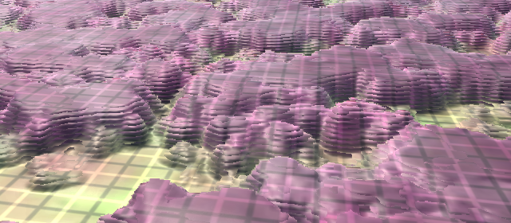 							Raymarching with 10 steps, no bias, no limiting. 						

 							Can the GPU use an actual loop? 							 						

The difference with the simple offset approach is obvious. The  parallax effect is much more pronounced. Higher areas now also correctly  block our view of lower areas behind them. And we also get obvious  layers, ten in total.

### Using More Steps

This basic raymarching approach best matches *Steep Parallax Mapping*.  The quality of the effect is determined by our sample resolution. Some  approaches use a variable amount of steps, based on the view angle. More  shallow angles require more steps, because the ray is longer. But we're  limited to a fixed amount of samples, so we won't do that.

The obvious way to increase the quality is by increasing the amount of samples, so let's make that configurable. Use `PARALLAX_RAYMARCHING_STEPS`, with a default of 10, instead of a fixed step size and iteration count.

```
float2 ParallaxRaymarching (float2 uv, float2 viewDir) {
	#if !defined(PARALLAX_RAYMARCHING_STEPS)
		#define PARALLAX_RAYMARCHING_STEPS 10
	#endif
	float2 uvOffset = 0;
	float stepSize = 1.0 / PARALLAX_RAYMARCHING_STEPS;
	float2 uvDelta = viewDir * (stepSize * _ParallaxStrength);

	float stepHeight = 1;
	float surfaceHeight = GetParallaxHeight(uv);

	for (
		int i = 1;
		i < PARALLAX_RAYMARCHING_STEPS && stepHeight > surfaceHeight;
		i++
	) {
		uvOffset -= uvDelta;
		stepHeight -= stepSize;
		surfaceHeight = GetParallaxHeight(uv + uvOffset);
	}

	return uvOffset;
}
```

Now we can control the step count in *My First Lighting Shader*. For really high quality, define `PARALLAX_RAYMARCHING_STEPS` as 100.

```
	#define PARALLAX_BIAS 0
//	#define PARALLAX_OFFSET_LIMITING
	#define PARALLAX_RAYMARCHING_STEPS 100
	#define PARALLAX_FUNCTION ParallaxRaymarching
```

 							
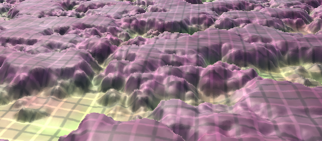 							Raymarching with 100 steps. 						

This gives us an idea of how good it can get, but is far too  expensive to use in general. So set the number of samples back to 10.  Still, we can see that the parallax effect can appear continuous and  smooth. However, silhouettes caused by parallax occlusion are always  aliased. MSAA doesn't get rid of that, because it only applies to the  edges of geometry, not texture effects. Post-processing anti-aliasing  techniques will work though, as long as they don't rely on the depth  buffer.

 							Can't we write to the depth buffer per fragment? 							 						

Our current approach is to step along the ray until we end up  at a point below the surface, or at the lowest possible point at the end  of the ray. We then use the UV offset for that point. But most likely  this point lies below the surface, which introduces an error. This is  what causes the surface to split into layers.

Increasing the number of steps simply decreases the maximum  error. Use enough steps, and the error becomes smaller that a visible  fragment, at which point we can no longer perceive it. So when a surface  is always seen from a distance, you can get away with fewer steps. The  closer you get, and the smaller your view angle, the more samples you  need.

 							
 							Errors dependent on sample resolution. 						

### Interpolating Between Layers

One way to improve the quality is by making an educated guess  about where the ray actually hit the surface. At one step we're above  the surface, and at the next step we're below it. Somewhere in between  those two steps the ray must have hit the surface.

The pairs of ray points and surface points define two line  segments. Because the ray and surface collided, these two lines cross.  So if we keep track of the previous step, we can perform a line-line  intersection after the loop. We could use this information to  approximate the true intersection point.

 							
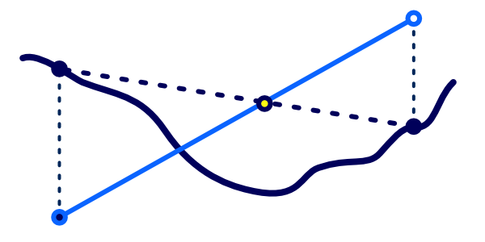 							Performing a line-line intersection. 						

We have to keep track of the previous UV offset, step height,  and surface height during the iteration process. Intially, these are  equal to those of the first sample, before the loop.

```
	float2 prevUVOffset = uvOffset;
	float prevStepHeight = stepHeight;
	float prevSurfaceHeight = surfaceHeight;

	for (
		…
	) {
		prevUVOffset = uvOffset;
		prevStepHeight = stepHeight;
		prevSurfaceHeight = surfaceHeight;
		
		…
	}
```

After the loop, we calculate where the lines intersect. We can use this to interpolate between the previous and last UV offset.

```
	for …

	float prevDifference = prevStepHeight - prevSurfaceHeight;
	float difference = surfaceHeight - stepHeight;
	float t = prevDifference / (prevDifference + difference);
	uvOffset = lerp(prevUVOffset, uvOffset, t);

	return uvOffset;
```

 							How does that math work? 							 						

Actually, in this case we can use the interpolator to scale the  UV offset that we have to add to the previous point. It boils down to  the same thing, just with less math.

```
	float t = prevDifference / (prevDifference - difference);
	uvOffset = prevUVOffset - uvDelta * t;
```

 							
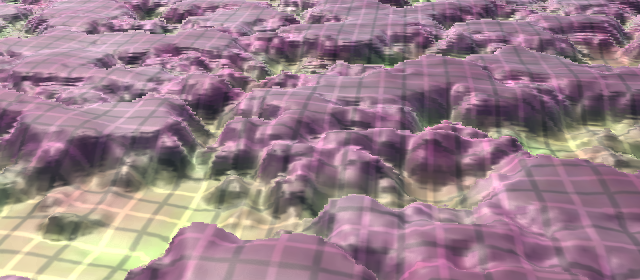 							10 steps plus interpolation. 						

The result looks a lot better. We now assume that the surface  is linear in between sample points, which prevents the most obvious  stratification artifacts. However, it cannot help us detect when we miss  an intersection in between steps. We still need many samples to deal  with small features, silhouettes, and shallow angles.

With this trick, our approach resembles *Parallax Occlusion Mapping*. While it is a relatively cheap improvement, let's make it optional anyway, via the definition of `PARALLAX_RAYMARCHING_INTERPOLATE`.

```
	#if defined(PARALLAX_RAYMARCHING_INTERPOLATE)
		float prevDifference = prevStepHeight - prevSurfaceHeight;
		float difference = surfaceHeight - stepHeight;
		float t = prevDifference / (prevDifference + difference);
		uvOffset = prevUVOffset - uvDelta * t;
	#endif
```

Define `PARALLAX_RAYMARCHING_INTERPOLATE` in *My First Lighting Shader* to use it.

```
	#define PARALLAX_BIAS 0
//	#define PARALLAX_OFFSET_LIMITING
	#define PARALLAX_RAYMARCHING_STEPS 10
	#define PARALLAX_RAYMARCHING_INTERPOLATE
	#define PARALLAX_FUNCTION ParallaxRaymarching
```

### Searching Between Layers

By linearly interpolating between two steps, we assume that the  surface is straight in between them. However, this will often not be  the case. To better deal with irregular height fields, we'll have to  search for the actual intersection point in between the two steps. Or at  least get closer to it.

After finishing the loop, instead of using the last offset,  adjust the offset to halfway between the last two steps. Sample the  height at that point. If we end up below the surface, move a quarter of  the offset back to the previous point and sample again. If instead we  ended up above the surface, move a quarter forward to the last point and  sample again. Do the same thing again, but this time move one eight of  the way. Keep repeating this process until you are satisfied.

 							
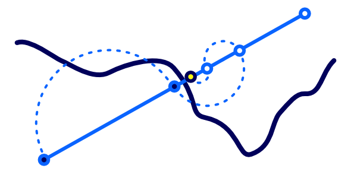 							Getting closer to the intersection point. 						

The above approach is an application of binary search. It best matches the *Relief Mapping*  approach. Each step the covered distance halves, until the destination  is reached. In our case, we'll simply do this a fixed number of times,  arrived at a desired resolution. With one step, we always end up halfway  between the last two points, at 0.5. With two steps, we end up at  either 0.25 or 0.75. With three steps, it's 0.125, 0.375, 0.625, or  0.875. And so on. Note that, starting at the second step, the effective  resolution doubles per sample.

To control whether this approach is used, let's define `PARALLAX_RAYMARCHING_SEARCH_STEPS`.  Make it zero by default, which means that we do not search at all. If  it's defined higher than zero, we'll have to use another loop. Note that  this approach is incompatible with `PARALLAX_RAYMARCHING_INTERPOLATE`,  because we can no longer guarantee that the surface is crossed between  the last two steps. So when we're searching, disable interpolation.

```
	for …

	#if !defined(PARALLAX_RAYMARCHING_SEARCH_STEPS)
		#define PARALLAX_RAYMARCHING_SEARCH_STEPS 0
	#endif
	#if PARALLAX_RAYMARCHING_SEARCH_STEPS > 0
		for (int i = 0; i < PARALLAX_RAYMARCHING_SEARCH_STEPS; i++) {
		}
	#elif defined(PARALLAX_RAYMARCHING_INTERPOLATE)
		float prevDifference = prevStepHeight - prevSurfaceHeight;
		float difference = surfaceHeight - stepHeight;
		float t = prevDifference / (prevDifference + difference);
		uvOffset = prevUVOffset - uvDelta * t;
	#endif
```

This loop also performs the same basic work as the original  one. Adjust the offset and step height, then sample the height field.

```
		for (int i = 0; i < PARALLAX_RAYMARCHING_SEARCH_STEPS; i++) {
			uvOffset -= uvDelta;
			stepHeight -= stepSize;
			surfaceHeight = GetParallaxHeight(uv + uvOffset);
		}
```

But the UV delta and step size are halved each iteration.

```
		for (int i = 0; i < PARALLAX_RAYMARCHING_SEARCH_STEPS; i++) {
			uvDelta *= 0.5;
			stepSize *= 0.5;

			uvOffset -= uvDelta;
			stepHeight -= stepSize;
			surfaceHeight = GetParallaxHeight(uv + uvOffset);
		}
```

Also, if we're below the surface, we have to move in the opposite direction.

```
			uvDelta *= 0.5;
			stepSize *= 0.5;

			if (stepHeight < surfaceHeight) {
				uvOffset += uvDelta;
				stepHeight += stepSize;
			}
			else {
				uvOffset -= uvDelta;
				stepHeight -= stepSize;
			}
			surfaceHeight = GetParallaxHeight(uv + uvOffset);
```

Let's adjust *My First Lighting Shader* so it uses three search steps and see what that looks like.

```
	#define PARALLAX_BIAS 0
//	#define PARALLAX_OFFSET_LIMITING
	#define PARALLAX_RAYMARCHING_STEPS 10
	#define PARALLAX_RAYMARCHING_INTERPOLATE
	#define PARALLAX_RAYMARCHING_SEARCH_STEPS 3
	#define PARALLAX_FUNCTION ParallaxRaymarching
```

 							
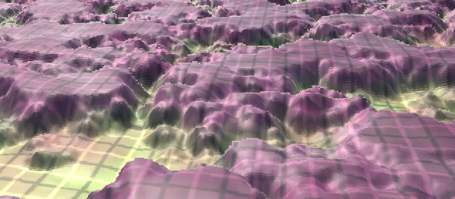 							10 steps plus 3 binary search steps. 						

The results look pretty good, though still not perfect. Binary  search can deal better with shallow angles than simple interpolation,  but you still need quite a few search steps to get rid of  stratification. So it's a matter of experimenting to find out which  approach works best in a specific case and how many steps are needed.

### Scaled Objects and Dynamic Batching

While our parallax mapping approach appears to work, there is a  hidden bug. It manifests when dynamic batching is used to combine  objects that are scaled. For example, give our quad a scale like (10,  10, 10) and duplicate it, moving the copy a little below it. This will  trigger Unity to dynamically batch the quads, assuming that this option  is enabled in the player settings.

When batching kicks in, the parallax effect will become warped.  This is very obvious when rotating the camera. However, this only  happens in the game view – and builds – not in the scene view. Note that  the standard shader has this problem as well, but you might not  immediately notice it when using a weak offset parallax effect.

 							
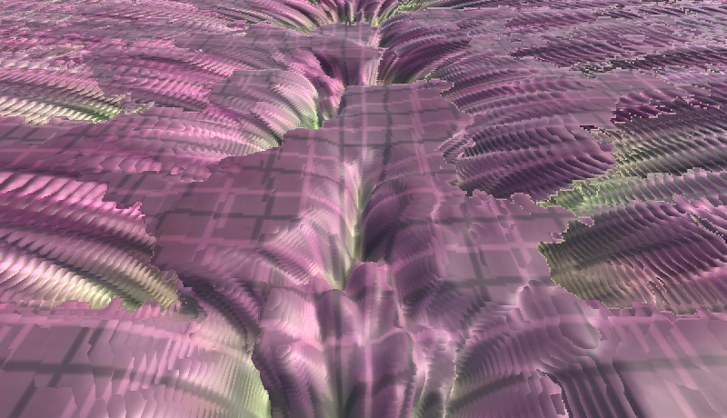 							Dynamic batching produces weird results. 						

The problem is that Unity doesn't normalize the normal and  tangent vectors of batched geometry, after combining them in a single  mesh. So the assumption that the vertex data is correct no longer holds.

 							Why doesn't Unity normalize these vectors? 							 						

That the vertex normal and tangent vectors aren't normalized is  only an issue for us because we're transforming the view vector to  tangent space in the vertex program. For everything else, the data gets  normalized before use.

The solution is to normalize the vectors before we construct  the object-to-tangent matrix. Because this is only required for scaled  geometry that gets dynamically batched, let's make it optional,  depending on whether `PARALLAX_SUPPORT_SCALED_DYNAMIC_BATCHING` is defined.

```
	#if defined (_PARALLAX_MAP)
		#if defined(PARALLAX_SUPPORT_SCALED_DYNAMIC_BATCHING)
			v.tangent.xyz = normalize(v.tangent.xyz);
			v.normal = normalize(v.normal);
		#endif
		float3x3 objectToTangent = float3x3(
			v.tangent.xyz,
			cross(v.normal, v.tangent.xyz) * v.tangent.w,
			v.normal
		);
		i.tangentViewDir = mul(objectToTangent, ObjSpaceViewDir(v.vertex));
	#endif
```

Now we can make *My First Lighting Shader* dynamic-batching proof.

```
	#define PARALLAX_BIAS 0
//	#define PARALLAX_OFFSET_LIMITING
	#define PARALLAX_RAYMARCHING_STEPS 10
	#define PARALLAX_RAYMARCHING_INTERPOLATE
	#define PARALLAX_RAYMARCHING_SEARCH_STEPS 3
	#define PARALLAX_FUNCTION ParallaxRaymarching
	#define PARALLAX_SUPPORT_SCALED_DYNAMIC_BATCHING
```

 							
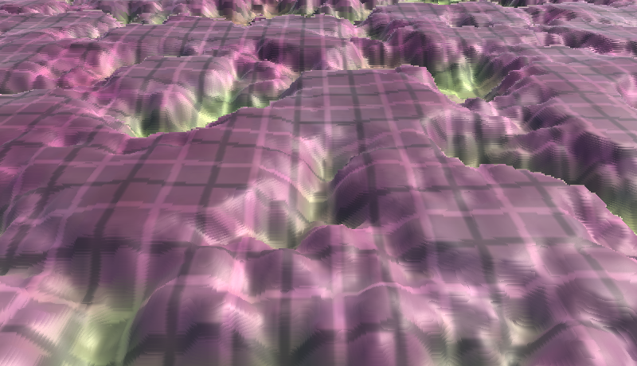 							Dynamic batching with correct results. 						

This concludes the Rendering tutorial series. You now have a  good idea of how Unity's rendering pipeline works and how the standard  shader does its thing. From here, we can move on to more advanced  rendering and shading techniques, like the [Flat and Wireframe Shading](https://catlikecoding.com/unity/tutorials/advanced-rendering/flat-and-wireframe-shading/) tutorial.

unitypackage

PDF
